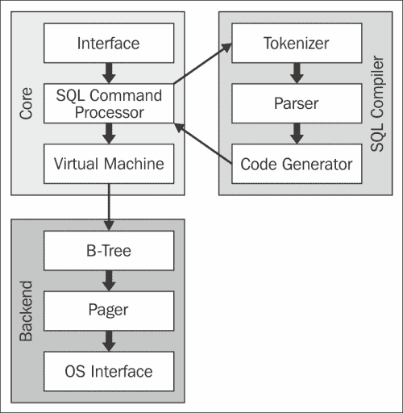

# 第一章 进入 SQLite

SQLite 的架构师和主要作者 Richard Hipp 博士在他 2007 年 6 月接受《卫报》采访时解释了一切是如何开始的：

> “我是在 2000 年 5 月 29 日开始的。现在已经七年多了，”他说。他当时正在做一个项目，使用了一个数据库服务器，但数据库不时会离线。“然后我的程序会出错，说数据库不工作了，我就因此受到指责。所以我说，这个数据库对我的应用来说并不是一个很苛刻的要求，为什么我不直接和磁盘对话，然后以这种方式构建一个 SQL 数据库引擎呢？就是这样开始的。”

在我们开始探索 Android 环境中的 SQLite 之旅之前，我们想要告诉您一些先决条件。以下是非常基本的要求，您需要付出很少的努力：

+   您需要确保 Android 应用程序构建的环境已经就位。当我们说“环境”时，我们指的是 JDK 和 Eclipse 的组合，我们的 IDE 选择，ADT 插件和 Android SDK 工具。如果这些还没有就位，ADT 捆绑包中包含了 IDE、ADT 插件、Android SDK 工具和平台工具，可以从[`developer.android.com/sdk/index.html`](http://developer.android.com/sdk/index.html)下载。链接中提到的步骤非常易懂。对于 JDK，您可以访问 Oracle 的网站下载最新版本并在[`www.oracle.com/technetwork/java/javase/downloads/index.html`](http://www.oracle.com/technetwork/java/javase/downloads/index.html)设置它。

+   您需要对 Android 组件有基本的了解，并且在 Android 模拟器上运行过不止“Hello World”程序。如果没有，Android 开发者网站上有一个非常合适的指南来设置模拟器。我们建议您熟悉基本的 Android 组件：Intent、Service、Content Providers 和 Broadcast Receiver。Android 开发者网站上有很好的示例库和文档。其中一些如下：

+   模拟器：[`developer.android.com/tools/devices/index.html`](http://developer.android.com/tools/devices/index.html)

+   Android 基础：[`developer.android.com/training/basics/firstapp/index.html`](http://developer.android.com/training/basics/firstapp/index.html)

有了这些准备，我们现在可以开始探索 SQLite 了。

在这一章中，我们将涵盖以下内容：

+   为什么选择 SQLite？

+   SQLite 的架构

+   数据库基础知识快速回顾

+   Android 中的 SQLite

# 为什么选择 SQLite？

SQLite 是一个嵌入式 SQL 数据库引擎。它被广泛应用于诸如 Adobe 集成运行时（AIR）中的 Adobe、空中客车公司的飞行软件、Python 等知名公司。在移动领域，由于其轻量级的特性，SQLite 是各种平台上非常受欢迎的选择。苹果在 iPhone 中使用它，谷歌在 Android 操作系统中使用它。

它被用作应用程序文件格式，电子设备的数据库，网站的数据库，以及企业关系数据库管理系统。是什么让 SQLite 成为这些以及许多其他公司的如此有趣的选择呢？让我们更仔细地看看 SQLite 的特点，看看它为什么如此受欢迎：

+   零配置：SQLite 被设计成不需要配置文件。它不需要安装步骤或初始设置；它没有运行服务器进程，即使它崩溃也不需要恢复步骤。它没有服务器，直接嵌入在我们的应用程序中。此外，不需要管理员来创建或维护数据库实例，或者为用户设置权限。简而言之，这是一个真正无需 DBA 的数据库。

+   无版权：SQLite 不是以许可证而是以祝福的形式提供。SQLite 的源代码是公有领域的；您可以自由修改、分发，甚至出售代码。甚至贡献者也被要求签署一份声明，以保护免受未来可能发生的任何版权纠纷的影响。

+   **跨平台**: 一个系统的数据库文件可以轻松地移动到运行不同架构的系统上。这是可能的，因为数据库文件格式是二进制的，所有的机器都使用相同的格式。在接下来的章节中，我们将从 Android 模拟器中提取数据库到 Windows。

+   **紧凑**: 一个 SQLite 数据库是一个普通的磁盘文件；它没有服务器，被设计成轻量级和简单。这些特性导致了一个非常轻量级的数据库引擎。与其他 SQL 数据库引擎相比，SQLite Version 3.7.8 的占用空间小于 350 KiB（kibibyte）。

+   **防错**: 代码库有很好的注释，易于理解，而且是模块化的。SQLite 中的测试用例和测试脚本的代码量大约是 SQLite 库源代码的 1084 倍，他们声称测试覆盖了 100%的分支。这种级别的测试重新确立了开发者对 SQLite 的信心。

### 注意

有兴趣的读者可以在维基百科上阅读更多关于分支测试覆盖的信息，网址为[`en.wikipedia.org/wiki/Code_coverage`](http://en.wikipedia.org/wiki/Code_coverage)。

# SQLite 架构

核心、SQL 编译器、后端和数据库构成了 SQLite 的架构：



## SQLite 接口

根据文档，在 SQLite 库堆栈的顶部，大部分公共接口是由`wen.c`，`legacy.c`和`vdbeapi.c`源文件实现的。这是其他程序和脚本的通信点。

## SQL 编译器

分词器将从接口传递的 SQL 字符串分解为标记，并逐个将标记传递给解析器。分词器是用 C 手工编码的。SQLite 的解析器是由 Lemon 解析器生成器生成的。它比 YACC 和 Bison 更快，同时是线程安全的，并防止内存泄漏。解析器从分词器传递的标记构建解析树，并将树传递给代码生成器。生成器从输入生成虚拟机代码，并将其作为可执行文件传递给虚拟机。有关 Lemon 解析器生成器的更多信息，请访问[`en.wikipedia.org/wiki/Lemon_Parser_Generator`](http://en.wikipedia.org/wiki/Lemon_Parser_Generator)。

## 虚拟机

虚拟机，也被称为**虚拟数据库引擎**（**VDBE**），是 SQLite 的核心。它负责从数据库中获取和更改值。它执行代码生成器生成的程序来操作数据库文件。每个 SQL 语句首先被转换为 VDBE 的虚拟机语言。VDBE 的每个指令都包含一个操作码和最多三个附加操作数。

## SQLite 后端

B 树，连同 Pager 和 OS 接口，形成了 SQLite 架构的后端。B 树用于组织数据。Pager 则通过缓存、修改和回滚数据来辅助 B 树。当需要时，B 树会从缓存中请求特定的页面；这个请求由 Pager 以高效可靠的方式处理。OS 接口提供了一个抽象层，可以移植到不同的操作系统。它隐藏了与不同操作系统通信的不必要细节，由 SQLite 调用代表 SQLite 处理。

这些是 SQLite 的内部，Android 应用程序开发者不需要担心 Android 的内部，因为 SQLite Android 库有效地使用了抽象的概念，所有的复杂性都被隐藏起来。只需要掌握提供的 API，就可以满足在 Android 应用程序中使用 SQLite 的所有可能的用例。

# 数据库基础知识的快速回顾

数据库，简单来说，是一种有序的持续存储数据的方式。数据保存在表中。表由不同数据类型的列组成。表中的每一行对应一个数据记录。您可以将表想象成 Excel 电子表格。从面向对象编程的角度来看，数据库中的每个表通常描述一个对象（由类表示）。每个表列举了一个类属性。表中的每条记录表示该对象的特定实例。

让我们看一个快速的例子。假设您有一个名为`Shop`的数据库，其中有一个名为`Inventory`的表。这个表可以用来存储商店中所有产品的信息。`Inventory`表可能包含这些列：`产品名称`（字符串）、`产品 ID`（数字）、`成本`（数字）、`库存`（0/1）和`可用数量`（数字）。然后，您可以向数据库中添加一个名为`鞋子`的产品记录：

| ID | 产品名称 | 产品 ID | 成本 | 库存 | 可用数量 |
| --- | --- | --- | --- | --- | --- |
| 1 | 地毯 | 340023 | 2310 | 1 | 4 |
| 2 | 鞋子 | 231257 | 235 | 1 | 2 |

数据库中的数据应该经过检查和影响。表中的数据可以如下所示：

+   使用`INSERT`命令添加

+   使用`UPDATE`命令修改

+   使用`DELETE`命令删除

您可以通过使用所谓的**查询**在数据库中搜索特定数据。查询（使用`SELECT`命令）可以涉及一个表，或多个表。要生成查询，必须使用 SQL 命令确定感兴趣的表、数据列和数据值。每个 SQL 命令都以分号（`;`）结尾。

## 什么是 SQLite 语句？

SQLite 语句是用 SQL 编写的，用于从数据库中检索数据或创建、插入、更新或删除数据库中的数据。

所有 SQLite 语句都以关键字之一开头：`SELECT`、`INSERT`、`UPDATE`、`DELETE`、`ALTER`、`DROP`等，所有语句都以分号（`;`）结尾。例如：

```kt
CREATE TABLE table_name (column_name INTEGER);
```

`CREATE TABLE`命令用于在 SQLite 数据库中创建新表。`CREATE TABLE`命令描述了正在创建的新表的以下属性：

+   新表的名称。

+   创建新表的数据库。表可以在主数据库、临时数据库或任何已连接的数据库中生成。

+   表中每列的名称。

+   表中每列的声明类型。

+   表中每列的默认值或表达式。

+   每列使用的默认关系序列。

+   最好为表设置一个`PRIMARY KEY`。这将支持单列和复合（多列）主键。

+   每个表的一组 SQL 约束。支持`UNIQUE`、`NOT NULL`、`CHECK`和`FOREIGN KEY`等约束。

+   在某些情况下，表将是`WITHOUT ROWID`表。

以下是一个创建表的简单 SQLite 语句：

```kt
String databaseTable =   "CREATE TABLE " 
   + TABLE_CONTACTS +"(" 
   + KEY_ID  
   + " INTEGER PRIMARY KEY,"
   + KEY_NAME + " TEXT,"
   + KEY_NUMBER + " INTEGER"
   + ")";
```

在这里，`CREATE TABLE`是创建一个名为`TABLE_CONTACTS`的表的命令。`KEY_ID`、`KEY_NAME`和`KEY_NUMBER`是列 ID。SQLite 要求为每个列提供唯一 ID。`INTEGER`和`TEXT`是与相应列关联的数据类型。SQLite 要求在创建表时定义要存储在列中的数据类型。`PRIMARY KEY`是数据列的**约束**（对表中的数据列强制执行的规则）。

SQLite 支持更多的属性，可用于创建表，例如，让我们创建一个`create table`语句，为空列输入默认值。请注意，对于`KEY_NAME`，我们提供了一个默认值`xyz`，对于`KEY_NUMBER`列，我们提供了一个默认值`100`：

```kt
String databaseTable = 
   "CREATE TABLE " 
   + TABLE_CONTACTS  + "(" 
   + KEY_ID    + " INTEGER PRIMARY KEY,"

   + KEY_NAME + " TEXT DEFAULT  xyz,"

   + KEY_NUMBER + " INTEGER DEFAULT 100" + ")";
```

在这里，当在数据库中插入一行时，这些列将以`CREATE` SQL 语句中定义的默认值进行预初始化。

还有更多的关键字，但我们不想让你因为一个庞大的列表而感到无聊。我们将在后续章节中介绍其他关键字。

## SQLite 语法

SQLite 遵循一组称为**语法**的独特规则和指南。

需要注意的一点是，SQLite 是**不区分大小写**的，但有一些命令是区分大小写的，例如，在 SQLite 中，`GLOB`和`glob`具有不同的含义。让我们以 SQLite `DELETE`语句的语法为例。尽管我们使用了大写字母，但用小写字母替换它们也可以正常工作：

```kt
DELETE FROM table WHERE {condition};
```

## SQLite 中的数据类型

SQLite 使用动态和弱类型的 SQL 语法，而大多数 SQL 数据库使用静态、严格的类型。如果我们看其他语言，Java 是一种静态类型语言，Python 是一种动态类型语言。那么当我们说动态或静态时，我们是什么意思呢？让我们看一个例子：

```kt
a=5
a="android"
```

在静态类型的语言中，这将引发异常，而在动态类型的语言中，它将起作用。在 SQLite 中，值的数据类型与其容器无关，而与值本身相关。当处理静态类型系统时，这不是一个问题，其中值由容器确定。这是因为 SQLite 向后兼容更常见的静态类型系统。因此，我们用于静态系统的 SQL 语句可以在这里无缝使用。

### 存储类

在 SQLite 中，我们有比数据类型更一般的**存储**类。在内部，SQLite 以五种存储类存储数据，也可以称为**原始数据类型**：

+   `NULL`：这代表数据库中的缺失值。

+   `INTEGER`：这支持带符号整数的范围，从 1、2、3、4、6 或 8 个字节，取决于值的大小。SQLite 会根据值的大小自动处理这一点。在内存中处理时，它们会被转换为最一般的 8 字节带符号整数形式。

+   `REAL`：这是一个浮点值，SQLite 使用它作为 8 字节 IEEE 浮点数来存储这些值。

+   `TEXT`：SQLite 支持各种字符编码，如 UTF-8、UTF-16BE 或 UTF-16LE。这个值是一个文本字符串。

+   `BLOB`：这种类型存储了一个大的二进制数据数组，就像输入时提供的那样。

SQLite 本身不验证写入列的类型是否实际上是定义的类型，例如，您可以将整数写入字符串列，反之亦然。我们甚至可以有一个单独的列具有不同的存储类：

```kt
 id                   col_t
------               ------
1                       23
2                     NULL
3                     test
```

### 布尔数据类型

SQLite 没有单独的布尔存储类，而是使用`Integer`类来实现这一目的。整数`0`表示假状态，而`1`表示真状态。这意味着 SQLite 间接支持布尔类型，我们只能创建布尔类型的列。问题是，它不包含熟悉的`TRUE`/`FALSE`值。

### 日期和时间数据类型

就像我们在布尔数据类型中看到的那样，在 SQLite 中没有日期和时间数据类型的存储类。SQLite 有五个内置的日期和时间函数来帮助我们处理它；我们可以将日期和时间用作整数、文本或实数值。此外，这些值是可互换的，取决于应用程序的需要。例如，要计算当前日期，请使用以下代码：

```kt
SELECT date('now');
```

# Android 中的 SQLite

Android 软件堆栈由核心 Linux 内核、Android 运行时、支持 Android 框架的 Android 库以及最终运行在所有这些之上的 Android 应用程序组成。Android 运行时使用**Dalvik 虚拟机**（**DVM**）来执行 dex 代码。在较新的 Android 版本中，即从 KitKat（4.4）开始，Android 启用了一个名为**ART**的实验性功能，它最终将取代 DVM。它基于**Ahead of Time**（**AOT**），而 DVM 基于**Just in Time**（**JIT**）。在下图中，我们可以看到 SQLite 提供了本地数据库支持，并且是支持应用程序框架的库的一部分，还有诸如 SSL、OpenGL ES、WebKit 等库。这些用 C/C++编写的库在 Linux 内核上运行，并与 Android 运行时一起构成了应用程序框架的支撑，如下图所示：


在我们开始探索 Android 中的 SQLite 之前，让我们先看看 Android 中的其他持久存储替代方案：

+   **共享偏好**：数据以键值对的形式存储在共享偏好中。文件本身是一个包含键值对的 XML 文件。该文件位于应用程序的内部存储中，可以根据需要进行公共或私有访问。Android 提供了 API 来写入和读取共享偏好。建议在需要保存少量此类数据时使用此功能。一个常见的例子是保存 PDF 中的最后阅读位置，或者保存用户的偏好以显示评分框。

+   **内部/外部存储**：这个术语可能有点误导；Android 定义了两个存储空间来保存文件。在一些设备上，你可能会有一个外部存储设备，比如 SD 卡，而在其他设备上，你会发现系统将其内存分成两部分，分别标记为内部和外部。可以使用 Android API 获取外部和内部存储的路径。默认情况下，内部存储是有限的，只能被应用程序访问，而外部存储可能可用，也可能不可用，具体取决于是否已挂载。

### 提示

`android:installLocation`可以在清单中使用，指定应用程序的内部/外部安装位置。

## SQLite 版本

从 API 级别 1 开始，Android 就内置了 SQLite。在撰写本书时，当前版本的 SQLite 是 3.8.4.1。根据文档，SQLite 的版本是 3.4.0，但已知不同的 Android 版本会内置不同版本的 SQLite。我们可以通过 Android SDK 安装文件夹内的`platform-tools`文件夹中的名为**SQLite3**的工具以及 Android 模拟器轻松验证这一点。

```kt
adb shell SQLite3 --version
SQLite 3.7.11: API 16 - 19
SQLite 3.7.4: API 11 - 15
SQLite 3.6.22: API 8 - 10
SQLite 3.5.9: API 3 - 7

```

我们不需要担心 SQLite 的不同版本，应该坚持使用 3.5.9 以确保兼容性，或者我们可以按照 API 14 是新的`minSdkVersion`的说法，并将其切换为 3.7.4。除非你有特定于某个版本的需求，否则这几乎不重要。

### 注意

一些额外方便的 SQLite3 命令如下：

+   `.dump`：打印表的内容

+   `.schema`：打印现有表的`SQL CREATE`语句

+   `.help`：获取指令

## 数据库包

`android.database`包含了所有与数据库操作相关的必要类。`android.database.SQLite`包含了特定于 SQLite 的类。

### API

Android 提供了各种 API 来创建、访问、修改和删除数据库。完整的列表可能会让人感到不知所措；为了简洁起见，我们将介绍最重要和最常用的 API。

### SQLiteOpenHelper 类

`SQLiteOpenHelper`类是 Android 中用于处理 SQLite 数据库的第一个和最重要的类；它位于`android.database.SQLite`命名空间中。`SQLiteOpenHelper`是一个辅助类，旨在进行扩展，并在创建、打开和使用数据库时实现您认为重要的任务和操作。这个辅助类由 Android 框架提供，用于处理 SQLite 数据库，并帮助管理数据库的创建和版本管理。操作方式是扩展该类，并根据我们的应用程序的要求实现任务和操作。`SQLiteOpenHelper`有以下定义的构造函数：

```kt
SQLiteOpenHelper(Context context, String name, SQLiteDatabase.CursorFactory factory, int version)

SQLiteOpenHelper(Context context, String name, SQLiteDatabase.CursorFactory factory, int version, DatabaseErrorHandler errorHandler)
```

应用程序上下文允许访问应用程序的所有共享资源和资产。`name`参数包括 Android 存储中的数据库文件名。`SQLiteDatabase.CursorFactory`是一个工厂类，用于创建光标对象，充当针对 Android 下 SQLite 应用的所有查询的输出集。数据库的应用程序特定版本号将是版本参数（或更确切地说，它的模式）。

`SQLiteOpenHelper`的构造函数用于创建一个帮助对象来创建、打开或管理数据库。**context**是允许访问所有共享资源和资产的应用程序上下文。`name`参数要么包含数据库的名称，要么为内存中的数据库为 null。`SQLiteDatabase.CursorFactory`工厂创建一个光标对象，充当所有查询的结果集。`version`参数定义了数据库的版本号，并用于升级/降级数据库。第二个构造函数中的`errorHandler`参数在 SQLite 报告数据库损坏时使用。

如果我们的数据库版本号不是默认的`1`，`SQLiteOpenHelper`将触发其`onUpgrade()`方法。`SQLiteOpenHelper`类的重要方法如下：

+   `synchronized void close()`

+   `synchronized SQLiteDatabase getReadableDatabase()`

+   `synchronized SQLiteDatabase getWritableDatabase()`

+   `abstract void onCreate(SQLiteDatabase db)`

+   `void onOpen(SQLiteDatabase db)`

+   `abstract void onUpgrade(SQLiteDatabase db, int oldVersion, int newVersion)`

同步的`close()`方法关闭任何打开的数据库对象。`synchronized`关键字可以防止线程和内存一致性错误。

接下来的两个方法`getReadableDatabase()`和`getWriteableDatabase()`是实际创建或打开数据库的方法。两者都返回相同的`SQLiteDatabase`对象；不同之处在于`getReadableDatabase()`在无法返回可写数据库时将返回可读数据库，而`getWriteableDatabase()`返回可写数据库对象。如果无法打开数据库进行写操作，`getWriteableDatabase()`方法将抛出`SQLiteException`。对于`getReadableDatabase()`，如果无法打开数据库，它将抛出相同的异常。

我们可以使用`SQLiteDatabase`类的`isReadOnly()`方法来了解数据库的状态。对于只读数据库，它返回`true`。

调用这两个方法中的任何一个将在数据库尚不存在时调用`onCreate()`方法。否则，它将调用`onOpen()`或`onUpgrade()`方法，具体取决于版本号。`onOpen()`方法应在更新数据库之前检查`isReadOnly()`方法。一旦打开，数据库将被缓存以提高性能。最后，我们需要调用`close()`方法来关闭数据库对象。

`onCreate()`、`onOpen()`和`onUpgrade()`方法是为了子类实现预期行为。当数据库第一次创建时，将调用`onCreate()`方法。这是我们使用 SQLite 语句创建表的地方，这些语句在前面的示例中已经看到了。当数据库已经配置并且数据库模式已经根据需要创建、升级或降级时，将触发`onOpen()`方法。在这里应该使用`isReadOnly()`方法检查读/写状态。

当数据库需要根据提供的版本号进行升级时，将调用`onUpgrade()`方法。默认情况下，数据库版本是`1`，随着我们增加数据库版本号并发布新版本，将执行升级。

本章的代码包中包含了一个演示 SQLiteOpenHelper 类的简单示例；我们将用它进行解释：

```kt
class SQLiteHelperClass
    {
    ...
    ...
    public static final int VERSION_NUMBER = 1;

    sqlHelper =
       new SQLiteOpenHelper(context, "ContactDatabase", null,
      VERSION_NUMBER)
    {

      @Override
      public void onUpgrade(SQLiteDatabase db,   
            int oldVersion, int newVersion) 
      {

        //drop table on upgrade
        db.execSQL("DROP TABLE IF EXISTS " 
                + TABLE_CONTACTS);
        // Create tables again
        onCreate(db);

      }

   @Override
   public void onCreate(SQLiteDatabase db)
   {
      // creating table during onCreate
      String createContactsTable = 
 "CREATE TABLE "
 + TABLE_CONTACTS + "(" 
 + KEY_ID + " INTEGER PRIMARY KEY," 
 + KEY_NAME + " TEXT,"
 + KEY_NUMBER + " INTEGER" + ")";

        try {
       db.execSQL(createContactsTable);
        } catch(SQLException e) {
          e.printStackTrace();
        }
   }

   @Override
   public synchronized void close()
   {
      super.close();
      Log.d("TAG", "Database closed");
   }

   @Override
   public void onOpen(SQLiteDatabase db)
   {
         super.onOpen(db);
         Log.d("TAG", "Database opened");
   }

};

...
... 

//open the database in read-only mode
SQLiteDatabase db = SQLiteOpenHelper.getWritableDatabase();

...
...

//open the database in read/write mode
SQLiteDatabase db = SQLiteOpenHelper.getWritableDatabase();
```

### 提示

**下载示例代码**

您可以从您在[`www.packtpub.com`](http://www.packtpub.com)的帐户中购买的所有 Packt 图书的示例代码文件。如果您在其他地方购买了本书，您可以访问[`www.packtpub.com/support`](http://www.packtpub.com/support)并注册，直接将文件发送到您的电子邮件。

### SQLiteDatabase 类

现在您已经熟悉了在 Android 中启动 SQLite 数据库使用的辅助类，是时候看看核心的`SQLiteDatabase`类了。`SQLiteDatabase`是在 Android 中使用 SQLite 数据库所需的基类，并提供了打开、查询、更新和关闭数据库的方法。

`SQLiteDatabase`类提供了 50 多种方法，每种方法都有其自己的细微差别和用例。我们将覆盖最重要的方法子集，而不是详尽的列表，并允许您在闲暇时探索一些重载方法。您可以随时参考[`developer.android.com/reference/android/database/sqlite/SQLiteDatabase.html`](http://developer.android.com/reference/android/database/sqlite/SQLiteDatabase.html)上的完整在线 Android 文档了解`SQLiteDatabase`类。

以下是`SQLiteDatabase`类的一些方法：

+   `public long insert (String table, String nullColumnHack, ContentValues values)`

+   `public Cursor query (String table, String[] columns, String selection, String[] selectionArgs, String groupBy, String having, String orderBy)`

+   `public Cursor rawQuery(String sql, String[] selectionArgs)`

+   `public int delete (String table, String whereClause, String[] whereArgs)`

+   `public int update (String table, ContentValues values, String whereClause, String[] whereArgs)`

让我们通过一个示例来看看这些`SQLiteDatabase`类的实际应用。我们将在表中插入一个名称和数字。然后，我们将使用原始查询从表中获取数据。之后，我们将介绍`delete()`和`update()`方法，这两种方法都将以`id`作为参数，以确定我们打算删除或更新数据库表中的哪一行数据：

```kt
public void insertToSimpleDataBase() 
{
   SQLiteDatabase db = sqlHelper.getWritableDatabase();

   ContentValues cv = new ContentValues();
   cv.put(KEY_NAME, "John");
   cv.put(KEY_NUMBER, "0000000000");
   // Inserting values in different columns of the table using
   // Content Values
   db.insert(TABLE_CONTACTS, null, cv);

   cv = new ContentValues();
   cv.put(KEY_NAME, "Tom");
   cv.put(KEY_NUMBER, "5555555");
   // Inserting values in different columns of the table using
   // Content Values
   db.insert(TABLE_CONTACTS, null, cv);
}
...
...

public void getDataFromDatabase()
{  
   int count;
   db = sqlHelper.getReadableDatabase();
   // Use of normal query to fetch data
   Cursor cr = db. query(TABLE_CONTACTS, null, null, 
                           null, null, null, null);

   if(cr != null) {
      count = cr.getCount();
      Log.d("DATABASE", "count is : " + count);
   }

   // Use of raw query to fetch data
   cr = db.rawQuery("select * from " + TABLE_CONTACTS, null);
   if(cr != null) {
      count = cr.getCount();
      Log.d("DATABASE", "count is : " + count);
   }

}
...
...

public void delete(String name)
 {
     String whereClause = KEY_NAME + "=?";
     String[] whereArgs = new String[]{name};
     db = sqlHelper.getWritableDatabase();
     int rowsDeleted = db.delete(TABLE_CONTACTS, whereClause, whereArgs);
 }
...
...

public void update(String name)
 {
     String whereClause = KEY_NAME + "=?";
     String[] whereArgs = new String[]{name};
     ContentValues cv = new ContentValues();
     cv.put(KEY_NAME, "Betty");
     cv.put(KEY_NUMBER, "999000");
     db = sqlHelper.getWritableDatabase();
     int rowsUpdated = db.update(TABLE_CONTACTS, cv, whereClause, whereArgs);
 }
```

### ContentValues

`ContentValues`本质上是一组键值对，其中键表示表的列，值是要插入该列的值。因此，在`values.put("COL_1", 1);`的情况下，列是`COL_1`，要插入该列的值是`1`。

以下是一个示例：

```kt
ContentValues cv = new ContentValues();
cv.put(COL_NAME, "john doe");
cv.put(COL_NUMBER, "12345000");
dataBase.insert(TABLE_CONTACTS, null, cv);
```

### 游标

查询会返回一个`Cursor`对象。`Cursor`对象描述了查询的结果，基本上指向查询结果的一行。通过这种方法，Android 可以以一种高效的方式缓冲查询结果；因为它不需要将所有数据加载到内存中。

您可以使用`getCount()`方法获取查询结果的元素。

要在各个数据行之间导航，可以利用`moveToFirst()`和`moveToNext()`方法。`isAfterLast()`方法允许您分析输出是否已经结束。

`Cursor`对象提供了带类型的`get*()`方法，例如`getLong(columnIndex)`和`getString(columnIndex)`方法，以便访问结果的当前位置的列数据。`columnIndex`是您将要访问的列的编号。

`Cursor`对象还提供了`getColumnIndexOrThrow(String)`方法，允许您获取表的列名的列索引。

要关闭`Cursor`对象，将使用`close()`方法调用。

数据库查询返回一个游标。这个接口提供了对结果集的随机读写访问。它指向查询结果的一行，使得 Android 能够有效地缓冲结果，因为现在不需要将所有数据加载到内存中。

返回的游标指针指向第 0 个位置，也就是游标的第一个位置。我们需要在`Cursor`对象上调用`moveToFirst()`方法；它将游标指针移动到第一个位置。现在我们可以访问第一条记录中的数据。

如果来自多个线程的游标实现，应在使用游标时执行自己的同步。通过调用`close()`方法关闭游标以释放对象持有的资源。

我们将遇到一些其他支持方法，如下所示：

+   `getCount()`方法：返回查询结果中元素的数量。

+   `get*()`方法：用于访问结果的当前位置的列数据，例如，`getLong(columnIndex)`和`getString(columnIndex)`。

+   `moveToNext()`方法：将游标移动到下一行。如果游标已经超过了结果集中的最后一个条目，它将返回`false`。

# 总结

在本章中，我们介绍了 SQLite 的特性和内部架构。我们从讨论 SQLite 的显著特点开始，然后介绍了 SQLite 的基本架构，如语法和数据类型，最后转向了 Android 中的 SQLite。我们探索了在 Android 中使用 SQLite 的 Android API。

在下一章中，我们将专注于将本章学到的知识应用到构建 Android 应用程序中。我们将专注于 UI 元素和将 UI 连接到数据库组件。
