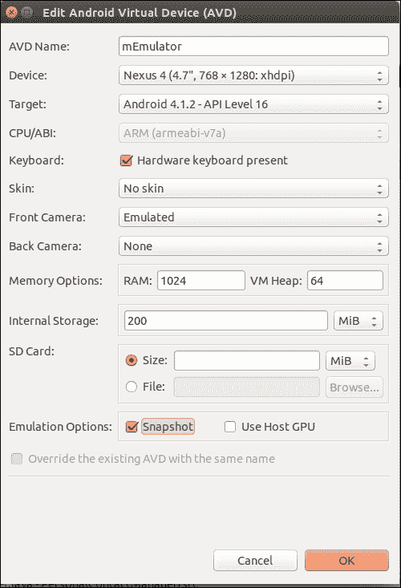
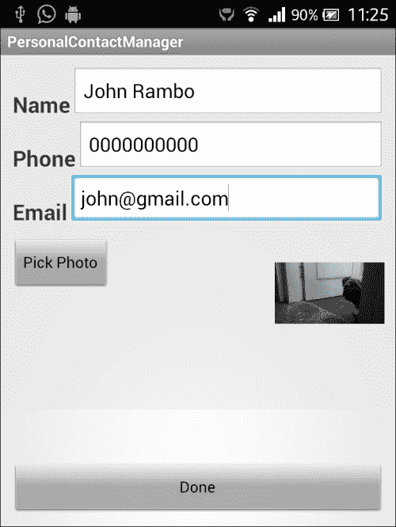

# 第二章。连接点

|   | *"除非你以多种方式学习，否则你不会理解任何东西。"* |   |
| --- | --- | --- |
|   | --*-Marvin Minsky* |

在上一章中，我们学习了两个重要的 Android 类及其相应的方法，以便与 SQLite 数据库一起工作：

+   `SQLiteOpenHelper`类

+   `SQLiteDatabase`类

我们还看到了解释它们实现的代码片段。现在，我们准备在 Android 应用程序中使用所有这些概念。我们将利用上一章中学到的知识来制作一个功能性的应用程序。我们还将进一步研究插入、查询和删除数据库中的数据的 SQL 语句。

在本章中，我们将在 Android 模拟器上构建和运行 Android 应用程序。我们还将构建我们自己的完整的`contacts`数据库。在本章的过程中，我们将遇到 Android UI 组件，如`Buttons`和`ListView`。如果需要重新访问 Android 中的 UI 组件，请访问链接[`developer.android.com/design/building-blocks/index.html`](http://developer.android.com/design/building-blocks/index.html)。

在我们开始之前，本章的代码旨在解释与 Android 中的 SQLite 数据库相关的概念，并不适用于生产；在许多地方，您会发现缺乏适当的异常处理或适当的空值检查以及类似的实践，以减少代码的冗长。您可以从 Packt 的网站下载当前和以下章节的完整代码。为了获得最佳结果，我们建议在阅读本章的过程中下载代码并参考它。

在本章中，我们将涵盖：

+   构建模块

+   数据库处理程序和查询

+   连接 UI 和数据库

# 构建模块

Android 以在不同硬件和软件规格的各种设备上运行而闻名。在撰写本书时，激活标记已经突破了 10 亿。运行 Android 的设备数量惊人，为用户提供了不同形态和不同硬件基础的丰富选择。当在不同设备上测试应用程序时，这增加了障碍，因为人类不可能获得所有这些设备，更不用说需要投入其中的时间和资本。模拟器本身是一个很好的工具；它使我们能够通过模拟不同的硬件特性（如 CPU 架构、RAM 和相机）和从早期的 Cupcake 到 KitKat 的不同软件版本，来规避这个问题。我们还将尝试利用这一优势来运行我们的应用程序。使用模拟器的另一个好处是，我们将运行一个已 root 的设备，这将允许我们执行一些操作。在普通设备上，我们将无法执行这些操作。

让我们从在 Eclipse 中设置模拟器开始：

1.  转到**窗口**菜单中的**Android 虚拟设备管理器**以启动模拟器。

我们可以设置不同的硬件属性，如 CPU 类型、前/后摄像头、RAM（最好在 Windows 机器上少于 768MB）、内部和外部存储大小。

1.  启动应用程序时，启用**保存快照**；这将减少下次从快照启动模拟器实例时的启动时间：

### 注意

有兴趣的读者可以尝试在[`www.genymotion.co`](http://www.genymotion.co)上尝试更快的模拟器 Genymotion。

现在让我们开始构建我们的 Android 应用程序。

1.  我们将从创建一个名为`PersonalContactManager`的新项目开始。转到**文件** | **新建** | **项目**。现在，导航到**Android**，然后选择**Android 应用程序项目**。这一步将为我们提供一个活动文件和一个相应的 XML 文件。

在我们放置所有需要的块之后，我们将回到这些组件。对于我们的应用程序，我们将创建一个名为`contact`的数据库，其中将包含一个名为`ContactsTable`的表。在上一章中，我们讨论了如何使用 SQL 语句创建数据库；让我们为我们的项目构建一个数据库架构。这是一个非常重要的步骤，它基于我们应用程序的要求；例如，在我们的情况下，我们正在构建一个个人联系人管理器，并且将需要诸如姓名、号码、电子邮件和显示图片等字段。

`ContactsTable`的数据库架构概述如下：

| 列 | 数据类型 |
| --- | --- |
| `Contact_ID` | 整数/主键/自动递增 |
| `姓名` | 文本 |
| `号码` | 文本 |
| `电子邮件` | 文本 |
| `照片` | Blob |

### 注意

一个 Android 应用可以有多个数据库，每个数据库可以有多个表。每个表以 2D（行和列）格式存储数据。

第一列是`Contact_ID`。它的数据类型是整数，其**列约束**是主键。此外，当在该行中插入数据时，该列是自动递增的，这意味着对于每一行，它将递增一次。

主键唯一标识每一行，不能为 null。数据库中的每个表最多可以有一个主键。一个表的主键可以作为另一个表的外键。外键作为两个相关表之间的连接；例如，我们当前的`ContactsTable`架构是：

```kt
ContactsTable (Contact_ID,Name, Number, Email, Photo)
```

假设我们有另一个具有以下架构的表`ColleagueTable`：

```kt
ColleagueTable (Colleague_ID, Contact_ID, Position, Fax)
```

在这里，`ContactTable`的主键，即`Contact_ID`可以称为`ColleagueTable`的外键。它用于在关系数据库中连接两个表，因此允许我们对`ColleagueTable`执行操作。我们将在接下来的章节和示例中详细探讨这个概念。

### 注意

**列约束**

约束是对表中数据列强制执行的规则。这确保了数据库中数据的准确性和可靠性。

与大多数 SQL 数据库不同，SQLite 不会根据声明的列类型限制可以插入列的数据类型。相反，SQLite 使用**动态类型**。列的声明类型仅用于确定列的**亲和性**。当将一种类型的变量存储在另一种类型中时，也会进行类型转换（自动）。

约束可以是列级或表级。列级约束仅应用于一列，而表级约束应用于整个表。

以下是 SQLite 中常用的约束和关键字：

+   `NOT NULL`约束：这确保列没有`NULL`值。

+   `DEFAULT`约束：当未指定列的默认值时，这为列提供了默认值。

+   `UNIQUE`约束：这确保列中的所有值都不同。

+   主键：这个唯一标识数据库表中所有行/记录的键。

+   `CHECK`约束：`CHECK`约束确保列中的所有值满足某些条件。

+   `AUTO INCREMENT`关键字：`AUTOINCREMENT`是一个用于自动递增表中字段值的关键字。我们可以使用`AUTOINCREMENT`关键字来自动递增一个字段值，当创建一个具有特定列名的表时，使用`AUTOINCREMENT`关键字。关键字`AUTOINCREMENT`只能与`INTEGER`字段一起使用。

下一步是准备我们的数据模型；我们将使用我们的模式来构建数据模型类。`ContactModel`类将具有`Contact_ID`、`Name`、`Number`、`Email`和`Photo`作为字段，它们分别表示为`id`、`name`、`contactNo`、`email`和`byteArray`。该类将包括一个 getter/setter 方法，根据需要设置和获取属性值。数据模型的使用将有助于活动与数据库处理程序之间的通信，我们将在本章后面定义。我们将在其中创建一个新的包和一个新的类，称为`ContactModel`类。请注意，创建一个新的包不是必要的步骤；它用于以逻辑和易于访问的方式组织我们的类。这个类可以描述如下：

```kt
public class ContactModel {
  private int id;
  private String name, contactNo, email;
  private byte[] byteArray;

  public byte[] getPhoto() {
    return byteArray;
  }
  public void setPhoto(byte[] array) {
    byteArray = array;
  }
  public int getId() {
    return id;
  }
  public void setId(int id) {
    this.id = id;
  }
  ……………
}
```

### 提示

Eclipse 提供了很多有用的快捷方式，但不包括生成 getter 和 setter 方法。我们可以将生成 getter 和 setter 方法绑定到任何我们喜欢的键绑定上。在 Eclipse 中，转到**窗口** | **首选项** | **常规** | **键**，搜索 getter，并添加你的绑定。我们使用*Alt* + *Shift* + *G*；你可以自由设置任何其他键组合。

# 数据库处理程序和查询

我们将构建一个支持类，该类将根据我们的数据库需求包含读取、更新和删除数据的方法。这个类将使我们能够创建和更新数据库，并充当我们的数据管理中心。我们将使用这个类来运行 SQLite 查询，并将数据发送到 UI；在我们的情况下，是一个 listview 来显示结果：

```kt
public class DatabaseManager {

  private SQLiteDatabase db; 
  private static final String DB_NAME = "contact";

  private static final int DB_VERSION = 1;
  private static final String TABLE_NAME = "contact_table";
  private static final String TABLE_ROW_ID = "_id";
  private static final String TABLE_ROW_NAME = "contact_name";
  private static final String TABLE_ROW_PHONENUM = "contact_number";
  private static final String TABLE_ROW_EMAIL = "contact_email";
  private static final String TABLE_ROW_PHOTOID = "photo_id";
  .........
}
```

我们将创建一个`SQLiteDatabase`类的对象，稍后我们将用`getWritableDatabase()`或`getReadableDatabase()`来初始化它。我们将定义整个类中将要使用的常量。

### 注意

按照惯例，常量以大写字母定义，但在定义常量时使用`static final`比惯例更多一些。要了解更多，请参考[`goo.gl/t0PoQj`](http://goo.gl/t0PoQj)。

我们将把数据库的名称定义为`contact`，并将版本定义为 1。如果我们回顾前一章，我们会记得这个值的重要性。对这个值的快速回顾使我们能够将数据库从当前版本升级到新版本。通过这个例子，用例将变得清晰。假设将来有一个新的需求，即我们需要在我们的联系人详细信息中添加传真号码。我们将修改我们当前的模式以包含这个变化，我们的联系人数据库将相应地改变。如果我们在新设备上安装应用程序，就不会有问题；但在已经运行应用程序的设备上，我们将面临问题。在这种情况下，`DB_VERSION`将派上用场，并帮助我们用当前版本替换旧版本的数据库。另一种方法是卸载应用程序并重新安装，但这是不鼓励的。

现在将定义表名和重要字段，如表列。`TABLE_ROW_ID`是一个非常重要的列。这将作为表的主键；它还将自动递增，不能为 null。`NOT NULL`再次是一个列约束，它只能附加到列定义，并且不能作为表约束指定。毫不奇怪，`NOT NULL`约束规定相关列不能包含`NULL`值。在插入新行或更新现有行时，如果尝试将列值设置为`NULL`，将导致约束违规。这将用于在表中查找特定值。ID 的唯一性保证了我们在表中没有与表中数据冲突，因为每一行都是由这个键唯一标识的。表的其余列都相当容易理解。`DatabaseManager`类的构造函数如下：

```kt
public DatabaseManager(Context context) {
   this.context = context;
   CustomSQLiteOpenHelper helper = new CustomSQLiteOpenHelper(context);
   this.db = helper.getWritableDatabase();
  }
```

注意我们使用了一个名为`CustomSQLiteOpenHelper`的类。我们稍后会回到这个问题。我们将使用该类对象来获取我们的`SQLitedatabase`实例。

## 构建创建查询

为了创建一个具有所需列的表，我们将构建一个查询语句并执行它。该语句将包含表名、不同的表列和相应的数据类型。我们现在将看一下创建新数据库以及根据应用程序的需求升级现有数据库的方法：

```kt
private class CustomSQLiteOpenHelper extends SQLiteOpenHelper {
  public CustomSQLiteOpenHelper(Context context) {
    super(context, DB_NAME, null, DB_VERSION);
  }
  @Override
  public void onCreate(SQLiteDatabase db) {
String newTableQueryString = "create table "
+ TABLE_NAME + " ("
+ TABLE_ROW_ID 
+ " integer primary key autoincrement not null,"
+ TABLE_ROW_NAME
+ " text not null," 
+ TABLE_ROW_PHONENUM 
+ " text not null,"
+ TABLE_ROW_EMAIL
+ " text not null,"
+ TABLE_ROW_PHOTOID 
+ " BLOB" + ");";
    db.execSQL(newTableQueryString);
  }

  @Override
  public void onUpgrade(SQLiteDatabase db, int oldVersion, 
int newVersion) {

    String DROP_TABLE = "DROP TABLE IF EXISTS " + 
TABLE_NAME;
    db.execSQL(DROP_TABLE);
    onCreate(db);
  }
}
```

`CustomSQLiteOpenHelper`扩展了`SQLiteOpenHelper`，并为我们提供了关键方法`onCreate()`和`onUpgrade()`。我们已将此类定义为`DatabaseManager`类的内部类。这使我们能够从一个地方管理所有与数据库相关的功能，即 CRUD（创建、读取、更新和删除）。

在我们的`CustomSQLiteOpenHelper`构造函数中，负责创建我们类的实例，我们将传递一个上下文，然后将其传递给超级构造函数，参数如下：

+   `Context context`：这是我们传递给构造函数的上下文

+   `String name`：这是我们数据库的名称

+   `CursorFactory factory`：这是游标工厂对象，可以传递为`null`

+   `int version`：这是数据库的版本

下一个重要的方法是`onCreate()`。我们将构建我们的 SQLite 查询字符串，用于创建我们的数据库表：

```kt
"create table " + TABLE_NAME + " ("
+ TABLE_ROW_ID
+ " integer primary key autoincrement not null,"
….....
+ TABLE_ROW_PHOTOID + " BLOB" + ");";
```

前面的语句基于以下语法图：


在这里，关键字`create table`用于创建表。接着是表名、列的声明和它们的数据类型。准备好我们的 SQL 语句后，我们将使用 SQLite 数据库的`execSQL()`方法来执行它。如果我们之前构建的查询语句有问题，我们将遇到异常`android.database.sqlite.SQLiteException`。默认情况下，数据库形成在应用程序分配的内部存储空间中。该文件夹可以在`/data/data/<yourpackage>/databases/`找到。

我们可以在模拟器或已获取 root 权限的手机上运行这段代码时轻松验证我们的数据库是否已创建。在 Eclipse 中，转到 DDMS 透视图，然后转到文件管理器。如果我们有足够的权限，即已获取 root 权限的设备，我们可以轻松导航到给定的文件夹。我们还可以借助文件资源管理器拉取我们的数据库，并借助独立的 SQLite 管理工具查看我们的数据库，并对其执行 CRUD 操作。是什么使得 Android 应用程序的数据库可以通过其他工具读取？还记得我们在上一章中讨论过 SQLite 特性中的跨平台吗？在下面的截图中，注意表名、用于构建它的 SQL 语句以及列名及其数据类型：


### 注意

SQLite 管理工具可以在 Chrome 或 Firefox 浏览器中下载。以下是 Firefox 扩展的链接：[`goo.gl/NLu8JT`](http://goo.gl/NLu8JT)。

另一个方便的方法是使用`adb pull`命令来拉取我们的数据库或任何其他文件：

```kt
adb pull /data/data/your package name/databases  /file location

```

另一个有趣的要点是`TABLE_ROW_PHOTOID`的数据类型是`BLOB`。BLOB 代表二进制大对象。它与其他数据类型（如文本和整数）不同，因为它可以存储二进制数据。二进制数据可以是图像、音频或任何其他类型的多媒体对象。

不建议在数据库中存储大型图像；我们可以存储文件名或位置，但存储图像有点过度。想象一种情况，我们存储联系人图像。为了放大这种情况，让它不是几百个联系人，而是几千个联系人。数据库的大小将变得很大，访问时间也会增加。我们想通过存储联系人图像来演示 BLOB 的使用。

当数据库升级时，将调用`onUpgrade()`方法。通过更改数据库的版本号来升级数据库。在这里，实现取决于应用的需求。在某些情况下，可能需要删除整个表并创建一个新表，在某些应用程序中，可能只需要进行轻微修改。如何从一个版本迁移到另一个版本在第四章中有所涵盖，*小心操作*。

## 构建插入查询

要在数据库表中插入新的数据行，我们需要使用`insert()`方法或者制作一个插入查询语句并使用`execute()`方法：

```kt
public void addRow(ContactModel contactObj) {
  ContentValues values = prepareData(contactObj);
  try {
    db.insert(TABLE_NAME, null, values);
  } catch (Exception e) {
    Log.e("DB ERROR", e.toString()); 
    e.printStackTrace();
  }
}
```

如果我们的表名错误，SQLite 将给出一个日志`no such table`消息和异常`android.database.sqlite.SQLiteException`。`addRow()`方法用于在数据库行中插入联系人详细信息；请注意，该方法的参数是`ContactModel`的对象。我们创建了一个额外的方法`prepareData()`，从`ContactModel`对象的 getter 方法构造一个`ContentValues`对象。

```kt
.......................
values.put(TABLE_ROW_NAME, contactObj.getName());
values.put(TABLE_ROW_PHONENUM, contactObj.getContactNo());
....................
```

在准备好`ContentValues`对象之后，我们将使用`SQLiteDatabase`类的`insert()`方法：

```kt
public long insert (String table, String nullColumnHack, ContentValues values)
```

`insert()`方法的参数如下：

+   `table`：要将行插入的数据库表。

+   `values`：这个键值映射包含表行的初始列值。列名充当键。值作为列值。

+   `nullColumnHack`：这与其名称一样有趣。以下是来自 Android 文档网站的一句引用：

> “可选；可能为空。SQL 不允许插入完全空的行，而不命名至少一个列名。如果您提供的值为空，那么不知道任何列名，也无法插入空行。如果未设置为 null，则 nullColumnHack 参数提供可为空列名的名称，以明确在值为空的情况下插入 NULL。”

简而言之，在我们试图传递一个空的`ContentValues`以进行插入的情况下，SQLite 需要一些安全的列来分配`NULL`。

或者，我们可以准备 SQL 语句并执行它，如下所示：

```kt
public void addRowAlternative(ContactModel contactObj) {

  String insertStatment = "INSERT INTO " + TABLE_NAME 
      + " ("
      + TABLE_ROW_NAME + ","
      + TABLE_ROW_PHONENUM + ","
      + TABLE_ROW_EMAIL + ","
      + TABLE_ROW_PHOTOID
      + ") "
      + " VALUES "
      + "(?,?,?,?)";

  SQLiteStatement s = db.compileStatement(insertStatment);
  s.bindString(1, contactObj.getName());
  s.bindString(2, contactObj.getContactNo());
  s.bindString(3, contactObj.getEmail());
if (contactObj.getPhoto() != null)
   {s.bindBlob(4, contactObj.getPhoto());}
  s.execute();
}
```

我们将涵盖这里提到的许多方法的替代方案。其目的是使您熟悉构建和执行查询的其他可能方式。替代部分的解释留作练习给您。`getRowAsObject()`方法将以`ContactModel`对象的形式返回从数据库中获取的行，如下面的代码所示。它将需要`rowID`作为参数，以唯一标识我们想要访问的表中的哪一行：

```kt
public ContactModel getRowAsObject(int rowID) { 
  ContactModel rowContactObj = new ContactModel();
  Cursor cursor;
  try {
    cursor = db.query(TABLE_NAME, new String[] {
TABLE_ROW_ID, TABLE_ROW_NAME, TABLE_ROW_PHONENUM, TABLE_ROW_EMAIL, TABLE_ROW_PHOTOID },
    TABLE_ROW_ID + "=" + rowID, null,
    null, null, null, null);
    cursor.moveToFirst();
    if (!cursor.isAfterLast()) {
      prepareSendObject(rowContactObj, cursor);    }
  } catch (SQLException e) {
      Log.e("DB ERROR", e.toString());
    e.printStackTrace();
  }
  return rowContactObj;
}
```

这个方法将以`ContactModel`对象的形式返回从数据库中获取的行。我们正在使用`SQLiteDatabase()`查询方法从我们的联系人表中根据提供的`rowID`参数获取行。该方法返回结果集上的游标：

```kt
public Cursor query (String table, String[] columns, String selection, String[] selectionArgs, String groupBy, String having, String orderBy, String limit)
```

以下是上述代码的参数：

+   `table`：这表示将对其运行查询的数据库表。

+   `columns`：这是返回的列的列表；如果我们传递`null`，它将返回所有列。

+   `selection`：这是我们定义要返回哪些行的地方，并作为 SQL `WHERE` 子句。传递`null`将返回所有行。

+   `selectionArgs`：我们可以为这个参数传递`null`，或者我们可以在选择中包含问号，这些问号将被`selectionArgs`中的值替换。

+   `groupBy`：这是一个作为 SQL `GROUP BY` 子句的过滤器，声明如何对行进行分组。传递`null`将导致行不被分组。

+   `Having`：这是一个过滤器，告诉哪些行组应该成为游标的一部分，作为 SQL `HAVING` 子句。传递`null`将导致所有行组被包括。

+   `OrderBy`：这告诉查询如何对行进行排序，作为 SQL `ORDER BY`子句。传递`null`将使用默认排序顺序。

+   `limit`：这将限制查询返回的行数，作为`LIMIT`子句。传递`null`表示没有`LIMIT`子句。

这里另一个重要的概念是移动游标以访问数据。注意以下方法：`cursor.moveToFirst()`、`cursor.isAfterLast()`和`cursor.moveToNext()`。

当我们尝试检索数据构建 SQL 查询语句时，数据库将首先创建游标对象的对象并返回其引用。返回的引用指针指向第 0 个位置，也称为游标的“第一个位置”之前。当我们想要检索数据时，我们必须首先移动到第一条记录；因此，使用`cursor.moveToFirst()`。谈到其他两种方法，`cursor.isAfterLast()`返回游标是否指向最后一行之后的位置，`cursor.moveToNext()`将游标移动到下一行。

### 提示

建议读者查看 Android 开发者网站上更多的游标方法：[`goo.gl/fR75t8`](http://goo.gl/fR75t8)。

或者，我们可以使用以下方法：

```kt
public ContactModel getRowAsObjectAlternative(int rowID) {

  ContactModel rowContactObj = new ContactModel();
  Cursor cursor;

  try {
    String queryStatement = "SELECT * FROM " 
       + TABLE_NAME  + " WHERE " + TABLE_ROW_ID + "=?";
    cursor = db.rawQuery(queryStatement,
      new String[]{String.valueOf(rowID)});
    cursor.moveToFirst();

    rowContactObj = new ContactModel();
    rowContactObj.setId(cursor.getInt(0));
    prepareSendObject(rowContactObj, cursor);

  } catch (SQLException e) {
    Log.e("DB ERROR", e.toString());
    e.printStackTrace();
  }

  return rowContactObj;
}
```

`update`语句基于以下语法图：


在我们转到`datamanager`类中的其他方法之前，让我们看一下在`prepareSendObject()`方法中从游标对象中获取数据：

```kt
rowObj.setContactNo(cursor.getString(cursor.getColumnIndexOrThrow(TABLE_ROW_PHONENUM)));
rowObj.setEmail(cursor.getString(cursor.getColumnIndexOrThrow(TABLE_ROW_EMAIL)));
```

这里`cursor.getstring()`以列索引作为参数，并返回请求列的值，而`cursor.getColumnIndexOrThrow()`以列名作为参数，并返回给定列名的基于零的索引。除了这种链接方法，我们可以直接使用`cursor.getstring()`。如果我们知道要从中提取数据的所需列的列号，我们可以使用以下表示法：

```kt
cursor.getstring(2);
```

## 构建删除查询

从我们的数据库表中删除特定的数据行，我们需要提供主键来唯一标识要删除的数据集：

```kt
public void deleteRow(int rowID) {
  try {
    db.delete(TABLE_NAME, TABLE_ROW_ID 
    + "=" + rowID, null);
  } catch (Exception e) {
    Log.e("DB ERROR", e.toString());
    e.printStackTrace();
  }
}
```

此方法使用 SQLiteDatabase 的`delete()`方法来删除表中给定 ID 的行：

```kt
public int delete (String table, String whereClause, String[] whereArgs)
```

以下是上述代码片段的参数：

+   `table`：这是要针对其运行查询的数据库表。

+   `whereClause`：这是在删除行时要应用的子句；在此子句中传递`null`将删除所有行

+   `whereArgs`：我们可以在`where`子句中包含问号，这些问号将被绑定为字符串的值

或者，我们可以使用以下方法：

```kt
public void deleteRowAlternative(int rowId) {

  String deleteStatement = "DELETE FROM " 
    + TABLE_NAME + " WHERE " 
    + TABLE_ROW_ID + "=?";
  SQLiteStatement s = db.compileStatement(deleteStatement);
  s.bindLong(1, rowId);
  s.executeUpdateDelete();
}
```

`delete`语句基于以下语法图：


## 构建更新查询

要更新现有值，我们需要使用`update()`方法和所需的参数：

```kt
public void updateRow(int rowId, ContactModel contactObj) {

  ContentValues values = prepareData(contactObj);

  String whereClause = TABLE_ROW_ID + "=?";
  String whereArgs[] = new String[] {String.valueOf(rowId)};

  db.update(TABLE_NAME, values, whereClause, whereArgs);

}
```

通常情况下，我们需要主键，即`rowId`参数，来标识要修改的行。使用 SQLiteDatabase 的`update()`方法来修改数据库表中零行或多行的现有数据：

```kt
public int update (String table, ContentValues values, String whereClause, String[] whereArgs) 
```

以下是上述代码片段的参数：

+   `table`：这是要更新的合格数据库表名称。

+   `values`：这是从列名称到新列值的映射。

+   `whereClause`：这是在更新值/行时要应用的可选`WHERE`子句。如果`UPDATE`语句没有`WHERE`子句，则将修改表中的所有行。

+   `whereArgs`：我们可以在`where`子句中包含问号，这些问号将被绑定为字符串的值替换。

或者，您可以使用以下代码：

```kt
public void updateRowAlternative(int rowId, ContactModel contactObj) {
  String updateStatement = "UPDATE " + TABLE_NAME + " SET "
      + TABLE_ROW_NAME     + "=?,"
      + TABLE_ROW_PHONENUM + "=?,"
      + TABLE_ROW_EMAIL    + "=?,"
      + TABLE_ROW_PHOTOID  + "=?"
      + " WHERE " + TABLE_ROW_ID + "=?";

  SQLiteStatement s = db.compileStatement(updateStatement);
  s.bindString(1, contactObj.getName());
  s.bindString(2, contactObj.getContactNo());
  s.bindString(3, contactObj.getEmail());
  if (contactObj.getPhoto() != null)
   {s.bindBlob(4, contactObj.getPhoto());}
  s.bindLong(5, rowId);

  s.executeUpdateDelete();
}
```

`update`语句基于以下语法图：


# 连接 UI 和数据库

既然我们已经在数据库中设置了钩子，让我们将我们的 UI 与数据连接起来：

1.  第一步是从用户那里获取数据。我们可以通过内容提供程序使用 Android 联系人应用程序中的现有联系人数据。

我们将在下一章中介绍这种方法。现在，我们将要求用户添加一个新联系人，我们将把它插入到数据库中：



1.  我们正在使用标准的 Android UI 小部件，如`EditText`、`TextView`和`Buttons`来收集用户提供的数据：

```kt
private void prepareSendData() {
  if (TextUtils.isEmpty(contactName.getText().toString())
      || TextUtils.isEmpty(
      contactPhone.getText().toString())) {

  .............

   } else {
    ContactModel contact = new ContactModel();
    contact.setName(contactName.getText().toString());
    ............

    DatabaseManager dm = new DatabaseManager(this);
    if(reqType == ContactsMainActivity
.CONTACT_UPDATE_REQ_CODE) {
      dm.updateRowAlternative(rowId, contact);
    } else {
      dm.addRowAlternative(contact);
    }

    setResult(RESULT_OK);
    finish();
  }
}
```

`prepareSendData()`是负责将数据打包到我们的对象模型中，然后将其插入到我们的数据库中的方法。请注意，我们使用`TextUtils.isEmpty()`而不是对`contactName`进行空值检查和长度检查，这是一个非常方便的方法。如果字符串为 null 或长度为零，则返回`true`。

1.  我们从用户填写表单接收的数据准备我们的`ContactModel`对象。我们创建我们的`DatabaseManager`类的一个实例，并访问我们的`addRow()`方法，将我们的联系对象传递给数据库中插入，正如我们之前讨论的那样。

另一个重要的方法是`getBlob()`，它用于以 BLOB 格式获取图像数据：

```kt
private byte[] getBlob() {

  ByteArrayOutputStream blob = new ByteArrayOutputStream();
  imageBitmap.compress(Bitmap.CompressFormat.JPEG, 100, blob);
  byte[] byteArray = blob.toByteArray();

  return byteArray;
}
```

1.  我们创建一个新的`ByteArrayOutputStream`对象`blob`。位图的`compress()`方法将用于将位图的压缩版本写入我们的`outputstream`对象：

```kt
public boolean compress (Bitmap.CompressFormat format, int quality, OutputStream stream)
```

以下是上述代码的参数：

+   `format`：这是压缩图像的格式，在我们的情况下是 JPEG。

+   `quality`：这是对压缩器的提示，范围从`0`到`100`。值`0`表示压缩到较小的尺寸和低质量，而`100`是最高质量。

+   `stream`：这是用于写入压缩数据的输出流。

1.  然后，我们创建我们的`byte[]`对象，它将从`ByteArrayOutputStream toByteArray()`方法构造。

### 注意

您会注意到我们并没有涵盖所有的方法；只有与数据操作相关的方法以及可能引起混淆的一些方法或调用。还有一些用于调用相机或画廊以选择要用作联系人图像的照片的方法。建议您探索随书提供的代码中的方法。

让我们继续到演示部分，在那里我们使用自定义 listview 以一种可呈现和可读的方式显示我们的联系人信息。我们将跳过与演示相关的大部分代码，集中在我们获取和提供数据给我们的 listview 的部分。我们还将实现上下文菜单，以便为用户提供删除特定联系人的功能。我们将涉及数据库管理器方法，如`getAllData()`来获取所有添加的联系人。我们将使用`deleteRow()`来从我们的联系人数据库中删除任何不需要的联系人。最终结果将类似于以下截图：


1.  为了创建一个类似于前面截图中显示的自定义 listview，我们创建`CustomListAdapter`扩展`BaseAdapter`并使用自定义布局来设置 listview 行。请注意，在以下构造函数中，我们已经初始化了一个新的数组列表，并将使用我们的数据库管理器通过使用`getAllData()`方法来获取所有数据库条目的值：

```kt
public CustomListAdapter(Context context) {

   contactModelList = new ArrayList<ContactModel>();
   _context = context;
   inflater = (LayoutInflater)context.getSystemService( 
Context.LAYOUT_INFLATER_SERVICE);
      dm = new DatabaseManager(_context);
   contactModelList = dm.getAllData();
}
```

另一个非常重要的方法是`getView()`方法。这是我们在视图中填充自定义布局的地方：

```kt
convertView = inflater.inflate(R.layout.contact_list_row, null);
```

我们将使用视图持有者模式来提高 listview 的滚动流畅性：

```kt
vHolder = (ViewHolder) convertView.getTag();
```

1.  最后，将数据设置到相应的视图中：

```kt
vHolder.contact_email.setText(contactObj.getEmail());
```

### 注意

在视图持有者中持有视图对象可以通过减少对`findViewById()`的调用来提高性能。您可以在[`developer.android.com/training/improving-layouts/smooth-scrolling.html`](http://developer.android.com/training/improving-layouts/smooth-scrolling.html)上阅读更多关于此的信息以及如何使 listview 滚动流畅。

1.  我们还将实现一种删除 listview 条目的方法。我们将使用上下文菜单来实现这一目的。我们将首先在应用程序结构的`res`文件夹下的`menu`文件夹中创建一个菜单项：

```kt
<?xml version="1.0" encoding="utf-8"?>
<menu  >

    <item
        android:id="@+id/delete_item"
        android:title="Delete"/>
<item
        android:id="@+id/update_item"
     android:title="Update"/>
</menu>
```

1.  现在，在我们将显示 listview 的主要活动中，我们将使用以下调用来注册我们的 listview 到上下文菜单。为了启动上下文菜单，我们需要在 listview 项上执行长按操作：

```kt
registerForContextMenu(listReminder) 
```

1.  还有一些方法我们需要实现以实现删除功能：

```kt
@Override
  public void onCreateContextMenu(ContextMenu menu, View v,
      ContextMenuInfo menuInfo) {
    super.onCreateContextMenu(menu, v, menuInfo);
    MenuInflater m = getMenuInflater();
    m.inflate(R.menu.del_menu, menu);
  }
```

这种方法用于用我们之前在 XML 中定义的菜单填充上下文菜单。`MenuInfater`类从菜单 XML 文件生成菜单对象。菜单膨胀在很大程度上依赖于在构建时对 XML 文件的预处理；这是为了提高性能而做的。

1.  现在，我们将实现一种捕获上下文菜单点击的方法：

```kt
  @Override
  public boolean onContextItemSelected(MenuItem item) {
..............
    case R.id.delete_item:

      cAdapter.delRow(info.position);
      cAdapter.notifyDataSetChanged();
      return true;
    case R.id.update_item:

      Intent intent = new Intent( 
ContactsMainActivity.this, AddNewContactActivity.class);
      ......................
  }
```

1.  在这里，我们将找到点击的 listview 项的位置 ID，并调用 CustomListAdapter 的`delRow（）`方法，最后，我们将通知适配器数据集已更改：

```kt
public void delRow(int delPosition) {
                  dm.deleteRowAlternative(contactModelList.get(delPosition).getId());
       contactModelList.remove(delPosition);
```

`delRow（）`方法负责将我们数据库的`deleteRowAlternative（）`方法连接到我们上下文菜单的`delete（）`方法。在这里，我们获取设置在特定 listview 项上的对象的 ID，并将其传递给`databaseManager`的`deleteRowAlternative（）`方法，以从数据库中删除数据。在从数据库中删除数据后，我们将指示我们的 listview 从我们的联系人列表中删除相应的条目。

在`onContextItemSelected（）`方法中，我们还可以看到`update_item`，以防用户点击了`update`按钮。我们将启动添加新联系人的活动，并在用户想要编辑某些字段时添加我们已经拥有的数据。关键是要知道调用是从哪里发起的。是要添加新条目还是更新现有条目？我们借助以下代码告诉活动，此操作用于更新而不是添加新条目：

```kt
intent.putExtra(REQ_TYPE, CONTACT_UPDATE_REQ_CODE);
```

# 摘要

在本章中，我们涵盖了构建基于数据库的应用程序的步骤，从头开始，然后从模式到对象模型，然后从对象模型到构建实际数据库。我们经历了构建数据库管理器的过程，最终实现了 UI 数据库连接，实现了一个完全功能的应用程序。涵盖的主题包括模型类的构建块，数据库模式到数据库处理程序和 CRUD 方法。我们还涵盖了将数据库连接到 Android 视图的重要概念，并在适当的位置设置钩子以获取用户数据，将数据添加到数据库，并在从数据库中获取数据后显示相关信息。

在下一章中，我们将专注于在这里所做的基础上构建。我们将探索`ContentProviders`。我们还将学习如何从`ContentProviders`获取数据，如何制作我们自己的内容提供程序，以及在构建它们时涉及的最佳实践等等。
