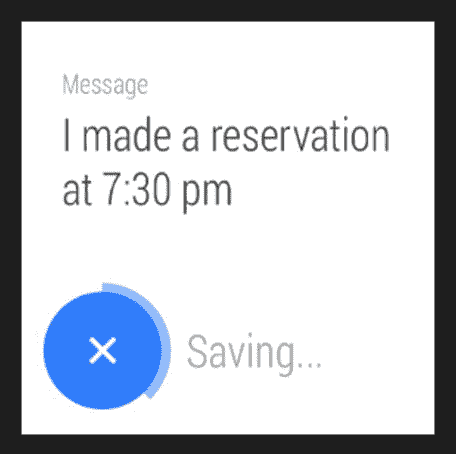
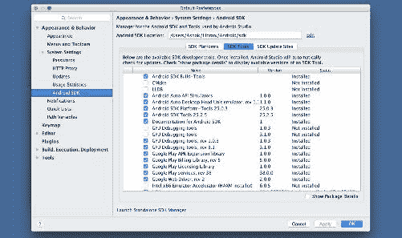
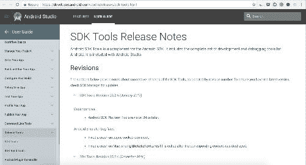
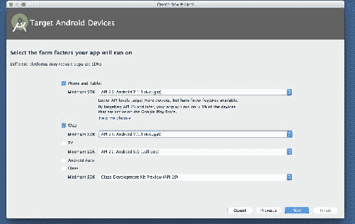
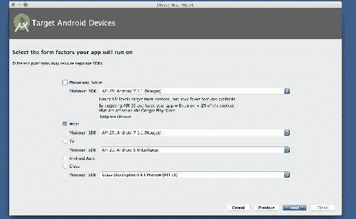
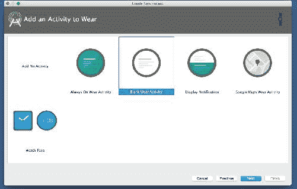
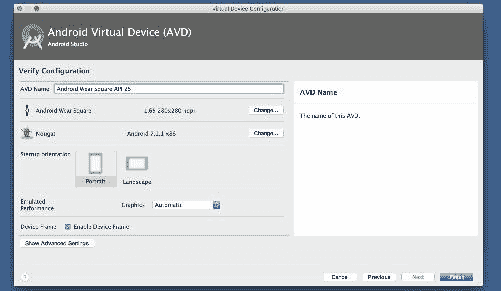
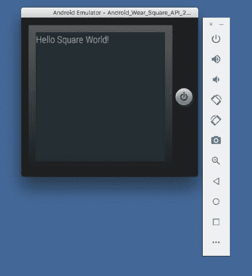

# 让我们帮助捕捉你的想法 —— WearRecyclerView 及更多功能

戴上能帮助我们执行某些动作的实用工具，这种文化一直是现代文明的一部分。对人类来说，腕表已经成为检查时间和日期的增强工具。佩戴手表可以让你只需一瞥就能知道时间。科技将这种戴表体验带到了下一个层次。第一款现代可穿戴手表是计算器和手表的组合，于 1970 年推出。几十年来，微处理器和无线的进步导致了“无处不在的计算”这一概念的出现。在这段时间里，大多数领先的电子行业初创公司开始着手他们的想法，这使得可穿戴设备变得非常流行。

科技巨头公司，如谷歌、苹果、三星和索尼，都加入了可穿戴设备时代的行列。他们推出了自己的竞争性可穿戴产品，这些产品在可穿戴设备市场上取得了极大的成功。更有趣的是，谷歌的 Android Wear 功能强大，遵循与 Android 智能手机开发相同的实践，并且与 Apple Watch OS 和三星的 Tizen OS 开发社区相比，拥有非常好的开发者社区。

谷歌在 2014 年 3 月宣布了 Android Wear。从那时起，作为智能手表和可穿戴软件平台的 Android Wear 一直在发展。谷歌在设计和用户体验方面的持续进步导致了新一代 Android Wear 操作系统的诞生，该系统具有前所未有的处理生物识别传感器的能力，平台功能更多；谷歌称之为 Android Wear 2.0。

Android Wear 2.0 在应用开发方面将引起极大的兴奋，具有显著竞争力的特性待开发。Android Wear 2.0 允许开发者构建和雕琢他针对 Android Wear 的特定想法；无需将手表与移动应用配对。谷歌称之为独立应用程序。Android Wear 2.0 引入了一种在 Android 表中输入的新方式：一个新的应用程序编程接口，称为 Complications，它允许表盘显示来自生物识别和其他传感器的重要信息。Android Wear 2.0 的新更新通知支持将帮助用户和开发者以更全面的方式呈现通知。

在本章中，我们将探讨以下内容：

+   Android Wear 设计原则

+   探索特定于可穿戴应用的基本 UI 组件

+   为可穿戴应用开发设置开发环境

+   创建你的第一个 Android Wear 应用程序

# Android Wear 设计原则

设计可穿戴应用与设计移动或平板应用不同。Wear 操作系统非常轻量级，并且有特定的任务要完成，即与佩戴者分享正确信息。

通用可穿戴原则是：及时性、一瞥即得、易于轻触、节省时间。

**及时性**

在正确的时间提供正确的信息。

**一瞥即得**

保持穿戴应用用户界面干净、不杂乱。

**易于点击**

用户将点击的动作应该具有适当的间距和图片大小。

**节省时间**

创建能够快速完成任务的最佳应用流程。

对于任何穿戴应用，我们需要合适的构建块来控制应用程序的业务逻辑和其他架构实现。以下是开发穿戴应用的场景，帮助我们更好地雕刻穿戴应用：

+   定义布局

+   创建列表

+   显示确认信息

+   穿戴导航和动作

+   多功能按钮

# 定义布局

穿戴应用可以使用我们在手持式 Android 设备编程中使用的相同布局，但需要针对穿戴应用的具体限制。我们不应该在穿戴应用中进行类似于手持式 Android 设备的繁重处理操作，并期待良好的用户体验。

为圆形屏幕设计的应用在方形穿戴设备上看起来不会很好。为了解决这个问题，Android Wear 支持库提供了以下两个解决方案：

+   `BoxInsetLayout`

+   `Curved Layout`（曲线布局）

我们可以提供不同的资源，允许 Android 在运行时检测 Android Wear 的形状。

# 创建列表

列表允许用户从一组项目中选择一个项目。在旧版的 Wear 1.x API 中，`WearableListView`帮助程序员构建列表和自定义列表。现在，穿戴 UI 库有了支持`curvedLayout`的`WearableRecyclerView`，并在穿戴设备上拥有最佳的实现体验。

我们可以添加手势和其他出色的功能：


# 探索穿戴设备的 UI 组件

在这一小节中，让我们探索常用的穿戴特定 UI 组件。在穿戴应用编程中，我们可以使用我们在移动应用编程中使用的所有组件，但在使用之前，我们需要仔细考虑如何在穿戴设备中容纳组件的视觉外观。

`WatchViewStub`：`WatchViewStub`有助于为不同表盘形状的穿戴设备渲染视图。如果您的应用安装在圆形手表设备上，`WatchViewStub`将加载针对圆形手表的特定布局配置。如果是方形，它将加载方形布局配置：

```java
<?xml version="1.0" encoding="utf-8"?>
<android.support.wearable.view.WatchViewStub 

    android:id="@+id/watch_view_stub"
    android:layout_width="match_parent"
    android:layout_height="match_parent"
 app:rectLayout="@layout/rect_activity_main"
    app:roundLayout="@layout/round_activity_main"
    tools:context="com.ashokslsk.wearapp.MainActivity"
    tools:deviceIds="wear"></android.support.wearable.view.WatchViewStub>

```

`WearableRecyclerView`：`WearableRecyclerView`是专为穿戴设备实现的`recyclerview`。它为穿戴设备视口中的数据集提供了灵活的视图。我们将在接下来的章节中详细探讨`WearableRecyclerView`：

```java
 <android.support.wearable.view.WearableRecyclerView
   android:id="@+id/recycler_launcher_view"
   android:layout_width="match_parent"
   android:layout_height="match_parent"
   android:scrollbars="vertical" /> 

```

注意：`WearableListView`已弃用；Android 社区建议使用`WearableRecyclerView`。

`CircledImageVIew`：一个由圆形环绕的`Imageview`。这是在圆形表盘穿戴设备上展示图片的非常实用的组件：

```java
<?xml version="1.0" encoding="utf-8"?>
<android.support.wearable.view.CircledImageView

    android:id="@+id/circledimageview"
    app:circle_color="#2878ff"
    app:circle_radius="50dp"
    app:circle_radius_pressed="50dp"
    app:circle_border_width="5dip"
    app:circle_border_color="#26ce61"
    android:layout_marginTop="15dp"
    android:src="img/skholinguaicon"
    android:layout_gravity="center_horizontal"
    android:layout_width="wrap_content"
    android:layout_height="wrap_content" />

```

`BoxInsetLayout`：此布局直接扩展到`Framelayout`，并且能够识别 Wearable 设备的形状因素。形状感知的`FrameLayout`可以将子元素框定在屏幕中心正方形内：

```java
<android.support.wearable.view.BoxInsetLayout    

android:layout_width="match_parent"
android:layout_height="match_parent"
tools:context="com.example.ranjan.androidwearuicomponents.BoxInsetLayoutDemo">

<TextView
    android:text="@string/hello_world"
    android:layout_width="wrap_content"
    android:layout_height="wrap_content"
    app:layout_box="all" />

</android.support.wearable.view.BoxInsetLayout>

```

自从 Wear 2.0 版本发布后，为了提供沉浸式活动体验，一些组件被弃用，谷歌严格禁止使用它们；我们仍然可以在 Android 编程中使用我们所熟知的所有组件。

# 显示确认信息

与手持 Android 设备中的确认操作相比，在 Wear 应用程序中，确认操作应该占据整个屏幕或比手持设备显示的对话框更多。这确保用户可以一眼看到这些确认信息。Wearable UI 库帮助在 Android Wear 中显示确认计时器和动画计时器。

# DelayedConfirmationView

`DelayedConfirmationView`是基于计时器的自动确认视图：

****************

```java
<android.support.wearable.view.DelayedConfirmationView
    android:id="@+id/delayed_confirm"
    android:layout_width="40dp"
    android:layout_height="40dp"
    android:src="img/cancel_circle"
    app:circle_border_color="@color/lightblue"
    app:circle_border_width="4dp"
    app:circle_radius="16dp">
</android.support.wearable.view.DelayedConfirmationView>

```

# Wear 导航和动作

在 Android Wear 的新版本中，**Material design**库新增了以下两种交互式抽屉：

+   导航抽屉

+   动作抽屉

# 导航抽屉

允许用户在应用程序中的视图之间切换。开发者可以通过将`setShouldOnlyOpenWhenAtTop()`方法设置为 false，允许抽屉在滚动父内容内的任何位置打开。

```java
<android.support.wearable.view.drawer.WearableNavigationDrawer
    android:id="@+id/top_drawer"
    android:layout_width="match_parent"
    android:layout_height="match_parent"
    android:background="@android:color/holo_red_light"
    app:navigation_style="single_page"/>

```

# 动作抽屉

动作抽屉提供了访问应用程序中简单且常见的操作。默认情况下，动作抽屉出现在屏幕底部，并为用户提供特定操作：

```java
<android.support.wearable.view.drawer.WearableActionDrawer
    android:id="@+id/bottom_drawer"
    android:layout_width="match_parent"
    android:layout_height="match_parent"
    android:background="@android:color/holo_blue_dark"
    app:show_overflow_in_peek="true"/>

```

# 多功能按钮

除了电源按钮外，Android Wear 还支持设备上的另一个按钮，即多功能按钮。Wearable 支持库提供了确定制造商包含的多功能按钮的 API：

```java
@Override
// Activity
public boolean onKeyDown(int keyCode, KeyEvent event){
  if (event.getRepeatCount() == 0) {
    if (keyCode == KeyEvent.KEYCODE_STEM_1) {
      // Do stuff
      return true;
    } else if (keyCode == KeyEvent.KEYCODE_STEM_2) {
      // Do stuff
      return true;
    } else if (keyCode == KeyEvent.KEYCODE_STEM_3) {
      // Do stuff
      return true;
    }
  }
  return super.onKeyDown(keyCode, event);
}

```

如果您对 Wear 设备编程的设计指南有任何疑问，请访问[`developer.android.com/training/wearables/ui/index.html`](https://developer.android.com/training/wearables/ui/index.html)。

# 设置 Wear 开发的开发环境

在本节中，我们将为 Wear 应用程序开发设置一个开发环境。

**先决条件**

1.  您喜欢的操作系统（Windows、macOS 或 Linux）

1.  确定您的操作系统上是否安装了最新版本的 JRE

1.  安装最新版本的 JDK 或 Open JDK

1.  安装最新版本的 Android Studio（在撰写本书时，最新版本是 2.2.3，任何更新的版本应该都可以）

# 安装 Android Studio

访问[`developer.android.com/studio/index.html`](https://developer.android.com/studio/index.html)下载最新版本的 Android Studio。谷歌强烈建议在所有 Android 应用程序开发中使用 Android Studio，因为 Android Studio 与 Gradle 紧密集成并提供了有用的 Android API：


安装完 Android Studio 后，现在是在 SDK 管理器的 SDK Platforms 标签下下载必要的 SDK 的时候了。安装一个完整的 Android 版本；在本书的范围内，我们将安装 Android 7.1.1 API 级别 25：


在成功安装了 Nougat 7.1.1 API 级别 25 的 SDK 后，在**SDK 工具**标签下，确保你已经安装了以下组件，如下面的截图所示：

+   Android 支持库

+   Google Play 服务

+   Google 仓库

+   Android 支持仓库



谷歌频繁发布 IDE 和 SDK 工具的更新；请保持你的开发环境是最新的。

注意：如果你打算让你的应用程序在中国可用，那么你必须使用 Google Play 服务客户端库的特殊发布版本 7.8.87 来处理手机和手表之间的通信：[`developer.android.com/training/wearables/apps/creating-app-china.html`](https://developer.android.com/training/wearables/apps/creating-app-china.html)

访问以下链接查看 SDK 工具的更新发布说明：[`developer.android.com/studio/releases/sdk-tools.html.`](https://developer.android.com/studio/releases/sdk-tools.html)



强烈建议从稳定渠道更新你的 IDE。Android Studio 的更新在四个不同的渠道上可用：

+   金丝雀渠道

+   开发渠道

+   测试版渠道

+   稳定渠道

**金丝雀渠道：**Android Studio 工程团队不断努力使 Android Studio 变得更好。在这个渠道上，每周将有一个更新发布，并将包括新的功能变更和改进；你可以在发布说明中查看这些更改。但此渠道的更新不建议用于应用程序生产。

**开发渠道：**在这个渠道上，发布会在 Android Studio 团队完成一轮完整的内部测试后进行。

**测试版渠道：**在这个渠道上，更新完全基于稳定的金丝雀构建。在将这些构建发布到稳定渠道之前，谷歌会在测试版渠道中发布它们以获取开发者的反馈。

**稳定渠道：**是 Android Studio 的官方稳定版本，可在谷歌官方页面 [`developer.android.com/studio.`](http://developer.android.com/studio.) 下载。

默认情况下，Android Studio 从稳定渠道接收更新。

# 创建你的第一个 Android Wear 应用程序

在本节中，让我们了解创建你的第一个 Wear 项目的必要步骤。

在你继续创建你的应用程序之前，请确保你已经安装了一个带有 Wear 系统镜像的完整版 Android，并且你有最新版本的 Android Studio。

下面的图片是 Android Studio 的初始界面。在这个窗口中，你可以导入传统的 ADT Android 项目，配置 Android SDK，以及更新 Android Studio。

Android Studio 欢迎窗口，带有开始使用的基本控制：


# 创建你的第一个 Wear 项目

在 Android Studio 窗口中点击“开始新的 Android Studio 项目”选项。您将看到一个带有项目详情的窗口。

下面的截图显示了允许用户配置项目详情的窗口，如项目名称、包名称以及项目是否需要本地 C++支持：


您可以按自己的意愿为项目命名。选择项目名称和项目在本地系统的位置后，您可以点击窗口中的“下一步”按钮，这将打开另一个带有一些配置查询的窗口，如下截图所示：



在此窗口中，如果您取消勾选“手机和平板电脑”选项，可以选择编写独立的 Wear 应用程序。这样，您将只看到 Wear 应用程序模板：



现在，Android Studio 模板仅提示以下选项集的 Android Wear 活动模板：

+   添加无活动

+   始终开启的 Wear 活动

+   空白 Wear 活动

+   显示通知

+   Google Maps Wear 活动

+   表盘界面

活动模板选择器可以帮助您访问默认的模板化样板代码，这些代码可以直接在项目中使用：



要创建第一个项目，我们将选择“空白 Wear 活动”，并在窗口中点击“下一步”按钮。Android Studio 将提示另一个窗口以创建活动和布局文件的名称。在此模板中，Android 可穿戴设备的两种形式因素（主要是圆形和方形）已经预填充了样板代码存根：


当您的项目准备好创建时，点击“完成”按钮。点击完成后，Android Studio 将花费一些时间为我们创建项目。

做得好！您现在已经为 Android Wear 独立应用程序创建了工作的样板代码，而没有手机伴侣应用程序。成功创建后，您将看到以下文件和代码默认添加到您的项目中：


如果您的 SDK 没有更新到 API 级别 25，那么在 Android Studio 项目创建提示中，您可能会看到带有 Android Wear 支持库 1.x 的 Wear 选项；你可以在 Wear 模块的 Gradle 文件中用以下依赖关系进行更新：

```java
compile 'com.google.android.support:wearable:2.0.0'

```

# 创建 Wear 模拟器

创建 Wear 模拟器的过程与创建手机模拟器非常相似。

在 AVD 管理器中，点击“创建虚拟设备...”按钮：


根据您的应用程序需求选择所需的形式因素模拟器。现在，让我们创建一个 Android Wear 方形模拟器：


在为您的 Wear 选择合适的模拟器之后，您将看到一个提示，选择 Wear 操作系统。如下截图所示，我们选择 API 级别 25 的 Nougat 模拟器：


最后一个提示会根据你的需要询问模拟器名称和其他方向配置：



做得好！现在，我们已经成功为项目创建了一个方形尺寸的模拟器。让我们在模拟器中运行我们创建的项目：



谷歌建议在真实硬件设备上开发 Wear 应用以获得最佳用户体验。然而，在模拟器上工作可以创建不同的屏幕尺寸，以检查应用程序的渲染情况。

# 使用实际的 Wear 设备工作

1.  在 Wear 设备上打开设置菜单

1.  前往关于设备

1.  点击构建号七次以启用开发者模式

1.  现在在手表上启用 ADB 调试

现在你可以用 USB 线将 Wear 设备直接连接到你的机器上。通过以下设置，你可以在 Wi-Fi 和蓝牙上进行应用调试。

# 通过 Wi-Fi 进行调试

确保你的手表已启用开发者选项。只有在 Wear 设备和机器连接到同一网络时，才能通过 Wi-Fi 进行调试。

+   在 Wear 设备开发者选项中，点击“通过 Wi-Fi 调试”

+   手表将显示其 IP 地址（例如，192.168.1.100）。保留参考，下一步我们需要这个。

+   将调试器连接到设备

+   使用以下命令，我们可以将实际设备连接到 ADB 调试器：

```java
adb connect 192.168.1.100

```

# 启用蓝牙调试

我们需要确保在开发者选项中启用了调试，如下所示：

+   启用通过蓝牙的调试

    +   在手机上安装伴侣应用（从[`play.google.com/store/apps/details?id=com.google.android.wearable.app&hl=en`](https://play.google.com/store/apps/details?id=com.google.android.wearable.app&hl=en)下载）

+   在伴侣应用的设置中

+   通过蓝牙启用调试

+   通过电缆将手机连接到机器

+   你可以使用以下命令建立连接：

```java
adb forward tcp:4444 localabstract:/adb-hub
adb connect 127.0.0.1:4444

```

在你的 Android Wear 上，当它提示时允许 ADB 调试。

现在我们已经设置了开发环境，让我们了解基本的 Android Wear 特定 UI 组件。

# 概述

在本章中，我们了解了 Wear 应用开发的初步设置。我们了解了需要下载的必要组件，设置 Wear 模拟器，将 Wear 模拟器连接到 ADB 桥，通过 Wi-Fi 进行调试，以及特定于 Wear 开发的界面组件。在下一章中，我们将探讨如何构建一个笔记应用，该应用可以保存用户输入的数据。
