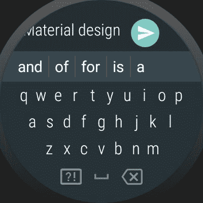
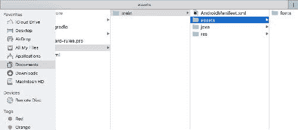
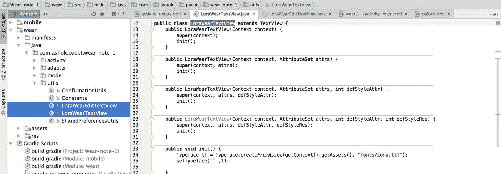
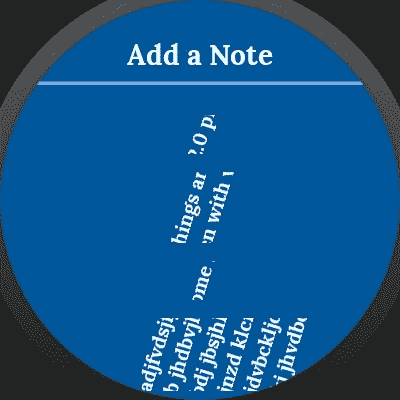

# 让我们帮助捕捉你的想法 - 保存数据和定制 UI

从零开始构建记事本应用程序是一次很好的学习经历。在本章中，我们将了解如何按照 Wear 设计标准升级同一代码以实现新的用户界面。**Wear-note 1** 应用程序将通过以下更新迁移到 **Wear-note 2**：

+   集成 Realm 数据库

+   UI 更新

+   集成自定义字体和资源

+   完成项目收尾工作

为了在 Android Studio 中进一步协助开源 wear-note 1 项目，编译项目并逐屏检查项目。你会发现该应用程序的主要功能是在 Wear 设备上保存便签。在此应用程序中，我们有白色的背景和黑色的字体颜色。`SharedPreferences` 帮助应用程序持久化数据。

进一步回顾，我们知道如何使用 `WearableRecyclerView`、`DelayedConfirmationView` 和 `BoxInsetLayout` 在 Wear 设备上获得最佳的应用体验。

接下来，让我们按照之前提到的更改来完成项目。我们将这个应用程序称为 wear-note-2。在你的 `res` 目录下的 `values` 目录中，打开 `string.xml` 文件，将应用程序名称更改为 Wear-note-2，如下所示：

```java
<string name="app_name">Wear-note-2</string>

```


# Wear-note-2

让我们开始在这个子模块中用 RealmDB 替换数据库并开发功能。

**RealmDB** 在现代 Android 编程世界中引起了轰动；它是内置在 Android SDK 中的 SQLite 数据库的一个简单替代品。Realm 并没有使用 SQLite 作为其核心引擎；它有自己的 C++ 核心，专为移动设备而设计。Realm 使用 C++ 核心以通用、基于表的形式保存数据。Realm 处理一系列复杂的查询，并允许从多种语言以及许多临时查询访问数据。

# Realm 的优势

+   Realm 的速度是 SQLite 的 10 倍

+   易于使用

+   跨平台

+   内存高效

+   文档齐全且社区支持优秀

进一步探索 Realm，我们会发现 Realm 做了许多优化，比如整数打包和将常见字符串转换为枚举，这比 SQLite + ORM 数据库解决方案的性能更好。传统的 SQLite + ORM 抽象是泄漏的，ORM 仅将对象及其方法转换为 SQL 语句，导致性能不佳。另一方面，Realm 是一个面向对象的数据库，这意味着你的数据以对象形式保存，这在你的数据库中得到了体现。Realm 使用 B+ 树在内存中映射整个数据，每当查询数据时，Realm 计算偏移量，从内存映射区域读取，并返回原始值。通过这种方式，Realm 避免了零拷贝（传统的从数据库读取数据的方式会导致不必要的复制（原始数据 > 反序列化表示 > 语言级对象））。

当开发者想要实现延迟加载时，Realm 是一个完美的选择；因为属性以列的形式表示而不是行，它可以按需延迟加载属性，并且由于列结构，读取速度更快，而插入速度较慢。但对于移动应用程序的上下文来说，这是一个很好的权衡。

Realm 使用 **多版本并发控制**（**MVCC**）模型，这意味着可以同时进行多个读事务，并且在提交写事务的同时也可以进行读取。

欲了解更多信息，请访问[`realm.io/news/jp-simard-realm-core-database-engine/.`](https://realm.io/news/jp-simard-realm-core-database-engine/)

# Realm 的缺点

在选择 Realm 之前，应该考虑其一些瓶颈。不过，对于高扩展性的 Android 应用程序，这些瓶颈是可以接受的：

+   我们无法将 Realmdb 导入到其他应用程序中

+   我们不能跨线程访问对象

+   不支持 ID 的自动递增

+   迁移 Realmdb 是一项痛苦的工作

+   缺乏复合主键

+   仍在积极开发中

在 **Wear-note-1** 项目中，将 `string.xml` 中的名称更改为 Wear-note-2 后，我们需要在 gradle-project 模块中添加适当的 Realm 依赖。在撰写本书时，最新的 Realm 版本是 3.0.0，因此我们将详细讨论依赖项和代码。

# 重新构建代码和依赖关系

Realm 现在有了一个新机制。它不仅仅是一个 Gradle 依赖项，还是一个 Gradle 插件。我们将学习如何在项目中添加和使用 Realm。Gradle 插件依赖项应该添加到项目范围，即项目级别的 Gradle 依赖项。添加以下类路径，并通过互联网使其与项目同步：

```java
classpath "io.realm:realm-gradle-plugin:3.0.0"

```

将此依赖项添加到如下截图所示位置的 Gradle 项目级别文件中。在依赖项部分添加 `classpath`：


添加类路径依赖后，完整的 Gradle 文件将如下所示：

```java
// Top-level build file where you can add configuration options common to all sub-projects/modules.

buildscript {
    repositories {
        jcenter()
    }
    dependencies {
        classpath 'com.android.tools.build:gradle:2.2.3'

        //Realm plugin
        classpath "io.realm:realm-gradle-plugin:3.0.0"
        // NOTE: Do not place your application dependencies here; they 
        belong
        // in the individual module build.gradle files
    }
}

allprojects {
    repositories {
        jcenter()
    }
}

task clean(type: Delete) {
    delete rootProject.buildDir
}

```

接下来，我们将把 Realm 插件应用到项目中，以使用如以下截图所示的所有 Realm 功能：

```java
apply plugin: 'realm-android'

```


Realm 社区已经开源了一些修改过的 Gradle 文件样本：

[`github.com/realm/realm-java/blob/master/examples/build.gradle

https://github.com/realm/realm-java/blob/master/examples/introExample/build.gradle`](https://github.com/realm/realm-java/blob/master/examples/build.gradle)

现在，我们已经准备好将 `SharedPreferences` 替换为 Realm。让我们开始吧。

打开 Android Studio，在 model 包中，我们定义了 `Note.java` POJO 类，其中包含原始数据字符串 notes 和字符串 ID。这些变量有它们的 getter 和 setter。额外的更改如下：

将 POJO 模型扩展到 `RealmObject` 并创建一个空构造函数：

```java
public class Note extends RealmObject {

    private String notes = "";
    private String id = "";

   //Empty constructor
    public Note() {

    }

    public Note(String id, String notes) {
        this.id = id;
        this.notes = notes;
    }

    public String getNotes() {
        return notes;
    }

    public void setNotes(String notes) {
        this.notes = notes;
    }

    public String getId() {
        return id;
    }

    public void setId(String id) {
        this.id = id;
    }

}

```

在 `MainActivity` 中，我们将全局实例化 `Realm` 类，并在 `onCreate` 方法中如下初始化：

```java
//MainActivity scope
//Realm Upgrade
private Realm realm;

@Override
protected void onCreate(Bundle savedInstanceState) {
    super.onCreate(savedInstanceState);
    ....
    //Realm init
    Realm.init(this);
    realm = Realm.getDefaultInstance();
}

```

在`updateAdapter()`方法中，我们将必须添加从 Realm 读取的查询，如下所示：

```java
 RealmResults<Note> results = realm.where(Note.class).findAll();

```

完整的方法将如下所示：

```java
private void updateAdapter() {
    RealmResults<Note> results = realm.where(Note.class).findAll();
    myDataSet.clear();
    myDataSet.addAll(SharedPreferencesUtils.getAllNotes(this));
    mAdapter.setListNote(myDataSet);
    mAdapter.notifyDataSetChanged();
}

```

Realm 数据库提供了许多查询，这些查询为存储的数据建立了一对一和一对多的关系，对于这个项目，前面的查询完成了所需的所有神奇工作。

在`createNote()`方法中，我们将更改代码以使用 Realm 而不是`SharedPreference`，如下所示：

```java
private Note createNote(String id, String note) {
    if (id == null) {
        id = String.valueOf(System.currentTimeMillis());
        realm.beginTransaction();
        Note notes = realm.createObject(Note.class);
        notes.setId(id);
        notes.setNotes(note);
        realm.commitTransaction();
    }
    return new Note(id, note);
}

```

为了删除记录，让我们创建一个新方法，并将其命名为`deleteRecord()`。在这个方法中，我们将传递笔记的 ID，并从 Realm 中删除该笔记：

```java
public void deleteRecord(String id){
    RealmResults<Note> results = realm.where(Note.class).equalTo("id", 
    id).findAll();

    realm.beginTransaction();

    results.deleteAllFromRealm();

    realm.commitTransaction();
}

```

现在，让我们在`updateData()`方法中调用删除记录的方法，如下所示：

```java
private void updateData(Note note, int action) {
    if (action == Constants.ACTION_ADD) {
        ConfirmationUtils.showMessage(getString(R.string.note_saved), 
        this);
    } else if (action == Constants.ACTION_DELETE) {
        deleteRecord(note.getId());
        ConfirmationUtils.showMessage(getString(R.string.note_removed), 
        this);
    }
    updateAdapter();
}

```

完整的`MainActivity`代码如下所示：

```java
public class MainActivity extends WearableActivity implements RecyclerViewAdapter.ItemSelectedListener {

    private static final String TAG = "MainActivity";
    private static final int REQUEST_CODE = 1001;
    private RecyclerViewAdapter mAdapter;
    private List<Note> myDataSet = new ArrayList<>();

    //Realm Upgrade
    private Realm realm;

    @Override
    protected void onCreate(Bundle savedInstanceState) {
        super.onCreate(savedInstanceState);
        setContentView(R.layout.activity_main);
        configLayoutComponents();

        Realm.init(this);
        realm = Realm.getDefaultInstance();

    }

    private void configLayoutComponents() {
        WearableRecyclerView recyclerView = (WearableRecyclerView) 
        findViewById(R.id.wearable_recycler_view);
        recyclerView.setHasFixedSize(true);
        LinearLayoutManager mLayoutManager = new 
        LinearLayoutManager(this);
        recyclerView.setLayoutManager(mLayoutManager);

        mAdapter = new RecyclerViewAdapter();
        mAdapter.setListNote(myDataSet);
        mAdapter.setListener(this);
        recyclerView.setAdapter(mAdapter);

        EditText editText = (EditText) findViewById(R.id.edit_text);

        editText.setOnEditorActionListener(new 
        TextView.OnEditorActionListener() {
            @Override
            public boolean onEditorAction(TextView textView, int 
            action, KeyEvent keyEvent) {
                if (action == EditorInfo.IME_ACTION_SEND) {
                    String text = textView.getText().toString();
                    if (!TextUtils.isEmpty(text)) {
                        Note note = createNote(null, text);
                        SharedPreferencesUtils.saveNote(note, 
                        textView.getContext());
                        updateData(note, Constants.ACTION_ADD);
                        textView.setText("");
                        return true;
                    }
                }
                return false;
            }
        });
    }

    private void updateAdapter() {
        RealmResults<Note> results = realm.where(Note.class).findAll();
        myDataSet.clear();
        myDataSet.addAll(results);
        mAdapter.setListNote(myDataSet);
        mAdapter.notifyDataSetChanged();
    }

    @Override
    protected void onResume() {
        super.onResume();
        updateAdapter();
    }

    @Override
    public void onItemSelected(int position) {
        Intent intent = new Intent(getApplicationContext(), 
        DeleteActivity.class);
        intent.putExtra(Constants.ITEM_POSITION, position);
        startActivityForResult(intent, REQUEST_CODE);
    }

    @Override
    protected void onActivityResult(int requestCode, int resultCode, 
    Intent data) {
        if (data != null && requestCode == REQUEST_CODE && resultCode 
        == RESULT_OK) {
            if (data.hasExtra(Constants.ITEM_POSITION)) {
                int position = 
                data.getIntExtra(Constants.ITEM_POSITION, -1);
                if (position > -1) {
                    Note note = myDataSet.get(position);
                    updateData(note, Constants.ACTION_DELETE);
                }
            }
        }
    }

    private void prepareUpdate(String id, String title, int action) {
        if (!(TextUtils.isEmpty(id) && TextUtils.isEmpty(title))) {
            Note note = createNote(id, title);
            updateData(note, action);
        }
    }

    private void updateData(Note note, int action) {
        if (action == Constants.ACTION_ADD) {
            ConfirmationUtils.showMessage
            (getString(R.string.note_saved), this);

        } else if (action == Constants.ACTION_DELETE) {
            deleteRecord(note.getId());
            ConfirmationUtils.showMessage(getString
            (R.string.note_removed), this);
        }
        updateAdapter();
    }

    /**
     * Notifica a Data Layer API que os dados foram modificados.
     */

    private Note createNote(String id, String note) {
        if (id == null) {
            id = String.valueOf(System.currentTimeMillis());
            realm.beginTransaction();
            Note notes = realm.createObject(Note.class);
            notes.setId(id);
            notes.setNotes(note);
            realm.commitTransaction();
        }
        return new Note(id, note);
    }

    public void deleteRecord(String id){
        RealmResults<Note> results = realm.where(Note.class)
        .equalTo("id", id).findAll();

        realm.beginTransaction();

        results.deleteAllFromRealm();

        realm.commitTransaction();
    }

    @Override
    protected void onDestroy() {
        realm.close();
        super.onDestroy();
    }
}

```

现在，从功能上讲，我们已经将 Realmdb 集成到了 Wear-note-2 应用中。让我们编译一下看看结果。

Wear 记事本应用的主屏幕如下所示：


Wear 操作系统处理的 IMF 屏幕，用于获取用户的输入：


通过 Wear 支持库中的默认`confirmationActivity`实现的‘保存动画’：


保存了笔记的主屏幕：


现在，我们已经将`Sharedpreference`替换成了我们这个时代 Android 的最佳数据库。

# 在 Wear 用户界面上的工作

在 Wear-note 应用中，我们使用白色背景和黑色文字，并使用默认的 Roboto 字体。在准备一个好的 Wear 应用设计时，谷歌建议使用深色来提高电池效率。典型材料设计中使用的浅色方案在 Wear 设备上并不节能。浅色在 OLED 显示屏上耗能更低。

浅色需要以更亮的强度点亮像素。白色需要将像素中的 RGB 二极管点亮到 100%；应用中白色和浅色越多，应用的电池效率就越低。

浅色在暗光下或夜间使用 Wear 设备时会产生干扰。这种情况在使用深色时可能不会发生。与浅色不同，深色在激活时使屏幕亮度降低，从而在 OLED 显示屏上节省电池。

# 让我们开始着手 Wear-note-2 用户界面工作

让我们更改应用主题以适应标准设计指南。

在`activity_main.xml`文件中，我们将编辑父容器的背景，即`BoxInsetLayout`的背景`android:background="#01579B"`改为钴蓝色。

在`values`目录下添加一个新的`color.xml`文件，并加入以下代码：

```java
//Add this color value in the color.xml in res directory 
<color name="cobalt_blue">#01579B</color>

```

添加颜色后，我们可以在生产应用中使用该颜色，如下所示：

```java
<android.support.wearable.view.BoxInsetLayout
    xmlns:android="http://schemas.android.com/apk/res/android"
    xmlns:tools="http://schemas.android.com/tools"
    xmlns:app="http://schemas.android.com/apk/res-auto"
    android:layout_width="match_parent" 
    android:layout_height="match_parent"
    android:id="@+id/container"
    tools:context="com.ashok.packt.wear_note_1.activity.MainActivity"
    tools:deviceIds="wear"
    android:background="@color/cobalt_blue"
    app:layout_box="all"
    android:padding="5dp">

```

进一步，让我们更改`EditText`提示文字的颜色，如下所示：

```java
<EditText
    android:id="@+id/edit_text"
    android:layout_width="match_parent"
    android:layout_height="50dp"
    android:layout_gravity="center"
    android:gravity="center"
    android:hint="@string/add_a_note"
    android:imeOptions="actionSend"
    android:inputType="textCapSentences|textAutoCorrect"
 android:textColor="@color/white"
    android:textColorHint="@color/white"
    android:layout_alignParentTop="true"
    android:layout_alignParentStart="true" />

```

在`each_item.xml`布局中，按照以下方式修改 XML 代码：

```java
<?xml version="1.0" encoding="utf-8"?>
<LinearLayout
    xmlns:android="http://schemas.android.com/apk/res/android"
    xmlns:tools="http://schemas.android.com/tools"
    android:layout_width="match_parent"
    android:layout_height="match_parent"
    android:gravity="center"
    android:layout_gravity="center"
    android:clickable="true"
    android:background="?android:attr/selectableItemBackground"
    android:orientation="vertical">

    <TextView
        android:id="@+id/note"
        android:layout_width="wrap_content"
        android:layout_height="wrap_content"
        android:gravity="center"
        android:layout_gravity="center"
        android:textColor="@color/white"
        tools:text="note"/>

</LinearLayout>

```

现在，在`activity_delete.xml`布局容器的相同位置进行更改，改变其背景颜色和`TextView`的颜色。使用`xmlns`属性可以更改`DelayedConfirmationView`的颜色，如下代码所示：

```java
<android.support.wearable.view.DelayedConfirmationView
    android:id="@+id/delayed_confirmation"
    android:layout_width="wrap_content"
    android:layout_height="wrap_content"
    android:src="img/ic_delete"
    app:circle_border_color="@color/white"
    app:circle_color="@color/white"
    app:circle_border_width="8dp"
    app:circle_radius="30dp"/>

```

开发人员无需担心更改`DelayedConfirmationView`中的动画颜色，Wear 2.0 会自动适应`DelayedConfirmationView`的主题，并改变主色方案，以创建统一的体验。

所有这些更改将如下反映在应用程序中：


IMF 屏幕用于从用户获取输入：



使用 Realm 保存数据后：


从数据库中删除便签：


# 更好的字体，更好的阅读体验

在数字设计的世界中，让你的应用程序视觉效果对用户的眼睛友好是很重要的。来自谷歌收藏的 Lora 字体拥有平衡的现代衬线，其根源在于书法。这是一种中等对比度的文本字体，非常适合正文字体。设置为 Lora 的段落将因其刷过的曲线与有力的衬线形成对比而令人难忘。Lora 的整体排版风格完美传达了现代故事或艺术论文的情绪。从技术上讲，Lora 针对屏幕显示进行了优化。

要将自定义字体添加到 Android 项目中，我们需要在根目录中创建`assets`文件夹。查看以下截图：



我们可以直接将`.ttf`文件添加到资产目录中，或者我们可以创建另一个目录和字体。你可以通过这个 URL 下载 Lora 字体：[`fonts.google.com/download?family=Lora`](https://fonts.google.com/download?family=Lora)。

将字体文件添加到资产文件夹后，我们需要创建自定义的`Textview`和`EditText`。

在`utils`包中，让我们创建一个名为`LoraWearTextView`和`LoraWearEditTextView`的类，如下所示：



现在，将`LoraWearTextView`扩展到`TextView`类，`LoraWearEditTextView`扩展到`EditText`类。在两个类中实现构造方法。创建一个名为`init()`的新方法。在`init`方法内部，实例化`Typeface`类，并使用`createFromAsset`方法，我们可以设置我们的自定义字体：

```java
public void init() {
    Typeface tf = Typeface.createFromAsset(getContext().getAssets(), 
    "fonts/Lora.ttf");
    setTypeface(tf ,1);

}

```

前面的`init`方法在这两个类中是相同的。在两个新自定义类的所有不同参数化构造函数中调用`init`方法。

完整的类如下所示：`LoraWearTextView.java`

```java
public class LoraWearTextView extends TextView {
    public LoraWearTextView(Context context) {
        super(context);
        init();
    }

    public LoraWearTextView(Context context, AttributeSet attrs) {
        super(context, attrs);
        init();
    }

    public LoraWearTextView(Context context, AttributeSet attrs, int 
    defStyleAttr) {
        super(context, attrs, defStyleAttr);
        init();
    }

    public LoraWearTextView(Context context, AttributeSet attrs, int 
    defStyleAttr, int defStyleRes) {
        super(context, attrs, defStyleAttr, defStyleRes);
        init();
    }

    public void init() {
        Typeface tf = Typeface.createFromAsset(getContext()
        .getAssets(), "fonts/Lora.ttf");
        setTypeface(tf ,1);

    }
}

```

完整的类如下所示：`LoraWearEditTextView.java`

```java
public class LoraWearEditTextView extends EditText {

public LoraWearEditTextView(Context context) {
 super(context);
 init();
}

public LoraWearEditTextView(Context context, AttributeSet attrs) {
 super(context, attrs);
 init();
}

public LoraWearEditTextView(Context context, AttributeSet attrs, int defStyleAttr) {
 super(context, attrs, defStyleAttr);
 init();
}

public LoraWearEditTextView(Context context, AttributeSet attrs, int defStyleAttr, int defStyleRes) {
 super(context, attrs, defStyleAttr, defStyleRes);
 init();
}

public void init() {
 Typeface tf = Typeface.createFromAsset(getContext().getAssets(), 
 "fonts/Lora.ttf");
 setTypeface(tf ,1);
}

```

在我们的 UI 布局中添加这两个类之后，我们可以替换实际的`textview`和`edittext`：

```java
<com.ashok.packt.wear_note_1.utils.LoraWearEditTextView
    android:id="@+id/edit_text"
    android:layout_width="match_parent"
    android:layout_height="50dp"
    android:layout_gravity="center"
    android:gravity="center"
    android:hint="@string/add_a_note"
    android:imeOptions="actionSend"
    android:inputType="textCapSentences|textAutoCorrect"
    android:textColor="@color/white"
    android:textColorHint="@color/white"
    android:layout_alignParentTop="true"
    android:layout_alignParentStart="true" />

<com.ashok.packt.wear_note_1.utils.LoraWearTextView
    android:id="@+id/note"
    android:layout_width="wrap_content"
    android:layout_height="wrap_content"
    android:gravity="center"
    android:layout_gravity="center"
    android:textColor="@color/white"
    tools:text="note"/>

```

替换`textview`和`edittext`之后，编译程序，让我们看看结果：


通过`confirmationViewActivity`删除便签动画：


在本章中，我们探讨了如何集成 Realm 流行数据库，理解了可穿戴设备的设计理念，并创建了自定义视图组件以获得更好的应用程序用户体验。

# 编写自定义布局以获得更好的用户体验

Android 提供了很好的方法来定制我们用作容器的布局。我们可以有复合视图并自定义布局以实现我们自己的目的。可穿戴设备使用与手持 Android 设备相同的布局技术，但需要针对特定的约束和配置进行设计。将手持 Android 设备组件的功能移植到可穿戴应用设计并不是一个好主意。要设计一个优秀的可穿戴应用，请遵循 Google 的设计指南，访问[`developer.android.com/design/wear/index.html`](https://developer.android.com/design/wear/index.html)。让我们创建自定义视图并在可穿戴笔记应用程序中使用它们。

让我们按照加载项目的方式来为我们的布局实现动画。我们将有一个简单的滑动动画，我们将用我们编写的自定义布局来实现这一点。

让我们创建一个名为`AnimatedLinearLayout`的类文件，并按照以下方式扩展它到`LinearLayout`：

复合视图是将两个或多个视图捆绑为一个组件，例如，可勾选的相对布局。当用户点击布局时，它会像复选框一样突出显示布局。

```java
public class AnimatedLinearLayout extends LinearLayout {

...

}

```

现在，我们需要从`View`获取`Animation`类。除了`Animation`类，还要为`currentChild`视图声明`View`实例。由于我们正在编写布局，它可以保存子层次结构，因此我们需要一个视图实例作为引用：

```java
Animation animation;
View currentChild;

```

当我们扩展`LinearLayout`类时，我们会得到一些构造函数`回调`，我们必须实现这些回调：

```java
public AnimatedLinearLayout(Context context) {
    super(context);
}

public AnimatedLinearLayout(Context context, AttributeSet attrs) {
    super(context, attrs);
}

@Override
public void onWindowFocusChanged(boolean hasWindowFocus) {
    super.onWindowFocusChanged(hasWindowFocus);
    ...
}

```

在`onWindowFocusChanged()`方法中，我们可以编写自定义动画的逻辑。在这里，本书介绍了`SlideDown`、`SlideDownMore`、`RotateClockWise`、`RotateAntiClockWise`和`ZoomInAndRotateClockWise`。现在，为了实现这一点，我们需要检查视图是否已膨胀并且有窗口显示，以及布局有多少个`childviews`：

```java
if (hasWindowFocus) {
    for (int index = 0; index < getChildCount(); index++) {
        View child = getChildAt(index);
        currentChild=child;
}

```

检查子元素是否是`Viewgroup`的实例；如果视图是完全以其他隔离方式开发的，那么这个自定义布局将无法帮助该视图进行动画处理。使用子视图的标签属性，我们可以为动画分配一个字符串关联，如下所示：

```java
if(!(child instanceof ViewGroup)) {
   switch (child.getTag().toString()) {
   case SLIDE_DOWN:
     // write logic to slide down animation

```

对于向下滑动动画，使用我们全局创建的动画实例，我们必须设置插值器并通过子视图的高度和数值 2 来减速插值。查看以下代码：

```java
case SLIDE_DOWN:
    animation = new TranslateAnimation(0, 0, -
    ((child.getMeasuredHeight()/2) * (index + 1)), 0);
    animation.setInterpolator(new DecelerateInterpolator());
    animation.setFillAfter(true);
    animation.setDuration(1000);
    child.post(new AnimationRunnable(animation,child));
    //child.startAnimation(animation);
    break; 

```

同样，我们将完成其他情况。让我们开始完成`onWindowFocusChanged()`方法：

```java
@Override
public void onWindowFocusChanged(boolean hasWindowFocus) {
    super.onWindowFocusChanged(hasWindowFocus);
    final String SLIDE_DOWN = "SlideDown";
    final String SLIDE_DOWN_MORE = "SlideDownMore";
    final String ROTATE_CLOCKWISE = "RotateClockWise";
    final String ROTATE_ANTI_CLOCKWISE = "RotateAntiClockWise";
    final String ZOOMIN_AND_ROTATE_CLOCKWISE = 
    "ZoomInAndRotateClockWise";
    if (hasWindowFocus) {
        for (int index = 0; index < getChildCount(); index++) {
            View child = getChildAt(index);
            currentChild=child;
            if(!(child instanceof ViewGroup)) {
                switch (child.getTag().toString()) {
                    case SLIDE_DOWN:
                        animation = new TranslateAnimation(0, 0, -
                        ((child.getMeasuredHeight()/2) * 
                        (index + 1)), 0);
                        animation.setInterpolator(new 
                        DecelerateInterpolator());
                        animation.setFillAfter(true);
                        animation.setDuration(1000);
                        child.post(new 
                        AnimationRunnable(animation,child));
                        //child.startAnimation(animation);
                        break;
                    case SLIDE_DOWN_MORE:
                        animation = new TranslateAnimation(0, 0, -
                        (child.getMeasuredHeight() * (index + 25)), 0);
                        animation.setInterpolator(new 
                        DecelerateInterpolator());
                        animation.setFillAfter(true);
                        animation.setDuration(1000);
                        child.post(new 
                        AnimationRunnable(animation,child));
                        //child.startAnimation(animation);
                        break;
                    case ROTATE_CLOCKWISE:
                        animation = new RotateAnimation(0, 360,            
                        child.getMeasuredWidth() / 2, 
                        child.getMeasuredHeight() / 2);
                        animation.setInterpolator(new 
                        DecelerateInterpolator());
                        animation.setFillAfter(true);
                        animation.setDuration(1000);
                        child.post(new 
                        AnimationRunnable(animation,child));
                        //child.startAnimation(animation);
                        break;
                    case ROTATE_ANTI_CLOCKWISE:
                        animation = new RotateAnimation(0, -360,                 
                        child.getMeasuredWidth() / 2, 
                        child.getMeasuredHeight() / 2);
                        animation.setInterpolator(new 
                        DecelerateInterpolator());
                        animation.setFillAfter(true);
                        animation.setDuration(1000);
                        child.post(new 
                        AnimationRunnable(animation,child));
                        //child.startAnimation(animation);
                        break;
                    case ZOOMIN_AND_ROTATE_CLOCKWISE:
                        AnimationSet animationSet = new 
                        AnimationSet(true);
                        animationSet.setInterpolator(new 
                        DecelerateInterpolator());
                        animation = new ScaleAnimation(0, 1, 0, 1, 
                        child.getMeasuredWidth() / 2, 
                        child.getMeasuredHeight() / 2);
                        animation.setStartOffset(0);
                        animation.setFillAfter(true);
                        animation.setDuration(1000);
                        animationSet.addAnimation(animation);
                        animation = new RotateAnimation(0, 360, 
                        child.getMeasuredWidth() / 2, 
                        child.getMeasuredHeight() / 2);
                        animation.setStartOffset(0);
                        animation.setFillAfter(true);
                        animation.setDuration(1000);
                        animationSet.addAnimation(animation);
                        child.post(new 
                        AnimationSetRunnable(animationSet,child));
                        //child.startAnimation(animationSet);
                        break;
                }
            }
        }
    }
}

```

现在，我们需要创建一个`AnimationRunnable`类，它实现了`Runnable`接口以启动动画：

```java
private class AnimationRunnable implements Runnable{
    private Animation animation;
    private View child;
    AnimationRunnable(Animation animation, View child) {
        this.animation=animation;
        this.child=child;
    }

    @Override
    public void run() {
        child.startAnimation(animation);
    }
}

```

我们将实现另一个`AnimationSetRunnable`类到可运行接口以设置动画：

```java
private class AnimationSetRunnable implements Runnable{
    private AnimationSet animation;
    private View child;
    AnimationSetRunnable(AnimationSet animation, View child) {
        this.animation=animation;
        this.child=child;
    }

    @Override
    public void run() {
        child.startAnimation(animation);
    }
}

```

现在，我们已经完成了自己的自定义布局，该布局具有几种动画方法，可以应用于布局中的所有视图子项。这个自定义布局的完整类代码如下所示：

```java
public class AnimatedLinearLayout extends LinearLayout {
    Animation animation;
    View currentChild;

    public AnimatedLinearLayout(Context context) {
        super(context);
    }

    public AnimatedLinearLayout(Context context, AttributeSet attrs) {
        super(context, attrs);
    }

    @Override
    public void onWindowFocusChanged(boolean hasWindowFocus) {
        super.onWindowFocusChanged(hasWindowFocus);
        final String SLIDE_DOWN = "SlideDown";
        final String SLIDE_DOWN_MORE = "SlideDownMore";
        final String ROTATE_CLOCKWISE = "RotateClockWise";
        final String ROTATE_ANTI_CLOCKWISE = "RotateAntiClockWise";
        final String ZOOMIN_AND_ROTATE_CLOCKWISE = 
        "ZoomInAndRotateClockWise";
        if (hasWindowFocus) {
            for (int index = 0; index < getChildCount(); index++) {
                View child = getChildAt(index);
                currentChild=child;
                if(!(child instanceof ViewGroup)) {
                    switch (child.getTag().toString()) {
                        case SLIDE_DOWN:
                            animation = new TranslateAnimation(0, 0, -
                            ((child.getMeasuredHeight()/2) * 
                             (index + 1)), 0);
                            animation.setInterpolator(new 
                            DecelerateInterpolator());
                            animation.setFillAfter(true);
                            animation.setDuration(1000);
                            child.post(new 
                            AnimationRunnable(animation,child));
                            //child.startAnimation(animation);
                            break;
                        case SLIDE_DOWN_MORE:
                            animation = new TranslateAnimation(0, 0, -
                            (child.getMeasuredHeight() * 
                            (index + 25)), 0);
                            animation.setInterpolator(new 
                            DecelerateInterpolator());
                            animation.setFillAfter(true);
                            animation.setDuration(1000);
                            child.post(new 
                            AnimationRunnable(animation,child));
                            //child.startAnimation(animation);
                            break;
                        case ROTATE_CLOCKWISE:
                            animation = new RotateAnimation(0, 360, 
                            child.getMeasuredWidth() / 2, 
                            child.getMeasuredHeight() / 2);
                            animation.setInterpolator(new 
                            DecelerateInterpolator());
                            animation.setFillAfter(true);
                            animation.setDuration(1000);
                            child.post(new 
                            AnimationRunnable(animation,child));
                            //child.startAnimation(animation);
                            break;
                        case ROTATE_ANTI_CLOCKWISE:
                            animation = new RotateAnimation(0, -360, 
                            child.getMeasuredWidth() / 2, 
                            child.getMeasuredHeight() / 2);
                            animation.setInterpolator(new 
                            DecelerateInterpolator());
                            animation.setFillAfter(true);
                            animation.setDuration(1000);
                            child.post(new 
                            AnimationRunnable(animation,child));
                            //child.startAnimation(animation);
                            break;
                        case ZOOMIN_AND_ROTATE_CLOCKWISE:
                            AnimationSet animationSet = new 
                            AnimationSet(true);
                            animationSet.setInterpolator(new 
                            DecelerateInterpolator());
                            animation = new ScaleAnimation(0, 1, 0, 1, 
                            child.getMeasuredWidth() / 2, 
                            child.getMeasuredHeight() / 2);
                            animation.setStartOffset(0);
                            animation.setFillAfter(true);
                            animation.setDuration(1000);
                            animationSet.addAnimation(animation);
                            animation = new RotateAnimation(0, 360, 
                            child.getMeasuredWidth() / 2, 
                            child.getMeasuredHeight() / 2);
                            animation.setStartOffset(0);
                            animation.setFillAfter(true);
                            animation.setDuration(1000);
                            animationSet.addAnimation(animation);
                            child.post(new 
                            AnimationSetRunnable(animationSet,child));
                            //child.startAnimation(animationSet);
                            break;
                    }
                }
            }
        }
    }

    private class AnimationRunnable implements Runnable{
        private Animation animation;
        private View child;
        AnimationRunnable(Animation animation, View child) {
            this.animation=animation;
            this.child=child;
        }

        @Override
        public void run() {
            child.startAnimation(animation);
        }
    }
    private class AnimationSetRunnable implements Runnable{
        private AnimationSet animation;
        private View child;
        AnimationSetRunnable(AnimationSet animation, View child) {
            this.animation=animation;
            this.child=child;
        }

        @Override
        public void run() {
            child.startAnimation(animation);
        }
    }
}

```

现在，在完全编写完这个类之后，是时候在我们的项目中使用它了。我们可以将这个类名作为一个 XML 标签，并在`recyclerview`的行项布局`each_item.xml`中使用它：

```java
<com.ashok.packt.wear_note_1.utils.AnimatedLinearLayout 
    xmlns:android="http://schemas.android.com/apk/res/android"
    xmlns:tools="http://schemas.android.com/tools"
    android:orientation="vertical">

</com.ashok.packt.wear_note_1.utils.AnimatedLinearLayout>

```

使用新的`AnimatedLinearLayout`替换布局代码。我们需要在`childviews`中传递标签以实现动画效果。以下代码详细解释了这一点：

```java
<?xml version="1.0" encoding="utf-8"?>
<com.ashok.packt.wear_note_1.utils.AnimatedLinearLayout xmlns:android="http://schemas.android.com/apk/res/android"
    xmlns:tools="http://schemas.android.com/tools"
    android:layout_width="match_parent"
    android:layout_height="match_parent"
    android:layout_gravity="center"
    android:background="?android:attr/selectableItemBackground"
    android:clickable="true"
    android:gravity="center"
    android:orientation="vertical">

    <com.ashok.packt.wear_note_1.utils.AnimatedLinearLayout
        android:layout_width="match_parent"
        android:layout_height="wrap_content"
        android:layout_marginTop="10dp"
        android:gravity="center"
        android:orientation="horizontal">

        <com.ashok.packt.wear_note_1.utils.LoraWearTextView
            android:id="@+id/note"
            android:layout_width="wrap_content"
            android:layout_height="wrap_content"
            android:layout_gravity="center"
            android:gravity="center"
 android:tag="ZoomInAndRotateClockWise"            android:textColor="@color/white"
            tools:text="note" />
    </com.ashok.packt.wear_note_1.utils.AnimatedLinearLayout>

</com.ashok.packt.wear_note_1.utils.AnimatedLinearLayout>

```

这种布局将通过小型动画绘制所有视图并显示列表项。

`ZoomInAndRotateClockWise`动画，尝试将字符串更改为`Custom`类中给出的完全相同的字符串：



# 概述

在本章中，我们了解了暗色主题在穿戴设备上的重要性。我们使用字体资源更改了自定义的`TextView`。我们已经了解了如何编写自定义布局并在其中定义了一些动画。在后续的项目中，我们将进一步探索 Wear 2.0 独家引入的设计指南和组件，如`Wearable action drawer`和`wearable navigation drawer`。
