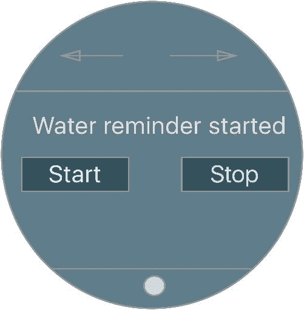
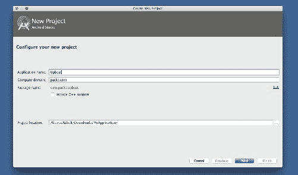
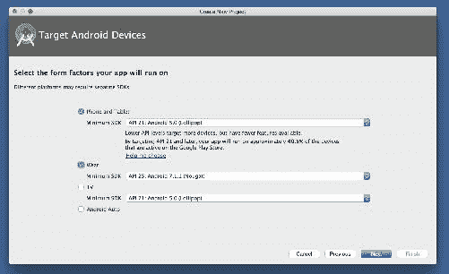
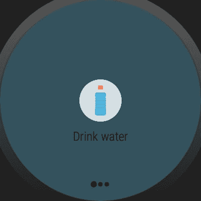
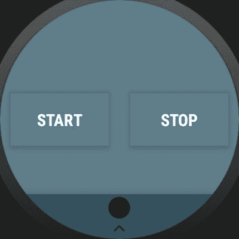

# 测量你的健康 - 传感器

我们生活在科技领域！这绝对不是这里的重点。我们也生活在复杂生活方式的领域，这些生活方式正在将每个人的健康推向某种疾病。我们的存在让我们回到海洋的根源；我们都知道，我们是从水中进化而来的生物。如果我们追溯，我们会清楚地了解我们身体组成 60%是水，其余的是肌肉水分。当我们谈论照顾我们的健康时，我们会忽略简单的事情，比如喝足够的水。适量、定期饮水将确保新陈代谢良好和健康、功能正常的器官。然后，新千年的技术进步表达了如何利用技术来做正确的事情。

Android Wear 集成了众多传感器，可用于帮助 Android Wear 用户测量他们的心率、步数等。说到这里，编写一个应用程序如何？该程序可以每 30 分钟提醒我们喝水，测量我们的心率和步数，并提供一些健康小贴士。

本章将帮助你了解如何列出 Wear 设备中所有可用的传感器，并使用它们来测量步数、心率等。

在本章中，我们将探讨以下内容：

+   列出 Wear 中的可用传感器

+   传感器的准确性和电池消耗

+   Wear 2.0 省电模式

+   编写具有初始逻辑的应用程序

+   开始为 Wear 设计材料设计

+   为应用程序创建用户界面

# 概念化应用程序

我们将要构建的 Wear 应用程序将有三个主要界面，用于启动饮水提醒、心率分析和步数计数器。

以下是启动提醒服务的饮水提醒屏幕。使用导航抽屉中的导航功能，我们可以切换到其他屏幕：



# 列出 Wear 中的可用传感器

了解您正在工作的 Wear 设备中可用的传感器列表实际上是有好处的，可以确保您不会得到错误的结果和不必要的等待。一些 Android Wear 设备没有心率传感器。在这种情况下，编写针对心率传感器的应用程序是没有意义的。以下是我们获取可用传感器列表的方法：

```java
public class SensorActivity extends Activity implements SensorEventListener {
  private SensorManager mSensorManager;
  private Sensor mLight;

  @Override
  public final void onCreate(Bundle savedInstanceState) {
    super.onCreate(savedInstanceState);
    setContentView(R.layout.main);

    mSensorManager = (SensorManager)  
    getSystemService(Context.SENSOR_SERVICE);
    mLight = mSensorManager.getDefaultSensor(Sensor.TYPE_LIGHT);

    mSensorManager = (SensorManager)     
    getSystemService(Context.SENSOR_SERVICE); 
    final List<Sensor> deviceSensors = 
    mSensorManager.getSensorList(Sensor.TYPE_ALL); 

    for(Sensor type : deviceSensors){      
        Log.e("sensors",type.getStringType()); 
    }
}

  @Override
  public final void onAccuracyChanged(Sensor sensor, int accuracy){
    // Do something here if sensor accuracy changes.
  }

  @Override
  public final void onSensorChanged(SensorEvent event) {

  }

  @Override
  protected void onResume() {
    super.onResume();

  }

  @Override
  protected void onPause() {
    super.onPause();
    mSensorManager.unregisterListener(this);
  }
}

```

我们将在控制台中看到 Wear 设备中所有可用的传感器，如下所示：

```java
E/sensors: android.sensor.accelerometer
E/sensors: android.sensor.magnetic_field
E/sensors: android.sensor.orientation
E/sensors: android.sensor.temperature
E/sensors: android.sensor.proximity
E/sensors: android.sensor.light
E/sensors: android.sensor.pressure
E/sensors: android.sensor.relative_humidity
E/sensors: android.sensor.geomagnetic_rotation_vector

```

# 传感器的准确性

所有集成在可穿戴设备中的传感器都展现出尽可能高的精确度和准确度。在为健康领域编写应用程序时，考虑传感器的准确性非常重要。由于 Android Wear 根据 Google IO 2017 的数据已经生产了近 40 个及以上的不同品牌，所以可穿戴设备中使用的传感器也取决于制造商。如果我们从零开始编写应用程序，却不知道可穿戴设备能提供什么功能，我们肯定会遇到很多挑战。大多数可穿戴设备都配备了步数检测器和步数计数传感器。或许，我们不必担心编写一个能预测设备三维动作并据此预测步数的加速度计程序，这种做法通常不准确。线性加速度预测的步数大多数时候会导致错误的结果。为了在某些使用场景中节省电池并做出有意义的决策，传感器发挥着至关重要的作用。运动传感器通过在手腕未被查看时开启环境模式来帮助节省可穿戴设备的电池。光线传感器允许设备根据外部光线影响增加或减少屏幕亮度。心率传感器在可穿戴设备中很常见。本质上，心率传感器是一种光学传感器。它不会像心电图（EKG）那样准确，但当你休息时使用它们，这些传感器的准确度会接近。使用相同的传感器，可以预测睡眠监测和活动跟踪，比如卡路里消耗。这些传感器正在变得更好，未来将极为准确，但为了硬件质量，可穿戴设备中配备的硬件问题将通过软件修复和软件级别的控制来解决。

常见的可穿戴集成传感器如下：

+   加速度计

+   磁力计

+   环境传感器

+   GPS

+   心率传感器

+   氧饱和度传感器

未来，可穿戴设备将配备更多更精确的传感器，并通过这些传感器瞄准健康领域。

# 电池消耗

电池至关重要。我们编写的程序应当旨在节省电池。Wear 1.x 的设计指南和标准没有采用材质设计，这对电池消耗造成了巨大影响。在 Wear 2.0 引入材质设计后，深色主题能节省更多电池变得显而易见。Android Wear 团队一直在努力改善电池续航。谷歌推出了一系列最佳实践来提升 Wear 设备的电池寿命。Wear 设备中的显示屏幕消耗大量电池。不同类型的显示屏在开启模式、常显模式和交互模式下消耗的电量各不相同。交互模式消耗的电量最大，因此我们需要关注何时编写交互模式。当然，对于大多数用例来说，电池消耗是必要的。当我们深入查看某个特定用例时，会发现有许多地方可以避免 Wear 电池消耗最大电量。我们应该始终在生产应用中仔细检查，确保释放所有会消耗电池的传感器和其他硬件。Android 提供了`WAKE_LOCK`机制，使开发者能够识别哪个应用正在使用哪些硬件，并在应用进入后台时帮助释放它们。编写服务对于运行长时间进程是必要的，但如果我们利用后台服务来获取硬件，它们将始终消耗电池，在这种情况下编写终止服务非常重要。

Android Studio 提供了一个名为 Battery Historian [`developer.android.com/studio/profile/battery-historian.html`](https://developer.android.com/studio/profile/battery-historian.html)的开源工具，用于分析应用的电池统计信息。Battery Historian 将电池数据转换为 HTML 可视化表示，可以在浏览器中查看。在尝试节省电池之前，我们需要知道哪个进程从电池中消耗了多少电流。之后，使用 Battery Historian 的数据，我们将确定哪个进程消耗了更多数据，并能够进行电池优化工作。

# 休眠模式

对于开发者来说，电池优化始终是一项挑战。谷歌启动了许多内部项目，例如 Project Volta，它坚持每秒 60 帧的动画速率。制造商开始流行发布配备最高电池容量的手机和平板电脑。这里的挑战在于引入了太多的新硬件组件，设备的使用时间仅延长了几个小时。谷歌没有简单地增大电池容量，而是从 API 级别 23 开始优化电池消耗过程，以适应应用适应休眠模式后的额外几小时使用时间。

当设备长时间未使用或设备长时间处于空闲状态时，设备将进入休眠模式。当系统尝试访问网络和 CPU 密集型服务时，休眠模式会阻止这种情况发生。休眠模式在周期时间后自动退出，访问网络，并同步所有任务和闹钟。以下限制适用于应用在休眠模式时：

+   网络操作被终止

+   系统忽略唤醒锁

+   标准的闹钟管理器需要等待退出休眠模式

+   要在休眠模式下触发闹钟，应使用 `setAndAllowWhileIdle()`

+   设备将不会执行 Wi-Fi 扫描

+   同步适配器受到限制

+   任务调度器受到限制

根据应用提供的能力，调整休眠模式可能会对它们产生不同的影响。几乎所有的应用在休眠模式下都能正常工作。在某些用例中，我们必须修改网络请求任务、闹钟和同步，并且应用应该在退出休眠模式时有效地管理所有活动。考虑到在 Android 5.1（API 级别 22）或更低版本中，当系统处于休眠模式时，闹钟不会触发，休眠模式可能会影响 `AlarmManager` 提醒的活动和定时器管理。为了帮助安排闹钟，Android 6.0（API 级别 23）引入了两个新的 `AlarmManager` 方法：`setAndAllowWhileIdle()` 和 `setExactAndAllowWhileIdle()`。使用这些方法，我们可以在休眠模式下触发闹钟。

# 创建一个项目

现在，让我们启动 Android Studio 并构建一个帮助我们完成所有这些操作的 Wear 应用。

1.  创建一个名为 `Upbeat` 的 Android 项目。由于这是一个与健康管理相关的应用，这个名字非常合适：



1.  在“目标 Android 设备”屏幕中选择 Phone 和 Wear 模块：



1.  现在，为手机模板选择 Empty Activity，为 Wear 选择 Always On Wear Activity。在项目成功创建后，进入 Wear 模块并添加配色方案文件，开始按照材料设计标准推动开发。

1.  在 `res/values` 目录中创建一个 `colors.xml` 文件，并添加以下颜色代码：

```java
<?xml version="1.0" encoding="utf-8"?>
<resources>
    <color name="colorPrimary">#607d8b</color>
    <color name="colorPrimaryDark">#34515e</color>
    <color name="colorAccent">#FFF</color>
</resources>

```

为了使项目代码的可读性更好，让我们创建名为 `fragments`、`services` 和 `utils` 的包。在这三个包中，我们将编写所有的工作代码。

1.  在这个项目中，我们将使用 `WearableDrawerLayout` 和 `WearableNavigationDrawer` 在片段之间导航。让我们在 wear 模块中设置 `MainActivity` 以使用 `WearableNavigationDrawer`。在 `activity_main.xml` 文件中，我们需要将根元素更改为 `WearableDrawerLayout`，如下所示：

```java
<android.support.wearable.view.drawer.WearableDrawerLayout
    xmlns:android="http://schemas.android.com/apk/res/android"
    xmlns:app="http://schemas.android.com/apk/res-auto"
    xmlns:tools="http://schemas.android.com/tools"
    android:id="@+id/drawer_layout"
    android:layout_width="match_parent"
    android:layout_height="match_parent"
    android:background="@color/colorPrimary"
    tools:context="com.packt.upbeat.MainActivity"
    tools:deviceIds="wear">

    .
    .
    .

</android.support.wearable.view.drawer.WearableDrawerLayout>

```

1.  在支持库中的 `nestedScrollview` 内，我们将添加 `framelayout` 作为要附加和分离的片段的容器。之后，我们可以附加 `WearableNavigationDrawer` 元素的另一个子元素。如果我们希望 Wear 应用拥有一个动作菜单，我们确实需要，那么我们应该添加另一个名为 `WearableActionDrawer` 的元素。在 `WearableDrawerLayout` 范围内添加以下代码：

```java
<android.support.wearable.view.drawer.WearableDrawerLayout
 ...

<android.support.v4.widget.NestedScrollView
 android:id="@+id/content"
 android:layout_width="match_parent"
 android:layout_height="match_parent"
 android:fillViewport="true">

 <FrameLayout
 android:id="@+id/content_frame"
 android:layout_width="match_parent"
 android:layout_height="match_parent" />

</android.support.v4.widget.NestedScrollView>

<android.support.wearable.view.drawer.WearableNavigationDrawer
 android:id="@+id/top_navigation_drawer"
 android:layout_width="match_parent"
 android:layout_height="match_parent"
 android:background="@color/colorPrimaryDark" />

<android.support.wearable.view.drawer.WearableActionDrawer
 android:id="@+id/bottom_action_drawer"
 android:layout_width="match_parent"
 android:layout_height="match_parent"
 android:background="@color/colorPrimaryDark"
 app:action_menu="@menu/drawer_menu" />

</android.support.wearable.view.drawer.WearableDrawerLayout>

```

# 添加一个抽屉菜单

我们将立即添加 `drawer_menu` 菜单 XML 资源。所有视觉元素都已为 `MainActivity` 做好准备。让我们在 Java 代码方面进行操作，为选定的导航抽屉项实现动态滑动和片段切换。在开始 `MainActivity` 之前，我们需要创建一个带有构造函数的抽屉项的 POJO 类：

```java
public class DrawerItem {
    private String name;
    private String navigationIcon;

    public DrawerItem(String name, String navigationIcon) {
        this.name = name;
        this.navigationIcon = navigationIcon;
    }

    public String getName() {
        return name;
    }

    public void setName(String name) {
        this.name = name;
    }

    public String getNavigationIcon() {
        return navigationIcon;
    }

    public void setNavigationIcon(String navigationIcon) {
        this.navigationIcon = navigationIcon;
    }
}

```

这些获取器和设置器将帮助设置抽屉图标和抽屉标题，正如我们之前在笔记应用中讨论 POJO 一样。

在 `MainActivity.java` 中，让我们实现 `WearableActionDrawer.OnMenuItemClickListener` 并重写 `onMenuItemClick`，如下所示：

```java
public class MainActivity extends WearableActivity  implements
        WearableActionDrawer.OnMenuItemClickListener{

....

@Override
public boolean onMenuItemClick(MenuItem menuItem) {
    Log.d(TAG, "onMenuItemClick(): " + menuItem);
    final int itemId = menuItem.getItemId();
  }
}

```

让我们在 `MainActivity` 的范围内初始化所有 `WearableDrawerLayout`、`WearableNavigationDrawer` 和 `WearableActionDrawer` 的实例，并进行必要的设置：

```java
private static final String TAG = "MainActivity";
private WearableDrawerLayout mWearableDrawerLayout;
private WearableNavigationDrawer mWearableNavigationDrawer;
private WearableActionDrawer mWearableActionDrawer;
private ArrayList<DrawerItem> drawer_itemArrayList;
private int mSelectedScreen;

```

在 `onCreate` 方法中，让我们通过 `findViewById()` 方法映射所有视觉组件。之后，我们将使用一个名为 `ViewTreeObserver` 的新类来进行快速预览和隐藏：

```java
@Override
protected void onCreate(Bundle savedInstanceState) {
    super.onCreate(savedInstanceState);
    setContentView(R.layout.activity_main);
    setAmbientEnabled();

   //Initialise the arraylist
    drawer_itemArrayList = initializeScreenSystem();
    mSelectedScreen = 0;

    // Initialize here for content to first screen.
    ...

    // Main Wearable Drawer Layout that holds all the content
    mWearableDrawerLayout = (WearableDrawerLayout) 
    findViewById(R.id.drawer_layout);

    // Top Navigation Drawer
    mWearableNavigationDrawer =
            (WearableNavigationDrawer) 
    findViewById(R.id.top_navigation_drawer);

    mWearableNavigationDrawer.setAdapter(new NavigationAdapter(this));

    // Bottom Action Drawer
    mWearableActionDrawer =
            (WearableActionDrawer) 
    findViewById(R.id.bottom_action_drawer);

    mWearableActionDrawer.setOnMenuItemClickListener(this);

    // Temporarily peeks the navigation and action drawers to ensure 
    the user is aware of them.
    ViewTreeObserver observer = 
    mWearableDrawerLayout.getViewTreeObserver();
    observer.addOnGlobalLayoutListener(new 
    ViewTreeObserver.OnGlobalLayoutListener() {
        @Override
        public void onGlobalLayout() {
            mWearableDrawerLayout.getViewTreeObserver()
            .removeOnGlobalLayoutListener(this);
            mWearableDrawerLayout.peekDrawer(Gravity.TOP);
            mWearableDrawerLayout.peekDrawer(Gravity.BOTTOM);
        }
    });
}

```

我们在 `setAmbientEnabled()` 方法后看到了数组初始化代码。我们需要为它编写关联的方法。在方法内部，初始化 `DrawerItem` 的列表，遍历这些项，并获取标题和图标，如下所示：

```java
private ArrayList<DrawerItem> initializeScreenSystem() {
    ArrayList<DrawerItem> screens = new ArrayList<DrawerItem>();
    String[] FragmentArrayNames = 
    getResources().getStringArray(R.array.screens);

    for (int i = 0; i < FragmentArrayNames.length; i++) {
        String planet = FragmentArrayNames[i];
        int FragmentResourceId =
                getResources().getIdentifier(planet, "array", 
                getPackageName());
        String[] fragmentInformation = 
        getResources().getStringArray(FragmentResourceId);

        screens.add(new DrawerItem(
                fragmentInformation[0],   // Name
                fragmentInformation[1]));
    }

    return screens;
}

```

在 `FragmentArrayNames` 实例中，我们需要找到一个字符串数组，这是需要创建的。在 `res/values` 文件夹中，创建 `arrays.xml` 文件以及以下一系列数组：

```java
<?xml version="1.0" encoding="utf-8"?>
<resources>

    <string-array name="screens">
        <item>water</item>
        <item>heart</item>
        <item>step</item>
    </string-array>

    <string-array name="water">
       // drawer item title  
        <item>Drink water</item>
      // drawer item icon
        <item>water_bottle_flat</item>
    </string-array>

    <string-array name="heart">
        <item>Heart Beat</item>
        <item>ic_heart_icon</item>
    </string-array>

    <string-array name="step">
        <item>Step Counter</item>
        <item>ic_step_icon</item>
    </string-array>

</resources>

```

为了理解，我们以 `screens` 字符串数组中的水项为例。我们为水片段屏幕的项添加标题和确切的图标名称，其他数组项也同理。

对于 `WearableActionDrawer` 项，我们需要在继续编写 Java 逻辑之前配置动作。我们需要将 `menu` XML 文件添加到 `res/menu` 目录中。让我们将文件命名为 `drawer_menu.xml`：

```java
<?xml version="1.0" encoding="utf-8"?>

<menu xmlns:android="http://schemas.android.com/apk/res/android">
    <item android:id="@+id/menu_about"
          android:icon="@drawable/ic_info"
          android:title="About"/>
    <item android:id="@+id/menu_helathtips"
          android:icon="@drawable/ic_info"
          android:title="Health tips" />
    <item android:id="@+id/menu_calarie"
          android:icon="@drawable/ic_info"
          android:title="Calories chart" />
</menu>

```

我们必须重写 `onMenuItemclicklistener` 并在用户点击任何菜单项时触发一个动作：

```java
@Override
public boolean onMenuItemClick(MenuItem menuItem) {
    Log.d(TAG, "onMenuItemClick(): " + menuItem);

    final int itemId = menuItem.getItemId();

    String toastMessage = "";

    switch (itemId) {
        case R.id.menu_about:
            toastMessage = 
            drawer_itemArrayList.get(mSelectedScreen).getName();
            break;
        case R.id.menu_helathtips:
            toastMessage = 
            drawer_itemArrayList.get(mSelectedScreen).getName();
            break;
        case R.id.menu_volume:
            toastMessage = 
            drawer_itemArrayList.get(mSelectedScreen).getName();
            break;
    }

 mWearableDrawerLayout.closeDrawer(mWearableActionDrawer);

    if (toastMessage.length() > 0) {
        Toast toast = Toast.makeText(
                getApplicationContext(),
                toastMessage,
                Toast.LENGTH_SHORT);
        toast.show();
        return true;
    } else {
        return false;
    }
}

```

当 `actionDrawer` 从 Wear 设备底部弹出时，我们将关闭导航 `drawerlayout` 以便活动抽屉可以明显地被感知。当用户点击项时，我们将显示我们之前在数组 XML 中创建的片段屏幕名称。

现在来处理 `MainActivity` 的最后一步。让我们编写 `NavigationDrawer` 适配器，以便在切换时附加框架。

# 创建一个导航抽屉适配器

创建一个扩展自 `WearableNavigationDrawerAdapter` 的类并重写以下方法：

```java
private final class NavigationAdapter
        extends WearableNavigationDrawer
        .WearableNavigationDrawerAdapter {

@Override
public String getItemText(int i) {
    return null;
}

@Override
public Drawable getItemDrawable(int i) {
    return null;
}

@Override
public void onItemSelected(int i) {

}

@Override
public int getCount() {
    return 0;
}

}

```

之后，创建一个以上下文为参数的构造函数，并在`getCount`方法中返回`drawer_item` `ArrayList`及其大小。

在`onItemSelected`方法中，根据位置参数，我们可以切换碎片：

```java
@Override
public void onItemSelected(int position) {
    Log.d(TAG, "WearableNavigationDrawerAdapter.onItemSelected(): " + 
    position);
    mSelectedScreen = position;

    if(position==0) {
        final DrinkWaterFragment drinkWaterFragment = new 
        DrinkWaterFragment();
        getFragmentManager()
                .beginTransaction()
                .replace(R.id.content_frame, drinkWaterFragment)
                .commit();
    }

}

```

无论如何，我们必须编写这些碎片。稍等一会儿。在`getItemText`中，我们可以从`draweritem` `ArrayList`恢复名称，如下所示：

```java
@Override
public String getItemText(int pos) {
    return drawer_itemArrayList.get(pos).getName();
}

```

为了获取可绘制的图标并设置图标，我们将使用以下自定义方法：

```java
@Override
public Drawable getItemDrawable(int pos) {
    String navigationIcon =   
    drawer_itemArrayList.get(pos).getNavigationIcon();

    int drawableNavigationIconId =
            getResources().getIdentifier(navigationIcon, "drawable", 
            getPackageName());

    return mContext.getDrawable(drawableNavigationIconId);
}

```

是的，我们已经完成了`MainActivity`的代码。让我们把所有方法放在一起，看看完整的`MainActivity`代码：

```java
public class MainActivity extends WearableActivity  implements
        WearableActionDrawer.OnMenuItemClickListener{

    private static final String TAG = "MainActivity";
    private WearableDrawerLayout mWearableDrawerLayout;
    private WearableNavigationDrawer mWearableNavigationDrawer;
    private WearableActionDrawer mWearableActionDrawer;
    private ArrayList<DrawerItem> drawer_itemArrayList;
    private int mSelectedScreen;

    private DrinkWaterFragment mDrinkFragment;

    @Override
    protected void onCreate(Bundle savedInstanceState) {
        super.onCreate(savedInstanceState);
        setContentView(R.layout.activity_main);
        setAmbientEnabled();
        drawer_itemArrayList = initializeScreenSystem();
        mSelectedScreen = 0;

        // Initialize content to first screen.
        mDrinkFragment = new DrinkWaterFragment();
        FragmentManager fragmentManager = getFragmentManager();
        fragmentManager.beginTransaction().replace(R.id.content_frame, 
        mDrinkFragment).commit();

        // Main Wearable Drawer Layout that holds all the content
        mWearableDrawerLayout = (WearableDrawerLayout) 
        findViewById(R.id.drawer_layout);

        // Top Navigation Drawer
        mWearableNavigationDrawer =
                (WearableNavigationDrawer) 
        findViewById(R.id.top_navigation_drawer);

        mWearableNavigationDrawer.setAdapter(new 
        NavigationAdapter(this));

        // Bottom Action Drawer
        mWearableActionDrawer =
                (WearableActionDrawer) 
                findViewById(R.id.bottom_action_drawer);

        mWearableActionDrawer.setOnMenuItemClickListener(this);

        // Temporarily peeks the navigation and action drawers to 
        ensure the user is aware of them.
        ViewTreeObserver observer = 
        mWearableDrawerLayout.getViewTreeObserver();
        observer.addOnGlobalLayoutListener(new 
        ViewTreeObserver.OnGlobalLayoutListener() {
            @Override
            public void onGlobalLayout() {
                mWearableDrawerLayout.getViewTreeObserver()
                .removeOnGlobalLayoutListener(this);
                mWearableDrawerLayout.peekDrawer(Gravity.TOP);
                mWearableDrawerLayout.peekDrawer(Gravity.BOTTOM);
            }
        });
    }

    private ArrayList<DrawerItem> initializeScreenSystem() {
        ArrayList<DrawerItem> screens = new ArrayList<DrawerItem>();
        String[] FragmentArrayNames = 
        getResources().getStringArray(R.array.screens);

        for (int i = 0; i < FragmentArrayNames.length; i++) {
            String planet = FragmentArrayNames[i];
            int FragmentResourceId =
                    getResources().getIdentifier(planet, "array", 
                    getPackageName());
            String[] fragmentInformation = 
            getResources().getStringArray(FragmentResourceId);

            screens.add(new DrawerItem(
                    fragmentInformation[0],   // Name
                    fragmentInformation[1]));
        }

        return screens;
    }

    @Override
    public boolean onMenuItemClick(MenuItem menuItem) {
        Log.d(TAG, "onMenuItemClick(): " + menuItem);

        final int itemId = menuItem.getItemId();

        String toastMessage = "";

        switch (itemId) {
            case R.id.menu_about:
                toastMessage = 
                drawer_itemArrayList.get(mSelectedScreen).getName();
                break;
            case R.id.menu_helathtips:
                toastMessage = 
                drawer_itemArrayList.get(mSelectedScreen).getName();
                break;
            case R.id.menu_volume:
                toastMessage = 
                drawer_itemArrayList.get(mSelectedScreen).getName();
                break;
        }

        mWearableDrawerLayout.closeDrawer(mWearableActionDrawer);

        if (toastMessage.length() > 0) {
            Toast toast = Toast.makeText(
                    getApplicationContext(),
                    toastMessage,
                    Toast.LENGTH_SHORT);
            toast.show();
            return true;
        } else {
            return false;
        }
    }

    private final class NavigationAdapter
            extends 
    WearableNavigationDrawer.WearableNavigationDrawerAdapter {

        private final Context mContext;

        public NavigationAdapter(Context context) {
            mContext = context;
        }

        @Override
        public int getCount() {
            return drawer_itemArrayList.size();
        }

        @Override
        public void onItemSelected(int position) {
            Log.d(TAG,              
            "WearableNavigationDrawerAdapter.onItemSelected():"
            + position);
            mSelectedScreen = position;

            if(position==0) {
                final DrinkWaterFragment drinkWaterFragment = new 
                DrinkWaterFragment();
                getFragmentManager()
                        .beginTransaction()
                        .replace(R.id.content_frame, 
                        drinkWaterFragment)
                        .commit();

            }
            }

        }

        @Override
        public String getItemText(int pos) {
            return drawer_itemArrayList.get(pos).getName();
        }

        @Override
        public Drawable getItemDrawable(int pos) {
            String navigationIcon = 
            drawer_itemArrayList.get(pos).getNavigationIcon();

            int drawableNavigationIconId =
                    getResources().getIdentifier(navigationIcon, 
                    "drawable", getPackageName());

            return mContext.getDrawable(drawableNavigationIconId);
        }
    }
        @Override
    public void onEnterAmbient(Bundle ambientDetails) {
        super.onEnterAmbient(ambientDetails);
    }

    @Override
    public void onUpdateAmbient() {
        super.onUpdateAmbient();
    }

    @Override
    public void onExitAmbient() {
        super.onExitAmbient();
    }
}

```

# 创建碎片（Fragments）

我们需要创建一个名为`DrinkWaterFragment`的碎片。在这个碎片中，我们将处理启动和结束`WaterDrink`提醒。

在`res/layout`目录中创建一个新的布局文件，创建`drink_water_fragment.xml`文件，并在`boxinsetlayout`内添加两个按钮，如下所示：

```java
<?xml version="1.0" encoding="utf-8"?>
<android.support.wearable.view.BoxInsetLayout xmlns:android="http://schemas.android.com/apk/res/android"
    xmlns:app="http://schemas.android.com/apk/res-auto"
    xmlns:tools="http://schemas.android.com/tools"
    android:id="@+id/container"
    android:layout_width="match_parent"
    android:layout_height="match_parent"
    tools:context="com.packt.upbeat.fragments.HeartRateFragment"
    tools:deviceIds="wear">

    <LinearLayout
        android:layout_width="match_parent"
        android:layout_height="wrap_content"
        android:layout_gravity="center"
        android:orientation="horizontal">

        <android.support.v7.widget.AppCompatButton
            android:id="@+id/start"
            android:layout_width="match_parent"
            android:layout_height="50dp"
            android:layout_margin="10dp"
            android:layout_weight="1"
            android:background="@drawable/button_background"
            android:elevation="5dp"
            android:gravity="center"
            android:text="Start"
            android:textAllCaps="true"
            android:textColor="@color/white"
            android:textStyle="bold" />

        <android.support.v7.widget.AppCompatButton
            android:id="@+id/stop"
            android:layout_width="match_parent"
            android:layout_height="50dp"
            android:layout_margin="10dp"
            android:layout_weight="1"
            android:background="@drawable/button_background"
            android:elevation="5dp"
            android:gravity="center"
            android:text="Stop"
            android:textAllCaps="true"
            android:textColor="@color/white"
            android:textStyle="bold" />

    </LinearLayout>
</android.support.wearable.view.BoxInsetLayout>

```

你也可以使用正常的`Button`类，但在这个项目中，我们将使用`AppCompatButton`来实现材料设计图示，如高度和其他功能。我们必须自定义按钮背景选择器。在`drawable`目录中创建一个文件，并将其命名为`button_background.xml`。添加以下代码：

```java
<?xml version="1.0" encoding="utf-8"?>
<selector xmlns:android="http://schemas.android.com/apk/res/android">
    <item android:drawable="@color/colorPrimaryDark" 
    android:state_pressed="true"/>
    <item android:drawable="@color/grey" android:state_focused="true"/>
    <item android:drawable="@color/colorPrimary"/>
</selector>

```

在`DrinkWaterFragment`内部，实例化按钮，并为开始和停止服务的按钮附加监听器，如下所示：

```java
public class DrinkWaterFragment extends Fragment {

    private AppCompatButton mStart;
    private AppCompatButton mStop;

    public DrinkWaterFragment() {
        // Required empty public constructor
    }

    @Override
    public View onCreateView(LayoutInflater inflater, ViewGroup 
    container,
                             Bundle savedInstanceState) {
        // Inflate the layout for this fragment
        View rootView = inflater.inflate(R.layout.drink_water_fragment, 
        container, false);

        mStart = (AppCompatButton) rootView.findViewById(R.id.start);
        mStop = (AppCompatButton) rootView.findViewById(R.id.stop);
        mStart.setOnClickListener(new View.OnClickListener() {
            @Override
            public void onClick(View v) { 

}
});

mStop.setOnClickListener(new View.OnClickListener() {
    @Override
    public void onClick(View v) {

    }

});

     return rootView;
  }
}

```

现在是时候在服务包内编写一个`BroadcastReceiver`类，并在其中配置通知。让我们将这个类命名为`WaterReminderReceiver`并继承自`BroadcastReceiver`。重写`onReceive`方法，每当`AlarmManager`触发这个接收器时，它将接收到数据，我们会看到一个通知：

```java
public class WaterReminderReceiver extends BroadcastReceiver {
    public static final String CONTENT_KEY = "contentText";

    @Override
    public void onReceive(Context context, Intent intent) {
        Intent intent2 = new Intent(context, MainActivity.class);
        intent.addFlags(Intent.FLAG_ACTIVITY_CLEAR_TOP);
        PendingIntent pendingIntent = 
        PendingIntent.getActivity(context, 0, intent2,
                PendingIntent.FLAG_ONE_SHOT);

        Uri defaultSoundUri = 
        RingtoneManager.getDefaultUri(RingtoneManager.TYPE_ALARM);

        NotificationCompat.Builder notificationBuilder = 
        (NotificationCompat.Builder) new 
        NotificationCompat.Builder(context)
                .setAutoCancel(true)   
                //Automatically delete the notification
                .setSmallIcon(R.drawable.water_bottle_flat) 
                //Notification icon
                .setContentIntent(pendingIntent)
                .setContentTitle("Time to hydrate")
                .setContentText("Drink a glass of water now")
                .setCategory(Notification.CATEGORY_REMINDER)
                .setPriority(Notification.PRIORITY_HIGH)
                .setSound(defaultSoundUri);

        NotificationManagerCompat notificationManager = 
        NotificationManagerCompat.from(context);
        notificationManager.notify(0, notificationBuilder.build());

        Toast.makeText(context, "Repeating Alarm Received", 
        Toast.LENGTH_SHORT).show();
    }
}

```

在应用的清单文件中注册这个接收器，放在 application 标签的作用域内：

```java
<receiver android:name=".services.WaterReminderReceiver" android:process=":remote" />

```

现在，在`DrinkWaterFragment`中，在开始按钮的`onClickListener`中启动`AlarmManager`服务，并注册广播接收器：

```java
mStart.setOnClickListener(new View.OnClickListener() {
    @Override
    public void onClick(View v) {
        Intent intent = new Intent(getActivity(), 
        WaterReminderReceiver.class);
        PendingIntent sender = 
        PendingIntent.getBroadcast(getActivity(),
                0, intent, 0);

        // We want the alarm to go off 5 seconds from now.
        long firstTime = SystemClock.elapsedRealtime();
        firstTime += 5 * 1000;

        // Schedule the alarm!
        AlarmManager am = (AlarmManager) 
        getActivity().getSystemService(ALARM_SERVICE);
        am.setRepeating(AlarmManager.ELAPSED_REALTIME_WAKEUP,
                firstTime, 5 * 1000, sender);

        //DOZE MODE SUPPORT       am.setAndAllowWhileIdle(AlarmManager
        .ELAPSED_REALTIME_WAKEUP, firstTime, sender);

        // Tell the user about what we did.
        if (mToast != null) {
            mToast.cancel();
        }
        mToast = Toast.makeText(getActivity(), 
        "Subscribed to water alarm",
                Toast.LENGTH_LONG);
        mToast.show();
    }
});

```

现在，为了调试目的，我们将设置 15 秒的延迟，尽管你可以根据你的需要和应用场景改变延迟时间。我们还确保当 Wear 设备进入休眠模式时，饮水提醒仍然可以启动支持休眠模式的方法来启动闹钟管理器。

当我们点击停止按钮以停止饮水提醒服务时，`onClickListener`将停止在后台运行的闹钟管理器，并为取消饮水提醒显示一个快速吐司提示：

```java
  mStop.setOnClickListener(new View.OnClickListener() {
            @Override
            public void onClick(View v) {
                // Create the same intent, and thus a matching 
                IntentSender, for the one that was scheduled.
                Intent intent = new Intent(getActivity(), 
                WaterReminderReceiver.class);
                PendingIntent sender = 
                PendingIntent.getBroadcast(getActivity(),
                        0, intent, 0);

                // And cancel the alarm.
                AlarmManager am = (AlarmManager) 
                getActivity().getSystemService(ALARM_SERVICE);
                am.cancel(sender);

                // Tell the user about what we did.
                if (mToast != null) {
                    mToast.cancel();
                }
                mToast = Toast.makeText(getActivity(), "Unsubscribed 
                from water reminder",
                        Toast.LENGTH_LONG);
                mToast.show();
            }
        });

```

完整的碎片类代码如下：

```java
public class DrinkWaterFragment extends Fragment {

    private AppCompatButton mStart;
    private AppCompatButton mStop;
    private Toast mToast;

    public DrinkWaterFragment() {
        // Required empty public constructor
    }

    @Override
    public View onCreateView(LayoutInflater inflater, ViewGroup 
    container,
                             Bundle savedInstanceState) {
        // Inflate the layout for this fragment
        View rootView = inflater.inflate(R.layout.drink_water_fragment, 
        container, false);

        mStart = (AppCompatButton) rootView.findViewById(R.id.start);
        mStop = (AppCompatButton) rootView.findViewById(R.id.stop);

        mStart.setOnClickListener(new View.OnClickListener() {
            @Override
            public void onClick(View v) {
                Intent intent = new Intent(getActivity(), 
                WaterReminderReceiver.class);
                PendingIntent sender = 
                PendingIntent.getBroadcast(getActivity(),
                        0, intent, 0);

                // We want the alarm to go off 5 seconds from now.
                long firstTime = SystemClock.elapsedRealtime();
                firstTime += 5 * 1000;

                // Schedule the alarm!
                AlarmManager am = (AlarmManager) 
                getActivity().getSystemService(ALARM_SERVICE);
                am.setRepeating(AlarmManager.ELAPSED_REALTIME_WAKEUP,
                        firstTime, 5 * 1000, sender);
                //DOZE MODE SUPPORT
                am.setAndAllowWhileIdle
                (AlarmManager.ELAPSED_REALTIME_WAKEUP, 
                firstTime, sender);

                // Tell the user about what we did.
                if (mToast != null) {
                    mToast.cancel();
                }
                mToast = Toast.makeText(getActivity(), "Subscribed to 
                water alarm",
                        Toast.LENGTH_LONG);
                mToast.show();
            }
        });

        mStop.setOnClickListener(new View.OnClickListener() {
            @Override
            public void onClick(View v) {
                // Create the same intent, 
                and thus a matching IntentSender, for
                // the one that was scheduled.
                Intent intent = new Intent(getActivity(), 
                WaterReminderReceiver.class);
                PendingIntent sender = 
                PendingIntent.getBroadcast(getActivity(),
                        0, intent, 0);

                // And cancel the alarm.
                AlarmManager am = (AlarmManager) 
                getActivity().getSystemService(ALARM_SERVICE);
                am.cancel(sender);

                // Tell the user about what we did.
                if (mToast != null) {
                    mToast.cancel();
                }
                mToast = Toast.makeText(getActivity(), "Unsubscribed 
                from water reminder",
                        Toast.LENGTH_LONG);
                mToast.show();
            }
        });

        return rootView;
    }
}

```

这个碎片附加在`MainActivity`的`NavigationDrawerAdapter`上。确保你通过在`onCreate`方法中附加碎片，将此碎片作为默认碎片附加到`MainActivity`：

```java
@Override
protected void onCreate(Bundle savedInstanceState) {

...
// Initialize content to first screen.
mDrinkFragment = new DrinkWaterFragment();
FragmentManager fragmentManager = getFragmentManager();
fragmentManager.beginTransaction().replace(R.id.content_frame, mDrinkFragment).commit();

}

```

我们已经成功为应用完成了饮水提醒功能。现在，让我们通过光学心率传感器来构建心率检测功能。

在 fragments 包内创建一个片段，并命名为`HeartRateFragment.java`。在`res/layout`目录中重构，创建 XML，或者创建一个新的布局文件，并命名为`heart_rate_fragment.xml`，并添加以下代码：

```java
<?xml version="1.0" encoding="utf-8"?>
<android.support.wearable.view.BoxInsetLayout xmlns:android="http://schemas.android.com/apk/res/android"
    xmlns:tools="http://schemas.android.com/tools"
    android:id="@+id/container"
    android:layout_width="match_parent"
    android:layout_height="match_parent"
    tools:context="com.packt.upbeat.fragments.HeartRateFragment"
    tools:deviceIds="wear">

    <LinearLayout xmlns:app="http://schemas.android.com/apk/res-auto"
        android:layout_width="match_parent"
        android:layout_height="match_parent"
        android:layout_gravity="center"
        android:orientation="horizontal">

        <ImageView
        android:layout_weight="1"
        android:src="img/ic_heart_icon"
        android:layout_width="match_parent"
        android:layout_height="match_parent" />

        <TextView
            android:id="@+id/heart_rate"
            android:layout_width="match_parent"
            android:layout_height="match_parent"
            android:layout_gravity="center"
            android:layout_weight="1"
            android:gravity="left|center"
            android:hint="Reading"
            android:textColor="@color/colorAccent"
            android:textColorHint="#eaeaea"
            android:textSize="20sp"
            android:textStyle="bold" />

    </LinearLayout>
</android.support.wearable.view.BoxInsetLayout>

```

与前面代码中显示的静态`ImageView`相比，如何添加一个由传感器返回的心率动态心跳？我们将基于开源项目[`github.com/scottyab/HeartBeatView`](https://github.com/scottyab/HeartBeatView)创建一个自定义缩放动画。在 utils 包内创建一个类，命名为`HeartBeatView.java`，它继承自`AppCompatImageView`。在开始处理`CustomView`之前，我们必须设置其 styleables，如下所示，这有助于管理我们传递的自定义值。在`res/values`中创建一个文件，命名为`heartbeat_attrs.xml`。`Styleable`为自定义视图定义属性和属性；例如，当自定义视图需要一个缩放因子时，我们可以按以下代码示例进行定义：

```java
<?xml version="1.0" encoding="utf-8"?>
<resources>

    <declare-styleable name="HeartBeatView">
        <attr name="scaleFactor" format="float" />
        <attr name="duration" format="integer" />
    </declare-styleable>

</resources>

```

通过继承`AppCompatImageView`类来创建`HeartBeatView`类。我们需要创建属于`AppCompatImageView`类的构造函数，如下所示：

```java
public class HeartBeatView extends AppCompatImageView{

    public HeartBeatView(Context context) {
        super(context);
    }

    public HeartBeatView(Context context, AttributeSet attrs) {
        super(context, attrs);
    }

    public HeartBeatView(Context context, AttributeSet attrs, int 
    defStyleAttr) {
        super(context, attrs, defStyleAttr);
    }
}

```

让我们在全局范围内为类添加以下实例，以配置缩放因子和动画时长：

```java
private static final float DEFAULT_SCALE_FACTOR = 0.2f;
private static final int DEFAULT_DURATION = 50;
private Drawable heartDrawable;

private boolean heartBeating = false;

float scaleFactor = DEFAULT_SCALE_FACTOR;
float reductionScaleFactor = -scaleFactor;
int duration = DEFAULT_DURATION;

```

我们需要一个心形的矢量图形，并且需要在`drawable`文件夹中创建它。创建一个文件，命名为`heart_red_24dp.xml`，并添加以下代码：

```java
<vector xmlns:android="http://schemas.android.com/apk/res/android"
    android:width="24dp"
    android:height="24dp"
    android:viewportHeight="24.0"
    android:viewportWidth="24.0">
    <path
        android:fillColor="#FFFF0000"
        android:pathData="M12,21.35l-1.45,-1.32C5.4,15.36 2,12.28 2,8.5 
        2,5.42 4.42,3 7.5,3c1.74,0 3.41,0.81 4.5,2.09C13.09,3.81
        14.76,3 16.5,3 19.58,3 22,5.42 22,8.5c0,3.78 -3.4,6.86
        -8.55,11.54L12,21.35z"/>
</vector>

```

为了初始化矢量图形，我们将使用`drawable`实例并访问矢量图形：

```java
private void init() {
    //make this not mandatory
    heartDrawable = ContextCompat.getDrawable(getContext(), 
    R.drawable.ic_heart_red_24dp);
    setImageDrawable(heartDrawable);

}

```

在`res/values`目录中创建的`styleable`，我们可以填充缩放因子和动画时长。通过`TypedArray`类的实例，我们可以获取以下属性：

```java
(Context context, AttributeSet attrs) {
    TypedArray a = context.getTheme().obtainStyledAttributes(
            attrs,
            R.styleable.HeartBeatView,
            0, 0
    );
    try {
        scaleFactor = a.getFloat(R.styleable.HeartBeatView_scaleFactor, 
        DEFAULT_SCALE_FACTOR);
        reductionScaleFactor = -scaleFactor;
        duration = a.getInteger(R.styleable.HeartBeatView_duration, 
        DEFAULT_DURATION);

    } finally {
        a.recycle();
    }

}

```

我们将需要三个方法，即`toggle()`、`start()`和`stop()`来初始化动画：

```java
/**
 * toggles current heat beat state
 */
public void toggle() {
    if (heartBeating) {
        stop();
    } else {
        start();
    }
}

/**
 * Starts the heat beat/pump animation
 */
public void start() {
    heartBeating = true;
    animate().scaleXBy(scaleFactor).scaleYBy(scaleFactor)
    .setDuration(duration).setListener(scaleUpListener);
}

/**
 * Stops the heat beat/pump animation
 */
public void stop() {
    heartBeating = false;
    clearAnimation();
}

```

现在，为了根据 BPM 设置时长，我们将简单地使用`Math.round`操作将 bpm 分配给时长，使其成为一个 3 位小数：

```java
public void setDurationBasedOnBPM(int bpm) {
    if (bpm > 0) {
        duration = Math.round((milliInMinute / bpm) / 3f);
    }
}

```

为了检查`heartBeat`动画是否已开始以及动画的持续时间，我们必须编写以下两个方法：

```java
public boolean isHeartBeating() {
    return heartBeating;
}

public int getDuration() {
    return duration;
}

```

使用这个指针，我们将分配时长和缩放因子：

```java
public void setDuration(int duration) {
    this.duration = duration;
}

public float getScaleFactor() {
    return scaleFactor;
}

public void setScaleFactor(float scaleFactor) {
    this.scaleFactor = scaleFactor;
    reductionScaleFactor = -scaleFactor;
}

```

最后，我们将为`ScaleUpAnimation`和`ScaleDownAnimation`编写两个动画监听器方法。我们将编写一个`Animator.AnimatorListener`类型的方法，并在`ScaleUpListener`中增加缩放，在`ScaleDownListener`中减少缩放，如下所示：

```java
//Scale up animation 
private final Animator.AnimatorListener scaleUpListener = new Animator.AnimatorListener() {

    @Override
    public void onAnimationStart(Animator animation) {
    }

    @Override
    public void onAnimationRepeat(Animator animation) {

    }

    @Override
    public void onAnimationEnd(Animator animation) {
        //we ignore heartBeating as we want to ensure the heart is 
        reduced back to original size
        animate().scaleXBy(reductionScaleFactor)
        .scaleYBy(reductionScaleFactor).setDuration(duration)
        .setListener(scaleDownListener);
    }

    @Override
    public void onAnimationCancel(Animator animation) {

    }
};

//Scale down animation 
private final Animator.AnimatorListener scaleDownListener = new Animator.AnimatorListener() {

    @Override
    public void onAnimationStart(Animator animation) {
    }

    @Override
    public void onAnimationRepeat(Animator animation) {
    }

    @Override
    public void onAnimationEnd(Animator animation) {
        if (heartBeating) {
            //duration twice as long for the upscale
            animate().scaleXBy(scaleFactor).scaleYBy(scaleFactor)
            .setDuration(duration * 2).setListener(scaleUpListener);
        }
    }

    @Override
    public void onAnimationCancel(Animator animation) {
    }
};

```

完成的自定义视图类如下所示：

```java
public class HeartBeatView extends AppCompatImageView {

    private static final String TAG = "HeartBeatView";

    private static final float DEFAULT_SCALE_FACTOR = 0.2f;
    private static final int DEFAULT_DURATION = 50;
    private Drawable heartDrawable;

    private boolean heartBeating = false;

    float scaleFactor = DEFAULT_SCALE_FACTOR;
    float reductionScaleFactor = -scaleFactor;
    int duration = DEFAULT_DURATION;

    public HeartBeatView(Context context) {
        super(context);
        init();
    }

    public HeartBeatView(Context context, AttributeSet attrs) {
        super(context, attrs);
        populateFromAttributes(context, attrs);
        init();
    }

    public HeartBeatView(Context context, AttributeSet attrs, int 
    defStyleAttr) {
        super(context, attrs, defStyleAttr);
        populateFromAttributes(context, attrs);
        init();
    }

    private void init() {
        //make this not mandatory
        heartDrawable = ContextCompat.getDrawable(getContext(), 
        R.drawable.ic_heart_red_24dp);
        setImageDrawable(heartDrawable);

    }

    private void populateFromAttributes(Context context, AttributeSet 
    attrs) {
        TypedArray a = context.getTheme().obtainStyledAttributes(
                attrs,
                R.styleable.HeartBeatView,
                0, 0
        );
        try {
            scaleFactor = 
            a.getFloat(R.styleable.HeartBeatView_scaleFactor, 
            DEFAULT_SCALE_FACTOR);
            reductionScaleFactor = -scaleFactor;
            duration = a.getInteger(R.styleable.HeartBeatView_duration, 
            DEFAULT_DURATION);

        } finally {
            a.recycle();
        }

    }

    /**
     * toggles current heat beat state
     */
    public void toggle() {
        if (heartBeating) {
            stop();
        } else {
            start();
        }
    }

    /**
     * Starts the heat beat/pump animation
     */
    public void start() {
        heartBeating = true;
        animate().scaleXBy(scaleFactor).scaleYBy(scaleFactor)
        .setDuration(duration).setListener(scaleUpListener);
    }

    /**
     * Stops the heat beat/pump animation
     */
    public void stop() {
        heartBeating = false;
        clearAnimation();
    }

    /**
     * is the heart currently beating
     *
     * @return
     */
    public boolean isHeartBeating() {
        return heartBeating;
    }

    public int getDuration() {
        return duration;
    }

    private static final int milliInMinute = 60000;

    /**
     * set the duration of the beat based on the beats per minute
     *
     * @param bpm (positive int above 0)
     */
    public void setDurationBasedOnBPM(int bpm) {
        if (bpm > 0) {
            duration = Math.round((milliInMinute / bpm) / 3f);
        }
    }

    public void setDuration(int duration) {
        this.duration = duration;
    }

    public float getScaleFactor() {
        return scaleFactor;
    }

    public void setScaleFactor(float scaleFactor) {
        this.scaleFactor = scaleFactor;
        reductionScaleFactor = -scaleFactor;
    }

    private final Animator.AnimatorListener scaleUpListener = new 
    Animator.AnimatorListener() {

        @Override
        public void onAnimationStart(Animator animation) {
        }

        @Override
        public void onAnimationRepeat(Animator animation) {

        }

        @Override
        public void onAnimationEnd(Animator animation) {
            //we ignore heartBeating as we want to ensure the heart is 
            reduced back to original size
            animate().scaleXBy(reductionScaleFactor)
            .scaleYBy(reductionScaleFactor).setDuration(duration)
            .setListener(scaleDownListener);
        }

        @Override
        public void onAnimationCancel(Animator animation) {

        }
    };

    private final Animator.AnimatorListener scaleDownListener = new 
    Animator.AnimatorListener() {

        @Override
        public void onAnimationStart(Animator animation) {
        }

        @Override
        public void onAnimationRepeat(Animator animation) {
        }

        @Override
        public void onAnimationEnd(Animator animation) {
            if (heartBeating) {
                //duration twice as long for the upscale
                animate().scaleXBy(scaleFactor).scaleYBy(scaleFactor)
                .setDuration(duration * 2)
                .setListener(scaleUpListener);
            }
        }

        @Override
        public void onAnimationCancel(Animator animation) {
        }
    };

}

```

在`heart_rate_fragment.xml`中，用新创建的自定义视图替换`imageview`代码。给它一个唯一的 ID：

```java
<com.packt.upbeat.utils.HeartBeatView
    android:id="@+id/heartbeat"
    android:layout_width="match_parent"
    android:layout_height="match_parent"
    android:layout_marginLeft="25dp"
    android:layout_weight="1" />

```

创建`HeartRateFragment`类，扩展自`Fragment`类，并实现`SensorEventListener`。`SensorEventListener`将监控所有传感器更新并返回更改后的结果：

```java
public class HeartRateFragment extends Fragment implements SensorEventListener
{
      public HeartRateFragment() {
    // Required empty public constructor
     }

@Override
public View onCreateView(LayoutInflater inflater, ViewGroup container, Bundle savedInstanceState) {
    // Inflate the layout for this fragment
    View rootView = inflater.inflate(R.layout.heart_rate_fragment, 
    container, false);

return rootView;

  }
}

```

在程序的全球范围内，实例化以下必要的组件：

```java
private BoxInsetLayout mContainerView;
private TextView mTextView;
private HeartBeatView heartbeat;
private Sensor mHeartRateSensor;
private SensorManager mSensorManager;
private Integer currentValue = 0;
private static final String TAG = "HeartRateFragment";
private static final int SENSOR_PERMISSION_CODE = 123;

```

在`onCreateView`方法中，映射 XML 文件中添加的所有视觉组件。在`onCreateView`中初始化传感器是很好的做法，这样可以减少 NPE 的数量：

```java
heartbeat = (HeartBeatView)rootView.findViewById(R.id.heartbeat);

mContainerView = (BoxInsetLayout)rootView.findViewById(R.id.container);
mTextView = (TextView)rootView.findViewById(R.id.heart_rate);
mSensorManager = ((SensorManager)getActivity().getSystemService(SENSOR_SERVICE));
mHeartRateSensor = mSensorManager.getDefaultSensor(Sensor.TYPE_HEART_RATE);

```

访问`HeartRate`传感器需要在清单中设置权限。在 Wear 2.0 中，我们还需要设置运行时权限。因此，在清单文件中注册身体传感器权限：

```java
<uses-permission android:name="android.permission.WAKE_LOCK" />
<uses-permission android:name="android.permission.BODY_SENSORS" />
<uses-permission android:name="android.permission.RECEIVE_BOOT_COMPLETED"/>

```

对于运行时权限，我们需要请求`BODY_SENSORS`的访问权限，然后重写`onRequestPermissionResult()`方法。以下代码说明了运行时权限模型：

```java
  //Requesting permission
    private void requestSensorPermission() {
        if (ContextCompat.checkSelfPermission(getActivity(),  
        Manifest.permission.BODY_SENSORS) == 
        PackageManager.PERMISSION_GRANTED)
            return;

        if (ActivityCompat.shouldShowRequestPermissionRationale
        (getActivity(), Manifest.permission.BODY_SENSORS)) {
            //If the user has denied the permission previously your 
            code will come to this block
            //Here you can explain why you need this permission
            //Explain here why you need this permission
        }
        //And finally ask for the permission
        ActivityCompat.requestPermissions(getActivity(), new String[]
        {Manifest.permission.BODY_SENSORS}, SENSOR_PERMISSION_CODE);
    }

    //This method will be called when the user will tap 
    on allow or deny
    @Override
    public void onRequestPermissionsResult(int requestCode, 
    @NonNull String[] permissions, @NonNull int[] grantResults) {

        //Checking the request code of our request
        if (requestCode == SENSOR_PERMISSION_CODE) {

            //If permission is granted
            if (grantResults.length > 0 && grantResults[0] == 
            PackageManager.PERMISSION_GRANTED) {
                //Displaying a toast
                Toast.makeText(getActivity(), "Permission granted now 
                you can read the storage", Toast.LENGTH_LONG).show();
            } else {
                //Displaying another toast if permission is not granted
                Toast.makeText(getActivity(), "Oops you just denied the 
                permission", Toast.LENGTH_LONG).show();
            }
        }
    }
}

```

现在，在`onCreateView()`方法中调用`requestSensorPermission()`：

```java
@Override
public View onCreateView(LayoutInflater inflater, ViewGroup container,
                         Bundle savedInstanceState) {
    // Inflate the layout for this fragment
    View rootView = inflater.inflate(R.layout.heart_rate_fragment, 
    container, false);

  //other components.

    requestSensorPermission();

    return rootView;
}

```

在`onSensorChanged()`方法中，使用参数中的`sensorevent`对象，我们现在将获取`HeartRate`。以下代码获取传感器的类型及其返回值。稍后，在 for 循环内部，我们可以设置`HeartBeat`动画的持续时间及其切换方法以启动动画：

```java
@Override
public void onSensorChanged(SensorEvent sensorEvent) {

    if(sensorEvent.sensor.getType() == Sensor.TYPE_HEART_RATE && 
    sensorEvent.values.length > 0) {

        for(Float value : sensorEvent.values) {

            int newValue = Math.round(value);

            if(currentValue != newValue) {
                currentValue = newValue;

                mTextView.setText(currentValue.toString());
                heartbeat.setDurationBasedOnBPM(currentValue);
                heartbeat.toggle();
            }

        }

    }
}

```

在`onStart`和`onDestroy`方法中，注册`HeartRate`传感器和解注册传感器：

```java
@Override
public void onStart() {
    super.onStart();
    if (mHeartRateSensor != null) {
        Log.d(TAG, "HEART RATE SENSOR NAME: " +  
        mHeartRateSensor.getName() + " TYPE: " + 
        mHeartRateSensor.getType());
        mSensorManager.unregisterListener(this, this.mHeartRateSensor);
        boolean isRegistered = mSensorManager.registerListener(this, 
        this.mHeartRateSensor, SensorManager.SENSOR_DELAY_FASTEST);
        Log.d(TAG, "HEART RATE LISTENER REGISTERED: " + isRegistered);
    } else {
        Log.d(TAG, "HEART RATE SENSOR NOT READY");
    }
}

@Override
public void onDestroy() {
    super.onDestroy();
    mSensorManager.unregisterListener(this);
    Log.d(TAG, "SENSOR UNREGISTERED");
}

```

完整的`HeartRateFragment`类代码如下：

```java
public class HeartRateFragment extends Fragment implements SensorEventListener {

    private BoxInsetLayout mContainerView;
    private TextView mTextView;
    private HeartBeatView heartbeat;
    private Sensor mHeartRateSensor;
    private SensorManager mSensorManager;
    private Integer currentValue = 0;
    private static final String TAG = "HeartRateFragment";
    private static final int SENSOR_PERMISSION_CODE = 123;

    private GoogleApiClient mGoogleApiClient;

    public HeartRateFragment() {
        // Required empty public constructor
    }

    @Override
    public View onCreateView(LayoutInflater inflater, ViewGroup 
    container,
                             Bundle savedInstanceState) {
        // Inflate the layout for this fragment
        View rootView = inflater.inflate(R.layout.heart_rate_fragment, 
        container, false);

        heartbeat = (HeartBeatView)rootView.findViewById
        (R.id.heartbeat);

        mContainerView = (BoxInsetLayout)rootView.findViewById
        (R.id.container);
        mTextView = (TextView)rootView.findViewById(R.id.heart_rate);
        mSensorManager = ((SensorManager)getActivity()
        .getSystemService(SENSOR_SERVICE));
        mHeartRateSensor = mSensorManager.getDefaultSensor
        (Sensor.TYPE_HEART_RATE);

        mGoogleApiClient = new GoogleApiClient.Builder(getActivity())
        .addApi(Wearable.API).build();
        mGoogleApiClient.connect();

        requestSensorPermission();

        return rootView;
    }

    @Override
    public void onStart() {
        super.onStart();
        if (mHeartRateSensor != null) {
            Log.d(TAG, "HEART RATE SENSOR NAME: " +  
            mHeartRateSensor.getName() + " TYPE: " + 
            mHeartRateSensor.getType());
            mSensorManager.unregisterListener(this, 
            this.mHeartRateSensor);
            boolean isRegistered = mSensorManager.registerListener
            (this, this.mHeartRateSensor, 
            SensorManager.SENSOR_DELAY_FASTEST);
            Log.d(TAG, "HEART RATE LISTENER REGISTERED: " + 
            isRegistered);
        } else {
            Log.d(TAG, "HEART RATE SENSOR NOT READY");
        }
    }

    @Override
    public void onDestroy() {
        super.onDestroy();
        mSensorManager.unregisterListener(this);
        Log.d(TAG, "SENSOR UNREGISTERED");
    }

    @Override
    public void onSensorChanged(SensorEvent sensorEvent) {

        if(sensorEvent.sensor.getType() == Sensor.TYPE_HEART_RATE && 
        sensorEvent.values.length > 0) {

            for(Float value : sensorEvent.values) {

                int newValue = Math.round(value);

                if(currentValue != newValue) {
                    currentValue = newValue;

                    mTextView.setText(currentValue.toString());
                    heartbeat.setDurationBasedOnBPM(currentValue);
                    heartbeat.toggle();
                }

            }

        }
    }

    @Override
    public void onAccuracyChanged(Sensor sensor, int i) {
        Log.d(TAG, "ACCURACY CHANGED: " + i);
    }

    //Requesting permission
    private void requestSensorPermission() {
        if (ContextCompat.checkSelfPermission(getActivity(),  
        Manifest.permission.BODY_SENSORS) == 
        PackageManager.PERMISSION_GRANTED)
            return;

        if (ActivityCompat.shouldShowRequestPermissionRationale
        (getActivity(), Manifest.permission.BODY_SENSORS)) {
            //If the user has denied the permission previously your 
            code will come to this block
            //Here you can explain why you need this permission
            //Explain here why you need this permission
        }
        //And finally ask for the permission
        ActivityCompat.requestPermissions(getActivity(), new String[]
        {Manifest.permission.BODY_SENSORS}, SENSOR_PERMISSION_CODE);
    }

    //This method will be called when the user will tap 
    on allow or deny
    @Override
    public void onRequestPermissionsResult(int requestCode, @NonNull 
    String[] permissions, @NonNull int[] grantResults) {

        //Checking the request code of our request
        if (requestCode == SENSOR_PERMISSION_CODE) {

            //If permission is granted
            if (grantResults.length > 0 && grantResults[0] == 
            PackageManager.PERMISSION_GRANTED) {
                //Displaying a toast
                Toast.makeText(getActivity(), "Permission granted now 
                 you can read the storage", Toast.LENGTH_LONG).show();
            } else {
                //Displaying another toast if permission is not granted
                Toast.makeText(getActivity(), "Oops you just denied the 
                permission", Toast.LENGTH_LONG).show();
            }
        }
    }
}

```

最后，在`MainActivity`导航适配器中，我们可以为第二个索引值附加`HeartRateFragment`。在`onItemSelected`方法中，添加以下代码更改：

```java
if(position==0) {
    final DrinkWaterFragment drinkWaterFragment = new 
    DrinkWaterFragment();
    getFragmentManager()
            .beginTransaction()
            .replace(R.id.content_frame, drinkWaterFragment)
            .commit();

}else if(position == 1){
    final HeartRateFragment sectionFragment = new HeartRateFragment();
    getFragmentManager()
            .beginTransaction()
            .replace(R.id.content_frame, sectionFragment)
            .commit();
}

```

我们还需要为步数计数器构建一个屏幕。在 fragments 包中创建一个新的片段。创建另一个布局 xml 文件，并将其命名为`step_counter_fragment.xml`。本章范围的用户界面仅包含两个文本字段。

如下所示：

```java
<?xml version="1.0" encoding="utf-8"?>
<android.support.wearable.view.BoxInsetLayout xmlns:android="http://schemas.android.com/apk/res/android"
    xmlns:tools="http://schemas.android.com/tools"
    android:id="@+id/container"
    android:layout_width="match_parent"
    android:layout_height="match_parent"
    tools:context="com.packt.upbeat.fragments.HeartRateFragment"
    tools:deviceIds="wear">

    <LinearLayout
        xmlns:android="http://schemas.android.com/apk/res/android"
        android:layout_width="match_parent"
        android:layout_height="match_parent"
        android:orientation="vertical">

        <TextView
            android:text="@string/steps"
            android:layout_width="wrap_content"
            android:layout_height="wrap_content"
            android:layout_gravity="center_horizontal|bottom"
            android:textSize="24sp"
            android:layout_weight="1"/>

        <TextView
            android:id="@+id/steps"
            android:layout_gravity="center_horizontal|top"
            android:layout_width="wrap_content"
            android:layout_height="wrap_content"
            android:textSize="24sp"
            android:layout_weight="1"/>

    </LinearLayout>
</android.support.wearable.view.BoxInsetLayout>

```

在创建的片段类中，我们有一个简单的文本视图来显示`StepCounter`数据。为了使步数计数器传感器在后台运行，我们需要创建一个服务类并将传感器数据附加到服务类。在构建片段之前，让我们先处理步数计数器将需要的服务。

我们将编写一个观察器来接收特定的数据类型，在 UI 中，我们将使用 Handler 线程来接收数据。让我们创建一个名为`EventReceiver`的类，它监听传感器的变化。我们将使用 Java 的`BlockingQueue`类，该类等待队列清空。借助`ThreadPoolExecutor`，我们可以使用一个单独的线程检测事件。以下是完整的类：

```java
public class EventReceiver {
    private static ConcurrentMap<Class<?>, ConcurrentMap<Reporter, 
    String>> events
            = new ConcurrentHashMap<Class<?>, ConcurrentMap<Reporter, 
    String>>();

    private static BlockingQueue<Runnable> queue = new 
    LinkedBlockingQueue<Runnable>();
    private static ExecutorService executorService = new 
    ThreadPoolExecutor(1, 10, 30, TimeUnit.SECONDS, queue);

    public static void register(Class<?> event, Reporter reporter) {
        if (null == event || null == reporter)
            return;

        events.putIfAbsent(event, new ConcurrentHashMap<Reporter, 
        String>());
        events.get(event).putIfAbsent(reporter, "");
    }

    public static void remove(Class<?> event, Reporter reporter) {
        if (null == event || null == reporter)
            return;

        if (!events.containsKey(event))
            return;

        events.get(event).remove(reporter);
    }

    public static void notify(final Object event) {
        if (null == event)
            return;

        if (!events.containsKey(event.getClass()))
            return;

        for (final Reporter m : events.get(event.getClass()).keySet()) {
            executorService.execute(new Runnable() {
                @Override
                public void run() {
                    m.notifyEvent(event);
                }
            });
        }
    }

}

```

我们将注册来自`Reporter`接口的通知，并在不需要时移除它。报告接口如下所示：

```java
public interface Reporter {
    public void notifyEvent(Object o);
}

```

我们需要一个`BroadcastReceiver`类来接收来自服务的通知：

```java
public class AlarmNotification extends BroadcastReceiver {

    private static final String TAG = "AlarmNotification";

    @Override
    public void onReceive(Context context, Intent intent) {
        Log.d(TAG, "alarm fired");
        context.startService(new Intent(context, 
        WearStepService.class));
    }
}

```

让我们开始编写服务类。创建一个扩展自 Service 类的类，并实现它以`SensorEventListener`以下实例：

```java
public class WearStepService extends Service implements SensorEventListener {

    public static final String TAG = "WearStepService";
    private static final long THREE_MINUTES = 3 * 60 * 1000;
    private static final String STEP_COUNT_PATH = "/step-count";
    private static final String STEP_COUNT_KEY = "step-count";
    private SensorManager sensorManager;
    private Sensor countSensor;

}

```

创建获取传感器管理器的方法：

```java
private void getSensorManager() {
    if (null != sensorManager)
        return;

    Log.d(TAG, "getSensorManager");
    sensorManager = (SensorManager) 
    getSystemService(Context.SENSOR_SERVICE);
    registerCountSensor();
}

```

以下方法从 Wear 设备获取步数计数器传感器：

```java
private void getCountSensor() {
    if (null != countSensor)
        return;

    Log.d(TAG, "getCountSensor");
    countSensor = 
    sensorManager.getDefaultSensor(Sensor.TYPE_STEP_COUNTER);
    registerCountSensor();
}

```

要注册步数计数传感器，我们将使用传感器管理器类，并使用`registerListener`方法注册传感器：

```java
private void registerCountSensor() {
    if (countSensor == null)
        return;

    Log.d(TAG, "sensorManager.registerListener");
    sensorManager.registerListener(this, countSensor, 
    SensorManager.SENSOR_DELAY_UI);
}

```

要设置`BroadcastReceiver`闹钟，我们之前创建了一个`AlarmNotification` `BroadcastReceiver`。使用以下方法，我们可以注册该类：

```java
private void setAlarm() {
    Log.d(TAG, "setAlarm");

    Intent intent = new Intent(this, AlarmNotification.class);
    PendingIntent pendingIntent =  
    PendingIntent.getBroadcast(this.getApplicationContext(), 
    234324243, intent, 0);
    AlarmManager alarmManager = (AlarmManager) 
    getSystemService(ALARM_SERVICE);
    long firstRun = System.currentTimeMillis() + THREE_MINUTES;
    alarmManager.setInexactRepeating(AlarmManager.RTC_WAKEUP, firstRun, 
    THREE_MINUTES, pendingIntent);
}

```

当传感器在传感器事件数据中给出变化时，我们可以使用`onSensorChanged`方法在后台触发通知：

```java
    @Override
    public void onSensorChanged(SensorEvent event) {
        if (event.sensor.getType() == Sensor.TYPE_STEP_COUNTER)
            StepsTaken.updateSteps(event.values.length);
        Log.d(TAG, "onSensorChanged: steps count is" + 
        event.values.length);
        updateNotification();
    }

```

对于`UpdateNotification`方法，我们将使用`NotificationCompat.Builder`类来构建通知：

```java
private void updateNotification() {
    // Create a notification builder that's compatible with platforms 
    >= version 4
    NotificationCompat.Builder builder =
            new NotificationCompat.Builder(getApplicationContext());

    // Set the title, text, and icon
    builder.setContentTitle(getString(R.string.app_name))
            .setSmallIcon(R.drawable.ic_step_icon);

    builder.setContentText("steps: " + StepsTaken.getSteps());

    // Get an instance of the Notification Manager
    NotificationManager notifyManager = (NotificationManager)
            getSystemService(Context.NOTIFICATION_SERVICE);

    // Build the notification and post it
    notifyManager.notify(0, builder.build());
}

```

重写`onStartCommand`方法，并初始化传感器管理器和步数计数传感器，如下所示：

```java
@Override
public int onStartCommand(Intent intent, int flags, int startId) {
    Log.d(TAG, "onStartCommand");

    getSensorManager();
    getCountSensor();

    return super.onStartCommand(intent, flags, startId);
}

```

当传感器读数的准确性发生变化时，我们可以按如下方式触发通知：

```java
@Override
public void onAccuracyChanged(Sensor sensor, int accuracy) {
    // drop these messages
    updateNotification();

}

```

我们需要在应用程序标签中的清单中注册服务和广播接收器：

```java
<service android:name=".services.WearStepService" />

<receiver android:name=".services.AlarmNotification">
    <intent-filter>
        <action android:name="android.intent.action.BOOT_COMPLETED"/>
    </intent-filter>
</receiver>

```

我们需要为服务创建一个简单的`StepsTaken`逻辑，以便每天重新开始。我们将创建一个可序列化的类，并使用日历实例，如果一天结束，我们将从零开始初始化步数：

```java
public class StepsTaken implements Serializable {

    private static int steps = 0;
    private static long lastUpdateTime = 0L;
    private static final String TAG = "StepsTaken";

    public static void updateSteps(int stepsTaken) {
        steps += stepsTaken;

        // today
        Calendar tomorrow = new GregorianCalendar();
        tomorrow.setTimeInMillis(lastUpdateTime);
        // reset hour, minutes, seconds and millis
        tomorrow.set(Calendar.HOUR_OF_DAY, 0);
        tomorrow.set(Calendar.MINUTE, 0);
        tomorrow.set(Calendar.SECOND, 0);
        tomorrow.set(Calendar.MILLISECOND, 0);

        // next day
        tomorrow.add(Calendar.DAY_OF_MONTH, 1);

        Calendar now = Calendar.getInstance();

        if (now.after(tomorrow)) {
            Log.d(TAG, "I think it's tomorrow, resetting");
            steps = stepsTaken;
        }

        lastUpdateTime = System.currentTimeMillis();
    }

    public static int getSteps() {
        return steps;
    }
}

```

下面是`WearStepService`类的完整代码。

```java
public class WearStepService extends Service implements SensorEventListener {

    public static final String TAG = "WearStepService";
    private static final long THREE_MINUTES = 3 * 60 * 1000;
    private SensorManager sensorManager;
    private Sensor countSensor;

    GoogleApiClient mGoogleApiClient;

    @Override
    public void onCreate() {
        super.onCreate();
        Log.d(TAG, "onCreate");
        setAlarm();
    }

    @Override
    public int onStartCommand(Intent intent, int flags, int startId) {
        Log.d(TAG, "onStartCommand");

        getSensorManager();
        getCountSensor();
        getGoogleClient();

        return super.onStartCommand(intent, flags, startId);
    }

    @Override
    public IBinder onBind(Intent intent) {
        return null;
    }

    private void getGoogleClient() {
        if (null != mGoogleApiClient)
            return;

        Log.d(TAG, "getGoogleClient");
        mGoogleApiClient = new GoogleApiClient.Builder(this)
                .addApi(Wearable.API)
                .build();
        mGoogleApiClient.connect();
    }

    /**
     * if the countSensor is null, try initializing it, and try 
     registering it with sensorManager
     */
    private void getCountSensor() {
        if (null != countSensor)
            return;

        Log.d(TAG, "getCountSensor");
        countSensor = sensorManager
        .getDefaultSensor(Sensor.TYPE_STEP_COUNTER);
        registerCountSensor();
    }

    /**
     * if the countSensor exists, then try registering
     */
    private void registerCountSensor() {
        if (countSensor == null)
            return;

        Log.d(TAG, "sensorManager.registerListener");
        sensorManager.registerListener(this, countSensor, 
        SensorManager.SENSOR_DELAY_UI);
    }

    /**
     * if the sensorManager is null, initialize it, and try registering 
     the countSensor
     */
    private void getSensorManager() {
        if (null != sensorManager)
            return;

        Log.d(TAG, "getSensorManager");
        sensorManager = (SensorManager) 
        getSystemService(Context.SENSOR_SERVICE);
        registerCountSensor();
    }

    private void setAlarm() {
        Log.d(TAG, "setAlarm");

        Intent intent = new Intent(this, AlarmNotification.class);
        PendingIntent pendingIntent = PendingIntent.getBroadcast
        (this.getApplicationContext(), 234324243, intent, 0);
        AlarmManager alarmManager = (AlarmManager) 
        getSystemService(ALARM_SERVICE);
        long firstRun = System.currentTimeMillis() + THREE_MINUTES;
        alarmManager.setInexactRepeating(AlarmManager.RTC_WAKEUP, 
        firstRun, THREE_MINUTES, pendingIntent);
    }

    @Override
    public void onSensorChanged(SensorEvent event) {
        if (event.sensor.getType() == Sensor.TYPE_STEP_COUNTER)
            StepsTaken.updateSteps(event.values.length);
        Log.d(TAG, "onSensorChanged: steps count is" + 
        event.values.length);
//        sendToPhone();
        sendData();
        updateNotification();
    }

    private void sendData(){

        if (mGoogleApiClient == null)
            return;

        // use the api client to send the heartbeat value to our 
        handheld
        final PendingResult<NodeApi.GetConnectedNodesResult> nodes = 
        Wearable.NodeApi.getConnectedNodes(mGoogleApiClient);
        nodes.setResultCallback(new 
        ResultCallback<NodeApi.GetConnectedNodesResult>() {
            @Override
            public void onResult(NodeApi.GetConnectedNodesResult 
            result) {
                final List<Node> nodes = result.getNodes();
                final String path = "/stepcount";
                String Message = StepsTaken.getSteps()+"";

                for (Node node : nodes) {
                    Log.d(TAG, "SEND MESSAGE TO HANDHELD: " + Message);
                    node.getDisplayName();
                    byte[] data = 
                    Message.getBytes(StandardCharsets.UTF_8);
                    Wearable.MessageApi.sendMessage(mGoogleApiClient, 
                    node.getId(), path, data);
                }
            }
        });
    }

    private void updateNotification() {
        // Create a notification builder that's compatible with 
        platforms >= version 4
        NotificationCompat.Builder builder =
                new NotificationCompat.Builder
                (getApplicationContext());

        // Set the title, text, and icon
        builder.setContentTitle(getString(R.string.app_name))
                .setSmallIcon(R.drawable.ic_step_icon);

        builder.setContentText("steps: " + StepsTaken.getSteps());

        // Get an instance of the Notification Manager
        NotificationManager notifyManager = (NotificationManager)
                getSystemService(Context.NOTIFICATION_SERVICE);

        // Build the notification and post it
        notifyManager.notify(0, builder.build());
    }

    @Override
    public void onAccuracyChanged(Sensor sensor, int accuracy) {
        // drop these messages
        updateNotification();

    }
}

```

现在，最后，我们将在片段中更新步数计数器代码。在`StepCounterFragment`中，我们需要实现 Reporter 接口并创建处理程序实例和`textview`实例，如下所示：

```java
public class StepCounterFragment extends Fragment implements Reporter {

    private TextView tv;
    private Handler handler = new Handler();

    public StepCounterFragment() {
        // Required empty public constructor
    }

@Override
public View onCreateView(LayoutInflater inflater, ViewGroup container,
                         Bundle savedInstanceState) {
    // Inflate the layout for this fragment
    View rootView = inflater.inflate(R.layout.step_counter_fragment, 
    container, false); return rootView;
 }
}

```

现在，在`oncreateView`方法中，注册`WearStepService`并将步数计数器`textview`连接到我们创建的`xml`标签，如下所示：

```java
getActivity().startService(new Intent(getActivity(), WearStepService.class));

tv = (TextView)rootView.findViewById(R.id.steps);
tv.setText(String.valueOf(StepsTaken.getSteps()));

```

当我们实现 Reporter 接口时，需要重写`NotifyEvent`方法，如下所示：

```java
@Override
public void notifyEvent(final Object o) {
    handler.post(new Runnable() {
        @Override
        public void run() {
            if (o instanceof StepsTaken)
                tv.setText(String.valueOf(StepsTaken.getSteps()));
        }
    });

}

```

在片段生命周期的`onResume`和`onPause`方法中，注册和移除我们之前编写的`StepsTaken`类的事件接收观察者：

```java
@Override
public void onResume() {
    EventReceiver.register(StepsTaken.class, this);
    super.onResume();
}

@Override
public void onPause() {
    EventReceiver.remove(StepsTaken.class, this);
    super.onPause();
}

```

完整的片段类如下所示：

```java
public class StepCounterFragment extends Fragment implements Reporter {

    private TextView tv;
    private Handler handler = new Handler();

    public StepCounterFragment() {
        // Required empty public constructor
    }

    @Override
    public View onCreateView(LayoutInflater inflater, ViewGroup 
    container,
                             Bundle savedInstanceState) {
        // Inflate the layout for this fragment
        View rootView =    
        inflater.inflate(R.layout.step_counter_fragment, 
        container, false);

        getActivity().startService(new Intent(getActivity(), 
        WearStepService.class));

        tv = (TextView)rootView.findViewById(R.id.steps);
        tv.setText(String.valueOf(StepsTaken.getSteps()));

        return rootView;
    }

    @Override
    public void notifyEvent(final Object o) {
        handler.post(new Runnable() {
            @Override
            public void run() {
                if (o instanceof StepsTaken)
                    tv.setText(String.valueOf(StepsTaken.getSteps()));
            }
        });

    }

    @Override
    public void onResume() {
        EventReceiver.register(StepsTaken.class, this);
        super.onResume();
    }

    @Override
    public void onPause() {
        EventReceiver.remove(StepsTaken.class, this);
        super.onPause();
    }

}

```

我们已经成功完成了`Stepcounter`功能。不要忘记在`MainActivity`导航适配器中用下一个索引值附加此片段：

```java
if(position==0) {
    final DrinkWaterFragment drinkWaterFragment = new DrinkWaterFragment();
    getFragmentManager()
            .beginTransaction()
            .replace(R.id.content_frame, drinkWaterFragment)
            .commit();

}else if(position == 1){
    final HeartRateFragment sectionFragment = new HeartRateFragment();
    getFragmentManager()
            .beginTransaction()
            .replace(R.id.content_frame, sectionFragment)
            .commit();
}else if(position == 2){
    final StepCounterFragment stepCounterFragment = new 
    StepCounterFragment();
    getFragmentManager()
            .beginTransaction()
            .replace(R.id.content_frame, stepCounterFragment)
            .commit();
}

```

完成所有片段后，应用将如下所示。

下面的屏幕截图显示了帮助用户启动提醒服务的饮水片段：



下面的屏幕截图显示了如何通过这些按钮启动和停止饮水提醒：



此图像展示了如何读取`HeartRate`传感器以及我们创建的`HeartBeat`动画：


此图像展示了显示步数的步数计数器屏幕：


# 总结

在本章中，我们学习了传感器、电池使用以及最佳实践。此外，我们还了解了休眠模式如何帮助节省电池和 CPU 周期。你已经学会了如何使用诸如为 Wear 设备制作片段、使用`WearableNavigationLayout`、使用`WearableActionDrawer`、使用服务和`BroadcastReceivers`以及使用传感器（例如光学`HeartRate`传感器和步数计数器）等想法来构建一个材料设计风格的 Wear 应用程序，还有步数计数器和饮水服务的通知，以及身体传感器的运行时权限。

在下一章中，我们预计将通过使用更多元素和功能，使这个应用程序更加稳定。
