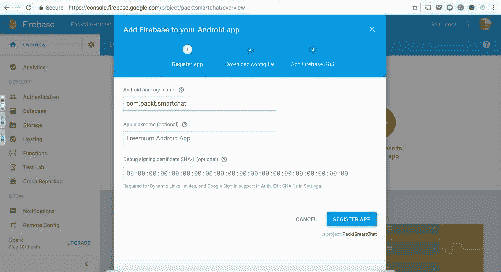
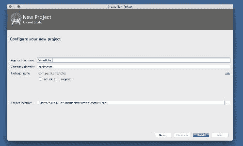
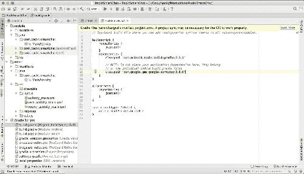
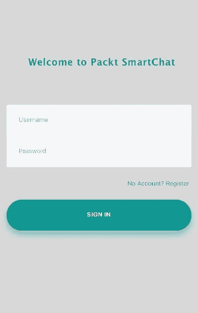
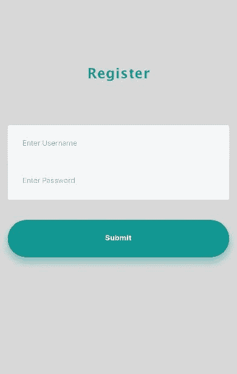
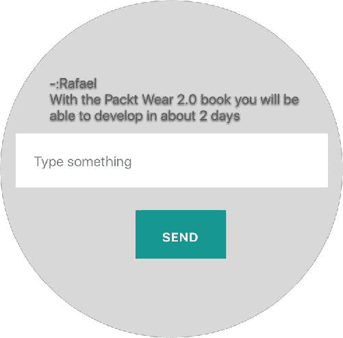
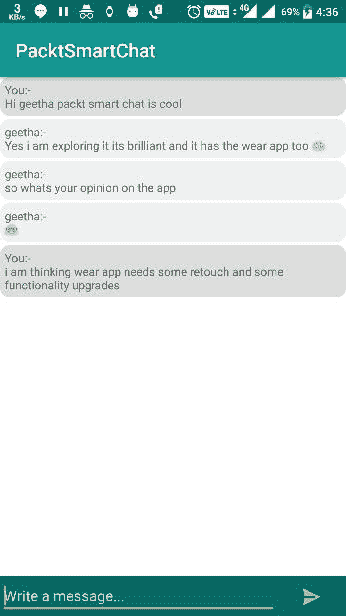

# 第八章：让我们以智能方式进行聊天 - 消息 API 及更多

创新时代赋予我们挖掘众多新兴智能主题的能力。社交媒体现在已成为一种强大的沟通媒介。观察在线社交网络与技术的发展趋势，我们可以认为社交媒体的理念已经进步，消除了很多沟通的难题。大约几十年前，通信媒介是书信。几个世纪前，是训练有素的鸽子。如果我们继续回顾，无疑会有更多故事来理解那时人们的沟通方式。现在，我们生活在物联网、可穿戴智能设备和智能手机的时代，通信在地球的每个角落以秒计的速度发生。不详细讨论通信，让我们构建一个移动应用和穿戴应用，展示谷歌穿戴消息 API 的强大功能，以帮助构建聊天应用，并有一个穿戴设备伴侣应用来管理和响应收到的消息。为了支持聊天过程，我们将在本章使用谷歌自家技术 Firebase。我们不会深入探讨 Firebase 技术，但一定会了解在移动平台上使用 Firebase 的基础知识以及与穿戴技术的工作方式。Firebase 实时数据库在其哈希表结构中反映数据更新。本质上，这些是 Firebase 处理的关键-值对流。数据在最小的互联网带宽要求下即时更新。

为了支持聊天过程，我们将在本章使用谷歌的自家技术 Firebase。我们将理解移动平台的通用注册和登录过程，并为所有注册会员提供空间，使他们每个人都能通过从列表中选择一个用户来进行独家聊天。

在本章中，我们将探讨以下内容：

+   将 Firebase 配置到您的移动应用中

+   创建用户界面

+   使用`GoogleApiClient`工作

+   理解消息 API

+   处理事件

+   构建一个穿戴模块

现在，让我们了解如何将 Firebase 设置到我们的项目中。在使用项目中的 Firebase 技术之前，我们需要执行几个步骤。首先，我们需要应用 Firebase 插件，然后是我们项目中使用的依赖项。

# 安装 Firebase

为了安装 Firebase，请执行以下步骤：

1.  访问 Firebase 控制台 [`console.firebase.google.com`](https://console.firebase.google.com)：


1.  在控制台中选择添加项目，并填写有关项目的必要信息。项目成功添加后，您将看到以下屏幕：


1.  “开始使用”页面帮助您为不同的平台设置项目。让我们选择第二个选项，它说“将 Firebase 添加到您的 Android 应用中”：



1.  添加项目包名，出于进一步的安全考虑，你可以添加 SHA-1 指纹，但这是可选的。现在注册应用：


1.  下载配置文件。`google-services.json`文件将包含应用的所有重要配置，并将其放置在你的项目结构中的 app 目录下。

现在，让我们启动 Android Studio 并创建项目：



确保包名与 Firebase 控制台提到的相同。

让我们选择目标是手机和穿戴的平台：


现在，向移动活动选择器中添加空活动：


在穿戴活动选择器中选择**空白穿戴活动**，通过 Android Studio 模板生成空白穿戴活动代码：


现在，为你的类和 XML 文件命名，并完成项目，以便 Android Studio 为你的移动和穿戴模块生成模板代码。使用文件资源管理器或查找器，进入目录结构，并复制粘贴`google-services.json`文件：


由于我们同时构建移动和穿戴应用，且`app`目录名称对于移动项目是 mobile，对于穿戴项目是 wear，我们应该将配置文件（`google-services.json`）复制到移动目录内。

添加配置文件后，是时候添加插件类路径依赖项了：

```java
classpath 'com.google.gms:google-services:3.0.0'

```



现在，在移动 Gradle 模块依赖项中，将插件应用到所有标签范围内的底部，如下截图所示：


为了帮助 Gradle 管理依赖项和构建项目的顺序，我们应在 Gradle 文件的底部添加 Google Play 服务依赖项。然而，它也将避免与其他 Google 依赖项的冲突。

成功同步后，Firebase SDKs 被集成到我们的项目中。现在，我们可以开始使用我们感兴趣的功能。在这个项目中，为了聊天功能范围，我们将使用 Firebase 实时数据库。让我们将依赖项添加到同一 gradle 文件的依赖项中。我们将使用 volley 网络库从 Firebase 用户节点获取用户列表。我们需要添加设计支持库以支持材料设计：

```java
compile 'com.firebase:firebase-client-android:2.5.2+'
compile 'com.android.volley:volley:1.0.0'
compile 'com.android.support:design:25.1.1'
compile 'com.android.support:cardview-v7:25.1.1'

```

如果你在 gradle 中遇到错误，请在依赖项部分添加以下包装。

`packagingOptions {`

`exclude 'META-INF/DEPENDENCIES.txt'`

`exclude 'META-INF/LICENSE.txt'`

`exclude 'META-INF/NOTICE.txt'`

`exclude 'META-INF/NOTICE'`

`exclude 'META-INF/LICENSE'`

`exclude 'META-INF/DEPENDENCIES'`

`exclude 'META-INF/notice.txt'`

`exclude 'META-INF/license.txt'`

`exclude 'META-INF/dependencies.txt'`

`exclude 'META-INF/LGPL2.1'`

`}`

在完成所有必要的项目设置后，让我们来构思我们将要构建的聊天应用程序。

一个基本的聊天应用程序需要有一个注册过程，为了避免匿名聊天，或者至少要知道我们正在和谁聊天，我们需要发送者和接收者的名字。第一个界面将是登录界面，包含用户名和密码字段，让已经注册的用户可以开始与其他用户聊天。然后，我们有注册界面，同样包含用户名和密码字段。一旦用户成功注册，我们将要求用户输入凭据，并允许他们访问用户列表界面，在那里可以选择他们想与之聊天的人。

# 概念化聊天应用程序

用户输入凭据的登录界面将如下所示：



输入字段的注册界面将如下所示：



下面的截图展示了显示已注册用户列表的用户界面：


实际聊天消息的聊天界面将如下所示：


在圆形屏幕上，可穿戴聊天应用程序将如下所示：



当一条消息进入手持设备时，它应该通知可穿戴设备，并且用户应该能够从可穿戴设备发送回复。在本章中，我们将看到一个工作的移动设备和可穿戴设备聊天应用程序。

# 理解数据层

可穿戴数据层 API 是谷歌 Play 服务的一部分，它建立了与手持设备应用和可穿戴应用的通信通道。使用`GoogleApiClient`类，我们可以访问数据层。数据层主要在可穿戴应用中使用，与手持设备通信，但建议不要用它来连接网络。当我们使用构建器模式创建`GoogleAPIClient`类时，我们将`Wearable.API`附加到`addAPI`方法中。当我们在`GoogleApiclient`中添加多个 API 时，客户端实例有可能在`onConnection`失败回调中失败。通过`addApiIfAvailable()`添加 API 是一个好的方法。这将处理大部分繁重的工作；如果 API 可用，它将添加 API。使用`addConnectionCallbacks`添加所有这些之后，我们可以处理数据层事件。我们需要通过调用`connect()`方法来启动客户端实例的连接。成功连接后，我们可以使用数据层 API。

# 数据层事件

事件允许开发者监听通信通道中发生的事情。成功的通信通道将能够在调用完成时发送调用状态。这些事件将允许开发者监控无线通信通道中的所有状态变化和数据变化。数据层 API 在未完成的交易上返回待定结果，例如`putdataitem()`。当交易未完成时，待定结果将在后台自动排队，如果我们不处理它，这个操作将在后台完成。然而，待定结果需要被处理；待定结果将等待结果状态，并且有两种方法同步和异步地等待结果。

如果数据层代码在 UI 线程中运行，我们应避免对数据层 API 进行阻塞调用。使用`pendingresult`对象的异步回调，我们将能够检查状态和其他重要信息：

```java
pendingResult.setResultCallback(new ResultCallback<DataItemResult>() {
    @Override
    public void onResult(final DataItemResult result) {
        if(result.getStatus().isSuccess()) {
            Log.d(TAG, "Data item set: " + 
            result.getDataItem().getUri());
        }
    }
});

```

如果数据层代码在后台服务中的独立线程中运行，例如`wearableListenerService`，那么阻塞调用是可以的，你可以在`pendingresult`对象上调用`await()`方法：

```java
DataItemResult result = pendingResult.await();
if(result.getStatus().isSuccess()) {
    Log.d(TAG, "Data item set: " + result.getDataItem().getUri());
}

```

数据层事件可以通过两种方式监控：

+   创建一个扩展了`WearableListenerService`的类。

+   实现`DataApi.DataListener`的 Activity

在这两个设施中，我们重写方法以处理数据事件。通常，我们需要在可穿戴设备和手持应用中都创建实例。我们可以根据应用场景的需要重写方法。本质上，`WearableListenerService`具有以下事件：

+   `onDataChanged()`: 每当创建、删除或更新时，系统都会触发这个方法。

+   `onMessageReceived()`: 从一个节点发送的消息会在目标节点触发这个事件。

+   `onCapabilityChanged()`: 当实例广告的某个能力在网络上可用时，会触发这个事件。我们可以通过调用`isnearby()`来检查附近的节点。

这些方法是在后台线程中执行的。

要创建`WearableListenerService`，我们需要创建一个扩展了`WearableListenerService`的类。监听你感兴趣的事件，比如`onDataChanged()`。在你的 Android 清单中声明一个`intent`过滤器，以通知系统你的`WearableListenerService`：

```java
public class DataLayerListenerService extends WearableListenerService {

    private static final String TAG = "DataLayerSample";
    private static final String START_ACTIVITY_PATH = "/start-
    activity";
    private static final String DATA_ITEM_RECEIVED_PATH = "/data-item-
    received";

    @Override
    public void onDataChanged(DataEventBuffer dataEvents) {
        if (Log.isLoggable(TAG, Log.DEBUG)) {
            Log.d(TAG, "onDataChanged: " + dataEvents);
        }

        GoogleApiClient googleApiClient = new 
        GoogleApiClient.Builder(this)
                .addApi(Wearable.API)
                .build();

        ConnectionResult connectionResult =
        googleApiClient.blockingConnect(30, TimeUnit.SECONDS);

        if (!connectionResult.isSuccess()) {
            Log.e(TAG, "Failed to connect to GoogleApiClient.");
            return;
        }

        // Loop through the events and send a message
        // to the node that created the data item.
        for (DataEvent event : dataEvents) {
            Uri uri = event.getDataItem().getUri();

            // Get the node id from the host value of the URI
            String nodeId = uri.getHost();
            // Set the data of the message to be the bytes of the URI
            byte[] payload = uri.toString().getBytes();

            // Send the RPC
            Wearable.MessageApi.sendMessage(googleApiClient, nodeId,
            DATA_ITEM_RECEIVED_PATH, payload);
        }
    }
}

```

并在清单中如下注册服务：

```java
<service android:name=".DataLayerListenerService">
  <intent-filter>
      <action 
      android:name="com.google.android.gms.wearable.DATA_CHANGED" />
      <data android:scheme="wear" android:host="*"
               android:path="/start-activity" />
  </intent-filter>
</service>

```

`DATA_CHANGED`动作替换了之前推荐的`BIND_LISTENER`动作，以便只有特定事件通过该路径。在本章中，当我们实际操作项目时，我们会进一步了解。

# 能力 API

这个 API 有助于广告穿戴网络中节点所提供的功能。功能对应用程序是本地的。利用数据层和消息 API，我们可以与节点通信。为了发现目标节点是否擅长执行某些操作，我们必须利用能力 API，例如如果我们需要从穿戴设备启动一个活动。

要将能力 API 初始化到您的应用程序中，请执行以下步骤：

1.  在`res/values`目录中创建一个 XML 配置文件。

1.  添加一个名为`android_wear_capabilities`的资源。

1.  定义设备所提供的能力：

```java
<resources>
    <string-array name="android_wear_capabilities">
        <item>voice_transcription</item>
    </string-array>
</resources>

```

`voice_transcription`的 Java 程序：

```java
private static final String
        VOICE_TRANSCRIPTION_CAPABILITY_NAME = "voice_transcription";

private GoogleApiClient mGoogleApiClient;

...

private void setupVoiceTranscription() {
    CapabilityApi.GetCapabilityResult result =
            Wearable.CapabilityApi.getCapability(
                    mGoogleApiClient, 
                    VOICE_TRANSCRIPTION_CAPABILITY_NAME,
                    CapabilityApi.FILTER_REACHABLE).await();

    updateTranscriptionCapability(result.getCapability());
}

```

既然我们已经有了实施聊天应用程序的所有设置和设计，那我们就开始吧。

# 移动应用实现

聊天应用程序的移动端应用使用了谷歌的 Firebase 实时数据库。每当用户发送消息时，它都会实时反映在 Firebase 控制台上。故事先放一边，既然我们已经准备好了所有屏幕，那就开始编写代码吧。

既然我们已经知道将要使用的颜色，让我们在`res`目录下的 colors 值 XML 文件中声明颜色：

```java
<?xml version="1.0" encoding="utf-8"?>
<resources>
    <color name="colorPrimary">#129793</color>
    <color name="colorPrimaryDark">#006865</color>
    <color name="colorAccent">#ffaf40</color>
    <color name="white">#fff</color>
</resources>

```

根据设计，我们有一个带有蓝绿色背景的曲线边缘按钮。要制作类似的按钮，我们需要在`drawable`目录中创建一个 XML 资源，并将其命名为`buttonbg.xml`，它基本上是一个`selector`标签，如下所示：

```java
<?xml version="1.0" encoding="utf-8"?>
<selector xmlns:android="http://schemas.android.com/apk/res/android">

 <!-- When item pressed this item will be triggered -->    <item android:state_pressed="true">
        <shape android:shape="rectangle">
        <corners android:radius="25dp" />
        <solid android:color="@color/colorPrimaryDark" />
    </shape>
   </item>

 <!-- By default the background will be this item -->    <item>
        <shape android:shape="rectangle">
        <corners android:radius="25dp" />
        <solid android:color="@color/colorPrimary" />
    </shape>
</item>

</selector>

```

在`selector`标签内，我们有一个`item`标签，它传达了状态；任何普通的按钮都会有状态，比如点击、释放和默认。这里，我们采用了默认的按钮背景和按下状态，并使用`item`属性标签，如形状和圆角，来雕刻按钮，正如设计所示。

为了避免多次更改，我们不会将`MainActivity`重构为`LoginActivity`，而是将`MainActivity`视为`LoginActivity`。现在，在`activity_main.xml`中，让我们添加以下代码到登录屏幕设计。为了使屏幕动态，我们将在`scrollview`下添加代码：

```java
<?xml version="1.0" encoding="utf-8"?>
<ScrollView xmlns:android="http://schemas.android.com/apk/res/android"
    xmlns:app="http://schemas.android.com/apk/res-auto"
    xmlns:tools="http://schemas.android.com/tools"
    android:layout_width="match_parent"
    android:layout_height="match_parent"
    android:fillViewport="true"
    android:fitsSystemWindows="true">

    <RelativeLayout
        android:layout_width="match_parent"
        android:layout_height="match_parent">

       <!-- Your design code goes here -->

   </RelativeLayout>
</ScrollView>

```

现在，为了完成登录设计，我们需要两个输入字段，一个按钮实例和一个可点击链接实例。完成的登录屏幕代码如下所示：

```java
<?xml version="1.0" encoding="utf-8"?>
<ScrollView xmlns:android="http://schemas.android.com/apk/res/android"
    xmlns:app="http://schemas.android.com/apk/res-auto"
    xmlns:tools="http://schemas.android.com/tools"
    android:layout_width="match_parent"
    android:layout_height="match_parent"
    android:fillViewport="true"
    android:fitsSystemWindows="true">

    <RelativeLayout
        android:layout_width="match_parent"
        android:layout_height="match_parent">

        <LinearLayout
            android:layout_width="match_parent"
            android:layout_height="match_parent"
            android:layout_marginTop="25dp"
            android:orientation="vertical">

            <TextView
                android:layout_width="wrap_content"
                android:layout_height="wrap_content"
                android:layout_gravity="center_horizontal"
                android:layout_marginBottom="24dp"

                android:gravity="center|center_horizontal
                |center_vertical"
                android:text="Welcome to Packt Smartchat"
                android:textColor="@color/colorPrimaryDark"
                android:textSize="25sp"
                android:textStyle="bold" />

            <!--  Email Label -->

            <android.support.v7.widget.CardView
                android:layout_margin="10dp"
                android:layout_width="match_parent"
                android:layout_height="wrap_content"
                android:orientation="vertical">

                <LinearLayout
                    android:padding="5dp"
                    android:orientation="vertical"
                    android:layout_width="match_parent"
                    android:layout_height="wrap_content">

                <android.support.design.widget.TextInputLayout
                    android:layout_width="match_parent"
                    android:layout_height="wrap_content"
                    android:layout_marginBottom="8dp"
                    android:layout_marginTop="8dp">

                    <EditText
                        android:id="@+id/input_email"
                        android:layout_width="match_parent"
                        android:layout_height="wrap_content"
                        android:hint="Username"
                        android:inputType="textEmailAddress"
                        android:windowSoftInputMode="stateHidden" />
                </android.support.design.widget.TextInputLayout>

                <!--  Password Label -->
                <android.support.design.widget.TextInputLayout
                    android:layout_width="match_parent"
                    android:layout_height="wrap_content"
                    android:layout_marginBottom="8dp"
                    android:layout_marginTop="8dp"
                    app:passwordToggleEnabled="true">

                    <EditText
                        android:id="@+id/input_password"
                        android:layout_width="match_parent"
                        android:layout_height="wrap_content"
                        android:hint="Password"
                        android:inputType="textPassword"
                        android:windowSoftInputMode="stateHidden" />
                </android.support.design.widget.TextInputLayout>
                </LinearLayout>
            </android.support.v7.widget.CardView>

            <LinearLayout
                android:layout_width="fill_parent"
                android:layout_height="wrap_content"
                android:orientation="horizontal"
                android:paddingBottom="5dp"
                android:paddingTop="8dp">

                <TextView
                    android:id="@+id/register"
                    android:layout_width="wrap_content"
                    android:layout_height="wrap_content"
                    android:layout_weight="1"
                    android:gravity="end"
                    android:padding="5dp"
                    android:text="No Account? Register"
                    android:textSize="14sp" />
            </LinearLayout>

            <Button
                android:id="@+id/btn_login"
                android:layout_width="150dp"
                android:layout_height="wrap_content"
                android:layout_gravity="center"
                android:layout_marginBottom="24dp"
                android:layout_marginTop="24dp"
                android:background="@drawable/buttonbg"
                android:textColor="@color/white"
                android:textStyle="bold"
                android:padding="12dp"
                android:text="Login" />

        </LinearLayout>
    </RelativeLayout>

</ScrollView>

```

让我们创建另一个活动，并将其称为`RegistrationActivity`，它具有与登录活动类似的组件要求，两个输入字段和一个按钮。XML 布局的完整代码如下所示：

```java
<?xml version="1.0" encoding="utf-8"?>
<ScrollView xmlns:android="http://schemas.android.com/apk/res/android"
    xmlns:app="http://schemas.android.com/apk/res-auto"
    xmlns:tools="http://schemas.android.com/tools"
    android:layout_width="match_parent"
    android:layout_height="match_parent"
    android:fillViewport="true"
    android:fitsSystemWindows="true">

    <RelativeLayout
        android:layout_width="match_parent"
        android:layout_height="match_parent">

        <LinearLayout
            android:layout_width="match_parent"
            android:layout_height="match_parent"
            android:layout_marginTop="25dp"
            android:orientation="vertical">

            <TextView
                android:layout_width="wrap_content"
                android:layout_height="wrap_content"
                android:layout_gravity="center_horizontal"
                android:layout_marginBottom="24dp"
                android:gravity="center
                |center_horizontal|center_vertical"
                android:text="Register"
                android:textColor="@color/colorPrimaryDark"
                android:textSize="25sp"
                android:textStyle="bold" />

            <!--  Email Label -->

            <android.support.v7.widget.CardView
                android:layout_margin="10dp"
                android:layout_width="match_parent"
                android:layout_height="wrap_content"
                android:orientation="vertical">

                <LinearLayout
                    android:padding="5dp"
                    android:orientation="vertical"
                    android:layout_width="match_parent"
                    android:layout_height="wrap_content">

                    <android.support.design.widget.TextInputLayout
                        android:layout_width="match_parent"
                        android:layout_height="wrap_content"
                        android:layout_marginBottom="8dp"
                        android:layout_marginTop="8dp">

                        <EditText
                            android:id="@+id/input_email"
                            android:layout_width="match_parent"
                            android:layout_height="wrap_content"
                            android:hint="Username"
                            android:inputType="textEmailAddress"
                            android:windowSoftInputMode="stateHidden" 
                        />
                    </android.support.design.widget.TextInputLayout>

                    <!--  Password Label -->
                    <android.support.design.widget.TextInputLayout
                        android:layout_width="match_parent"
                        android:layout_height="wrap_content"
                        android:layout_marginBottom="8dp"
                        android:layout_marginTop="8dp"
                        app:passwordToggleEnabled="true">

                        <EditText
                            android:id="@+id/input_password"
                            android:layout_width="match_parent"
                            android:layout_height="wrap_content"
                            android:hint="Password"
                            android:inputType="textPassword"
                            android:windowSoftInputMode="stateHidden" 
                         />
                    </android.support.design.widget.TextInputLayout>
                </LinearLayout>
            </android.support.v7.widget.CardView>

            <LinearLayout
                android:layout_width="fill_parent"
                android:layout_height="wrap_content"
                android:orientation="horizontal"
                android:paddingBottom="5dp"
                android:paddingTop="8dp">

            </LinearLayout>

            <Button
                android:id="@+id/btn_submit"
                android:layout_width="150dp"
                android:layout_height="wrap_content"
                android:layout_gravity="center"
                android:layout_marginBottom="24dp"
                android:layout_marginTop="24dp"
                android:background="@drawable/buttonbg"
                android:textColor="@color/white"
                android:textStyle="bold"
                android:padding="12dp"
                android:text="Submit" />

        </LinearLayout>
    </RelativeLayout>

</ScrollView>

```

现在，让我们创建一个用户活动列表，其中将包含用户列表。将其称为`UsersList`活动，它将有一个简单的`ListView`和一个`TextView`用来处理空列表。`UsersListActivity`的完整 XML 代码如下所示：

```java
<?xml version="1.0" encoding="utf-8"?>
<LinearLayout xmlns:android="http://schemas.android.com/apk/res/android"
    xmlns:tools="http://schemas.android.com/tools"
    android:layout_width="match_parent"
    android:layout_height="match_parent"
    android:orientation="vertical"
    android:padding="16dp">

    <TextView
        android:id="@+id/noUsersText"
        android:layout_width="match_parent"
        android:layout_height="wrap_content"
        android:text="No users found!"
        android:visibility="gone" />

    <ListView
        android:id="@+id/usersList"
        android:layout_width="match_parent"
        android:layout_height="wrap_content" />

</LinearLayout>

```

为聊天屏幕创建另一个活动。我们将它称为`ChatActivity`。在活动的 XML 文件中添加以下代码：

```java
<?xml version="1.0" encoding="utf-8"?>
<LinearLayout xmlns:android="http://schemas.android.com/apk/res/android"
    xmlns:tools="http://schemas.android.com/tools"
    android:layout_width="match_parent"
    android:layout_height="match_parent"
    android:background="#ffffff"
    android:orientation="vertical"
    tools:context="com.packt.smartchat.MainActivity">

    <ScrollView
        android:layout_width="match_parent"
        android:layout_weight="20"
        android:layout_height="wrap_content"
        android:id="@+id/scrollView">

        <LinearLayout
            android:layout_width="match_parent"
            android:layout_height="wrap_content"
            android:orientation="vertical"
            android:id="@+id/layout1">
        </LinearLayout>

    </ScrollView>

    <include
        layout="@layout/message_area"
        android:layout_width="match_parent"
        android:layout_height="wrap_content"
        android:gravity="bottom"
        android:layout_marginTop="5dp"/>
</LinearLayout>

```

我们需要包含一个编辑消息的布局。在`layout`目录中创建另一个名为`message_area.xml`的 XML 文件，并添加以下代码：

```java
<?xml version="1.0" encoding="utf-8"?>
<LinearLayout xmlns:android="http://schemas.android.com/apk/res/android"
    android:layout_width="match_parent"
    android:layout_height="match_parent"
    android:background="@color/colorPrimaryDark"
    android:gravity="bottom"
    android:orientation="horizontal">

    <EditText
        android:layout_width="match_parent"
        android:layout_height="wrap_content"
        android:layout_weight="1"
        android:textColorHint="#CFD8DC"
        android:textColor="#CFD8DC"
        android:singleLine="true"
        android:hint="Write a message..."
        android:id="@+id/messageArea"
        android:maxHeight="80dp" />

    <ImageView
        android:layout_width="match_parent"
        android:layout_height="wrap_content"
        android:layout_weight="4"
        android:padding="4dp"
        android:src="img/ic_menu_send"
        android:id="@+id/sendButton"/>
</LinearLayout>

```

现在，我们所有的视觉元素都已就位，可以开始编写我们的编程逻辑了。

在我们开始处理活动 Java 文件之前，在清单文件中添加以下权限：

```java
 <uses-permission android:name="android.permission.WAKE_LOCK" />
 <uses-permission android:name="android.permission.INTERNET" />

```

在`MainActivity`文件中，让我们创建所有实例，并将它们映射到我们在`activity_main.xml`中放置的 XML ID。在`MainActivity`类的全局范围内，声明以下实例：

```java
private TextView mRegister;
private EditText mUsername, mPassword;
private Button mLoginButton;
public String mUserStr, mPassStr;

```

现在，让我们使用`onCreate`方法内的`findViewById()`方法将这些实例连接到它们的 XML 视觉元素，如下所示：

```java
mRegister = (TextView)findViewById(R.id.register);
mUsername = (EditText)findViewById(R.id.input_email);
mPassword = (EditText)findViewById(R.id.input_password);
mLoginButton = (Button)findViewById(R.id.btn_login);

```

现在，当用户点击注册链接时，它应该将用户带到注册活动。使用`intent`，我们将实现它：

```java
mRegister.setOnClickListener(new View.OnClickListener() {

    @Override
    public void onClick(View v) {
        startActivity(new Intent(MainActivity.this, 
        RegistrationActivity.class));
    }
});

```

点击登录按钮时，它应该进行网络调用，检查 Firebase 中是否存在用户，并在成功时显示适当的操作。在我们编写登录逻辑之前，让我们先编写注册逻辑。

在注册活动中，使用`findViewById()`方法在 Java 文件中连接所有组件：

```java
//In Global scope of registration activity 
private EditText mUsername, mPassword;
private Button mSubmitButton;
public String mUserStr, mPassStr;

// Inside the oncreate method
Firebase.setAndroidContext(this);
mUsername = (EditText)findViewById(R.id.input_email);
mPassword = (EditText)findViewById(R.id.input_password);
mSubmitButton = (Button)findViewById(R.id.btn_submit);

```

在`mSubmit`上附加一个点击监听器，并在`onClick`监听器中获取输入，以确保我们没有传递空字符串：

```java
mSubmitButton.setOnClickListener(new View.OnClickListener() {
    @Override
    public void onClick(View v) {
      // Input fields
      // Validation logics
    }
});

```

简单的验证检查将使应用程序在容易出错的情况下变得强大。以下是来自输入字段的验证和获取输入：

```java
mSubmitButton.setOnClickListener(new View.OnClickListener() {
    @Override
    public void onClick(View v) {
        mUserStr = mUsername.getText().toString();
        mPassStr = mPassword.getText().toString();

        // Validation
        if(mUserStr.equals("")){
            mUsername.setError("can't be blank");
        }
        else if(mPassStr.equals("")){
            mPassword.setError("can't be blank");
        }
        else if(!mUserStr.matches("[A-Za-z0-9]+")){
            mUsername.setError("only alphabet or number allowed");
        }
        else if(mUserStr.length()<5){
            mUsername.setError("at least 5 characters long");
        }
        else if(mPassStr.length()<5){
            mPassword.setError("at least 5 characters long");
        }
    }
});

```

现在我们需要访问 Firebase 以注册用户。在我们继续之前，请登录 Firebase 控制台，[`console.firebase.google.com`](https://console.firebase.google.com)，然后转到我们之前创建的项目。

现在，在左侧菜单中，我们将看到数据库选项并选择它。在规则选项卡中，默认情况下，读写授权设置为`null`。建议您将其更改为`true`，但在编写生产应用程序时不建议这样做：

```java
{
 "rules": {
 ".read": true,
 ".write": true
 }
}

```

当我们将读写权限设置为 true 时，实际上我们是在告诉 Firebase，只要他们有端点 URL，任何人都可以读写。

了解到将 URL 公开的复杂性，我们将在项目中使用它。现在，在`mSubmit`点击监听器中，我们将检查一些验证，并获取用户名和密码。

我们应该完成`mSubmit`点击监听器的代码。在密码关键字段的`else if`实例之后，让我们为执行所有 Firebase 网络操作创建一个 else 情况。我们将制作 Firebase 参考 URL，推送子值，并利用`volley`网络库。我们将检查用户名是否存在，如果存在的话，我们将允许用户使用应用程序。

本项目的 Firebase 端点 URL 是[`packt-wear.firebaseio.com`](https://packt-wear.firebaseio.com)，节点名称可以是我们要为用户添加的任何名称。让我们添加[`packt-wear.firebaseio.com/users`](https://packt-wear.firebaseio.com/users)；代码如下所示：

```java
else {
        final ProgressDialog pd = new 
        ProgressDialog(RegistrationActivity.this);
        pd.setMessage("Loading...");
        pd.show();

        String url = "https://packt-wear.firebaseio.com/users.json";

        StringRequest request = new StringRequest(Request.Method.GET, 
        url, new Response.Listener<String>(){
            @Override
            public void onResponse(String s) {
                Firebase reference = new Firebase("https://packt-
                wear.firebaseio.com/users");
                if(s.equals("null")) {
                    reference.child(mUserStr)
                    .child("password").setValue(mPassStr);
                    Toast.makeText(RegistrationActivity.this, 
                    "registration successful", 
                    Toast.LENGTH_LONG).show();
                }
                else {
                    try {
                        JSONObject obj = new JSONObject(s);

                        if (!obj.has(mUserStr)) {
                            reference.child(mUserStr)
                            .child("password").setValue(mPassStr);
                            Toast.makeText(RegistrationActivity.this,   
                            "registration successful", 
                            Toast.LENGTH_LONG).show();
                        } else {
                            Toast.makeText(RegistrationActivity.this, 
                            "username already exists", 
                            Toast.LENGTH_LONG).show();
                        }

                    } catch (JSONException e) {
                        e.printStackTrace();
                    }
                }

                pd.dismiss();
            }

        },new Response.ErrorListener(){
            @Override
            public void onErrorResponse(VolleyError volleyError) {
                System.out.println("" + volleyError );
                pd.dismiss();
            }
        });

        RequestQueue rQueue = 
        Volley.newRequestQueue(RegistrationActivity.this);
        rQueue.add(request);
    }
}

```

使用`volley`，我们可以添加请求队列并以非常高效的方式处理网络请求。

现在，完整的注册活动类如下所示：

```java
public class RegistrationActivity extends AppCompatActivity {

    private EditText mUsername, mPassword;
    private Button mSubmitButton;
    public String mUserStr, mPassStr;

    @Override
    protected void onCreate(Bundle savedInstanceState) {
        super.onCreate(savedInstanceState);
        setContentView(R.layout.activity_registration);

        mUsername = (EditText)findViewById(R.id.input_email);
        mPassword = (EditText)findViewById(R.id.input_password);
        mSubmitButton = (Button)findViewById(R.id.btn_submit);

        Firebase.setAndroidContext(this);

        mSubmitButton.setOnClickListener(new View.OnClickListener() {
            @Override
            public void onClick(View v) {
                mUserStr = mUsername.getText().toString();
                mPassStr = mPassword.getText().toString();

                // Validation
                if(mUserStr.equals("")){
                    mUsername.setError("can't be blank");
                }
                else if(mPassStr.equals("")){
                    mPassword.setError("can't be blank");
                }
                else if(!mUserStr.matches("[A-Za-z0-9]+")){
                    mUsername.setError("only alphabet or number 
                    allowed");
                }
                else if(mUserStr.length()<5){
                    mUsername.setError("at least 5 characters long");
                }
                else if(mPassStr.length()<5){
                    mPassword.setError("at least 5 characters long");
                }else {
                    final ProgressDialog pd = new 
                    ProgressDialog(RegistrationActivity.this);
                    pd.setMessage("Loading...");
                    pd.show();

                    String url = "https://packt-
                    wear.firebaseio.com/users.json";

                    StringRequest request = new StringRequest
                    (Request.Method.GET, url, 
                    new Response.Listener<String>(){
                        @Override
                        public void onResponse(String s) {
                            Firebase reference = new Firebase
                        ("https://packt-wear.firebaseio.com/users");
                            if(s.equals("null")) {
                                reference.child(mUserStr)
                                .child("password").setValue(mPassStr);
                                Toast.makeText
                                (RegistrationActivity.this, 
                                "registration successful", 
                                Toast.LENGTH_LONG).show();
                            }
                            else {
                                try {
                                    JSONObject obj = new JSONObject(s);

                                    if (!obj.has(mUserStr)) {
                                        reference.child(mUserStr)
                                        .child("password")
                                        .setValue(mPassStr);
                                        Toast.makeText
                                        (RegistrationActivity.this, 
                                        "registration successful", 
                                        Toast.LENGTH_LONG).show();
                                    } else {
                                        Toast.makeText
                                        (RegistrationActivity.this, 
                                        "username already exists", 
                                        Toast.LENGTH_LONG).show();
                                    }

                                } catch (JSONException e) {
                                    e.printStackTrace();
                                }
                            }

                            pd.dismiss();
                        }

                    },new Response.ErrorListener(){
                        @Override
                        public void onErrorResponse(VolleyError    
                        volleyError) {
                            System.out.println("" + volleyError );
                            pd.dismiss();
                        }
                    });

                    RequestQueue rQueue = 
                    Volley.newRequestQueue
                    (RegistrationActivity.this);
                    rQueue.add(request);
                }
            }
        });

    }
}

```

现在，让我们跳转到`MainActivity`处理用户登录逻辑。

在我们继续之前，让我们创建一个带有静态实例的类，如下所示：

```java
public class User {
    static String username = "";
    static String password = "";
    static String chatWith = "";
}

```

现在，正如我们在注册屏幕上看到的，让我们在登录屏幕中使用`volley`库进行验证，让我们检查用户名是否存在。如果有效的用户使用有效的密码登录，我们将不得不允许用户进入聊天屏幕。以下代码放入登录点击监听器中：

```java
   mUserStr = mUsername.getText().toString();
    mPassStr = mPassword.getText().toString();

    if(mUserStr.equals("")){
        mUsername.setError("Please enter your username");
    }
    else if(mPassStr.equals("")){
        mPassword.setError("can't be blank");
    }
    else{
        String url = "https://packt-wear.firebaseio.com/users.json";
        final ProgressDialog pd = new 
        ProgressDialog(MainActivity.this);
        pd.setMessage("Loading...");
        pd.show();

        StringRequest request = new StringRequest(Request.Method.GET, 
        url, new Response.Listener<String>(){
            @Override
            public void onResponse(String s) {
                if(s.equals("null")){
                    Toast.makeText(MainActivity.this, "user not found", 
                    Toast.LENGTH_LONG).show();
                }
                else{
                    try {
                        JSONObject obj = new JSONObject(s);

                        if(!obj.has(mUserStr)){
                            Toast.makeText(MainActivity.this, "user not 
                            found", Toast.LENGTH_LONG).show();
                        }
                        else if(obj.getJSONObject(mUserStr)
                        .getString("password").equals(mPassStr)){
                            User.username = mUserStr;
                            User.password = mPassStr;
                            startActivity(new Intent(MainActivity.this, 
                            UsersListActivity.class));
                        }
                        else {
                            Toast.makeText(MainActivity.this, 
                            "incorrect password", Toast
                           .LENGTH_LONG).show();
                        }
                    } catch (JSONException e) {
                        e.printStackTrace();
                    }
                }

                pd.dismiss();
            }
        },new Response.ErrorListener(){
            @Override
            public void onErrorResponse(VolleyError volleyError) {
                System.out.println("" + volleyError);
                pd.dismiss();
            }
        });

        RequestQueue rQueue = 
        Volley.newRequestQueue(MainActivity.this);
        rQueue.add(request);
    }
}

```

完整的类将如下所示：

```java
public class MainActivity extends AppCompatActivity {

    private TextView mRegister;
    private EditText mUsername, mPassword;
    private Button mLoginButton;
    public String mUserStr, mPassStr;

    @Override
    protected void onCreate(Bundle savedInstanceState) {
        super.onCreate(savedInstanceState);
        setContentView(R.layout.activity_main);

        mRegister = (TextView)findViewById(R.id.register);
        mUsername = (EditText)findViewById(R.id.input_email);
        mPassword = (EditText)findViewById(R.id.input_password);
        mLoginButton = (Button)findViewById(R.id.btn_login);

        mRegister.setOnClickListener(new View.OnClickListener() {

            @Override
            public void onClick(View v) {
                startActivity(new Intent(MainActivity.this, 
                RegistrationActivity.class));
            }
        });

        mLoginButton.setOnClickListener(new View.OnClickListener() {
            @Override
            public void onClick(View v) {
                mUserStr = mUsername.getText().toString();
                mPassStr = mPassword.getText().toString();

                if(mUserStr.equals("")){
                    mUsername.setError("Please enter your username");
                }
                else if(mPassStr.equals("")){
                    mPassword.setError("can't be blank");
                }
                else{
                    String url = "https://packt-
                    wear.firebaseio.com/users.json";
                    final ProgressDialog pd = new                 
                    ProgressDialog(MainActivity.this);
                    pd.setMessage("Loading...");
                    pd.show();

                    StringRequest request = new StringRequest
                    (Request.Method.GET, url, 
                    new Response.Listener<String>(){
                        @Override
                        public void onResponse(String s) {
                            if(s.equals("null")){
                                Toast.makeText(MainActivity.this, "user 
                                not found", Toast.LENGTH_LONG).show();
                            }
                            else{
                                try {
                                    JSONObject obj = new JSONObject(s);

                                    if(!obj.has(mUserStr)){

                                    Toast.makeText(MainActivity.this, 
                                    "user not found", 
                                    Toast.LENGTH_LONG).show();
                                    }
                                    else if(obj.getJSONObject(mUserStr)
                                    .getString("password")
                                    .equals(mPassStr)){
                                        User.username = mUserStr;
                                        User.password = mPassStr;
                                        startActivity(new 
                                        Intent(MainActivity.this,    
                                        UsersListActivity.class));
                                    }
                                    else {

                                    Toast.makeText(MainActivity.this, 
                                    "incorrect password", 
                                    Toast.LENGTH_LONG).show();
                                    }
                                } catch (JSONException e) {
                                    e.printStackTrace();
                                }
                            }

                            pd.dismiss();
                        }
                    },new Response.ErrorListener(){
                        @Override
                        public void onErrorResponse(VolleyError 
                        volleyError) {
                            System.out.println("" + volleyError);
                            pd.dismiss();
                        }
                    });

                    RequestQueue rQueue = 
                    Volley.newRequestQueue(MainActivity.this);
                    rQueue.add(request);
                }
            }
        });

    }
}

```

现在，允许用户成功登录后，我们需要显示用户列表，忽略登录的那个。但用户应该能够看到其他用户列表。现在，让我们处理`ListView`中的用户列表。让我们连接组件：

```java
//Instances 
private ListView mUsersList;
private TextView mNoUsersText;
private ArrayList<String> mArraylist = new ArrayList<>();
private int totalUsers = 0;
private ProgressDialog mProgressDialog;

//inside onCreate method 
mUsersList = (ListView)findViewById(R.id.usersList);
mNoUsersText = (TextView)findViewById(R.id.noUsersText);
mProgressDialog = new ProgressDialog(UsersListActivity.this);

mProgressDialog.setMessage("Loading...");
mProgressDialog.show();

```

现在，在`onCreate`方法中，我们将初始化`volley`并获取用户列表，如下所示：

```java
String url = "https://packt-wear.firebaseio.com/users.json";
    StringRequest request = new StringRequest(Request.Method.GET, url, 
    new Response.Listener<String>(){
        @Override
        public void onResponse(String s) {
 doOnSuccess(s);
        }
    },new Response.ErrorListener(){
        @Override
        public void onErrorResponse(VolleyError volleyError) {
            System.out.println("" + volleyError);
        }
    });

    RequestQueue rQueue = 
    Volley.newRequestQueue(UsersListActivity.this);
    rQueue.add(request);

    mUsersList.setOnItemClickListener(new 
    AdapterView.OnItemClickListener() {
        @Override
        public void onItemClick(AdapterView<?> parent, View view, int 
        position, long id) {
            User.chatWith = mArraylist.get(position);
            startActivity(new Intent(UsersListActivity.this, 
            ChatActivity.class));
        }
    });

}

```

当我们将 Firebase 端点 URL 公开时，任何拥有该 URL 的人都可以读取和写入端点。我只是使用 URL 并添加`.json`作为扩展名，这样它会返回 JSON 结果。现在，我们需要编写最后一个用于管理成功结果的方法：

```java
public void doOnSuccess(String s){
    try {
        JSONObject obj = new JSONObject(s);

        Iterator i = obj.keys();
        String key = "";

        while(i.hasNext()){
            key = i.next().toString();

            if(!key.equals(User.username)) {
                mArraylist.add(key);
            }

            totalUsers++;
        }

    } catch (JSONException e) {
        e.printStackTrace();
    }

    if(totalUsers <=1){
        mNoUsersText.setVisibility(View.VISIBLE);
        mUsersList.setVisibility(View.GONE);
    }
    else{
        mNoUsersText.setVisibility(View.GONE);
        mUsersList.setVisibility(View.VISIBLE);
        mUsersList.setAdapter(new ArrayAdapter<String>(this, 
        android.R.layout.simple_list_item_1, mArraylist));
    }

    mProgressDialog.dismiss();
}

```

完整的类将如下所示：

```java
public class UsersListActivity extends AppCompatActivity {

    private ListView mUsersList;
    private TextView mNoUsersText;
    private ArrayList<String> mArraylist = new ArrayList<>();
    private int totalUsers = 0;
    private ProgressDialog mProgressDialog;

    @Override
    protected void onCreate(Bundle savedInstanceState) {
        super.onCreate(savedInstanceState);
        setContentView(R.layout.activity_users_list);
        mUsersList = (ListView)findViewById(R.id.usersList);
        mNoUsersText = (TextView)findViewById(R.id.noUsersText);

        mProgressDialog = new ProgressDialog(UsersListActivity.this);
        mProgressDialog.setMessage("Loading...");
        mProgressDialog.show();

        String url = "https://packt-wear.firebaseio.com/users.json";
        StringRequest request = new StringRequest(Request.Method.GET, 
        url, new Response.Listener<String>(){
            @Override
            public void onResponse(String s) {
                doOnSuccess(s);
            }
        },new Response.ErrorListener(){
            @Override
            public void onErrorResponse(VolleyError volleyError) {
                System.out.println("" + volleyError);
            }
        });

        RequestQueue rQueue = 
        Volley.newRequestQueue(UsersListActivity.this);
        rQueue.add(request);

        mUsersList.setOnItemClickListener(new 
        AdapterView.OnItemClickListener() {
            @Override
            public void onItemClick(AdapterView<?> parent, View view, 
            int position, long id) {
                User.chatWith = mArraylist.get(position);
                startActivity(new Intent(UsersListActivity.this, 
                ChatActivity.class));
            }
        });

    }

    public void doOnSuccess(String s){
        try {
            JSONObject obj = new JSONObject(s);

            Iterator i = obj.keys();
            String key = "";

            while(i.hasNext()){
                key = i.next().toString();

                if(!key.equals(User.username)) {
                    mArraylist.add(key);
                }

                totalUsers++;
            }

        } catch (JSONException e) {
            e.printStackTrace();
        }

        if(totalUsers <=1){
            mNoUsersText.setVisibility(View.VISIBLE);
            mUsersList.setVisibility(View.GONE);
        }
        else{
            mNoUsersText.setVisibility(View.GONE);
            mUsersList.setVisibility(View.VISIBLE);
            mUsersList.setAdapter(new ArrayAdapter<String>(this, 
            android.R.layout.simple_list_item_1, mArraylist));
        }

        mProgressDialog.dismiss();
    }
}

```

现在，我们已经完成了一个流程，即`引导`用户并显示可聊天的用户列表。现在是时候处理实际的聊天逻辑了。让我们开始处理`ChatActivity`。

对于消息背景，我们将添加两个可绘制资源文件：`rounded_corner1.xml`和`rounded_corner2.xml`。让我们为可绘制资源文件添加 XML 代码：

```java
<?xml version="1.0" encoding="utf-8"?>
<shape xmlns:android="http://schemas.android.com/apk/res/android">
    <solid android:color="#dddddd" />
    <stroke
        android:width="0dip"
        android:color="#dddddd" />
    <corners android:radius="10dip" />
    <padding
        android:bottom="5dip"
        android:left="5dip"
        android:right="5dip"
        android:top="5dip" />
</shape>

```

对于`rounded_corner2.xml`

```java
<?xml version="1.0" encoding="utf-8"?>
<shape xmlns:android="http://schemas.android.com/apk/res/android">
    <solid android:color="#f0f0f0" />
    <stroke
        android:width="0dip"
        android:color="#f0f0f0" />
    <corners android:radius="10dip" />
    <padding
        android:bottom="5dip"
        android:left="5dip"
        android:right="5dip"
        android:top="5dip" />
</shape>

```

现在，让我们为 Firebase 聊天活动声明必要的实例：

```java
//Global instances
LinearLayout mLinearlayout;
ImageView mSendButton;
EditText mMessageArea;
ScrollView mScrollview;
Firebase reference1, reference2;

//inside onCreate method 
mLinearlayout = (LinearLayout)findViewById(R.id.layout1);
mSendButton = (ImageView)findViewById(R.id.sendButton);
mMessageArea = (EditText)findViewById(R.id.messageArea);
mScrollview = (ScrollView)findViewById(R.id.scrollView);

Firebase.setAndroidContext(this);
reference1 = new Firebase("https://packt-wear.firebaseio.com/messages/" + User.username + "_" + User.chatWith);
reference2 = new Firebase("https://packt-wear.firebaseio.com/messages/" + User.chatWith + "_" + User.username);

```

点击发送按钮时，使用`push()`方法，我们可以将用户名和发送的消息更新到 Firebase：

```java
mSendButton.setOnClickListener(new View.OnClickListener() {
    @Override
    public void onClick(View v) {
        String messageText = mMessageArea.getText().toString();

        if(!messageText.equals("")){
            Map<String, String> map = new HashMap<String, String>();
            map.put("message", messageText);
 map.put("user", User.username);
            reference1.push().setValue(map);
 reference2.push().setValue(map);
        }
    }
});

```

我们需要从 Firebase 的`addChildEventListener()`实现回调。在`onChildAdded`方法中，我们可以显示添加的消息。以下代码完成了 Firebase 的添加，并为消息添加了背景：

```java
reference1.addChildEventListener(new ChildEventListener() {
    @Override
    public void onChildAdded(DataSnapshot dataSnapshot, String s) {
        Map map = dataSnapshot.getValue(Map.class);
        String message = map.get("message").toString();
        String userName = map.get("user").toString();

        if(userName.equals(User.username)){
 addMessageBox("You:-\n" + message, 1);
        }
        else{
 addMessageBox(User.chatWith + ":-\n" + message, 2);
        }
    }

    @Override
    public void onChildChanged(DataSnapshot dataSnapshot, String s) {

    }

    @Override
    public void onChildRemoved(DataSnapshot dataSnapshot) {

    }

    @Override
    public void onChildMoved(DataSnapshot dataSnapshot, String s) {

    }

    @Override
    public void onCancelled(FirebaseError firebaseError) {

    }
});

```

`addMessageBox`方法改变了发送者和接收者消息的背景：

```java
public void addMessageBox(String message, int type){
TextView textView = new TextView(ChatActivity.this);
textView.setText(message);
LinearLayout.LayoutParams lp = new LinearLayout.LayoutParams(ViewGroup.LayoutParams.MATCH_PARENT, ViewGroup.LayoutParams.WRAP_CONTENT);
lp.setMargins(0, 0, 0, 10);
textView.setLayoutParams(lp);

    if(type == 1) {
textView.setBackgroundResource(R.drawable.rounded_corner1);
}
    else{
textView.setBackgroundResource(R.drawable.rounded_corner2);
}

    mLinearlayout.addView(textView);
    mScrollview.fullScroll(View.FOCUS_DOWN);
}

```

`ChatActivity`的完整代码如下：

```java
public class ChatActivity extends AppCompatActivity {

    LinearLayout mLinearlayout;
    ImageView mSendButton;
    EditText mMessageArea;
    ScrollView mScrollview;
    Firebase reference1, reference2;

    @Override
    protected void onCreate(Bundle savedInstanceState) {
        super.onCreate(savedInstanceState);
        setContentView(R.layout.activity_chat);

        mLinearlayout = (LinearLayout)findViewById(R.id.layout1);
        mSendButton = (ImageView)findViewById(R.id.sendButton);
        mMessageArea = (EditText)findViewById(R.id.messageArea);
        mScrollview = (ScrollView)findViewById(R.id.scrollView);

        Firebase.setAndroidContext(this);
        reference1 = new Firebase("https://packt-
        wear.firebaseio.com/messages/" + User.username + "_" + 
        User.chatWith);
        reference2 = new Firebase("https://packt-  
        wear.firebaseio.com/messages/" + User.chatWith + "_" + 
        User.username);

        mSendButton.setOnClickListener(new View.OnClickListener() {
            @Override
            public void onClick(View v) {
                String messageText = mMessageArea.getText().toString();

                if(!messageText.equals("")){
                    Map<String, String> map = new HashMap<String, 
                    String>();
                    map.put("message", messageText);
                    map.put("user", User.username);
                    reference1.push().setValue(map);
                    reference2.push().setValue(map);
                }
            }
        });

        reference1.addChildEventListener(new ChildEventListener() {
            @Override
            public void onChildAdded(DataSnapshot dataSnapshot, 
            String s) {
                Map map = dataSnapshot.getValue(Map.class);
                String message = map.get("message").toString();
                String userName = map.get("user").toString();

                if(userName.equals(User.username)){
                    addMessageBox("You:-\n" + message, 1);
                }
                else{
                    addMessageBox(User.chatWith + ":-\n" + message, 2);
                }
            }

            @Override
            public void onChildChanged(DataSnapshot dataSnapshot, 
            String s) {

            }

            @Override
            public void onChildRemoved(DataSnapshot dataSnapshot) {

            }

            @Override
            public void onChildMoved(DataSnapshot dataSnapshot, 
            String s) {

            }

            @Override
            public void onCancelled(FirebaseError firebaseError) {

            }
        });
    }

    public void addMessageBox(String message, int type){
        TextView textView = new TextView(ChatActivity.this);
        textView.setText(message);
        LinearLayout.LayoutParams lp = new LinearLayout
        .LayoutParams(ViewGroup.LayoutParams.MATCH_PARENT, 
        ViewGroup.LayoutParams.WRAP_CONTENT);
        lp.setMargins(0, 0, 0, 10);
        textView.setLayoutParams(lp);

        if(type == 1) {
            textView.setBackgroundResource(R.drawable.rounded_corner1);
        }
        else{
            textView.setBackgroundResource(R.drawable.rounded_corner2);
        }

        mLinearlayout.addView(textView);
        mScrollview.fullScroll(View.FOCUS_DOWN);
    }
}

```

我们已经为移动应用程序完成了完整的聊天模块。现在，让我们为聊天应用程序编写 Wear 模块。

# Wear 应用程序实现

Wear 模块的目标是，穿戴设备应接收新消息并在应用中显示，用户应能够从穿戴设备回复这些消息。在这里，我们将了解 Wear 和移动应用之间建立通信的类和 API。

现在，Android Studio 为计时器应用生成了样板代码。我们需要做的是删除所有代码，只保留 `onCreate()` 方法。稍后，在 `activity_main.xml` 文件中，让我们添加一个帮助用户聊天的用户界面。这里，我将使用 `Edittext` 和 `Textview`，以及一个将消息发送到移动设备的按钮。让我们添加以下 XML 代码：

```java
<?xml version="1.0" encoding="utf-8"?>
<android.support.wearable.view.BoxInsetLayout xmlns:android="http://schemas.android.com/apk/res/android"
    xmlns:app="http://schemas.android.com/apk/res-auto"
    xmlns:tools="http://schemas.android.com/tools"
    android:id="@+id/container"
    android:layout_width="match_parent"
    android:layout_height="match_parent"
    tools:context="com.packt.smartchat.MainActivity"
    tools:deviceIds="wear">

    <LinearLayout
        android:layout_gravity="center|center_horizontal"
        android:layout_width="match_parent"
        android:layout_height="wrap_content"
        android:orientation="vertical">

        <TextView
            android:id="@+id/text"
            android:layout_width="match_parent"
            android:layout_height="match_parent"
            android:gravity="center"
            android:text="Message"
            android:layout_margin="30dp"
            app:layout_box="all" />

        <EditText
            android:id="@+id/message"
            android:layout_width="match_parent"
            android:layout_height="wrap_content" />

        <Button
            android:id="@+id/send"
            android:layout_gravity="center"
            android:text="Send"
            android:layout_width="wrap_content"
            android:layout_height="wrap_content" />
    </LinearLayout>

</android.support.wearable.view.BoxInsetLayout>

```

现在，用户界面已准备就绪。当我们希望接收和发送消息到移动设备时，我们需要编写一个扩展了 `WearableListenerService` 的服务类，并且需要在清单文件中注册该服务类：

```java
public class ListenerService extends WearableListenerService {

    @Override
    public void onMessageReceived(MessageEvent messageEvent) {

        if (messageEvent.getPath().equals("/message_path")) {
            final String message = new String(messageEvent.getData());
            Log.v("myTag", "Message path received on watch is: " + 
            messageEvent.getPath());
            Log.v("myTag", "Message received on watch is: " + message);

            // Broadcast message to wearable activity for display
            Intent messageIntent = new Intent();
            messageIntent.setAction(Intent.ACTION_SEND);
            messageIntent.putExtra("message", message);
            LocalBroadcastManager
            .getInstance(this).sendBroadcast(messageIntent);
        }
        else {
            super.onMessageReceived(messageEvent);
        }
    }
}

```

现在，在清单文件的 application 标签范围内以下面的方式注册 `service` 类：

```java
<application
    android:allowBackup="true"
    android:icon="@mipmap/ic_launcher"
    android:label="@string/app_name"
    android:supportsRtl="true"
    android:theme="@android:style/Theme.DeviceDefault">

<activity...></activity>

<service android:name=".ListenerService">
 <intent-filter>
 <action android:name="com.google.android.gms.wearable.DATA_CHANGED" />
 <action 
 android:name="com.google.android.gms.wearable.MESSAGE_RECEIVED" />
 <data android:scheme="wear" android:host="*" 
 android:pathPrefix="/message_path" />
 </intent-filter>
</service>

</application>

```

我们使用最新标准注册了 `wear` 服务。之前，我们不得不使用 `BIND_LISTENER` API 来注册服务。由于其低效，它已被弃用。我们必须使用之前的 `DATA_CHANGED` 和 `MESSAGE_RECEIVED` API，因为它们允许应用监听特定路径。而 `BIND_LISTENER` API 监听广泛范围的系统消息，这是性能和电池电量的缺点。以下代码展示了已弃用的 `BIND_LISTENER` 注册方法：

```java
 <service android:name=".ListenerService">
 <intent-filter>
 <action android:name="com.google.android.gms.wearable.BIND_LISTENER" />
 </intent-filter>
 </service>

```

在清单文件中注册服务后，我们可以在 Wear 模块中的 `MainActivity` 直接进行操作。在开始之前，请确保你已将 `MainActivity` 中的所有样板代码删除，只留下一个 `onCreate` 方法，如下所示：

```java
public class MainActivity extends WearableActivity {

    @Override
    protected void onCreate(Bundle savedInstanceState) {
        super.onCreate(savedInstanceState);
        setContentView(R.layout.activity_main);
        setAmbientEnabled();

    }
}

```

在 `MainActivity` 中连接所有 XML 组件：

```java
mTextView = (TextView)findViewById(R.id.text);
send = (Button) findViewById(R.id.send);
message = (EditText)findViewById(R.id.message);

```

让我们实现 `GoogleApiClient` 的接口，以帮助查找已连接的节点和处理失败的场景：

```java
public class MainActivity extends WearableActivity implements GoogleApiClient.ConnectionCallbacks,
        GoogleApiClient.OnConnectionFailedListener  {

                 .......

}

```

实现 `ConnectionCallbacks` 和 `OnConnectionFailedListener` 之后，我们必须从这些接口重写一些方法，即 `onConnected`、`onConnectionSuspended` 和 `onConnectionFailed` 方法。我们大部分逻辑将在 `onConnected` 方法中编写。现在，在 `MainActivity` 范围内，我们需要编写一个扩展了 `BroadcastReciever` 的类，并重写 `onReceive` 方法以监听消息：

```java
public class MessageReceiver extends BroadcastReceiver {
    @Override
    public void onReceive(Context context, Intent intent) {
        String message = intent.getStringExtra("message");
        Log.v("packtchat", "Main activity received message: " + 
        message);
        // Display message in UI
        mTextView.setText(message);
    }
}

```

在 `onCreate` 方法中注册本地广播接收器，如下所示：

```java
// Register the local broadcast receiver
IntentFilter messageFilter = new IntentFilter(Intent.ACTION_SEND);
MessageReceiver messageReceiver = new MessageReceiver();
LocalBroadcastManager.getInstance(this).registerReceiver(messageReceiver, messageFilter);

```

声明 `GoogleApiClient` 和 Node 实例，以及用于从穿戴设备发送消息的 `WEAR_PATH`，移动应用将监听这些消息：

```java
private Node mNode;
private GoogleApiClient mGoogleApiClient;
private static final String WEAR_PATH = "/from-wear";

```

在 `onCreate` 方法中初始化 `mGoogleApiclient`：

```java
//Initialize mGoogleApiClient
mGoogleApiClient = new GoogleApiClient.Builder(this)
        .addApi(Wearable.API)
        .addConnectionCallbacks(this)
        .addOnConnectionFailedListener(this)
        .build();

```

在 `onConnected` 方法中，我们将使用可穿戴节点 API 来获取所有已连接的节点。它可以是已配对的穿戴设备或移动设备。使用以下代码，我们将知道哪些穿戴设备已配对：

```java
@Override
public void onConnected(@Nullable Bundle bundle) {
    Wearable.NodeApi.getConnectedNodes(mGoogleApiClient)
            .setResultCallback(new 
            ResultCallback<NodeApi.GetConnectedNodesResult>() {
                @Override
                public void onResult(NodeApi.GetConnectedNodes
                Result nodes) {
                    for (Node node : nodes.getNodes()) {
                        if (node != null && node.isNearby()) {
                            mNode = node;
                            Log.d("packtchat", "Connected to " + 
                            mNode.getDisplayName());
                        }
                    }
                    if (mNode == null) {
                        Log.d("packtchat", "Not connected!");
                    }
                }
            });
}

```

现在，我们需要为`send`按钮实例添加`clicklistener`，以从`edittext`获取值并将其传递给发送消息到移动设备的方法：

```java
send.setOnClickListener(new View.OnClickListener() {
    @Override
    public void onClick(View v) {
        mMsgStr = message.getText().toString();
        sendMessage(mMsgStr);
    }
});

```

`sendMessage`方法接受一个字符串参数，并将相同的字符串消息以字节的形式发送到已连接的节点。使用`MessageAPI`，我们将消息发送到移动设备。以下代码解释了如何实现这一点：

```java
private void sendMessage(String city) {
    if (mNode != null && mGoogleApiClient != null) {
        Wearable.MessageApi.sendMessage(mGoogleApiClient, 
        mNode.getId(), WEAR_PATH, city.getBytes())
                .setResultCallback(new 
                ResultCallback<MessageApi.SendMessageResult>() {
                    @Override
                    public void onResult(MessageApi.SendMessageResult 
                    sendMessageResult) {
                        if (!sendMessageResult.getStatus().isSuccess()) 
                        {
                            Log.d("packtchat", "Failed message: " +

                            sendMessageResult.getStatus()
                            .getStatusCode());
                        } else {
                            Log.d("packtchat", "Message succeeded");
                        }
                    }
                });
    }
}

```

让我们重写`onstart`和`onstop`方法，以便在连接和断开`GoogleAPIClient`时寻求帮助：

```java
@Override
protected void onStart() {
    super.onStart();
    mGoogleApiClient.connect();
}

@Override
protected void onStop() {
    super.onStop();
    mGoogleApiClient.disconnect();
}

```

完整的穿戴模块`MainActivity`代码如下：

```java
public class MainActivity extends WearableActivity implements GoogleApiClient.ConnectionCallbacks,
        GoogleApiClient.OnConnectionFailedListener  {

    private TextView mTextView;
    Button send;
    EditText message;
    String mMsgStr;

    private Node mNode;
    private GoogleApiClient mGoogleApiClient;
    private static final String WEAR_PATH = "/from-wear";

    @Override
    protected void onCreate(Bundle savedInstanceState) {
        super.onCreate(savedInstanceState);
        setContentView(R.layout.activity_main);

        mTextView = (TextView)findViewById(R.id.text);
        send = (Button) findViewById(R.id.send);
        message = (EditText)findViewById(R.id.message);
        setAmbientEnabled();

        //Initialize mGoogleApiClient
        mGoogleApiClient = new GoogleApiClient.Builder(this)
                .addApi(Wearable.API)
                .addConnectionCallbacks(this)
                .addOnConnectionFailedListener(this)
                .build();

        // Register the local broadcast receiver
        IntentFilter messageFilter = new 
        IntentFilter(Intent.ACTION_SEND);
        MessageReceiver messageReceiver = new MessageReceiver();
        LocalBroadcastManager.getInstance(this)
        .registerReceiver(messageReceiver, messageFilter);

        send.setOnClickListener(new View.OnClickListener() {
            @Override
            public void onClick(View v) {
                mMsgStr = message.getText().toString();
                sendMessage(mMsgStr);
            }
        });

    }

    private void sendMessage(String message) {
        if (mNode != null && mGoogleApiClient != null) {
            Wearable.MessageApi.sendMessage(mGoogleApiClient, 
            mNode.getId(), WEAR_PATH, message.getBytes())
                    .setResultCallback(new 
                    ResultCallback<MessageApi.SendMessageResult>() {
                        @Override
                        public void onResult(MessageApi
                        .SendMessageResult sendMessageResult) {
                            if (!sendMessageResult.getStatus()
                            .isSuccess()) {
                                Log.d("packtchat", "Failed message: " +

                                sendMessageResult.getStatus()
                                .getStatusCode());
                            } else {
                                Log.d("packtchat", "Message 
                                succeeded");
                            }
                        }
                    });
        }
    }

    public class MessageReceiver extends BroadcastReceiver {
        @Override
        public void onReceive(Context context, Intent intent) {
            String message = intent.getStringExtra("message");
            Log.v("packtchat", "Main activity received message: " + 
            message);
            // Display message in UI
            mTextView.setText(message);

        }
    }

    @Override
    public void onConnected(@Nullable Bundle bundle) {
        Wearable.NodeApi.getConnectedNodes(mGoogleApiClient)
                .setResultCallback(new 
                 ResultCallback<NodeApi.GetConnectedNodesResult>() {
                    @Override
                    public void 
                    onResult(NodeApi.GetConnectedNodesResult nodes) {
                        for (Node node : nodes.getNodes()) {
                            if (node != null && node.isNearby()) {
                                mNode = node;
                                Log.d("packtchat", "Connected to " + 
                                mNode.getDisplayName());
                            }
                        }
                        if (mNode == null) {
                            Log.d("packtchat", "Not connected!");
                        }
                    }
                });
    }

    @Override
    protected void onStart() {
        super.onStart();
        mGoogleApiClient.connect();
    }

    @Override
    protected void onStop() {
        super.onStop();
        mGoogleApiClient.disconnect();
    }

    @Override
    public void onConnectionSuspended(int i) {

    }

    @Override
    public void onConnectionFailed(@NonNull ConnectionResult 
    connectionResult) {

    }
}

```

穿戴模块已准备好接收和发送消息到连接的设备。现在，我们需要升级我们的移动模块以接收和发送消息到穿戴设备。

切换到移动模块，并创建一个服务类`WearListner`，然后重写`onMessageReceived`方法，如下所示：

```java
public class WearListner extends WearableListenerService {

    @Override
    public void onMessageReceived(MessageEvent messageEvent) {
        if (messageEvent.getPath().equals("/from-wear")) {
            final String message = new String(messageEvent.getData());
            Log.v("pactchat", "Message path received on watch is: " + 
            messageEvent.getPath());
            Log.v("packtchat", "Message received on watch is: " + 
            message);

            // Broadcast message to wearable activity for display
            Intent messageIntent = new Intent();
            messageIntent.setAction(Intent.ACTION_SEND);
            messageIntent.putExtra("message", message);
            LocalBroadcastManager
            .getInstance(this).sendBroadcast(messageIntent);
        }
        else {
            super.onMessageReceived(messageEvent);
        }
    }
}

```

现在，在清单文件的 application 标签范围内注册这个`WearListner`类：

```java
<service android:name=".WearListner">
    <intent-filter>
        <action 
        android:name="com.google.android.gms.wearable.DATA_CHANGED" />
        <action 
        android:name="com.google.android.gms.wearable.MESSAGE_RECEIVED" 
        />
        <data android:scheme="wear" android:host="*" android:pathPrefix="/from-wear" />
    </intent-filter>
</service>

```

现在，让我们将工作范围切换到移动模块，并添加以下更改以实现与穿戴设备和移动设备的深度链接。

在`ChatActivity`中实现`GoogleApiClient`类中的`ConnectionCallbacks`和`OnConnectionFailedListener`接口：

```java
public class ChatActivity extends AppCompatActivity implements
        GoogleApiClient.ConnectionCallbacks,
        GoogleApiClient.OnConnectionFailedListener {
...
}

```

重写`ConnectionCallbacks`和`OnConnectionFailedListener`接口中的方法，类似于我们对穿戴设备的`MainActivity`所做的那样：

在`onCreate`方法中初始化`GoogleApiClient`，如下所示：

```java
googleClient = new GoogleApiClient.Builder(this)
        .addApi(Wearable.API)
        .addConnectionCallbacks(this)
        .addOnConnectionFailedListener(this)
        .build();

```

在`ChatActivity`中编写广播接收器类以及我们收到的字符串信息。我们需要在已经编写的`addMessageBox`方法中传递它：

```java
public class MessageReceiver extends BroadcastReceiver {
    @Override
    public void onReceive(Context context, Intent intent) {
        String message = intent.getStringExtra("message");
        Log.v("myTag", "Main activity received message: " + message);
        // Displaysage in UI
        addMessageBox("You:-\n" + message, 1);
        if(!message.equals("")){
            Map<String, String> map = new HashMap<String, String>();
            map.put("message", message);
            map.put("user", User.username);
            reference1.push().setValue(map);
        }
        new SendToDataLayerThread("/message_path","You:-\n" + 
        message).start();
    }
}

```

在`onCreate`方法中注册`MessageReciever`，如下所示：

```java
// Register the local broadcast receiver
IntentFilter messageFilter = new IntentFilter(Intent.ACTION_SEND);
MessageReceiver messageReceiver = new MessageReceiver();
LocalBroadcastManager.getInstance(this).registerReceiver(messageReceiver, messageFilter);

```

注册广播接收器后，编写`SendToDataLayerThread`类，该类扩展了`Thread`类，在单独的线程中处理所有负载，但仍在 UI 线程中。在`void run`方法中，我们将检查所有已连接的节点并遍历已连接的节点。一旦建立连接，我们将使用`MessageAPI`发送消息，如代码所示。`Message API`的`sendMessage`方法会查找一些参数，例如`googleclient`和已连接节点 ID 路径，正是我们在穿戴设备清单中注册的内容以及实际的消息字节。使用`SendMessageResult`实例，我们开发者可以确保从设备发出的消息是否成功到达节点：

```java
class SendToDataLayerThread extends Thread {
    String path;
    String message;

    // Constructor to send a message to the data layer
    SendToDataLayerThread(String p, String msg) {
        path = p;
        message = msg;
    }

    public void run() {
        NodeApi.GetConnectedNodesResult nodes = 
        Wearable.NodeApi.getConnectedNodes(googleClient).await();
        for (Node node : nodes.getNodes()) {
            MessageApi.SendMessageResult result = Wearable.MessageApi
           .sendMessage(googleClient, node.getId(), path, 
           message.getBytes()).await();
            if (result.getStatus().isSuccess()) {
                Log.v("myTag", "Message: {" + message + "} sent to: " + 
                node.getDisplayName());
            } else {
                // Log an error
                Log.v("myTag", "ERROR: failed to send Message");
            }
        }
    }
}

```

我们需要在`chatActivity`的几个方法中初始化`sendtoDatalayer`线程：

```java
@Override
public void onConnected(@Nullable Bundle bundle) {
    String message = "Conected";
    //Requires a new thread to avoid blocking the UI
    new SendToDataLayerThread("/message_path", message).start();
}

```

当`reference1`更新了某些子事件时，我们需要将消息添加到`sendToDatalayer`线程中：

```java
reference1.addChildEventListener(new ChildEventListener() {
    @Override
    public void onChildAdded(DataSnapshot dataSnapshot, String s) {
        Map map = dataSnapshot.getValue(Map.class);
        String message = map.get("message").toString();
        String userName = map.get("user").toString();
        mMessageArea.setText("");
        if(userName.equals(User.username)){
            addMessageBox("You:-\n" + message, 1);
            new SendToDataLayerThread("/message_path","You:-\n" + 
            message).start();

        }
        else{
            addMessageBox(User.chatWith + ":-\n" + message, 2);
            new SendToDataLayerThread("/message_path", User.chatWith + 
            ":-\n" + message).start();

        }
    }

```

为连接和断开`GoogleApiClient`添加以下回调，在`ChatActivity`中添加回调：

```java
@Override
protected void onStart() {
    super.onStart();
    googleClient.connect();
}

@Override
protected void onStop() {
    if (null != googleClient && googleClient.isConnected()) {
        googleClient.disconnect();
    }
    super.onStop();
}

```

聊天应用程序通过与穿戴设备和移动设备的交互而完整。`ChatActivity`收到的每条消息都会发送到穿戴设备，并且穿戴设备的回复会更新到移动设备。

显示两个用户之间基本对话的聊天界面如下所示：



在圆形表盘手表上，可穿戴应用界面将如下所示：


# 概述

在本章中，我们了解了如何利用 Firebase 实时数据库作为聊天媒介。我们构建了一个简单的消息应用，可以从可穿戴设备发送回复。这个项目有很大的扩展空间，可以增强项目的各个元素。我们看到了聊天应用如何在可穿戴设备和手持设备之间发送和接收消息。我们从零开始构建了一个聊天应用，并为节点设置了数据层事件，以便它们之间进行通信。消息传递 API 的基本思想是加强我们对可穿戴设备通信的理解。同时，`GoogleApiClient` 类在 Play 服务中扮演了重要的角色。

在下一章中，我们将了解通知、Firebase 功能，以及如何使用 Firebase 函数触发推送通知。
