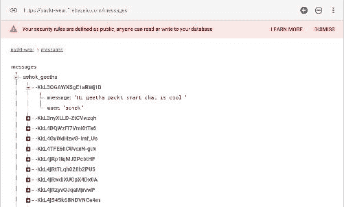
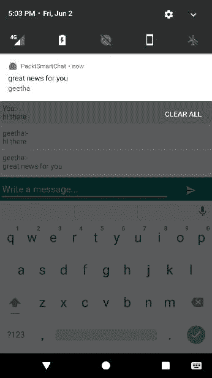
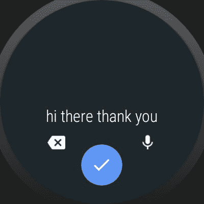
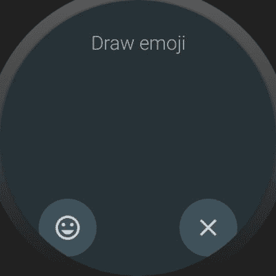

# 第九章：让我们以智能的方式进行聊天 - 通知及其他

前一章帮助我们构建了一个对话式消息应用，但穿戴设备的应用界面非常普通，没有任何通知功能。通知是消息应用非常重要的一个方面，但实现它需要复杂的基础架构来处理通知。当发送者向接收者发送消息时，接收者应该收到一个通知，传达一些信息，比如发送者的名字以及一条快速消息预览。

通知是 Android 中我们可以用来显示信息的组件。在消息应用的情况下，接收者应该收到推送通知来实例化通知组件。所以，每当 Firebase 中的实时数据库更新时，手持设备和穿戴设备都应该收到通知。幸运的是，我们不需要服务器来处理通知；Firebase 会为你的消息应用处理推送通知。当实时数据库有更新时，我们需要触发推送通知。

在本章中，我们将探讨以下内容：

+   Firebase 函数

+   通知

+   材料设计穿戴应用

# Firebase 函数

Firebase 函数是监控数据库触发器以及许多服务器相关执行的最智能解决方案。我们不需要托管一个服务器来监听 Firebase 数据库的变化，然后再触发推送通知，我们可以利用 Firebase 的一项技术来完成这项任务。Firebase 函数对所有 Firebase 技术都有有效的控制，比如 Firebase 认证、存储、分析等。Firebase 函数可以在各种方面使用；例如，当你的分析群组达到某个里程碑时，你可以发送有针对性的通知、邀请等。任何你可能在 Firebase 系统中实现的服务器级别的业务逻辑都可以用 Firebase 函数来完成。我们将使用 Firebase 函数在数据库触发时发送推送通知。完成这项任务我们需要具备入门级的 JavaScript 知识。

要开始使用 Firebase 函数，我们需要 Node.js 环境，你可以从 [`nodejs.org/`](https://nodejs.org/) 安装它。安装 Node.js 时，它还会安装 **node 包管理器** (**npm**)。它有助于安装 JavaScript 框架、插件等。安装 Node.js 后，打开终端或命令行。

输入 `$node --version` 检查是否安装了 node。如果 CLI 返回最新的版本号，那么你就可以开始了：

```java
//Install Firebase CLI 
$ npm install -g firebase-tools

```

如果你遇到任何错误，你应该以超级用户模式执行命令：

```java
sudo su
npm install -g firebase-tools

```

导航到你想保存 Firebase 函数程序的目录，并使用以下命令进行身份验证：

```java
//CLI authentication
$ firebase login

```

成功认证后，你可以初始化 Firebase 函数：

```java
//Initialise Firebase functions
$ firebase init functions

```

CLI 工具将在您初始化的目录中生成 Firebase 函数和必要的代码。用您喜欢的编辑器打开 `index.js`。我们使用 `functions.database` 创建一个用于处理实时数据库触发器的 `Realtime` 数据库事件的 Firebase 函数。我们将调用 ref(path)，以从函数中达到特定的数据库 `path` 的 `onwrite()` 方法，该方法将在数据库更新时发送通知。

现在，为了构建我们的通知负载，让我们了解我们的实时数据库结构：



我们可以看到，消息有一个名为 `ashok_geetha` 的子节点，这意味着这两个用户的对话存储在其中，具有唯一的 Firebase ID。对于此实现，我们将选择 `ashok_geetha` 以推送通知。

现在，在 `index.js` 文件中，添加以下代码：

```java
//import firebase functions modules
const functions = require('firebase-functions');
//import admin module
        const admin = require('firebase-admin');
        admin.initializeApp(functions.config().firebase);

// Listens for new messages added to messages/:pushId
        exports.pushNotification = functions.database
        .ref('/messages/ashok_geetha/{pushId}').onWrite( event => {

        console.log('Push notification event triggered');

        //  Grab the current value of what was written to the Realtime 
        Database.
        var valueObject = event.data.val();

        if(valueObject.photoUrl != null) {
        valueObject.photoUrl= "Sent you a lot of love!";
        }

        // Create a notification
        const payload = {
        notification: {
        title:valueObject.message,
        body: valueObject.user || valueObject.photoUrl,
        sound: "default"
        },
        };

        //Create an options object that contains the time to live for 
        the notification and the priority
        const options = {
        priority: "high",
        timeToLive: 60 * 60 * 24
        };

        return admin.messaging().sendToTopic("pushNotifications", 
        payload, options);
        });

```

当我们拥有不同的 Firebase 结构时，通过使用 url-id 配置，我们可以触发 Firebase 函数，以使推送通知能够与所有用户一起工作。我们只需在 url 中进行以下更改即可。 `/messages/{ChatID}/{pushId}`

现在，在终端中，使用 `$ firebase deploy` 命令完成 Firebase 函数的部署：


之前的 Node.js 设置使用 Firebase 函数触发推送通知。现在，我们需要一种机制，以便在我们的本地移动和穿戴应用程序中接收来自 Firebase 的消息。

切换到 Android Studio，并将以下依赖项添加到您的移动项目 gradle 模块文件中：

```java
//Add the dependency
dependencies {
     compile 'com.google.firebase:firebase-messaging:10.2.4'
}

```

添加依赖项后，创建一个名为 `MessagingService` 的类，该类扩展自 `FirebaseMessagingService` 类。`FirebaseMessaging` 类扩展自 `com.google.firebase.iid.zzb`，而 `zzb` 类扩展自 Android `Service` 类。这个类将帮助 Firebase 消息传递和 Android 应用之间的通信过程。它还可以自动显示通知。让我们创建一个类并将其扩展到 `FirebaseMessagingService` 类，如下所示：

```java
public class MessagingService extends FirebaseMessagingService {

    //Override methods
}

```

是时候添加 `onMessageReceived` 重写方法了。当应用在前台或后台时，该方法接收通知，我们可以使用 `getnotification()` 方法检索所有通知参数：

```java
@Override
public void onMessageReceived(RemoteMessage remoteMessage) {
    super.onMessageReceived(remoteMessage);
}

```

`RemoteMessage` 对象将包含我们从 Firebase 函数中的通知负载中发送的所有数据。在方法内部，添加以下代码以获取标题和消息内容。我们在 Firebase 函数上发送标题参数中的消息；您可以根据自己的用例进行自定义：

```java
String notificationTitle = null, notificationBody = null;
// Check if message contains a notification payload.
if (remoteMessage.getNotification() != null) {
    Log.d(TAG, "Message Notification Body: " + remoteMessage.getNotification().getBody());
    notificationTitle = remoteMessage.getNotification().getTitle();
    notificationBody = remoteMessage.getNotification().getBody();
}

```

为了构建通知，我们将使用 `NotificationCompat.Builder`，当用户点击通知时，我们会将他带到 `MainActivity`：

```java
private void sendNotification(String notificationTitle, String notificationBody) {
    Intent intent = new Intent(this, MainActivity.class);
    intent.addFlags(Intent.FLAG_ACTIVITY_CLEAR_TOP);
    PendingIntent pendingIntent = PendingIntent.getActivity(this, 0, 
    intent,
            PendingIntent.FLAG_ONE_SHOT);

    Uri defaultSoundUri= RingtoneManager.getDefaultUri
    (RingtoneManager.TYPE_NOTIFICATION);
    NotificationCompat.Builder notificationBuilder = 
    (NotificationCompat.Builder) new NotificationCompat.Builder(this)
            .setAutoCancel(true)   //Automatically delete the 
                                   notification
            .setSmallIcon(R.mipmap.ic_launcher) //Notification icon
            .setContentIntent(pendingIntent)
            .setContentTitle(notificationTitle)
            .setContentText(notificationBody)
            .setSound(defaultSoundUri);

    NotificationManager notificationManager = (NotificationManager) 
    getSystemService(Context.NOTIFICATION_SERVICE);

    notificationManager.notify(0, notificationBuilder.build());
}

```

在 `onMessageReceived` 内部调用该方法，并将内容传递给 `sendNotification` 方法：

```java
sendNotification(notificationTitle, notificationBody);

```

完整的类代码如下所示：

```java
public class MessagingService extends FirebaseMessagingService {

    private static final String TAG = "MessagingService";

    @Override
    public void onMessageReceived(RemoteMessage remoteMessage) {
        String notificationTitle = null, notificationBody = null;
        // Check if message contains a notification payload.
        if (remoteMessage.getNotification() != null) {
            Log.d(TAG, "Message Notification Body: " + 
            remoteMessage.getNotification().getBody());
            notificationTitle = 
            remoteMessage.getNotification().getTitle();
            notificationBody = 
            remoteMessage.getNotification().getBody();

            sendNotification(notificationTitle, notificationBody);

        }
    }

    private void sendNotification(String notificationTitle, String 
    notificationBody) {
        Intent intent = new Intent(this, MainActivity.class);
        intent.addFlags(Intent.FLAG_ACTIVITY_CLEAR_TOP);
        PendingIntent pendingIntent = PendingIntent.getActivity(this, 
       0, intent,
                PendingIntent.FLAG_ONE_SHOT);

        Uri defaultSoundUri= RingtoneManager.getDefaultUri
        (RingtoneManager.TYPE_NOTIFICATION);
        NotificationCompat.Builder notificationBuilder =     
        (NotificationCompat.Builder) 
        new NotificationCompat.Builder(this)
                .setAutoCancel(true)   //Automatically delete the 
                                  notification
                .setSmallIcon(R.mipmap.ic_launcher) //Notification icon
                .setContentIntent(pendingIntent)
                .setContentTitle(notificationTitle)
                .setContentText(notificationBody)
                .setSound(defaultSoundUri);

        NotificationManager notificationManager = (NotificationManager) 
       getSystemService(Context.NOTIFICATION_SERVICE);

        notificationManager.notify(0, notificationBuilder.build());
    }
}

```

我们现在可以在清单中注册之前的服务：

```java
<service
    android:name=".MessagingService">
    <intent-filter>
        <action android:name="com.google.firebase.MESSAGING_EVENT"/>
    </intent-filter>
</service>

```

毕竟，我们现在有一个用于监听 `pushNotification` 的服务，但我们需要监听我们发送的特定字符串。我们可以将字符串添加到一些常量中或 XML 文件中，但是当我们要求 Firebase 发送特定频道的通知时，我们需要订阅一个称为主题的频道。在 `ChatActivity` 中添加以下代码，并在方法内部：

```java
FirebaseMessaging.getInstance().subscribeToTopic("pushNotifications");

```

为了使之前的操作全局化，创建一个扩展 `Application` 类的类。在 `onCreate` 方法内部，我们可以按照以下方式订阅主题：

```java
public class PacktApp extends Application {

    @Override
    public void onCreate() {
        super.onCreate();
        Firebase.setAndroidContext(this);
        FirebaseMessaging.getInstance()
        .subscribeToTopic("pushNotifications");
    }
}

```

现在，我们需要在清单中注册应用程序类。应用程序类控制着应用程序生命周期的 `onCreate` 方法，这将有助于维护应用程序的生命状态：

```java
<application
    android:name=".PacktApp"
    ...>

</application>

```

恭喜！我们已经成功配置了推送通知，并在我们的手机上收到了通知：



在已连接的 Wear 设备中，当我们收到通知时，我们将能够看到以下通知。默认情况下，`NotificationCompat.Builder` 类可以帮助 Wear 设备接收通知，如果我们想要自定义它，可以通过以下部分进行操作。

从 Wear 通知组件，我们可以直接从 Wear 设备接收回复到移动应用程序。为了实现这一点，我们将使用 `NotificationCompat` 类中的 `WearExtender` 组件。使用此设置，用户将能够使用语音输入、**输入法框架**（**IMF**）和表情符号回复通知：

```java
 Notification notification = new NotificationCompat.Builder(mContext)
         .setContentTitle("New mail from " + sender.toString())
         .setContentText(subject)
         .setSmallIcon(R.drawable.new_mail)
         .extend(new NotificationCompat.WearableExtender()
                 .setContentIcon(R.drawable.new_mail))
         .build();
 NotificationManagerCompat.from(mContext).notify(0, notification);

```

将会有很多用例，我们需要发送带有已经存储的回复的快速响应，或者快速输入功能。在这种情况下，我们可以使用 `Action.WearableExtender`：

```java
/Android Wear requires a hint to display the reply action inline.
Action.WearableExtender actionExtender =
    new Action.WearableExtender()
        .setHintLaunchesActivity(true)
        .setHintDisplayActionInline(true);
wearableExtender.addAction(actionBuilder.extend(actionExtender).build());

```

现在，在项目中，让我们更新我们的消息服务类，当后台服务接收到推送通知时，我们会触发通知组件。

将以下实例添加到类的全局作用域中：

```java
private static final String TAG = "MessagingService";
public static final String EXTRA_VOICE_REPLY = "extra_voice_reply";
public static final String REPLY_ACTION =
        "com.packt.smartcha.ACTION_MESSAGE_REPLY";

```

当我们从 Wear 设备收到回复时，我们将保留该引用并将其传递给通知处理程序：

```java
// Creates an Intent that will be triggered when a reply is received.
private Intent getMessageReplyIntent(int conversationId) {
    return new Intent().setAction(REPLY_ACTION).putExtra("1223", 
    conversationId);
}

```

Wear 通知随着每个新的 Android 版本的发布而不断发展，在 `NotificationCompat.Builder` 中，我们有所有可以使您的移动应用程序与 Wear 设备交互的功能。当您有一个移动应用程序，并且它有来自 Wear 设备的交互，如通知等，即使没有 Wear 伴侣应用程序，您也可以获得文本回复。

# 消息服务类

在 `MessagingService` 类中，我们有一个名为 `sendNotification` 的方法，该方法向 Wear 和移动设备发送通知。让我们用以下代码更改更新该方法：

```java
private void sendNotification(String notificationTitle, String notificationBody) {
    // Wear 2.0 allows for in-line actions, which will be used for 
    "reply".
    NotificationCompat.Action.WearableExtender inlineActionForWear2 =
            new NotificationCompat.Action.WearableExtender()
                    .setHintDisplayActionInline(true)
                    .setHintLaunchesActivity(false);

    RemoteInput remoteInput = new 
    RemoteInput.Builder("extra_voice_reply").build();

    // Building a Pending Intent for the reply action to trigger.
    PendingIntent replyIntent = PendingIntent.getBroadcast(
            getApplicationContext(),
            0,
            getMessageReplyIntent(1),
            PendingIntent.FLAG_UPDATE_CURRENT);

    // Add an action to allow replies.
    NotificationCompat.Action replyAction =
            new NotificationCompat.Action.Builder(
                    R.drawable.googleg_standard_color_18,
                    "Notification",
                    replyIntent)

                    /// TODO: Add better wear support.
                    .addRemoteInput(remoteInput)
                    .extend(inlineActionForWear2)
                    .build();

    Intent intent = new Intent(this, ChatActivity.class);
    intent.addFlags(Intent.FLAG_ACTIVITY_CLEAR_TOP);
    PendingIntent pendingIntent = PendingIntent.getActivity(this, 0, 
    intent,
            PendingIntent.FLAG_ONE_SHOT);

    Uri defaultSoundUri = RingtoneManager.getDefaultUri
    (RingtoneManager.TYPE_NOTIFICATION);
    NotificationCompat.Builder notificationBuilder =      
    (NotificationCompat.Builder) 
    new NotificationCompat.Builder(this)
            .setAutoCancel(true)   //Automatically delete the     
            notification
            .setSmallIcon(R.mipmap.ic_launcher) //Notification icon
            .setContentIntent(pendingIntent)
            .addAction(replyAction)
            .setContentTitle(notificationTitle)
            .setContentText(notificationBody)
            .setSound(defaultSoundUri);

    NotificationManagerCompat notificationManager = 
    NotificationManagerCompat.from(this);
    notificationManager.notify(0, notificationBuilder.build());
}

```

前一个方法在 Wear 设备上具有 IMF 输入、语音回复和绘制表情符号的功能。修改代码后完整的类如下所示：

```java
package com.packt.smartchat;

/**
 * Created by ashok.kumar on 02/06/17.
 */

public class MessagingService extends FirebaseMessagingService {

    private static final String TAG = "MessagingService";
    public static final String EXTRA_VOICE_REPLY = "extra_voice_reply";
    public static final String REPLY_ACTION =
            "com.packt.smartcha.ACTION_MESSAGE_REPLY";
            public static final String SEND_MESSAGE_ACTION =
            "com.packt.smartchat.ACTION_SEND_MESSAGE";

    @Override
    public void onMessageReceived(RemoteMessage remoteMessage) {
        String notificationTitle = null, notificationBody = null;
        // Check if message contains a notification payload.
        if (remoteMessage.getNotification() != null) {
            Log.d(TAG, "Message Notification Body: " + 
            remoteMessage.getNotification().getBody());
            notificationTitle = 
            remoteMessage.getNotification().getTitle();
            notificationBody = 
            remoteMessage.getNotification().getBody();

            sendNotification(notificationTitle, notificationBody);

        }
    }

    // Creates an intent that will be triggered when a message is read.
    private Intent getMessageReadIntent(int id) {
        return new Intent().setAction("1").putExtra("1482", id);
    }

    // Creates an Intent that will be triggered when a reply is 
    received.
    private Intent getMessageReplyIntent(int conversationId) {
        return new Intent().setAction(REPLY_ACTION).putExtra("1223", 
        conversationId);
    }

    private void sendNotification(String notificationTitle, String 
    notificationBody) {
        // Wear 2.0 allows for in-line actions, which will be used for 
        "reply".
        NotificationCompat.Action.WearableExtender 
        inlineActionForWear2 =
                new NotificationCompat.Action.WearableExtender()
                        .setHintDisplayActionInline(true)
                        .setHintLaunchesActivity(false);

        RemoteInput remoteInput = new 
        RemoteInput.Builder("extra_voice_reply").build();

        // Building a Pending Intent for the reply action to trigger.
        PendingIntent replyIntent = PendingIntent.getBroadcast(
                getApplicationContext(),
                0,
                getMessageReplyIntent(1),
                PendingIntent.FLAG_UPDATE_CURRENT);

        // Add an action to allow replies.
        NotificationCompat.Action replyAction =
                new NotificationCompat.Action.Builder(
                        R.drawable.googleg_standard_color_18,
                        "Notification",
                        replyIntent)

                        /// TODO: Add better wear support.
                        .addRemoteInput(remoteInput)
                        .extend(inlineActionForWear2)
                        .build();

        Intent intent = new Intent(this, ChatActivity.class);
        intent.addFlags(Intent.FLAG_ACTIVITY_CLEAR_TOP);
        PendingIntent pendingIntent = PendingIntent.getActivity(this, 
        0, intent,
                PendingIntent.FLAG_ONE_SHOT);

        Uri defaultSoundUri = RingtoneManager.getDefaultUri
         (RingtoneManager.TYPE_NOTIFICATION);
        NotificationCompat.Builder notificationBuilder = 
        (NotificationCompat.Builder) new 
         NotificationCompat.Builder(this)
                .setAutoCancel(true)   //Automatically delete the 
                notification
                .setSmallIcon(R.mipmap.ic_launcher) //Notification icon
                .setContentIntent(pendingIntent)
                .addAction(replyAction)
                .setContentTitle(notificationTitle)
                .setContentText(notificationBody)
                .setSound(defaultSoundUri);

        NotificationManagerCompat notificationManager = 
        NotificationManagerCompat.from(this);
        notificationManager.notify(0, notificationBuilder.build());
    }
}

```

收到的通知将如下所示：


当用户点击通知时，他将或她将得到以下三个选项：


在 Wear 设备上收到通知后，用户可以通过文本或语音输入，或者借助表情符号来回复他们的想法。为了处理这种情况，我们需要编写一个广播接收器。让我们创建一个名为`MessageReplyReceiver`的类，继承自`BroadcastReceiver`类，并重写`onReceive`方法。当你收到回复时，只需按照以下方式使用`conversationId`更新意图：

```java
@Override
public void onReceive(Context context, Intent intent) {
    if (MessagingService.REPLY_ACTION.equals(intent.getAction())) {
        int conversationId = intent.getIntExtra("reply", -1);
        CharSequence reply = getMessageText(intent);
        if (conversationId != -1) {
            Log.d(TAG, "Got reply (" + reply + ") for ConversationId " 
            + conversationId);
        }
        // Tell the Service to send another message.
        Intent serviceIntent = new Intent(context, 
        MessagingService.class);
        serviceIntent.setAction(MessagingService.SEND_MESSAGE_ACTION);
        context.startService(serviceIntent);
    }
}

```

从`remoteIntent`对象中，为了接收数据并将意图数据转换为文本，使用以下方法：

```java
private CharSequence getMessageText(Intent intent) {
    Bundle remoteInput = RemoteInput.getResultsFromIntent(intent);
    if (remoteInput != null) {
        return 
        remoteInput.getCharSequence
        (MessagingService.EXTRA_VOICE_REPLY);
    }
    return null;
}

```

`MessageReplyReceiver`类的完整代码如下：

```java
public class MessageReplyReceiver extends BroadcastReceiver {

    private static final String TAG = 
    MessageReplyReceiver.class.getSimpleName();

    @Override
    public void onReceive(Context context, Intent intent) {
        if (MessagingService.REPLY_ACTION.equals(intent.getAction())) {
            int conversationId = intent.getIntExtra("reply", -1);
            CharSequence reply = getMessageText(intent);
            if (conversationId != -1) {
                Log.d(TAG, "Got reply (" + reply + ") for 
                ConversationId " + conversationId);
            }
            // Tell the Service to send another message.
            Intent serviceIntent = new Intent(context,    
            MessagingService.class);
            serviceIntent.setAction
           (MessagingService.SEND_MESSAGE_ACTION);
            context.startService(serviceIntent);
        }
    }

    private CharSequence getMessageText(Intent intent) {
        Bundle remoteInput = RemoteInput.getResultsFromIntent(intent);
        if (remoteInput != null) {
            return remoteInput.getCharSequence
            (MessagingService.EXTRA_VOICE_REPLY);
        }
        return null;
    }
}

```

之后，在清单文件中如下注册`broadcastreceiver`：

```java
<receiver android:name=".MessageReplyReceiver">
    <intent-filter>
        <action 
        android:name="com.packt.smartchat.ACTION_MESSAGE_REPLY"/>
    </intent-filter>
</receiver>

```

现在，我们已经完全准备好接收来自 Wear 通知组件到本地应用程序的数据。

从 Wear 通知组件的语音输入屏幕将如下所示：



在这个屏幕上使用绘图表情，Android 会预测你绘制了什么：



IMF 可以用来通过键入输入进行回复：


# 总结

在本章中，你已经学习了如何使用 Firebase 函数发送推送通知，以及如何使用来自 Wear 支持库的通知组件。通知是智能设备中的核心组件；它们通过提醒用户发挥着至关重要的作用。我们已经理解了`NotificationCompat.Builder`类和`WearableExtender`类。我们还探索了输入方法框架以及使用多种回复机制（如表情符号、语音支持等）进行回复的最简单方式。
