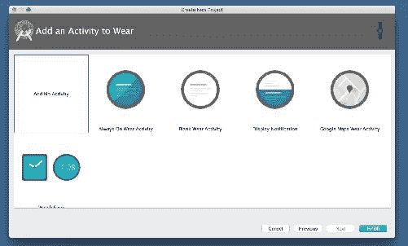
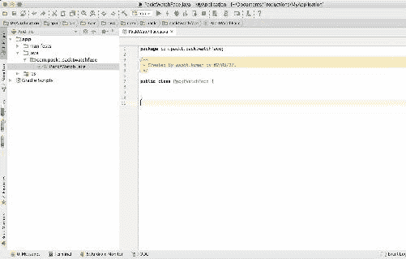
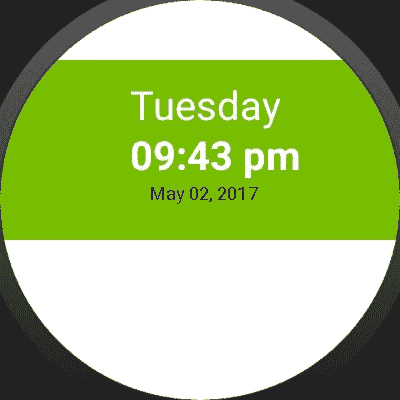

# 第十章：只为时间而生 - 手表表盘与服务

表盘，也称为表盘，是显示固定数字和移动指针的时间的部分。表盘的外观可以通过各种艺术手法和创新来设计。设计传统手表表盘是一门优美的艺术；手表表盘设计师会知道雕刻和设计传统可穿戴手表表盘需要什么。在安卓穿戴中，这个过程非常相似，除了作为表盘制作者，你手中没有任何工具，但需要知道你需要扩展哪个服务以及哪段代码可以帮助你自定义表盘的外观和感觉。表盘将显示时间和日期。在安卓穿戴中，表盘可以是模拟的，也可以是数字的。

安卓穿戴的表盘是包装在可穿戴应用内的服务。当用户选择可用的某个表盘时，可穿戴设备会显示表盘并调用其服务回调方法。自定义表盘使用动态的数字画布，可以融入色彩、活动和相关数据。在安卓穿戴中安装可穿戴表盘应用后，我们可以通过表盘选择器在不同的表盘之间切换。用户可以通过手机上的谷歌应用商店中的配套应用程序，在他们的手表上安装各种表盘。在本章中，你将学习以下主题：

+   `CanvasWatchFaceService` 类和注册你的手表表盘

+   `CanvasWatchFaceService.Engine` 和回调方法

+   编写表盘和处理手势和点击事件

+   理解表盘元素并初始化它们

+   常见问题

# CanvasWatchFaceService 类和注册你的手表表盘

表盘是具有绘图和视觉渲染能力的服务；所有表盘都将扩展`CanvasWatchFaceService`类。`CanvasWatchFaceService`类从`WallpaperSevice`和`WallpaperService.Engine`类中提取其功能。`Engine`类及其回调方法帮助表盘处理其生命周期。如果你需要为 Android Wear 制作一个表盘，你应该使用`CanvasWatchfaceService`类，而不是普通的旧`WallpaperService`。表盘服务与壁纸服务一样，只需实现`onCreateEngine()`方法。表盘引擎需要实现`onTimeTick()`方法以刷新时间并更新视图，以及`onAmbientModeChanged(boolean)`方法以在不同版本的表盘之间切换，例如灰色模式和彩色表盘。表盘引擎同样实现`onInterruptionFilterChanged(int)`以根据用户查询的信息量更新视图。对于在环境模式下发生的更新，将持有`wake_lock`，这样设备在表盘完成绘图过程之前不会进入休眠状态。在应用程序中注册表盘与注册壁纸非常相似，但需要几个额外的步骤。然而，表盘需要`wake_lock`权限，如下所示：

```java
 <uses-permission android:name="android.permission.WAKE_LOCK" />

```

之后，你的表盘服务声明需要预览元数据：

```java
 <meta-data
     android:name="com.google.android.wearable.watchface.preview"
     android:resource="@drawable/preview_face" />
 <meta-data
     android:name=
     "com.google.android.wearable.watchface.preview_circular"
     android:resource="@drawable/preview_face_circular" />

```

最后，我们需要添加一个特殊的意图过滤器，以便手表能够识别。

```java
 <intent-filter>
     <action android:name="android.service.wallpaper.WallpaperService" 
     />
     <category
         android:name=
         "com.google.android.wearable.watchface.category.WATCH_FACE" />
 </intent-filter>

```

# `CanvasWatchFaceService.Engine`类

`CanvasWatchFaceService.Engine`类扩展了`WatchFaceService.Engine`类。在这里，可以在画布上绘制表盘的实际实现可以完成。我们应该实现`onCreateEngine()`以恢复你的具体引擎实现。`CanvasWatchFaceService.Engine`有一个公共构造函数和几个过程，使我们能够实现表盘。让我们探讨一下我们将在本章后半部分实现的一些方法：

+   `void invalidate ()`：计划调用`onDraw(Canvas, Rect)`以绘制下一帧。这必须在主线程上处理。

+   `void onDestroy ()`：在这个回调中，我们可以释放用于完成表盘的硬件和其他资源。

+   `void onDraw(Canvas canvas, Rect bounds)`：绘制表盘、所有视觉组件以及时钟更新逻辑，此方法中完成其他时钟排列。

+   `void onSurfaceChanged()`：这个方法包含四个参数，`void onSurfaceChanged (SurfaceHolder holder, int organise, int width, int stature)`。`SurfaceHolder`参数允许你控制表面大小和不同的排列方式。

+   `void postInvalidate()`：发布一个消息以安排调用`onDraw(Canvas, Rect)`以绘制下一帧。此外，这个方法是线程安全的。我们可以从任何线程调用这个方法。

这些方法在规划您的表盘时起着重要的作用。让我们开始制作表盘。在以下练习中，我们将了解如何制作数字表盘。

# 编写自己的表盘

Android Studio 是我们应该使用的主要工具，用于编写 Wear 应用，原因有很多；由于我们已经为 Wear 2.0 开发配置了开发环境，因此这不应成为挑战。让我们启动 Android Studio 并创建一个 Wear 项目。

在活动选择器中，选择添加无活动。由于表盘是一个服务，我们不需要活动：



我们在前一节中读到，我们将扩展类到`CanvasWatchFaceService`，在画布上绘制表盘，另一个类是`CanvasWatchFaceService.Engine`**，**在那里我们将处理表盘的实际实现以及我们讨论的更重要方法。这将帮助我们实现表盘的必要设置。

现在，在包中创建一个名为`PacktWatchFace`的类文件。

`PacktWatchFace`类将扩展到`CanvasWatchFaceService`类：



创建类文件后，将其扩展到**`CanvasWatchFaceService`**类；这是我们将在清单中注册的服务类。在这个类内部，我们需要为 Wear 设计实现创建一个子类。之后，在同一个类中，我们需要覆盖`onCreateEngine()`方法。

以下代码是 Wear 表盘设计的入口点设置：

```java
public class PacktWatchFace extends CanvasWatchFaceService{

@Override
public Engine onCreateEngine() {
    return new Engine();
}

private class Engine extends CanvasWatchFaceService.Engine{

  }
}

```

`PacktWatchFace`类仅实现一个方法`onCreateEngine()`，该方法返回`CanvasWatchFaceService.Engine`的实际实现。现在，是时候在清单文件中注册`watchFace`服务类了。

在清单注册的应用范围内，添加`PacktWatchFace`类：

```java
<service
    android:name=".PacktWatchFace"
    android:label="PacktWatchface Wear"
    android:permission="android.permission.BIND_WALLPAPER" >
    <meta-data
        android:name="android.service.wallpaper"
        android:resource="@xml/watch_face" />
    <meta-data
        android:name="com.google.android.wearable.watchface.preview"
        android:resource="@mipmap/ic_launcher" />
    <meta-data
        android:name=
        "com.google.android.wearable.watchface.preview_circular"
        android:resource="@mipmap/ic_launcher" />

    <intent-filter>
        <action android:name=
        "android.service.wallpaper.WallpaperService" />

        <category android:name=
        "com.google.android.wearable.watchface.category.WATCH_FACE" />
    </intent-filter>
</service>

```

在`res`目录下的`xml`文件夹中创建一个文件，并将其命名为`watch_face.xml`。在内部，添加如下`wallpaper` XML 标签：

```java
<?xml version="1.0" encoding="UTF-8"?>
<wallpaper xmlns:android="http://schemas.android.com/apk/res/android"/>

```

表盘服务声明需要预览元数据，如前所示。在可穿戴设备的表盘选择器预览中也会使用相同的元数据。这些元素将指定表盘服务的元数据。表盘将使用我们在元数据标签中提供的预览图片和其他信息。

在您的清单中添加以下权限：

```java
<uses-permission android:name="com.google.android.permission.PROVIDE_BACKGROUND" />
<uses-permission android:name="android.permission.WAKE_LOCK" />

```

让我们设置图形元素和年代实例的全局基本实例：

```java
//Essential instances
private static Paint textPaint, boldTextPaint, backGround, whiteBackground, darkText;
private static Calendar calendar;
private static final long INTERACTIVE_UPDATE_RATE_MS = TimeUnit.SECONDS.toMillis(1);
private static final int MSG_UPDATE_TIME = 0;

```

在`onDraw`方法中，我们可以绘制需要在表盘上显示的内容。绘制的视觉将保持静态；仅通过在画布上绘制，我们不能使其动态。时间显示的实现起着重要的作用。

表盘需要显示的信息和其他外观由表盘设计师决定。现在，让我们在`onCreate`方法中初始化所有实例：

```java
backGround = new Paint() {{ setARGB(255, 120, 190, 0); }};
textPaint = createPaint(false, 40);
boldTextPaint = createPaint(true, 40);
whiteBackground = createPaint(false, 0);
darkText = new Paint() {{ setARGB(255, 50, 50, 50); setTextSize(18); }};

```

接下来，我们将编写一个单独的方法`createPaint()`，用于返回所有调用的值：

```java
private Paint createPaint(final boolean bold, final int fontSize) {
    final Typeface typeface = (bold) ? Typeface.DEFAULT_BOLD : 
    Typeface.DEFAULT;

    return new Paint()
    {{
        setARGB(255, 255, 255, 255);
        setTextSize(fontSize);
        setTypeface(typeface);
        setAntiAlias(true);
    }};
}

```

# 处理点击事件和手势

在表盘上，用户可以进行交互，但`CanvasWatchService.Engine`类仅提供了一个交互方法，即单次点击。如果我们想要有其他的交互方式，需要重写`onTapCommand`方法。我们还需要在`onCreate`方法中通过更改 Wear 应用的风格来请求`tapevents`。

```java
setWatchFaceStyle(new WatchFaceStyle.Builder(PacktWatchFace.this)
    .setAcceptsTapEvents(true)
    .build());

```

之后，我们可以重写`onTapCommand()`方法来处理点击事件，并且可以重写函数，以便在用户点击应用时提供功能和服务。

以下代码展示了当用户点击表盘时显示的提示信息：

```java
@Override
public void onTapCommand(
        @TapType int tapType, int x, int y, long eventTime) {
    switch (tapType) {
        case WatchFaceService.TAP_TYPE_TAP:
            // Handle the tap
            Toast.makeText(PacktWatchFace.this, "Tapped", 
            Toast.LENGTH_SHORT).show();
            break;

        // There are other cases, not mentioned here. <a 
        href="https://developer.android.com/training/wearables/watch-
        faces/interacting.html">Read Android guide</a>
        default:
            super.onTapCommand(tapType, x, y, eventTime);
            break;
    }
}

```

这样，我们可以自定义点击功能。默认的函数签名提供了两个坐标，*x* 和 *y*；通过使用这些坐标，我们可以确定用户点击的位置，这有助于表盘设计师相应地自定义手势和点击事件。

# 支持不同的形态因素

Android Wear 设备有方形和矩形设计。让表盘在这两种形态上看起来一样是表盘开发者的责任。大多数为矩形显示屏设计的 UI 布局在圆形显示屏上会失败，反之亦然。为了解决这个问题，`WallpaperService` Engine 有一个名为`onApplyWindowInsets`的函数。`onApplyWindowInsets`方法帮助检查设备是否为圆形；通过确定这一点，我们可以绘制圆形或方形表盘：

```java
@Override
public void onApplyWindowInsets(WindowInsets insets) {
    super.onApplyWindowInsets(insets);
    boolean isRound = insets.isRound();

    if(isRound) {
        // Render the Face in round mode.
    } else {
        // Render the Face in square (or rectangular) mode.
    }
}

```

现在，让我们编写一个能够定时更新表盘的完整方法：

```java
  @Override
        public void onDraw(Canvas canvas, Rect bounds) {
            calendar = Calendar.getInstance();

            canvas.drawRect(0, 0, bounds.width(), bounds.height(), 
            whiteBackground); // Entire background Canvas
            canvas.drawRect(0, 60, bounds.width(), 240, backGround);

            canvas.drawText(new SimpleDateFormat("cccc")
            .format(calendar.getTime()), 130, 120, textPaint);

            // String time = String.format
            ("%02d:%02d", mTime.hour, mTime.minute);
            String time = new SimpleDateFormat
            ("hh:mm a").format(calendar.getTime());
            canvas.drawText(time, 130, 170, boldTextPaint);

            String date = new SimpleDateFormat
            ("MMMM dd, yyyy").format(calendar.getTime());
            canvas.drawText(date, 150, 200, darkText);
        }

```

`onVisibilityChanged`方法帮助注册和解注册告知表盘时间的接收器：

```java
@Override
public void onVisibilityChanged(boolean visible) {
    super.onVisibilityChanged(visible);

    if (visible) {
        registerReceiver();
        // Update time zone in case it changed while we weren't 
        visible.
        calendar = Calendar.getInstance();
    } else {
        unregisterReceiver();
    }

    // Whether the timer should be running depends on whether we're 
    visible (as well as
    // whether we're in ambient mode), so we may need to start or stop 
    the timer.
    updateTimer();
}

private void registerReceiver() {
    if (mRegisteredTimeZoneReceiver) {
        return;
    }
    mRegisteredTimeZoneReceiver = true;
    IntentFilter filter = new 
    IntentFilter(Intent.ACTION_TIMEZONE_CHANGED);
    PacktWatchFace.this.registerReceiver(mTimeZoneReceiver, filter);
}

private void unregisterReceiver() {
    if (!mRegisteredTimeZoneReceiver) {
        return;
    }
    mRegisteredTimeZoneReceiver = false;
    PacktWatchFace.this.unregisterReceiver(mTimeZoneReceiver);
}

/**
 * Starts the {@link #mUpdateTimeHandler} timer if it should be running and isn't currently
 * or stops it if it shouldn't be running but currently is.
 */
private void updateTimer() {
    mUpdateTimeHandler.removeMessages(MSG_UPDATE_TIME);
    if (shouldTimerBeRunning()) {
        mUpdateTimeHandler.sendEmptyMessage(MSG_UPDATE_TIME);
    }
}

```

为了确保计时器只在表盘可见时运行，我们将设置以下配置：

```java
private boolean shouldTimerBeRunning() {
    return isVisible() && !isInAmbientMode();
}

```

要在表盘中定期更新时间，请执行以下操作：

```java
 private void handleUpdateTimeMessage() {
        invalidate();
        if (shouldTimerBeRunning()) {
            long timeMs = System.currentTimeMillis();
            long delayMs = INTERACTIVE_UPDATE_RATE_MS
                    - (timeMs % INTERACTIVE_UPDATE_RATE_MS);
            mUpdateTimeHandler.sendEmptyMessageDelayed(MSG_UPDATE_TIME, 
            delayMs);
        }
    }
}

```

现在，让我们用`WeakReference`类的实现来完善代码。弱引用对象将允许引用对象被最终确定，并且可以在之后访问。弱引用将使所有之前弱可达的对象被最终确定。最后，它将把那些最近清除的、注册在引用队列中的弱引用入队：

```java
private static class EngineHandler extends Handler {
    private final WeakReference<Engine> mWeakReference;

    public EngineHandler(PacktWatchFace.Engine reference) {
        mWeakReference = new WeakReference<>(reference);
    }

    @Override
    public void handleMessage(Message msg) {
        PacktWatchFace.Engine engine = mWeakReference.get();
        if (engine != null) {
            switch (msg.what) {
                case MSG_UPDATE_TIME:
                    engine.handleUpdateTimeMessage();
                    break;
            }
        }
    }
}

```

要添加一个可绘制对象，我们可以使用`BitmapFactory`类：

```java
bitmapObj = BitmapFactory.decodeResource(getResources(), R.mipmap.ic_launcher);

// And set the bitmap object in onDraw methods canvas            canvas.drawBitmap(bob, 0, 40, null);

```

既然完整的逻辑定义已经完成，让我们看看最终定稿的表盘类：

```java
/**
 * Created by ashok.kumar on 27/04/17.
 */

public class PacktWatchFace extends CanvasWatchFaceService{

    //Essential instances
    private static Paint textPaint, boldTextPaint, backGround, 
    whiteBackground, darkText;
    private static Calendar calendar;
    private static final long INTERACTIVE_UPDATE_RATE_MS = 
    TimeUnit.SECONDS.toMillis(1);
    private static final int MSG_UPDATE_TIME = 0;

    @Override
    public Engine onCreateEngine() {
        return new Engine();
    }

    private class Engine extends CanvasWatchFaceService.Engine {

        final Handler mUpdateTimeHandler = new EngineHandler(this);

        final BroadcastReceiver mTimeZoneReceiver = new 
        BroadcastReceiver() {
            @Override
            public void onReceive(Context context, Intent intent) {
                calendar = Calendar.getInstance();
            }
        };
        boolean mRegisteredTimeZoneReceiver = false;

        boolean mLowBitAmbient;

        @Override
        public void onCreate(SurfaceHolder holder) {
            super.onCreate(holder);

            setWatchFaceStyle(new WatchFaceStyle.Builder
            (PacktWatchFace.this)
                    .setCardPeekMode(WatchFaceStyle.PEEK_MODE_SHORT)
                    .setBackgroundVisibility
                    (WatchFaceStyle.BACKGROUND_VISIBILITY_INTERRUPTIVE)
                    .setShowSystemUiTime(false)
                    .build());

            backGround = new Paint() {{ setARGB(255, 120, 190, 0); }};
            textPaint = createPaint(false, 40);
            boldTextPaint = createPaint(true, 40);
            whiteBackground = createPaint(false, 0);
            darkText = new Paint() 
            {{ setARGB(255, 50, 50, 50); setTextSize(18); }};

            setWatchFaceStyle(new WatchFaceStyle.Builder
            (PacktWatchFace.this)
                    .setAcceptsTapEvents(true)
                    .build());

            calendar = Calendar.getInstance();
        }

        private Paint createPaint
        (final boolean bold, final int fontSize) {
            final Typeface typeface = 
            (bold) ? Typeface.DEFAULT_BOLD : Typeface.DEFAULT;

            return new Paint()
            {{
                setARGB(255, 255, 255, 255);
                setTextSize(fontSize);
                setTypeface(typeface);
                setAntiAlias(true);
            }};
        }

        @Override
        public void onTapCommand(
                @TapType int tapType, int x, int y, long eventTime) {
            switch (tapType) {
                case WatchFaceService.TAP_TYPE_TAP:
                    // Handle the tap
                    Toast.makeText(PacktWatchFace.this, 
                    "Tapped", Toast.LENGTH_SHORT).show();
                    break;

                default:
                    super.onTapCommand(tapType, x, y, eventTime);
                    break;
            }
        }

        @Override
        public void onDestroy() {
            mUpdateTimeHandler.removeMessages(MSG_UPDATE_TIME);
            super.onDestroy();
        }

        @Override
        public void onPropertiesChanged(Bundle properties) {
            super.onPropertiesChanged(properties);
            mLowBitAmbient = properties.getBoolean
            (PROPERTY_LOW_BIT_AMBIENT, false);
        }

        @Override
        public void onTimeTick() {
            super.onTimeTick();
            invalidate();
        }

        @Override
        public void onAmbientModeChanged(boolean inAmbientMode) {
            super.onAmbientModeChanged(inAmbientMode);
            if (inAmbientMode) {
                if (mLowBitAmbient) {
                }
                invalidate();
            }

            updateTimer();
        }

        @Override
        public void onDraw(Canvas canvas, Rect bounds) {
            calendar = Calendar.getInstance();

            canvas.drawRect(0, 0, bounds.width(), bounds.height(), 
            whiteBackground); // Entire background Canvas
            canvas.drawRect(0, 60, bounds.width(), 240, backGround);

            canvas.drawText(new SimpleDateFormat("cccc")
            .format(calendar.getTime()), 130, 120, textPaint);

            // String time = String.format("%02d:%02d", mTime.hour, 
            mTime.minute);
            String time = new SimpleDateFormat
            ("hh:mm a").format(calendar.getTime());
            canvas.drawText(time, 130, 170, boldTextPaint);

            String date = new SimpleDateFormat
            ("MMMM dd, yyyy").format(calendar.getTime());
            canvas.drawText(date, 150, 200, darkText);
        }

        @Override
        public void onVisibilityChanged(boolean visible) {
            super.onVisibilityChanged(visible);

            if (visible) {
                registerReceiver();
                calendar = Calendar.getInstance();
            } else {
                unregisterReceiver();
            }

            updateTimer();
        }

        private void registerReceiver() {
            if (mRegisteredTimeZoneReceiver) {
                return;
            }
            mRegisteredTimeZoneReceiver = true;
            IntentFilter filter = new IntentFilter
            (Intent.ACTION_TIMEZONE_CHANGED);
            PacktWatchFace.this.registerReceiver
            (mTimeZoneReceiver, filter);
        }

        private void unregisterReceiver() {
            if (!mRegisteredTimeZoneReceiver) {
                return;
            }
            mRegisteredTimeZoneReceiver = false;
            PacktWatchFace.this.unregisterReceiver(mTimeZoneReceiver);
        }

        private void updateTimer() {
            mUpdateTimeHandler.removeMessages(MSG_UPDATE_TIME);
            if (shouldTimerBeRunning()) {
                mUpdateTimeHandler.sendEmptyMessage(MSG_UPDATE_TIME);
            }
        }

        private boolean shouldTimerBeRunning() {
            return isVisible() && !isInAmbientMode();
        }

        private void handleUpdateTimeMessage() {
            invalidate();
            if (shouldTimerBeRunning()) {
                long timeMs = System.currentTimeMillis();
                long delayMs = INTERACTIVE_UPDATE_RATE_MS
                        - (timeMs % INTERACTIVE_UPDATE_RATE_MS);
                mUpdateTimeHandler
                .sendEmptyMessageDelayed(MSG_UPDATE_TIME, delayMs);
            }
        }
    }

    private static class EngineHandler extends Handler {
        private final WeakReference<Engine> mWeakReference;

        public EngineHandler(PacktWatchFace.Engine reference) {
            mWeakReference = new WeakReference<>(reference);
        }

        @Override
        public void handleMessage(Message msg) {
            PacktWatchFace.Engine engine = mWeakReference.get();
            if (engine != null) {
                switch (msg.what) {
                    case MSG_UPDATE_TIME:
                        engine.handleUpdateTimeMessage();
                        break;
                }
            }
        }
    }
}

```

最终编译的表盘将出现在你的 Wear 设备的表盘选择器中：



恭喜你构建了你的第一个表盘。

# 理解表盘元素并初始化它们

根据我们正在开发的表盘类型，我们需要规划表盘的某些元素。我们已经了解了构建数字表盘需要什么，但要构建模拟表盘，我们需要了解一些有助于构建表盘的表盘元素。

通常，模拟表盘是由以下三个基本组件组成的：

+   `HOUR_STROKE`

+   `MINUTE_STROKE`

+   `SECOND_TICK_STROKE`

现在，要构建一个模拟表盘，我们需要这三个组件，其余的事情与构建数字表盘几乎相同。在这里，我们需要在动画化笔画上投入更多的努力。

首先，我们需要设计`Strokes`，如下代码所示：

```java
 mHourPaint = new Paint();
 mHourPaint.setColor(mWatchHandColor);
 mHourPaint.setStrokeWidth(HOUR_STROKE_WIDTH);
 mHourPaint.setAntiAlias(true);
 mHourPaint.setStrokeCap(Paint.Cap.ROUND);
 mHourPaint.setShadowLayer(SHADOW_RADIUS, 0, 0, mWatchHandShadowColor);

 mMinutePaint = new Paint();
 mMinutePaint.setColor(mWatchHandColor);
 mMinutePaint.setStrokeWidth(MINUTE_STROKE_WIDTH);
 mMinutePaint.setAntiAlias(true);
 mMinutePaint.setStrokeCap(Paint.Cap.ROUND);
 mMinutePaint.setShadowLayer(SHADOW_RADIUS, 0, 0, 
 mWatchHandShadowColor);

 mSecondPaint = new Paint();
 mSecondPaint.setColor(mWatchHandHighlightColor);
 mSecondPaint.setStrokeWidth(SECOND_TICK_STROKE_WIDTH);
 mSecondPaint.setAntiAlias(true);
 mSecondPaint.setStrokeCap(Paint.Cap.ROUND);
 mSecondPaint.setShadowLayer(SHADOW_RADIUS, 0, 0, 
 mWatchHandShadowColor);

 mTickAndCirclePaint = new Paint();
 mTickAndCirclePaint.setColor(mWatchHandColor);
 mTickAndCirclePaint.setStrokeWidth(SECOND_TICK_STROKE_WIDTH);
 mTickAndCirclePaint.setAntiAlias(true);
 mTickAndCirclePaint.setStyle(Paint.Style.STROKE);
 mTickAndCirclePaint.setShadowLayer(SHADOW_RADIUS, 0, 0, 
 mWatchHandShadowColor);

```

现在，使用之前设计的`Strokes`，我们可以按照自己的想法设计和定制表盘，还可以在画布上添加不同的背景以及其他装饰元素，使你的模拟表盘变得特别。

对于数字表盘，你需要为文本以及表盘中使用的其他图形元素提供一个参考。

# 常见问题

Wear 表盘应用与 Wear 应用不同。表盘应用遇到的最常见问题是不同的形态因素，如方形和圆形表盘下巴。为解决这个问题，程序员需要在表盘执行前检测 Wear 的形态因素。正如我们已经讨论的，`CanvasWatchFaceService.Engine`的`onApplyWindowInsets()`方法可以帮助找到 Wear 的形状。

表盘应用始终在运行；实际上，表盘服务扩展了壁纸服务。当我们有大量从网络 API 调用获取数据的服务时，电池可能会很快耗尽。这些服务可能包括：

+   不同的形态因素

+   电池效率

+   用户界面适应

+   过多的动画

+   我们用来构建 Wear 表盘的资源

+   依赖硬件的表盘

用户界面适应是表盘制作者面临的另一个挑战；当我们启用表盘样式中的`setHotwordIndicator()`时，Android 系统应该能够在我们构建的表盘上方发布和叠加通知卡片。我们构建的模拟表盘必须考虑这种情况，因为模拟表盘在调整大小方面有些不情愿，并且在连续的笔画动画中，它不会与系统通知协调。表盘中过多的动画不是一个好主意。有许多动画会导致 CPU 和 GPU 性能问题。当我们在表盘中使用动画时需要考虑以下事项：

+   减少动画的帧率

+   让 CPU 在动画之间休眠

+   减小所使用的位图资源的大小

+   绘制缩放位图时禁用抗锯齿

+   将昂贵的操作移出绘图方法

当你的表盘依赖于硬件来显示数据时，你应该确保周期性地访问硬件并释放它。例如，当我们使用 GPS 来显示当前位置，并且表盘不断监听 GPS 时，不仅会耗尽电池电量，垃圾回收器还可能会抛出错误。

# 交互式表盘

每当 Wear 2.0 更新到来时，趋势都会发生变化，带来新的互动表盘，这些表盘也可以具有独特的互动和风格表达。所有为 Wear 开发表盘的开发者可能需要开始考虑互动表盘。

什么是一个真正的互动表盘？

这个想法是让用户通过及时提供令人愉悦和有用的信息来喜欢和爱上表盘，这改变了用户对表盘的体验。

谷歌提出以下方法来实现互动表盘：

+   创意视觉

+   不同的形态因素

+   显示模式

+   系统 UI 元素

+   集成数据的表盘

Android Wear 以非常高效的方式表达时间提供了一个数字画布。Android Wear 还提供了在表盘上集成数据，以实现更高层次的个性化。表盘和设计需要一目了然，并且应向表盘用户传达优先信息。

我们知道，Android Wear 的不同形态因素是表盘开发者的实现挑战。表盘在设计语言上应保持一致，这包括一套通用的颜色、线宽、阴影和其他设计元素。

在 Wear 2.0 中，有两种显示模式：

+   活跃模式

+   常亮模式

活跃模式是当用户扭动手腕或触摸显示屏来查看时间时。Wear 将点亮显示屏并激活表盘。在这个模式下，表盘可以使用丰富多彩的动画和流畅的设计语言来表达时间和其他信息。

常亮模式有助于节省电池电量，当 Wear 设备进入常亮模式时，显示能力仅限于黑、白和灰色。我们需要仔细设计在常亮模式下显示的内容，使其与表盘设计相似，但颜色和动画较少。

系统 UI 元素指示 Wear 设备的状态；例如，电池水平和其他系统 UI 元素。表盘应允许这些指示器显示在 Wear 设备的特定位置。

集成数据的表盘可以帮助表盘用户一目了然地查看所选信息，例如，步数、天气预报等可以显示在表盘上。

# 总结

在本章中，我们探讨了设计表盘的基本理解，并构建了一个数字表盘。我们了解了`CanvasWatchFaceService`类如何在构建表盘时提供帮助，并且也了解了以下与表盘相关的概念：

+   `CanvasWatchFaceService`类

+   `canvasWatchFaceService.Engine`方法

+   在 Wear 模块清单中注册表盘

+   处理轻触手势

+   不同的形态因素

+   向表盘添加位图图像

+   表盘元素

+   常见问题

+   互动表盘

制作手表表盘是一项卓越的艺术工程技术，包括我们应该在表盘上表达哪些数据，以及时间和日期数据是如何被展示的。`ComplicationsAPI`是 Wear 2.0 中的新特性。我们将在下一章讨论这个内容，同时也会涉及一些高级概念。
