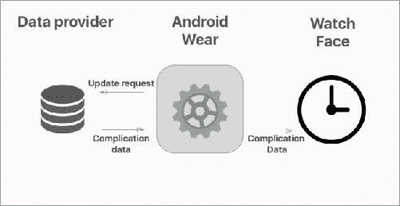
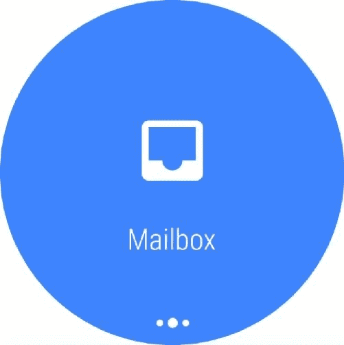
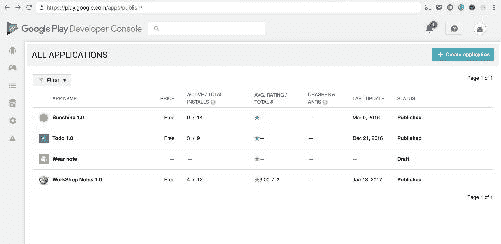
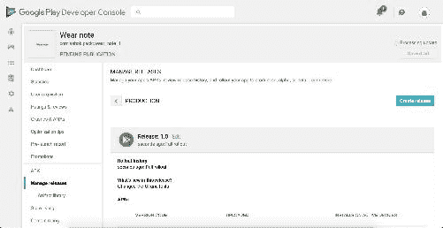

# 第十一章：关于 Wear 2.0 的更多信息

Android Wear 2.0 是一个重要的更新，包含了许多新功能，包括 Google 助手、独立应用程序、新手表表盘以及支持第三方复杂功能。在前面的章节中，我们探讨了如何编写不同类型的 Wear 应用。Wear 2.0 根据当前市场研究提供了更多功能，谷歌正在与合作伙伴公司合作，为 Wear 构建强大的生态系统。

在本章中，让我们了解如何通过以下概念将我们的现有技能向前推进：

+   独立应用程序

+   曲面布局和更多的 UI 组件

+   复杂功能 API

+   不同的导航和动作

+   手腕手势

+   输入法框架

+   将 Wear 应用分发到 Play 商店

# 独立应用程序

在 Wear 2.0 中，独立应用程序是穿戴生态系统的强大功能。在没有手机的情况下使用穿戴应用是多么酷啊！有许多场景，Wear 设备曾经需要依赖手机，例如，接收新电子邮件通知，Wear 需要连接到手机以使用互联网服务。现在，穿戴设备可以独立连接 Wi-Fi，并且可以同步所有应用进行新更新。用户现在可以在没有配对手机的情况下，使用穿戴应用完成更多任务。

# 将应用标识为独立应用

独立应用程序的理念是穿戴平台的一个伟大特性。Wear 2.0 通过 Android 清单文件中的元数据元素区分独立应用。

在`<application>`应用标签内部，`</application>`元数据元素与`com.google.android.wearable.standalone`一起放置，值为 true 或 false。新的元数据元素指示穿戴应用是否为独立应用，不需要配对手机即可操作。当元数据元素设置为 true 时，应用也可以适用于与 iPhone 合作的穿戴设备。通常，手表应用可以分为以下几类：

+   完全独立于手机应用

+   半独立（没有手机配对，穿戴应用的功能将有限）

+   依赖于手机应用

要使 Wear 应用完全独立或半独立，请将元数据的值设置为 true，如下所示：

```java
<application>
...
  <meta-data
    android:name="com.google.android.wearable.standalone"
    android:value="true" />
...
</application>

```

现在，任何平台，比如没有 Play 商店的 iPhone 或 Android 手机，也可以使用穿戴应用，直接从穿戴设备中的 Play 商店下载。通过将元数据值设置为 false，我们告诉 Android Wear 这个穿戴应用依赖于带有 Play 商店应用的手机。

**注意：**不管值可能是错误的，手表应用可以在相应的手机应用安装之前安装。这样，如果手表应用识别到配套手机没有必要的手机应用，手表应用应该提示用户安装手机应用。

# 独立应用存储

你可以使用标准的 Android 存储 API 在本地存储数据。例如，你可以使用 SharedPreference API、SQLite 或内部存储。到目前为止，我们已经探讨了如何将 ORM 库（如 Realm）集成到穿戴应用中，不仅仅是为了存储数据，同时也为了在穿戴应用和手机应用之间共享代码。另一方面，特定于形状组件和外形尺寸的代码可以放在不同的模块中。

# 在另一台设备上检测穿戴应用。

Android 穿戴应用和 Android 手机应用可以使用 Capability API 识别支持的应用。手机和穿戴应用可以静态和动态地向配对的设备广播。当应用在用户的穿戴网络中的节点上时，**Capability API**使另一个应用能够识别相应安装的应用。

# 广告功能。

要从穿戴设备在手持设备上启动活动，请使用`MessageAPI`类发送请求。多个穿戴设备可以与手持 Android 设备关联；穿戴应用需要确定关联的节点是否适合从手持设备应用启动活动。要广告手持应用的功能，请执行以下步骤：

1.  在项目的`res/values/`目录中创建一个 XML 配置文件，并将其命名为`wear.xml`。

1.  在`wear.xml`中添加一个名为`android_wear_capabilities`的资源。

1.  定义设备提供的功能。

注意：功能是自定义字符串，由你定义，并且在你的应用中应该是唯一的。

下面的示例展示了如何向`wear.xml`添加一个名为`voice_transcription`的功能：

```java
<resources>
    <string-array name="android_wear_capabilities">
        <item>voice_transcription</item>
    </string-array>
</resources>

```

# 获取具有所需功能的节点。

最初，我们可以通过调用`CapabilityAPI.getCapability()`方法来检测有能力的节点。以下示例展示了如何手动检索具有`voice_transcription`功能的可达节点的结果：

```java
private static final String
        VOICE_TRANSCRIPTION_CAPABILITY_NAME = "voice_transcription";

private GoogleApiClient mGoogleApiClient;

...

private void setupVoiceTranscription() {
    CapabilityApi.GetCapabilityResult result =
            Wearable.CapabilityApi.getCapability(
                    mGoogleApiClient, 
                    VOICE_TRANSCRIPTION_CAPABILITY_NAME,
                    CapabilityApi.FILTER_REACHABLE).await();

    updateTranscriptionCapability(result.getCapability());
}

```

要在穿戴设备连接时检测到有能力的节点，请将`CapabilityAPI.capabilityListner()`实例注册到`googleAPIclient`。以下示例展示了如何注册监听器并检索具有`voice_transcription`功能的可达节点的结果：

```java
private void setupVoiceTranscription() {
    ...

    CapabilityApi.CapabilityListener capabilityListener =
            new CapabilityApi.CapabilityListener() {
                @Override
                public void onCapabilityChanged(CapabilityInfo 
                capabilityInfo) {
                    updateTranscriptionCapability(capabilityInfo);
                }
            };

    Wearable.CapabilityApi.addCapabilityListener(
            mGoogleApiClient,
            capabilityListener,
            VOICE_TRANSCRIPTION_CAPABILITY_NAME);
}

```

注意：如果你创建了一个扩展`WearableListenerService`的服务来识别功能变化，你可能需要重写`onConnectedNodes()`方法，以监听更细粒度的连接细节，例如，当穿戴设备从 Wi-Fi 更改为与手机通过蓝牙连接时。有关如何监听重要事件的信息，请阅读**数据层事件**。

在识别出有能力的节点后，确定消息发送的位置。你应该选择一个与你的可穿戴设备接近的节点，以减少通过多个节点路由消息。一个附近的节点被定义为直接与设备连接的节点。要确定一个节点是否在附近，请调用`Node.isNearby()`方法。

# 检测并指导用户安装手机应用

现在，我们知道如何使用 Capability API 检测穿戴和手机应用。现在是引导用户从 Play 商店安装相应应用的时候了。

使用`CapabilityApi`检查你的手机应用是否已安装在配对的手机上。有关更多信息，请参见 Google 示例。如果你的手机应用没有安装在手机上，使用`PlayStoreAvailability.getPlayStoreAvailabilityOnPhone()`检查它是什么类型的手机。

如果返回`PlayStoreAvailability.PLAY_STORE_ON_PHONE_AVAILABLE`有效，这意味着手机是一部安装了 Play 商店的 Android 手机。在穿戴设备上调用`RemoteIntent.startRemoteActivity()`，在手机上打开 Play 商店。使用你的电话应用的市场 URI（可能与你的手机 URI 不同）。例如，使用市场 URI：`market://details?id=com.example.android.wearable.wear.finddevices`。

如果返回`PlayStoreAvailability.PLAY_STORE_ON_PHONE_UNAVAILABLE`，这意味着手机很可能是 iOS 手机（无法访问 Play 商店）。通过在穿戴设备上调用`RemoteIntent.startRemoteActivity()`，在 iPhone 上打开 App Store。你可以指定你的应用在 iTunes 的 URL，例如，[`itunes.apple.com/us/application/yourappname.`](https://itunes.apple.com/us/application/yourappname。)同样，注意从手表打开 URL。在 iPhone 上，从 Android Wear，你不能编程确定你的手机应用是否已安装。作为最佳实践，为用户提供一种机制（例如，一个按钮）手动触发打开 App Store。

使用之前描述的`remoteIntent` API，你可以确定任何 URL 都可以从穿戴设备在手机上打开，而不需要手机应用。

# 只获取重要的信息

在大多数用例中，当我们从互联网获取数据时，我们只获取必要的信息。超出这个范围，我们可能会遇到不必要的延迟、内存使用和电池消耗。

当穿戴设备与蓝牙 LE 连接关联时，穿戴应用可能只能访问每秒 4 千字节的数据传输能力。根据穿戴设备的不同，建议采取以下步骤：

1.  审查你的网络请求和响应，以获取更多信息，这是针对手机应用的。

1.  在通过网络发送到手表之前缩小大图片

# 云消息传递

对于通知任务，应用可以直接在手表应用中使用 **Firebase 云消息传递** （**FCM**）；在 2.0 版本的手表中不支持 Google 云消息传递。

没有特定的 FCM API 用于手表应用；它遵循与移动应用通知相似的配置：FCM 与手表以及休眠模式下的工作良好。推荐使用 FCM 来发送和接收手表设备的通知。

从服务器接收通知的过程是，应用需要将设备的唯一 Firebase `registration_id` 发送到服务器。然后服务器可以识别 `FCM_REST` 端点并发送通知。FCM 消息采用 JSON 格式，并可以包含以下任一负载：

+   **通知负载**：通用通知数据；当通知到达手表时，应用可以检查通知，用户可以启动接收通知的应用。

+   **数据负载**：负载将包含自定义的键值对。该负载将被作为数据传输给手表应用。

在开发特定于手表设备的应用时，手表应用包含了许多关注点，比如获取高带宽网络和根据手表标准降低图片质量等。此外，还有 UI 设计和保持后台服务等。在开发应用时牢记这些，将使它们在众多应用中脱颖而出。

# 复杂功能 API

复杂功能对手表来说肯定不是什么新鲜事物。互联网上说，第一个带有复杂功能的怀表是在十六世纪被展示的。智能手表是我们考虑复杂功能组件的理想之地。在 Android Wear 中，手表表盘显示的不仅仅是时间和日期，还包括步数计数器、天气预报等。到目前为止，这些复杂功能的工作方式有一个主要限制。到目前为止，每个自定义手表表盘应用都需要执行自己的逻辑来获取显示信息。例如，如果两个表盘都有获取步数并显示相关信息的功能，那么这将是一种浪费。Android Wear 2.0 旨在通过新的复杂功能 API 解决这个问题。

在复杂功能的情况下，手表表盘通信数据提供者扮演着主要角色。它包含获取信息的逻辑。手表表盘不会直接访问数据提供者；当有选择复杂功能的其他数据时，它会得到回调。另一方面，数据提供者不会知道数据将如何被使用；这取决于手表表盘。

下列描述讨论了手表表盘如何从数据提供者获取复杂功能数据：



# 复杂功能数据提供者

新的并发症 API 具有巨大的潜力；它可以访问电池电量、气候、步数等。并发症数据提供商是一个服务，扩展了 `ComplicationProviderService`。这个基类有一组回调，目的是为了知道提供商何时被选为当前表盘的数据源：

+   (`onComplicationActivated`): 当并发症被激活时，会调用此回调方法。

+   (`onComplicationDeactivated`): 当并发症被停用时，会调用此回调方法。

+   (`onComplicationUpdate`): 当特定并发症 ID 的并发症更新信息时，会调用此回调。

`ComplicationProviderService` 类是一个抽象类，扩展到了一个服务。提供商服务必须实现 `onComplicationUpdate`（整型，整型和 `ComplicationManager`）以响应并发症系统对更新的请求。此服务的清单声明必须包含对 `ACTION_COMPLICATION_UPDATE_REQUEST` 的意图过滤器。如果需要，还应该包含确定支持的类型、刷新周期和配置动作的元数据：(`METADATA_KEY_SUPPORTED_TYPES`, `METADATA_KEY_UPDATE_PERIOD_SECONDS`, 和 `METADATA_KEY_PROVIDER_CONFIG_ACTION`)。

服务的清单条目还应包含一个 android:Icon 属性。那里给出的图标应该是一个单色的白色图标，代表提供商。此图标将出现在提供商选择器界面中，并且可能还会被包含在 `ComplicationProviderInfo` 中，提供给表盘在它们的配置活动中显示。

下面的代码演示了使用 `ComplicationsData` 的构建器模式将 `ComplicationData` 填充为短文本类型，并带有下一个事件日期和可选图标：

```java
ComplicationData.Builder(ComplicationData.*TYPE_SHORT_TEXT*)
    .setShortText(ComplicationText.*plainText*(formatShortDate(date)))
    .setIcon(Icon.*createWithResource*(context, R.drawable.*ic_event*))
    .setTapAction(createContactEventsActivityIntent())
    .build();

```

# 向手表表盘添加并发症

Android Wear 2.0 为您的智能手表带来了许多新组件。然而，更引人注目的是在表盘上增加了可适应的*并发症*。并发症是一个两部分的系统；手表表盘工程师可以设计他们的表盘以拥有并发症的开放插槽，应用程序开发人员可以将应用程序的一部分作为并发症整合进来。手表表盘应用可以接收并发症数据，并允许用户选择数据提供商。Android Wear 提供了一个数据源的用户界面。我们可以向某些表盘添加并发症，或来自应用程序的数据。您的 Wear 2.0 表盘上的并发症可以显示电池寿命和日期，这只是开始。您还可以包含一些第三方应用程序的并发症。

# 接收数据和渲染并发症

要开始接收并发症数据，表盘会在 `WatchFaceService.Engine` 类中调用 `setActiveComplications`，并传入表盘并发症 ID 列表。表盘创建这些 ID 以便显著标识出并发症可以出现的位置，并将它们传递给 `createProviderChooserIntent` 方法，使用户能够选择哪个并发症应出现在哪个位置。并发症数据通过 `onComplicationDataUpdate`（`WatchFaceService.Engine` 的回调）来传达。

# 允许用户选择数据提供商

Android Wear 提供了一个 UI（通过一个活动），使用户能够为特定并发症选择提供商。表盘可以调用 `createProviderChooserIntent` 方法来获取一个可用于展示选择器界面的意图。这个意图必须与 `startActivityForResult` 一起使用。当表盘调用 `createProviderChooserIntent` 时，表盘提供一个表盘并发症 ID 和支持的类型列表。

# 用户与并发症的交互

提供商可以指定用户点击并发症时发生的动作，因此大多数并发症应该是可以被点击的。这个动作将被指定为 `PendingIntent`，包含在 `ComplicationData` 对象中。表盘负责检测并发症上的点击，并在点击发生时触发挂起意图。

# 并发数据权限

Wear 应用必须拥有以下权限才能接收并发症数据并打开提供商选择器：

```java
com.google.android.wearable.permission.RECEIVE_COMPLICATION_DATA

```

# 打开提供商选择器

如果表盘没有获得前面的权限，将无法启动提供商选择器。为了更容易请求权限并启动选择器，Wearable Support Library 提供了 `ComplicationHelperActivity` 类。在几乎所有情况下，应使用此类别代替 `ProviderChooserIntent` 来启动选择器。要使用 `ComplicationHelperActivity`，请在清单文件中将它添加到表盘：

```java
<activity android:name="android.support.wearable.complications.ComplicationHelperActivity"/>

```

要启动提供商选择器，请调用 `ComplicationHelperActivity.createProviderChooserHelperIntent` 方法来获取意图。新的意图可以与 `startActivity` 或 `startActivityForResult` 一起使用来启动选择器：

```java
startActivityForResult(
  ComplicationHelperActivity.createProviderChooserHelperIntent(
     getActivity(),
     watchFace,
     complicationId,
     ComplicationData.TYPE_LARGE_IMAGE),
  PROVIDER_CHOOSER_REQUEST_CODE);

```

当帮助活动启动时，它会检查权限是否已授予。如果未授予权限，帮助活动会提出运行时权限请求。如果权限请求被接受（或不必要），则会显示提供商选择器。

对于表盘来说，有许多场景需要考虑。在您的表盘实现并发症之前，请检查所有这些场景。您是如何接收并发症数据的？是来自提供商、远程服务器还是 REST 服务？提供商和表盘是否来自同一个应用？您还应该检查是否缺少适当的权限等。

# 了解 Wear 的不同导航方式

安卓穿戴在各个方面都在演进。在穿戴 1.0 中，屏幕之间的切换曾经让用户感到繁琐和困惑。现在，谷歌引入了材料设计和交互式抽屉，例如：

+   **导航抽屉**：导航抽屉与移动应用导航抽屉类似的组件。它将允许用户在视图之间切换。用户可以通过在内容区域的顶部向下轻扫来在穿戴设备上访问导航抽屉。我们可以通过将`setShouldOnlyOpenWhenAtTop()`方法设置为 false，允许在滚动父内容内的任何位置打开抽屉，并且可以通过设置为 true 来限制它。

+   **单页导航抽屉**：穿戴应用可以在单页和多页上向用户展示视图。新的导航抽屉组件通过将`app:navigation_style`设置为`single_page`，允许内容保持在单页上。

+   **操作抽屉**：有一些每个类别应用都会进行的通用操作。操作抽屉为穿戴应用提供了访问所有这些操作的途径。通常，操作抽屉位于穿戴应用的底部区域，它可以帮助提供与手机应用中的操作栏类似的上下文相关用户操作。开发者可以选择将操作抽屉定位在底部或顶部，并且当用户滚动内容时可以触发操作抽屉。

下图是穿戴 2.0 导航抽屉的快速预览：



下面的例子展示了在消息应用中使用操作执行的动作回复：


# 实现

要在您的应用中使用新引入的组件，请使用`WearableDrawerLayout`对象作为您布局的根视图来声明用户界面。在`WearableDrawerLayout`内，添加一个实现`NestedScrollingChild`的视图来包含主要内容，以及额外的视图来包含抽屉的内容。

下面的 XML 代码展示了我们如何为`WearableDrawerLayout`赋予生命：

```java
<android.support.wearable.view.drawer.WearableDrawerLayout
    android:id="@+id/drawer_layout"
    xmlns:android="http://schemas.android.com/apk/res/android"
    xmlns:tools="http://schemas.android.com/tools"
    android:layout_width="match_parent"
    android:layout_height="match_parent"
    tools:deviceIds="wear">

    <android.support.v4.widget.NestedScrollView
        android:id="@+id/content"
        android:layout_width="match_parent"
        android:layout_height="match_parent">

    <LinearLayout
            android:id="@+id/linear_layout"
            android:layout_width="match_parent"
            android:layout_height="match_parent"
            android:orientation="vertical" />

    </android.support.v4.widget.NestedScrollView>

    <android.support.wearable.view.drawer.WearableNavigationDrawer
        android:id="@+id/top_navigation_drawer"
        android:layout_width="match_parent"
        android:layout_height="match_parent"/>

    <android.support.wearable.view.drawer.WearableActionDrawer
        android:id="@+id/bottom_action_drawer"
        android:layout_width="match_parent"
        android:layout_height="match_parent"
        app:action_menu="@menu/action_drawer_menu"/>

</android.support.wearable.view.drawer.WearableDrawerLayout>

```

# 单页导航抽屉

单页导航抽屉在穿戴应用中更快、更流畅地切换不同视图。要创建单页导航抽屉，请在抽屉上应用`navigation_style="single_page"`属性。例如：

```java
 <android.support.wearable.view.drawer.WearableNavigationDrawer
        android:id="@+id/top_drawer"
        android:layout_width="match_parent"
        android:layout_height="match_parent"
        android:background="@android:color/holo_red_light"
        app:navigation_style="single_page"/>

```

现在，下一个主要任务是填充抽屉布局上的数据。我们可以在 XML 布局中通过抽屉布局的`app:using_menu`属性以及从菜单目录加载 XML 文件来完成这个任务。

使用`WearableDrawerView`，我们可以设计自己的自定义抽屉布局。下面的代码展示了自定义抽屉布局：

```java
<android.support.wearable.view.drawer.WearableDrawerView
        android:layout_width="match_parent"
        android:layout_height="match_parent"
        android:layout_gravity="top"
        android:background="@color/red"
        app:drawer_content="@+id/drawer_content"
        app:peek_view="@+id/peek_view">
        <FrameLayout
            android:id="@id/drawer_content"
            android:layout_width="match_parent"
            android:layout_height="match_parent">
            <!-- Drawer content goes here.  -->
        </FrameLayout>
        <LinearLayout
            android:id="@id/peek_view"
            android:layout_width="wrap_content"
            android:layout_height="wrap_content"
            android:layout_gravity="center_horizontal"
            android:paddingTop="8dp"
            android:paddingBottom="8dp"
            android:orientation="horizontal">
            <!-- Peek view content goes here.  -->
        <LinearLayout>
    </android.support.wearable.view.drawer.WearableDrawerView>

```

有主要的抽屉事件，如`onDrawerOpened()`、`onDrawerClosed()`和`onDrawerStateChanged()`。我们也可以创建自定义事件；默认情况下，我们可以使用早期的一组回调来监听抽屉活动。

# 穿戴 2.0 的通知

Wear 2.0 更新了通知的视觉风格和交互范式。Wear 2.0 引入了可扩展通知，提供了更多内容区域和动作，以提供最佳体验。视觉更新包括材料设计、通知的触摸目标、深色背景以及通知的水平滑动手势。

# 内联动作

内联动作允许用户在通知流卡片内执行特定于上下文的操作。如果通知配置了内联动作，它将显示在通知的底部区域。内联动作是可选的；谷歌推荐在不同使用场景中使用，例如用户在查看通知后需要执行某个操作，如短信回复和停止健身活动。通知只能有一个内联动作，要启用它，我们需要将`setHintDisplayActionInline()`设置为 true。

要向通知添加内联动作，请执行以下步骤：

1.  按如下方式创建一个`RemoteInput.Builder`的实例：

```java
String[] choices = context.getResources().getStringArray(R.array.notification_reply_choices);     choices = WearUtil.addEmojisToCannedResponse(choices);   
RemoteInput remoteInput = new RemoteInput.
Builder(Intent.EXTRA_TEXT)         
.setLabel(context.getString
      (R.string.notification_prompt_reply))      
     .setChoices(choices)    
     .build();

```

1.  使用`addRemoteInput()`方法，我们可以附加`RemoteInput`对象：

```java
NotificationCompat.Action.Builder actionBuilder = new NotificationCompat.Action.Builder(
        R.drawable.ic_full_reply, R.string.notification_reply, 
        replyPendingIntent);
    actionBuilder.addRemoteInput(remoteInput);
    actionBuilder.setAllowGeneratedReplies(true);

```

1.  最后，添加一个提示以显示内联动作，并使用添加动作方法将动作添加到通知中：

```java
// Android Wear 2.0 requires a hint to display the reply action inline.
    Action.WearableExtender actionExtender =
        new Action.WearableExtender()
            .setHintLaunchesActivity(true)
            .setHintDisplayActionInline(true);
    wearableExtender.addAction
    (actionBuilder.extend(actionExtender).build());

```

# 扩展通知

Wear 2.0 引入了可扩展通知，能够为每个通知显示大量内容和动作。扩展通知遵循材料设计标准，当我们向通知附加额外内容页面时，它们将在扩展通知内可用，用户在检查通知中的动作和内容时将获得应用内体验。

# 扩展通知的最佳实践

何时使用扩展通知：

1.  配对手机的通知应使用扩展通知。

1.  当应用通知在本地运行且仅通过点击启动应用时，我们不应使用扩展通知。

# 通知的桥接模式

桥接模式指的是穿戴设备和伴随应用之间共享通知的系统。独立应用和伴随应用可以获得复制通知。Android 穿戴整合了处理复制通知问题的组件。

开发者可以如下更改通知的行为：

+   在清单文件中指定桥接配置

+   在运行时指定桥接配置

+   设置一个消除 ID，以便通知消除在设备间同步

在清单文件中的桥接配置：

```java
<application>
...
  <meta-data
    android:name="com.google.android.wearable.notificationBridgeMode"
    android:value="NO_BRIDGING" />
...
</application>

```

在运行时进行桥接配置（使用`BridgingManager`类）：

```java
BridgingManager.fromContext(context).setConfig(
  new BridgingConfig.Builder(context, false)
    .build());

```

使用消除 ID 同步通知消除：

```java
NotificationCompat.WearableExtender wearableExtender =
  new NotificationCompat.WearableExtender().setDismissalId("abc123");
Notification notification = new NotificationCompat.Builder(context)
// ... set other fields ...
  .extend(wearableExtender)
  .build();

```

通知是吸引用户在穿戴设备上使用应用的重要组件。Android Wear 2.0 提供了更多智能回复、消息样式等，并将继续提供更多功能。

# Wear 2.0 输入方法框架

我们在前面的章节中构建的应用程序中已经看到了穿戴设备的输入机制。Wear 2.0 通过将 Android 的**输入法框架**（**IMF**）扩展到 Android Wear，支持除语音之外的其他输入方式。IMF 允许使用虚拟的、屏幕上的键盘和其他输入方法进行文本输入。尽管由于屏幕尺寸的限制，使用方式略有不同，但用于穿戴设备的 IMF API 与其他设备形态的 API 是相同的。Wear 2.0 带来了系统默认的**输入法编辑器**（**IME**），并为第三方开发者开放了 IMF API，以便为 Wear 创建自定义输入方法。

# 调用穿戴设备的 IMF

要调用穿戴设备的 IMF，您的平台 API 级别应为 23 或更高。在包含 EditText 字段的 Android Wear 应用中：触摸文本字段会将光标置于该字段，并在获得焦点时自动显示 IMF。

# 手腕手势

Wear 2.0 支持手腕手势。当您无法使用穿戴设备的触摸屏时，可以利用手腕手势进行快速的单手操作，例如，当用户在慢跑时，他想要使用手腕手势执行特定上下文的操作。有一些手势不适用于应用，例如，按下手腕、抬起手腕和摇动手腕。每个手腕手势都映射到按键事件类中的一个整型常量：

| 手势 | KeyEvent | 描述 |
| --- | --- | --- |
| 向外挥动手腕 | `KEYCODE_NAVIGATE_NEXT` | 此按键代码跳转到下一个项目。 |
| 向内挥动手腕 | `KEYCODE_NAVIGATE_PREVIOUS` | 此按键代码返回上一个项目。 |

# 使用应用中手势的最佳实践

以下是使用应用中手势的最佳实践：

+   查阅 `KeyEvent` 和 `KeyEvent.Callback` 页面，了解将按键事件传递到您的视图的相关信息

+   为手势提供触摸平行支持

+   提供视觉反馈

+   不要将重复的手势重新解释为您的自定义新手势。它可能与系统的*摇动手腕*手势发生冲突。

+   小心使用 `requestFocus()` 和 `clearFocus()`。

# 认证协议

随着独立手表的出现，穿戴应用现在可以在不依赖伴随应用的情况下完全在手表上运行。这一新功能也意味着，当应用需要从云端访问数据时，Android Wear 独立应用需要自行管理认证。Android Wear 支持多种认证方法，以使独立穿戴应用能够获取用户认证凭据。现在，穿戴支持以下功能：

+   Google 登录

+   OAuth 2.0 支持

+   通过数据层传递令牌

+   自定义代码认证

所有这些协议遵循与移动应用编程相同的标准；在穿戴设备上集成 Google 登录或其他协议时没有大的变化，但这些协议有助于授权用户。

# 应用分发

我们现在知道如何为 Wear 2.0 开发应用，并且在过去的经验中，我们可能已经将一个 Android 应用发布到了 Play 商店。那么，通过谷歌开发者控制台将一个独立的可穿戴应用或一般的可穿戴应用发布到 Play 商店需要什么呢？

Wear 2.0 捆绑了 Play 商店应用；用户可以搜索特定的可穿戴应用，并在连接到互联网时直接在可穿戴设备上安装它们。通常，Play 商店中的 Wear 2.0 应用需要在清单文件中至少和目标 API 级别 25 或更高。

# 发布你的第一款可穿戴应用

要让你的应用在手表上的 Play 商店中显示，请生成一个已签名的可穿戴 APK。如果这是一个独立的可穿戴应用，发布应用的过程将类似于发布移动应用。如果不是独立应用，且需要上传多个 APK，请遵循[`developer.android.com/google/play/publishing/multiple-apks.html`](https://developer.android.com/google/play/publishing/multiple-apks.html)。

让我们在 Play 商店中发布 Wear-Note 应用。这是谷歌为开发者提供的专用仪表板，让你可以管理 Play 商店中的应用。谷歌有一次性的 25 美元注册费用，你需要在上传应用之前支付。收取费用的原因是防止虚假、重复账户，从而避免不必要的低质量应用充斥 Play 商店。

以下步骤展示了我们如何将可穿戴应用发布到 Play 商店的过程：

1.  访问[`play.google.com/apps/publish/`](https://play.google.com/apps/publish/)：



1.  点击创建应用并为你的应用起一个标题。

1.  之后，你将看到一个表格，需要填写描述和其他详细信息，包括应用的屏幕截图和图标以及促销图形。

1.  在商店列表中，填写有关应用的所有正确信息。

1.  现在，上传已签名的可穿戴 APK。

1.  填写内容评级问卷，获得评级，并将评级应用到你的应用中。

1.  在定价和分发方面，你需要拥有一个商家账户才能在定价模式下分发你的应用。现在，可穿戴笔记应用是一款免费的 Wear 应用，并允许你选择免费。

1.  选择列表中的所有国家并选择可穿戴设备 APK：


1.  谷歌将审查可穿戴应用的二进制文件，并在准备好后批准其在 Wear Play 商店中分发。

1.  恭喜你！现在，你的应用已经准备好发布了：



# 总结

在本章中，我们已经了解了独立应用程序和 Complications API。我们看到了如何使用 Capability API 检测伴随应用，并且对独立应用程序以及发布可穿戴应用有了清晰的认识。

本章节探讨了如何加强我们对 Wear 2.0 及其组件的理解，包括对独立应用、曲线布局以及更多用户界面组件的详尽了解，以及使用导航抽屉和操作抽屉构建可穿戴应用。同时，本章还提供了关于手腕手势及其在可穿戴应用中的使用、输入法框架的使用，以及将可穿戴应用分发到 Google Play 商店的简要了解。
