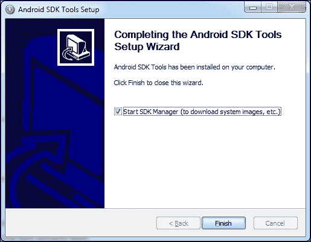
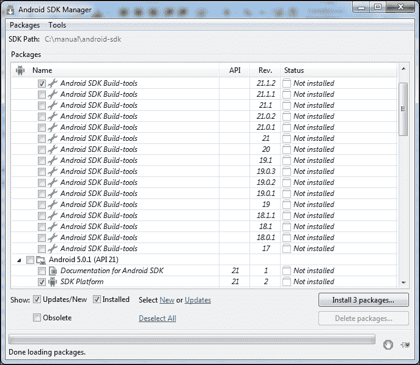
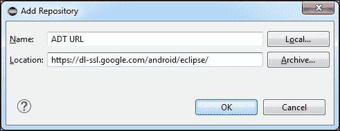
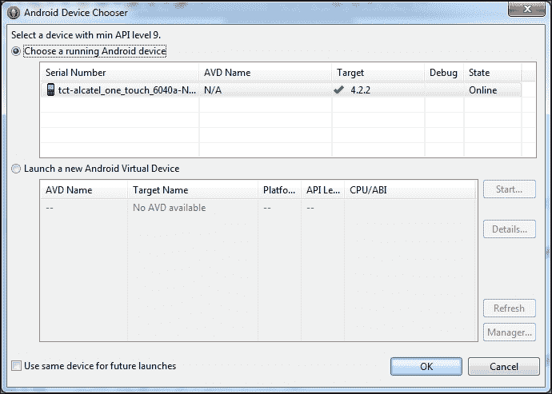

# 第一章：设置你的开发环境

在本章中，我们将解释如何下载并设置所有需要的工具，以便开始为 Android 平台构建游戏的环境。尽管 Mac OS 和 Windows 开发环境之间有很大的相似性，但我们将涵盖这两个操作系统安装的所有细节。

本章节将涵盖以下主题：

+   Cocos2d-x 概述

+   安装 Java

+   安装 Android SDK

+   安装 Android 原生开发工具包（NDK）

+   安装 Apache Ant

+   安装 Python

+   安装 Cocos2d-x

+   安装 Eclipse IDE

+   模板代码演练

# Cocos2d-x 概述

Cocos2d-x 是流行的 iOS 游戏框架 Cocos2d 的 C++跨平台移植版本。它最初于 2010 年 11 月发布，并在 2011 年被北京一家移动游戏公司触控科技收购。尽管如此，它仍然由一个超过 40 万开发者的活跃社区维护，包括原始 Cocos2d iPhone 引擎的创造者 Ricardo Quesada。

这个框架封装了所有游戏细节，如声音、音乐、物理、用户输入、精灵、场景和过渡等，因此开发者只需关注游戏逻辑，而无需重新发明轮子。

# 安装 Java

Android 平台技术栈基于 Java 技术；因此，首先要下载的是 Java 开发工具包（JDK）。尽管在撰写本书时 Java JDK 8 是最新版本，但它并不被所有 Android 版本官方支持，因此我们将下载 JDK 6，所有由 Cocos2d-x 生成的模板 Java 代码都可以用这个版本成功编译。

### 注意

Java 运行环境（JRE）对于构建 Android 应用程序来说是不够的，因为它只包含了运行 Java 应用程序所需的文件，但它不包括构建 Java 应用程序所需的工具。

你可以从 Oracle 的[`www.oracle.com/technetwork/java/javase/downloads/java-archive-downloads-javase6-419409.html`](http://www.oracle.com/technetwork/java/javase/downloads/java-archive-downloads-javase6-419409.html)下载 JDK 6，无论你的开发环境是什么。

如果你的当前环境是 Windows，那么在安装 JDK 之后，你需要将二进制文件所在路径添加到 PATH 环境变量中。这个路径看起来像这样：`C:\Program Files\Java\jdk1.6.0_45\bin`。

打开一个新的系统控制台，输入 `javac –version`，如果显示了 Java 编译器的版本号，那么你已经成功在你的系统中安装了 JDK。

### 注意

JDK 7 是用于构建针对 Android 5.0 及以上版本应用程序所需的。如果你针对的是最新 Android 版本，应该下载这个版本。但是，如果你想你的游戏兼容低于 4.4 的 Android 版本，那么你应该选择 JDK 6。

# 安装 Android SDK

Android SDK 包含构建 Android 应用所需的所有命令行工具。它有适用于 Windows、Mac 和 GNU/Linux 操作系统的版本。

Android Studio 现在是唯一官方支持的 IDE；尽管如此，Cocos2d-x 3.4 只提供对 Eclipse 的即开即用支持，Eclipse 是之前的官方 Android 开发 IDE。它不再可供下载，因为它已经不再积极开发，但你可以手动下载 Eclipse 并按照以下步骤安装 **Android Development Tools** (**ADT**)。

## 下载 Android SDK

你可以从链接 [`developer.android.com/sdk`](http://developer.android.com/sdk) 下载 Android SDK。在页面底部，在 **Other Download Options** 下，你会找到下载 SDK 工具的选项。选择与你的操作系统相匹配的版本。

在撰写本书时，SDK 的最新版本是 24.0.2。

运行 Android SDK 安装程序并在你的计算机上安装 Android SDK。

安装完 Android SDK 后，它还不能立即用来构建 Android 应用。因此，在安装向导的最后一屏，勾选 **Start SDK Manager** 的复选框，以便你可以下载构建游戏所需的组件，如下面的截图所示：



当 Android SDK 管理器启动后，从 `Tools` 文件夹中选择 **Android SDK Platform-tools** 和 **Android SDK Build-tools**。然后选择你所需 API 级别中的 **SDK Platform**，如下面的截图所示：



## 下载 Eclipse

从 [`www.eclipse.org/downloads`](http://www.eclipse.org/downloads) 下载 Eclipse IDE for Java Developers 的最新版本。它会推荐与你的当前操作系统兼容的下载版本，选择最适合你的操作系统平台的版本，可以是 32 位或 64 位。

在撰写本书时，Eclipse Luna (4.4.1) 是最新版本。

## 设置 Eclipse ADT 插件

打开 Eclipse，导航到 **Help** | **Install new Software** 并添加 Eclipse ADT 下载位置，即 `https://dl-ssl.google.com/android/eclipse/`，如下面的截图所示：



点击 **OK**，然后勾选 **Developer Tools** 复选框，点击 **Next** 以完成 ADT 安装向导。

# 设置 Android 原生开发工具包

我们已经下载了允许你使用 Java 技术创建 Android 应用的 Android SDK；尽管如此，Cocos2d-x 框架是用 C++ 编写的，因此你需要 Android 原生开发工具包（NDK）以便为 Android 平台构建 C++ 代码。

### 注意

Android 的官方文档明确指出，你应该在特定情况下使用这个本地工具包，但不要仅仅因为熟悉 C++ 语言或希望应用程序运行更快而使用它。制造商提出这个建议是因为 Android 核心 API 只对 Java 语言可用。

下载最新的 NDK 版本。在本书编写时，最新的版本是 10d。这个版本的 NDK 将允许你为所有 Android 平台构建，包括最新的。

你可以从以下链接下载适用于所有平台的最新版本 Android NDK：

[`developer.android.com/tools/sdk/ndk`](https://developer.android.com/tools/sdk/ndk)

下载后，运行可执行文件。它将在当前路径解压 Android NDK 目录；你需要记住这个路径，因为你稍后需要用到。

# 设置 Apache Ant

Apache Ant 是一个广泛用于自动化 Java 项目构建过程的构建管理工具。从 Cocos2d-x 3.0 开始引入，用于为 Android 平台构建框架。它简化了 Android 的构建过程，并增强了跨平台构建。在 Cocos2d-x 2.x 时代，在 Windows 操作系统内构建 Android 应用需要通过使用 Cygwin 模拟 UNIX 环境。这需要一些小的修改才能成功构建代码，其中许多修改在官方 Cocos2d-x 网站上仍然没有记录。

这个工具可以从以下链接下载：[`www.apache.org/dist/ant/binaries/`](https://www.apache.org/dist/ant/binaries/)

在编写本书时，最新的版本是 1.9.4。这个工具是一个跨平台工具，所以一个下载文件可以在任何支持 Java 技术的操作系统上工作。

为了安装这个工具，只需解压文件。记住这个路径，因为你在 Cocos2d-x 设置过程中需要用到。

# 设置 Python

所有 Cocos2d-x 配置文件都是用 Python 编写的。如果你使用的是 Mac OS 或任何 Linux 发行版，你的操作系统已经预装了 Python。因此，你可以跳过这一部分。

如果你使用的是 Windows 系统，你需要从以下链接下载 Python 2：[`www.python.org/ftp/python/2.7.8/python-2.7.8.msi`](https://www.python.org/ftp/python/2.7.8/python-2.7.8.msi)。

请考虑 Python 和 Cocos2d-x 同时支持版本 2 和版本 3。Cocos2d-x 只支持 Python 2。在编写本书时，2.x 分支的最新版本是 2.7.8。

安装程序设置完成后，你应该手动将 Python 安装路径添加到 PATH 环境变量中。默认的安装路径是`C:\Python27`。

打开一个新的系统控制台并输入`python`，如果出现如下截图所示的 Python 控制台，那么意味着 Python 已经正确安装：


### 注意

在 Windows 上设置环境变量，点击**开始**按钮并输入：`编辑系统环境`变量，点击它然后点击**环境变量**按钮，接着将显示环境变量配置对话框。

# 设置 Cocos2d-x

既然你已经拥有了构建 Android 平台上的第一款 Cocos2d-x 游戏所需的所有前提条件，你将需要下载 Cocos2d-x 3.4 框架，并按照以下步骤进行设置：

1.  你可以从[`www.cocos2d-x.org/download`](http://www.cocos2d-x.org/download)下载源代码。请注意，此页面还提供了下载 Cocos2d-x 分支 2 的链接，本书不涉及此分支，而且制造商已正式宣布新特性仅在分支 3 中提供。

1.  下载压缩的 Cocos2d-x 源代码后，将其解压到你想要的位置。

1.  为了配置 Cocos2d-x，打开你的系统终端，定位到你解压它的路径，并输入`setup.py`。这将需要你指定`ANDROID_NDK_PATH`，在这里你需要指定之前在前面章节解压的 NDK 的根目录。其次，它将需要你指定`ANDROID_SDK_ROOT`，这里你需要指定在安装过程中你选择安装 Android SDK 的目录路径。然后，它将需要你设置`ANT_ROOT`，在这里你需要指定 ant 安装的根目录。最后，关闭终端，并打开一个新的终端，以便更改生效。

## 创建你的第一个项目

现在，Cocos2d-x 已经设置好了，可以开始创建你的第一个项目了。你可以通过输入以下命令来完成：

```java
 cocos new MyGame -p com.your_company.mygame -l cpp -d NEW_PROJECTS_DIR

```

此脚本为你创建了一个 Android 模板代码，你的游戏将运行在所有包含 Android API 9 或更高版本的 Android 设备上，即 Android 2.3（姜饼）及更高版本。

需要注意的是，包名应该恰好包含两个点，如示例所示，如果少于或多于两个点，项目创建脚本将无法工作。`–l cpp`参数意味着新项目将使用 C++作为编程语言，这是本书唯一涵盖的语言。

与 2.x 分支相反，Cocos2d-x 3.x 允许你在框架目录结构之外创建你的项目。因此，你可以在任何位置创建你的项目，而不仅仅是像之前版本那样在`projects`目录内。

这将需要一些时间，因为它会将所有框架文件复制到你的新项目路径中。完成后，将你的 Android 设备连接到电脑上，然后你可以在新项目路径中通过输入以下命令轻松运行模板`HelloWorld`代码：

```java
cocos run -p android

```

或者，无论你当前在终端的路径如何，都可以运行以下命令：

```java
cocos run -p android /path/to/project

```

### 注意

要为 Windows 构建和运行 Cocos2d-x 3.4，您需要 Microsoft Visual Studio 2012 或 2013。

现在，您应该能够看到 Cocos2d-x 的标志和显示**Hello World**的文字，如下面的图片所示：


## 设置 Eclipse IDE

Cocos2d-x 3 分支显著改进了安卓构建过程。

在 2 分支中，需要在 IDE 中手动配置许多环境变量，导入许多核心项目，并处理依赖关系。即使完成所有步骤后，Cygwin Windows UNIX 端口与 Eclipse 的集成也从未完善，因此需要一些小的修改。

在 Eclipse 中构建 Cocos2d-x 3.4 就像导入项目并点击**运行**按钮一样简单。为了实现这一点，在 ADT 中，转到**文件** | **导入** | **通用** | **将现有项目导入工作空间**，选择 Cocos2d-x 在上一个部分创建新项目的路径。然后点击**完成**。

### 提示

Cocos2d-x 安卓模板项目是使用 API 级别 10 作为目标平台创建的。如果您系统上没有安装这个版本，您应该通过从包浏览器中右键点击项目，点击**属性**，并从**项目构建目标**框中选择您喜欢的已安装的安卓 API 版本来进行更改。

现在，在包浏览器中右键点击项目名称，点击**作为运行**，最后点击**安卓应用程序**。将会显示以下弹出窗口，要求您指定要启动 Cocos2d-x 游戏的安卓设备：



选择您的安卓设备后，您将看到我们在前一部分运行**运行**命令时所显示的 HelloWorld 游戏场景。

# 模板代码演练

在这一部分，我们将解释由项目创建脚本在上一个部分生成的 Cocos2d-x 模板代码的主要部分。

## Java 类

我们的项目中现在有一个名为`AppActivity`的 Java 类，它没有成员并从核心库中的`Cocos2dxActivity`类继承。我们还可以看到项目中引用了核心库中的 22 个 Java 类。这段代码旨在使我们的 C++代码工作，我们完全不需要修改它。

## 安卓应用程序配置

生成的`AndroidManifest.xml`是 Android 配置文件，它需要`android.permission.INTERNET`权限，该权限允许你的 Android 应用程序使用设备上的互联网连接；然而，由于我们的简单游戏代码没有互联网交互，所以并不需要这个权限。因此，如果你愿意，可以删除`AndroidManifest.xml`文件中的这一行。你的游戏默认会以横屏显示，但如果你希望创建一个在竖屏模式下运行的游戏，那么你应该将`android:screenOrientation`的值从`landscape`更改为`portrait`。

为了更改 Android 应用程序名称，你可以修改位于`strings.xml`文件中的`app_name`值；这将影响启动器图标上的文字和 Android 系统内的应用程序标识符。

当你创建自己的游戏时，你将不得不创建自己的类，这些类通常会比脚本创建的两个类多。每次你创建一个新类时，都需要将其名称添加到新项目目录结构中`jni`文件夹内的`Android.mk`制作文件的`LOCAL_SRC_FILES`属性中。这样，当你的`cpp`代码由 C++ 构建工具构建时，它会知道应该编译哪些文件。

## C++ 类

已经创建了两个 C++ 类：`AppDelegate`和`HelloWorldScene`。第一个负责启动 Cocos2d-x 框架并将控制权传递给开发者。框架加载过程发生在这个类中。如果 Cocos2d-x 核心框架在目标设备上成功启动，它将运行`applicationDidFinishLaunching`方法，这是要运行的首个游戏特定功能。

代码非常直观，并且有详细的文档，以便你可以轻松理解其逻辑。我们对代码的第一次小改动将是隐藏默认显示在示例游戏中的调试信息。你可以猜测，为了实现这一点，你只需为`director`单例实例中的`setDisplayStats`方法调用发送`false`作为参数，如下面的代码清单所示：

```java
bool AppDelegate::applicationDidFinishLaunching() {
    // initialize director
    auto director = Director::getInstance();
    auto glview = director->getOpenGLView();
    if(!glview) {
        glview = GLViewImpl::create("My Game");
        director->setOpenGLView(glview);
    }
    // turn on display FPS
    director->setDisplayStats(false);
    // set FPS. the default value is 1.0/60 if you don't call this
    director->setAnimationInterval(1.0 / 60);
    // create a scene. it's an autorelease object
    auto scene = HelloWorld::createScene();
    // run
    director->runWithScene(scene);
    return true;
}
```

### 提示

**下载示例代码**

你可以从你在[`www.packtpub.com`](http://www.packtpub.com)的账户中下载你所购买的所有 Packt 图书的示例代码文件。如果你在其他地方购买了这本书，可以访问[`www.packtpub.com/support`](http://www.packtpub.com/support)注册，我们会直接将文件通过电子邮件发送给你。

## 场景

在本书后续章节中，我们将介绍 Cocos2d-x 如何处理场景概念，就像电影一样；电影由场景组成，Cocos2d-x 游戏也是如此。我们可以将加载、主菜单、世界选择、游戏关卡、结束字幕等不同的屏幕可视化为不同的场景。每个场景都有一个定义其行为的类。模板代码只有一个名为`HelloWorld`的场景，该场景在`AppDelegate`类内部初始化并启动。正如我们在之前的代码中所见，场景流程由游戏导演管理。`Director`类拥有驱动游戏的所有基本特性，就像电影中的导演一样。有一个导演类的单一共享实例在整个应用程序范围内被使用。

`HelloWorldScene`包含了代表我们运行 HelloWorld 应用程序时出现的所有可见区域的层，即，hello world 标签，Cocos2d-x 标志和显示退出选项的菜单。

在`init`方法中，我们实例化视觉元素，并使用从`Node`核心类继承的`addChild`方法将其添加到场景中。

# 总结

在本章中，我们介绍了 Cocos2d-x 3.4 游戏框架，并解释了如何下载和安装它。我们还解释了所有它的先决条件。我们配置了工作环境，将我们的第一个 Android 应用程序部署到实际设备上，并通过脚本生成的模板代码快速概览了其主要方面。

在下一章中，我们将介绍如何创建和操作所有的游戏图形，例如主角、敌人、障碍物、背景等。
