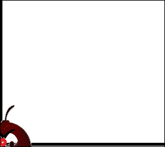
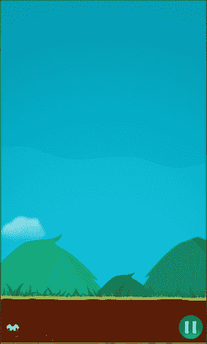

# 第二章：图形

在本章中，我们将介绍如何创建和处理所有游戏图形。我们将创建场景，使用游戏导演处理这些场景之间的过渡，创建精灵，将它们定位到所需的位置，使用动作移动它们，以及使用动画为角色赋予生命。

本章将涵盖以下主题：

+   创建场景

+   理解节点

+   理解精灵

+   理解动作

+   动画精灵

+   添加游戏菜单

+   处理多种屏幕分辨率

# 创建场景

场景概念在 Cocos2d-x 游戏引擎中非常重要，因为游戏中所有显示的屏幕都被视为场景。如果将 Cocos2d-x 与 Android 原生 Java 开发进行类比，我们可以说 Cocos2d-x 的场景相当于 Android 所称的活动。

在上一章中，我们介绍了`AppDelegate`类，并解释了它有责任在设备上加载框架，然后执行游戏特定的代码。这个类包含了`ApplicationDidFinishLaunching`方法，这是我们代码的入口点。在这个方法中，我们实例化了将在游戏中首次显示的场景，然后请求`director`加载它，如下面的代码清单所示：

```java
bool AppDelegate::applicationDidFinishLaunching() {
    auto director = Director::getInstance();
  // OpenGL initialization done by cocos project creation script
    auto glview = director->getOpenGLView();
    auto scene = HelloWorld::createScene();
    director->runWithScene(scene);
    return true;
}
```

### 注意

所有 C++代码都在一个单一的 Android 活动中运行；尽管如此，我们仍然可以向游戏中添加原生活动。

## 理解图层

场景本身不是一个对象容器，因此它应该至少包含一个`Layer`类的实例，这样我们才能向其中添加对象。这个图层创建过程在框架宏`CREATE_FUNC`中被封装。你只需调用宏并将类名作为参数传递，它就会生成图层创建代码。

在框架的前一个版本中，图层操作与事件处理有关多种用途；然而，在 3.0 版本中，事件分发引擎被完全重写。Cocos2d-x 3.4 中仍然存在图层概念的唯一原因是兼容性。框架创建者官方宣布，他们可能会在后续版本中移除图层概念。

## 使用导演

场景由 Cocos2d-x 导演控制，这是一个处理游戏流程的类。它应用了单例设计模式，确保类只有一个实例。它通过场景堆栈控制应该呈现的场景类型，类似于 Android 处理场景的方式。

这意味着最后一个推送到堆栈的场景是即将呈现给用户的那一个。当场景被移除时，用户将能够看到之前可见的场景。

当我们在单个函数中使用单一导演实例不止一次时，我们可以将它的引用存储在局部变量中，如下所示：

```java
auto director = Director::getInstance();
```

我们也可以将其存储在类属性中，以便在类的各个部分都可以访问。这样做可以让我们少写一些代码，同时也代表了性能的提升，因为我们每次想要访问单例实例时，不需要多次调用`getInstance`静态方法。

Director 实例还可以为我们提供有用的信息，比如屏幕尺寸和调试信息，在我们的 Cocos 项目中默认是启用的。

# 暂停游戏

让我们开始创建我们的游戏。我们要添加的第一个功能是暂停和恢复游戏的功能。让我们开始构建——首先设置当我们暂停游戏时将显示的屏幕。

我们将通过向场景堆栈中添加一个新的暂停场景来实现这一点。当这个屏幕从堆栈中移除时，HelloWorld 场景将显示出来，因为它是在暂停场景推入场景堆栈之前显示的屏幕。以下代码清单展示了我们如何轻松地暂停游戏：

## 组织我们的资源文件

当我们创建 Cocos2d-x 项目时，一些资源，比如图片和字体，默认被添加到我们项目的`Resources`文件夹中。我们将组织它们，以便更容易处理。为此，我们将在`Resources`目录中创建一个`Image`文件夹。在这个新文件夹中，我们将放置所有的图片。在本章稍后，我们将解释如何根据 Android 设备屏幕分辨率来组织每个图片的不同版本。

在本章附带资源中，我们为你提供了构建本章代码所需的图片。

## 创建我们的暂停场景头文件

首先，让我们创建我们的暂停场景头文件。我们是参考`HelloWorld.h`头文件创建它的：

```java
#ifndef __Pause_SCENE_H__
#define __Pause_SCENE_H__

#include "cocos2d.h"

class Pause : public cocos2d::Layer
{
public:
    static cocos2d::Scene* createScene();
    virtual bool init();
  void exitPause(cocos2d::Ref* pSender);
    CREATE_FUNC(Pause);
private:
  cocos2d::Director *_director;
  cocos2d::Size _visibleSize;
};

#endif // __Pause_SCENE_H__
```

### 提示

你可以通过输入`using namespace cocos2d`来避免每次引用`cocos2d`命名空间中的 Cocos2d-x 类时输入`cocos2d`，然而，在头文件中使用它被认为是一个坏习惯，因为当包含的命名空间中有重复的字段名时，代码可能无法编译。

## 创建暂停场景实现文件

现在，让我们创建我们的暂停场景实现文件。类似于前一部分的做法，我们将基于项目创建脚本生成的`HelloWorld.cpp`文件来创建这个文件。

在以下代码中，你会发现 Cocos2d-x 模板项目中捆绑的菜单创建代码。我们将在本章的后续部分解释如何创建游戏菜单，你还将学习字体创建，这将在第五章《处理文本和字体》中详细解释。

```java
#include "PauseScene.h"

USING_NS_CC;

Scene* Pause::createScene()
{
    auto scene = Scene::create();
    auto layer = Pause::create();
    scene->addChild(layer);
    return scene;
}

bool Pause::init()
{
    if ( !Layer::init() )
    {
      return false;
    }
  _director = Director::getInstance();
  _visibleSize = _director->getVisibleSize();
  Vec2 origin = _director->getVisibleOrigin();
  auto pauseItem = MenuItemImage::create("play.png", "play_pressed.png", CC_CALLBACK_1(Pause::exitPause, this));
  pauseItem->setPosition(Vec2(origin.x + _visibleSize.width -pauseItem->getContentSize().width / 2, origin.y + pauseItem->getContentSize().height / 2));
  auto menu = Menu::create(pauseItem, nullptr);
  menu->setPosition(Vec2::ZERO);
  this->addChild(menu, 1);
  auto label = Label::createWithTTF("PAUSE", "fonts/Marker Felt.ttf", 96);
  label->setPosition(origin.x + _visibleSize.width/2, origin.y + _visibleSize.height /2);
  this->addChild(label, 1);
  return true;
}

void Pause::exitPause(cocos2d::Ref* pSender){
  /*Pop the pause scene from the Scene stack.
  This will remove current scene.*/
  Director::getInstance()->popScene();
}
```

在生成的`HelloWorldScene.h`场景中，我们现在在`menuCloseCallback`方法定义后添加以下代码行：

```java
void pauseCallback(cocos2d::Ref* pSender);
```

现在，让我们在`HelloWorldScene.cpp`实现文件中为`pauseCallBack`方法创建实现：

```java
void HelloWorld::pauseCallback(cocos2d::Ref* pSender){
  _director->pushScene(Pause::createScene());
}
```

最后，通过使`closeItem`调用`pauseCallBack`方法而不是`menuCloseCallBack`方法来修改其创建，这样这行代码将看起来像这样：

```java
    auto closeItem = MenuItemImage::create("pause.png", "pause_pressed.png", CC_CALLBACK_1(HelloWorld::pauseCallback, this));
```

现在，我们已经创建了一个简单的暂停场景，当按下关闭按钮时，它会被推送到场景堆栈中，当从暂停场景中按下蓝色按钮时，它会被关闭。

现在，我们将`PauseScene.cpp`文件添加到 eclipse 项目中`jni`文件夹下的名为`Android.mk`的 Android makefile 中，位于`LOCAL_SRC_FILES`部分的`HelloWorldScene.cpp`上方。

### 过渡

导演还负责在切换场景时播放过渡效果，Cocos2d-x 3.4 目前提供超过 35 种不同的场景过渡效果，例如渐变、翻转、翻页、分裂和缩放等。

Transition 是`Scene`类的子类，这意味着你可以将过渡实例传递给任何接收场景对象的方法，如`director`类的`runWithScene`、`replaceScene`或`pushScene`方法。

当从游戏场景切换到暂停场景时，让我们使用一个简单的过渡效果。我们只需通过创建`TransitionFlipX`类的新实例并将其传递给导演的`pushScene`方法来实现这一点：

```java
void HelloWorld::pauseCallback(cocos2d::Ref* pSender){
  _director->pushScene(TransitionFlipX::create(1.0, Pause::createScene()));
}
```

# 理解节点

Node 表示屏幕上所有的可见对象，实际上它是所有场景元素的超类，包括场景本身。它是基础框架类，具有处理图形特性的基本方法，如位置和深度。

# 理解精灵

在我们的游戏中，精灵代表我们场景的图像，就像背景、敌人和我们的玩家。

在第四章《用户输入》中，我们将向场景添加事件监听器，使其能够与用户交互。

## 创建精灵

Cocos2d-x 的核心类实例化非常简单。我们已经看到`scene`类有一个`create`方法；同样，`sprite`类也有一个同名静态方法，如下面的代码片段所示：

```java
auto sprBomb = Sprite::create("bomb.png");
```

Cocos2d-x 目前支持 PNG、JPG 和 TIF 图像格式的精灵；然而，我们强烈建议使用 PNG 图像，因为它具有透明度能力，而 JPG 或 TIF 格式没有，同时也因为这种格式在合理的文件大小下提供的图像质量。这就是为什么你会看到所有 Cocos2d-x 生成的模板和示例都使用这种图像格式。

## 定位精灵

创建我们自己的精灵后，我们可以通过使用`setPosition`方法轻松地在屏幕上定位它，但在这样做之前，我们将解释锚点的概念。

### 设置锚点

所有精灵都有一个称为**锚点**的参考点。当我们使用`setPosition`方法定位一个精灵时，框架实际所做的是将指定的二维位置设置到锚点，从而影响整个图像。默认情况下，锚点被设置为精灵的中心，正如我们在以下图片中看到的：


### 理解 Cocos2d-x 坐标系统

与大多数计算机图形引擎不同，Cocos2d-x 的坐标系统在屏幕左下角有原点(0,0)，正如我们在以下图片中看到的：


因此，如果我们想将精灵定位在原点(0,0)，我们可以通过调用精灵类中的`setPosition`方法来实现。它是重载的，所以它可以接收两个表示 x 和 y 位置的浮点数，一个`Point`类实例，或者一个`Vec2`实例。尽管生成的代码中使用`Vec2`实例，但官方 Cocos2d-x 文档指出，传递浮点数最多可以快 10 倍。

```java
sprBomb -> setPosition(0,0);
```

执行此代码后，我们可以看到只有精灵的右上区域可见，这仅占其大小的 25%，正如我们在以下图片中所示：



如果你希望精灵显示在原点，有多种方法可以选择，比如将精灵定位在对应精灵高度一半和宽度一半的点，这可以通过使用精灵方法`getContentSize`来确定，它返回一个包含精灵高度和宽度属性的大小对象。另一个可能更简单的方法是将精灵的锚点重置为(0,0)，这样当精灵在屏幕原点定位时，它完全可见并且位于屏幕左下角区域。《setAnchorPoint》方法接收一个`Vec2`实例作为参数。在以下代码清单中，我们传递了一个指向原点(0,0)的`Vec2`实例：

```java
sprBomb -> setAnchorPoint(Vec2(0,0));
sprBomb -> setPosition(0,0);
```

### 注意

`Vec2`类有一个不接受参数的构造函数，它会创建一个初始值为 0,0 的`Vec2`对象。

当我们执行代码时，得到以下结果：


### 提示

默认锚点位于精灵中心的原因是，这样更容易将其定位在屏幕中心。

### 将精灵添加到场景中

在创建并定位了我们的精灵对象之后，我们需要使用`addChild`方法将其添加到场景中，该方法包含两个参数：要添加到场景中的节点的指针和一个表示其在*z*轴位置的整数。*z*值最高的节点将显示在那些值较低的节点之上：

```java
  this->addChild(sprBomb,1);
```

现在让我们向`HelloWorld`场景添加背景图像：我们将在`init`方法中将炸弹定位在屏幕左下区域时所用的相同步骤来完成它：

```java
  auto bg = Sprite::create("background.png");
  bg->setAnchorPoint(Vec2());
  bg->setPosition(0,0);
  this->addChild(bg, -1);
```

我们已经在*z*位置为-1 的地方添加了背景，因此任何位置为 0 或更高的节点都将显示在背景之上，如下面的图片所示：



### 在可见区域外定位精灵

现在我们有一个位于屏幕底部的炸弹，它不会移动。我们现在将其定位在屏幕顶部中心区域，位于可见区域之外，这样当我们让这个精灵移动时，它看起来就像是下炸弹雨。

正如我们之前提到的，让我们将炸弹定位在可见区域内，然后在下一节中我们将使用动作功能使其向地面移动：

```java
sprBomb->setPosition(_visibleSize.width / 2, _visibleSize.height + sprBomb->getContentSize().height/2);
```

我们移除了`setAnchorPoint`语句；现在，炸弹拥有默认的锚点，并且我们修改了`setPosition`语句，现在将其正好定位在可见区域内。

### 定位玩家精灵

现在让我们创建并定位我们的玩家精灵。

```java
auto player = Sprite::create("player.png");
player->setPosition(_visibleSize.width / 2, _visibleSize.height* 0.23);
this->addChild(player, 0);
```

在之前的代码中，我们创建了一个玩家精灵。我们使用了默认的锚点，它直接指向图像的中心，并通过将其定位在屏幕宽度的一半和屏幕高度的 23%，使其水平居中，因为本章提供的背景图像是在这些比例下绘制的。我们以 z 值为 0 添加它，这意味着它将被显示在背景中。

现在让我们来处理炸弹，将其放置在可见区域内，然后在下一节中，我们将使用动作功能使其向地面移动：

```java
sprBomb->setPosition(_visibleSize.width / 2, _visibleSize.height + sprBomb->getContentSize().height/2);
```

我们移除了`setAnchorPoint`语句；现在，炸弹拥有默认的锚点，并且我们修改了`setPosition`语句，现在将其放置在可见区域内。

在本章中，我们使用了许多图像，正如我们之前提到的，这些图像存储在我们的 Cocos2d-x 项目的`Resources`文件夹中。你可以创建子文件夹来组织你的文件。

# 理解动作

我们可以轻松地让精灵执行具体的动作，如跳跃、移动、倾斜等。只需要几行代码就能让我们的精灵执行所需的动作。

## 移动精灵

我们可以通过创建一个`MoveTo`动作，使精灵移动到屏幕的特定区域，然后让精灵执行该动作。

在下面的代码清单中，我们通过简单地编写以下代码行，使炸弹掉落到屏幕底部：

```java
  auto moveTo = MoveTo::create(2, Vec2(sprBomb->getPositionX(), 0 - sprBomb->getContentSize().height/2));
  sprBomb->runAction(moveTo);
```

我们创建了一个`moveTo`节点，它将把炸弹精灵移动到当前的横向位置，同时也会把它移动到屏幕底部直到不可见。为了实现这一点，我们让它移动到精灵高度负一半的 y 位置。由于锚点被设置为精灵的中心点，将其移动到其高度的负一半就足以让它移动到屏幕可见区域之外。

如你所见，它与我们的玩家精灵相撞，但炸弹只是继续向下移动，因为它仍然没有检测到碰撞。在下一章中，我们将为游戏添加碰撞处理。

### 注意

Cocos2d-x 3.4 拥有自己的物理引擎，其中包括一个易于检测精灵之间碰撞的机制。

如果我们想将精灵移动到相对于其当前位置的位置，我们可以使用`MoveBy`类，它接收我们想要精灵在水平和垂直方向上移动多少的参数：

```java
  auto moveBy = MoveBy::create(2, Vec2(0, 250));
  sprBomb->runAction(moveBy);
```

### 注意

你可以使用`reverse`方法使精灵向相反方向移动。

## 创建序列

有时我们有一个预定义的动作序列，我们希望在代码的多个部分执行它，这可以通过序列来处理。顾名思义，它由一系列按预定义顺序执行的动作组成，如有必要可以反向执行。

在使用动作时经常使用序列，因此在序列中我们添加了`moveTo`节点，然后是一个函数调用，该调用在移动完成后执行一个方法，这样它将允许我们从内存中删除精灵，重新定位它，或者在视频游戏中执行任何其他常见任务。

在以下代码中，我们创建了一个序列，首先要求炸弹移动到地面，然后请求执行`moveFinished`方法：

```java
  //actions
  auto moveFinished = CallFuncN::create(CC_CALLBACK_1(HelloWorld::moveFinished, this));
  auto moveTo = MoveTo::create(2, Vec2(sprBomb->getPositionX(), 0 - sprBomb->getContentSize().height/2));
  auto sequence = Sequence::create(moveTo, moveFinished, nullptr);
  sprBomb->runAction(sequence);
```

请注意，在序列的末尾我们传递了一个`nullptr`参数，所以当 Cocos2d-x 看到这个值时，它会停止执行序列中的项目；如果你不指定它，这可能会导致你的游戏崩溃。

### 注意

自从 3.0 版本以来，Cocos2d-x 建议使用`nullptr`关键字来引用空指针，而不是使用传统的 NULL 宏，后者仍然有效，但不是在 C++中认为的最佳实践。

# 制作精灵动画

为了使我们的游戏看起来更加专业，我们可以使精灵具有动画效果，这样就不会一直显示静态图像，而是显示动画角色、敌人和障碍物。Cocos2d-x 提供了一种简单机制，可以将这类动画添加到我们的精灵中，如下面的代码清单所示：

```java
//Animations
Vector<SpriteFrame*> frames;
Size playerSize = sprPlayer->getContentSize();
frames.pushBack(SpriteFrame::create("player.png", Rect(0, 0, playerSize.width, playerSize.height)));
frames.pushBack(SpriteFrame::create("player2.png", Rect(0, 0, playerSize.width, playerSize.height)));
auto animation = Animation::createWithSpriteFrames(frames,0.2f);
auto animate = Animate::create(animation);
sprPlayer->runAction(RepeatForever::create(animate));
```

## 使用精灵表提高性能

尽管我们可以基于位于多个文件中的图像创建精灵动画，就像我们在之前的代码中所做的那样，但加载大量文件将非常低效。这就是为什么我们更愿意加载包含多个图像的单个文件。为了实现这一点，一个带有`plist`扩展名的纯文本文件指出了文件中每个图像的确切位置，Cocos2d-x 能够读取这个纯文本文件，并从一个单一的精灵表文件中提取所有图像。有许多工具可以让你创建自己的精灵表，最受欢迎的是纹理打包器，你可以从[`www.codeandweb.com/texturepacker`](https://www.codeandweb.com/texturepacker)下载并在 Windows 或 Mac OS 上免费试用。

在本章中，我们包含的资源有：一个名为`bunny.plist`的`plist`文件和用纹理打包器创建的`bunny_ss.png`精灵表。你可以使用以下代码加载此表的任何帧：

```java
SpriteFrameCache* cache = SpriteFrameCache::getInstance();
cache->addSpriteFramesWithFile("bunny.plist");
auto sprBunny = Sprite::createWithSpriteFrameName("player3.png");
sprBunny -> setAnchorPoint(Vec2());
```

# 游戏菜单

在我们游戏的一部分中拥有菜单是很常见的，比如主屏幕和配置屏幕。这个框架为我们提供了一种简单的方法将菜单添加到游戏中。

下面的代码清单显示了菜单创建过程：

```java
auto closeItem = MenuItemImage::create("pause.png", "CloseSelected.png", CC_CALLBACK_1(HelloWorld::pause_pressed, this));
closeItem->setPosition(Vec2(_visibleSize.width – closeItem->getContentSize().width/2 , closeItem-> getContentSize().height/2));
auto menu = Menu::create(closeItem, nullptr);
menu->setPosition(Vec2::ZERO);
this->addChild(menu, 1);
```

从前面的列表中我们可以看到，我们首先通过实例化`MenuItemImage`类并传递三个参数给`create`方法来创建一个菜单项：第一个参数表示菜单项应该显示的图像，第二个是选中图像时应该显示的图像，第三个参数指定当选择菜单项时应调用的方法。

### 注意

Cocos2d-x 分支 3 现在允许程序员使用 lambda 表达式来处理菜单项。

## 处理多屏幕分辨率

在创建游戏时，你需要决定打算支持哪些屏幕分辨率，然后创建所有图像的大小，使其在高分辨率屏幕上不会显得像素化，在低性能设备上加载时也不会影响性能。所有这些版本的图像应该有相同的名称，但它们应该存储在`Resources`文件夹中的不同目录里。

在这个例子中，我们有三个目录：第一个包含高分辨率的图像，第二个包含中等分辨率的图像，第三个包含低分辨率的图像。

在准备好适合所有分辨率需求的所有图像大小之后，我们必须编写根据设备屏幕分辨率选择正确图像集的代码。正如我们之前提到的，`AppDelegate`类包含`applicationDidFinishLaunching`，该函数在 Cocos2d-x 框架在设备上加载后立即启动。在这个方法中，我们将编写多屏幕分辨率的代码，如下面的代码清单所示：

```java
bool AppDelegate::applicationDidFinishLaunching() {
  auto director = Director::getInstance();
  // OpenGL initialization done by cocos project creation script
  auto glview = director->getOpenGLView();
  Size screenSize = glview->getFrameSize();
  Size designSize = CCSizeMake(768, 1280);
  std::vector<std::string> searchPaths;

if (screenSize.height > 800){
  //High Resolution
  searchPaths.push_back("images/high");
  director->setContentScaleFactor(1280.0f / designSize.height);
}
else if (screenSize.height > 600){
  //Mid resolution
  searchPaths.push_back("images/mid");
  director->setContentScaleFactor(800.0f / designSize.height);
}
else{
  //Low resolution
  searchPaths.push_back("images/low");
  director->setContentScaleFactor(320.0f / designSize.height);
}
  FileUtils::getInstance()->setSearchPaths(searchPaths);
  glview->setDesignResolutionSize(designSize.width, designSize.height, ResolutionPolicy::NO_BORDER );
  auto scene = HelloWorld::createScene();
  director->runWithScene(scene);
  return true;
}
```

通过将`AndroidManifest.xml`文件中的`android:screenOrientation`值设置为`portrait`来进行修改。

# 将所有内容整合到一起

这是`HelloWorldScene.cpp`实现文件的完整代码，我们在其中创建并定位了背景、动画玩家和移动的炸弹：

```java
#include "HelloWorldScene.h"
#include "PauseScene.h"

USING_NS_CC;

Scene* HelloWorld::createScene()
{
  // 'scene' is an autorelease object
  auto scene = Scene::create();

  // 'layer' is an autorelease object
  auto layer = HelloWorld::create();

  // add layer as a child to scene
  scene->addChild(layer);

  // return the scene
  return scene;
}
```

接下来在`init`函数中，我们将实例化和初始化我们的精灵：

```java
bool HelloWorld::init()
{
  if ( !Layer::init() )
  {
    return false;
  }
  _director = Director::getInstance();
  _visibleSize = _director->getVisibleSize();
  auto origin = _director->getVisibleOrigin();
  auto closeItem = MenuItemImage::create("pause.png", "pause_pressed.png", CC_CALLBACK_1(HelloWorld::pauseCallback, this));

  closeItem->setPosition(Vec2(_visibleSize.width - closeItem->getContentSize().width/2 ,
  closeItem->getContentSize().height/2));

  auto menu = Menu::create(closeItem, nullptr);
  menu->setPosition(Vec2::ZERO);
  this->addChild(menu, 1);
  auto sprBomb = Sprite::create("bomb.png");
  sprBomb->setPosition(_visibleSize.width / 2, _visibleSize.height + sprBomb->getContentSize().height/2);
  this->addChild(sprBomb,1);
  auto bg = Sprite::create("background.png");
  bg->setAnchorPoint(Vec2::Zero);
  bg->setPosition(0,0);
  this->addChild(bg, -1);
  auto sprPlayer = Sprite::create("player.png");
  sprPlayer->setPosition(_visibleSize.width / 2, _visibleSize.height * 0.23);
  this->addChild(sprPlayer, 0);
```

接下来，我们将使用以下代码添加动画：

```java
  Vector<SpriteFrame*> frames;
  Size playerSize = sprPlayer->getContentSize();
  frames.pushBack(SpriteFrame::create("player.png", Rect(0, 0, playerSize.width, playerSize.height)));
  frames.pushBack(SpriteFrame::create("player2.png", Rect(0, 0, playerSize.width, playerSize.height)));
  auto animation = Animation::createWithSpriteFrames(frames,0.2f);
  auto animate = Animate::create(animation);
  sprPlayer->runAction(RepeatForever::create(animate));
```

在这里，我们将创建一个序列，该序列将把炸弹从屏幕顶部移动到底部。移动完成后，我们将指定调用`moveFinished`方法。我们只是出于测试目的使用它来打印一条日志信息：

```java
  //actions
  auto moveFinished = CallFuncN::create(CC_CALLBACK_1(HelloWorld::moveFinished, this));
  auto moveTo = MoveTo::create(2, Vec2(sprBomb->getPositionX(), 0 - sprBomb->getContentSize().height/2));
  auto sequence = Sequence::create(moveTo, moveFinished, nullptr);
  sprBomb->runAction(sequence);
  return true;
}

void HelloWorld::moveFinished(Node* sender){
  CCLOG("Move finished");
}

void HelloWorld::pauseCallback(cocos2d::Ref* pSender){
  _director->pushScene(TransitionFlipX::create(1.0, Pause::createScene()));
}
```

下图展示了在本章中完成所有代码后，我们的游戏看起来是什么样子：


# 总结

在本章中，我们了解了如何创建游戏场景，以及如何向其中添加精灵和菜单。我们还学会了如何轻松地动画化精灵并在屏幕上移动它们。

在下一章中，我们将学习如何使用内置的物理引擎以更真实的方式移动我们的精灵；通过它，我们将轻松配置运动并为游戏添加碰撞检测。
