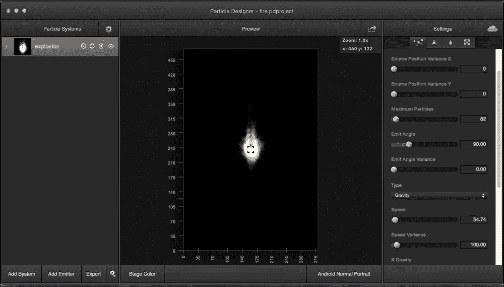
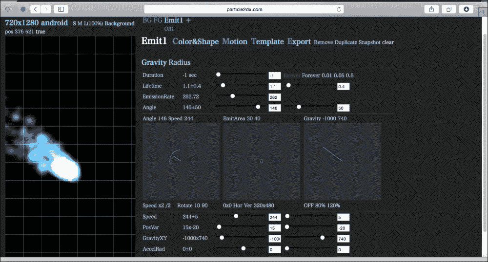
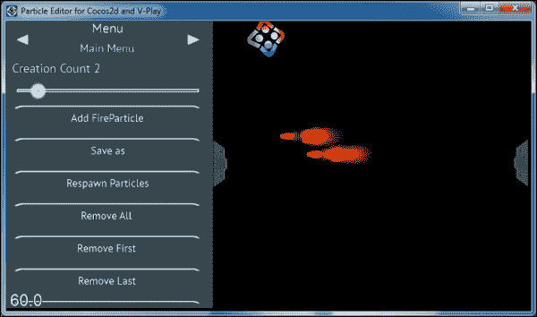
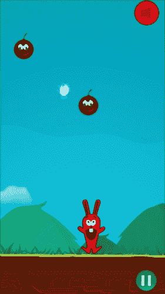

# 第七章. 创建粒子系统

通过使用 Cocos2d-x 框架内置的粒子系统，您可以轻松模拟火、烟、爆炸、雪和雨。本章将教您如何创建这里提到的效果，并教您如何自定义它们。

本章将涵盖以下主题：

+   创建 Cocos2d-x 对象的集合

+   将粒子系统添加到我们的游戏中

+   配置粒子系统

+   创建自定义粒子系统

# 创建 Cocos2d-x 对象的集合

我们将向游戏中添加一个粒子系统，以模拟每次玩家触摸炸弹时的爆炸效果。为了做到这一点，我们将使用 Cocos2d-x 框架中的`Vector`类来创建游戏中创建的所有炸弹对象的集合，这样当玩家触摸屏幕时，我们将遍历这个集合以验证玩家是否触摸到了任何炸弹。

如果玩家触摸到任何炸弹，我们将要：

+   在炸弹精灵所在位置显示爆炸效果

+   使炸弹不可见

+   使用继承的`removeChild`方法从屏幕上移除炸弹，最后

+   从集合中移除炸弹对象，这样下次我们遍历向量时，就会忽略它

为此，我们将炸弹集合按照以下方式添加到我们的`HelloWorldScene.h`定义文件中：

```java
cocos2d::Vector<cocos2d::Sprite*> _bombs;
```

请注意，我们指定要使用`cocos2d`命名空间中捆绑的`Vector`类，这样编译器可以清楚地知道我们是指向框架内置的集合类，而不是`std`命名空间中的`Vector`类。尽管可以使用`std`命名空间中的`Vector`类，但位于框架中的类是针对在 Cocos2d-x 对象集合中使用而优化的。

### 注意

Cocos2d-x 3.0 中引入的`Vector`类使用 C++标准来表示对象集合，与使用 Objective-C 容器类来建模 Cocos2d-x 对象集合的已弃用的`CCArray`类相对。这个新类处理 Cocos2d-x 中用于内存管理的引用计数机制，它还添加了`std::vector`中不存在的功能，如`random`、`contains`和`equals`方法。

只有在需要将实例作为参数传递给预期数据类型的 Cocos2d-x API 类函数时，才应使用`std::vector`实例，例如`FileUtils`类中的`setSearchPaths`方法。

现在，让我们转到位于`HelloWorldScene.cpp`实现文件中的`init`方法，在声明持有第一个炸弹精灵引用的`_sprBomb`变量旁边，我们将按照以下方式将此引用添加到我们的新`_bombs`集合中：

```java
_bombs.pushBack(_sprBomb);
```

现在，让我们回到在我们之前章节中创建的 `addBombs` 方法，以向我们的游戏中添加更多炸弹。在这个方法中，我们将把游戏中场景中生成的每个炸弹添加到 `_bombs` 集合中，如下所示：

```java
void HelloWorld::addBombs(float dt)
{
Sprite* bomb = nullptr;
for(int i = 0; i < 3; i++){
  bomb = Sprite::create("bomb.png");
  bomb->setPosition(CCRANDOM_0_1() * visibleSize.width, visibleSize.height + bomb->getContentSize().height/2);
  this->addChild(bomb,1);
  setPhysicsBody(bomb);
  bomb->getPhysicsBody()->setVelocity(Vect(0, ( (CCRANDOM_0_1() + 0.2f) * -250) ));
  _bombs.pushBack(bomb);
}
}
```

## 爆炸的炸弹

我们希望当我们触摸炸弹时它们能爆炸。为了实现这一点，我们将创建我们的 `explodeBombs` 方法。在 `HelloWorldScene.h` 头文件中，我们将按以下方式编写声明：

```java
bool explodeBombs(cocos2d::Touch* touch, cocos2d::Event* event);
```

现在，我们将在 `HelloWorldScene.cpp` 实现文件中编写方法体；如前所述，每次玩家触摸屏幕时，我们可以验证触摸的位置并与每个炸弹的位置进行比较。如果发现任何交集，那么被触摸的炸弹将会消失。目前，我们还不打算添加任何粒子系统，我们将在后面的章节中做这件事：

```java
bool HelloWorld::explodeBombs(cocos2d::Touch* touch, cocos2d::Event* event)
{
Vec2 touchLocation = touch->getLocation();
cocos2d::Vector<cocos2d::Sprite*> toErase;
for(auto bomb : _bombs){
  if(bomb->getBoundingBox().containsPoint(touchLocation)){
    bomb->setVisible(false);
    this->removeChild(bomb);
    toErase.pushBack(bomb);
  }
}

for(auto bomb : toErase){
  _bombs.eraseObject(bomb);
}
return true;
}
```

请注意，我们创建了一个另一个向量，用于添加所有被用户触摸的炸弹，然后在另一个循环中将它们从 `_bombs` 集合中移除。我们这样做而不是直接从第一个循环中移除对象的原因是，这将会导致运行时错误。这是因为我们不能在遍历集合的同时对单一集合进行并发修改，即我们不能在遍历集合时从中移除一个项目。如果我们这样做，那么我们将得到一个运行时错误。

### 注意

`Vector` 类是在 Cocos2d-x 3.0 中引入的。它替代了在 Cocos2d-x 2.x 中使用的 `CCArray` 类。我们可以使用 C++11 的 for each 特性遍历 `Vector` 实例；因此，在 Cocos2d-x 2.x 中用于遍历 Cocos2d-x 对象的 `CCARRAY_FOREACH` 宏不再需要。

现在，我们将在 `HelloWorldScene.cpp` 实现文件中的 `initTouch` 方法中通过以下更改向我们的触摸监听器添加一个回调到 `onTouchBegan` 属性：

```java
void HelloWorld::initTouch()
{
  auto listener = EventListenerTouchOneByOne::create();
  listener->onTouchBegan = CC_CALLBACK_2(HelloWorld::explodeBombs,this);
  listener->onTouchMoved = CC_CALLBACK_2(HelloWorld::movePlayerByTouch,this);
  listener->onTouchEnded = ={};
  _eventDispatcher->addEventListenerWithSceneGraphPriority(listener, this);
}
```

这样就完成了，现在当你触摸炸弹时，它们将会消失。在下一节中，我们将添加一个爆炸效果，以增强我们游戏的外观。

# 向我们的游戏中添加粒子系统

Cocos2d-x 有内置的类，允许你通过显示大量称为粒子的微小图形对象来渲染最常见的视觉效果，如爆炸、火焰、烟花、烟雾和雨等。

实现起来非常简单。让我们通过简单地向我们的 `explodeBombs` 方法中添加以下行来添加一个默认的爆炸效果：

```java
bool HelloWorld::explodeBombs(cocos2d::Touch* touch, cocos2d::Event* event){
  Vec2 touchLocation = touch->getLocation();
  cocos2d::Vector<cocos2d::Sprite*> toErase;
  for(auto bomb : _bombs){
    if(bomb->getBoundingBox().containsPoint(touchLocation)){
      auto explosion = ParticleExplosion::create();
      explosion->setPosition(bomb->getPosition());
      this->addChild(explosion);
      bomb->setVisible(false);
      this->removeChild(bomb);
      toErase.pushBack(bomb);
    }
  }
  for(auto bomb : toErase){
    _bombs.eraseObject(bomb);
  }
  return true;
}
```


你可以通过更改前一段代码中突出显示的第一行中的粒子类名称，尝试引擎中嵌入的其他粒子系统，可以使用以下类名称：`ParticleFireworks`、`ParticleFire`、`ParticleRain`、`ParticleSnow`、`ParticleSmoke`、`ParticleSpiral`、`ParticleMeteor` 和 `ParticleGalaxy`。

# 配置粒子系统

在上一节中，我们仅通过添加三行代码就创建了一个逼真的爆炸效果。我们可以自定义粒子系统的许多参数。例如，我们可以通过修改生命属性来调整我们希望粒子系统扩展的程度。

我们还可以通过设置`startSize`属性和`endSize`属性来调整粒子系统在开始时的大小以及我们希望它在结束时的大小。例如，如果我们想模拟火箭的涡轮，那么我们可以配置发射器从小尺寸开始，到大尺寸结束。

我们可以通过修改角度属性来调整粒子的移动角度。你可以为你的粒子系统分配随机角度，使其看起来更加真实。

粒子系统可以有两种模式，半径模式和重力模式。最常见的粒子系统使用重力模式，我们可以参数化重力、速度、径向和切向加速度。这意味着发射器创建的粒子会受到一个称为重力的力的吸引，我们可以自定义它们的水平和垂直分量。半径模式具有径向运动和旋转，因此这种模式的粒子系统将以螺旋形旋转。

通过`totalParticles`属性也可以改变粒子的总数。粒子数量越多，粒子系统看起来越浓密，但要注意，渲染的粒子数量也会影响运行性能。举个例子，默认的爆炸粒子系统有 700 个粒子，而烟雾效果有 200 个粒子。

### 注意事项

你可以通过调用发射器实例中的`set<属性名>`方法来修改本节中提到的属性。例如，如果你想修改系统的总粒子数，那么就调用`setTotalParticles`方法。

在下面的代码列表中，我们将修改粒子系统的总粒子数、速度和生命周期：

```java
bool HelloWorld::explodeBombs(cocos2d::Touch* touch, cocos2d::Event* event){
  Vec2 touchLocation = touch->getLocation();
  cocos2d::Vector<cocos2d::Sprite*> toErase;
  for(auto bomb : _bombs){
    if(bomb->getBoundingBox().containsPoint(touchLocation)){
      auto explosion = ParticleExplosion::create();
      explosion->setDuration(0.25f);
      AudioEngine::play2d("bomb.mp3");
      explosion->setPosition(bomb->getPosition());
      this->addChild(explosion);
      explosion->setTotalParticles(800);
      explosion->setSpeed(3.5f);
      explosion->setLife(300.0f);
      bomb->setVisible(false);
      this->removeChild(bomb);
      toErase.pushBack(bomb);
    }
  }

  for(auto bomb : toErase){
    _bombs.eraseObject(bomb);
  }
  return true;
}
```


# 创建自定义粒子系统

到目前为止，我们已经尝试了 Cocos2d-x 框架中捆绑的所有粒子系统，但在我们作为游戏开发者的旅程中，将有很多情况需要我们创建自己的粒子系统。

有一些工具允许我们以非常图形化的方式创建和调整粒子系统的属性。这使我们能够创建**所见即所得（WYSIWYG）**类型的粒子系统。

创建粒子系统最常用的应用程序，在 Cocos2d-x 官方文档中多次提到，名为 Particle Designer。目前它仅适用于 Mac OS，并且你需要购买许可证才能将粒子系统导出为 plist 文件。你可以从以下链接免费下载并试用：[`71squared.com/particledesigner`](https://71squared.com/particledesigner)。Particle Designer 如下截图所示：



你也可以通过使用以下免费提供的网页应用程序，以图形化的方式创建你的粒子系统：[`www.particle2dx.com/`](http://www.particle2dx.com/)。



你还可以使用 V-Play 粒子编辑器，它可以在 Windows、Android、iOS 和 Mac 平台上免费下载和使用。这些工具可以从以下链接获得：[`games.v-play.net/particleeditor`](http://games.v-play.net/particleeditor)。



使用前面提到的任何工具，你可以调整粒子系统的属性，比如最大粒子数、持续时间、生命周期、发射速率和角度等，并将其保存为 plist 文件。

我们创建了自己的粒子系统，并将其导出为 plist 文件。这个 plist 文件包含在本章源代码的代码归档中。我们将这个 plist 文件放置在一个新建的文件夹中，该文件夹位于`Resources`目录下的`particles`目录。

由于我们的 plist 文件不在`Resources`目录的根目录下，我们需要在`AppDelegate`类的`applicationDidFinishLaunching`方法中添加`particles`目录到搜索路径，只需在添加`sounds`目录到`searchPaths`之后加入以下代码行：

```java
searchPaths.push_back("particles");
```

以下代码展示了如何使用`ParticleSystemQuad`类显示我们的自定义粒子系统，并通过其`create`静态方法传递由工具生成的 plist 文件的名称作为参数：

```java
bool HelloWorld::explodeBombs(cocos2d::Touch* touch, cocos2d::Event* event){
  Vec2 touchLocation = touch->getLocation();
  cocos2d::Vector<cocos2d::Sprite*> toErase;
  for(auto bomb : _bombs){
    if(bomb->getBoundingBox().containsPoint(touchLocation)){
      AudioEngine::play2d("bomb.mp3");
 auto explosion = ParticleSystemQuad::create("explosion.plist");
      explosion->setPosition(bomb->getPosition());
      this->addChild(explosion);
      bomb->setVisible(false);
      this->removeChild(bomb);
      toErase.pushBack(bomb);
    }
  }
  for(auto bomb : toErase){
    _bombs.eraseObject(bomb);
  }
  return true;
}
```

如你所见，我们还添加了一行代码，以便每次炸弹接触到玩家精灵时播放音效，从而增加更真实的效果。这个 MP3 文件已包含在本章提供的代码中。



# 将所有内容整合到一起

在本章中，我们为游戏添加了粒子系统，使得玩家每次触碰炸弹都能产生逼真的爆炸效果。为了实现这一目标，我们对`HelloWorldScene.h`头文件和`HelloWorldScene.cpp`实现文件进行了修改。

在本章修改后，我们的`HelloWorldScene.h`头文件如下所示：

```java
#ifndef __HELLOWORLD_SCENE_H__
#define __HELLOWORLD_SCENE_H__
#include "cocos2d.h"
#include "PauseScene.h"
#include "GameOverScene.h"

class HelloWorld : public cocos2d::Layer{
public:
  static cocos2d::Scene* createScene();
  virtual bool init();
  CREATE_FUNC(HelloWorld);
private:
  cocos2d::Director *_director;
  cocos2d::Size _visibleSize;
  cocos2d::Sprite* _sprBomb;
  cocos2d::Sprite* _sprPlayer;
  cocos2d::Vector<cocos2d::Sprite*> _bombs;
  cocos2d::MenuItemImage* _muteItem;
  cocos2d::MenuItemImage* _unmuteItem;
  int _score;
  int _musicId;
  void initPhysics();
  void pauseCallback(cocos2d::Ref* pSender);
  void muteCallback(cocos2d::Ref* pSender);
  bool onCollision(cocos2d::PhysicsContact& contact);
  void setPhysicsBody(cocos2d::Sprite* sprite);
  void initTouch();
  void movePlayerByTouch(cocos2d::Touch* touch, cocos2d::Event* event);
  void movePlayerIfPossible(float newX);
  bool explodeBombs(cocos2d::Touch* touch, cocos2d::Event* event);
  void movePlayerByAccelerometer(cocos2d::Acceleration* acceleration, cocos2d::Event* event);
  void initAccelerometer();
  void initBackButtonListener();
  void onKeyPressed(cocos2d::EventKeyboard::KeyCode keyCode, cocos2d::Event* event);
  void updateScore(float dt);
  void addBombs(float dt);
  void initAudio();
  void initAudioNewEngine();
  void initMuteButton();
};

#endif // __HELLOWORLD_SCENE_H__
```

最后，以下代码展示了在本章中我们修改后的`HelloWorldScene.cpp`实现文件的样子：

```java
#include "HelloWorldScene.h"
#include "SimpleAudioEngine.h"
#include "audio/include/AudioEngine.h"
#include "../cocos2d/cocos/platform/android/jni/Java_org_cocos2dx_lib_Cocos2dxHelper.h"

USING_NS_CC;
using namespace CocosDenshion;
using namespace cocos2d::experimental;
//Create scene code …
//User input event handling code
```

在以下方法中，我们首先验证用户是否触摸到了炸弹，如果用户触摸到了，那么将在触摸时刻炸弹所在位置渲染一个爆炸粒子系统。

```java
bool HelloWorld::explodeBombs(cocos2d::Touch* touch, cocos2d::Event* event){
  Vec2 touchLocation = touch->getLocation();
  cocos2d::Vector<cocos2d::Sprite*> toErase;
  for(auto bomb : _bombs){
    if(bomb->getBoundingBox().containsPoint(touchLocation)){
      AudioEngine::play2d("bomb.mp3");
      auto explosion = ParticleSystemQuad::create("explosion.plist");
      explosion->setPosition(bomb->getPosition());
      this->addChild(explosion);
      bomb->setVisible(false);
      this->removeChild(bomb);
      toErase.pushBack(bomb);
    }
  }
  for(auto bomb : toErase){
    _bombs.eraseObject(bomb);
  }
  return true;
}
```

在以下方法中，我们添加了一个事件监听器，每次用户触摸屏幕时都会触发，以验证是否触摸到了炸弹：

```java
void HelloWorld::initTouch(){
  auto listener = EventListenerTouchOneByOne::create();
  listener->onTouchBegan = CC_CALLBACK_2(HelloWorld::explodeBombs,this);
  listener->onTouchMoved = CC_CALLBACK_2(HelloWorld::movePlayerByTouch,this);
  listener->onTouchEnded = ={};
  _eventDispatcher->addEventListenerWithSceneGraphPriority(listener, this);
}
```

在以下方法中，我们通过使用其`pushBack`方法，将新产生的炸弹添加到我们的新的`cocos2d:Vector`集合中：

```java
void HelloWorld::addBombs(float dt)
{
  Sprite* bomb = nullptr;
  for(int i = 0; i < 3; i++){
    bomb = Sprite::create("bomb.png");
    bomb->setPosition(CCRANDOM_0_1() * visibleSize.width, visibleSize.height + bomb->getContentSize().height/2);
    this->addChild(bomb,1);
    setPhysicsBody(bomb);
    bomb->getPhysicsBody()->setVelocity(Vect(0, ( (CCRANDOM_0_1() + 0.2f) * -250) ));
    _bombs.pushBack(bomb);
  }
}
```

现在我们来看看在本章修改后，我们的`init`方法长什么样子。注意，我们已经将初始化阶段创建的第一个炸弹添加到了新的`cocos2d:Vector _bombs`集合中。

```java
bool HelloWorld::init()
{
  if ( !Layer::init() ){
    return false;
  }
  _score = 0;
  _director = Director::getInstance();
  _visibleSize = _director->getVisibleSize();
  auto origin = _director->getVisibleOrigin();
  auto closeItem = MenuItemImage::create("pause.png", "pause_pressed.png", CC_CALLBACK_1(HelloWorld::pauseCallback, this));
  closeItem->setPosition(Vec2(_visibleSize.width - closeItem->getContentSize().width/2 , closeItem->getContentSize().height/2));
  auto menu = Menu::create(closeItem, nullptr);
  menu->setPosition(Vec2::ZERO);
  this->addChild(menu, 1);
  _sprBomb = Sprite::create("bomb.png");
  _sprBomb->setPosition(_visibleSize.width/2, _visibleSize.height + _sprBomb->getContentSize().height/2);
  this->addChild(_sprBomb,1);
  auto bg = Sprite::create("background.png");
  bg->setAnchorPoint(Vec2());
  bg->setPosition(0,0);
  this->addChild(bg, -1);
  _sprPlayer = Sprite::create("player.png");
  _sprPlayer->setPosition(_visibleSize.width/2, _visibleSize.height * 0.23);
  setPhysicsBody(_sprPlayer);

  this->addChild(_sprPlayer, 0);
  //Animations
  Vector<SpriteFrame*> frames;
  Size playerSize = _sprPlayer->getContentSize();
  frames.pushBack(SpriteFrame::create("player.png", Rect(0, 0, playerSize.width, playerSize.height)));
  frames.pushBack(SpriteFrame::create("player2.png", Rect(0, 0, playerSize.width, playerSize.height)));
  auto animation = Animation::createWithSpriteFrames(frames,0.2f);
  auto animate = Animate::create(animation);
  _sprPlayer->runAction(RepeatForever::create(animate));
  setPhysicsBody(_sprBomb);
  initPhysics();
  _sprBomb->getPhysicsBody()->setVelocity(Vect(0,-100));
  initTouch();
  initAccelerometer();
  #if (CC_TARGET_PLATFORM == CC_PLATFORM_ANDROID)
  setKeepScreenOnJni(true);
  #endif
  initBackButtonListener();
  schedule(CC_SCHEDULE_SELECTOR(HelloWorld::updateScore), 3.0f);
  schedule(CC_SCHEDULE_SELECTOR(HelloWorld::addBombs), 8.0f);
  initAudioNewEngine();
  initMuteButton();
  _bombs.pushBack(_sprBomb);
  return true;
}
```

# 总结

在本章中，我们学习了如何在游戏中使用粒子系统模拟真实的火焰、爆炸、雨雪，如何自定义它们，以及如何从零开始创建它们。我们还学习了如何使用 Cocos2d-x API 中捆绑的`Vector`类来创建 Cocos2d-x 对象的集合。

在下一章，我们将向您展示如何使用 Java Native Interface (JNI)向我们的游戏中添加 Android 原生代码。
