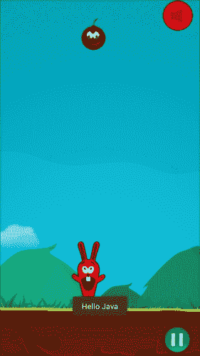
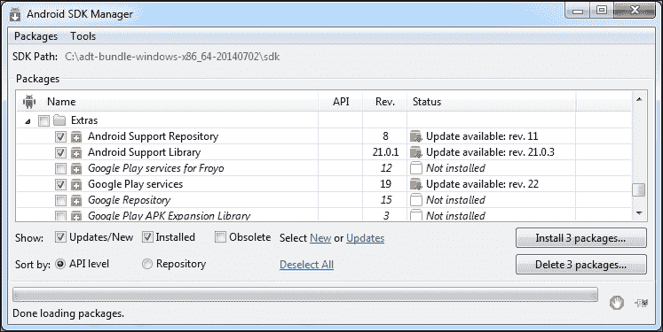
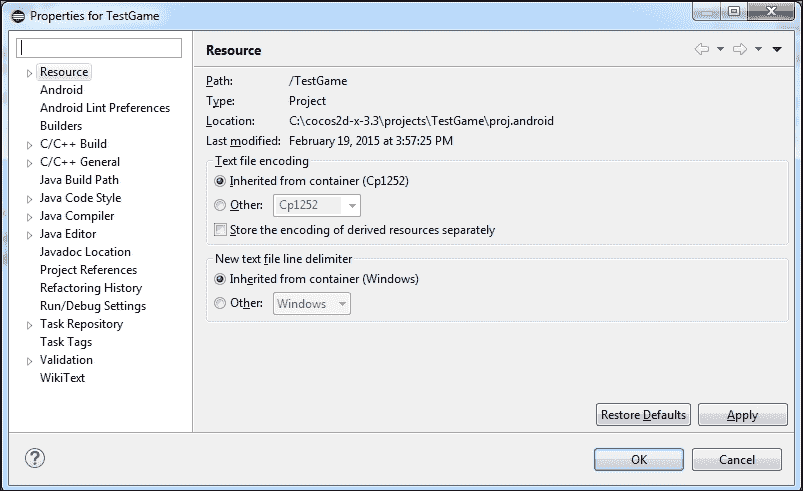
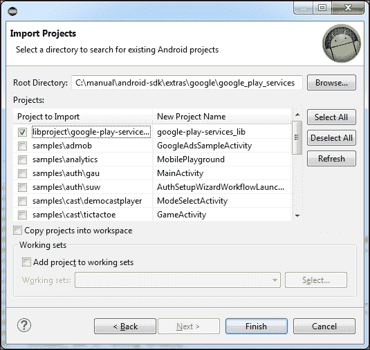
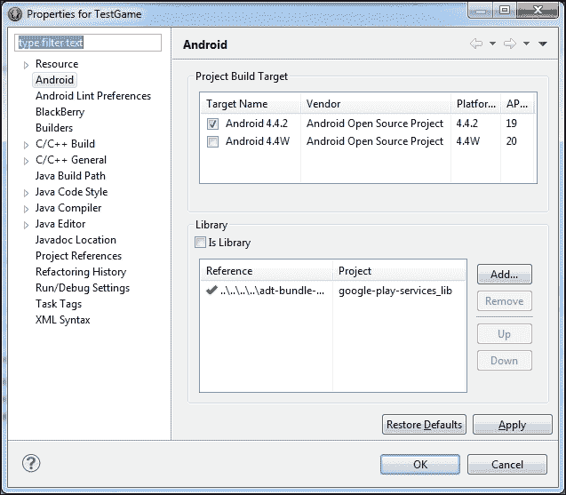

# 第八章：添加原生 Java 代码

到目前为止，我们一直在使用 Cocos2d-x 游戏框架编写的编程语言（C++）来创建我们的游戏；然而，由 Google 编写的 Android API 仅在应用程序的 Java 层可用。在本章中，你将学习如何使用**Java Native Interface** (**JNI**)的能力，将我们的原生 C++代码与高端的 Java 核心进行通信。

本章节将涵盖以下主题：

+   理解 Cocos2d-x 在 Android 平台的架构

+   理解 JNI 的能力

+   向 Cocos2d-x 游戏中添加 Java 代码

+   通过插入 Java 代码向游戏中添加广告

# 理解 Cocos2d-x 在 Android 平台的架构（再次注意原文重复，不重复翻译）

在第一章，*设置你的开发环境*中，我们在安装构建 Cocos2d-x 框架所需的所有组件时，告诉你要下载并安装 Android **原生开发工具包** (**NDK**)，它允许我们使用 C++语言而非主流的 Java 技术核心来构建 Android 应用程序，Android API 就是用这种技术核心编写的。

当一个 Android 应用程序启动时，它会查看其`AndroidManisfest.xml`文件，寻找带有意图过滤器`android.intent.action.MAIN`的活动定义，然后运行 Java 类。以下列表展示了由 Cocos 新脚本生成的`AndroidManifest.xml`文件片段，其中指定了当 Android 应用程序启动时要启动的活动：

```java
<activity
   android:name="org.cocos2dx.cpp.AppActivity"
   android:configChanges="orientation"
   android:label="@string/app_name"
   android:screenOrientation="portrait"
   android:theme="@android:style/Theme.NoTitleBar.Fullscreen" >
   <intent-filter>
      <action android:name="android.intent.action.MAIN" />
      <category android:name="android.intent.category.LAUNCHER" />
   </intent-filter>
</activity>
```

Cocos2d-x 项目创建脚本已经创建了一个名为`AppActivity`的 Java 类，它位于`proj.android`目录下的`src`文件夹中的`org.cocos2dx.cpp` Java 包名中。这个类没有主体，并继承自`Cocos2dxActivity`类，正如我们可以在以下代码列表中欣赏到的那样：

```java
package org.cocos2dx.cpp;

import org.cocos2dx.lib.Cocos2dxActivity;

public class AppActivity extends Cocos2dxActivity {
}
```

`Cocos2dxActivity`类在其`onCreate`方法中加载原生 C++框架核心。

# 理解 JNI 的能力（请注意，这里原文有重复，根据注意事项，我不会重复翻译）

JNI 提供了 C++代码和 Java 代码之间的桥梁。Cocos2d-x 框架为我们提供了 JNI 助手，这使得集成 C++代码和 Java 代码变得更加容易。

`JniHelper` C++类有一个名为`getStaticMethodInfo`的方法。这个方法接收以下参数：一个`JniMethodInfo`对象来存储调用相应 Java 代码所需的所有数据，静态方法所在的类名，方法名以及它的签名。

为了找出 JNI 的方法签名，你可以使用`javap`命令：例如，如果我们想知道`AppActivity`类中包含的方法的签名，那么我们只需要打开一个控制台窗口，前往你的`proj.android\bin\classes`目录，并输入以下命令：

```java
SET CLASSPATH=.
javap -s org.cocos2dx.cpp.AppActivity

```

在这个特定情况下，你将收到如下自动为类创建的`null`构造函数的签名：

```java
Compiled from "AppActivity.java"
public class org.cocos2dx.cpp.AppActivity extends org.cocos2dx.lib.Cocos2dxActivity {
  public org.cocos2dx.cpp.AppActivity();
    Signature: ()V
}
```

然后，通过`JniMethodInfo`实例附加的`env`属性，我们可以调用一系列以`Call…`开头的对象方法来调用 Java 方法。在下一节我们将编写的代码中，我们将使用`CallStaticVoid`方法来调用一个不返回任何值的静态方法，顾名思义。请注意，如果你想传递一个 Java 字符串作为参数，那么你需要调用`env`属性的`NewStringUTF`方法，传递`const char*`，它将返回一个`jstring`实例，你可以用它来传递给一个接收字符串的 Java 方法，如下面的代码清单所示：

```java
JniMethodInfo method;
JniHelper::getStaticMethodInfo(method, CLASS_NAME,"showToast","(Ljava/lang/String;)V");
jstring stringMessage = method.env->NewStringUTF(message);
method.env->CallStaticVoidMethod(method.classID,  method.methodID, stringMessage);
```

最后，如果你在 C++代码中创建了`jstring`或其他任何 Java 抽象类的实例，那么在将值传递给 Java 核心之后，请确保删除这些实例，这样我们就不必在内存中保留不必要的引用。可以通过调用`JniMethodInfo`实例的`env`属性中的`DeleteLocalRef`方法，并传递你想移除的 Java 抽象引用来实现这一点：

```java
method.env->DeleteLocalRef(stringMessage);
```

本节介绍的概念将应用于下一节的代码清单。

# 将 Java 代码添加到 Cocos2d-x 游戏

现在，我们将创建一个简单的集成，将这两项技术结合起来，使我们的 Cocos2d-x C++游戏能够使用 Android Java API 显示提示框消息。

### 注意

安卓中的提示框（Toast）是一种弹出的消息，它会显示一段指定的时间，在这段时间内无法被隐藏。本节的最后附有提示框消息的截图，以供参考。

Cocos2d-x 运行在一个 Java 活动中，为了显示原生的 Android 提示框消息，我们将创建一个 Java 类，它将有一个名为`showToast`的静态方法。这个方法将接收一个字符串，并在提示框中显示它。为了访问 Cocos2d-x 游戏活动，我们将在该类中添加一个类型为`Activity`的静态属性，并在重写的`onCreate`方法中初始化它。然后，我们将创建一个公共的静态方法，这将允许我们从 Java 代码的任何地方访问这个实例。在这些修改之后，我们的`AppActivity` Java 类代码将如下所示：

```java
package org.cocos2dx.cpp;

import org.cocos2dx.lib.Cocos2dxActivity;
import android.app.Activity;
import android.os.Bundle;

public class AppActivity extends Cocos2dxActivity {
   private static Activity instance;
    @Override
    protected void onCreate(final Bundle savedInstanceState) {
       instance = this;
        super.onCreate(savedInstanceState);

    }
    public static Activity getInstance(){
       return instance;
    }
}
```

现在，让我们在`com.packtpub.jni`包内创建所提到的`JniFacade` Java 类，该类体内将只有一个接收字符串作为参数的静态 void 方法，然后如下所示在 UI 线程中以接收到的消息显示提示框：

```java
package com.packtpub.jni;

import org.cocos2dx.cpp.AppActivity;
import android.app.Activity;
import android.widget.Toast;

public class JniFacade {
   private static Activity activity = AppActivity.getInstance();

   public static void showToast(final String message) {
      activity.runOnUiThread(new Runnable() {         
         @Override
         public void run() {
            Toast.makeText(activity.getBaseContext(), message, Toast.   LENGTH_SHORT).show();   
         }
      });      
   }
}
```

既然我们已经有了 Java 端的代码，让我们将`JniBridge` C++类添加到我们的`classes`文件夹中。

在`JniBridge.h`头文件中，我们将编写以下内容：

```java
#ifndef __JNI_BRIDGE_H__
#define __JNI_BRIDGE_H__
#include "cocos2d.h"

class JniBridge
{
public:
   static void showToast(const char* message);
};

#endif
```

现在让我们创建实现文件`JniBridge.cpp`，在这里我们将调用名为`showToast`的静态 Java 方法，该方法接收一个字符串作为参数：

```java
#include "JniBridge.h"
#define CLASS_NAME "com/packtpub/jni/JniFacade"
#define METHOD_NAME "showToast"
#define PARAM_CODE "(Ljava/lang/String;)V"

USING_NS_CC;

void JniBridge::showToast(const char* message)
{
   JniMethodInfo method;
   JniHelper::getStaticMethodInfo(method, CLASS_NAME, METHOD_NAME, PARAM_CODE);
   jstring stringMessage = method.env->NewStringUTF(message);
    method.env->CallStaticVoidMethod(method.classID, method.methodID, stringMessage);
    method.env->DeleteLocalRef(stringMessage);
}
```

如我们所见，这里我们使用了 Cocos2d-x 框架中捆绑的`JniMethodInfo`结构和`JniHelper`类，以调用`showToast`方法，并向它发送 C++代码中的 c 字符串，该字符串被转换成了 Java 字符串。

现在让我们在我们的`HelloWorldScene.cpp`实现文件中包含`JniBridge.h`头文件，这样我们就可以从主场景类内部访问到 Java 代码的桥梁：

```java
#include "JniBridge.h"
```

现在在位于`HelloWorld.cpp`实现文件中的`init`方法末尾，我们将调用`showToast`静态方法，以便使用 Android Java API 显示一个原生提示消息，显示从我们的 C++代码发送的文本，如下所示：

```java
JniBridge::showToast("Hello Java");
```

这将产生以下结果：



正如我们从之前的截图中可以看出的，我们已经实现了从 C++游戏逻辑代码中显示原生 Java 提示消息的目标。

# 通过插入 Java 代码将广告添加到游戏中

在上一节中，我们通过使用 JNI，在我们的 C++游戏逻辑代码和 Android 应用的 Java 层之间创建了一个交互。在本节中，我们将修改我们的 Android 特定代码，以便在 Android 游戏中显示谷歌**AdMob**横幅。

### 注意

AdMob 是谷歌的一个平台，通过展示广告，它可以让你的应用实现盈利，同时它还具备分析工具和应用程序内购买的工具。

# 配置环境

为了显示谷歌 AdMob 横幅，我们需要将`Google Play Services`库添加到我们的项目中。为此，我们首先需要通过使用 Android SDK 管理器下载它及其依赖项，即 Android 支持库：



成功下载**Google Play Services**及其依赖项后，你需要将 Android.support.v4 添加到你的项目中，因为 Google Play Services 库需要它。为此，我们将复制位于以下路径的`android-support-v4.jar`文件：`<ADT PATH>\sdk\extras\android\support\v4`到 Android 项目中的`libs`文件夹，然后我们通过在 Eclipse 的包资源管理器中右键点击项目，选择**构建路径**，然后点击**配置构建路径**，将其添加到我们的构建路径中。**Java 构建路径**配置窗口将出现，点击**添加 JARS…**按钮并在`libs`文件夹中添加`android-support-v4.jar`文件。

现在，我们将复制我们刚刚下载的 Google Play Services 代码。该代码现在位于`<ADT PATH>\sdk\extras\google\google_play_services`到我们的工作空间路径。您可以通过右键点击您的 Eclipse Java 项目，然后点击**属性**，最后选择左侧的**资源**选项来找出您的工作空间路径；在那里您将看到**位置**信息，如下面的截图所示：



我们已经设置了依赖项，现在让我们通过导航到**文件** | **导入** | **Android** | **将现有 Android 代码导入工作空间** | **浏览…**来添加 Google Play Services 库。然后，浏览到您在上一步中复制 Google Play Services 的位置。取消选择除`google-play-services_lib`之外的所有项目，并点击**完成**：



既然我们的工作空间中已经有了`google-play-services_lib`项目，让我们将其配置为 Cocos2d-x 游戏项目的库。为此，我们再次在包资源管理器中右键点击我们的项目，点击**属性**，在左侧窗格中选择**Android**部分，然后在屏幕底部的下方，我们将点击**添加…**按钮，以便将`google-play-services_lib`库添加到我们的 Eclipse 项目中，如下面的截图所示：



现在我们已经准备就绪，可以进入下一部分，我们将使用刚刚添加的库来显示 Google AdMob 广告。

既然我们的 AdMob 横幅将显示在屏幕顶部，我们现在将把静音按钮移动到底部，这样就不会被横幅覆盖。我们将通过更改静音和取消静音按钮的位置来实现这一点。不再将屏幕高度减去静音精灵高度的一半作为其垂直位置，我们现在将其*y*组件设置为屏幕高度减去静音按钮高度的两倍，如下面的代码行所示，在`initMuteButton`方法中：

```java
   _muteItem->setPosition(Vec2(_visibleSize.width -  _muteItem->getContentSize().width/2 ,_visibleSize.height -  _muteItem->getContentSize().height * 2));
```

# 修改 Android 清单

在本节中，我们将修改 Android 清单，以便插入使用 Google Play Services 库所需的配置。

我们只需要添加两个代码片段，其中之一将紧邻打开的应用程序标签，指示正在使用的 Google Play Services 版本，如下面的代码列表所示：

```java
        <meta-data
            android:name="com.google.android.gms.version"
            android:value="@integer/google_play_services_version" />
```

我们将要添加的第二个代码片段是`AdActivity`声明，它将紧邻我们游戏活动的声明添加，以便我们的游戏能够识别 Google Play Services 库中的这个内置活动：

```java
       <activity
            android:name="com.google.android.gms.ads.AdActivity"
            android:configChanges="keyboard|keyboardHidden|orientation| screenLayout|uiMode|screenSize|smallestScreenSize" />
```

## 添加 Java 代码

既然我们已经配置了库并且修改了 Android 清单，广告库就可以使用了。我们将在`AppActivity`类中添加一个广告初始化方法，并在调用其超类的实现之后调用它。

为了以下示例，我们将使用一个示例 AdMob ID，您可以将其替换为自己的 ID。您可以在[`www.google.com/admob`](http://www.google.com/admob)找到有关如何创建自己的 AdMob ID 的更多信息。

```java
   private void initAdMob() {
      final String ADMOB_ID = "ca-app-pub-7870675803288590/4907722461";
      final AdView adView;
      final FrameLayout adViewLayout;

      FrameLayout.LayoutParams adParams = new FrameLayout.LayoutParams(
            FrameLayout.LayoutParams.MATCH_PARENT,
            FrameLayout.LayoutParams.WRAP_CONTENT);
      adParams.gravity = Gravity.TOP | Gravity.CENTER_HORIZONTAL;      

      AdRequest adRequest = new AdRequest.Builder().
            addTestDevice(AdRequest.DEVICE_ID_EMULATOR).
            addTestDevice("E8B4B73DC4CAD78DFCB44AF69E7B9EC4").build();

      adView = new AdView(this);
      adView.setAdSize(AdSize.SMART_BANNER);
      adView.setAdUnitId(ADMOB_ID);
      adView.setLayoutParams(adParams);
      adView.loadAd(adRequest);
      adViewLayout = new FrameLayout(this);
      adViewLayout.setLayoutParams(adParams);
      adView.setAdListener(new AdListener() {
            @Override
            public void onAdLoaded() {
              adViewLayout.addView(adView);
            }         
      });      
      this.addContentView(adViewLayout, adParams);
   }
```

与上一节相比，我们不使用 JNI，因为我们根本不与 C++代码交互；相反，我们修改了由`cocos`命令创建的 Android 活动，以便添加更多图形元素以查看在模板中定义的 OpenGL E 视图的另一侧。

我们只是以编程方式创建了一个帧布局，并向其中添加了一个`adView`实例；最后，我们将这个帧布局作为内容视图添加到游戏活动中，然后通过使用重力布局参数指定其期望的位置，这样我们就能够在屏幕顶部显示 Google 广告。请注意，您可以修改广告的位置，即您希望它显示的位置，只需修改布局参数即可。

请注意，在广告成功加载后，我们将`adView`添加到了我们的帧布局中。使用`AdListener`，如果您在广告完成启动之前添加`adView`实例，那么它将不会显示。

在将所有内容整合之后，这是我们的 Google AdMob 的样子：


# 将所有内容整合在一起

我们已经实现了将核心 Java 代码嵌入到我们的 Cocos2d-x 游戏中的目标。现在我们将展示本章中所有修改过的游戏部分。

在这里，我们展示了从零开始创建的 C++ JNI 桥（`JniBridge.h`）的头文件：

```java
#ifndef __JNI_BRIDGE_H__
#define __JNI_BRIDGE_H__
#include "cocos2d.h"

class JniBridge
{
public:
   static void showToast(const char* message);
};

#endif
```

既然我们已经定义了我们的`JniBridge`的头文件，让我们编写实现文件（`JniBridge.cpp`）：

```java
#include "JniBridge.h"
#include "platform/android/jni/JniHelper.h"
#define CLASS_NAME "com/packtpub/jni/JniFacade"
#define METHOD_NAME "showToast"
#define PARAM_CODE "(Ljava/lang/String;)V"

USING_NS_CC;

void JniBridge::showToast(const char* message)
{
   JniMethodInfo method;
   JniHelper::getStaticMethodInfo(method, CLASS_NAME, METHOD_ NAME,PARAM_CODE);
   jstring stringMessage = method.env->NewStringUTF(message);
   method.env->CallStaticVoidMethod(method.classID, method.methodID, stringMessage);
   method.env->DeleteLocalRef(stringMessage);
}
```

现在让我们看看在包含了我们的`JniBridge`之后，我们的游戏玩法类头文件（`HelloWorldScene.h`）的样子：

```java
#ifndef __HELLOWORLD_SCENE_H__
#define __HELLOWORLD_SCENE_H__

#include "cocos2d.h"
#include "PauseScene.h"
#include "GameOverScene.h"
#include "JniBridge.h"

class HelloWorld : public cocos2d::Layer
{
public:
    static cocos2d::Scene* createScene();
    virtual bool init();
    void pauseCallback(cocos2d::Ref* pSender);
    CREATE_FUNC(HelloWorld);
private:
   cocos2d::Director *_director;
   cocos2d::Size visibleSize;   
   cocos2d::Sprite* _sprBomb;
   cocos2d::Sprite* _sprPlayer;   
   cocos2d::Vector<cocos2d::Sprite*> _bombs;
   cocos2d::MenuItemImage* _muteItem;
   cocos2d::MenuItemImage* _unmuteItem;
   int _score;   
   int _musicId;
   void initPhysics();
   bool onCollision(cocos2d::PhysicsContact& contact);
   void setPhysicsBody(cocos2d::Sprite* sprite);
   void initTouch();
   void movePlayerByTouch(cocos2d::Touch* touch,  cocos2d::Event* event);
   bool explodeBombs(cocos2d::Touch* touch,  cocos2d::Event* event);
   void movePlayerIfPossible(float newX);
   void movePlayerByAccelerometer(cocos2d::Acceleration*  acceleration, cocos2d::Event* event);
   void initAccelerometer();
   void initBackButtonListener();
   void onKeyPressed(cocos2d::EventKeyboard::KeyCode keyCode, cocos2d::Event* event);
   void updateScore(float dt);
   void addBombs(float dt);   
   void initAudio();
   void initAudioNewEngine();
   void initMuteButton();
};

#endif // __HELLOWORLD_SCENE_H__
```

现在我们将向您展示在本书的最后一章末尾，`HelloWorldScene.cpp`方法的样子：

```java
#include "HelloWorldScene.h"
USING_NS_CC;
using namespace CocosDenshion;
using namespace cocos2d::experimental;

// User input handling code …
void HelloWorld::initMuteButton()
{
   _muteItem = MenuItemImage::create("mute.png", "mute.png", CC_CALLBACK_1(HelloWorld::muteCallback, this));

   _muteItem->setPosition(Vec2(_visibleSize.width -  _muteItem->getContentSize().width/2 ,
   _visibleSize.height -  _muteItem->getContentSize().height * 2));
```

我们在代码中更改了静音按钮的位置，使其不被广告覆盖：

```java
    _unmuteItem = MenuItemImage::create("unmute.png", "unmute.png", CC_CALLBACK_1(HelloWorld::muteCallback, this));

   _unmuteItem->setPosition(Vec2(_visibleSize.width -  _unmuteItem->getContentSize().width/2 ,
   _visibleSize.height -  _unmuteItem->getContentSize().height *2));
   _unmuteItem -> setVisible(false);

   auto menu = Menu::create(_muteItem, _unmuteItem , nullptr);
   menu->setPosition(Vec2::ZERO);
   this->addChild(menu, 2);
}
// on "init" you need to initialize your instance
bool HelloWorld::init()
{
  if ( !Layer::init() )
  {
     return false;
  }
  _score = 0;
  _director = Director::getInstance();
  visibleSize = _director->getVisibleSize();
  auto origin = _director->getVisibleOrigin();
  auto closeItem = MenuItemImage::create("CloseNormal.png", "CloseSelected.png", CC_CALLBACK_1(HelloWorld::pauseCallback, this));
  closeItem->setPosition(Vec2(visibleSize.width -  closeItem->getContentSize().width/2 , closeItem->getContentSize().height/2));

  auto menu = Menu::create(closeItem, nullptr);
  menu->setPosition(Vec2::ZERO);
  this->addChild(menu, 1);
  _sprBomb = Sprite::create("bomb.png");   
  _sprBomb->setPosition(visibleSize.width / 2,  visibleSize.height + _sprBomb->getContentSize().height/2);
  this->addChild(_sprBomb,1);
  auto bg = Sprite::create("background.png");
  bg->setAnchorPoint(Vec2());
  bg->setPosition(0,0);
  this->addChild(bg, -1);
  _sprPlayer = Sprite::create("player.png");   
  _sprPlayer->setPosition(visibleSize.width / 2, visibleSize.height *   0.23);
  setPhysicsBody(_sprPlayer);
  this->addChild(_sprPlayer, 0);
  //Animations
  Vector<SpriteFrame*> frames;
  Size playerSize = _sprPlayer->getContentSize();
  frames.pushBack(SpriteFrame::create("player.png",  Rect(0, 0, playerSize.width, playerSize.height)));
  frames.pushBack(SpriteFrame::create("player2.png",  Rect(0, 0, playerSize.width, playerSize.height)));
  auto animation = Animation::createWithSpriteFrames(frames,0.2f);
  auto animate = Animate::create(animation);
  _sprPlayer->runAction(RepeatForever::create(animate));   
  setPhysicsBody(_sprBomb);   
  initPhysics();   
  _sprBomb->getPhysicsBody()->setVelocity(Vect(0,-100));   
  initTouch();
  initAccelerometer();   
  #if (CC_TARGET_PLATFORM == CC_PLATFORM_ANDROID)
  setKeepScreenOnJni(true);
  #endif
  initBackButtonListener();
  schedule(schedule_selector(HelloWorld::updateScore), 3.0f);
  schedule(schedule_selector(HelloWorld::addBombs), 8.0f);
  initAudioNewEngine();
  initMuteButton();
  _bombs.pushBack(_sprBomb);
 JniBridge::showToast("Hello Java");
  return true;
}
```

在我们所有的修改之后，这是我们的`AppActivity.java`类的样子：

```java
package org.cocos2dx.cpp;

import org.cocos2dx.lib.Cocos2dxActivity;
import android.app.Activity;
import android.os.Bundle;
import android.view.Gravity;
import android.widget.FrameLayout;
import com.google.android.gms.ads.AdListener;
import com.google.android.gms.ads.AdRequest;
import com.google.android.gms.ads.AdSize;
import com.google.android.gms.ads.AdView;

public class AppActivity extends Cocos2dxActivity {
   private static Activity instance;

   private void initAdMob() {
      final String ADMOB_ID = "ca-app-pub-7870675803288590/4907722461";
      final AdView adView;
      final FrameLayout adViewLayout;

      FrameLayout.LayoutParams adParams = new FrameLayout. LayoutParams(FrameLayout.LayoutParams.MATCH_PARENT,FrameLayout.LayoutParams.WRAP_CONTENT);
      adParams.gravity = Gravity.TOP | Gravity.CENTER_HORIZONTAL;      
      AdRequest adRequest = new AdRequest.Builder().
      addTestDevice(AdRequest.DEVICE_ID_EMULATOR).
      addTestDevice("E8B4B73DC4CAD78DFCB44AF69E7B9EC4").build();

      adView = new AdView(this);
      adView.setAdSize(AdSize.SMART_BANNER);
      adView.setAdUnitId(ADMOB_ID);
      adView.setLayoutParams(adParams);
      adView.loadAd(adRequest);
      adViewLayout = new FrameLayout(this);
      adViewLayout.setLayoutParams(adParams);
      adView.setAdListener(new AdListener() {
            @Override
            public void onAdLoaded() {
            adViewLayout.addView(adView);
            }         
      });      
      this.addContentView(adViewLayout, adParams);
   }

   @Override
   protected void onCreate(final Bundle savedInstanceState) {
      instance = this;      
      super.onCreate(savedInstanceState);
      initAdMob();
   }

   public static Activity getInstance() {
      return instance;
   }
}
```

这是我们本章末尾的`JniFacade.java`类文件的样子：包`com.packtpub.jni`：

```java
import org.cocos2dx.cpp.AppActivity;
import android.app.Activity;
import android.widget.Toast;

public class JniFacade {
   private static Activity activity = AppActivity.getInstance();

   public static void showToast(final String message) {
      activity.runOnUiThread(new Runnable() {         
         @Override
         public void run() {
            Toast.makeText(activity.getBaseContext(), message, Toast.   LENGTH_SHORT).show();   
         }
      }      
   }
}
```

在本章中添加了我们的`JniBridge.cpp`文件后，这是我们位于`proj.android\jni`的`Android.mk`文件的样子：

```java
LOCAL_PATH := $(call my-dir)

include $(CLEAR_VARS)

$(call import-add-path,$(LOCAL_PATH)/../../cocos2d)
$(call import-add-path,$(LOCAL_PATH)/../../cocos2d/external)
$(call import-add-path,$(LOCAL_PATH)/../../cocos2d/cocos)

LOCAL_MODULE := cocos2dcpp_shared

LOCAL_MODULE_FILENAME := libcocos2dcpp

LOCAL_SRC_FILES := hellocpp/main.cpp \
         ../../Classes/JniBridge.cpp \
         ../../Classes/AppDelegate.cpp \
         ../../Classes/PauseScene.cpp \
         ../../Classes/GameOverScene.cpp \
                   ../../Classes/HelloWorldScene.cpp

LOCAL_C_INCLUDES := $(LOCAL_PATH)/../../Classes

LOCAL_STATIC_LIBRARIES := cocos2dx_static

include $(BUILD_SHARED_LIBRARY)

$(call import-module,.)
```

最后，这是本书末尾的`AndroidManifest.xml`文件的样子：

```java
<?xml version="1.0" encoding="utf-8"?>
<manifest 
    package="com.packt.happybunny"
    android:installLocation="auto"
    android:versionCode="1"
    android:versionName="1.0" >

    <uses-sdk android:minSdkVersion="9" />

    <uses-feature android:glEsVersion="0x00020000" />

    <application
        android:icon="@drawable/icon"
        android:label="@string/app_name" >
        <meta-data
           android:name="com.google.android.gms.version"
           android:value="@integer/google_play_services_version" />

        <!-- Tell Cocos2dxActivity the name of our .so -->
        <meta-data
           android:name="android.app.lib_name"
           android:value="cocos2dcpp" />

        <activity
           android:name="org.cocos2dx.cpp.AppActivity"
           android:configChanges="orientation"
           android:label="@string/app_name"
           android:screenOrientation="portrait"
           android:theme="@android:style/Theme.NoTitleBar.Fullscreen">
            <intent-filter>
                <action android:name="android.intent.action.MAIN" />

                <category android:name="android.intent.category.LAUNCHER" />
            </intent-filter>
        </activity>
        <activity
            android:name="com.google.android.gms.ads.AdActivity"
            android:configChanges="keyboard|keyboardHidden|orientation| screenLayout|uiMode|screenSize|smallestScreenSize" />
    </application>

    <supports-screens
        android:anyDensity="true"
        android:largeScreens="true"
        android:normalScreens="true"
        android:smallScreens="true"
        android:xlargeScreens="true" />

    <uses-permission android:name="android.permission.INTERNET" />
</manifest>
```

# 概括

在本章中，我们学习了如何通过使用 JNI，在 C++游戏逻辑代码与 Android 的核心 Java 层之间添加交互，我们还通过直接修改在执行`cocos`命令时创建的 Java `Activity`类代码，在游戏中展示了 Google AdMob 横幅广告。
