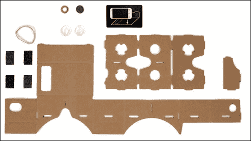
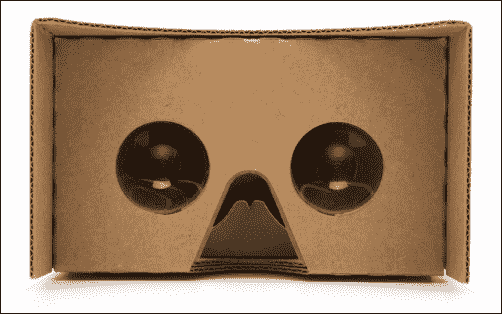
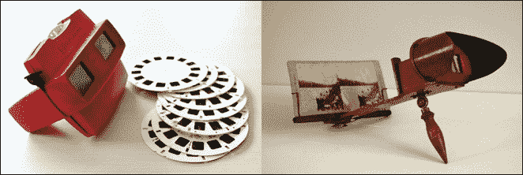
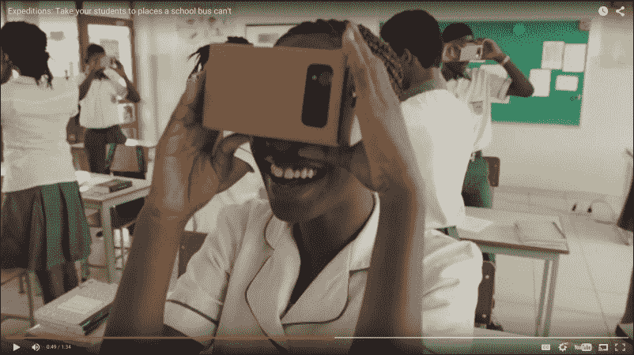
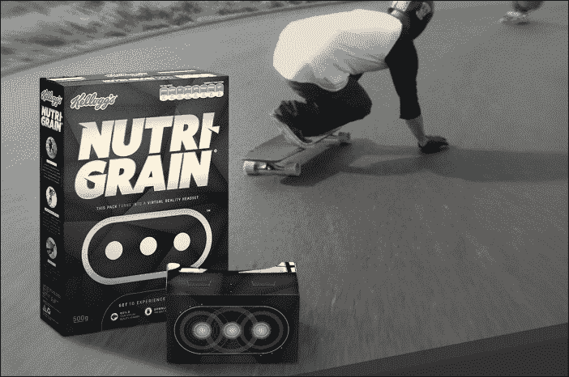
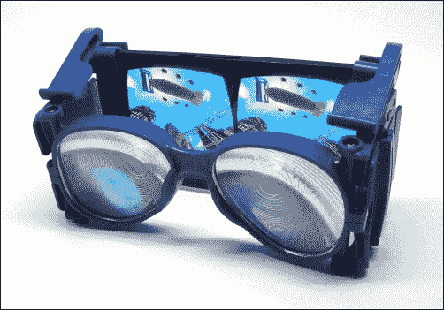
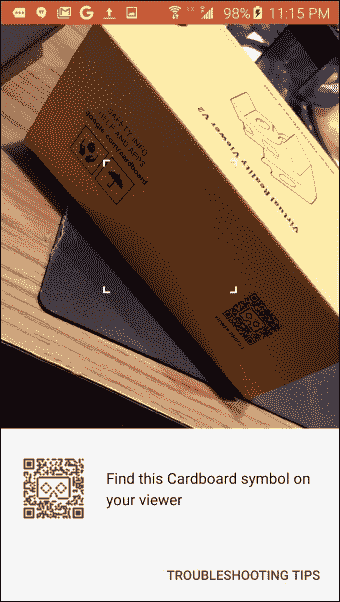
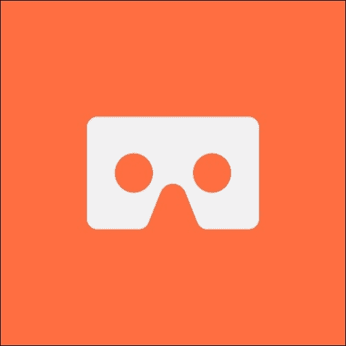

# 第一章。每个人的虚拟现实

欢迎来到令人兴奋的虚拟现实世界！我们相信，作为一名安卓开发者，您想要立即开始构建可以使用谷歌纸板查看的酷东西。然后您的用户只需将他们的智能手机放入观看器中，就可以进入您的虚拟创作。在本书的其余部分中，让我们在代码和技术方面深入讨论之前，让我们先来看看 VR、谷歌纸板及其安卓 SDK 的外部结构。在本章中，我们将讨论以下主题：

+   为什么叫纸板？

+   虚拟现实设备的范围

+   VR 的入口

+   低端 VR 的价值

+   卡片硬件

+   配置您的纸板观看器

+   为纸板开发应用程序

+   VR 最佳实践概述

# 为什么叫纸板？

一切始于 2014 年初，当时谷歌员工大卫·科兹和达米安·亨利在业余时间为安卓智能手机制作了一个简单而廉价的立体观看器。他们设计了一个可以用普通纸板制作的设备，再加上一些适合眼睛的镜片，以及一个触发按钮“点击”的机制。这个观看器真的是用纸板做的。他们编写了一个软件，可以呈现一个分屏的 3D 场景：一个视图给左眼，另一个视图，带有偏移，给右眼。透过这个设备，你会真正感受到对计算机生成场景的 3D 沉浸。它奏效了！该项目随后被提议并批准为“20%项目”（员工可以每周工作一天进行创新），得到资金支持，并有其他员工加入。

### 注意

关于纸板诞生背后的故事的两个“权威”来源如下：

+   [`www.wired.com/2015/06/inside-story-googles-unlikely-leap-cardboard-vr/`](http://www.wired.com/2015/06/inside-story-googles-unlikely-leap-cardboard-vr/)

+   [`en.wikipedia.org/wiki/Google_Cardboard`](https://en.wikipedia.org/wiki/Google_Cardboard)

事实上，纸板效果非常好，以至于谷歌决定继续前进，将该项目提升到下一个级别，并在几个月后在 2014 年的谷歌 I/O 上向公众发布。下图显示了一个典型的未组装的谷歌纸板套件：

自问世以来，谷歌纸板一直对黑客、业余爱好者和专业开发者都是开放的。谷歌开源了观看器设计，任何人都可以下载图纸并制作自己的观看器，可以用披萨盒或者任何他们周围有的东西。甚至可以开展业务，直接向消费者出售预制套件。下图显示了一个已组装的纸板观看器：

纸板项目还包括一个**软件开发工具包**（**SDK**），可以轻松构建 VR 应用程序。谷歌已经不断改进了软件，包括一个本地的 Java SDK 以及一个用于 Unity 3D 游戏引擎的插件（[`unity3d.com/`](https://unity3d.com/)）。

自纸板发布以来，已经开发了大量的应用程序，并在谷歌 Play 商店上提供。在 2015 年的谷歌 I/O 上，2.0 版本推出了升级设计、改进软件和对苹果 iOS 的支持。

谷歌纸板在市场上的形象迅速从一个几乎可笑的玩具发展成为某些类型的 3D 内容和 VR 体验的严肃新媒体设备。谷歌自己的纸板演示应用程序已经从谷歌 Play 商店下载了数百万次。《纽约时报》在 2015 年 11 月 8 日的星期日发行的一期中分发了大约一百万个纸板观看器。

纸板适用于查看 360 度照片和玩低保真度的 3D VR 游戏。它几乎可以被任何人普遍接触，因为它可以在任何安卓或 iOS 智能手机上运行。

开发者现在正在将 3D VR 内容直接整合到 Android 应用中。Google Cardboard 是一种体验虚拟现实的方式，它将会长期存在。

# VR 设备的谱系

和大多数技术一样，虚拟现实产品也有一个从最简单和最便宜到非常先进的产品的谱系。

## 老式立体镜

Cardboard 处于 VR 设备谱系的低端。如果考虑你小时候玩过的 ViewMaster，甚至是 1876 年的历史性立体镜观看器（B.W. Kilborn & Co, New Hampshire 州的 Littleton），你甚至可以再低一些，如下图所示：

在这些老式的观看器中，一对照片为左右眼显示两个分离的视图，略微偏移以创建视差。这会让大脑误以为它正在看到一个真正的三维视图。设备中包含了每只眼睛的独立镜片，让你可以轻松地聚焦在照片上。

同样，渲染这些并排的立体视图是 Google Cardboard 应用的首要任务。（借助他们的传统，Mattel 最近发布了与 Cardboard 兼容的 ViewMaster 品牌 VR 观看器，使用智能手机，可以在[`www.view-master.com/`](http://www.view-master.com/)找到）。

## Cardboard 是移动 VR

Cardboard 相对于立体观看器的明显优势，就像数字照片相对于传统照片的优势一样。数字媒体可以在我们的智能手机内动态存储、加载和操作。这本身就是一个强大的飞跃。

除此之外，Cardboard 还利用手机中的运动传感器，当你左右或上下转头时，图像会相应调整，有效地消除了图像的传统边框。构图是传统视觉媒体的一个非常重要的部分，比如绘画、摄影和电影摄影。几个世纪以来，艺术家和导演们一直在使用这个矩形框架建立视觉语言。

然而，在 VR 中并非如此。当你在 VR 中移动头部时，你的视线方向会改变，场景会随之更新，就好像摄像机随着你的旋转而旋转，提供了完全沉浸式的视图。你可以水平旋转 360 度，左右观看，垂直旋转 180 度，上下观看。换句话说，你可以随意观看任何地方。在 VR 中没有框架！（尽管你的外围视野可能会受到光学和显示器尺寸的限制，这些决定了设备的视野范围）。因此，设计考虑可能更类似于雕塑、环形剧场，甚至是建筑设计。我们需要考虑整个空间，让游客沉浸其中。

Google Cardboard 设备只是一个用来放置智能手机的外壳。它使用智能手机的技术，包括以下内容：

+   显示

+   CPU（主处理器）

+   GPU（图形处理器）

+   IMU（运动传感器）

+   磁力计和/或触摸屏（触发传感器）

我们稍后会详细讨论这一切是如何运作的。

使用移动智能手机进行 VR 意味着有很多好处，比如易于使用，但也有一些烦人的限制，比如有限的电池寿命，较慢的图形处理，以及较低的精度/更高的延迟运动传感器。

三星 Gear VR 是一款比简单的 Cardboard 观看器更智能的移动 VR 头盔。基于 Android，但不兼容 Cardboard 应用（只能与三星手机的特定型号配合使用），它有一个内置的更高精度 IMU（运动传感器），增加了头部运动跟踪的准确性，并有助于减少更新显示时的运动到像素延迟。它还经过人体工程学设计，可以更长时间地使用，并配备了一个带子。

## 桌面 VR 及更多

在消费者虚拟现实设备的高端是 Oculus Rift、HTC Vive 和索尼 PlayStation VR 等产品。这些产品之所以能做到 Cardboard 无法做到的事情，是因为它们不受智能手机能力的限制。有时被称为“桌面 VR”，这些设备是连接到外部 PC 或游戏机的**头戴式显示器**（**HMD**）。

在桌面 VR 上，桌面强大的 CPU 和 GPU 进行实际计算和图形渲染，并将结果发送到 HMD。此外，HMD 具有更高质量的运动传感器和其他功能，有助于在更新显示时减少延迟，比如每秒 90 帧（FPS）。我们将在本书中了解到，减少延迟和保持高 FPS 对所有 VR 开发以及 Cardboard 上的用户舒适度都是重要的关注点。

桌面 VR 设备还增加了*位置跟踪*。Cardboard 设备可以检测 X、Y 和 Z 轴上的旋转运动，但不幸的是它无法检测位置运动（例如沿着这些轴的滑动）。Rift、Vive 和 PSVR 可以。例如，Rift 使用外部摄像头通过 HMD 上的红外灯来跟踪位置（*外部跟踪*）。另一方面，Vive 使用 HMD 上的传感器来跟踪房间中放置的一对激光发射器的位置（*内部跟踪*）。Vive 还使用这个系统来跟踪一对手柄的位置和旋转。这两种策略都能实现类似的结果。用户在被跟踪的空间内有更大的自由度，同时在虚拟空间内移动。Cardboard 无法做到这一点。

请注意，创新不断被引入。很可能，在某个时候，Cardboard 将包含位置跟踪功能。例如，我们知道谷歌的 Project Tango 使用传感器、陀螺仪和对物理空间的认知来实现视觉惯性测距（VIO），从而为移动应用提供运动和位置跟踪。参考[`developers.google.com/project-tango/overview/concepts`](https://developers.google.com/project-tango/overview/concepts)。移动设备公司，如 LG 和三星，正在努力研究如何实现移动位置跟踪，但（在撰写本文时）尚不存在通用的、低延迟的解决方案。谷歌的 Project Tango 显示出一些希望，但尚不能实现流畅、舒适的 VR 体验所需的像素延迟。延迟过大会让你感到不适！

在非常高端的是成千上万甚至数百万美元的工业和军用级系统，这些不是消费者设备，我相信它们可以做一些非常棒的事情。我可以告诉你更多，但那样我就得杀了你。这些解决方案自上世纪 80 年代以来就已经存在。VR 并不是新的——消费者 VR 是新的。

VR 设备的光谱在下图中有所体现：

当我们为 Cardboard 开发时，重要的是要记住它相对于其他 VR 设备能做什么，不能做什么。Cardboard 可以显示立体视图。Cardboard 可以跟踪头部的旋转运动。它不能进行位置跟踪。它在图形处理能力、内存和电池寿命方面存在限制。

# VR 的入口

在它上市的短时间内，这一代消费者虚拟现实已经表现出自己是瞬间引人入胜、沉浸式、娱乐性强，对于试用过的几乎每个人来说都是“改变游戏规则”的产品。谷歌 Cardboard 特别容易获得，使用门槛很低。你只需要一部智能手机，一个低成本的 Cardboard 观看器（低至 5 美元），以及从 Google Play（或者 iOS 的 Apple App Store）下载的免费应用程序。

谷歌 Cardboard 被称为 VR 的**通道**，也许是指大麻作为更危险的非法药物滥用的“通道药物”？我们可以玩一下这个类比，尽管有些颓废。也许 Cardboard 会让你略尝 VR 的潜力。你会想要更多。然后再多一些。这将帮助你满足对更好、更快、更强烈和更沉浸式虚拟体验的渴望，这些只能在更高端的 VR 设备中找到。也许在这一点上，也许就没有回头的余地了；你上瘾了！

然而，作为 Rift 用户，我仍然喜欢 Cardboard。它快速。它容易。它有趣。而且真的有效，只要我运行适合该设备的应用程序。

在假期拜访家人时，我在背包里带了一个 Cardboard 观看器。每个人都很喜欢。我的许多亲戚甚至都没有通过标准的谷歌 Cardboard 演示应用程序，尤其是它的 360 度照片查看器。那足够吸引人，让他们一段时间内感到愉快。其他人则玩了一两个游戏，或者更多。他们想继续玩并尝试新的体验。也许这只是新奇。或者，也许这是这种新媒体的本质。关键是，谷歌 Cardboard 提供了一种令人沉浸的体验，令人愉快，有用，而且非常容易获得。简而言之，它很棒。

然后，向他们展示 HTC Vive 或 Oculus Rift。天哪！那真的太棒了！好吧，对于这本书，我们不是来讨论更高端的 VR 设备，只是与 Cardboard 进行对比，并保持透视。

一旦你尝试了桌面 VR，再回到移动 VR 会很难吗？有些人这样说。但这几乎是愚蠢的。事实是它们确实是两种不同的东西。

正如前面讨论的，桌面 VR 配备了更高的处理能力和其他高保真功能，而移动 VR 受到智能手机的限制。如果开发人员试图直接将桌面 VR 应用程序移植到移动设备，你很可能会感到失望。

最好将每个视为一个独立的媒体。就像桌面应用程序或游戏机游戏不同于但类似于移动应用程序一样。设计标准可能是相似的但不同。技术是相似的但不同。用户期望是相似的但不同。移动 VR 可能类似于桌面 VR，但它是不同的。

### 注意

为了强调 Cardboard 与桌面 VR 设备的不同，值得指出谷歌已经将以下内容写入了他们的制造商规格和指南中：

“不要在您的观看器中包括头带。当用户用手将 Cardboard 贴在脸上时，他们的头部旋转速度受到躯干旋转速度的限制（比颈部旋转速度慢得多）。这减少了由渲染/IMU 延迟引起的“VR 晕动病”的机会，并增加了 VR 的沉浸感。”

这意味着 Cardboard 应用程序应该设计为更短、更简单、更固定的体验。在本书中，我们将阐明这些和其他提示和最佳实践，当你为移动 VR 媒体开发时。

现在让我们考虑 Cardboard 是通往 VR 的其他方式。

我们预测 Android 将继续成为未来虚拟现实的主要平台。越来越多的技术将被塞进智能手机。而这项技术将包括对 VR 有利的特性：

+   更快的处理器和移动 GPU

+   更高分辨率的屏幕

+   更高精度的运动传感器

+   优化的图形管线

+   更好的软件

+   更多的 VR 应用程序

移动 VR 不会让位给桌面 VR；甚至可能最终取代它。

此外，我们很快将看到专门的移动 VR 头显，内置智能手机的功能，而无需支付无线通信合同的费用。不需要使用自己的手机。不会再因为来电或通知而在虚拟现实中被打断。不再因为需要接听重要电话或者使用手机而节约电池寿命。所有这些专用的 VR 设备可能都是基于 Android 的。

# 低端 VR 的价值

与此同时，Android 和 Google Cardboard 已经出现在我们的手机上，放在我们的口袋里，我们的家里，办公室，甚至我们的学校里。

例如，Google Expeditions 是 Google 的 Cardboard 教育项目（[`www.google.com/edu/expeditions/`](https://www.google.com/edu/expeditions/)），它允许 K-12 学生进行虚拟实地考察，去“校车无法到达的地方”，就像他们所说的，“环游世界，登陆火星表面，潜入珊瑚礁，或者回到过去。”套件包括 Cardboard 观看器和每个班级学生的 Android 手机，以及老师的 Android 平板电脑。它们通过网络连接。老师可以引导学生进行虚拟实地考察，提供增强内容，并创造远远超出教科书或课堂视频的学习体验，如下图所示：

在另一个创意营销的例子中，2015 年夏天，Kellogg's 开始销售 Nutri-Grain 零食棒，包装盒可以变成 Google Cardboard 观看器。这与一个应用程序相连，显示各种极限运动 360 度视频（[`www.engadget.com/2015/09/09/cereal-box-vr-headset/`](http://www.engadget.com/2015/09/09/cereal-box-vr-headset/)），如下图所示：

整个互联网可以被视为一个全球发布和媒体分发网络。它是一个由超链接页面、文本、图像、音乐、视频、JSON 数据、网络服务等组成的网络。它也充斥着 360 度照片和视频。还有越来越多的三维内容和虚拟世界。你会考虑写一个今天不显示图像的 Android 应用吗？可能不会。你的应用程序很可能也需要支持声音文件、视频或其他媒体。所以请注意。支持 Cardboard 的三维内容正在迅速到来。你现在可能对阅读这本书感兴趣，因为 VR 看起来很有趣。但很快，这可能会成为你下一个应用程序的客户驱动需求。

一些流行的 Cardboard 应用类型的例子包括：

+   例如，Google 的 Cardboard 演示（[`play.google.com/store/apps/details?id=com.google.samples.apps.cardboarddemo`](https://play.google.com/store/apps/details?id=com.google.samples.apps.cardboarddemo)）和 Cardboard Camera（[`play.google.com/store/apps/details?id=com.google.vr.cyclops`](https://play.google.com/store/apps/details?id=com.google.vr.cyclops)）的 360 度照片查看

+   例如，Cardboard 剧院（[`play.google.com/store/apps/details?id=it.couchgames.apps.cardboardcinema`](https://play.google.com/store/apps/details?id=it.couchgames.apps.cardboardcinema)）的视频和电影观看

+   例如，VR 过山车和惊险游戏，如 VR 过山车（[`play.google.com/store/apps/details?id=com.frag.vrrollercoaster`](https://play.google.com/store/apps/details?id=com.frag.vrrollercoaster)）

+   例如，卡通式 3D 游戏，如 Lamber VR（[`play.google.com/store/apps/details?id=com.archiactinteractive.LfGC&hl=en_GB`](https://play.google.com/store/apps/details?id=com.archiactinteractive.LfGC&hl=en_GB)）

+   例如，第一人称射击游戏，如 Battle 360 VR（[`play.google.com/store/apps/details?id=com.oddknot.battle360vr`](https://play.google.com/store/apps/details?id=com.oddknot.battle360vr)）

+   **令人毛骨悚然的东西**，例如，Sisters（[`play.google.com/store/apps/details?id=com.otherworld.Sisters`](https://play.google.com/store/apps/details?id=com.otherworld.Sisters)）

+   **教育体验**，例如，太空巨人（[`play.google.com/store/apps/details?id=com.drashvr.titansofspacecb&hl=en_GB`](https://play.google.com/store/apps/details?id=com.drashvr.titansofspacecb&hl=en_GB)）

+   营销经验，例如，沃尔沃现实（[`play.google.com/store/apps/details?id=com.volvo.volvoreality`](https://play.google.com/store/apps/details?id=com.volvo.volvoreality)）

还有更多；成千上万。最受欢迎的应用已经有数十万次下载（Cardboard 演示应用本身已经有数百万次下载）。

本书中的项目是您今天可以自己构建的不同类型的 Cardboard 应用程序的示例。

# Cardware！

让我们来看看不同的 Cardboard 设备。种类繁多。

显然，原始的谷歌设计实际上是用硬纸板制成的。制造商也效仿，直接向消费者提供硬纸板 Cardboard 产品，如 Unofficial Cardboard，DODOCase 和 IAmCardboard 等品牌是最早的。

谷歌免费提供规格和原理图（参见[`www.google.com/get/cardboard/manufacturers/`](https://www.google.com/get/cardboard/manufacturers/)）。例如，2.0 版查看器外壳原理图如下所示：

基本的查看器设计包括一个外壳、两个镜片和一个输入机制。*与 Google Cardboard 兼容*认证计划表示特定的查看器产品符合谷歌的标准，并且与 Cardboard 应用程序配合良好。

查看器外壳可以由任何材料制成：硬纸板、塑料、泡沫、铝等。它应该轻便，并且能够很好地阻挡环境光。

镜片（I/O 2015 版）是 34 毫米直径的非球面单镜头，视场角为 80 度，还有其他指定参数。

输入触发器（“点击器”）可以是几种替代机制之一。最简单的是没有，用户必须直接用手指触摸智能手机屏幕来触发点击。这可能不太方便，因为手机放在查看器外壳内，但它可以工作。许多查看器只包括一个孔，可以伸进手指。另外，原始的 Cardboard 使用了一个小环状磁铁，固定在查看器外部，由嵌入式圆形磁铁固定在位。用户可以滑动环状磁铁，手机的磁力计会感应到磁场的变化，并被软件识别为“点击”。这种设计并不总是可靠，因为磁力计的位置在手机之间有所不同。此外，使用这种方法，更难以检测“按住”交互，这意味着在您的应用程序中只有一种类型的用户输入“事件”可供使用。

Cardboard 2.0 版引入了一个由导电“条”和粘贴在基于 Cardboard 的“锤子”上的“枕头”构成的按钮输入。当按钮被按下时，用户的体电荷被传递到智能手机屏幕上，就好像他直接用手指触摸屏幕一样。这个巧妙的解决方案避免了不可靠的磁力计解决方案，而是使用了手机的原生触摸屏输入，尽管是间接的。

值得一提的是，由于您的智能手机支持蓝牙，可以使用手持蓝牙控制器与您的 Cardboard 应用程序配对。这不是 Cardboard 规格的一部分，需要一些额外的配置：使用第三方输入处理程序或应用程序内置的控制器支持。下图显示了一个迷你蓝牙控制器：

Cardboard 观众不一定是用硬纸板制成的。塑料观众可能会相对昂贵。虽然它们比硬纸板更坚固，但它们基本上具有相同的设计（组装）。一些设备允许您调整镜片到屏幕的距离和/或您的眼睛之间的距离（IPD 或瞳距）。蔡司 VR One、Homido 和 Sunnypeak 设备是最早流行的设备之一。

一些制造商已经超越了 Cardboard 设计（打趣），创新并不一定符合 Google 的规格，但提供了超越 Cardboard 设计的功能。一个显著的例子是 Wearality 观众（[`www.wearality.com/`](http://www.wearality.com/)），它包括一个拥有专利的 150 度视场（FOV）双菲涅耳透镜。它非常便携，可以像一副太阳镜一样折叠起来。Wearality 观众的预发布版本如下图所示：

# 配置您的 Cardboard 观众

由于 Cardboard 设备种类繁多，镜片距离、视场、畸变等方面存在差异，Cardboard 应用必须配置为特定设备的属性。Google 也提供了解决方案。每个 Cardboard 观众都配有一个独特的 QR 码和/或 NFC 芯片，您可以扫描以配置该设备的软件。如果您有兴趣校准自己的设备或自定义参数，请查看[`www.google.com/get/cardboard/viewerprofilegenerator/`](https://www.google.com/get/cardboard/viewerprofilegenerator/)上的配置文件生成工具。

要将手机配置为特定的 Cardboard 观众，请打开标准的 Google Cardboard 应用，并选择屏幕底部中心部分显示的设置图标，如下图所示：

配置您的 Cardboard 观众

然后将相机对准您特定的 Cardboard 观众的 QR 码：

您的手机现在已配置为特定的 Cardboard 观众参数。

# 为 Cardboard 开发应用

在撰写本书时，Google 为 Cardboard 提供了两个 SDK：

+   Android 的 Cardboard SDK（[`developers.google.com/cardboard/android`](https://developers.google.com/cardboard/android)）

+   Unity 的 Cardboard SDK（[`developers.google.com/cardboard/unity`](https://developers.google.com/cardboard/unity)）

首先让我们考虑 Unity 选项。

## 使用 Unity

Unity（[`unity3d.com/`](http://unity3d.com/)）是一款流行的功能齐全的 3D 游戏引擎，支持在多种平台上构建游戏，从 PlayStation 和 XBox 到 Windows 和 Mac（还有 Linux！），再到 Android 和 iOS。

Unity 由许多独立的工具组成，集成到一个统一的可视化编辑器中。它包括用于图形、物理、脚本、网络、音频、动画、UI 等的工具。它包括先进的计算机图形渲染、着色、纹理、粒子和照明，提供各种优化性能和调整图形质量的选项，适用于 2D 和 3D。如果这还不够，Unity 还拥有一个庞大的资产商店，充斥着由其庞大的开发者社区创建的模型、脚本、工具和其他资产。

Cardboard SDK for Unity 提供了一个插件包，您可以将其导入 Unity 编辑器，其中包含预制对象、C#脚本和其他资产。该包为您提供了在虚拟 3D 场景中添加立体摄像机并将项目构建为 Android（和 iOS）上的 Cardboard 应用所需的内容。Unity 计划将 Cardboard SDK 直接集成到引擎中，这意味着通过在构建设置中勾选一个框即可添加对 Cardboard 的支持。

### 注意

如果您有兴趣了解如何使用 Unity 构建 Cardboard 的 VR 应用程序，请查看 Packt Publishing 的另一本书《Unity 虚拟现实项目》（https://www.packtpub.com/game-development/unity-virtual-reality-projects）。

## 原生开发

那么，为什么不只是使用 Unity 进行 Cardboard 开发呢？好问题。这取决于您想要做什么。当然，如果您的项目需要 Unity 的所有功能和特性，那就是这样做的方式。

但代价是什么？伟大的力量伴随着伟大的责任（本·帕克说）。学起来很快，但要精通需要一生的时间（围棋大师说）。但说真的，Unity 是一个强大的引擎，可能对许多应用程序来说过于强大。要充分利用，您可能需要额外的建模、动画、关卡设计、图形和游戏机制方面的专业知识。

使用 Unity 构建的 Cardboard 应用程序体积庞大。为 Android 构建的空的 Unity 场景生成一个最小为 23 兆字节的.apk 文件。相比之下，在第二章中我们构建的简单的原生 Cardboard 应用程序.apk 文件*骨架 Cardboard 项目*不到 1 兆字节。

随着这种庞大的应用程序大小，加载时间可能会很长，可能超过几秒钟。它会影响内存使用和电池使用。除非您已经购买了 Unity Android 许可证，否则您的应用程序总是以*Made With Unity*启动画面开始。这些可能不是您可以接受的限制。

一般来说，您离硬件越近，您的应用程序性能就会越好。当您直接为 Android 编写时，您可以直接访问设备的功能，对内存和其他资源有更多的控制，并有更多的定制和优化机会。这就是为什么原生移动应用程序往往优于移动 Web 应用程序。

最后，使用原生 Android 和 Java 开发的最好原因可能是最简单的。您现在就想构建一些东西！如果您已经是 Android 开发人员，那就使用您已经知道和喜爱的东西！从这里到那里走最直接的道路。

如果您熟悉 Android 开发，那么 Cardboard 开发将会很自然。使用 Cardboard SDK for Android，您可以使用基于 Jet Brains 的 InteliJ IDEA 的 Android Studio IDE（集成开发环境）进行 Java 编程。

正如我们将在本书中看到的那样，您的 Cardboard Android 应用程序与其他 Android 应用程序一样，包括清单、资源和 Java 代码。与任何 Android 应用程序一样，您将实现一个`MainActivity`类，但您的类将扩展`CardboardActivity`并实现`CardboardView.StereoRenderer`。您的应用程序将利用 OpenGL ES 2.0 图形、着色器和 3D 矩阵数学。它将负责在每一帧更新显示，也就是说，根据用户在特定时间片段所看的方向重新渲染您的 3D 场景。在 VR 中尤为重要，但在任何 3D 图形环境中，都要根据显示器允许的速度重新渲染新的帧，通常为 60 FPS。您的应用程序将通过 Cardboard 触发器和/或凝视控制处理用户输入。我们将在接下来的章节中详细介绍所有这些主题。

这就是您的应用程序需要做的。但是，仍然有更多细枝末节的细节必须处理才能使 VR 工作。正如 Google Cardboard SDK 指南中所指出的（https://developers.google.com/cardboard/android/），SDK 简化了许多这些常见的 VR 开发任务，包括以下内容：

+   镜头畸变校正

+   头部跟踪

+   3D 校准

+   并排渲染

+   立体几何配置

+   用户输入事件处理

SDK 提供了处理这些任务的功能。

构建和部署应用程序进行开发、调试、分析和最终发布到 Google Play 也遵循您可能已经熟悉的相同的 Android 工作流程。这很酷。

当然，构建应用程序不仅仅是简单地按照示例进行。我们将探讨诸如使用数据驱动的几何模型、抽象着色器和 OpenGL ES API 调用以及使用凝视选择构建用户界面元素等技术。除此之外，还有一些重要的建议最佳实践，可以使您的 VR 体验更加流畅，并避免常见的错误。

# VR 最佳实践概述

每天都有更多的关于为 VR 设计和开发时的 dos 和 don'ts 的发现和撰写。Google 提供了一些资源，以帮助开发人员构建出色的 VR 体验，包括以下内容：

+   《为 Google Cardboard 设计》是一份最佳实践文件，它可以帮助您专注于整体可用性，并避免常见的 VR 陷阱（[`www.google.com/design/spec-vr/designing-for-google-cardboard/a-new-dimension.html`](http://www.google.com/design/spec-vr/designing-for-google-cardboard/a-new-dimension.html)）。

+   《Cardboard Design Lab》是一个 Cardboard 应用程序，直接演示了为 VR 设计的原则，您可以在 Cardboard 中探索。在 2016 年 Vision Summit 上，Cardboard 团队宣布他们已经发布了源代码（Unity）项目，供开发人员检查和扩展（[`play.google.com/store/apps/details?id=com.google.vr.cardboard.apps.designlab`](https://play.google.com/store/apps/details?id=com.google.vr.cardboard.apps.designlab)和[`github.com/googlesamples/cardboard-unity/tree/master/Samples/CardboardDesignLab`](https://github.com/googlesamples/cardboard-unity/tree/master/Samples/CardboardDesignLab)）。

VR 晕动病是一种真实的症状和虚拟现实中的一个关注点，部分原因是屏幕更新的滞后或延迟，当您移动头部时。您的大脑期望您周围的世界与您的实际运动完全同步变化。任何可察觉的延迟都会让您感到不舒服，至少会让您可能感到恶心。通过更快地渲染每一帧来减少延迟，以保持推荐的每秒帧数。桌面 VR 应用程序要求保持 90FPS 的高标准，由自定义 HMD 屏幕实现。在移动设备上，屏幕硬件通常将刷新率限制在 60FPS，或在最坏的情况下为 30FPS。

VR 晕动病和其他用户不适的原因还有其他，可以通过遵循这些设计准则来减轻：

+   始终保持头部跟踪。如果虚拟世界似乎冻结或暂停，这可能会让用户感到不适。

+   在 3D 虚拟空间中显示用户界面元素，如标题和按钮。如果以 2D 形式呈现，它们似乎会“粘在您的脸上”，让您感到不舒服。

+   在场景之间过渡时，淡出到黑色。切换场景会让人感到非常迷茫。淡出到白色可能会让用户感到不舒服。

+   用户应该在应用程序内保持对其移动的控制。自己启动摄像机运动的某些东西有助于减少晕动病。尽量避免“人为”旋转摄像机。

+   避免加速和减速。作为人类，我们感受到加速，但不感受到恒定速度。如果在应用程序内移动摄像机，请保持恒定速度。过山车很有趣，但即使在现实生活中，它们也会让你感到不舒服。

+   让用户保持稳定。在虚拟空间中漂浮可能会让您感到不适，而感觉自己站在地面上或坐在驾驶舱中则会提供稳定感。

+   保持 UI 元素（如按钮和准星光标）与眼睛的合理距离。如果物体太近，用户可能需要斜视，并可能会感到眼睛紧张。一些太近的物体可能根本不会汇聚，导致“双重视觉”。

虚拟现实的应用程序在其他方面也不同于传统的 Android 应用程序，例如：

+   当从 2D 应用程序转换为 VR 时，建议您为用户提供一个头戴式设备图标，用户可以点击，如下图所示：

+   要退出 VR，用户可以点击系统栏中的返回按钮（如果有）或主页按钮。Cardboard 示例应用程序使用“向上倾斜”手势返回到主菜单，这是一个很好的方法，如果您想允许“返回”输入而不强迫用户从设备中取出手机。

+   确保您的应用程序以全屏模式运行（而不是在 Android 的 Lights Out 模式下运行）。

+   不要执行任何会向用户显示 2D 对话框的 API 调用。用户将被迫从观看设备中取出手机以做出回应。

+   提供音频和触觉（振动）反馈以传达信息，并指示应用程序已识别用户输入。

所以，假设您已经完成了您的精彩 Cardboard 应用程序，并且准备发布。现在怎么办？您可以在`AndroidManifest`文件中放入一行标记应用程序为 Cardboard 应用程序。Google 的 Cardboard 应用程序包括一个用于查找 Cardboard 应用程序的 Google Play 商店浏览器。然后，就像为任何普通的 Android 应用程序一样发布它。

# 摘要

在本章中，我们首先定义了 Google Cardboard，并看到它如何适应消费者虚拟现实设备的范围。然后，我们将 Cardboard 与更高端的 VR 设备进行对比，如 Oculus Rift、HTC Vive 和 PlayStation VR，提出低端 VR 作为一种独立媒介的观点。市场上有各种 Cardboard 观看设备，我们看了如何使用 QR 码为您的观看设备配置智能手机。我们谈了一些关于为 Cardboard 开发的内容，并考虑了使用 Unity 3D 游戏引擎与使用 Cardboard SDK 编写 Java 原生 Android 应用程序的原因和不原因。最后，我们快速调查了开发 VR 时的许多设计考虑因素，我们将在本书中更详细地讨论，包括如何避免晕动病和如何将 Cardboard 与 Android 应用程序整合的技巧。

在下一章中，我们开始编码。耶！为了一个共同的参考点，我们将花一点时间介绍 Android Studio IDE 并审查 Cardboard Android 类。然后，我们将一起构建一个简单的 Cardboard 应用程序，为本书中其他项目的结构和功能奠定基础。
