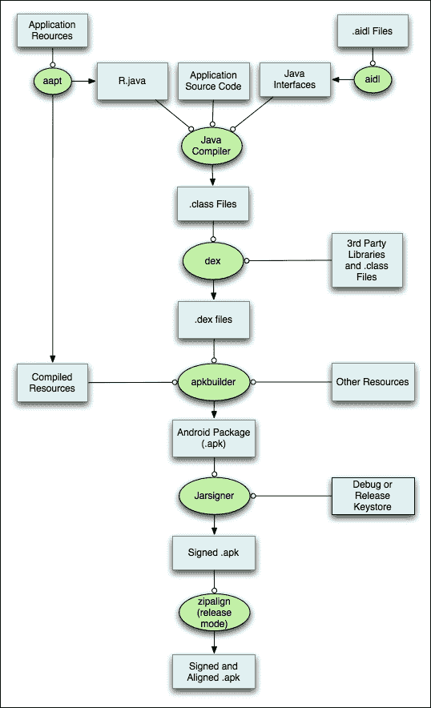
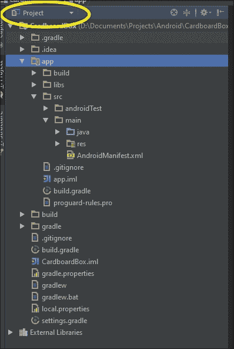
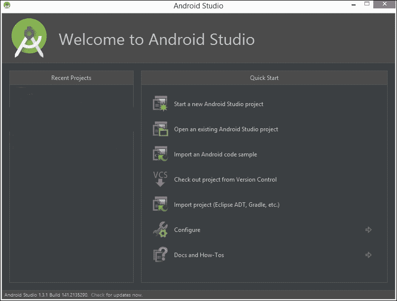
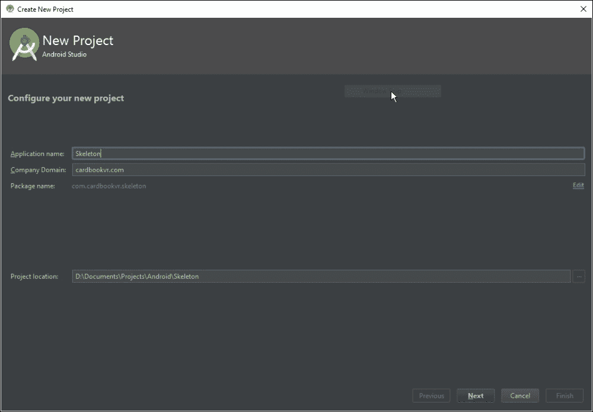
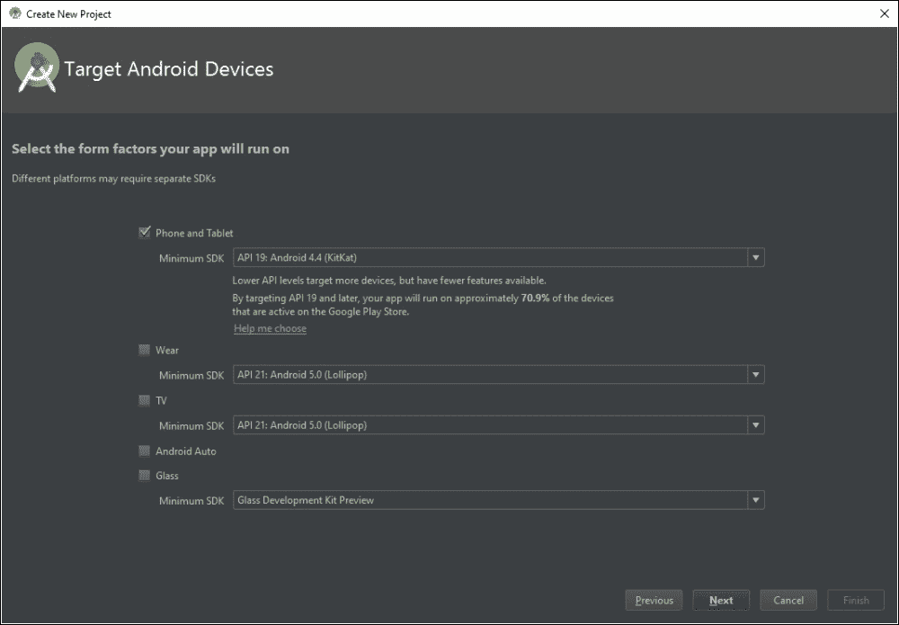
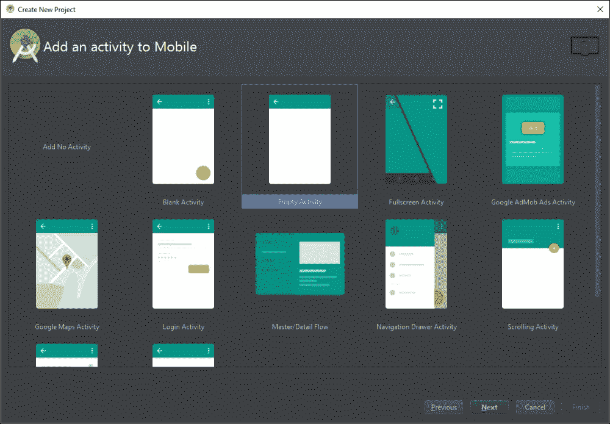
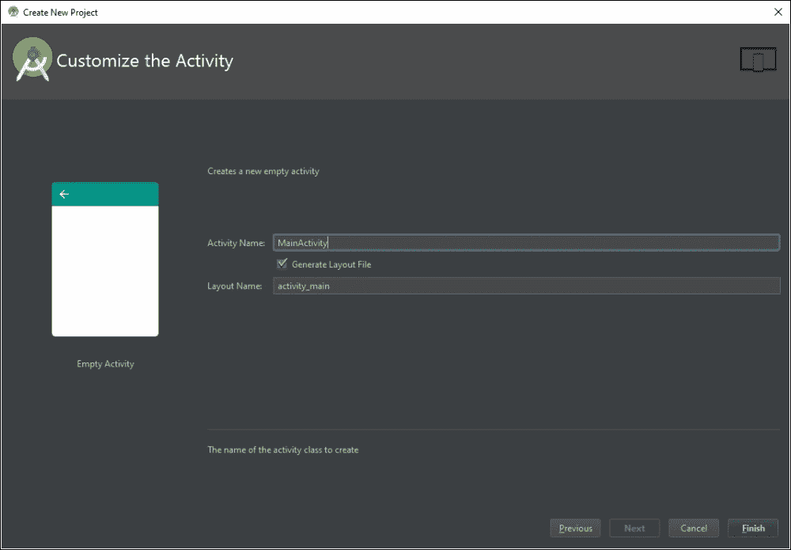
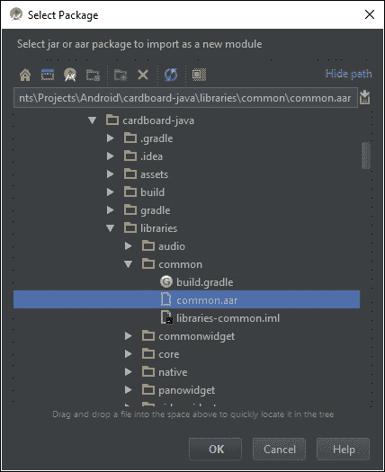
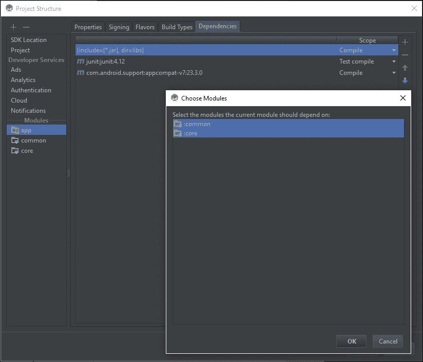
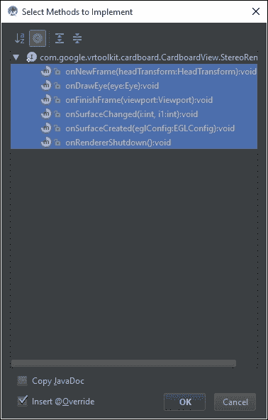

# 第二章。Cardboard 项目的骨架

在本章中，你将学习如何构建一个 Cardboard 项目的骨架，这可以成为本书中其他项目的起点。我们将首先介绍 Android Studio、Cardboard SDK 和 Java 编程。我们希望确保你对工具和 Android 项目有所了解。然后，我们将指导你设置一个新的 Cardboard 项目，这样我们就不需要在每个项目中重复这些细节。如果这些内容对你来说已经很熟悉了，太好了！你可能可以略过它。在本章中，我们将涵盖以下主题：

+   一个 Android 应用程序中有什么？

+   Android 项目结构

+   开始使用 Android Studio

+   创建一个新的 Cardboard 项目

+   添加 Cardboard Java SDK

+   编辑清单、布局和`MainActivity`

+   构建和运行应用程序

# 一个 Android 应用程序中有什么？

对于我们的项目，我们将使用强大的 Android Studio IDE（集成开发环境）来构建在 Android 设备上运行的 Google Cardboard 虚拟现实应用程序。*哇哦！* Android Studio 在一个平台下整合了许多不同的工具和流程。

开发 Android 应用程序的所有辛勤工作的结果是一个 Android 应用程序包或`.apk`文件，通过 Google Play 商店或其他方式分发给用户。这个文件会安装在他们的 Android 设备上。

我们马上就会跳到 Android Studio 本身。然而，为了阐明这里发生了什么，让我们先考虑这个最终结果`.apk`文件。它到底是什么？我们是如何得到它的？了解构建过程将有所帮助。

记住这一点，为了好玩和获得视角，让我们从最后开始，从 APK 文件通过构建管道到我们的应用源代码。

## APK 文件

APK 文件实际上是一堆不同文件的压缩包，包括编译后的 Java 代码和非编译资源，比如图片。

APK 文件是为特定的 Android *目标*版本构建的，但它也指示了一个*最低*版本。一般来说，为较旧版本的 Android 构建的应用程序将在更新的 Android 版本上运行，但反之则不然。然而，为较旧版本的 Android 构建意味着新功能将不可用于该应用程序。你需要选择支持你需要的功能的最低 Android 版本，以便能够针对尽可能多的设备。或者，如果出于性能原因，你想要支持较小的设备子集，你可能会选择一个人为设定的较高的最低 API 版本。

在 Android Studio 中构建项目并创建 APK 文件，你需要点击**Build 菜单**选项并选择**Make Project**（或者点击绿色箭头图标来构建、部署和在设备上或**Android 虚拟设备**（**AVD**）中运行应用程序），这将启动 Gradle 构建过程。你可以构建一个版本来开发和调试，或者构建一个更优化的发布版本的应用程序。你可以通过点击**Build**菜单并选择**Select Build Variant...**来选择这样做。

## Gradle 构建过程

Android Studio 使用一个名为**Gradle**的工具从项目文件中构建 APK 文件。以下是从 Android 文档中获取的 Gradle 构建过程的流程图（[`developer.android.com/sdk/installing/studio-build.html`](http://developer.android.com/sdk/installing/studio-build.html)）。实际上，大部分图示细节对我们来说并不重要。重要的是看到这么多部分以及它们如何组合在一起。



在前面图表的最底部方框中，您可以看到构建的结果是一个经过签名和对齐的`.apk`文件，这是我们应用程序的最终版本，已经从之前的构建过程中编译（从源代码转换）、压缩（压缩）和签名（用于认证）。最后一步，zipalign，将压缩资源沿着 4 字节边界对齐，以便在运行时快速访问它们。基本上，这最后一步使应用程序加载更快。

在图表的中间，您将看到`.apk`（未签名，未压缩）文件是由`.dex`文件、编译的 Java 类和其他资源（如图像和媒体文件）组装而成。

`.dex`文件是 Java 代码，已经编译成在您设备上的**Dalvik** **虚拟机**（**DVM**）上运行的格式（Dalvik 字节码）。这是您程序的可执行文件。您在模块构建中包含的任何第三方库和编译的 Java 源代码文件（`.class`）都会被转换为`.dex`文件，以便打包到最终的`.apk`文件中。

如果这对您来说是新的，不要太在意细节。重要的是，我们将在我们的 Google Cardboard 项目中使用许多不同的文件。了解它们在构建过程中的使用情况将对我们有所帮助。

例如，带有 Cardboard SDK 的`common.aar`文件（二进制 Android 库存档）是我们将使用的第三方库之一。您项目的`res/`目录的内容，例如`layout/activity_main.xml`，会通过**Android 资产打包工具**（aapt）进行处理。

## 一个 Java 编译器

`.dex`文件的输入是什么？Java 编译器将 Java 语言源代码生成包含字节码的`.dex`文件。通过参考前面的 Gradle 构建流程图，在图表的顶部，您将看到 Java 编译器的输入包括以下内容：

+   您应用程序的 Java 源代码

+   您应用程序的 XML 资源，例如使用**aapt**编译的`AndroidManifest.xml`文件，并用于生成`R.java`文件

+   您的应用程序的 Java 接口（**Android 接口定义语言**`.aidl`文件），使用**aidl**工具编译

在本书的其余部分，我们将大量讨论这些源代码文件。那就是你写的东西！那就是你施展魔法的地方！那就是我们程序员生活的世界。

现在让我们来看看你的 Android 项目源代码的目录结构。

# Android 项目结构

您的 Android 项目的根目录包含各种文件和子目录。或者，我应该说，您的 Android 项目的根文件夹包含各种文件和*子文件夹*。*哈哈*。在本书中，我们将在整个过程中交替使用“文件夹”和“目录”这两个词，就像 Android Studio 似乎也在做的一样（实际上，这是有区别的，如[`stackoverflow.com/questions/29454427/new-directory-vs-new-folder-in-android-studio`](http://stackoverflow.com/questions/29454427/new-directory-vs-new-folder-in-android-studio)中所讨论的那样）。

如 Android 层次结构所示，在以下示例 Cardboard 项目中，根目录包含一个`app/`子目录，该子目录又包含以下子目录：

+   `app/manifests/`：这包含了指定应用程序组件（包括活动（UI）、设备权限和其他配置）的`AndroidManifest.xml`清单文件

+   `app/java/`：这包含了实现应用程序`MainActivity`和其他类的应用程序 Java 文件的子文件夹

+   `app/res/`：这包含了包括布局 XML 定义文件、值定义（`strings.xml`、`styles.xml`等）、图标和其他资源文件在内的资源子文件夹！Android 项目结构

这些目录与前面 Gradle 构建过程图表最上面一行中的方框相对应并不是巧合；它们提供了要通过 Java 编译器运行的源文件。

此外，在根目录下有 Gradle 脚本，不需要直接编辑，因为 Android Studio IDE 提供了方便的对话框来管理设置。在某些情况下，直接修改这些文件可能更容易。

请注意层次结构窗格左上角有一个选项卡选择菜单。在前面的屏幕截图中，它设置为**Android**，只显示 Android 特定的文件。还有其他视图可能也很有用，比如**Project**，它列出了项目根目录下的所有文件和子目录，如下一个屏幕截图所示，用于同一个应用程序。**Project**层次结构显示文件的实际文件系统结构。其他层次结构会人为地重新构造项目，以便更容易处理。



### 提示

您可能需要在**Android**视图和**Project**视图之间切换。

# 开始使用 Android Studio

在为 Android 开发 Cardboard 应用程序时，有很多东西需要跟踪，包括所有文件和文件夹、Java 类和对象、函数和变量。您需要一个正确组织的 Java 程序结构和有效的语言语法。您需要设置选项并管理进程以构建和调试应用程序。*哇！*

谢天谢地，我们有 Android Studio，一个功能强大的**IDE**（**集成开发环境**）。它是基于 JetBrains 的 IntelliJ IDEA 构建的，后者是一套受欢迎的智能 Java 开发工具套件。

它是智能的，因为它在您编写代码时实际上会给出相关的建议（*Ctrl* + *Space*），帮助在相关引用和文件之间导航（*Ctrl* + *B*，*Alt* + *F7*），并自动执行重构操作，比如重命名类或方法（*Alt* + *Enter*）。在某些方面，它可能知道您正在尝试做什么，即使您自己不知道。*多么聪明啊！*

## 安装 Android Studio

如果您的开发机器上尚未安装 Android Studio，您还在等什么？前往 Android 开发者页面（[`developer.android.com/develop/index.html`](http://developer.android.com/develop/index.html)）并将其下载到您的系统。它适用于 Windows、Mac OS X 或 Linux。您可以安装完整的 Android Studio 软件包，而不仅仅是 SDK 工具。然后，遵循安装说明。

## Android Studio 用户界面

Android Studio 有很多功能。在大多数情况下，我们将在实例的帮助下进行解释。但让我们花点时间来回顾一些功能，特别是与 Cardboard 开发相关的功能。只要确保在需要时阅读 Android 开发工具页面上提供的文档（[`developer.android.com/tools/studio/index.html`](http://developer.android.com/tools/studio/index.html)）。

对于初学者来说，Android Studio 的用户界面可能看起来令人生畏。而默认界面只是开始；编辑器主题和布局可以根据您的喜好进行自定义。更糟糕的是，随着新版本的发布，界面往往会发生变化，因此教程可能会显得过时。虽然这可能会使您在特定场合难以找到所需的内容，但基本功能并没有发生太大变化。在大多数情况下，Android 应用程序就是 Android 应用程序。我们在本书中使用的是 Windows 版的 Android Studio 2.1（尽管一些屏幕截图来自早期版本，但界面基本相同）。

### 注意

在使用 Android Studio 时，您可能会收到新的更新通知。我们建议您不要在项目进行中升级，除非您确实需要新的改进。即便如此，确保您有备份以防兼容性问题。

让我们简要地浏览一下 Android Studio 窗口，如下图所示：


Android Studio 的菜单有：

+   顶部是主菜单栏（**＃1**），其中包含下拉菜单和拉出菜单，几乎包括所有可用功能。

+   在菜单栏下方是一个方便的主工具栏（**＃2**），其中包含常用功能的快捷方式。将鼠标悬停在图标上会显示工具提示，说明其功能。

+   工具栏下方是主编辑窗格（**＃3**）。当没有文件打开时，它会显示**没有打开的文件**。当打开多个文件时，主编辑窗格在顶部有选项卡。

+   层次结构导航器窗格位于左侧（**＃4**）。

+   层次结构导航器窗格在左侧有选项卡（垂直选项卡，**＃5**），用于在项目的各种视图之间进行选择。

### 注意

请注意层次结构窗格左上角的选择菜单。在前面的截图中，它设置为**Android**，只显示特定于 Android 的文件。还有其他视图可能也很有用，比如**项目**，它显示项目根目录下的所有文件和子目录，就像前面提到的那样。

+   底部是另一个工具栏（**＃6**），用于选择您可能需要的其他动态工具，包括终端窗口、构建消息、调试信息，甚至待办事项列表。也许最重要的是 Android Monitor 的**logcat**选项卡，它提供了一个窗口，用于收集和查看系统调试输出的 Android 日志系统。

### 注意

对于您来说，注意**可调试应用程序**下拉菜单、**日志级别**和**logcat**中的其他过滤器将是有帮助的，以便过滤掉会使您难以找到所需输出的“日志垃圾”。另外，请注意，即使在高端计算机上使用快速 CPU，这个日志视图也会使 Android Studio 变得非常缓慢。建议您在不使用时隐藏此视图，特别是如果您打开了多个 Android Studio 实例。

+   每个窗格的角落中的控件通常用于管理 IDE 窗格本身。

浏览一下 Android Studio 提供的各种不同功能会很有趣。要了解更多，请单击**帮助** | **帮助主题**菜单项（或工具栏上的**?**图标）以打开 IntelliJ IDEA 帮助文档（[`www.jetbrains.com/idea/help/intellij-idea.html`](https://www.jetbrains.com/idea/help/intellij-idea.html)）。

请记住，Android Studio 是建立在 IntelliJ IDE 之上的，它不仅可以用于 Android 开发。因此，这里有很多功能；有些您可能永远不会使用；其他一些您可能需要，但可能需要搜索。

### 提示

这里有一个建议：伴随着强大的力量而来的是巨大的责任（我以前在哪里听过这句话？）。实际上，对于如此多的用户界面功能，一点点的专注会很有用（是的，我刚刚编造了这句话）。当您需要使用时，专注于您需要使用的功能，不要为其他细节而烦恼。

在我们继续之前，让我们来看一下主菜单栏。它看起来像下面的截图：


从左到右阅读，菜单项的组织方式与应用程序开发过程本身有些类似：创建、编辑、重构、构建、调试和管理。

+   **文件**：这些是项目文件和设置

+   **编辑**：这包括剪切、复制、粘贴和宏选项等

+   **视图**：这允许我们查看窗口、工具栏和 UI 模式

+   **导航**：这指的是基于内容的文件之间的导航

+   **代码**：这些是代码编辑的快捷方式

+   **分析**：这用于检查和分析代码中的错误和低效。

+   **重构**：用于跨语义相关文件编辑代码

+   **构建**：构建项目

+   **运行**：用于运行和调试

+   **工具**：这是与外部和第三方工具进行交互的界面。

+   **VCS**：指的是版本控制（即`git`）命令

+   **窗口**：管理 IDE 用户界面

+   **帮助**：包括文档和帮助链接

现在，是不是很可怕？

如果您还没有这样做，您可能希望尝试构建来自 Google Developers 网站 Android SDK 入门页面的 Cardboard Android 演示应用程序（参考[`developers.google.com/cardboard/android/get-started`](https://developers.google.com/cardboard/android/get-started)）。

在撰写本书时，演示应用程序称为**寻宝**，并且有关如何从其 GitHub 存储库克隆项目的说明。只需克隆它，打开 Android Studio，然后点击绿色播放按钮进行构建和运行。**入门**页面的其余部分将引导您了解解释关键元素的代码。

太酷了！在下一章中，我们将从头开始并重建几乎相同的项目。

# 创建一个新的 Cardboard 项目

安装了 Android Studio 后，让我们创建一个新项目。这是本书中任何项目都会遵循的步骤。我们只需创建一个空的框架，并确保它可以构建和运行：

1.  打开 IDE 后，您将看到一个**欢迎**屏幕，如下图所示：

1.  选择**开始一个新的 Android Studio 项目**，然后会出现**新项目**屏幕，如下所示：

1.  填写您的**应用程序名称**，例如`Skeleton`，和您的**公司域**，例如`cardbookvr.com`。您还可以更改**项目位置**。然后，点击“下一步”：

1.  在“目标 Android 设备”屏幕上，确保“手机和平板电脑”复选框已选中。在“最低 SDK”中，选择“API 19：Android 4.4（KitKat）”。然后，点击“下一步”：

1.  在“为移动添加活动”屏幕上，选择“空活动”。我们将从头开始构建这个项目。然后，点击“下一步”：

1.  保留建议的名称`MainActivity`。然后，点击“完成”。

您全新的项目将在 Studio 上显示。如果需要，按*Alt* + *1*打开**项目视图**（Mac 上为*Command* + *1*）。

# 添加 Cardboard Java SDK

现在是将 Cardboard SDK 库`.aar`文件添加到您的项目中的好时机。在本书的基本项目中，您需要的库（撰写时为 v0.7）是：

+   `common.aar`

+   `core.aar`

### 注意

请注意，SDK 包括我们在本书中未使用但对您的项目可能有用的其他库。`audio.aar`文件用于支持空间音频。`panowidget`和`videowidget`库用于希望进入 VR 的 2D 应用程序，例如查看 360 度图像或视频。

在撰写本文时，要获取 Cardboard Android SDK 客户端库，您可以克隆`cardboard-java` GitHub 存储库，如 Google Developers Cardboard 入门页面上所述的那样，[`developers.google.com/cardboard/android/get-started#start_your_own_project`](https://developers.google.com/cardboard/android/get-started#start_your_own_project)上的**开始您自己的项目**主题。通过运行以下命令克隆`cardboard-java` GitHub 存储库：

```kt
git clone https://github.com/googlesamples/cardboard-java.git

```

要使用与此处使用的相同 SDK 版本 0.7 的确切提交，`checkout`提交：

```kt
git checkout 67051a25dcabbd7661422a59224ce6c414affdbc -b sdk07

```

或者，SDK 0.7 库文件包含在 Packt Publishing 的每个下载项目的`.zip`文件中，并且在本书的 GitHub 项目中[`github.com/cardbookvr`](https://github.com/cardbookvr)。

一旦您在本地拥有库的副本，请确保在文件系统中找到它们。要将库添加到我们的项目中，请执行以下步骤：

1.  对于所需的每个库，创建新模块。在 Android Studio 中，选择**文件**|**新建**|**新模块...**。选择**导入.JAR/.AAR 包**：

1.  找到其中一个 AAR 并导入它。

1.  通过导航到**文件**|**项目****结构**|**模块**（在左侧）|**应用程序**（您的应用程序名称）|**依赖项**|**+**|**模块依赖项**，将新模块作为主应用程序的依赖项添加进去：

现在我们可以在我们的应用程序中使用 Cardboard SDK。

# AndroidManifest.xml 文件

新的空应用程序包括一些默认文件，包括`manifests/AndroidManifest.xml`文件（如果您已激活**Android**视图。在**Project**视图中，它在`app/src/main`）。每个应用程序必须在其清单目录中有一个`AndroidManifest.xml`文件，告诉 Android 系统运行应用程序代码所需的内容，以及其他元数据。

### 注意

有关此信息的更多信息，请访问[`developer.android.com/guide/topics/manifest/manifest-intro.html`](http://developer.android.com/guide/topics/manifest/manifest-intro.html)。

让我们首先设置这个。在编辑器中打开您的`AndroidManifest.xml`文件。修改它以读取如下内容：

```kt
<?xml version="1.0" encoding="utf-8"?>
<manifest 
    package="com.cardbookvr.skeleton" >

   <uses-permission android:name="android.permission.NFC" />
   <uses-permission android:name="android.permission.INTERNET" />
    <uses-permission android:name="android.permission.READ_EXTERNAL_STORAGE" />
	<uses-permission android:name="android.permission.WRITE_EXTERNAL_STORAGE" />
    <uses-permission android:name="android.permission.VIBRATE" />

    <uses-sdk android:minSdkVersion="16" 
    android:targetSdkVersion="19"/>
    <uses-feature android:glEsVersion="0x00020000" android:required="true" />
    <uses-feature android:name="android.hardware.sensor.accelerometer" android:required="true"/>
    <uses-feature android:name="android.hardware.sensor.gyroscope" android:required="true"/>

    <application
        android:allowBackup="true"
        android:icon="@mipmap/ic_launcher"
        android:label="@string/app_name"
        android:theme="@style/AppTheme" >
        <activity
            android:name=".MainActivity"

            android:screenOrientation="landscape"
            android:configChanges="orientation|keyboardHidden|screenSize" >

            <intent-filter>
                <action android:name="android.intent.action.MAIN" />
                <category android:name="android.intent.category.LAUNCHER" />
                <category android:name="com.google.intent.category.CARDBOARD" />
            </intent-filter>
        </activity>
    </application>

</manifest>
```

在前面的清单中显示的软件包名称`package="com.cardbookvr.skeleton"`可能与您的项目不同。`<uses-permission>`标签表示项目可能正在使用 NFC 传感器，Cardboard SDK 可以使用该传感器来检测已插入 Cardboard 查看器设备的智能手机。互联网和读/写存储权限是 SDK 下载、读取和写入配置设置选项所需的。我们需要做更多工作来正确处理权限，但这将在另一个文件中进行讨论。

`<uses-feature>`标签指定我们将使用 OpenGL ES 2.0 图形处理库（[`developer.android.com/guide/topics/graphics/opengl.html`](http://developer.android.com/guide/topics/graphics/opengl.html)）。

还强烈建议包括加速计和陀螺仪传感器`uses-feature`标签。太多用户的手机缺少这两个传感器中的一个或两个。当应用程序无法正确跟踪他们的头部运动时，他们可能会认为是应用程序的问题而不是他们的手机的问题。在`<application>`标签（在创建文件时生成的默认属性）中，有一个名为`.MainActivity`的`<activity>`定义和屏幕设置。在这里，我们将`android:screenOrientation`属性指定为我们的 Cardboard 应用程序使用正常（左）横向方向。我们还指定`android:configChanges`，表示活动将自行处理。

这些和其他属性设置可能会根据您的应用程序要求而变化。例如，使用`android:screenOrientation="sensorLandscape"`将允许基于手机传感器的正常或反向横向方向（并在屏幕翻转时触发`onSurfaceChanged`回调）。

我们在`<intent-filter>`标签中指定了我们的*intent*元数据。在 Android 中，**intent**是一种消息对象，用于促进应用程序组件之间的通信。它还可以用于查询已安装的应用程序并匹配某些意图过滤器，如在应用程序清单文件中定义的那样。例如，想要拍照的应用程序将广播一个带有`ACTION_IMAGE_CAPTURE`动作过滤器的意图。操作系统将响应一个包含可以响应此类动作的活动的已安装应用程序列表。

定义了`MainActivity`类之后，我们将指定它可以响应标准的`MAIN`动作并匹配`LAUNCHER`类别。`MAIN`表示此活动是应用程序的入口点；也就是说，当您启动应用程序时，将创建此活动。`LAUNCHER`表示应用程序应该出现在主屏幕的启动器中，作为顶级应用程序。

我们添加了一个意图，以便此活动也匹配`CARDBOARD`类别，因为我们希望其他应用程序将其视为 Cardboard 应用程序！

Google 在 Android 6.0 Marshmallow（API 23）中对权限系统进行了重大更改。虽然您仍然必须在`AndroidManifest.xml`文件中包含您想要的权限，但现在您还必须调用一个特殊的 API 函数来在运行时请求权限。这样做有很多原因，但其想法是给用户更精细的控制应用程序权限，并避免在安装和运行时请求长列表的权限。这一新功能还允许用户在授予权限后有选择地撤销权限。这对用户来说很好，但对我们应用程序开发人员来说很不幸，因为这意味着当我们需要访问这些受保护的功能时，我们需要做更多的工作。基本上，您需要引入一个步骤来检查特定权限是否已被授予，并在没有授予时提示用户。一旦用户授予权限，将调用回调方法，然后您可以自由地执行需要权限的任何操作。或者，如果权限一直被授予，您可以继续使用受限功能。

在撰写本文时，我们的项目代码和当前版本的 Cardboard SDK 尚未实现这个新的权限系统。相反，我们将强制 Android Studio 针对较旧版本的 SDK（API 22）构建我们的项目，以便我们绕过新功能。未来，Android 可能会破坏与旧权限系统的向后兼容性。但是，您可以在 Android 文档中阅读有关如何使用新权限系统的非常清晰的指南（参见[`developer.android.com/training/permissions/requesting.html`](http://developer.android.com/training/permissions/requesting.html)）。我们希望在在线 GitHub 存储库中解决这个问题和任何未来问题，但请记住，文本中的代码和提供的 zip 文件可能无法在最新版本的 Android 上运行。这就是软件维护的性质。

让我们将这个解决方法应用到针对 SDK 版本 22 的构建中。很可能您刚刚安装了 Android Studio 2.1 或更高版本，其中包含 SDK 23 或更高版本。每当您创建一个新项目时，Android Studio 确实会询问您想要针对哪个最低 SDK 版本，但不会让您选择用于编译的 SDK。这没关系，因为我们可以在`build.gradle`文件中手动设置这一点。不要害怕；构建工具集很庞大且复杂，但我们只是稍微调整了项目设置。请记住，您的项目中有几个`build.gradle`文件。每个文件都将位于文件系统中相应的模块文件夹中，并且将在项目视图的 Gradle 脚本部分中相应地标记。我们要修改`app`模块的`build.gradle`。将其修改为如下所示：

```kt
apply plugin: 'com.android.application'

android {
    compileSdkVersion 22
    ...

    defaultConfig {
        minSdkVersion 19
        targetSdkVersion 22
        ...
    }
    ...
}

dependencies {
    compile 'com.android.support:appcompat-v7:22.1.0'
    ...
}
```

重要的更改是 compileSdkVersion、minSdkVersion、targetSdkVersion 以及依赖项中的最后一个，在那里我们更改了我们链接到的支持存储库的版本。从技术上讲，我们可以完全消除这种依赖关系，但项目模板包括了一堆对它的引用，这些引用很难删除。然而，如果我们保留默认设置，Gradle 很可能会因为版本不匹配而向我们抱怨。一旦您进行了这些更改，编辑器顶部应该会出现一个黄色的条，上面有一个写着**立即同步**的链接。立即同步。如果幸运的话，Gradle 同步将成功完成，您就可以继续愉快地进行下去了。如果不幸的话，您可能会缺少 SDK 平台或其他依赖项。**消息**窗口应该有可点击的链接，可以适当地安装和更新 Android 系统。如果遇到错误，请尝试重新启动 Android Studio。

从这一点开始，您可能希望避免更新 Android Studio 或您的 SDK 平台版本。特别注意当您在另一台计算机上导入项目或在更新 Android Studio 后发生的情况。您可能需要让 IDE 操作您的 Gradle 文件，并且它可能会修改您的编译版本。这个权限问题很隐蔽，它只会在运行时在运行 6.0 及以上版本的手机上显露出来。您的应用程序可能在运行旧版本的 Android 的设备上看起来运行良好，但实际上在新设备上可能会遇到麻烦。

# activity_main.xml 文件

我们的应用程序需要一个布局，我们将在其中定义一个画布来绘制我们的图形。Android Studio 创建的新项目在`app/res/layout/`文件夹中创建了一个默认的布局文件（使用 Android 视图或`app/src/main/res/layout`使用**项目**视图）。找到`activity_main.xml`文件并双击打开进行编辑。

在 Android Studio 编辑器中，布局文件有两种视图：**设计**和**文本**，通过窗格左下角的选项卡进行选择。如果选择了**设计**视图选项卡，您将看到一个交互式编辑器，其中包括一个模拟的智能手机图像，左侧是 UI 组件的调色板，右侧是**属性**编辑器。我们不会使用这个视图。如果需要，选择`activity_main.xml`编辑窗格底部的**文本**选项卡以使用文本模式。

Cardboard 应用程序应该在全屏上运行，因此我们会删除任何填充。我们还将删除默认的我们不打算使用的`TextView`。而是用`CardboardView`来替换它，如下所示：

```kt
<?xml version="1.0" encoding="utf-8"?>
<RelativeLayout 

    android:layout_width="match_parent"
    android:layout_height="match_parent"
    tools:context=".MainActivity">

    <com.google.vrtoolkit.cardboard.CardboardView
        android:id="@+id/cardboard_view"
        android:layout_width="fill_parent"
        android:layout_height="fill_parent"
        android:layout_alignParentTop="true"
        android:layout_alignParentLeft="true" />

</RelativeLayout>
```

`AndroidManifest.xml`文件引用了名为`MainActivity`的主要活动。现在让我们来看看。

# MainActivity 类

使用`Empty Activity`生成的默认项目还创建了一个默认的`MainActivity.java`文件。在层次结构窗格中，找到包含名为`com.cardbookvr.skeleton`的子目录的`app/java/`目录。

### 注意

请注意，这与`androidTest`版本的目录不同，我们不使用那个！（根据您创建项目时给定的实际项目和域名，您的名称可能会有所不同。）

在这个文件夹中，双击`MainActivity.java`文件以进行编辑。默认文件如下所示：

```kt
package com.cardbookvr.skeleton;

import ...

public class MainActivity extends AppCompatActivity {

    @Override
    protected void onCreate(Bundle savedInstanceState) {
        super.onCreate(savedInstanceState);
        setContentView(R.layout.activity_main);
    }
}
```

您应该注意到的第一件事是扩展`AppCompatActivity`类（或`ActionBarActivity`）以使用内置的 Android 操作栏。我们不需要这个。我们将把活动定义为扩展`CardboardActivity`并实现`CardboardView.StereoRenderer`接口。修改代码中的类声明行，如下所示：

```kt
public class MainActivity extends CardboardActivity implements CardboardView.StereoRenderer {
```

由于这是一个 Google Cardboard 应用程序，我们需要将`MainActivity`类定义为 SDK 提供的`CardboardActivity`类的子类。我们使用`extends`关键字来实现这一点。

`MainActivity`还需要实现至少一个被定义为`CardboardView.StereoRender`的立体渲染器接口。我们使用`implements`关键字来实现这一点。

Android Studio 的一个好处是在编写代码时为你自动完成工作。当你输入`extends CardboardActivity`时，IDE 会自动在文件顶部添加`CardboardActivity`类的`import`语句。当你输入`implements CardboardView.StereoRenderer`时，它会添加一个`import`语句到`CardboardView`类。

随着我们继续添加代码，Android Studio 将识别出我们需要额外的导入语句，并自动为我们添加它们。因此，我不会在接下来的代码中显示`import`语句。偶尔它可能会找到错误的引用，例如，在你的库中有多个`Camera`或`Matrix`类时，你需要将其解析为正确的引用。

现在我们将用一些函数存根填充`MainActivity`类的主体，这些函数是我们将需要的。我们使用的`CardboardView.StereoRenderer`接口定义了许多抽象方法，我们可以重写这些方法，如 Android API 参考中对该接口的文档所述（参见[`developers.google.com/cardboard/android/latest/reference/com/google/vrtoolkit/cardboard/CardboardView.StereoRenderer`](https://developers.google.com/cardboard/android/latest/reference/com/google/vrtoolkit/cardboard/CardboardView.StereoRenderer)）。

在 Studio 中可以通过多种方式快速完成。可以使用智能感知上下文菜单（灯泡图标）或转到**代码** | **实现方法…**（或*Ctrl* + *I*）。将光标放在红色错误下划线处，按*Alt* + *Enter*，你也可以达到同样的目标。现在就做吧。系统会要求你确认要实现的方法，如下面的截图所示：



确保所有都被选中，然后点击**确定**。

以下方法的存根将被添加到`MainActivity`类中：

+   `onSurfaceCreated`：在表面被创建或重新创建时调用此方法。它应该创建需要显示图形的缓冲区和变量。

+   `onNewFrame`：在准备绘制新帧时调用此方法。它应该更新从一个帧到下一个帧变化的应用程序数据，比如动画。

+   `onDrawEye`：为当前相机视点渲染一个眼睛的场景（每帧调用两次，除非你有三只眼睛！）。

+   `onFinishFrame`：在帧完成之前调用此方法。

+   `onRenderShutdown`：当渲染器线程关闭时调用此方法（很少使用）。

+   `onSurfaceChanged`：当表面尺寸发生变化时（例如检测到纵向/横向旋转）调用此方法。

我按照 Cardboard Android 应用程序的生命周期顺序列出了这些方法。

`@Override`指令表示这些函数最初是在`CardboardView.StereoRenderer`接口中定义的，我们在这里的`MainActivity`类中替换（覆盖）它们。

## 默认的`onCreate`

所有 Android 活动都公开一个`onCreate()`方法，在活动第一次创建时调用。这是你应该做所有正常的静态设置和绑定的地方。立体渲染器接口和 Cardboard 活动类是 Cardboard SDK 的基础。

默认的`onCreate`方法对父活动进行了标准的`onCreate`调用。然后，它将`activity_main`布局注册为当前内容视图。

通过添加`CardboadView`实例来编辑`onCreate()`，如下所示：

```kt
    @Override
    protected void onCreate(Bundle savedInstanceState) {
        super.onCreate(savedInstanceState);
        setContentView(R.layout.activity_main);

        CardboardView cardboardView = (CardboardView) findViewById(R.id.cardboard_view);
        cardboardView.setRenderer(this);
        setCardboardView(cardboardView);
    }
```

为了设置应用程序的`CardboardView`实例，我们通过在`activity_main.xml`中给定的资源 ID 查找其实例，然后使用一些函数调用设置它。

这个对象将对显示进行立体渲染，所以我们调用`setRenderer(this)`来指定它作为`StereoRenderer`接口方法的接收者。

### 注意

请注意，您的活动不必实现该接口。您可以让任何类定义这些方法，比如我们将在本书后面看到的抽象渲染器。

然后我们通过调用`setCardboardView(cardboardView)`将`CardboardView`类与这个活动关联起来，这样我们就能接收到任何必需的生命周期通知，包括`StereoRenderer`接口方法，比如`onSurfaceCreated`和`onDrawEye`。

## 构建和运行

让我们构建并运行它：

1.  转到**Run** | **Run 'app'**，或者简单地使用工具栏上的绿色三角形**Run**图标。

1.  如果您进行了更改，Gradle 将进行构建。

1.  选择 Android Studio 窗口底部的**Gradle Console**选项卡以查看 Gradle 构建消息。然后，假设一切顺利，APK 将安装在您连接的手机上（连接并打开了吗？）。

1.  选择底部的**Run**选项卡以查看上传和启动消息。

您不应该收到任何构建错误。但当然，该应用实际上并没有做任何事情或在屏幕上绘制任何东西。嗯，这并不完全正确！通过`CardboardView.StereoRenderer`，Cardboard SDK 提供了一个带有垂直线和齿轮图标的立体分屏，如下截图所示：


垂直线将用于在 Cardboard 查看器设备上正确放置您的手机。

齿轮图标打开标准配置设置实用程序，其中包括扫描 QR 码以配置 SDK 以适应镜片和您特定设备的其他物理属性的功能（如第一章中所解释的，“每个人的虚拟现实”，在“配置 Cardboard 查看器”部分）。

现在，我们已经为 Android 构建了一个 Google Cardboard 应用的框架。您将遵循类似的步骤来启动本书中的每个项目。

# 摘要

在本章中，我们研究了 Android 上 Cardboard 应用的结构以及涉及的许多文件，包括 Java 源代码、XML 清单、`.aar`库和最终构建的 APK，该 APK 在您的 Android 设备上运行。我们安装并简要介绍了 Android Studio 开发环境。然后，我们将引导您完成创建新的 Android 项目、添加 Cardboard Java SDK 以及定义`AndroidManifest.xml`文件和布局，以及一个存根的`MainActivity` Java 类文件的步骤。在本书中，您将遵循类似的步骤来启动每个 Cardboard 项目。

在下一章中，我们将从头开始构建一个名为`CardboardBox`的 Google Cardboard 项目，其中包含一些简单几何图形（三角形和立方体）、3D 变换和渲染图形到您的 Cardboard 设备的着色器。
