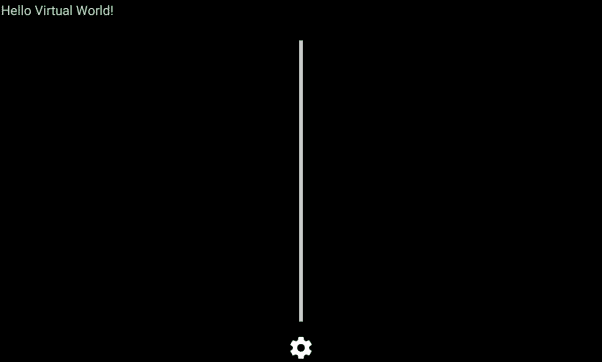
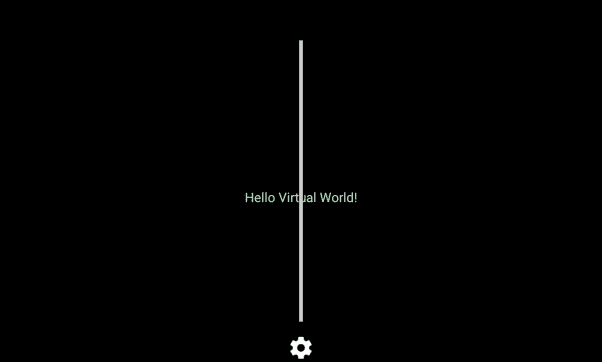
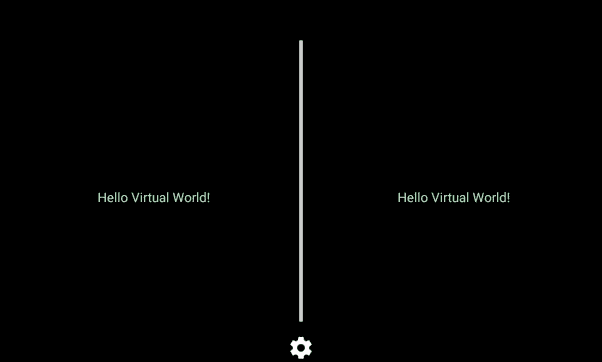
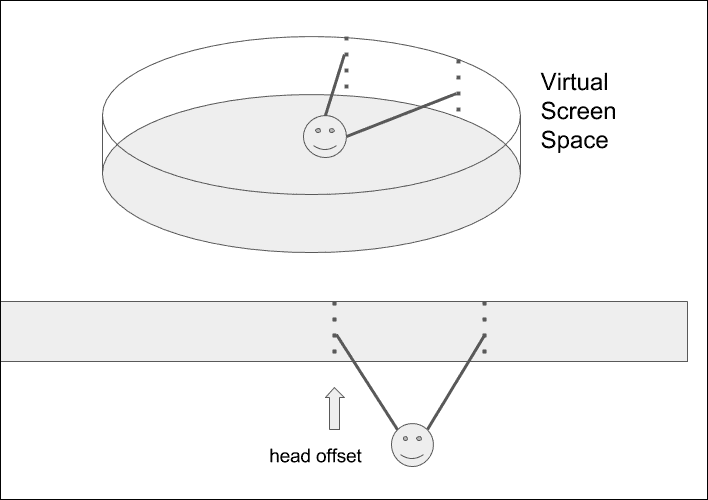
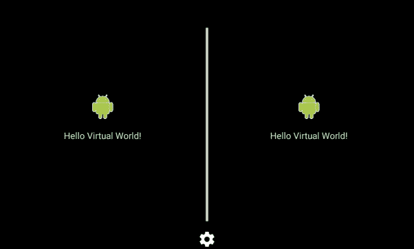

# 第四章：启动器大堂

该项目创建了一个硬纸板 VR 应用程序，可用于启动设备上安装的其他硬纸板应用程序。我们将其称为**LauncherLobby**。当您打开 LauncherLobby 时，您将看到最多 24 个图标水平排列。当您向右或向左转动头部时，图标会滚动，就好像它们在圆柱体内部一样。您可以通过凝视其图标并拉动硬纸板触发器来打开应用程序。

对于这个项目，我们采用了一种最小化的方法来创建立体视图。该项目使用标准的 Android ViewGroup 布局来模拟视差，并简单地将图像在每只眼睛中向左或向右移动，从而产生视差视觉效果。我们不使用 3D 图形。我们不直接使用 OpenGL，尽管大多数现代版本的 Android 都使用 OpenGL 来渲染视图。事实上，我们几乎完全不使用硬纸板 SDK；我们只使用它来绘制分屏叠加层并获取头部方向。然而，视图布局和图像移动逻辑是从 Google 的 Treasure Hunt 示例中派生的（在那里用于绘制文本叠加）。

这种方法的优点是多方面的。它说明了即使没有高级图形、矩阵数学、渲染引擎和物理学，也可以构建硬纸板应用程序。当然，这些通常是必需的，但在这种情况下，它们不是。如果您有 Android 开发经验，这里使用的类和模式可能会特别熟悉。这个项目演示了硬纸板 VR，至少只需要一个硬纸板 SDK 头部变换和一个分屏布局，就可以生成一个立体应用程序。

实际上，我们选择了这种方法，以便我们可以使用 Android 的 TextView。在 3D 中渲染任意文本实际上相当复杂（尽管肯定是可能的），因此为了简单起见，我们将此项目限制为 2D 视图和 Android 布局。

要构建项目，我们首先将带您了解一些基础知识，将文本字符串和图标图像放在屏幕上，并以立体方式查看它们。然后，我们将设计一个虚拟屏幕，它的工作原理就像展开的圆柱体内部。水平转动头部就像在这个虚拟屏幕上进行平移。屏幕将被分成插槽，每个插槽包含一个硬纸板应用程序的图标和名称。凝视并点击其中一个插槽将启动相应的应用程序。如果您曾经使用过硬纸板示例应用程序（在撰写时如此称呼），这个界面将很熟悉。

在本章中，我们将涵盖以下主题：

+   创建一个新的硬纸板项目

+   添加一个*Hello Virtual World*文本叠加

+   使用虚拟屏幕空间

+   响应头部查看

+   向视图添加图标

+   列出已安装的硬纸板应用程序

+   突出显示当前应用程序快捷方式

+   使用触发器选择并启动应用程序

此项目的源代码可以在 Packt Publishing 网站和 GitHub 上找到，网址为[`github.com/cardbookvr/launcherlobby`](https://github.com/cardbookvr/launcherlobby)（每个主题作为单独的提交）。

# 创建一个新项目

如果您想了解更多细节并解释这些步骤，请参考第二章中的*创建新的硬纸板项目*部分，*骨架硬纸板项目*，并在那里跟随：

1.  打开 Android Studio，创建一个新项目。让我们将其命名为`LauncherLobby`，并以**Android 4.4 KitKat (API 19)**为目标，使用**空活动**。

1.  将硬纸板 SDK 的`common.aar`和`core.aar`库文件作为新模块添加到您的项目中，使用**文件** | **新建** | **新建模块...**。

1.  将库模块设置为项目应用程序的依赖项，使用**文件** | **项目结构**。

1.  编辑`AndroidManifest.xml`文件，如第二章中所述，*骨架硬纸板项目*，要小心保留此项目的`package`名称。

1.  编辑`build.gradle`文件，如第二章中所述，*骨架 Cardboard 项目*，以编译 SDK 22。

1.  编辑`activity_main.xml`布局文件，如第二章中所述，*骨架 Cardboard 项目*。

1.  编辑`MainActivity` Java 类，使其扩展`CardboardActivity`并实现`CardboardView.StereoRenderer`。修改类声明行如下：

```kt
public class MainActivity extends CardboardActivity implements CardboardView.StereoRenderer {
```

1.  为接口添加存根方法覆盖（使用智能感知**实现方法**或按下*Ctrl* + *I*）。

1.  最后，通过添加以下内容来编辑`onCreate()`中的`CardboadView`实例：

```kt
    @Override
    protected void onCreate(Bundle savedInstanceState) {
        super.onCreate(savedInstanceState);
        setContentView(R.layout.activity_main);

        CardboardView cardboardView = (CardboardView) findViewById(R.id.cardboard_view);
        cardboardView.setRenderer(this);
        setCardboardView(cardboardView);  
    }
```

# 添加 Hello Virtual World 文本覆盖

首先，我们只是在屏幕上放一些文本，您可能会用它作为对用户的提示消息，或者用它来显示有信息内容的**抬头显示**（**HUD**）。我们将逐步以小步骤实现这个：

1.  创建一个带有一些文本的简单覆盖视图。

1.  将其居中显示在屏幕上。

1.  为立体观看添加视差。

## 一个简单的文本覆盖

首先，我们将以简单的方式添加一些覆盖文本，而不是立体地显示在屏幕上。这将是我们对`OverlayView`类的初始实现。

打开`activity_main.xml`文件，并添加以下行以将`OverlayView`添加到您的布局中：

```kt
<.OverlayView
   android:id="@+id/overlay"
   android:layout_width="fill_parent"
   android:layout_height="fill_parent"
   android:layout_alignParentLeft="true"
   android:layout_alignParentTop="true" />
```

请注意，我们只用`.OverlayView`引用了`OverlayView`类。如果您的视图类与`MainActivity`类在同一个包中，您可以这样做。我们之前对`.MainActivity`也是这样做的。

接下来，我们编写 Java 类。右键单击`app/java`文件夹（`app/src/main/java/com.cardbookvr.launcherlobby/`），然后导航到**新建** | **Java 类**。命名为`OverlayView`。

定义类，使其扩展`LinearLayout`，并添加一个构造方法，如下：

```kt
public class OverlayView extends LinearLayout{

    public OverlayView(Context context, AttributeSet attrs) {
        super(context, attrs);

        TextView textView = new TextView(context, attrs);
        addView(textView);

        textView.setTextColor(Color.rgb(150, 255, 180));
        textView.setText("Hello Virtual World!");
        setVisibility(View.VISIBLE);
    }
}
```

`OverlayView()`构造方法创建了一个新的`TextView`实例，颜色是宜人的绿色，文本是**Hello Virtual World!**。

运行应用程序，您会注意到我们的文本显示在屏幕左上角，如下面的屏幕截图所示：



## 使用子视图将文本居中

接下来，我们创建一个单独的视图组，并使用它来控制文本对象。具体来说，是将其居中在视图中。

在`OverlayView`构造函数中，用一个名为`EyeView`的不同`ViewGroup`助手类的实例替换`TextView`。目前，它是单眼的，但很快我们将使用这个类来创建两个视图：每个眼睛一个：

```kt
    public OverlayView(Context context, AttributeSet attrs) {
        super(context, attrs);

        LayoutParams params = new LayoutParams(
            LayoutParams.MATCH_PARENT, LayoutParams.MATCH_PARENT, 1.0f);
        params.setMargins(0, 0, 0, 0);

        OverlayEye eye = new OverlayEye(context, attrs);
        eye.setLayoutParams(params);
        addView(eye);

        eye.setColor(Color.rgb(150, 255, 180));
        eye.addContent("Hello Virtual World!");
        setVisibility(View.VISIBLE);
  }
```

我们创建了一个名为 eye 的`OverlayEye`的新实例，设置了它的颜色，并添加了文本字符串。

在使用`ViewGroup`类时，您需要指定`LayoutParams`来告诉父级如何布局视图，我们希望它是全屏大小且没有边距（参考[`developer.android.com/reference/android/view/ViewGroup.LayoutParams.html`](http://developer.android.com/reference/android/view/ViewGroup.LayoutParams.html)）。

在同一个`OverlayView.java`文件中，我们将添加名为`OverlayEye`的私有类，如下：

```kt
    private class OverlayEye extends ViewGroup {
        private Context context;
        private AttributeSet attrs;
        private TextView textView;
        private int textColor;

        public OverlayEye(Context context, AttributeSet attrs) {
            super(context, attrs);
            this.context = context;
            this.attrs = attrs;
        }

        public void setColor(int color) {
            this.textColor = color;
        }

        public void addContent(String text) {
            textView = new TextView(context, attrs);
            textView.setGravity(Gravity.CENTER);
            textView.setTextColor(textColor);
            textView.setText(text);
            addView(textView);
        }
    }
```

我们已将`TextView`的创建与`OverlayEye`的构造函数分开。这样做的原因很快就会变得清楚。

`OverlayEye`构造函数注册了添加新内容视图所需的上下文和属性。

然后，`addContent`创建`TextView`实例并将其添加到布局中。

现在我们为`OverlayEye`定义`onLayout`，它设置了 textview 的边距，特别是顶部边距，作为强制文本垂直居中的机制：

```kt
        @Override
        protected void onLayout(boolean changed, int left, int top, int right, int bottom) {
            final int width = right - left;
            final int height = bottom - top;

            final float verticalTextPos = 0.52f;

            float topMargin = height * verticalTextPos;
            textView.layout(0, (int) topMargin, width, bottom);
        }
```

为了使文本垂直居中，我们使用顶部边距将其从屏幕顶部向下推。文本将垂直定位在屏幕中心的下方，由`verticalTextPos`指定，这是一个百分比值，其中 1.0 是屏幕的全高。我们选择了一个值 0.52，将文本的顶部向下推到额外的 2%，刚好在屏幕中间的下方。

运行应用程序，您会注意到我们的文本现在居中显示在屏幕上：



## 为每只眼睛创建立体视图

现在，我们变得真实。虚拟地，也就是说。对于 VR，我们需要立体左右眼视图。幸运的是，我们有这个方便的`OverlayEye`类，我们可以为每只眼睛重复使用。

您的眼睛之间有一个可测量的距离，称为**瞳距**（**IPD**）。当您在 Cardboard 头盔中观看立体图像时，每只眼睛有单独的视图，它们之间有一个对应的偏移距离（水平）。

让我们假设我们的文本位于垂直于视线方向的平面上。也就是说，我们直视文本平面。给定一个与文本距离您的眼睛的距离对应的数值，我们可以通过固定数量的像素水平移动左右眼的视图来创建视差效果。我们将称之为`depthOffset`值。较大的深度偏移将使文本看起来更近；较小的深度偏移将使文本看起来更远。深度偏移为零将表示没有视差，就好像文本离得很远（大于 20 英尺）一样。

对于我们的应用程序，我们将选择一个深度偏移因子为 0.01，或者以屏幕坐标（屏幕尺寸的一部分）测量的 1%。图标将看起来大约离我们 2 米远（6 英尺），这是 VR 中的一个舒适距离，尽管这个值是一个临时近似值。使用屏幕尺寸的百分比而不是实际像素数量，我们可以确保我们的应用程序将适应任何屏幕/设备尺寸。

现在让我们来实现这个。

首先，在`OverlayView`类的顶部声明`leftEye`和`rightEye`值的变量：

```kt
public class OverlayView extends LinearLayout{
    private final OverlayEye leftEye;
    private final OverlayEye rightEye;
```

在`OverlayView`的构造方法中初始化它们：

```kt
    public CardboardOverlayView(Context context, AttributeSet attrs) {
        super(context, attrs);

        LayoutParams params = new LayoutParams(
                LayoutParams.MATCH_PARENT, LayoutParams.MATCH_PARENT, 1.0f);
        params.setMargins(0, 0, 0, 0);

        leftEye = new OverlayEye(context, attrs);
        leftEye.setLayoutParams(params);
        addView(leftEye);

        rightEye = new OverlayEye(context, attrs);
        rightEye.setLayoutParams(params);
        addView(rightEye);

        setDepthFactor(0.01f);
        setColor(Color.rgb(150, 255, 180));
        addContent("Hello Virtual World!");
        setVisibility(View.VISIBLE);
   }
```

注意中间的六行，我们在那里定义了`leftView`和`rightView`，并为它们调用了`addView`。`setDepthFactor`调用将在视图中设置该值。

添加深度、颜色和文本内容的 setter 方法：

```kt
    public void setDepthFactor(float factor) {
        leftEye.setDepthFactor(factor);
        rightEye.setDepthFactor(-factor);
    }

    public void setColor(int color) {
        leftEye.setColor(color);
        rightEye.setColor(color);
    }

    public void addContent(String text) {
        leftEye.addContent(text);
        rightEye.addContent(text);
    }
```

### 注意

重要提示：请注意，对于`rightEye`值，我们使用偏移值的负值。为了创建视差效果，它需要向左眼视图的相反方向移动。我们仍然可以通过只移动一个眼睛来实现视差，但是那样所有的内容看起来都会稍微偏离中心。

`OverlayEye`类需要深度因子 setter，我们将其转换为像素作为`depthOffset`。此外，声明物理视图宽度的变量（以像素为单位）：

```kt
        private int depthOffset;
        private int viewWidth;
```

在`onLayout`中，设置视图宽度（以像素为单位）在计算后：

```kt
            viewWidth = width;
```

定义将深度因子转换为像素偏移的 setter 方法：

```kt
        public void setDepthFactor(float factor) {
            this.depthOffset = (int)(factor * viewWidth);
        }
```

现在，当我们在`addContent`中创建`textView`时，我们可以按`depthOffset`值以像素为单位移动它：

```kt
            textView.setX(depthOffset);
            addView(textView);
```

当您运行应用程序时，您的屏幕将如下所示：



文本现在是立体视图，尽管它“贴在您的脸上”，因为当您的头部移动时它不会移动。它附在面罩或 HUD 上。

## 从 MainActivity 控制覆盖视图

下一步是删除一些硬编码的属性，并从`MainActivity`类中控制它们。

在`MainActivity.java`中，在类的顶部添加一个`overlayView`变量：

```kt
public class MainActivity extends CardboardActivity implements CardboardView.StereoRenderer {
    private OverlayView overlayView;
```

在`onCreate`中初始化其值。我们将使用`addContent()`方法显示文本：

```kt
        ...
        setCardboardView(cardboardView);
        overlayView = (OverlayView) findViewById(R.id.overlay);
        overlayView.addContent("Hello Virtual World");
```

不要忘记从`OverlayView`方法中删除对`addContent`的调用：

```kt
        setDepthOffset(0.01f);
        setColor(Color.rgb(150, 255, 180));
        addContent("Hello Virtual World!");
        setVisibility(View.VISIBLE); 
   }
```

再次运行应用程序。它应该看起来和之前一样。

您可以使用这样的代码来创建一个 3D 提示，比如文本通知消息。或者，它可以用来构建一个 HUD 面板，以分享游戏状态或报告当前设备属性。例如，要显示当前的屏幕参数，您可以将它们放入`MainActivity`中：

```kt
        ScreenParams sp = cardboardView.getHeadMountedDisplay().getScreenParams();
        overlayView.setText(sp.toString());
```

这将显示手机的物理宽度和高度（以像素为单位）。

# 使用虚拟屏幕

在虚拟现实中，您所看到的空间比屏幕上的空间要大。屏幕就像是虚拟空间的视口。在这个项目中，我们不计算 3D 视图和裁剪平面，我们将头部运动限制在左/右偏航旋转。

您可以将可见空间看作是圆柱体内表面，您的头位于中心。当您旋转头部时，屏幕上会显示一部分展开的圆柱体。



虚拟屏幕的像素高度与物理设备相同。

我们需要计算虚拟宽度。例如，一种方法是计算一度头部旋转的像素数。然后，完整旋转的宽度将是*每度像素* 360*。

我们可以轻松找到显示屏的物理宽度（以像素为单位）。实际上，在`onLayout`中已经找到了它，作为`viewWidth`变量。或者，可以从 Cardboard SDK 调用中检索：

```kt
    ScreenParams sp = cardboardView.getHeadMountedDisplay().getScreenParams();
    Log.d(TAG, "screen width: " + sp.getWidth());
```

从 SDK 中，我们还可以获取 Cardboard 头盔的**视野**（**FOV**）角度（以度为单位）。这个值会因设备而异，并且是 Cardboard 设备配置参数的一部分：

```kt
    FieldOfView fov = cardboardView.getHeadMountedDisplay().getCardboardDeviceParams().getLeftEyeMaxFov();
    Log.d(TAG, "FOV: " + fov.getLeft());
```

有了这个，我们可以计算每度的像素数以及虚拟屏幕的总宽度。例如，在我的 Nexus 4 上，设备宽度（横向模式）为 1,280，使用 Homido 观看器，FOV 为 40.0 度。因此，分屏视图为 640 像素，给我们提供了 16.0 像素每度和虚拟屏幕宽度为 5,760 像素。

在此期间，我们还可以计算并记住`pixelsPerRadian`值，这将有助于根据当前用户的`HeadTransform`（以弧度给出）确定头部偏移。

让我们添加它。在`OverlayView`类的顶部，添加这些变量：

```kt
    private int virtualWidth; 
    private float pixelsPerRadian;
```

然后，添加以下方法：

```kt
    public void calcVirtualWidth(CardboardView cardboard) {
        int screenWidth = cardboard.getHeadMountedDisplay().getScreenParams().getWidth() / 2;
        float fov = cardboard.getCardboardDeviceParams().getLeftEyeMaxFov().getLeft();
        float pixelsPerDegree = screenWidth / fov;
		pixelsPerRadian = (float) (pixelsPerDegree * 180.0 / Math.PI);
        virtualWidth = (int) (pixelsPerDegree * 360.0);
    }
```

在`MainActivity`的`onCreate`方法中，添加以下调用：

```kt
        overlayView.calcVirtualWidth(cardboardView);
```

请注意，从设备参数中报告的 FOV 值是由头盔制造商定义的粗略近似值，并且在某些设备上可能被高估和填充。实际的 FOV 可以从传递给`onDrawEye()`的眼睛对象中检索，因为那代表应该被渲染的实际视锥体。一旦项目运行起来，您可能会考虑对自己的代码进行这种更改。

现在，我们可以使用这些值来响应用户的头部旋转。

# 响应头部观察

让文本随着我们的头部移动，这样它就不会看起来贴在您的脸上！当您向左或向右看时，我们将将文本向相反方向移动，这样它看起来在空间中是静止的。

为此，我们将从`MainActivity`开始。在`onNewFrame`方法中，我们将确定水平头部旋转角度并将其传递给`overlayView`对象。

在`MainActivity`中，定义`onNewFrame`：

```kt
    public void onNewFrame(HeadTransform headTransform) {
        final float[] angles = new float[3];
        headTransform.getEulerAngles(angles, 0);
        runOnUiThread(new Runnable() {
            @Override
            public void run() {
                overlayView.setHeadYaw(angles[1]);
            }
        });
    }
```

`onNewFrame`方法接收当前的`HeadTransform`实例作为参数，这是一个提供当前头部姿势的对象。

有各种数学表示头部姿势的方式，例如前向 XYZ 方向矢量，或者角度的组合。`getEulerAngles`方法将姿势获取为称为**欧拉角**（发音为*欧拉*）的三个角度，分别是俯仰、偏航和滚转：

+   **Pitch**将您的头部转动，就像点头“是”

+   **Yaw**将您的头向左/向右转动（就像摇头“不”一样）

+   **Roll**将您的头部从耳朵转到肩膀（“做一个滚动！”）

这些轴对应于*X*、*Y*和*Z*坐标轴。我们将限制这种体验到偏航，当您向左或向右选择菜单项时。因此，我们只发送第二个欧拉角`angles[1]`到`overlayView`类。

注意使用`runOnUiThread`，这确保了`overlayView`更新在 UI 线程上运行。否则，我们会引发各种异常并破坏 UI（你可以参考[`developer.android.com/reference/android/app/Activity.html#runOnUiThread(java.lang.Runnable)`](http://developer.android.com/reference/android/app/Activity.html#runOnUiThread(java.lang.Runnable))）。

因此，在`OverlayView`中，添加一个`headOffset`变量和一个设置它的方法`setHeadYaw`：

```kt
    private int headOffset;

    public void setHeadYaw(float angle) {
        headOffset = (int)( angle * pixelsPerRadian );
        leftEye.setHeadOffset(headOffset);
        rightEye.setHeadOffset(headOffset);
    }
```

这里的想法是将头部旋转转换为屏幕上文本对象的位置偏移。当你的头部向左转时，将对象移动到右边。当你的头部向右转时，将对象移动到左边。因此，当你转动头部时，对象在屏幕上滚动。

我们从 Cardboard SDK 获取的偏航角（围绕垂直*Y*轴的旋转）是以弧度表示的。我们计算要偏移视图的像素数，与头部相反的方向。因此，我们将角度乘以`pixelsPerRadian`。为什么我们不取反角度？事实证明，顺时针旋转在*Y*轴上被注册为负旋转。想想看。

最后，在`OverlayEye`中，定义`setHeadOffset`方法来改变视图对象的 X 位置。确保也包括`depthOffset`变量：

```kt
        public void setHeadOffset(int headOffset) {
            textView.setX( headOffset + depthOffset );
        }
```

运行应用程序。当你移动头部时，文本应该向相反方向滚动。

# 向视图添加图标

接下来，我们将向视图添加一个图标图像。

现在，让我们只使用一个通用图标，比如`android_robot.png`。这个文件的副本可以在互联网上找到，本章的文件中也包含了一个副本。将`android_robot.png`文件粘贴到项目的`app/res/drawable/`文件夹中。别担心，我们以后会使用实际的应用程序图标。

我们想要同时显示文本和图标，所以我们可以添加代码来将图像视图添加到`addContent`方法中。

在`MainActivity`的`onCreate`方法中，修改`addContent`调用，将图标作为第二个参数传递：

```kt
        Drawable icon = getResources()
            .getDrawable(R.drawable.android_robot, null);
        overlayView.addContent("Hello Virtual World!", icon);
```

在`OverlayView`的`addContent`中，添加图标参数并将其传递给`OverlayEye`视图：

```kt
    public void addContent(String text, Drawable icon) {
        leftEye.addContent(text, icon);
        rightEye.addContent(text, icon);
    }
```

现在是`OverlayEye`类的时间。在`OverlayEye`的顶部，添加一个变量到`ImageView`实例：

```kt
    private class OverlayEye extends ViewGroup {
        private TextView textView;
        private ImageView imageView;
```

修改`OverlayEye`的`addContent`，以便还接受一个`Drawable`图标并为其创建`ImageView`实例。修改后的方法现在如下所示：

```kt
        public void addContent(String text, Drawable icon) {
            textView = new TextView(context, attrs);
            textView.setGravity(Gravity.CENTER);
            textView.setTextColor(textColor);
            textView.setText(text);
            addView(textView);

            imageView = new ImageView(context, attrs);
 imageView.setScaleType(ImageView.ScaleType.CENTER_INSIDE);
 imageView.setAdjustViewBounds(true);
 // preserve aspect ratio
 imageView.setImageDrawable(icon);
 addView(imageView);
        }
```

使用`imageView.setScaleType.CENTER_INSIDE`告诉视图从中心缩放图像。将`setAdjustViewBounds`设置为`true`告诉视图保持图像的纵横比。

在`OverlayEye`的`onLayout`方法中设置`ImageView`的布局参数。在`onLayout`方法的底部添加以下代码：

```kt
            final float imageSize = 0.1f;
            final float verticalImageOffset = -0.07f;
            float imageMargin = (1.0f - imageSize) / 2.0f;
            topMargin = (height * (imageMargin + verticalImageOffset));
            float botMargin = topMargin + (height * imageSize);
            imageView.layout(0, (int) topMargin, width, (int) botMargin);
```

当图像被绘制时，它将自动缩放以适应顶部和底部边距。换句话说，给定一个期望的图像大小（例如屏幕高度的 10%，或 0.1f），图像边距因子为*(1-size)/2*，乘以屏幕的像素高度以获得像素边距。我们还添加了一个小的垂直偏移（负值，向上移动），以便在图标和下面的文本之间留出间距。

最后，将`imageView`偏移添加到`setHeadOffset`方法中：

```kt
        public void setHeadOffset(int headOffset) {
            textView.setX( headOffset + depthOffset );
            imageView.setX( headOffset + depthOffset );
        }
```

运行应用程序。你的屏幕会是这样的。当你移动头部时，图标和文本都会滚动。



# 列出已安装的 Cardboard 应用程序

如果你没有忘记，这个 LauncherLobby 应用程序的目的是在设备上显示 Cardboard 应用程序的列表，并让用户选择一个来启动它。

如果你喜欢我们迄今为止构建的内容，你可能想要保存一份备份以供将来参考。我们接下来要做的更改将显著修改代码，以支持应用程序快捷方式的视图列表。

我们将用`addShortcut`方法替换`addContent`方法，并用快捷方式的列表替换`imageView`和`textView`变量。每个快捷方式包括一个`ImageView`和一个`TextView`来显示快捷方式，以及一个`ActivityInfo`对象，用于启动应用程序。快捷方式的图像和文本将像之前显示的那样重叠显示，并且将水平排列在一条线上，相隔固定距离。

## 查询 Cardboard 应用程序

首先，让我们获取设备上安装的 Cardboard 应用程序的列表。在`MainActivity`的`onCreate`方法的末尾，添加一个调用一个新方法`getAppList`：

```kt
        getAppList();
```

然后，在`MainActivity`中定义此方法，如下所示：

```kt
    private void getAppList() {
        final Intent mainIntent = new Intent(Intent.ACTION_MAIN, null);
        mainIntent.addCategory("com.google.intent.category.CARDBOARD");
        mainIntent.addFlags(PackageManager.GET_INTENT_FILTERS);

        final List<ResolveInfo> pkgAppsList = getPackageManager().queryIntentActivities( mainIntent, PackageManager.GET_INTENT_FILTERS);

        for (ResolveInfo info : pkgAppsList) {
            Log.d("getAppList", info.loadLabel(getPackageManager()).toString());
        }
    }
```

运行它，并在 Android Studio 的`logcat`窗口中查看。代码获取当前设备上的 Cardboard 应用程序列表（`pkgAppsList`）并将它们的标签（`name`）打印到调试控制台。

Cardboard 应用程序通过具有`CARDBOARD`意图类别来识别，因此我们通过该类别进行过滤。调用`addFlags`并在`queryIntentActivities`中指定标志是重要的，否则我们将无法获取意图过滤器的列表，也无法匹配`CARDBOARD`类别的应用程序。还要注意，我们正在使用`Activity`类的`getPackageManager()`函数。如果您需要将此方法放在另一个类中，它将需要对活动的引用。我们将在本书的后面再次使用意图。有关包管理器和意图的更多信息，请参阅[`developer.android.com/reference/android/content/pm/PackageManager.html`](http://developer.android.com/reference/android/content/pm/PackageManager.html)和[`developer.android.com/reference/android/content/Intent.html`](http://developer.android.com/reference/android/content/Intent.html)。

## 为应用程序创建快捷方式类

接下来，我们将定义一个`Shortcut`类，其中包含我们需要的每个 Cardboard 应用程序的详细信息。

创建一个名为`Shortcut`的新 Java 类。定义如下：

```kt
public class Shortcut {
    private static final String TAG = "Shortcut";
    public String name;
    public Drawable icon;
    ActivityInfo info;

    public Shortcut(ResolveInfo info, PackageManager packageManager){
        name = info.loadLabel(packageManager).toString();
        icon = info.loadIcon(packageManager);
        this.info = info.activityInfo;
    }
}
```

在`MainActivity`中，修改`getAppList()`以从`pkgAppsList`构建快捷方式并将其添加到`overlayView`：

```kt
        ...
        int count = 0;
        for (ResolveInfo info : pkgAppsList) {
            overlayView.addShortcut( new Shortcut(info, getPackageManager()));
            if (++count == 24)
                break;
        }
```

我们需要限制适合在我们的视图圆柱体内的快捷方式的数量。在这种情况下，我选择了 24 作为一个合理的数字。

## 向 OverlayView 添加快捷方式

现在，我们修改`OverlayView`以支持将要呈现的快捷方式列表。首先，声明一个列表变量`shortcuts`来保存它们：

```kt
public class OverlayView extends LinearLayout {
    private List<Shortcut> shortcuts = new ArrayList<Shortcut>();
    private final int maxShortcuts = 24;
    private int shortcutWidth;
```

`addShortcut`方法如下：

```kt
    public void addShortcut(Shortcut shortcut){
        shortcuts.add(shortcut);
        leftEye.addShortcut(shortcut);
        rightEye.addShortcut(shortcut);
    }
```

如您所见，这调用了`OverlayEye`类中的`addShortcut`方法。这将为布局构建一个`TextView`和`ImageView`实例列表。

注意`maxShortcuts`和`shortcutWidth`变量。`maxShortcuts`定义了我们想要在虚拟屏幕上放置的快捷方式的最大数量，`shortcutWidth`将是屏幕上每个快捷方式槽的宽度。在`calcVirtualWidth()`中初始化`shortcutWidth`，在`calcVirtualWidth`的末尾添加以下代码行：

```kt
        shortcutWidth = virtualWidth / maxShortcuts;
```

## 在 OverlayEye 中使用视图列表

在`OverlayEye`的顶部，用列表替换`textView`和`imageView`变量：

```kt
    private class OverlayEye extends LinearLayout {
        private final List<TextView> textViews = new ArrayList<TextView>();
        private final List<ImageView> imageViews = new ArrayList<ImageView>();
```

现在我们准备在`OverlayEye`中编写`addShortcut`方法。它看起来非常像我们要替换的`addContent`方法。它创建`textView`和`imageView`（如前所述），然后将它们放入列表中：

```kt
        public void addShortcut(Shortcut shortcut) {
            TextView textView = new TextView(context, attrs);
            textView.setTextSize(TypedValue.COMPLEX_UNIT_DIP, 12.0f);
            textView.setGravity(Gravity.CENTER);
            textView.setTextColor(textColor);
            textView.setText(shortcut.name);
            addView(textView);
            textViews.add(textView);

            ImageView imageView = new ImageView(context, attrs);
            imageView.setScaleType(ImageView.ScaleType.CENTER_INSIDE);
            imageView.setAdjustViewBounds(true); 
            imageView.setImageDrawable(shortcut.icon);
            addView(imageView);
            imageViews.add(imageView);
        }
```

将`setAdjustViewBounds`设置为`true`可以保留图像的纵横比。

删除`OverlayView`和`OverlayEye`类中的过时`addContent`方法定义。

现在，在`onLayout`中，我们要迭代`textViews`列表，如下所示：

```kt
            for(TextView textView : textViews) {
                textView.layout(0, (int) topMargin, width, bottom);
            }
```

我们还要迭代`imageViews`列表，如下所示：

```kt
            for(ImageView imageView : imageViews) {
                imageView.layout(0, (int) topMargin, width, (int) botMargin);
            }
```

最后，我们还需要在`setHeadOffset`中迭代列表：

```kt
        public void setHeadOffset(int headOffset) {
            int slot = 0;
            for(TextView textView : textViews) {
                textView.setX(headOffset + depthOffset + (shortcutWidth * slot));
                slot++;
            }
            slot = 0;
            for(ImageView imageView : imageViews) {
                imageView.setX(headOffset + depthOffset + (shortcutWidth * slot));
                slot++;
            }
        }
```

运行应用程序。现在，您将看到您的 Cardboard 快捷方式整齐地排列在一个水平菜单中，您可以通过转动头部来滚动。


### 注意

请注意，一些 Java 程序员可能会指出，`OverlayEye`类中的快捷方式列表和每个视图的列表是多余的。的确如此，但事实证明，将每个眼睛的绘制功能重构到`Shortcut`类中是相当复杂的。我们发现这种方式是最简单和最容易理解的。

# 突出显示当前的快捷方式

当用户凝视快捷方式时，它应该能够指示它是可选择的。在下一节中，我们将连接它以突出显示所选项目并实际启动相应的应用程序。

这里的诀窍是确定哪个插槽在用户面前。为了突出显示它，我们将提亮文本颜色。

让我们编写一个辅助方法来确定基于`headOffset`变量（从头部偏航角计算得出）当前在凝视中的插槽。将`getSlot`方法添加到`OverlayView`类中：

```kt
    public int getSlot() {
        int slotOffset = shortcutWidth/2 - headOffset;
        slotOffset /= shortcutWidth;
        if(slotOffset < 0)
            slotOffset = 0;
        if(slotOffset >= shortcuts.size())
            slotOffset = shortcuts.size() - 1;
        return slotOffset;
    }
```

`shortcutWidth`值的一半被添加到`headOffset`值，因此我们检测凝视在快捷方式的中心。然后，我们添加`headOffset`的负值，因为它最初被计算为位置偏移，与视图方向相反。`headOffset`的负值实际上对应于大于零的插槽编号。

`getSlot`应该返回 0 到虚拟布局中插槽数量之间的数字；在这种情况下，是 24。由于可能向右看并设置正的`headOffset`变量，`getSlot`可能会返回负数，因此我们要检查边界条件。

现在，我们可以突出显示当前选定的插槽。我们将通过更改文本标签颜色来实现。修改`setHeadOffset`如下：

```kt
        public void setHeadOffset(int headOffset) {
            int currentSlot = getSlot();
            int slot = 0;
            for(TextView textView : textViews) {
                textView.setX(headOffset + depthOffset + (shortcutWidth * slot));
                if (slot==currentSlot) {
                    textView.setTextColor(Color.WHITE);
                } else {
                    textView.setTextColor(textColor);
                }
                slot++;
            }
            slot = 0;
            for(ImageView imageView : imageViews) {
                imageView.setX(headOffset + depthOffset + (shortcutWidth * slot));
                slot++;
            }
        }
```

运行应用程序，您凝视的项目将被突出显示。当然，可能还有其他有趣的突出显示所选应用程序的方法，但现在这已经足够了。

# 使用触发器选择并启动应用程序

最后一步是检测用户正在凝视的快捷方式，并响应触发（点击）启动应用程序。

当我们从这个应用程序启动一个新应用程序时，我们需要引用`MainActivity`对象。一种方法是将其作为单例对象。现在让我们这样做。请注意，将活动定义为单例可能会导致问题。Android 可以启动单个`Activity`类的多个实例，但即使跨应用程序，静态变量也是共享的。

在`MainActivity`类的顶部添加一个`instance`变量：

```kt
    public static MainActivity instance;
```

在`onCreate`中初始化它：

```kt
    protected void onCreate(Bundle savedInstanceState) {
        super.onCreate(savedInstanceState);
        instance = this;
```

现在在`MainActivity`中，添加一个处理 Cardboard 触发器的处理程序：

```kt
    @Override
    public void onCardboardTrigger(){
        overlayView.onTrigger();
    }
```

然后，在`OverlayView`中添加以下方法：

```kt
    public void onTrigger() {
        shortcuts.get( getSlot() ).launch();
    }
```

我们使用`getSlot`来索引我们的快捷方式列表。因为我们在`getSlot`本身中检查了边界条件，所以我们不需要担心`ArrayIndexOutOfBounds`异常。

最后，在`Shortcut`中添加一个`launch()`方法：

```kt
    public void launch() {
        ComponentName name = new ComponentName(info.applicationInfo.packageName,
                info.name);
        Intent i = new Intent(Intent.ACTION_MAIN);

        i.addCategory(Intent.CATEGORY_LAUNCHER);
        i.setFlags(Intent.FLAG_ACTIVITY_NEW_TASK |
                Intent.FLAG_ACTIVITY_RESET_TASK_IF_NEEDED);
        i.setComponent(name);

        if(MainActivity.instance != null) {
            MainActivity.instance.startActivity(i);
        } else {
            Log.e(TAG, "Cannot find activity singleton");
        }
    }
```

我们使用在`Shortcut`类中存储的`ActivityInfo`对象来创建一个新的`Intent`实例，然后调用`MainActivity.instance.startActivity`并将其作为参数传递来启动应用程序。

请注意，一旦您从此应用程序启动新应用程序，就没有系统范围的方法可以从 VR 内部返回到 LauncherLobby。用户将不得不从 Cardboard Viewer 中取出手机，然后点击返回按钮。但是，SDK 确实支持`CardboardView.setOnCardboardBackButtonListener`，如果您想要呈现返回或退出按钮，可以将其添加到您的 Cardboard 应用程序中。

准备就绪！LauncherLobby 已经可以开始运行了。

# 进一步增强

改进和增强此项目的一些想法包括以下内容：

+   支持超过 24 个快捷方式，可能添加多行或无限滚动机制

+   重复使用图像和文本视图对象；您一次只能看到很少的几个

+   目前，非常长的应用标签会重叠，调整您的视图代码以使文本换行，或者在标签过长时引入省略号（...）

+   添加一个圆柱形背景图像（天空盒）

+   其他突出当前快捷方式的替代方法，也许可以通过发光来突出显示，或者通过调整其视差偏移将其移近

+   添加声音和/或振动以增强体验并加强选择反馈。

# 总结

在本章中，我们构建了 LauncherLobby 应用程序，该应用程序可用于在您的设备上启动其他 Cardboard 应用程序。我们没有使用 3D 图形和 OpenGL，而是使用 Android GUI 和虚拟圆柱屏幕来实现这一点。

实施的第一部分主要是教学性的：如何添加`TextView`叠加层，将其居中在视图组中，然后用左/右眼视差视图进行立体显示。然后，我们根据当前物理设备尺寸和当前 Cardboard 设备视场参数确定了虚拟屏幕的大小，即展开的圆柱体。当用户左右移动头部（偏航旋转）时，对象在虚拟屏幕上滚动。最后，我们查询 Android 设备上安装的 Cardboard 应用程序，显示它们的图标和标题在水平菜单中，并允许您通过盯着它并点击触发器来选择要启动的应用程序。

在下一章中，我们将回到 3D 图形和 OpenGL。这一次，我们正在构建一个软件抽象层，帮助封装许多较低级别的细节和日常工作。这个引擎也将在本书的其他项目中被重复使用。
