# 第五章。RenderBox 引擎

虽然 Cardboard Java SDK 和 OpenGL ES 是移动 VR 应用程序强大而稳健的库，但它们的层次相对较低。软件开发最佳实践期望我们将常见的编程模式抽象成新的类和数据结构。在第三章中，*Cardboard Box*，我们对细节有了一些实际经验。这一次，我们将重温这些细节，同时将它们抽象成一个可重用的库，我们将称之为**RenderBox**。这将涉及向量数学、材料、光照等，全部打包成一个整洁的包。

在本章中，您将学习：

+   创建一个新的 Cardboard 项目

+   编写一个带有着色器的`Material`类

+   探索我们的`Math`包

+   编写一个`Transform`类

+   编写一个带有`RenderObject Cube`、`Camera`和`Light`组件的`Component`类

+   添加一个用于渲染带有顶点颜色和光照的`Material`类

+   编写一个`Time`动画类

+   将所有这些导出到一个可重用的`RenderBox`库中

该项目的源代码可以在 Packt Publishing 网站上找到，并且在 GitHub 上也可以找到[`github.com/cardbookvr/renderboxdemo`](https://github.com/cardbookvr/renderboxdemo)（每个主题作为单独的提交）。最终的`RenderBoxLib`项目将继续在本书的其他项目中进行维护和重用，也可以在 Packt Publishing 网站和 GitHub 上找到[`github.com/cardbookvr/renderboxlib`](https://github.com/cardbookvr/renderboxlib)。

# 介绍 RenderBox - 一个图形引擎

在虚拟现实应用程序中，您正在创建一个三维空间，其中包含一堆对象。用户的视点，或者说摄像头，也位于这个空间中。借助 Cardboard SDK 的帮助，场景被渲染两次，一次为左眼和右眼，以创建并排的立体视图。第二个同样重要的功能是将传感器数据转换为头部朝向，跟踪现实生活中用户的头部。像素是使用 OpenGL ES 库在屏幕上绘制或渲染的，该库与设备上的硬件**图形处理器**（**GPU**）通信。

我们将把图形渲染代码组织成单独的 Java 类，然后将其提取到一个可重用的图形引擎库中。我们将称这个库为**RenderBox**。

正如您将看到的，`RenderBox`类实现了`CardboardView.StereoRender`接口。但它不仅仅是这样。虚拟现实需要 3D 图形渲染，而在低级别的 OpenGL ES 调用（和其他支持的 API）中进行所有这些工作可能会很繁琐，至少可以这么说，特别是当您的应用程序不断增长时。此外，这些 API 要求您像半导体芯片一样思考！缓冲区、着色器和矩阵数学，哦！我是说，谁想一直这样思考？我宁愿像一个 3D 艺术家和 VR 开发人员一样思考。

有许多不同的部分需要跟踪和管理，它们可能会变得复杂。作为软件开发人员，我们的角色是识别常见模式并实现抽象层，以减少这种复杂性，避免重复的代码，并将程序表达为更接近问题域的对象（软件类）。在我们的情况下，这个领域制作可以在 Cardboard VR 设备上渲染的 3D 场景。

`RenderBox`开始将细节抽象成一个干净的代码层。它旨在处理 OpenGL 调用和复杂的算术，同时仍然让我们以我们想要的方式设置我们的特定于应用程序的代码。如果我们的项目需要任何特殊情况，它还会创建一个称为**实体组件模式**（[`en.wikipedia.org/wiki/Entity_component_system`](https://en.wikipedia.org/wiki/Entity_component_system)）的常见模式，用于新材料和组件类型。这是我们库中主要类的一个示例：

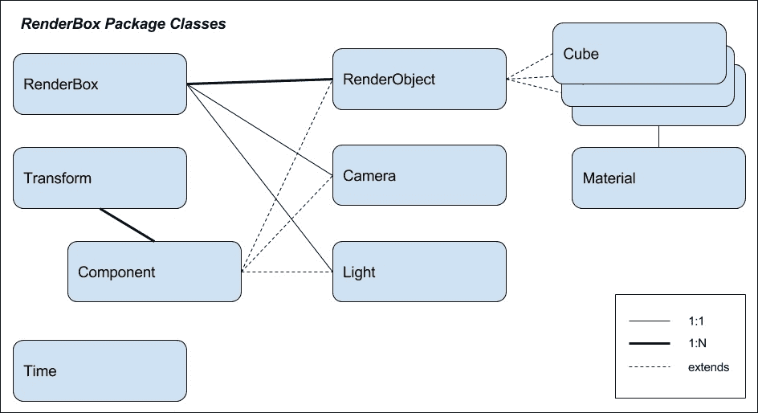

`RenderBox`类实现了`CardboardView.StereoRenderer`，从而将这个责任从应用的`MainActivity`类中解放出来。正如我们将看到的，`MainActivity`通过`IRenderBox`接口（具有设置、preDraw 和 postDraw 钩子）与`RenderBox`进行通信，以便`MainActivity`实现`IRenderBox`。

让我们考虑可以参与 3D VR 场景的`Component`类型：

+   `RenderObject`：这些是场景中的可绘制模型，例如立方体和球体。

+   `Camera`：这是用户的视点，用于渲染场景

+   `Light`：这些是用于阴影和阴影的照明源

我们场景中的每个对象都在空间中具有 X、Y 和 Z 位置、旋转和三个比例尺。这些属性由`Transform`类定义。变换可以按层次结构排列，让您构建更复杂的对象，这些对象由更简单的对象组装而成。

每个`Transform`类可以与一个或多个`Component`类关联。不同类型的组件（例如`Camera`、`Light`和`RenderObject`）扩展了`Component`类。组件不应该存在于没有附加到`Transform`类的情况下，但反之（没有组件的变换）是完全可以的。

在内部，`RenderBox`维护着一个`RenderObjects`列表。这些是场景中的几何模型。`RenderObjects`的类型包括`Cube`和`Sphere`等。这些对象与`Material`相关联，定义了它们的颜色、纹理和/或阴影属性。材料又引用、编译和执行低级着色器程序。每帧维护一个扁平的组件列表比每帧遍历变换层次结构更有效。这是我们使用实体组件模式的一个完美例子。

`RenderBox`包中的其他内容包括用于实现动画的`Time`类，以及用于向量和矩阵操作的`Math`函数库。

现在，让我们开始把这些放在一起。

游戏计划是什么？最终目标是创建我们的`RenderBox`图形引擎库。将其保留在自己的项目中（如果您使用源代码控制，如 Git，则还可以保留在自己的存储库中）将非常方便，因此可以独立地进行改进和维护。但是，为了开始这个过程，我们需要一个简单的应用程序来构建它，向您展示如何使用它，并验证（如果不是测试）它是否正常工作。这将被称为`RenderBoxDemo`。在本章结束时，我们将`RenderBox`代码提取到一个 Android 库模块中，然后导出它。

# 创建一个新项目

如果您想了解有关这些步骤的更多详细信息和解释，请参考第二章中的*创建新的 Cardboard 项目*部分，*骨架 Cardboard 项目*，并在那里跟着做：

1.  打开 Android Studio，创建一个新项目。让我们将其命名为`RenderBoxDemo`，并以**空活动**为目标**Android 4.4 KitKat（API 19）**。

1.  将 Cardboard SDK 的`common.aar`和`core.aar`库文件作为新模块添加到项目中，使用**文件** | **新建** | **新建模块...**。

1.  使用**文件** | **项目结构**将库模块作为项目应用程序的依赖项。

1.  编辑`AndroidManifest.xml`文件，如第二章中所述，*骨架 Cardboard 项目*，务必保留此项目的`package`名称。

1.  编辑`build.gradle`文件，如第二章中所述，*骨架 Cardboard 项目*，以便针对 SDK 22 进行编译。

1.  编辑`activity_main.xml`布局文件，如第二章中所述，*骨架 Cardboard 项目*。

现在，打开`MainActivity.java`文件，并编辑`MainActivity` Java 类以扩展`CardboardActivity`：

```kt
    public class MainActivity extends CardboardActivity {
        private static final String TAG = "RenderBoxDemo";
```

### 注意

请注意，与之前的章节不同，我们不实现`CardboardView.StereoRender`。相反，我们将在`RenderBox`类中实现该接口（在下一个主题中）。

## 创建 RenderBox 包文件夹

由于我们的计划是将`RenderBox`代码导出为一个库，让我们把它放到自己的包中。

在 Android 层次结构面板中，使用`Gear`图标，取消选中**紧凑的空中间包**，以便我们可以在**com.cardbookvr**下插入新的包。

在项目视图中右键单击`app/java/com/carbookvr/`文件夹，导航到**新建** | **包**，并命名为`renderbox`。您现在可能希望再次启用**紧凑的空中间包**。

在`renderbox`文件夹中，创建三个包子文件夹，分别命名为`components`、`materials`和`math`。项目现在应该有与以下截图中显示的相同的文件夹：

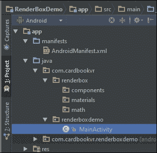

## 创建一个空的 RenderBox 类

让我们首先创建`RenderBox`类 Java 代码的框架。右键单击`renderbox/`文件夹，导航到**新建** | **Java 类**，并命名为`RenderBox`。

现在，打开`RenderBox.java`文件并编辑它以实现`CardboardView.StereoRenderer`接口。添加以下代码：

```kt
public class RenderBox implements CardboardView.StereoRenderer {
    private static final String TAG = "RenderBox";

    public static RenderBox instance;
    public Activity mainActivity;
    IRenderBox callbacks;

    public RenderBox(Activity mainActivity, IRenderBox callbacks){
        instance = this;
        this.mainActivity = mainActivity;
        this.callbacks = callbacks;
    }
}
```

这主要是在这一点上进行的一些日常工作。`RenderBox`类被定义为`implements` `CardboardView.StereoRenderer`。它的构造函数将接收对`MainActivity`实例和`IRenderBox`实现者（在这种情况下也是`MainActivity`）类的引用。`MainActivity`现在必须实现`IRenderBox`方法（下面将定义）。通过这种方式，我们实例化了框架并实现了关键方法。

请注意，我们还通过在类构造函数中注册`this`实例，使`RenderBox`成为单例。

我们还必须为`StereoRenderer`类添加方法覆盖。从智能感知菜单中选择**实现方法...**（或*Ctrl* + *I*），以添加接口的存根方法覆盖，如下所示：

```kt
    @Override
    public void onNewFrame(HeadTransform headTransform) {
    }

    @Override
    public void onDrawEye(Eye eye) {
    }

    @Override
    public void onFinishFrame(Viewport viewport) {
    }

    @Override
    public void onSurfaceChanged(int i, int i1) {
    }

    @Override
    public void onSurfaceCreated(EGLConfig eglConfig) {
    }

    @Override
    public void onRendererShutdown() {
    }
```

现在是添加一个错误报告方法`checkGLError`到`RenderBox`中来记录 OpenGL 渲染错误的好时机，如下面的代码所示：

```kt
    /**
     * Checks if we've had an error inside of OpenGL ES, and if so what that error is.
     * @param label Label to report in case of error.
     */
    public static void checkGLError(String label) {
        int error;
        while ((error = GLES20.glGetError()) != GLES20.GL_NO_ERROR) {
            String errorText = String.format("%s: glError %d, %s", label, error, GLU.gluErrorString(error));
            Log.e(TAG, errorText);
            throw new RuntimeException(errorText);
        }
    }
```

在之前的章节项目中，我们定义了`MainActivity`，使其实现了`CardboardView.StereoRenderer`。现在这个任务被委托给了我们的新的`RenderBox`对象。让我们告诉`MainActivity`去使用它。

在`MainActivity.java`中，修改`onCreate`方法，创建`RenderBox`的新实例并将其设置为视图渲染器，如下所示：

```kt
    protected void onCreate(Bundle savedInstanceState) {
        super.onCreate(savedInstanceState);
        setContentView(R.layout.activity_main);

        CardboardView cardboardView = (CardboardView) findViewById(R.id.cardboard_view);
        cardboardView.setRenderer(new RenderBox(this,this));
        setCardboardView(cardboardView);
    }
```

注意，`cardboardView.setRender`传递了新的`RenderBox`，它将`MainActivity`实例作为`Activity`和`IRenderBox`参数。哇，我们完全控制了 Cardboard SDK 的集成，现在一切都是关于实现`IRenderbox`。通过这种方式，我们将 Cardboard SDK、OpenGL 和各种其他外部依赖封装在我们自己的库中。现在，如果这些规范发生变化，我们只需要保持`RenderBox`更新，我们的应用程序就可以像以前一样告诉`RenderBox`该做什么。

## 添加 IRenderBox 接口

一旦我们把所有这些放在一起，`MainActivity`类将实现`IRenderBox`接口。该接口为活动提供了`setup`、`preDraw`和`postDraw`函数的回调。

在`onSurfaceCreated`中进行一些通用工作后，将调用设置方法。在`onDrawEye`期间将调用`preDraw`和`postDraw`方法。我们将在本章后面看到这一点。

我们现在可以设置它了。在层次结构面板中右键单击`renderbox`，导航到**新建** | **Java 类**，选择**类型："接口"**，并命名为`IRenderBox`。这只是几行代码，应该包括以下代码：

```kt
public interface IRenderBox {
    public void setup();
    public void preDraw();
    public void postDraw();
}
```

然后，修改`MainActivity`以使其实现`IRenderBox`：

```kt
public class MainActivity extends CardboardActivity implements IRenderBox {
```

选择智能感知**实现方法**（或*Ctrl* + *I*），以添加接口方法的覆盖。Android Studio 将自动填充以下内容：

```kt
    @Override
    public void setup() {

    }

    @Override
    public void preDraw() {

    }

    @Override
    public void postDraw() {

    }
```

如果您现在运行空白应用程序，将不会出现任何构建错误，并且它将显示空的 Cardboard 分屏视图：

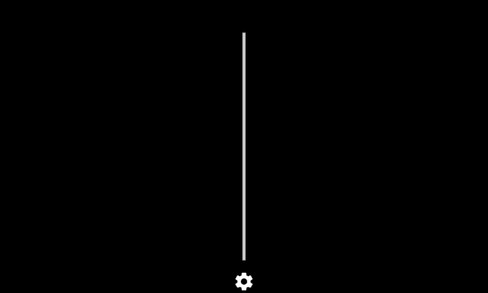

现在我们已经创建了一个骨架应用程序，准备实现`RenderBox`包和实用程序，这将帮助我们构建新的 Cardboard VR 应用程序。

在接下来的几个主题中，我们将构建`RenderBox`中需要的一些类。不幸的是，在我们编写完这些代码之前，我们无法在您的 Cardboard 设备上显示任何有趣的东西。这也限制了我们测试和验证编码是否正确的能力。这可能是引入单元测试的合适时机，比如 JUnit。有关详细信息，请参阅*Unit testing support*文档（[`tools.android.com/tech-docs/unit-testing-support`](http://tools.android.com/tech-docs/unit-testing-support)）。不幸的是，空间不允许我们介绍这个主题并在本书的项目中使用它。但我们鼓励您自己去追求这个。 （我会提醒您，这个项目的 GitHub 存储库为每个主题都有单独的提交，随着我们的进行逐步添加代码）。

# 材料、纹理和着色器

在第三章中，我们介绍了 OpenGL ES 2.0 图形管线和简单的着色器。现在我们将把这些代码提取到一个单独的`Material`类中。

在计算机图形学中，材料指的是几何模型的视觉表面特性。在场景中渲染对象时，材料与照明和着色器代码以及 OpenGL 图形管线所需的其他场景信息一起使用。

实色材料是最简单的；物体的整个表面是单一颜色。最终渲染中的任何颜色变化都是由于照明、阴影和其他着色器变体中的特性。完全可以使用照明和阴影来产生实色材料，但最简单的例子只是用相同的颜色填充光栅段，就像我们的第一个着色器一样。

纹理材料可能在图像文件（如 JPG）中定义表面细节。纹理就像贴在物体表面上的墙纸。它们可以被广泛使用，并负责用户在物体上感知到的大部分细节。一个实色的球体可能看起来像一个乒乓球。一个纹理球可能看起来像地球。可以添加更多的纹理通道来定义阴影的变化，甚至在表面处于阴影时发光。在第六章结束时，您将看到这种效果，当我们在地球的黑暗一侧添加人造光源时。

更真实的基于物理的着色超出了纹理贴图，还包括模拟的高度图、金属光泽和其他瑕疵，比如锈迹或污垢。我们不会在本书中涉及到这一点，但在图形引擎如 Unity 3D 和虚幻引擎中很常见。我们的`RenderBox`库可以扩展以支持它。

目前，我们将为基本的实色材料和相关着色器构建基础设施。在本章的后面，我们将扩展它以支持照明。

## 抽象材料

在`renderbox/materials/`文件夹中，创建一个名为`Material`的新 Java 类，并开始编写如下：

```kt
public abstract class Material {
    private static final String TAG = "RenderBox.Material";

    protected static final float[] modelView = new float[16];
    protected static final float[] modelViewProjection = new float[16];

    public static int createProgram(int vertexShaderResource, int fragmentShaderResource){
        int vertexShader = loadGLShader(GLES20.GL_VERTEX_SHADER, vertexShaderResource);
        int passthroughShader = loadGLShader(GLES20.GL_FRAGMENT_SHADER, fragmentShaderResource);

        int program = GLES20.glCreateProgram();
        GLES20.glAttachShader(program, vertexShader);
        GLES20.glAttachShader(program, passthroughShader);
        GLES20.glLinkProgram(program);
        GLES20.glUseProgram(program);

        RenderBox.checkGLError("Material.createProgram");
        return program;
    }

    public abstract void draw(float[] view, float[] perspective);
}
```

这定义了一个抽象类，将用于扩展我们定义的各种类型的材料。`createProgram`方法加载指定的着色器脚本，并构建一个附有着色器的 OpenGL ES 程序。

我们还定义了一个抽象的`draw()`方法，将在每个着色器中单独实现。除其他事项外，它要求在类的顶部声明`modelView`和`modelViewProjection`变换矩阵。在这一点上，我们实际上只会使用`modelViewProjection`，但当我们添加照明时，将需要一个单独的引用`modelView`矩阵。

接下来，将以下实用方法添加到`Material`类中以加载着色器：

```kt
    /**
     * Converts a raw text file, saved as a resource, into an OpenGL ES shader.
     *
     * @param type The type of shader we will be creating.
     * @param resId The resource ID of the raw text file about to be turned into a shader.
     * @return The shader object handler.
     */
    public static int loadGLShader(int type, int resId) {
        String code = readRawTextFile(resId);
        int shader = GLES20.glCreateShader(type);
        GLES20.glShaderSource(shader, code);
        GLES20.glCompileShader(shader);

        // Get the compilation status.
        final int[] compileStatus = new int[1];
        GLES20.glGetShaderiv(shader, GLES20.GL_COMPILE_STATUS, compileStatus, 0);

        // If the compilation failed, delete the shader.
        if (compileStatus[0] == 0) {
            Log.e(TAG, "Error compiling shader: " + GLES20.glGetShaderInfoLog(shader));
            GLES20.glDeleteShader(shader);
            shader = 0;
        }

        if (shader == 0) {
            throw new RuntimeException("Error creating shader.");
        }

        return shader;
    }

    /**
     * Converts a raw text file into a string.
     *
     * @param resId The resource ID of the raw text file about to be turned into a shader.
     * @return The context of the text file, or null in case of error.
     */
    private static String readRawTextFile(int resId) {
        InputStream inputStream = RenderBox.instance.mainActivity.getResources().openRawResource(resId);
        try {
            BufferedReader reader = new BufferedReader(new InputStreamReader(inputStream));
            StringBuilder sb = new StringBuilder();
            String line;
            while ((line = reader.readLine()) != null) {
                sb.append(line).append("\n");
            }
            reader.close();
            return sb.toString();
        } catch (IOException e) {
            e.printStackTrace();
        }
        return null;
    }
```

如第三章 *纸箱*中所讨论的，这些方法将加载一个着色器脚本并对其进行编译。

稍后，我们将从这个类派生特定的材料，并定义每个材料将使用的特定着色器。

# Math 包

在第三章 *纸箱*中，我们介绍了 3D 几何和矩阵数学计算。我们将把这些整合成更有用的函数。

我们组合的许多数学代码来自现有的开源项目（在源代码的注释中给出了归属）。毕竟，我们不妨利用那些喜欢这些东西并且开源了优秀的真实和经过测试的代码的数学天才。代码列表包含在本书的文件下载中。

### 注意

以下列表记录了我们的数学 API。实际代码包含在本书的文件下载和 GitHub 存储库中。

一般来说，这些数学都属于线性代数的范畴，但其中大部分是特定于图形编程的，并且在现代 CPU 上进行快速浮点数运算的限制内运行。

我们鼓励您浏览本书附带的源代码，显然您需要访问才能完成项目。可以说，所有包含的内容对于 3D 游戏引擎来说都是非常标准的，并且实际上在很大程度上是从一个名为**LibGDX**的开源引擎中获取的（或者经过检查）。LibGDX 的数学库非常庞大，针对移动 CPU 进行了优化，并且可以成为我们更简单的数学包的很好的替代品。我们还将广泛使用 Android 的`Matrix`类，在大多数情况下，它在本机代码中运行，并避免了**Java 虚拟机**（**JVM**或在 Android 情况下的 Dalvik VM）的开销。

以下是我们数学 API 的摘要。

## MathUtils

`MathUtils`变量和方法大多是不言自明的：`PI`、`sin`、`cos`等，定义为使用`floats`作为 Java 的`Math`类的替代，该类包含双精度。在计算机图形学中，我们使用浮点数。数学计算需要更少的功率和更少的晶体管，精度损失是可以接受的。您的`MathUtils`类应该如下所示：

```kt
// File: renderbox/math/MathUtils.java
public class MathUtils {
    static public final float PI = 3.1415927f;
    static public final float PI2 = PI * 2;
    static public final float degreesToRadians = PI / 180;
    static public final float radiansToDegrees = 180f / PI;
}
```

## Matrix4

`Matrix4`类管理 4x4 变换矩阵，用于在三维空间中平移（位置）、旋转和缩放点。我们很快将充分利用这些。以下是`Matrix4`类的缩减版本，其中删除了函数体：

```kt
// File: renderbox/math/Matrix4.java
public class Matrix4{
    public final float[] val = new float[16];
    public Matrix4()
    public Matrix4 toIdentity()

    public static Matrix4 TRS(Vector3 position, Vector3 rotation, Vector3 scale)
    public Matrix4 translate(Vector3 position)
    public Matrix4 rotate(Vector3 rotation)
    public Matrix4 scale(Vector3 scale)
    public Vector3 multiplyPoint3x4(Vector3 v)
    public Matrix4 multiply(Matrix4 matrix)
    public Matrix4 multiply(float[] matrix)
```

特别注意 TRS 函数。它被`Transform`类用于将位置、旋转和缩放信息组合成一个有用的矩阵，代表所有三个。创建此矩阵的顺序很重要。首先，我们生成一个平移矩阵，然后我们旋转和缩放它。生成的矩阵可以与任何 3D 点（我们的顶点）相乘，以按层次应用这三个操作。

## 四元数

**四元数**以这样的方式表示三维空间中的旋转方向，当两个四元数组合时，不会丢失任何信息。

从人类的角度来看，更容易将旋转方向视为三个欧拉（发音为“欧拉”）角，因为我们考虑旋转的三个维度：俯仰、偏航和滚动。我们使用四元数而不是更直接的旋转向量表示的原因是，根据您将三个欧拉旋转应用于对象的顺序，结果的 3D 方向将不同。

### 注意

有关四元数和欧拉角的更多信息，请参考以下链接：

+   [`en.wikipedia.org/wiki/Quaternions_and_spatial_rotation`](https://en.wikipedia.org/wiki/Quaternions_and_spatial_rotation)

+   [`en.wikipedia.org/wiki/Euler_angles`](https://en.wikipedia.org/wiki/Euler_angles)

+   [`mathworld.wolfram.com/EulerAngles.html`](http://mathworld.wolfram.com/EulerAngles.html)

+   [`en.wikipedia.org/wiki/Conversion_between_quaternions_and_Euler_angles`](https://en.wikipedia.org/wiki/Conversion_between_quaternions_and_Euler_angles)

尽管四元数是一个四维结构，但我们将每个四元数视为一个单一值，它代表一个 3D 方向。因此，当我们连续应用多个旋转操作时，不会出现一个轴的旋转影响另一个轴的效果的问题。如果这一切都毫无意义，不要担心。这是 3D 图形中最棘手的概念之一。以下是简化的`Quaternion`类：

```kt
// File: renderbox/math/Quaternion.java
public class Quaternion {
    public float x,y,z,w;
    public Quaternion()
    public Quaternion(Quaternion quat)

    public Quaternion setEulerAngles (float pitch, float yaw, float roll) public Quaternion setEulerAnglesRad (float pitch, float yaw, float roll) 
    public Quaternion conjugate ()
    public Quaternion multiply(final Quaternion other)
    public float[] toMatrix4()
    public String toString()
```

## Vector2

**Vector2**是由（X，Y）坐标定义的二维点或方向向量。使用`Vector2`类，您可以转换和操作向量。以下是简化的`Vector2`类：

```kt
// File: renderbox/math/Vector2.java
public class Vector2 {
    public float x;
    public float y;

    public static final Vector2 zero = new Vector2(0, 0);
    public static final Vector2 up = new Vector2(0, 1);
    public static final Vector2 down = new Vector2(0, -1);
    public static final Vector2 left = new Vector2(-1, 0);
    public static final Vector2 right = new Vector2(1, 0);

    public Vector2()

    public Vector2(float xValue, float yValue)
    public Vector2(Vector2 other)
    public Vector2(float[] vec)

    public final Vector2 add(Vector2 other)
    public final Vector2 add(float otherX, float otherY, float otherZ)
    public final Vector2 subtract(Vector2 other)
    public final Vector2 multiply(float magnitude)
    public final Vector2 multiply(Vector2 other)
    public final Vector2 divide(float magnitude)
    public final Vector2 set(Vector2 other)
    public final Vector2 set(float xValue, float yValue)
    public final Vector2 scale(float xValue, float yValue)
    public final Vector2 scale(Vector2 scale)
    public final float dot(Vector2 other)
    public final float length2()
    public final float distance2(Vector2 other)
    public Vector2 normalize()
    public final Vector2 zero()
    public float[] toFloat3()
    public float[] toFloat4()
    public float[] toFloat4(float w)
    public String toString()
```

## Vector3

**Vector3**是由 X、Y 和 Z 坐标定义的三维点或方向向量。使用`Vector3`类，您可以转换和操作向量。以下是简化的`Vector3`类：

```kt
// File: renderbox/math/Vector3.java
public final class Vector3 {
    public float x;
    public float y;
    public float z;

    public static final Vector3 zero = new Vector3(0, 0, 0);
    public static final Vector3 up = new Vector3(0, 1, 0);
    public static final Vector3 down = new Vector3(0, -1, 0);
    public static final Vector3 left = new Vector3(-1, 0, 0);
    public static final Vector3 right = new Vector3(1, 0, 0);
    public static final Vector3 forward = new Vector3(0, 0, 1);
    public static final Vector3 backward = new Vector3(0, 0, -1);

    public Vector3()
    public Vector3(float xValue, float yValue, float zValue)
    public Vector3(Vector3 other)
    public Vector3(float[] vec)

    public final Vector3 add(Vector3 other)
    public final Vector3 add(float otherX, float otherY, float otherZ)
    public final Vector3 subtract(Vector3 other)
    public final Vector3 multiply(float magnitude)
    public final Vector3 multiply(Vector3 other)
    public final Vector3 divide(float magnitude)
    public final Vector3 set(Vector3 other)
    public final Vector3 set(float xValue, float yValue, float zValue)
    public final Vector3 scale(float xValue, float yValue, float zValue)
    public final Vector3 scale(Vector3 scale)
    public final float dot(Vector3 other)
    public final float length()
    public final float length2()
    public final float distance2(Vector3 other)
    public Vector3 normalize()
    public final Vector3 zero()
    public float[] toFloat3()
    public float[] toFloat4()
    public float[] toFloat4(float w)
    public String toString()
```

`Vector2`和`Vector3`共享许多相同的功能，但要特别注意 3D 中存在而 2D 中不存在的函数。接下来，我们将看到在实现`Transform`类时如何使用数学库。

# Transform 类

3D 虚拟现实场景将由各种对象构建，每个对象在 3D 空间中由`Transform`定义了位置、旋转和缩放。

允许对变换进行分层分组也是自然而然的有用的。这种分组还创建了本地空间和世界空间之间的区别，其中子对象只跟踪它们的**平移、旋转和缩放**（**TRS**）与其父对象的差异（本地空间）。我们存储的实际数据是本地位置（我们将使用位置和平移这两个词），旋转和缩放。全局位置、旋转和缩放是通过将本地 TRS 组合到所有父级链中计算出来的。

首先，让我们定义`Transform`类。在 Android Studio 的层次结构面板中，右键单击`renderbox/`，转到**新建** | **Java 类**，并将其命名为`Transform`。

每个`Transform`可能有一个或多个关联的组件。通常只有一个，但可以添加尽可能多的组件（正如我们将在本书的其他项目中看到的）。我们将在变换中维护组件列表，如下所示：

```kt
public class Transform {
    private static final String TAG = "RenderBox.Transform";

    List<Component> components = new ArrayList<Component>();

     public Transform() {}

    public Transform addComponent(Component component){
        component.transform = this;
        return this;
    }
    public List<Component> getComponents(){
        return components;
    }
}
```

我们将在下一个主题中定义`Component`类。如果在定义之前现在引用它真的让你困扰，你可以从`renderbox/components`文件夹中的空 Component Java 类开始。

现在回到`Transform`类。`Transform`对象在空间中有一个位置、方向和缩放，由其`localPosition`、`localRotation`和`localScale`变量定义。让我们定义这些私有变量，然后添加方法来操作它们。

此外，由于变换可以按层次结构排列，我们将包括对可能的`parent`变换的引用，如下所示：

```kt
    private Vector3 localPosition = new Vector3(0,0,0);
    private Quaternion localRotation = new Quaternion();
    private Vector3 localScale = new Vector3(1,1,1);

    private Transform parent = null;
```

位置、旋转和缩放值被初始化为身份值，也就是说，直到它们在其他地方被明确设置之前，没有位置偏移、旋转或调整大小。请注意，身份缩放是（1,1,1）。

`parent`变换变量允许每个变换在层次结构中有一个父级。你可以在变换中保留子对象的列表，但你可能会惊讶地知道，在不必深入层次结构的情况下，你可以走得很远。如果你可以避免，就像我们一样，你可以在设置/取消父引用时节省大量的分支。维护子对象列表意味着每次取消父对象的操作都需要*O(n)*的时间，设置父对象时还需要额外的*O(1)*插入成本。在子对象中寻找特定对象也不是很有效率。

## 父级方法

使用`setParent`和`unParent`方法可以将变换添加到层次结构中的位置或从中移除。现在让我们来定义它们：

```kt
    public Transform setParent(Transform Parent){
        setParent(parent, true);
        return this;
    }

    public Transform setParent(Transform parent, boolean updatePosition){
        if(this.parent == parent)
        //Early-out if setting same parent--don't do anything
            return this;
        if(parent == null){
            unParent(updatePosition);
            return this;
        }

        if(updatePosition){
            Vector3 tmp_position = getPosition();
            this.parent = parent;
            setPosition(tmp_position);
        } else {
            this.parent = parent;
        }
        return this;
    }

    public Transform upParent(){
        unParent(true);
        return this;
    }

    public Transform unParent(boolean updatePosition){
        if(parent == null)
        //Early out--we already have no parent
            return this;
        if(updatePosition){
            localPosition = getPosition();
        }
        parent = null;
        return this;
    }
```

简单地说，`setParent`方法将`this.parent`设置为给定的父级变换。可选地，您可以指定相对于父级更新位置。我们添加了一个优化，如果父级已经设置，则跳过此过程。将父级设置为`null`等同于调用`unParent`。

`unParent`方法将变换从层次结构中移除。可选地，您可以指定相对于（先前的）父级更新位置，以便变换现在与层次结构断开连接，但仍保持在世界空间中的相同位置。

请注意，当进行父子关系的设置和解除时，旋转和缩放也可以并且应该更新。在本书的项目中我们不需要这些，所以它们留作读者的练习。另外，注意我们的`setParent`方法包括一个参数来决定是否更新位置。如果设置为`false`，操作会更快一些，但是如果父变换没有设置为单位矩阵（无平移、旋转或缩放），对象的全局状态会发生变化。为了方便起见，您可以将`updatePosition`设置为`true`，这将将当前的全局变换应用到局部变量中，保持对象在空间中固定，保持当前的旋转和缩放。

## 位置方法

`setPosition`方法设置相对于父级的变换位置，或者如果没有父级，则将绝对世界位置应用于局部变量。如果要使用向量或单独的分量值，提供了两个重载。`getPosition`将基于父级变换计算世界空间位置。请注意，这将与变换层次的深度相关的 CPU 成本。作为优化，您可能希望在`Transform`类中包含一个系统来缓存世界空间位置，在修改父级变换时使缓存失效。一个更简单的替代方法是确保在调用`getPosition`后立即将位置存储在局部变量中。相同的优化也适用于旋转和缩放。

定义位置的获取器和设置器如下：

```kt
    public Transform setPosition(float x, float y, float z){
        if(parent != null){
            localPosition = new Vector3(x,y,z).subtract(parent.getPosition());
        } else {
            localPosition = new Vector3(x, y, z);
        }
        return this;
    }

    public Transform setPosition(Vector3 position){
        if(parent != null){
            localPosition = new Vector3(position).subtract(parent.getPosition());
        } else {
            localPosition = position;
        }
        return this;
    }

    public Vector3 getPosition(){
        if(parent != null){
            return Matrix4.TRS(parent.getPosition(), parent.getRotation(), parent.getScale()).multiplyPoint3x4(localPosition);
        }
        return localPosition;
    }

    public Transform setLocalPosition(float x, float y, float z){
        localPosition = new Vector3(x, y, z);
        return this;
    }

    public Transform setLocalPosition(Vector3 position){
        localPosition = position;
        return this;
    }

    public Vector3 getLocalPosition(){
        return localPosition;
    }
```

## 旋转方法

`setRotation`方法设置相对于父级的变换旋转，如果没有父级，则将绝对世界旋转应用于局部变量。同样，多个重载提供了不同输入数据的选项。定义旋转的获取器和设置器如下：

```kt
    public Transform setRotation(float pitch, float yaw, float roll){
        if(parent != null){
            localRotation = new Quaternion(parent.getRotation()).multiply(new Quaternion().setEulerAngles(pitch, yaw, roll).conjugate()).conjugate();
        } else {
            localRotation = new Quaternion().setEulerAngles(pitch, yaw, roll);
        }
        return this;
    }

    /**
     * Set the rotation of the object in global space
     * Note: if this object has a parent, setRoation modifies the input rotation!
     * @param rotation
     */
    public Transform setRotation(Quaternion rotation){
        if(parent != null){
            localRotation = new Quaternion(parent.getRotation()).multiply(rotation.conjugate()).conjugate();
        } else {
            localRotation = rotation;
        }
        return this;
    }

    public Quaternion getRotation(){
        if(parent != null){
            return new Quaternion(parent.getRotation()).multiply(localRotation);
        }
        return localRotation;
    }

    public Transform setLocalRotation(float pitch, float yaw, float roll){
        localRotation = new Quaternion().setEulerAngles(pitch, yaw, roll);
        return this;
    }

    public Transform setLocalRotation(Quaternion rotation){
        localRotation = rotation;
        return this;
    }

    public Quaternion getLocalRotation(){
        return localRotation;
    }

    public Transform rotate(float pitch, float yaw, float roll){
        localRotation.multiply(new Quaternion().setEulerAngles(pitch, yaw, roll));
        return this;
    }
```

## 缩放方法

`setScale`方法设置相对于父级的变换比例，或者如果没有父级，则将绝对比例应用于局部变量。定义比例的获取器和设置器如下：

```kt
    public Vector3 getScale(){
        if(parent != null){
            Matrix4 result = new Matrix4();
            result.setRotate(localRotation);
            return new Vector3(parent.getScale())
                .scale(localScale);
        }
        return localScale;
    }

    public Transform setLocalScale(float x, float y, float z){
        localScale = new Vector3(x,y,z);
        return this;
    }

    public Transform setLocalScale(Vector3 scale){
        localScale = scale;
        return this;
    }

    public Vector3 getLocalScale(){
        return localScale;
    }

    public Transform scale(float x, float y, float z){
        localScale.scale(x, y, z);
        return this;
    }
```

## 变换为矩阵并绘制

`Transform`类的最后一件事是将单位矩阵转换为一个告诉 OpenGL 如何正确绘制对象的矩阵。为此，我们按顺序对矩阵进行平移、旋转和缩放。从技术上讲，我们还可以使用矩阵做一些很酷的事情，比如扭曲和倾斜模型，但数学已经足够复杂了。如果您想了解更多，请在搜索引擎中输入`变换矩阵`、`四元数到矩阵`以及我们一直在讨论的其他术语。所有这些背后的数学都是迷人的，而且太详细了，无法在一个段落中解释清楚。

我们还提供了`drawMatrix()`函数，用于设置绘制调用的光照和模型矩阵。由于光照模型是一个中间步骤，将这个调用合并起来是有意义的；

```kt
    public float[] toFloatMatrix(){
        return Matrix4.TRS(getPosition(), getRotation(), getScale()).val;
    }

    public float[] toLightMatrix(){
        return Matrix4.TR(getPosition(), getRotation()).val;
    }

    /**
     * Set up the lighting model and model matrices for a draw call
     * Since the lighting model is an intermediate step, it makes sense to combine this call
     */
    public void drawMatrices() {
        Matrix4 modelMatrix = Matrix4.TR(getPosition(), getRotation());
        RenderObject.lightingModel = modelMatrix.val;
        modelMatrix = new Matrix4(modelMatrix);
        RenderObject.model = modelMatrix.scale(getScale()).val;
    }
```

`drawMatrices`方法使用了`RenderObject`类的变量，这些变量稍后将被定义。我们只是将我们的矩阵设置为`RenderObject`类中的静态变量，这似乎非常反 Java。正如您将看到的，实际上并不需要多个`lightingModel`对象和模型的实例存在。它们总是在每个对象绘制时及时计算出来。如果我们要引入避免一直重新计算这个矩阵的优化，保留这些信息就是有意义的。为了简单起见，我们只是在每次绘制每个对象时重新计算矩阵，因为它可能与上一帧不同。

接下来，我们将看到`Transform`类在我们实现`Component`类时是如何被使用的，这个类将被一些定义 3D 场景中对象的类所扩展。

# 组件类

我们的 3D 虚拟现实场景由各种组件组成。组件可能包括几何对象、灯光和摄像机。根据其关联的变换，组件可以在 3D 空间中定位、旋转和缩放。让我们创建一个`Component`类，它将作为场景中其他对象类的基础。

如果您还没有创建`Component.java`，现在在`renderbox/components`文件夹中创建一个。定义如下：

```kt
public class Component {
    public Transform transform;

    public boolean enabled = true;
}
```

我们包含了一个`enabled`标志，当我们绘制场景时，这将非常方便地隐藏/显示对象。

就是这样。接下来，我们将定义我们的第一个组件`RenderObject`，以表示场景中的几何对象。

# RenderObject 组件

`RenderObject`将作为可以在场景中渲染的几何对象的父类。`RenderObject`扩展了`Component`，因此它有一个`Transform`。

在`renderbox/components`文件夹中，创建一个名为`RenderObject`的新 Java 类。将其定义为扩展`Component`的抽象类：

```kt
public abstract class RenderObject extends Component {
    private static final String TAG = "RenderObject";

    public RenderObject(){
        super();
        RenderBox.instance.renderObjects.add(this);
    }
}
```

我们首先要做的是让每个实例将自己添加到由`RenderBox`实例维护的`renderObjects`列表中。现在让我们转到`RenderBox`类，并为这个列表添加支持。

打开`RenderBox.java`文件并添加一个`renderObjects`列表：

```kt
public class RenderBox implements CardboardView.StereoRenderer {

    public List<RenderObject> renderObjects = new ArrayList<RenderObject>();
```

现在，回到`RenderObject`类；我们将实现三个方法：`allocateFloatBuffer`、`allocateShortBuffer`和`draw`。

OpenGL ES 要求我们为各种数据分配许多不同的内存缓冲区，包括模型顶点、法向量和索引列表。`allocateFloatBuffer`和`allocateShortBuffer`方法是对象可以用于浮点数和整数的实用方法。索引是整数（具体来说是 short）；其他所有内容都将是浮点数。这些将可供派生对象类使用：

```kt
public abstract class RenderObject extends Component {
       ...
    protected static FloatBuffer allocateFloatBuffer(float[] data){
        ByteBuffer bbVertices = ByteBuffer.allocateDirect(data.length * 4);
        bbVertices.order(ByteOrder.nativeOrder());
        FloatBuffer buffer = bbVertices.asFloatBuffer();
        buffer.put(data);
        buffer.position(0);
        return buffer;
    }

    protected static ShortBuffer allocateShortBuffer(short[] data){
        ByteBuffer bbVertices = ByteBuffer.allocateDirect(data.length * 2);
        bbVertices.order(ByteOrder.nativeOrder());
        ShortBuffer buffer = bbVertices.asShortBuffer();
        buffer.put(data);
        buffer.position(0);
        return buffer;
    }
}
```

聪明的读者可能已经注意到我们首先使用`ByteBuffer`，然后将其转换为`FloatBuffer`或`ShortBuffer`。虽然从字节到浮点的转换可能是有道理的——原始内存通常不表示为浮点数——但有些人可能会想知道为什么我们不从一开始就分配`ShortBuffer`作为`ShortBuffer`。实际上，原因在这两种情况下是一样的。我们希望利用`allocateDirect`方法，这是更有效率的，只存在于`ByteBuffer`类中。

最终，`RenderObject`组件的目的是在屏幕上绘制几何图形。这是通过对 3D 视图进行变换并通过`Material`类进行渲染来实现的。让我们为材质定义变量，一些 setter 和 getter 方法以及`draw`方法：

```kt
    protected Material material;
    public static float[] model;
    public static float[] lightingModel;

    public Material getMaterial(){
        return material;
    }
    public RenderObject setMaterial(Material material){
        this.material = material;
        return this;
    }

    public void draw(float[] view, float[] perspective){
        if(!enabled)
            return;
        //Compute position every frame in case it changed
        transform.drawMatrices();
        material.draw(view, perspective);
    }
```

`draw`方法为这个对象准备了模型变换，大部分绘制动作发生在材质中。`draw`方法将从当前的`Camera`组件中调用，因为它响应 Cardboard SDK 的`onDrawEye`挂钩的姿势。如果组件未启用，则会被跳过。

`RenderObject`类是抽象的；我们不会直接使用`RenderObjects`。相反，我们将派生对象类，比如`Cube`和`Sphere`。让我们从`RenderObject`组件中创建`Cube`类。 

# Cube RenderObject 组件

为了演示目的，我们将从一个简单的立方体开始。稍后，我们将通过光照对其进行改进。在第三章中，我们定义了一个`Cube`模型。我们将从这里使用相同的类和数据结构。您甚至可以复制代码，但它在下面的文本中显示。在`renderbox/components/`文件夹中创建一个`Cube`Java 类：

```kt
// File: renderbox/components/Cube.java
public class Cube {
    public static final float[] CUBE_COORDS = new float[] {
            // Front face
            -1.0f, 1.0f, 1.0f,
            -1.0f, -1.0f, 1.0f,
            1.0f, 1.0f, 1.0f,
            -1.0f, -1.0f, 1.0f,
            1.0f, -1.0f, 1.0f,
            1.0f, 1.0f, 1.0f,

            // Right face
            1.0f, 1.0f, 1.0f,
            1.0f, -1.0f, 1.0f,
            1.0f, 1.0f, -1.0f,
            1.0f, -1.0f, 1.0f,
            1.0f, -1.0f, -1.0f,
            1.0f, 1.0f, -1.0f,

            // Back face
            1.0f, 1.0f, -1.0f,
            1.0f, -1.0f, -1.0f,
            -1.0f, 1.0f, -1.0f,
            1.0f, -1.0f, -1.0f,
            -1.0f, -1.0f, -1.0f,
            -1.0f, 1.0f, -1.0f,

            // Left face
            -1.0f, 1.0f, -1.0f,
            -1.0f, -1.0f, -1.0f,
            -1.0f, 1.0f, 1.0f,
            -1.0f, -1.0f, -1.0f,
            -1.0f, -1.0f, 1.0f,
            -1.0f, 1.0f, 1.0f,

            // Top face
            -1.0f, 1.0f, -1.0f,
            -1.0f, 1.0f, 1.0f,
            1.0f, 1.0f, -1.0f,
            -1.0f, 1.0f, 1.0f,
            1.0f, 1.0f, 1.0f,
            1.0f, 1.0f, -1.0f,

            // Bottom face
            1.0f, -1.0f, -1.0f,
            1.0f, -1.0f, 1.0f,
            -1.0f, -1.0f, -1.0f,
            1.0f, -1.0f, 1.0f,
            -1.0f, -1.0f, 1.0f,
            -1.0f, -1.0f, -1.0f,
    };

    public static final float[] CUBE_COLORS_FACES = new float[] {
            // Front, green
            0f, 0.53f, 0.27f, 1.0f,
            // Right, blue
            0.0f, 0.34f, 0.90f, 1.0f,
            // Back, also green
            0f, 0.53f, 0.27f, 1.0f,
            // Left, also blue
            0.0f, 0.34f, 0.90f, 1.0f,
            // Top, red
            0.84f,  0.18f,  0.13f, 1.0f,
            // Bottom, also red
            0.84f,  0.18f,  0.13f, 1.0f
    };

    /**
     * Utility method for generating float arrays for cube faces
     *
     * @param model - float[] array of values per face.
     * @param coords_per_vertex - int number of coordinates per vertex.
     * @return - Returns float array of coordinates for triangulated cube faces.
     *               6 faces X 6 points X coords_per_vertex
     */
    public static float[] cubeFacesToArray(float[] model, int coords_per_vertex) {
        float coords[] = new float[6 * 6 * coords_per_vertex];
        int index = 0;
        for (int iFace=0; iFace < 6; iFace++) {
            for (int iVertex=0; iVertex < 6; iVertex++) {
                for (int iCoord=0; iCoord < coords_per_vertex; iCoord++) {
                    coords[index] = model[iFace*coords_per_vertex + iCoord];
                    index++;
                }
            }
        }
        return coords;
    }
}
```

我们列出了立方体每个面的坐标。每个面由两个三角形组成，共 12 个三角形，或者共 36 组坐标来定义立方体。

我们还列出了立方体每个面的不同颜色。而不是将颜色重复 36 次，有`cubeFacesToArray`方法来生成它们。

现在，我们需要升级`Cube`以适用于`RenderBox`。

首先，添加`extends` `RenderObject`。这将在构造函数中提供`super()`方法，并允许您调用`draw()`方法：

```kt
public class Cube extends RenderObject {
```

为其顶点和颜色分配缓冲区，并创建将用于渲染的`Material`类：

```kt
    public static FloatBuffer vertexBuffer;
    public static FloatBuffer colorBuffer;
    public static final int numIndices = 36;

    public Cube(){
        super();
        allocateBuffers();
        createMaterial();
    }

    public static void allocateBuffers(){
        //Already setup?
        if (vertexBuffer != null) return;
        vertexBuffer = allocateFloatBuffer(CUBE_COORDS);
        colorBuffer = allocateFloatBuffer(cubeFacesToArray(CUBE_COLORS_FACES, 4));
    }

    public void createMaterial(){
        VertexColorMaterial mat = new VertexColorMaterial();
        mat.setBuffers(vertexBuffer, colorBuffer, numIndices);
        material = mat;
    }
```

我们通过检查`vertexBuffer`是否为`null`来确保`allocateBuffers`只运行一次。

我们计划使用`VertexColorMaterial`类来渲染大多数立方体。接下来将定义它。

`Camera`组件将调用`Cube`类的`draw`方法（从`RenderObject`继承），然后调用`Material`类的`draw`方法。`draw`方法将从主`Camera`组件中调用，因为它响应 Cardboard SDK 的`onDrawEye`挂钩。

# 顶点颜色材质和着色器

`Cube`组件需要一个`Material`来在显示器上呈现。我们的`Cube`为每个面定义了单独的颜色，这些颜色被定义为单独的顶点颜色。我们将定义一个`VertexColorMaterial`实例和相应的着色器。

## 顶点颜色着色器

至少，OpenGL 管道要求我们定义一个顶点着色器，它将顶点从 3D 空间转换到 2D 空间，以及一个片段着色器，它计算光栅段的像素颜色值。与我们在第三章中创建的简单着色器*Cardboard Box*类似，我们将创建两个文件，`vertex_color_vertex.shader`和`vertex_color_fragment.shader`。除非你已经这样做了，否则创建一个新的 Android 资源目录，类型为`raw`，并将其命名为`raw`。然后，对于每个文件，右键单击目录，然后转到**新建** | **文件**。对于这两个文件，使用以下代码。顶点着色器的代码如下：

```kt
// File:res/raw/vertex_color_vertex.shader
uniform mat4 u_Model;
uniform mat4 u_MVP;

attribute vec4 a_Position;
attribute vec4 a_Color;

varying vec4 v_Color;

void main() {
   v_Color = a_Color;
   gl_Position = u_MVP * a_Position;
}
```

片段着色器的代码如下：

```kt
//File: res/raw/vertex_color_fragment.shader
precision mediump float;
varying vec4 v_Color;

void main() {
    gl_FragColor = v_Color;
}
```

`vertex`着色器通过`u_MVP`矩阵转换每个顶点，这个矩阵将由`Material`类的绘制函数提供。片段着色器只是通过顶点着色器指定的颜色。

## VertexColorMaterial

现在，我们准备实现我们的第一个材质，`VertexColorMaterial`类。在`renderbox/materials/`目录中创建一个名为`VertexColorMaterial`的新 Java 类。将类定义为`extends Material`：

```kt
public class VertexColorMaterial extends Material {
```

我们将要实现的方法如下：

+   `VertexColorMaterial`：这些是构造函数

+   `setupProgram`：这将创建着色器程序并获取其 OpenGL 变量位置

+   `setBuffers`：这将设置用于渲染的分配的缓冲区

+   `draw`：这将从视图角度绘制模型

以下是完整的代码：

```kt
public class VertexColorMaterial extends Material {
    static int program = -1;

    static int positionParam;
    static int colorParam;
    static int modelParam;
    static int MVPParam;

    FloatBuffer vertexBuffer;
    FloatBuffer colorBuffer;
    int numIndices;

    public VertexColorMaterial(){
        super();
        setupProgram();
    }

    public static void setupProgram(){
        //Already setup?
		if (program != -1) return;
        //Create shader program
        program = createProgram(R.raw.vertex_color_vertex, R.raw.vertex_color_fragment);

        //Get vertex attribute parameters
        positionParam = GLES20.glGetAttribLocation(program, "a_Position");
        colorParam = GLES20.glGetAttribLocation(program, "a_Color");

        //Enable vertex attribute parameters
        GLES20.glEnableVertexAttribArray(positionParam);
        GLES20.glEnableVertexAttribArray(colorParam);

        //Shader-specific parameters
        modelParam = GLES20.glGetUniformLocation(program, "u_Model");
        MVPParam = GLES20.glGetUniformLocation(program, "u_MVP");

        RenderBox.checkGLError("Solid Color Lighting params");
    }

    public void setBuffers(FloatBuffer vertexBuffer,  FloatBuffer colorBuffer, int numIndices){
        this.vertexBuffer = vertexBuffer;
        this.colorBuffer = colorBuffer;
        this.numIndices = numIndices;
    }

    @Override
    public void draw(float[] view, float[] perspective) {
        Matrix.multiplyMM(modelView, 0, view, 0, RenderObject.model, 0);
        Matrix.multiplyMM(modelViewProjection, 0, perspective, 0, modelView, 0);

        GLES20.glUseProgram(program);

        // Set the Model in the shader, used to calculate lighting
        GLES20.glUniformMatrix4fv(modelParam, 1, false, RenderObject.model, 0);

        // Set the position of the cube
        GLES20.glVertexAttribPointer(positionParam, 3, GLES20.GL_FLOAT, false, 0, vertexBuffer);

        // Set the ModelViewProjection matrix in the shader.
        GLES20.glUniformMatrix4fv(MVPParam, 1, false, modelViewProjection, 0);

        // Set the normal positions of the cube, again for shading
        GLES20.glVertexAttribPointer(colorParam, 4, GLES20.GL_FLOAT, false, 0, colorBuffer);

        // Set the ModelViewProjection matrix in the shader.
        GLES20.glUniformMatrix4fv(MVPParam, 1, false, modelViewProjection, 0);

        GLES20.glDrawArrays(GLES20.GL_TRIANGLES, 0, numIndices);
    }

    public static void destroy(){
        program = -1;
    }
}
```

`setupProgram`方法为我们在`res/raw/`目录中创建的两个着色器`vertex_color_vertex`和`vertex_color_fragment`创建了一个 OpenGL ES 程序。然后，它使用`GetAttribLocation`和`GetUniformLocation`调用获取`positionParam`、`colorParam`和`MVPParm`着色器变量的引用，这些引用在稍后用于绘制。

`setBuffers`方法设置了用于定义将使用此材质绘制的对象的内存缓冲区。该方法假定对象模型由一组 3D 顶点（X、Y 和 Z 坐标）组成。

`draw()`方法使用给定的**模型视图透视**（**MVP**）变换矩阵在缓冲区中渲染指定的对象。（有关详细解释，请参阅第三章中的*3D 相机、透视和头部旋转*部分，*Cardboard Box*。）

你可能已经注意到我们没有使用之前提到的`ShortBuffer`函数。稍后，材料将使用`glDrawElements`调用以及索引缓冲区。`glDrawArrays`本质上是`glDrawElements`的退化形式，它假定一个顺序的索引缓冲区（即 0、1、2、3 等）。对于复杂的模型，重用三角形之间的顶点是更有效的，这就需要一个索引缓冲区。

为了完整起见，我们还将为每个`Material`类提供一个`destroy()`方法。稍后我们将确切地知道为什么必须销毁材料。

正如你所看到的，`Material`封装了许多底层的 OpenGL ES 2.0 调用，用于编译着色器脚本，创建渲染程序，在着色器中设置模型视图透视矩阵，并绘制 3D 图形元素。

现在我们可以实现`Camera`组件了。

# `Camera`组件

`Camera`类是另一种`Component`类型，像其他组件对象一样在空间中定位。摄像机很特殊，因为通过摄像机的眼睛，我们渲染场景。对于 VR，我们为每只眼睛渲染一次。

让我们创建`Camera`类，然后看看它是如何工作的。在`renderbox/components`文件夹中创建它，并定义如下：

```kt
public class Camera extends Component {
    private static final String TAG = "renderbox.Camera";

    private static final float Z_NEAR = .1f;
    public static final float Z_FAR = 1000f;

    private final float[] camera = new float[16];
    private final float[] view = new float[16];
    public Transform getTransform(){return transform;}

    public Camera(){
        //The camera breaks pattern and creates its own Transform
        transform = new Transform();
    }

    public void onNewFrame(){
        // Build the camera matrix and apply it to the ModelView.
        Vector3 position = transform.getPosition();
        Matrix.setLookAtM(camera, 0, position.x, position.y, position.z + Z_NEAR, position.x, position.y, position.z, 0.0f, 1.0f, 0.0f);

        RenderBox.checkGLError("onNewFrame");
    }

    public void onDrawEye(Eye eye) {
        GLES20.glEnable(GLES20.GL_DEPTH_TEST);
        GLES20.glClear(GLES20.GL_COLOR_BUFFER_BIT | GLES20.GL_DEPTH_BUFFER_BIT);

        RenderBox.checkGLError("glClear");

        // Apply the eye transformation to the camera.
        Matrix.multiplyMM(view, 0, eye.getEyeView(), 0, camera, 0);

        // Build the ModelView and ModelViewProjection matrices
        float[] perspective = eye.getPerspective(Z_NEAR, Z_FAR);

        for(RenderObject obj : RenderBox.instance.renderObjects) {
            obj.draw(view, perspective);
        }
        RenderBox.checkGLError("Drawing complete");
    }
}
```

`Camera`类实现了两个方法：`onNewFrame`和`onDrawEye`，这些方法将从`RenderBox`类委托而来（而`RenderBox`类又是从`MainActivity`委托而来）。

正如其名称所示，`onNewFrame`在每个新帧更新时被调用。它接收当前 Cardboard SDK 的`HeadTransform`，描述了用户的头部方向。我们的摄像机实际上不需要`headTransform`值，因为`Eye.getEyeView()`中已经包含了旋转信息，它与摄像机矩阵结合在一起。相反，我们只需要使用`Matrix.setLookAtM`来定义其位置和初始方向（参考[`developer.android.com/reference/android/opengl/Matrix.html`](http://developer.android.com/reference/android/opengl/Matrix.html)）。

`onDrawEye`方法由 Cardboard SDK 为每只眼睛视图调用一次。给定一个 Cardboard SDK 眼睛视图，该方法开始渲染场景。它清除表面，包括深度缓冲区（用于确定可见像素），将眼睛变换应用于摄像机（包括透视），然后绘制场景中的每个`RenderObject`对象。

# `RenderBox`方法

好了！我们离目标更近了。现在，我们准备使用之前创建的代码在`RenderBox`中构建一个小场景。首先，场景将简单地由一个有颜色的立方体和一个摄像机组成。

在这个项目开始时，我们创建了骨架`RenderBox`类，它实现了`CardboardView.StereoRenderer`。

现在，我们添加一个`Camera`实例。在`RenderBox`类的顶部，声明`mainCamera`，它将在`onSurfaceCreated`中初始化：

```kt
    public static Camera mainCamera;
```

请注意，Android Studio 可能会找到其他`Camera`类；确保它使用我们在此包中创建的类。

在您的应用程序启动后不久，`MainActivity`类被实例化，`onSurfaceCreated`回调被调用。这是我们可以清除屏幕、分配缓冲区和构建着色器程序的地方。现在让我们添加它：

```kt
    public void onSurfaceCreated(EGLConfig eglConfig) {
        RenderBox.reset();
        GLES20.glClearColor(0.1f, 0.1f, 0.1f, 0.5f);

        mainCamera = new Camera();

        checkGLError("onSurfaceCreated");
        callbacks.setup();
    }
```

为了安全起见，它首先调用 reset，这将销毁可能已经通过重置其程序句柄编译的任何材料，然后可能编译其他材料。这个需要稍后的项目中会变得清楚，我们将实现意图功能来启动/重新启动应用程序：

```kt
    /**
     * Used to "clean up" compiled shaders, which have to be recompiled for a "fresh" activity
     */
    public static void reset(){
        VertexColorMaterial.destroy();
    }
```

`onSurfaceCreated`的最后一件事是调用`setup`回调。这将在接口实现者中实现，我们的情况下是`MainActivity`。

在每个新帧中，我们将调用相机的`onNewFrame`方法来构建相机矩阵并将其应用于其模型视图。

如果我们想在以后的项目中引用当前的头部姿势（分别作为变换矩阵和角度的`headView`和`headAngles`），我们也可以在`RenderBox`中添加以下代码：

```kt
    public static final float[] headView = new float[16];
    public static final float[] headAngles = new float[3];

    public void onNewFrame(HeadTransform headTransform) {
        headTransform.getHeadView(headView, 0);
        headTransform.getEulerAngles(headAngles, 0);
        mainCamera.onNewFrame();
        callbacks.preDraw();
    }
```

然后，当 Cardboard SDK 开始绘制每只眼睛（用于左右分屏立体视图），我们将调用相机的`onDrawEye`方法：

```kt
    public void onDrawEye(Eye eye) {
        mainCamera.onDrawEye(eye);
    }
```

在此过程中，我们还可以启用`preDraw`和`postDraw`回调（在先前的代码中，在`onNewFrame`中以及在`onFinishFrame`中）。

```kt
    public void onFinishFrame(Viewport viewport) {
        callbacks.postDraw();
    }
```

如果这些接口回调在`MainActivity`中实现，它们将从这里调用。

现在，我们可以构建一个使用`Camera`、`Cube`和`VertexColorMaterial`类的场景。

# 一个简单的盒子场景

让我们摇滚这个旋律！只需一个立方体和当然，一个相机（已经由`RenderBox`自动设置）。使用`IRenderBox`接口的`setup`回调设置`MainActivity`类。

在`MainActivity`的`setup`中，我们为立方体创建一个`Transform`并将其定位，使其在空间中被设置回并略微偏移：

```kt
    Transform cube;

        @Override
    public void setup() {
        cube = new Transform();
        cube.addComponent(new Cube());
        cube.setLocalPosition(2.0f, -2.f, -5.0f);
    }
```

在 Android Studio 中，点击**运行**。程序应该编译、构建并安装到您连接的 Android 手机上。如果收到任何编译错误，请立即修复！如前所述，使用`Matrix`类时，请确保导入正确的`Camera`类型。SDK 中还有一个`Camera`类，表示手机的物理摄像头。

您将在设备显示上看到类似于这样的东西。（记住在设备面对您时启动应用程序，否则您可能需要转身才能找到立方体！）

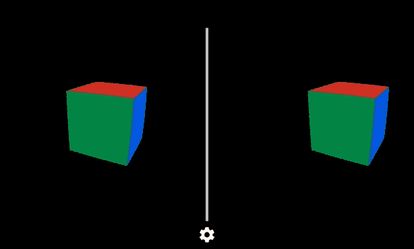

我不知道你，但我很兴奋！现在，让我们添加一些光和阴影。

# 带有面法线的立方体

现在，让我们向场景中添加光，并用它来渲染立方体。为此，我们还需要为立方体的每个面定义法线向量，这些向量在着色器计算中使用。

如果你从第三章中的`Cube`派生，*纸箱*，你可能已经有这段代码：

```kt
    public static final float[] CUBE_NORMALS_FACES = new float[] {
            // Front face
            0.0f, 0.0f, 1.0f,
            // Right face    
            1.0f, 0.0f, 0.0f,
            // Back face
            0.0f, 0.0f, -1.0f,
            // Left face
            -1.0f, 0.0f, 0.0f,
            // Top face
            0.0f, 1.0f, 0.0f,
            // Bottom face
            0.0f, -1.0f, 0.0f,
    };
```

现在，为法线添加一个缓冲区，就像我们为颜色和顶点分配的一样，并为它们分配空间：

```kt

public static FloatBuffer normalBuffer;
    ...

    public static void allocateBuffers(){
        ...

normalBuffer = allocateFloatBuffer( cubeFacesToArray(CUBE_NORMALS_FACES, 3) );
    }
```

我们将在`createMaterial`中添加一个光照选项参数，并使用`VertexColorLightingMaterial`来实现它，如果设置为`true`：

```kt
    public Cube createMaterial(boolean lighting){
 if(lighting){
 VertexColorLightingMaterial mat = new VertexColorLightingMaterial();
 mat.setBuffers(vertexBuffer, colorBuffer, normalBuffer, 36);
 material = mat;
 } else {
            VertexColorMaterial mat = new VertexColorMaterial();
            mat.setBuffers(vertexBuffer, colorBuffer, numIndices);
            material = mat;
 }
        return this;
    }
```

当然，`VertexColorLightingMaterial`类还没有编写。这很快就会出现。然而，首先我们应该创建一个`Light`组件，也可以添加到照亮场景。

我们将用两种变体重构`Cube()`构造方法。当没有给出参数时，`Cube`不会创建任何`Material`。当给出一个布尔光照参数时，它会传递给`createMaterial`以选择材料：

```kt
    public Cube(){
        super();
        allocateBuffers();
    }

    public Cube(boolean lighting){
        super();
        allocateBuffers();
        createMaterial(lighting);
    }
```

我们稍后会提醒你，但不要忘记在`MainActivity`中修改对`Cube(true)`的调用以传递光照选项。

请注意，出于方便起见，我们在构造函数中创建了材料。没有什么能阻止我们只是向`RenderObject`添加一个`setMaterial()`方法或使材料变量公开。事实上，随着对象和材料类型的增加，这成为唯一合理的进行的方式。这是我们简化的`Material`系统的一个缺点，它期望每种材料类型有一个不同的类。

# 光组件

在我们的场景中，光源是一种带有颜色和浮点数组的“组件”，用于表示在眼睛空间中计算出的位置。现在让我们创建“光源”类。

在`renderbox/components`文件夹中创建一个新的`Light` Java 类。定义如下：

```kt
public class Light extends Component {
    private static final String TAG = "RenderBox.Light";

    public final float[] lightPosInEyeSpace = new float[4];
    public float[] color = new float[]{1,1,1,1};

    public void onDraw(float[] view){
        Matrix.multiplyMV(lightPosInEyeSpace, 0, view, 0, transform.getPosition().toFloat4(), 0);
    }
}
```

我们的默认光源是白色（颜色为 1,1,1）。

`onDraw`方法根据`Transform`的位置乘以当前视图矩阵来计算眼睛空间中的实际光源位置。

可以扩展`RenderBox`以支持多个光源和其他复杂的渲染，比如阴影等等。但是，我们将限制场景中只有一个光源。因此，我们将保持它作为`RenderBox`中的实例变量。

现在，我们可以在`RenderBox`中向场景添加一个默认光源，就像我们之前添加`Camera`组件一样。在`RenderBox.java`中，添加以下代码：

```kt
    public Light mainLight;
```

修改`onSurfaceCreated`以初始化光源并将其添加到场景中：

```kt
    public void onSurfaceCreated(EGLConfig eglConfig) {
        ...
 mainLight = new Light();
 new Transform().addComponent(mainLight);
        mainCamera = new Camera();
        ...
    }
```

然后，在`Camera`类的`onDrawEye`中计算其位置（它可能会在每一帧中改变）。编辑`Camera.java`中的`Camera`类：

```kt
    public void onDrawEye(Eye eye) {
        ...
        // Apply the eye transformation to the camera.
        Matrix.multiplyMM(view, 0, eye.getEyeView(), 0, camera, 0);

// Compute lighting position

RenderBox.instance.mainLight.onDraw(view);
```

然后，我们还可以在`Material`类的`draw`方法中引用`mainLight`对象。我们本可以将颜色和位置声明为静态变量，因为我们只使用一个光源，但是为了未来支持多个光源，这样做更有意义。

# 顶点颜色照明材质和着色器

下一个主题有点复杂。我们将编写新的顶点和片段着色器来处理光照，并编写一个扩展`Material`的相应类来使用它们。不过，不用担心，我们之前已经做过一次了。这次我们只是要真正解释一下。

让我们直接开始。找到`res/raw/`文件夹。然后，对于每个文件，右键单击它，然后转到**新建** | **文件**以创建新文件。

文件：`res/raw/vertex_color_lighting_vertex.shader`

```kt
uniform mat4 u_Model;
uniform mat4 u_MVP;
uniform mat4 u_MVMatrix;
uniform vec3 u_LightPos;

attribute vec4 a_Position;
attribute vec4 a_Color;
attribute vec3 a_Normal;

varying vec4 v_Color;

const float ONE = 1.0;
const float COEFF = 0.00001;

void main() {
    vec3 modelViewVertex = vec3(u_MVMatrix * a_Position);
    vec3 modelViewNormal = vec3(u_MVMatrix * vec4(a_Normal, 0.0));

    float distance = length(u_LightPos - modelViewVertex);
    vec3 lightVector = normalize(u_LightPos - modelViewVertex);
    float diffuse = max(dot(modelViewNormal, lightVector), 0.5);

    diffuse = diffuse * (ONE / (ONE + (COEFF * distance * distance)));
    v_Color = a_Color * diffuse;
    gl_Position = u_MVP * a_Position;
}
```

顶点着色器使用模型视图变换矩阵将 3D 顶点映射到 2D 屏幕空间。然后，它找到光源距离和方向，计算该点的光颜色和强度。这些值通过图形管线传递。片段着色器然后确定光栅段中的像素颜色。

```kt
// File: res/raw/vertex_color_lighting_fragment.shader
precision mediump float;
varying vec4 v_Color;

void main() {
    gl_FragColor = v_Color;
}
```

现在，我们将创建`Material`。在`renderbox/materials/`文件夹中，创建一个`VertexColorLightingMaterial`类。定义它以扩展`Material`，然后声明其缓冲区和`setupProgram`和`draw`方法。以下是完整的代码：

```kt
public class VertexColorLightingMaterial extends Material {
    private static final String TAG = "vertexcollight";
    static int program = -1;
    //Initialize to a totally invalid value for setup state

    static int positionParam;
    static int colorParam;
    static int normalParam;
    static int MVParam;
    static int MVPParam;
    static int lightPosParam;

    FloatBuffer vertexBuffer;
    FloatBuffer normalBuffer;
    FloatBuffer colorBuffer;
    int numIndices;

    public VertexColorLightingMaterial(){
        super();
        setupProgram();
    }

    public static void setupProgram(){
        //Already setup?
		if (program != -1) return;
        //Create shader program
        program = createProgram(R.raw.vertex_color_lighting_vertex, R.raw.vertex_color_lighting_fragment);

        //Get vertex attribute parameters
        positionParam = GLES20.glGetAttribLocation(program, "a_Position");
        normalParam = GLES20.glGetAttribLocation(program, "a_Normal");
        colorParam = GLES20.glGetAttribLocation(program, "a_Color");

        //Enable vertex attribute parameters
        GLES20.glEnableVertexAttribArray(positionParam);
        GLES20.glEnableVertexAttribArray(normalParam);
        GLES20.glEnableVertexAttribArray(colorParam);

        //Shader-specific parameteters
        MVParam = GLES20.glGetUniformLocation(program, "u_MVMatrix");
        MVPParam = GLES20.glGetUniformLocation(program, "u_MVP");
        lightPosParam = GLES20.glGetUniformLocation(program, "u_LightPos");

        RenderBox.checkGLError("Solid Color Lighting params");
    }
    public void setBuffers(FloatBuffer vertexBuffer, FloatBuffer colorBuffer, FloatBuffer normalBuffer, int numIndices){
        this.vertexBuffer = vertexBuffer;
        this.normalBuffer = normalBuffer;
        this.colorBuffer = colorBuffer;
        this.numIndices = numIndices;
    }

    @Override
    public void draw(float[] view, float[] perspective) {
        GLES20.glUseProgram(program);

        GLES20.glUniform3fv(lightPosParam, 1, RenderBox.instance.mainLight.lightPosInEyeSpace, 0);

        Matrix.multiplyMM(modelView, 0, view, 0, RenderObject.lightingModel, 0);

        // Set the ModelView in the shader, used to calculate // lighting
        GLES20.glUniformMatrix4fv(MVParam, 1, false, modelView, 0);

        Matrix.multiplyMM(modelView, 0, view, 0, RenderObject.model, 0);
        Matrix.multiplyMM(modelViewProjection, 0, perspective, 0, modelView, 0);
        // Set the ModelViewProjection matrix in the shader.
        GLES20.glUniformMatrix4fv(MVPParam, 1, false, modelViewProjection, 0);

        // Set the normal positions of the cube, again for shading
        GLES20.glVertexAttribPointer(normalParam, 3, GLES20.GL_FLOAT, false, 0, normalBuffer);
        GLES20.glVertexAttribPointer(colorParam, 4, GLES20.GL_FLOAT, false, 0, colorBuffer);

        // Set the position of the cube
        GLES20.glVertexAttribPointer(positionParam, 3, GLES20.GL_FLOAT, false, 0, vertexBuffer);

        GLES20.glDrawArrays(GLES20.GL_TRIANGLES, 0, numIndices);
    }

    public static void destroy(){
        program = -1;
    }
}
```

这里有很多事情要做，但是如果你仔细阅读，就可以跟上。大多数情况下，材质代码设置了我们在着色器程序中编写的参数。

在`draw()`方法中特别重要的是，我们获取当前位置变换矩阵，`mainLight`的`RenderBox.instance.mainLight.lightPosInEyeSpace`和光颜色，并将它们传递给着色器程序。

现在是一个很好的时机来提及`GLES20.glEnableVertexAttribArray`的调用，这对于你使用的每个顶点属性都是必需的。顶点属性是为每个顶点指定的任何数据，因此在这种情况下，我们有位置、法线和颜色。与以前不同，我们现在使用法线和颜色。

介绍了新的`Material`后，让我们按照惯例将其添加到`RenderBox.reset()`中：

```kt
    public static void reset(){
        VertexColorMaterial.destroy();
 VertexColorLightingMaterial.destroy();
    }
```

最后，在`MainActivity`的`setup()`方法中，确保将光照参数传递给`Cube`构造函数：

```kt
    public void setup() {
        cube = new Transform();
        cube.addComponent(new Cube(true));
        cube.setLocalPosition(2.0f, -2.f, -5.0f);
    }
```

运行你的应用程序。TAADAA！现在我们有了。与非光照材质视图的差异可能很微妙，但它更真实，更虚拟。

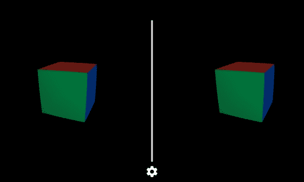

如果您想调整阴影，您可能需要调整用于计算漫反射光照的衰减值（例如，将`COEFF = 0.00001`更改为`0.001`）在`vertex_color_lighting_vertex.shader`中，具体取决于您场景的规模。对于那些仍然在黑暗中的人（意思是不了解），衰减是一个用于描述光强随距离减弱的术语，实际上也适用于任何物理信号（例如光、无线电、声音等）。如果您有一个非常大的场景，您可能需要一个较小的值（以便光线到达遥远的区域）或者相反（以便不是所有东西都在光线下）。您可能还希望将衰减设置为统一的浮点参数，可以根据材质或光源进行调整和设置，以实现恰到好处的光照条件。

到目前为止，我们一直在使用单个点光源照亮我们的场景。**点光源**是一个在 3D 空间中具有位置的光源，它在所有方向上均匀地投射光线。就像在房间的特定位置放置标准灯泡一样，重要的是它与物体之间的距离，以及光线击中表面的角度。对于点光源，旋转并不重要，除非使用 cookie 来将纹理应用到光线上。我们在书中没有实现光 cookie，但它们非常酷。

其他光源可以是定向光，它们将模拟地球上的阳光，所有光线基本上都朝着同一个方向。定向光具有影响光线方向的旋转，但它们没有位置，因为我们假设理论上的光源在沿着该方向矢量的无限远处。从图形学的角度来看，第三种光源是聚光灯，其中光线呈锥形，并在其击中的表面上投射出一个圆形或椭圆形。聚光灯最终将以与我们对 MVP 矩阵进行的透视变换类似的方式工作。在本书的示例中，我们将只使用单个点光源。其他光源类型的实现留给读者作为练习。

# 动画时间

是时候增加一些兴奋了。让我们动画化立方体，使其旋转。这将有助于演示阴影效果。

为此，我们需要一个`Time`类。这是一个单例实用程序类，用于计算帧并使该信息可用于应用程序，例如通过`getDeltaTime`。请注意，这是一个`final`类，这意味着它不能被扩展。在 Java 中没有静态类，但如果我们将构造函数设置为私有，我们可以确保没有东西会实例化它。

在`renderbox/`文件夹中创建一个新的`Time`类。它不会被扩展，所以我们可以将其声明为`final`。以下是代码：

```kt
public final class Time {
    private Time(){}
    static long startTime;
    static long lastFrame;
    static long deltaTime;
    static int frameCount;

    protected static void start(){
        frameCount = 0;
        startTime = System.currentTimeMillis();
        lastFrame = startTime;
    }
    protected static void update(){
        long current =System.currentTimeMillis();
        frameCount++;
        deltaTime = current - lastFrame;
        lastFrame = current;
    }

    public static int getFrameCount(){return frameCount;}

    public static float getTime(){
        return (float)(System.currentTimeMillis() - startTime) / 1000;
    }

    public static float getDeltaTime(){
        return deltaTime * 0.001f;
    }
}
```

在`RenderBox`设置中启动计时器：

```kt
    public RenderBox(Activity mainActivity, IRenderBox callbacks){
        ...
 Time.start();
    }
```

然后，在`RenderBox`的`onNewFrame`方法中调用`Time.update()`：

```kt
    public void onNewFrame(HeadTransform headTransform) {
 Time.update();
        ...
}
```

现在，我们可以使用它来修改每帧的立方体变换，通过`preDraw()`接口挂钩。在`MainActivity`中，使立方体每秒围绕*X*轴旋转 5 度，*Y*轴旋转 10 度，*Z*轴旋转 7.5 度：

```kt
    public void preDraw() {
        float dt = Time.getDeltaTime();
        cube.rotate(dt * 5, dt * 10, dt * 7.5f);
    }
```

`getDeltaTime()`方法返回自上一帧以来的秒数。因此，如果我们希望它每秒围绕*X*轴旋转 5 度，我们将`deltaTime`乘以 5，以获得这一帧要旋转的度数的比例。

运行应用程序。摇滚起来！！！

# 检测物体的朝向

等等，还有更多！只需再添加一件事。构建交互式应用程序需要我们能够确定用户是否凝视特定对象。我们可以将其放入`RenderObject`中，以便场景中的任何对象都可以被凝视检测到。

我们将实现的技术很简单。考虑到我们渲染的每个对象都投影到相机平面上，我们实际上只需要确定用户是否在观察对象的平面。基本上，我们检查相机和平面位置之间的向量是否与相机的视角方向相同。但我们会加入一些容差，这样你就不必完全看着平面的中心（那样是不切实际的）。我们将检查一个狭窄的范围。一个好的方法是计算这些向量之间的角度。我们计算这些向量之间的俯仰和偏航角度（分别是上/下*X*轴角度和左/右*Y*轴角度）。然后，我们检查这些角度是否在一个狭窄的阈值范围内，表明用户正在观察平面（多多少少）。

这种方法就像第三章*纸板箱*中使用的方法一样，尽管当时我们把它放在了`MainActivity`中。现在，我们将其移动到`RenderObject`组件中。

请注意，这可能会变得低效。这种技术对我们的项目来说是可以的，因为对象的数量有限，所以计算并不昂贵。但是，如果我们有一个包含许多对象的大型复杂场景，这种设置就会不够用了。在这种情况下，一个解决方案是添加一个`isSelectable`标志，以便只有在给定帧中应该是交互式的对象才会是交互式的。

如果我们使用一个功能齐全的游戏引擎，我们将拥有一个物理引擎，能够进行`raycast`来精确确定你的凝视中心是否与对象交叉，具有很高的准确度。虽然在游戏中这可能很棒，但对于我们的目的来说有些过度了。

在`RenderObject`的顶部，添加一个布尔变量来存储`isLooking`值。还要添加两个变量来保存偏航和俯仰范围限制，以检测相机的观察角度，以及我们将用于计算的`modelView`矩阵：

```kt
    public boolean isLooking;
    private static final float YAW_LIMIT = 0.15f;
    private static final float PITCH_LIMIT = 0.15f;
    final float[] modelView = new float[16];
```

`isLookingAtObject`方法的实现如下。我们将对象空间转换为相机空间，使用`onNewFrame`中的`headView`值，计算俯仰和偏航角度，然后检查它们是否在容差范围内：

```kt
    private boolean isLookingAtObject() {
        float[] initVec = { 0, 0, 0, 1.0f };
        float[] objPositionVec = new float[4];

        // Convert object space to camera space. Use the headView // from onNewFrame.
        Matrix.multiplyMM(modelView, 0, RenderBox.headView, 0, model, 0);
        Matrix.multiplyMV(objPositionVec, 0, modelView, 0, initVec, 0);

        float pitch = (float) Math.atan2(objPositionVec[1], -objPositionVec[2]);
        float yaw = (float) Math.atan2(objPositionVec[0], -objPositionVec[2]);

        return Math.abs(pitch) < PITCH_LIMIT && Math.abs(yaw) < YAW_LIMIT;
    }
```

为了方便起见，我们将在对象绘制时同时设置`isLooking`标志。在`draw`方法的末尾添加调用：

```kt
    public void draw(float[] view, float[] perspective){
        . . . 
 isLooking = isLookingAtObject();
    }
```

就是这样。

对于一个简单的测试，当用户凝视立方体时，我们将在控制台上记录一些文本。在`MainActivity`中，为`Cube`对象创建一个单独的变量：

```kt
    Cube cubeObject;

    public void setup() {
        cube = new Transform();
        cubeObject = new Cube(true);
        cube.addComponent(cubeObject);
        cube.setLocalPosition(2.0f, -2.f, -5.0f);
    }
```

然后，在`postDraw`中进行测试，如下所示：

```kt
    public void postDraw() {
        if (cubeObject.isLooking) {
            Log.d(TAG, "isLooking at Cube");
        }
    }
```

# 导出 RenderBox 包

既然我们已经完成了创建这个美丽的`RenderBox`库，那么我们如何在其他项目中重用它呢？这就是**模块**和`.aar`文件发挥作用的地方。在 Android 项目之间共享代码有许多方法。最明显的方法是根据需要将代码片段直接复制到下一个项目中。虽然在某些情况下这是完全可以接受的，实际上应该是你正常流程的一部分，但这可能会变得相当乏味。如果我们有一堆相互引用并依赖于某个文件层次结构的文件，比如`RenderBox`，那该怎么办呢？如果你熟悉 Java 开发，你可能会说，“显然只需将编译后的类导出为`.jar`文件。”你说得对，除了这是 Android。我们还有一些生成的类以及包含，这种情况下，我们的着色器代码的`/res`文件夹。实际上我们想要的是一个`.aar`文件。Android 程序员可能熟悉`.aidl`文件，它们用于类似的目的，但专门用于在应用程序之间建立接口，而不是封装功能代码。

要生成一个`.aar`文件，我们首先需要将我们的代码放入一个具有与应用程序不同输出的 Android Studio 模块中。从这一点开始，您有几个选项。我们建议您创建一个专用的 Android Studio 项目，其中包含`RenderBox`模块以及一个测试应用程序，它将与库一起构建，并作为一种手段来确保您对库所做的任何更改不会破坏任何内容。您也可以只是将`renderbox`包和`/res/raw`文件夹复制到一个新项目中，然后从那里开始，但最终您会发现模块更加方便。

您可能会认为"我们将把这个新项目称为`RenderBox`"，但您可能会遇到问题。基本上，构建系统无法处理项目和模块具有相同名称的情况（它们应该具有相同的包名称，这是不允许的）。如果您将项目命名为`RenderBox`（从技术上讲，如果您遵循了说明，您不应该这样做），并包含一个活动，然后创建一个名为`RenderBox`的模块，您将看到一个构建错误，抱怨项目和模块共享名称。如果您创建一个没有活动的空项目，称为`RenderBox`，并添加一个名为`RenderBox`的模块，您可能会得逞，但一旦您尝试从该项目构建应用程序，您会发现无法构建。因此，我们建议您从这里的下一步是创建一个名为`RenderBoxLib`的新项目。

## 构建 RenderBoxLib 模块

让我们试试看。转到**文件** | **新建** | **新项目**。将项目命名为`RenderBoxLib`。

我们不需要`MainActivity`类，但我们仍然需要一个，如前所述，作为测试用例来确保我们的库正常工作。在库项目中添加一个测试应用程序不仅使我们能够在一个步骤中测试对库的更改，而且还确保我们不能构建库的新版本而不确保使用它的应用程序也可以编译它。即使您的库没有语法错误，当您将其包含在新项目中时，它可能仍会破坏编译。

因此，继续添加一个**空活动**，然后在默认选项中点击**完成**。

到目前为止都是熟悉的领域。然而，现在我们要创建一个新模块：

1.  转到**文件** | **新建** | **新模块**，然后选择**Android 库**：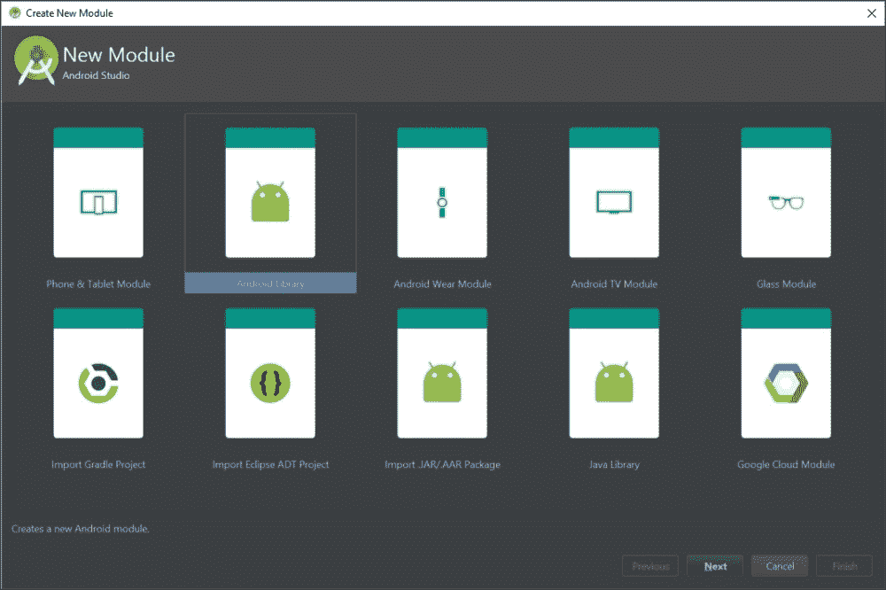

1.  将其命名为`RenderBox`。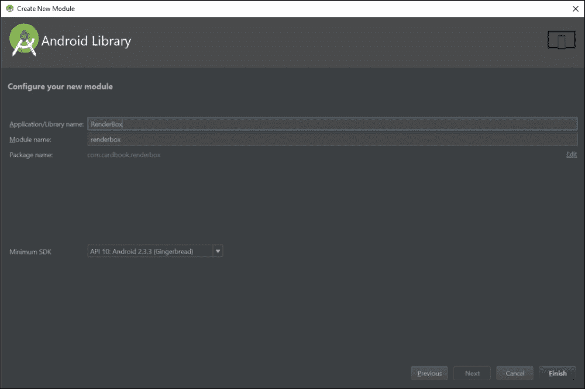

1.  现在，我们在项目视图中有一个新文件夹：

不要在 Android Studio 中执行下一步，让我们使用文件管理器（Windows 资源管理器或 Finder，或者如果您是专业人士，则使用终端）将`RenderBox`文件从现有项目复制到新项目中。如果您使用版本控制，您可能考虑将存储库转移到新项目，或在复制之前创建一个初始提交；这取决于您以及您对保留历史记录的重视程度。

我们希望将所有`RenderBox`代码从`RenderBoxDemo`项目的`/app/src/main/java/com/cardbookvr/renderbox`文件夹复制到`RenderBoxLib`的`/renderbox/src/main/java/com/cardbookvr/renderbox`文件夹中。

资源也是一样的；从`RenderBoxDemo`项目的`/app/src/main/res/raw`文件夹复制到`/renderbox/src/main/res/raw`文件夹。

这意味着我们在原始项目中创建的几乎每个`.java`和`.shader`文件都会放入新项目的模块中，放在相应的位置。

我们不会将`MainActivity.java`或任何 XML 文件，比如`layouts/activity_main.xml`或`AndroidManifest.xml`转移到模块中。这些都是特定于应用程序的文件，不包括在库中。

复制文件后，返回到 Android Studio，点击**同步**按钮。这将确保 Android Studio 已经注意到了新文件。

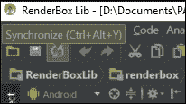

然后，在层次结构面板中选择`renderbox`，通过导航到**构建** | **构建模块'RenderBox'**（或*Ctrl* + *Shift* + *F9*）来启动构建。您会看到一堆错误。让我们处理一下。

`RenderBox`引用了 Cardboard SDK，因此，我们必须以类似的方式将其作为依赖项包含在`RenderBox`模块中，就像在项目开始时那样：

1.  将 Cardboard SDK 的`common.aar`和`core.aar`库文件作为新模块添加到项目中，使用**文件** | **新建** | **新建模块...**和**导入.JAR/.AAR 包**。

1.  将库模块设置为`RenderBox`模型的依赖项，使用**文件** | **项目结构**。在左侧面板中，选择`RenderBox`，然后选择**依赖项**选项卡 | **+** | **模块依赖项**，并添加 common 和 core 模块。

一旦您同步项目并触发构建，您希望看到与`CardboardView`相关的错误和其他错误消失。

又一次构建。还有其他错误吗？

这是因为之前提到的命名问题。如果您的模块包名称与原始项目的包名称不匹配（即`com.cardbookvr.renderbox`），则必须在复制的 Java 文件中将其重命名。即使这些匹配，我们将原始项目命名为`RenderBoxDemo`，这意味着生成的 R 类将成为`com.cardbookvr.renderboxdemo`包的一部分。对这个包的任何导入引用都需要更改。

首先删除引用`com.cardbookvr.renderboxdemo`（如`Material` Java 文件）的行。然后，任何对 R 类的引用都会显示为错误：


删除这行，Android Studio 将生成一个新的有效导入行。尝试再次构建。如果没有错误，我们就可以继续了。

现在您会看到关于 R 的引用显示为错误，并提出建议：

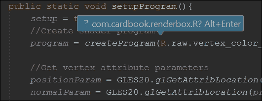

如果您继续按*Alt* + *Enter*，Android Studio 将为您的代码添加适当的导入行。如果您看不到*Alt* + *Enter*工具提示，请尝试将光标放在 R 旁边。通过这种方式使用该功能，您必须从按*Alt* + *Enter*后看到的菜单中选择**导入类**。如果仍然看到错误，请确保您已将着色器代码复制到`/renderbox/res/raw`文件夹中，并且没有其他错误干扰此过程。基本上，我们正在从代码中删除任何外部引用，并使`RenderBox`能够独立构建。我们也可以通过简单地将`import com.cardbook.renderbox.R;`粘贴到`import com.cardbook.renderboxdemo.R;`上来完成此代码修复。这可能比第一种方法更容易，但那样您就不会了解*Alt* + *Enter*了。

完成后，我们应该能够无错误地构建。这可能看起来有点凌乱，但偶尔凌乱一下也无妨。您甚至可能会对构建流程有所了解。

如果一切顺利，您会在`renderbox/build/outputs/aar/`中看到一个名为`renderbox-debug.aar`的文件。如果是这样，您就完成了。哇！

最后一点想法：您应该在最终应用程序中包含`renderbox-release.aar`，但与此同时将失去有用的调试功能。我们不会在本书中讨论如何在调试和发布之间切换，但了解构建配置对发布流程至关重要。

## RenderBox 测试应用程序

这个新项目包含了`renderbox`模块，但也有一个我们最初创建的`app`文件夹。`app`是我们可以实现测试应用程序的地方，以确保至少库已构建并基本运行。

我们将对`RenderBoxLib`中的应用程序模块执行与我们的新项目相同的操作（就像`renderbox`一样，`app`是一个模块。原来我们一直在使用模块！）：

1.  右键单击`app`文件夹，转到**打开模块设置**，并将现有的`renderbox`模块作为**模块依赖项**添加到**编译范围**中。请注意，依赖项不能是循环的。现在`renderbox`是应用程序的依赖项，反之则不成立。

1.  更新`/res/layout/activity_main.xml`和`AndroidManifest.xml`，就像我们在本章开头看到的那样。（如果您只是复制代码，请确保将`package=`值更改为当前名称，例如`com.cardbookvr.renderboxlib`）。

1.  设置`class MainActivity extends CardboardActivity implements IRenderBox`。

1.  我们现在还希望我们的`MainActivity`类实例化`RenderBox`并定义一个`setup()`方法，就像`RenderBoxDemo`中的`MainActivity`一样。实际上，只需复制整个`RenderBoxDemo`中的`MainActivity`类，并确保您不要复制/覆盖新文件的顶部的包定义。

幸运的话，您应该能够单击绿色运行按钮，选择目标设备，并看到一个运行中的应用程序，其中包含我们的伙伴，顶点颜色立方体。从最终结果来看，我们已经正式倒退了，但我们的应用程序特定代码非常干净和简单！

## 在未来项目中使用 RenderBox

现在我们已经经历了所有这些麻烦，让我们进行一次试运行，看看如何使用我们漂亮的小包装。再来一次。您可以执行以下步骤来启动本书中的每个后续项目：

1.  创建一个新项目，可以随意命名，例如`MyCardboardApp`，用于 API 19 KitKat。包括**空活动**。

1.  现在，转到**文件** | **新建** | **新建模块...**。这有点违反直觉，尽管我们正在导入一个现有模块，但我们正在将一个新模块添加到这个项目中。选择**导入.JAR/.AAR 包**。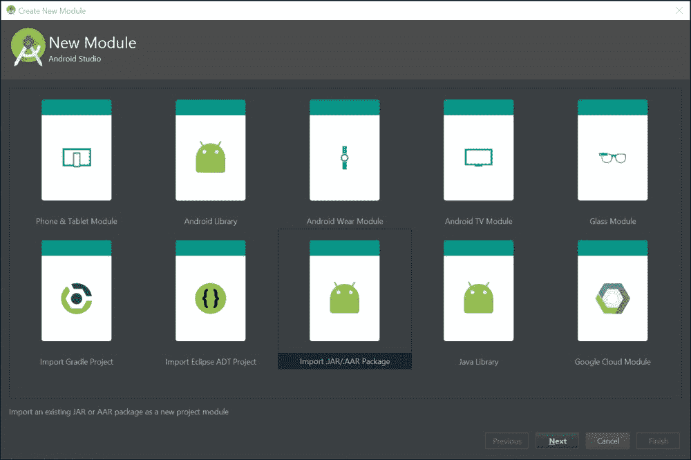

1.  您需要导航到`RenderBoxLib/renderbox/build/outputs`文件夹，选择`.aar`文件。我们建议将模块重命名为`renderbox`，而不是`renderbox-debug`。单击**完成**。对于生产应用程序，您希望在项目中有两个不同的模块：一个用于调试，一个用于发布，但是在本书的项目中，我们只使用调试。

1.  既然我们有了这个新模块，我们需要将其添加为默认应用程序的依赖项。返回熟悉的**模块设置**屏幕，转到`app`的**依赖项**选项卡。单击右侧的加号标签，并选择**模块依赖项**：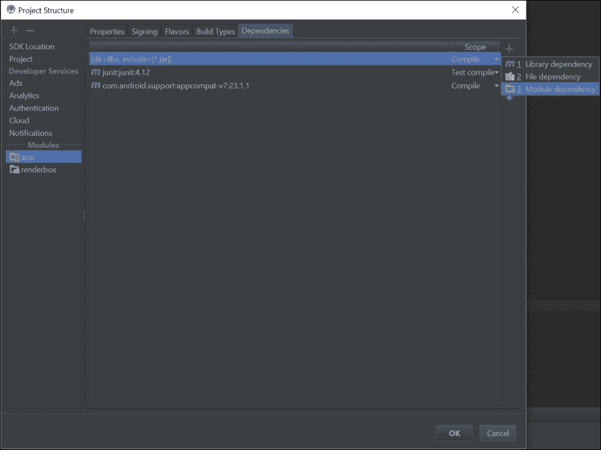

1.  然后，您可以添加`renderbox`：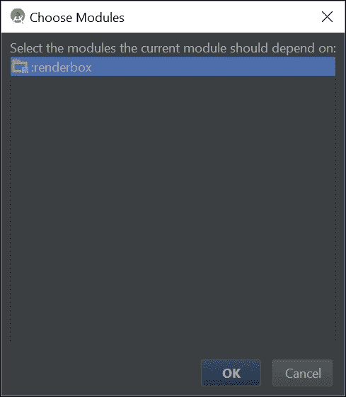

现在，我们在新项目的`/renderbox`模块文件夹中有了`.aar`文件的副本。当您对`RenderBox`库进行更改时，您只需要构建一个新的`.aar`文件（构建菜单，`MakeProject`），覆盖新项目中的副本，并触发项目同步，或者如果您想确保，可以进行清理和重建。新项目不会保持与库输出项目的构建文件夹的链接。

设置新项目所需的其余步骤如下：

1.  使用**文件** | **新建模块**导入 Cardboard SDK 的`.aar`包`common`和`core`，并将它们作为应用程序的依赖项添加进去。

1.  更新`/res/layout/activity_main.xml`和`AndroidManifest.xml`，就像我们刚刚为`RenderBoxDemo`所做的那样。

1.  设置`MainActivity`类，使其扩展`CardboardActivity`并实现`IRenderBox`，使用与以前相同的代码。

1.  我们现在也希望我们的`MainActivity`类实例化`RenderBox`并定义一个`setup()`方法，就像我们在`RenderBoxDemo`中的`MainActivity`类一样。实际上，只需复制整个`MainActivity`类，并小心不要复制/覆盖文件顶部的包定义。

再次构建和运行。搞定了！我们现在可以继续进行一些很酷的东西。

### 注意

从现在开始，这将是我们的新项目流程，因为本书中的其余项目都使用`RenderBox`库模块。

关于模块流程的最后一句话：剥橙子的方法不止一种。您可以在`RenderBox`演示项目中创建一个新模块，获取其输出，然后开始运行。您还可以只是复制源文件并尝试使用 Git 子模块或子树来同步源代码。IntelliJ 文档中的这一页讨论了一些更细节的内容（[`www.jetbrains.com/idea/help/sharing-android-source-code-and-resources-using-library-projects.html`](https://www.jetbrains.com/idea/help/sharing-android-source-code-and-resources-using-library-projects.html)）。在关于保持主要活动和布局文件完全特定于应用程序的决定以及在`RenderBox`模块中包含大部分或全部着色器和材料的决定方面，我们也做出了某些决定。在这些决策点中，都有利弊，我们建议您在未来的项目中仔细考虑如何构建自己的代码。

# 总结

在本章中，我们创建了一个简短而轻巧的图形引擎，用于构建新的 Cardboard VR 应用程序。我们将低级别的 OpenGL ES API 调用抽象成一套`Material`类和一个`Camera`类。我们为几何实体定义了`RenderObject`，以及从`Component`类继承的`Camera`和`Light`组件。我们定义了一个`Transform`类，用于在 3D 空间中层次化地组织和定位实体（包含组件）。所有这些都集成在`RenderBox`类下，该类在`MainActivity`类中实例化和控制，而`MainActivity`类又实现了`IRenderBox`接口。我们通过指定`MainActivity`类作为`IRenderBox`的实现者，并实现`setup`、`preDraw`和`postDraw`来完成循环。

为了开发这个库，我们遵循了第三章*纸板盒*中涵盖的大部分内容，少了一些关于如何使用 OpenGL ES 和矩阵库的解释，更多地关注实现我们的`RenderBox`软件架构。

生成的`RenderBox`引擎库现在在自己的项目中。在接下来的章节中，我们将重用这个库，并且我们将扩展它，包括新的组件和材料。我们鼓励您将`RenderBoxLib`代码保存在源代码仓库中，比如 Git。当然，最终的代码是与书籍资产一起提供的，并且在我们的 GitHub 仓库中也有。

下一章是一个科学项目！我们将建立一个我们太阳系的模型，包括太阳、行星、卫星和星空。使用`RenderBox`，我们将添加一个`Sphere`组件，并将纹理着色器添加到我们的材料套件中。
