# 第七章：360 度画廊

360 度全景照片和视频是虚拟现实的一种不同方法。与使用 OpenGL 实时渲染 3D 几何图形不同，您让用户四处查看一个预先渲染或拍摄的场景。360 度查看器是向消费者介绍 VR 的绝佳方式，因为它们提供了非常自然的体验，并且易于制作。拍摄照片比实时渲染物体的逼真场景要容易得多。使用新一代 360 度摄像机或 Google 相机应用程序中的全景图像功能很容易记录图像。查看预先录制的图像需要比渲染完整的 3D 场景需要更少的计算机功率，并且在移动 Cardboard 查看器上运行良好。电池电量也不应该是一个问题。

非 VR 360 度媒体已经相当普遍。例如，多年来，房地产列表网站提供了带有基于网络的播放器的全景漫游，让您可以交互地查看空间。同样，YouTube 支持上传和播放 360 度视频，并提供一个带有交互式控件的播放器，可以在播放期间四处查看。Google 地图允许您上传 360 度静态全景图像，就像他们的街景工具一样，您可以使用 Android 或 iOS 应用程序（有关更多信息，请访问[`www.google.com/maps/about/contribute/photosphere/`](https://www.google.com/maps/about/contribute/photosphere/)）或消费者 360 摄像机创建。互联网上充斥着 360 度媒体！

在 VR 中查看 360 度媒体令人惊讶地沉浸，即使是静态照片（甚至没有成对的立体图像）。你站在一个球体的中心，图像投影在内表面上，但你感觉自己真的在被捕捉的场景中。只需转动头部来四处看。

在这个项目中，我们将构建一个照片库，让您可以在手机上浏览照片。常规的平面图片和全景照片将显示在您左侧的大屏幕上。但是 360 度全景照片将完全沉浸您在球形投影中。我们将通过以下步骤完成这个项目：

+   设置新项目

+   查看 360 度全景照片

+   在大型虚拟投影屏幕上查看常规照片

+   为照片添加边框

+   从设备的相机文件夹加载和显示照片图像

+   调整照片的方向和长宽比

+   创建一个用户界面，其中包含一个缩略图图像网格，用于选择要滚动查看的照片

+   确保良好的、响应迅速的 VR 体验，具有线程安全的操作

+   启动 Android 图像查看意图应用程序

此项目的源代码可以在 Packt Publishing 网站上找到，并且在 GitHub 上也可以找到[`github.com/cardbookvr/gallery360`](https://github.com/cardbookvr/gallery360)（每个主题都是单独的提交）。

# 设置新项目

要构建这个项目，我们将使用我们在第五章中创建的`RenderBox`库，*RenderBox Engine*。您可以使用您自己的库，或者从本书提供的下载文件或我们的 GitHub 存储库中获取一份副本（使用标记为`after-ch6`的提交——[`github.com/cardbookvr/renderboxlib/releases/tag/after-ch6`](https://github.com/cardbookvr/renderboxlib/releases/tag/after-ch6)）。有关如何导入`RenderBox`库的更详细描述，请参阅第五章中的最后一节，*在未来项目中使用 RenderBox*。要做到这一点，请执行以下步骤：

1.  打开 Android Studio，创建一个新项目。让我们将其命名为`Gallery360`，并针对**Android 4.4 KitKat（API 19）**使用**空活动**。

1.  为`renderbox`，`common`和`core`包创建新模块，使用**文件** | **新模块** | **导入.JAR/.AAR 包**。

1.  将模块设置为应用程序的依赖项，使用**文件** | **项目结构**。

1.  根据第二章中的说明编辑`build.gradle`文件，*骨架 Cardboard 项目*，以便编译 SDK 22。

1.  更新`/res/layout/activity_main.xml`和`AndroidManifest.xml`，如前几章所述。

1.  将`MainActivity`编辑为`class MainActivity extends CardboardActivity implements IRenderBox`，并实现接口方法存根（*Ctrl* + *I*）。

我们可以继续在`MainActivity`中定义`onCreate`方法。该类现在有以下代码：

```kt
public class MainActivity extends CardboardActivity implements IRenderBox {
    private static final String TAG = "Gallery360";
    CardboardView cardboardView;
    @Override
    protected void onCreate(Bundle savedInstanceState) {
        super.onCreate(savedInstanceState);
        setContentView(R.layout.activity_main);

        cardboardView = (CardboardView) findViewById(R.id.cardboard_view);
        cardboardView.setRenderer(new RenderBox(this, this));
        setCardboardView(cardboardView);
    }
    @Override
    public void setup() {

    }
    @Override
    public void preDraw() {
        // code run beginning each frame
    }
    @Override
    public void postDraw() {
        // code run end of each frame
    }
}
```

在我们实施这个项目的过程中，我们将创建一些可能成为`RenderBoxLib`的好扩展的新类。起初，我们将把它们作为这个项目中的常规类。然后，在本章末，我们将帮助您将它们移动到`RenderBoxLib`项目中，并重新构建库。执行以下步骤：

1.  右键单击`gallery360`文件夹（`com.cardbookvr.gallery360`），然后转到**新建** | **包**，并命名包为`RenderBoxExt`。

1.  在`RenderBoxExt`中，创建名为`components`和`materials`的包子文件夹。

没有真正的技术需要将其作为一个单独的包，但这有助于组织我们的文件，因为`RenderBoxExt`中的文件将在本章末被移动到我们的可重用库中。

您可以将一个立方体临时添加到场景中，以确保一切设置正确。将其添加到`setup`方法中，如下所示：

```kt
    public void setup() {
        new Transform()
            .setLocalPosition(0,0,-7)
            .setLocalRotation(45,60,0)
            .addComponent(new Cube(true));
    }
```

如果你记得的话，立方体是添加到变换中的一个组件。立方体定义了它的几何形状（例如，顶点）。变换定义了它在 3D 空间中的位置、旋转和缩放。

您应该能够在 Android 设备上点击**运行'app'**，没有编译错误，并看到立方体和 Cardboard 分屏视图。

# 查看 360 度照片

自从发现地球是圆的以来，制图师和水手们一直在努力将球形地球投影到二维图表上。结果是对地球某些区域的不可避免的失真。

### 注意

要了解更多关于地图投影和球体失真的信息，请访问[`en.wikipedia.org/wiki/Map_projection`](http://en.wikipedia.org/wiki/Map_projection)。

对于 360 度媒体，我们通常使用等经纬（或子午线）投影，其中球体被展开成柱状投影，随着你向北极和南极推进，纹理会被拉伸，而经线则保持等距垂直直线。为了说明这一点，考虑提索特指示圈（访问[`en.wikipedia.org/wiki/Tissot%27s_indicatrix`](http://en.wikipedia.org/wiki/Tissot%27s_indicatrix)了解更多信息），它显示了一个球体，上面有战略性排列的相同圆圈（Stefan Kühn 的插图）：

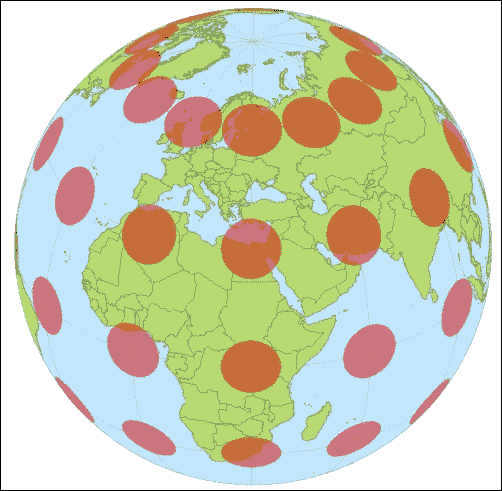

以下图片显示了使用等经纬投影（[`en.wikipedia.org/wiki/Equirectangular_projection`](https://en.wikipedia.org/wiki/Equirectangular_projection)）展开的地球：

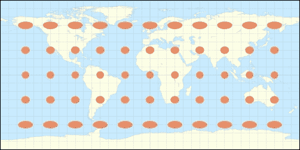

我们将为我们的全景照片使用等经纬网格和适当投影（扭曲）的图像作为纹理贴图。为了查看，我们将相机视点放在球体的中心，并将图像渲染到内表面。

您可能已经注意到，我们的地球和其他行星纹理上有相同类型的失真。这是将球形图像映射到平面图像的一种常见方式，事实上，自从我们在第六章中为我们的球体创建 UV 以来，我们一直在“计算”这个问题！您将不得不在 UV 偏移上下些功夫，以防止它们出现拉伸，但您也应该能够以同样的方式在球体上显示全景照片。

## 查看一个样本全景照片

您可以为这个主题选择任何 360 度等经纬图像。我们在本书中包含了以下海滩照片，名为`sample360.jpg`：


将其添加到您的项目中。

将要查看的图像复制到项目的`res/drawable/`文件夹中。现在将以下代码添加到`MainActivity.java`文件中：

```kt
    final int DEFAULT_BACKGROUND = R.drawable.sample360;

    Sphere photosphere;

    @Override
    public void setup() {
        setupBackground();
    }

    void setupBackground() {
        photosphere = new Sphere(DEFAULT_BACKGROUND, false);
        new Transform()
            .setLocalScale(Camera.Z_FAR * 0.99f, -Camera.Z_FAR * 0.99f, Camera.Z_FAR * 0.99f)
            .addComponent(photosphere);
    }
```

注意，将比例乘以 0.99 可以避免由于某些手机上的浮点精度错误而导致背景图像的不必要剪裁。使用负比例*y*轴可以补偿纹理着色器的反向渲染（或者您可以修改着色器代码）。

您可以用您的文件名替换可绘制的文件名`R.drawable.sample360`，如`DEFAULT_BACKGROUND`变量中所定义的那样。这个变量必须是 final 的，根据 Android 资源系统的要求。

在`setup`方法中，我们像一直以来一样创建一个`Sphere`组件。从一个新的变换开始，缩放它，然后向变换添加一个新的`Sphere`组件，带有我们的资源 ID。我们将对象命名为`background`，因为以后，这个对象将成为应用程序的默认背景。

运行应用程序，并将手机插入 Cardboard 查看器中。哇！你来到了 Margaritaville！如果这看起来很容易，那么你是对的；它确实很容易！实际上，艰苦的工作是由全景应用程序或其他将图像转换为等距投影的应用程序完成的。其余的工作就是我们一直在做的标准 UV 投影数学！

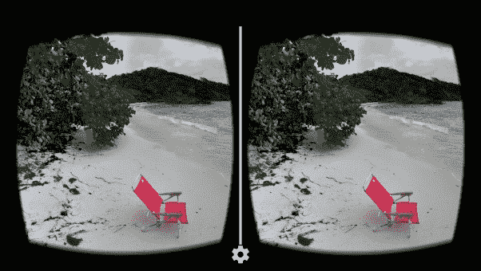

## 使用背景图像

我们将制作一个画廊，让用户从多张图片中选择。当用户第一次启动应用程序时，如果用户看到一些更中性的东西会很好。这本书的可下载文件中包含了一个更合适的背景图像。它的名称是`bg.png`，包含一个常规的网格。将其复制到您的`res/drawable/`文件夹中。然后，将`DEFAULT_BACKGROUND`更改为`R.drawable.bg`。

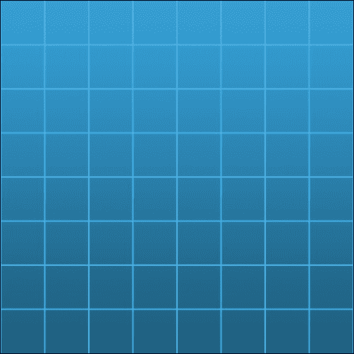

重新运行应用程序，应该看起来像这样：

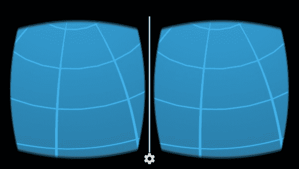

# 查看常规照片

现在我们已经完成了这个，让我们准备我们的应用程序也能够查看常规的平面照片。我们将通过将它们渲染到一个平面上来实现这一点。所以首先我们需要定义一个`Plane`组件。

## 定义 Plane 组件并分配缓冲区

`Plane`组件理所当然地属于`RenderBox`库，但目前，我们将直接将其添加到应用程序中。

在`RenderBoxExt/components/`文件夹中创建一个新的 Java 类文件，并将其命名为`Plane`。将其定义为`extends RenderObject`，如下所示：

```kt
public class Plane extends RenderObject {
}
```

与`RenderBox`库中的其他几何图形一样，我们将用三角形定义平面。只需要两个相邻的三角形，总共六个索引。以下数据数组定义了我们默认平面的 3D 坐标、UV 纹理坐标、顶点颜色（中灰色）、法线向量和相应的索引。在类的顶部添加以下代码：

```kt
    public static final float[] COORDS = new float[] {
            -1.0f, 1.0f, 0.0f,
            1.0f, 1.0f, 0.0f,
            -1.0f, -1.0f, 0.0f,
            1.0f, -1.0f, 0.0f
    };
    public static final float[] TEX_COORDS = new float[] {
            0.0f, 1.0f,
            1.0f, 1.0f,
            0f, 0f,
            1.0f, 0f,
    };
    public static final float[] COLORS = new float[] {
            0.5f, 0.5f, 0.5f, 1.0f,
            0.5f, 0.5f, 0.5f, 1.0f,
            0.5f, 0.5f, 0.5f, 1.0f,
            0.5f, 0.5f, 0.5f, 1.0f
    };
    public static final float[] NORMALS = new float[] {
            0.0f, 0.0f, -1.0f,
            0.0f, 0.0f, -1.0f,
            0.0f, 0.0f, -1.0f,
            0.0f, 0.0f, -1.0f
    };
    public static final short[] INDICES = new short[] {
            0, 1, 2,
            1, 3, 2
    };
```

现在，我们可以定义`Plane`构造函数，调用`allocateBuffers`辅助方法为顶点、法线、纹理和索引分配缓冲区。让我们在类的顶部声明这些变量，并编写方法：

```kt
    public static FloatBuffer vertexBuffer;
    public static FloatBuffer colorBuffer;
    public static FloatBuffer normalBuffer;
    public static FloatBuffer texCoordBuffer;
    public static ShortBuffer indexBuffer;
    public static final int numIndices = 6;

    public Plane(){
        super();
        allocateBuffers();
    }

    public static void allocateBuffers(){
        //Already allocated?
        if (vertexBuffer != null) return;
        vertexBuffer   = allocateFloatBuffer(COORDS);
        texCoordBuffer = allocateFloatBuffer(TEX_COORDS);
        colorBuffer    = allocateFloatBuffer(COLORS);
        normalBuffer   = allocateFloatBuffer(NORMALS);
        indexBuffer    = allocateShortBuffer(INDICES);
    }
```

同样，我们通过检查`vertexBuffer`是否为空来确保`allocateBuffers`只运行一次。（请注意，我们决定将缓冲区声明为`public`，以便将来可以为对象创建任意纹理材料。）

## 向 Plane 组件添加材质

接下来，我们可以向`Plane`添加一个适当的材质，使用纹理图像。使用与内置`Sphere`组件在第六章*太阳系*中一致的构造函数 API 模式，我们将添加调用一个新的`Plane`的能力，带有图像纹理 ID 和可选的光照布尔标志。然后，我们将添加帮助方法来分配相应的`Material`对象并设置它们的缓冲区：

```kt
    public Plane(int textureId, boolean lighting) {
        super();
        allocateBuffers();
        if (lighting) {
            createDiffuseMaterial(textureId);
        } else {
            createUnlitTexMaterial(textureId);
        }
    }

    public Plane createDiffuseMaterial(int textureId) {
        DiffuseLightingMaterial mat = new DiffuseLightingMaterial(textureId);
        mat.setBuffers(vertexBuffer, normalBuffer, texCoordBuffer, indexBuffer, numIndices);
        material = mat;
        return this;
    }

    public Plane createUnlitTexMaterial(int textureId) {
        UnlitTexMaterial mat = new UnlitTexMaterial(textureId);
        mat.setBuffers(vertexBuffer, texCoordBuffer, indexBuffer, numIndices);
        material = mat;
        return this;
    }
```

## 向场景添加图像屏幕

现在我们可以在`MainActivity`中向场景添加图像了。很快我们将在手机的照片文件夹中查看照片，但在这一点上，你可以使用我们之前使用过的相同（全景）照片（或者将另一张放在你的`res/drawable`文件夹中）。请注意，如果图像对于手机的 GPU 来说太大，可能会出现显示问题。我们稍后会解决这个问题，所以尽量保持在任何维度上小于 4096 像素。

将对象命名为`screen`，因为稍后我们将用它来投影用户从画廊中选择的照片。

在`MainActivity.java`中，更新`setup`函数以添加图像到场景中，如下所示：

```kt
    Plane screen;

    public void setup() {
        setupBackground();
        setupScreen();
    }

    void setupScreen() {
        screen = new Plane(R.drawable.sample360, false);
        new Transform()
                .setLocalScale(4, 4, 1)
                .setLocalPosition(0, 0, -5)
                .setLocalRotation(0, 0, 180)
                .addComponent(screen);
    }
```

屏幕按 4 个单位（在 X 和 Y 方向）缩放，并放置在相机前方 5 个单位。这就像坐在离 8 米宽的电影屏幕 5 米（15 英尺）远的地方！

另外，请注意我们在*z*轴上将平面旋转了 180 度；否则，图像将会颠倒。我们的世界坐标系的上方向沿着正*y*轴。然而，UV 空间（用于渲染纹理）通常将原点放在左上角，并且正向是向下的。（如果你记得，在上一章中，这就是为什么我们还必须翻转地球的原因）。在本章后面，当我们实现一个`Image`类时，我们将从图像文件中读取实际的方向并相应地设置旋转。这是我们的带有图像的屏幕平面（从一个角度看）：


将屏幕平面（及其图像纹理）与屏幕的放置和大小分开将是方便的。我们稍后会看到这为什么很重要，但这与根据图像参数进行缩放和旋转有关。让我们重构代码，使屏幕由`screenRoot`变换作为父级，如下所示：

```kt
    void setupScreen() {
        Transform screenRoot = new Transform()
                .setLocalScale(4, 4, 1)
                .setLocalRotation(0, 0, 180)
                .setLocalPosition(0, 0, -5);

        screen = new Plane(R.drawable.sample360, false);

        new Transform()
                .setParent(screenRoot, false)
                .addComponent(screen);
    }
```

# 在图像上放置边框

图像在框架中看起来最好。让我们现在添加一个。有许多方法可以实现这一点，但我们将使用着色器。这个框架也将用于缩略图图像，并且将使我们能够更改颜色以突出显示用户选择图像时的区域。此外，它有助于定义对比区域，确保您可以在任何背景上看到任何图像的边缘。

## 边框着色器

我们可以先编写着色器程序，其中包括从使用它的`Material`对象中定义它们需要的变量。

如果需要，为着色器创建一个资源目录`res/raw/`。然后，创建`border_vertex.shader`和`border_fragment.shader`文件。定义如下。

`border_vertex`着色器与我们之前使用的`unlit_tex_vertex`着色器是相同的。

文件：`res/raw/border_vertex.shader`

```kt
uniform mat4 u_MVP;

attribute vec4 a_Position;
attribute vec2 a_TexCoordinate;

varying vec3 v_Position;
varying vec2 v_TexCoordinate;

void main() {
   // pass through the texture coordinate
   v_TexCoordinate = a_TexCoordinate;

   // final point in normalized screen coordinates
   gl_Position = u_MVP * a_Position;
}
```

对于`border_fragement`着色器，我们添加了边框颜色（`u_Color`）和宽度（`u_Width`）的变量。然后，添加一些逻辑来决定当前渲染的坐标是在边框上还是在纹理图像中：

文件：`res/raw/border_fragment.shader`

```kt
precision mediump float;
uniform sampler2D u_Texture; 

varying vec3 v_Position; 
varying vec2 v_TexCoordinate;
uniform vec4 u_Color;
uniform float u_Width;

void main() {
    // send the color from the texture straight out unless in // border area
    if(
        v_TexCoordinate.x > u_Width
        && v_TexCoordinate.x < 1.0 - u_Width
        && v_TexCoordinate.y > u_Width
        && v_TexCoordinate.y < 1.0 - u_Width
    ){
        gl_FragColor = texture2D(u_Texture, v_TexCoordinate);
    } else {
        gl_FragColor = u_Color;
    }
}
```

请注意，这种技术会切掉图像的边缘。我们发现这是可以接受的，但如果你真的想看到整个图像，你可以在`texture2D`采样调用中偏移 UV 坐标。它会看起来像这样：

```kt
float scale = 1.0 / (1 - u_Width * 2);
Vec2 offset = vec(
    v_TexCoordinate.x * scale – u_Width,
    v_TexCoordinate.x * scale – u_Width);
gl_FragColor = texture2D(u_Texture, offset);
```

最后，细心的读者可能会注意到，当平面被非均匀缩放（使其成为矩形）时，边框将被缩放，使得垂直边框可能比水平边框更厚或更薄。有许多方法可以解决这个问题，但这留给（过度努力的）读者作为练习。

## 边框材质

接下来，我们为边框着色器定义材质。在`RenderBoxExt/materials/`中创建一个名为`BorderMaterial`的新 Java 类，并定义如下：

```kt
public class BorderMaterial extends Material {
    private static final String TAG = "bordermaterial";

}
```

为纹理 ID、边框宽度和颜色添加材质变量。然后，添加着色器程序引用和缓冲区的变量，如下面的代码所示：

```kt
    int textureId;
    public float borderWidth = 0.1f;
    public float[] borderColor = new float[]{0, 0, 0, 1}; // black
    static int program = -1; //Initialize to a totally invalid value for setup state
    static int positionParam;
    static int texCoordParam;
    static int textureParam;
    static int MVPParam;
    static int colorParam;
    static int widthParam;

    FloatBuffer vertexBuffer;
    FloatBuffer texCoordBuffer;
    ShortBuffer indexBuffer;
    int numIndices;
```

现在我们可以添加一个构造函数。正如我们之前所见，它调用一个`setupProgram`辅助方法，该方法创建着色器程序并获取对其参数的引用：

```kt
    public BorderMaterial() {
        super();
        setupProgram();
    }

    public static void setupProgram() {
        //Already setup?
        if (program > -1) return;
        //Create shader program
        program = createProgram(R.raw.border_vertex, R.raw.border_fragment);

        //Get vertex attribute parameters
        positionParam = GLES20.glGetAttribLocation(program, "a_Position");
        texCoordParam = GLES20.glGetAttribLocation(program, "a_TexCoordinate");

        //Enable them (turns out this is kind of a big deal ;)
        GLES20.glEnableVertexAttribArray(positionParam);
        GLES20.glEnableVertexAttribArray(texCoordParam);

        //Shader-specific parameters
        textureParam = GLES20.glGetUniformLocation(program, "u_Texture");
        MVPParam = GLES20.glGetUniformLocation(program, "u_MVP");
        colorParam = GLES20.glGetUniformLocation(program, "u_Color");
        widthParam = GLES20.glGetUniformLocation(program, "u_Width");
        RenderBox.checkGLError("Border params");
    }
```

同样，我们添加一个`setBuffers`方法，该方法将由`RenderObject`组件（`Plane`）调用：

```kt
public void setBuffers(FloatBuffer vertexBuffer, FloatBuffer texCoordBuffer, ShortBuffer indexBuffer, int numIndices){
        //Associate VBO data with this instance of the material
        this.vertexBuffer = vertexBuffer;
        this.texCoordBuffer = texCoordBuffer;
        this.indexBuffer = indexBuffer;
        this.numIndices = numIndices;
    }
```

为纹理 ID 提供一个 setter 方法：

```kt
    public void setTexture(int textureHandle) {
        textureId = textureHandle;
    }
```

添加绘制代码，该代码将从`Camera`组件调用，以渲染通过`setBuffer`准备的几何图形。绘制方法如下：

```kt
    @Override
    public void draw(float[] view, float[] perspective) {
        GLES20.glUseProgram(program);

        // Set the active texture unit to texture unit 0.
        GLES20.glActiveTexture(GLES20.GL_TEXTURE0);

        // Bind the texture to this unit.
        GLES20.glBindTexture(GLES20.GL_TEXTURE_2D, textureId);

        // Tell the texture uniform sampler to use this texture in // the shader by binding to texture unit 0.
        GLES20.glUniform1i(textureParam, 0);

        Matrix.multiplyMM(modelView, 0, view, 0, RenderObject.model, 0);
        Matrix.multiplyMM(modelViewProjection, 0, perspective, 0, modelView, 0);
        // Set the ModelViewProjection matrix for eye position.
        GLES20.glUniformMatrix4fv(MVPParam, 1, false, modelViewProjection, 0);

        GLES20.glUniform4fv(colorParam, 1, borderColor, 0);
        GLES20.glUniform1f(widthParam, borderWidth);

        //Set vertex attributes
        GLES20.glVertexAttribPointer(positionParam, 3, GLES20.GL_FLOAT, false, 0, vertexBuffer);
        GLES20.glVertexAttribPointer(texCoordParam, 2, GLES20.GL_FLOAT, false, 0, texCoordBuffer);

        GLES20.glDrawElements(GLES20.GL_TRIANGLES, numIndices, GLES20.GL_UNSIGNED_SHORT, indexBuffer);

        RenderBox.checkGLError("Border material draw");
    }
```

还有一件事；让我们提供一个销毁现有材质的方法：

```kt
    public static void destroy(){
        program = -1;
    }
```

## 使用边框材质

为了使用`BorderMaterial`类而不是先前在`Plane`类中编写的默认`UnlitTexMaterial`类，我们可以将其添加到`Plane`Java 类中，如下所示。我们计划在`Plane`类之外（在`MainActivity`中）创建材质，因此我们只需要设置它。在`Plane.java`中，添加以下代码：

```kt
    public void setupBorderMaterial(BorderMaterial material){
        this.material = material;
        material.setBuffers(vertexBuffer, texCoordBuffer,         indexBuffer, numIndices);
    }
```

在`MainActivity`中，修改`setupScreen`方法以使用此材质而不是默认材质，如下所示。我们首先创建材质并将纹理设置为我们的示例图像。我们不需要设置颜色，默认为黑色。然后我们创建屏幕平面并设置其材质。然后创建变换并添加屏幕组件：

```kt
    void setupScreen() {
        //...
        Screen = new Plane();
        BorderMaterial screenMaterial = new BorderMaterial();
        screenMaterial.setTexture(RenderBox.loadTexture( R.drawable.sample360));
        screen.setupBorderMaterial(screenMaterial);
        //...

}
```

现在运行它，它应该看起来像这样：

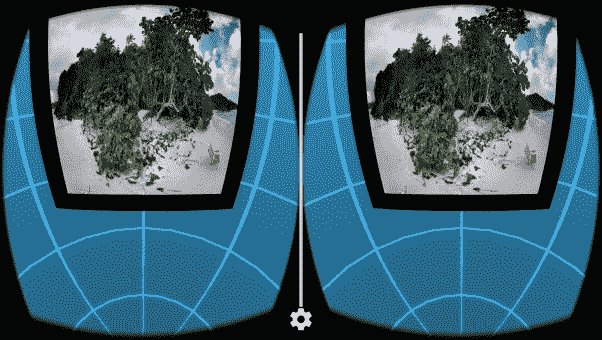

# 加载和显示照片图像

到目前为止，我们已经在项目的`drawable`资源文件夹中使用图像。下一步是从手机中读取照片图像并在虚拟屏幕上显示其中一个。

## 定义图像类

让我们制作一个占位符`Image`类。稍后，我们将构建属性和方法。定义如下：

```kt
public class Image {
    final static String TAG = "image";
    String path;
    public Image(String path) {
        this.path = path;
    }
    public static boolean isValidImage(String path){
        String extension = getExtension(path);
        if(extension == null)
            return false;
        switch (extension){
            case "jpg":
                return true;
            case "jpeg":
                return true;
            case "png":
                return true;
        }
        return false;
    }
    static String getExtension(String path){
        String[] split = path.split("\\.");
        if(split== null || split.length < 2)
            return null;
        return split[split.length - 1].toLowerCase();
    }
}
```

我们定义一个构造函数，该构造函数接受图像的完整路径。我们还提供一个验证方法，该方法检查路径是否实际上是图像，基于文件名扩展名。我们不想在构造时加载和绑定图像数据，因为我们不想一次加载所有图像；正如您将看到的，我们将使用工作线程来智能地管理这些。

## 将图像读入应用程序

现在在`MainActivity`中，访问手机上的照片文件夹，并在我们的应用程序中构建图像列表。以下`getImageList`辅助方法查找给定文件夹路径，并为找到的每个文件实例化一个新的`Image`对象：

```kt
    final List<Image> images = new ArrayList<>();

    int loadImageList(String path) {
        File f = new File(path);
        File[] file = f.listFiles();
        if (file==null)
            return 0;
        for (int i = 0; i < file.length; i++) {
            if (Image.isValidImage(file[i].getName())) {
                Image img = new Image(path + "/" + file[i].getName());
                images.add(img);
            }
        }
        return file.length;
    }
```

在`setup`方法中使用此方法，传入相机图像文件夹路径的名称，如下所示（您的路径可能有所不同）：

```kt
    final String imagesPath = "/storage/emulated/0/DCIM/Camera";

    public void setup() {
        …

        loadImageList(imagesPath);
    }
```

还要确保在您的`AndroidManifest.xml`文件中包含以下行，以赋予应用程序读取设备外部存储的权限。从技术上讲，使用 Cardboard SDK 时，您应该已经拥有此权限：

```kt
    <uses-permission android:name="android.permission.READ_EXTERNAL_STORAGE" />
```

您可以向`getImageList`循环添加日志消息并运行它以验证它是否正在找到文件。如果没有，您可能需要发现您的照片文件夹的实际路径。

这是我们需要非常小心权限的第一个项目。直到这一点，Cardboard SDK 本身是唯一需要访问文件系统的东西，但现在我们需要它来使应用程序本身正常运行。如果您使用的是 Andriod 6.0 的设备，并且您没有确保将应用程序编译为 SDK 22，您将无法加载图像文件，应用程序要么无所作为，要么崩溃。

如果您正在针对 SDK 22 进行编译，并且在清单中正确设置了权限，但仍然获得空文件列表，请尝试使用文件浏览器在设备上查找正确的路径。很可能是我们提供的路径不存在或为空。当然，确保您确实使用该设备拍摄了照片！

## 图像加载纹理

如果您还记得，在第六章*太阳系*中，我们编写了一个`loadTexture`方法，该方法从项目的`res/drawable`文件夹中读取静态图像到内存位图，并将其绑定到 OpenGL 中的纹理。在这里，我们将做类似的事情，但是从手机的相机路径中获取图像，并提供额外处理的方法，例如调整大小和旋转方向。

在`Image`类的顶部，添加一个变量来保存当前的纹理句柄：

```kt
    int textureHandle;
```

图像的`loadTexture`方法，给定图像文件的路径，将图像文件加载到位图中，然后将其转换为纹理。（此方法将从`MainActivity`中的应用程序的`CardboardView`类中调用。）编写如下：

```kt
    public void loadTexture(CardboardView cardboardView) {
        if (textureHandle != 0)
            return;
        final Bitmap bitmap = BitmapFactory.decodeFile(path);
        if (bitmap == null){
            throw new RuntimeException("Error loading bitmap.");
        }
        textureHandle = bitmapToTexture(bitmap);
    }
```

我们添加了一个小的（但重要的）优化，检查纹理是否已经加载；如果不需要，就不要再次加载。

我们的`bitmapToTexture`的实现如下所示。给定一个位图，它将位图绑定到 OpenGL ES 纹理（带有一些错误检查）。将以下代码添加到`Image`中：

```kt
    public static int bitmapToTexture(Bitmap bitmap){
        final int[] textureHandle = new int[1];

        GLES20.glGenTextures(1, textureHandle, 0);
        RenderBox.checkGLError("Bitmap GenTexture");

        if (textureHandle[0] != 0) {
            // Bind to the texture in OpenGL
            GLES20.glBindTexture(GLES20.GL_TEXTURE_2D, textureHandle[0]);

            // Set filtering
            GLES20.glTexParameteri(GLES20.GL_TEXTURE_2D, GLES20.GL_TEXTURE_MIN_FILTER, GLES20.GL_NEAREST);
            GLES20.glTexParameteri(GLES20.GL_TEXTURE_2D, GLES20.GL_TEXTURE_MAG_FILTER, GLES20.GL_NEAREST);

            // Load the bitmap into the bound texture.
            GLUtils.texImage2D(GLES20.GL_TEXTURE_2D, 0, bitmap, 0);
        }
        if (textureHandle[0] == 0){
            throw new RuntimeException("Error loading texture.");
        }

        return textureHandle[0];
    }
```

## 在屏幕上显示图像

让我们在应用程序中显示我们的相机图像之一，比如第一个。

在虚拟屏幕上显示图像，我们可以编写一个`show`方法，该方法接受当前的`CardboardView`对象和`Plane`屏幕。它将加载和绑定图像纹理，并将其句柄传递给材质。在`Image`类中，实现`show`方法如下：

```kt
    public void show(CardboardView cardboardView, Plane screen) {
        loadTexture(cardboardView);
        BorderMaterial material = (BorderMaterial) screen.getMaterial();
        material.setTexture(textureHandle);
    }
```

现在让我们使用这些东西！转到`MainActivity`并编写一个单独的`showImage`方法来加载图像纹理。然后，暂时从`setup`中调用它，使用我们找到的第一个图像（您的相机文件夹中至少需要一个图像）：

```kt
    public void setup() {
        setupBackground();
        setupScreen();
        loadImageList(imagesPath);
        showImage(images.get(0));
    }

    void showImage(Image image) {
        image.show(cardboardView, screen);
    }
```

现在修改`setupScreen`也是有意义的，因此它创建屏幕但不在其上加载图像纹理。删除其中的`screenMaterial.setTexture`调用。

现在运行应用程序，您将在屏幕上看到自己的图像。这是我的：


## 旋转到正确的方向

一些图像文件类型会跟踪它们的图像方向，特别是 JPG 文件（`.jpg`或`.jpeg`）。我们可以从文件中包含的 EXIF 元数据中获取方向值，该元数据由相机应用程序编写。（例如，请参阅[`sylvana.net/jpegcrop/exif_orientation.html`](http://sylvana.net/jpegcrop/exif_orientation.html)。请注意，某些设备可能不符合规定或包含不同的结果。）

如果图像不是 JPG，我们将跳过此步骤。

在`Image`类的顶部，声明一个变量来保存当前图像的旋转：

```kt
    Quaternion rotation;
```

`rotation`值存储为`Quaternion`实例，如我们的 RenderBox 数学库中定义的那样。如果您还记得第五章*RenderBox 引擎*，四元数表示三维空间中的旋转方向，比欧拉角更精确和更不含糊。但是欧拉角更符合人类的习惯，指定每个*x*、*y*和*z*轴的角度。因此，我们将根据图像的方向使用欧拉角设置四元数。最终，我们在这里使用`Quaternion`，因为它是`Transform.rotation`的基础类型：

```kt
    void calcRotation(Plane screen){
        rotation = new Quaternion();

        // use Exif tags to determine orientation, only available // in jpg (and jpeg)
        String ext = getExtension(path);
        if (ext.equals("jpg") || ext.equals("jpeg")) {

            try {
                ExifInterface exif = new ExifInterface(path);
                switch (exif.getAttribute(ExifInterface.TAG_ORIENTATION)) {
                    // Correct orientation, but flipped on the // horizontal axis
                    case "2":
                        rotation = new Quaternion().setEulerAngles(180, 0, 0);
                        break;
                    // Upside-down
                    case "3":
                        rotation = new Quaternion().setEulerAngles(0, 0, 180);
                        break;
                    // Upside-Down & Flipped along horizontal axis
                    case "4":
                        rotation = new Quaternion().setEulerAngles(180, 0, 180);
                        break;
                    // Turned 90 deg to the left and flipped
                    case "5":
                        rotation = new Quaternion().setEulerAngles(0, 180, 90);
                        break;
                    // Turned 90 deg to the left
                    case "6":
                        rotation = new Quaternion().setEulerAngles(0, 0, -90);
                        break;
                    // Turned 90 deg to the right and flipped
                    case "7":
                        rotation = new Quaternion().setEulerAngles(0, 180, 90);
                        break;
                    // Turned 90 deg to the right
                    case "8":
                        rotation = new Quaternion().setEulerAngles(0, 0, 90);
                        break;
                    //Correct orientation--do nothing
                    default:
                        break;
                }
            } catch (IOException e) {
                e.printStackTrace();
            }
        }
        screen.transform.setLocalRotation(rotation);
    }
```

现在在`Image`类的`show`方法中设置屏幕的旋转，如下所示：

```kt
    public void show(CardboardView cardboardView, Plane screen) {
        loadTexture(cardboardView);
        BorderMaterial material = (BorderMaterial) screen.getMaterial();
        material.setTexture(textureHandle);
        calcRotation(screen);
    }
```

再次运行您的项目。图像应该被正确定向。请注意，您的原始图像可能一直都很好。一旦我们开始使用缩略图网格，检查旋转代码是否有效将变得更容易。


## 纠正宽度和高度的尺寸

方形图像很容易。但通常，照片是矩形的。我们可以获取图像的实际宽度和高度，并相应地缩放屏幕，以便显示不会出现扭曲。

在`Image`类的顶部，声明变量来保存当前图像的宽度和高度：

```kt
    int height, width;
```

然后，在`decodeFile`方法中使用位图选项设置它们，如下所示：

```kt
    public void loadTexture(CardboardView cardboardView) {
        if (textureHandle != 0)
            return;
        BitmapFactory.Options options = new BitmapFactory.Options();
        final Bitmap bitmap = BitmapFactory.decodeFile(path, options);
        if (bitmap == null){
            throw new RuntimeException("Error loading bitmap.");
        }
        width = options.outWidth;
        height = options.outHeight;
        textureHandle = bitmapToTexture(bitmap);
    }
```

`decodeFile`调用将返回选项中的图像宽度和高度（以及其他信息）（参考[`developer.android.com/reference/android/graphics/BitmapFactory.Options.html`](http://developer.android.com/reference/android/graphics/BitmapFactory.Options.html)）。

现在我们可以在`Image`类的`show`方法中设置屏幕大小。我们将规范化比例，使得较长的一侧为 1.0，较短的一侧根据图像纵横比计算：

```kt
    public void show(CardboardView cardboardView, Plane screen) {
        loadTexture(cardboardView);
        BorderMaterial material = (BorderMaterial) screen.getMaterial();
        material.setTexture(textureHandle);
        calcRotation(screen);
        calcScale(screen);
    }

    void calcScale(Plane screen) {
        if (width > 0 && width > height) {
            screen.transform.setLocalScale(1, (float) height / width, 1);
        } else if(height > 0) {
            screen.transform.setLocalScale((float) width / height, 1, 1);
        }
    }
```

如果您现在运行它，屏幕将具有图像的正确纵横比：

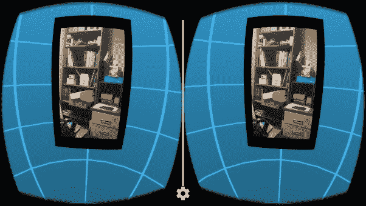

## 将图像缩小到指定大小

您手机上的相机可能非常棒！它可能真的非常棒！当打印或进行大量裁剪时，百万像素图像非常重要。但是在我们的应用程序中查看时，我们不需要全分辨率图像。实际上，如果图像大小生成了对设备硬件来说太大的纹理，您可能已经在运行此项目时遇到了问题。

当加载纹理时，我们可以通过限制最大尺寸并将位图缩放到这些约束范围内来解决此问题。我们将要求 OpenGL ES 告诉我们当前的最大纹理尺寸。我们将在`MainActivity`中执行此操作，因此它通常是可用的（和/或将其移动到`RenderBox`库项目中的`RenderBox`类中）。将以下内容添加到`MainActivity`：

```kt
    static int MAX_TEXTURE_SIZE = 2048;

    void setupMaxTextureSize() {
        //get max texture size
        int[] maxTextureSize = new int[1];
        GLES20.glGetIntegerv(GLES20.GL_MAX_TEXTURE_SIZE, maxTextureSize, 0);
        MAX_TEXTURE_SIZE = maxTextureSize[0];
        Log.i(TAG, "Max texture size = " + MAX_TEXTURE_SIZE);
    }
```

我们将其称为`MainActivity`类的`setup`方法的第一行。

至于缩放图像，不幸的是，Android 的`BitmapFactory`不允许您直接请求采样图像的新大小。相反，对于任意图像，您可以指定采样率，例如每隔一个像素（2），每隔四个像素（4）等。它必须是 2 的幂。

回到`Image`类。首先，我们将在`loadTexture`中添加一个`sampleSize`参数，该参数可以用作`decodeFile`的参数，如下所示：

```kt
    public void loadTexture(CardboardView cardboardView, int sampleSize) {
        if (textureHandle != 0)
            return;
        BitmapFactory.Options options = new BitmapFactory.Options();
        options.inSampleSize = sampleSize;
        final Bitmap bitmap = BitmapFactory.decodeFile(path, options);
        if(bitmap == null){
            throw new RuntimeException("Error loading bitmap.");
        }
        width = options.outWidth;
        height = options.outHeight;
        textureHandle = bitmapToTexture(bitmap);
    }
```

要确定图像的适当采样大小，我们首先需要找出其完整尺寸，然后找出哪个采样大小最接近但小于我们将使用的最大纹理尺寸。数学并不太困难，但我们将使用程序方法来搜索最佳大小值，而不是进行这样的搜索。

幸运的是，`decodeFile`的一个输入选项是仅检索图像边界，而不是实际加载图像。编写一个名为`loadFullTexture`的新加载纹理方法，如下所示：

```kt
    public void loadFullTexture(CardboardView cardboardView) {
        // search for best size
        int sampleSize = 1;
        BitmapFactory.Options options = new BitmapFactory.Options();
        options.inJustDecodeBounds = true;
        do {
            options.inSampleSize = sampleSize;
            BitmapFactory.decodeFile(path, options);
            sampleSize *= 2;
        } while (options.outWidth > MainActivity.MAX_TEXTURE_SIZE || options.outHeight > MainActivity.MAX_TEXTURE_SIZE);
        sampleSize /= 2;
        loadTexture(cardboardView, sampleSize);
    }
```

我们不断增加采样大小，直到找到一个在`MAX_TEXTURE_SIZE`范围内生成位图的大小，并然后调用`loadTexture`。

在`show`方法中使用`loadFullTexture`而不是其他的`loadTexture`：

```kt
    public void show(CardboardView cardboardView, Plane screen) {
        loadFullTexture(cardboardView);
        BorderMaterial material = (BorderMaterial) screen.getMaterial();
        ...
```

运行项目。它应该看起来与之前的一样。但是如果您的相机太好，也许它不会像以前那样崩溃。

这种采样还将有助于在用户界面中显示图像的缩略图版本。对于缩略图视图，加载全尺寸的位图没有意义。

# 加载和显示全景图像

到目前为止，我们一直以相同的方式处理所有图像。但其中一些可能是 360 度图像。这些应该显示在全景照片上，而不是虚拟屏幕上。

如果您的设备相机文件夹中还没有 360 度照片，可以使用 Google 相机应用程序创建它们。

### 注意

如果您手机上的默认相机应用程序不包括**全景**模式，则可能需要从 Play 商店下载 Google 相机应用程序。第三方相机可能使用不同的名称。例如，三星将其全景功能称为**环绕拍摄**。

一些图像包括 XMP 元数据，其中将包括有关图像是否为等距投影而畸变的信息。这对于区分球形图像和平面图像可能很有用。但是，Android API 不包括 XMP 接口，因此集成 XMP 头解析超出了本书的范围。

现在，我们只需检查文件名是否以`PANO_`为前缀。将以下变量添加到`Image`类中，并在构造方法中设置它：

```kt
    public boolean isPhotosphere;

    public Image(String path) {
        this.path = path;
        isPhotosphere = path.toLowerCase().contains("pano");
    }
```

现在我们可以构建`MainActivity`显示方法来处理普通照片（显示在虚拟屏幕上）与照片球（显示在背景球上）。此外，它应该处理在虚拟屏幕上显示的平面图像与渲染照片球之间的切换，反之亦然。

我们希望记住背景照片球纹理的纹理句柄 ID。在`MainActivity`类的顶部添加一个`bgTextureHandle`句柄：

```kt
    int bgTextureHandle;
```

然后，在`setupBackground`中调用`getTexture`设置它：

```kt
    void setupBackground() {
        photosphere = new Sphere(DEFAULT_BACKGROUND, false);
        new Transform()
                .setLocalScale(Camera.Z_FAR * 0.99f,-Camera.Z_FAR * 0.99f, Camera.Z_FAR * 0.99f)
                .addComponent(photosphere);
        UnlitTexMaterial mat = (UnlitTexMaterial) photosphere.getMaterial();
        bgTextureHandle = mat.getTexture();
    }
```

现在我们可以更新`showImage`方法，如下所示：

```kt
    void showImage(Image image) {
        UnlitTexMaterial bgMaterial = (UnlitTexMaterial) photosphere.getMaterial();
        image.loadFullTexture(cardboardView);
        if (image.isPhotosphere) {
            bgMaterial.setTexture(image.textureHandle);
            screen.enabled = false;
        } else {
            bgMaterial.setTexture(bgTextureHandle);
            screen.enabled = true;
            image.show(cardboardView, screen);
        }
    }
```

当图像是照片球时，我们将将背景照片球纹理设置为图像，并隐藏屏幕平面。当图像是普通照片时，我们将将背景纹理恢复为默认值，并在虚拟屏幕上显示图像。

在我们实现用户界面（下一步）进行测试之前，您需要知道图像列表中哪个图像是照片球。如果现在制作一个新的照片球，它将成为列表中的最后一个，并且您可以更改`setup`方法以调用`showImage`。例如，运行以下代码：

```kt
         showImage(images.get(images.size()-1));
```

再次运行项目并感到高兴！

# 图像库用户界面

在我们继续为该项目实现用户界面之前，让我们谈谈我们希望它如何工作。

该项目的目的是允许用户从其手机存储中选择照片并在 VR 中查看它。手机的照片集将以可滚动的缩略图图像网格的形式呈现。如果照片是普通的 2D 照片，它将显示在我们刚刚制作的虚拟屏幕平面上。如果是照片球，我们将将其视为完全沉浸式的 360 度球形投影。

我们提议的场景布局草图如下图所示。用户摄像头位于原点，照片球由灰色圆圈表示，围绕用户周围。在用户面前（由启动时的校准确定），将有一个来自手机相册的 5 x 3 网格的缩略图图像。这将是一个可滚动的列表。在用户的左侧，有图像投影屏幕。


具体来说，UI 将实现以下功能：

+   在 5 x 3 网格中显示最多 15 个缩略图图像。

+   允许用户通过观看缩略图图像并单击 Cardboard 触发器来选择其中之一。当处于视线中时，缩略图将被突出显示。

+   选择普通照片将在场景中的虚拟投影屏幕上显示它（并将照片球清除为背景图像）。

+   选择照片球将隐藏虚拟投影屏幕并将图像加载到照片球投影中。

+   允许用户通过选择上/下箭头滚动缩略图图像。

我们的一些 UI 考虑是虚拟现实独特的。最重要的是，所有用户界面元素和控件都在世界坐标空间中，也就是说，它们被集成到场景中作为具有位置、旋转和比例的几何对象，就像任何其他组件一样。这与大多数移动游戏中 UI 作为屏幕空间叠加的方式实现的情况形成对比。

为什么？因为在 VR 中，为了创建立体效果，每只眼睛都有一个单独的视点，通过瞳孔间距进行偏移。这可以通过在屏幕空间中水平偏移屏幕空间对象的位置来模拟，使它们看起来具有视差（这是我们在第四章中使用的技术，*启动器大厅*）。但是当与 3D 几何、摄像机、照明和渲染混合时，该技术证明是不够的。需要一个世界空间 UI 来实现有效的用户体验和沉浸感。

另一个在 VR 中独有的功能是凝视选择。在这种情况下，您的凝视会突出显示一个图像缩略图，然后您点击 Cardboard 触发器打开图像。

最后，正如前面提到的，由于我们是在世界空间中工作，并且根据我们的凝视进行选择，我们的 3D 空间的布局是一个重要考虑因素。请记住，我们处于 VR 环境中，不受手机屏幕矩形边缘的限制。场景中的对象可以放置在您周围的任何位置。另一方面，您不希望用户一直扭来扭去（除非这是体验的一个意图部分）。我们将注意舒适区域来放置我们的 UI 控件和图像屏幕。

此外，谷歌和其他地方的研究人员已经开始制定用户界面设计的最佳实践，包括菜单和 UI 控件与摄像头的最佳距离，大约为 5 到 15 英尺（1.5 到 5 米）。这个距离足够近，可以享受 3D 视差效果，但不会让你看起来眯着眼睛专注于物体。

好的，让我们开始 UI 实现。

## 将照片屏幕定位在左侧

首先，让我们将屏幕从前方移动到侧面，即将其向左旋转 90 度。我们的变换数学在旋转后进行位置，所以现在我们沿*x*轴偏移它。修改`MainActivity`类的`setupScreen`方法，如下所示：

```kt
    void setupScreen() {
        Transform screenRoot = new Transform()
                .setLocalScale(4, 4, 1)
                .setLocalRotation(0, -90, 0)
                .setLocalPosition(-5, 0, 0);
                ...
```

# 在网格中显示缩略图

缩略图是完整图像的迷你版本。因此，我们不需要加载全尺寸的纹理位图。为了简单起见，让我们总是将其缩小 4 倍（原始尺寸的 1/16）。

## 缩略图图像

在`Image`类中，`show`方法加载完整的纹理。让我们编写一个类似的`showThumbnail`方法，使用较小的采样。在`Image`类中，添加以下代码：

```kt
    public void showThumbnail(CardboardView cardboardView, Plane thumb) {
        loadTexture(cardboardView, 4);
        BorderMaterial material = (BorderMaterial) thumb.getMaterial();
        material.setTexture(textureHandle);
        calcRotation(thumb);
        calcScale(thumb);
    }
```

## 缩略图类

为项目创建一个新的`Thumbnail`类，其中包含一个小的`Plane`对象和一个`Image`对象来显示。它还获取当前的`cardboardView`实例，`Image`将需要它：

```kt
public class Thumbnail {
    final static String TAG = "Thumbnail";

    public Plane plane;
    public Image image;
    CardboardView cardboardView;

    public Thumbnail(CardboardView cardboardView) {
        this.cardboardView = cardboardView;
    }
}
```

定义一个`setImage`方法，加载图像纹理并显示为缩略图：

```kt
    public void setImage(Image image) {
        this.image = image;
        // Turn the image into a GPU texture
        image.loadTexture(cardboardView, 4);
        // TODO: wait until texture binding is done
        // show it
        image.showThumbnail(cardboardView, plane);
    }
```

最后，为缩略图可见性添加一个快速切换：

```kt
    public void setVisible(boolean visible) {
        plane.enabled = visible;
    }
```

## 缩略图网格

计划在`MainActivity`类的顶部显示 5x3 缩略图图像网格。声明一个`thumbnails`变量来保存缩略图列表：

```kt
    final int GRID_X = 5;
    final int GRID_Y = 3;

    final List<Thumbnail> thumbnails = new ArrayList<>();
```

在一个名为`setupThumbnailGrid`的新方法中构建列表。第一个缩略图位于页面的左上角（-4，3，-5），每个缩略图在*x*轴上间隔 2.1 个单位，在*y*轴上间隔 3 个单位，如下所示：

```kt
    void setupThumbnailGrid() {
        int count = 0;
        for (int i = 0; i < GRID_Y; i++) {
            for (int j = 0; j < GRID_X; j++) {
                if (count < images.size()) {
                    Thumbnail thumb = new 
                        Thumbnail(cardboardView);
                    thumbnails.add(thumb);

                    Transform image = new Transform();
                    image.setLocalPosition(-4 + j * 2.1f, 3 - i * 3, -5);
                    Plane imgPlane = new Plane();
                    thumb.plane = imgPlane;
                    imgPlane.enabled = false;
                    BorderMaterial material = new BorderMaterial();
                    imgPlane.setupBorderMaterial(material);
                    image.addComponent(imgPlane);
                }
                count++;
            }
        }
    }
```

现在我们需要将图像纹理添加到平面上。我们将编写另一个方法`updateThumbnails`，如下所示。它将在网格中显示前 15 张图像（如果没有那么多，就显示更少）：

```kt
    void updateThumbnails() {
        int count = 0;
        for (Thumbnail thumb : thumbnails) {
            if (count < images.size()) {
                thumb.setImage(images.get(count));
                thumb.setVisible(true);
            } else {
                thumb.setVisible(false);
            }
            count++;
        }
    }
```

将这些新方法添加到`setup`中：

```kt
    public void setup() {
        setupMaxTextureSize();
        setupBackground();
        setupScreen();
        loadImageList(imagesPath);
        setupThumbnailGrid();
        updateThumbnails();
    }
```

当您运行项目时，它应该看起来像这样：

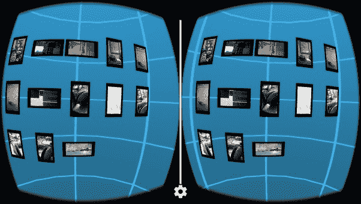

请注意，缩略图的大小已调整以匹配图像的宽高比，并且已正确定向，因为我们之前在`Image`类中实现了这些功能。

### 提示

如果您的手机上已经没有超过 15 张照片，请在`loadImageList`中添加一个循环来加载重复的照片。例如，运行以下代码：

```kt
for(int j = 0; j < 3; j++) { //Repeat image list
    for (int i = 0; i < file.length; i++) {
        if (Image.isValidImage(file[i].getName())) {
            ...
```

# 凝视加载

我们希望检测用户何时看着缩略图，并通过更改其边框颜色来突出显示图像。如果用户将目光从缩略图移开，它将取消突出显示。当用户点击 Cardboard 触发器时，该图像将被加载。

## 凝视突出显示

幸运的是，我们在第五章的末尾在`RenderBox`库中实现了`isLooking`检测，*RenderBox Engine*。如果您还记得，该技术通过检查相机和平面位置之间的矢量是否与相机的视图方向相同来确定用户是否正在查看平面，容忍度为阈值。

我们可以在`MainActivity`中使用这个。我们将编写一个`selectObject`辅助方法，检查场景中是否有任何对象被选中并突出显示它们。首先，让我们在`MainActivity`类的顶部声明一些变量。`selectedThumbnail`对象保存当前选定的缩略图索引。我们为正常和选定状态定义边框颜色：

```kt
    final float[] selectedColor = new float[]{0, 0.5f, 0.5f, 1};
    final float[] invalidColor = new float[]{0.5f, 0, 0, 1};
    final float[] normalColor = new float[]{0, 0, 0, 1};
    Thumbnail selectedThumbnail = null;
```

现在，`selectObject`方法会遍历每个缩略图，检查它是否`isLooking`，并相应地突出显示（或取消突出显示）它：

```kt
    void selectObject() {
        selectedThumbnail = null;
        for (Thumbnail thumb : thumbnails) {
            if (thumb.image == null)
                return;
            Plane plane = thumb.plane;
            BorderMaterial material = (BorderMaterial) plane.getMaterial();
            if (plane.isLooking) {
                selectedThumbnail = thumb;
                material.borderColor = selectedColor;
            } else {
                material.borderColor = normalColor;
            }
        }
    }
```

`RenderBox`提供了一些挂钩，包括`postDraw`，我们将在其中检查选定的对象。我们希望使用`postDraw`，因为我们需要等到在所有`RenderObjects`上调用`draw`之后才知道用户正在查看哪一个。在`MainActivity`中，添加对`selectObject`方法的调用，如下所示：

```kt
    @Override
    public void postDraw() {
        selectObject();
    }
```

运行项目。当您盯着缩略图图像时，它应该会被突出显示！

## 选择和显示照片

现在，我们可以从缩略图网格中选择图像，我们需要一种点击它并显示该图像的方法。这将在`MainActivity`中使用 Cardboard SDK 挂钩`onCardboardTrigger`来实现。

到目前为止，我们所做的工作不需要太多就可以实现这一点：

```kt
    @Override
    public void onCardboardTrigger() {
        if (selectedThumbnail != null) {
            showImage(selectedThumbnail.image);
        }
    }
```

尝试运行它。现在突出显示一个图像并扳动扳机。如果你幸运的话，它会工作……我的崩溃了。

## 排队事件

发生了什么？我们遇到了线程安全问题。到目前为止，我们一直在渲染线程中执行所有代码，该线程由`GLSurfaceView`/`CardboardView`类通过 Cardboard SDK 启动。该线程拥有对 GPU 和我们正在渲染的特定表面的访问权限。对`onCardboardTrigger`的调用来自不是渲染线程的线程。这意味着我们不能从这里进行任何 OpenGL 调用。幸运的是，`GLSurfaceView`提供了一种通过名为`queueEvent`的方法在渲染线程上执行任意代码的巧妙方法。`queueEvent`方法接受一个`Runnable`参数，这是一个用于创建这类一次性过程的 Java 类（参见[`developer.android.com/reference/android/opengl/GLSurfaceView.html#queueEvent(java.lang.Runnable`](http://developer.android.com/reference/android/opengl/GLSurfaceView.html#queueEvent(java.lang.Runnable)））。

修改`showImage`，将其包装在`Runnable`参数中，如下所示：

```kt
    void showImage(final Image image) {
        cardboardView.queueEvent(new Runnable() {
            @Override
            public void run() {

                UnlitTexMaterial bgMaterial = (UnlitTexMaterial) photosphere.getMaterial();
                image.loadFullTexture(cardboardView);
                if (image.isPhotosphere) {
                    Log.d(TAG, "!!! is photosphere");
                    bgMaterial.setTexture(image.textureHandle);
                    screen.enabled = false;
                } else {
                    bgMaterial.setTexture(bgTextureHandle);
                    screen.enabled = true;
                    image.show(cardboardView, screen);
                }

            }
        });
    }
```

请注意，传递给匿名类的任何数据，例如我们的图像，必须声明为`final`，才能从新过程中访问。

尝试再次运行项目。它应该可以工作。您可以盯着缩略图，点击触发器，该图像将被显示，无论是在虚拟屏幕上还是在背景光球中。

## 使用振动器

别担心，我们会保持干净。我们希望在用户选择图像时为用户提供一些触觉反馈，使用手机的振动器。而在 Android 中，这是直截了当的。

首先，确保您的`AndroidManifest.xml`文件包含以下代码行：

```kt
    <uses-permission android:name="android.permission.VIBRATE" />
```

在`MainActivity`类的顶部，声明一个`vibrator`变量：

```kt
    private Vibrator vibrator;
```

然后，在`onCreate`中，添加以下代码进行初始化：

```kt
    vibrator = (Vibrator) getSystemService(Context.VIBRATOR_SERVICE);
```

然后，在`onCardboardTrigger`中使用它，如下所示：

```kt
       vibrator.vibrate(25);
```

再次运行。点击它，你会感觉到它。*啊！*但不要得意忘形，它不是那种振动器。

# 启用滚动

我们的缩略图网格有 15 张图像。如果您的手机有超过 15 张照片，您需要滚动列表。对于这个项目，我们将实现一个简单的机制来上下滚动列表，使用三角形滚动按钮。

## 创建三角形组件

与我们的`RenderBox`中的其他`RenderObjects`一样，`Triangle`组件定义了描述三角形的坐标、法线、索引和其他数据。我们创建一个分配缓冲区的构造方法。与`Plane`组件一样，我们希望使用`BorderMaterial`类，以便在选择时可以突出显示。与`Plane`组件一样，它将确定用户何时在查看它。话不多说，这是代码。

在`RenderBoxExt/components`文件夹中创建一个新的 Java 类文件`Triangle.java`。我们首先声明它`extends RenderObject`，并声明以下变量：

```kt
public class Triangle extends RenderObject {

    /*
    Special triangle for border shader

    *   0/3 (0,1,0)/(0,1,0) (0,1)/(1,1)
              /|\
             / | \
            *--*--*
            1  2  4
     */

    private static final float YAW_LIMIT = 0.15f;
    private static final float PITCH_LIMIT = 0.15f;
    public static final float[] COORDS = new float[] {
            0f, 1.0f, 0.0f,
            -1.0f, -1.0f, 0.0f,
            0.0f, -1.0f, 0.0f,
            0f, 1.0f, 0.0f,
            1.0f, -1.0f, 0.0f,
    };
    public static final float[] TEX_COORDS = new float[] {
            0f, 1f,
            0f, 0f,
            0.5f, 0f,
            1f, 1f,
            1f, 0f
    };
    public static final float[] COLORS = new float[] {
            0.5f, 0.5f, 0.5f, 1.0f,
            0.5f, 0.5f, 0.5f, 1.0f,
            0.5f, 0.5f, 0.5f, 1.0f,
            0.5f, 0.5f, 0.5f, 1.0f,
            0.5f, 0.5f, 0.5f, 1.0f
    };
    public static final float[] NORMALS = new float[] {
            0.0f, 0.0f, -1.0f,
            0.0f, 0.0f, -1.0f,
            0.0f, 0.0f, -1.0f,
            0.0f, 0.0f, -1.0f,
            0.0f, 0.0f, -1.0f
    };
    public static final short[] INDICES = new short[] {
            1, 0, 2,
            2, 3, 4
    };

    private static FloatBuffer vertexBuffer;
    private static FloatBuffer colorBuffer;
    private static FloatBuffer normalBuffer;
    private static FloatBuffer texCoordBuffer;
    private static ShortBuffer indexBuffer;
    static final int numIndices = 6;

    static boolean setup;
}
```

如果不清楚为什么我们需要这个由 2 个三角形组成的三角形，那是因为 UV 的工作方式。您无法仅使用一个三角形获得完整的边框，至少不是我们编写边框着色器的方式。

添加一个构造函数，以及一个`allocateBuffers`辅助程序：

```kt
    public Triangle(){
        super();
        allocateBuffers();
    }

    public static void allocateBuffers(){
        //Already allocated?
        if (vertexBuffer != null) return;
        vertexBuffer = allocateFloatBuffer(COORDS);
        texCoordBuffer = allocateFloatBuffer(TEX_COORDS);
        colorBuffer = allocateFloatBuffer(COLORS);
        normalBuffer = allocateFloatBuffer(NORMALS);
        indexBuffer = allocateShortBuffer(INDICES);
    }
```

我们可以创建各种材料，但我们实际上只计划使用`BorderMaterial`，因此让我们像我们在`Plane`中那样支持它：

```kt
    public void setupBorderMaterial(BorderMaterial material){
        this.material = material;
        material.setBuffers(vertexBuffer, texCoordBuffer, indexBuffer, numIndices);
    }
```

## 向 UI 添加三角形

在`MainActivity`中，我们可以添加`up`和`down`三角形按钮来滚动缩略图。在`MainActivity`类的顶部，声明三角形及其材料的变量：

```kt
    Triangle up, down;
    BorderMaterial upMaterial, downMaterial;
    boolean upSelected, downSelected;
```

定义一个`setupScrollButtons`辅助程序如下：

```kt
    void setupScrollButtons() {
        up = new Triangle();
        upMaterial = new BorderMaterial();
        up.setupBorderMaterial(upMaterial);
        new Transform()
            .setLocalPosition(0,6,-5)
            .addComponent(up);

        down = new Triangle();
        downMaterial = new BorderMaterial();
        down.setupBorderMaterial(downMaterial);
        new Transform()
            .setLocalPosition(0,-6,-5)
            .setLocalRotation(0,0,180)
            .addComponent(down);
    }
```

然后，从`setup`方法中调用它：

```kt
    public void setup() {
        setupMaxTextureSize();
        setupBackground();
        setupScreen();
        loadImageList(imagesPath);
        setupThumbnailGrid();
        setupScrollButtons();
        updateThumbnails();
    }
```

运行项目时，您将看到箭头：

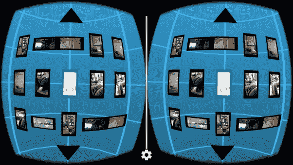

## 与滚动按钮交互

现在，我们将检测用户何时在查看三角形，使用`selectObject`中的`isLooking`（从`postDraw`挂钩调用）：

```kt
    void selectObject() {
        ...

        if (up.isLooking) {
            upSelected = true;
            upMaterial.borderColor = selectedColor;
        } else {
            upSelected = false;
            upMaterial.borderColor = normalColor;
        }

        if (down.isLooking) {
            downSelected = true;
            downMaterial.borderColor = selectedColor;
        } else {
            downSelected = false;
            downMaterial.borderColor = normalColor;
        }
    }
```

## 实现滚动方法

为了实现滚动缩略图图像，我们将保持网格平面不变，只滚动纹理。使用偏移变量来保存网格中第一个图像的索引：

```kt
    static int thumbOffset = 0;
```

现在，修改`updateThumbnails`方法，使用缩略图偏移作为图像纹理的起始索引来填充平面纹理：

```kt
    void updateThumbnails() {
        int count = thumbOffset;
        for (Thumbnail thumb : thumbnails) {
        . . .
```

当按下上下箭头时，我们可以在`onCardboardTrigger`中执行滚动，通过将`thumbOffset`变量一次移动一行（`GRID_X`）：

```kt
    public void onCardboardTrigger() {
        if (selectedThumbnail != null) {
            vibrator.vibrate(25);
            showImage(selectedThumbnail.image);
        }
        if (upSelected) {
            // scroll up
            thumbOffset -= GRID_X;
            if (thumbOffset < 0) {
                thumbOffset = images.size() - GRID_X;
            }
            vibrator.vibrate(25);
            updateThumbnails();
        }
        if (downSelected) {
            // scroll down
            if (thumbOffset < images.size()) {
                thumbOffset += GRID_X;
            } else {
                thumbOffset = 0;
            }
            vibrator.vibrate(25);
            updateThumbnails();
        }
    }
```

与`showImage`一样，`updateThumbnails`方法需要在渲染线程上运行：

```kt
    void updateThumbnails() {
        cardboardView.queueEvent(new Runnable() {
            @Override
            public void run() {
                ...
```

运行项目。现在，您可以单击上下箭头来滚动浏览照片。

# 保持响应并使用线程

我们的加载和滚动代码存在一些问题，都与加载图像和转换位图是计算密集型的事实有关。尝试一次为 15 张图像执行此操作会导致应用程序似乎冻结。您可能还注意到，自从我们添加了缩略图网格以来，应用程序启动时间显着延长。

在传统的应用程序中，应用程序在等待数据加载时锁定可能会很烦人，但在 VR 中，应用程序需要保持活动状态。应用程序需要继续响应头部运动，并为每个帧更新显示，以显示与当前视图方向相对应的视图。如果应用程序在加载文件时被锁定，它会感觉卡住，即卡在您的脸上！在完全沉浸式体验中，并且在桌面 HMD 上，视觉锁定是引起恶心或*模拟疾病*的最严重原因。

解决方案是一个工作线程。成功支持多线程的关键是提供过程之间使用信号量（布尔标志）相互通信的能力。我们将使用以下内容：

+   `Image.loadLock`：当等待 GPU 生成纹理时为真

+   `MainActivity.cancelUpdate`：当线程由于用户事件而停止时为真

+   `MainActivity gridUpdateLock`：当网格正在更新时为真；忽略其他用户事件

让我们声明这些。在`Image`类的顶部，添加以下代码：

```kt
        public static boolean loadLock = false;
```

在`MainActivity`类的顶部，添加以下内容：

```kt
    public static boolean cancelUpdate = false;
    static boolean gridUpdateLock = false;
```

首先，让我们确定我们代码中计算密集的部分。随意进行自己的调查，但让我们假设`BitmapFactory.decodeFile`是罪魁祸首。理想情况下，任何与渲染无关的代码都应该在工作线程上完成，但要注意预优化。我们正在做这项工作是因为我们注意到了一个问题，所以我们应该能够确定导致问题的新代码。一个合理的猜测指向了将任意图像加载到纹理中的这个业务。

我们在哪里进行这个操作？嗯，对`BitmapFactory.decodeFile`的实际调用来自`Image.loadTexture`，但更一般地说，所有这些都是从`MainActivity.updateGridTextures`和`MainActivity.showImage`中启动的。现在让我们更新这最后两个函数。

幸运的是，`showImage`已经被包装在`Runnable`中，以便将其执行重定向到渲染线程。现在我们想确保它总是发生在渲染线程之外。我们将在不同的地方使用`queueEvent`来避免我们之前遇到的错误。我们用`Thread`替换了以前的`Runnable`代码。例如，`showImage`现在看起来是这样的：

```kt
    void showImage(final Image image) {
        new Thread() {
            @Override
            public void run() {
              UnlitTexMaterial bgMaterial = (UnlitTexMaterial) photosphere.getMaterial();
                ...
            }
        }.start();
    }
```

对`updateThumbnails`做同样的操作。当我们在这里时，添加`gridUpdateLock`标志，它在运行时保持设置，并处理`cancelUpdate`标志，以便可以中断循环：

```kt
    void updateThumbnails() {
 gridUpdateLock = true;
 new Thread() {
 @Override
 public void run() {
                int count = thumbOffset;
                for (Thumbnail thumb : thumbnails) {
 if (cancelUpdate)
 return;
                    if (count < images.size()) {
                        thumb.setImage(images.get(count));
                        thumb.setVisible(true);
                    } else {
                        thumb.setVisible(false);
                    }
                    count++;
                }
 cancelUpdate = false;
 gridUpdateLock = false;
 }
 }.start();
    }
```

专注于`Image`类的`loadTexture`方法，我们需要使用`queueEvent`将 GPU 调用重定向回渲染线程。如果你现在尝试运行应用程序，它将立即崩溃。这是因为`showImage`现在总是在自己的线程中运行，当我们最终进行 OpenGL 调用生成纹理时，我们将得到无效操作错误，就像我们之前添加触发输入时那样。为了解决这个问题，修改`loadTexture`如下：

```kt
    public void loadTexture(CardboardView cardboardView, int sampleSize) {
        if (textureHandle != 0)
            return;
        BitmapFactory.Options options = new BitmapFactory.Options();
        options.inSampleSize = sampleSize;
        final Bitmap bitmap = BitmapFactory.decodeFile(path, options);
        if(bitmap == null){
            throw new RuntimeException("Error loading bitmap.");
        }
        width = options.outWidth;
        height = options.outHeight;

 loadLock = true;
 cardboardView.queueEvent(new Runnable() {
 @Override
 public void run() {
 if (MainActivity.cancelUpdate)
 return;
                             textureHandle = bitmapToTexture(bitmap);
                             bitmap.recycle();
 loadLock = false;
 }
 }
        });
 while (loadLock){
 try {
 Thread.sleep(100);
 } catch (InterruptedException e) {
 e.printStackTrace();
 }
 }
    }
```

我们改变了`bitmapToTexture`，现在它在 GPU 线程上调用。我们使用`loadLock`标志来指示加载正在忙碌。当它完成时，标志被重置。与此同时，`loadTexture`在返回之前等待它完成，因为我们需要这个`textureHandle`值以供以后使用。但由于我们总是从工作线程调用这个，应用程序不会因等待而挂起。这个改变也将改善启动时间。

同样，我们在`Thumbnail`类中也做同样的事情；它的`setImage`方法也加载图像纹理。修改它，使它看起来像这样：

```kt
    public void setImage(Image image) {
        this.image = image;
        // Turn the image into a GPU texture
        image.loadTexture(cardboardView, 4);
 // wait until texture binding is done
 try {
 while (Image.loadLock) {
 if (MainActivity.cancelUpdate)
 return;
 Thread.sleep(10);
 }
 } catch (InterruptedException e) {
 e.printStackTrace();
 }
        // show it
        . . .
    }
```

你可能已经注意到了所有这些中更微妙的问题。如果我们试图在这些工作线程操作的中间关闭应用程序，它将崩溃。潜在的问题是线程持续存在，但图形上下文已被销毁，即使你只是切换应用程序。尝试使用无效的图形上下文生成纹理会导致崩溃，并且用户几乎得不到通知。坏消息。我们想要做的是在应用程序关闭时停止工作线程。这就是`cancelUpdate`发挥作用的地方。在`MainActivity`中，我们将在`onCreate`方法中设置它的值，并在`onStart`、`onResume`和`onPause`挂钩方法中添加方法，如下所示：

```kt
    @Override
    protected void onCreate(Bundle savedInstanceState) {
        cancelUpdate = false;
        //...
    }

    @Override
    protected void onStart(){
        super.onStart();
        cancelUpdate = true;
    }
    @Override
    protected void onResume(){
        super.onResume();
        cancelUpdate = false;
    }
    @Override
    protected void onPause(){
        super.onPause();
        cancelUpdate = true;
    }
```

如果你在网格更新时尝试点击某物，它不应该让你这样做。在`onCardboardTrigger`的顶部添加以下代码：

```kt
        if (gridUpdateLock) {
            vibrator.vibrate(new long[]{0,50,30,50}, -1);
            return;
        }
```

这个新的`long[]{0,50,30,50}`业务是将一个序列编程到振动器中的一种方式。在这种情况下，连续使用两个短（50 毫秒）的脉冲来指示 nuh-uh 反应。

我们甚至可以再进一步，就像这样在`gridUpdateLock`期间用禁用的颜色突出显示可选择的对象：

```kt
            if (plane.isLooking) {
                selectedThumbnail = thumb;
                if(gridUpdateLock)
                    material.borderColor = invalidColor;
                else
                    material.borderColor = selectedColor;

           ...
```

你的项目应该像以前一样运行。但现在它更具响应性，行为更好，并且不会因等待图像加载而卡住。

# 线程和虚拟现实的解释

OpenGL 不是线程安全的。这听起来像是一个设计缺陷。实际上，更像是一个设计要求。您希望您的图形 API 尽可能快地频繁绘制帧。正如您可能知道的，或者很快就会了解到，等待是线程经常做的事情。如果您引入多线程访问图形硬件，您就会引入硬件可能在 CPU 上等待的时期，仅仅是为了弄清楚它的线程调度和谁需要在那个时候访问。说“只有一个线程可以访问 GPU”更简单更快。从技术上讲，随着图形 API 变得更加先进（DirectX 12 和 Vulkan），这并不严格正确，但我们不会在本书中涉及多线程渲染。

让我们先退一步，问一个问题，“为什么我们需要使用线程？”对于一些经验丰富的应用程序开发人员来说，答案应该是显而易见的。但并非所有程序员都需要使用线程，更糟糕的是，许多程序员在不适当的时候或者根本不需要的时候使用线程。对于那些仍然不清楚的人来说，线程是一个“同时运行两个程序的方法”的花哨术语。在实际层面上，操作系统控制着调度线程一个接一个地运行，或者在不同的 CPU 核心上运行，但作为程序员，我们假设所有线程都在“同时”运行。

顺便说一句，虽然我们只允许一个 CPU 线程控制 GPU，但 GPU 的整个意义在于它是大规模多线程的。移动 GPU 仍在发展中，但高端的 Tegra 芯片拥有数百个核心（目前，X1 拥有 256 个核心），落后于拥有数千个核心的台式机等效芯片（Titan Black @ 2880 个核心）。GPU 被设置为在单独的线程上处理每个像素（或其他类似的小数据），并且有一些硬件魔术自动调度所有这些线程而零开销。把您的渲染线程想象成一个缓慢的工头，指挥着一支小型的 CPU 军队来执行您的命令并报告结果，或者在大多数情况下，直接将它们绘制到屏幕上。这意味着 CPU 已经在代表 GPU 做了相当多的等待，从而使您的其他工作线程可以在需要更多 CPU 渲染工作时进行任务并等待。

当您想要运行一个需要一段时间的进程，并且希望避免阻塞程序的执行或主线程时，线程通常是有用的。这种情况最常见的地方是启动一个后台进程并允许 UI 继续更新。如果您正在创建一个媒体编码器程序，您不希望在解码视频时程序在 30 分钟内无响应。相反，您希望程序正常运行，允许用户点击按钮并从后台工作中看到进度更新。在这种情况下，您必须让 UI 和后台线程偶尔休息一下，以便发送和检查两者之间传递的消息。调整休息时间或睡眠时间以及线程优先级值可以避免一个线程占用太多 CPU 时间。

回到 OpenGL 和图形编程。在游戏引擎中，将工作分成几个不同的线程（渲染、物理、音频、输入等）是很常见的。然而，渲染线程总是一种“指挥者”，因为渲染仍然倾向于是最时间敏感的工作，必须至少每秒发生 30 次。在虚拟现实中，这种约束更加重要。也许我们不担心物理和音频，但我们仍然需要确保我们的渲染器能够尽快地绘制东西，否则就会失去存在感。此外，只要人在看屏幕，我们就永远不能停止渲染。我们需要线程来避免渲染帧之间出现“抽搐”或不可接受的长时间间隔。

头部跟踪对于 VR 体验至关重要。一个人移动头部，只看着一个固定的图像，会开始感到恶心，或者*模拟病*。即使是黑色背景上的一些文本，如果没有通过某种固定的地平线进行补偿，最终也会引起不适。有时，我们确实需要阻塞渲染线程相当长的时间，最好的选择是首先将图像淡化为纯色或空白。这样可以在短时间内感到舒适。在 VR 中最糟糕的事情是由于渲染线程上的大量工作而导致周期性的抽搐或帧速率下降。如果您不能保持恒定、平稳的帧速率，您的 VR 体验就毫无价值。

在我们的情况下，我们需要解码一系列相当大的位图并将它们加载到 GPU 纹理中。不幸的是，解码步骤需要几百毫秒，并导致我们刚刚谈到的这些抽搐。然而，由于这不是 GPU 工作，它不必发生在渲染线程上！如果我们想要避免在我们的`setup()`，`preDraw()`和`postDraw()`函数中进行任何繁重的工作，我们应该在任何想要解码位图的时候创建一个线程。在更新我们的预览网格的情况下，我们可能只需要创建一个单独的线程，它可以运行整个更新过程，在每个位图之间等待。在 CPU 领域，操作系统需要使用一些资源来调度线程并分配它们的资源。与为每个位图启动和关闭线程相比，只创建一个线程来完成整个作业要高效得多。

当然，我们需要利用我们的老朋友`queueEvent`来进行任何图形工作，这样才能生成和加载纹理。事实证明，更新图像的显示并不是图形工作，因为它只涉及更改我们材质上的一个值。然而，我们确实需要等待图形工作，以获取这个新值。由于这些优化和约束，我们需要一个锁定系统，以允许一个线程等待其他线程完成其工作，并防止用户在完成之前中断或重新启动此过程。这就是我们在上一个主题中刚刚实现的。

# 使用意图启动

如果您可以在手机上查看图像时随时启动此应用程序，这不是很酷吗，尤其是 360 度全景照片？

Android 操作系统的一个更强大的功能是使用意图在应用程序之间进行通信。**意图**是任何应用程序可以发送到 Android 系统的消息，它声明了使用另一个应用程序进行某种目的的意图。意图对象包含许多成员，用于描述需要执行的操作类型，以及（如果有的话）需要执行操作的数据。作为用户，您可能熟悉默认操作选择器，它显示了许多应用程序图标以及**仅此一次**或**始终**的选择。您看到的是您刚刚使用的应用程序向系统广播新意图的结果。当您选择一个应用程序时，Android 会从该应用程序启动一个新的活动，该活动已注册以响应该类型的意图。

在您的`AndroidManifest.xml`文件中，向活动块添加一个意图过滤器。让 Android 知道该应用程序可以用作图像查看器。添加以下 XML 代码：

```kt
<intent-filter>
    <action android:name="android.intent.action.VIEW" />
    <category android:name="android.intent.category.DEFAULT" />
    <data android:mimeType="image/*" />
</intent-filter>
```

我们只需要处理这样一种情况，即当应用程序启动时，意图图像是默认加载的图像。在`MainActivity`中，我们将编写一个显示图像的新函数，如下所示。该方法获取 URI 路径并将其转换为文件路径名，调用该路径上的新`Image`对象，然后调用`showImage`方法。（有关参考，请访问[`developer.android.com/guide/topics/providers/content-provider-basics.html`](http://developer.android.com/guide/topics/providers/content-provider-basics.html)）：

```kt
    void showUriImage(final Uri uri) {
        Log.d(TAG, "intent data " + uri.getPath());
        File file = new File(uri.getPath());
        if(file.exists()){
            Image img = new Image(uri.getPath());
            showImage(img);
        } else {
            String[] filePathColumn = {MediaStore.Images.Media.DATA};
            Cursor cursor = getContentResolver().query(uri, filePathColumn, null, null, null);
            if (cursor == null)
                return;
            if (cursor.moveToFirst()) {
                int columnIndex = cursor.getColumnIndex(filePathColumn[0]);
                String yourRealPath = cursor.getString(columnIndex);
                Image img = new Image(yourRealPath);
                showImage(img);
           }
           // else report image not found error?
           cursor.close();

    }
```

然后，在`setup`中添加对`showUriImage`的调用，如下所示：

```kt
    public void setup() {
        BorderMaterial.destroy();
        setupMaxTextureSize();
        setupBackground();
        setupScreen();
        loadImageList(imagesPath);
        setupThumbnailGrid();
        setupScrollButtons();
        Uri intentUri = getIntent().getData();
        if (intentUri != null) {
            showUriImage(intentUri);
        }
        updateThumbnails();
    }
```

我们还添加了对`BorderMaterial.destroy()`的调用，因为意图会启动活动的第二个实例。如果我们不销毁材料，新的活动实例，它有自己的图形上下文，将在尝试使用在第一个活动的图形上下文上编译的着色器时抛出错误。

现在，项目已经构建并安装到手机上，当您选择一个图像文件时，例如，从文件夹浏览器应用程序（例如**我的文件**（三星））中，您将得到一个选择使用意图查看图像的应用程序的选项。您的 Gallery360 应用程序（或者您实际上命名的任何应用程序）将是其中的一个选择，如下面的屏幕截图所示。选择它，它将以该图像文件视图作为默认视图启动。

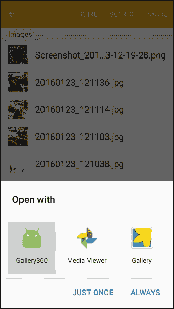

# 使用倾斜向上手势显示/隐藏网格

在 Cardboard 的早期，您只有一个按钮。就是这样。按钮和头部跟踪是用户与应用程序交互的唯一方式。而且因为按钮是一个巧妙的磁铁东西，你甚至不能按住这个按钮。有了 Cardboard 2.0，屏幕变成了按钮，我们还意识到我们可以短暂地把盒子从脸上拿下来，把手机向上倾斜，然后把它放回去，并将其解释为手势。因此，第二个输入诞生了！在撰写本文时，示例 Cardboard 应用程序将其用作返回手势。

我们将使用倾斜向上来显示和隐藏网格和箭头，以便您可以完全沉浸在所选的全景照片中。由于这样做的工作量较小，我们还允许用户随时执行此操作，而不仅仅是在查看全景照片时。与振动反馈一样，这实际上是一个相当轻松的功能。大部分的工作都是由`OrientationEventListener`类完成的。

在`MainActivity`类的顶部，添加一个变量来表示网格的状态，方向事件监听器，以及倾斜检测计时器，如下所示：

```kt
      static boolean setupComplete = false;

      boolean interfaceVisible = true;
      OrientationEventListener orientationEventListener;
      int orientThreshold = 10;
      boolean orientFlip = false;
      long tiltTime;
      int tiltDamper = 250;
```

首先，我们可以编写一个方法来切换缩略图网格菜单的开/关。检查是否有比平面更少的图像，因为空的图像已经在`updateThumbnails`中被禁用：

```kt
    void toggleGridMenu() {
        interfaceVisible = !interfaceVisible;
        if (up != null)
            up.enabled = !up.enabled;
        if (down != null)
            down.enabled = !down.enabled;
        int texCount = thumbOffset;
        for (Thumbnail thumb : thumbnails) {
            if (texCount < images.size() && thumb != null) {
                thumb.setVisible(interfaceVisible);
            }
            texCount++;
        }
    }
```

接下来，编写一个`setupOrientationListener`辅助方法，当设备方向发生变化时提供回调函数。如果方向接近垂直，我们可以调用我们的切换函数，一旦设备返回横向并再次垂直，我们再次切换：

```kt
    void setupOrientationListener() {
        orientationEventListener = new OrientationEventListener(this, SensorManager.SENSOR_DELAY_NORMAL) {
            @Override
            public void onOrientationChanged(int orientation) {
                if(gridUpdateLock || !setupComplete)
                    return;
           if(System.currentTimeMillis() - tiltTime > tiltDamper) {
                    if(Math.abs(orientation) < orientThreshold || Math.abs(orientation - 180) < orientThreshold){   //"close enough" to portrait mode
                        if(!orientFlip) {
                            Log.d(TAG, "tilt up! " + orientation);
                            vibrator.vibrate(25);
                            toggleGridMenu();
                        }
                        orientFlip = true;
                    }
                    if(Math.abs(orientation - 90) < orientThreshold || Math.abs(orientation - 270) < orientThreshold) {    //"close enough" to landscape mode
                        orientFlip = false;
                    }
                          tiltTime = System.currentTimeMillis();
                }
            }
        };
        if(orientationEventListener.canDetectOrientation())
            orientationEventListener.enable();
    }
```

然后，将其添加到`onCreate`中：

```kt
    protected void onCreate(Bundle savedInstanceState) {
        ...
        setupOrientationListener();
    }
```

`setupComplete`标志防止在网格仍在创建时切换网格。让我们在`updateThumbnails`之后重置完成标志：

```kt
    void updateThumbnails() {
        . . .
                cancelUpdate = false;
                gridUpdateLock = false;
 setupComplete = true;

```

在`onDestroy`中销毁它是明智的：

```kt
    @Override
    protected void onDestroy(){
        super.onDestroy();
        orientationEventListener.disable();
    }
```

`onOrientationChanged`回调将在手机改变方向时触发。我们只对从横向到纵向的变化感兴趣，并且我们也希望确保它不会发生太频繁，因此有了**倾斜阻尼器**功能。您可能希望调整值（目前为 250 毫秒）以满足您的喜好。时间太短，可能会错误地注册两次变化。时间太长，用户可能会在截止时间内尝试两次倾斜。

# 球形缩略图

球形 360 度图像应该比普通的缩略图图像更好，不是吗？我建议我们将它们显示为小球。也许我们应该称它们为拇指尖或拇指弹珠。无论如何，让我们做一些小小的修改来实现这一点。

## 在`Thumbnail`类中添加一个球体

在`Thumbnail`类中，添加一个`sphere`变量：

```kt
    public Sphere sphere;
```

修改`setImage`以识别全景图像：

```kt
    public void setImage(Image image) {
        // ...
        // show it
        if (image.isPhotosphere) {
            UnlitTexMaterial material = (UnlitTexMaterial) sphere.getMaterial();
            material.setTexture(image.textureHandle);
        } else {
            image.showThumbnail(cardboardView, plane);
        }
    }
```

我们还必须更改`setVisible`以处理`plane`和`sphere`变量，如下所示：

```kt
    public void setVisible(boolean visible) {
        if(visible) {
            if(image.isPhotosphere){
                plane.enabled = false;
                sphere.enabled = true;
            } else{
                plane.enabled = true;
                sphere.enabled = false;
            }
        } else {
            plane.enabled = false;
            sphere.enabled = false;
        }
    }
```

接下来，在`MainActivity`类的`setupThumbnailGrid`中，除了`Plane`对象之外，还初始化一个`Sphere`对象（在`GRID_Y`和`GRID_X`循环内）：

```kt
                    . . . 
                    image.addComponent(imgPlane);

                    Transform sphere = new Transform();
                    sphere.setLocalPosition(-4 + j * 2.1f, 3 - i * 3, -5);
                    sphere.setLocalRotation(180, 0, 0);
                    sphere.setLocalScale(normalScale, normalScale, normalScale);
                    Sphere imgSphere = new Sphere(R.drawable.bg, false);
                    thumb.sphere = imgSphere;
                    imgSphere.enabled = false;
                    sphere.addComponent(imgSphere);
```

现在，缩略图既有一个平面又有一个球体，我们可以根据图像类型进行填充。

最后，我们只需要修改`selectObject`方法，看看我们如何突出显示一个球体缩略图。我们通过改变边框颜色来突出显示矩形的缩略图。我们的球体没有边框；因此我们将改变它们的大小。

在`MainActivity`的顶部，添加变量到正常和选定的比例：

```kt
    final float selectedScale = 1.25f;
    final float normalScale = 0.85f;
```

现在，当图像是全景照片时，将`selectObject`更改为以不同的方式行事：

```kt
    void selectObject() {
        float deltaTime = Time.getDeltaTime();
        selectedThumbnail = null;
        for (Thumbnail thumb : thumbnails) {
            if (thumb.image == null)
                return;
            if(thumb.image.isPhotosphere) {
                Sphere sphere = thumb.sphere;
                if (sphere.isLooking) {
                    selectedThumbnail = thumb;
                    if (!gridUpdateLock)
                        sphere.transform.setLocalScale(selectedScale, selectedScale, selectedScale);
                } else {
                    sphere.transform.setLocalScale(normalScale, normalScale, normalScale);
                }
                sphere.transform.rotate(0, 10 * deltaTime, 0);
            } else {
                Plane plane = thumb.plane;
                //...
            }
        }
        //. . .
```

哇哦！我们甚至让球体旋转，这样你就可以看到它 360 度的全部荣耀！这太有趣了，简直应该是非法的。

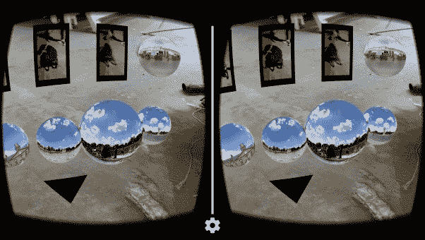

就是这样！一个美丽的照片查看器应用程序，支持常规相机图像和 360 度全景照片。

# 更新 RenderBox 库

Gallery360 项目已经实施并且我们的代码已经稳定，你可能会意识到我们构建了一些不一定特定于这个应用程序的代码，可以在其他项目中重复使用，并且应该回到`RenderBox`库中。

我们在上一个项目的最后在第六章中完成了这个。你可以参考那个主题了解详情。按照以下步骤更新`RenderBoxLib`项目：

1.  从`RenderBoxExt/components`移动`Plane`和`Triangle`组件。

1.  从`RenderBoxExt/materials`移动`BorderMaterial`组件。

1.  从`res/raw`移动边框着色器文件。

1.  修复任何无效引用以正确的包名称。

1.  通过点击**Build** | **Make Project**来重建库。

# 进一步的可能增强

哇，这是很多工作！这个东西肯定完成了，不是吗？*永远不是！*这里有一些改进，迫切需要实施：

+   更好地检测手机图片：

+   并不是每个人都把他们的所有图像保存在特定的路径中。事实上，一些相机软件使用完全不同的路径！引入一个合适的文件浏览器。

+   更好地检测全景图像：

+   在 XMP 头文件中有一个`Projection Type`属性，这是一些 JPG 文件中的另一个元数据。不幸的是，Android API 没有一个特定的类来读取这些数据，集成第三方库超出了这个项目的范围。可以尝试以下链接：

[`github.com/dragon66/pixymeta-android`](https://github.com/dragon66/pixymeta-android)

[`github.com/drewnoakes/metadata-extractor`](https://github.com/drewnoakes/metadata-extractor)

不要使用全景技术，因为它会捕捉到常规全景照片。允许用户标记或修复显示不正确的全景照片或旋转元数据的图像。

+   动画 UI 操作-选择时的缩放/平移，平滑网格滚动。

+   一个很棒的技术，可以防止网格瓦片出现在上/下箭头的后面，称为**深度遮罩**。你也可以在世界空间中引入最大和最小的 Y 值，超出这些值的瓦片将无法绘制。但深度遮罩更酷。

+   响应`GALLERY`意图，用来覆盖网格并从另一个应用程序中选择图像。

+   在`VIEW`意图中接受来自网络的图像 URL。

+   你需要首先下载图像，然后从下载路径加载它。

# 总结

我希望你和我一样对我们在这里取得的成就感到兴奋！我们构建了一个真正实用的 Cardboard VR 应用程序，用于查看常规照片和 360 度全景照片的画廊。该项目使用了`RenderBox`库，如第五章中所讨论的，*RenderBox Engine*。

首先，我们演示了全景照片的工作原理，并使用`RenderBox`库在 Cardboard 上查看了一个，而没有进行任何自定义更改。然后，为了查看常规照片，我们创建了一个`Plane`组件，用作虚拟投影屏幕。我们编写了新的材料和着色器来渲染带有边框的图像。

接下来，我们定义了一个新的`Image`类，并从手机的相机文件夹中加载图像到列表中，并编写了一个方法来在屏幕上显示图像`Plane`，纠正其方向和纵横比。然后，我们构建了一个用户界面，显示了缩略图图像的网格，并允许您通过凝视并点击 Cardboard 触发器来选择其中一个图像进行显示。该网格是可滚动的，这要求我们添加线程，以便在加载文件时应用程序不会出现锁定。最后，我们添加了一些功能来启动带有图像查看意图的应用程序，通过将手机垂直倾斜来切换菜单网格，并为全景照片添加了球形缩略图。

在下一章中，我们将构建另一种类型的查看器；这次是为了查看 OBJ 文件中的完整 3D 模型。
