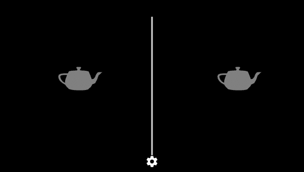
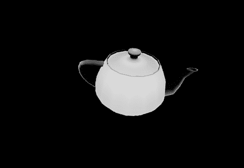

# 第八章. 3D 模型查看器

三维模型随处可见，从机械工程的机械零件到医学成像；从视频游戏设计到 3D 打印。 3D 模型与照片、视频、音乐和其他媒体一样丰富多样。然而，虽然浏览器和应用程序对其他媒体类型有原生支持，但对 3D 模型的支持并不多。有一天，3D 查看标准将集成到浏览器中（例如 WebGL 和 WebVR）。在那之前，我们将不得不依赖插件和姊妹应用程序来查看我们的模型。例如，可以在网上找到免费的 OBJ 格式的 3D 文件模型，包括 TF3DM（[`tf3dm.com/`](http://tf3dm.com/)）、TurboSquid（[`www.turbosquid.com/`](http://www.turbosquid.com/)）和其他许多网站（[`www.hongkiat.com/blog/60-excellent-free-3d-model-websites/`](http://www.hongkiat.com/blog/60-excellent-free-3d-model-websites/)）。

在这个项目中，我们将构建一个 Android 3D 模型查看器应用程序，让您可以使用 Cardboard VR 头盔打开和查看 3D 模型。我们将使用的文件格式是 OBJ，这是 Wavefront Technologies 最初为电影 3D 动画开发的开放格式。OBJ 可以由许多 3D 设计应用程序创建和导出，包括开源应用程序，如 Blender 和 MeshLab，以及商业应用程序，如 3D Studio Max 和 Maya。OBJ 是一个非压缩的纯文本文件，用于存储由三角形（或更高阶多边形）组成的 3D 对象的表面网格的描述。

为了实现查看器，我们将读取和解析 OBJ 文件模型，并在 3D 中显示它们以供 Cardboard 查看。我们将通过以下步骤实现这一目标：

+   设置新项目

+   编写 OBJ 文件解析器以导入几何图形

+   显示 3D 模型

+   使用用户的头部运动旋转对象的视图

此项目的源代码可以在 Packt Publishing 网站上找到，并且在 GitHub 上也可以找到（[`github.com/cardbookvr/modelviewer`](https://github.com/cardbookvr/modelviewer)）（每个主题作为单独的提交）。

# 建立一个新项目

为了构建这个项目，我们将使用在第五章中创建的`RenderBox`库，*RenderBox 引擎*。您可以使用您自己的库，或者从本书提供的可下载文件或我们的 GitHub 存储库中获取副本（使用标记为`after-ch7`的提交—[`github.com/cardbookvr/renderboxlib/releases/tag/after-ch7`](https://github.com/cardbookvr/renderboxlib/releases/tag/after-ch7)）。有关如何导入`RenderBox`库的更详细描述，请参阅第五章的最后一节，*在未来项目中使用 RenderBox*。执行以下步骤创建一个新项目：

1.  打开 Android Studio，创建一个新项目。让我们将其命名为`Gallery360`，并以**空活动**为目标定位到**Android 4.4 KitKat (API 19)**。

1.  创建`renderbox`，`common`和`core`包的新模块，使用**文件** | **新建模块** | **导入.JAR/.AAR 包**。

1.  使用**文件** | **项目结构**将模块设置为应用程序的依赖项。

1.  按照第二章中的说明编辑`build.gradle`文件，*Cardboard 项目的骨架*，以便对 SDK 22 进行编译。

1.  更新`/res/layout/activity_main.xml`和`AndroidManifest.xml`，如前几章所述。

1.  将`MainActivity`编辑为`class MainActivity extends CardboardActivity implements IRenderBox`，并实现接口方法存根（*Ctrl* + *I*）。

我们可以继续在`MainActivity`中定义`onCreate`方法。该类现在具有以下代码：

```kt
public class MainActivity extends CardboardActivity implements IRenderBox {
    private static final String TAG = "ModelViewer";
    CardboardView cardboardView;
    @Override
    protected void onCreate(Bundle savedInstanceState) {
        super.onCreate(savedInstanceState);
        setContentView(R.layout.activity_main);

        cardboardView = (CardboardView) findViewById(R.id.cardboard_view);
        cardboardView.setRenderer(new RenderBox(this, this));
        setCardboardView(cardboardView);
    }
    @Override
    public void setup() {
    }
    @Override
    public void preDraw() {
        // code run beginning each frame
    }
    @Override
    public void postDraw() {
        // code run end of each frame
    }
}
```

您可以将一个立方体临时添加到场景中，以确保一切设置正确。将其添加到`setup`方法中，如下所示：

```kt
    public void setup() {
        new Transform()
            .setLocalPosition(0,0,-7)
            .setLocalRotation(45,60,0)
            .addComponent(new Cube(true));
    }
```

如果您记得，`Cube`是添加到`Transform`的`Component`。`Cube`定义了它的几何形状（例如，顶点）。`Transform`定义了它在 3D 空间中的位置、旋转和缩放。

您应该能够在 Android 设备上点击**Run 'app'**而没有编译错误，并看到立方体和 Cardboard 分屏视图。

# 了解 OBJ 文件格式

该项目的目标是查看 Wavefront OBJ 格式的 3D 模型。在我们开始编码之前，让我们来看看文件格式。可以在[`www.fileformat.info/format/wavefrontobj/egff.htm`](http://www.fileformat.info/format/wavefrontobj/egff.htm)找到参考资料。

正如我们所知，3D 模型可以表示为 X、Y 和 Z 顶点的网格。顶点集连接在一起定义网格表面的一个面。完整的网格表面是这些面的集合。

每个顶点也可以分配一个法线向量和/或纹理坐标。法线向量定义了该顶点的外向面向方向，用于光照计算。UV 纹理坐标可用于将纹理图像映射到网格表面上。格式的其他特性包括自由曲线和材质，我们在这个项目中不会支持。

作为纯文本文件，OBJ 被组织为单独的文本行。每个非空行以关键字开头，后面是由空格分隔的该关键字的数据。注释以`#`开头，并且被解析器忽略。

OBJ 数据关键字包括：

+   `v`: 几何顶点（例如，`v 0.0 1.0 0.0`）

+   `vt`: 纹理顶点（例如，`vt 0.0 1.0 0.0`）[在我们的项目中不受支持]

+   `vn`: 顶点法线（例如，`vn 0.0 1.0 0.0`）

+   `f`: 多边形面索引（例如，`f 1 2 3`）

面值是指向顶点列表中的顶点的索引（从第一个顶点开始为 1）。

至于指定面索引的`f`命令，它们是整数值，用于索引顶点列表。当有三个索引时，它描述一个三角形；四个描述一个四边形，依此类推。

当纹理顶点存在时，它们被引用为斜杠后的第二个数字，例如，`f 1/1 2/2 3/3`。我们现在不支持它们，但可能需要在`f`命令中解析它们。当顶点法线存在时，它们被引用为斜杠后的第三个数字，例如，`f 1//1 2//2 3//3`或`f 1/1/1 2/2/2 3/3/3`。

索引可以是负数，这种情况下它们将以-1 表示最后（最近遇到的）项目，-2 表示前一个项目，依此类推。

其他行，包括我们这里不支持的数据，将被忽略。

例如，以下数据表示一个简单的三角形：

```kt
# Simple Wavefront file
v 0.0 0.0 0.0
v 0.0 1.0 0.0
v 1.0 0.0 0.0
f 1 2 3
```

我们的 OBJ 实现是有限的。它可以安全地处理本书附带的示例模型，也许还可以处理您在互联网上找到或自己制作的其他模型。然而，这只是一个示例代码和演示项目。在我们的`RenderBox`引擎中编写一个强大的数据导入器并支持 OBJ 的许多特性超出了本书的范围。

# 创建`ModelObject`类

首先，我们将定义一个`ModelObject`类，它扩展了`RenderObject`。它将从 OBJ 文件加载模型数据，并设置其材质所需的缓冲区（以及 OpenGL ES 着色器，以在 VR 场景中呈现）。

右键单击`app/java/com.cardboardvr.modelviewer/`文件夹，转到**New** | **Java Class**，并命名为`ModelObject`。定义它以扩展`RenderObject`，如下所示：

```kt
public class ModelObject extends RenderObject {
}
```

就像我们在之前的章节中所做的那样，当引入新类型的`RenderObjects`时，我们将有一个或多个构造函数，可以实例化一个`Material`并设置缓冲区。对于`ModelObject`，我们将传入一个文件资源句柄，解析文件（参考下一个主题），并创建一个纯色材质（最初，没有光照），如下所示：

```kt
    public ModelObject(int objFile) {
        super();
        InputStream inputStream = RenderBox.instance.mainActivity.getResources().openRawResource(objFile);
        if (inputStream == null)
            return; // error
        parseObj(inputStream);
        createMaterial();
    }
```

现在添加材质如下。首先，声明缓冲区的变量（就像我们在之前的项目中为其他`RenderObjects`所做的那样）。这些可以是私有的，但我们的约定是如果我们想在外部定义新材质，就将它们保持为公共的：

```kt
    public static FloatBuffer vertexBuffer;
    public static FloatBuffer colorBuffer;
    public static FloatBuffer normalBuffer;
    public static ShortBuffer indexBuffer;
    public int numIndices;
```

这是`createMaterial`方法（从构造函数中调用）：

```kt
    public ModelObject createMaterial(){
        SolidColorLightingMaterial scm = new SolidColorLightingMaterial(new float[]{0.5f, 0.5f, 0.5f, 1});
        scm.setBuffers(vertexBuffer, normalBuffer, indexBuffer, numIndices);
        material = scm;
        return this;
    }
```

接下来，我们实现`parseObj`方法。

# 解析 OBJ 模型

`parseObj`方法将打开资源文件作为`InputStream`。它一次读取一行，解析命令和数据，构建模型的顶点、法线和索引列表。然后，我们从数据构建缓冲区。

首先，在`ModelObject`类的顶部，声明数据列表的变量：

```kt
    Vector<Short> faces=new Vector<Short>();
    Vector<Short> vtPointer=new Vector<Short>();
    Vector<Short> vnPointer=new Vector<Short>();
    Vector<Float> v=new Vector<Float>();
    Vector<Float> vn=new Vector<Float>();
    Vector<Material> materials=null;
```

让我们编写`parseObj`，并为辅助方法添加占位符。我们打开文件，处理每一行，构建缓冲区，并处理潜在的 IO 错误：

```kt
    void parseObj(InputStream inputStream) {
        BufferedReader reader = null;
        String line = null;

        reader = new BufferedReader(new InputStreamReader(inputStream));
        if (reader == null)
            return; // error

        try { // try to read lines of the file
            while ((line = reader.readLine()) != null) {
                parseLine(line);
            }
            buildBuffers();
        } catch (IOException e) {
            e.printStackTrace();
        }
    }
```

`parseLine`代码非常简单。行的第一个标记是一个或两个字符的命令（如`v`、`vn`或`f`），后面是数据值（浮点坐标或整数索引）。以下是`parseLine`和`v`、`vn`顶点的解析器的代码：

```kt
    private void parseLine(String line) {
        Log.v("obj", line);
        if(line.startsWith("f")){//a polygonal face
            processFLine(line);
        }
        else
        if(line.startsWith("vn")){
            processVNLine(line);
        }
        else
        if(line.startsWith("v")){ //line having geometric position of single vertex
            processVLine(line);
        }
    }

    private void processVLine(String line){
        String [] tokens=line.split("[ ]+"); 
        //split the line at the spaces
        int c=tokens.length;
        for(int i=1; i<c; i++){ //add the vertex to the vertex array
            v.add(Float.valueOf(tokens[i]));
        }
    }

    private void processVNLine(String line){
        String [] tokens=line.split("[ ]+"); 
        //split the line at the spaces
        int c=tokens.length;
        for(int i=1; i<c; i++){ //add the vertex to the vertex array
            vn.add(Float.valueOf(tokens[i]));
        }
    }
```

`f`行需要处理各种值情况。

至于指定面索引的`f`命令，它们是索引到顶点列表的整数值。当有三个索引时，它描述一个三角形，四个描述一个四边形，依此类推。超过三边的任何形状都需要被细分为三角形，以便在 OpenGL ES 中进行渲染。

还可以有任意组合的索引值，包括格式如`v`或`v/vt`或`v/vt/vn`，甚至`v//vn`，`/vt/vn`或`//vn`。（请记住，由于我们没有映射纹理，我们只会使用第一个和第三个。）

让我们先处理最简单的情况，即三角形面：

```kt
    private void processFLine(String line){
        String [] tokens=line.split("[ ]+");
        int c=tokens.length;

        if(tokens[1].matches("[0-9]+")){//f: v
            if(c==4){//3 faces
                for(int i=1; i<c; i++){
                    Short s=Short.valueOf(tokens[i]);
                    s--;
                    faces.add(s);
                }
            }
        }
    }
```

现在考虑面上有超过三个索引。我们需要一个方法来将多边形三角化。让我们现在编写这个方法：

```kt
    public static Vector<Short> triangulate(Vector<Short> polygon){
        Vector<Short> triangles=new Vector<Short>();
        for(int i=1; i<polygon.size()-1; i++){
            triangles.add(polygon.get(0));
            triangles.add(polygon.get(i));
            triangles.add(polygon.get(i+1));
        }
        return triangles;
    }
```

我们可以在`processFLine`中使用它：

```kt
    private void processFLine(String line) {
        String[] tokens = line.split("[ ]+");
        int c = tokens.length;

        if (tokens[1].matches("[0-9]+") || //f: v
            tokens[1].matches("[0-9]+/[0-9]+")) {//f: v/vt

            if (c == 4) {//3 faces
                for (int i = 1; i < c; i++) {
                    Short s = Short.valueOf(tokens[i]);
                    s--;
                    faces.add(s);
                }
            }
            else{//more faces
                Vector<Short> polygon=new Vector<Short>();
                for(int i=1; i<tokens.length; i++){
                    Short s=Short.valueOf(tokens[i]);
                    s--;
                    polygon.add(s);
                }
                faces.addAll(triangulate(polygon));
                //triangulate the polygon and //add the resulting faces
            }
        }
        //if(tokens[1].matches("[0-9]+//[0-9]+")){//f: v//vn
        //if(tokens[1].matches("[0-9]+/[0-9]+/[0-9]+")){
		//f: v/vt/vn
    }
```

这段代码适用于面值`v`和`v/vt`，因为我们跳过纹理。我还注释掉了面索引值的其他两种排列。其余部分大部分只是暴力字符串解析。`v//vn`情况如下：

```kt
    if(tokens[1].matches("[0-9]+//[0-9]+")){//f: v//vn
        if(c==4){//3 faces
            for(int i=1; i<c; i++){
                Short s=Short.valueOf(tokens[i].split("//")[0]);
                s--;
                faces.add(s);
                s=Short.valueOf(tokens[i].split("//")[1]);
                s--;
                vnPointer.add(s);
            }
        }
        else{//triangulate
            Vector<Short> tmpFaces=new Vector<Short>();
            Vector<Short> tmpVn=new Vector<Short>();
            for(int i=1; i<tokens.length; i++){
                Short s=Short.valueOf(tokens[i].split("//")[0]);
                s--;
                tmpFaces.add(s);
                s=Short.valueOf(tokens[i].split("//")[1]);
                s--;
                tmpVn.add(s);
            }
            faces.addAll(triangulate(tmpFaces));
            vnPointer.addAll(triangulate(tmpVn));
        }
    }
```

最后，`v/vt/vn`情况如下：

```kt
    if(tokens[1].matches("[0-9]+/[0-9]+/[0-9]+")){//f: v/vt/vn
        if(c==4){//3 faces
            for(int i=1; i<c; i++){
                Short s=Short.valueOf(tokens[i].split("/")[0]);
                s--;
                faces.add(s);
                // (skip vt)
                s=Short.valueOf(tokens[i].split("/")[2]);
                s--;
                vnPointer.add(s);
            }
        }
        else{//triangulate
            Vector<Short> tmpFaces=new Vector<Short>();
            Vector<Short> tmpVn=new Vector<Short>();
            for(int i=1; i<tokens.length; i++){
                Short s=Short.valueOf(tokens[i].split("/")[0]);
                s--;
                tmpFaces.add(s);
                // (skip vt)
                s=Short.valueOf(tokens[i].split("/")[2]);
                s--;
                tmpVn.add(s);
            }
            faces.addAll(triangulate(tmpFaces));
            vnPointer.addAll(triangulate(tmpVn));
        }
    }
```

如前所述，在 OBJ 文件格式描述中，索引可以是负数；在这种情况下，它们需要从顶点列表的末尾向后引用。这可以通过将索引值添加到索引列表的大小来实现。为了支持这一点，在前面的代码中，用以下内容替换所有`s--`行：

```kt
                   if (s < 0)
                       s = (short)(s + v.size());
                   else
                       s--;
```

## buildBuffers

`parseObj`方法的最后一步是从模型数据构建我们的着色器缓冲区，即`vertexBuffer`、`normalBuffer`和`indexBuffer`变量。我们现在可以将其添加到`buildBuffers`方法中，如下所示：

```kt
    private void buildBuffers() {
        numIndices = faces.size();
        float[] tmp = new float[v.size()];
        int i = 0;
        for(Float f : v)
            tmp[i++] = (f != null ? f : Float.NaN);
        vertexBuffer = allocateFloatBuffer(tmp);

        i = 0;
        tmp = new float[vn.size()];
        for(Float f : vn)
            tmp[i++] = (f != null ? -f : Float.NaN); 
            //invert normals
        normalBuffer = allocateFloatBuffer(tmp);

        i = 0;
        short[] indicies = new short[faces.size()];
        for(Short s : faces)
            indicies[i++] = (s != null ? s : 0);
        indexBuffer = allocateShortBuffer(indicies);
    }
```

有一个注意事项。我们注意到对于`RenderBox`坐标系和着色器，有必要从 OBJ 数据中反转法线（使用`-f`而不是`f`）。实际上，这取决于 OBJ 导出器（3Ds Max、Blender 和 Maya）。其中一些会翻转法线，而另一些则不会。不幸的是，除了查看模型之外，没有办法确定法线是否被翻转。因此，一些 OBJ 导入器/查看器提供了（可选的）功能，可以根据面几何计算法线，而不是依赖于导入数据本身。

# 模型范围、缩放和中心

3D 模型有各种形状和大小。为了在我们的应用程序中查看它们，我们需要知道模型的最小和最大边界以及其几何中心，以便适当地进行缩放和定位。让我们现在将这些添加到`ModelObject`中。

在`ModelObject`类的顶部，添加以下变量：

```kt
    public Vector3 extentsMin, extentsMax;
```

在解析器中初始化范围，然后解析模型数据。最小范围初始化为最大可能值；最大范围初始化为最小可能值：

```kt
    public ModelObject(int objFile) {
        super();
        extentsMin = new Vector3(Float.MAX_VALUE, Float.MAX_VALUE, Float.MAX_VALUE);
        extentsMax = new Vector3(Float.MIN_VALUE, Float.MIN_VALUE, Float.MIN_VALUE);
        . . .
```

我们将在模型加载后而不是在导入过程中计算范围。当我们向顶点列表添加一个新顶点时，我们将计算当前范围。在`processVLine`循环中添加一个调用`setExtents`：

```kt
    private void processVLine(String line) {
        String[] tokens = line.split("[ ]+"); 
        //split the line at the spaces
        int c = tokens.length;
        for (int i = 1; i < c; i++) { //add the vertex to the vertex array
            Float value = Float.valueOf(tokens[i]);
            v.add(value);
            setExtents(i, value);
        }
    }
```

然后，`setExtents`方法可以实现如下：

```kt
    private void setExtents(int coord, Float value) {
        switch (coord) {
            case 1:
                if (value < extentsMin.x)
                    extentsMin.x = value;
                if (value > extentsMax.x)
                    extentsMax.x = value;
                break;
            case 2:
                if (value < extentsMin.y)
                    extentsMin.y = value;
                if (value > extentsMax.y)
                    extentsMax.y = value;
                break;
            case 3:
                if (value < extentsMin.z)
                    extentsMin.z = value;
                if (value > extentsMax.z)
                    extentsMax.z = value;
                break;
        }
    }
```

让我们添加一个标量方法，当我们将模型添加到场景中时会很有用（正如你将在下一个主题中看到的），将其缩放到一个标准大小，范围为`-1`到`1`：

```kt
    public float normalScalar() {
        float sizeX = (extentsMax.x - extentsMin.x);
        float sizeY = (extentsMax.y - extentsMin.y);
        float sizeZ = (extentsMax.z - extentsMin.z);
        return (2.0f / Math.max(sizeX, Math.max(sizeY, sizeZ)));
    }
```

现在，让我们试试吧！

# 我是一个小茶壶

几十年来，3D 计算机图形研究人员和开发人员一直在使用这个可爱的茶壶模型。它是一个经典！背后的故事是，著名的计算机图形先驱和研究人员马丁·纽维尔需要一个模型来进行他的工作，他的妻子建议他在家里对他们的茶壶进行建模。原作现在展览在波士顿计算机博物馆。我们已经在本书的可下载文件中包含了这个经典模型的 OBJ 版本。

当然，你可以选择自己的 OBJ 文件，但如果你想使用茶壶，找到`teapot.obj`文件，并将其复制到`res/raw`文件夹中（如果需要，创建该文件夹）。

现在加载模型并尝试。在`MainActivity`中，添加一个变量到`MainActivity`类的顶部来保存当前模型：

```kt
    Transform model;
```

将以下代码添加到`setup`方法中。注意，我们将其缩放到原始大小的一小部分，并将其放置在摄像头前方 3 个单位处：

```kt
    public void setup() {
        ModelObject modelObj = new ModelObject(R.raw.teapot);
        float scalar = modelObj.normalScalar();
        model = new Transform()
                .setLocalPosition(0, 0, -3)
                .setLocalScale(scalar, scalar, scalar)
                .addComponent(modelObj);
    }
```

运行项目，应该看起来像这样：



你可以看到模型已经成功加载和渲染。不幸的是，阴影很难辨认。为了更好地观看阴影茶壶，让我们把它下移一点。修改`setup`中的`setLocalPosition`方法，如下所示：

```kt
                .setLocalPosition(0, -2, -3) 
```

以下截图被裁剪和放大，这样你就可以看到这里的阴影茶壶，就像你在 Cardboard 观看器中看到的一样：



# 我是一个旋转的小茶壶

通过旋转模型来增强观看体验，当用户旋转头部时模型也会旋转。这种效果与“正常”的虚拟现实体验不同。通常情况下，在 VR 中移动头部会旋转场景中相机的主观视图，以便与头部运动一起四处张望。在这个项目中，头部运动就像一个输入控制旋转模型。模型始终固定在你面前的位置。

实现这个功能非常简单。`RenderBox preDraw`接口方法在每一帧开始时被调用。我们将获取当前的头部角度并相应地旋转模型，将头部后欧拉角转换为四元数（组合多个欧拉角可能导致意外的最终旋转方向）。我们还会共轭（即反转）旋转，这样当你抬头时，你会看到物体的底部，依此类推。这样感觉更自然。

在`MainActivity`中，添加以下代码到`preDraw`：

```kt
    public void preDraw() {
        float[] hAngles = RenderBox.instance.headAngles;
        Quaternion rot = new Quaternion();
        rot.setEulerAnglesRad(hAngles[0], hAngles[1], hAngles[2]);
        model.setLocalRotation(rot.conjugate());
    }
```

在`setup`中，确保`setLocalPosition`方法将茶壶直立在摄像头前方：

```kt
                .setLocalPosition(0, 0, -3)
```

尝试运行它。我们快要成功了！模型随着头部旋转，但我们仍然在 VR 空间中四处张望。

为了锁定头部位置，我们只需要在`RenderBox`中禁用头部跟踪。如果你的`RenderBox`版本（在第五章中构建的*RenderBox Engine*）还没有这个功能，那么将其添加到你的单独的`RenderBoxLib` lib 项目中，如下所示：

在`Camera.java`文件中，首先添加一个新的公共变量`headTracking`：

```kt
    public boolean headTracking = true;
```

修改`onDrawEye`方法以有条件地更新视图变换，如下所示：

```kt
        if (headTracking) {
            // Apply the eye transformation to the camera.
            Matrix.multiplyMM(view, 0, eye.getEyeView(), 0, camera, 0);
        } else {
             // copy camera into view
            for (int i=0; i < camera.length; i++) { view[i] = camera[i]; }
        }
```

确保在重新构建后将更新的`.aar`文件复制到`ModelViewer`项目的`RenderBox`模块文件夹中。

现在，在`MainActivity`类的`setup()`中，添加以下设置：

```kt
        RenderBox.instance.mainCamera.headTracking = false;
```

现在运行它，当你移动头部时，模型保持相对静止，但随着你转动头部而旋转。太棒了！好多了。

# 线程安全

在第七章中，*360 度画廊*，我们解释了需要工作线程将处理从渲染线程中卸载的需求。在这个项目中，我们将在`ModelObject`构造函数中添加线程，用于读取和解析模型文件：

```kt
    public ModelObject(final int objFile) {
        super();
        extentsMin = new Vector3(Float.MAX_VALUE, Float.MAX_VALUE, Float.MAX_VALUE);
        extentsMax = new Vector3(Float.MIN_VALUE, Float.MIN_VALUE, Float.MIN_VALUE);

        SolidColorLightingMaterial.setupProgram();
        enabled = false;
        new Thread(new Runnable() {
            @Override
            public void run() {
                InputStream inputStream = RenderBox.instance.mainActivity.getResources().openRawResource(objFile);
                if (inputStream == null)
                    return; // error
                createMaterial();
                enabled = true;
                float scalar = normalScalar();
                transform.setLocalScale(scalar, scalar, scalar);
            }
        }).start();
    }
```

我们必须将文件句柄`objFile`声明为`final`，以便能够从内部类中访问它。您可能还注意到，我们在启动线程之前添加了对材质的`setup`程序的调用，以确保它在时间上得到正确设置并避免崩溃应用。这避免了在`queueEvent`过程中调用`createMaterial`的需要，因为着色器编译器利用了图形上下文。同样，我们在加载完成之前禁用对象。最后，由于加载是异步的，必须在此过程的末尾设置比例。我们以前的方法在`setup()`中设置了比例，现在在模型加载完成之前完成了。

# 使用意图启动

在第七章中，*360 度画廊*，我们介绍了使用 Android 意图将应用程序与特定文件类型相关联，以便将我们的应用程序作为这些文件的查看器启动。我们将在这里为 OBJ 文件做同样的事情。

**意图**是任何应用程序都可以发送到 Android 系统的消息，宣告其意图使用另一个应用程序来完成某个特定目的。意图对象包含许多成员，用于描述需要执行的操作类型，以及（如果有的话）需要执行操作的数据。对于图像库，我们将意图过滤器与图像 MIME 类型相关联。对于这个项目，我们将意图过滤器与文件名扩展名相关联。

在您的`AndroidManifest.xml`文件中，向活动块添加一个意图过滤器。这让 Android 知道该应用程序可以用作 OBJ 文件查看器。我们需要将其指定为文件方案和文件名模式。通配符 MIME 类型和主机也是 Android 所必需的。添加以下 XML 代码：

```kt
            <intent-filter>
                <action android:name="android.intent.action.VIEW" />
                <category android:name="android.intent.category.DEFAULT" />
                <category android:name="android.intent.category.BROWSABLE" />
                <data android:scheme="file" />
                <data android:mimeType="*/*" />
                <data android:pathPattern=".*\\.obj" />
                <data android:host="*" />
            </intent-filter>
```

为了处理这种情况，我们将在`ModelObject`中添加一个新的构造函数，该构造函数接受一个 URI 字符串而不是资源 ID，就像我们之前做的那样。与其他构造函数一样，我们需要打开一个输入流并将其传递给`parseObj`。以下是构造函数，包括工作线程：

```kt
    public ModelObject(final String uri) {
        super();
        extentsMin = new Vector3(Float.MAX_VALUE, Float.MAX_VALUE, Float.MAX_VALUE);
        extentsMax = new Vector3(Float.MIN_VALUE, Float.MIN_VALUE, Float.MIN_VALUE);
        SolidColorLightingMaterial.setupProgram();
        enabled = false;
        new Thread(new Runnable() {
            @Override
            public void run() {
                File file = new File(uri.toString());
                FileInputStream fileInputStream;
                try {
                    fileInputStream = new FileInputStream(file);
                } catch (IOException e) {
                    e.printStackTrace();
                    return; // error
                }
                parseObj(fileInputStream);
                createMaterial();
                enabled = true;
                float scalar = normalScalar();
                transform.setLocalScale(scalar, scalar, scalar);
            }
        }).start();
    }
```

现在在`MainActivity`类的`setup`中，我们将检查应用程序是否是从意图启动的，并使用意图 URI。否则，我们将查看默认模型，就像我们之前做的那样：

```kt
    public void setup() {
        ModelObject modelObj;
        Uri intentUri = getIntent().getData();
        if (intentUri != null) {
            Log.d(TAG, "!!!! intent " + intentUri.getPath());
            modelObj = new ModelObject(intentUri.getPath());
        } else {
            // default object
            modelObj = new ModelObject(R.raw.teapot);
        }
        //...        
```

现在项目已经构建并安装到手机上，让我们尝试一些网络集成。打开网络浏览器并访问一个 3D 模型下载网站。

找到有趣模型的**下载**链接，将其下载到手机上，然后在提示时，使用`ModelViewer`应用程序查看它！

# 实用和生产就绪

请注意，正如前面提到的，我们已经创建了 OBJ 模型格式的有限实现，因此您找到的每个模型在这一点上可能无法正确查看（如果有的话）。不过，这可能是足够的，取决于您自己项目的要求，例如，如果您在资源文件夹中包含特定模型，可以在应用的发布版本中查看。当您完全控制输入数据时，您可以偷个懒。

虽然 OBJ 文件格式的基本结构并不是非常复杂，正如我们在这里所展示的，就像软件（以及生活中的许多事物）一样，“魔鬼在细节中”。以这个项目作为起点，然后构建您自己的实用和生产就绪的 OBJ 文件解析器和渲染器将需要相当多的额外工作。您还可以研究现有的软件包、其他模型格式，或者甚至从开源游戏引擎（如 LibGDX）中提取一些代码。我们省略的 OBJ 的特性，但值得考虑的包括以下内容：

+   纹理顶点

+   材质定义

+   曲线元素

+   几何图形的分组

+   颜色和其他顶点属性

# 总结

在这个项目中，我们编写了一个简单的查看器，用于以开放的 OBJ 文件格式查看 3D 模型。我们实现了一个`ModelObject`类，它解析模型文件并构建了`RenderBox`需要的向量和法线缓冲区，以在场景中渲染对象。然后我们启用了阴影。然后我们使查看器交互，这样模型就会随着你移动头部而旋转。

在下一章中，我们将探索另一种类型的媒体，即音乐。音乐可视化器会响应当前的音乐播放器，在 VR 世界中显示跳舞的几何图形。
