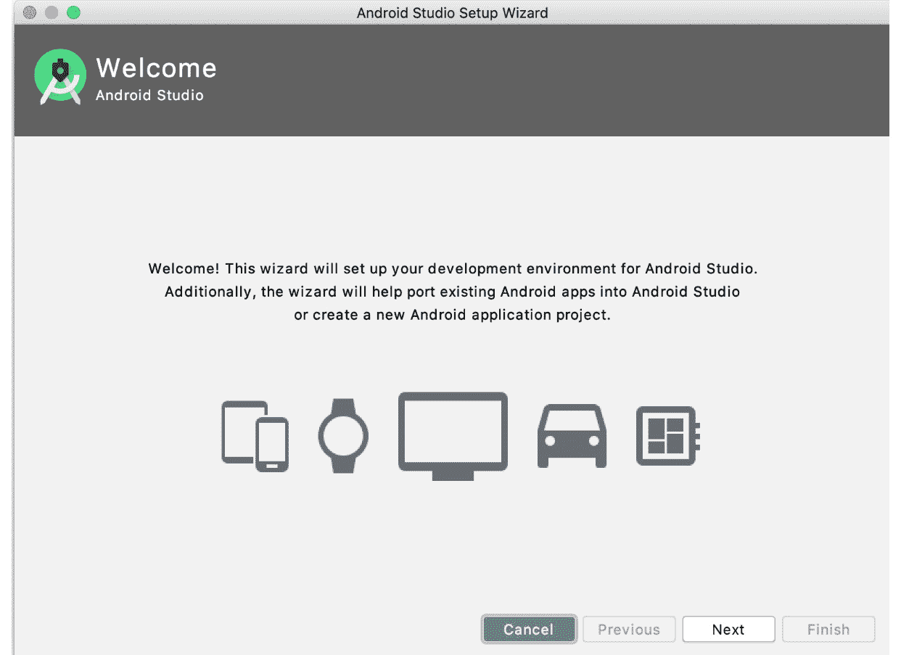
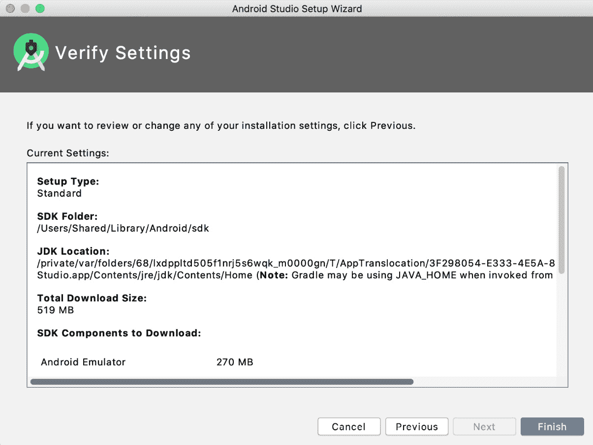

# 前言

# 关于本书

Android 在过去十年一直统治着应用市场，开发者们越来越多地希望开始构建自己的 Android 应用程序。*使用 Kotlin 构建 Android 应用程序*从 Android 开发的基础知识开始，教你如何使用 Android Studio（Android 的集成开发环境）和 Kotlin 编程语言进行应用程序开发。然后，你将学习如何通过引导式练习创建应用程序并在虚拟设备上运行。你将学习 Android 开发的基础知识，从应用程序结构到使用 Activities 和 Fragments 构建 UI 以及各种导航模式。随着章节的进行，你将深入了解 Android 的 RecyclerView，以充分利用显示数据列表，并熟悉从 Web 服务获取数据和处理图像。然后，你将学习地图、位置服务和权限模型，然后处理通知和数据持久化。接下来，你将掌握测试，涵盖测试金字塔的全部范围。你还将学习如何使用 AAC（Android 架构组件）来清晰地构建你的代码，并探索各种架构模式和依赖注入的好处。异步编程的核心库 RxJava 和 Coroutines 也被涵盖在内。然后重点回到 UI，演示用户与应用程序交互时如何添加动作和过渡效果。最后，你将构建一个有趣的应用程序，从电影数据库中检索并显示热门电影，然后学习如何在 Google Play 上发布你的应用程序。通过本书的学习，你将具备使用 Kotlin 构建完整的 Android 应用程序所需的技能和信心。

## 关于作者

*Alex Forrester*是一名经验丰富的软件开发者，拥有超过 20 年的移动、Web 开发和内容管理系统开发经验。他在 Android 领域工作了 8 年以上，在 Sky、The Automobile Association、HSBC、The Discovery Channel 和 O2 等著名公司开发了旗舰应用。Alex 和妻女住在赫特福德郡。在不开发软件的时候，他喜欢橄榄球和在 Chiltern 山丘上跑步。

*Eran Boudjnah*是一名拥有超过 20 年开发桌面应用程序、网站、互动景点和移动应用程序经验的开发者。他在 Android 领域工作了大约 7 年，为各种客户开发应用程序并领导移动团队，从初创公司（JustEat）到大型公司（Sky）和企业集团。他热衷于桌游（拥有数百款游戏的收藏）并且有一套他非常自豪的变形金刚收藏品。Eran 和妻子 Lea 住在伦敦北部。

*Alexandru Dumbravan*于 2011 年开始从事 Android 开发，在一家数字代理公司工作。2016 年，他搬到伦敦，在金融科技领域工作。在职业生涯中，他有机会分析和集成许多不同的技术到 Android 设备上，从像 Facebook 登录这样的知名应用到像专有网络协议这样的不太知名的技术。

*Jomar Tigcal*是一名拥有超过 10 年移动和软件开发经验的 Android 开发者。他曾在小型初创公司和大型公司的应用开发的各个阶段工作过。Jomar 还曾就 Android 进行讲座和培训，并举办过相关的工作坊。在业余时间，他喜欢跑步和阅读。他和妻子 Celine 住在加拿大温哥华。

## 受众

如果你想使用 Kotlin 构建自己的 Android 应用程序，但不确定如何开始，那么这本书适合你。对 Kotlin 编程语言的基本理解将帮助你更快地掌握本书涵盖的主题。

## 关于章节

第一章，创建您的第一个应用程序，展示了如何使用 Android Studio 构建您的第一个 Android 应用程序。在这里，您将创建一个 Android Studio 项目，并了解其组成部分，并探索构建和部署应用程序到虚拟设备所需的工具。您还将了解 Android 应用程序的结构。

第二章，构建用户屏幕流程，深入探讨了 Android 生态系统和 Android 应用程序的构建模块。将介绍活动及其生命周期、意图和任务等概念，以及恢复状态和在屏幕或活动之间传递数据。

第三章，使用片段开发 UI，教您如何使用片段来构建 Android 应用程序的用户界面的基础知识。您将学习如何以多种方式使用片段来为手机和平板电脑构建应用程序布局，包括使用 Jetpack Navigation 组件。

第四章，构建应用程序导航，介绍了应用程序中不同类型的导航。您将了解具有滑动布局的导航抽屉、底部导航和选项卡导航。

第五章，Essential Libraries: Retrofit, Moshi, and Glide，为您提供了如何构建可以使用 Retrofit 库和 Moshi 库从远程数据源获取数据的应用程序的见解，并将数据转换为 Kotlin 对象。您还将了解 Glide 库，它可以将远程图像加载到您的应用程序中。

第六章，RecyclerView，介绍了使用 RecyclerView 小部件构建列表并显示列表的概念。

第七章，Android 权限和 Google 地图，介绍了权限的概念以及如何向用户请求权限，以便您的应用程序执行特定任务，并向您介绍了地图 API。

第八章，服务、WorkManager 和通知，详细介绍了 Android 应用程序中后台工作的概念，以及如何使您的应用程序以对用户不可见的方式执行某些任务，以及如何显示此工作的通知。

第九章，使用 JUnit、Mockito 和 Espresso 进行单元测试和集成测试，教您了解 Android 应用程序的不同类型的测试，每种测试所使用的框架，以及测试驱动开发的概念。

第十章，Android 架构组件，深入了解了来自 Android Jetpack 库的组件，如 LiveData 和 ViewModel，这些组件可以帮助您构建代码，以及 Room，它允许您在设备上持久保存数据到数据库中。

第十一章，数据持久化，向您展示了在设备上存储数据的各种方式，从 SharedPreferences 到文件。还将介绍存储库的概念，让您了解如何在不同层次上构建应用程序。

第十二章，使用 Dagger 和 Koin 进行依赖注入，解释了依赖注入的概念及其对应用程序的好处。介绍了 Dagger 和 Koin 等框架，以帮助您管理依赖关系。

第十三章，RxJava 和 Coroutines，向您介绍了如何使用 RxJava 和 Coroutines 进行后台操作和数据操作。您还将学习如何使用 RxJava 操作符和 LiveData 转换来操作和显示数据。

第十四章，架构模式，解释了您可以使用的架构模式，将 Android 项目结构化为具有不同功能的不同组件。这使您更容易开发、测试和维护您的代码。

第十五章，使用 CoordinatorLayout 和 MotionLayout 进行动画和过渡，讨论了如何使用 CoordinatorLayout 和 MotionLayout 增强您的应用程序的动画和过渡。

第十六章，在 Google Play 上发布您的应用程序，通过展示如何在 Google Play 上发布您的应用程序来结束本书：从准备发布到创建 Google Play 开发者帐户，最终发布您的应用程序。

## 约定

文本中的代码单词、数据库表名、文件夹名、文件名、文件扩展名、路径名、虚拟 URL、用户输入和 Twitter 句柄显示如下：

“您可以在`MyApplication` | `app` | `src` | `main`主项目窗口下找到它。”

一块代码设置如下：

```kt
<resources>
    <string name="app_name">My Application</string>
</resources>
```

在某些情况下，重要的代码行会被突出显示。这些情况如下所示：

```kt
<?xml version="1.0" encoding="utf-8"?>
<resources>
    <string name="app_name">My Application</string>
    <string name="first_name_text">First name:</string>
    <string name="last_name_text">Last name:</string>
</resources>
```

屏幕上显示的文字，例如菜单或对话框中的文字，也会在文本中出现，如：“单击`完成`，您的虚拟设备将被创建。”

新术语和重要单词显示如下：“这是官方的**集成开发环境**（**IDE**）用于 Android 开发，构建在 JetBrains 的**IntelliJ IDEA 软件**上，并由 Google 的 Android Studio 团队开发。”

## 开始之前

每次伟大的旅程都始于一小步。在我们可以在 Android 上做出色的事情之前，我们需要准备一个高效的环境。在本节中，我们将看到如何做到这一点。

## 最低硬件要求

为了获得最佳的学习体验，我们建议以下硬件配置：

+   处理器：Intel Core i5 或同等或更高

+   内存：最低 4GB RAM；建议 8GB RAM

+   存储：4GB 可用空间

## 软件要求

您还需要预先安装以下软件：

+   操作系统：Windows 7 SP1 64 位，Windows 8.1 64 位或 Windows 10 64 位，macOS 或 Linux

+   Android Studio 4.1 或更高版本

## 安装和设置

在开始阅读本书之前，您需要安装 Android Studio 4.1（或更高版本），这是您将在整个章节中使用的主要工具。您可以从 https://developer.android.com/studio 下载 Android Studio。

在 macOS 上，启动 DMG 文件，将 Android Studio 拖放到“应用程序”文件夹中。完成后，打开 Android Studio。在 Windows 上，启动 EXE 文件。如果您使用 Linux，请将 ZIP 文件解压缩到您喜欢的位置。打开终端并导航到`android-studio/bin/`目录，执行`studio.sh`。如果看到“导入设置”对话框弹出，请选择“不导入设置”，然后单击“确定”按钮（通常在之前安装了 Android Studio 时会出现）：


图 0.1：导入设置对话框

接下来，将弹出“数据共享”对话框；单击“不发送”按钮以禁用向 Google 发送匿名使用数据：


图 0.2：数据共享对话框

在“欢迎”对话框中，单击“下一步”按钮开始设置：



图 0.3：欢迎对话框

在“安装类型”对话框中，选择“标准”以安装推荐的设置。然后，单击“下一步”按钮：


图 0.4：安装类型对话框

在“选择 UI 主题”对话框中，选择您喜欢的 IDE 主题—“浅色”或“德拉库拉”（暗色主题）—然后单击“下一步”按钮：


图 0.5：选择 UI 主题对话框

在“验证设置”对话框中，查看您的设置，然后单击“完成”按钮。设置向导会下载并安装其他组件，包括 Android SDK：



图 0.6：验证设置对话框

下载完成后，您可以单击“完成”按钮。现在，您已经准备好创建 Android 项目了。

## 安装代码包

您可以从 GitHub 上下载代码文件和活动解决方案，网址为 https://github.com/PacktPublishing/How-to-Build-Android-Apps-with-Kotlin。参考这些代码文件获取完整的代码包。

## 保持联系

我们始终欢迎读者的反馈。

`customercare@packtpub.com`。

**勘误表**：尽管我们已经尽一切努力确保内容的准确性，但错误确实会发生。如果您在本书中发现了错误，我们将不胜感激，如果您能向我们报告。请访问 www.packtpub.com/support/errata 并填写表格。

`copyright@packt.com` 并附上材料的链接。

**如果您有兴趣成为作者**：如果您在某个专题上有专业知识，并且有兴趣撰写或为一本书做出贡献，请访问 authors.packtpub.com。

## 请留下评论

通过在亚马逊上留下详细、公正的评论，让我们知道您的想法。我们感激所有的反馈 - 它帮助我们继续制作优秀的产品，并帮助有抱负的开发人员提升他们的技能。请花几分钟时间分享您的想法 - 这对我们有很大的影响。
