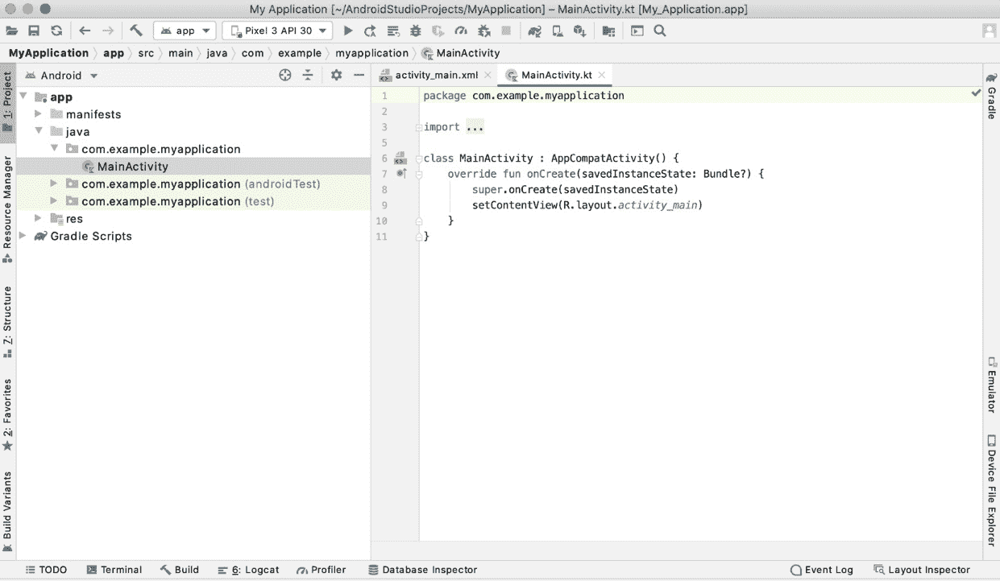
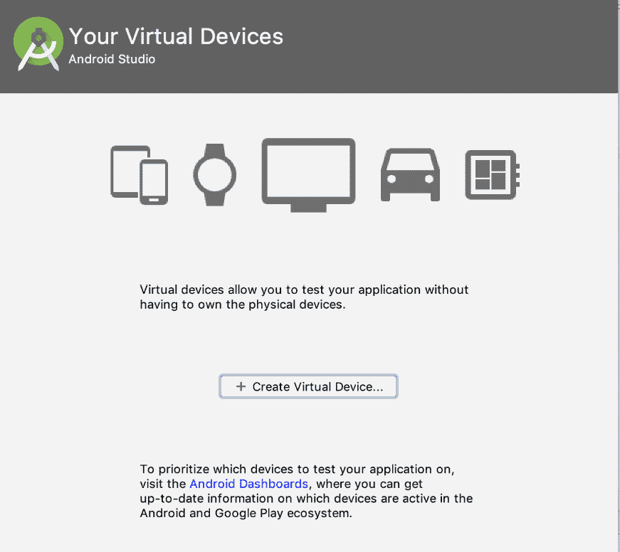
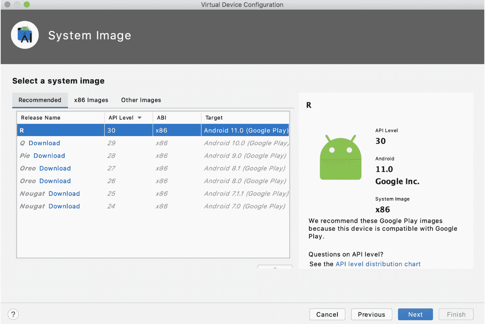
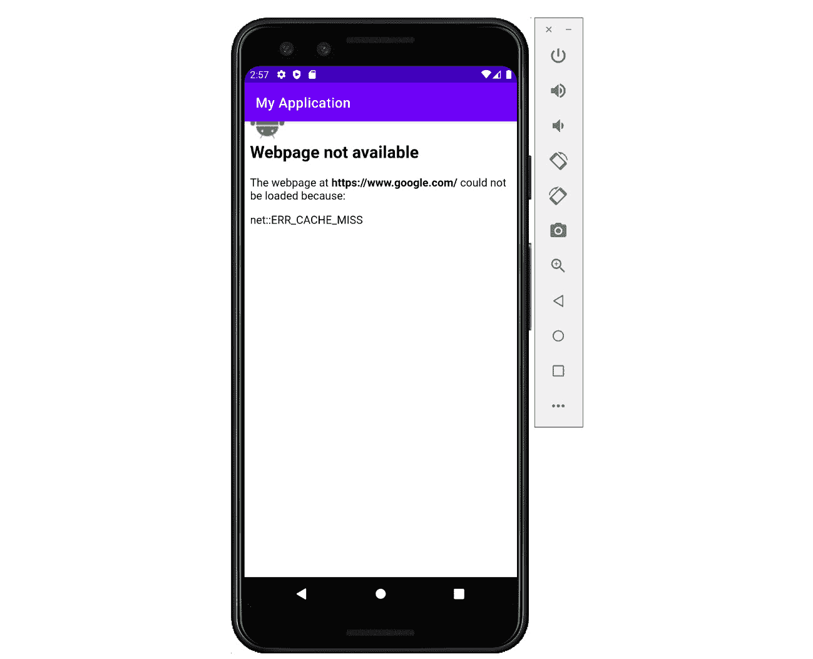
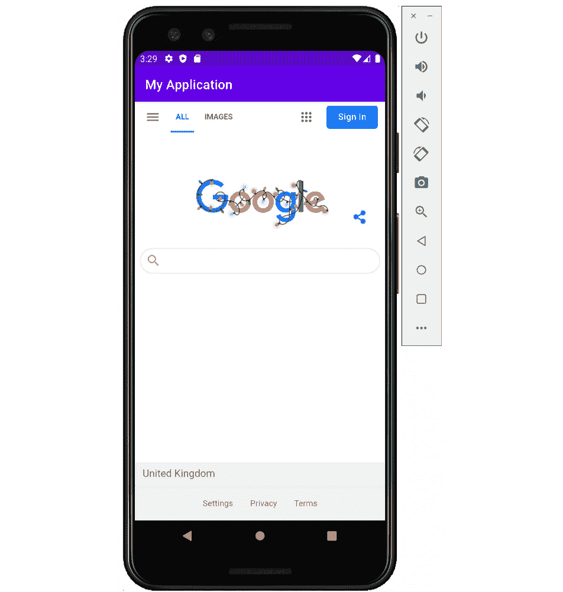
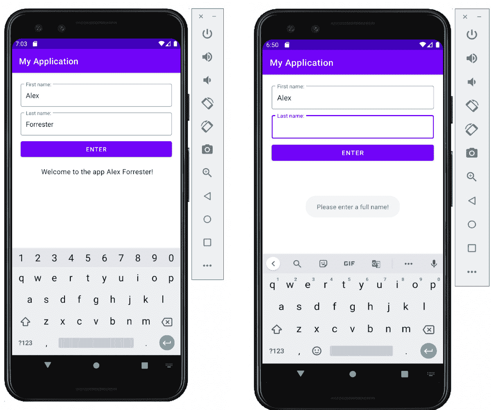

# 第一章：创建您的第一个应用

概述

本章是 Android 的介绍，您将设置您的环境并专注于 Android 开发的基础知识。通过本章的学习，您将获得创建 Android 应用程序所需的知识，并将其安装在虚拟或物理 Android 设备上。您将能够分析和理解`AndroidManifest.xml`文件的重要性，并使用 Gradle 构建工具来配置您的应用程序，并从 Material Design 实现 UI 元素。

# 介绍

Android 是世界上使用最广泛的手机操作系统，全球市场份额超过 70%（参见[`gs.statcounter.com/os-market-share/mobile/worldwide`](https://gs.statcounter.com/os-market-share/mobile/worldwide)）。这为学习 Android 和构建具有全球影响力的应用提供了巨大的机会。对于新手 Android 开发者来说，有许多问题需要解决才能开始学习和提高生产力。本书将解决这些问题。在学习工具和开发环境之后，您将探索构建 Android 应用的基本实践。我们将涵盖开发者面临的各种现实世界开发挑战，并探索克服这些挑战的各种技术。

在本章中，您将学习如何创建一个基本的 Android 项目并为其添加功能。您将介绍 Android Studio 的全面开发环境，并了解软件的核心领域，以使您能够高效地工作。Android Studio 提供了应用程序开发的所有工具，但不提供知识。本章将指导您有效地使用软件来构建应用程序，并配置 Android 项目的最常见区域。

让我们开始创建一个 Android 项目。

# 使用 Android Studio 创建 Android 项目

要在构建 Android 应用方面提高生产力，熟练使用**Android Studio**至关重要。这是 Android 开发的官方**集成开发环境**（**IDE**），建立在 JetBrains 的**IntelliJ IDEA IDE**上，由 Google 的 Android Studio 团队开发。您将在本课程中使用它来创建应用程序，并逐步添加更多高级功能。

Android Studio 的开发遵循了 IntelliJ IDEA IDE 的发展。当然，IDE 的基本功能都存在，使您能够通过建议、快捷方式和标准重构来优化您的代码。在本课程中，您将使用 Kotlin 来创建 Android 应用程序。自 2017 年 Google I/O（Google 的年度开发者大会）以来，这一直是 Google 首选的 Android 应用程序开发语言。Android Studio 与其他 Android 开发环境的真正区别在于**Kotlin**是由 JetBrains 创建的，这是 Android Studio 构建在其上的 IntelliJ IDEA 软件的公司。因此，您可以受益于 Kotlin 的成熟和不断发展的一流支持。 

Kotlin 是为了解决 Java 的一些缺点而创建的，包括冗长、处理空类型和添加更多的函数式编程技术等问题。自 2017 年以来，Kotlin 一直是 Android 开发的首选语言，取代了 Java，您将在本书中使用它。

熟悉并熟悉 Android Studio 将使您有信心在 Android 应用上工作和构建。所以，让我们开始创建您的第一个项目。

注意

Android Studio 的安装和设置在*前言*中有介绍。请确保在继续之前已完成这些步骤。

## 练习 1.01：为您的应用创建 Android Studio 项目

这是创建应用程序结构的起点。模板驱动的方法将使您能够在短时间内创建一个基本项目，同时设置您可以用来开发应用程序的构建块。要完成此练习，请执行以下步骤：

注意

您将使用的 Android Studio 版本为*v4.1.1*（或更高）。

1.  打开 Android Studio 后，您将看到一个窗口，询问您是要创建新项目还是打开现有项目。选择`创建新项目`。

启动窗口将如下所示：


图 1.1：Android Studio 版本 4.1.1

1.  现在，您将进入一个简单的向导驱动流程，大大简化了您的第一个 Android 项目的创建。您将看到的下一个屏幕上有大量选项，用于您希望应用程序具有的初始设置：

图 1.2：为您的应用程序启动项目模板

1.  欢迎来到您对`Activity`的第一次介绍。在 Android 中，`Activity`是一个页面或屏幕。您可以从前面的屏幕上选择的选项中以不同的方式创建此初始屏幕。描述描述了应用程序的第一个屏幕将如何显示。这些是用于构建应用程序的模板。从模板中选择`空白 Activity`，然后单击下一步。

项目配置屏幕如下：


图 1.3：项目配置

1.  前面的屏幕配置了您的应用程序。让我们逐个浏览所有选项：

`名称`：与您的 Android 项目名称类似，当应用程序安装在手机上并在 Google Play 上可见时，此名称将显示为应用程序的默认名称。您可以用自己的名称替换`名称`字段，或者现在设置为您将要创建的应用程序。

`包名称`：这使用标准的反向域名模式来创建名称。它将用作应用程序中源代码和资产的地址标识符。最好使此名称尽可能清晰、描述性，并与您的应用程序的目的密切相关。因此，最好更改此名称以使用一个或多个子域（例如`com.sample.shop.myshop`）。如*图 1.3*所示，将应用程序的`名称`（小写并去除空格）附加到域名后面。

`保存位置`：这是您的计算机上的本地文件夹，应用程序最初将存储在其中。将来可以更改此位置，因此您可以保留默认设置或将其编辑为其他内容（例如`Users/MyUser/android/projects`）。默认位置将根据您使用的操作系统而变化。

`语言 - Kotlin`：这是 Google 推荐的用于 Android 应用程序开发的语言。

`最低 SDK`：取决于您下载的 Android Studio 版本，其默认值可能与*图 1.3*中显示的相同，也可能不同。保持不变。大多数 Android 的新功能都是向后兼容的，因此您的应用程序将在绝大多数旧设备上运行良好。但是，如果您想要针对新设备进行开发，您应该考虑提高最低 API 级别。有一个名为`帮助我选择`的链接，指向一个对话框，解释了您可以访问的功能集，以便在不同版本的 Android 上进行开发，以及全球各地运行每个 Android 版本的设备的当前百分比。

（复选框）使用传统的 android.support 库。不要选中此复选框。您将使用 AndroidX 库，这是支持库的替代品，旨在使新版本 Android 上的功能向后兼容旧版本，但它提供的远不止于此。它还包含称为 Jetpack 的新 Android 组件，正如其名称所示，它可以“增强”您的 Android 开发，并提供一系列丰富的功能，您将希望在应用程序中使用，从而简化常见操作。

一旦您填写了所有这些细节，选择`完成`。您的项目将被构建，然后您将看到以下屏幕或类似的屏幕：您可以立即在一个选项卡中看到已创建的活动（`MainActivity`），在另一个选项卡中看到用于屏幕的布局（`activity_main.xml`）。应用程序结构文件夹在左侧面板中。



图 1.4：Android Studio 默认项目

在这个练习中，您已经完成了使用 Android Studio 创建您的第一个 Android 应用程序的步骤。这是一个模板驱动的方法，向您展示了您需要为应用程序配置的核心选项。

在下一节中，您将设置一个虚拟设备，并首次看到您的应用程序运行。

# 设置虚拟设备并运行您的应用

作为安装 Android Studio 的一部分，您下载并安装了最新的 Android SDK 组件。其中包括一个基本的模拟器，您将配置它来创建一个虚拟设备来运行 Android 应用程序。好处是您可以在开发应用程序时在桌面上进行更改并快速查看它们。虽然虚拟设备没有真实设备的所有功能，但反馈周期通常比连接真实设备的步骤更快。

另外，虽然您应该确保您的应用在不同设备上正常运行，但如果这是项目的要求，您可以通过下载模拟器皮肤来针对特定设备进行标准化，即使您没有真实设备也可以做到这一点。

您在安装 Android Studio 时看到的屏幕（或类似的内容）如下：


图 1.5：SDK 组件

让我们来看看已安装的 SDK 组件以及虚拟设备的作用：

+   **Android 模拟器**：这是基本模拟器，我们将配置它来创建不同 Android 品牌和型号的虚拟设备。

+   **Android SDK 构建工具**：Android Studio 使用构建工具来构建您的应用程序。这个过程涉及编译、链接和打包您的应用程序，以便为设备安装做好准备。

+   在创建项目向导中选择了`Jelly Bean`来配置项目的最低 API 级别。从 Android 10 开始，版本将不再有与版本名称不同的代码名称。（Build-Tools 和 Platform 的版本将随着新版本的发布而改变）

+   **Android SDK 平台工具**：这些工具通常是您可以从命令行中使用的工具，用于与您的应用程序进行交互和调试。

+   **Android SDK 工具**：与平台工具相比，这些工具主要是您在 Android Studio 中使用的工具，用于完成某些任务，例如运行应用程序的虚拟设备和 SDK 管理器以下载和安装 SDK 的平台和其他组件。

+   **Intel x86 模拟器加速器（HAXM 安装程序）**：如果您的操作系统提供了它，这是您的计算机硬件级别的功能，您将被提示启用，这样您的模拟器可以运行得更快。

+   **SDK 补丁应用程序 v4**：随着新版本的 Android Studio 的推出，这使得可以应用补丁来更新您正在运行的版本。

有了这些知识，让我们开始本章的下一个练习。

## 练习 1.02：设置虚拟设备并在其上运行您的应用

我们在*练习 1.01*中设置了一个 Android Studio 项目来创建我们的应用程序，现在我们将在虚拟设备上运行它。您也可以在真实设备上运行您的应用程序，但在本练习中，您将使用虚拟设备。在开发应用程序时，这个过程是一个持续的循环。一旦您实现了一个功能，您可以根据需要验证其外观和行为。在本练习中，您将创建一个虚拟设备，但您应该确保在多个设备上运行您的应用程序，以验证其外观和行为是否一致。执行以下步骤：

1.  在 Android Studio 的顶部工具栏中，您将看到两个并排的下拉框，预先选择了`app`和`无设备`：

图 1.6：Android Studio 工具栏

`app`是我们将要运行的应用程序的配置。由于我们还没有设置虚拟设备，因此显示为`无设备`。

1.  要创建虚拟设备，请点击`AVD Manager`（`工具`菜单：

图 1.7：工具菜单中的 AVD 管理器

1.  点击按钮或工具栏选项以打开`您的虚拟设备`窗口：

图 1.8：您的虚拟设备窗口

1.  点击`创建虚拟设备...`按钮，如*图 1.8*所示：

图 1.9：设备定义创建

1.  我们将选择`Pixel 3`设备。由 Google 开发的真实（非虚拟设备）Pixel 系列设备可以访问最新版本的 Android 平台。选择后，点击`下一步`按钮：

图 1.10：系统镜像

这里显示的`R`名称是 Android 11 的初始代码/发布名称。选择最新的系统镜像。`目标`列可能还会显示名称中的`(Google Play)`或`(Google APIs)`。Google APIs 表示系统镜像预装了 Google Play 服务。这是一组丰富的 Google API 和 Google 应用程序功能，您的应用程序可以使用和交互。首次运行应用程序时，您将看到诸如地图和 Chrome 之类的应用程序，而不是普通的模拟器图像。Google Play 系统镜像意味着除了 Google API 之外，还将安装 Google Play 应用程序。

1.  您应该使用最新版本的 Android 平台开发您的应用程序，以从最新功能中受益。首次创建虚拟设备时，您将需要下载系统镜像。如果`发布名称`旁边显示`下载`链接，请点击它并等待下载完成。选择`下一步`按钮以查看您设置的虚拟设备：

图 1.11：虚拟设备配置

然后您将看到最终的配置屏幕。

1.  点击`完成`，您的虚拟设备将被创建。然后您将看到您的设备被突出显示：

图 1.12：虚拟设备列表

1.  按下`操作`列下的右箭头按钮来启动虚拟设备：

图 1.13：虚拟设备已启动

现在，您已经创建了虚拟设备并且正在运行，您可以回到 Android Studio 运行您的应用程序。

1.  您设置并启动的虚拟设备将被选中。按下绿色三角形/播放按钮启动您的应用程序：


图 1.14：应用程序启动配置


图 1.15：在虚拟设备上运行的应用程序

在这个练习中，您已经完成了创建虚拟设备并在其上运行您创建的应用程序的步骤。您用于执行此操作的 Android 虚拟设备管理器使您能够为您的应用程序定位目标设备（或设备范围）。在虚拟设备上运行您的应用程序可以快速验证新功能开发的行为方式以及它是否显示您期望的方式。

接下来，您将探索项目的`AndroidManifest.xml`文件，其中包含应用程序的信息和配置。

# Android 清单

您刚刚创建的应用程序虽然简单，但包含了您在创建的所有项目中将使用的核心构建模块。该应用程序是从`AndroidManifest.xml`文件驱动的，这是一个详细描述您的应用程序内容的清单文件。它包含了所有组件，如活动、内容提供程序、服务、接收器以及应用程序实现其功能所需的权限列表。例如，应用程序需要相机权限来在应用程序中拍摄照片。您可以在项目视图下找到它，路径为`MyApplication` | `app` | `src` | `main`。或者，如果您正在查看 Android 视图，则它位于`app` | `manifests` | `AndroidManifest.xml`：

```kt
<?xml version="1.0" encoding="utf-8"?>
<manifest xmlns:android="http://schemas.android.com/apk/res/android"
    package="com.example.myapplication">
    <!--Permissions like camera go here-->
    <application
        android:allowBackup="true"
        android:icon="@mipmap/ic_launcher"
        android:label="@string/app_name"
        android:roundIcon="@mipmap/ic_launcher_round"
        android:supportsRtl="true"
        android:theme="@style/Theme.MyApplication">
        <activity android:name=".MainActivity"           android:screenOrientation="portrait">
            <intent-filter>
              <action android:name="android.intent.action.MAIN" />

             <category android:name="android.intent.category.LAUNCHER" />
            </intent-filter>
        </activity>
    </application>
</manifest>
```

一般来说，典型的清单文件是一个描述所包含的文件或其他数据以及形成组或单元的相关元数据的顶层文件。Android 清单将这个概念应用到您的 Android 应用程序中，作为一个 XML 文件。指定的应用程序的区别特征是在清单 XML 根部定义的包：

```kt
package="com.example.myapplication"
```

每个 Android 应用程序都有一个应用程序类，允许您配置应用程序。默认情况下，在 Android Studio 的 4.1.1 版本中，应用程序元素中创建了以下 XML 属性和值：

+   `android:allowBackup="true"`：这将在重新安装或切换设备时备份目标并在 Android 6.0（API 级别 23）或更高版本上运行的应用程序的用户数据。

+   `android:icon="@mipmap/ic_launcher"`：Android 使用的资源在 XML 中以`@`符号开头引用，mipmap 指的是存储启动器图标的文件夹。

+   `android:label="@string/app_name"`：这是您创建应用程序时指定的名称。它目前显示在应用程序的工具栏中，并将显示为用户设备上启动器中应用程序的名称。它由`@`符号后跟着您创建应用程序时指定的名称的字符串引用引用。

+   `android:roundIcon="@mipmap/ic_launcher_round"`：根据用户所使用的设备，启动器图标可能是方形的或圆形的。当用户的设备在启动器中显示圆形图标时，将使用`roundIcon`。

+   `android:supportsRtl="true"`：这指定了应用程序及其布局文件是否支持从右到左的语言布局。

+   `android:theme="@style/Theme.MyApplication"`：这指定了您的应用程序的主题，包括文本样式、颜色和应用程序内的其他样式。

在`<application>`元素打开后，您可以定义应用程序包含的组件。由于我们刚刚创建了我们的应用程序，它只包含以下代码中显示的第一个屏幕：

```kt
<activity android:name=".MainActivity"> 
```

接下来指定的子 XML 节点如下：

```kt
<intent-filter> 
```

Android 使用意图作为与应用程序和系统组件交互的机制。意图被发送，而意图过滤器注册了您的应用程序对这些意图做出反应的能力。`<android.intent.action.MAIN>`是您的应用程序的主要入口点，它在`.MainActivity`的封闭 XML 中出现，指定了当应用程序启动时将启动该屏幕。`android.intent.category.LAUNCHER`表示您的应用程序将出现在用户设备的启动器中。

由于您是从模板创建应用程序，它具有一个基本的清单，将通过`Activity`组件启动应用程序并在启动时显示初始屏幕。根据您想要为应用程序添加哪些其他功能，您可能需要在 Android 清单文件中添加权限。

权限分为三种不同的类别：普通、签名和危险。

+   **普通**权限包括访问网络状态、Wi-Fi、互联网和蓝牙。通常情况下，这些权限在运行时可以不经用户同意而被允许。

+   **签名**权限是由同一组应用程序共享的权限，必须使用相同的证书进行签名。这意味着这些应用程序可以自由共享数据，但其他应用程序无法访问。

+   **危险**权限围绕用户及其隐私展开，例如发送短信、访问帐户和位置，以及读写文件系统和联系人。

这些权限必须在清单中列出，并且从 Android Marshmallow API 23（Android 6 Marshmallow）开始，对于危险权限，您还必须在运行时要求用户授予权限。

在下一个练习中，我们将配置 Android 清单文件。

## 练习 1.03：配置 Android 清单互联网权限

大多数应用程序需要的关键权限是访问互联网。这不是默认添加的。在这个练习中，我们将修复这个问题，并在此过程中加载一个`WebView`，这使得应用程序可以显示网页。这种用例在 Android 应用程序开发中非常常见，因为大多数商业应用程序都会显示隐私政策、条款和条件等。由于这些文件可能对所有平台都是通用的，通常显示它们的方式是加载一个网页。执行以下步骤：

1.  像在*练习 1.01*中一样创建一个新的 Android Studio 项目，为您的应用程序创建一个 Android Studio 项目。

1.  切换到`MainActivity`类的标签。从主项目窗口，它位于`MyApplication` | `app` | `src` | `main` | `java` | `com` | `example` | `myapplication`。这遵循您创建应用程序时定义的包结构。或者，如果您正在项目窗口中查看 Android 视图，则它位于`app` | `java` | `com` | `example` | `myapplication`。

您可以通过选择`View | Tool Windows | Project`来打开`Tool`窗口，从而更改`Project`窗口显示的内容 - 这将选择`Project`视图。`Project`窗口顶部的下拉选项允许您更改查看项目的方式，最常用的显示方式是`Project`和`Android`。


```kt
package com.example.myapplication
import androidx.appcompat.app.AppCompatActivity
import android.os.Bundle
class MainActivity : AppCompatActivity() {
    override fun onCreate(savedInstanceState: Bundle?) {
        super.onCreate(savedInstanceState)
        setContentView(R.layout.Activity_main)
    }
}
```

您将在本章的下一部分更详细地检查此文件的内容，但现在，您只需要知道`setContentView(R.layout.Activity_main)`语句设置了您在虚拟设备上首次运行应用程序时看到的 UI 布局。

1.  使用以下代码更改为以下内容：

```kt
package com.example.myapplication
import androidx.appcompat.app.AppCompatActivity
import android.os.Bundle
import android.webkit.WebView
class MainActivity : AppCompatActivity() {
    override fun onCreate(savedInstanceState: Bundle?) {
        super.onCreate(savedInstanceState)
        val webView = WebView(this)
        webView.settings.javaScriptEnabled = true
        setContentView(webView)
        webView.loadUrl("https://www.google.com")
    }
}
```

因此，您正在用`WebView`替换布局文件。`val`关键字是只读属性引用，一旦设置就无法更改。WebView 需要启用 JavaScript 才能执行 JavaScript。

注意

我们没有设置类型，但 Kotlin 具有类型推断，因此如果可能的话，它会推断出类型。因此，不需要使用`val webView: WebView = WebView(this)`显式指定类型。根据您过去使用的编程语言，定义参数名称和类型的顺序可能会很熟悉，也可能不会。Kotlin 遵循 Pascal 符号，即名称后跟类型。

1.  现在，运行应用程序，文本将显示如下所示的屏幕截图：

图 1.17 无互联网权限错误消息

1.  这个错误是因为在您的`AndroidManifest.xml`文件中没有添加`INTERNET`权限。 (如果您收到错误`net::ERR_CLEARTEXT_NOT_PERMITTED`，这是因为您加载到`WebView`中的 URL 不是 HTTPS，而从 API 级别 28、Android 9.0 Pie 及以上版本开始，非 HTTPS 流量被禁用。) 让我们通过向清单添加 Internet 权限来解决这个问题。打开 Android 清单，并在`<application>`标签上方添加以下内容：

```kt
<uses-permission android:name="android.permission.INTERNET" />
```

您的清单文件现在应该如下所示：

```kt
<?xml version="1.0" encoding="utf-8"?>
<manifest xmlns:android="http://schemas.android.com/apk/res/android"
    package="com.example.myapplication">
    <uses-permission android:name="android.permission.INTERNET" />
    <application
        android:allowBackup="true"
        android:icon="@mipmap/ic_launcher"
        android:label="@string/app_name"
        android:roundIcon="@mipmap/ic_launcher_round"
        android:supportsRtl="true"
        android:theme="@style/AppTheme">
        <activity android:name=".MainActivity">
            <intent-filter>
                <action android:name="android.intent.action.MAIN" />
                <category android:name=                  "android.intent.category.LAUNCHER" />
            </intent-filter>
        </activity>
    </application>
</manifest>
```

在再次运行应用程序之前，从虚拟设备中卸载应用程序。有时需要这样做，因为应用程序权限有时会被缓存。长按应用图标，选择出现的`App Info`选项，然后按下带有`Uninstall`文本的垃圾桶图标。或者，长按应用图标，然后将其拖动到屏幕右上角带有`Uninstall`文本的垃圾桶图标旁边。

1.  再次安装应用程序，看到网页出现在`WebView`中：



图 1.18 应用程序显示 WebView

在这个例子中，您学会了如何向清单中添加权限。Android 清单可以被视为您的应用程序的目录。它列出了应用程序使用的所有组件和权限。正如您从启动器启动应用程序所看到的那样，它还提供了进入应用程序的入口点。

在下一节中，您将探索 Android 构建系统，该系统使用 Gradle 构建工具来使您的应用程序正常运行。

# 使用 Gradle 构建、配置和管理应用程序依赖项

在创建此项目的过程中，您主要使用了 Android 平台 SDK。安装 Android Studio 时，必要的 Android 库已经下载。然而，这些并不是创建您的应用程序所使用的唯一库。为了配置和构建您的 Android 项目或应用程序，使用了一个名为 Gradle 的构建工具。Gradle 是 Android Studio 用来构建您的应用程序的多用途构建工具。在 Android Studio 中，默认情况下使用 Groovy，这是一种动态类型的 JVM 语言，用于配置构建过程，并允许轻松管理依赖项，以便向项目添加库并指定版本。Android Studio 也可以配置为使用 Kotlin 来配置构建，但是由于默认语言是 Groovy，您将使用这种语言。存储此构建和配置信息的文件名为`build.gradle`。当您首次创建应用程序时，会有两个`build.gradle`文件，一个位于项目的根/顶级目录，另一个位于应用程序`module`文件夹中。

## 项目级`build.gradle`文件

现在让我们来看一下项目级`build.gradle`文件。这是您添加到所有子项目/模块的通用配置选项的地方，如下所示：

```kt
buildscript {
    ext.kotlin_version = "1.4.21"
    repositories {
        google()
        jcenter()
    }
    dependencies {
        classpath "com.android.tools.build:gradle:4.4.1"
        classpath "org.jetbrains.kotlin:kotlin-gradle-plugin:          $kotlin_version"
        // NOTE: Do not place your application dependencies here; 
        //they belong in the individual module build.gradle files
    }
}
allprojects {
    repositories {
        google()
        jcenter()
    }
}
task clean(type: Delete) {
    delete rootProject.buildDir
}
```

`buildscript`块包含了实际创建项目的构建和配置信息，而`allprojects`块指定了所有应用程序模块的配置。Groovy 工作在一个插件系统上，因此您可以编写自己的插件来执行任务或一系列任务，并将其插入到构建流水线中。这里指定的两个插件是 Android 工具插件，它连接到`gradle`构建工具包，并提供了特定于 Android 的设置和配置来构建您的 Android 应用程序，以及 Kotlin `gradle`插件，它负责在项目中编译 Kotlin 代码。依赖项本身遵循 Maven 的`groupId`、`artifactId`和`versionId`，用"`:`"冒号分隔。因此，上面的 Android 工具插件依赖项如下所示：

`'com.android.tools.build:gradle:4.4.1'`

`groupId` 是 `com.android.tools.build`，`artifactId` 是 `gradle`，`versionId` 是 `4.4.1`。这样，构建系统通过使用`repositories`块中引用的仓库来定位和下载这些依赖项。

库的具体版本可以直接指定（就像 Android `tools`插件中所做的那样）在依赖项中，或者作为变量添加。变量上的`ext.`前缀表示它是 Groovy 扩展属性，也可以在应用程序`build.gradle`文件中使用。

注意

在前面的代码部分和本章节以及其他章节的后续部分中指定的依赖版本可能会发生变化，并且随着时间的推移会进行更新，因此在创建这些项目时可能会更高。

## 应用级别的 build.gradle

`build.gradle`应用程序是特定于您的项目配置的：

```kt
plugins {
    id 'com.android.application'
    id 'kotlin-android'
}
android {
    compileSdkVersion 30
    buildToolsVersion "30.0.3"
    defaultConfig {
        applicationId "com.example.myapplication"
        minSdkVersion 16
        targetSdkVersion 30
        versionCode 1
        versionName "1.0"
        testInstrumentationRunner           "androidx.test.runner.AndroidJUnitRunner"
        buildTypes {
            release {
                minifyEnabled false
                proguardFiles getDefaultProguardFile(                  'proguard-android-optimize.txt'), 'proguard-rules.pro'
            }
        }
        compileOptions {
            sourceCompatibility JavaVersion.VERSION_1_8
            targetCompatibility JavaVersion.VERSION_1_8
        }
        kotlinOptions {
            jvmTarget = '1.8'
        }
    }
    dependencies {
        implementation "org.jetbrains.kotlin:kotlin-stdlib:          $kotlin_version"
        implementation 'androidx.core:core-ktx:1.3.2'
        implementation 'androidx.appcompat:appcompat:1.2.0'
        implementation 'com.google.android.material:material:1.2.1'
        implementation 'androidx.constraintlayout:constraintlayout:2.0.4'
        testImplementation 'junit:junit:4.+'
        androidTestImplementation 'androidx.test.ext:junit:1.1.2'
        androidTestImplementation 'androidx.test.espresso           :espresso-core:3.3.0'
    }
}
```

在前面的解释中详细介绍的 Android 和 Kotlin 插件通过`plugins`行中的 id 应用于您的项目。

`com.android.application`插件提供的`android`块是您配置 Android 特定配置设置的地方：

+   `compileSdkVersion`：用于定义应用程序已编译的 API 级别，应用程序可以使用此 API 及更低版本的功能。

+   `buildToolsVersion`：构建应用程序所需的构建工具的版本。（默认情况下，`buildToolsVersion`行将被添加到您的项目中，但是为了始终使用最新版本的构建工具，您可以将其删除）。

+   `defaultConfig`：这是您的应用程序的基本配置。

+   `applicationId`：这是设置为您的应用程序包的标识符，并且是在 Google Play 上用于唯一标识您的应用程序的应用程序标识符。如果需要，可以更改为与包名称不同。

+   `minSdkVersion`：您的应用程序支持的最低 API 级别。这将使您的应用程序在低于此级别的设备上不会在 Google Play 中显示。

+   `targetSdkVersion`：您正在针对的 API 级别。这是您构建的应用程序预期使用并已经测试的 API 级别。

+   `versionCode`：指定您的应用程序的版本代码。每次需要对应用程序进行更新时，版本代码都需要增加 1 或更多。

+   `versionName`：一个用户友好的版本名称，通常遵循 X.Y.Z 的语义版本，其中 X 是主要版本，Y 是次要版本，Z 是补丁版本，例如，1.0.3。

+   `testInstrumentationRunner`：用于 UI 测试的测试运行器。

+   `buildTypes`：在`buildTypes`下，添加了一个`release`，用于配置您的应用程序创建一个`release`构建。如果`minifyEnabled`值设置为`true`，将通过删除任何未使用的代码来缩小应用程序的大小，并对应用程序进行混淆。这个混淆步骤会将源代码引用的名称更改为诸如`a.b.c()`的值。这使得您的代码不太容易被逆向工程，并进一步减小了构建应用程序的大小。

+   `compileOptions`：java 源代码的语言级别（`sourceCompatibility`）和字节码（`targetCompatibility`）

+   `kotlinOptions`：`kotlin gradle`插件应该使用的`jvm`库

`dependencies`块指定了您的应用程序在 Android 平台 SDK 之上使用的库，如下所示：

```kt
    dependencies {
//The version of Kotlin your app is being built with
        implementation "org.jetbrains.kotlin:kotlin-stdlib-jdk7:          $kotlin_version"
//Kotlin extensions, jetpack 
//component with Android Kotlin language features
implementation 'androidx.core:core-ktx:1.3.2'
//Provides backwards compatible support libraries and jetpack components
        implementation 'androidx.appcompat:appcompat:1.2.0'
//Material design components to theme and style your app
        implementation 'com.google.android.material:material:1.2.1'
//The ConstraintLayout ViewGroup updated separately 
//from main Android sources
        implementation 'androidx.constraintlayout:constraintlayout:2.0.4'
//Standard Test library for unit tests. 
//The '+' is a gradle dynamic version which allows downloading the 
//latest version. As this can lead to unpredictable builds if changes 
//are introduced all projects will use fixed version '4.13.1'
        testImplementation 'junit:junit:4.+'
//UI Test runner
        androidTestImplementation 'androidx.test:runner:1.1.2'
//Library for creating Android UI tests
        androidTestImplementation           'androidx.test.espresso:espresso-core:3.3.0'
    }
```

使用`implementation`标记来添加这些库意味着它们的内部依赖不会暴露给您的应用程序，从而加快编译速度。

您将看到这里`androidx`组件被添加为依赖项，而不是在 Android 平台源中。这样可以使它们独立于 Android 版本进行更新。`androidx`是重新打包的支持库和 Jetpack 组件。为了添加或验证您的`gradle.properties`文件是否启用了`androidx`，您需要检查项目根目录下的`gradle.properties`文件，并查找`android.useAndroidX`和`android.enableJetifier`属性，并确保它们设置为`true`。

您现在可以打开`gradle.properties`文件，您会看到以下内容：

```kt
# Project-wide Gradle settings.
# IDE (e.g. Android Studio) users:
# Gradle settings configured through the IDE *will override*
# any settings specified in this file.
# For more details on how to configure your build environment visit
# http://www.gradle.org/docs/current/userguide/build_environment.html
# Specifies the JVM arguments used for the daemon process.
# The setting is particularly useful for tweaking memory settings.
org.gradle.jvmargs=-Xmx2048m -Dfile.encoding=UTF-8
# When configured, Gradle will run in incubating parallel mode.
# This option should only be used with decoupled projects. 
# More details, visit
# http://www.gradle.org/docs/current/userguide/multi_project_builds
# .html#sec
#:decoupled_projects
# org.gradle.parallel=true
# AndroidX package structure to make it clearer which packages are 
# bundled with #the Android operating system, and which are packaged 
# with your app's APK
# https://developer.android.com/topic/libraries/support-library/
# androidx-rn
android.useAndroidX=true
# Automatically convert third-party libraries to use AndroidX
android.enableJetifier=true
# Kotlin code style for this project: "official" or "obsolete":
kotlin.code.style=official
```

当你使用 Android Studio 模板创建项目时，它将这些标志设置为`true`，并将应用程序使用的相关`androidx`依赖项添加到应用程序的`build.gradle`文件的`dependencies`块中。除了前面的注释解释之外，`android.useAndroidX=true`标志表示项目正在使用`androidx`库，而不是旧的支持库，`android.enableJetifier=true`还将把第三方库中使用的旧版本支持库转换为 AndroidX 格式。`kotlin.code.style=official`将把代码风格设置为官方的 kotlin 风格，而不是默认的 Android Studio 风格。

要检查的最终 Gradle 文件是`settings.gradle`。这个文件显示了你的应用程序使用的模块。在使用 Android Studio 创建项目时，只会有一个模块`app`，但当你添加更多功能时，你可以添加新的模块，这些模块专门用于包含该功能的源代码，而不是将其打包到主`app`模块中。这些被称为特性模块，你可以用其他类型的模块来补充它们，比如被所有其他模块使用的共享模块，比如网络模块。`settings.gradle`文件将如下所示：

```kt
include ':app'
rootProject.name='My Application'
```

## 练习 1.04：探索如何使用 Material Design 主题应用程序

在这个练习中，你将学习关于谷歌的新设计语言**Material Design**，并使用它来加载一个**Material Design**主题的应用程序。**Material Design**是谷歌创建的一种设计语言，它增加了基于现实世界效果的丰富 UI 元素，比如光照、深度、阴影和动画。执行以下步骤：

1.  像在*练习 1.01*中一样创建一个新的 Android Studio 项目，*为你的应用程序创建一个 Android Studio 项目*。

1.  首先，查看`dependencies`块，并找到 material design 依赖

```kt
implementation 'com.google.android.material:material:1.2.1'
```

1.  接下来，打开位于`app` | `src` | `main` | `res` | `values` | `themes.xml`的`themes.xml`文件：

```kt
<resources xmlns:tools="http://schemas.android.com/tools">
    <!-- Base application theme. -->
    <style name="Theme.MyApplication"       parent="Theme.MaterialComponents.DayNight.DarkActionBar">
        <!-- Primary brand color. -->
        <item name="colorPrimary">@color/purple_500</item>
        <item name="colorPrimaryVariant">@color/purple_700</item>
        <item name="colorOnPrimary">@color/white</item>
        <!-- Secondary brand color. -->
        <item name="colorSecondary">@color/teal_200</item>
        <item name="colorSecondaryVariant">@color/teal_700</item>
        <item name="colorOnSecondary">@color/black</item>
        <!-- Status bar color. -->
        <item name="android:statusBarColor"           tools:targetApi="l">?attr/colorPrimaryVariant</item>
        <!-- Customize your theme here. -->    </style></resources>
```

注意`Theme.MyApplication`的父级是`Theme.MaterialComponents.DayNight.DarkActionBar`

在`dependencies`块中添加的 Material Design 依赖项被用于应用程序的主题。

1.  如果现在运行应用程序，你将看到默认的 Material 主题应用程序，如*图 1.15*所示。

在这个练习中，你已经学会了如何在屏幕上使用`TextView`，不清楚 material design 提供了什么好处，但当你开始更多地使用 Material UI 设计小部件时，这将会改变。现在你已经学会了项目是如何构建和配置的，在接下来的部分中，你将详细探索项目结构，了解它是如何创建的，并熟悉开发环境的核心领域。

# Android 应用程序结构

现在我们已经介绍了 Gradle 构建工具的工作原理，我们将探索项目的其余部分。最简单的方法是检查应用程序的文件夹结构。在 Android Studio 的左上角有一个名为`Project`的工具窗口，它允许你浏览应用程序的内容。默认情况下，在创建 Android 项目时，它是`打开`/`选中`的。当你选择它时，你会看到一个类似于*图 1.19*中截图的视图。（如果你在屏幕左侧看不到任何窗口栏，那么去顶部工具栏，选择`View` | Appearance | `Tool` `Window Bars`，确保它被选中）。浏览项目有许多不同的选项，但`Android`将被预先选择。这个视图将`app`文件夹结构整齐地分组在一起，让我们来看看它。

这里是这些文件的概述，更详细地介绍了最重要的文件。打开它时，你会看到它包括以下文件夹结构：


图 1.19：应用程序中文件和文件夹结构的概述

您指定为应用程序启动时运行的 Kotlin 文件（`MainActivity`）如下：

```kt
package com.example.myapplication
import androidx.appcompat.app.AppCompatActivity
import android.os.Bundle
class MainActivity : AppCompatActivity() {
    override fun onCreate(savedInstanceState: Bundle?) {
        super.onCreate(savedInstanceState)
        setContentView(R.layout.activity_main)
    }
}
```

`import`语句包括此活动使用的库和源。类头`class MainActivity : AppCompatActivity()`创建了一个扩展`AppCompatActivity`的类。在 Kotlin 中，`:`冒号字符用于从类派生（也称为继承）和实现接口。

`MainActivity`派生自`androidx.appcompat.app.AppCompatActivity`，这是向后兼容的活动，旨在使您的应用程序在旧设备上运行。

Android 活动具有许多回调函数，您可以在活动生命周期的不同点重写这些函数。这就是所谓的`onCreate`函数，如下所示：

```kt
override fun onCreate(savedInstanceState: Bundle?) 
```

Kotlin 中的`override`关键字指定您正在为父类中定义的函数提供特定的实现。`fun`关键字（您可能已经猜到）代表*function*。`savedInstanceState: Bundle?`参数是 Android 用于恢复先前保存状态的机制。对于这个简单的活动，您没有存储任何状态，因此这个值将是`null`。跟随类型的问号`?`声明了这种类型可以是`null`。`super.onCreate(savedInstanceState)`行调用了基类的重写方法，最后，`setContentView(R.layout.Activity_main)`加载了我们想要在活动中显示的布局；否则，它将显示为空屏幕，因为没有定义布局。

让我们看看文件夹结构中存在的一些其他文件（*图 1.19*）：

+   `ExampleInstrumentedTest`：这是一个示例 UI 测试。您可以在应用程序运行时运行 UI 测试来检查和验证应用程序的流程和结构。

+   `ExampleUnitTest`：这是一个示例单元测试。创建 Android 应用程序的一个重要部分是编写单元测试，以验证源代码是否按预期工作。

+   `ic_launcher_background.xml`/`ic_launcher_foreground.xml`：这两个文件一起以矢量格式组成应用程序的启动器图标，将由 Android API 26（Oreo）及以上版本中的启动器图标文件`ic_launcher.xml`使用。

+   `activity_main.xml`：这是 Android Studio 创建项目时创建的布局文件。它由`MainActivity`用于绘制初始屏幕内容，该内容在应用程序运行时显示：

```kt
<?xml version="1.0" encoding="utf-8"?>
<androidx.constraintlayout.widget.ConstraintLayout   xmlns:android="http://schemas.android.com/apk/res/android"
    xmlns:app="http://schemas.android.com/apk/res-auto"
    xmlns:tools="http://schemas.android.com/tools"
    android:layout_width="match_parent"
    android:layout_height="match_parent"
    tools:context=".MainActivity">
    <TextView
        android:layout_width="wrap_content"
        android:layout_height="wrap_content"
        android:text="Hello World!"
        app:layout_constraintBottom_toBottomOf="parent"
        app:layout_constraintStart_toStartOf="parent"
        app:layout_constraintEnd_toEndOf="parent"
        app:layout_constraintTop_toTopOf="parent" />
</androidx.constraintlayout.widget.ConstraintLayout>
```

为了支持应用程序的国际化和从右到左（`rtl`）布局，如果存在这些属性，您应该删除它们：

```kt
        app:layout_constraintStart_toLeftOf="parent"
        app:layout_constraintEnd_toRightOf="parent"
```

用以下内容替换它们：

```kt
        app:layout_constraintStart_toStartOf="parent"
        app:layout_constraintEnd_toEndOf="parent"
```

这样，开始和结束由应用程序语言确定，而左和右只在从左到右的语言中表示开始和结束。

Android 中的大多数屏幕显示都是使用 XML 布局创建的。文档以 XML 标头开头，后跟顶级`ViewGroup`（这里是`ConstraintLayout`），然后是一个或多个嵌套的`Views`和`ViewGroups`。

`ConstraintLayout` `ViewGroup`允许在屏幕上非常精确地定位视图，通过将视图约束到父视图和兄弟视图、指南线和障碍物。

`TextView`，当前是`ConstraintLayout`的唯一子视图，通过`android:text`属性在屏幕上显示文本。将视图水平定位到父级的开始和结束来完成视图的水平定位，因为应用了两个约束，所以视图在水平方向上居中（从左到右的语言（`ltr`）中的开始和结束是左和右，但在`non ltr`语言中是从右到左）。通过将视图约束到其父级的顶部和底部，将视图垂直定位在中心。应用所有四个约束的结果是在`ConstraintLayout`中将`TextView`水平和垂直居中。

`ConstraintLayout`标签中有三个 XML 命名空间：

+   `xmlns:android`指的是 Android 特定的命名空间，用于主要 Android SDK 中的所有属性和值。

+   `xmlns:app`命名空间用于 Android SDK 中没有的任何内容。因此，在这种情况下，`ConstraintLayout`不是主要 Android SDK 的一部分，而是作为库添加的。

+   `xmnls:tools`指的是用于向 XML 添加元数据的命名空间，用于指示布局在哪里使用（`tools:context=".MainActivity"`）。

Android XML 布局文件的两个最重要的属性是`android:layout_width`和`android:layout_height`。

这些可以设置为绝对值，通常是密度无关像素（称为`dip`或`dp`），它们将像素大小缩放到不同密度设备上大致相等。然而，更常见的是，这些属性的值设置为`wrap_content`或`match_parent`。`wrap_content`将根据其内容大小调整大小。`match_parent`将根据其父级大小调整大小。

还有其他`ViewGroups`可以用来创建布局。`LinearLayout`垂直或水平布局视图，`FrameLayout`通常用于显示单个子视图，`RelativeLayout`是`ConstraintLayout`的简化版本，它布局视图相对于父视图和兄弟视图的位置。

`ic_launcher.png`文件是`.png`启动图标，为不同密度的设备提供了图标。由于我们使用的最低版本的 Android 是 API 16：Android 4.1（果冻豆），因此这些`.png`图像被包含在内，因为直到 Android API 26（奥利奥）之前，对启动器矢量格式的支持才被引入。

`ic_launcher.xml`文件使用矢量文件（`ic_launcher_background.xml`/`ic_launcher_foreground.xml`）在 Android API 26（奥利奥）及以上版本中缩放到不同密度的设备。

注意

为了在 Android 平台上针对不同密度的设备，除了每一个`ic_launcher.png`图标外，您将看到括号中标注了它所针对的密度。由于设备的像素密度差异很大，Google 创建了密度桶，以便根据设备的每英寸点数选择正确的图像来显示。

不同密度限定符及其详细信息如下：

+   `nodpi`：密度无关资源

+   `ldpi`：120 dpi 的低密度屏幕

+   `mdpi`：160 dpi 的中密度屏幕（基线）

+   `hdpi`：240 dpi 的高密度屏幕

+   `xhdpi`：320 dpi 的超高密度屏幕

+   `xxhdpi`：480 dpi 的超高密度屏幕

+   `xxxhdpi`：640 dpi 的超超高密度屏幕

+   `tvdpi`：电视资源（约 213 dpi）

基线密度桶在中密度设备上以每英寸`160`点创建，并称为每英寸`160`点/像素，最大的显示桶是`xxxhdpi`，它有每英寸`640`点。Android 根据各个设备来确定显示的适当图像。因此，Pixel 3 模拟器的密度约为`443dpi`，因此它使用来自超超高密度桶（xxhdpi）的资源，这是最接近的匹配。Android 更倾向于缩小资源以最好地匹配密度桶，因此具有`400dpi`的设备，介于`xhdpi`和`xxhdpi`桶之间，可能会显示来自`xxhdpi`桶的`480dpi`资产。

为了为不同密度创建替代位图可绘制对象，您应该遵循六种主要密度之间的`3:4:6:8:12:16`缩放比例。例如，如果您有一个用于中密度屏幕的`48x48`像素的位图可绘制对象，则所有不同大小应该是：

+   `36x36`（`0.75x`）用于低密度（`ldpi`）

+   `48x48`（`1.0x`基线）用于中密度（`mdpi`）

+   `72x72`（`1.5x`）用于高密度（`hdpi`）

+   `96x96`（`2.0x`）用于超高密度（`xhdpi`）

+   `144x144`（`3.0x`）用于超超高密度（`xxhdpi`）

+   `192x192`（`4.0x`）用于超超超高密度（`xxxhdpi`）

要比较每个密度桶中的这些物理启动器图标，请参考以下表格：


图 1.20：主要密度桶发射器图像尺寸比较

注意

启动器图标比应用程序中的普通图像略大，因为它们将被设备的启动器使用。由于一些启动器可以放大图像，这是为了确保图像没有像素化和模糊。

现在您将查看应用程序使用的一些资源。这些资源在 XML 文件中被引用，并保持应用程序的显示和格式一致。

在`colors.xml`文件中，您以十六进制格式定义了您想在应用程序中使用的颜色。

```kt
<?xml version="1.0" encoding="utf-8"?>
<resources>
    <color name="purple_200">#FFBB86FC</color>
    <color name="purple_500">#FF6200EE</color>
    <color name="purple_700">#FF3700B3</color>
    <color name="teal_200">#FF03DAC5</color>
    <color name="teal_700">#FF018786</color>
    <color name="black">#FF000000</color>
    <color name="white">#FFFFFFFF</color>
</resources>
```

该格式基于 RGB 颜色空间，因此前两个字符是红色，接下来两个是绿色，最后两个是蓝色，其中`#00`表示没有添加任何颜色来组成复合颜色，而`#FF`表示添加了所有颜色。

如果您希望颜色具有一定的透明度，则在前面加上两个十六进制字符，从`#00`表示完全透明到`#FF`表示完全不透明。因此，要创建蓝色和 50%透明的蓝色字符，格式如下：

```kt
    <color name="colorBlue">#0000FF</color>
    <color name="colorBlue50PercentTransparent">#770000FF</color>
```

`strings.xml`文件显示应用程序中显示的所有文本：

```kt
<resources>
    <string name="app_name">My Application</string>
</resources>
```

您可以在应用程序中使用硬编码的字符串，但这会导致重复，并且意味着如果要使应用程序支持多种语言，则无法自定义文本。通过将字符串添加为资源，如果在应用程序的不同位置使用了该字符串，您还可以在一个地方更新该字符串。

您想要在整个应用程序中使用的常见样式都添加到`themes.xml`文件中。

```kt
<resources xmlns:tools="http://schemas.android.com/tools">
    <!-- Base application theme. -->
    <style name="Theme.MyApplication"       parent="Theme.MaterialComponents.DayNight.DarkActionBar">
        <!-- Primary brand color. -->
        <item name="colorPrimary">@color/purple_500</item>
        <item name="colorPrimaryVariant">@color/purple_700</item>
        <item name="colorOnPrimary">@color/white</item>
        <!-- Secondary brand color. -->
        <item name="colorSecondary">@color/teal_200</item>
        <item name="colorSecondaryVariant">@color/teal_700</item>
        <item name="colorOnSecondary">@color/black</item>
        <!-- Status bar color. -->
        <item name="android:statusBarColor"           tools:targetApi="l">?attr/colorPrimaryVariant</item>
        <!-- Customize your theme here. -->
    </style></resources>
```

可以通过在`TextView`的属性上设置`android:textStyle="bold"`来直接向视图应用样式信息。但是，如果您想要将多个`TextView`显示为粗体，您将不得不在多个地方重复这样做。当您开始向单个视图添加多个样式属性时，会出现大量重复，并且在想要对所有类似视图进行更改时可能会导致错误，并且错过更改一个视图上的样式属性。如果您定义了一个样式，您只需更改样式，它将更新所有应用了该样式的视图。在创建项目时，`AndroidManifest.xml`文件中的应用程序标签应用了顶级主题，并被称为为应用程序中包含的所有视图设置样式的主题。您在`colors.xml`文件中定义的颜色在此处使用。实际上，如果您更改了`colors.xml`文件中定义的颜色之一，它现在也会传播到应用程序的样式中。

您现在已经探索了应用程序的核心领域。您已经添加了`TextView`视图来显示标签、标题和文本块。在下一个练习中，您将介绍允许用户与您的应用程序进行交互的 UI 元素。

## 练习 1.05：向用户添加交互式 UI 元素以显示定制的问候语

本练习的目标是使用户能够添加和编辑文本，然后提交此信息以显示带有输入数据的定制问候语。您需要添加可编辑的文本视图来实现这一点。`EditText`视图通常是这样做的，可以在 XML 布局文件中添加如下：

```kt
<EditText
    android:id="@+id/full_name"
    style="@style/TextAppearance.AppCompat.Title"
    android:layout_width="wrap_content"
    android:layout_height="wrap_content"
    android:hint="@string/first_name" />
```

这使用了一个 Android 样式`TextAppearance.AppCompat.Title`来显示标题，如下所示：


图 1.21：带提示的 EditText

虽然这对于启用用户添加/编辑文本是完全可以的，但是材料`TextInputEditText`及其包装视图`TextInputLayout`为`EditText`显示提供了一些修饰。让我们使用以下代码：

```kt
    <com.google.android.material.textfield.TextInputLayout
        android:id="@+id/first_name_wrapper"
        style="@style/text_input_greeting"
        android:layout_width="match_parent"
        android:layout_height="wrap_content"
        android:hint="@string/first_name_text">
        <com.google.android.material.textfield.TextInputEditText
            android:id="@+id/first_name"
            android:layout_width="match_parent"
            android:layout_height="wrap_content" />
    </com.google.android.material.textfield.TextInputLayout>
```

输出如下：


图 1.22：带提示的 Material TextInputLayout/TextInputEditText

`TextInputLayout`允许我们为`TextInputEditText`视图创建一个标签，并在`TextInputEditText`视图聚焦时进行漂亮的动画（移动到字段的顶部），同时仍然显示标签。标签是使用`android:hint`指定的。

您将更改应用程序中的`Hello World`文本，以便用户可以输入他们的名字和姓氏，并在按下按钮时显示问候。执行以下步骤：

1.  通过将以下条目添加到`app` | `src` | `main` | `res` | `values` | `strings.xml`中，创建您的应用程序中要使用的标签和文本：

```kt
<resources>
    <string name="app_name">My Application</string>
    <string name="first_name_text">First name:</string>
    <string name="last_name_text">Last name:</string>
    <string name="enter_button_text">Enter</string>
    <string name="welcome_to_the_app">Welcome to the app</string>
    <string name="please_enter_a_name">Please enter a full name!
    </string>
</resources>
```

1.  接下来，我们将通过在`app` | `src` | `main` | `res` | `themes.xml`中添加以下样式来更新我们要在布局中使用的样式（在基本应用程序主题之后）

```kt
<resources xmlns:tools="http://schemas.android.com/tools">
    <!-- Base application theme. -->
    <style name="Theme.MyApplication"       parent="Theme.MaterialComponents.DayNight.DarkActionBar">
        <!-- Primary brand color. -->
        <item name="colorPrimary">@color/purple_500</item>
        <item name="colorPrimaryVariant">@color/purple_700</item>
        <item name="colorOnPrimary">@color/white</item>
        <!-- Secondary brand color. -->
        <item name="colorSecondary">@color/teal_200</item>
        <item name="colorSecondaryVariant">@color/teal_700</item>
        <item name="colorOnSecondary">@color/black</item>
        <!-- Status bar color. -->
        <item name="android:statusBarColor"           tools:targetApi="l">?attr/colorPrimaryVariant</item>
        <!-- Customize your theme here. -->
    </style>
    <style name="text_input_greeting"       parent="Widget.MaterialComponents.TextInputLayout.OutlinedBox">
        <item name="android:layout_margin">8dp</item>
    </style>
    <style name="button_greeting">
        <item name="android:layout_margin">8dp</item>
        <item name="android:gravity">center</item>
    </style>
    <style name="greeting_display"         parent="@style/TextAppearance.MaterialComponents.Body1">
        <item name="android:layout_margin">8dp</item>
        <item name="android:gravity">center</item>
        <item name="android:layout_height">40dp</item>
    </style>
    <style name="screen_layout_margin">
        <item name="android:layout_margin">12dp</item>
    </style>
</resources>
```

注意

一些样式的父样式引用了材料样式，因此这些样式将直接应用于视图，以及指定的样式。

1.  现在，我们已经添加了要应用于布局和文本中的视图的样式，我们可以在`app` | `src` | `main` | `res` | `layout`文件夹中的`activity_main.xml`中更新布局。下面的代码由于空间原因而被截断，但您可以使用下面的链接查看完整的源代码。

```kt
activity_main.xml
10    <com.google.android.material.textfield.TextInputLayout
11        android:id="@+id/first_name_wrapper"
12        style="@style/text_input_greeting"
13        android:layout_width="match_parent"
14        android:layout_height="wrap_content"
15        android:hint="@string/first_name_text"
16        app:layout_constraintTop_toTopOf="parent"
17        app:layout_constraintStart_toStartOf="parent">
18
19        <com.google.android.material.textfield.TextInputEditText
20            android:id="@+id/first_name"
21            android:layout_width="match_parent"
22            android:layout_height="wrap_content" />
23
24    </com.google.android.material.textfield.TextInputLayout>
25
26    <com.google.android.material.textfield.TextInputLayout
27        android:id="@+id/last_name_wrapper"
28        style="@style/text_input_greeting"
29        android:layout_width="match_parent"
30        android:layout_height="wrap_content"
31        android:hint="@string/last_name_text"
32        app:layout_constraintTop_toBottomOf="@id/first_name_wrapper"
33        app:layout_constraintStart_toStartOf="parent">
34
35        <com.google.android.material.textfield.TextInputEditText
36            android:id="@+id/last_name"
37            android:layout_width="match_parent"
38            android:layout_height="wrap_content" />
39
40    </com.google.android.material.textfield.TextInputLayout>
41
42    <com.google.android.material.button.MaterialButton
43        android:layout_width="match_parent"
44        android:layout_height="wrap_content"
45        style="@style/button_greeting"
46        android:id="@+id/enter_button"
47        android:text="@string/enter_button_text"
48        app:layout_constraintTop_toBottomOf="@id/last_name_wrapper"
49        app:layout_constraintStart_toStartOf="parent"/>
50
51    <TextView
52        android:id="@+id/greeting_display"
53        android:layout_width="match_parent"
54        style="@style/greeting_display"
55        app:layout_constraintTop_toBottomOf="@id/enter_button"
56        app:layout_constraintStart_toStartOf="parent" />
The complete code for this step can be found at http://packt.live/35T5IMN.
```

您已为所有视图添加了 ID，以便可以将它们约束到它们的兄弟视图，并且还提供了一种在活动中获取`TextInputEditText`视图的值的方法。`style="@style.."`符号应用了`themes.xml`文件中的样式。

1.  运行应用程序并查看外观和感觉。如果您选择`TextInputEditText`视图中的一个，您将看到标签被动画化并移动到视图的顶部：

图 1.23：TextInputEditText 字段的标签状态，无焦点和有焦点

1.  现在，我们必须在我们的活动中添加与视图的交互。布局本身除了允许用户在`EditText`字段中输入文本之外，不会做任何事情。在这个阶段点击按钮不会做任何事情。您将通过在按钮被按下时使用表单字段的 ID 捕获输入的文本，然后使用文本填充`TextView`消息来实现这一点。

1.  打开`MainActivity`并完成下一步，处理输入的文本并使用这些数据显示问候并处理任何表单输入错误。

1.  在`onCreate`函数中，为按钮设置一个点击监听器，这样我们就可以响应按钮点击并通过更新`MainActivity`来检索表单数据，显示如下内容：

```kt
package com.example.myapplication
import androidx.appcompat.app.AppCompatActivity
import android.os.Bundle
import android.view.Gravity
import android.widget.Button
import android.widget.TextView
import android.widget.Toast
import com.google.android.material.textfield.TextInputEditText
class MainActivity : AppCompatActivity() {
    override fun onCreate(savedInstanceState: Bundle?) {
        super.onCreate(savedInstanceState)
        setContentView(R.layout.activity_main)
        findViewById<Button>(R.id.enter_button)?.setOnClickListener {
            //Get the greeting display text
            val greetingDisplay =               findViewById<TextView>(R.id.greeting_display)
            //Get the first name TextInputEditText value
            val firstName = findViewById<TextInputEditText>              (R.id.first_name)?.text.toString().trim()
            //Get the last name TextInputEditText value
            val lastName = findViewById<TextInputEditText>              (R.id.last_name)?.text.toString().trim()
            //Check names are not empty here:
        }
    }
}
```

1.  然后，检查修剪后的名称是否为空，并使用 Kotlin 的字符串模板格式化名称：

```kt
if (firstName.isNotEmpty() && lastName.isNotEmpty()) {
    val nameToDisplay = firstName.plus(" ").plus(lastName)
    //Use Kotlin's string templates feature to display the name
    greetingDisplay?.text =
        " ${getString(R.string.welcome_to_the_app)} ${nameToDisplay}!"
}
```

1.  最后，如果表单字段没有正确填写，显示一条消息：

```kt
else {
    Toast.makeText(this, getString(R.string.please_enter_a_name),       Toast.LENGTH_LONG).
    apply{
        setGravity(Gravity.CENTER, 0, 0)
        show()
    }
}
```

指定的`Toast`是一个小型文本对话框，它在主布局上方短暂出现，以向用户显示消息，然后消失。

1.  运行应用程序并在字段中输入文本，验证当两个文本字段都填写时是否显示问候消息，并且如果两个字段都没有填写，则弹出消息显示为什么没有设置问候。您应该看到以下显示：

图 1.24：名称填写正确和错误的应用程序

完整的练习代码可以在这里查看：[`packt.live/39JyOzB`](http://packt.live/39JyOzB)

前面的练习介绍了如何通过`EditText`字段向应用程序添加交互性，用户可以填写这些字段，添加点击监听器以响应按钮事件并执行一些验证。

## 访问布局文件中的视图

在布局文件中访问视图的已建立的方法是使用`findViewById`和视图的 id 名称。因此，在 Activity 中的`setContentView(R.layout.activity_main)`设置布局后，可以通过语法`findViewById<Button>(R.id.enter_button)`检索`enter_button` `Button`。您将在本课程中使用这种技术。Google 还引入了 ViewBinding 来替代`findViewById`，它创建一个绑定类来访问视图，并具有空值和类型安全的优势。您可以在这里阅读有关此内容：[`developer.android.com/topic/libraries/view-binding`](https://developer.android.com/topic/libraries/view-binding)

## 进一步的输入验证

验证用户输入是处理用户数据的关键概念，当您没有在表单中输入必填字段时，您必须已经多次看到它的作用。在上一个练习中，当检查用户是否已经在名字和姓氏字段中输入值时，就是在验证用户输入。

还有其他验证选项可以直接在 XML 视图元素中使用。例如，假设您想要验证输入到字段中的 IP 地址。您知道 IP 地址可以是由句点/点分隔的四个数字，其中数字的最大长度为 3。因此，可以输入到字段中的字符的最大数量为 15，并且只能输入数字和句点。有两个 XML 属性可以帮助我们进行验证：

+   `android:digits="0123456789."`：通过列出所有允许的单个字符，限制可以输入到字段中的字符。

+   `android:maxLength="15"`：限制用户输入超过 IP 地址将包含的最大字符数。

因此，这是您可以在表单字段中显示的方式：

```kt
<com.google.android.material.textfield.TextInputLayout
    style="@style/Widget.MaterialComponents.TextInputLayout.OutlinedBox"
    android:layout_width="match_parent"
    android:layout_height="wrap_content">
    <com.google.android.material.textfield.TextInputEditText
        android:id="@+id/ip_address"
        android:digits="0123456789."
        android:layout_width="match_parent"
        android:layout_height="wrap_content"
        android:maxLength="15" />
</com.google.android.material.textfield.TextInputLayout>
```

此验证限制了可以输入的字符和最大长度。还需要对字符序列以及它们是否为句点/点或数字进行额外验证，如 IP 地址格式所述，但这是帮助用户输入正确字符的第一步。

在本章中获得的知识，让我们从以下活动开始。

## 活动 1.01：创建一个应用程序来生成 RGB 颜色

在这个活动中，我们将研究一个使用验证的场景。假设您被要求创建一个应用程序，显示红色、绿色和蓝色的 RGB 通道如何添加到 RGB 颜色空间中以创建颜色。每个 RGB 通道应该作为两个十六进制字符添加，其中每个字符的值可以是 0-9 或 A-F。然后将这些值组合起来，生成一个 6 个字符的十六进制字符串，该字符串将作为颜色显示在应用程序中。

这个活动的目的是生成一个具有可编辑字段的表单，用户可以为每种颜色添加两个十六进制值。填写完所有三个字段后，用户应单击一个按钮，该按钮获取三个值并将它们连接起来以创建有效的十六进制颜色字符串。然后将其转换为颜色，并显示在应用程序的 UI 中。

以下步骤将帮助您完成该活动：

1.  创建一个名为`Colors`的新项目

1.  将标题添加到布局，约束到布局的顶部。

1.  向用户添加一个简短的说明，说明如何填写表单。

1.  在“标题”下方添加三个材料`TextInputLayout`字段，包裹三个`TextInputEditText`字段。这些应该被约束，以便每个视图位于另一个视图的上方（而不是侧面）。分别将`TextInputEditText`字段命名为“红色通道”、“绿色通道”和“蓝色通道”，并对每个字段添加限制，只能输入两个字符并添加十六进制字符。

1.  添加一个按钮，该按钮获取三个颜色字段的输入。

1.  添加一个视图，用于在布局中显示生成的颜色。

1.  最后，在布局中显示由三个通道创建的 RGB 颜色。

最终输出应如下所示（颜色将根据输入而变化）：


图 1.25：显示颜色时的输出

注意

此活动的解决方案可在此处找到：[`packt.live/3sKj1cp`](http://packt.live/3sKj1cp)

本章中所有练习和活动的来源都在这里：[`packt.live/2LLY9kb`](http://packt.live/2LLY9kb)

注意

当首次将此课程的所有已完成项目从 Github 存储库加载到 Android Studio 时，*不要*使用顶部菜单中的`File` | `Open`打开项目。始终使用`File` | `New` | `Import Project`。这是为了正确构建应用程序。在初始导入后打开项目时，可以使用`File` | `Open`或`File` | `Open Recent`。

# 摘要

本章已经涵盖了很多关于 Android 开发基础的内容。您首先学习了如何使用 Android Studio 创建 Android 项目，然后在虚拟设备上创建和运行应用程序。接着，本章通过探索`AndroidManifest`文件来详细介绍了应用程序的内容和权限模型，然后介绍了 Gradle 以及添加依赖项和构建应用程序的过程。然后深入了解了 Android 应用程序的细节以及文件和文件夹结构。介绍了布局和视图，并进行了练习，以说明如何使用 Google 的 Material Design 构建用户界面。下一章将在此基础上继续学习活动生命周期、活动任务和启动模式，以及在屏幕之间持久化和共享数据，以及如何通过应用程序创建强大的用户体验。
