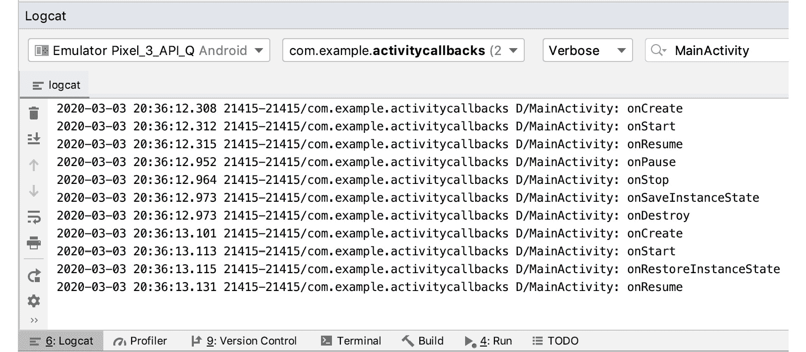
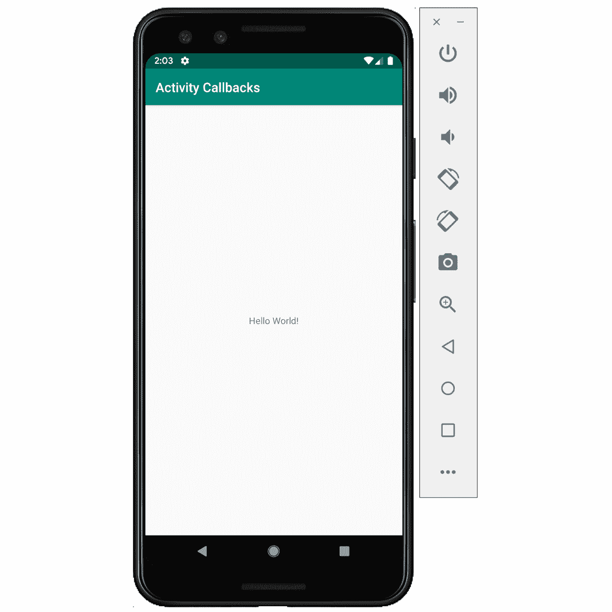
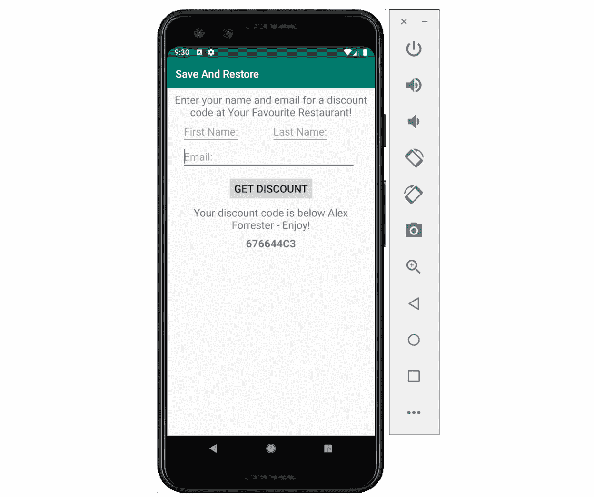
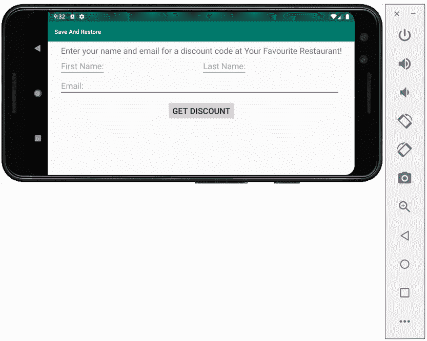
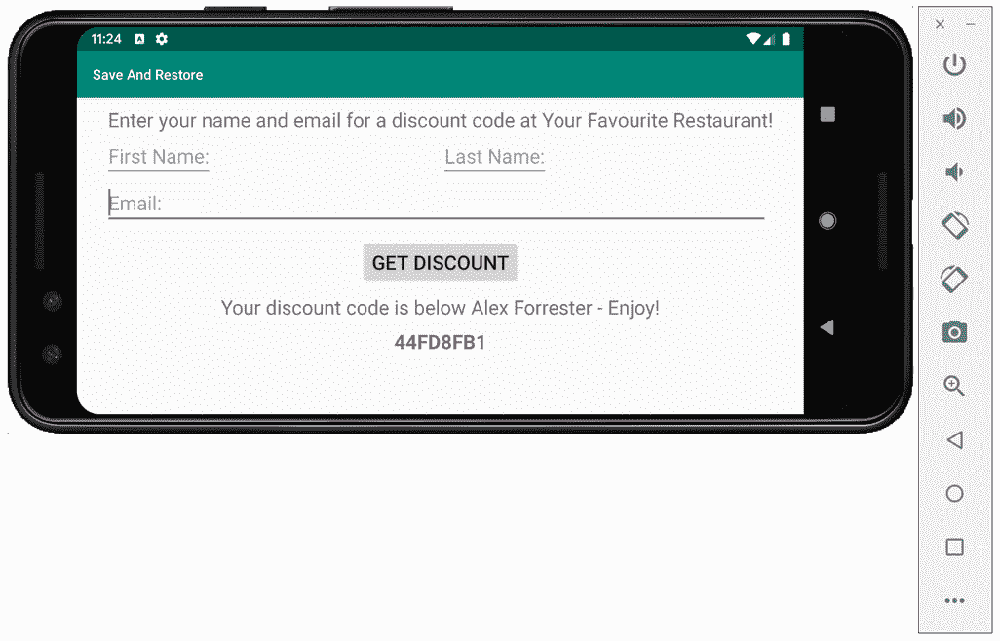
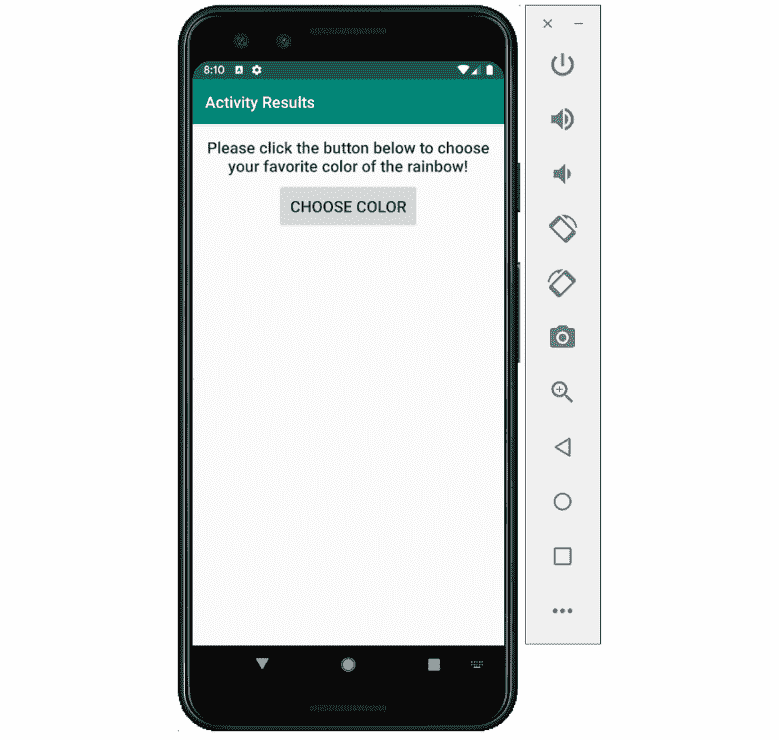
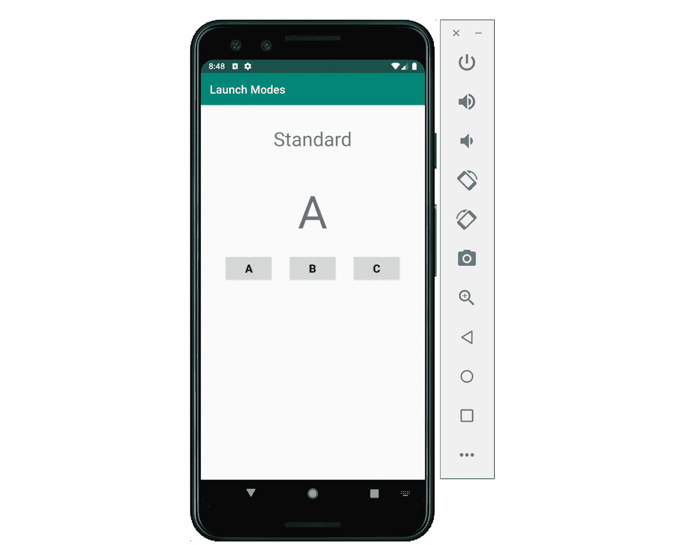
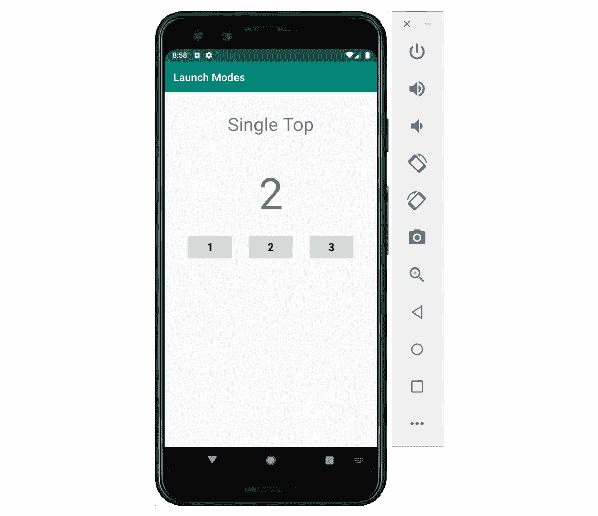

# 第二章：构建用户屏幕流程

概述

本章涵盖了 Android 活动生命周期，并解释了 Android 系统如何与您的应用程序交互。通过本章的学习，您将学会如何在不同屏幕之间构建用户旅程。您还将能够使用活动任务和启动模式，保存和恢复活动的状态，使用日志报告您的应用程序，并在屏幕之间共享数据。

# 介绍

上一章向您介绍了 Android 开发的核心元素，从使用`AndroidManifest.xml`文件配置您的应用程序，使用简单活动和 Android 资源结构，到使用`build.gradle`构建应用程序并在虚拟设备上运行应用程序。在本章中，您将进一步学习 Android 系统如何通过 Android 生命周期与您的应用程序交互，您将被通知应用程序状态的变化，以及您如何使用 Android 生命周期来响应这些变化。然后，您将学习如何在应用程序中创建用户旅程以及如何在屏幕之间共享数据。您将介绍不同的技术来实现这些目标，以便您能够在自己的应用程序中使用它们，并在其他应用程序中看到它们被使用时能够识别出来。

# 活动生命周期

在上一章中，我们使用`onCreate(saveInstanceState: Bundle?)`方法在屏幕的 UI 中显示布局。现在，我们将更详细地探讨 Android 系统如何与您的应用程序交互以实现这一点。一旦启动 Activity，它就会经历一系列步骤，使其经过初始化并准备好显示部分显示，然后完全显示。还有一些步骤对应着您的应用程序被隐藏、后台运行，然后被销毁。这个过程被称为**Activity 生命周期**。对于这些步骤中的每一个，都有一个**回调**，您的 Activity 可以使用它来执行操作，比如在您的应用程序被放入后台时创建和更改显示，并在您的应用程序恢复到前台后恢复数据。您可以将这些回调视为系统与您的 Activity/屏幕交互的钩子。

每个 Activity 都有一个父 Activity 类，它是扩展的。这些回调是在您的 Activity 的父类上进行的，由您决定是否需要在自己的 Activity 中实现它们以执行任何相应的操作。这些回调函数中的每一个都有`override`关键字。在 Kotlin 中，`override`关键字表示这个函数要么提供接口或抽象方法的实现，要么在这里的 Activity 中，它是一个子类，它提供了将覆盖其父类的实现。

现在您已经了解了**Activity 生命周期**的一般工作原理，让我们更详细地了解您将按顺序使用的主要回调，从创建 Activity 到销毁 Activity：

+   `override fun onCreate(savedInstanceState: Bundle?)`: 这是你在绘制全屏幕大小的活动中最常用的回调。在这里，你准备好你的活动布局以便显示。在此阶段，方法完成后，尽管如果你不实现任何其他回调，它仍未显示给用户，但如果你不实现任何其他回调，它看起来是这样的。你通常通过调用`setContentView`方法`setContentView(R.layout.activity_main)`来设置活动的 UI，并进行任何必要的初始化。这个方法只会在其`savedInstanceState`参数中调用一次，`Bundle?`类型（`?`表示类型可以为 null），在其最简单的形式中是一种优化保存和恢复数据的键值对映射。如果这是应用程序启动后首次运行活动，或者活动首次创建或重新创建而没有保存任何状态，它将为 null。如果在活动重新创建之前已在`onSaveInstanceState(outState: Bundle?)`回调中保存了状态，它可能包含一个保存的状态。

+   `override fun onRestart()`: 当活动重新启动时，此方法会在`onStart()`之前立即调用。重启活动和重新创建活动之间的区别很重要。当活动通过按下主页按钮置于后台时，例如，当它再次进入前台时，将调用`onRestart()`。重新创建活动是指发生配置更改，例如设备旋转时发生的情况。活动被结束然后重新创建。

+   `override fun onStart()`: 当活动首次显示时进行的回调。此外，在通过按下返回、主页或`最近应用/概览`硬件按钮将应用置于后台后，从`最近应用/概览`菜单或启动器中再次选择应用时，也会运行此函数。这是可见生命周期方法中的第一个。

+   `override fun onRestoreInstanceState(savedInstanceState: Bundle?)`: 如果状态已经使用`onSaveInstanceState(outState: Bundle?)`保存，系统会在`onStart()`之后调用此方法，你可以在这里检索`Bundle`状态，而不是在`onCreate(savedInstanceState: Bundle?)`期间恢复状态。

+   `override fun onResume()`: 这个回调函数在首次创建活动的最后阶段运行，也在应用程序被置于后台然后再次进入前台时运行。在完成这个回调后，屏幕/活动已经准备好被使用，接收用户事件，并且响应。

+   `override fun onSaveInstanceState(outState: Bundle?)`: 如果你想保存活动的状态，这个函数可以做到。你可以使用便捷函数之一添加键值对，具体取决于数据类型。如果你的活动在`onCreate(saveInstanceState: Bundle?)`和`onRestoreInstanceState(savedInstanceState: Bundle?)`中重新创建，这些数据将可用。

+   `override fun onPause()`: 当活动开始被置于后台或另一个对话框或活动进入前台时，调用此函数。

+   `override fun onStop()`: 当活动被隐藏时调用此函数，无论是因为被置于后台还是因为另一个活动在其上启动。

+   `override fun onDestroy()`: 当系统资源不足时，显式调用`finish()`方法，或者更常见的是用户从最近应用/概览按钮关闭应用时，系统会调用此函数来销毁活动。

既然你了解了这些常见的生命周期回调函数的作用，让我们实现它们，看它们何时被调用。

## 练习 2.01：记录活动回调

让我们创建一个名为*Activity Callbacks*的应用程序，其中包含一个空活动，就像您在*第一章*中所做的那样，创建您的第一个应用程序。这个练习的目的是记录活动回调以及它们发生的顺序，以进行常见操作：

1.  应用程序创建后，`MainActivity`将如下所示：

```kt
package com.example.activitycallbacks
import androidx.appcompat.app.AppCompatActivity
import android.os.Bundle
class MainActivity : AppCompatActivity() {
    override fun onCreate(savedInstanceState: Bundle?) {
        super.onCreate(savedInstanceState)
        setContentView(R.layout.activity_main)
    }
}
```

为了验证回调的顺序，让我们在每个回调的末尾添加一个日志语句。为了准备活动进行日志记录，通过在`import`语句中添加`import android.util.Log`来导入 Android 日志包。然后，在类中添加一个常量来标识您的活动。Kotlin 中的常量由`const`关键字标识，并且可以在顶层（类外）或在类内的对象中声明。如果需要公共常量，通常使用顶级常量。对于私有常量，Kotlin 提供了一种方便的方法，通过声明伴生对象来向类添加静态功能。在类的底部以下添加以下内容`onCreate(savedInstanceState: Bundle?)`：

```kt
companion object {
    private const val TAG = "MainActivity"
}
```

然后在`onCreate(savedInstanceState: Bundle?)`的末尾添加一个日志语句：

```kt
Log.d(TAG, "onCreate")
```

我们的活动现在应该有以下代码：

```kt
package com.example.activitycallbacks
import android.os.Bundle
import android.util.Log
import androidx.appcompat.app.AppCompatActivity
class MainActivity : AppCompatActivity() {
    override fun onCreate(savedInstanceState: Bundle?) {
        super.onCreate(savedInstanceState)
        setContentView(R.layout.activity_main)
        Log.d(TAG, "onCreate")
    }
    companion object {
        private const val TAG = "MainActivity"
    }
}
```

在前面的日志语句中，`d`代表*debug*。有六种不同的日志级别可以用来输出从最不重要到最重要的消息信息 - `v`代表*verbose*，`d`代表*debug*，`i`代表*info*，`w`代表*warn*，`e`代表*error*，`wtf`代表*what a terrible failure*。（最后一个日志级别突出显示了一个不应该发生的异常。）

```kt
        Log.v(TAG, "verbose message")
        Log.d(TAG, "debug message")
        Log.i(TAG, "info message")
        Log.w(TAG, "warning message")
        Log.e(TAG, "error message")
        Log.wtf(TAG, "what a terrible failure message")
```

1.  现在，让我们看看日志在 Android Studio 中是如何显示的。打开`Logcat`窗口。可以通过单击屏幕底部的`Logcat`选项卡或者从工具栏中转到`View` | `Tool Windows` | `Logcat`来访问它。

1.  在虚拟设备上运行应用程序并检查`Logcat`窗口输出。您应该看到您添加的日志语句的格式如*图 2.1*中的以下行：

图 2.1：Logcat 中的日志输出

1.  日志语句一开始可能很难解释，所以让我们将以下语句分解为其各个部分：

```kt
2020-03-03  20:36:12.308  21415-21415/com.example.activitycallbacks D/MainActivity: onCreate
```

让我们详细检查日志语句的元素：


图 2.2：解释日志语句的表

您可以通过将日志过滤器从`Debug`更改为下拉菜单中的其他选项来检查不同日志级别的输出。如果您选择`Verbose`，正如其名称所示，您将看到大量输出。

1.  日志语句的`TAG`选项之所以好用，是因为它使您能够通过输入标签的文本来过滤在 Android Studio 的`Logcat`窗口中报告的日志语句，如*图 2.3*所示：

图 2.3：通过 TAG 名称过滤日志语句

因此，如果您正在调试活动中的问题，您可以输入`TAG`名称并向您的活动添加日志以查看日志语句的顺序。这就是您接下来要做的事情，通过实现主要活动回调并向每个回调添加一个日志语句来查看它们何时运行。

1.  在`onCreate(savedInstanceState: Bundle?)`函数的右括号后的新行上放置光标，然后添加`onRestart()`回调和一个日志语句。确保调用`super.onRestart()`，以便活动回调的现有功能按预期工作：

```kt
override fun onRestart() {
    super.onRestart()
    Log.d(TAG, "onRestart")
}
```

1.  一旦您开始输入函数的名称，Android Studio 的自动完成功能将建议您要重写的函数的名称选项。

```kt
onCreate(savedInstanceState: Bundle?)
onRestart()
onStart()
onRestoreInstanceState(savedInstanceState: Bundle?)
onResume()
onPause()
onStop()
onSaveInstanceStateoutState: Bundle?)
onDestroy()
```

1.  您的活动现在应该有以下代码（此处截断）。您可以在 GitHub 上查看完整的代码[`packt.live/38W7jU5`](http://packt.live/38W7jU5

）

完成的活动现在将使用您的实现覆盖回调，其中添加了一个日志消息：

```kt
package com.example.activitycallbacks
import android.os.Bundle
import android.util.Log
import androidx.appcompat.app.AppCompatActivity
class MainActivity : AppCompatActivity() {
    override fun onCreate(savedInstanceState: Bundle?) {
        super.onCreate(savedInstanceState)
        setContentView(R.layout.activity_main)
        Log.d(TAG, "onCreate")
    }
    override fun onRestart() {
        super.onRestart()
        Log.d(TAG, "onRestart")
    }
    //Remaining callbacks follow: see github link above
    companion object {
        private const val TAG = "MainActivity"
    }
}
```

1.  运行应用程序，一旦加载完成，就像*图 2.4*中一样，查看`Logcat`输出；您应该会看到以下日志语句（这是一个缩短版）：

```kt
D/MainActivity: onCreate
D/MainActivity: onStart
D/MainActivity: onResume
```

已创建、启动并准备好供用户进行交互的活动：



图 2.4：应用程序加载并显示 MainActivity

1.  按下底部导航控件中心的圆形主页按钮，将应用程序放到后台。您现在应该看到以下`Logcat`输出：

```kt
D/MainActivity: onPause
D/MainActivity: onStop
D/MainActivity: onSaveInstanceState
```

对于目标低于 Android Pie（API 28）的应用程序，`onSaveInstanceState(outState: Bundle?)`也可能在`onPause()`或`onStop()`之前被调用。

1.  现在，通过按下右侧的最近/概览按钮（通常是一个方形或三条垂直线）并选择应用程序，或者通过转到启动器并打开应用程序，将应用程序带回前台。您现在应该看到以下内容：

```kt
D/MainActivity: onRestart
D/MainActivity: onStart
D/MainActivity: onResume
```

活动已重新启动。您可能已经注意到`onRestoreInstanceState(savedInstanceState: Bundle)`函数未被调用。这是因为活动未被销毁和重建。

1.  按下底部导航控件左侧（也可能在右侧）的三角形返回按钮，您将看到活动被销毁。您还可以通过按下最近/概览按钮，然后向上滑动应用程序来终止活动。这是输出：

```kt
D/MainActivity: onPause
D/MainActivity: onStop
D/MainActivity: onDestroy
```

1.  再次启动应用程序，然后旋转手机。您可能会发现手机不会旋转，显示屏是横向的。如果发生这种情况，请在虚拟设备顶部拉下状态栏，并选择设置中从右边数第二个的自动旋转按钮。

```kt
D/MainActivity: onCreate
D/MainActivity: onStart
D/MainActivity: onResume
D/MainActivity: onPause
D/MainActivity: onStop
D/MainActivity: onSaveInstanceState
D/MainActivity: onDestroy
D/MainActivity: onCreate
D/MainActivity: onStart
D/MainActivity: onRestoreInstanceState
D/MainActivity: onResume
```

请注意，如步骤 11 所述，`onSaveInstanceState(outState: Bundle?)`回调的顺序可能会有所不同。

1.  默认情况下，配置更改（例如旋转手机）会重新创建活动。您可以选择不在应用程序中处理某些配置更改，这样就不会重新创建活动。要对旋转进行此操作，请在`AndroidManifest.xml`文件的`MainActivity`中添加`android:configChanges="orientation|screenSize|screenLayout"`。启动应用程序，然后旋转手机，您将看到已添加到`MainActivity`的唯一回调：

```kt
D/MainActivity: onCreate
D/MainActivity: onStart
D/MainActivity: onResume
```

`orientation`和`screenSize`值对于不同的 Android API 级别具有相同的功能，用于检测屏幕方向的更改。`screenLayout`值检测可能在可折叠手机上发生的其他布局更改。这些是您可以选择自行处理的一些配置更改（另一个常见的更改是`keyboardHidden`，用于对访问键盘的更改做出反应）。应用程序仍将通过以下回调被系统通知这些更改：

```kt
override fun onConfigurationChanged(newConfig: Configuration) {
    super.onConfigurationChanged(newConfig)
    Log.d(TAG, "onConfigurationChanged")
}
```

如果您将此回调函数添加到`MainActivity`，并且在清单中为`MainActivity`添加了`android:configChanges="orientation|screenSize|screenLayout"`，您将在旋转时看到它被调用。

在这个练习中，您已经了解了主要的活动回调以及当用户通过系统与`MainActivity`进行常见操作时它们是如何运行的。在下一节中，您将学习保存状态和恢复状态，以及看到活动生命周期的更多示例。

# 保存和恢复活动状态

在本节中，你将探索你的 Activity 如何保存和恢复状态。正如你在上一节中学到的，配置更改，比如旋转手机，会导致 Activity 被重新创建。如果系统需要杀死你的应用程序以释放内存，也会发生这种情况。在这些情景中，保留 Activity 的状态然后恢复它是很重要的。在接下来的两个练习中，你将通过一个示例确保当`TextView`被创建并从用户的数据中填充表单后，用户的数据得到恢复。

## 练习 2.02：在布局中保存和恢复状态

在这个练习中，首先创建一个名为*Save and Restore*的应用程序，其中包含一个空的活动。你将创建的应用程序将有一个简单的表单，如果用户输入一些个人信息，就会提供一个用户最喜欢的餐厅的折扣码（实际上不会发送任何信息，所以你的数据是安全的）：

1.  打开`strings.xml`文件（位于`app` | `src` | `main` | `res` | `values` | `strings.xml`），并创建你的应用程序所需的以下字符串：

```kt
<resources>
    <string name="app_name">Save And Restore</string>
    <string name="header_text">Enter your name and email       for a discount code at Your Favorite Restaurant!        </string>
    <string name="first_name_label">First Name:</string>
    <string name="email_label">Email:</string>
    <string name="last_name_label">Last Name:</string>
    <string name="discount_code_button">GET DISCOUNT</string>
    <string name="discount_code_confirmation">Your       discount code is below %s. Enjoy!</string>
</resources>
```

1.  你还将直接指定一些文本大小、布局边距和填充，因此在`app` | `src` | `main` | `res` | `values`文件夹中创建`dimens.xml`文件，并添加你的应用程序所需的尺寸（你可以通过在 Android Studio 中右键单击`res` | `values`文件夹，然后选择`New` `values`来完成）：

```kt
<?xml version="1.0" encoding="utf-8"?>
<resources>
    <dimen name="grid_4">4dp</dimen>
    <dimen name="grid_8">8dp</dimen>
    <dimen name="grid_12">12dp</dimen>
    <dimen name="grid_16">16dp</dimen>
    <dimen name="grid_24">24dp</dimen>
    <dimen name="grid_32">32dp</dimen>
    <dimen name="default_text_size">20sp</dimen>
    <dimen name="discount_code_text_size">20sp</dimen>
</resources>
```

在这里，你正在指定练习中所需的所有尺寸。你将看到`default_text_size`和`discount_code_text_size`在`sp`中指定。它们代表与密度无关的像素，不仅根据你的应用程序运行的设备的密度定义尺寸测量，而且根据用户在`设置` | `显示` | `字体样式`中定义的偏好更改文本大小（这可能是`字体大小和样式`或类似的，具体取决于你使用的确切设备）。

1.  在`R.layout.activity_main`中，添加以下 XML，创建一个包含布局文件，并添加一个带有`Enter your name and email for a discount code at Your Favorite Restaurant!`文本的标题`TextView`。这是通过添加`android:text`属性和`@string/header_text`值来完成的：

```kt
<?xml version="1.0" encoding="utf-8"?>
<androidx.constraintlayout.widget.ConstraintLayout 
    xmlns:android="http://schemas.android.com/apk/res/android"
    xmlns:app="http://schemas.android.com/apk/res-auto"
    xmlns:tools="http://schemas.android.com/tools"
    android:layout_width="match_parent"
    android:layout_height="match_parent"
    android:padding="@dimen/grid_4"
    android:layout_marginTop="@dimen/grid_4"
    tools:context=".MainActivity">
    <TextView
        android:id="@+id/header_text"
        android:gravity="center"
        android:textSize="@dimen/default_text_size"
        android:paddingStart="@dimen/grid_8"
        android:paddingEnd="@dimen/grid_8"
        android:layout_width="wrap_content"
        android:layout_height="wrap_content"
        android:text="@string/header_text"
        app:layout_constraintTop_toTopOf="parent"
        app:layout_constraintEnd_toEndOf="parent"
        app:layout_constraintStart_toStartOf="parent"/>
</androidx.constraintlayout.widget.ConstraintLayout>
```

你正在使用`ConstraintLayout`来约束父视图和同级视图。

尽管通常应该使用样式来指定视图的显示，但你可以直接在 XML 中进行，就像这里的一些属性所做的那样。`android:textSize`属性的值是`@dimen/default_text_size`，在前面的代码块中定义，你可以使用它来避免重复，并且它使你能够在一个地方更改所有文本的大小。使用样式是设置文本大小的首选选项，因为你将获得合理的默认值，并且你可以在样式中覆盖该值，或者像你在这里做的那样，在单独的视图上覆盖该值。

其他影响定位的属性也直接在视图中指定。最常见的是填充和边距。填充应用在视图的内部，是文本和边框之间的空间。边距在视图的外部指定，是视图的外边缘之间的空间。例如，在`ConstraintLayout`中，`android:padding`设置了具有指定值的视图的填充。或者，你可以使用`android:paddingTop`、`android:paddingBottom`、`android:paddingStart`和`android:paddingEnd`来指定视图的四个边的填充。这种模式也存在于指定边距，所以`android:layout_margin`指定了视图四个边的边距值，`android:layoutMarginTop`、`android:layoutMarginBottom`、`android:layoutMarginStart`和`android:layoutMarginEnd`允许设置单独边的边距。

对于小于 17 的 API 级别（并且您的应用程序支持到 16），如果使用`android:layoutMarginStart`，则还必须添加`android:layoutMarginLeft`，如果使用`android:layoutMarginEnd`，则必须添加`android:layoutMarginRight`。为了在整个应用程序中保持一致性和统一性，您将边距和填充值定义为包含在`dimens.xml`文件中的尺寸。

要在视图中定位内容，您可以指定`android:gravity`。`center`值会在`View`内垂直和水平方向上约束内容。

1.  接下来，在`header_text`下方添加三个`EditText`视图，供用户添加他们的名字、姓氏和电子邮件：

```kt
    <EditText
        android:id="@+id/first_name"
        android:textSize="@dimen/default_text_size"
        android:layout_marginStart="@dimen/grid_24"
        android:layout_marginLeft="@dimen/grid_24"
        android:layout_marginEnd="@dimen/grid_16"
        android:layout_marginRight="@dimen/grid_16"
        android:layout_width="wrap_content"
        android:layout_height="wrap_content"
        android:hint="@string/first_name_label"
        android:inputType="text"
        app:layout_constraintTop_toBottomOf="@id/header_text"
        app:layout_constraintStart_toStartOf="parent" />
    <EditText
        android:textSize="@dimen/default_text_size"
        android:layout_marginEnd="@dimen/grid_24"
        android:layout_marginRight="@dimen/grid_24"
        android:layout_width="wrap_content"
        android:layout_height="wrap_content"
        android:hint="@string/last_name_label"
        android:inputType="text"
        app:layout_constraintTop_toBottomOf="@id/header_text"
        app:layout_constraintStart_toEndOf="@id/first_name"
        app:layout_constraintEnd_toEndOf="parent" />
    <!-- android:inputType="textEmailAddress" is not enforced, 
      but is a hint to the IME (Input Method Editor) usually a 
      keyboard to configure the display for an email - 
      typically by showing the '@' symbol -->
    <EditText
        android:id="@+id/email"
        android:textSize="@dimen/default_text_size"
        android:layout_marginStart="@dimen/grid_24"
        android:layout_marginLeft="@dimen/grid_24"
        android:layout_marginEnd="@dimen/grid_32"
        android:layout_marginRight="@dimen/grid_32"
        android:layout_width="match_parent"
        android:layout_height="wrap_content"
        android:hint="@string/email_label"
        android:inputType="textEmailAddress"
        app:layout_constraintTop_toBottomOf="@id/first_name"
        app:layout_constraintEnd_toEndOf="parent"
        app:layout_constraintStart_toStartOf="parent" />
```

`EditText`字段具有`inputType`属性，用于指定可以输入到表单字段中的输入类型。一些值，例如`EditText`上的`number`，限制了可以输入到字段中的输入，并在选择字段时建议键盘的显示方式。其他值，例如`android:inputType="textEmailAddress"`，不会强制在表单字段中添加`@`符号，但会提示键盘显示它。

1.  最后，添加一个按钮，供用户按下以生成折扣代码，并显示折扣代码本身和确认消息：

```kt
    <Button
        android:id="@+id/discount_button"
        android:textSize="@dimen/default_text_size"
        android:layout_marginTop="@dimen/grid_12"
        android:gravity="center"
        android:layout_width="wrap_content"
        android:layout_height="wrap_content"
        android:text="@string/discount_code_button"
        app:layout_constraintTop_toBottomOf="@id/email"
        app:layout_constraintEnd_toEndOf="parent"
        app:layout_constraintStart_toStartOf="parent"/>
    <TextView
        android:id="@+id/discount_code_confirmation"
        android:gravity="center"
        android:textSize="@dimen/default_text_size"
        android:paddingStart="@dimen/grid_16"
        android:paddingEnd="@dimen/grid_16"
        android:layout_marginTop="@dimen/grid_8"
        android:layout_width="match_parent"
        android:layout_height="wrap_content"
        app:layout_constraintTop_toBottomOf="@id/discount_button"
        app:layout_constraintEnd_toEndOf="parent"
        app:layout_constraintStart_toStartOf="parent"
        tools:text="Hey John Smith! Here is your discount code" />
    <TextView
        android:id="@+id/discount_code"
        android:gravity="center"
        android:textSize="@dimen/discount_code_text_size"
        android:textStyle="bold"
        android:layout_marginTop="@dimen/grid_8"
        android:layout_width="match_parent"
        android:layout_height="wrap_content"
        app:layout_constraintTop_toBottomOf="@id/discount_code           _confirmation"
        app:layout_constraintEnd_toEndOf="parent"
        app:layout_constraintStart_toStartOf="parent"
        tools:text="XHFG6H9O" />
```

还有一些以前没有见过的属性。在 xml 布局文件顶部指定的 tools 命名空间`xmlns:tools="http://schemas.android.com/tools"`启用了在创建应用程序时可以使用的某些功能，以帮助配置和设计。这些属性在构建应用程序时会被移除，因此它们不会影响应用程序的整体大小。您正在使用`tools:text`属性来显示通常会显示在表单字段中的文本。当您从 Android Studio 中的`Code`视图切换到`Design`视图时，这有助于您看到布局在设备上的显示近似值。

1.  运行应用程序，您应该看到输出显示在*图 2.6*中：

图 2.6：首次启动时的 Activity 屏幕

1.  在每个表单字段中输入一些文本：

图 2.7：填写的 EditText 字段

1.  现在，使用虚拟设备控件中的第二个旋转按钮（）将手机向右旋转 90 度：

图 2.8：虚拟设备转为横向方向

您能发现发生了什么吗？`Last Name`字段的值不再设置。它在重新创建活动的过程中丢失了。为什么呢？嗯，在`EditText`字段的情况下，如果它们有一个 ID 设置，Android 框架将保留字段的状态。

1.  回到`activity_main.xml`布局文件，并为`EditText`字段中的`Last Name`值添加一个 ID：

```kt
<EditText
    android:id="@+id/last_name"
    android:textSize="@dimen/default_text_size"
    android:layout_marginEnd="@dimen/grid_24"
    android:layout_width="wrap_content"
    android:layout_height="wrap_content"
    android:hint="@string/last_name_label"
    android:inputType="text"
    app:layout_constraintTop_toBottomOf="@id/header_text"
    app:layout_constraintStart_toEndOf="@id/first_name"
    app:layout_constraintEnd_toEndOf="parent"
    tools:text="Last Name:"/>
```

当您再次运行应用程序并旋转设备时，它将保留您输入的值。您现在已经看到，您需要在`EditText`字段上设置一个 ID 来保留状态。对于`EditText`字段，当用户输入表单中的详细信息时，保留状态是常见的，因此如果字段有一个 ID，它就是默认行为。显然，您希望在用户输入一些文本后获取`EditText`字段的详细信息，这就是为什么要设置一个 ID，但是为其他字段类型，例如`TextView`，设置 ID 不会保留状态，如果您更新它们，您需要自己保存状态。为启用滚动的视图设置 ID，例如`RecyclerView`，也很重要，因为它可以在重新创建 Activity 时保持滚动位置。

现在，您已经为屏幕定义了布局，但尚未添加任何逻辑来创建和显示折扣代码。在下一个练习中，我们将解决这个问题。

本练习中创建的布局可在[`packt.live/35RSdgz`](http://packt.live/35RSdgz)找到

）

您可以在[`packt.live/3p1AZF3`](http://packt.live/3p1AZF3)找到整个练习的代码

## 练习 2.03：使用回调保存和恢复状态

本练习的目的是将布局中的所有 UI 元素组合在一起，在用户输入数据后生成折扣码。为了做到这一点，您将不得不添加逻辑到按钮中，以检索所有`EditText`字段，然后向用户显示确认信息，并生成一个折扣码：

1.  打开`MainActivity.kt`并替换项目创建时的默认空 Activity。这里显示了代码片段，但您需要使用下面给出的链接找到需要添加的完整代码块：

```kt
MainActivity.kt
14  class MainActivity : AppCompatActivity() {
15
16    private val discountButton: Button
17        get() = findViewById(R.id.discount_button)
18
19    private val firstName: EditText
20        get() = findViewById(R.id.first_name)
21
22    private val lastName: EditText
23        get() = findViewById(R.id.last_name)
24
25    private val email: EditText
26        get() = findViewById(R.id.email)
27  
28    private val discountCodeConfirmation: TextView
29        get() = findViewById(R.id             .discount_code_confirmation)
30
31    private val discountCode: TextView
32        get() = findViewById(R.id.discount_code)    
33  
34    override fun onCreate(savedInstanceState: Bundle?) {
35        super.onCreate(savedInstanceState)
36        setContentView(R.layout.activity_main)
37        Log.d(TAG, "onCreate")
You can find the complete code here http://packt.live/38XcdQS.
```

`get() = …`是属性的自定义访问器。

单击折扣按钮后，您将从`first_name`和`last_name`字段中检索值，将它们与一个空格连接，然后使用字符串资源格式化折扣码确认文本。您在`strings.xml`文件中引用的字符串如下：

```kt
<string name="discount_code_confirmation">Hey  %s! Here is   your discount code</string>
```

`％s`值指定在检索字符串资源时要替换的字符串值。通过在获取字符串时传入全名来完成此操作：

```kt
getString(R.string.discount_code_confirmation, fullName)
```

该代码是使用`java.util`包中的 UUID（通用唯一标识符）库生成的。这将创建一个唯一的 ID，然后使用`take()` Kotlin 函数来获取前八个字符并将其设置为大写。最后，在视图中设置 discount_code，隐藏键盘，并将所有表单字段设置回初始值。

1.  运行应用程序并在名称和电子邮件字段中输入一些文本，然后单击`GET DISCOUNT`：

图 2.9：用户生成折扣码后显示的屏幕

应用程序表现如预期，显示确认信息。

1.  现在，旋转手机（按下虚拟设备图片右侧带箭头的第五个按钮）并观察结果：

图 2.10：折扣码不再显示在屏幕上

哦，不！折扣码不见了。`TextView`字段不保留状态，因此您必须自己保存状态。

1.  返回`MainActivity.kt`并添加以下 Activity 回调函数：

```kt
override fun onRestoreInstanceState(savedInstanceState:   Bundle) {
    super.onRestoreInstanceState(savedInstanceState)
    Log.d(TAG, "onRestoreInstanceState")
}
override fun onSaveInstanceState(outState: Bundle) {
    super.onSaveInstanceState(outState)
    Log.d(TAG, "onSaveInstanceState")
}
```

这些回调函数，正如它们的名称所声明的那样，使您能够保存和恢复实例状态。`onSaveInstanceState(outState: Bundle)`允许您在 Activity 被置于后台或销毁时添加键值对，您可以在`onCreate(savedInstanceState: Bundle?)`或`onRestoreInstanceState(savedInstanceState: Bundle)`中检索这些键值对。

所以，一旦状态被设置，您有两个回调函数来检索状态。如果您在`onCreate(savedInstanceState: Bundle)`中进行了大量初始化，最好使用`onRestoreInstanceState(savedInstanceState: Bundle)`来在 Activity 被重新创建时检索此实例状态。这样，清楚地知道正在重新创建哪个状态。但是，如果只需要进行最小的设置，您可能更喜欢使用`onCreate(savedInstanceState: Bundle)`。

无论您决定使用这两个回调函数中的哪一个，您都必须获取在`onSaveInstanceState(outState: Bundle)`调用中设置的状态。在练习的下一步中，您将使用`onRestoreInstanceState(savedInstanceState: Bundle)`。

1.  在`MainActivity`伴生对象中添加两个常量：

```kt
private const val DISCOUNT_CONFIRMATION_MESSAGE =   "DISCOUNT_CONFIRMATION_MESSAGE"
private const val DISCOUNT_CODE = "DISCOUNT_CODE"
```

1.  现在，通过向 Activity 添加以下内容，将这些常量作为键添加到要保存和检索的值中：

```kt
    override fun onRestoreInstanceState(
        savedInstanceState: Bundle) {
        super.onRestoreInstanceState(savedInstanceState)
        Log.d(TAG, "onRestoreInstanceState")
        //Get the discount code or an empty           string if it hasn't been set
        discountCode.text = savedInstanceState           .getString(DISCOUNT_CODE,"")
        //Get the discount confirmation message           or an empty string if it hasn't been set
        discountCodeConfirmation.text =          savedInstanceState.getString(            DISCOUNT_CONFIRMATION_MESSAGE,"")
    }
    override fun onSaveInstanceState(outState: Bundle) {
        super.onSaveInstanceState(outState)
        Log.d(TAG, "onSaveInstanceState")
        outState.putString(DISCOUNT_CODE,          discountCode.text.toString())
        outState.putString(DISCOUNT_CONFIRMATION_MESSAGE,          discountCodeConfirmation.text.toString())
    }
```

1.  运行应用程序，输入值到`EditText`字段中，然后生成折扣代码。然后，旋转设备，您将看到折扣代码在*图 2.11*中得到恢复：

图 2.11：折扣代码继续显示在屏幕上

在这个练习中，您首先看到了`EditText`字段的状态如何在配置更改时保持不变。您还使用了 Activity 生命周期`onSaveInstanceState(outState: Bundle)`和`onCreate(savedInstanceState: Bundle?)`/`onRestoreInstanceState(savedInstanceState: Bundle)`函数保存和恢复了实例状态。这些函数提供了一种保存和恢复简单数据的方法。Android 框架还提供了`ViewModel`，这是一个生命周期感知的 Android 架构组件。如何保存和恢复此状态（使用`ViewModel`）的机制由框架管理，因此您不必像在前面的示例中那样显式管理它。您将在*第十章*，*Android 架构组件*中学习如何使用此组件。

到目前为止，您已经创建了一个单屏应用程序。虽然简单的应用程序可以使用一个 Activity，但您可能希望将应用程序组织成处理不同功能的不同活动。因此，在下一节中，您将向应用程序添加另一个 Activity，并在活动之间导航。

# 与意图交互的活动

在 Android 中，意图是组件之间的通信机制。在您自己的应用程序中，很多时候，您希望在当前活动中发生某些操作时启动另一个特定的 Activity。指定将启动哪个 Activity 称为`AndroidManifest.xml`文件，并且您将看到在`<intent-filter>` XML 元素内设置了两个意图过滤器的示例：

```kt
<activity android:name=".MainActivity">
    <intent-filter>
        <action android:name="android.intent.action.MAIN" />
        <category android:name="android.intent.category.          LAUNCHER" />
    </intent-filter>
</activity>
```

使用`<action android:name="android.intent.action.MAIN" />`指定的意图表示这是应用程序的主入口点。根据设置的类别，它决定了应用程序启动时首先启动的 Activity。另一个指定的意图过滤器是`<category android:name="android.intent.category.LAUNCHER" />`，它定义了应用程序应该出现在启动器中。当结合在一起时，这两个意图过滤器定义了从启动器启动应用程序时应启动`MainActivity`。删除任何一个这些意图过滤器都会导致`"Error running 'app': Default Activity not found"`的消息。由于应用程序没有主入口点，因此无法启动，这也是当您删除`<action android:name="android.intent.action.MAIN". />`时发生的情况。如果删除`<category android:name="android.intent.category.LAUNCHER" />`并且不指定类别，则无法从任何地方启动它。

在下一个练习中，您将了解意图如何在应用程序中导航。

## 练习 2.04：意图简介

本练习的目标是创建一个简单的应用程序，使用意图根据用户的输入向用户显示文本。在 Android Studio 中创建一个新项目，并选择一个空的 Activity。设置好项目后，转到工具栏，选择`File` | `New` | `Activity` | `Empty` `Activity`。将其命名为`WelcomeActivity`，并将所有其他默认设置保留不变。它将被添加到`AndroidManifest.xml`文件中，准备使用。现在您添加了`WelcomeActivity`后的问题是如何处理它？`MainActivity`在启动应用程序时启动，但您需要一种方法来启动`WelcomeActivity`，然后，可选地，向其传递数据，这就是使用意图的时候：

1.  为了通过这个示例，将以下代码添加到`strings.xml`文件中。这些是您将在应用程序中使用的字符串：

```kt
<resources>
    <string name="app_name">Intents Introduction</string>
    <string name="header_text">Please enter your name and       then we\'ll get started!</string>
    <string name="welcome_text">Hello %s, we hope you enjoy       using the app!</string>
    <string name="full_name_label">Enter your full       name:</string>
    <string name="submit_button_text">SUBMIT</string>
</resources>
```

1.  接下来，在`themes.xml`文件中更新样式，添加标题样式。

```kt
    <style name="header" parent=      "TextAppearance.AppCompat.Title">
        <item name="android:gravity">center</item>
        <item name="android:layout_marginStart">24dp</item>
        <item name="android:layout_marginEnd">24dp</item>
        <item name="android:layout_marginLeft">24dp</item>
        <item name="android:layout_marginRight">24dp</item>
        <item name="android:textSize">20sp</item>
    </style>
    <!--  continued below -->
```

接下来，添加`fullname`，`button`和`page`样式：

```kt
    <style name="full_name" parent=      "TextAppearance.AppCompat.Body1">
        <item name="android:layout_marginTop">16dp</item>
        <item name="android:layout_gravity">center</item>
        <item name="android:textSize">20sp</item>
        <item name="android:inputType">text</item>
    </style>
    <style name="button" parent=      "TextAppearance.AppCompat.Button">
        <item name="android:layout_margin">16dp</item>
        <item name="android:gravity">center</item>
        <item name="android:textSize">20sp</item>
    </style>
    <style name="page">
        <item name="android:layout_margin">8dp</item>
        <item name="android:padding">8dp</item>
    </style>
```

通常，您不会直接在样式中指定尺寸。它们应该被引用为`dimens`值，这样它们可以在一个地方更新，更加统一，并且可以被标记为代表实际尺寸是什么。出于简单起见，这里没有这样做。

1.  接下来，在`activity_main.xml`中更改`MainActivity`布局并添加一个`TextView`标题：

```kt
<?xml version="1.0" encoding="utf-8"?>
<androidx.constraintlayout.widget.ConstraintLayout 
    xmlns:android="http://schemas.android.com/apk/res/android"
    xmlns:app="http://schemas.android.com/apk/res-auto"
    xmlns:tools="http://schemas.android.com/tools"
    android:layout_width="match_parent"
    android:layout_height="match_parent"
    style="@style/page"
    tools:context=".MainActivity">
    <TextView
        android:id="@+id/header_text"
        style="@style/header"
        android:layout_width="wrap_content"
        android:layout_height="wrap_content"
        android:text="@string/header_text"
        app:layout_constraintTop_toTopOf="parent"
        app:layout_constraintEnd_toEndOf="parent"
        app:layout_constraintStart_toStartOf="parent"/>
</androidx.constraintlayout.widget.ConstraintLayout>
```

这应该是显示的第一个视图，并且由于它使用`ConstraintLayout`约束到其父级的顶部，它显示在屏幕顶部。由于它还被约束到其父级的开始和结束，当您运行应用程序时，它将显示在中间，如*图 2.12*所示：


图 2.12：在添加 TextView 标题后的初始应用显示

1.  现在，在`activity_main.xml`文件中，在`TextView`标题下方添加一个用于全名的`EditText`字段和一个用于提交按钮的`Button`字段：

```kt
    <EditText
        android:id="@+id/full_name"
        style="@style/full_name"
        android:layout_width="wrap_content"
        android:layout_height="wrap_content"
        android:hint="@string/full_name_label"
        app:layout_constraintTop_toBottomOf="@id/header_text"
        app:layout_constraintStart_toStartOf="parent"
        app:layout_constraintEnd_toEndOf="parent"/>
    <Button
        android:id="@+id/submit_button"
        style="@style/button"
        android:layout_width="wrap_content"
        android:layout_height="wrap_content"
        android:text="@string/submit_button_text"
        app:layout_constraintTop_toBottomOf="@id/full_name"
        app:layout_constraintEnd_toEndOf="parent"
        app:layout_constraintStart_toStartOf="parent"/>
```

运行应用程序时，显示如*图 2.13*所示：


图 2.13：在添加 EditText 全名字段和提交按钮后的应用显示

现在，您需要配置按钮，以便当点击按钮时，它从`EditText`字段中检索用户的全名，然后将其发送到启动`WelcomeActivity`的意图中。

1.  更新`activity_welcome.xml`布局文件以准备进行此操作：

```kt
<?xml version="1.0" encoding="utf-8"?>
<androidx.constraintlayout.widget.ConstraintLayout 
    xmlns:android="http://schemas.android.com/apk/res/android"
    xmlns:app="http://schemas.android.com/apk/res-auto"
    xmlns:tools="http://schemas.android.com/tools"
    android:layout_width="match_parent"
    android:layout_height="match_parent"
    style="@style/page"
    tools:context=".WelcomeActivity">
    <TextView
        android:id="@+id/welcome_text"
        style="@style/header"
        android:layout_width="wrap_content"
        android:layout_height="wrap_content"
        app:layout_constraintTop_toTopOf="parent"
        app:layout_constraintEnd_toEndOf="parent"
        app:layout_constraintStart_toStartOf="parent"
        app:layout_constraintBottom_toBottomOf="parent"
        tools:text="Welcome John Smith we hope you enjoy           using the app!"/>
</androidx.constraintlayout.widget.ConstraintLayout>
```

您正在添加一个`TextView`字段来显示用户的全名和欢迎消息。创建全名和欢迎消息的逻辑将在下一步中显示。

1.  现在，打开`MainActivity`并在类头部添加一个常量值，并更新导入：

```kt
package com.example.intentsintroduction
import android.content.Intent
import android.os.Bundle
import android.widget.Button
import android.widget.EditText
import android.widget.Toast
import androidx.appcompat.app.AppCompatActivity
const val FULL_NAME_KEY = "FULL_NAME_KEY"
class MainActivity : AppCompatActivity()… 
```

您将使用常量来设置保存用户全名的键，通过在意图中设置它。

1.  然后，在`onCreate(savedInstanceState: Bundle?)`的底部添加以下代码：

```kt
findViewById<Button>(R.id.submit_button).setOnClickListener {
    val fullName = findViewById<EditText>(R.id.full_name)      .text.toString().trim()
    if (fullName.isNotEmpty()) {
        //Set the name of the Activity to launch
        Intent(this, WelcomeActivity::class.java)          .also { welcomeIntent ->
            //Add the data
            welcomeIntent.putExtra(FULL_NAME_KEY, fullName)
            //Launch
            startActivity(welcomeIntent)
        }
    } else {
        Toast.makeText(this, getString(          R.string.full_name_label),           Toast.LENGTH_LONG).show()
    }
}
```

有逻辑来检索全名的值并验证用户是否已填写；否则，如果为空，将显示一个弹出式提示消息。然而，主要逻辑是获取`EditText`字段的`fullName`值，并创建一个显式意图来启动`WelcomeActivity`。`also`作用域函数允许您继续使用您刚刚创建的意图`Intent(this, WelcomeActivity::class.java)`，并进一步操作它，使用一个叫做`it`的东西，但为了清晰起见，我们将其称为`welcomeIntent`。然后，您可以在`welcomeIntent.putExtra(FULL_NAME_KEY, fullName)`行中使用 lambda 参数来向意图添加`fullName`字段，使用`FULL_NAME_KEY`作为键，`fullName`作为意图持有的额外值。

然后，您使用意图启动`WelcomeActivity`。

1.  现在，运行应用程序，输入您的姓名，然后按`提交`，如*图 2.14*所示：

图 2.14：当意图额外数据未被处理时显示的默认屏幕

嗯，这并不是很令人印象深刻。您已经添加了发送用户姓名的逻辑，但没有显示它。

1.  要实现这一点，请打开`WelcomeActivity`并在`onCreate(savedInstanceState: Bundle?)`回调的底部添加以下内容：

```kt
//Get the intent which started this activity
intent?.let {
    //Set the welcome message
    val fullName = it.getStringExtra(FULL_NAME_KEY)
    findViewById<TextView>(R.id.welcome_text).text =
      getString(R.string.welcome_text, fullName)
}
```

我们使用`intent?.let{}`引用启动 Activity 的意图，指定如果意图不为空，则将运行`let`块，`let`是一个作用域函数，您可以在其中使用默认的 lambda 参数`it`引用上下文对象。这意味着您不必在使用之前分配变量。您使用`it`引用意图，然后通过获取`FULL_NAME_KEY`额外键从`MainActivity`意图中传递的字符串值。然后，通过从资源中获取字符串并传入从意图中检索的`fullname`值来格式化`<string name="welcome_text">Hello %s, we hope you enjoy using the app!</string>`资源字符串。最后，将其设置为`TextView`的文本。

1.  再次运行应用程序，将显示一个简单的问候语，如*图 2.15*所示：

图 2.15：显示用户欢迎消息

尽管这个练习在布局和用户交互方面非常简单，但它可以演示意图的一些核心原则。您将使用它们来添加导航，并从应用程序的一个部分创建用户流程到另一个部分。在下一节中，您将看到如何使用意图来启动一个 Activity，并从中接收结果。

## 练习 2.05：从 Activity 中检索结果

对于某些用户流程，您只会启动一个 Activity，目的是从中检索结果。这种模式通常用于请求使用特定功能的权限，弹出一个带有关于用户是否同意访问联系人、日历等的问题的对话框，然后将结果报告给调用 Activity。在这个练习中，您将要求用户选择他们喜欢的彩虹颜色，然后一旦选择了，就在调用 Activity 中显示结果：

1.  创建一个名为`Activity Results`的新项目，并将以下字符串添加到`strings.xml`文件中：

```kt
    <string name="header_text_main">Please click the button       below to choose your favorite color of the rainbow!        </string>
    <string name="header_text_picker">Rainbow Colors</string>
    <string name="footer_text_picker">Click the button       above which is your favorite color of the rainbow.        </string>
    <string name="color_chosen_message">%s is your favorite       color!</string>
    <string name="submit_button_text">CHOOSE COLOR</string>
    <string name="red">RED</string>
    <string name="orange">ORANGE</string>
    <string name="yellow">YELLOW</string>
    <string name="green">GREEN</string>
    <string name="blue">BLUE</string>
    <string name="indigo">INDIGO</string>
    <string name="violet">VIOLET</string>
    <string name="unexpected_color">Unexpected color</string>
```

1.  将以下颜色添加到 colors.xml

```kt
    <!--Colors of the Rainbow -->
    <color name="red">#FF0000</color>
    <color name="orange">#FF7F00</color>
    <color name="yellow">#FFFF00</color>
    <color name="green">#00FF00</color>
    <color name="blue">#0000FF</color>
    <color name="indigo">#4B0082</color>
    <color name="violet">#9400D3</color>
```

1.  将相关的新样式添加到`themes.xml`文件。下面显示了一个片段，但您需要按照给定的链接查看您需要添加的所有代码：

```kt
themes.xml
11    <!-- Style for page header on launch screen -->
12    <style name="header" parent=        "TextAppearance.AppCompat.Title">
13        <item name="android:gravity">center</item>
14        <item name="android:layout_marginStart">24dp</item>
15        <item name="android:layout_marginEnd">24dp</item>
16        <item name="android:layout_marginLeft">24dp</item>
17        <item name="android:layout_marginRight">24dp</item>
18        <item name="android:textSize">20sp</item>
19    </style>
20
21    <!-- Style for page header on rainbow color         selection screen -->
22    <style name="header.rainbows" parent="header">
23        <item name="android:textSize">22sp</item>
24        <item name="android:textAllCaps">true</item>
25    </style>
You can find the complete code here http://packt.live/39J0qES.
```

注意

出于简单起见，尚未将尺寸添加到`dimens.xml`中。

1.  现在，您必须设置将在`MainActivity`中接收的结果的 Activity。转到`文件` | `新建` | `Activity` | `EmptyActivity`，创建一个名为`RainbowColorPickerActivity`的 Activity。

1.  更新`activity_main.xml`布局文件以显示标题、按钮，然后是隐藏的`android:visibility="gone"`视图，当报告结果时将其设置为可见并设置为用户喜欢的彩虹颜色：

```kt
<?xml version="1.0" encoding="utf-8"?>
<androidx.constraintlayout.widget.ConstraintLayout 
    xmlns:android="http://schemas.android.com/apk/res/android"
    xmlns:app="http://schemas.android.com/apk/res-auto"
    xmlns:tools="http://schemas.android.com/tools"
    android:layout_width="match_parent"
    android:layout_height="match_parent"
    style="@style/page"
    tools:context=".MainActivity">
    <TextView
        android:id="@+id/header_text"
        style="@style/header"
        android:layout_width="wrap_content"
        android:layout_height="wrap_content"
        android:text="@string/header_text_main"
        app:layout_constraintTop_toTopOf="parent"
        app:layout_constraintEnd_toEndOf="parent"
        app:layout_constraintStart_toStartOf="parent"/>
    <Button
        android:id="@+id/submit_button"
        style="@style/button"
        android:layout_width="wrap_content"
        android:layout_height="wrap_content"
        android:text="@string/submit_button_text"
        app:layout_constraintTop_toBottomOf="@id/header_text"
        app:layout_constraintEnd_toEndOf="parent"
        app:layout_constraintStart_toStartOf="parent"/>
    <TextView
        android:id="@+id/rainbow_color"
        style="@style/color_block"
        android:visibility="gone"
        app:layout_constraintTop_toBottomOf="@id/          submit_button"
        app:layout_constraintStart_toStartOf="parent"
        app:layout_constraintEnd_toEndOf="parent"
        tools:text="This is your favorite color of the           rainbow"/>
</androidx.constraintlayout.widget.ConstraintLayout>
```

1.  您将使用`startActivityForResult(Intent intent, int requestCode)`函数从您启动的 Activity 中获取结果。为了确保您收到的结果是您期望的操作，您必须设置`requestCode`。添加此请求代码的常量，以及另外两个用于在意图中使用的值的键，以及在 MainActivity 类头部上方设置一个默认颜色，以便显示如下所示，带有包名和导入：

```kt
package com.example.activityresults
import android.content.Intent
import androidx.appcompat.app.AppCompatActivity
import android.os.Bundle
import android.widget.Button
import android.widget.TextView
const val PICK_RAINBOW_COLOR_INTENT = 1  // The request code
// Key to return rainbow color name in intent
const val RAINBOW_COLOR_NAME = "RAINBOW_COLOR_NAME" 
// Key to return rainbow color in intent
const val RAINBOW_COLOR = "RAINBOW_COLOR" 
const val DEFAULT_COLOR = "#FFFFFF" // White
class MainActivity : AppCompatActivity()…
```

1.  然后，在`MainActivity`的`onCreate(savedInstanceState: Bundle?)`底部添加以下内容：

```kt
        findViewById<Button>(R.id.submit_button).setOnClickListener {
        //Set the name of the Activity to launch passing 
        //in request code
            Intent(this, RainbowColorPickerActivity::class.java)
            .also { rainbowColorPickerIntent ->
                startActivityForResult(
                    rainbowColorPickerIntent,
                    PICK_RAINBOW_COLOR_INTENT
                )
            }
        }
```

这使用了您之前使用`also`的语法来创建一个意图，并使用具有上下文对象的命名 lambda 参数。在这种情况下，您使用`rainbowColorPickerIntent`来引用您刚刚使用`Intent(this, RainbowColorPickerActivity::class.java)`创建的意图。

关键调用是`startActivityForResult(rainbowColorPickerIntent, PICK_RAINBOW_COLOR_INTENT)`，它使用请求代码启动`RainbowColorPickerActivity`。那么我们什么时候收到这个结果呢？当它被设置时，您将通过覆盖`onActivityResult(requestCode: Int, resultCode: Int, data: Intent?)`来接收结果。

此调用指定了请求代码，您可以检查以确认它与您发送的请求代码相同。`resultCode`报告操作的状态。您可以设置自己的代码，但通常设置为`Activity.RESULT_OK`或`Activity.RESULT_CANCELED`，最后一个参数`data`是由为结果启动的活动设置的意图，RainbowColorPickerActivity。

1.  在`MainActivity`的`onActivityResult(requestCode: Int, resultCode: Int, data: Intent?)`回调中添加以下内容：

```kt
override fun onActivityResult(requestCode: Int, resultCode:   Int, data: Intent?) {
    super.onActivityResult(requestCode, resultCode, data)
    if (requestCode == PICK_RAINBOW_COLOR_INTENT &&       resultCode == Activity.RESULT_OK) {
        val backgroundColor = data?.getIntExtra(RAINBOW_COLOR,           Color.parseColor(DEFAULT_COLOR)) ?:             Color.parseColor(DEFAULT_COLOR)
        val colorName = data?.getStringExtra           (RAINBOW_COLOR_NAME) ?: ""
        val colorMessage = getString           (R.string.color_chosen_message, colorName)
        val rainbowColor = findViewById           <TextView>(R.id.rainbow_color)
rainbowColor.setBackgroundColor(ContextCompat.getColor(this,   backgroundColor))
        rainbowColor.text = colorMessage
        rainbowColor.isVisible = true
    }
}
```

1.  因此，您要检查请求代码和响应代码的值是否符合预期，然后继续查询意图数据以获取您期望的值。对于此练习，您希望获取背景颜色名称（`colorName`）和颜色的十六进制值（`backgroundColor`），以便我们可以显示它。`?`运算符检查值是否为 null（即未在意图中设置），如果是，则 Elvis 运算符（`?:`）设置默认值。颜色消息使用字符串格式设置消息，用颜色名称替换资源值中的占位符。现在您已经获得了颜色，可以使`rainbow_color` `TextView`字段可见，并将视图的背景颜色设置为`backgroundColor`，并添加显示用户最喜欢的彩虹颜色名称的文本。

1.  对于`RainbowColorPickerActivity`活动的布局，您将显示一个按钮，每个按钮都有彩虹的七种颜色的背景颜色和颜色名称：`RED`，`ORANGE`，`YELLOW`，`GREEN`，`BLUE`，`INDIGO`和`VIOLET`。这些将显示在`LinearLayout`垂直列表中。在课程中的大多数布局文件中，您将使用`ConstrainLayout`，因为它提供了对单个视图的精细定位。对于需要显示少量项目的垂直或水平列表的情况，`LinearLayout`也是一个不错的选择。如果需要显示大量项目，则`RecyclerView`是更好的选择，因为它可以缓存单行的布局并回收不再显示在屏幕上的视图。您将在*第五章*，*RecyclerView*中了解有关`RecyclerView`的信息。

1.  在`RainbowColorPickerActivity`中，您需要做的第一件事是创建布局。这将是您向用户提供选择其最喜欢的彩虹颜色的选项的地方。

1.  打开`activity_rainbow_color_picker.xml`并替换布局，插入以下内容：

```kt
<?xml version="1.0" encoding="utf-8"?>
<ScrollView 
    xmlns:android="http://schemas.android.com/apk/res/android"
    xmlns:app="http://schemas.android.com/apk/res-auto"
    xmlns:tools="http://schemas.android.com/tools"
    android:layout_width="match_parent"
    android:layout_height="wrap_content">
</ScrollView>
```

我们正在添加`ScrollView`以允许内容在屏幕高度无法显示所有项目时滚动。`ScrollView`只能接受一个子视图，即要滚动的布局。

1.  接下来，在`ScrollView`中添加`LinearLayout`以按添加顺序显示包含的视图，并添加一个标题和页脚。第一个子视图是一个带有页面标题的标题，最后添加的视图是一个带有指示用户选择其最喜欢的颜色的说明的页脚：

```kt
    <LinearLayout
        style="@style/page"
        android:layout_width="match_parent"
        android:layout_height="wrap_content"
        android:gravity="center_horizontal"
        android:orientation="vertical"
        tools:context=".RainbowColorPickerActivity">
    <TextView
        android:id="@+id/header_text"
        style="@style/header.rainbows"
        android:layout_width="wrap_content"
        android:layout_height="wrap_content"
        android:text="@string/header_text_picker"
        app:layout_constraintEnd_toEndOf="parent"
        app:layout_constraintStart_toStartOf="parent"
        app:layout_constraintTop_toTopOf="parent"/>
    <TextView
        style="@style/body"
        android:layout_width="wrap_content"
        android:layout_height="wrap_content"
        android:text="@string/footer_text_picker"
        app:layout_constraintEnd_toEndOf="parent"
        app:layout_constraintStart_toStartOf="parent"
        app:layout_constraintTop_toTopOf="parent"/>
    </LinearLayout>
```

应用程序中的布局现在应如*图 2.16*所示：


图 2.16：带有标题和页脚的彩虹颜色屏幕

1.  现在，最后，在标题和页脚之间添加按钮视图以选择彩虹的颜色，然后运行应用程序：

```kt
    <Button
        android:id="@+id/red_button"
        style="@style/button"
        android:layout_width="wrap_content"
        android:layout_height="wrap_content"
        android:background="@color/red"
        android:text="@string/red"/>
    <Button
        .......
        android:text="@string/orange"/>
    <Button
        .......
        android:text="@string/yellow"/>
    <Button
        .......
        android:text="@string/green"/>
    <Button
        .......
        android:text="@string/blue"/>
    <Button
        .......
        android:text="@string/indigo"/>
    <Button
        .......
        android:text="@string/violet"/>
```

前面创建的布局可在以下链接找到：[`packt.live/2M7okBX`](http://packt.live/2M7okBX)

这些视图是按照彩虹颜色的顺序显示的按钮。尽管按钮标签是颜色和背景颜色，但最重要的 XML 属性是`id`。这是您将在 Activity 中使用的内容，以准备返回给调用活动的结果。

1.  现在，打开`RainbowColorPickerActivity`并用以下内容替换内容：

```kt
package com.example.activityresults
import android.app.Activity
import android.content.Intent
import androidx.appcompat.app.AppCompatActivity
import android.os.Bundle
import android.view.View
import android.widget.Toast
class RainbowColorPickerActivity : AppCompatActivity() {
    override fun onCreate(savedInstanceState: Bundle?) {
        super.onCreate(savedInstanceState)
        setContentView(R.layout.activity_rainbow_color_picker)
    }
    private fun setRainbowColor(colorName: String, color: Int) {
        Intent().let { pickedColorIntent ->
            pickedColorIntent.putExtra(RAINBOW_COLOR_NAME,               colorName)
            pickedColorIntent.putExtra(RAINBOW_COLOR, color)
            setResult(Activity.RESULT_OK, pickedColorIntent)
            finish()
        }
    }
}
```

这是创建意图并放置相关的字符串额外信息的函数，其中包含彩虹颜色名称和彩虹颜色`hex`值。然后将结果返回给调用的 Activity，由于你不再需要这个 Activity，所以调用`finish()`以显示调用的 Activity。你通过为布局中的所有按钮添加监听器来检索用户选择的彩虹颜色。

1.  现在，在`onCreate(savedInstanceState: Bundle?)`的底部添加以下内容：

```kt
val colorPickerClickListener = View.OnClickListener { view ->
    when (view.id) {
        R.id.red_button -> setRainbowColor(          getString(R.string.red), R.color.red)
        R.id.orange_button -> setRainbowColor(          getString(R.string.orange), R.color.orange)
        R.id.yellow_button -> setRainbowColor(          getString(R.string.yellow), R.color.yellow)
        R.id.green_button -> setRainbowColor(          getString(R.string.green), R.color.green)
        R.id.blue_button -> setRainbowColor(          getString(R.string.blue), R.color.blue)
        R.id.indigo_button -> setRainbowColor(          getString(R.string.indigo), R.color.indigo)
        R.id.violet_button -> setRainbowColor(          getString(R.string.violet), R.color.violet)
        else -> {
            Toast.makeText(this, getString(              R.string.unexpected_color), Toast.LENGTH_LONG)                .show()
        }
    }
}
```

在前面的代码中添加的`colorPickerClickListener`点击监听器确定了要为`setRainbowColor(colorName: String, color: Int)`函数设置哪些颜色，它使用了`when`语句。`when`语句相当于 Java 和基于 C 的语言中的`switch`语句。它允许满足多个条件并执行一个分支，并且更加简洁。在前面的例子中，`view.id`与彩虹布局按钮的 ID 匹配，找到后执行该分支，将颜色名称和十六进制值从字符串资源传递到`setRainbowColor(colorName: String, color: Int)`中。

1.  现在，将此点击监听器添加到布局中的按钮：

```kt
findViewById<View>(R.id.red_button).setOnClickListener(  colorPickerClickListener)
findViewById<View>(R.id.orange_button).setOnClickListener(  colorPickerClickListener)
findViewById<View>(R.id.yellow_button).setOnClickListener(  colorPickerClickListener)
findViewById<View>(R.id.green_button).setOnClickListener(  colorPickerClickListener)
findViewById<View>(R.id.blue_button).setOnClickListener(  colorPickerClickListener)
findViewById<View>(R.id.indigo_button).setOnClickListener(  colorPickerClickListener)
findViewById<View>(R.id.violet_button).setOnClickListener(  colorPickerClickListener)
```

每个按钮都附加了一个`ClickListener`接口，由于操作相同，它们都附加了相同的`ClickListener`接口。然后，当按钮被按下时，它设置用户选择的颜色的结果并将其返回给调用的 Activity。

1.  现在运行应用程序并按下“选择颜色”按钮，如*图 2.17*所示：

图 2.17：彩虹颜色应用程序启动屏幕

1.  现在，选择你彩虹中最喜欢的颜色：

图 2.18：彩虹颜色选择屏幕

1.  一旦你选择了你最喜欢的颜色，屏幕上会显示你最喜欢的颜色，如*图 2.19*所示：

图 2.19：应用程序显示所选颜色

如你所见，应用程序显示了你选择的最喜欢的颜色，如*图 2.19*所示。

这个练习向你介绍了使用`startActivityForResult`创建用户流程的另一种方式。这对于执行需要在继续用户在应用程序中的流程之前获得结果的专用任务非常有用。接下来，你将探索启动模式以及它们在构建应用程序时如何影响用户旅程的流程。

# 意图、任务和启动模式

到目前为止，你一直在使用创建 Activity 和从一个 Activity 到另一个 Activity 的标准行为。你一直使用的是默认的流程，在大多数情况下，这将是你选择使用的流程。当你使用默认行为从启动器打开应用程序时，它会创建自己的任务，并且你创建的每个 Activity 都会添加到后退堆栈中，因此当你连续打开三个 Activity 作为用户旅程的一部分时，按三次返回按钮将使用户返回到之前的屏幕/Activity，然后返回到设备的主屏幕，同时保持应用程序打开。

这种类型的 Activity 的启动模式称为“标准”；这是默认的，不需要在`AndroidManifest.xml`的 Activity 元素中指定。即使你连续三次启动相同的 Activity，仍然会有三个展现之前描述行为的相同 Activity 的实例。

对于一些应用程序，您可能希望更改此行为。最常用的不符合此模式的场景是当您想要重新启动活动而不创建新的单独实例时。这种情况的常见用例是当您有一个主菜单和用户可以阅读不同新闻故事的主屏幕。一旦用户浏览到单个新闻故事，然后从菜单中按下另一个新闻故事标题，当用户按下返回按钮时，他们将期望返回到主屏幕而不是以前的新闻故事。在这里可以帮助的启动模式称为`singleTop`。如果`singleTop`活动位于任务的顶部（在这种情况下，“顶部”表示最近添加的），则启动相同的`singleTop`活动时，它将使用相同的活动并运行`onNewIntent`回调，而不是创建新的活动。在上述情况中，这将使用相同的活动来显示不同的新闻故事。在此回调中，您将收到一个意图，然后可以像以前在`onCreate`中一样处理此意图。

还有两种启动模式需要注意，称为`SingleTask`和`SingleInstance`。这些不是用于一般用途，只用于特殊情况。对于这两种启动模式，应用程序中只能存在一种此类型的活动，并且它始终位于其任务的根部。如果使用此启动模式启动活动，它将创建一个新任务。如果已经存在，则将通过`onNewIntent`调用路由意图，而不会创建另一个实例。`SingleTask`和`SingleInstance`之间的唯一区别是`SingleInstance`是其任务中唯一的活动。不能将新活动启动到其任务中。相反，`SingleTask`允许其他活动启动到其任务中，但`SingleTask`活动始终位于根部。

这些启动模式可以添加到`AndroidManifest.xml`的 XML 中，也可以通过添加意图标志以编程方式创建。最常用的是以下几种：

+   `FLAG_ACTIVITY_NEW_TASK`：将活动启动到新任务中。

+   `FLAG_ACTIVITY_CLEAR_TASK`：清除当前任务，因此完成所有活动并启动当前任务的根处的活动。

+   `FLAG_ACTIVITY_SINGLE_TOP`：复制`launchMode="singleTop"` XML 的启动模式。

+   `FLAG_ACTIVITY_CLEAR_TOP`：删除所有高于同一活动的任何其他实例的活动。如果在标准启动模式活动上启动此活动，则它将清除任务，直到第一个现有实例的同一活动，并然后启动同一活动的另一个实例。这可能不是您想要的，您可以使用`FLAG_ACTIVITY_SINGLE_TOP`标志启动此标志，以清除所有活动，直到与您要启动的活动的相同实例，并且不创建新实例，而是将新意图路由到现有活动。要使用这两个`intent`标志创建活动，您需要执行以下操作：

```kt
val intent = Intent(this, MainActivity::class.java).apply {
    flags = Intent.FLAG_ACTIVITY_CLEAR_TOP or
    Intent.FLAG_ACTIVITY_SINGLE_TOP
}
startActivity(intent)
```

如果意图启动具有前面代码块中指定的一个或多个意图标志的活动，则指定的启动模式将覆盖在`AndroidManifest.xml`文件中设置的启动模式。

意图标志可以以多种方式组合。有关更多信息，请参阅官方文档[`developer.android.com/reference/android/content/Intent`](https://developer.android.com/reference/android/content/Intent)。

您将在下一个练习中探索这两种启动模式的行为差异。

## 练习 2.06：设置活动的启动模式

这个练习有许多不同的布局文件和活动，用来说明两种最常用的启动模式。请从[`packt.live/2LFWo8t`](http://packt.live/2LFWo8t)下载代码，然后我们将在[`packt.live/2XUo3Vk`](http://packt.live/2XUo3Vk)上进行练习：

1.  打开`activity_main.xml`文件并检查它。

这说明了在使用布局文件时的一个新概念。如果您有一个布局文件，并且希望在另一个布局中包含它，您可以使用`<include>`XML 元素（查看以下布局文件片段）。

```kt
<include layout="@layout/letters"
    android:id="@+id/letters_layout"
    android:layout_width="wrap_content"
    android:layout_height="wrap_content"
    app:layout_constraintLeft_toLeftOf="parent"
    app:layout_constraintRight_toRightOf="parent"
    app:layout_constraintTop_toBottomOf="@id/      launch_mode_standard"/>
<include layout="@layout/numbers"
    android:layout_width="wrap_content"
    android:layout_height="wrap_content"
    app:layout_constraintLeft_toLeftOf="parent"
    app:layout_constraintRight_toRightOf="parent"
    app:layout_constraintTop_toBottomOf="@id/      launch_mode_single_top"/> 
```

前面的布局使用`include` XML 元素来包含两个布局文件：`letters.xml`和`numbers.xml`。

1.  打开并检查`res` | `layout`文件夹中的`letters.xml`和`numbers.xml`文件。这些文件非常相似，只是通过按钮本身的 ID 和它们显示的文本标签来区分它们包含的按钮。

1.  运行应用程序，您将看到以下屏幕：

图 2.20：应用程序显示标准和 single top 模式

为了演示/说明`standard`和`singleTop`活动启动模式之间的区别，您必须连续启动两到三个活动。

1.  打开`MainActivity`并检查签名后的`onCreate(savedInstanceState: Bundle?)`代码块的内容：

```kt
    val buttonClickListener = View.OnClickListener { view ->
        when (view.id) {
            R.id.letterA -> startActivity(Intent(this,               ActivityA::class.java))
            //Other letters and numbers follow the same pattern/flow
            else -> {
                Toast.makeText(
                    this,
                    getString(R.string.unexpected_button_pressed),
                    Toast.LENGTH_LONG
                )
                .show()
            }
        }
    }
    findViewById<View>(R.id.letterA).setOnClickListener(buttonClickListener)
    //The buttonClickListener is set on all the number and letter views
}
```

主要活动和其他活动中包含的逻辑基本相同。它显示一个活动，并允许用户按下按钮使用与在练习 2.05 中看到的相同的逻辑来启动另一个活动。

1.  打开`AndroidManifest.xml`文件，您将看到以下内容：

```kt
<?xml version="1.0" encoding="utf-8"?>
<manifest xmlns:android="http://schemas.android.com/apk/res/android"
    package="com.example.launchmodes">
    <application
        android:allowBackup="true"
        android:icon="@mipmap/ic_launcher"
        android:label="@string/app_name"
        android:roundIcon="@mipmap/ic_launcher_round"
        android:supportsRtl="true"
        android:theme="@style/Theme.LaunchModes">
        <activity android:name=".ActivityA"           android:launchMode="standard"/>
        <activity android:name=".ActivityB"           android:launchMode="standard"/>
        <activity android:name=".ActivityC"           android:launchMode="standard"/>
        <activity android:name=".ActivityOne"           android:launchMode="singleTop"/>
        <activity android:name=".ActivityTwo"           android:launchMode="singleTop"/>
        <activity android:name=".ActivityThree"           android:launchMode="singleTop"/>
        <activity android:name=".MainActivity">
            <intent-filter>
                <action android:name=                  "android.intent.action.MAIN" />
                <category android:name=                  "android.intent.category.LAUNCHER" />
            </intent-filter>
        </activity>
    </application>
</manifest>
```

您可以根据主屏幕上按下的按钮启动一个活动，但字母和数字活动具有不同的启动模式，您可以在`AndroidManifest.xml`文件中看到指定的启动模式。

在此处指定了`standard`启动模式，以说明`standard`和`singleTop`之间的区别，但`standard`是默认值，如果`android:launchMode` XML 属性不存在，则会启动 Activity。

1.  按下`Standard`标题下的字母之一，您将看到以下屏幕（带有`A`或字母`C`或`B`）：

图 2.21：应用程序显示标准活动

1.  继续按下任何字母按钮，这将启动另一个活动。已添加日志以显示启动活动的顺序。以下是随机按下 10 个字母活动后的日志：

```kt
2019-10-23 20:50:51.097 15281-15281/com.example.launchmodes D/MainActivity: onCreate
2019-10-23 20:51:16.182 15281-15281/com.example.launchmodes D/Activity B: onCreate
2019-10-23 20:51:18.821 15281-15281/com.example.launchmodes D/Activity B: onCreate
2019-10-23 20:51:19.353 15281-15281/com.example.launchmodes D/Activity C: onCreate
2019-10-23 20:51:20.334 15281-15281/com.example.launchmodes D/Activity A: onCreate
2019-10-23 20:51:20.980 15281-15281/com.example.launchmodes D/Activity B: onCreate
2019-10-23 20:51:21.853 15281-15281/com.example.launchmodes D/Activity B: onCreate
2019-10-23 20:51:23.007 15281-15281/com.example.launchmodes D/Activity C: onCreate
2019-10-23 20:51:23.887 15281-15281/com.example.launchmodes D/Activity B: onCreate
2019-10-23 20:51:24.349 15281-15281/com.example.launchmodes D/Activity C: onCreate
```

如果您观察前面的日志，每次用户按下启动模式中的字符按钮时，都会启动并添加一个新的字符 Activity 到返回堆栈中。

1.  关闭应用程序，确保它不在后台（或在最近/概述菜单中），而是实际关闭，然后再次打开应用程序，并按下`Single Top`标题下的数字按钮之一：

图 2.22：应用程序显示 Single Top 活动

1.  按下数字按钮 10 次，但确保在按下另一个数字按钮之前至少连续按下相同的数字按钮两次。

您应该在`Logcat`窗口（`View` | `Tool Windows` | `Logcat`）中看到类似以下的日志：

```kt
2019-10-23 21:04:50.201 15549-15549/com.example.launchmodes D/MainActivity: onCreate
2019-10-23 21:05:04.503 15549-15549/com.example.launchmodes D/Activity 2: onCreate
2019-10-23 21:05:08.262 15549-15549/com.example.launchmodes D/Activity 3: onCreate
2019-10-23 21:05:09.133 15549-15549/com.example.launchmodes D/Activity 3: onNewIntent
2019-10-23 21:05:10.684 15549-15549/com.example.launchmodes D/Activity 1: onCreate
2019-10-23 21:05:12.069 15549-15549/com.example.launchmodes D/Activity 2: onNewIntent
2019-10-23 21:05:13.604 15549-15549/com.example.launchmodes D/Activity 3: onCreate
2019-10-23 21:05:14.671 15549-15549/com.example.launchmodes D/Activity 1: onCreate
2019-10-23 21:05:27.542 15549-15549/com.example.launchmodes D/Activity 3: onNewIntent
2019-10-23 21:05:31.593 15549-15549/com.example.launchmodes D/Activity 3: onNewIntent
2019-10-23 21:05:38.124 15549-15549/com.example.launchmodes D/Activity 1: onCreate
```

您会注意到，当您再次按下相同的按钮时，不会调用`onCreate`，而是调用`onNewIntent`。如果按下返回按钮，您会注意到返回到主屏幕只需要不到 10 次点击，反映出并未创建 10 个活动。

## 活动 2.01：创建登录表单

此活动的目的是创建一个带有用户名和密码字段的登录表单。一旦提交这些字段中的值，请检查这些输入的值与硬编码的值是否匹配，并在它们匹配时显示欢迎消息，或者在它们不匹配时显示错误消息，并将用户返回到登录表单。实现此目的所需的步骤如下：

1.  创建一个带有用户名和密码`EditText`视图和一个`LOGIN`按钮的表单。

1.  为按钮添加一个`ClickListener`接口以对按钮按下事件做出反应。

1.  验证表单字段是否已填写。

1.  检查提交的用户名和密码字段与硬编码的值是否匹配。

1.  如果成功，显示带有用户名的欢迎消息并隐藏表单。

1.  如果不成功，显示错误消息并将用户重定向回表单。

有几种可能的方法可以尝试完成这个活动。以下是您可以采用的三种方法的想法：

+   使用`singleTop` Activity 并发送意图到同一个 Activity 以验证凭据。

+   使用一个**标准**Activity 将用户名和密码传递到另一个 Activity 并验证凭据。

+   使用`startActivityForResult`在另一个 Activity 中进行验证，然后返回结果。

完成的应用程序，在首次加载时，应该如*图 2.23*所示：


图 2.23：首次加载时的应用程序显示

注意

这个活动的解决方案可以在以下网址找到：http://packt.live/3sKj1cp

本章中所有练习和活动的源代码位于[`packt.live/3o12sp4`](http://packt.live/3o12sp4)。

# 总结

在本章中，您已经涵盖了应用程序如何与 Android 框架交互的许多基础知识，从 Activity 生命周期回调到在活动中保留状态，从一个屏幕导航到另一个屏幕，以及意图和启动模式如何实现这一点。这些都是您需要了解的核心概念，以便进入更高级的主题。

在下一章中，您将介绍片段以及它们如何适应应用程序的架构，以及更多探索 Android 资源框架。
