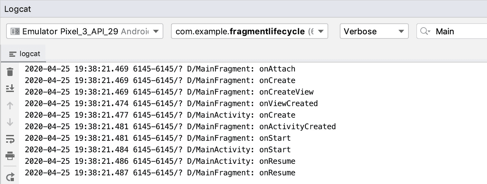
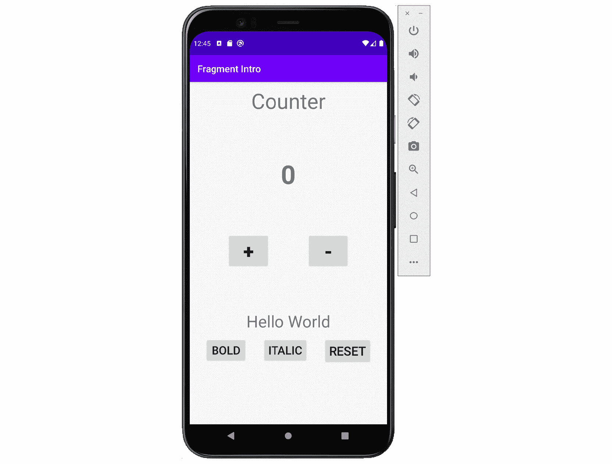
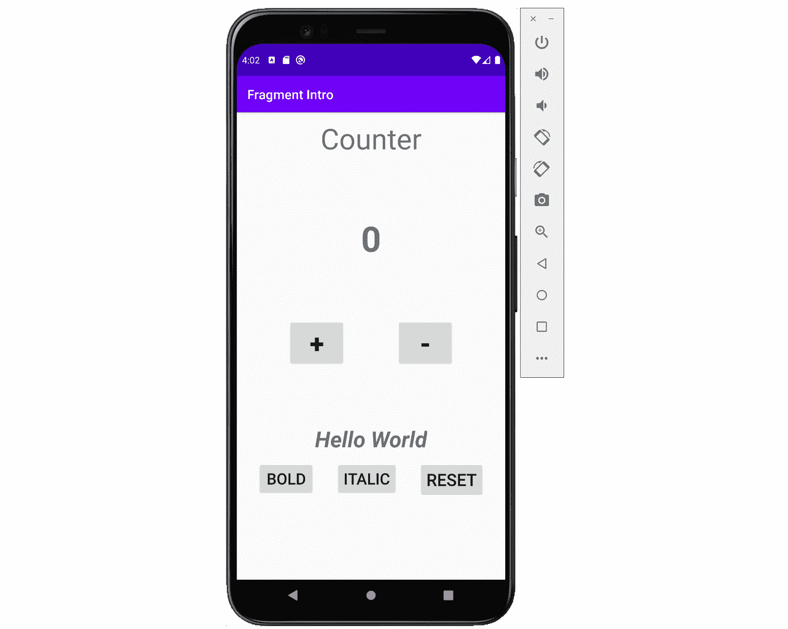
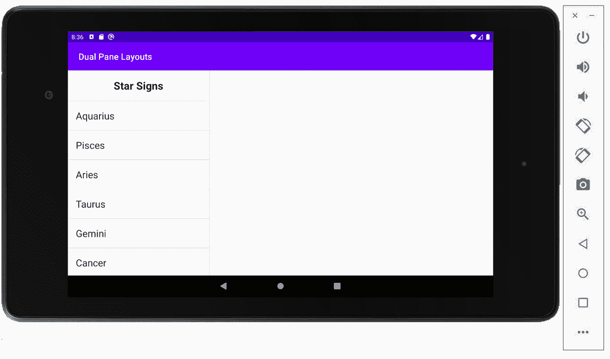
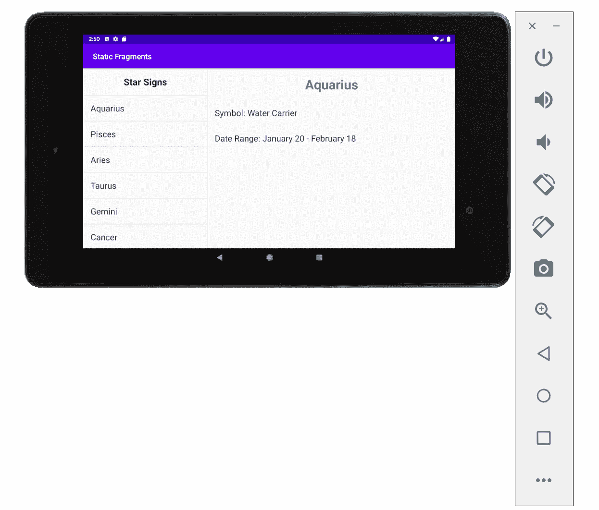
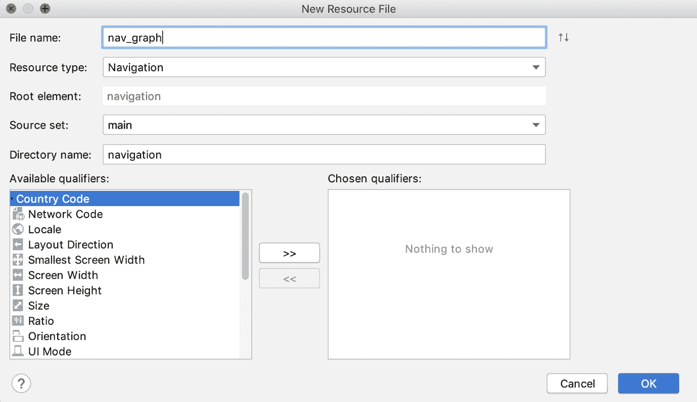

# 第三章：使用片段开发 UI

概述

本章涵盖了片段和片段的生命周期。它演示了如何使用它们来构建高效和动态的布局，以响应不同的屏幕尺寸和配置，并允许您将 UI 划分为不同的部分。在本章结束时，您将能够创建静态和动态片段，将数据传递到片段和活动，并使用 Jetpack 导航组件详细说明片段如何组合在一起。

# 介绍

在上一章中，我们探讨了 Android**活动生命周期**，并研究了它在应用程序中用于在屏幕之间导航的方式。我们还分析了定义了屏幕之间过渡方式的各种启动模式。在本章中，您将探索**片段**。片段是 Android 活动的一部分、部分或片段，正如其名称所暗示的那样。

在整个章节中，您将学习如何使用片段，看到它们可以存在于多个活动中，并发现多个片段可以在一个活动中使用。您将首先向活动添加简单的片段，然后进一步了解静态和动态片段之间的区别。片段可用于简化使用双面板布局的 Android 平板电脑的更大形态因素创建布局。例如，如果您有一个中等大小的手机屏幕，并且想要包含一个新闻故事列表，您可能只有足够的空间来显示列表。如果您在平板电脑上查看相同的故事列表，您将有更多的可用空间，因此您可以显示相同的列表，还可以在列表右侧显示故事本身。屏幕的每个不同区域都可以使用一个片段。然后您可以在手机和平板电脑上使用相同的片段。您可以从重用和简化布局中受益，并且不必重复创建类似的功能。

一旦您探索了如何创建和使用片段，您将学习如何使用片段组织用户旅程。您将应用一些已建立的实践方法来使用片段。最后，您将学习如何通过使用 Android Jetpack 导航组件创建导航图来简化片段使用，该组件允许您指定将片段与目的地链接在一起。

让我们开始学习片段的生命周期。

# 片段生命周期

片段是具有自己生命周期的组件。了解**片段生命周期**至关重要，因为它在片段创建、运行状态和销毁的某些阶段提供回调，您可以在其中配置初始化、显示和清理。片段在活动中运行，片段的生命周期与活动的生命周期绑定。

在许多方面，片段的生命周期与活动的生命周期非常相似，乍一看，似乎前者复制了后者。在片段生命周期中有与活动生命周期相同或相似的回调，例如`onCreate(savedInstanceState: Bundle?)`。

片段的生命周期与活动的生命周期紧密相连，因此无论在何处使用片段，片段回调都与活动回调交错。

注意

片段和活动之间的互动完整顺序在官方文档中有所说明：[`developer.android.com/guide/fragments/lifecycle`](https://developer.android.com/guide/fragments/lifecycle)

在初始化片段并准备将其显示给用户之前，需要经历相同的步骤，然后才能供用户进行交互。当应用程序转入后台、隐藏和退出时，片段也会经历与活动相同的拆卸步骤。与活动一样，片段必须从父`Fragment`类扩展/派生，并且您可以根据您的用例选择要覆盖的回调。现在让我们探索这些回调，它们出现的顺序以及它们的作用。

## onAttach

`override fun onAttach(context: Context)`: 这是您的片段与其所用活动关联的时刻。它允许您引用活动，尽管在此阶段片段和活动都尚未完全创建。

## 创建

`override fun onCreate(savedInstanceState: Bundle?)`: 在此处进行片段的任何初始化。这不是设置片段布局的地方，因为在此阶段，没有可用于显示的 UI，也没有像活动中的`setContentView`那样可用。与活动的`onCreate()`函数一样，您可以使用`savedInstanceState`参数在片段被重新创建时恢复片段的状态。

## 创建视图

`override fun onCreateView(inflater: LayoutInflater, container: ViewGroup?, savedInstanceState: Bundle?): View?`: 现在，您可以创建片段的布局。在这里最重要的是要记住，与活动设置布局不同，片段实际上会从此函数返回布局`View?`。您的布局中的视图可以在此引用，但有一些注意事项。您需要在引用其中包含的视图之前创建布局，这就是为什么最好在`onViewCreated`中进行视图操作。

## 视图创建

`override fun onViewCreated(view View, savedInstanceState: Bundle?)`: 此回调位于片段完全创建和对用户可见之间。在这里，您通常会设置视图并向这些视图添加任何功能和交互性。这可能是向按钮添加`click listener`，然后在单击时调用函数。

## 活动已创建

`override fun onActivityCreated(context: Context)`: 在活动的`onCreate`运行后立即调用。大部分片段的视图状态初始化将已完成，如果需要，这是进行最终设置的地方。

## 开始

`override fun onStart()`: 当片段即将对用户可见但尚不可供用户交互时调用此方法。

## 恢复

`override fun onResume()`: 在此调用结束时，您的片段将可供用户交互。通常，在此回调中定义的设置或功能很少，因为当应用程序进入后台然后再次进入前台时，此回调将始终被调用。因此，当片段变为可见时，您不希望不必要地重复片段的设置。

## 暂停

`override fun onPause()`: 与其对应的活动中的`onPause()`一样，表示您的应用程序进入后台或在屏幕上被其他内容部分覆盖。使用此方法保存对片段状态的任何更改。

## 停止

`override fun onStop()`: 在此调用结束时，片段不再可见并进入后台。

## 销毁视图

`override fun onDestroyView()`: 这通常用于在片段被销毁之前进行最终清理。如果需要清理任何资源，应该使用此回调。如果片段被推送到后退栈并保留，则也可以在不销毁片段的情况下调用它。在完成此回调后，片段的布局视图将被移除。

## 销毁

`override fun onDestroy()`: 片段正在被销毁。这可能是因为应用程序被终止，也可能是因为此片段被另一个片段替换。

## 分离

`override fun onDetach()`: 当片段已从其活动中分离时调用此方法。

还有更多的片段回调，但这些是您在大多数情况下会使用的。通常，您只会使用这些回调的一个子集：`onAttach()`将活动与片段关联，`onCreate`初始化片段，`onCreateView`设置布局，然后`onViewCreated`/`onActivityCreated`进行进一步初始化，也许`onPause()`进行一些清理。

注意

这些回调的更多细节可以在官方文档中找到：[`developer.android.com/guide/fragments`](https://developer.android.com/guide/fragments)。

现在我们已经了解了片段生命周期的一些理论以及它如何受到宿主活动生命周期的影响，让我们看看这些回调是如何运行的。

## 练习 3.01：添加基本片段和片段生命周期

在这个练习中，我们将创建并添加一个基本片段到一个应用程序。这个练习的目的是熟悉如何将片段添加到活动中以及它们显示的布局。为此，您将在 Android Studio 中创建一个新的空白片段和布局。然后将片段添加到活动，并通过片段布局的显示来验证片段是否已添加。执行以下步骤：

1.  在 Android Studio 中创建一个名为`Fragment Lifecycle`的空活动应用程序，包名为`com.example.fragmentlifecyle`。

1.  接下来，通过转到`文件`|`新建`|`片段（空白）`来创建一个新的片段。在这个阶段，您只想创建一个普通的片段，所以您使用`片段（空白）`选项。当您选择了这个选项后，您将看到*图 3.1*中显示的屏幕：

图 3.1：创建一个新的片段

1.  将片段重命名为`MainFragment`，布局重命名为`fragment_main`。然后，按`Finish`，片段类将被创建并打开。已添加了一个函数`onCreateView`（如下所示），它会填充片段使用的布局文件。

```kt
    override fun onCreateView(
        inflater: LayoutInflater, container: ViewGroup?,
        savedInstanceState: Bundle?
    ): View? {
        // Inflate the layout for this fragment
        return inflater.inflate(R.layout.fragment_main,           container, false)
    }
```

1.  当您打开`fragment_main.xml`布局文件时，您会看到以下代码：

```kt
<?xml version="1.0" encoding="utf-8"?>
<FrameLayout   xmlns:android="http://schemas.android.com/apk/res/android"
    xmlns:tools="http://schemas.android.com/tools"      android:layout_width="match_parent"        android:layout_height="match_parent"          tools:context=".MainFragment">
    <!-- TODO: Update blank fragment layout -->
    <TextView
        android:layout_width="match_parent"
        android:layout_height="match_parent"
        android:text="@string/hello_blank_fragment" />
</FrameLayout>
```

一个简单的布局已经添加了一个`TextView`和一些示例文本，使用了`@string/hello_blank_fragment`。这个字符串资源包含文本`hello blank fragment`。由于`layout_width`和`layout_height`被指定为`match_parent`，`TextView`将占据整个屏幕。然而，文本本身将被添加到视图的左上角，使用默认位置。

1.  添加`android:gravity="center"`属性和值到`TextView`，以便文本出现在屏幕中央：

```kt
    <TextView
        android:layout_width="match_parent"
        android:layout_height="match_parent"
        android:gravity="center"
        android:text="@string/hello_blank_fragment" />
```

如果现在运行 UI，您将看到“Hello World!”显示在*图 3.2*中：


图 3.2：没有添加片段的初始应用布局显示

嗯，您可以看到一些`Hello World!`文本，但可能没有您期望的`hello blank fragment`文本。当您创建活动时，片段及其布局不会自动添加到活动中。这是一个手动的过程。

1.  打开`activity_main.xml`文件，并用以下内容替换其中的内容：

```kt
<?xml version="1.0" encoding="utf-8"?>
<androidx.constraintlayout.widget.ConstraintLayout 
    xmlns:android="http://schemas.android.com/apk/res/android"
    xmlns:tools="http://schemas.android.com/tools"
    android:layout_width="match_parent"
    android:layout_height="match_parent"
    tools:context=".MainActivity">
    <fragment
        android:id="@+id/main_fragment"
        android:name="com.example.fragmentlifecycle.MainFragment"
        android:layout_width="match_parent"
        android:layout_height="match_parent" />
</androidx.constraintlayout.widget.ConstraintLayout>
```

就像您可以在 XML 布局中添加视图声明一样，还有一个`fragment`元素。您已经使用`match_parent`的约束将片段添加到`ConstraintLayout`中，因此它将占据整个屏幕。这里要检查的最重要的`xml`属性是`android:name`。在这里，您指定要添加到布局中的包和`Fragment`类的完全限定名称，使用`com.example.fragmentlifecycle.MainFragment`。

1.  现在运行应用程序，您将看到*图 3.3*中显示的输出：

图 3.3：添加了片段的应用布局显示

这证明了您的片段文本`Hello blank fragment`已添加到活动中，并且您定义的布局正在显示。接下来，您将检查活动和片段之间的回调方法以及发生这种情况的原因。

1.  打开`MainFragment`类，并在伴生对象中添加一个`TAG`常量，值为`"MainFragment"`，以标识该类。然后添加/更新适当的日志语句的函数。您需要在类顶部的导入中添加'Log'语句和'context'的导入。下面的代码片段已经被截断。点击链接查看您需要使用的完整代码块：

```kt
MainFragment.kt 
Log.d(TAG, "onCreateView") to the onCreateView callback and Log.d(TAG, "onCreate") to the onCreate callback which already exist. 
```

1.  接下来，打开`MainActivity`类，并添加常见的回调方法`onStart`和`onResume`。然后添加一个伴生对象，其中包含一个值为`"MainActivity"`的`TAG`常量，如下所示，并在类顶部添加 Log 导入：

```kt
    onCreate log statement Log.d(TAG, "onCreate") as this callback was already there when you added the activity in the project.You learned in *Chapter 2*, *Building User Screen Flows*, how to view log statements, and you are going to open the `Logcat` window in Android Studio to examine the logs and the order they are called when you run the app. In *Chapter 2*, *Building User Screen Flows*, you were viewing logs from a single activity so you could see the order they were called in. Now you'll examine the order in which the `MainActivity` and `MainFragment` callbacks happen. 
```

1.  打开`Logcat`窗口。（提醒一下，可以通过单击屏幕底部的`Logcat`选项卡或者通过工具栏的`View` | `Tool Windows` | `Logcat`来访问它）。由于`MainActivity`和`MainFragment`都以文本`Main`开头，您可以在搜索框中输入`Main`以过滤日志，只显示带有此文本的语句。运行应用程序，您应该看到以下内容：

图 3.4：启动应用程序时显示的 Logcat 语句

有趣的是，前几个回调来自片段。它通过`onAttach`回调与其放置的活动相连。片段在`onCreate`和`onCreateView`中初始化并显示其视图，然后调用另一个回调`onViewCreated`，确认片段 UI 已准备好显示。这是在活动的`onCreate`方法被调用之前。这是有道理的，因为活动根据其包含的内容创建其 UI。由于这是一个定义了自己布局的片段，活动需要知道如何测量、布局和绘制片段，就像在`onCreate`方法中一样。然后，在`onActivityCreated`回调中，片段收到确认已完成这一点，然后在它们各自的`onResume`回调完成后，片段和活动开始显示 UI。

注意

先前详细介绍的活动和片段生命周期之间的交互是针对静态片段的情况，即在活动的布局中定义的片段。对于动态片段，可以在活动已经运行时添加，交互可能会有所不同。

因此，现在片段和包含的活动都显示出来了，当应用程序转入后台或关闭时会发生什么呢？当片段和活动暂停、停止和完成时，回调仍然交错进行。

1.  将以下回调添加到`MainFragment`类中：

```kt
override fun onPause() {
    super.onPause()
    Log.d(TAG, "onPause")
}
override fun onStop() {
    super.onStop()
    Log.d(TAG, "onStop")
}
override fun onDestroyView() {
    super.onDestroyView()
    Log.d(TAG, "onDestroyView")
}
override fun onDestroy() {
    super.onDestroy()
    Log.d(TAG, "onDestroy")
}
override fun onDetach() {
    super.onDetach()
    Log.d(TAG, "onDetach")
}
```

1.  然后将这些回调添加到`MainActivity`中：

```kt
override fun onPause() {
    super.onPause()
    Log.d(TAG, "onPause")
}
override fun onStop() {
    super.onStop()
    Log.d(TAG, "onStop")
}
override fun onDestroy() {
    super.onDestroy()
    Log.d(TAG, "onDestroy")
}
```

1.  构建应用程序，一旦它运行起来，你会看到之前的回调同时启动片段和活动。您可以使用`Logcat`窗口左上角的垃圾桶图标来清除语句。然后关闭应用程序并查看输出日志语句：

图 3.5：关闭应用程序时显示的 Logcat 语句

`onPause`和`onStop`语句与您预期的一样，因为片段首先收到这些回调，因为它包含在活动中。您可以将其视为从内向外的通知，即在通知包含父项之前，子元素会收到通知，因此父项知道如何响应。然后片段被拆除，从活动中移除，然后在`onDestroyView`，`onDestroy`和`onDetach`函数中被销毁，之后在`onDestroy`中完成任何最终清理后，活动本身被销毁。在活动的组成部分被移除之前，活动完成是没有意义的。

完整的片段生命周期回调及其与活动回调的关系是 Android 的一个复杂领域，因为在不同情况下应用哪些回调可能会有相当大的不同。要查看更详细的概述，请参阅官方文档[`developer.android.com/guide/fragments`](https://developer.android.com/guide/fragments)。

对于大多数情况，您只会使用前面的片段回调。此示例演示了片段在创建、显示和销毁时的自包含性，以及它们对包含活动的相互依赖性。通过`onAttach`和`onActivityCreated`回调，它们可以访问包含活动及其状态，这将在下面的示例中演示。

现在我们已经通过一个向活动添加片段的基本示例，并检查了片段与活动之间的交互，让我们看一个更详细的示例，演示如何向活动添加两个片段。

## 练习 3.02：静态向活动添加片段

此练习将演示如何向活动添加两个具有自己 UI 和独立功能的片段。您将创建一个简单的计数器类，用于增加和减少数字，以及一个样式类，用于以编程方式更改应用于一些`Hello World`文本的样式。执行以下步骤：

1.  在 Android Studio 中创建一个名为`Fragment Intro`的空活动应用。然后在`res` | `values` | `strings.xml`文件中替换内容为以下练习所需的字符串：

```kt
<resources>
    <string name="app_name">Fragment Intro</string>
    <string name="hello_world">Hello World</string>
    <string name="bold_text">Bold</string>
    <string name="italic_text">Italic</string>
    <string name="reset">Reset</string>
    <string name="zero">0</string>
    <string name="plus">+</string>
    <string name="minus">-</string>
    <string name="counter_text">Counter</string>
</resources>
```

这些字符串既用于计数器片段，也用于样式片段，接下来您将创建样式片段。

1.  通过转到`File` | `New` | `Fragment (Blank)`，添加一个名为`CounterFragment`的新空片段，布局名称为`fragment_counter`

1.  现在对`fragment_counter.xml`文件进行更改。要添加字段，您需要在`Fragment`类中创建`counter`。以下代码由于空间原因而被截断。点击链接查看您需要使用的完整代码：

```kt
fragment_counter.xml
9    <TextView
10        android:id="@+id/counter_text"
11        android:layout_width="wrap_content"
12        android:layout_height="wrap_content"
13        android:text="@string/counter_text"
14        android:paddingTop="10dp"
15        android:textSize="44sp"
16        app:layout_constraintEnd_toEndOf="parent"
17        app:layout_constraintStart_toStartOf="parent"
18        app:layout_constraintTop_toTopOf="parent"/>
19
20    <TextView
21        android:id="@+id/counter"
22        android:layout_width="wrap_content"
23        android:layout_height="wrap_content"
24        android:text="@string/zero"
25        android:textSize="54sp"
26        android:textStyle="bold"
27        app:layout_constraintEnd_toEndOf="parent"
28        app:layout_constraintStart_toStartOf="parent"
29        app:layout_constraintTop_toBottomOf="@id/counter_text"
30        app:layout_constraintBottom_toTopOf="@id/plus"/>
You can find the complete code for this step at http://packt.live/2LFCJpa.
```

我们使用一个简单的`ConstraintLayout`文件，其中为标题`@+id/counter_text`和值`android:id="@+id/counter"`（默认为`@string/zero`）设置了`TextViews`，这些值将由`android:id="@+id/plus"`和`android:id="@+id/minus"`按钮更改。

注意

对于像这样的简单示例，您不会使用`style="@some_style"`符号在视图上设置单独的样式，最佳做法是避免在每个视图上重复这些值。

1.  现在打开`CounterFragment`并重写`onViewCreated`函数。您还需要添加以下导入：

```kt
onViewCreated, which is the callback run when the layout has been applied to your fragment. The onCreateView callback, which creates the view, was run when the fragment itself was created. The buttons you've specified in the preceding fragment have click listeners set up on them to increment and decrement the value of the counter view.
```

1.  首先，使用此行，您将检索计数器的当前值作为整数：

```kt
var counterValue = counter.text.toString().toInt()
```

1.  然后，使用以下行，您可以使用`++`符号将值增加`1`：

```kt
counter.text = (++counterValue).toString()
```

由于这是通过在`counterValue`之前添加`++`来完成的，它会在将整数值转换为字符串之前递增整数值。如果您没有这样做，而是使用`counter++`进行后递增，那么该值只会在您在语句中下一次使用该值时可用，这会重置计数器为相同的值。

1.  减号按钮`click listener`中的行执行与加号`click listener`类似的操作，但将值减`1`：

```kt
if (counterValue > 0) counter.text = (--counterValue).toString()
```

只有当值大于`0`时才执行操作，以便不设置负数。

1.  您还没有将片段添加到`MainActivity`布局中。要做到这一点，进入`activity_main.xml`并添加以下代码：

```kt
<?xml version="1.0" encoding="utf-8"?>
<LinearLayout xmlns:android="http://schemas.android.com/apk/res/  android"
    xmlns:tools="http://schemas.android.com/tools"
    android:layout_width="match_parent"
    android:layout_height="match_parent"
    android:orientation="vertical"
    tools:context=".MainActivity">
    <fragment
        android:id="@+id/counter_fragment"
        android:name="com.example.fragmentintro.CounterFragment"
        android:layout_width="match_parent"
        android:layout_height="match_parent"/>
</LinearLayout>
```

您将把布局从`FrameLayout`更改为`LinearLayout`，因为当您添加下一个片段时，您需要将一个片段放在另一个片段上方。您通过`name`属性在`fragment` XML 元素中指定要在其中使用的片段，使用类的完全限定包名称：`android:name="com.example.fragmentintro.CounterFragment`。如果您在创建应用程序时使用了不同的包名称，则这必须指向您创建的`CounterFragment`。这里需要理解的重要一点是，您已经将一个片段添加到了主活动布局中，并且该片段还有一个布局。这显示了使用片段的一些功能，因为您可以封装应用程序的一个功能，包括布局文件和片段类，并将其添加到多个活动中。

完成此操作后，像*图 3.6*中一样在虚拟设备中运行片段：


图 3.6：应用程序显示计数器片段

您已经创建了一个简单的计数器。基本功能按预期工作，递增和递减计数器值。

1.  在下一步中，您将在屏幕的下半部分添加另一个片段。这展示了片段的多功能性。您可以在屏幕的不同区域拥有具有功能和特性的封装 UI 片段。

1.  现在使用创建`CounterFragment`的早期步骤创建一个名为`StyleFragment`的新片段，布局名称为`fragment_style`。

1.  接下来，打开已创建的`fragment_style.xml`文件，并用下面链接中的代码替换内容。下面显示的片段已被截断-请参阅完整代码的链接：

```kt
fragment_style.xml
10    <TextView
11        android:id="@+id/hello_world"
12        android:layout_width="wrap_content"
13        android:layout_height="0dp"
14        android:textSize="34sp"
15        android:paddingBottom="12dp"
16        android:text="@string/hello_world"
17        app:layout_constraintEnd_toEndOf="parent"
18        app:layout_constraintStart_toStartOf="parent"
19        app:layout_constraintTop_toTopOf="parent" />
20
21    <Button
22        android:id="@+id/bold_button"
23        android:layout_width="wrap_content"
24        android:layout_height="0dp"
25        android:textSize="24sp"
26        android:text="@string/bold_text"
27        app:layout_constraintEnd_toStartOf="@+id/italic_button"
28        app:layout_constraintStart_toStartOf="parent"
29        app:layout_constraintTop_toBottomOf="@id/hello_world" />
You can find the complete code for this step at http://packt.live/2KykTDS.
```

布局添加了一个带有三个按钮的`TextView`。`TextView`文本和所有按钮的文本都设置为字符串资源`(@string`)。

1.  接下来，进入`activity_main.xml`文件，并在`LinearLayout`内的`CounterFragment`下方添加`StyleFragment`：

```kt
<?xml version="1.0" encoding="utf-8"?>
<LinearLayout xmlns:android="http://schemas.android.com/apk/res/  android"
    xmlns:tools="http://schemas.android.com/tools"
    android:layout_width="match_parent"
    android:layout_height="match_parent"
    android:orientation="vertical"
    tools:context=".MainActivity">
    <fragment
        android:id="@+id/counter_fragment"
        android:name="com.example.fragmentintro.CounterFragment"
        android:layout_width="match_parent"
        android:layout_height="match_parent"/>
    <fragment
        android:id="@+id/style_fragment"
        android:name="com.example.fragmentintro.StyleFragment"
        android:layout_width="match_parent"
        android:layout_height="match_parent"/>
</LinearLayout>
```

当您运行应用程序时，您会发现`StyleFragment`不可见，如*图 3.7*所示：


图 3.7：应用程序显示没有显示 StyleFragment

您已经在布局中包含了`StyleFragment`，但是因为`CounterFragment`的宽度和高度设置为与其父级匹配（`android:layout_width="match_parent android:layout_height="match_parent"`），并且它是布局中的第一个视图，它占据了所有的空间。

您需要的是指定每个片段应占用的高度比例的方法。`LinearLayout`的方向设置为垂直，因此当`layout_height`未设置为`match_parent`时，片段将一个在另一个上方显示。为了定义这个高度的比例，您需要在`activity_main.xml`布局文件中的每个片段中添加另一个属性`layout_weight`。当您使用`layout_weight`来确定这个比例高度时，片段应该占用您设置的`layout_height`为`0dp`的高度。

1.  使用以下更改更新`activity_main.xml`布局，将两个片段的`layout_height`设置为`0dp`，并添加以下值的`layout_weight`属性：

```kt
<?xml version="1.0" encoding="utf-8"?>
<LinearLayout xmlns:android="http://schemas.android.com/apk/res/  android"
    xmlns:tools="http://schemas.android.com/tools"
    android:layout_width="match_parent"
    android:layout_height="match_parent"
    android:orientation="vertical"
    tools:context=".MainActivity">
    <fragment
        android:id="@+id/counter_fragment"
        android:name="com.example.fragmentintro.CounterFragment"
        android:layout_width="match_parent"
        android:layout_height="0dp"
        android:layout_weight="2"/>
    <fragment
        android:id="@+id/style_fragment"
        android:name="com.example.fragmentintro.StyleFragment"
        android:layout_width="match_parent"
        android:layout_height="0dp"
        android:layout_weight="1"/>
</LinearLayout>
```

这些更改使`CounterFragment`占据了`StyleFragment`两倍的高度，如*图 3.8*所示：



图 3.8：CounterFragment 分配了两倍的垂直空间

您可以通过更改权重值来尝试不同的布局显示效果。

1.  此时，按下样式按钮“粗体”和“斜体”将不会对文本`Hello World`产生影响。按钮操作尚未指定。下一步涉及向按钮添加交互性，以更改`Hello World`文本的样式。添加以下`onViewCreated`函数，覆盖其父类以在布局视图设置完成后向片段添加行为。您还需要添加以下小部件和字体导入以更改文本的样式：

```kt
click listeners to each button defined in the layout and setting the Hello World text to the desired Typeface. (In this context, Typeface refers to the style which will be applied to the text and not a font). The conditional statement for the bold_button checks whether the italic Typeface is set and if it is, to make the text bold and italic, and if not, just make the text bold. This logic works the opposite way for the italic_button, checking the state of the Typeface and making the corresponding changes to the Typeface, initially setting it to italic if no TypeFace is defined. 
```

1.  最后，`reset_button`清除`Typeface`并将其设置回正常。运行应用程序并单击`ITALIC`和`BOLD`按钮。您应该看到如*图 3.9*所示的显示：

图 3.9：StyleFragment 将文本设置为粗体和斜体

这个练习虽然简单，但展示了使用片段的一些基本概念。用户可以与应用程序的功能进行交互，可以独立开发，并不依赖于将两个或更多功能捆绑到一个布局和活动中。这使得片段可重用，并意味着在开发应用程序时，您可以专注于将定义良好的 UI、逻辑和功能添加到单个片段中。

# 静态片段和双窗格布局

上一个练习介绍了静态片段，可以在活动 XML 布局文件中定义。Android 开发环境的一个优点是可以为不同的屏幕尺寸创建不同的布局和资源。这用于决定根据设备是手机还是平板电脑来显示哪些资源。随着平板电脑尺寸的增大，布局 UI 元素的空间也会大幅增加。Android 允许根据许多不同的形状因素指定不同的资源。用于在`res`（资源）文件夹中定义平板电脑的限定符经常是`sw600dp`。这表示如果设备的**最短宽度**（**sw**）超过 600 dp，则使用这些资源。此限定符用于 7 英寸平板电脑及更大的设备。平板电脑支持所谓的双窗格布局。窗格代表用户界面的一个独立部分。如果屏幕足够大，那么可以支持两个窗格（双窗格）布局。这也提供了一个窗格与另一个窗格互动以更新内容的机会。

## 练习 3.03：静态片段的双窗格布局

在这个练习中，您将创建一个简单的应用程序，显示星座列表和每个星座的特定信息。它将在手机和平板电脑上使用不同的显示方式。手机将显示一个列表，然后在另一个屏幕上打开所选列表项的内容，而平板电脑将在同一屏幕上的另一个窗格中显示相同的列表，并在另一个窗格中打开列表项的内容，以双窗格布局。为了实现这一点，您必须创建另一个布局，仅用于 7 英寸平板电脑及以上。执行以下步骤：

1.  首先，使用“空活动”创建一个名为“双窗格布局”的新 Android Studio 项目。创建完成后，转到已创建的布局文件`res`|`layout`|`activity_main.xml`。

1.  选择设计视图顶部工具栏中的此选项后，选择方向布局按钮。

1.  在此下拉菜单中，您可以选择“创建平板电脑变体”来创建应用程序的新文件夹。这将在`main`|`res`文件夹中创建一个名为`'layout-sw600dp'`的新文件夹，并添加布局文件`activity_main.xml`：

图 3.10：设计视图方向按钮下拉菜单

目前，它是在创建应用程序时添加的`activity_main.xml`文件的副本，但您将更改它以自定义平板电脑的屏幕显示。

为了演示双窗格布局的使用，您将创建一个星座列表，当选择列表项时，将显示有关星座的一些基本信息。

1.  转到顶部工具栏，选择`文件` | `新建` | `片段` | `片段（空白）`。将其命名为`ListFragment`。

对于这个练习，您需要更新`strings.xml`和`themes.xml`文件，添加以下条目：

```kt
strings.xml
    <string name="star_signs">Star Signs</string>
    <string name="symbol">Symbol: %s</string>
    <string name="date_range">Date Range: %s</string>
    <string name="aquarius">Aquarius</string>
    <string name="pisces">Pisces</string>
    <string name="aries">Aries</string>
    <string name="taurus">Taurus</string>
    <string name="gemini">Gemini</string>
    <string name="cancer">Cancer</string>
    <string name="leo">Leo</string>
    <string name="virgo">Virgo</string>
    <string name="libra">Libra</string>
    <string name="scorpio">Scorpio</string>
    <string name="sagittarius">Sagittarius</string>
    <string name="capricorn">Capricorn</string>
    <string name="unknown_star_sign">Unknown Star Sign</string>
themes.xml
    <style name="StarSignTextView"       parent="Base.TextAppearance.AppCompat.Large" >
        <item name="android:padding">18dp</item>
    </style>
    <style name="StarSignTextViewHeader"       parent="Base.TextAppearance.AppCompat.Display1" >
        <item name="android:padding">18dp</item>
    </style>
```

打开`main` | `res` | `layout` | `fragment_list.xml`文件，并用以下内容替换默认内容：

```kt
<?xml version="1.0" encoding="utf-8"?>
<ScrollView xmlns:android="http://schemas.android.com/apk/res/  android"
    xmlns:tools="http://schemas.android.com/tools"
    android:layout_width="match_parent"
    android:layout_height="wrap_content"
    tools:context=".ListFragment">
    <LinearLayout
        android:layout_width="match_parent"
        android:layout_height="wrap_content"
        android:orientation="vertical">
        <TextView
            android:layout_width="match_parent"
            android:layout_height="wrap_content"
            android:gravity="center"
            android:textSize="24sp"
            android:textStyle="bold"
            style="@style/StarSignTextView"
            android:text="@string/star_signs" />
        <View
            android:layout_width="match_parent"
            android:layout_height="1dp"
            android:background="?android:attr/dividerVertical" />
        <TextView
            android:id="@+id/aquarius"
            style="@style/StarSignTextView"
            android:layout_width="match_parent"
            android:layout_height="wrap_content"
            android:text="@string/aquarius" />
    </LinearLayout>
</ScrollView>
```

您将看到，第一个`xml`元素是一个`ScrollView`。`ScrollView`是一个`ViewGroup`，允许内容滚动，由于您将向其中添加 12 个星座到包含的`LinearLayout`中，这可能会占用比屏幕上可用的更多的垂直空间。

添加`ScrollView`可以防止内容在垂直方向上被截断，当没有足够的空间来显示它们时，可以滚动布局。`ScrollView`只能包含一个子视图。在这里，它是一个`LinearLayout`，由于内容将垂直显示，方向设置为垂直(`android:orientation="vertical"`)。在第一个标题`TextView`下，您已添加了一个分隔符`View`和一个第一个星座水瓶座的`TextView`。

1.  按照相同的格式添加其他 11 个星座，首先添加分隔符，然后添加`TextView`。每个`TextView`的字符串资源名称和`id`应该相同。要创建视图的星座名称在`strings.xml`文件中指定。

注意

用于布置列表的技术对于示例来说是可以的，但在真实的应用程序中，您将创建一个专用于显示可以滚动的列表的`RecyclerView`，并通过适配器将数据绑定到列表上。您将在后面的章节中介绍这个。

1.  接下来创建`StarSignListener`，并通过添加以下内容使`MainActivity`实现它：

```kt
interface StarSignListener {
    fun onSelected(id: Int)
}
class MainActivity : AppCompatActivity(), StarSignListener {
    ...
    override fun onSelected(id: Int) {
        TODO("not implemented yet")
    }
}
```

这就是当用户从`ListFragment`中选择一个星座时，片段将如何与活动进行通信，并根据是否可用双窗格添加逻辑。 

1.  创建布局文件后，进入`ListFragment`类，并使用下面的内容更新它，保持`onCreateView()`不变。您可以在`onAttach()`回调中看到，您声明活动实现了`StarSignListener`接口，因此当用户点击列表中的项目时可以通知它：在文件顶部与其他导入一起添加`onAttach`所需的`Context`的导入：

```kt
onCreateView. You set up the buttons with a click listener in onViewCreated and then you handle clicks in onClick.The `listOf` syntax in `onViewCreated` is a way of creating a `readonly` list with the specified elements, which in this case are your star sign `TextViews`. Then, in the following code, you loop over these `TextViews`, setting the `click listener` for each of the individual `TextViews` by iterating over the `TextView` list with the `forEach` statement. The `it` syntax here refers to the element of the list that is being operated on, which will be one of the 12 star sign `TextViews`.
```

1.  最后，`onClick`语句通过`StarSignListener`与活动通信，当列表中的星座之一被点击时：

```kt
v?.let { starSign ->
    starSignListener.onSelected(starSign.id)
}
```

您可以使用`?`检查指定为`v`的视图是否为空，然后只有在它不为空时才使用`let`作用域函数进行操作，然后将星座的`id`传递给`Activity`/`StarSignListener`。

注意

监听器是对变化做出反应的常见方式。通过指定`Listener`接口，您正在指定一个要履行的合同。然后通知实现类监听器操作的结果。

1.  接下来创建`DetailFragment`，它将显示星座的详细信息。创建一个与之前相同的片段，并将其命名为`DetailFragment`。用以下 XML 文件替换`fragment_detail`布局文件的内容：

```kt
<?xml version="1.0" encoding="utf-8"?>
<LinearLayout xmlns:android="http://schemas.android.com/apk/res/  android"
    xmlns:tools="http://schemas.android.com/tools"
    android:layout_width="match_parent"
    android:layout_height="match_parent"
    android:orientation="vertical"
    tools:context=".DetailFragment">
    <TextView
        android:id="@+id/star_sign"
        style="@style/StarSignTextViewHeader"
        android:textStyle="bold"
        android:gravity="center"
        android:layout_width="match_parent"
        android:layout_height="wrap_content"
        tools:text="Aquarius"/>
    <TextView
        android:id="@+id/symbol"
        style="@style/StarSignTextView"
        android:layout_width="match_parent"
        android:layout_height="wrap_content"
        tools:text="Water Carrier"/>
    <TextView
        android:id="@+id/date_range"
        style="@style/StarSignTextView"
        android:layout_width="match_parent"
        android:layout_height="wrap_content"
        tools:text="Date Range: January 20 - February 18" />
</LinearLayout>
```

在这里，您创建一个简单的`LinearLayout`，它将显示星座名称、星座符号和日期范围。您将在`DetailFragment`中设置这些值。

1.  打开`DetailFragment`，并使用以下文本更新内容，并将小部件导入到导入列表中：

```kt
onCreateView inflates the layout as normal. The setStarSignData() function is what populates the data from the passed in starSignId. The when expression is used to determine the ID of the star sign and set the appropriate contents.The `setStarSignData` function above formats text passed with the `getString` function – `getString(R.string.symbol,"Water Carrier")`, for example, passes the text `Water Carrier` into the `symbol` string, `<string name="symbol">Symbol: %s</string>`, and replaces the `%s` with the passed-in value. You can see what other string formatting options there are in the official docs: [`developer.android.com/guide/topics/resources/string-resource`](https://developer.android.com/guide/topics/resources/string-resource).Following the pattern introduced by the star sign `aquarius`, add the other 11 star signs below the `aquarius` block. For simplicity, all of the detailed text of the star sign has not been added into the `strings.xml` file. Consult the example here for the completed class file:[`packt.live/35Vynkx`](http://packt.live/35Vynkx)Right now, you have added both `ListFragment` and `DetailFragment`. Currently, however, they have not been synced together, so selecting the star sign item in the `ListFragment` does not load contents into the `DetailFragment`. Let's look at how you can change that. 
```

1.  首先，您需要在`layout`文件夹和`layout-sw600dp`中更改`activity_main.xml`的布局。

1.  在项目视图中打开`res` | `layout` | `activity_main.xml`。在默认的 Android 视图中打开`res` | `layout` | `activity_main.xml`，并选择不带（sw600dp）的顶部`activity_main.xml`文件。用以下内容替换内容：

```kt
<?xml version="1.0" encoding="utf-8"?>
<androidx.constraintlayout.widget.ConstraintLayout   xmlns:android="http://schemas.android.com/apk/res/android"
    xmlns:tools="http://schemas.android.com/tools"
    android:layout_width="match_parent"
    android:layout_height="match_parent"
    tools:context=".MainActivity">
    <fragment
        android:id="@+id/star_sign_list"
        android:name="com.example.staticfragments.ListFragment"
        android:layout_height="match_parent"
        android:layout_width="match_parent"/>
</androidx.constraintlayout.widget.ConstraintLayout>
```

1.  然后打开`res` | `layout-sw600dp` | `activity_main.xml`（如果在项目视图中）。在默认的 Android 视图中打开`res` | `layout` | `activity_main.xml（sw600dp）`。用以下内容替换内容：

```kt
<?xml version="1.0" encoding="utf-8"?>
<LinearLayout xmlns:android="http://schemas.android.com/apk/res/  android"
    xmlns:tools="http://schemas.android.com/tools"
    android:layout_width="match_parent"
    android:layout_height="match_parent"
    android:orientation="horizontal"
    tools:context=".MainActivity">
    <fragment
        android:id="@+id/star_sign_list"
        android:name="com.example.staticfragments.ListFragment"
        android:layout_height="match_parent"
        android:layout_width="0dp"
        android:layout_weight="1"/>
    <View
        android:layout_width="1dp"
        android:layout_height="match_parent"
        android:background="?android:attr/dividerVertical" />
    <fragment
        android:id="@+id/star_sign_detail"
        android:name="com.example.staticfragments.DetailFragment"
        android:layout_height="match_parent"
        android:layout_width="0dp"
        android:layout_weight="2"/>
</LinearLayout>
```

您正在添加一个`LinearLayout`，默认情况下会水平布局其内容。

您添加了`ListFragment`，一个分隔线，然后是`DetailFragment`并分配了适当的 ID。还要注意，您正在使用权重的概念来分配每个片段可用空间。当您这样做时，您指定了`android:layout_width="0dp"`。然后，`layout_weight`根据权重测量设置了宽度的比例，因为`LinearLayout`被设置为水平布局片段。`ListFragment`指定为`android:layout_weight="1"`，`DetailFragment`指定为`android:layout_weight="2"`，这告诉系统将`DetailFragment`分配为`ListFragment`的两倍宽度。在这种情况下，包括固定 dp 宽度的分隔线在内，这将导致`ListFragment`大约占据宽度的三分之一，而`DetailFragment`占据宽度的三分之二。

1.  要查看应用程序，请按照*第一章*，*创建您的第一个应用程序*中显示的方式创建一个新的虚拟设备，并选择`Category` | `Tablet` | `Nexus 7`。

1.  这将创建一个 7 英寸的平板。然后启动虚拟设备并运行应用程序。当您在纵向模式下启动平板时，您将看到初始视图：

图 3.11：初始星座应用 UI 显示

您可以看到列表占据了屏幕的大约三分之一，空白空间占据了屏幕的三分之二。

1.  单击虚拟设备上的底部旋转按钮，将虚拟设备顺时针旋转 90 度。

1.  完成后，虚拟设备将进入横向模式。但是，它不会改变屏幕方向为横向。

1.  要做到这一点，请单击虚拟设备左下角的旋转按钮。您还可以选择虚拟设备顶部的状态栏，向下拖动以显示快速设置栏，然后通过选择旋转按钮来打开自动旋转。

图 3.12：自动旋转已选择的快捷设置栏

1.  然后，这将改变平板的布局为横向：

图 3.13：平板上横向显示的初始星座应用 UI 显示

1.  接下来要做的是启用选择列表项以将内容加载到屏幕的`Detail`窗格中。为此，我们需要在`MainActivity`中进行更改。更新以下代码以按照检索视图的 ID 模式检索片段：

```kt
package com.example.dualpanelayouts
import android.content.Intent
import android.os.Bundle
import android.view.View
import androidx.appcompat.app.AppCompatActivity
const val STAR_SIGN_ID = "STAR_SIGN_ID"
interface StarSignListener {
    fun onSelected(id: Int)
}
class MainActivity : AppCompatActivity(), StarSignListener {
    var isDualPane: Boolean = false
    override fun onCreate(savedInstanceState: Bundle?) {
        super.onCreate(savedInstanceState)
        setContentView(R.layout.activity_main)
        isDualPane = findViewById<View>(R.id.star_sign_detail) != null
    }
    override fun onSelected(id: Int) {
       if (isDualPane) {
           val detailFragment = supportFragmentManager
            .findFragmentById(R.id.star_sign_detail) as DetailFragment
           detailFragment.setStarSignData(id)
       } else {
           val detailIntent = Intent(this, 
             DetailActivity::class.java).apply {
              putExtra(STAR_SIGN_ID, id)
           }
            startActivity(detailIntent)
        }
    }
}
```

注意

此示例及其后续示例使用`supportFragmentManager.findFragmentById`。

但是，如果您在片段 XML 中添加标签，也可以通过`Tag`检索片段，方法是使用`android:tag="MyFragmentTag"`。

1.  然后，您可以使用`supportFragmentManager.findFragmentByTag("MyFragmentTag")`检索片段。

1.  为了从片段中检索数据，活动需要实现`StarSignListener`。这完成了在片段中设置的合同，以将详细信息传递回实现类。`onCreate`函数设置布局，然后通过检查`DetailFragment`是否在活动的膨胀布局中，通过检查 id `R.id.star_sign_detail`是否存在来检查。从项目视图中，`res` | `layout` | `activity_main.xml`文件只包含`ListFragment`，但您已在`res` | `layout-sw600dp` | `activity_main.xml`文件中添加了代码，以包含带有`android:id="@+id/star_sign_detail"`的`DetailFragment`。这将用于 Nexus 7 平板的布局。在默认的 Android 视图中打开`res` | `layout` | `activity_main.xml`，然后选择顶部的不带（sw600dp）的`activity_main.xml`文件，然后选择`activity_main.xml (sw600dp)`以查看这些差异。

1.  现在我们可以通过`StarSignListener`从`ListFragment`传递星座 ID 回到`MainActivity`，并将其传递到`DetailFragment`。通过检查`isDualPane`布尔值来实现这一点，如果评估为`true`，则可以使用以下代码将星座 ID 传递给`DetailFragment`：

```kt
val detailFragment = supportFragmentManager .findFragmentById   (R.id.star_sign_detail) as DetailFragment
detailFragment.setStarSignData(id)
```

1.  您将片段从`id`转换为`DetailFragment`并调用以下内容：

```kt
detailFragment.setStarSignData(id)
```

1.  由于您已在片段中实现了此功能，并通过`id`进行内容显示的检查，因此 UI 已更新：

图 3.14：平板上星座应用双窗口显示

1.  现在点击列表项按预期工作，显示双窗格布局，并正确设置内容。

1.  然而，如果设备不是平板，即使点击了列表项，也不会发生任何事情，因为没有`else`分支条件来处理设备不是平板的情况，这由`isDualPane`布尔值定义。显示将如*图 3.15*所示，并且在选择项目时不会发生变化：

图 3.15：手机上初始星座应用 UI 显示

1.  您将在另一个活动中显示星座详情。通过转到`文件` | `新建` | `活动` | `空活动`来创建一个新的`DetailActivity`。创建后，使用此布局更新`activity_detail.xml`：

```kt
<?xml version="1.0" encoding="utf-8"?>
<androidx.constraintlayout.widget.ConstraintLayout   xmlns:android="http://schemas.android.com/apk/res/android"
    xmlns:app="http://schemas.android.com/apk/res-auto"
    xmlns:tools="http://schemas.android.com/tools"
    android:layout_width="match_parent"
    android:layout_height="match_parent"
    tools:context=".DetailActivity">
    <fragment
        android:id="@+id/star_sign_detail"
        android:name="com.example.staticfragments.DetailFragment"
        android:layout_height="match_parent"
        android:layout_width="match_parent"/>
</androidx.constraintlayout.widget.ConstraintLayout>
```

1.  这将`DetailFragment`添加为布局中唯一的片段。现在使用以下内容更新`DetailActivity`：

```kt
override fun onCreate(savedInstanceState: Bundle?) {
    super.onCreate(savedInstanceState)
    setContentView(R.layout.activity_detail)
    val starSignId = intent.extras?.getInt(STAR_SIGN_ID, 0) ?: 0
    val detailFragment = supportFragmentManager       .findFragmentById(R.id.star_sign_detail) as DetailFragment
    detailFragment.setStarSignData(starSignId)
}
```

1.  预计星座`id`将通过在意图的额外设置键（也称为`id`）从另一个活动传递到此活动，以在`DetailFragment`中设置星座 ID。接下来，您需要实现`isDualPane`检查的`else`分支，以通过意图传递星座 ID 启动`DetailActivity`。更新`MainActivity`以执行以下操作。您还需要将`Intent`导入添加到导入列表中：

```kt
import android.content.Intent
override fun onSelected(id: Int) {
    if (isDualPane) {
        val detailFragment = supportFragmentManager
          .findFragmentById(R.id.star_sign_detail) 
          as DetailFragment
        detailFragment.setStarSignData(id)
    } else {
        val detailIntent = Intent(this, DetailActivity::class.java)
          .apply {
           putExtra(STAR_SIGN_ID, id)
        }
        startActivity(detailIntent)
    }
}
```

1.  在手机显示上点击星座名称中的一个，它会在`DetailActivity`中显示内容，占据整个屏幕而不显示列表：

图 3.16：手机上单窗格星座详情屏幕

这个练习展示了片段的灵活性。它们可以封装应用程序不同功能的逻辑和显示，可以根据设备的形态因素以不同的方式集成。它们可以以各种方式在屏幕上排列，这受到它们所包含的布局的限制，因此它们可以作为双窗格布局的一部分或全部，也可以作为单窗格布局的一部分。这个练习展示了在平板上并排布置片段，但它们也可以以其他方式叠放在一起以及以各种其他方式排列。下一个主题将说明应用程序中使用的片段配置不必在 XML 中静态指定，而也可以动态完成。

# 动态片段

到目前为止，您只看到了在编译时以 XML 形式添加的片段。虽然这可以满足许多用例，但您可能希望在运行时动态添加片段以响应用户的操作。这可以通过将`ViewGroup`添加为片段的容器，然后向`ViewGroup`添加、替换和移除片段来实现。这种技术更灵活，因为片段可以一直处于活动状态，直到不再需要，然后被移除，而不是像您在静态片段中看到的那样总是在 XML 布局中被膨胀。如果需要 3 或 4 个以上的片段来满足一个活动中的不同用户旅程，那么首选选项是通过动态添加/替换片段来响应用户在 UI 中的交互。当用户与 UI 的交互在编译时是固定的，并且您预先知道需要多少片段时，使用静态片段效果更好。例如，从列表中选择项目以显示内容就是这种情况。

## 练习 3.04：动态向活动添加片段

在这个练习中，我们将构建与之前相同的星座应用程序，但将演示如何动态地将列表和详细片段添加到屏幕布局中，而不是直接在 XML 布局中添加。您还可以向片段传递参数。为简单起见，您将为手机和平板创建相同的配置。执行以下步骤：

1.  创建一个名为`Dynamic Fragments`的`Empty Activity`的新项目。

1.  完成后，添加以下依赖项，您需要使用`FragmentContainerView`，这是一个优化的 ViewGroup，用于处理 Fragment Transactions 到`app/build.gradle`中的`dependences{ }`块中：

```kt
implementation 'androidx.fragment:fragment-ktx:1.2.5'
```

1.  从*练习 3.03*，*使用静态片段创建双窗格布局*中复制以下 XML 资源文件的内容，并将其添加到此练习中的相应文件中：`strings.xml`（将`app_name`字符串从`Static Fragments`更改为`Dynamic Fragments`），`fragment_detail.xml`和`fragment_list.xml`。所有这些文件都存在于上一个练习中创建的项目中，您只是将内容添加到这个新项目中。然后将`DetailFragment`和`ListFragment`复制到新项目中。您需要将这两个文件中的包名称从`package com.example.staticfragments`更改为`package com.example.dynamicfragments`。最后，将上一个练习中在 themes.xml 中基本应用程序样式下定义的样式添加到此项目中的 themes.xml 中。

1.  您现在已经设置了与上一个练习中相同的片段。现在打开`activity_main.xml`布局，并用以下内容替换其内容：

```kt
<?xml version="1.0" encoding="utf-8"?>
<androidx.fragment.app.FragmentContainerView   xmlns:android="http://schemas.android.com/apk/res/android"
    android:id="@+id/fragment_container"
    android:layout_width="match_parent"
    android:layout_height="match_parent" />
```

这是您将要向其中添加片段的`FragmentContainerView`。您会注意到在布局 XML 中没有添加片段，因为这些将会动态添加。

1.  进入`MainActivity`并用以下内容替换其内容：

```kt
package com.example.dynamicfragments
import androidx.appcompat.app.AppCompatActivity
import android.os.Bundle
import androidx.fragment.app.FragmentContainerView
class MainActivity : AppCompatActivity() {
    override fun onCreate(savedInstanceState: Bundle?) {
        super.onCreate(savedInstanceState)
        setContentView(R.layout.activity_main)
        if (savedInstanceState == null) {
            findViewById<FragmentContainerView>              (R.id.fragment_container)?.let { frameLayout ->
                val listFragment = ListFragment()
                supportFragmentManager.beginTransaction()
                    .add(frameLayout.id, listFragment).commit()
            }
        }
    }
}
```

您正在获取`activity_main.xml`中指定的`FrameLayout`的引用，创建一个新的`ListFragment`，然后将此片段添加到 ID 为`fragment_container`的`ViewGroup` `FrameLayout`中。指定的片段事务是`add`，因为您首次向`FrameLayout`添加片段。您调用`commit()`立即执行事务。使用`savedInstanceState`进行空值检查，只有在没有状态需要恢复时才添加此`ListFragment`，如果先前已添加了片段，则会有状态需要恢复。

1.  接下来，使`MainActivity`实现`StarSignListener`，并添加一个常量以将星座从`ListFragment`传递到`DetailFragment`：

```kt
class MainActivity : AppCompatActivity(), StarSignListener {
...
override fun onSelected(id: Int) {
    }
}
```

1.  现在，如果运行应用程序，您将看到星座列表显示在手机和平板电脑上。

现在你遇到的问题是如何将星座 ID 传递给`DetailFragment`，因为它现在不在 XML 布局中了。

一种选择是使用与上一个示例相同的技术，创建一个新活动并通过意图传递星座 ID，但是您不应该创建新活动来添加新片段，否则您可能会放弃片段而只使用活动。您将用`DetailFragment`替换`FrameLayout`中的`ListFragment`，但首先，您需要找到一种方法将星座 ID 传递到`DetailFragment`中。您可以通过在创建片段时将此`id`作为参数传递来实现这一点。这样做的标准方法是在片段中使用`Factory`方法。

1.  将以下代码添加到`DetailFragment`的底部：（当您使用模板/向导创建片段时，将添加一个示例工厂方法，您可以在此处更新）

```kt
companion object {
    private const val STAR_SIGN_ID = "STAR_SIGN_ID"
    fun newInstance(starSignId: Int) = DetailFragment().apply {
        arguments = Bundle().apply {
            putInt(STAR_SIGN_ID, starSignId)
        }
    }
}
```

伴随对象允许您将 Java 的静态成员等效添加到类中。在这里，您正在实例化一个新的`DetailFragment`并设置传递到片段中的参数。片段的参数存储在`Bundle()`中，因此与活动的意图额外项（也是一个 bundle）一样，您将值添加为键对。在这种情况下，您正在添加键`STAR_SIGN_ID`和值`starSignId`。

1.  接下来要做的是重写`DetailFragment`生命周期函数之一，以使用传入的参数：

```kt
override fun onViewCreated(view: View, savedInstanceState: Bundle?) {
    val starSignId = arguments?.getInt(STAR_SIGN_ID, 0) ?: 0
    setStarSignData(starSignId)
}
```

1.  您在`onViewCreated`中执行此操作，因为在此阶段已完成片段的布局，并且可以访问视图层次结构（而如果您在`onCreate`中访问参数，则片段布局将不可用，因为这是在`onCreateView`中完成的）：

```kt
val starSignId = arguments?.getInt(STAR_SIGN_ID, 0) ?: 0
```

1.  此行从传入的片段参数中获取星座 ID，如果找不到`STAR_SIGN_ID`键，则设置默认值为`0`。然后调用`setStarSignData(starSignId)`来显示星座内容。

1.  现在，您只需要在`MainActivity`中实现`StarSignListener`接口，以从`ListFragment`中检索星座 ID：

```kt
class MainActivity : AppCompatActivity(), StarSignListener {
    override fun onCreate(savedInstanceState: Bundle?) {
        super.onCreate(savedInstanceState)
        setContentView(R.layout.activity_main)
        if (savedInstanceState == null) {
            findViewById<FragmentContainerView>              (R.id.fragment_container)?.let { frameLayout ->
                val listFragment = ListFragment()
                supportFragmentManager.beginTransaction()
                    .add(frameLayout.id, listFragment).commit()
            }
        }
    }
DetailFragment as explained earlier with the factory method passing in the star sign ID: DetailFragment.newInstance(starSignId).
```

此时，`ListFragment`仍然是添加到活动`FrameLayout`的片段。您需要用`DetailFragment`替换它，这需要另一个事务。但这次，您使用`replace`函数将`ListFragment`替换为`DetailFragment`。在提交事务之前，您调用`.addToBackStack(null)`，这样当按下返回按钮时应用程序不会退出，而是通过弹出`DetailFragment`来返回`ListFragment`。

此练习介绍了动态向活动添加片段。下一个主题介绍了创建片段的更明确定义的结构，称为导航图。

# Jetpack Navigation

使用动态和静态片段，虽然非常灵活，但会在您的应用中引入大量样板代码，并且在用户旅程需要添加、删除和替换多个片段并管理返回堆栈时可能会变得非常复杂。正如您在*第一章*，*创建您的第一个应用*中学到的，谷歌引入了 Jetpack 组件，以在您的代码中使用已建立的最佳实践。Jetpack 组件套件中的`Navigation`组件使您能够减少样板代码并简化应用程序内的导航。我们现在将使用它来更新*星座*应用程序以使用这个组件。

## 练习 3.05：添加 Jetpack 导航图

在这个练习中，我们将重用上一个练习中的大部分类和资源。我们将首先创建一个空项目并复制资源。接下来，我们将添加依赖项并创建一个导航图。使用逐步方法，我们将配置导航图并添加目的地以在片段之间导航。执行以下步骤：

1.  创建一个名为`Jetpack Fragments`的`Empty Activity`的新项目。

1.  从上一个练习中复制`strings.xml`、`fragment_detail.xml`、`fragment_list.xml`、`DetailFragment`和`ListFragment`，记得在`strings.xml`中更改`app_name`字符串和片段类的包名称。最后，将上一个练习中在 themes.xml 中定义的样式添加到此项目的 themes.xml 中的基本应用程序样式下面。您还需要在`MainActivity`的类头上方添加常量属性`const val STAR_SIGN_ID = "STAR_SIGN_ID"`。

1.  完成后，将以下依赖项添加到`app/build.gradle`中的`dependences{ }`块中，以便使用`Navigation`组件：

```kt
implementation "androidx.navigation:navigation-fragment-ktx:2.3.2"
implementation "androidx.navigation:navigation-ui-ktx:2.3.2"
```

1.  它会提示您在屏幕右上角点击`立即同步`以更新依赖项。点击按钮，更新后，请确保选择了'app'模块，然后转到`文件` | `新建` | `Android 资源`文件：

图 3.17：创建 Android 资源文件的菜单选项

1.  一旦出现此对话框，将`资源类型`更改为`导航`，然后将文件命名为`nav_graph`：

图 3.18：新资源文件对话框

单击“确定”继续。这将在`res`文件夹中创建一个名为`Navigation`的新文件夹，其中包含`nav_graph.xml`。

1.  打开文件，您会看到以下代码：

```kt
<?xml version="1.0" encoding="utf-8"?>
<navigation xmlns:android="http://schemas.android.com/apk/res/  android"
    xmlns:app="http://schemas.android.com/apk/res-auto"
    android:id="@+id/nav_graph">
</navigation>
```

因为它没有被任何地方使用，您可能会看到`<navigation>`元素被红色下划线标记的警告：


图 3.19：导航未使用警告下划线

现在先忽略这个。

1.  使用以下代码更新`nav_graph.xml`导航文件：

```kt
<?xml version="1.0" encoding="utf-8"?>
<navigation xmlns:android="http://schemas.android.com/apk/res/  android"
    xmlns:app="http://schemas.android.com/apk/res-auto"
    xmlns:tools="http://schemas.android.com/tools"
    android:id="@+id/nav_graph"
    app:startDestination="@id/starSignList">
    <fragment
        android:id="@+id/starSignList"
        android:name="com.example.jetpackfragments.ListFragment"
        android:label="List"
        tools:layout="@layout/fragment_list">
        <action
            android:id="@+id/star_sign_id_action"
            app:destination="@id/starSign">
        </action>
    </fragment>
    <fragment
        android:id="@+id/starSign"
        android:name="com.example.jetpackfragments.DetailFragment"
        android:label="Detail"
        tools:layout="@layout/fragment_detail" />
</navigation>
```

上述文件是一个可工作的`Navigation`图。虽然语法不熟悉，但它非常容易理解：

a. `ListFragment`和`DetailFragment`存在，就像您添加静态片段时一样。

b. 在根`<navigation>`元素上有一个`id`来标识图形，以及在片段本身上有 ID。导航图引入了目的地的概念，因此在根`navigation`级别上，有`app:startDestination`，它具有`starSignList`的 ID，这是`ListFragment`，然后在`<fragment>`标签内，有`<action>`元素。

c. 操作是将导航图中的目的地链接在一起的内容。此处的目的地操作具有 ID，因此您可以在代码中引用它，并且具有一个目的地，当使用时，它将指向。

现在您已经添加了导航图，您需要使用它来将活动和片段链接在一起。

1.  打开`activity_main.xml`，并将`ConstraintLayout`内的`TextView`替换为以下`FragmentContainerView`：

```kt
<?xml version="1.0" encoding="utf-8"?>
<androidx.fragment.app.FragmentContainerView   xmlns:android="http://schemas.android.com/apk/res/android"
    xmlns:app="http://schemas.android.com/apk/res-auto"
    android:id="@+id/nav_host_fragment"
    android:name="androidx.navigation.fragment.NavHostFragment"
    android:layout_width="match_parent"
    android:layout_height="match_parent"
    app:defaultNavHost="true"
    app:navGraph="@navigation/nav_graph" /> 
```

已添加了一个名为`android:name="androidx.navigation.fragment.NavHostFragment"`的`FragmentContainerView`。它将托管刚刚创建的`app:navGraph="@navigation/nav_graph"`中的片段。`app:defaultNavHost`表示它是应用程序的默认导航图。它还在一个片段替换另一个片段时控制后退导航。你可以在布局中有多个`NavHostFragment`来控制屏幕的两个或更多区域，这些区域管理它们自己的片段，你可能会在平板电脑上使用双窗格布局，但只能有一个默认值。

你需要做一些改变，以使应用程序在`ListFragment`中按预期工作。

1.  首先，删除类文件头和对`StarSignListener`的引用。因此，以下内容将被替换：

```kt
interface StarSignListener {
    fun onSelected(starSignId: Int)
}
class ListFragment : Fragment(), View.OnClickListener {
    private lateinit var starSignListener: StarSignListener
    override fun onAttach(context: Context) {
        super.onAttach(context)
        if (context is StarSignListener) {
            starSignListener = context
        } else {
            throw RuntimeException("Must implement StarSignListener")
        }
    }
```

并用下面的一行代码替换它：

```kt
class ListFragment : Fragment() {
```

1.  接下来，在类的底部，删除`onClick`重写方法，因为你没有实现`View.OnClicklistener`：

```kt
override fun onClick(v: View?) {
    v?.let { starSign ->
        starSignListener.onSelected(starSign.id)
    }
}
```

1.  在`onViewCreated`方法中，替换循环遍历星座视图的`forEach`语句：

```kt
starSigns.forEach {
    it.setOnClickListener(this)
}
```

用下面的代码替换它，并将导航导入到导入列表中：

```kt
STAR_SIGN_ID with the view ID of the selected star sign to a NavigationClickListener. It uses the ID of the R.id.star_sign_id_action action to load the DetailFragment when clicked as that is the destination for the action. The DetailFragment does not need any changes and uses the passed-in fragment argument to load the details of the selected star sign ID. 
```

1.  运行应用程序，你会发现应用程序的行为与之前一样。

现在你已经能够删除大量样板代码，并在导航图中记录了应用程序内的导航。此外，你已经卸载了更多的`androidx`组件管理，并使你能够映射整个应用程序以及片段、活动等之间的关系。你还可以有选择性地使用它来管理应用程序的不同区域，这些区域具有定义的用户流程，比如启动应用程序并引导用户浏览一系列欢迎屏幕，或者一些向导布局用户旅程，例如。

有了这些知识，让我们尝试使用从这些练习中学到的技术完成一个活动。

## 活动 3.01：创建一个关于行星的小测验

对于这个活动，你将创建一个小测验，用户必须回答关于太阳系行星的三个问题中的一个。你选择使用的片段数量取决于你。然而，考虑到本章内容，即将 UI 和逻辑分离为单独的片段组件，你可能会使用两个或更多的片段来实现这一点。接下来的截图展示了一种可能的实现方式，但创建这个应用程序有多种方法。你可以使用本章详细介绍的方法之一，比如静态片段、动态片段、Jetpack 导航组件，或者使用这些和其他方法的组合来创建自定义的方法。

小测验的内容如下。在 UI 中，你需要问用户以下三个问题：

+   哪个是最大的行星？

+   哪个行星有最多的卫星？

+   哪个行星的自转是侧倒的？

然后，你需要提供一个行星列表，用户可以选择他们认为是问题的答案的行星：

+   `水星`

+   `金星`

+   `地球`

+   `火星`

+   `木星`

+   `土星`

+   `天王星`

+   `海王星`

一旦他们给出了答案，你需要告诉他们他们的答案是正确还是错误。正确答案应该伴随着一些详细解释问题答案的文字。

```kt
Jupiter is the largest planet and is 2.5 times the mass of all the other planets put together.
Saturn has the most moons and has 82 moons.
Uranus spins on its side with its axis at nearly a right angle to the sun.
```

以下是一些屏幕截图，展示了如何实现应用程序的要求的 UI：

**问题屏幕**


图 3.20：行星小测验问题屏幕

**答案选项屏幕**


图 3.21：行星小测验多项选择答案屏幕

**答案屏幕**


图 3.22：带有详细答案的行星小测验答案屏幕

以下步骤将帮助完成这个活动：

1.  创建一个带有“空活动”的 Android 项目

1.  使用项目所需的条目更新`strings.xml`文件。

1.  使用项目的样式修改`themes.xml`文件。

1.  创建一个`QuestionsFragment`，更新布局以显示问题，并添加与按钮和点击侦听器的交互。

1.  可选地，创建一个多选片段，并添加答案选项和按钮点击处理（这也可以通过将可能的答案选项添加到`QuestionsFragment`中来完成）。

1.  创建一个`AnswersFragment`，显示相关问题的答案，并显示有关答案本身的更多细节。

注意

此活动的解决方案可在以下网址找到：http://packt.live/3sKj1cp

本章中所有练习和活动的资源位于[`packt.live/3qw0nms`](http://packt.live/3qw0nms)。

# 总结

本章深入介绍了片段，从学习`ViewGroup`和动态添加和替换片段开始。然后我们介绍了如何通过使用 Jetpack Navigation 组件来简化这一过程。

片段是 Android 开发的基本构建块之一。您在这里学到的概念将使您能够不断构建并进步，创建越来越先进的应用程序。片段是构建有效导航到您的应用程序核心的一部分，以绑定简单易用的功能和功能。下一章将通过使用已建立的 UI 模式来详细探讨这一领域，以构建清晰一致的导航，并说明片段如何用于实现这一目的。
