# 第四章：构建应用程序导航

概述

在本章中，您将通过三种主要模式构建用户友好的应用程序导航：底部导航、导航抽屉和选项卡导航。通过引导理论和实践，您将学习每种模式的工作原理，以便用户可以轻松访问您应用程序的内容。本章还将重点关注让用户意识到他们在应用程序中的位置以及可以导航到应用程序层次结构的哪个级别。

在本章结束时，您将了解如何使用这三种主要导航模式，并了解它们如何与应用程序栏一起支持导航。

# 介绍

在上一章中，您探索了片段和**片段生命周期**，并使用 Jetpack 导航简化了它们在应用程序中的使用。在本章中，您将学习如何在应用程序中添加不同类型的导航，同时继续使用 Jetpack 导航。您将首先学习导航抽屉，这是 Android 应用程序中最早被广泛采用的导航模式，然后探索底部导航和选项卡导航。您将了解 Android 导航用户流程，它是如何围绕目的地构建的，以及它们如何在应用程序内进行导航。将解释主要目的地和次要目的地之间的区别，以及根据您的应用程序用例，三种主要导航模式中哪一种更适合使用。

让我们开始导航概述。

# 导航概述

Android 导航用户流程是围绕您应用程序中称为*目的地*的内容构建的。有一些主要目的地可在应用程序的顶层使用，并且随后始终显示在主要应用程序导航中，还有次要目的地。三种导航模式的指导原则之一是在任何时间点上为用户提供关于用户所在的应用程序主要部分的上下文信息。

这可以采用在用户所在目的地的顶部应用程序栏中的标签的形式，可选择显示一个箭头提示，表明用户不在顶层，并/或者在 UI 中提供突出显示的文本和图标，指示用户所在的部分。应用程序中的导航应该是流畅和自然的，直观地引导用户，同时在任何给定时间点提供一些关于他们所在位置的上下文。您即将探索的三种导航模式中的每一种都以不同的方式实现了这一目标。其中一些导航模式更适合用于显示较多的顶级主要目的地，而其他一些则适合用于较少的目的地。

# 导航抽屉

导航抽屉是在 Android 应用程序中使用最普遍的导航模式之一，肯定是最早被广泛采用的模式。以下是下一个练习的总结截图，显示了导航抽屉在关闭状态下的简单导航抽屉：

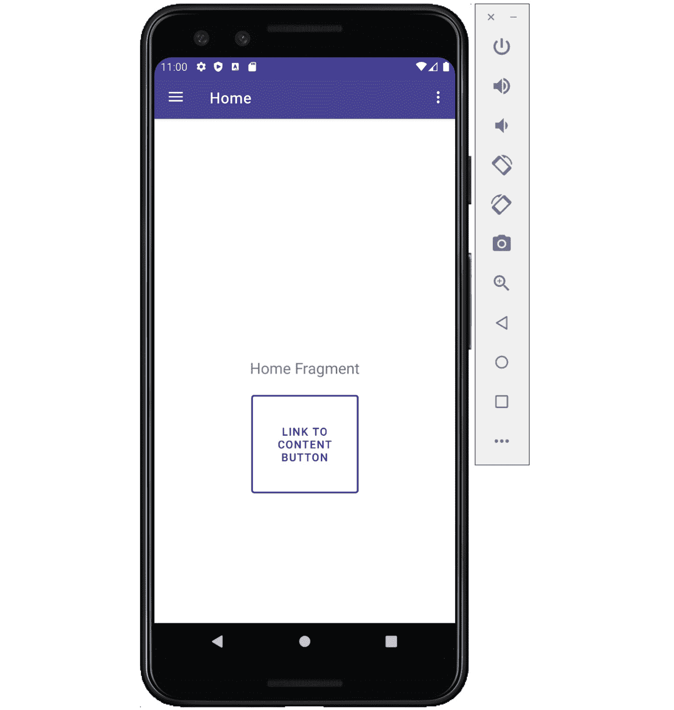

图 4.1：导航抽屉关闭的应用程序

导航抽屉是通过通常被称为汉堡菜单的方式访问的，这是位于*图 4.1*左上角的具有三条水平线的图标。导航选项在屏幕上不可见，但有关您所在屏幕的上下文信息显示在顶部应用程序栏中。这也可以伴随着屏幕右侧的溢出菜单，通过它可以访问其他上下文相关的导航选项。以下截图显示了导航抽屉处于打开状态，显示了所有导航选项：


图 4.2：导航抽屉打开的应用程序

在选择汉堡菜单后，导航抽屉从左侧滑出，当前部分突出显示。这可以显示带有或不带有图标。由于导航占据屏幕的高度，最适合五个或更多个顶级目的地。目的地也可以分组在一起，以指示主要目的地的多个层次结构（如前面截图中的分隔线所示），这些层次结构也可以具有标签。此外，抽屉内容也是可滚动的。总之，导航抽屉是提供快速访问应用程序许多不同目的地的非常便利的方式。导航抽屉的一个弱点是，需要用户选择汉堡菜单才能使目的地可见。相比之下，选项卡和底部导航（带有固定选项卡）始终可见。这反过来也是导航抽屉的一个优点，因为可以使用更多的屏幕空间来显示应用程序的内容。

让我们开始本章的第一个练习，创建一个导航抽屉，以便我们可以访问应用程序的所有部分。

## 练习 4.01：创建带有导航抽屉的应用程序

在这个练习中，您将在 Android Studio 中创建一个名为`Navigation Drawer`的新应用程序，使用空活动项目模板，同时保留所有其他默认设置。有向导选项，您可以创建一个新项目，其中包含本章练习中要生成的所有导航模式，但我们将逐步构建应用程序，以指导您完成这些步骤。您将构建一个经常使用导航抽屉的应用程序，例如新闻或邮件应用程序。我们将添加的部分是`主页`、`收藏夹`、`最近`、`存档`、`回收站`和`设置`。

执行以下步骤完成此练习：

1.  使用空活动创建一个名为 Navigation Drawer 的新项目。不要使用`Navigation Drawer Activity`项目模板，因为我们将逐步构建应用程序。

1.  将您需要的 Gradle 依赖项添加到`app/build.gradle`中：

```kt
implementation   'androidx.navigation:navigation-fragment-ktx:2.3.2'
implementation 'androidx.navigation:navigation-ui-ktx:2.3.2'
```

1.  然后，添加/更新应用程序中需要的所有资源文件。首先将`dimens.xml`文件添加到`res/values`文件夹中：

**dimens.xml**

```kt
<?xml version="1.0" encoding="utf-8"?>
<resources>
    <dimen name="activity_horizontal_padding">16dp</dimen>
    <dimen name="activity_vertical_padding">16dp</dimen>
    <dimen name="nav_header_vertical_spacing">8dp</dimen>
    <dimen name="nav_header_height">176dp</dimen>
</resources>
```

1.  更新`strings.xml`，并在`res/values`文件夹中用以下内容替换`themes.xml`：

**strings.xml**

```kt
    <string name="nav_header_desc">Navigation header</string>
    <string name="home">Home</string>
    <string name="settings">Settings</string>
    <string name="content">Content</string>
    <string name="archive">Archive</string>
    <string name="recent">Recent</string>
    <string name="favorites">Favorites</string>
    <string name="bin">Bin</string>
    <string name="home_fragment">Home Fragment</string>
    <string name="settings_fragment">      Settings Fragment</string>
    <string name="content_fragment">Content Fragment</string>
    <string name="archive_fragment">Archive Fragment</string>
    <string name="recent_fragment">Recent Fragment</string>
    <string name="favorites_fragment">      Favorites Fragment</string>
    <string name="bin_fragment">Bin Fragment</string>
    <string name="link_to_content_button">      Link to Content Button</string>
```

**themes.xml**

```kt
<resources xmlns:tools="http://schemas.android.com/tools">
    <!-- Base application theme. -->
    <style name="Theme.NavigationDrawer" parent=      "Theme.MaterialComponents.DayNight.DarkActionBar">
        <!-- Primary brand color. -->
        <item name="colorPrimary">@color/purple_500</item>
        <item name="colorPrimaryVariant">          @color/purple_700</item>
        <item name="colorOnPrimary">@color/white</item>
        <!-- Secondary brand color. -->
        <item name="colorSecondary">@color/teal_200</item>
        <item name="colorSecondaryVariant">          @color/teal_700</item>
        <item name="colorOnSecondary">@color/black</item>
        <!-- Status bar color. -->
        <item name="windowActionBar">false</item>
        <item name="windowNoTitle">true</item>
        <!-- Customize your theme here. -->
    </style>
    <style name="Theme.NavigationDrawer.NoActionBar">
        <item name="windowActionBar">false</item>
        <item name="windowNoTitle">true</item>
    </style>
    <style name="Theme.NavigationDrawer.AppBarOverlay"       parent="ThemeOverlay.AppCompat.Dark.ActionBar" />
    <style name="Theme.NavigationDrawer.PopupOverlay"         parent="ThemeOverlay.AppCompat.Light" />
    <style name="button_card" parent=        "Widget.MaterialComponents.Button.OutlinedButton">
        <item name="strokeColor">@color/purple_700</item>
        <item name="strokeWidth">2dp</item>
    </style>
</resources>
```

1.  创建以下片段（`文件` | `新建` | `片段` | `片段（空白）`来自工具栏：）

+   `HomeFragment`

+   `FavoritesFragment`

+   `RecentFragment`

+   `ArchiveFragment`

+   `SettingsFragment`

+   `BinFragment`

+   `ContentFragment`

1.  更改每个片段布局以使用以下内容：

```kt
<?xml version="1.0" encoding="utf-8"?>
<androidx.constraintlayout.widget.ConstraintLayout   xmlns:android="http://schemas.android.com/apk/res/android"
    xmlns:app="http://schemas.android.com/apk/res-auto"
    android:layout_width="match_parent"
    android:layout_height="match_parent">
    <TextView
        android:layout_width="match_parent"
        android:layout_height="wrap_content"
        android:layout_marginStart="8dp"
        android:layout_marginTop="8dp"
        android:layout_marginBottom="8dp"
        android:layout_marginEnd="8dp"
        android:text="@string/archive_fragment"
        android:textAlignment="center"
        android:layout_gravity="center_horizontal"
        android:textSize="20sp"
        app:layout_constraintBottom_toBottomOf="parent"
        app:layout_constraintEnd_toEndOf="parent"
        app:layout_constraintStart_toStartOf="parent"
        app:layout_constraintTop_toTopOf="parent" />
</androidx.constraintlayout.widget.ConstraintLayout>
```

唯一的区别是`android:text`属性，它将具有来自`strings.xml`文件的相应字符串。因此，请使用正确的字符串创建这些片段，指示用户正在查看哪个片段。这可能看起来有点重复，一个单一的片段可以更新为此文本，但它演示了如何在真实的应用程序中分隔不同的部分。

1.  更新`fragment_home.xml`布局，向其中添加一个按钮（这是您可以在*图 4.1*中看到的主体内容，带有关闭的导航抽屉）：

```kt
<?xml version="1.0" encoding="utf-8"?>
<androidx.constraintlayout.widget.ConstraintLayout   xmlns:android="http://schemas.android.com/apk/res/android"
    xmlns:app="http://schemas.android.com/apk/res-auto"
    android:layout_width="match_parent"
    android:layout_height="match_parent">
    <TextView
        TextView is the same as what's specified in the other fragment layouts, except it has an ID (id) with which it constrains the button below it. 
```

1.  创建将在应用程序中使用的导航图。

选择`文件` | `新建` | `Android 资源文件`（确保在项目窗口中选择了 res 文件夹，以便看到此选项），或者右键单击 res 文件夹以查看此选项。选择`导航`作为资源类型，并将其命名为`mobile_navigation.xml`。

这将创建导航图：

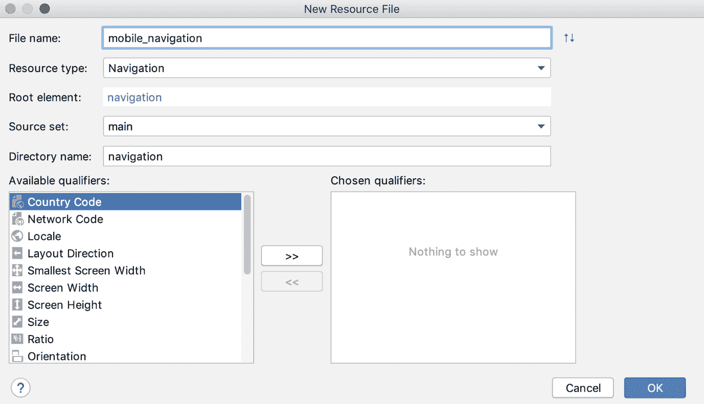 

1.  打开`res/navigation`文件夹中的`mobile_navigation.xml`文件，并使用下面链接中文件的代码进行更新。这里显示了代码的缩略版本。请查看链接以获取您需要使用的完整代码块：

```kt
mobile_navigation.xml   
8    <fragment   
9        android:id="@+id/nav_home"    
10        android:name="com.example.navigationdrawer                            .HomeFragment"    
11        android:label="@string/home"    
12        tools:layout="@layout/fragment_home">    
13        <action    
14            android:id="@+id/nav_home_to_content"    
15            app:destination="@id/nav_content"    
16            app:popUpTo="@id/nav_home" />    
17    </fragment>    
18    
19    <fragment    
20        android:id="@+id/nav_content"    
21        android:name="com.example.navigationdrawer                            .ContentFragment"    
22        android:label="@string/content"    
23        tools:layout="@layout/fragment_content" />    Th complete code for this step can be found at http://packt.live/38W9maC.    
```

这将创建应用程序中的所有目的地。但是，它没有指定这些是主要目的地还是次要目的地。这应该是您在上一章的 fragment Jetpack 导航练习中熟悉的。这里最重要的一点是`app:startDestination="@+id/nav_home`，它指定了导航加载时将显示的内容，并且在`HomeFragment`中有一个可用的操作，可以移动到图中的`nav_content`目的地：

```kt
        <action
            android:id="@+id/nav_home_to_content"
            app:destination="@id/nav_content"
            app:popUpTo="@id/nav_home" />    
```
    
现在，您将看到如何在`HomeFragment`及其布局中设置这些内容。1.  打开 fragment_home.xml 布局文件。然后通过在右上角选择“设计”选项来在设计视图中打开布局文件：


```kt
<style name="button_card"   parent="Widget.MaterialComponents.Button.OutlinedButton">
    <item name="strokeColor">@color/colorPrimary</item>
    <item name="strokeWidth">2dp</item>
</style>
```

1.  `打开 HomeFragment`并更新`onCreateView`以设置按钮：

`R.id.nav_home_to_content`操作当单击`button_home`时。

然而，这些更改目前还不会产生任何效果，因为您仍然需要为应用程序设置导航主机，并添加所有其他布局文件，以及导航抽屉。

1.  通过在布局文件夹中创建一个名为`content_main.xml`的新文件来创建一个`Nav`主机片段。这可以通过右键单击`res`目录中的`layout`文件夹，然后转到`文件`|`新建`|`布局资源文件`来完成。创建后，使用`FragmentContainerView`更新它：

```kt
<?xml version="1.0" encoding="utf-8"?>
<androidx.fragment.app.FragmentContainerView
    xmlns:android="http://schemas.android.com/apk/res/android"
    xmlns:app="http://schemas.android.com/apk/res-auto"
    android:id="@+id/nav_host_fragment"
    android:name="androidx.navigation.fragment       .NavHostFragment"
    android:layout_width="match_parent"
    android:layout_height="match_parent"
    app:defaultNavHost="true"
    app:navGraph="@navigation/mobile_navigation" />
```

1.  您会注意到导航图设置为您刚刚创建的图：

```kt
        app:navGraph="@navigation/mobile_navigation"
```

1.  有了这些，应用程序的主体和其目的地已经设置好了。现在，您需要设置 UI 导航。创建另一个布局资源文件，命名为`nav_header_main.xml`，并添加以下内容：

```kt
<?xml version="1.0" encoding="utf-8"?>
<LinearLayout   xmlns:android="http://schemas.android.com/apk/res/android"
    xmlns:app="http://schemas.android.com/apk/res-auto"
    android:layout_width="match_parent"
    android:layout_height="@dimen/nav_header_height"
    android:background="@color/teal_700"
    android:gravity="bottom"
    android:orientation="vertical"
    android:paddingLeft="@dimen/activity_horizontal_margin"
    android:paddingTop="@dimen/activity_vertical_margin"
    android:paddingRight="@dimen/activity_horizontal_margin"
    android:paddingBottom="@dimen/activity_vertical_margin"
    android:theme="@style/ThemeOverlay.AppCompat.Dark">
    <ImageView
        android:id="@+id/imageView"
        android:layout_width="wrap_content"
        android:layout_height="wrap_content"
        android:contentDescription="@string/nav_header_desc"
        android:paddingTop=          "@dimen/nav_header_vertical_spacing"
        app:srcCompat="@mipmap/ic_launcher_round" />
    <TextView
        android:layout_width="match_parent"
        android:layout_height="wrap_content"
        android:paddingTop=          "@dimen/nav_header_vertical_spacing"
        android:text="@string/app_name"
        android:textAppearance=          "@style/TextAppearance.AppCompat.Body1" />
</LinearLayout>
```

这是导航抽屉头部显示的布局。

1.  创建一个名为`app_bar_main.xml`的工具栏布局文件，并包含以下内容：

```kt
<?xml version="1.0" encoding="utf-8"?>
<androidx.coordinatorlayout.widget.CoordinatorLayout   xmlns:android="http://schemas.android.com/apk/res/android"
    xmlns:app="http://schemas.android.com/apk/res-auto"
    xmlns:tools="http://schemas.android.com/tools"
    android:layout_width="match_parent"
    android:layout_height="match_parent"
    tools:context=".MainActivity">
    <com.google.android.material.appbar.AppBarLayout
        android:layout_width="match_parent"
        android:layout_height="wrap_content"
        android:theme=          "@style/Theme.NavigationDrawer.AppBarOverlay">
        <androidx.appcompat.widget.Toolbar
            android:id="@+id/toolbar"
            android:layout_width="match_parent"
            android:layout_height="?attr/actionBarSize"
            android:background="?attr/colorPrimary"
            app:popupTheme=              "@style/Theme.NavigationDrawer.PopupOverlay" />
    </com.google.android.material.appbar.AppBarLayout>
    <include layout="@layout/content_main" />
</androidx.coordinatorlayout.widget.CoordinatorLayout>
```

这将应用程序的主体布局与出现在其上方的应用栏集成起来。剩下的部分是创建将出现在导航抽屉中的项目，并创建和填充这些项目的导航抽屉。

1.  要在这些菜单项目中使用图标，您需要将矢量资产复制到已完成练习的 drawable 文件夹中，然后将其复制到项目的 drawable 文件夹中。矢量资产使用点、线和曲线的坐标来布局带有相关颜色信息的图像。与 png 和 jpg 图像相比，它们的大小要小得多，并且可以在不损失质量的情况下调整大小。您可以在这里找到它们：[`packt.live/2XQnY5a`](http://packt.live/2XQnY5a

)

复制以下可绘制对象：

+   `favorites.xml`

+   `archive.xml`

+   `recent.xml`

+   `home.xml`

+   `bin.xml`

1.  这些图标将用于菜单项目。要创建自己的图标，请将`.svg`文件导入到 Android Studio 中，或者选择 Android Studio 捆绑的库存图像之一。要查看此操作，请转到`文件`|`新建`|`矢量资产`，并确保选择了`res`文件夹，以便这些菜单选项出现。以下是其中一个资产的示例（您可以选择“剪贴画”图标以查看其他图标）：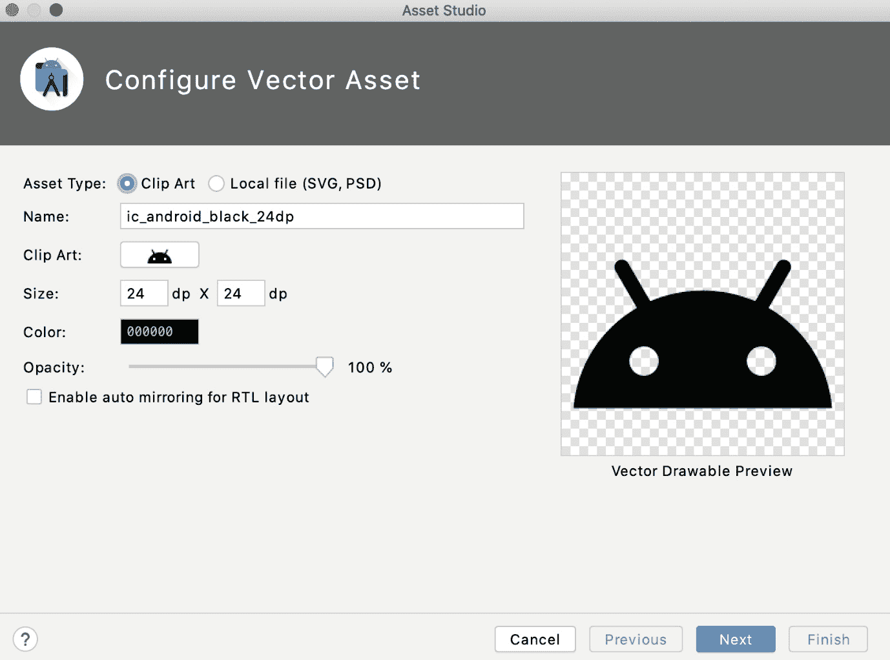

图 4.5：配置矢量资产

1.  使用本地文件选项导入`.svg`或`.psd`文件，或选择剪贴画以添加 Android Studio 图标之一。

1.  创建一个包含这些项目的菜单。要做到这一点，转到`文件`|`新建`|`Android 资源文件`，选择`菜单`作为资源类型，将其命名为`activity_main_drawer`，然后使用以下内容填充它：

```kt
<?xml version="1.0" encoding="utf-8"?>
<menu   xmlns:android="http://schemas.android.com/apk/res/android"
    xmlns:tools="http://schemas.android.com/tools"
    tools:showIn="navigation_view">
    <group
        android:id="@+id/menu_top"
        android:checkableBehavior="single">
        <item
            android:id="@+id/nav_home"
            android:icon="@drawable/home"
            android:title="@string/home" />
        <item
            android:id="@+id/nav_recent"
            android:icon="@drawable/recent"
            android:title="@string/recent" />
        <item
            android:id="@+id/nav_favorites"
            android:icon="@drawable/favorites"
            android:title="@string/favorites" />
    </group>
    <group
        android:id="@+id/menu_bottom"
        android:checkableBehavior="single">
        <item
            android:id="@+id/nav_archive"
            android:icon="@drawable/archive"
            android:title="@string/archive" />
        <item
            android:id="@+id/nav_bin"
            android:icon="@drawable/bin"
            android:title="@string/bin" />
    </group>
</menu>
```

这设置了将显示在导航抽屉中的菜单项。将菜单项与导航图中的目的地联系起来的魔法是 ID 的名称。如果菜单项（在`activity_main_drawer.xml`中）的 ID 与导航图中的目的地的 ID 完全匹配（在这种情况下是`mobile_navigation.xml`中的片段），则目的地将自动加载到导航主机中。

1.  `MainActivity`的布局将导航抽屉与先前指定的所有布局联系起来。打开`activity_main.xml`并使用以下内容进行更新：

```kt
<?xml version="1.0" encoding="utf-8"?>
<androidx.drawerlayout.widget.DrawerLayout   xmlns:android="http://schemas.android.com/apk/res/android"
    xmlns:app="http://schemas.android.com/apk/res-auto"
    xmlns:tools="http://schemas.android.com/tools"
    android:id="@+id/drawer_layout"
    android:layout_width="match_parent"
    android:layout_height="match_parent"
    android:fitsSystemWindows="true"
    tools:openDrawer="start">
    <include
        layout="@layout/app_bar_main"
        android:layout_width="match_parent"
        android:layout_height="match_parent" />
    <com.google.android.material.navigation.NavigationView
        android:id="@+id/nav_view"
        android:layout_width="wrap_content"
        android:layout_height="match_parent"
        android:layout_gravity="start"
        android:fitsSystemWindows="true"
        app:headerLayout="@layout/nav_header_main"
        app:menu="@menu/activity_main_drawer" />
</androidx.drawerlayout.widget.DrawerLayout>
```

1.  如您所见，有一个`include`用于添加`app_bar_main.xml`。`<include>`元素允许您添加在编译时将被实际布局替换的布局。它们允许我们封装不同的布局，因为它们可以在应用程序中的多个布局文件中重用。`NavigationView`（创建导航抽屉的类）指定了您刚刚创建的布局文件，以配置其标题和菜单项：

```kt
        app:headerLayout="@layout/nav_header_main"
        app:menu="@menu/activity_main_drawer"
```

1.  现在，您已经指定了所有的布局文件，通过添加以下交互逻辑来更新`MainActivity`：

```kt
package com.example.navigationdrawer
import android.os.Bundle
import androidx.appcompat.app.AppCompatActivity
import androidx.navigation.findNavController
import androidx.navigation.fragment.NavHostFragment
import androidx.navigation.ui.*
import com.google.android.material.navigation.NavigationView
class MainActivity : AppCompatActivity() {
    private lateinit var appBarConfiguration:       AppBarConfiguration
    override fun onCreate(savedInstanceState: Bundle?) {
        super.onCreate(savedInstanceState)
        setContentView(R.layout.activity_main)
        setSupportActionBar(findViewById(R.id.toolbar))
        val navHostFragment = supportFragmentManager           .findFragmentById(R.id.nav_host_fragment) as             NavHostFragment
        val navController = navHostFragment.navController
        //Creating top level destinations 
        //and adding them to the draw
        appBarConfiguration = AppBarConfiguration(
            setOf(
                R.id.nav_home, R.id.nav_recent,                   R.id.nav_favorites, R.id.nav_archive,                     R.id.nav_bin
            ), findViewById(R.id.drawer_layout)
        )
        setupActionBarWithNavController(navController,           appBarConfiguration)
        findViewById<NavigationView>(R.id.nav_view)          ?.setupWithNavController(navController)
    }
    override fun onSupportNavigateUp(): Boolean {
        val navController =           findNavController(R.id.nav_host_fragment)
        return navController.navigateUp(appBarConfiguration)           || super.onSupportNavigateUp()
    }
}
```

现在，让我们来看一下前面的代码。`setSupportActionBar(toolbar)`通过引用布局中的工具栏并设置它来配置应用中使用的工具栏。使用以下代码检索`NavHostFragment`：

```kt
        val navHostFragment = supportFragmentManager
          .findFragmentById(R.id.nav_host_fragment) as             NavHostFragment
        val navController = navHostFragment.navController
```

接下来，您可以添加要在导航抽屉中显示的菜单项：

```kt
appBarConfiguration = AppBarConfiguration(
    setOf(
        R.id.nav_home, R.id.nav_recent, R.id.nav_favorites,           R.id.nav_archive, R.id.nav_bin
    ), findViewById(R.id.drawer_layout)
)
```

`drawer_layout`是`nav_view`、主应用栏及其包含的内容的容器。

这可能看起来像是在做两次，因为这些项目显示在导航抽屉的`activity_main_drawer.xml`菜单中。但是，在`AppBarConfiguration`中设置这些主要目的地的功能是，当它们被选中时，它们不会显示向上箭头，因为它们处于顶层。它还将`drawer_layout`作为最后一个参数添加，以指定在选择汉堡菜单以在导航抽屉中显示时应使用哪个布局。

下一行是：

```kt
setupActionBarWithNavController(navController,   appBarConfiguration)
```

这将使用导航图设置应用栏，以便对目的地进行的任何更改都会反映在应用栏中：

```kt
findViewById<NavigationView>  (R.id.nav_view)?.setupWithNavController(navController)
```

这是`onCreate`中的最后一条语句，它指定了在用户点击时应突出显示导航抽屉中的项目。

类中的下一个函数处理按下次要目的地的向上按钮，确保它返回到其父级主要目的地：

```kt
override fun onSupportNavigateUp(): Boolean {
    val navController =       findNavController(R.id.nav_host_fragment)
    return navController.navigateUp(appBarConfiguration) ||       super.onSupportNavigateUp()
}
```

应用栏还可以通过溢出菜单显示其他菜单项，配置后，它会显示在右上方的三个垂直点中。查看`menu/main.xml`文件：

```kt
<?xml version="1.0" encoding="utf-8"?>
<menu   xmlns:android="http://schemas.android.com/apk/res/android"
    xmlns:app="http://schemas.android.com/apk/res-auto">
    <item
        android:id="@+id/nav_settings"
        android:title="@string/settings"
        app:showAsAction="never" />
</menu>
```

此配置显示一个项目：`设置`。由于它指定了与导航图中的`SettingsFragment`目的地相同的 ID，`android:id="@+id/nav_settings"`，它将打开`SettingsFragment`。将属性设置为`app:showAsAction="never"`可确保它保持为三个点溢出菜单中的菜单选项，并且不会出现在应用栏本身上。`app:showAsAction`的其他值可以将菜单选项设置为始终出现在应用栏上，如果有空间的话。在这里查看完整列表：[`developer.android.com/guide/topics/resources/menu-resource`](https://developer.android.com/guide/topics/resources/menu-resource)。

1.  要将溢出菜单添加到应用栏，请将以下内容添加到`MainActivity`类中：

```kt
override fun onCreateOptionsMenu(menu: Menu): Boolean {
    menuInflater.inflate(R.menu.main, menu)
    return true
}
override fun onOptionsItemSelected(item: MenuItem): Boolean {
    return item.onNavDestinationSelected(findNavController       (R.id.nav_host_fragment))
}
```

您还需要添加以下导入项：

```kt
import android.view.Menu
import android.view.MenuItem
```

`onCreateOptionsMenu`函数选择要添加到应用栏的菜单，而`onOptionsItemSelected`处理当使用`item.onNavDestinationSelected(findNavController(R.id.nav_host_fragment))`导航函数选择项目时要执行的操作。这用于导航到导航图中的目的地。

1.  运行应用程序，并使用导航抽屉导航到顶级目的地。以下屏幕截图显示了导航到“最近”目的地的示例：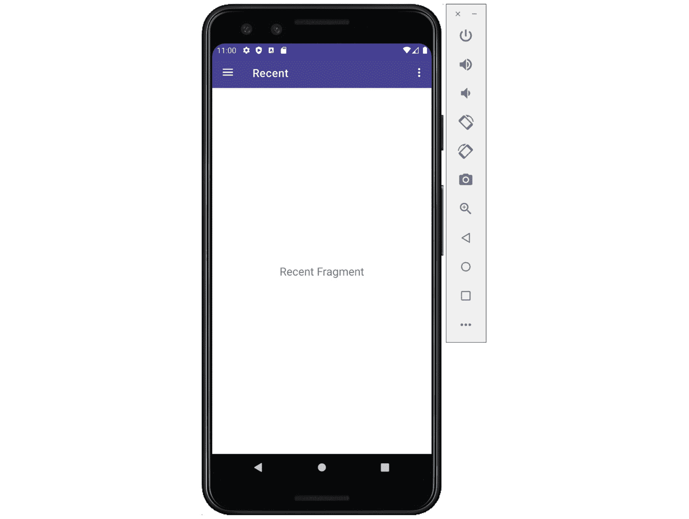

图 4.6：从导航抽屉中打开的最近菜单项

1.  当您再次选择导航抽屉以切换它时，您将看到“最近”菜单项被选中：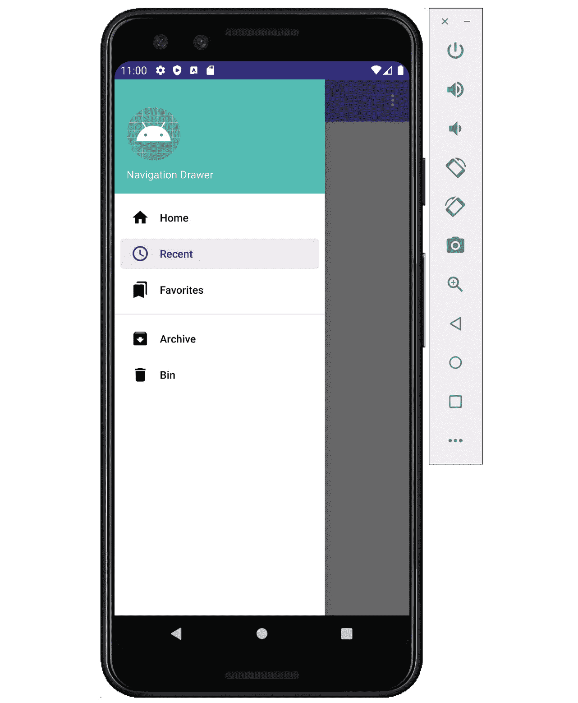

图 4.7：导航抽屉中突出显示的最近菜单项

1.  再次选择“主页”菜单项。此屏幕显示了一个链接，该链接位于材料主题按钮中，指向次要内容目的地。当您选择按钮时，一个漂亮的材料动画将从按钮中心向外部发散：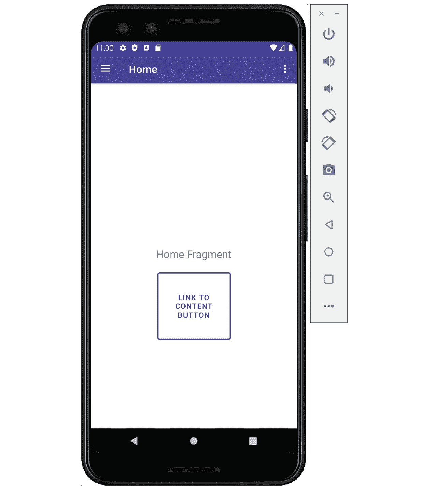

图 4.8：带有指向次要目的地的按钮的主屏幕

1.  单击此按钮以转到次要目的地。您将看到一个向上箭头被显示：

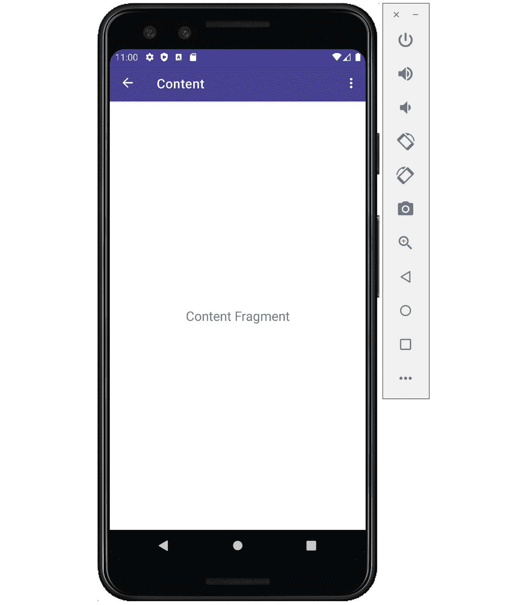

图 4.9：显示带有向上箭头的次要目的地

在所有先前的屏幕截图中，都显示了溢出菜单。选择它后，您将看到“设置”选项出现。按下它后，您将进入`SettingsFragment`，并显示向上箭头：

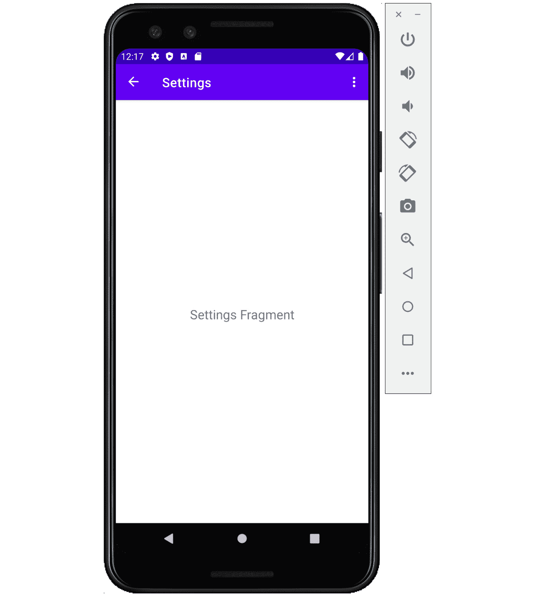

图 4.10：设置片段

虽然设置带有导航抽屉的应用程序需要经历相当多的步骤，但一旦创建，它就非常灵活。通过向抽屉菜单添加菜单项条目和向导航图添加目的地，可以立即创建新的片段并设置好以供使用。这消除了在上一章中使用片段时需要使用的大量样板代码。您将要探索的下一个导航模式是底部导航。这已经成为 Android 中最流行的导航模式，主要是因为它使应用程序的主要部分易于访问。

# 底部导航

当顶级目的地数量有限且彼此不相关时，将使用底部导航，这些目的地可以是三到五个主要目的地。底部导航栏上的每个项目都显示一个图标和一个可选的文本标签。这种导航允许快速访问，因为这些项目始终可用，无论用户导航到应用程序的哪个次要目的地。

## 练习 4.02：向应用程序添加底部导航

在 Android Studio 中创建一个名为“底部导航”的新应用程序，使用“空活动”项目模板，将所有其他默认设置保持不变。不要使用“底部导航活动”项目模板，因为我们将逐步构建应用程序。您将构建一个忠诚度应用程序，为已注册使用该应用程序的客户提供优惠、奖励等。对于这种类型的应用程序，底部导航是非常常见的，因为通常会有有限的顶级目的地。让我们开始吧：

1.  许多步骤与上一个练习非常相似，因为您将使用 Jetpack 导航并在导航图和相应菜单中定义目的地。

1.  使用“导航抽屉”创建一个新项目，使用“空活动”命名。

1.  将您需要的 Gradle 依赖项添加到`app/build.gradle`中：

```kt
implementation 'androidx.navigation:navigation-fragment-  ktx:2.3.2'
implementation 'androidx.navigation:navigation-ui-ktx:2.3.2'
```

1.  用以下内容替换`colors.xml`：

```kt
<?xml version="1.0" encoding="utf-8"?>
<resources>
    <color name="colorPrimary">#6200EE</color>
    <color name="colorPrimaryDark">#3700B3</color>
    <color name="colorAccent">#03DAC5</color>
</resources>
```

1.  在`res/values`文件夹中附加`strings.xml`和`themes.xml`与以下值：

**strings.xml**

```kt
    <!-- Bottom Navigation -->
    <string name="home">Home</string>
    <string name="tickets">Tickets</string>
    <string name="offers">Offers</string>
    <string name="rewards">Rewards</string>
    <!-- Action Bar -->
    <string name="settings">Settings</string>
    <string name="cart">Shopping Cart</string>
    <string name="content">Content</string>
    <string name="home_fragment">Home Fragment</string>
    <string name="tickets_fragment">Tickets Fragment</string>
    <string name="offers_fragment">Offers Fragment</string>
    <string name="rewards_fragment">Rewards Fragment</string>
    <string name="settings_fragment">      Settings Fragment</string>
    <string name="cart_fragment">      Shopping Cart Fragment</string>
    <string name="content_fragment">Content Fragment</string>
    <string name="link_to_content_button">      Link to Content Button</string>
```

**themes.xml**

```kt
    <style name="button_card" parent=      "Widget.MaterialComponents.Button.OutlinedButton">
        <item name="strokeColor">@color/colorPrimary</item>
        <item name="strokeWidth">2dp</item>
        <item name="android:textColor">          @color/colorPrimary</item>
    </style>
```

您在此处使用了与上一个练习中用于创建主屏幕按钮的相同材料样式。

1.  创建八个片段，名称如下：

+   `HomeFragment`

+   `ContentFragment`

+   `OffersFragment`

+   `RewardsFragment`

+   `SettingsFragment`

+   `TicketsFragment`

+   `CartFragment`

1.  应用与之前练习中应用的相同布局，为所有片段添加相应的字符串资源，除了`fragment_home.xml`。对于此布局，请使用在之前练习中使用的相同布局文件。

1.  创建导航图，就像在上一个练习中一样，并将其命名为`mobile_navigation`。使用下面链接文件中的代码进行更新。以下是代码的截断片段。点击链接查看完整的代码：

**mobile_navigation.xml**

```kt
8    <fragment
9        android:id="@+id/nav_home"
10        android:name="com.example.bottomnavigation                            .HomeFragment"
11        android:label="@string/home"
12        tools:layout="@layout/fragment_home">
13
14        <action
15            android:id="@+id/nav_home_to_content"
16            app:destination="@id/nav_content"
17            app:popUpTo="@id/nav_home" />
18    </fragment>
19
20    <fragment
21        android:id="@+id/nav_content"
22        android:name="com.example.bottomnavigation                            .ContentFragment"
23        android:label="@string/content"
24        tools:layout="@layout/fragment_content" />
The complete code for this step can be found at http://packt.live/2KrgcLV.
```

1.  更新`HomeFragment`中的`onCreateView`函数，以使用导航图中的目的地导航到`ContentFragment`。您还需要添加以下导入：

```kt
import android.widget.Button
import androidx.navigation.Navigation
    override fun onCreateView(
    inflater: LayoutInflater,
    container: ViewGroup?,
    savedInstanceState: Bundle?
): View? {
    val view = inflater.inflate(R.layout.fragment_home,       container, false)
    view.findViewById<Button>(R.id.button_home)      ?.setOnClickListener(
        Navigation.createNavigateOnClickListener           (R.id.nav_home_to_content, null)
    )
    return view
}
```

1.  现在导航图中已经定义了目的地，创建底部导航中的菜单以引用这些目的地。但首先，您需要收集将在此练习中使用的图标。转到 GitHub 上的已完成练习，并在`drawable`文件夹中找到矢量资产：

[`packt.live/3qvUzJQ`](http://packt.live/3qvUzJQ)

复制以下可绘制对象：

+   `cart.xml`

+   `home.xml`

+   `offers.xml`

+   `rewards.xml`

+   `tickets.xml`

1.  创建一个`bottom_nav_menu`（右键单击`res`文件夹，选择`Android 资源文件`，并选择`Menu`，使用除`cart.xml`矢量资产之外的所有这些图标。请注意，项目的 ID 与导航图中的 ID 匹配。

**bottom_nav_menu.xml**

```kt
<?xml version="1.0" encoding="utf-8"?>
<menu   xmlns:android="http://schemas.android.com/apk/res/android">
    <item
        android:id="@+id/nav_home"
        android:icon="@drawable/home"
        android:title="@string/home" />
    <item
        android:id="@+id/nav_tickets"
        android:icon="@drawable/tickets"
        android:title="@string/tickets"/>
    <item
        android:id="@+id/nav_offers"
        android:icon="@drawable/offers"
        android:title="@string/offers" />
    <item
        android:id="@+id/nav_rewards"
        android:icon="@drawable/rewards"
        android:title="@string/rewards"/>
</menu>
```

1.  使用以下内容更新`activity_main.xml`文件：

`BottomNavigation`视图配置了您之前创建的菜单，即`app:menu="@menu/bottom_nav_menu"`，而`NavHostFragment`配置了`app:navGraph="@navigation/mobile_navigation"`。由于应用程序中的底部导航不直接连接到应用栏，因此需要设置的布局文件较少。这与导航抽屉不同，导航抽屉在应用栏中有汉堡菜单来切换导航抽屉。

1.  使用以下内容更新`MainActivity`：

```kt
package com.example.bottomnavigation
import android.os.Bundle
import androidx.appcompat.app.AppCompatActivity
import androidx.navigation.findNavController
import androidx.navigation.fragment.NavHostFragment
import androidx.navigation.ui.*
import com.google.android.material.bottomnavigation
  .BottomNavigationView
class MainActivity : AppCompatActivity() {
    private lateinit var appBarConfiguration:       AppBarConfiguration
    override fun onCreate(savedInstanceState: Bundle?) {
        super.onCreate(savedInstanceState)
        setContentView(R.layout.activity_main)
    val navHostFragment =       supportFragmentManager.findFragmentById         (R.id.nav_host_fragment) as NavHostFragment
    val navController = navHostFragment.navController
        //Creating top level destinations 
        //and adding them to bottom navigation
        appBarConfiguration = AppBarConfiguration(setOf(
            R.id.nav_home, R.id.nav_tickets, R.id.nav_offers,               R.id.nav_rewards))
        setupActionBarWithNavController(navController,           appBarConfiguration)
        findViewById<BottomNavigationView>(R.id.nav_view)          ?.setupWithNavController(navController)
    }
    override fun onSupportNavigateUp(): Boolean {
        val navController           = findNavController(R.id.nav_host_fragment)
        return navController.navigateUp(appBarConfiguration)           || super.onSupportNavigateUp()
    }
}
```

前面的代码应该非常熟悉，因为它在之前的练习中已经解释过了。这里的主要变化是，不再使用包含导航抽屉的主 UI 导航的`NavigationView`，而是用`BottomNavigationView`替换。此后的配置是相同的。

1.  运行应用程序。您应该看到以下输出：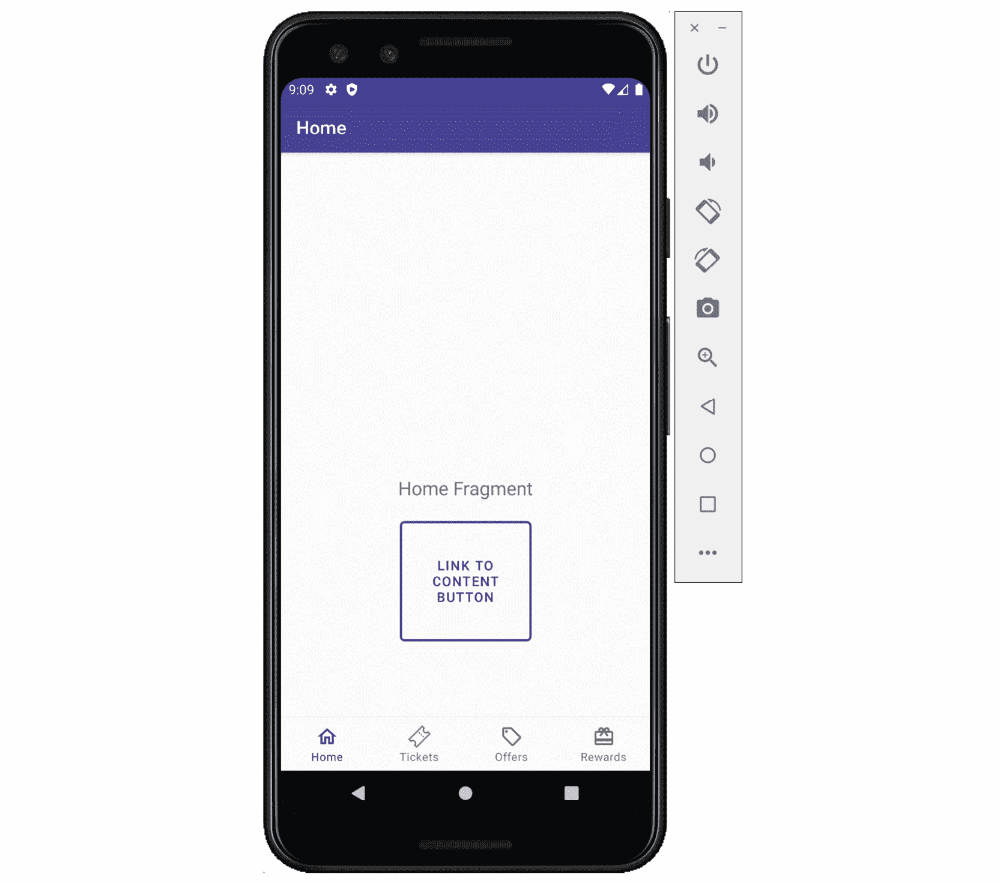

图 4.11：底部导航，选择了主页

1.  显示了您设置的四个菜单项，其中`Home`项被选择为起始目的地。单击方形按钮将带您到`Home`内的次要目的地：

图 4.12：Home 内的次要目的地

1.  使这成为可能的操作在导航图中指定：

**mobile_navigation.xml（片段）**

```kt
<fragment
    android:id="@+id/nav_home"
    android:name="com.example.bottomnavigation.HomeFragment"
    android:label="@string/home"
    tools:layout="@layout/fragment_home">
    <action
        android:id="@+id/nav_home_to_content"
        app:destination="@id/nav_content"
        app:popUpTo="@id/nav_home" />
</fragment>
```

1.  由于底部导航 UI 中没有汉堡菜单，有时会将操作项（具有专用图标的项）添加到应用栏中。创建另一个名为`Main`的菜单，并添加以下内容：

**main.xml**

```kt
<?xml version="1.0" encoding="utf-8"?>
<menu   xmlns:android="http://schemas.android.com/apk/res/android"
    xmlns:app="http://schemas.android.com/apk/res-auto">
    <item
        android:id="@+id/nav_cart"
        android:title="@string/cart"
        android:icon="@drawable/cart"
        app:showAsAction="always" />
    <item
        android:id="@+id/nav_settings"
        android:title="@string/settings"
        app:showAsAction="never" />
</menu>
```

1.  此菜单将在应用栏中的溢出菜单中使用。单击三个点时，将显示溢出菜单。`cart`矢量资产也将显示在顶部应用栏上，因为`app:showAsAction`属性设置为`always`。通过添加以下内容在`MainActivity`中配置溢出菜单：

在文件顶部添加以下两个导入：

```kt
import android.view.Menu
import android.view.MenuItem
```

然后添加以下两个函数：

```kt
override fun onCreateOptionsMenu(menu: Menu): Boolean {
    menuInflater.inflate(R.menu.main, menu)
    return true
}
override fun onOptionsItemSelected(item: MenuItem): Boolean {
    super.onOptionsItemSelected(item)
    return item.onNavDestinationSelected(findNavController       (R.id.nav_host_fragment))
}
```

1.  现在将在应用栏中显示主菜单。再次运行应用程序，您将看到以下内容：

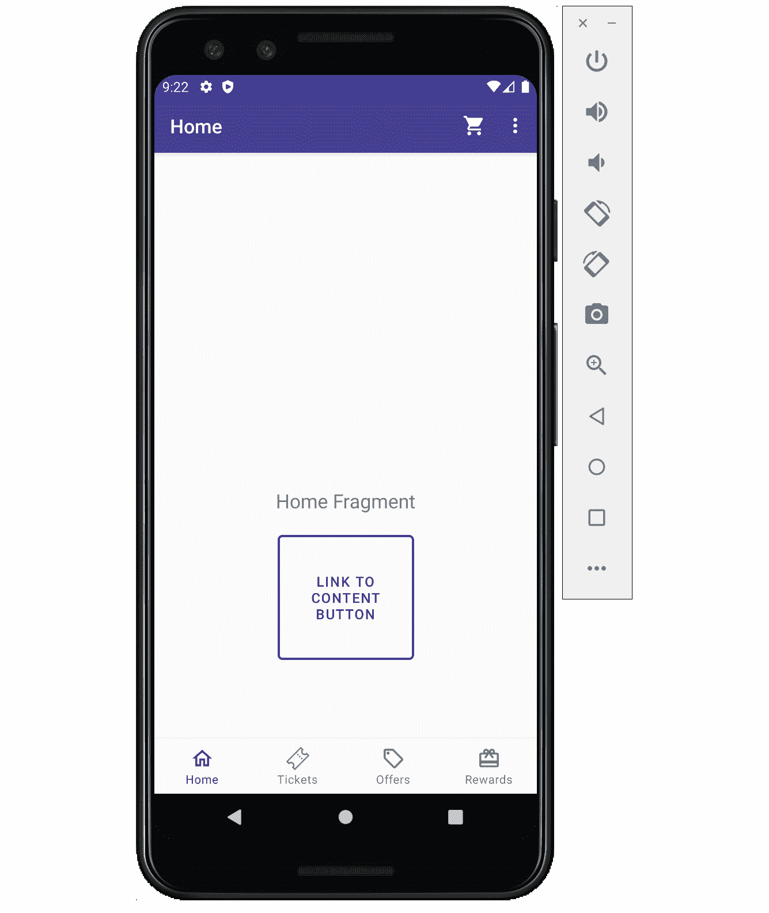

图 4.13：带有溢出菜单的底部导航

选择购物车将带您到我们在导航图中配置的次要目的地：

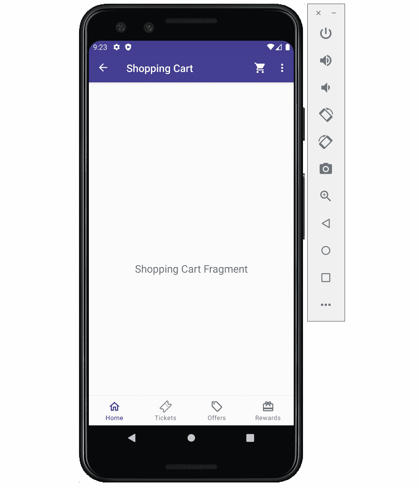

图 4.14：底部导航与次要目的地中的溢出菜单

正如您在本练习中所见，设置底部导航非常简单。导航图和菜单设置使将菜单项链接到片段变得简单。此外，集成操作栏和溢出菜单也是实现的小步骤。如果您正在开发一个具有非常明确定义的顶级目的地并且在它们之间切换很重要的应用程序，那么这些目的地的可见性使底部导航成为理想选择。要探索的最终主要导航模式是选项卡导航。这是一种多功能模式，因为它可以用作应用程序的主要导航，但也可以与我们学习过的其他导航模式一起用作次要导航。

# 选项卡导航

选项卡导航主要用于显示相关项目。如果只有少量选项卡（通常在两个到五个选项卡之间），通常会使用固定选项卡，如果有超过五个选项卡，则会使用水平滚动选项卡。它们主要用于对处于相同层次结构级别的目的地进行分组。

如果目的地相关，这可以是主要导航。如果您开发的应用程序属于狭窄或特定主题领域，其中主要目的地相关，比如新闻应用程序，这可能是情况。更常见的是，它与底部导航一起使用，以呈现在主要目的地内可用的次要导航。以下练习演示了使用选项卡导航来显示相关项目。

## 练习 4.03：使用选项卡进行应用程序导航

在 Android Studio 中创建一个名为`Tab Navigation`的空活动的新应用程序。您将构建一个显示电影类型的骨架电影应用程序。让我们开始吧：

1.  替换`res/values`文件夹中的`strings.xml`内容并更新`themes.xml`：

`<string name="dummy_text">`文件提供了每个电影类型的一些正文文本：

**themes.xml**

```kt
<resources xmlns:tools="http://schemas.android.com/tools">
    <!-- Base application theme. -->
    <style name="Theme.TabNavigation"       parent="Theme.AppCompat.DayNight.DarkActionBar">
        <!-- Primary brand color. -->
        <item name="colorPrimary">@color/purple_500</item>
        <item name="colorPrimaryVariant">          @color/purple_700</item>
        <item name="colorOnPrimary">@color/white</item>
        <!-- Secondary brand color. -->
        <item name="colorSecondary">@color/teal_200</item>
        <item name="colorSecondaryVariant">          @color/teal_700</item>
        <item name="colorOnSecondary">@color/black</item>
        <!-- Customize your theme here. -->
        <item name="windowActionBar">false</item>
        <item name="windowNoTitle">true</item>
        <!-- Status bar color. -->
        <item name="android:statusBarColor"           tools:targetApi="l">?attr/colorPrimaryVariant</item>
    </style>
    <style name="Theme.TabNavigation.AppBarOverlay"       parent="ThemeOverlay.AppCompat.Dark.ActionBar" />
    <style name="Theme.TabNavigation.PopupOverlay"       parent="ThemeOverlay.AppCompat.Light" />
    <style name="title" >
        <item name="android:textSize">24sp</item>
        <item name="android:textStyle">bold</item>
    </style>
    <style name="body" >
        <item name="android:textSize">16sp</item>
    </style>
</resources>
```

1.  创建一个名为`MoviesFragment`的单个片段，显示电影类型的标题和一些虚拟文本。标题将动态更新。然后更新电影片段布局：

在`fragment_movies`布局中，具有 ID 为`movie_type`的`TextView`标签将动态更新为标题。您添加到`strings.xml`文件中的虚拟文本将显示在其下方。

1.  使用以下内容更新`MoviesFragment`：

`MoviesFragment`。由于这是从伴随对象完成的，因此可以直接从另一个类中使用静态语法引用，例如`MoviesFragment.newInstance`(`movieGenre`)。第二点是工厂方法将`MOVIE_GENRE`键设置为`Bundle`参数，并将`movieGenre`字符串设置为`Bundle`参数，以便以后可以从`MoviesFragment`中检索它。

1.  使用以下内容更新`activity_main.xml`文件：

```kt
<?xml version="1.0" encoding="utf-8"?>
<androidx.coordinatorlayout.widget.CoordinatorLayout   xmlns:android="http://schemas.android.com/apk/res/android"
    xmlns:app="http://schemas.android.com/apk/res-auto"
    xmlns:tools="http://schemas.android.com/tools"
    android:layout_width="match_parent"
    android:layout_height="match_parent"
    tools:context=".MainActivity">
    <com.google.android.material.appbar.AppBarLayout
        android:layout_width="match_parent"
        android:layout_height="wrap_content"
        android:theme           ="@style/Theme.TabNavigation.AppBarOverlay">
        <androidx.appcompat.widget.Toolbar
            android:id="@+id/toolbar"
            android:layout_width="match_parent"
            android:layout_height="?attr/actionBarSize"
            android:background="?attr/colorPrimary"
            app:popupTheme               ="@style/Theme.TabNavigation.PopupOverlay"/>
        <com.google.android.material.tabs.TabLayout
            android:id="@+id/tabs"
            android:layout_width="match_parent"
            android:layout_height="wrap_content"
            app:tabIndicatorHeight="4dp"
            app:tabIndicatorColor="@color/teal_200"
            app:tabRippleColor="@android:color/transparent"
            android:background="?attr/colorPrimary" />
    </com.google.android.material.appbar.AppBarLayout>
    <androidx.viewpager.widget.ViewPager
        android:id="@+id/view_pager"
        android:layout_width="match_parent"
        android:layout_height="match_parent"
        app:layout_behavior="@string/appbar_scrolling_view_behavior" />
</androidx.coordinatorlayout.widget.CoordinatorLayout>
```

`AppBarLayout`标签和其中包含的工具栏在以前的练习中已经很熟悉了。在工具栏下方，显示了一个`TabLayout`标签，其中将包含电影选项卡。您可以使用各种属性来设置选项卡的样式。在这里，您正在设置选项卡的高度、颜色和材料涟漪效果为透明，以不显示正常的材料样式按钮。为了显示所需的内容，您将使用`ViewPager`。`ViewPager`是一个可滑动的布局，允许您添加多个视图或片段，以便当用户滑动以更改其中一个选项卡时，正文内容显示相应的视图或片段。在本练习中，您将在电影片段之间滑动。提供在`ViewPager`中使用的数据的组件称为适配器。

1.  创建一个简单的适配器，用于显示我们的电影。将其命名为`MovieGenresPagerAdapter`：

```kt
package com.example.tabnavigation
import android.content.Context
import androidx.fragment.app.Fragment
import androidx.fragment.app.FragmentManager
import androidx.fragment.app.FragmentPagerAdapter
    private val TAB_GENRES_SCROLLABLE = listOf(
        R.string.action,
        R.string.comedy,
        R.string.drama,
        R.string.sci_fi,
        R.string.family,
        R.string.crime,
        R.string.history
)
private val TAB_GENRES_FIXED = listOf(
    R.string.action,
    R.string.comedy,
    R.string.drama
)
class MovieGenresPagerAdapter(private val context: Context,   fm: FragmentManager)
: FragmentPagerAdapter(fm,   BEHAVIOR_RESUME_ONLY_CURRENT_FRAGMENT) {
    override fun getItem(position: Int): Fragment {
        return MoviesFragment.newInstance(context.resources           .getString(TAB_GENRES_FIXED[position]))
    }
    override fun getPageTitle(position: Int): CharSequence? {
        return context.resources           .getString(TAB_GENRES_FIXED[position])
    }
    override fun getCount(): Int {
        // Show total pages.
        return TAB_GENRES_FIXED.size
    }
}
```

首先，看一下`MovieGenresPagerAdapter`类头部。它扩展自`FragmentPagerAdapter`，这是专门用于滑动的适配器。这也称为通过片段进行分页。当您有一组不太大的定义的片段时，使用`FragmentPagerAdapter`是理想的。由于您将其用于一组选项卡，这是理想的。

由于`FragmentPagerAdapter`在不在屏幕上时保留片段在内存中，因此不适用于大量片段。在这种情况下，您将使用`FragmentStatePagerAdpater`，它可以在不在屏幕上时回收片段。

创建`FragmentPagerAdapter`时，传入一个`FragmentManager`，负责管理活动中使用的片段。`BEHAVIOR_RESUME_ONLY_CURRENT_FRAGMENT`标志只保留当前片段处于用户可交互状态（`RESUMED`）的状态。其他片段处于`STARTED`状态，这意味着它们可以在滑动时可见，但不活动。

回调方法的功能如下：

+   `getCount()`: 此方法返回要显示的项目总数。

+   `getPageTitle(position: Int): CharSequence?`: 这通过使用特定位置检索列表中指定位置的流派标题。

+   `getItem(position: Int): Fragment`: 这在列表中的此位置获取`MoviesFragment`（或者如果首次访问，则创建新的`MoviesFragment`），通过传入要在片段中显示的流派标题。创建后，`MoviesFragment`将保留在内存中。

选项卡可以是固定的或可滚动的。您将看到的第一个示例是带有固定选项卡的。由于所有这些方法都使用了`TAB_GENRES_FIXED`，因此只会显示三个选项卡。但是，这并没有将`TabLayout`设置为固定或可滚动。这需要在活动中完成。

1.  更新`MainActivity`，使其使用带有`ViewPager`的选项卡：

```kt
package com.example.tabnavigation
import android.os.Bundle
import androidx.appcompat.app.AppCompatActivity
import androidx.viewpager.widget.ViewPager
import com.google.android.material.tabs.TabLayout
class MainActivity : AppCompatActivity() {
    override fun onCreate(savedInstanceState: Bundle?) {
        super.onCreate(savedInstanceState)
        setContentView(R.layout.activity_main)
        setSupportActionBar(findViewById(R.id.toolbar))
        val viewPager = findViewById<ViewPager>          (R.id.view_pager)
        val tabs = findViewById<TabLayout>(R.id.tabs)
        viewPager.adapter = MovieGenresPagerAdapter(this,           supportFragmentManager)
        tabs?.tabMode = TabLayout.MODE_FIXED
        tabs?.setupWithViewPager(viewPager)
    }
}
```

1.  在`onCreate`方法中，在设置布局之后，设置应用栏，使其使用工具栏：

```kt
setSupportActionBar(toolbar)
```

1.  设置要在可滑动的`ViewPager`中显示的数据，以来自`MovieGenresPagerAdapter`：

```kt
view_pager.adapter = MovieGenresPagerAdapter(this,   supportFragmentManager)
```

1.  设置`TabLayout`，以显示配置的`ViewPager`：

```kt
tabs?.tabMode = TabLayout.MODE_FIXED
tabs?.setupWithViewPager(viewPager)
```

1.  这负责设置选项卡标题并使选项卡主体内容可滑动。`tabMode`已设置为`FIXED`（`tabs.tabMode = TabLayout.MODE_FIXED`），以便选项卡将以与屏幕宽度相等的宽度均匀布局。现在运行应用程序。你应该看到以下内容：

图 4.15：带有固定选项卡的选项卡布局

您可以在页面的主体中左右滑动，以转到三个选项卡中的每一个，并且还可以选择其中一个选项卡来执行相同的操作。现在，让我们更改正在显示的选项卡数据，并设置选项卡，以便可以滚动浏览。

1.  首先，更改`MovieGenresPagerAdapter`，使其使用一些额外的流派：

```kt
class MovieGenresPagerAdapter(private val context: Context,   fm: FragmentManager)
: FragmentPagerAdapter(fm,   BEHAVIOR_RESUME_ONLY_CURRENT_FRAGMENT) {
    override fun getItem(position: Int): Fragment {
        return MoviesFragment.newInstance(context.resources           .getString(TAB_GENRES_SCROLLABLE[position]))
    }
    override fun getPageTitle(position: Int): CharSequence? {
        return context.resources           .getString(TAB_GENRES_SCROLLABLE[position])
    }
    override fun getCount(): Int {
        // Show total pages.
        return TAB_GENRES_SCROLLABLE.size
    }
}
```

1.  在`MainActivity`中，设置`tabMode`，使其可滚动：

```kt
tabs.tabMode = TabLayout.MODE_SCROLLABLE
```

1.  运行应用程序。你应该看到以下内容：

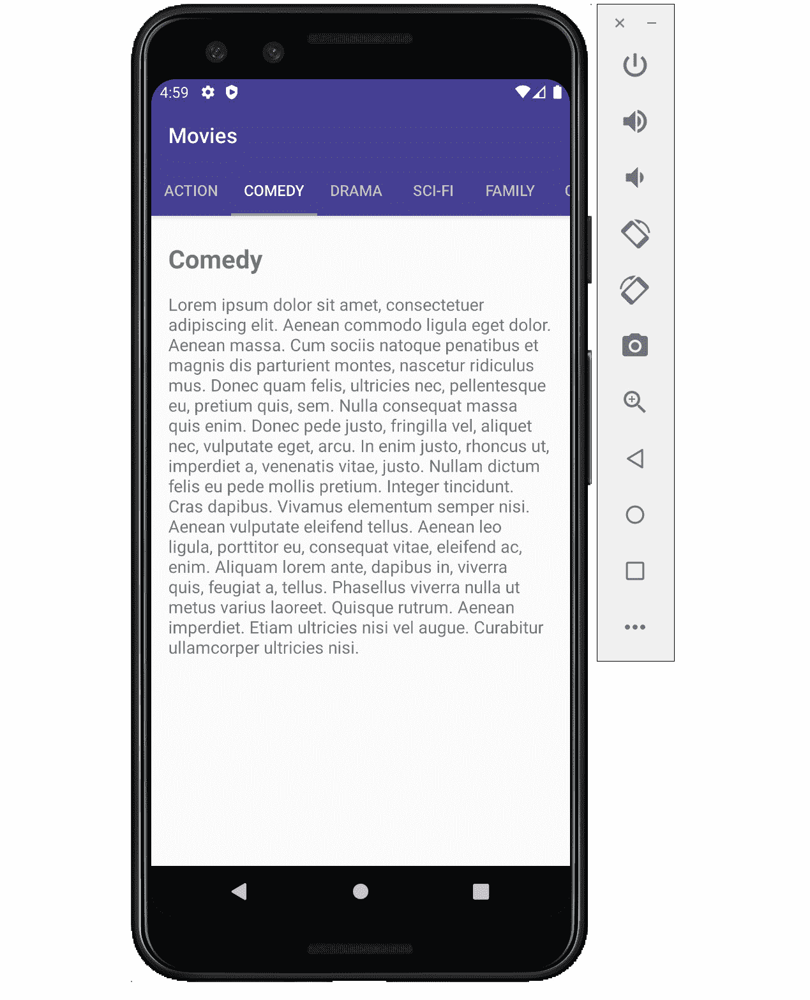

图 4.16：带有可滚动选项卡的选项卡布局

选项卡列表继续显示在屏幕外。可以滑动和选择选项卡，并且主体内容也可以滑动，这样你就可以通过选项卡页面左右移动。

通过这个练习，你学会了选项卡在应用程序中提供导航时的多功能性。固定宽度的选项卡可以用于主要和次要导航，而可滚动的选项卡可以用于将相关项目分组进行次要导航。可滚动选项卡充当次要导航，因此您还需要向应用程序添加主要导航。在这个例子中，出于简单起见，主要导航已被省略，但对于更真实世界和复杂的应用程序，您可以添加导航抽屉或底部导航。

## 活动 4.01：构建主要和次要应用程序导航

您的任务是创建一个体育应用程序。它可以有三个或更多的顶级目的地。但是，其中一个主要目的地必须称为“我的体育”，并且应链接到一个或多个次要目的地，即体育项目。您可以使用本章中探讨过的任何一种导航模式，或它们的组合，还可以引入您认为合适的任何自定义。用户当前所在的每个目的地都应显示在“应用”栏中。

有不同的方法可以尝试这个活动。一种方法是使用底部导航，并将各个次要体育目的地添加到导航图中，以便可以链接到这些目的地。这相当简单，并通过操作委托给导航图。使用此方法后，主屏幕应如下所示：


图 4.17：我的体育应用的底部导航

注意

此活动的解决方案可在以下网址找到：http://packt.live/3sKj1cp

本章中所有练习和活动的来源位于此处：[`packt.live/39IAjxL`](http://packt.live/39IAjxL)

# 总结

本章涵盖了您需要了解的最重要的导航技术，以便在应用程序中创建清晰和一致的导航。您首先学习了如何使用 Jetpack 导航在 Android Studio 项目中创建导航抽屉，将导航菜单项连接到单独的片段。然后，您进一步了解了 Jetpack 导航中的操作，以在导航图中导航到应用程序中的其他次要目的地。

接下来的练习使用底部导航来显示始终可见于屏幕上的主要导航目的地。然后我们看了标签式导航，您学会了如何显示固定和可滚动的标签。对于每种不同的导航模式，您都会看到在构建应用程序时何时更适合使用。我们通过构建我们自己的应用程序并添加主要和次要目的地来完成了本章。

本章建立在我们在*第一章*中提供的关于使用 Android Studio 创建 Android 的全面介绍的基础上，以及您在*第二章*和*第三章*中学到的有关活动和片段的知识，以及使用片段开发 UI 的知识。这些章节涵盖了您创建应用程序所需的知识、实践和基本 Android 组件。本章通过引导您了解可用的主要导航模式，将这些先前的章节联系在一起，使您的应用程序脱颖而出并易于使用。

下一章将在这些概念的基础上构建，并向您介绍更高级的显示应用内容的方法。您将首先学习使用`RecyclerView`将数据与列表绑定。之后，您将探索可以用于检索和填充应用程序内容的不同机制。
