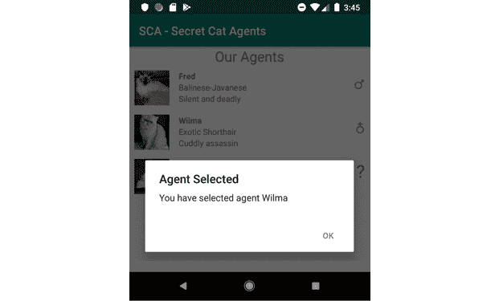
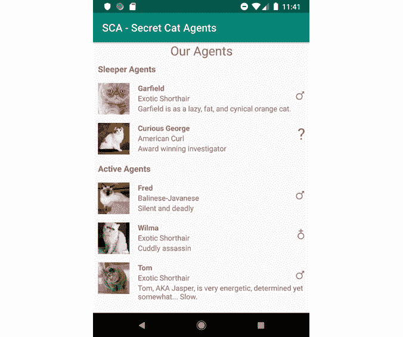
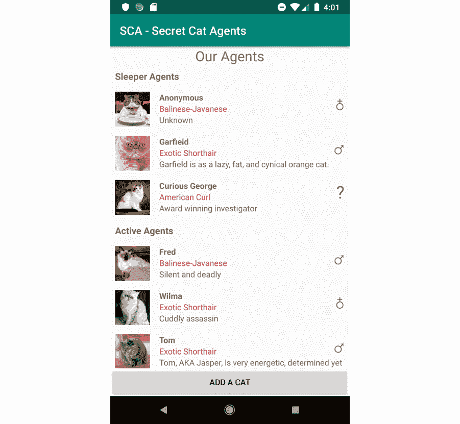

# 第六章：RecyclerView

概述

在这一章中，您将学习如何向您的应用程序添加项目列表和网格，并有效地利用`RecyclerView`的回收功能。您还将学习如何处理屏幕上项目视图的用户交互，并支持不同的项目视图类型，例如标题。在本章的后面，您将动态添加和删除项目。

通过本章结束时，您将具备呈现交互式丰富项目列表所需的技能。

# 介绍

在上一章中，我们学习了如何从 API 中获取数据，包括项目列表和图像 URL，并如何从 URL 加载图像。将这些知识与显示项目列表的能力结合起来是本章的目标。

通常，您会希望向用户呈现项目列表。例如，您可能希望向他们显示设备上的图片列表，或者让他们从所有国家的列表中选择自己的国家。为此，您需要填充多个视图，所有这些视图共享相同的布局，但呈现不同的内容。

在历史上，这是通过使用`ListView`或`GridView`来实现的。虽然这两者仍然是可行的选择，但它们不具备`RecyclerView`的健壮性和灵活性。例如，它们不太好地支持大型数据集，不支持水平滚动，并且不提供丰富的分隔符自定义。使用`RecyclerView.ItemDecorator`可以轻松实现对`RecyclerView`中项目之间的分隔符进行自定义。

那么，`RecyclerView`是做什么的呢？`RecyclerView`协调创建、填充和重用（因此得名）表示项目列表的视图。要使用`RecyclerView`，您需要熟悉其两个依赖项：适配器（以及通过它的视图持有者）和布局管理器。这些依赖项为我们的`RecyclerView`提供要显示的内容，并告诉它如何呈现该内容以及如何在屏幕上布置它。

适配器为`RecyclerView`提供子视图（`RecyclerView`中用于表示单个数据项的嵌套 Android 视图），绑定这些视图到数据（通过`ViewHolder`实例），并报告用户与这些视图的交互。布局管理器告诉`RecyclerView`如何布置其子项。我们默认提供了三种布局类型：线性、网格和交错网格，分别由`LinearLayoutManager`、`GridLayoutManager`和`StaggeredGridLayoutManager`管理。

在本章中，我们将开发一个列出秘密特工及其当前活动状态或休眠状态（因此不可用）的应用程序。然后，该应用程序将允许我们添加新特工或通过滑动将现有特工删除。不过，有一个转折，正如您在*第五章*中看到的，*基本库：Retrofit、Moshi 和 Glide*，我们所有的特工都将是猫。

# 将 RecyclerView 添加到我们的布局中

在*第三章*，*屏幕和 UI*中，我们看到了如何向我们的布局中添加视图，以便由活动、片段或自定义视图膨胀。`RecyclerView`只是另一个这样的视图。要将其添加到我们的布局中，我们需要向我们的布局添加以下标签：

```kt
<androidx.recyclerview.widget.RecyclerView
    android:id="@+id/recycler_view"
    android:layout_width="match_parent"
    android:layout_height="wrap_content"
    tools:listitem="@layout/item_sample" />
```

您应该已经能够识别`android:id`属性，以及`android:layout_width`和`android:layout_height`属性。

我们可以使用可选的`tools:listitem`属性告诉 Android Studio 在我们的预览工具栏中膨胀哪个布局作为列表项。这将让我们对`RecyclerView`在我们的应用程序中的外观有一个概念。

向我们的布局添加`RecyclerView`标签意味着我们现在有一个空容器来容纳表示我们列表项目的子视图。一旦填充，它将为我们处理子视图的呈现、滚动和回收。

## 练习 6.01：向主活动添加一个空的 RecyclerView

要在应用程序中使用`RecyclerView`，您首先需要将其添加到您的布局之一中。让我们将其添加到我们的主活动膨胀的布局中：

1.  首先创建一个新的空活动项目（`文件` | `新建` | `新项目` | `空活动`）。将应用程序命名为`My RecyclerView App`。确保您的包名称为`com.example.myrecyclerviewapp`。

1.  将保存位置设置为您要保存项目的位置。将其他所有内容保持默认值，然后单击`完成`。确保您在`项目`窗格中处于`Android`视图下：

图 6.1：项目窗格中的 Android 视图

1.  在`Text`模式下打开您的`activity_main.xml`文件。

1.  将您的标签转换为屏幕顶部的标题，您可以在其下添加您的`RecyclerView`，为`TextView`添加一个 ID，并将其对齐到顶部，如下所示：

```kt
<TextView
    android:id="@+id/hello_label"
    android:layout_width="wrap_content"
    android:layout_height="wrap_content"
    android:text="Hello World!"
    app:layout_constraintLeft_toLeftOf="parent"
    app:layout_constraintRight_toRightOf="parent"
    app:layout_constraintTop_toTopOf="parent" />
```

1.  在`TextView`标签之后添加以下内容，以在您的`hello_label` `TextView`标题下方添加一个空的`RecyclerView`元素：

```kt
<androidx.recyclerview.widget.RecyclerView
    android:id="@+id/recycler_view"
    android:layout_width="match_parent"
    android:layout_height="wrap_content"
    app:layout_constraintTop_toBottomOf="@+id/hello_label" />
```

您的布局文件现在应该看起来像这样：

```kt
<?xml version="1.0" encoding="utf-8"?>
<androidx.constraintlayout.widget.ConstraintLayout xmlns:android="http://schemas.android.com/apk/res/android"
    xmlns:app="http://schemas.android.com/apk/res-auto"
    xmlns:tools="http://schemas.android.com/tools"
    android:layout_width="match_parent"
    android:layout_height="match_parent"
    tools:context=".MainActivity">
    <TextView
        android:id="@+id/hello_label"
        android:layout_width="wrap_content"
        android:layout_height="wrap_content"
        android:text="Hello World!"
        app:layout_constraintLeft_toLeftOf="parent"
        app:layout_constraintRight_toRightOf="parent"
        app:layout_constraintTop_toTopOf="parent" />
    <androidx.recyclerview.widget.RecyclerView
        android:id="@+id/recycler_view"
        android:layout_width="match_parent"
        android:layout_height="wrap_content"
        app:layout_constraintTop_toBottomOf="@+id/hello_label" />
</androidx.constraintlayout.widget.ConstraintLayout>
```

1.  通过单击`运行应用程序`按钮或按*Ctrl* + *R*（在 Windows 上为*Shift* + *F10*）来运行您的应用程序。在模拟器上，它应该看起来像这样：


图 6.2：带有空的 RecyclerView 的应用程序（为节省空间而裁剪的图像）

正如您所看到的，我们的应用程序正在运行，并且我们的布局显示在屏幕上。但是，我们没有看到我们的`RecyclerView`。为什么呢？在这个阶段，我们的`RecyclerView`没有内容。默认情况下，没有内容的`RecyclerView`不会呈现—因此，虽然我们的`RecyclerView`确实在屏幕上，但它是不可见的。这就带我们到下一步—填充`RecyclerView`，以便我们实际上可以看到内容。

# 填充 RecyclerView

因此，我们将`RecyclerView`添加到我们的布局中。为了从`RecyclerView`中受益，我们需要向其中添加内容。让我们看看如何做到这一点。

正如我们之前提到的，要向我们的`RecyclerView`添加内容，我们需要实现一个适配器。适配器将我们的数据绑定到子视图。简单来说，这意味着它告诉`RecyclerView`如何将数据插入到设计用于呈现该数据的视图中。

例如，假设我们想要呈现一个员工列表。

首先，我们需要设计我们的 UI 模型。这将是一个数据对象，其中包含视图呈现单个员工所需的所有信息。因为这是一个 UI 模型，一个惯例是在其名称后缀中加上`UiModel`：

```kt
data class EmployeeUiModel(
    val name: String,
    val biography: String,
    val role: EmployeeRole,
    val gender: Gender,
    val imageUrl: String
)
```

我们将定义`EmployeeRole`和`Gender`如下：

```kt
enum class EmployeeRole {
    HumanResources,
    Management,
    Technology
}
enum class Gender {
    Female,
    Male,
    Unknown
}
```

这些值仅供参考。请随意添加更多！


图 6.3：模型的层次结构

现在我们知道在绑定视图时可以期望什么样的数据，因此，我们可以设计我们的视图来呈现这些数据（这是实际布局的简化版本，我们将其保存为`item_employee.xml`）。我们将从`ImageView`开始：

```kt
<?xml version="1.0" encoding="utf-8"?>
<androidx.constraintlayout.widget.ConstraintLayout   xmlns:android="http://schemas.android.com/apk/res/android"
    xmlns:app="http://schemas.android.com/apk/res-auto"
    xmlns:tools="http://schemas.android.com/tools"
    android:layout_width="match_parent"
    android:layout_height="wrap_content"
    android:orientation="vertical"
    android:padding="8dp">
    <ImageView
        android:id="@+id/item_employee_photo"
        android:layout_width="60dp"
        android:layout_height="60dp"
        android:contentDescription="@string/item_employee_photo"
        app:layout_constraintStart_toStartOf="parent"
        app:layout_constraintTop_toTopOf="parent"
        tools:background="@color/colorPrimary" />
```

然后为每个`TextView`添加：

```kt
    <TextView
        android:id="@+id/item_employee_name"
        android:layout_width="wrap_content"
        android:layout_height="wrap_content"
        android:layout_marginStart="16dp"
        android:layout_marginLeft="16dp"
        android:textStyle="bold"
        app:layout_constraintStart_toEndOf="@+id/item_employee_photo"
        app:layout_constraintTop_toTopOf="parent"
        tools:text="Oliver" />
    <TextView
        android:id="@+id/item_employee_role"
        android:layout_width="wrap_content"
        android:layout_height="wrap_content"
        android:textColor="@color/colorAccent"
        app:layout_constraintStart_toStartOf="@+id/item_employee_name"
        app:layout_constraintTop_toBottomOf="@+id/item_employee_name"
        tools:text="Exotic Shorthair" />
    <TextView
        android:id="@+id/item_employee_biography"
        android:layout_width="wrap_content"
        android:layout_height="wrap_content"
        app:layout_constraintStart_toStartOf="@+id/item_employee_role"
        app:layout_constraintTop_toBottomOf="@+id/item_employee_role"
        tools:text="Stealthy and witty. Better avoid in dark alleys." />
    <TextView
        android:id="@+id/item_employee_gender"
        android:layout_width="wrap_content"
        android:layout_height="wrap_content"
        android:textSize="30sp"
        app:layout_constraintEnd_toEndOf="parent"
        app:layout_constraintTop_toTopOf="parent"
        tools:text="&#9794;" />
</androidx.constraintlayout.widget.ConstraintLayout>
```

到目前为止，没有什么新的。您应该能够从*第二章* *构建用户屏幕流*中识别出所有不同的视图类型：


图 6.4：item_cat.xml 布局文件的预览

有了数据模型和布局，我们现在拥有了将数据绑定到视图所需的一切。为此，我们将实现一个视图持有者。通常，视图持有者有两个职责：它保存对视图的引用（正如其名称所暗示的那样），但它也将数据绑定到该视图。我们将实现我们的视图持有者如下：

```kt
private val FEMALE_SYMBOL by lazy {
    HtmlCompat.fromHtml("&#9793;", HtmlCompat.FROM_HTML_MODE_LEGACY)
}
private val MALE_SYMBOL by lazy {
    HtmlCompat.fromHtml("&#9794;", HtmlCompat.FROM_HTML_MODE_LEGACY)
}
private const val UNKNOWN_SYMBOL = "?"
class EmployeeViewHolder(
    containerView: View,
    private val imageLoader: ImageLoader
) : ViewHolder(containerView) {
private val employeeNameView: TextView
by lazy { containerView.findViewById(R.id.item_employee_name) }
private val employeeRoleView: TextView
by lazy { containerView.findViewById(R.id.item_employee_role) }
private val employeeBioView: TextView
by lazy { containerView.findViewById(R.id.item_employee_bio) }
private val employeeGenderView: TextView
by lazy { containerView.findViewById(R.id.item_employee_gender) }
    fun bindData(employeeData: EmployeeUiModel) {
        imageLoader.loadImage(employeeData.imageUrl, employeePhotoView)
        employeeNameView.text = employeeData.name
        employeeRoleView.text = when (employeeData.role) {
            EmployeeRole.HumanResources -> "Human Resources"
            EmployeeRole.Management -> "Management"
            EmployeeRole.Technology -> "Technology"
        }
        employeeBioView.text = employeeData.biography
        employeeGenderView.text = when (employeeData.gender) {
            Gender.Female -> FEMALE_SYMBOL
            Gender.Male -> MALE_SYMBOL
            else -> UNKNOWN_SYMBOL
        }
    }
}
```

在上述代码中有一些值得注意的事情。首先，按照惯例，我们在视图持有者的名称后缀为`ViewHolder`。其次，请注意`EmployeeViewHolder`需要实现抽象的`RecyclerView.ViewHolder`类。这是必需的，以便我们的适配器的通用类型可以是我们的视图持有者。最后，我们懒惰地保留对我们感兴趣的视图的引用。当第一次调用`bindData(EmployeeUiModel)`时，我们将在布局中找到这些视图并保留对它们的引用。

接下来，我们引入了一个`bindData(EmployeeUiModel)`函数。这个函数将被我们的适配器调用，将数据绑定到视图持有者持有的视图上。最后但最重要的一点是，我们始终确保为任何可能的输入设置所有修改视图的状态。

设置了我们的视图持有者后，我们可以继续实现我们的适配器。我们将首先实现最少所需的函数，再加上一个设置数据的函数。我们的适配器将看起来像这样：

```kt
class EmployeesAdapter(
    private val layoutInflater: LayoutInflater,
    private val imageLoader: ImageLoader
) : RecyclerView.Adapter<EmployeeViewHolder>() {
    private val employeesData = mutableListOf<EmployeeUiModel>()
    fun setData(employeesData: List<EmployeeUiModel>) {
        this.employeesData.clear()
        this.employeesData.addAll(employeesData)
        notifyDataSetChanged()
    }
    override fun onCreateViewHolder(parent: ViewGroup, viewType: Int):       EmployeeViewHolder {
        val view = layoutInflater.inflate(R.layout.item_employee,           parent, false)
        return EmployeeViewHolder(view, imageLoader)
    }
    override fun getItemCount() = employeesData.size
    override fun onBindViewHolder(holder: EmployeeViewHolder,       position:Int) {
        holder.bindData(employeesData[position])
    }
}
```

让我们来看看这个实现。首先，我们通过构造函数向适配器注入我们的依赖项。这将使测试我们的适配器变得更容易，但也将允许我们轻松地更改一些其行为（例如，替换图像加载库）。实际上，在这种情况下，我们根本不需要更改适配器。

然后，我们定义一个私有的可变的`EmployeeUiModel`列表，用于存储适配器当前提供给`RecyclerView`的数据。我们还引入了一个设置该列表的方法。请注意，我们保留一个本地列表并设置其内容，而不是直接允许`employeesData`被设置。这主要是因为 Kotlin 和 Java 一样，通过引用传递变量。通过引用传递变量意味着对适配器传入的列表内容的更改将改变适配器持有的列表。因此，例如，如果在适配器外部删除了一个项目，适配器也会将该项目删除。这成为一个问题，因为适配器不会意识到这种变化，因此无法通知`RecyclerView`。列表从适配器外部修改的其他风险，但涵盖它们超出了本书的范围。

将数据修改封装在一个函数中的另一个好处是，我们避免了忘记通知`RecyclerView`数据集已更改的风险，我们通过调用`notifyDataSetChanged()`来实现这一点。

我们继续实现适配器的`onCreateViewHolder(ViewGroup, Int)`函数。当`RecyclerView`需要一个新的`ViewHolder`来在屏幕上呈现数据时，将调用此函数。它为我们提供了一个容器`ViewGroup`和一个视图类型（我们将在本章后面讨论视图类型）。然后，该函数期望我们返回一个使用视图（在我们的情况下是一个膨胀的视图）初始化的视图持有者。因此，我们膨胀我们之前设计的视图，并将其传递给一个新的`EmployeeViewHolder`实例。请注意，膨胀函数的最后一个参数是`false`。这确保我们不将新膨胀的视图附加到父视图上。附加和分离视图将由布局管理器管理。将其设置为`true`或省略将导致`IllegalStateException`被抛出。最后，我们返回新创建的`EmployeeViewHolder`。

要实现`getItemCount()`，我们只需返回我们的`employeesData`列表的大小。

最后，我们实现了`onBindViewHolder(EmployeeViewHolder, Int)`。这是通过将存储在`catsData`中的`EmployeeUiModel`在给定位置传递给我们的视图持有者的`bindData(EmployeeUiModel)`函数来完成的。我们的适配器现在已经准备好了。

如果我们尝试在这一点上将我们的适配器插入我们的`RecyclerView`并运行我们的应用程序，我们仍然看不到任何内容。这是因为我们仍然缺少两个小步骤：向我们的适配器设置数据和为我们的`RecyclerView`分配布局管理器。完整的工作代码将如下所示：

```kt
class MainActivity : AppCompatActivity() {
    private val employeesAdapter by lazy { 
        EmployeesAdapter(layoutInflater, GlideImageLoader(this)) }
    private val recyclerView: RecyclerView by lazy
        { findViewById(R.id.main_recycler_view) }
    override fun onCreate(savedInstanceState: Bundle?) {
        super.onCreate(savedInstanceState)
        setContentView(R.layout.activity_main)
        recyclerView.adapter = employeesAdapter
        recyclerView.layoutManager =
            LinearLayoutManager(this, LinearLayoutManager.VERTICAL, 
              false)
        employeesAdapter.setData(
            listOf(
                EmployeeUiModel(
                    "Robert",
                    "Rose quickly through the organization",
                    EmployeeRole.Management,
                    Gender.Male,
                    "https://images.pexels.com/photos/220453                       /pexels-photo-220453.jpeg?auto                         =compress&cs=tinysrgb&h=650&w=940"
                ),
                EmployeeUiModel(
                    "Wilma",
                    "A talented developer",
                    EmployeeRole.Technology,
                    Gender.Female,
                    "https://images.pexels.com/photos/3189024                       /pexels-photo-3189024.jpeg?auto=compress&cs                         =tinysrgb&h=650&w=940"
                ),
                EmployeeUiModel(
                    "Curious George",
                    "Excellent at retention",
                    EmployeeRole.HumanResources,
                    Gender.Unknown,
                    "https://images.pexels.com/photos/771742                       /pexels-photo-771742.jpeg?auto                         =compress&cs=tinysrgb&h=750&w=1260"
                )
            )
        )
    }
}
```

现在运行我们的应用程序，我们会看到我们的员工列表。

请注意，我们对员工列表进行了硬编码。在生产应用程序中，应遵循`ViewModel`。还要注意，我们保留了对`employeesAdapter`的引用。这样我们可以在以后确实将数据设置为不同的值。一些实现依赖于从`RecyclerView`本身读取适配器——这可能导致不必要的强制转换操作和适配器尚未分配给`RecyclerView`的意外状态，因此这通常不是一种推荐的方法。

最后，请注意，我们选择使用`LinearLayoutManager`，为其提供活动上下文、`VERTICAL`方向标志和`false`来告诉它我们不希望列表中的项目顺序被颠倒。

## 练习 6.02：填充您的 RecyclerView

`RecyclerView`如果没有任何内容就不太有趣。现在是时候通过向其中添加您的秘密猫代理来填充`RecyclerView`了。

在你开始之前，让我们快速回顾一下：在上一个练习中，我们介绍了一个空列表，用于保存用户可以使用的秘密猫代理的列表。在这个练习中，您将填充该列表，以向用户展示机构中可用的秘密猫代理：

1.  为了保持文件结构的整洁，我们将首先创建一个模型包。右键单击我们应用程序的包名称，然后选择`New` | `Package`：

图 6.5：创建新的包

1.  将新包命名为`model`。单击`OK`以创建该包。

1.  要创建我们的第一个模型数据类，请右键单击新创建的模型包，然后选择`New` | `Kotlin File/Class`。

1.  在`name`下，填写`CatUiModel`。将`kind`保持为`File`，然后单击`OK`。这将是包含我们对每个猫代理的数据的类。

1.  将以下内容添加到新创建的`CatUiModel.kt`文件中，以定义具有所有相关属性的数据类的猫代理：

```kt
data class CatUiModel(
    val gender: Gender,
    val breed: CatBreed,
    val name: String,
    val biography: String,
    val imageUrl: String
)
```

除了他们的姓名和照片之外，我们还想知道每个猫代理的性别、品种和传记。这将帮助我们为任务选择合适的代理。

1.  再次右键单击模型包，然后转到`New` | `Kotlin File/Class`。

1.  这次，将新文件命名为`CatBreed`，并将`kind`设置为`Enum`类。这个类将保存我们不同的猫品种。

1.  使用一些初始值更新您新创建的枚举，如下所示：

```kt
enum class CatBreed {
    AmericanCurl,
    BalineseJavanese,
    ExoticShorthair
}
```

1.  重复*步骤 6*和*7*，只是这一次将文件命名为`Gender`。这将保存猫代理的性别的接受值。

1.  像这样更新`Gender`枚举：

```kt
enum class Gender {
    Female,
    Male,
    Unknown
}
```

1.  现在，通过右键单击`layout`，然后选择`New` | `Layout resource file`来定义包含有关每个猫代理数据的视图布局资源文件：

图 6.6：创建新的布局资源文件

1.  将您的资源命名为`item_cat`。将所有其他字段保持不变，然后单击`OK`。

1.  更新新创建的`item_cat.xml`文件的内容。（以下代码块已经被截断以节省空间。使用下面的链接查看您需要添加的完整代码。）

```kt
item_cat.xml
10    <ImageView
11        android:id="@+id/item_cat_photo"
12        android:layout_width="60dp"
13        android:layout_height="60dp"
14        android:contentDescription="@string/item_cat_photo"
15        app:layout_constraintStart_toStartOf="parent"
16        app:layout_constraintTop_toTopOf="parent"
17        tools:background="@color/colorPrimary" />
18
19    <TextView
20        android:id="@+id/item_cat_name"
21        android:layout_width="wrap_content"
22        android:layout_height="wrap_content"
23        android:layout_marginStart="16dp"
24        android:layout_marginLeft="16dp"
25        android:textStyle="bold"
26        app:layout_constraintStart_toEndOf="@+id/item_cat_photo"
27        app:layout_constraintTop_toTopOf="parent"
28        tools:text="Oliver" />
The complete code for this step can be found at http://packt.live/3sopUjo.
```

这将创建一个布局，其中包含用于列表中使用的名称、品种和传记的图像和文本字段。

1.  您会注意到*第 14 行*被标记为红色。这是因为您还没有在`res/values`文件夹下的`strings.xml`中声明`item_cat_photo`。现在通过将文本光标放在`item_cat_photo`上，然后按*Alt* + *Enter*（Mac 上为*Option* + *Enter*），然后选择`Create string value resource 'item_cat_photo'`来进行声明：

图 6.7：尚未定义的字符串资源

1.  在`Resource value`下，填写`Photo`。按下`OK`。

1.  你需要一个`ImageLoader.kt`的副本，它在*第五章* *Essential Libraries: Retrofit, Moshi, and Glide*中介绍，所以右键单击你的应用程序的包名称，导航到`New` | `Kotlin File/Class`，然后将名称设置为`ImageLoader`，`kind`设置为`Interface`，然后点击`OK`。

1.  与*第五章* *Essential Libraries: Retrofit, Moshi, and Glide*类似，你只需要在这里添加一个函数：

```kt
interface ImageLoader {
    fun loadImage(imageUrl: String, imageView: ImageView)
}
```

确保导入`ImageView`。

1.  再次右键单击你的应用程序的包名称，然后选择`New` | `Kotlin File/Class`。

1.  将新文件命名为`CatViewHolder`。点击`OK`。

1.  要实现`CatViewHolder`，它将把猫特工数据绑定到你的视图，用以下内容替换`CatViewHolder.kt`文件的内容：

```kt
private val FEMALE_SYMBOL by lazy {
    HtmlCompat.fromHtml("&#9793;", HtmlCompat.FROM_HTML_MODE_LEGACY)
}
private val MALE_SYMBOL by lazy {
    HtmlCompat.fromHtml("&#9794;", HtmlCompat.FROM_HTML_MODE_LEGACY)
}
private const val UNKNOWN_SYMBOL = "?"
class CatViewHolder(
    containerView: View,
    private val imageLoader: ImageLoader
) : ViewHolder(containerView) {
    private val catBiographyView: TextView
        by lazy { containerView.findViewById(R.id.item_cat_biography) }
    private val catBreedView: TextView
        by lazy { containerView.findViewById(R.id.item_cat_breed) }
    private val catGenderView: TextView
        by lazy { containerView.findViewById(R.id.item_cat_gender) } 
    private val catNameView: TextView
        by lazy { containerView.findViewById(R.id.item_cat_name) } 
    private val catPhotoView: ImageView
        by lazy { containerView.findViewById(R.id.item_cat_photo) }
    fun bindData(catData: CatUiModel) {
        imageLoader.loadImage(catData.imageUrl, catPhotoView)
        catNameView.text = catData.name
        catBreedView.text = when (catData.breed) {
            CatBreed.AmericanCurl -> "American Curl"
            CatBreed.BalineseJavanese -> "Balinese-Javanese"
            CatBreed.ExoticShorthair -> "Exotic Shorthair"
        }
        catBiographyView.text = catData.biography
        catGenderView.text = when (catData.gender) {
            Gender.Female -> FEMALE_SYMBOL
            Gender.Male -> MALE_SYMBOL
            else -> UNKNOWN_SYMBOL
        }
    }
}
```

1.  在我们的应用程序包名称下，创建一个名为`CatsAdapter`的新的 Kotlin 文件。

1.  要实现`CatsAdapter`，它负责存储`RecyclerView`的数据，以及创建视图持有者的实例并使用它们将数据绑定到视图，用以下内容替换`CatsAdapter.kt`文件的内容：

```kt
package com.example.myrecyclerviewapp
import android.view.LayoutInflater
import android.view.ViewGroup
import androidx.recyclerview.widget.RecyclerView
import com.example.myrecyclerviewapp.model.CatUiModel
class CatsAdapter(
    private val layoutInflater: LayoutInflater,
    private val imageLoader: ImageLoader
) : RecyclerView.Adapter<CatViewHolder>() {
    private val catsData = mutableListOf<CatUiModel>()
    fun setData(catsData: List<CatUiModel>) {
        this.catsData.clear()
        this.catsData.addAll(catsData)
        notifyDataSetChanged()
    }
    override fun onCreateViewHolder(parent: ViewGroup, 
      viewType: Int): CatViewHolder {
        val view = layoutInflater.inflate(R.layout.item_cat, 
      parent, false)
        return CatViewHolder(view, imageLoader)
    }
    override fun getItemCount() = catsData.size
    override fun onBindViewHolder(holder: CatViewHolder, 
      position: Int) {
        holder.bindData(catsData[position])
    }
}
```

1.  在这一点上，你需要在你的项目中包含 Glide。首先，在你的应用程序的`gradle.build`文件的`dependencies`块中添加以下代码行：

```kt
implementation 'com.github.bumptech.glide:glide:4.11.0'
```

1.  在你的应用程序包路径中创建一个`GlideImageLoader`类，包含以下内容：

```kt
package com.example.myrecyclerviewapp
import android.content.Context
import android.widget.ImageView
import com.bumptech.glide.Glide
class GlideImageLoader(private val context: Context) : ImageLoader {
    override fun loadImage(imageUrl: String, imageView: ImageView) {
        Glide.with(context)
            .load(imageUrl)
            .centerCrop()
            .into(imageView)
    }
}
```

这是一个简单的实现，假设加载的图像应始终是中心裁剪的。

1.  更新你的`MainActivity`文件：

```kt
class MainActivity : AppCompatActivity() {
    private val recyclerView: RecyclerView
        by lazy { findViewById(R.id.recycler_view) }
    private val catsAdapter by lazy { CatsAdapter(layoutInflater,       GlideImageLoader(this)) }
    override fun onCreate(savedInstanceState: Bundle?) {
        super.onCreate(savedInstanceState)
        setContentView(R.layout.activity_main)
        recyclerView.adapter = catsAdapter
        recyclerView.layoutManager = LinearLayoutManager(this, 
          LinearLayoutManager.VERTICAL, false)
        catsAdapter.setData(
            listOf(
                CatUiModel(
                    Gender.Male,
                    CatBreed.BalineseJavanese,
                    "Fred",
                    "Silent and deadly",
                    "https://cdn2.thecatapi.com/images/DBmIBhhyv.jpg"
                ),
                CatUiModel(
                    Gender.Female,
                    CatBreed.ExoticShorthair,
                    "Wilma",
                    "Cuddly assassin",
                    "https://cdn2.thecatapi.com/images/KJF8fB_20.jpg"
                ),
                CatUiModel(
                    Gender.Unknown,
                    CatBreed.AmericanCurl,
                    "Curious George",
                    "Award winning investigator",
                    "https://cdn2.thecatapi.com/images/vJB8rwfdX.jpg"
                )
            )
        )
    }
}
```

这将定义你的适配器，将它附加到`RecyclerView`，并用一些硬编码的数据填充它。

1.  在你的`AndroidManifest.xml`文件中，在应用程序标签之前的`manifest`标签中添加以下内容：

```kt
<uses-permission android:name="android.permission.INTERNET" />
```

这将允许你的应用程序从互联网上下载图像。

1.  为了一些最后的修饰，比如给我们的标题视图一个合适的名称和文本，像这样更新你的`activity_main.xml`文件：

```kt
<?xml version="1.0" encoding="utf-8"?>
<androidx.constraintlayout.widget.ConstraintLayout   xmlns:android="http://schemas.android.com/apk/res/android"
    xmlns:app="http://schemas.android.com/apk/res-auto"
    xmlns:tools="http://schemas.android.com/tools"
    android:layout_width="match_parent"
    android:layout_height="match_parent"
    tools:context=".MainActivity">
    <TextView
        android:id="@+id/main_label"
        android:layout_width="wrap_content"
        android:layout_height="wrap_content"
        android:text="@string/main_title"
        android:textSize="24sp"
        app:layout_constraintLeft_toLeftOf="parent"
        app:layout_constraintRight_toRightOf="parent"
        app:layout_constraintTop_toTopOf="parent" />
    <androidx.recyclerview.widget.RecyclerView
        android:id="@+id/recycler_view"
        android:layout_width="match_parent"
        android:layout_height="wrap_content"
        app:layout_constraintTop_toBottomOf="@+id/main_label" />
</androidx.constraintlayout.widget.ConstraintLayout>
```

1.  还要更新你的`strings.xml`文件，给你的应用程序一个合适的名称和标题：

```kt
<resources>
    <string name="app_name">SCA - Secret Cat Agents</string>
    <string name="item_cat_photo">Cat photo</string>
    <string name="main_title">Our Agents</string>
</resources>
```

1.  运行你的应用程序。它应该是这样的：


图 6.8：具有硬编码秘密猫特工的 RecyclerView

如你所见，`RecyclerView`现在有内容，你的应用程序开始成形。请注意，相同的布局用于根据绑定到每个实例的数据呈现不同的项目。正如你所期望的，如果你添加了足够的项目使它们超出屏幕，滚动是有效的。接下来，我们将研究允许用户与我们的`RecyclerView`中的项目进行交互。

# 在 RecyclerView 中响应点击

如果我们想让用户从呈现的列表中选择一个项目怎么办？为了实现这一点，我们需要将点击事件传递回我们的应用程序。

实现点击交互的第一步是在`ViewHolder`级别捕获项目的点击。

为了保持视图持有者和适配器之间的分离，我们在视图持有者中定义了一个嵌套的`OnClickListener`接口。我们选择在视图持有者内定义接口，因为它们是紧密耦合的。在我们的情况下，接口只有一个功能。这个功能的目的是通知视图持有者的所有者有关点击的信息。视图持有者的所有者通常是一个 Fragment 或一个 Activity。由于我们知道视图持有者可以被重用，我们知道在构造时定义它可能会很具有挑战性，因为它会告诉我们点击了哪个项目（因为该项目会随着重用而随时间变化）。我们通过在点击时将当前呈现的项目传递回视图持有者的所有者来解决这个问题。这意味着我们的接口看起来像这样：

```kt
interface OnClickListener {
    fun onClick(catData: CatUiModel)
}
```

我们还将把这个监听器作为参数添加到我们的`ViewHolder`构造函数中：

```kt
class CatViewHolder(
    containerView: View,
    private val imageLoader: ImageLoader,
    private val onClickListener: OnClickListener
) : ViewHolder(containerView) {
    .
    .
    .
}
```

它将被用于这样：

```kt
containerView.setOnClickListener { onClickListener.onClick(catData) }
```

现在，我们希望我们的适配器传递一个监听器。反过来，该监听器将负责通知适配器的所有者点击事件。这意味着我们的适配器也需要一个嵌套的监听器接口，与我们在视图持有者中实现的接口非常相似。

虽然这似乎是可以通过重用相同的监听器来避免的重复，但这并不是一个好主意，因为它会导致视图持有者和适配器之间通过监听器的紧密耦合。当您希望适配器也通过监听器报告其他事件时会发生什么？即使视图持有者实际上没有实现这些事件，您也必须处理来自视图持有者的这些事件。

最后，为了处理点击事件并显示对话框，我们在活动中定义一个监听器并将其传递给适配器。我们设置该监听器在点击时显示对话框。在 MVVM 实现中，您现在将通知`ViewModel`点击。`ViewModel`然后更新其状态，告诉视图（我们的活动）应该显示对话框。

## 练习 6.03：响应点击

您的应用程序已经向用户显示了一组秘密猫代理。现在是时候允许用户通过点击其视图选择秘密猫代理。点击事件是从视图持有者委托给适配器再委托给活动的，如*图 6.9*所示：


图 6.9：点击事件的流程

以下是您需要遵循的步骤来完成此练习：

1.  打开您的`CatViewHolder.kt`文件。在最终的闭合大括号之前添加一个嵌套接口：

```kt
    interface OnClickListener {
        fun onClick(catData: CatUiModel)
    }
```

这将是监听器必须实现的接口，以便在单个猫项目上注册点击事件。

1.  更新`CatViewHolder`构造函数以接受`OnClickListener`并使 containerView 可访问：

```kt
class CatViewHolder(
    CatViewHolder constructor, you also register for clicks on item views.
```

1.  在您的`bindData(CatUiModel)`函数顶部，添加以下内容以拦截点击并将其报告给提供的监听器：

```kt
containerView.setOnClickListener { onClickListener.onClick(catData) }
```

1.  现在，打开您的`CatsAdapter.kt`文件。在最终的闭合大括号之前添加此嵌套接口：

```kt
interface OnClickListener { 
    fun onItemClick(catData: CatUiModel) 
}
```

这定义了监听器必须实现的接口，以接收来自适配器的项目点击事件。

1.  更新`CatsAdapter`构造函数，以接受刚刚定义的`OnClickListener`适配器的调用：

```kt
class CatsAdapter(
    private val layoutInflater: LayoutInflater,
    private val imageLoader: ImageLoader,
    private val onClickListener: OnClickListener
) : RecyclerView.Adapter<CatViewHolder>() {
```

1.  在`onCreateViewHolder(ViewGroup, Int)`中，按照以下方式更新视图持有者的创建：

```kt
        return CatViewHolder(view, imageLoader, ViewHolder click events to the adapter listener. 
```

1.  最后，打开您的`MainActivity.kt`文件。按照以下方式更新您的`catsAdapter`构造，以通过显示对话框处理点击事件来为适配器提供所需的依赖项：

```kt
    private val catsAdapter by lazy {
        CatsAdapter(
            layoutInflater,
            GlideImageLoader(this),
            object : CatsAdapter.OnClickListener {
            override fun onClick(catData: CatUiModel) =               onClickListener.onItemClick(catData)
            }
        )
    }
```

1.  在最终的闭合大括号之前添加以下函数：

```kt
    private fun showSelectionDialog(catData: CatUiModel) {
        AlertDialog.Builder(this)
            .setTitle("Agent Selected")
            .setMessage("You have selected agent ${catData.name}")
            .setPositiveButton("OK") { _, _ -> }
            .show()
    }
```

此函数将显示一个对话框，其中包含传递的猫数据的名称。

1.  确保导入正确版本的`AlertDialog`，即`androidx.appcompat.app.AlertDialog`，而不是`android.app.AlertDialog`。这通常是支持向后兼容的更好选择。

1.  运行您的应用程序。现在点击其中一只猫应该会显示一个对话框：



图 6.10：显示已选择代理的对话框

尝试点击不同的项目并注意呈现的不同消息。您现在知道如何响应用户点击`RecyclerView`中的项目。接下来，我们将看看如何支持列表中的不同项目类型。

# 支持不同的项目类型

在前面的部分中，我们学习了如何处理单一类型的项目列表（在我们的情况下，所有项目都是`CatUiModel`）。如果您想要支持多种类型的项目会发生什么？一个很好的例子是在我们的列表中有组标题。

假设我们不是获取一组猫的列表，而是获取一个包含快乐猫和悲伤猫的列表。每组猫之前都有相应组的标题。我们的列表现在不再包含`CatUiModel`实例，而是包含`ListItem`实例。`ListItem`可能如下所示：

```kt
sealed class ListItem {
    data class Group(val name: String) : ListItem()
    data class Cat(val data: CatUiModel) : ListItem()
}
```

我们的项目列表可能如下所示：

```kt
listOf(
    ListItem.Group("Happy Cats"),
    ListItem.Cat(
        CatUiModel(
            Gender.Female,
            CatBreed.AmericanCurl,
            "Kitty",
            "Kitty is warm and fuzzy.",
            "https://cdn2.thecatapi.com/images/..."
        )
    ),
    ListItem.Cat(
        CatUiModel(
            Gender.Male,
            CatBreed.ExoticShorthair,
            "Joey",
            "Loves to cuddle.",
            "https://cdn2.thecatapi.com/images/..."
        )
    ),
    ListItem.Group("Sad Cats"),
    ListItem.Cat(
        CatUiModel(
            Gender.Unknown,
            CatBreed.AmericanCurl,
            "Ginger",
            "Just not in the mood.",
            "https://cdn2.thecatapi.com/images/..."
        )
    ),
    ListItem.Cat(
        CatUiModel(
            Gender.Female,
            CatBreed.ExoticShorthair,
            "Butters",
            "Sleeps most of the time.",
            "https://cdn2.thecatapi.com/images/..."
        )
    )
)
```

在这种情况下，只有一个布局类型是不够的。幸运的是，正如您可能已经在我们早期的练习中注意到的那样，`RecyclerView.Adapter`为我们提供了处理这种情况的机制（记得`onCreateViewHolder(ViewGroup, Int)`函数中使用的`viewType`参数吗？）。

为了帮助适配器确定每个项目需要哪种视图类型，我们重写了它的`getItemViewType(Int)`函数。一个对我们来说可以解决问题的实现示例如下：

```kt
override fun getItemViewType(position: Int) = when (listData[position]) {
    is ListItem.Group -> VIEW_TYPE_GROUP
    is ListItem.Cat -> VIEW_TYPE_CAT
}
```

在这里，`VIEW_TYPE_GROUP`和`VIEW_TYPE_CAT`的定义如下：

```kt
private const val VIEW_TYPE_GROUP = 0
private const val VIEW_TYPE_CAT = 1
```

这个实现将给定位置的数据类型映射到表示我们已知布局类型之一的常量值。在我们的情况下，我们知道标题和猫，因此有两种类型。我们使用的值可以是任何整数值，因为它们会原样传递给我们在`onCreateViewHolder(ViewGroup, Int)`函数中。我们只需要确保不重复相同的值超过一次。

现在我们已经告诉适配器需要哪些视图类型以及在哪里需要，我们还需要告诉它对于每种视图类型使用哪种视图持有者。这是通过实现`onCreateViewHolder(ViewGroup, Int)`函数来完成的：

```kt
override fun onCreateViewHolder(parent: ViewGroup, viewType: Int) =   when (viewType) {
    VIEW_TYPE_GROUP -> {
        val view = layoutInflater.inflate(R.layout.item_title, 
          parent, false)
        GroupViewHolder(view)
    }
    VIEW_TYPE_CAT -> {
        val view = layoutInflater.inflate(R.layout.item_cat, parent, false)
        CatViewHolder(view, imageLoader, object : 
          CatViewHolder.OnClickListener {
            override fun onClick(catData: CatUiModel) =              onClickListener.onItemClick(catData)
        })
    }
    else -> throw IllegalArgumentException("Unknown view type requested:       $viewType")
}
```

与此函数的早期实现不同，我们现在考虑`viewType`的值。

正如我们现在知道的，`viewType`预计是我们从`getItemViewType(Int)`返回的值之一。

对于这些值（`VIEW_TYPE_GROUP`和`VIEW_TYPE_CAT`），我们会填充相应的布局并构建一个合适的视图持有者。请注意，我们永远不希望收到任何其他值，因此如果遇到这样的值，我们会抛出异常。根据您的需求，您也可以返回一个显示错误或根本不显示任何内容的默认视图持有者。记录这些值也可能是一个好主意，以便您调查为什么收到它们并决定如何处理它们。

对于我们的标题布局，一个简单的`TextView`可能就足够了。`item_cat.xml`布局可以保持不变。

现在到了视图持有者。我们需要为标题创建一个视图持有者。这意味着我们现在将有两个不同的视图持有者。然而，我们的适配器只支持一种适配器类型。最简单的解决方案是定义一个通用的视图持有者，`GroupViewHolder`和`CatViewHolder`都将扩展它。让我们称之为`ListItemViewHolder`。`ListItemViewHolder`类可以是抽象的，因为我们永远不打算直接使用它。为了方便绑定数据，我们还可以在我们的抽象视图持有者中引入一个函数——`abstract fun bindData(listItem: ListItemUiModel)`。我们的具体实现可以期望接收特定类型，因此我们可以分别向`GroupViewHolder`和`CatViewHolder`添加以下行：

```kt
require(listItem is ListItemUiModel.Cat) {
    "Expected ListItemUiModel.Cat"
}
```

我们还可以添加以下内容：

```kt
require(listItem is ListItemUiModel.Cat) { "Expected ListItemUiModel.Cat" }
```

具体来说，在`CatViewHolder`中，由于一些 Kotlin 魔法，我们可以使用`define val catData = listItem.data`，并且保持类的其余部分不变。

做出这些更改后，我们现在可以期望看到“快乐的猫”和“悲伤的猫”组标题，每个标题后面跟着相关的猫。

## 练习 6.04：向 RecyclerView 添加标题

现在我们希望能够在两个组中呈现我们的秘密猫特工：可部署到现场的活跃特工和目前无法部署的沉睡特工。我们将通过在活跃特工上方添加一个标题，并在沉睡特工上方添加另一个标题来实现这一点：

1.  创建一个名为`ListItemUiModel`的新的 Kotlin 文件。

1.  在`ListItemUiModel.kt`文件中添加以下内容，定义我们的两种数据类型——标题和猫：

```kt
sealed class ListItemUiModel {
    data class Title(val title: String) : ListItemUiModel()
    data class Cat(val data: CatUiModel) : ListItemUiModel()
}
```

1.  在`com.example.myrecyclerviewapp`中创建一个名为`ListItemViewHolder`的新的 Kotlin 文件。这将是我们的基本视图持有者。

1.  在`com.example.myrecyclerviewapp.model`下，用以下内容填充`ListItemViewHolder.kt`文件。

```kt
abstract class ListItemViewHolder(
    containerView: View
) : RecyclerView.ViewHolder(containerView) {
    abstract fun bindData(listItem: ListItemUiModel)
}
```

1.  打开`CatViewHolder.kt`文件。

1.  使`CatViewHolder`扩展`ListItemViewHolder`：

```kt
class CatViewHolder(
    ...
) : ListItemViewHolder(containerView) {
```

1.  用`ListItemUiModel`替换`bindData(CatUiModel)`参数，并使其覆盖`ListItemViewHolder`的抽象函数：

```kt
    override fun bindData(listItem: ListItemUiModel)
```

1.  在`bindData(ListItemUiModel)`函数的顶部添加以下两行，以强制将`ListItemUiModel`转换为`ListItemUiModel.Cat`并从中获取猫数据：

```kt
require(listItem is ListItemUiModel.Cat) { 
  "Expected ListItemUiModel.Cat" } 
val catData = listItem.data
```

保持文件的其余部分不变。

1.  创建一个新的布局文件。将布局命名为`item_title`。

1.  用以下内容替换新创建的`item_title.xml`文件的默认内容：

```kt
<?xml version="1.0" encoding="utf-8"?>
<TextView xmlns:android="http://schemas.android.com/apk/res/android"
    xmlns:app="http://schemas.android.com/apk/res-auto"
    xmlns:tools="http://schemas.android.com/tools"
    android:id="@+id/item_title_title"
    android:layout_width="match_parent"
    android:layout_height="wrap_content"
    android:padding="8dp"
    android:textSize="16sp"
    android:textStyle="bold"
    app:layout_constraintStart_toStartOf="parent"
    app:layout_constraintTop_toTopOf="parent"
    tools:text="Sleeper Agents" />
```

这个新的布局只包含一个带有 16sp 大小的粗体字体的`TextView`，将承载我们的标题：


图 6.11：item_title.xml 布局的预览

1.  在`com.example.myrecyclerviewapp`下的同名文件中实现`TitleViewHolder`：

```kt
class TitleViewHolder(
    containerView: View
) : ListItemViewHolder(containerView) {
    private val titleView: TextView
        by lazy { containerView           .findViewById(R.id.item_title_title) }
    override fun bindData(listItem: ListItemUiModel) {
        require(listItem is ListItemUiModel.Title) {
            "Expected ListItemUiModel.Title"
        }
        titleView.text = listItem.title
    }
}
```

这与`CatViewHolder`非常相似，但由于我们只在`TextView`上设置文本，因此它也简单得多。

1.  现在，为了使事情更整洁，选择`CatViewHolder`，`ListItemViewHolder`和`TitleViewHolder`。

1.  将所有文件移动到新的命名空间：右键单击其中一个文件，然后选择`重构` | `移动`（或按*F6*）。

1.  将`/viewholder`附加到预填的`到目录`字段。保持`搜索引用`和`更新包指令（Kotlin 文件）`选中，不选中`在编辑器中打开移动的文件`。单击`确定`。

1.  打开`CatsAdapter.kt`文件。

1.  现在，将`CatsAdapter`重命名为`ListItemsAdapter`。重命名变量，函数和类的命名以反映其实际用途是很重要的，以避免将来的混淆。在代码窗口中右键单击`CatsAdapter`类名，然后选择`重构` | `重命名`（或*Shift* + *F6*）。

1.  当`CatsAdapter`被突出显示时，键入`ListItemsAdapter`并按*Enter*。

1.  将适配器通用类型更改为`ListItemViewHolder`：

```kt
class ListItemsAdapter(
    ...
) : RecyclerView.Adapter<ListItemViewHolder>() {
```

1.  更新`listData`和`setData(List<CatUiModel>)`以处理`ListItemUiModel`：

```kt
    private val listData = mutableListOf<ListItemUiModel>()
    fun setData(listData: List<ListItemUiModel>) {
        this.listData.clear()
        this.listData.addAll(listData)
        notifyDataSetChanged()
    }
```

1.  更新`onBindViewHolder(CatViewHolder)`以符合适配器合同更改：

```kt
    override fun onBindViewHolder(holder: ListItemViewHolder,       position: Int) {
        holder.bindData(listData[position])
    }
```

1.  在文件顶部，在导入之后和类定义之前，添加视图类型常量：

```kt
private const val VIEW_TYPE_TITLE = 0
private const val VIEW_TYPE_CAT = 1
```

1.  实现`getItemViewType(Int)`如下：

```kt
    override fun getItemViewType(position: Int) =       when (listData[position]) {
        is ListItemUiModel.Title -> VIEW_TYPE_TITLE
        is ListItemUiModel.Cat -> VIEW_TYPE_CAT
    }
```

1.  最后，更改您的`onCreateViewHolder(ViewGroup, Int)`实现如下：

```kt
    override fun onCreateViewHolder(parent: ViewGroup,       viewType: Int) = when (viewType) {
        VIEW_TYPE_TITLE -> {
            val view = layoutInflater.inflate(R.layout.item_title,               parent, false)
            TitleViewHolder(view)
        }
        VIEW_TYPE_CAT -> {
            val view = layoutInflater.inflate(R.layout.item_cat,               parent, false)
            CatViewHolder(
                view,
                imageLoader,
                object : CatViewHolder.OnClickListener {
                    override fun onClick(catData: CatUiModel) =
                        onClickListener.onItemClick(catData)
                })
        }
        else -> throw IllegalArgumentException("Unknown view type           requested: $viewType")
    }
```

1.  更新`MainActivity`以使用适当的数据填充适配器，替换先前的`catsAdapter.setData(List<CatUiModel>)`调用。（请注意，以下代码已经被截断以节省空间。请参考下面的链接以访问您需要添加的完整代码。）

```kt
MainActivity.kt
32      listItemsAdapter.setData(
33          listOf(
34              ListItemUiModel.Title("Sleeper Agents"),
35              ListItemUiModel.Cat(
36                  CatUiModel(
37                      Gender.Male,
38                      CatBreed.ExoticShorthair,
39                      "Garvey",
40                      "Garvey is as a lazy, fat, and cynical orange cat.",
41                      "https://cdn2.thecatapi.com/images/FZpeiLi4n.jpg"
42                  )
43              ),
44              ListItemUiModel.Cat(
45                  CatUiModel(
46                      Gender.Unknown,
47                      CatBreed.AmericanCurl,
48                      "Curious George",
49                      "Award winning investigator",
50                      "https://cdn2.thecatapi.com/images/vJB8rwfdX.jpg"
51                  )
52              ),
53              ListItemUiModel.Title("Active Agents"),
The complete code for this step can be found at http://packt.live/3icCrSt.
```

1.  由于`catsAdapter`不再持有`CatsAdapter`而是`ListItemsAdapter`，因此相应地进行重命名。将其命名为`listItemsAdapter`。

1.  运行应用程序。您应该看到类似以下的内容：



图 6.12：带有休眠代理/活动代理标题视图的 RecyclerView

如您所见，我们现在在两个代理组上方有标题。与`Our Agents`标题不同，这些标题将随内容滚动。接下来，我们将学习如何滑动项目以将其从`RecyclerView`中移除。

# 滑动以删除项目

在之前的部分中，我们学习了如何呈现不同的视图类型。但是，直到现在，我们一直在使用固定的项目列表。如果您想要能够从列表中删除项目怎么办？有一些常见的机制可以实现这一点-固定的删除按钮，滑动删除，长按选择然后点击删除按钮等。在本节中，我们将专注于“滑动删除”方法。

让我们首先向我们的适配器添加删除功能。要告诉适配器删除一个项目，我们需要指示要删除的项目。实现这一点的最简单方法是提供项目的位置。在我们的实现中，这将直接对应于`listData`列表中项目的位置。因此，我们的`removeItem(Int)`函数应该如下所示：

```kt
fun removeItem(position: Int) {
    listData.removeAt(position)
    notifyItemRemoved(position)
}
```

注意

就像设置数据时一样，我们需要通知`RecyclerView`数据集已更改-在这种情况下，已删除一个项目。

接下来，我们需要定义滑动手势检测。这是通过利用`ItemTouchHelper`来完成的。现在，`ItemTouchHelper`通过回调向我们报告某些触摸事件，即拖动和滑动。我们通过实现`ItemTouchHelper.Callback`来处理这些回调。此外，`RecyclerView`提供了`ItemTouchHelper.SimpleCallback`，它消除了大量样板代码的编写。

我们希望响应滑动手势，但忽略移动手势。更具体地说，我们希望响应向右滑动。移动用于重新排序项目，这超出了本章的范围。因此，我们的`SwipToDeleteCallback`的实现将如下所示：

```kt
inner class SwipeToDeleteCallback :
    ItemTouchHelper.SimpleCallback(0, ItemTouchHelper.RIGHT) {
    override fun onMove(
        recyclerView: RecyclerView,
        viewHolder: RecyclerView.ViewHolder,
        target: RecyclerView.ViewHolder
    ): Boolean = false
    override fun getMovementFlags(
        recyclerView: RecyclerView,
        viewHolder: RecyclerView.ViewHolder
    ) = if (viewHolder is CatViewHolder) {
        makeMovementFlags(
            ItemTouchHelper.ACTION_STATE_IDLE,
            ItemTouchHelper.RIGHT
        )or makeMovementFlags(
            ItemTouchHelper.ACTION_STATE_SWIPE,
            ItemTouchHelper.RIGHT
        )
    } else {
        0
    }
    override fun onSwiped(viewHolder: RecyclerView.ViewHolder, 
      direction: Int) {
        val position = viewHolder.adapterPosition
        removeItem(position)
    }
}
```

由于我们的实现与我们的适配器及其视图类型紧密耦合，因此我们可以将其舒适地定义为内部类。我们获得的好处是能够直接在适配器上调用方法。

正如您所看到的，我们从`onMove(RecyclerView, ViewHolder, ViewHolder)`函数中返回`false`。这意味着我们忽略移动事件。

接下来，我们需要告诉`ItemTouchHelper`哪些项目可以被滑动。我们通过重写`getMovementFlags(RecyclerView, ViewHolder)`来实现这一点。当用户即将开始拖动或滑动手势时，将调用此函数。`ItemTouchHelper`希望我们返回所提供的视图持有者的有效手势。我们检查`ViewHolder`类，如果是`CatViewHolder`，我们希望允许滑动，否则不允许。我们使用`makeMovementFlags(Int, Int)`，这是一个帮助函数，用于以`ItemTouchHelper`可以解析的方式构造标志。请注意，我们为`ACTION_STATE_IDLE`定义了规则，这是手势的起始状态，因此允许手势从左侧或右侧开始。然后我们将其与`ACTION_STATE_SWIPE`标志结合起来（使用`or`），允许进行中的手势向左或向右滑动。返回`0`意味着对于所提供的视图持有者，既不会发生滑动也不会移动。

一旦滑动操作完成，将调用`onSwiped(ViewHolder, Int)`。然后，我们通过调用`adapterPosition`从传入的视图持有者中获取位置。现在，`adapterPosition`很重要，因为这是获取视图持有者呈现的项目的真实位置的唯一可靠方法。

有了正确的位置，我们可以通过在适配器上调用`removeItem(Int)`来移除项目。

为了公开我们新创建的`SwipeToDeleteCallback`实现，我们在适配器中定义一个只读变量，即`swipeToDeleteCallback`，并将其设置为`SwipeToDeleteCallback`的新实例。

最后，为了将我们的`callback`机制插入`RecyclerView`，我们需要构造一个新的`ItemTouchHelper`并将其附加到我们的`RecyclerView`上。我们应该在设置我们的`RecyclerView`时执行此操作，我们在主活动的`onCreate(Bundle?)`函数中执行此操作。这是创建和附加的方式：

```kt
val itemTouchHelper = ItemTouchHelper(listItemsAdapter.swipeToDeleteCallback)
itemTouchHelper.attachToRecyclerView(recyclerView)
```

现在我们可以滑动项目以将其从列表中移除。请注意，我们的标题无法被滑动，这正是我们想要的。

您可能已经注意到一个小故障：在动画向上播放时，最后一个项目被切断了。这是因为`RecyclerView`在动画开始之前会缩小以适应新的（较小）项目数量。快速修复这个问题的方法是通过将其底部限制在其父级的底部来固定我们的`RecyclerView`的高度。

## 练习 6.05：添加滑动删除功能

我们之前向我们的应用程序添加了`RecyclerView`，然后向其中添加了不同类型的项目。现在，我们将允许用户通过向左或向右滑动来删除一些项目（我们希望让用户删除秘密猫特工，但不是标题）：

1.  要向我们的适配器添加项目移除功能，请在`setData(List<ListItemUiModel>)`函数之后添加以下函数到`ListItemsAdapter`中：

```kt
    fun removeItem(position: Int) {
        listData.removeAt(position)
        notifyItemRemoved(position)
    }
```

1.  接下来，在您的`ListItemsAdapter`类的闭合大括号之前，添加以下`callback`实现，以处理用户向左或向右滑动猫特工的操作：

```kt
    inner class SwipeToDeleteCallback :
        ItemTouchHelper.SimpleCallback(0, ItemTouchHelper.LEFT or           ItemTouchHelper.RIGHT) {
        override fun onMove(
            recyclerView: RecyclerView,
            viewHolder: RecyclerView.ViewHolder,
            target: RecyclerView.ViewHolder
        ): Boolean = false
        override fun getMovementFlags(
            recyclerView: RecyclerView,
            viewHolder: RecyclerView.ViewHolder
        ) = if (viewHolder is CatViewHolder) {
            makeMovementFlags(
                ItemTouchHelper.ACTION_STATE_IDLE,
                ItemTouchHelper.LEFT or ItemTouchHelper.RIGHT
            ) or makeMovementFlags(
                ItemTouchHelper.ACTION_STATE_SWIPE,
                ItemTouchHelper.LEFT or ItemTouchHelper.RIGHT
            )
        } else {
            0
        }
        override fun onSwiped(viewHolder: RecyclerView.ViewHolder,           direction: Int) {
            val position = viewHolder.adapterPosition
            removeItem(position)
        }
    }
```

我们实现了一个`ItemTouchHelper.SimpleCallback`实例，传入我们感兴趣的方向——`LEFT`和`RIGHT`。通过使用`or`布尔运算符来连接这些值。

我们已经重写了`getMovementFlags`函数，以确保我们只处理猫代理视图上的滑动，而不是标题。为`ItemTouchHelper.ACTION_STATE_SWIPE`和`ItemTouchHelper.ACTION_STATE_IDLE`分别创建标志，允许我们拦截滑动和释放事件。

一旦滑动完成（用户从屏幕上抬起手指），`onSwiped`将被调用，作为响应，我们将删除拖动视图持有者提供的位置处的项目。

1.  在你的适配器顶部，暴露刚刚创建的`SwipeToDeleteCallback`类的一个实例：

```kt
class ListItemsAdapter(
    ...
) : RecyclerView.Adapter<ListItemViewHolder>() {
    val swipeToDeleteCallback = SwipeToDeleteCallback()
```

1.  最后，通过实现`ItemViewHelper`并将其附加到我们的`RecyclerView`来将所有内容绑定在一起。在为适配器分配布局管理器之后，将以下代码添加到`MainActivity`文件的`onCreate(Bundle?)`函数中：

```kt
    recyclerView.layoutManager = ...
    val itemTouchHelper = ItemTouchHelper(listItemsAdapter       .swipeToDeleteCallback)
    itemTouchHelper.attachToRecyclerView(recyclerView)
```

1.  为了解决当项目被移除时会出现的小视觉故障，通过更新`activity_main.xml`中的代码来缩放`RecyclerView`以适应屏幕。更改在`RecyclerView`标签中，在`app:layout_constraintTop_toBottomOf`属性之前：

```kt
        android:layout_height="0dp. The latter change tells our app to calculate the height of RecyclerView based on its constraints:Figure 6.13: RecyclerView taking the full height of the layout
```

1.  运行你的应用。现在你应该能够向左或向右滑动秘密猫代理，将它们从列表中移除。请注意，`RecyclerView`会为我们处理折叠动画：


图 6.14：一只猫被向右滑动

请注意，即使标题是项目视图，它们也不能被滑动。您已经实现了一个用于滑动手势的回调，它区分不同的项目类型，并通过删除被滑动的项目来响应滑动。现在我们知道如何交互地移除项目。接下来，我们将学习如何添加新项目。

# 交互式添加项目

我们刚刚学会了如何交互地移除项目。那么添加新项目呢？让我们来看看。

与我们实现移除项目的方式类似，我们首先向适配器添加一个函数：

```kt
fun addItem(position: Int, item: ListItemUiModel) {
    listData.add(position, item)
    notifyItemInserted(position)
}
```

您会注意到，这个实现与我们之前实现的`removeItem(Int)`函数非常相似。这一次，我们还收到要添加的项目和要添加的位置。然后我们将它添加到我们的`listData`列表中，并通知`RecyclerView`我们在请求的位置添加了一个项目。

要触发对`addItem(Int, ListItemUiModel)`的调用，我们可以在我们的主活动布局中添加一个按钮。这个按钮可以是这样的：

```kt
<Button
    android:id="@+id/main_add_item_button"
    android:layout_width="match_parent"
    android:layout_height="wrap_content"
    android:text="Add A Cat"
    app:layout_constraintBottom_toBottomOf="parent" />
```

应用现在看起来是这样的：


图 6.15：主布局，带有一个添加猫的按钮

不要忘记更新您的`RecyclerView`，以便其底部将受到此按钮顶部的约束。否则，按钮和`RecyclerView`将重叠。

在生产应用中，您可以添加关于新项目的理由。例如，您可以为用户填写不同的细节提供一个表单。为了简单起见，在我们的示例中，我们将始终添加相同的虚拟项目——一个匿名的女性秘密猫代理。

要添加项目，我们在我们的按钮上设置`OnClickListener`：

```kt
addItemButton.setOnClickListener {
    listItemsAdapter.addItem(
        1,
        ListItemUiModel.Cat(
            CatUiModel(
                Gender.Female,
                CatBreed.BalineseJavanese,
                "Anonymous",
                "Unknown",
                "https://cdn2.thecatapi.com/images/zJkeHza2K.jpg"
            )
        )
    )
}
```

就是这样。我们在位置 1 添加项目，这样它就会添加在我们的第一个标题下面，也就是位置 0 的项目。在生产应用中，您可以有逻辑来确定插入项目的正确位置。它可以在相关标题下方，或者始终添加在顶部、底部，或者在正确的位置以保留一些现有的顺序。

现在我们可以运行应用程序。现在我们将有一个新的“添加猫”按钮。每次点击按钮时，一个匿名的秘密猫代理将被添加到`RecyclerView`中。新添加的猫可以被滑动移除，就像它们之前的硬编码猫一样。

## 练习 6.06：实现一个“添加猫”按钮

在实现了删除项目的机制之后，现在是时候实现添加项目的机制了：

1.  向`ListItemsAdapter`添加一个支持添加项目的函数。将其添加到`removeItem(Int)`函数下面：

```kt
    fun addItem(position: Int, item: ListItemUiModel) {
        listData.add(position, item)
        notifyItemInserted(position)
    }
```

1.  在`activity_main.xml`中添加一个按钮，就在`RecyclerView`标签后面：

```kt
    <Button
        android:id="@+id/main_add_item_button"
        android:layout_width="match_parent"
        android:layout_height="wrap_content"
        android:text="Add A Cat"
        app:layout_constraintBottom_toBottomOf="parent" />
```

1.  您会注意到`android:text="Add A Cat"`被突出显示。如果您将鼠标悬停在上面，您会发现这是因为硬编码的字符串。点击`Add`单词将编辑光标放在上面。

1.  按*Option* + *Enter*（iOS）或*Alt* + *Enter*（Windows）显示上下文菜单，然后再次按*Enter*显示“提取资源”对话框。

1.  将资源命名为`add_button_label`。按下“确定”。

1.  更改`RecyclerView`上的底部约束，以便按钮和`RecyclerView`不重叠，在`RecyclerView`标签内部，找到以下内容：

```kt
    app:layout_constraintBottom_toBottomOf="parent"
```

用以下代码行替换它：

```kt
    app:layout_constraintBottom_toTopOf="@+id/main_add_item_button"
```

1.  在类的顶部添加一个引用按钮的惰性字段，就在`recyclerView`的定义之后：

```kt
    private val addItemButton: View
        by lazy { findViewById(R.id.main_add_item_button) }
```

注意`addItemButton`被定义为一个 View。这是因为在我们的代码中，我们不需要知道 View 的类型来为其添加点击监听器。选择更抽象的类型允许我们以后更改布局中视图的类型，而无需修改此代码。

1.  最后，更新`MainActivity`以处理点击。找到以下内容的行：

```kt
        itemTouchHelper.attachToRecyclerView(recyclerView)
```

在此之后，添加以下内容：

```kt
        addItemButton.setOnClickListener {
          listItemsAdapter.addItem(
            1,
            ListItemUiModel.Cat(
              CatUiModel(
                Gender.Female,
                CatBreed.BalineseJavanese,
                "Anonymous",
                "Unknown",
                "https://cdn2.thecatapi.com/images/zJkeHza2K.jpg"
              )
            )
          )
```

这将在每次点击按钮时向`RecyclerView`添加一个新项目。

1.  运行应用程序。您应该在应用程序底部看到一个新按钮：

图 6.16：点击按钮添加一个匿名猫

1.  尝试点击几次。每次点击时，都会向您的`RecyclerView`添加一个新的匿名秘密猫特工。您可以像删除硬编码的猫一样滑动删除新添加的猫。

在这个练习中，您通过用户交互向`RecyclerView`添加了新项目。您现在知道如何在运行时更改`RecyclerView`的内容。了解如何在运行时更新列表很有用，因为在应用程序运行时，您向用户呈现的数据经常会发生变化，您希望向用户呈现一个新鲜、最新的状态。

## 活动 6.01：管理项目列表

想象一下，您想开发一个食谱管理应用程序。您的应用程序将支持甜食和咸食食谱。您的应用程序的用户可以添加新的甜食或咸食食谱，浏览已添加的食谱列表（按口味分组为甜食或咸食），点击食谱以获取有关它的信息，最后，他们可以通过滑动将食谱删除。

这个活动的目的是创建一个带有`RecyclerView`的应用程序，列出食谱的标题，按口味分组。`RecyclerView`将支持用户交互。每个食谱都将有一个标题、一个描述和一个口味。交互将包括点击和滑动。点击将向用户显示一个对话框，显示食谱的描述。滑动将从应用程序中删除已滑动的食谱。最后，通过两个`EditText`字段（参见*第三章，屏幕和 UI*）和两个按钮，用户可以分别添加新的甜食或咸食食谱，标题和描述设置为`EditText`字段中设置的值。

完成的步骤如下：

1.  创建一个新的空活动应用程序。

1.  在应用程序的`build.gradle`文件中添加`RecyclerView`支持。

1.  在主布局中添加`RecyclerView`、两个`EditText`字段和两个按钮。您的布局应该看起来像这样：

图 6.17：带有 RecyclerView、两个 EditText 字段和两个按钮的布局

1.  为口味标题和食谱添加模型，并为口味添加枚举。

1.  添加一个口味标题的布局。

1.  为食谱标题添加一个布局。

1.  为口味标题和食谱标题添加视图持有者，以及一个适配器。

1.  添加点击监听器以显示带有食谱描述的对话框。

1.  更新`MainActivity`以构建新的适配器并连接按钮，用于添加新的咸味和甜味食谱。确保在添加食谱后清除表单。

1.  添加一个滑动助手来移除项目。

最终输出如下：


图 6.18：食谱书应用

注意

这个活动的解决方案可以在以下网址找到：http://packt.live/3sKj1cp

# 总结

在本章中，我们学习了如何将`RecyclerView`添加到我们的项目中。我们还学习了如何将其添加到我们的布局中，并如何用项目填充它。我们介绍了添加不同类型的项目，这对于标题特别有用。我们涵盖了与`RecyclerView`的交互：响应单个项目的点击和响应滑动手势。最后，我们学习了如何动态地向`RecyclerView`添加和删除项目。`RecyclerView`的世界非常丰富，我们只是触及了表面。进一步的探索将超出本书的范围。然而，强烈建议您自行调查，以便在应用程序中拥有旋转木马、设计分隔线和更花哨的滑动效果。您可以从这里开始您的探索：[`awesomeopensource.com/projects/recyclerview-adapter`](https://awesomeopensource.com/projects/recyclerview-adapter)。

在下一章中，我们将探讨代表我们的应用程序请求特殊权限，以便执行某些任务，例如访问用户的联系人列表或其麦克风。我们还将研究如何使用谷歌的地图 API 和访问用户的物理位置。
