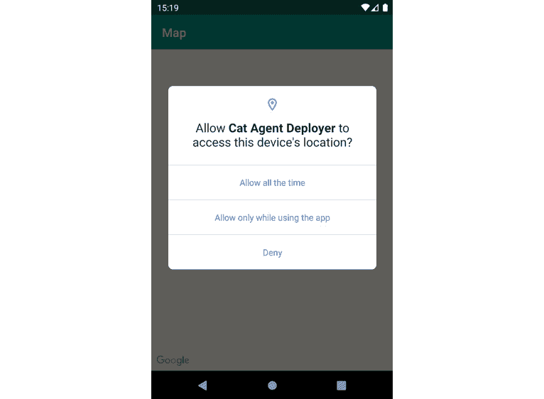
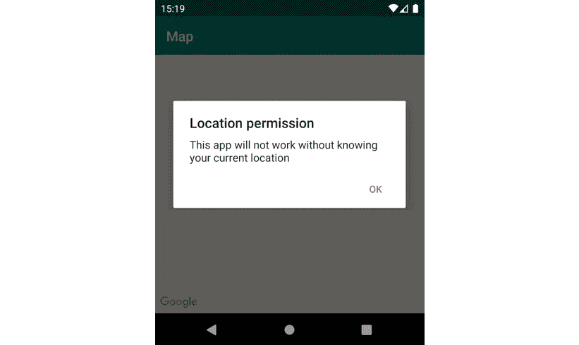
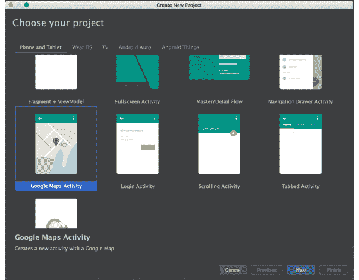
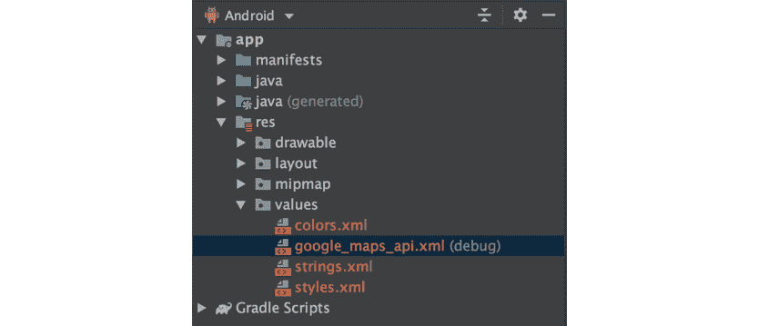
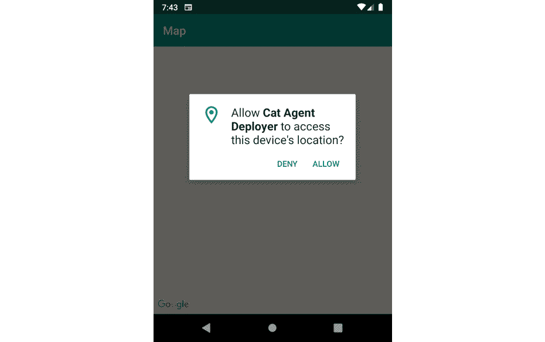
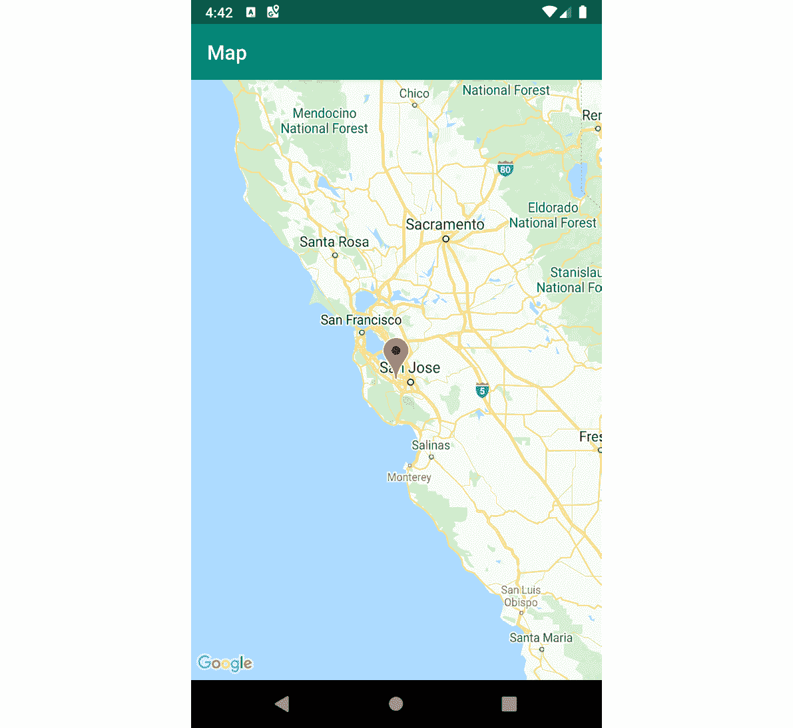
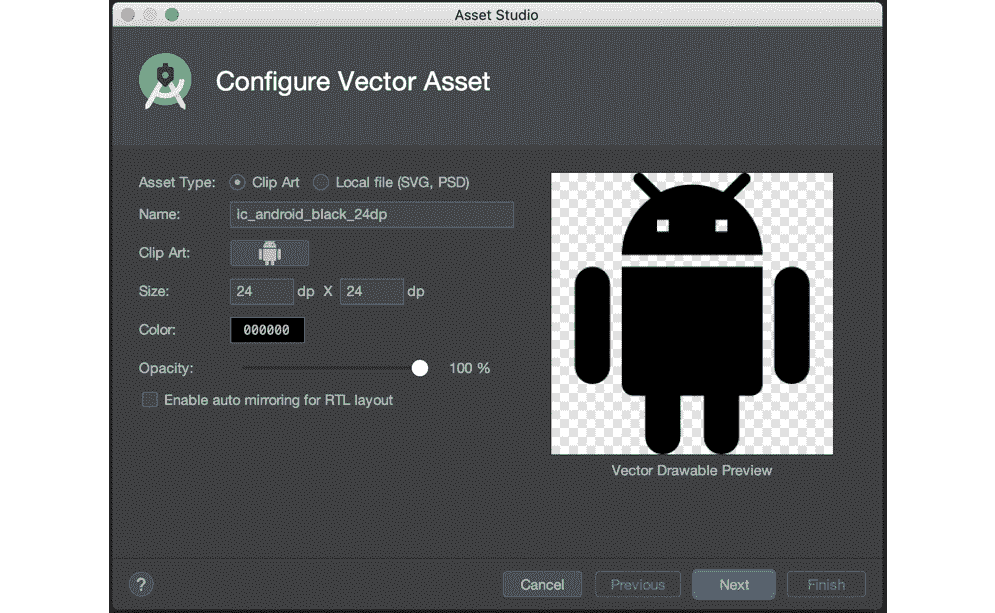
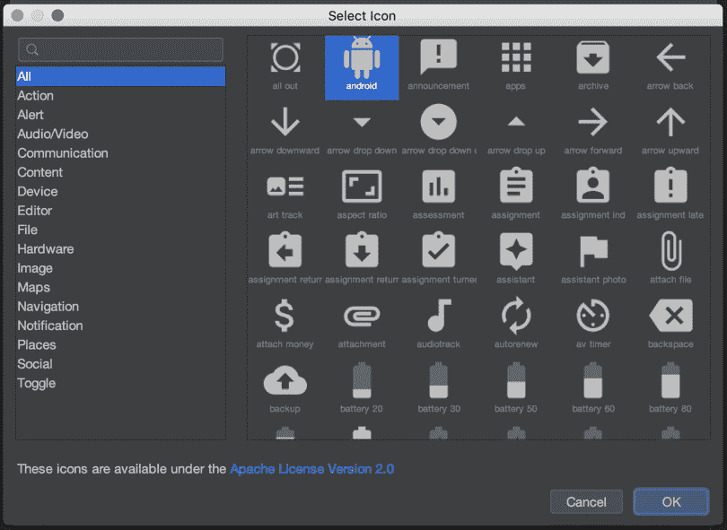
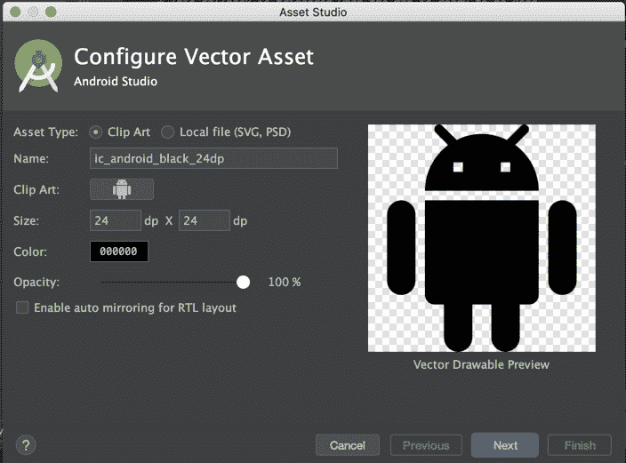
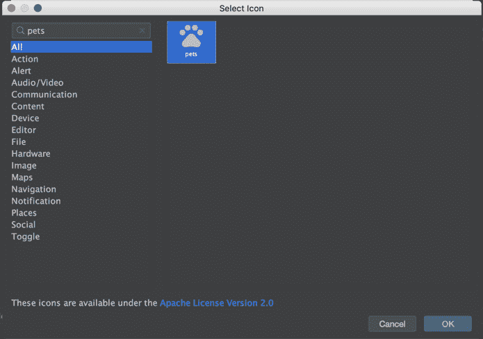

# 第七章：7. Android 权限和 Google 地图

概述

本章将为您提供如何在 Android 中请求和获取应用程序权限的知识。您将深入了解如何在应用程序中包含本地和全局交互地图，以及如何请求使用 Google Maps API 提供更丰富功能的设备功能的权限。

在本章结束时，您将能够为您的应用程序创建权限请求并处理缺失的权限。

# 介绍

在上一章中，我们学习了如何使用`RecyclerView`在列表中呈现数据。我们利用这些知识向用户展示了一个秘密猫特工列表。在本章中，我们将学习如何在地图上找到用户的位置，以及如何通过在地图上选择位置来部署猫特工。

首先，我们将研究 Android 权限系统。许多 Android 功能对我们来说并不是立即可用的。为了保护用户，这些功能被放在权限系统的后面。为了访问这些功能，我们必须请求用户允许我们这样做。一些这样的功能包括但不限于获取用户的位置，访问用户的联系人，访问他们的相机，以及建立蓝牙连接。不同的 Android 版本实施不同的权限规则。例如，当 2015 年引入 Android 6（Marshmallow）时，一些权限被认为是不安全的（您可以在安装时悄悄获得）并成为运行时权限。

接下来我们将看一下 Google Maps API。这个 API 允许我们向用户展示任何所需位置的地图，向地图添加数据，并让用户与地图进行交互。它还可以让你显示感兴趣的点，并在支持的位置呈现街景，尽管在本书中我们不会涉及这些功能。

# 向用户请求权限

我们的应用程序可能希望实现一些被 Google 认为是危险的功能。这通常意味着访问这些功能可能会危及用户的隐私。例如，这些权限可能允许您读取用户的消息或确定他们当前的位置。

根据特定权限和我们正在开发的目标 Android API 级别，我们可能需要向用户请求该权限。如果设备运行在 Android 6（Marshmallow，或 API 级别 23）上，并且我们应用的目标 API 是 23 或更高，几乎肯定会是这样，因为现在大多数设备都会运行更新版本的 Android，那么在安装时不会有用户通知警告用户应用程序请求的任何权限。相反，我们的应用必须在运行时要求用户授予它这些权限。

当我们请求权限时，用户会看到一个对话框，类似于以下截图所示：



图 7.1 设备位置访问权限对话框

注意

有关权限及其保护级别的完整列表，请参见这里：[`developer.android.com/reference/android/Manifest.permission`](https://developer.android.com/reference/android/Manifest.permission)

当我们打算使用某个权限时，我们必须在清单文件中包含该权限。具有`SEND_SMS`权限的清单将类似于以下代码片段：

```kt
<manifest xmlns:android="http://schemas.android.com/apk/res/android"
          package="com.example.snazzyapp">
    <uses-permission android:name="android.permission.SEND_SMS"/>
    <application ...>
...
    </application>
</manifest>
```

安全权限（或正常权限，如 Google 所称）将自动授予用户。然而，危险权限只有在用户明确批准的情况下才会被授予。如果我们未能向用户请求权限并尝试执行需要该权限的操作，结果最好是该操作不会运行，最坏的情况是我们的应用程序崩溃。

要向用户请求权限，我们应该首先检查用户是否已经授予我们该权限。

如果用户尚未授予我们权限，我们可能需要检查是否需要在请求权限之前显示理由对话框。这取决于请求的理由对用户来说是否显而易见。例如，如果相机应用请求访问相机的权限，我们可以安全地假设用户会清楚理由。然而，有些情况对用户来说可能不那么清晰，特别是如果用户不精通技术。在这些情况下，我们可能需要向用户解释请求的理由。Google 为我们提供了一个名为`shouldShowRequestPermissionRationale(Activity, String)`的函数来实现这个目的。在幕后，这个函数检查用户是否先前拒绝了权限，但也检查用户是否在权限请求对话框中选择了`不再询问`。这个想法是给我们一个机会，在请求之前向用户解释我们请求权限的理由，从而增加他们批准的可能性。

一旦我们确定是否应向用户呈现权限理由，或者用户是否应接受我们的理由或者不需要理由，我们就可以继续请求权限。

让我们看看如何请求权限。

我们请求权限的`Activity`类必须实现`OnRequestPermissionsResultCallback`接口。这是因为一旦用户被授予（或拒绝）权限，将调用`onRequestPermissionsResult(Int, Array<String>, IntArray)`函数。`FragmentActivity`类，`AppCompatActivity`扩展自它，已经实现了这个接口，所以我们只需要重写`onRequestPermissionsResult`函数来处理用户对权限请求的响应。以下是一个请求`Location`权限的`Activity`类的示例：

```kt
private const val PERMISSION_CODE_REQUEST_LOCATION = 1
class MainActivity : AppCompatActivity() {
    override fun onResume() {
        ...
        val hasLocationPermissions = getHasLocationPermission()
    }
```

当我们的`Activity`类恢复时，我们通过调用`getHasLocationPermissions()`来检查我们是否有位置权限（`ACCESS_FINE_LOCATION`）：

```kt
    private fun getHasLocationPermission() = if (
        ContextCompat.checkSelfPermission(
            this, Manifest.permission.ACCESS_FINE_LOCATION
        ) == PackageManager.PERMISSION_GRANTED
    ) {
        true
    } else {
        if (ActivityCompat.shouldShowRequestPermissionRationale(
                this, Manifest.permission.ACCESS_FINE_LOCATION
            )
        ) {
            showPermissionRationale { requestLocationPermission() }
        } else {
            requestLocationPermission()
        }
        false
    }
```

这个函数首先通过调用`checkSelfPermission(Context, String)`来检查用户是否已经授予了我们请求的权限。如果用户没有授予，我们调用我们之前提到的`shouldShowRequestPermissionRationale(Activity, String)`来检查是否应向用户呈现理由对话框。

如果需要显示我们的理由，我们调用`showPermissionRationale(() -> Unit)`，传入一个在用户关闭我们的理由对话框后将调用`requestLocationPermission()`的 lambda。如果不需要理由，我们直接调用`requestLocationPermission()`：

```kt
    private fun showPermissionRationale(positiveAction: () -> Unit) {
        AlertDialog.Builder(this)
            .setTitle("Location permission")
            .setMessage("We need your permission to find               your current position")
            .setPositiveButton(
                "OK"
            ) { _, _ -> positiveAction() }
            .create()
            .show()
    }
```

我们的`showPermissionRationale`函数简单地向用户呈现一个对话框，简要解释为什么我们需要他们的权限。确认按钮将执行积极的操作：



图 7.2 理由对话框

```kt
    private fun requestLocationPermission() {
        ActivityCompat.requestPermissions(
            this,
            arrayOf(
                Manifest.permission.ACCESS_FINE_LOCATION
            ),
            PERMISSION_CODE_REQUEST_LOCATION
        )
    }
```

最后，我们的`requestLocationPermission()`函数调用`requestPermissions(Activity, Array<out String>, Int)`，向我们的活动传递一个包含请求的权限和我们独特的请求代码的数组。我们将使用这个代码来稍后识别响应属于这个请求。

如果我们已经向用户请求了位置权限，现在我们需要处理响应。这是通过重写`onRequestPermissionsResult(Int, Array<out String>, IntArray)`函数来完成的，如下面的代码所示：

```kt
override fun onRequestPermissionsResult(
    requestCode: Int,
    permissions: Array<out String>,
    grantResults: IntArray
) {
    super.onRequestPermissionsResult(requestCode, permissions, 
      grantResults)
    when (requestCode) {
        PERMISSION_CODE_REQUEST_LOCATION -> getLastLocation()
    }
}
```

当`onRequestPermissionsResult`被调用时，会传入三个值。第一个是请求代码，将与我们调用`requestPermissions`时提供的请求代码相同。第二个是请求的权限数组。第三个是我们请求的结果数组。对于每个请求的权限，这个数组将包含`PackageManager.PERMISSION_GRANTED`或`PackageManager.PERMISSION_DENIED`。

本章将带领我们开发一个应用程序，在地图上显示我们当前的位置，并允许我们在想要部署我们的秘密猫特工的地方放置一个标记。让我们从我们的第一个练习开始。

## 练习 7.01：请求位置权限

在这个练习中，我们将请求用户提供位置权限。我们将首先创建一个 Google Maps Activity 项目。我们将在清单文件中定义所需的权限。让我们开始实现所需的代码，以请求用户访问其位置的权限：

1.  首先创建一个新的 Google Maps Activity 项目（`文件` | `新建` | `新项目` | `Google Maps Activity`）。在这个练习中我们不会使用 Google Maps。然而，在这种情况下，Google Maps Activity 仍然是一个不错的选择。它将在下一个练习（*练习 7.02*）中为你节省大量样板代码。不用担心；这不会对你当前的练习产生影响。点击`下一步`，如下截图所示：

图 7.3：选择你的项目

1.  将你的应用程序命名为`Cat Agent Deployer`。

1.  确保你的包名是`com.example.catagentdeployer`。

1.  将保存位置设置为你想要保存项目的位置。

1.  将其他所有内容保持默认值，然后点击`完成`。

1.  确保你的`Project`窗格中处于`Android`视图：

图 7.4：Android 视图

1.  打开你的`AndroidManifest.xml`文件。确保位置权限已经添加到你的应用程序中：

```kt
<manifest xmlns:android="http://schemas.android.com/apk/res/android"
    package="com.example.catagentdeployer">
    ACCESS_FINE_LOCATION is the permission you will need to obtain the user's location based on GPS in addition to the less accurate Wi-Fi and mobile data-based location information you could obtain by using the ACCESS_COARSE_LOCATION permission.
```

1.  打开你的`MapsActivity.kt`文件。在`MapsActivity`类块的底部添加一个空的`getLastLocation()`函数：

```kt
class MapsActivity : AppCompatActivity(), OnMapReadyCallback {
    ...
    private fun getLastLocation() {
 Log.d("MapsActivity", "getLastLocation() called.")
    }
}
```

这将是当你确保用户已经授予了位置权限时你将调用的函数。

1.  接下来，在文件顶部的导入和类定义之间添加请求代码常量：

```kt
...
import com.google.android.gms.maps.model.MarkerOptions
private const val PERMISSION_CODE_REQUEST_LOCATION = 1
class MapsActivity : AppCompatActivity(), OnMapReadyCallback {
```

这将是我们在请求位置权限时传递的代码。无论我们在这里定义什么值，当用户完成与请求对话框的交互并授予或拒绝我们权限时，都将返回给我们。

1.  现在在`getLastLocation()`函数之前添加`requestLocationPermission()`函数：

```kt
private fun requestLocationPermission() {
    ActivityCompat.requestPermissions(
        this,
        arrayOf(Manifest.permission.ACCESS_FINE_LOCATION),
        PERMISSION_CODE_REQUEST_LOCATION
    )
}
private fun getLastLocation() {
    ...
}
```

这个函数将向用户呈现一个标准的权限请求对话框（如下图所示），要求他们允许应用程序访问他们的位置。我们传递了将接收回调的活动（`this`），你希望用户授予你的应用程序的请求权限的数组（`Manifest.permission.ACCESS_FINE_LOCATION`），以及你刚刚定义的`PERMISSION_CODE_REQUEST_LOCATION`常量，以将其与权限请求关联起来：


图 7.5：权限对话框

1.  重写你的`MapsActivity`类的`onRequestPermissionsResult(Int, Array<String>, IntArray)`函数：

```kt
override fun onRequestPermissionsResult(
    requestCode: Int, permissions: Array<out String>,       grantResults: IntArray) {
        super.onRequestPermissionsResult(requestCode,           permissions,grantResults)
    when (requestCode) {
            PERMISSION_CODE_REQUEST_LOCATION -> if (
                grantResults[0] == PackageManager.PERMISSION_GRANTED
            ) {
                getLastLocation()
            }
    }
}
```

你应该首先调用 super 实现（当你重写函数时，这应该已经为你完成）。这将处理权限响应处理的委托给相关的子片段。

然后，你可以检查`requestCode`参数，看看它是否与你传递给`requestPermissions(Activity, Array<out String>, Int)`函数的`requestCode`参数匹配（`PERMISSION_CODE_REQUEST_LOCATION`）。如果匹配，由于你知道你只请求了一个权限，你可以检查第一个`grantResults`值。如果它等于`PackageManager.PERMISSION_GRANTED`，则用户已经授予了你的应用程序权限，你可以通过调用`getLastLocation()`来继续获取他们的最后位置。

1.  如果用户拒绝了你的应用程序请求的权限，你可以向他们提出请求的理由。在`requestLocationPermission()`函数之前实现`showPermissionRationale(() -> Unit)`函数：

```kt
private fun showPermissionRationale(positiveAction: () -> Unit) {
    AlertDialog.Builder(this)
        .setTitle("Location permission")
        .setMessage("This app will not work without knowing your           current location")
        .setPositiveButton(
            "OK"
        ) { _, _ -> positiveAction() }
        .create()
        .show()
}
```

此函数将向用户呈现一个简单的警报对话框，解释应用程序如果不知道其当前位置将无法工作，如下截图所示。单击“确定”将执行提供的`positiveAction` lambda：


图 7.6：理由对话框

1.  添加所需的逻辑来确定是显示权限请求对话框还是理由对话框。在`showPermissionRationale(() -> Unit)`函数之前创建`requestPermissionWithRationaleIfNeeded()`函数：

```kt
private fun requestPermissionWithRationaleIfNeeded() = if (
    ActivityCompat.shouldShowRequestPermissionRationale(
        this, Manifest.permission.ACCESS_FINE_LOCATION
    )
) {
    showPermissionRationale {
        requestLocationPermission()
    }
} else {
    requestLocationPermission()
}
```

此函数检查您的应用程序是否应显示理由对话框。如果应该，它将调用`showPermissionRationale(() -> Unit)`，传入一个 lambda，该 lambda 将通过调用`requestLocationPermission()`来请求位置权限。否则，它将直接通过调用`requestLocationPermission()`函数来请求位置权限。

1.  确定您的应用程序是否已经具有位置权限，请在`requestPermissionWithRationaleIfNeeded()`函数之前引入此处所示的`hasLocationPermission()`函数：

```kt
private fun hasLocationPermission() =
    ContextCompat.checkSelfPermission(
        this, Manifest.permission.ACCESS_FINE_LOCATION
    ) == PackageManager.PERMISSION_GRANTED
```

1.  最后，更新`MapsActivity`类的`onMapReady()`函数，以在地图准备就绪时请求权限或获取用户的当前位置：

```kt
override fun onMapReady(googleMap: GoogleMap) {
    mMap = googleMap
    if (hasLocationPermission()) {
        getLastLocation()
    } else {
        requestPermissionWithRationaleIfNeeded()
    }
}
```

1.  为了确保在用户拒绝权限时呈现理由，更新`onRequestPermissionsResult(Int, Array<String>, IntArray)`，加入一个`else`条件：

```kt
override fun onRequestPermissionsResult(
    requestCode: Int,
    permissions: Array<out String>,
    grantResults: IntArray
) {
    super.onRequestPermissionsResult(requestCode, permissions, 
      grantResults)
    when (requestCode) {
        PERMISSION_CODE_REQUEST_LOCATION -> if (
            grantResults[0] == PackageManager.PERMISSION_GRANTED
        ) {
            getLastLocation()
        } else {
            requestPermissionWithRationaleIfNeeded()
        }
    }
}
```

1.  运行您的应用程序。现在，您应该看到一个系统权限对话框，请求您允许应用程序访问设备的位置：



图 7.7：应用程序请求位置权限

如果您拒绝权限，将出现理由对话框，然后是另一个系统权限对话框，请求权限，如下截图所示。这次，用户可以选择不让应用程序再次请求权限。每当用户选择拒绝权限时，理由对话框将再次呈现给他们，直到他们选择允许权限或选中`不再询问`选项：


图 7.8：不再询问

一旦用户允许或永久拒绝权限，对话框将不会再次显示。要重置应用程序权限的状态，您必须通过`应用信息`界面手动授予该权限。

现在我们可以获取位置权限，接下来我们将查看如何获取用户的当前位置。

# 显示用户位置的地图

成功获得用户访问其位置的权限后，我们现在可以要求用户的设备提供其上次已知的位置，这通常也是用户的当前位置。然后，我们将使用此位置向用户呈现其当前位置的地图。

为了获取用户的上次已知位置，Google 为我们提供了 Google Play 位置服务，更具体地说是`FusedLocationProviderClient`类。`FusedLocationProviderClient`类帮助我们与 Google 的 Fused 位置提供程序 API 进行交互，这是一个智能地结合来自多个设备传感器的不同信号以向我们提供设备位置信息的位置 API。

要访问`FusedLocationProviderClient`类，我们必须首先在项目中包含 Google Play 位置服务库。这意味着将以下代码片段添加到应用程序`build.gradle`的`dependencies`块中：

```kt
implementation "com.google.android.gms:play-services-location:17.1.0"
```

导入位置服务后，我们现在可以通过调用`LocationServices.getFusedLocationProviderClient(this@MainActivity)`来获取`FusedLocationProviderClient`类的实例。

一旦我们有了融合位置客户端，并且已经从用户那里获得了位置权限，我们可以通过调用`fusedLocationClient.lastLocation`来获取用户的最后位置。由于这是一个异步调用，我们至少应该提供一个成功的监听器。如果需要的话，我们还可以添加取消、失败和请求完成的监听器。`getLastLocation()`调用（在 Kotlin 中为`lastLocation`）返回一个`Task<Location>`。Task 是一个 Google API 的抽象类，其实现执行异步操作。在这种情况下，该操作是返回一个位置。因此，添加监听器只是简单地进行链接。我们将在我们的调用中添加以下代码片段：

```kt
.addOnSuccessListener { location: Location? ->
}
```

请注意，如果客户端未能获取用户的当前位置，则`location`参数可能为`null`。这并不常见，但如果例如用户在通话期间禁用了其位置服务，这种情况可能发生。

一旦我们成功监听器块内的代码被执行并且`location`不为 null，我们就可以得到用户当前位置的`Location`实例。

`Location`实例保存地球上的单个坐标，使用经度和纬度表示。对于我们的目的，知道地球表面上的每个点都映射到一对经度（缩写：Lng）和纬度（缩写：Lat）值就足够了。

这就是真正令人兴奋的地方。谷歌让我们可以使用`SupportMapFragment`类在交互式地图上呈现任何位置。只需注册一个免费的 API 密钥。当您使用 Google Maps Activity 创建应用程序时，Google 会为我们生成一个额外的文件，名为`google_maps_api.xml`，可以在`res/values`下找到。该文件对于我们的`SupportMapFragment`类是必需的，因为它包含我们的 API 密钥。它还包含如何获取新 API 密钥的清晰说明。方便的是，它还包含一个链接，该链接将为我们填写大部分所需的注册数据。链接看起来类似于`https://console.developers.google.com/flows/enableapi?apiid=...`。从`google_maps_api.xml`文件中复制它到您的浏览器（或在链接上*CMD* + *click*），一旦页面加载，按照页面上的说明操作，然后点击`Create`。一旦您获得了密钥，用您新获得的密钥替换文件底部的`YOUR_KEY_HERE`字符串。

此时，如果您运行您的应用程序，您将在屏幕上看到一个交互式地图：


图 7.9：交互式地图

为了根据我们的当前位置定位地图，我们使用来自我们的`Location`实例的坐标创建一个`LatLng`实例，并在`GoogleMap`实例上调用`moveCamera(CameraUpdate)`。为满足`CameraUpdate`的要求，我们调用`CameraUpdateFactory.newLatLng(LatLng)`，传入之前创建的`LatLng`参数。调用看起来会像这样：

```kt
mMap.moveCamera(CameraUpdateFactory.newLatLng(latLng))
```

我们还可以调用`newLatLngZoom(LatLng, Float)`来修改地图的放大和缩小功能。

注意

有效的缩放值范围在`2.0`（最远）和`21.0`（最近）之间。超出该范围的值将被限制。

某些区域可能没有瓦片来渲染最接近的缩放值。要了解其他可用的`CameraUpdateFactory`选项，请访问[`developers.google.com/android/reference/com/google/android/gms/maps/CameraUpdateFactory.html`](https://developers.google.com/android/reference/com/google/android/gms/maps/CameraUpdateFactory.html)。

要在用户的坐标处添加一个标记（在 Google 的地图 API 中称为标记），我们在`GoogleMap`实例上调用`addMarker(MarkerOptions)`。`MarkerOptions`参数通过链接到`MarkerOptions()`实例的调用进行配置。对于我们所需位置的简单标记，我们可以调用`position(LatLng)`和`title(String)`。调用看起来类似于以下内容：

```kt
mMap.addMarker(MarkerOptions().position(latLng).title("Pin Label"))
```

我们链接调用的顺序并不重要。

让我们在以下练习中练习一下。

## 练习 7.02：获取用户的当前位置

现在，您的应用程序可以被授予位置权限，您可以继续利用位置权限来获取用户的当前位置。然后，您将显示地图并更新地图以放大到用户的当前位置并在该位置显示一个图钉。执行以下步骤：

1.  首先，将 Google Play 位置服务添加到您的`build.gradle`文件中。您应该在`dependencies`块内添加它：

```kt
dependencies {
    implementation "com.google.android.gms:play-services-      location:17.1.0"
    implementation "org.jetbrains.kotlin:kotlin-      stdlib:$kotlin_version"
    implementation 'androidx.core:core-ktx:1.3.2'
    implementation 'androidx.appcompat:appcompat:1.2.0'
    implementation 'com.google.android.material:material:1.2.1'
    implementation 'com.google.android.gms:play-services-maps:17.0.0'
    implementation 'androidx.constraintlayout:constraintlayout:2.0.4'
    testImplementation 'junit:junit:4.+'
    androidTestImplementation 'androidx.test.ext:junit:1.1.2'
    androidTestImplementation 'androidx.test       .espresso:espresso-core:3.3.0'
}
```

1.  单击 Android Studio 中的`Sync Project with Gradle Files`按钮，以便 Gradle 获取新添加的依赖项。

1.  获取 API 密钥：首先打开生成的`google_maps_api.xml`文件（`app/src/debug/res/values/google_maps_api.xml`），然后*CMD* + *点击*以开始的链接，该链接以`https://console.developers.google.com/flows/enableapi?apiid=`开头。

1.  按照网站上的说明操作，直到生成一个新的 API 密钥。

1.  通过将以下行中的`YOUR_KEY_HERE`替换为您的新 API 密钥来更新您的`google_maps_api.xml`文件：

```kt
<string name="google_maps_key" templateMergeStrategy="preserve"   translatable="false">YOUR_KEY_HERE</string>
```

1.  打开您的`MapsActivity.kt`文件。在您的`MapsActivity`类的顶部，定义一个延迟初始化的融合位置提供程序客户端：

```kt
class MapsActivity : AppCompatActivity(), OnMapReadyCallback {
    fusedLocationProviderClient initialize lazily, you are making sure it is only initialized when needed, which essentially guarantees the Activity class will have been created before initialization.
```

1.  在`getLastLocation()`函数之后立即引入一个`updateMapLocation(LatLng)`函数和一个`addMarkerAtLocation(LatLng, String)`函数，以在给定位置放大地图并在该位置添加一个标记：

```kt
private fun updateMapLocation(location: LatLng) {
    mMap.moveCamera(CameraUpdateFactory.newLatLngZoom(location, 7f))
}
private fun addMarkerAtLocation(location: LatLng, title: String) {
    mMap.addMarker(MarkerOptions().title(title).position(location))
}
```

1.  现在更新您的`getLastLocation()`函数以检索用户的位置：

```kt
private fun getLastLocation() {
    fusedLocationProviderClient.lastLocation
        .addOnSuccessListener { location: Location? ->
            location?.let {
                val userLocation = LatLng(location.latitude,                   location.longitude)
                updateMapLocation(userLocation)
                addMarkerAtLocation(userLocation, "You")
            }
        }
}
```

您的代码通过调用`lastLocation`以 Kotlin 简洁的方式请求最后的位置，然后将`lambda`函数附加为`OnSuccessListener`接口。一旦获得位置，`lambda`函数将被执行，更新地图位置并在该位置添加一个标题为`You`的标记（如果返回的位置不为空）。

1.  运行您的应用程序：



图 7.10：带有当前位置标记的交互式地图

一旦应用程序获得了权限，它可以通过融合位置提供程序客户端从 Google Play 位置服务获取用户的最后位置。这为您提供了一种轻松简洁的方式来获取用户的当前位置。请记住在设备上打开位置以使应用程序正常工作。

有了用户的位置，您的应用程序可以告诉地图在哪里放大并在哪里放置一个图钉。如果用户点击图钉，他们将看到您分配给它的标题（在练习中为`You`）。

在下一节中，我们将学习如何响应地图上的点击事件以及如何移动标记。

# 地图点击和自定义标记

通过在正确的位置放大并放置一个图钉来显示用户当前位置的地图，我们已经初步了解了如何渲染所需的地图，以及如何获取所需的权限和用户当前位置。

在本节中，我们将学习如何响应用户与地图的交互，以及如何更广泛地使用标记。我们将学习如何在地图上移动标记以及如何用自定义图标替换默认的图钉。当我们知道如何让用户在地图上任何地方放置一个标记时，我们可以让他们选择在哪里部署秘密猫特工。

监听地图上的点击事件，我们需要向`GoogleMap`实例添加一个监听器。查看我们的`MapsActivity.kt`文件，最好的地方是在`onMapReady(GoogleMap)`中这样做。一个天真的实现看起来像这样：

```kt
override fun onMapReady(googleMap: GoogleMap) {
    mMap = googleMap.apply {
        setOnMapClickListener { latLng ->
            addMarkerAtLocation(latLng, "Deploy here")
        }
    }
    ...
}
```

但是，如果我们运行此代码，我们会发现对地图上的每次点击都会添加一个新的标记。这不是我们期望的行为。

要控制地图上的标记，我们需要保留对该标记的引用。这可以通过保留对`GoogleMap.addMarker(MarkerOptions)`的输出的引用来轻松实现。`addMarker`函数返回一个`Marker`实例。要在地图上移动标记，我们只需通过调用其`position`设置器为其分配一个新值。

要用自定义图标替换默认的标记图标，我们需要为标记或`MarkerOptions()`实例提供`BitmapDescriptor`。`BitmapDescriptor`包装器可以解决`GoogleMap`用于渲染标记（和地面覆盖，但我们不会在本书中涵盖）的位图。我们通过使用`BitmapDescriptorFactory`来获取`BitmapDescriptor`。工厂将需要一个资产，可以通过多种方式提供。您可以使用`assets`目录中位图的名称、`Bitmap`、内部存储中文件的文件名或资源 ID 来提供它。工厂还可以创建不同颜色的默认标记。我们对`Bitmap`选项感兴趣，因为我们打算使用矢量可绘制，而这些不是工厂直接支持的。此外，当将可绘制对象转换为`Bitmap`时，我们可以对其进行操作以满足我们的需求（例如，我们可以更改其颜色）。

Android Studio 为我们提供了相当广泛的免费矢量`Drawables`。在这个例子中，我们想要`paw`可绘制。为此，右键单击左侧 Android 窗格中的任何位置，然后选择`New` | `Vector Asset`。

现在，点击`Clip Art`标签旁边的 Android 图标，查看图标列表：



图 7.11：资产工作室

现在我们将访问一个窗口，我们可以从提供的剪贴画池中选择：



图 7.12：选择图标

一旦我们选择了一个图标，我们可以给它命名，它将作为一个矢量可绘制的 XML 文件为我们创建。我们将它命名为`target_icon`。

要使用创建的资产，我们必须首先将其作为`Drawable`实例获取。这是通过调用`ContextCompat.getDrawable(Context, Int)`来实现的，传入活动和`R.drawable.target_icon`作为对我们资产的引用。接下来，我们需要为`Drawable`实例定义绘制的边界。调用`Drawable.setBound(Int, Int, Int, Int)`，参数为(`0`, `0`, `drawable.intrinsicWidth`, `drawable.intrinsicHeight`)，告诉它在其固有大小内绘制。

要更改图标的颜色，我们必须对其进行着色。要以一种受到早于`21`的 API 运行的设备支持的方式对`Drawable`实例进行着色，我们必须首先通过调用`DrawableCompat.wrap(Drawable)`将我们的`Drawable`实例包装在`DrawableCompat`中。然后可以使用`DrawableCompat.setTint(Drawable, Int)`对返回的`Drawable`进行着色。

接下来，我们需要创建一个`Bitmap`来容纳我们的图标。它的尺寸可以与`Drawable`的边界匹配，我们希望它的`Config`是`Bitmap.Config.ARGB_8888` - 这意味着完整的红色、绿色、蓝色和 alpha 通道。然后我们为`Bitmap`创建一个`Canvas`，允许我们通过调用`Drawable.draw(Canvas)`来绘制我们的`Drawable`实例：

```kt
private fun getBitmapDescriptorFromVector(@DrawableRes   vectorDrawableResourceId: Int): BitmapDescriptor? {
    val bitmap =
        ContextCompat.getDrawable(this, vectorDrawableResourceId)?.let {           vectorDrawable ->
            vectorDrawable
                .setBounds(0, 0, vectorDrawable.intrinsicWidth,                   vectorDrawable.intrinsicHeight)
            val drawableWithTint = DrawableCompat.wrap(vectorDrawable)
            DrawableCompat.setTint(drawableWithTint, Color.RED)
            val bitmap = Bitmap.createBitmap(
                vectorDrawable.intrinsicWidth,
                vectorDrawable.intrinsicHeight,
                Bitmap.Config.ARGB_8888
            )
            val canvas = Canvas(bitmap)
            drawableWithTint.draw(canvas)
            bitmap
        }
    return BitmapDescriptorFactory.fromBitmap(bitmap)      .also {
          bitmap?.recycle()
    }
}
```

有了包含我们图标的`Bitmap`，我们现在可以从`BitmapDescriptorFactory`中获取一个`BitmapDescriptor`实例。不要忘记在之后回收您的`Bitmap`。这将避免内存泄漏。

您已经学会了如何通过将地图居中在用户的当前位置并使用标记标记显示他们的当前位置来向用户呈现有意义的地图。

## 练习 7.03：在地图被点击的地方添加自定义标记

在这个练习中，您将通过在地图上的用户点击位置放置一个红色的爪形标记来响应用户的地图点击：

1.  在`MapsActivity.kt`（位于`app/src/main/java/com/example/catagentdeployer`下），在`mMap`变量的定义下面，定义一个可空的`Marker`变量，用于在地图上保存爪标记的引用：

```kt
private lateinit var mMap: GoogleMap
private var marker: Marker? = null
```

1.  更新`addMarkerAtLocation(LatLng, String)`，也接受一个可空的`BitmapDescriptor`，默认值为`null`：

```kt
private fun addMarkerAtLocation(
    location: LatLng,
    title: StringmarkerIcon provided is not null, the app sets it to MarkerOptions. The function now returns the marker it added to the map.
```

1.  在您的`addMarkerAtLocation(LatLng, String, BitmapDescriptor?): Marker`函数下面创建一个`getBitmapDescriptorFromVector(Int): BitmapDescriptor?`函数，以提供给定`Drawable`资源 ID 的`BitmapDescriptor`：

```kt
private fun getBitmapDescriptorFromVector(@DrawableRes   vectorDrawableResourceId: Int): BitmapDescriptor? {
    val bitmap =
        ContextCompat.getDrawable(this,           vectorDrawableResourceId)?.let { vectorDrawable ->
            vectorDrawable
                .setBounds(0, 0, vectorDrawable.intrinsicWidth,                   vectorDrawable.intrinsicHeight)
            val drawableWithTint = DrawableCompat               .wrap(vectorDrawable)
            DrawableCompat.setTint(drawableWithTint, Color.RED)
            val bitmap = Bitmap.createBitmap(
                vectorDrawable.intrinsicWidth,
                vectorDrawable.intrinsicHeight,
                Bitmap.Config.ARGB_8888
            )
            val canvas = Canvas(bitmap)
            drawableWithTint.draw(canvas)
            bitmap
        }
    return BitmapDescriptorFactory.fromBitmap(bitmap).also {
        bitmap?.recycle()
    }
}
```

此函数首先使用`ContextCompat`获取可绘制对象，通过传入提供的资源 ID。然后为可绘制对象设置绘制边界，将其包装在`DrawableCompat`中，并将其色调设置为红色。

然后，它为该`Bitmap`创建了一个`Canvas`，在其上绘制了着色的可绘制对象。然后将位图返回以供`BitmapDescriptorFactory`使用以构建`BitmapDescriptor`。最后，为了避免内存泄漏，回收`Bitmap`。

1.  在您可以使用`Drawable`实例之前，您必须首先创建它。右键单击 Android 窗格，然后选择`New` | `Vector Asset`。

1.  在打开的窗口中，单击“剪贴画”标签旁边的 Android 图标，以选择不同的图标：

图 7.13：资源工作室

1.  从图标列表中，选择`pets`图标。如果找不到图标，可以在搜索框中输入`pets`。选择`pets`图标后，单击“确定”：

图 7.14：选择图标

1.  将您的图标命名为`target_icon`。单击“下一步”和“完成”。

1.  定义一个`addOrMoveSelectedPositionMarker(LatLng)`函数来创建一个新的标记，或者如果已经创建了一个标记，则将其移动到提供的位置。在`getBitmapDescriptorFromVector(Int)`函数之后添加它：

```kt
private fun addOrMoveSelectedPositionMarker(latLng: LatLng) {
    if (marker == null) {
        marker = addMarkerAtLocation(
            latLng, "Deploy here",               getBitmapDescriptorFromVector(R.drawable.target_icon)
        )
    } else {
        marker?.apply {
            position = latLng
        }
    }
}
```

1.  更新您的`onMapReady(GoogleMap)`函数，为`mMap`设置一个`OnMapClickListener`事件，该事件将在点击的位置添加一个标记，或将现有标记移动到点击的位置：

```kt
override fun onMapReady(googleMap: GoogleMap) {
    mMap = googleMap.apply {
        setOnMapClickListener { latLng ->
            addOrMoveSelectedPositionMarker(latLng)
        }
    }
    if (hasLocationPermission()) {
        getLastLocation()
    } else {
        requestPermissionWithRationaleIfNeeded()
    }
}
```

1.  运行您的应用程序：

图 7.15：完整的应用程序

现在，单击地图上的任何位置将会将爪印图标移动到该位置。单击爪印图标将显示“部署在这里”标签。请注意，爪印的位置是地理位置，而不是屏幕位置。这意味着如果您拖动地图或放大地图，爪印将随地图移动并保持在相同的地理位置。您现在知道如何响应用户在地图上的点击，以及如何添加和移动标记。您还知道如何自定义标记的外观。

## 活动 7.01：创建一个查找停放汽车位置的应用程序

有些人经常忘记他们停放汽车的地方。假设您想通过开发一个应用程序来帮助这些人，让用户存储他们上次停放的地方。当用户启动应用程序时，它将显示一个在用户告诉应用程序汽车位置的最后一个地方的标记。用户可以单击“我停在这里”按钮，以便在下次停放时将标记位置更新为当前位置。

您在此活动中的目标是开发一个应用程序，向用户显示带有当前位置的地图。它首先必须要求用户允许访问其位置。根据 SDK，确保在需要时还提供合理的对话框。该应用程序将在用户上次告诉它汽车位置的地方显示汽车图标。用户可以单击标有“我停在这里”的按钮，将汽车图标移动到当前位置。当用户重新启动应用程序时，它将显示用户的当前位置和汽车上次停放的位置。

作为应用程序的额外功能，您可以选择添加存储汽车位置的功能，以便在用户关闭然后重新打开应用程序后可以恢复该位置。此额外功能依赖于使用`SharedPreferences`；这是*第十一章*“持久化数据”中将介绍的一个概念。因此，下面的第 9 和第 10 步将为您提供所需的实现。

以下步骤将帮助您完成此活动：

1.  创建一个 Google Maps Activity 应用程序。

1.  获取应用程序的 API 密钥，并使用该密钥更新您的`google_maps_api.xml`文件。

1.  在底部显示一个标有“我停在这里”的按钮。

1.  在您的应用程序中包含位置服务。

1.  请求用户的位置访问权限。

1.  获取用户的位置并在地图上放置一个标记。

1.  将汽车图标添加到您的项目中。

1.  为汽车图标添加功能，将其移动到用户当前位置。

1.  将选定的位置存储在`SharedPreferences`中。放置在您的活动中的此函数将有所帮助：

```kt
private fun saveLocation(latLng: LatLng) =
    getPreferences(MODE_PRIVATE)?.edit()?.apply {
        putString("latitude", latLng.latitude.toString())
        putString("longitude", latLng.longitude.toString())
        apply()
    }
```

1.  从`SharedPreferences`中恢复任何保存的位置。您可以使用以下函数：

```kt
    val latitude = sharedPreferences.getString("latitude", null)      ?.toDoubleOrNull() ?: return null
    val longitude = sharedPreferences.getString("longitude",       null)?.toDoubleOrNull()       ?: return null
```

注意

此活动的解决方案可在以下网址找到：http://packt.live/3sKj1cp

# 摘要

在本章中，我们学习了关于 Android 权限的知识。我们谈到了拥有这些权限的原因，并看到了如何请求用户的权限来执行某些任务。我们还学习了如何使用谷歌的地图 API 以及如何向用户呈现交互式地图。最后，我们利用了呈现地图和请求权限的知识，找出用户当前的位置并在地图上呈现出来。使用谷歌地图 API 还有很多可以做的事情，您可以通过某些权限探索更多可能性。现在您应该有足够的基础理解来进一步探索。要了解更多关于权限的信息，请访问 https://developer.android.com/reference/android/Manifest.permission。要了解更多关于地图 API 的信息，请访问[`developers.google.com/maps/documentation/android-sdk/intro`](https://developers.google.com/maps/documentation/android-sdk/intro)。

在下一章中，我们将学习如何使用`Services`和`WorkManager`执行后台任务。我们还将学习如何在应用程序未运行时向用户呈现通知。作为移动开发人员，拥有这些强大的工具是非常重要的。
