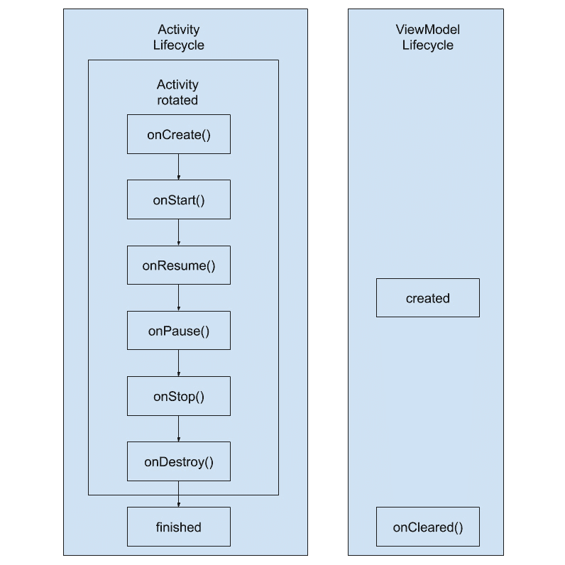
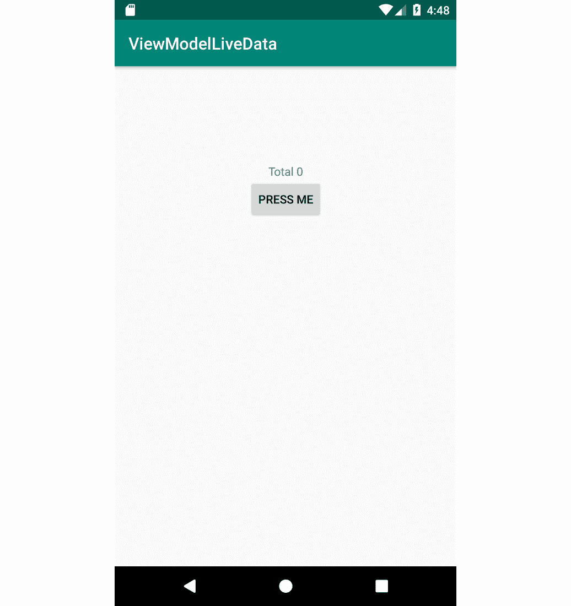
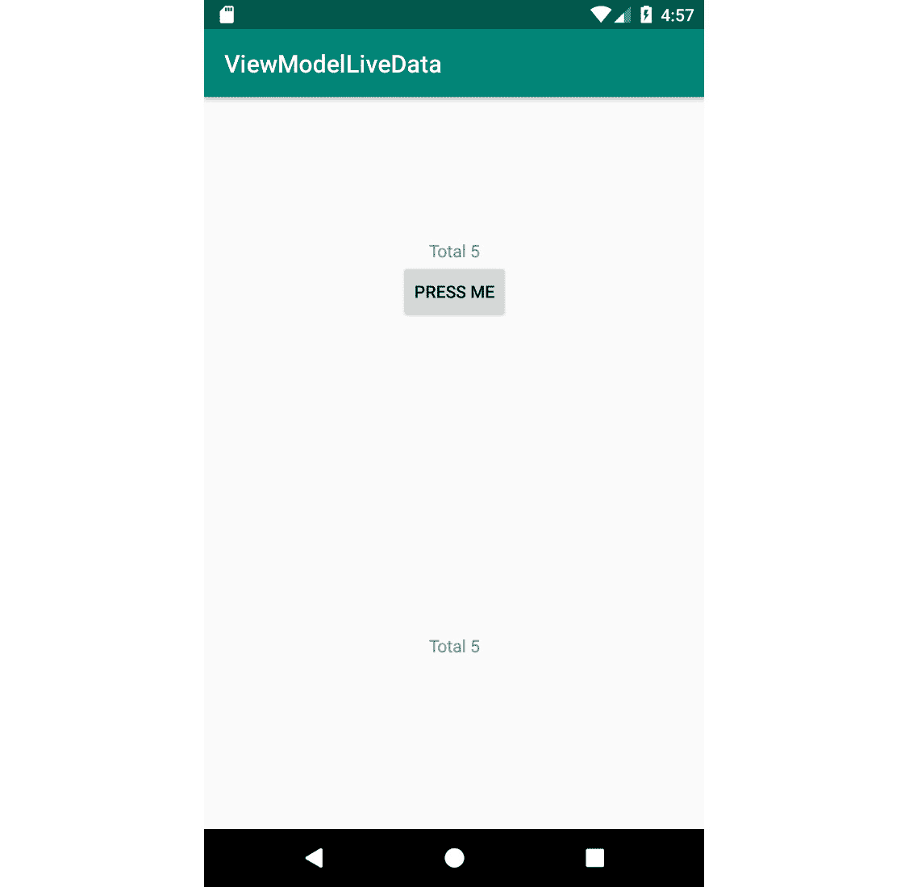
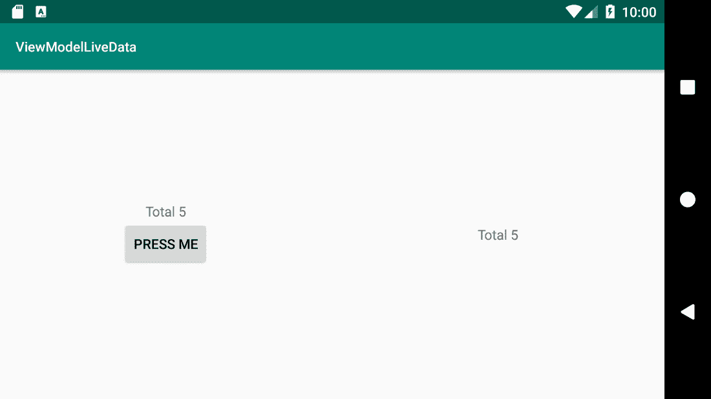
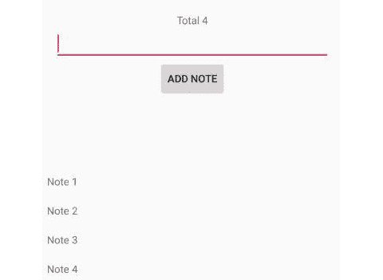

# 第十章：10. Android 架构组件

概述

在本章中，您将了解 Android Jetpack 库的关键组件以及它们为标准 Android 框架带来的好处。您还将学习如何使用 Jetpack 组件来构建代码并为您的类分配不同的责任。最后，您将提高代码的测试覆盖率。

通过本章的学习，您将能够轻松处理活动和片段的生命周期。您还将了解如何使用 Room 在 Android 设备上持久保存数据，以及如何使用 ViewModels 将逻辑与视图分离。

# 介绍

在之前的章节中，您学会了如何编写单元测试。问题是：您可以对什么进行单元测试？您可以对活动和片段进行单元测试吗？由于它们的构建方式，它们在您的机器上很难进行单元测试。如果您可以将代码从活动和片段中移出来，测试将会更容易。

另外，考虑一下您正在构建一个支持不同方向（如横向和纵向）和支持多种语言的应用程序的情况。在这些情景中，默认情况下会发生的情况是，当用户旋转屏幕时，活动和片段会为新的显示方向重新创建。现在，想象一下这发生在您的应用程序正在处理数据的中间。您必须跟踪您正在处理的数据，您必须跟踪用户正在做什么来与您的屏幕交互，并且您必须避免造成上下文泄漏。

注意

上下文泄漏是指您销毁的活动由于在生命周期更长的组件中引用而无法进行垃圾回收 - 比如当前正在处理数据的线程。

在许多情况下，您将不得不使用`onSaveInstanceState`来保存活动/片段的当前状态，然后在`onCreate`或`onRestoreInstanceState`中，您需要恢复活动/片段的状态。这将给您的代码增加额外的复杂性，也会使其重复，特别是如果处理代码将成为您的活动或片段的一部分。

这些情景是`ViewModel`和`LiveData`发挥作用的地方。`ViewModels`是专门用于在生命周期发生变化时保存数据的组件。它们还将逻辑与视图分离，这使它们非常容易进行单元测试。`LiveData`是一个组件，用于保存数据并在发生更改时通知观察者，同时考虑它们的生命周期。简单来说，片段只处理视图，`ViewModel`负责繁重的工作，`LiveData`负责将结果传递给片段，但只有在片段准备好时才会这样做。

如果您曾经使用 WhatsApp 或类似的消息应用，并关闭了互联网，您会注意到您仍然能够使用该应用程序。原因是因为消息被本地存储在您的设备上。在大多数情况下，这是通过使用名为**SQLite**的数据库文件实现的。Android 框架已经允许您为您的应用程序使用此功能。这需要大量样板代码来读取和写入数据。每次您想要与本地存储交互时，您必须编写 SQL 查询。当您读取 SQLite 数据时，您必须将其转换为 Java/Kotlin 对象。所有这些都需要大量的代码、时间和单元测试。如果有人处理 SQLite 连接，而您只需专注于代码部分呢？这就是**Room**的作用。这是一个包装在 SQLite 上的库。您只需要定义数据应该如何保存，然后让库来处理其余部分。

假设您希望您的活动在有互联网连接和互联网断开时知道。您可以使用称为 BroadcastReceiver 的东西。这样做的一个小问题是，每次在活动中注册 BroadcastReceiver 时，您都必须在活动销毁时注销它。您可以使用 Lifecycle 来观察活动的状态，从而允许您的接收器在所需状态下注册，并在补充状态下注销（例如，RESUMED-PAUSED，STARTED-STOPPED 或 CREATED-DESTROYED）。

ViewModels，LiveData 和 Room 都是 Android 架构组件的一部分，它们是 Android Jetpack 库的一部分。架构组件旨在帮助开发人员构建其代码，编写可测试的组件，并帮助减少样板代码。其他架构组件包括数据绑定（将视图与模型或 ViewModel 绑定，允许数据直接设置在视图中）、WorkManager（允许开发人员轻松处理后台工作）、导航（允许开发人员创建可视化导航图并指定活动和片段之间的关系）和分页（允许开发人员加载分页数据，在需要无限滚动的情况下有所帮助）。

# ViewModel 和 LiveData

ViewModel 和 LiveData 都代表生命周期机制的专门实现。它们在希望在屏幕旋转时保持数据保存以及在希望数据仅在视图可用时显示时非常有用，从而避免开发人员面临的最常见问题之一——NullPointerException——当尝试更新视图时。一个很好的用法是当您希望显示您最喜爱球队比赛的实时比分和比赛的当前分钟数时。

## ViewModel

ViewModel 组件负责保存和处理 UI 所需的数据。它的好处是在销毁和重新创建片段和活动的配置更改时能够存活，从而保留数据，然后用于重新填充 UI。当活动或片段在不重新创建或应用程序进程终止时，它最终会被销毁。这使得 ViewModel 能够履行其责任，并在不再需要时进行垃圾回收。ViewModel 唯一的方法是 onCleared()方法，当 ViewModel 终止时会调用该方法。您可以重写此方法以终止正在进行的任务并释放不再需要的资源。

将数据处理从活动迁移到 ViewModel 有助于创建更好和更快的单元测试。测试活动需要在设备上执行的 Android 测试。活动还具有状态，这意味着您的测试应该将活动置于适当的状态以使断言起作用。ViewModel 可以在开发机器上进行本地单元测试，并且可以是无状态的，这意味着您的数据处理逻辑可以单独进行测试。

ViewModel 最重要的功能之一是它允许片段之间进行通信。要在没有 ViewModel 的情况下在片段之间进行通信，您必须使您的片段与活动进行通信，然后再调用您希望进行通信的片段。通过 ViewModel 实现这一点，您可以将它们附加到父活动并在希望进行通信的片段中使用相同的 ViewModel。这将减少以前所需的样板代码。

在下图中，您可以看到`ViewModel`可以在活动的生命周期中的任何时刻创建（实际上，它们通常在`onCreate`中初始化活动和`onCreateView`或`onViewCreated`中初始化 fragment，因为这些代表了视图创建和准备更新的时刻），一旦创建，它将与活动一样长久存在：



图 10.1：活动的生命周期与 ViewModel 生命周期的比较

以下图表显示了`ViewModel`如何连接到一个 fragment：


图 10.2：片段的生命周期与 ViewModel 生命周期的比较

## LiveData

`LiveData`是一个生命周期感知组件，允许更新 UI，但只有在 UI 处于活动状态时才会更新（例如，如果活动或片段处于`STARTED`或`RESUMED`状态）。要监视`LiveData`的更改，您需要一个与`LifecycleOwner`结合的观察者。当活动设置为活动状态时，观察者将在更改发生时收到通知。如果活动被重新创建，那么观察者将被销毁并重新附加。一旦发生这种情况，`LiveData`的最后一个值将被发出，以便我们恢复状态。活动和片段都是`LifecycleOwners`，但片段有一个单独的`LifecycleOwner`用于视图状态。片段有这个特殊的`LifecycleOwner`是因为它们在片段`BackStack`中的行为。当片段在返回堆栈中被替换时，它们并不完全被销毁；只有它们的视图被销毁。开发人员用来触发处理逻辑的一些常见回调是`onViewCreated()`、`onActivityResumed()`和`onCreateView()`。如果我们在这些方法中在`LiveData`上注册观察者，我们可能会遇到多个观察者在片段再次出现在屏幕上时被创建的情况。

在更新`LiveData`模型时，我们有两个选项：`setValue()`和`postValue()`。`setValue()`会立即传递结果，并且只应在 UI 线程上调用。另一方面，`postValue()`可以在任何线程上调用。当调用`postValue()`时，`LiveData`将安排在 UI 线程上更新值，并在 UI 线程空闲时更新值。

在`LiveData`类中，这些方法是受保护的，这意味着有子类允许我们更改数据。`MutableLiveData`使方法公开，这为我们提供了在大多数情况下观察数据的简单解决方案。`MediatorLiveData`是`LiveData`的专门实现，允许我们将多个`LiveData`对象合并为一个（这在我们的数据保存在不同存储库并且我们想要显示组合结果的情况下非常有用）。`TransformLiveData`是另一个专门的实现，允许我们将一个对象转换为另一个对象（这在我们从一个存储库中获取数据并且我们想要从另一个依赖于先前数据的存储库中请求数据的情况下有所帮助，以及在我们想要对存储库的结果应用额外逻辑的情况下有所帮助）。`Custom LiveData`允许我们创建自己的`LiveData`实现（通常在我们定期接收更新的情况下，比如体育博彩应用中的赔率、股市更新以及 Facebook 和 Twitter 的动态）。

注意

在`ViewModel`中使用`LiveData`是一种常见做法。在 fragment 或 activity 中持有`LiveData`会导致在配置更改发生时丢失数据。

以下图表显示了`LiveData`如何与`LifecycleOwner`的生命周期连接：


图 10.3：LiveData 与生命周期所有者和生命周期观察者之间的关系

注意

我们可以在`LiveData`上注册多个观察者，并且每个观察者可以为不同的`LifecycleOwner`注册。在这种情况下，`LiveData`将变为非活动状态，但只有当所有观察者都处于非活动状态时。

## 练习 10.01：创建具有配置更改的布局

您的任务是构建一个应用程序，当在纵向模式下时，屏幕分为两个部分，纵向分割，当在横向模式下时，屏幕分为两个部分，横向分割。第一部分包含一些文本，下面是一个按钮。第二部分只包含文本。打开屏幕时，两个部分的文本都显示`Total: 0`。点击按钮后，文本将更改为`Total: 1`。再次点击后，文本将更改为`Total: 2`，依此类推。当设备旋转时，最后的总数将显示在新的方向上。

为了解决这个任务，我们将定义以下内容：

+   一个包含两个片段的活动-一个用于纵向，另一个用于横向。

+   一个包含`TextView`和一个按钮的布局的片段。

+   一个包含`TextView`的布局的片段。

+   一个将在两个片段之间共享的`ViewModel`。

+   一个将保存总数的`LiveData`。

让我们从设置我们的配置开始：

1.  创建一个名为`ViewModelLiveData`的新项目，并添加一个名为`SplitActivity`的空活动。

1.  在根`build.gradle`文件中，添加`google()`存储库：

```kt
allprojects {
    repositories {
        google()
        jcenter()
    }
}
```

这将允许 Gradle（构建系统）知道在哪里定位由 Google 开发的 Android Jetpack 库。

1.  让我们将`ViewModel`和`LiveData`库添加到`app/build.gradle`中：

```kt
dependencies {
    ... 
    def lifecycle_version = "2.2.0"
    implementation "androidx.lifecycle:lifecycle-      extensions:$lifecycle_version"
    ...
}
```

这将把`ViewModel`和`LiveData`代码都引入我们的项目。

1.  创建和定义`SplitFragmentOne`：

```kt
class SplitFragmentOne : Fragment() {
    override fun onCreateView(
        inflater: LayoutInflater,
        container: ViewGroup?,
        savedInstanceState: Bundle?
    ): View? {
        return inflater.inflate(R.layout.fragment_split_one,           container, false)
    }
    override fun onViewCreated(view: View, savedInstanceState:       Bundle?) {
        super.onViewCreated(view, savedInstanceState)
        view.findViewById<TextView>          (R.id.fragment_split_one_text_view).text =             getString(R.string.total, 0)
    }
}
```

1.  将`fragment_split_`one`.xml`文件添加到`res/layout`文件夹中：

```kt
<?xml version="1.0" encoding="utf-8"?>
<LinearLayout xmlns:android=  "http://schemas.android.com/apk/res/android"
    android:layout_width="match_parent"
    android:layout_height="match_parent"
    android:gravity="center"
    android:orientation="vertical">
    <TextView
        android:id="@+id/fragment_split_one_text_view"
        android:layout_width="wrap_content"
        android:layout_height="wrap_content" />
    <Button
        android:id="@+id/fragment_split_one_button"
        android:layout_width="wrap_content"
        android:layout_height="wrap_content"
        android:text="@string/press_me" />
</LinearLayout>
```

1.  现在，让我们创建并定义`SplitFragmentTwo`：

```kt
class SplitFragmentTwo : Fragment() {
    override fun onCreateView(
        inflater: LayoutInflater,
        container: ViewGroup?,
        savedInstanceState: Bundle?
    ): View? {
        return inflater.inflate(R.layout.fragment_split_two,           container, false)
    }
    override fun onViewCreated(view: View, savedInstanceState:       Bundle?) {
        super.onViewCreated(view, savedInstanceState)
        view.findViewById<TextView>          (R.id.fragment_split_two_text_view).text =             getString(R.string.total, 0)
    }
}
```

1.  将`fragment_split_two.xml`文件添加到`res/layout`文件夹中：

```kt
<?xml version="1.0" encoding="utf-8"?>
<LinearLayout xmlns:android   ="http://schemas.android.com/apk/res/android"
    android:layout_width="match_parent"
    android:layout_height="match_parent"
    android:gravity="center"
    android:orientation="vertical">
    <TextView
        android:id="@+id/fragment_split_two_text_view"
        android:layout_width="wrap_content"
        android:layout_height="wrap_content" />
</LinearLayout>
```

1.  定义`SplitActivity`：

```kt
class SplitActivity : AppCompatActivity() {
    override fun onCreate(savedInstanceState: Bundle?) {
        super.onCreate(savedInstanceState)
        setContentView(R.layout.activity_split)
    }
}
```

1.  在`res/layout`文件夹中创建`activity_split.xml`文件：

```kt
<?xml version="1.0" encoding="utf-8"?>
<LinearLayout xmlns:android   ="http://schemas.android.com/apk/res/android"
    xmlns:tools="http://schemas.android.com/tools"
    android:layout_width="match_parent"
    android:layout_height="match_parent"
    android:orientation="vertical"
    tools:context=".SplitActivity">
    <androidx.fragment.app.FragmentContainerView
        android:id="@+id/activity_fragment_split_1"
        android:name="com.android           .testable.viewmodellivedata.SplitFragmentOne"
        android:layout_width="match_parent"
        android:layout_height="0dp"
        android:layout_weight="1" />
    <androidx.fragment.app.FragmentContainerView
        android:id="@+id/activity_fragment_split_2"
        android:name="com.android           .testable.viewmodellivedata.SplitFragmentTwo"
        android:layout_width="match_parent"
        android:layout_height="0dp"
        android:layout_weight="1" />
</LinearLayout>
```

1.  接下来，让我们在`res`文件夹中创建一个`layout-land`文件夹。然后，在`layout-land`文件夹中，我们将创建一个名为`activity_split.xml`的文件，其中包含以下布局：

```kt
<?xml version="1.0" encoding="utf-8"?>
<LinearLayout xmlns:android=  "http://schemas.android.com/apk/res/android"
    xmlns:tools="http://schemas.android.com/tools"
    android:layout_width="match_parent"
    android:layout_height="match_parent"
    android:baselineAligned="false"
    android:orientation="horizontal"
    tools:context=".SplitActivity">
    <androidx.fragment.app.FragmentContainerView
        android:id="@+id/activity_fragment_split_1"
        android:id attribute in both activity_split.xml files. This allows the operating system to correctly save and restore the state of the fragment during rotation.NoteMake sure to properly point to your fragments with the right package declaration in the `android:name` attribute in the `FragmentContainerView` tag in both `activity_split.xml` files. Also, the `id` attribute is a must in the ` FragmentContainerView` tag, so make sure it's present; otherwise, the app will crash.
```

1.  以下字符串应添加到`res/strings.xml`中：

```kt
<string name="press_me">Press Me</string>
<string name="total">Total %d</string>
```

1.  确保`ActivitySplit`存在于`AndroidManifest.xml`文件中：

```kt
<activity android:name=".SplitActivity">
```

注意

如果这是您清单中唯一的活动，请确保添加启动器`intent-filter`标签，以便系统知道在安装应用程序时应打开哪个活动：

`<intent-filter> <action android:name="android.intent.action.MAIN" /> <category android:name="android.intent.category.LAUNCHER" /></intent-filter>`

现在，让我们运行这个项目。运行后，您可以旋转设备，看到屏幕根据规格定向。`Total`设置为 0，点击按钮不会有任何反应：



图 10.4：练习 10.01 的输出

我们需要构建所需的逻辑，以便每次单击按钮时都添加 1。该逻辑也需要是可测试的。我们可以构建一个`ViewModel`并将其附加到每个片段。这将使逻辑可测试，并且还将解决生命周期的问题。

## 练习 10.02：添加 ViewModel

现在，我们需要实现将我们的`ViewModel`与按钮点击连接起来的逻辑，并确保该值在配置更改（如旋转）时保持不变。让我们开始吧：

1.  创建一个`TotalsViewModel`，如下所示：

```kt
class TotalsViewModel : ViewModel() {
    var total = 0
    fun increaseTotal(): Int {
        total++
        return total
    }
}
```

请注意，我们是从`ViewModel`类扩展的，这是生命周期库的一部分。在`ViewModel`类中，我们定义了一个增加总数并返回更新值的方法。

1.  现在，将`updateText`和`prepareViewModel`方法添加到`SplitFragment1`片段中：

```kt
class SplitFragmentOne : Fragment() {
    override fun onCreateView(
        inflater: LayoutInflater,
        container: ViewGroup?,
        savedInstanceState: Bundle?
    ): View? {
        return inflater.inflate(R.layout.fragment_split_one,           container, false)
    }
    override fun onViewCreated(view: View, savedInstanceState:       Bundle?) {
        super.onViewCreated(view, savedInstanceState)
        prepareViewModel()
    }

    private fun prepareViewModel() {
}
    private fun updateText(total: Int) {
 view?.findViewById<TextView>        (R.id.fragment_split_one_text_view)?.text =          getString(R.string.total, total)
    }
}
```

1.  在`prepareViewModel()`函数中，让我们开始添加我们的`ViewModel`：

```kt
private fun prepareViewModel() {
    val totalsViewModel       = ViewModelProvider(this).get(TotalsViewModel::class.java)
}
```

这是访问`ViewModel`实例的方式。`ViewModelProvider(this)`将使`TotalsViewModel`绑定到 fragment 的生命周期。`.get(TotalsViewModel::class.java)`将检索我们之前定义的`TotalsViewModel`的实例。如果 fragment 是第一次创建，它将产生一个新实例，而如果 fragment 在旋转后重新创建，它将提供先前创建的实例。我们将类作为参数传递的原因是因为一个 fragment 或 activity 可以有多个 ViewModels，而类作为我们想要的`ViewModel`类型的标识符。

1.  现在，在视图上设置最后已知的值：

```kt
private fun prepareViewModel() {
    val totalsViewModel       = ViewModelProvider(this).get(TotalsViewModel::class.java)
Total 0 every time we rotate, and after every click we will see the previously computed total plus 1.
```

1.  当点击按钮时更新视图：

```kt
private fun prepareViewModel() {
    val totalsViewModel       = ViewModelProvider(this).get(TotalsViewModel::class.java)
    updateText(totalsViewModel.total)
ViewModel to recompute the total and set the new value.
```

1.  现在，运行应用程序，按下按钮，旋转屏幕，看看会发生什么：


图 10.5：练习 10.02 的输出

当您按下按钮时，您会看到总数增加，当您旋转显示时，值保持不变。如果您按下返回按钮并重新打开 activity，您会注意到总数被设置为 0。我们需要通知另一个 fragment 值已更改。我们可以通过使用接口并让 activity 知道来实现这一点，以便 activity 可以通知`SplitFragmentOne`。或者，我们可以将我们的`ViewModel`附加到 activity，这将允许我们在 fragments 之间共享它。

## 练习 10.03：在 fragments 之间共享我们的 ViewModel

我们需要在`SplitFragmentOne`中访问`TotalsViewModel`并将我们的`ViewModel`附加到 activity。让我们开始吧：

1.  将我们之前使用的相同`ViewModel`添加到`SplitFragmentTwo`中：

```kt
class SplitFragmentTwo : Fragment() {
    override fun onCreateView(
        inflater: LayoutInflater,
        container: ViewGroup?,
        savedInstanceState: Bundle?
    ): View? {
        return inflater.inflate(R.layout.fragment_split_two,           container, false)
    }
    override fun onViewCreated(view: View, savedInstanceState:       Bundle?) {
        super.onViewCreated(view, savedInstanceState)
        val totalsViewModel = ViewModelProvider(this)          .get(TotalsViewModel::class.java)
ViewModel, we actually have two instances of that ViewModel for each of our fragments. We will need to limit the number of instances to one per fragment. We can achieve this by attaching our ViewModel to the SplitActivity life cycle using a method called requireActiviy.
```

1.  让我们修改我们的 fragments。在两个 fragments 中，我们需要找到并更改以下代码：

```kt
val totalsViewModel =   ViewModelProvider(this).get(TotalsViewModel::class.java)
```

我们将其更改为以下内容：

```kt
val totalsViewModel =   ViewModelProvider(requireActivity())    .get(TotalsViewModel::class.java)
```

1.  现在，让我们运行应用程序：


图 10.6：练习 10.03 的输出

同样，在这里，我们可以观察到一些有趣的东西。当点击按钮时，我们在第二个 fragment 中看不到任何变化，但我们确实看到了总数。这意味着 fragments 之间进行了通信，但不是实时的。我们可以通过`LiveData`来解决这个问题。通过在两个 fragments 中观察`LiveData`，我们可以在值发生变化时更新每个 fragment 的`TextView`类。

注意

使用 ViewModels 在 fragments 之间进行通信只有在 fragments 放置在同一个 activity 中时才有效。

## 练习 10.04：添加 LiveData

现在，我们需要确保我们的 fragments 实时地相互通信。我们可以使用`LiveData`来实现这一点。这样，每当一个 fragment 进行更改时，另一个 fragment 将收到关于更改的通知并进行必要的调整。

执行以下步骤来实现这一点：

1.  我们的`TotalsViewModel`应该被修改以支持`LiveData`：

```kt
class TotalsViewModel : ViewModel() {
    private val total = MutableLiveData<Int>()
    init {
        total.postValue(0)
    }
    fun increaseTotal() {
        total.postValue((total.value ?: 0) + 1)
    }
    fun getTotal(): LiveData<Int> {
        return total
    }
}
```

在这里，我们创建了一个`MutableLiveData`，它是`LiveData`的子类，允许我们更改数据的值。当创建`ViewModel`时，我们将`0`的默认值设置为`0`，然后当我们增加总数时，我们发布先前的值加 1。我们还创建了`getTotal()`方法，它返回一个可以从 fragment 中观察但不能修改的`LiveData`类。

1.  现在，我们需要修改我们的 fragments，使它们适应新的`ViewModel`。对于`SplitFragmentOne`，我们执行以下操作：

```kt
    override fun onViewCreated(view: View, savedInstanceState:       Bundle?) {
        super.onViewCreated(view, savedInstanceState)
        val totalsViewModel =           ViewModelProvider(requireActivity())            .get(TotalsViewModel::class.java)
        totalsViewModel.getTotal().observe(viewLifecycleOwner,           Observer {
            updateText(it)
        })
        view.findViewById<Button>          (R.id.fragment_split_one_button).setOnClickListener {
            totalsViewModel.increaseTotal()
        }
    }
    private fun updateText(total: Int) {
        view?.findViewById<TextView>          (R.id.fragment_split_one_text_view)?.text             = getString(R.string.total, total)
    }
```

对于`SplitFragmentTwo`，我们执行以下操作：

```kt
    override fun onViewCreated(view: View, savedInstanceState:       Bundle?) {
        super.onViewCreated(view, savedInstanceState)
        val totalsViewModel =           ViewModelProvider(requireActivity())            .get(TotalsViewModel::class.java)
        totalsViewModel.getTotal().observe(viewLifecycleOwner,           Observer {
            updateText(it)
        })
    }
    private fun updateText(total: Int) {
       view?.findViewById<TextView>         (R.id.fragment_split_two_text_view)?.text =            getString(R.string.total, total)
    }
totalsViewModel.getTotal().observe(viewLifecycleOwner, Observer {  updateText(it)})
```

`observe`方法的`LifecycleOwner`参数称为`viewLifecycleOwner`。这是从`fragment`类继承的，当我们在观察数据时，它有助于在渲染 fragment 管理的视图时进行观察。在我们的示例中，将`viewLifecycleOwner`替换为`this`不会造成影响。但如果我们的 fragment 是后退堆栈功能的一部分，那么就会有创建多个观察者的风险，这将导致对相同数据集多次通知。

1.  现在，让我们为我们的新`ViewModel`编写一个测试。我们将其命名为`TotalsViewModelTest`，并将其放在`test`包中，而不是`androidTest`。这是因为我们希望这个测试在我们的工作站上执行，而不是在设备上：

```kt
class TotalsViewModelTest {
    private val totalsViewModel = TotalsViewModel()
    @Before
    fun setUp() {
        assertEquals(0, totalsViewModel.getTotal().value)
    }
    @Test
    fun increaseTotal() {
        val total = 5
        for (i in 0 until total) {
            totalsViewModel.increaseTotal()
        }
        assertEquals(4, totalsViewModel.getTotal().value)
    }
}
```

1.  在前面的测试中，在测试开始之前，我们断言`LiveData`的初始值设置为 0。然后，我们编写了一个小测试，其中我们将总数增加了五次，并断言最终值为`5`。让我们运行测试，看看会发生什么：

```kt
java.lang.RuntimeException: Method getMainLooper in   android.os.Looper not mocked.
```

1.  会出现类似于前面的消息。这是因为`LiveData`的实现方式。在内部，它使用处理程序和循环器，这是 Android 框架的一部分，因此阻止我们执行测试。幸运的是，有一个解决方法。我们需要在 Gradle 文件中为我们的测试添加以下配置：

```kt
testImplementation 'android.arch.core:core-testing:2.1.0'
```

1.  这将向我们的测试代码添加一个测试库，而不是我们的应用程序代码。现在，让我们在代码中添加以下行，位于`ViewModel`类的实例化之前：

```kt
class TotalsViewModelTest {
    @get:Rule
    val rule = InstantTaskExecutorRule()
    private val totalsViewModel = TotalsViewModel()
```

1.  我们在这里所做的是添加了一个`TestRule`，它表示每当`LiveData`的值发生变化时，它将立即进行更改，并避免使用 Android 框架组件。我们将在这个类中编写的每个测试都受到这个规则的影响，从而使我们有自由为每个新的测试方法使用`LiveData`类。如果我们再次运行测试，我们将看到以下内容：

```kt
java.lang.RuntimeException: Method getMainLooper
```

1.  这是否意味着我们的新规则没有起作用？并非完全如此。如果您查看`TotalsViewModels`类，您会看到这个：

```kt
init {
        total.postValue(0)
}
```

1.  这意味着因为我们在规则范围之外创建了`ViewModel`类，所以规则不适用。我们可以做两件事来避免这种情况：我们可以更改我们的代码以处理当我们首次订阅`LiveData`类时发送的空值，或者我们可以调整我们的测试，以便将`ViewModel`类放在规则的范围内。让我们采用第二种方法，并更改测试中创建`ViewModel`类的方式。它应该看起来像这样：

```kt
@get:Rule
val rule = InstantTaskExecutorRule()
private lateinit var totalsViewModel: TotalsViewModel
@Before
fun setUp() {
    totalsViewModel = TotalsViewModel()
    assertEquals(0, totalsViewModel.getTotal().value)
}
```

1.  让我们再次运行测试，看看会发生什么：

```kt
java.lang.AssertionError: 
Expected :4
Actual   :5
```

看看您能否找到测试中的错误，修复它，然后重新运行它：



图 10.7：练习 10.04 的输出

横向模式下的相同输出如下所示：



图 10.8：横向模式下练习 10.04 的输出

通过查看前面的例子，我们可以看到使用`LiveData`和`ViewModel`方法的结合如何帮助我们解决了问题，同时考虑了 Android 操作系统的特殊性：

+   `ViewModel`帮助我们在设备方向更改时保持数据，并解决了在片段之间通信的问题。

+   `LiveData`帮助我们在考虑片段生命周期的同时检索我们处理过的最新信息。

+   这两者的结合帮助我们以高效的方式委托我们的处理逻辑，使我们能够对这个处理逻辑进行单元测试。

# Room

Room 持久性库充当您的应用程序代码和 SQLite 存储之间的包装器。您可以将 SQLite 视为一个在没有自己服务器的情况下运行的数据库，并将所有应用程序数据保存在一个只能由您的应用程序访问的内部文件中（如果设备未被 root）。Room 将位于应用程序代码和 SQLite Android 框架之间，并将处理必要的创建、读取、更新和删除（CRUD）操作，同时公开一个抽象，您的应用程序可以使用该抽象来定义数据以及您希望处理数据的方式。这种抽象以以下对象的形式出现：

+   **实体**：您可以指定数据存储方式以及数据之间的关系。

+   **数据访问对象**（**DAO**）：可以对数据执行的操作。

+   数据库：您可以指定数据库应具有的配置（数据库名称和迁移方案）。

这些可以在以下图表中看到：


图 10.9：您的应用程序与 Room 组件之间的关系

在上图中，我们可以看到 Room 组件如何相互交互。通过一个例子更容易将其可视化。假设您想制作一个消息应用程序并将每条消息存储在本地存储中。在这种情况下，`Entity`将是一个包含 ID 的`Message`对象，它将包含消息的内容、发送者、时间、状态等。为了从本地存储中访问消息，您将需要一个`MessageDao`，其中将包含诸如`insertMessage()`、`getMessagesFromUser()`、`deleteMessage()`和`updateMessage()`等方法。由于这是一个消息应用程序，您将需要一个`Contact`实体来保存消息的发送者和接收者的信息。`Contact`实体将包含诸如姓名、最后在线时间、电话号码、电子邮件等信息。为了访问联系人信息，您将需要一个`ContactDao`接口，其中将包含`createUser()`、`updateUser()`、`deleteUser()`和`getAllUsers()`。两个实体将在 SQLite 中创建一个匹配的表，其中包含我们在实体类中定义的字段作为列。为了实现这一点，我们将不得不创建一个`MessagingDatabase`，在其中我们将引用这两个实体。

在没有 Room 或类似的 DAO 库的世界中，我们需要使用 Android 框架的 SQLite 组件。这通常涉及到设置数据库时的代码，比如创建表的查询，并为每个表应用类似的查询。每次我们查询表中的数据时，我们都需要将结果对象转换为 Java 或 Kotlin 对象。然后，对于我们更新或创建的每个对象，我们都需要进行相反方向的转换并调用适当的方法。Room 消除了所有这些样板代码，使我们能够专注于应用程序的需求。

默认情况下，Room 不允许在 UI 线程上执行任何操作，以强制执行与输入输出操作相关的 Android 标准。为了进行异步调用以访问数据，Room 与许多库和框架兼容，例如 Kotlin 协程、RxJava 和`LiveData`，在其默认定义之上。

## 实体

实体有两个目的：定义表的结构和保存表行的数据。让我们使用消息应用程序的场景，并定义两个实体：一个用于用户，一个用于消息。`User`实体将包含有关谁发送消息的信息，而`Message`实体将包含有关消息内容、发送时间以及消息发送者的引用的信息。以下代码片段提供了如何使用 Room 定义实体的示例：

```kt
@Entity(tableName = "messages")
data class Message(
    @PrimaryKey(autoGenerate = true) @ColumnInfo(name = "message_id")       val id: Long,
    @ColumnInfo(name = "text", defaultValue = "") val text: String,
    @ColumnInfo(name = "time") val time: Long,
    @ColumnInfo(name = "user") val userId: Long,
)
@Entity(tableName = "users")
data class User(
    @PrimaryKey @ColumnInfo(name = "user_id") val id: Long,
    @ColumnInfo(name = "first_name") val firstName: String,
    @ColumnInfo(name = "last_name") val lastName: String,
    @ColumnInfo(name = "last_online") val lastOnline: Long
)
```

正如您所看到的，实体只是带有注释的*数据类*，这些注释将告诉 Room 如何在 SQLite 中构建表。我们使用的注释如下：

+   `@Entity`注释定义了表。默认情况下，表名将是类的名称。我们可以通过`Entity`注释中的`tableName`方法更改表的名称。在我们希望我们的代码被混淆但希望保持 SQLite 结构的一致性的情况下，这是有用的。

+   `@ColumnInfo`定义了特定列的配置。最常见的是列的名称。我们还可以指定默认值、字段的 SQLite 类型以及字段是否应该被索引。

+   `@PrimaryKey`指示我们的实体中将使其唯一的内容。每个实体应该至少有一个主键。如果您的主键是整数或长整数，那么我们可以添加`autogenerate`字段。这意味着每个插入到`Primary Key`字段的实体都将由 SQLite 自动生成。通常，这是通过递增前一个 ID 来完成的。如果您希望将多个字段定义为主键，那么可以调整`@Entity`注释以适应此情况；例如以下内容：

```kt
@Entity(tableName = "messages", primaryKeys = ["id", "time"])
```

假设我们的消息应用程序想要发送位置。位置有纬度、经度和名称。我们可以将它们添加到`Message`类中，但这会增加类的复杂性。我们可以创建另一个实体并在我们的类中引用 ID。这种方法的问题是，我们每次查询`Message`实体时都会查询`Location`实体。Room 通过`@Embedded`注释提供了第三种方法。现在，让我们看看更新后的`Message`实体：

```kt
@Entity(tableName = "messages")
data class Message(
    @PrimaryKey(autoGenerate = true) @ColumnInfo(name = "message_id")       val id: Long,
    @ColumnInfo(name = "text", defaultValue = "") val text: String,
    @ColumnInfo(name = "time") val time: Long,
    @ColumnInfo(name = "user") val userId: Long,
    @Embedded val location: Location?
)
data class Location(
    @ColumnInfo(name = "lat") val lat: Double,
    @ColumnInfo(name = "long") val log: Double,
    @ColumnInfo(name = "location_name") val name: String
)
```

这段代码的作用是向消息表添加三列（`lat`、`long`和`location_name`）。这样可以避免对象具有大量字段，同时保持表的一致性。

如果我们查看我们的实体，我们会发现它们是相互独立的。`Message`实体有一个`userId`字段，但没有任何阻止我们从无效用户添加消息。这可能导致我们收集没有任何目的的数据。如果我们想要删除特定用户以及他们的消息，那么我们必须手动执行。Room 提供了一种通过`ForeignKey`定义这种关系的方法：

```kt
@Entity(
    tableName = "messages",
    foreignKeys = [ForeignKey(
        entity = User::class,
        parentColumns = ["user_id"],
        childColumns = ["user"],
onDelete = ForeignKey.CASCADE
    )]
)
data class Message(
    @PrimaryKey(autoGenerate = true) @ColumnInfo(name = "message_id")       val id: Long,
    @ColumnInfo(name = "text", defaultValue = "") val text: String,
    @ColumnInfo(name = "time") val time: Long,
    @ColumnInfo(name = "user") val userId: Long,
    @Embedded val location: Location?
)
```

在前面的例子中，我们添加了`foreignKeys`字段，并为`User`实体创建了一个新的`ForeignKey`，而对于父列，我们在`User`类中定义了`user_id`字段，对于子列，在`Message`类中定义了`user`字段。每次我们向表中添加消息时，`users`表中都需要有一个`User`条目。如果我们尝试删除一个用户，而仍然存在来自该用户的任何消息，那么默认情况下，这将不起作用，因为存在依赖关系。但是，我们可以告诉 Room 执行级联删除，这将删除用户和相关的消息。

## DAO

如果实体指定了我们如何定义和保存我们的数据，那么 DAOs 指定了对该数据的操作。DAO 类是我们定义 CRUD 操作的地方。理想情况下，每个实体应该有一个对应的 DAO，但也有一些情况发生了交叉（通常是在我们需要处理两个表之间的 JOIN 时发生）。

继续我们之前的例子，让我们为我们的实体构建一些相应的 DAOs。

```kt
@Dao
interface MessageDao {
    @Insert(onConflict = OnConflictStrategy.REPLACE)
    fun insertMessages(vararg messages: Message)
    @Update
    fun updateMessages(vararg messages: Message)
    @Delete
    fun deleteMessages(vararg messages: Message)
    @Query("SELECT * FROM messages")
    fun loadAllMessages(): List<Message>
    @Query("SELECT * FROM messages WHERE user=:userId AND       time>=:time")
    fun loadMessagesFromUserAfterTime(userId: String, time: Long):       List<Message>
}
@Dao
interface UserDao {
    @Insert(onConflict = OnConflictStrategy.REPLACE)
    fun insertUser(user: User)
    @Update
    fun updateUser(user: User)
    @Delete
    fun deleteUser(user: User)
    @Query("SELECT * FROM users")
    fun loadAllUsers(): List<User>
}
```

对于我们的消息，我们已经定义了以下函数：插入一个或多个消息，更新一个或多个消息，删除一个或多个消息，以及检索某个用户在特定时间之前的所有消息。对于我们的用户，我们可以插入一个用户，更新一个用户，删除一个用户，并检索所有用户。

如果查看我们的`Insert`方法，您会看到我们已经定义了在冲突的情况下（当我们尝试插入已经存在的 ID 的内容时），它将替换现有条目。`Update`字段具有类似的配置，但在我们的情况下，我们选择了默认值。这意味着如果更新无法发生，将不会发生任何事情。

`@Query`注释与其他所有注释不同。这是我们使用 SQLite 代码定义读取操作的地方。`SELECT *`表示我们要读取表中每一行的所有数据，这将填充所有我们实体的字段。`WHERE`子句表示我们要应用于查询的限制。我们也可以定义一个方法如下：

```kt
@Query("SELECT * FROM messages WHERE user IN (:userIds) AND   time>=:time")
fun loadMessagesFromUserAfterTime(userIds: List<String>, time: Long):   List<Message>
```

这使我们可以过滤来自多个用户的消息。

我们可以定义一个新类如下：

```kt
data class TextWithTime(
    @ColumnInfo(name = "text") val text: String,
    @ColumnInfo(name = "time") val time: Long
)
```

现在，我们可以定义以下查询：

```kt
@Query("SELECT text,time FROM messages")
fun loadTextsAndTimes(): List<TextWithTime>
```

这将允许我们一次从某些列中提取信息，而不是整行。

现在，假设你想要将发送者的用户信息添加到每条消息中。在这里，我们需要使用与之前相似的方法：

```kt
data class MessageWithUser(
    @Embedded val message: Message,
    @Embedded val user: User
)
```

通过使用新的数据类，我们可以定义这个查询：

```kt
@Query("SELECT * FROM messages INNER JOIN users on   users.user_id=messages.user")
fun loadMessagesAndUsers(): List<MessageWithUser>
```

现在，我们为要显示的每条消息都有了用户信息。这在诸如群聊之类的场景中会很有用，我们应该显示每条消息的发送者姓名。

## 设置数据库

到目前为止，我们有一堆 DAO 和实体。现在是将它们放在一起的时候了。首先，让我们定义我们的数据库：

```kt
@Database(entities = [User::class, Message::class], version = 1)
abstract class ChatDatabase : RoomDatabase() {
    companion object {
        private lateinit var chatDatabase: ChatDatabase
        fun getDatabase(applicationContext: Context): ChatDatabase {
            if (!(::chatDatabase.isInitialized)) {
                chatDatabase =
                    Room.databaseBuilder(applicationContext,                       chatDatabase::class.java, "chat-db")
                        .build()
            }
            return chatDatabase
        }
    }
    abstract fun userDao(): UserDao
    abstract fun messageDao(): MessageDao
}
```

在`@Database`注解中，我们指定了哪些实体放入我们的数据库，还指定了我们的版本。然后，对于每个 DAO，我们在`RoomDatabase`中定义了一个抽象方法。这允许构建系统构建我们类的子类，在其中为这些方法提供实现。构建系统还将创建与我们实体相关的表。

伴生对象中的`getDatabase`方法用于说明我们如何创建`ChatDatabase`类的实例。理想情况下，由于构建新数据库对象涉及的复杂性，我们的应用程序应该只有一个数据库实例。这可以通过依赖注入框架更好地实现。

假设你已经发布了你的聊天应用程序。你的数据库当前是版本 1，但你的用户抱怨说消息状态功能缺失。你决定在下一个版本中添加这个功能。这涉及改变数据库的结构，可能会影响已经构建其结构的数据库。幸运的是，Room 提供了一种叫做迁移的东西。在迁移中，我们可以定义我们的数据库在版本 1 和 2 之间的变化。所以，让我们看看我们的例子：

```kt
data class Message(
    @PrimaryKey(autoGenerate = true) @ColumnInfo(name = "message_id")       val id: Long,
    @ColumnInfo(name = "text", defaultValue = "") val text: String,
    @ColumnInfo(name = "time") val time: Long,
    @ColumnInfo(name = "user") val userId: Long,
    @ColumnInfo(name = "status") val status: Int,
    @Embedded val location: Location?
)
```

在这里，我们向`Message`实体添加了状态标志。

现在，让我们看看我们的`ChatDatabase`：

```kt
Database(entities = [User::class, Message::class], version = 2)
abstract class ChatDatabase : RoomDatabase() {
    companion object {
        private lateinit var chatDatabase: ChatDatabase
        private val MIGRATION_1_2 = object : Migration(1, 2) {
            override fun migrate(database: SupportSQLiteDatabase) {
                database.execSQL("ALTER TABLE messages ADD COLUMN                   status INTEGER")
            }
        }
        fun getDatabase(applicationContext: Context): ChatDatabase {
            if (!(::chatDatabase.isInitialized)) {
                chatDatabase =
                    Room.databaseBuilder(applicationContext,                       chatDatabase::class.java, "chat-db")
                        .addMigrations(MIGRATION_1_2)
                        .build()
            }
            return chatDatabase
        }
    }
    abstract fun userDao(): UserDao
    abstract fun messageDao(): MessageDao
}
```

在我们的数据库中，我们将版本增加到 2，并在版本 1 和 2 之间添加了迁移。在这里，我们向表中添加了状态列。当我们构建数据库时，我们将添加此迁移。一旦我们发布了新代码，当打开更新后的应用程序并执行构建数据库的代码时，它将比较存储数据上的版本与我们类中指定的版本，并注意到差异。然后，它将执行我们指定的迁移，直到达到最新版本。这使我们能够在多年内维护应用程序，而不影响用户的体验。

如果你看我们的`Message`类，你可能已经注意到我们将时间定义为 Long。在 Java 和 Kotlin 中，我们有`Date`对象，这可能比消息的时间戳更有用。幸运的是，Room 在 TypeConverters 中有解决方案。以下表格显示了我们可以在我们的代码中使用的数据类型和 SQLite 等效。需要使用 TypeConverters 将复杂数据类型降至这些级别：


图 10.10：Kotlin/Java 数据类型与 SQLite 数据类型之间的关系

在这里，我们修改了`lastOnline`字段，使其为`Date`类型：

```kt
data class User(
    @PrimaryKey @ColumnInfo(name = "user_id") val id: Long,
    @ColumnInfo(name = "first_name") val firstName: String,
    @ColumnInfo(name = "last_name") val lastName: String,
    @ColumnInfo(name = "last_online") val lastOnline: Date
)
```

在这里，我们定义了一对方法，将`Date`对象转换为`Long`，反之亦然。`@TypeConverter`注解帮助 Room 识别转换发生的位置：

```kt
class DateConverter {
    @TypeConverter
    fun from(value: Long?): Date? {
        return value?.let { Date(it) }
    }
    @TypeConverter
    fun to(date: Date?): Long? {
        return date?.time
    }
}
```

最后，我们将通过`@TypeConverters`注解将我们的转换器添加到 Room 中：

```kt
@Database(entities = [User::class, Message::class], version = 2)
@TypeConverters(DateConverter::class)
abstract class ChatDatabase : RoomDatabase() {
```

在下一节中，我们将看一些第三方框架。

## 第三方框架

Room 与 LiveData、RxJava 和协程等第三方框架很好地配合。这解决了多线程和观察数据变化的两个问题。

`LiveData`将使 DAO 中的`@Query`注解方法具有反应性，这意味着如果添加了新数据，`LiveData`将通知观察者：

```kt
    @Query("SELECT * FROM users")
    fun loadAllUsers(): LiveData<List<User>>
```

Kotlin 协程通过使`@Insert`、`@Delete`和`@Update`方法异步化来补充`LiveData`：

```kt
    @Insert(onConflict = OnConflictStrategy.REPLACE)
    suspend fun insertUser(user: User)
    @Update
    suspend fun updateUser(user: User)
    @Delete
    suspend fun deleteUser(user: User)
```

`@Query`方法通过`Publisher`、`Observable`或`Flowable`等组件变得响应式，并通过`Completable`、`Single`或`Maybe`等使其余的方法异步化：

```kt
    @Insert(onConflict = OnConflictStrategy.REPLACE)
    fun insertUser(user: User) : Completable
    @Update
    fun updateUser(user: User) : Completable
    @Delete
    fun deleteUser(user: User) : Completable
    @Query("SELECT * FROM users")
    fun loadAllUsers(): Flowable<List<User>>
```

**执行器和线程**是 Java 框架自带的，如果你的项目中没有前面提到的第三方集成，它们可以是解决 Room 中线程问题的有用解决方案。你的 DAO 类不会受到任何修改的影响；然而，你需要访问 DAO 的组件来调整并使用执行器或线程：

```kt
    @Query("SELECT * FROM users")
    fun loadAllUsers(): List<User>
    @Insert(onConflict = OnConflictStrategy.REPLACE)
    fun insertUser(user: User)
    @Update
    fun updateUser(user: User)
    @Delete
    fun deleteUser(user: User)
```

访问 DAO 的一个例子如下：

```kt
    fun getUsers(usersCallback:()->List<User>){
        Thread(Runnable {
           usersCallback.invoke(userDao.loadUsers())
        }).start()
     }
```

上面的例子将创建一个新的线程，并在每次我们想要检索用户列表时启动它。这段代码有两个主要问题：

+   线程创建是一个昂贵的操作

+   这段代码很难测试

第一个问题的解决方案可以通过`ThreadPools`和`Executors`来解决。Java 框架在`ThreadPools`方面提供了强大的选项。线程池是一个负责线程创建和销毁的组件，并允许开发人员指定池中的线程数量。线程池中的多个线程将确保可以同时执行多个任务。

我们可以将上面的代码重写如下：

```kt
    private val executor:Executor =       Executors.newSingleThreadExecutor()
    fun getUsers(usersCallback:(List<User>)->Unit){
        executor.execute {
            usersCallback.invoke(userDao.loadUsers())
        }
    }
```

在上面的例子中，我们定义了一个使用 1 个线程池的执行器。当我们想要访问用户列表时，我们将查询放在执行器内部，当数据加载时，我们的回调 lambda 将被调用。

## 练习 10.05：做一个小小的 Room

你被一家新闻机构聘用来构建一个新闻应用程序。该应用程序将显示由记者撰写的文章列表。一篇文章可以由一个或多个记者撰写，每个记者可以撰写一篇或多篇文章。每篇文章的数据信息包括文章的标题、内容和日期。记者的信息包括他们的名字、姓氏和职称。你需要构建一个 Room 数据库来保存这些信息以便进行测试。

在我们开始之前，让我们看一下实体之间的关系。在聊天应用程序的例子中，我们定义了一个用户可以发送一个或多个消息的规则。这种关系被称为一对多关系。这种关系被实现为一个实体对另一个实体的引用（用户在消息表中被定义，以便与发送者连接）。在这种情况下，我们有一个多对多的关系。为了实现多对多的关系，我们需要创建一个实体，它持有将连接另外两个实体的引用。让我们开始吧：

1.  让我们首先在`app/build.gradle`中添加注解处理插件。这将读取 Room 使用的注解，并生成与数据库交互所需的代码：

```kt
    apply plugin: 'kotlin-kapt' 
```

1.  接下来，让我们在`app/build.gradle`中添加 Room 库：

```kt
def room_version = "2.2.5"
implementation "androidx.room:room-runtime:$room_version"
kapt "androidx.room:room-compiler:$room_version"
```

第一行定义了库版本，第二行引入了 Java 和 Kotlin 的 Room 库，最后一行是 Kotlin 注解处理器。这允许构建系统从 Room 注解中生成样板代码。

1.  让我们定义我们的实体：

```kt
@Entity(tableName = "article")
data class Article(
    @PrimaryKey(autoGenerate = true)       @ColumnInfo(name = "id") val id: Long = 0,
    @ColumnInfo(name = "title") val title: String,
    @ColumnInfo(name = "content") val content: String,
    @ColumnInfo(name = "time") val time: Long
)
@Entity(tableName = "journalist")
data class Journalist(
    @PrimaryKey(autoGenerate = true)       @ColumnInfo(name = "id") val id: Long = 0,
    @ColumnInfo(name = "first_name") val firstName: String,
    @ColumnInfo(name = "last_name") val lastName: String,
    @ColumnInfo(name = "job_title") val jobTitle: String
)
```

1.  现在，定义连接记者和文章以及适当的约束的实体：

```kt
@Entity(
    tableName = "joined_article_journalist",
    primaryKeys = ["article_id", "journalist_id"],
    foreignKeys = [ForeignKey(
        entity = Article::class,
        parentColumns = arrayOf("id"),
        childColumns = arrayOf("article_id"),
        onDelete = ForeignKey.CASCADE
    ), ForeignKey(
        entity = Journalist::class,
        parentColumns = arrayOf("id"),
        childColumns = arrayOf("journalist_id"),
        onDelete = ForeignKey.CASCADE
    )]
)
data class JoinedArticleJournalist(
    @ColumnInfo(name = "article_id") val articleId: Long,
    @ColumnInfo(name = "journalist_id") val journalistId: Long
)
```

在上面的代码中，我们定义了我们的连接实体。正如你所看到的，我们没有为唯一性定义 ID，但是当文章和记者一起使用时，它们将是唯一的。我们还为我们的实体引用的每个其他实体定义了外键。

1.  创建`ArticleDao` DAO：

```kt
@Dao
interface ArticleDao {
    @Insert(onConflict = OnConflictStrategy.REPLACE)
    fun insertArticle(article: Article)
    @Update
    fun updateArticle(article: Article)
    @Delete
    fun deleteArticle(article: Article)
    @Query("SELECT * FROM article")
    fun loadAllArticles(): List<Article>
    @Query("SELECT * FROM article INNER JOIN       joined_article_journalist ON         article.id=joined_article_journalist.article_id WHERE           joined_article_journalist.journalist_id=:journalistId")
    fun loadArticlesForAuthor(journalistId: Long): List<Article>
}
```

1.  现在，创建`JournalistDao`数据访问对象：

```kt
@Dao
interface JournalistDao {
    @Insert(onConflict = OnConflictStrategy.REPLACE)
    fun insertJournalist(journalist: Journalist)
    @Update
    fun updateJournalist(journalist: Journalist)
    @Delete
    fun deleteJournalist(journalist: Journalist)
    @Query("SELECT * FROM journalist")
    fun loadAllJournalists(): List<Journalist>
    @Query("SELECT * FROM journalist INNER JOIN       joined_article_journalist ON         journalist.id=joined_article_journalist.journalist_id           WHERE joined_article_journalist.article_id=:articleId")
    fun getAuthorsForArticle(articleId: Long): List<Journalist>
}
```

1.  创建`JoinedArticleJournalistDao` DAO：

```kt
@Dao
interface JoinedArticleJournalistDao {
    @Insert(onConflict = OnConflictStrategy.REPLACE)
    fun insertArticleJournalist(joinedArticleJournalist:       JoinedArticleJournalist)
    @Delete
    fun deleteArticleJournalist(joinedArticleJournalist:       JoinedArticleJournalist)
}
```

让我们稍微分析一下我们的代码。对于文章和记者，我们有添加、插入、删除和更新查询的能力。对于文章，我们有提取所有文章的能力，还可以从特定作者提取文章。我们还有选项来提取写过文章的所有记者。这是通过与我们的中间实体进行 JOIN 来完成的。对于该实体，我们定义了插入选项（将文章链接到记者）和删除选项（将删除该链接）。

1.  最后，让我们定义我们的`Database`类：

```kt
@Database(
    entities = [Article::class, Journalist::class,       JoinedArticleJournalist::class],
    version = 1
)
abstract class NewsDatabase : RoomDatabase() {
    abstract fun articleDao(): ArticleDao
    abstract fun journalistDao(): JournalistDao
    abstract fun joinedArticleJournalistDao():       JoinedArticleJournalistDao
}
```

我们避免在这里定义`getInstance`方法，因为我们不会在任何地方调用数据库。但如果我们不这样做，我们怎么知道它是否有效？答案是我们将测试它。这不会是在您的计算机上运行的测试，而是在设备上运行的测试。这意味着我们将在`androidTest`文件夹中创建它。

1.  让我们从设置测试数据开始。在这里，我们将向数据库中添加一些文章和记者：

```kt
NewsDatabaseTest.kt
15@RunWith(AndroidJUnit4::class)
16class NewsDatabaseTest {
17
18    private lateinit var db: NewsDatabase
19    private lateinit var articleDao: ArticleDao
20    private lateinit var journalistDao: JournalistDao
21    private lateinit var joinedArticleJournalistDao:         JoinedArticleJournalistDao
22
23     @Before
24     fun setUp() {
25        val context =             ApplicationProvider.getApplicationContext<Context>()
26        db = Room.inMemoryDatabaseBuilder(context,             NewsDatabase::class.java).build()
27        articleDao = db.articleDao()
28        journalistDao = db.journalistDao()
29        joinedArticleJournalistDao =             db.joinedArticleJournalistDao()
30        initData()
31    }
The complete code for this step can be found at http://packt.live/3oWok6a.
```

1.  让我们测试数据是否已更新：

```kt
    @Test
    fun updateArticle() {
        val article = articleDao.loadAllArticles()[0]
        articleDao.updateArticle(article.copy(title =           "new title"))
        assertEquals("new title",           articleDao.loadAllArticles()[0].title)
    }
    @Test
    fun updateJournalist() {
        val journalist = journalistDao.loadAllJournalists()[0]
        journalistDao.updateJournalist(journalist.copy(jobTitle           = "new job title"))
        assertEquals("new job title",           journalistDao.loadAllJournalists()[0].jobTitle)
    }
```

1.  接下来，让我们测试清除数据：

```kt
    @Test
    fun deleteArticle() {
        val article = articleDao.loadAllArticles()[0]
        assertEquals(2,           journalistDao.getAuthorsForArticle(article.id).size)
        articleDao.deleteArticle(article)
        assertEquals(4, articleDao.loadAllArticles().size)
        assertEquals(0,           journalistDao.getAuthorsForArticle(article.id).size)
    }
```

在这里，我们定义了一些测试 Room 数据库的示例。有趣的是我们如何构建数据库。我们的数据库是一个内存数据库。这意味着只要测试运行，所有数据都将被保留，并在之后被丢弃。这使我们可以为每个新状态从零开始，并避免每个测试会话的后果相互影响。在我们的测试中，我们设置了五篇文章和十位记者。第一篇文章是由前两位记者写的，而第二篇文章是由第一位记者写的。其余的文章没有作者。通过这样做，我们可以测试我们的更新和删除方法。对于删除方法，我们还可以测试我们的外键关系。在测试中，我们可以看到，如果我们删除文章 1，它将删除文章和写作它的记者之间的关系。在测试数据库时，您应该添加您的应用程序将使用的场景。请随意添加其他测试场景，并改进您自己数据库中的先前测试。

# 自定义生命周期

之前，我们讨论了`LiveData`以及如何通过`LifecycleOwner`观察它。我们可以使用 LifecycleOwners 订阅`LifecycleObserver`，以便它将监视所有者状态的变化。这在您希望在调用特定生命周期回调时触发某些函数的情况下非常有用；例如，从您的活动/片段请求位置、启动/停止视频以及监视连接更改。我们可以通过使用`LifecycleObserver`来实现这一点。

```kt
class ToastyLifecycleObserver(val onStarted: () -> Unit) :   LifecycleObserver {
    @OnLifecycleEvent(Lifecycle.Event.ON_START)
    fun onStarted() {
        onStarted.invoke()
    }
}
```

在上述代码中，我们定义了一个实现`LifecycleObserver`接口的类，并定义了一个在生命周期进入`ON_START`事件时将被调用的方法。`@OnLifecycleEvent`注解将被构建系统用于生成调用它所用于的注解的样板代码。

接下来，我们需要在活动/片段中注册我们的观察者：

```kt
    lifecycle.addObserver(ToastyLifecycleObserver {
        Toast.makeText(this, "Started", Toast.LENGTH_LONG).show()
})
```

在上述代码中，我们在`Lifecycle`对象上注册了观察者。`Lifecycle`对象是通过`getLifecycle()`方法从父活动类继承的。

注意

`LiveData`是这一原则的专门用途。在`LiveData`场景中，您可以有多个 LifecycleOwners 订阅单个`LiveData`。在这里，您可以为相同的`LifecycleOwner`订阅新的所有者。

## 练习 10.06：重新发明轮子

在这个练习中，我们将实现一个自定义的`LifecycleOwner`，当活动启动时，它将触发`ToastyLifecycleObserver`中的`Lifecycle.Event.ON_START`事件。让我们开始创建一个名为 SplitActivity 的空活动的新 Android Studio 项目：

1.  让我们从将观察者添加到我们的活动开始：

```kt
class SplitActivity : AppCompatActivity() {
    override fun onCreate(savedInstanceState: Bundle?) {
        super.onCreate(savedInstanceState)
        lifecycle.addObserver(ToastyLifecycleObserver {
            Toast.makeText(this, "Started",               Toast.LENGTH_LONG).show()
        })
    }
}
```

如果您运行代码并打开活动，旋转设备，将应用程序置于后台，然后恢复应用程序，您将看到`Started`提示。

1.  现在，定义一个新的活动，将重新发明轮子并使其变得更糟：

```kt
class LifecycleActivity : Activity(), LifecycleOwner {
    private val lifecycleRegistry: LifecycleRegistry =       LifecycleRegistry(this)
    override fun onCreate(savedInstanceState: Bundle?) {
        super.onCreate(savedInstanceState)
        lifecycleRegistry.currentState = Lifecycle.State.CREATED
        lifecycleRegistry.addObserver(ToastyLifecycleObserver {
            Toast.makeText(applicationContext, "Started",               Toast.LENGTH_LONG).show()
        })
    }
    override fun getLifecycle(): Lifecycle {
        return lifecycleRegistry
    }

    override fun onStop() {
super.onStop()
        lifecycleRegistry.currentState = Lifecycle.State.STARTED
    }
}
```

1.  在`AndroidManifest.xml`文件中，您可以用 LifecycleActivity 替换 SplitActivity，效果会是这样的

```kt
        <activity android:name=".LifecycleActivity" >
            <intent-filter>
                <action android:name="android.intent.action.MAIN"                   />
                <category android:name=                  "android.intent.category.LAUNCHER" />
            </intent-filter>
        </activity>
```

如果我们运行上述代码，我们将看到每次启动活动时都会出现一个提示。


图 10.11：练习 10.06 的输出

请注意，这是在不覆盖`Activity`类的`onStart()`方法的情况下触发的。您可以进一步尝试使用`LifecycleObserver`类来触发`Activity`类的其他状态中的提示。

现在，让我们分析一下我们新活动的代码。请注意，我们扩展了活动而不是`AppCompatActivity`类。这是因为`AppCompatActivity`类已经包含了`LifecycleRegistry`逻辑。在我们的新活动中，我们定义了一个`LifecycleRegistry`，它将负责添加我们的观察者和改变状态。然后，我们实现了`LifecycleOwner`接口，并在`getLifecycle()`方法中返回`LifecycleRegistry`。然后，对于我们的每个回调，我们可以改变注册表的状态。在`onCreate()`方法中，我们将注册表设置为`CREATED`状态（这将触发`LifecycleObservers`上的`ON_CREATE`事件），然后我们注册了我们的`LifecycleObserver`。为了实现我们的任务，我们在`onStop()`方法中发送了`STARTED`事件。如果我们运行上述示例并最小化我们的活动，我们应该会看到我们的`Started`提示。

## 活动 10.01：购物笔记应用

您想跟踪您的购物物品，因此决定构建一个应用程序，您可以在其中保存您希望在下次去商店时购买的物品。此需求如下：

+   UI 将分为两部分：纵向模式为上/下，横向模式为左/右。UI 将类似于以下截图所示。

+   第一半将显示笔记的数量、文本字段和按钮。每次按下按钮时，将使用放置在文本字段中的文本添加一个笔记。

+   第二半将显示笔记列表。

+   对于每一半，您将拥有一个将保存相关数据的视图模型。

+   您应该定义一个存储库，它将在 Room 数据库之上使用以访问您的数据。

+   您还应该定义一个 Room 数据库，用于保存您的笔记。

+   笔记实体将具有以下属性：id、text：



图 10.12：活动 10.01 可能的输出示例

执行以下步骤以完成此活动：

1.  通过创建`Entity`、`Dao`和`Database`方法开始 Room 集成。对于`Dao`，`@Query`注释的方法可以直接返回`LiveData`对象，以便如果数据发生更改，观察者可以直接收到通知。

1.  以接口形式定义我们的存储库的模板。

1.  实现存储库。存储库将有一个对我们之前定义的`Dao`对象的引用。插入数据的代码需要移动到一个单独的线程。创建`NotesApplication`类以提供将在整个应用程序中使用的存储库的一个实例。确保更新`AndroidManifest.xml`文件中的`<application>`标签，以添加您的新应用程序类。

1.  对存储库进行单元测试并定义`ViewModels`，如下所示：

+   定义`NoteListViewModel`和相关测试。这将引用存储库并返回笔记列表。

+   定义`CountNotesViewModel`和相关测试。`CountViewModel`将引用存储库并返回`LiveData`的笔记总数。它还将负责插入新的笔记。

+   定义`CountNotesFragment`及其关联的`fragment_count_notes.xml`布局。在布局中，定义一个将显示总数的`TextView`，一个用于新笔记名称的`EditText`，以及一个将插入`EditText`中引入的笔记的按钮。

+   为笔记列表定义一个适配器，名为`NoteListAdapter`，并为行定义一个关联的布局文件，名为`view_note_item.xml`。

+   定义关联的布局文件，名为`fragment_note_list.xml`，其中将包含一个`RecyclerView`。该布局将被`NoteListFragment`使用，它将连接`NoteListAdapter`到`RecyclerView`。它还将观察来自`NoteListViewModel`的数据并更新适配器。

+   为横向模式和纵向模式定义`NotesActivity`及其关联的布局。

1.  确保你在`strings.xml`中有所有必要的数据。

注意

此活动的解决方案可以在以下网址找到：http://packt.live/3sKj1cp

# 总结

在本章中，我们分析了构建可维护应用程序所需的基本组件。我们还研究了在使用 Android 框架时开发人员经常遇到的最常见问题之一，即在生命周期更改期间维护对象的状态。

我们首先分析了`ViewModels`以及它们如何解决在方向更改期间保存数据的问题。我们将`LiveData`添加到`ViewModels`中，以展示它们如何互补。

然后，我们转向 Room，展示了如何在不需要大量 SQLite 样板代码的情况下轻松持久化数据。我们还探讨了一对多和多对多关系，以及如何迁移数据并将复杂对象分解为存储的基本类型。

之后，我们重新发明了`Lifecycle`轮，以展示`LifecycleOwners`和`LifecycleObservers`如何交互。

我们还建立了我们的第一个存储库，在接下来的章节中，当其他数据源被添加到其中时，我们将对其进行扩展。

本章完成的活动作为 Android 应用程序发展方向的一个示例。然而，由于您将发现许多框架和库，这并不是一个完整的示例，这些框架和库将为开发人员提供灵活性，使他们能够朝不同的方向发展。

在本章中学到的信息将为下一章服务，下一章将扩展存储库的概念。这将允许您将从服务器获取的数据保存到 Room 数据库中。持久化数据的概念也将得到扩展，您将探索通过`SharedPreferences`和文件等其他持久化数据的方式。我们将重点放在某些类型的文件上：从设备相机获取的媒体文件。
