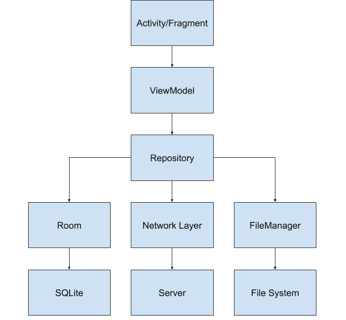
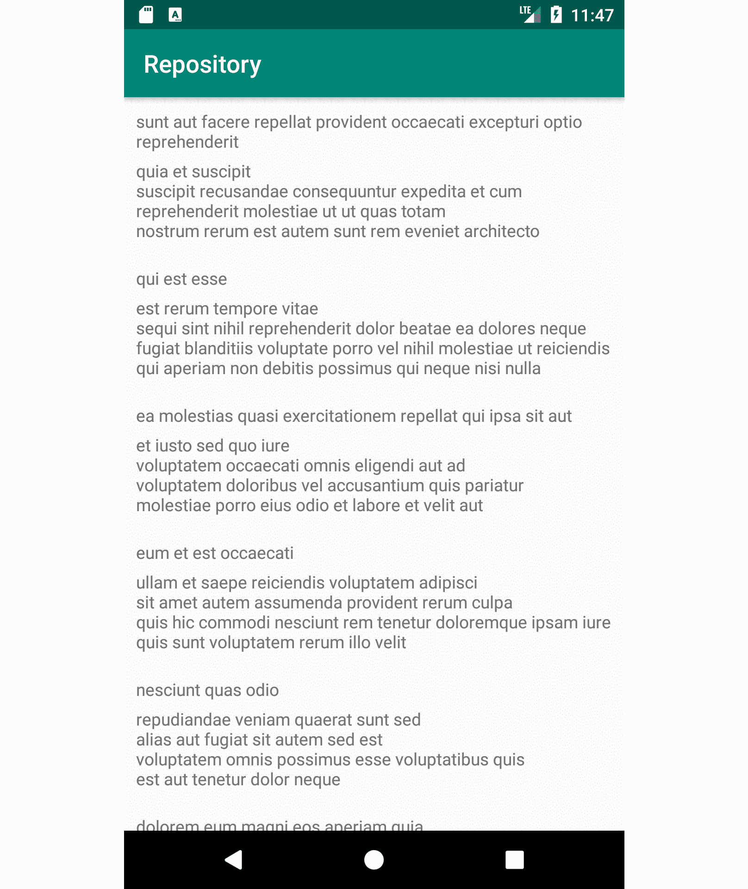
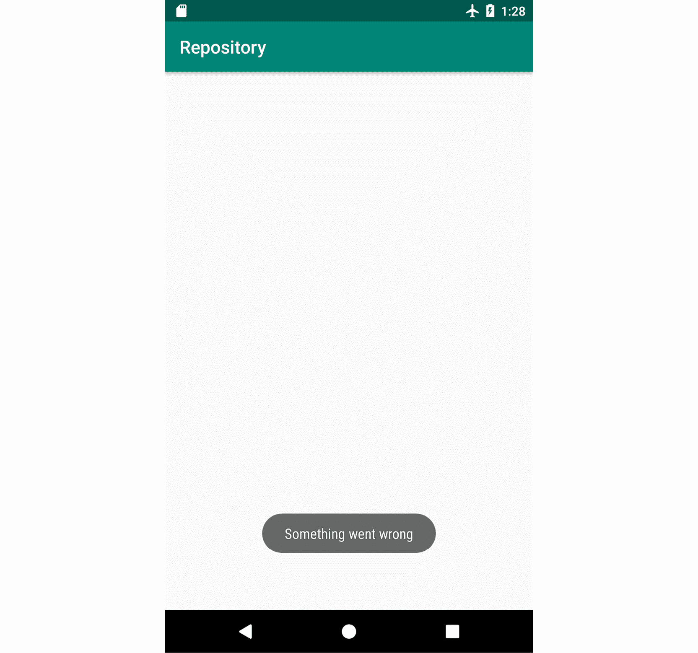
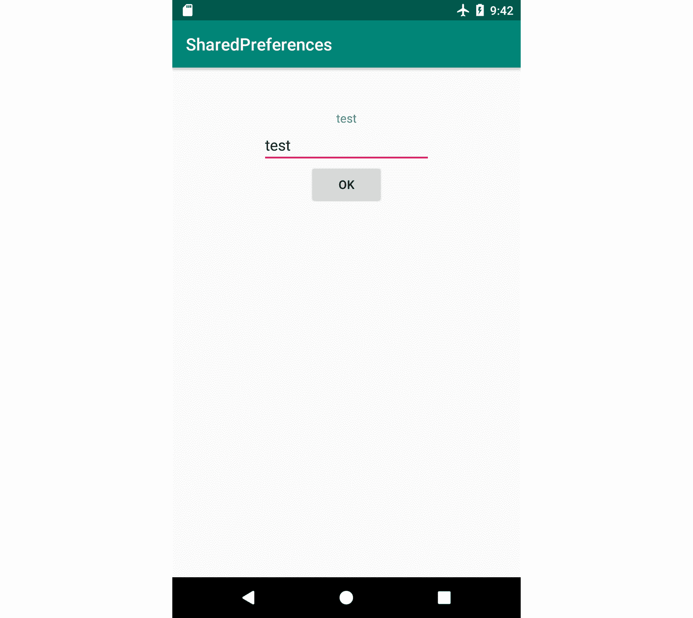
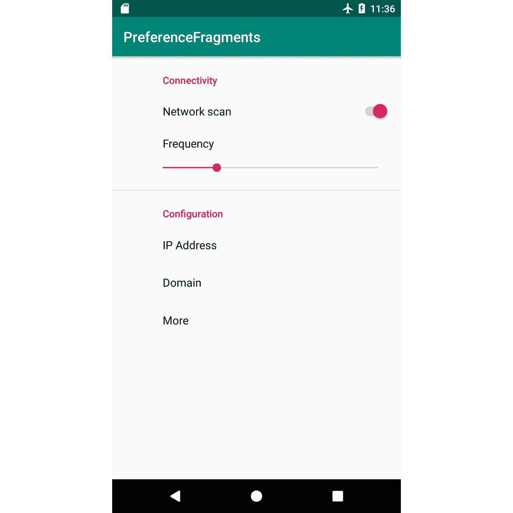
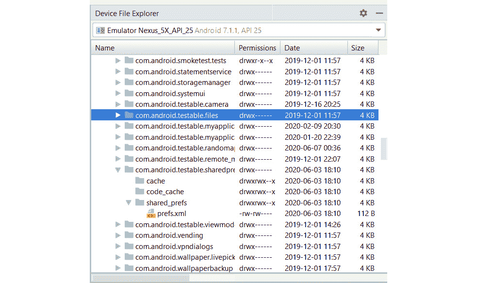
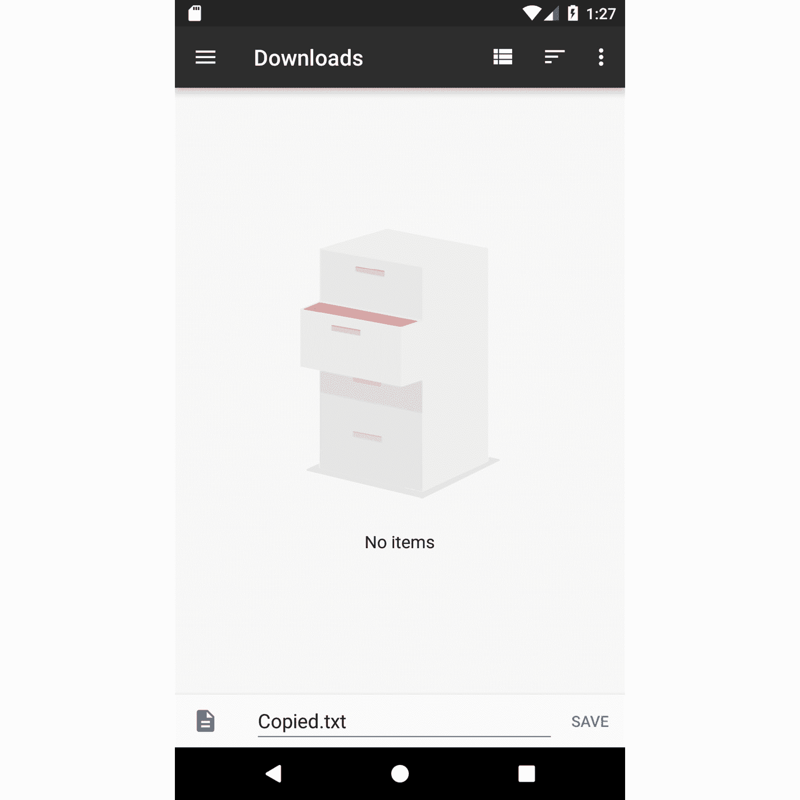
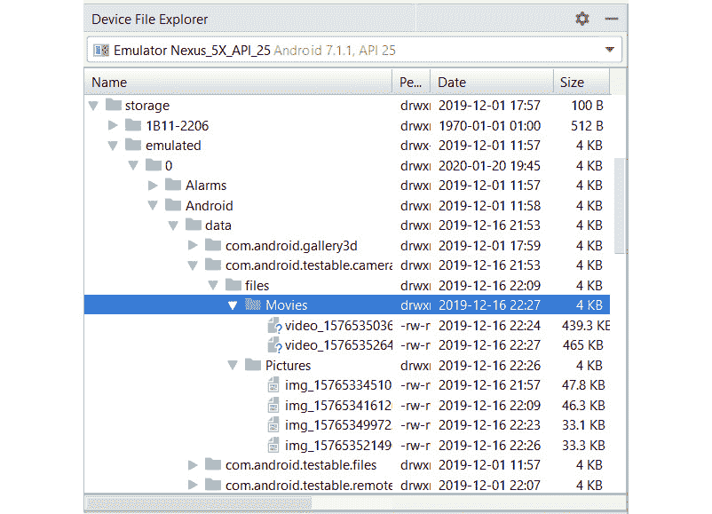
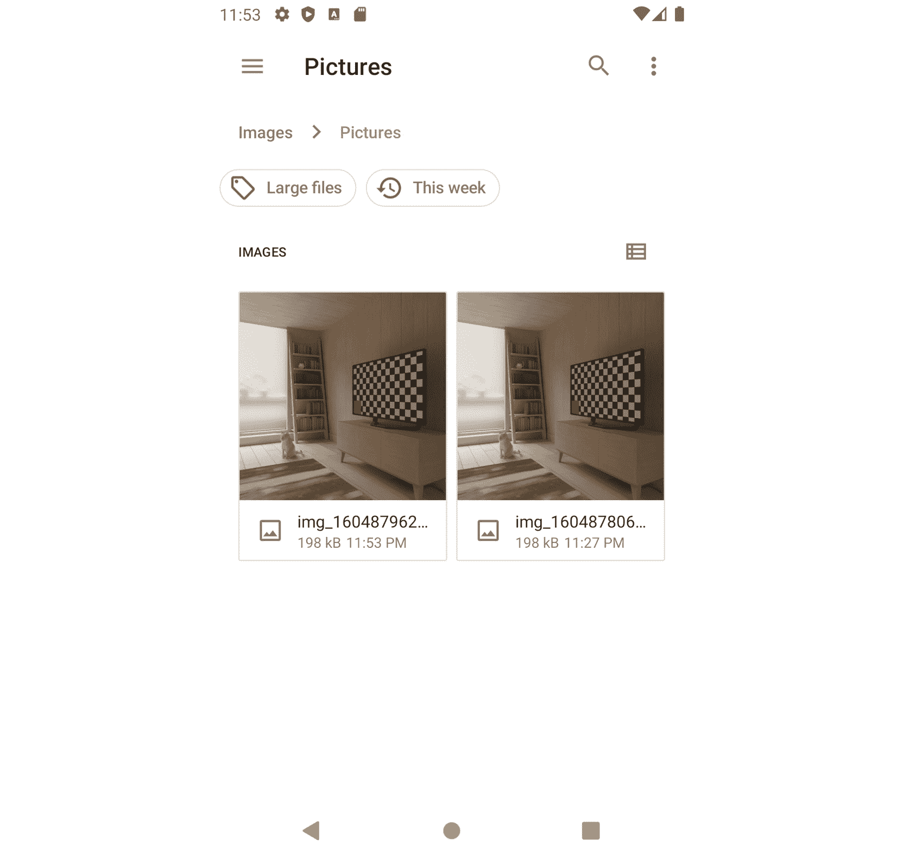

# 第十一章：11.持久化数据

概述

本章将深入探讨 Android 中的数据持久性，以及探索存储库模式。在本章结束时，您将能够构建一个可以连接到多个数据源的存储库，然后使用该存储库从 API 下载文件并将其保存在设备上。您将了解直接在设备上存储（持久化）数据的多种方法以及可用于执行此操作的框架。在处理文件系统时，您将学习其如何分区以及如何在不同位置和使用不同框架中读取和写入文件。

# 介绍

在上一章中，您学习了如何构建代码结构以及如何保存数据。在活动中，您还有机会构建一个存储库，并使用它来访问数据并通过 Room 保存数据。您可能会问：为什么需要这个存储库？本章将试图回答这个问题。通过存储库模式，您将能够以集中的方式从服务器检索数据并将其存储在本地。该模式在需要在多个地方使用相同数据的情况下非常有用，从而避免代码重复，同时还保持 ViewModel 清除任何不必要的额外逻辑。

如果您查看设备上的设置应用程序或许多应用程序的设置功能，您将看到一些相似之处。一系列带有可以打开或关闭的切换的项目。这是通过`SharedPreferences`和`PreferenceFragments`实现的。`SharedPreferences`是一种允许您以键值对的方式将值存储在文件中的方法。它具有专门的读写机制，从而消除了关于线程的担忧。它对小量数据非常有用，并消除了对诸如 Room 之类的东西的需求。

在本章中，您还将了解 Android 文件系统以及其如何结构化为外部和内部存储器。您还将加深对读取和写入权限的理解，以及如何创建`FileProvider`类以便其他应用程序访问您的文件，以及如何在外部驱动器上保存这些文件而无需请求权限。您还将了解如何从互联网下载文件并将其保存在文件系统中。

本章还将探讨的另一个概念是使用*相机*应用程序代表您的应用程序拍摄照片和视频，并使用 FileProviders 将它们保存到外部存储。

# 存储库

存储库是一种模式，它帮助开发人员将数据源的代码与活动和 ViewModel 分开。它提供对数据的集中访问，然后可以进行单元测试：



图 11.1：存储库架构图

在上图中，您可以看到存储库在应用程序代码中的核心作用。其职责包括：

+   保留活动或应用程序所需的所有数据源（SQLite、网络、文件系统）

+   将来自多个源的数据组合和转换为活动级别所需的单一输出

+   将数据从一个数据源传输到另一个数据源（将网络调用的结果保存到 Room 中）

+   刷新过期数据（如果需要）

Room、网络层和`FileManager`代表存储库可以拥有的不同类型的数据源。Room 可用于保存来自网络的大量数据，而文件系统可用于存储小量（`SharedPreferences`）或整个文件。

`ViewModel`将引用您的存储库并将结果传递给活动，活动将显示结果。

注意

存储库应该根据域进行组织，这意味着您的应用程序应该针对不同的域具有不同的存储库，而不是一个巨大的存储库。

## 练习 11.01：创建存储库

在这个练习中，我们将在 Android Studio 中创建一个应用程序，该应用程序使用 Retrofit 连接到位于[`jsonplaceholder.typicode.com/posts`](https://jsonplaceholder.typicode.com/posts)的 API，并检索一系列帖子，然后使用 Room 保存。UI 将在`RecyclerView`中显示每个帖子的标题和正文。我们将使用`ViewModel`实现存储库模式。

为了完成这个练习，我们需要构建以下内容：

+   负责下载和解析 JSON 文件的网络组件

+   负责使用一个实体存储数据的 Room 数据库

+   管理先前构建的组件之间的数据的存储库

+   访问存储库的`ViewModel`

+   显示数据的带有`RecyclerView`模型的活动

执行以下步骤以完成此练习：

1.  让我们从`app/build.gradle`文件夹开始添加。

```kt
    implementation "androidx.constraintlayout       :constraintlayout:2.0.4"
    implementation 'androidx.recyclerview:recyclerview:1.1.0'
    def lifecycle_version = "2.2.0"
    implementation "androidx.lifecycle:lifecycle-extensions       :$lifecycle_version"
    def room_version = "2.2.5"
      implementation "androidx.room:room-runtime:$room_version"
    kapt "androidx.room:room-compiler:$room_version"
    implementation 'com.squareup.retrofit2:retrofit:2.6.2'
    implementation 'com.squareup.retrofit2:converter-gson:2.6.2'
    implementation 'com.google.code.gson:gson:2.8.6'
    testImplementation 'junit:junit:4.12'
    testImplementation 'android.arch.core:core-testing:2.1.0'
    testImplementation 'org.mockito:mockito-core:2.23.0'
    androidTestImplementation 'androidx.test.ext:junit:1.1.2'
    androidTestImplementation 'androidx.test.espresso:espresso-      core:3.3.0
```

1.  我们将需要对处理 API 通信的类进行分组。我们将通过创建一个包含所需网络类的`api`包来实现这一点。

1.  接下来，我们定义一个`Post`类，它将映射 JSON 文件中的数据。在我们的新模型中，将定义 JSON 文件中表示帖子的每个字段：

```kt
data class Post(
    @SerializedName("id") val id: Long,
    @SerializedName("userId") val userId: Long,
    @SerializedName("title") val title: String,
    @SerializedName("body") val body: String
)
```

1.  接下来，我们创建一个`PostService`接口，负责通过 Retrofit 从服务器加载数据。该类将具有一个用于检索帖子列表的方法，并将执行`HTTP GET`调用以检索数据：

```kt
interface PostService {
    @GET("posts")
    fun getPosts(): Call<List<Post>>
}
```

1.  接下来，让我们设置我们的 Room 数据库，其中将包含一个实体和一个数据访问对象。让我们为此定义一个`db`包。

1.  `PostEntity`类将与`Post`类具有类似的字段：

```kt
@Entity(tableName = "posts")
data class PostEntity(
    @PrimaryKey(autoGenerate = true) @ColumnInfo(name = "id")       val id: Long,
    @ColumnInfo(name = "userId") val userId: Long,
    @ColumnInfo(name = "title") val title: String,
    @ColumnInfo(name = "body") val body: String
)
```

1.  `PostDao`应包含用于存储帖子列表和检索帖子列表的方法：

```kt
@Dao
interface PostDao {
    @Insert(onConflict = OnConflictStrategy.REPLACE)
    fun insertPosts(posts: List<PostEntity>)
    @Query("SELECT * FROM posts")
    fun loadPosts(): LiveData<List<PostEntity>>
}
```

1.  最后，在 Room 配置的情况下，`Post`数据库应如下所示：

```kt
@Database(
    entities = [PostEntity::class],
    version = 1
)
abstract class PostDatabase : RoomDatabase() {
    abstract fun postDao(): PostDao
}
```

现在是时候进入`Repository`领域了。因此，让我们创建一个存储库包。

1.  之前，我们定义了两种类型的`Post`，一个是基于 JSON 的模型，一个是实体。让我们定义一个`PostMapper`类，将一个转换为另一个：

```kt
class PostMapper {
    fun serviceToEntity(post: Post): PostEntity {
        return PostEntity(post.id, post.userId, post.title,           post.body)
    }
}
```

1.  现在，让我们定义一个存储库接口，负责加载数据。存储库将从 API 加载数据并使用 Room 存储，然后提供带有 UI 层将消耗的`Room`实体的`LiveData`：

```kt
interface PostRepository {
    fun getPosts(): LiveData<List<PostEntity>>
}
```

1.  现在，让我们为此提供实现：

```kt
class PostRepositoryImpl(
    private val postService: PostService,
    private val postDao: PostDao,
    private val postMapper: PostMapper,
    private val executor: Executor
) : PostRepository {
    override fun getPosts(): LiveData<List<PostEntity>> {
        postService.getPosts().enqueue(object :           Callback<List<Post>> {
            override fun onFailure(call: Call<List<Post>>, t:               Throwable) {
            }
            override fun onResponse(call: Call<List<Post>>,               response: Response<List<Post>>) {
                response.body()?.let { posts ->
                    executor.execute {
                        postDao.insertPosts(posts.map { post ->
                            postMapper.serviceToEntity(post)
                        })
                    }
                }
            }
        })
        return postDao.loadPosts()
    }
}
```

如果您查看上述代码，您会看到当加载帖子时，我们将异步调用网络以加载帖子。调用完成后，我们将在单独的线程上使用新的帖子列表更新 Room。该方法将始终返回 Room 返回的内容。这是因为当 Room 中的数据最终发生变化时，它将传播到观察者。

1.  现在让我们设置我们的依赖关系。因为我们没有依赖注入框架，所以我们将不得不依赖`Application`类，这意味着我们将需要一个`RepositoryApplication`类，在其中我们将初始化存储库所需的所有服务，然后创建存储库：

```kt
class RepositoryApplication : Application() {
    lateinit var postRepository: PostRepository
    override fun onCreate() {
        super.onCreate()
        val retrofit = Retrofit.Builder()
            .baseUrl("https://jsonplaceholder.typicode.com/")
            .addConverterFactory(GsonConverterFactory.create())
            .build()
        val postService =           retrofit.create<PostService>(PostService::class.java)
        val notesDatabase =
            Room.databaseBuilder(applicationContext,               PostDatabase::class.java, "post-db")
                .build()
        postRepository = PostRepositoryImpl(
            postService,
            notesDatabase.postDao(),
            PostMapper(),
            Executors.newSingleThreadExecutor()
        )
    }
}
```

1.  将`RepositoryApplication`添加到`AndroidManifest.xml`中`<application>`标签中的`android:name`。

1.  将互联网权限添加到`AndroidManifest.xml`文件中：

```kt
<uses-permission android:name="android.permission.INTERNET" />
```

1.  现在让我们定义我们的`ViewModel`：

```kt
class PostViewModel(private val postRepository: PostRepository) :   ViewModel() {
    fun getPosts() = postRepository.getPosts()
}
```

1.  每行的`view_post_row.xml`布局文件将如下所示：

```kt
<?xml version="1.0" encoding="utf-8"?>
<androidx.constraintlayout.widget.ConstraintLayout   xmlns:android="http://schemas.android.com/apk/res/android"
    xmlns:app="http://schemas.android.com/apk/res-auto"
    android:layout_width="match_parent"
    android:layout_height="wrap_content"
    android:padding="10dp">
    <TextView
        android:id="@+id/view_post_row_title"
        android:layout_width="wrap_content"
        android:layout_height="wrap_content"
        app:layout_constraintStart_toStartOf="parent"
        app:layout_constraintTop_toTopOf="parent" />
    <TextView
        android:id="@+id/view_post_row_body"
        android:layout_width="wrap_content"
        android:layout_height="wrap_content"
        android:layout_marginTop="5dp"
        app:layout_constraintStart_toStartOf="parent"
        app:layout_constraintTop_toBottomOf           ="@id/view_post_row_title" />
</androidx.constraintlayout.widget.ConstraintLayout>
```

1.  我们活动的`activity_main.xml`布局文件将如下所示：

```kt
<?xml version="1.0" encoding="utf-8"?>
<androidx.constraintlayout.widget.ConstraintLayout   xmlns:android="http://schemas.android.com/apk/res/android"
    xmlns:app="http://schemas.android.com/apk/res-auto"
    xmlns:tools="http://schemas.android.com/tools"
    android:layout_width="match_parent"
    android:layout_height="match_parent"
    tools:context=".MainActivity">
    <androidx.recyclerview.widget.RecyclerView
        android:id="@+id/activity_main_recycler_view"
        android:layout_width="0dp"
        android:layout_height="0dp"
        app:layout_constraintBottom_toBottomOf="parent"
        app:layout_constraintLeft_toLeftOf="parent"
        app:layout_constraintRight_toRightOf="parent"
        app:layout_constraintTop_toTopOf="parent" />
</androidx.constraintlayout.widget.ConstraintLayout>
```

1.  用于行的`PostAdapter`类将如下所示：

```kt
class PostAdapter(private val layoutInflater: LayoutInflater) :
    RecyclerView.Adapter<PostAdapter.PostViewHolder>() {
    private val posts = mutableListOf<PostEntity>()
    override fun onCreateViewHolder(parent: ViewGroup, viewType:       Int): PostViewHolder =
        PostViewHolder(layoutInflater.inflate           (R.layout.view_post_row, parent, false))
    override fun getItemCount() = posts.size
    override fun onBindViewHolder(holder: PostViewHolder,       position: Int) {
        holder.bind(posts[position])
    }
    fun updatePosts(posts: List<PostEntity>) {
        this.posts.clear()
        this.posts.addAll(posts)
        this.notifyDataSetChanged()
    }
    inner class PostViewHolder(containerView: View) :       RecyclerView.ViewHolder(containerView) {
        private val titleTextView: TextView =           containerView.findViewById<TextView>            (R.id.view_post_row_title)
        private val bodyTextView: TextView = 
          containerView.findViewById<TextView>            (R.id.view_post_row_body)
        fun bind(postEntity: PostEntity) {
            bodyTextView.text = postEntity.body
            titleTextView.text = postEntity.title
        }
    }
}
```

1.  最后，`MainActivity`文件将如下所示：

```kt
class MainActivity : AppCompatActivity() {
    private lateinit var postAdapter: PostAdapter
    override fun onCreate(savedInstanceState: Bundle?) {
        super.onCreate(savedInstanceState)
        setContentView(R.layout.activity_main)
        postAdapter = PostAdapter(LayoutInflater.from(this))
        val recyclerView = findViewById<RecyclerView>          (R.id.activity_main_recycler_view)
        recyclerView.adapter = postAdapter
        recyclerView.layoutManager = LinearLayoutManager(this)
        val postRepository = (application as           RepositoryApplication).postRepository
        val postViewModel = ViewModelProvider(this, object :           ViewModelProvider.Factory {
            override fun <T : ViewModel?> create(modelClass:               Class<T>): T {
                return PostViewModel(postRepository) as T
            }
        }).get(PostViewModel::class.java)
        postViewModel.getPosts().observe(this, Observer {
            postAdapter.updatePosts(it)
        })
    }
}
```

如果您运行上述代码，您将看到以下输出：



图 11.2：练习 11.01 的输出

您现在可以打开和关闭互联网，关闭和重新打开应用程序，以查看最初持久化的数据是否会继续显示。在当前实现中，错误处理目前为空。这意味着如果在检索帖子列表时出现问题，用户将不会得到通知。这可能会成为一个问题，并使用户感到沮丧。大多数应用程序在其用户界面上显示一些错误消息或其他内容，其中最常见的错误消息之一是“出现问题，请重试”，这是在错误没有被正确识别时用作通用占位符。

## 练习 11.02：添加错误处理

在这个练习中，我们将修改之前的练习。在出现互联网错误的情况下，我们将确保它会显示一个带有消息“出现问题”的提示。在添加错误处理的过程中，我们还需要通过创建一个新的模型类来消除 UI 和实体类之间的依赖，该模型类将保存相关数据。

为了处理错误，我们需要构建以下内容：

+   一个新的模型类，只包含正文和文本

+   一个包含成功、错误和加载三个内部类的密封类

+   我们的新模型和网络帖子之间的映射函数

执行以下步骤以完成此练习：

1.  让我们从我们的新模型开始。当与存储库模式结合使用时，这种类型的模型很常见，原因很简单。新模型可能包含特定于此屏幕的数据，需要一些额外的逻辑（假设您有一个具有`firstName`和`lastName`的用户，但您的 UI 要求在同一个`TextView`中显示两者。通过创建一个具有名称字段的新模型，您可以解决此问题，并且还可以对转换进行单元测试，并避免将连接移动到 UI 层）：

```kt
data class UiPost(
    val title: String,
    val body: String
)
```

1.  现在我们来看看我们的新密封类。这个密封类的子类包含了数据加载的所有状态。当存储库开始加载数据时，将发出“加载”状态；当存储库成功加载数据并包含帖子列表时，将发出“成功”状态；当发生错误时，将发出“错误”状态：

```kt
sealed class Result {
    object Loading : Result()
    class Success(val uiPosts: List<UiPost>) : Result()
    class Error(val throwable: Throwable) : Result()
}
```

1.  `PostMapper`中的映射方法将如下所示。它有一个额外的方法，将从 API 中提取的数据转换为 UI 模型，该模型只包含 UI 正确显示所需的字段：

```kt
class PostMapper {
    fun serviceToEntity(post: Post): PostEntity {
        return PostEntity(post.id, post.userId, post.title,           post.body)
    }
    fun serviceToUi(post: Post): UiPost {
        return UiPost(post.title, post.body)
    }
}
```

1.  现在，让我们修改`PostRepository`：

```kt
interface PostRepository {
    fun getPosts(): LiveData<Result>
}
```

1.  现在让我们修改`PostRepositoryImpl`。我们的结果将是`MutableLiveData`，它将以“加载”值开始，并根据 HTTP 请求的状态，它将发送一个带有项目列表的“成功”消息，或者带有错误“Retrofit 遇到”的“错误”消息。这种方法将不再依赖于始终显示存储的值。当请求成功时，将传递 HTTP 调用的输出，而不是 Room 的输出：

```kt
override fun getPosts(): LiveData<Result> {
        val result = MutableLiveData<Result>()
        result.postValue(Result.Loading)
        postService.getPosts().enqueue(object :           Callback<List<Post>> {
            override fun onFailure(call: Call<List<Post>>, t:               Throwable) {
                result.postValue(Result.Error(t))
            }
            override fun onResponse(call: Call<List<Post>>,               response: Response<List<Post>>) {
                if (response.isSuccessful) {
                    response.body()?.let { posts ->
                        executor.execute {
                            postDao.insertPosts(posts.map                               { post ->
                                postMapper.serviceToEntity(post)
                            })
                            result.postValue(Result                               .Success(posts.map { post ->
                                postMapper.serviceToUi(post)
                            }))
                        }
                    }
                } else {
                    result.postValue(Result.Error                       (RuntimeException("Unexpected error")))
                }
            }
        })
        return result
    }
```

1.  在您观察实时数据的活动中，需要实现以下更改。在这里，我们将检查每个状态并相应地更新 UI。如果出现错误，我们显示错误消息；如果成功，我们显示项目列表；当正在加载时，我们显示一个进度条，向用户指示后台正在进行工作：

```kt
        postViewModel.getPosts().observe(this,           Observer { result ->
            when (result) {
                is Result.Error -> {
                    Toast.makeText(applicationContext,                       R.string.error_message, Toast.LENGTH_LONG)
                        .show()
                    result.throwable.printStackTrace()
                }
                is Result.Loading -> {
                    // TODO show loading spinner
                }
                is Result.Success -> {
                    postAdapter.updatePosts(result.uiPosts)
                }
            }
        })
```

1.  最后，您的适配器应该如下所示：

```kt
class PostAdapter(private val layoutInflater: LayoutInflater) :
    RecyclerView.Adapter<PostAdapter.PostViewHolder>() {
    private val posts = mutableListOf<UiPost>()
    override fun onCreateViewHolder(parent: ViewGroup, viewType:       Int): PostViewHolder =
        PostViewHolder(layoutInflater           .inflate(R.layout.view_post_row, parent, false))
    override fun getItemCount(): Int = posts.size
    override fun onBindViewHolder(holder: PostViewHolder,       position: Int) {
        holder.bind(posts[position])
    }
    fun updatePosts(posts: List<UiPost>) {
        this.posts.clear()
        this.posts.addAll(posts)
        this.notifyDataSetChanged()
    }
    inner class PostViewHolder(containerView: View) :       RecyclerView.ViewHolder(containerView) {
        private val titleTextView: TextView =         containerView.findViewById<TextView>          (R.id.view_post_row_title)
        private val bodyTextView: TextView =           containerView.findViewById<TextView>            (R.id.view_post_row_body)
        fun bind(post: UiPost) {
            bodyTextView.text = post.body
            titleTextView.text = post.title
        }
    }
}
```

当您运行上述代码时，您应该看到*图 11.3*中呈现的屏幕：



图 11.3：练习 11.02 的输出

从这一点开始，存储库可以以多种方式扩展：

+   添加算法，只有在经过一定时间后才会请求数据

+   定义一个更复杂的结果类，该类将能够存储缓存数据以及错误消息

+   添加内存缓存

+   添加滑动刷新功能，当`RecyclerView`向下滑动时刷新数据，并将加载小部件连接到`Loading`状态

# 偏好设置

假设您的任务是集成使用 OAuth 等内容的第三方 API，以实现使用 Facebook、Google 等方式进行登录。这些机制的工作方式如下：它们会给您一个令牌，您必须将其存储在本地，然后可以使用它发送其他请求以访问用户数据。您面临的问题是：您如何存储该令牌？您是否只使用 Room 存储一个令牌？您是否将令牌保存在单独的文件中，并实现用于编写文件的方法？如果必须同时访问该文件的多个位置怎么办？`SharedPreferences`是这些问题的答案。`SharedPreferences`是一种功能，允许您将布尔值、整数、浮点数、长整型、字符串和字符串集保存到 XML 文件中。当您想要保存新值时，您指定要为关联键保存哪些值，完成后，您提交更改，这将以异步方式触发将更改保存到 XML 文件中。`SharedPreferences`映射也保存在内存中，因此当您想要读取这些值时，它是瞬时的，从而消除了读取 XML 文件的异步调用的需要。

访问`SharedPreferences`数据的标准方式是通过`SharedPreferences`对象和更近期的`EncryptedSharedPreferences`选项（如果您希望保持数据加密）。还有一种通过`PreferenceFragments`的专门实现。在您想要实现类似设置的屏幕，并且希望存储用户希望调整的不同配置数据的情况下，这些是有用的。

## SharedPreferences

访问`SharedPreference`对象的方式是通过`Context`对象：

```kt
val prefs = getSharedPreferences("my-prefs-file",   Context.MODE_PRIVATE)
```

第一个参数是您指定偏好名称的地方，第二个是您希望如何将文件暴露给其他应用程序。目前，最佳模式是私有模式。其他所有模式都存在潜在的安全风险。

有一种专门的实现用于访问默认的`SharedPreferences`文件，这是由`PreferenceFragment`使用的。

```kt
PreferenceManager.getDefaultSharedPreferences(context)
```

如果要将数据写入偏好文件，首先需要访问偏好编辑器。编辑器将允许您访问写入数据。然后可以在编辑器中写入数据。完成写入后，必须应用更改，这将触发将数据持久保存到 XML 文件，并同时更改内存中的值。对于应用偏好文件上的更改，您有两种选择：`apply`或`commit`。 `apply`将立即保存更改到内存中，但然后写入磁盘将是异步的，这对于您想从应用程序的主线程调用此操作是有利的。 `commit`会同步执行所有操作，并给您一个布尔结果，通知您操作是否成功。在实践中，`apply`往往优于`commit`。

```kt
     val editor = prefs.edit()
     editor.putBoolean("my_key_1", true)
     editor.putString("my_key_2", "my string")
     editor.putLong("my_key_3", 1L)
     editor.apply()
```

现在，您想要清除所有数据。同样的原则将适用；您需要`editor`、`clear`和`apply`：

```kt
     val editor = prefs.edit()
     editor.clear()
     editor.apply()
```

如果要读取先前保存的值，可以使用`SharedPreferences`对象读取存储的值。如果没有保存的值，可以选择返回默认值。

```kt
     prefs.getBoolean("my_key_1", false)
     prefs.getString("my_key_2", "")
     prefs.getLong("my_key_3", 0L)
```

## 练习 11.03：包装 SharedPreferences

我们将构建一个应用程序，显示`TextView`、`EditText`和一个按钮。`TextView`将显示在`SharedPreferences`中保存的先前值。用户可以输入新文本，当单击按钮时，文本将保存在`SharedPreferences`中，`TextView`将显示更新后的文本。为了使代码更具可测试性，我们需要使用`ViewModel`和`LiveData`。

为了完成这个练习，我们需要创建一个`Wrapper`类，它将负责保存文本。这个类将以`LiveData`的形式返回文本的值。这将被注入到我们的`ViewModel`中，并绑定到活动中：

1.  让我们首先将适当的库添加到`app/build.gradle`中：

```kt
    implementation       "androidx.constraintlayout:constraintlayout:2.0.4"
    def lifecycle_version = "2.2.0"
    implementation "androidx.lifecycle:lifecycle-      extensions:$lifecycle_version"
    testImplementation 'junit:junit:4.12'
    testImplementation 'android.arch.core:core-testing:2.1.0'
    testImplementation 'org.mockito:mockito-core:2.23.0'
    androidTestImplementation 'androidx.test.ext:junit:1.1.2'
    androidTestImplementation       'androidx.test.espresso:espresso-core:3.3.0'
```

1.  让我们制作我们的`Wrapper`类，它将监听`SharedPreferences`的更改，并在偏好更改时更新`LiveData`的值。该类将包含保存新文本和检索`LiveData`的方法：

```kt
const val KEY_TEXT = "keyText"
class PreferenceWrapper(private val sharedPreferences:   SharedPreferences) {
    private val textLiveData = MutableLiveData<String>()
    init {
        sharedPreferences           .registerOnSharedPreferenceChangeListener { _, key ->
            when (key) {
                KEY_TEXT -> {
                    textLiveData.postValue(sharedPreferences                       .getString(KEY_TEXT, ""))
                }
            }
        }
    }
    fun saveText(text: String) {
        sharedPreferences.edit()
            .putString(KEY_TEXT, text)
            .apply()
    }
    fun getText(): LiveData<String> {
        textLiveData.postValue(sharedPreferences           .getString(KEY_TEXT, ""))
        return textLiveData
    }
}
```

注意文件顶部。我们添加了一个监听器，这样当我们的`SharedPreferences`值改变时，我们可以查找新值并更新我们的`LiveData`模型。这将允许我们观察`LiveData`的任何更改并只更新 UI。`saveText`方法将打开编辑器，设置新值并应用更改。`getText`方法将读取上次保存的值，在`LiveData`中设置它，并返回`LiveData`对象。这在应用程序打开并且我们想要在应用程序关闭之前访问上次的值时非常有用。

1.  现在，让我们使用偏好设置的实例设置`Application`类：

```kt
class PreferenceApplication : Application() {
    lateinit var preferenceWrapper: PreferenceWrapper
    override fun onCreate() {
        super.onCreate()
        preferenceWrapper =           PreferenceWrapper(getSharedPreferences("prefs",             Context.MODE_PRIVATE))
    }
}
```

1.  现在，让我们在`AndroidManifest.xml`的`application`标签中添加适当的属性：

```kt
android:name=".PreferenceApplication"
```

1.  现在，让我们构建`ViewModel`组件：

```kt
class PreferenceViewModel(private val preferenceWrapper:   PreferenceWrapper) : ViewModel() {
    fun saveText(text: String) {
        preferenceWrapper.saveText(text)
    }
    fun getText(): LiveData<String> {
        return preferenceWrapper.getText()
    }
}
```

1.  最后，让我们定义我们的`activity_main.xml`布局文件：

```kt
activity_main.xml
9    <TextView
10        android:id="@+id/activity_main_text_view"
11        android:layout_width="wrap_content"
12        android:layout_height="wrap_content"
13        android:layout_marginTop="50dp"
14        app:layout_constraintLeft_toLeftOf="parent"
15        app:layout_constraintRight_toRightOf="parent"
16        app:layout_constraintTop_toTopOf="parent" />
17
18    <EditText
19        android:id="@+id/activity_main_edit_text"
20        android:layout_width="200dp"
21        android:layout_height="wrap_content"
22        android:inputType="none"
23        app:layout_constraintLeft_toLeftOf="parent"
24        app:layout_constraintRight_toRightOf="parent"
25        app:layout_constraintTop_toBottomOf=             "@id/activity_main_text_view" />
26
27    <Button
28        android:id="@+id/activity_main_button"
29        android:layout_width="wrap_content"
30        android:layout_height="wrap_content"
31        android:inputType="none"
32        android:text="@android:string/ok"
33        app:layout_constraintLeft_toLeftOf="parent"
34        app:layout_constraintRight_toRightOf="parent"
35        app:layout_constraintTop_toBottomOf=            "@id/activity_main_edit_text" /> 
The complete code for this step can be found at http://packt.live/39RhIj0.
```

1.  最后，在`MainActivity`中执行以下步骤：

```kt
class MainActivity : AppCompatActivity() {
    override fun onCreate(savedInstanceState: Bundle?) {
        super.onCreate(savedInstanceState)
        setContentView(R.layout.activity_main)
        val preferenceWrapper = (application as         PreferenceApplication).preferenceWrapper
        val preferenceViewModel = ViewModelProvider(this, object           : ViewModelProvider.Factory {
            override fun <T : ViewModel?> create(modelClass:               Class<T>): T {
                return PreferenceViewModel(preferenceWrapper)                   as T
            }
        }).get(PreferenceViewModel::class.java)
        preferenceViewModel.getText().observe(this, Observer {
        findViewById<TextView>(R.id.activity_main_text_view)           .text = it
        })
        findViewById<Button>(R.id.activity_main_button)          .setOnClickListener {
        preferenceViewModel.saveText(findViewById<EditText>          (R.id.activity_main_edit_text).text.toString())
        }
    }
}
```

上述代码将产生*图 11.4*中呈现的输出：



图 11.4：练习 11.03 的输出

插入值后，尝试关闭应用程序并重新打开它。应用程序将显示上次持久化的值。

## PreferenceFragment

如前所述，`PreferenceFragment`是依赖于`SharedPreferences`来存储用户设置的片段的专门实现。其功能包括基于开/关切换存储布尔值，基于向用户显示的对话框存储文本，基于单选和多选对话框存储字符串集，基于`SeekBars`存储整数，并对部分进行分类并链接到其他`PreferenceFragment`类。

虽然`PreferenceFragment`类是 Android 框架的一部分，但它们被标记为已弃用，这意味着片段的推荐方法是依赖于 Jetpack Preference 库，该库引入了`PreferenceFragmentCompat`。`PreferenceFragmentCompat`对确保新的 Android 框架和旧的 Android 框架之间的向后兼容性非常有用。

构建`PreferenceFragment`类需要两个东西：

+   `res/xml`文件夹中的资源，其中包含偏好设置的结构

+   一个扩展`PreferenceFragment`的类，它将 XML 文件与片段链接起来

如果您想从非`PreferenceFragment`资源访问您的`PreferenceFragment`存储的值，可以使用`PreferenceManager.getDefaultSharedPreferences(context)`方法访问`SharedPreference`对象。访问值的键是您在 XML 文件中定义的键。

名为 settings_preference.xml 的偏好 XML 文件示例如下：

```kt
<?xml version="1.0" encoding="utf-8"?>
<PreferenceScreen xmlns:app="http://schemas.android.com/apk/res-auto">
    <PreferenceCategory app:title="Primary settings">
        <SwitchPreferenceCompat
            app:key="work_offline"
            app:title="Work offline" />
        <Preference
            app:icon="@mipmap/ic_launcher"
            app:key="my_key"
            app:summary="Summary"
            app:title="Title" />
    </PreferenceCategory>
</PreferenceScreen>
```

对于每个偏好设置，您可以显示图标、标题、摘要、当前值以及它是否可选择。一个重要的事情是键以及如何将其链接到您的 Kotlin 代码。您可以使用`strings.xml`文件声明不可翻译的字符串，然后在您的 Kotlin 代码中提取它们。

您的`PreferenceFragment`将类似于这样：

```kt
class MyPreferenceFragment : PreferenceFragmentCompat() {
    override fun onCreatePreferences(savedInstanceState: Bundle?,       rootKey: String?) {
        setPreferencesFromResource(R.xml.settings_preferences,           rootKey)
    }
}
```

`onCreatePreferences`方法是抽象的，您需要实现它以通过`setPreferencesFromResource`方法指定偏好设置的 XML 资源。

您还可以使用`findPreference`方法以编程方式访问偏好设置：

```kt
findPreference<>(key)
```

这将返回一个将从`Preference`扩展的对象。对象的性质应与在 XML 中为该特定键声明的类型匹配。您可以以编程方式修改`Preference`对象并更改所需的字段。

您还可以使用`PreferenceFragment`中继承的`PreferenceManager`类上的`createPreferenceScreen(Context)`来以编程方式构建设置屏幕：

```kt
val preferenceScreen =   preferenceManager.createPreferenceScreen(context)
```

您可以在`PreferenceScreen`容器上使用`addPreference(Preference)`方法添加新的`Preference`对象：

```kt
val editTextPreference = EditTextPreference(context)
editTextPreference.key = "key"
editTextPreference.title = "title"
val preferenceScreen = preferenceManager.createPreferenceScreen(context)
preferenceScreen.addPreference(editTextPreference)
setPreferenceScreen(preferenceScreen)
```

现在让我们继续下一个练习，自定义您的设置。

## 练习 11.04：自定义设置

在这个练习中，我们将构建 VPN 应用的设置。设置页面的产品要求如下：

+   `SeekBar`

+   **配置**：IP 地址 - 文本；域 - 文本

+   `使用移动数据`，带有一个切换和一个下面包含文本`明智地管理您的移动数据`的不可选择选项。

执行以下步骤以完成此练习：

1.  让我们首先添加 Jetpack Preference 库：

```kt
implementation 'androidx.preference:preference-ktx:1.1.1'
```

1.  在`res/values`中，创建一个名为`preference_keys.xml`的文件，并定义`More preferences`屏幕的键：

```kt
<?xml version="1.0" encoding="utf-8"?>
<resources>
    <string name="key_mobile_data"       translatable="false">mobile_data</string>
</resources>
```

1.  如果`res`中没有`xml`文件夹，请创建一个。

1.  在`res/xml`文件夹中创建`preferences_more.xml`文件。

1.  在`preferences_more.xml`文件中，添加以下首选项：

```kt
<?xml version="1.0" encoding="utf-8"?>
<PreferenceScreen xmlns:app=  "http://schemas.android.com/apk/res-auto">
    <SwitchPreferenceCompat
        app:key="@string/key_mobile_data"
        app:title="@string/mobile_data" />
    <Preference
        app:selectable="false"
        app:summary="@string/manage_data_wisely" />
</PreferenceScreen>
```

1.  在`strings.xml`中，添加以下字符串：

```kt
<string name="mobile_data">Mobile data</string>
<string name="manage_data_wisely">Manage your data   wisely</string>
```

1.  创建一个名为`MorePreferenceFragment`的`PreferenceFragment`类：

```kt
class MorePreferenceFragment : PreferenceFragmentCompat() {
    override fun onCreatePreferences(savedInstanceState: Bundle?,       rootKey: String?) {
        setPreferencesFromResource(R.xml.preferences_more,           rootKey)
    }
}
```

我们已经完成了`More`部分。现在让我们创建主要部分。

1.  让我们为主要首选项部分创建键。在`preference_keys.xml`中，添加以下内容：

```kt
<string name="key_network_scan"   translatable="false">network_scan</string>
<string name="key_frequency"   translatable="false">frequency</string>
<string name="key_ip_address"   translatable="false">ip_address</string>
<string name="key_domain" translatable="false">domain</string>
```

1.  在`res/xml`中，创建`preferences_settings.xml`文件。

1.  现在，根据规格定义您的首选项：

```kt
<?xml version="1.0" encoding="utf-8"?>
<PreferenceScreen xmlns:app=  "http://schemas.android.com/apk/res-auto">
    <PreferenceCategory app:title="@string/connectivity">
        <SwitchPreferenceCompat
            app:key="@string/key_network_scan"
            app:title="@string/network_scan" />
        <SeekBarPreference
            app:key="@string/key_frequency"
            app:title="@string/frequency" />
    </PreferenceCategory>
    <PreferenceCategory app:title="@string/configuration">
        <EditTextPreference
            app:key="@string/key_ip_address"
            app:title="@string/ip_address" />
        <EditTextPreference
            app:key="@string/key_domain"
            app:title="@string/domain" />
    </PreferenceCategory>
PreferenceFragment and another. By default, the system will do the transition for us, but there is a way to override this behavior in case we want to update our UI.
```

1.  在`strings.xml`中，确保您有以下值：

```kt
<string name="connectivity">Connectivity</string>
<string name="network_scan">Network scan</string>
<string name="frequency">Frequency</string>
<string name="configuration">Configuration</string>
<string name="ip_address">IP Address</string>
<string name="domain">Domain</string>
<string name="more">More</string>
```

1.  创建一个名为`SettingsPreferenceFragment`的片段。

1.  添加以下设置：

```kt
class SettingsPreferenceFragment : PreferenceFragmentCompat() {
    override fun onCreatePreferences(savedInstanceState: Bundle?,       rootKey: String?) {
        setPreferencesFromResource(R.xml.preferences_settings,           rootKey)
    }
}
```

1.  现在，让我们将`Fragments`添加到我们的活动中。

1.  在`activity_main.xml`中，定义一个`FrameLayout`标签来包含片段：

```kt
<?xml version="1.0" encoding="utf-8"?>
<FrameLayout   xmlns:android="http://schemas.android.com/apk/res/android"
    xmlns:tools="http://schemas.android.com/tools"
    android:layout_width="match_parent"
    android:layout_height="match_parent"
    tools:context=".MainActivity"
    android:id="@+id/fragment_container"/>
```

1.  最后，在`MainActivity`中执行以下步骤：

```kt
class MainActivity : AppCompatActivity(),
    onPreferenceStartFragment from the PreferenceFragmentCompat.OnPreferenceStartFragmentCallback interface. This allows us to intercept the switch between fragments and add our own behavior. The first half of the method will use the inputs of the method to create a new instance of MorePreferenceFragment, while the second half performs the fragment transaction. Then, we return true because we have handled the transition ourselves.
```

1.  运行上述代码将产生以下输出：

图 11.5：练习 11.04 的输出

现在，我们可以监视首选项的更改并在 UI 中显示它们。我们可以将此功能应用于 IP 地址和域部分，以显示用户输入的摘要。

1.  现在让我们修改`SettingsPreferenceFragment`，以便在值更改时以编程方式设置监听器，这将在摘要中显示新值。当首次打开屏幕时，我们还需要设置保存的值。我们需要使用`findPreference(key)`来定位我们想要修改的首选项。这允许我们以编程方式修改首选项。我们还可以在首选项上注册监听器，这将使我们能够访问新值。在我们的情况下，我们可以注册一个监听器，以便在 IP 地址更改时更新字段的摘要，这样我们就可以根据用户在`EditText`中输入的内容更新字段的摘要：

```kt
class SettingsPreferenceFragment : PreferenceFragmentCompat() {
    override fun onCreatePreferences(savedInstanceState: Bundle?,       rootKey: String?) {
        setPreferencesFromResource(R.xml.preferences_settings,           rootKey)
        val ipAddressPref =           findPreference<EditTextPreference>(getString             (R.string.key_ip_address))
        ipAddressPref?.setOnPreferenceChangeListener {           preference, newValue ->
            preference.summary = newValue.toString()
            true
        }
        val domainPref = findPreference<EditTextPreference>          (getString(R.string.key_domain))
        domainPref?.setOnPreferenceChangeListener { preference,           newValue ->
            preference.summary = newValue.toString()
            true
        }
        val sharedPrefs = PreferenceManager           .getDefaultSharedPreferences(requireContext())
        ipAddressPref?.summary = sharedPrefs           .getString(getString(R.string.key_ip_address), "")
        domainPref?.summary = sharedPrefs           .getString(getString(R.string.key_domain), "")
    }
}
```

`PreferenceFragment`是为任何应用构建类似设置功能的好方法。它与`SharedPreferences`的集成和内置 UI 组件允许开发人员比通常更快地构建元素，并解决处理每个设置元素的点击和插入的许多问题。

# 文件

我们已经讨论了 Room 和`SharedPreferences`，并指定了它们存储的数据是如何写入文件的。您可能会问自己，这些文件存储在哪里？这些特定的文件存储在内部存储中。内部存储是每个应用程序的专用空间，其他应用程序无法访问（除非设备已 root）。您的应用程序使用的存储空间没有限制。但是，用户可以从“设置”菜单中删除您的应用程序文件的能力。内部存储占用总可用空间的一小部分，这意味着在存储文件时应该小心。还有外部存储。您的应用程序存储的文件可供其他应用程序访问，其他应用程序存储的文件也可供您的应用程序访问：

注意

在 Android Studio 中，您可以使用设备文件浏览器工具浏览设备或模拟器上的文件。内部存储位于`/data/data/{packageName}`。如果您可以访问此文件夹，这意味着设备已经 root。使用这个，您可以可视化数据库文件和`SharedPreferences`文件。



图 11.6：Android 设备文件浏览器

## 内部存储

内部存储不需要用户的权限。要访问内部存储目录，可以使用`Context`对象的以下方法之一：

+   `getDataDir()`: 返回应用沙盒的根文件夹。

+   `getFilesDir()`: 一个专门用于应用文件的文件夹；推荐使用。

+   `getCacheDir()`: 一个专门用于缓存文件的文件夹。在这里存储文件并不保证以后可以检索到它们，因为系统可能决定删除此目录以释放内存。这个文件夹与“设置”中的“清除缓存”选项相关联。

+   `getDir(name, mode)`: 返回一个文件夹，如果不存在则根据指定的名称创建。

当用户从“设置”中使用“清除数据”选项时，大多数这些文件夹将被删除，使应用程序回到类似于新安装的状态。当应用被卸载时，这些文件也将被删除。

读取缓存文件的典型示例如下：

```kt
        val cacheDir = context.cacheDir
        val fileToReadFrom = File(cacheDir, "my-file.txt")
        val size = fileToReadFrom.length().toInt()
        val bytes = ByteArray(size)
        val tmpBuff = ByteArray(size)
        val fis = FileInputStream(fileToReadFrom)
        try {
            var read = fis.read(bytes, 0, size)
            if (read < size) {
                var remain = size - read
                while (remain > 0) {
                    read = fis.read(tmpBuff, 0, remain)
                    System.arraycopy(tmpBuff, 0, bytes,                                      size - remain, read)
                    remain -= read
                }
            }
        } catch (e: IOException) {
            throw e
        } finally {
            fis.close()
        }
```

上面的示例将从`Cache`目录中的`my-file.txt`读取，并为该文件创建`FileInputStream`。然后，将使用一个缓冲区来收集文件中的字节。收集到的字节将被放入`bytes`字节数组中，其中包含从该文件中读取的所有数据。当文件的整个长度被读取时，读取将停止。

写入`my-file.txt`文件将如下所示：

```kt
        val bytesToWrite = ByteArray(100)
        val cacheDir = context.cacheDir
        val fileToWriteIn = File(cacheDir, "my-file.txt")
        try {
            if (!fileToWriteIn.exists()) {
                fileToWriteIn.createNewFile()
            }
            val fos = FileOutputStream(fileToWriteIn)
            fos.write(bytesToWrite)
            fos.close()
        } catch (e: Exception) {
            e.printStackTrace()
        }
```

上面的示例所做的是获取要写入的字节数组，创建一个新的`File`对象，如果不存在则创建文件，并通过`FileOutputStream`将字节写入文件。

注意

处理文件有许多替代方法。读取器（`StreamReader`，`StreamWriter`等）更适合基于字符的数据。还有第三方库可以帮助进行磁盘 I/O 操作。其中一个最常见的帮助进行 I/O 操作的第三方是 Okio。它起初是`OkHttp`库的一部分，用于与 Retrofit 一起进行 API 调用。Okio 提供的方法与它用于在 HTTP 通信中写入和读取数据的方法相同。

## 外部存储

在外部存储中读写需要用户的读写权限。如果授予写入权限，则您的应用程序可以读取外部存储。一旦这些权限被授予，您的应用程序就可以在外部存储上做任何它想做的事情。这可能会带来问题，因为用户可能不选择授予这些权限。然而，有专门的方法可以让您在专门为您的应用程序提供的外部存储中进行写入。

从`Context`和`Environment`对象中访问外部存储的一些常见方式是：

+   `Context.getExternalFilesDir(mode)`：这个方法将返回专门为你的应用程序在外部存储上的目录路径。指定不同的模式（图片、电影等）将创建不同的子文件夹，具体取决于你希望如何保存你的文件。这个方法*不需要权限*。

+   `Context.getExternalCacheDir()`：这将指向外部存储上应用程序的缓存目录。对这个`cache`文件夹应用相同的考虑。这个方法*不需要权限*。

+   `Environment`类可以访问设备上一些最常见文件夹的路径。然而，在新设备上，应用可能无法访问这些文件和文件夹。

注意

避免使用硬编码的文件和文件夹路径。安卓操作系统可能会根据设备或操作系统的不同而改变文件夹的位置。

## FileProvider

这代表了`ContentProviders`的一个专门实现，有助于组织应用程序的文件和文件夹结构。它允许你指定一个 XML 文件，在其中定义你的文件应该如何在内部和外部存储之间分割。它还让你有能力通过隐藏路径并生成一个唯一的 URI 来授予其他应用程序对你的文件的访问权限。

`FileProvider`让你可以在六个不同的文件夹中选择设置你的文件夹层次结构：

+   `Context.getFilesDir()`（文件路径）

+   `Context.getCacheDir()`（缓存路径）

+   `Environment.getExternalStorageDirectory()`（外部路径）

+   `Context.getExternalFilesDir(null)`（外部文件路径）

+   `Context.getExternalCacheDir()`（外部缓存路径）

+   `Context.getExternalMediaDirs()`的第一个结果（外部媒体路径）

`FileProvider`的主要优点在于它提供了对文件的抽象，因为它让开发人员在 XML 文件中定义路径，并且更重要的是，如果你选择将文件存储在外部存储上，你不需要向用户请求权限。另一个好处是它使共享内部文件更容易，同时让开发人员控制其他应用程序可以访问哪些文件，而不会暴露它们的真实位置。

让我们通过以下例子更好地理解：

```kt
<paths xmlns:android="http://schemas.android.com/apk/res/android">
    <files-path name="my-visible-name" path="/my-folder-name" />
</paths>
```

上述例子将使`FileProvider`使用内部的`files`目录，并创建一个名为`my-folder-name`的文件夹。当路径转换为 URI 时，URI 将使用`my-visible-name`。

## 存储访问框架（SAF）

SAF 是在 Android KitKat 中引入的文件选择器，应用程序可以使用它让用户选择要处理或上传的文件。你可以在你的应用程序中使用它来处理以下情况：

1.  你的应用程序需要用户处理由其他应用程序保存在设备上的文件（照片和视频）。

1.  你希望在设备上保存一个文件，并让用户选择文件的保存位置和文件的名称。

1.  你希望为你的应用程序使用的文件提供给其他应用程序，以满足类似于第 1 种情况的场景。

这再次有用，因为你的应用程序将避免读写权限，但仍然可以写入和访问外部存储。这是基于意图的工作方式。你可以使用`Intent.ACTION_OPEN_DOCUMENT`或`Intent.ACTION_CREATE_DOCUMENT`启动一个活动以获取结果。然后，在`onActivityResult`中，系统将给你一个 URI，授予你对该文件的临时权限，允许你读写。

SAF 的另一个好处是文件不必在设备上。诸如谷歌云这样的应用程序在 SAF 中公开其内容，当选择谷歌云文件时，它将被下载到设备，并且 URI 将作为结果发送。另一个重要的事情是 SAF 对虚拟文件的支持，这意味着它将公开谷歌文档，这些文档有自己的格式，但是当这些文档通过 SAF 下载时，它们的格式将被转换为 PDF 等通用格式。

## 资产文件

资产文件是您可以打包为 APK 的文件。如果您使用过在应用程序启动时或作为教程的一部分播放某些视频或 GIF 的应用程序，那么这些视频很可能已经与 APK 捆绑在一起。要将文件添加到资产中，您需要项目中的`assets`文件夹。然后，您可以使用文件夹将文件分组到资产中。

您可以通过`AssetManager`类在运行时访问这些文件，`AssetManager`本身可以通过上下文对象访问。`AssetManager`为您提供了查找文件和读取文件的能力，但不允许任何写操作：

```kt
        val assetManager = context.assets
        val root = ""
        val files = assetManager.list(root)
        files?.forEach {
            val inputStream = assetManager.open(root + it)
        }
```

前面的示例列出了`assets`文件夹根目录中的所有文件。`open`函数返回`inputStream`，如果需要，可以用它来读取文件信息。

`assets`文件夹的一个常见用途是用于自定义字体。如果您的应用程序使用自定义字体，那么可以使用`assets`文件夹来存储字体文件。

## 练习 11.05：复制文件

注意

对于这个练习，您将需要一个模拟器。您可以在 Android Studio 中选择`Tools` | `AVD Manager`来创建一个。然后，您可以使用`Create Virtual Device`选项创建一个，选择模拟器类型，单击`Next`，然后选择 x86 映像。大于棒棒糖的任何映像都应该适用于这个练习。接下来，您可以给您的映像命名并单击`Finish`。

让我们创建一个应用程序，将在`assets`目录中保留一个名为`my-app-file.txt`的文件。该应用程序将显示两个名为`FileProvider`和`SAF`的按钮。单击`FileProvider`按钮时，文件将保存在应用程序的外部存储专用区域（`Context.getExternalFilesDir(null)`）。`SAF`按钮将打开 SAF，并允许用户指示文件应保存在何处。

为了实现这个练习，将采用以下方法：

+   定义一个文件提供程序，它将使用`Context.getExternalFilesDir(null)`位置。

+   单击`FileProvider`按钮时，将`my-app-file.txt`复制到前面的位置。

+   单击`SAF`按钮时使用`Intent.ACTION_CREATE_DOCUMENT`，并将文件复制到提供的位置。

+   为文件复制使用单独的线程，以符合 Android 指南。

+   使用 Apache IO 库来帮助文件复制功能，提供允许我们从 InputStream 复制数据到 OutputStream 的方法。

完成的步骤如下：

1.  让我们从 Gradle 配置开始：

```kt
implementation 'commons-io:commons-io:2.6'
testImplementation 'org.mockito:mockito-core:2.23.0'
```

1.  在`main/assets`文件夹中创建`my-app-file.txt`文件。随意填写您想要阅读的文本。如果`main/assets`文件夹不存在，则可以创建它。要创建`assets`文件夹，可以右键单击`main`文件夹，然后选择`New`，然后选择`Directory`并命名为`assets`。此文件夹现在将被构建系统识别，并且其中的任何文件也将与应用程序一起安装在设备上。

1.  我们还可以定义一个类，它将包装`AssetManager`并定义一个访问这个特定文件的方法：

```kt
class AssetFileManager(private val assetManager: AssetManager) {
    fun getMyAppFileInputStream() =       assetManager.open("my-app-file.txt")
}
```

1.  现在，让我们来处理`FileProvider`方面。在`res`文件夹中创建`xml`文件夹。在新文件夹中定义`file_provider_paths.xml`。我们将定义`external-files-path`，命名为`docs`，并将其放在`docs/`文件夹中：

```kt
<?xml version="1.0" encoding="utf-8"?>
<paths>
    <external-files-path name="docs" path="docs/"/>
</paths>
```

1.  接下来，我们需要将`FileProvider`添加到`AndroidManifest.xml`文件中，并将其与我们定义的新路径链接起来：

```kt
        <provider
            android:name="androidx.core.content.FileProvider"
            android:authorities="com.android.testable.files"
            android:exported="false"
            android:grantUriPermissions="true">
            <meta-data
                android:name="android.support                               .FILE_PROVIDER_PATHS"
                android:resource="@xml/file_provider_paths" />
        </provider>
```

名称将指向 Android 支持库的`FileProvider`路径。authorities 字段表示应用程序的域（通常是应用程序的包名称）。exported 字段指示我们是否希望与其他应用程序共享我们的提供程序，`grantUriPermissions`指示我们是否希望通过 URI 授予其他应用程序对某些文件的访问权限。meta-data 将我们之前定义的 XML 文件与`FileProvider`链接起来。

1.  定义`ProviderFileManager`类，负责访问`docs`文件夹并将数据写入文件：

```kt
class ProviderFileManager(
    private val context: Context,
    getDocsFolder will return the path to the docs folder we defined in the XML. If the folder does not exist, then it will be created. The writeStream method will extract the URI for the file we wish to save and, using the Android ContentResolver class, will give us access to the OutputStream class of the file we will be saving into. Notice that FileToUriMapper doesn't exist yet. The code is moved into a separate class in order to make this class testable.
```

1.  `FileToUriMapper`类如下所示：

```kt
class FileToUriMapper {
    fun getUriFromFile(context: Context, file: File): Uri {
        getUriForFile method is part of the FileProvider class and its role is to convert the path of a file into a URI that can be used by ContentProviders/ContentResolvers to access data. Because the method is static, it prevents us from testing properly.Notice the test rule we used. This comes in handy when testing files. What it does is supply the test with the necessary files and folders and when the test finishes, it will remove all the files and folders.
```

1.  现在让我们继续定义`activity_main.xml`文件的 UI：

```kt
activity_main.xml
9    <Button
10        android:id="@+id/activity_main_file_provider"
11        android:layout_width="wrap_content"
12        android:layout_height="wrap_content"
13        android:layout_marginTop="200dp"
14        android:text="@string/file_provider"
15        app:layout_constraintEnd_toEndOf="parent"
16        app:layout_constraintStart_toStartOf="parent"
17        app:layout_constraintTop_toTopOf="parent" />
18
19    <Button
20        android:id="@+id/activity_main_saf"
21        android:layout_width="wrap_content"
22        android:layout_height="wrap_content"
23        android:layout_marginTop="50dp"
24        android:text="@string/saf"
25        app:layout_constraintEnd_toEndOf="parent"
26        app:layout_constraintStart_toStartOf="parent"
27        app:layout_constraintTop_toBottomOf=            "@id/activity_main_file_provider" /> 
The complete code for this step can be found at http://packt.live/3bTNmz4.
```

1.  现在，让我们定义我们的`MainActivity`类：

```kt
class MainActivity : AppCompatActivity() {
    private val assetFileManager: AssetFileManager by lazy {
        AssetFileManager(applicationContext.assets)
    }
    private val providerFileManager: ProviderFileManager by lazy {
        ProviderFileManager(
            applicationContext,
            FileToUriMapper(),
            Executors.newSingleThreadExecutor()
        )
    }
    override fun onCreate(savedInstanceState: Bundle?) {
        super.onCreate(savedInstanceState)
        setContentView(R.layout.activity_main)
        findViewById<Button>(R.id.activity_main_file_provider)          .setOnClickListener {
            val newFileName = "Copied.txt"
MainActivity to create our objects and inject data into the different classes we have. If we execute this code and click the FileProvider button, we don't see an output on the UI. However, if we look with Android Device File Explorer, we can locate where the file was saved. The path may be different on different devices and operating systems. The paths could be as follows:*   `mnt/sdcard/Android/data/<package_name>/files/docs`*   `sdcard/Android/data/<package_name>/files/docs`*   `storage/emulated/0/Android/data/<package_name>/files/docs`
```

输出如下：


图 11.7：通过 FileProvider 复制的输出

1.  让我们为`SAF`按钮添加逻辑。我们需要启动一个指向`SAF`的活动，并使用`CREATE_DOCUMENT`意图，指定我们要创建一个文本文件。然后我们需要`SAF`的结果，这样我们就可以将文件复制到用户选择的位置。在`MainActivity`的`onCreateMethod`中，我们可以添加以下内容：

```kt
        findViewById<Button>(R.id.activity_main_saf)      .setOnClickListener {
            if (Build.VERSION.SDK_INT >=               Build.VERSION_CODES.KITKAT) {
                val intent =                   Intent(Intent.ACTION_CREATE_DOCUMENT).apply {
                    addCategory(Intent.CATEGORY_OPENABLE)
                    type = "text/plain"
                    putExtra(Intent.EXTRA_TITLE, "Copied.txt")
                }
                startActivityForResult(intent,                   REQUEST_CODE_CREATE_DOC)
            }
        }
```

上述代码将创建一个意图，以创建一个名为`Copied.txt`的文档，并使用`text/plain` MIME（多用途互联网邮件扩展）类型（适用于文本文件）。此代码仅在大于 KitKat 的 Android 版本中运行。

1.  现在让我们告诉活动如何处理文档创建的结果。我们将收到一个 URI 对象，其中用户选择了一个空文件。现在我们可以将我们的文件复制到该位置。在`MainActivity`中，我们添加`onActivityResult`，如下所示：

```kt
    override fun onActivityResult(requestCode: Int, resultCode:       Int, data: Intent?) {
        if (requestCode == REQUEST_CODE_CREATE_DOC           && resultCode == Activity.RESULT_OK) {
            data?.data?.let { uri ->
            }
        } else {
            super.onActivityResult(requestCode, resultCode, data)
        }
    }
```

1.  现在我们有了 URI。我们可以在`ProviderFileManager`中添加一个方法，将我们的文件复制到`uri`指定的位置：

```kt
    fun writeStreamFromUri(name: String, inputStream:       InputStream, uri:Uri){
        executor.execute {
            val outputStream =               context.contentResolver.openOutputStream(uri, "rw")
            IOUtils.copy(inputStream, outputStream)
        }
    }
```

1.  我们可以从`MainActivity`的`onActivityResult`方法中调用此方法，如下所示：

```kt
        if (requestCode == REQUEST_CODE_CREATE_DOC           && resultCode == Activity.RESULT_OK) {
            data?.data?.let { uri ->
                val newFileName = "Copied.txt"
                providerFileManager.writeStreamFromUri(
                    newFileName,
                    assetFileManager.getMyAppFileInputStream(),
                    uri
                )
            }
        }
```

如果我们运行上述代码并单击`SAF`按钮，我们将看到*图 11.8*中呈现的输出：



图 11.8：通过 SAF 复制的输出

如果您选择保存文件，SAF 将关闭，并且我们的活动的`onActivityResult`方法将被调用，这将触发文件复制。之后，您可以导航到 Android 设备文件管理器工具，查看文件是否已正确保存。

# 作用域存储

自 Android 10 以来，并在 Android 11 中进一步更新，引入了作用域存储的概念。其背后的主要思想是允许应用程序更多地控制外部存储上的文件，并防止其他应用程序访问这些文件。这意味着`READ_EXTERNAL_STORAGE`和`WRITE_EXTERNAL_STORAGE`仅适用于用户与之交互的文件（如媒体文件）。这会阻止应用程序在外部存储上创建自己的目录，而是坚持使用通过`Context.getExternalFilesDir`提供给它们的目录。

FileProviders 和存储访问框架是保持应用程序符合作用域存储实践的好方法，因为其中一个允许应用程序使用`Context.getExternalFilesDir`，另一个使用内置的文件浏览器应用程序，现在将避免在外部存储的`Android/data`和`Android/obb`文件夹中的其他应用程序文件。

## 相机和媒体存储

Android 提供了多种与 Android 设备上的媒体交互的方式，从构建自己的相机应用程序并控制用户如何拍照和录像，到使用现有的相机应用程序并指导其如何拍照和录像。Android 还配备了`MediaStore`内容提供程序，允许应用程序提取有关设备上设置的媒体文件和应用程序之间共享的媒体文件的信息。这在您希望为设备上存在的媒体文件（如照片或音乐播放器应用程序）自定义显示的情况下非常有用，并且在使用`MediaStore.ACTION_PICK`意图从设备中选择照片并希望提取所选媒体图像的信息的情况下也非常有用（这通常是旧应用程序的情况，无法使用 SAF）。

要使用现有的相机应用程序，您需要使用`MediaStore.ACTION_IMAGE_CAPTURE`意图启动相机应用程序以获取结果，并传递您希望保存的图像的 URI。然后用户将转到相机活动，拍照，然后您处理操作的结果：

```kt
        val intent = Intent(MediaStore.ACTION_IMAGE_CAPTURE)
        intent.putExtra(MediaStore.EXTRA_OUTPUT, photoUri)
        startActivityForResult(intent, REQUEST_IMAGE_CAPTURE)
```

`photoUri`参数将表示您希望保存照片的位置。它应指向一个具有 JPEG 扩展名的空文件。您可以通过两种方式构建此文件：

+   在外部存储上使用`File`对象创建文件（这需要`WRITE_EXTERNAL_STORAGE`权限），然后使用`Uri.fromFile()`方法将其转换为`URI` - 在 Android 10 及以上版本不再适用

+   使用`File`对象在`FileProvider`位置创建文件，然后使用`FileProvider.getUriForFile()`方法获取 URI 并在必要时授予权限-适用于您的应用程序目标为 Android 10 和 Android 11 的推荐方法

注意

相同的机制也可以应用于使用`MediaStore.ACTION_VIDEO_CAPTURE`的视频。

如果您的应用程序严重依赖相机功能，则可以通过将`<uses-feature>`标签添加到`AndroidManifest.xml`文件中来排除没有相机的设备的用户。您还可以将相机指定为非必需，并使用`Context.hasSystemFeature(PackageManager.FEATURE_CAMERA_ANY)`方法查询相机是否可用。

如果您希望将文件保存在`MediaStore`中，有多种方法可以实现：

+   发送带有媒体 URI 的`ACTION_MEDIA_SCANNER_SCAN_FILE`广播：

```kt
            val intent =               Intent(Intent.ACTION_MEDIA_SCANNER_SCAN_FILE)
       intent.data = photoUri
       sendBroadcast(intent)
```

+   使用媒体扫描程序直接扫描文件：

```kt
        val paths = arrayOf("path1", "path2")
        val mimeTypes= arrayOf("type1", "type2")
        MediaScannerConnection.scanFile(context,paths,           mimeTypes) { path, uri ->
        }
```

+   直接将媒体插入`ContentProvider`使用`ContentResolver`：

```kt
        val contentValues = ContentValues()
        contentValues.put(MediaStore.Images.ImageColumns.TITLE,           "my title")
            contentValues.put(MediaStore.Images.ImageColumns               .DATE_ADDED, timeInMillis)
            contentValues.put(MediaStore.Images.ImageColumns               .MIME_TYPE, "image/*")
            contentValues.put(MediaStore.Images.ImageColumns               .DATA, "my-path")
            val newUri = contentResolver.insert(MediaStore.Video               .Media.EXTERNAL_CONTENT_URI, contentValues)
                newUri?.let { 
              val outputStream = contentResolver                 .openOutputStream(newUri)
                // Copy content in outputstream
            }
```

注意

在 Android 10 及以上版本中，`MediaScanner`功能不再添加来自`Context.getExternalFilesDir`的文件。如果应用程序选择与其他应用程序共享其媒体文件，则应依赖`insert`方法。

## 练习 11.06：拍照

我们将构建一个应用程序，其中有两个按钮：第一个按钮将打开相机应用程序以拍照，第二个按钮将打开相机应用程序以录制视频。我们将使用`FileProvider`将照片保存到外部存储（external-path）中的两个文件夹：`pictures`和`movies`。照片将使用`img_{timestamp}.jpg`保存，视频将使用`video_{timestamp}.mp4`保存。保存照片和视频后，您将从`FileProvider`复制文件到`MediaStore`中，以便其他应用程序可以看到。

1.  让我们在`app/build.gradle`中添加库：

```kt
    implementation 'commons-io:commons-io:2.6'
    testImplementation 'org.mockito:mockito-core:2.23.0'
```

1.  我们将以 Android 11 为目标，这意味着我们需要在`app/build.gradle`中进行以下配置

```kt
...
compileSdkVersion 30
    defaultConfig {
        ...
        targetSdkVersion 30
        ...
    }
...
```

1.  我们需要为低于 Android 10 的设备请求 WRITE_EXTERNAL_STORAGE 权限，这意味着我们需要在`AndroidManifest.xml`中添加以下内容：

```kt
<uses-permission
        android:name="android.permission.WRITE_EXTERNAL_STORAGE"
        android:maxSdkVersion="28" />
```

1.  让我们定义一个`FileHelper`类，其中包含一些在`test`包中难以测试的方法：

```kt
class FileHelper(private val context: Context) {
    fun getUriFromFile(file: File): Uri {
        return FileProvider.getUriForFile(context,           "com.android.testable.camera", file)
    }
    fun getPicturesFolder(): String =       Environment.DIRECTORY_PICTURES

    fun getVideosFolder(): String = Environment.DIRECTORY_MOVIES
}
```

1.  让我们在`res/xml/file_provider_paths.xml`中定义我们的`FileProvider`路径。确保在`FileProvider`中包含适当的应用程序包名称：

```kt
<?xml version="1.0" encoding="utf-8"?>
<paths>
    <external-path name="photos" path="Android/data       /com.android.testable.camera/files/Pictures"/>
    <external-path name="videos" path="Android/data       /com.android.testable.camera/files/Movies"/>
</paths>
```

1.  让我们将文件提供程序路径添加到`AndroidManifest.xml`文件中：

```kt
        <provider
            android:name="androidx.core.content.FileProvider"
            android:authorities="com.android.testable.camera"
            android:exported="false"
            android:grantUriPermissions="true">
            <meta-data
                android:name="android.support                   .FILE_PROVIDER_PATHS"
                android:resource="@xml/file_provider_paths" />
        </provider>
```

1.  现在让我们定义一个模型，该模型将保存`Uri`和文件的关联路径：

```kt
data class FileInfo(
    val uri: Uri,
    val file: File,
    val name: String,
    val relativePath:String,
    val mimeType:String
)
```

1.  让我们创建一个`ContentHelper`类，它将为我们提供`ContentResolver`所需的数据。我们将定义两种方法来访问照片和视频内容 Uri，以及两种方法来创建`ContentValues`。我们这样做是因为获取 Uri 和创建`ContentValues`所需的静态方法使得这个功能难以测试。由于篇幅限制，以下代码已被截断。您需要添加的完整代码可以通过下面的链接找到。

```kt
MediaContentHelper.kt
7    class MediaContentHelper {
8
9        fun getImageContentUri(): Uri =
10            if (android.os.Build.VERSION.SDK_INT >=                 android.os.Build.VERSION_CODES.Q) {
11                MediaStore.Images.Media.getContentUri                     (MediaStore.VOLUME_EXTERNAL_PRIMARY)
12            } else {
13                MediaStore.Images.Media.EXTERNAL_CONTENT_URI
14            }
15
16        fun generateImageContentValues(fileInfo: FileInfo)             = ContentValues().apply {
17            this.put(MediaStore.Images.Media
                     .DISPLAY_NAME, fileInfo.name)
18        if (android.os.Build.VERSION.SDK_INT >= 
                android.os.Build.VERSION_CODES.Q) {
19                this.put(MediaStore.Images.Media                     .RELATIVE_PATH, fileInfo.relativePath)
20        }
21        this.put(MediaStore.Images.Media             .MIME_TYPE, fileInfo.mimeType)
22    }
The complete code for this step can be found at http://packt.live/3ivwekp.
```

1.  现在，让我们创建`ProviderFileManager`类，在其中我们将定义生成照片和视频文件的方法，然后由相机使用，并保存到媒体存储的方法。同样，为简洁起见，代码已被截断。请查看下面的链接以获取您需要使用的完整代码：

```kt
ProviderFileManager.kt
12    class ProviderFileManager(
13        private val context: Context,
14        private val fileHelper: FileHelper,
15        private val contentResolver: ContentResolver,
16        private val executor: Executor,
17        private val mediaContentHelper: MediaContentHelper
18    ) {
19
20        fun generatePhotoUri(time: Long): FileInfo {
21            val name = "img_$time.jpg"
22            val file = File(
23                context.getExternalFilesDir(fileHelper                     .getPicturesFolder()),
24                name
25            )
26            return FileInfo(
27                fileHelper.getUriFromFile(file),
28                file,
29                name,
30                fileHelper.getPicturesFolder(),
31                "image/jpeg"
32            )
33        }
The complete code for this step can be found at http://packt.live/2XXB9Bu.
```

请注意我们如何将根文件夹定义为`context.getExternalFilesDir(Environment.DIRECTORY_PICTURES)`和`context.getExternalFilesDir(Environment.DIRECTORY_MOVIES)`。这与`file_provider_paths.xml`相关联，并将在外部存储器上的应用程序专用文件夹中创建一组名为`Movies`和`Pictures`的文件夹。`insertToStore`方法是文件将被复制到`MediaStore`的地方。首先，我们将在存储中创建一个条目，这将为我们提供该条目的 Uri。接下来，我们将从`FileProvider`生成的 Uri 中将文件内容复制到指向`MediaStore`条目的`OutputStream`中。

1.  让我们在`res/layout/activity_main.xml`中定义我们活动的布局：

```kt
activity_main.xml
10    <Button
11        android:id="@+id/photo_button"
12        android:layout_width="wrap_content"
13        android:layout_height="wrap_content"
14        android:text="@string/photo" />
15
16    <Button
17        android:id="@+id/video_button"
18        android:layout_width="wrap_content"
19        android:layout_height="wrap_content"
20        android:layout_marginTop="5dp"
21        android:text="@string/video" />
The complete code for this step can be found at http://packt.live/3qDSyLU.
```

1.  让我们创建`MainActivity`类，我们将在其中检查是否需要请求 WRITE_STORAGE_PERMISSION，如果需要，则请求它，并在授予权限后打开相机拍摄照片或视频。与上文一样，为简洁起见，代码已被截断。您可以使用下面显示的链接访问完整的代码：

```kt
MainActivity.kt
14    class MainActivity : AppCompatActivity() {
15 
16        companion object {
17
18            private const val REQUEST_IMAGE_CAPTURE = 1
19            private const val REQUEST_VIDEO_CAPTURE = 2
20            private const val REQUEST_EXTERNAL_STORAGE = 3
21        }
22
23        private lateinit var providerFileManager:             ProviderFileManager
24        private var photoInfo: FileInfo? = null
25        private var videoInfo: FileInfo? = null
26        private var isCapturingVideo = false
27
28        override fun onCreate(savedInstanceState: Bundle?) {
29            super.onCreate(savedInstanceState)
30            setContentView(R.layout.activity_main)
31            providerFileManager =
32                ProviderFileManager(
33                    applicationContext,
34                    FileHelper(applicationContext),
35                    contentResolver,
36                    Executors.newSingleThreadExecutor(),
37                    MediaContentHelper()
38                )
The complete code for this step can be found at http://packt.live/3ivUTpm.
```

如果我们执行上述代码，我们将看到以下结果：


图 11.9：练习 11.06 的输出

1.  通过点击任一按钮，您将被重定向到相机应用程序，在那里您可以拍摄照片或视频（如果您在 Android 10 及以上版本上运行示例）。如果您在较低的 Android 版本上运行，则会首先要求权限。一旦您拍摄并确认了照片，您将被带回应用程序。照片将保存在您在`FileProvider`中定义的位置：

图 11.10：通过相机应用程序捕获文件的位置

在上述截图中，您可以看到借助 Android Studio 设备文件浏览器文件的位置。

1.  修改`MainActivity`并添加`onActivityResult`方法来触发文件保存到 MediaStore 的操作：

```kt
    override fun onActivityResult(requestCode: Int,       resultCode: Int, data: Intent?) {
        when (requestCode) {
            REQUEST_IMAGE_CAPTURE -> {
                providerFileManager.insertImageToStore(photoInfo)
            }
            REQUEST_VIDEO_CAPTURE -> {
                providerFileManager.insertVideoToStore(videoInfo)
            }
            else -> {
                super.onActivityResult(requestCode,                   resultCode, data)
            }
        }
    }
```

如果您打开任何文件浏览应用程序，如“文件”应用程序、画廊或 Google 照片应用程序，您将能够看到拍摄的视频和图片。



图 11.11：应用程序中的文件在文件浏览器应用程序中的位置

## 活动 11.01：狗下载器

您的任务是构建一个针对 Android 版本高于 API 21 的应用程序，该应用程序将显示狗照片的 URL 列表。您将连接到的 URL 是 `https://dog.ceo/api/breed/hound/images/random/{number}`，其中 `number` 将通过设置屏幕控制，用户可以选择要显示的 URL 数量。设置屏幕将通过主屏幕上呈现的选项打开。当用户点击 URL 时，图像将在应用程序的外部缓存路径中本地下载。在下载图像时，用户将看到一个不确定的进度条。URL 列表将使用 Room 在本地持久化。

将使用以下技术：

+   Retrofit 用于检索 URL 列表和下载文件

+   Room 用于持久化 URL 列表

+   `SharedPreferences` 和 `PreferencesFragment` 用于存储要检索的 URL 数量

+   `FileProvider` 用于将文件存储在缓存中

+   Apache IO 用于写文件

+   组合所有数据源的存储库

+   `LiveData` 和 `ViewModel` 用于处理用户的逻辑

+   `RecyclerView` 用于项目列表

响应 JSON 将类似于这样：

```kt
{
    "message": [
        "https://images.dog.ceo/breeds/hound-          afghan/n02088094_4837.jpg",
        "https://images.dog.ceo/breeds/hound-          basset/n02088238_13908.jpg",
        "https://images.dog.ceo/breeds/hound-          ibizan/n02091244_3939.jpg"
    ],
    "status": "success"
}
```

执行以下步骤以完成此活动：

1.  创建一个包含与网络相关的类的 `api` 包。

1.  创建一个数据类，用于建模响应 JSON。

1.  创建一个 Retrofit `Service` 类，其中包含两个方法。第一个方法将代表 API 调用以返回品种列表，第二个方法将代表 API 调用以下载文件。

1.  创建一个 `storage` 包，并在 `storage` 包内创建一个 `room` 包。

1.  创建一个包含自动生成的 ID 和 URL 的 `Dog` 实体。

1.  创建一个 `DogDao` 类，其中包含插入 `Dogs` 列表、删除所有 `Dogs` 和查询所有 `Dogs` 的方法。`delete` 方法是必需的，因为 API 模型没有任何唯一标识符。

1.  在 `storage` 包内，创建一个 `preference` 包。

1.  在 `preference` 包内，创建一个围绕 `SharedPreferences` 的包装类，该类将返回我们需要使用的 URL 数量。默认值为 `10`。

1.  在 `res/xml` 中，为 `FileProvider` 定义文件夹结构。文件应保存在 `external-cache-path` 标签的根文件夹中。

1.  在 `storage` 包内创建一个 `filesystem` 包。

1.  在 `filesystem` 包内，定义一个类，负责将 `InputStream` 写入 `FileProvider` 中的文件，使用 `Context.externalCacheDir`。

1.  创建一个 `repository` 包。

1.  在 `repository` 包内，创建一个密封类，该类将保存 API 调用的结果。密封类的子类将是 `Success`、`Error` 和 `Loading`。

1.  定义一个包含两个方法的 `Repository` 接口，一个用于加载 URL 列表，另一个用于下载文件。

1.  定义一个 `DogUi` 模型类，该类将用于应用程序的 UI 层，并将在存储库中创建。

1.  定义一个映射器类，将您的 API 模型转换为实体，实体转换为 UI 模型。

1.  定义一个实现 `Repository` 的实现，该实现将实现前两个方法。存储库将持有对 `DogDao`、Retrofit `Service` 类、`Preferences` 包装类、管理文件的类、`Dog` 映射类和用于多线程的 `Executor` 类的引用。在下载文件时，我们将使用从 URL 提取的文件名。

1.  创建一个将初始化存储库的 `Application` 类。

1.  定义 UI 使用的 `ViewModel`，它将引用 `Repository` 并调用 `Repository` 加载 URL 列表和下载图片。

1.  定义您的 UI，它将由两个活动组成：

+   该活动显示 URL 列表，并将具有单击操作以开始下载。该活动将具有进度条，在下载发生时将显示。屏幕还将有一个“设置”选项，它将打开设置屏幕。

+   设置活动将显示一个设置，指示要加载的 URL 数量。

注意

此活动的解决方案可在以下网址找到：http://packt.live/3sKj1cp

# 摘要

在本章中，我们分析了 Android 中持久化数据的不同方式，以及如何通过存储库模式将它们集中起来。我们首先看了一下模式本身，看看我们如何通过结合 Room 和 Retrofit 来组织数据源。

然后，我们继续分析了在持久化数据方面替代 Room 的选择。我们首先看了`SharedPreferences`，以及当数据以键值格式且数据量较小时，它们构成了一个方便的数据持久化解决方案。然后我们看了如何使用`SharedPreferences`直接在设备上保存数据，然后我们研究了`PreferenceFragments`以及它们如何用于接收用户输入并在本地存储。

接下来，当涉及到 Android 框架时，我们审视了一个持续变化的内容。那就是关于文件系统抽象的演变。我们首先概述了 Android 拥有的存储类型，然后更深入地研究了两种抽象：`FileProvider`，您的应用程序可以使用它在设备上存储文件，并在有需要时与他人共享；以及 SAF，它可以用于在用户选择的位置在设备上保存文件。

我们还利用了`FileProvider`的好处，为文件生成 URI，以便使用相机应用程序拍照和录制视频，并将它们保存在应用程序文件中，同时将它们添加到`MediaStore`。

本章中进行的活动结合了上述所有元素，以说明即使您必须在应用程序内部平衡多个来源，也可以以更可读的方式进行。

请注意，在本章和上一章的活动和练习中，我们一直不得不使用应用程序类来实例化数据源。在下一章中，您将学习如何通过依赖注入来克服这一问题，并了解它如何有益于 Android 应用程序。
