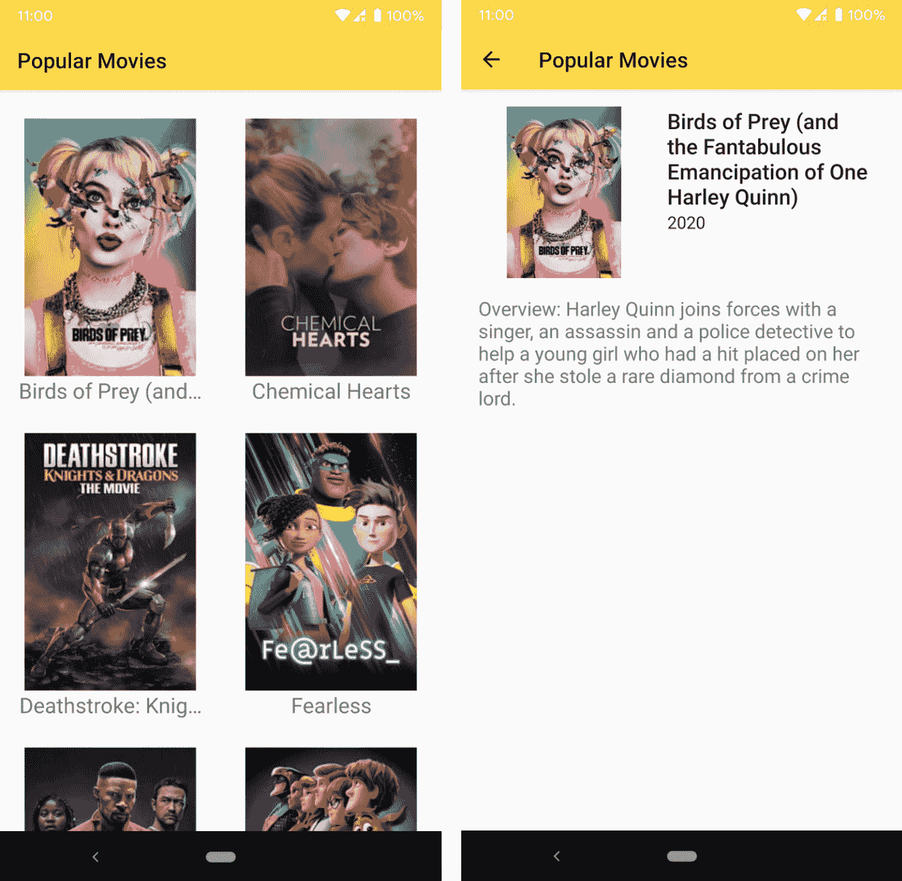
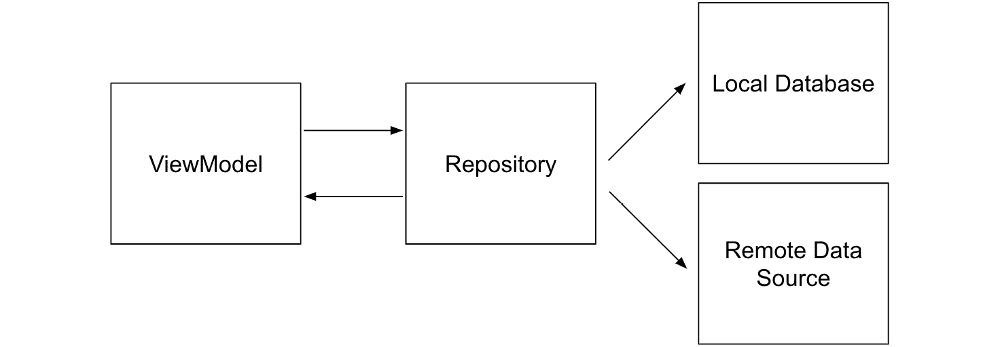
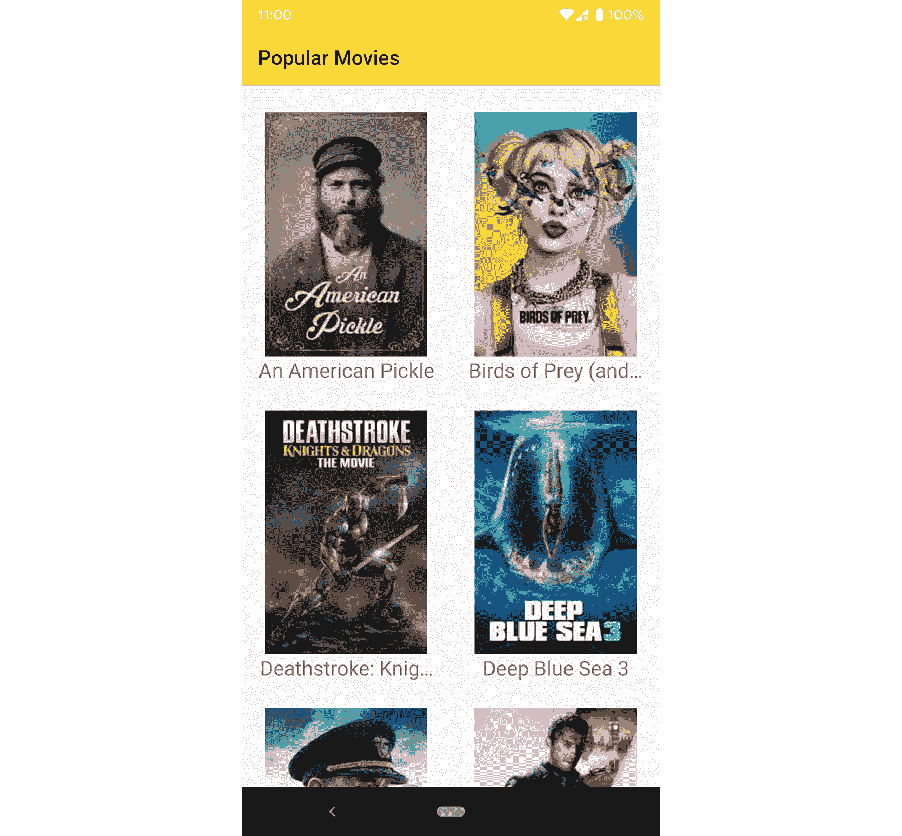
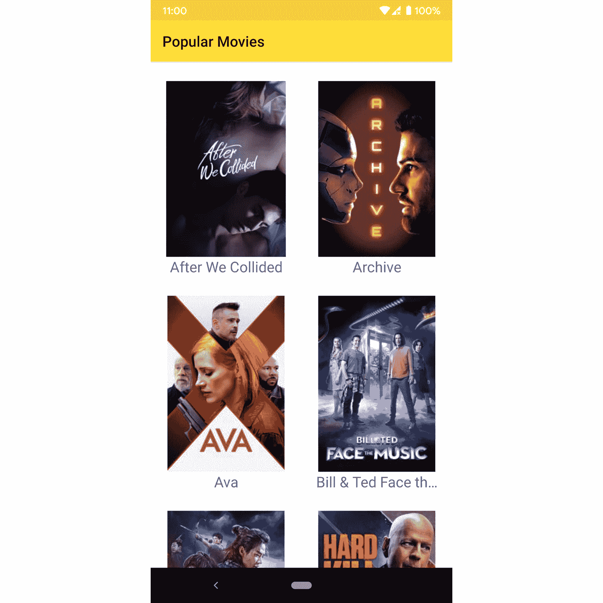

# 第十四章：架构模式

概述

本章将介绍您可以用于 Android 项目的架构模式。它涵盖了使用**MVVM**（模型-视图-ViewModel）模式，添加 ViewModels 以及使用数据绑定。您还将了解使用存储库模式进行数据缓存和使用 WorkManager 进行数据检索和存储的调度。

在本章结束时，您将能够使用 MVVM 和数据绑定来构建 Android 项目。您还将能够使用 Room 库的存储库模式缓存数据和使用 WorkManager 在预定的时间间隔内获取和保存数据。

# 介绍

在上一章中，您了解了如何使用 RxJava 和协程进行后台操作和数据处理。现在，您将学习架构模式，以便改进您的应用程序。

在开发 Android 应用程序时，您可能倾向于在活动或片段中编写大部分代码（包括业务逻辑）。这将使您的项目难以测试和维护。随着项目的增长和变得更加复杂，困难也会增加。您可以通过架构模式改进您的项目。

架构模式是设计和开发应用程序部分的通用解决方案，特别是对于大型应用程序。有一些架构模式可以用来将项目结构化为不同的层（表示层、**用户界面**（UI）层和数据层）或功能（观察者/可观察者）。通过架构模式，您可以以更容易开发、测试和维护的方式组织代码。

对于 Android 开发，常用的模式包括**MVC**（模型-视图-控制器）、**MVP**（模型-视图-表示器）和 MVVM。谷歌推荐的架构模式是 MVVM，本章将对此进行讨论。您还将了解数据绑定、使用 Room 库的存储库模式以及 WorkManager。

让我们开始 MVVM 架构模式。

# MVVM

MVVM 允许您将 UI 和业务逻辑分开。当您需要重新设计 UI 或更新模型/业务逻辑时，您只需触及相关组件，而不影响应用程序的其他组件。这将使您更容易添加新功能并测试现有代码。MVVM 在创建使用大量数据和视图的大型应用程序时也很有用。

使用 MVVM 架构模式，您的应用程序将分为三个组件：

+   **模型**：代表数据层

+   **视图**：显示数据的用户界面

+   将`Model`提供给`View`

通过以下图表更好地理解 MVVM 架构模式：


图 14.1：MVVM 架构模式

模型包含应用程序的数据和业务逻辑。在 MVVM 中，用户看到并与之交互的活动、片段和布局是视图。视图只处理应用程序的外观。它们让 ViewModel 知道用户的操作（例如打开活动或点击按钮）。

ViewModel 链接视图和模型。ViewModel 从模型获取数据并将其转换为视图中的显示。视图订阅 ViewModel，并在值更改时更新 UI。

您可以使用 Jetpack 的 ViewModel 为应用程序创建 ViewModel 类。Jetpack 的 ViewModel 管理其自己的生命周期，因此您无需自行处理。

您可以通过在`app/build.gradle`文件的依赖项中添加以下代码来将 ViewModel 添加到您的项目中：

```kt
implementation 'androidx.lifecycle:lifecycle-viewmodel-ktx:2.2.0'
```

例如，如果您正在开发一个显示电影的应用程序，您可以拥有一个`MovieViewModel`。这个 ViewModel 将有一个函数，用于获取电影列表：

```kt
class MovieViewModel : ViewModel() {
    private val movies: MutableLiveData<List<Movie>>
    fun getMovies(): LiveData<List<Movie>> { ... }
    ...
}
```

在您的活动中，您可以使用`ViewModelProvider`创建一个 ViewModel：

```kt
class MainActivity : AppCompatActivity() {
    private val movieViewModel by lazy {
        ViewModelProvider(this).get(MovieViewModel::class.java)
    }
    ...
}
```

然后，你可以订阅 ViewModel 中的`getMovies`函数，并在电影列表发生变化时自动更新 UI 中的列表：

```kt
override fun onCreate(savedInstanceState: Bundle?) {
    ...
    movieViewModel.getMovies().observe(this, Observer { popularMovies ->
        movieAdapter.addMovies(popularMovies)
    })
    ...
}
```

当 ViewModel 中的值发生变化时，视图会收到通知。你还可以使用数据绑定将视图与 ViewModel 中的数据连接起来。你将在下一节中学到更多关于数据绑定的知识。

# 数据绑定

数据绑定将布局中的视图与来自 ViewModel 等来源的数据进行绑定。不需要添加代码来查找布局文件中的视图，并在 ViewModel 的值改变时更新它们，数据绑定可以自动处理这些。

要在 Android 项目中使用数据绑定，你应该在`app/build.gradle`文件的`android`块中添加以下内容：

```kt
buildFeatures {
    dataBinding true
}
```

在布局文件中，你必须用`layout`标签包裹根元素。在`layout`标签内，你需要定义要绑定到该布局文件的数据的`data`元素：

```kt
<layout xmlns:android="http://schemas.android.com/apk/res/android">
    <data>
        <variable name="movie" type="com.example.model.Movie"/>
    </data>
    <ConstraintLayout ... />
</layout>
```

电影布局变量代表将在布局中显示的`com.example.model.Movie`类。要将属性设置为数据模型中的字段，你需要使用`@{}`语法。例如，要将电影的标题作为`TextView`的文本值，你可以使用以下内容：

```kt
<TextView
    ...
    android:text="@{movie.title}"/>
```

你还需要更改你的活动文件。如果你的布局文件名为`activity_movies.xml`，数据绑定库将在项目的构建文件中生成一个名为`ActivityMainBinding`的绑定类。在活动中，你可以用以下内容替换`setContentView(R.layout.activity_movies)`这一行：

```kt
val binding: ActivityMoviesBinding = DataBindingUtil.setContentView(this,   R.layout.activity_movies)
```

你还可以使用绑定类的`inflate`方法或`DataBindingUtil`类：

```kt
val binding: ActivityMoviesBinding =   ActivityMoviesBinding.inflate(getLayoutInflater())
```

然后，你可以将`movie`实例绑定到布局中名为`movie`的布局变量中：

```kt
val movieToDisplay = ...
binding.movie = movieToDisplay
```

如果你将`LiveData`作为要绑定到布局的项目，你需要设置绑定变量的`lifeCycleOwner`。`lifeCycleOwner`指定了`LiveData`对象的范围。你可以使用活动作为绑定类的`lifeCycleOwner`：

```kt
binding.lifeCycleOwner = this
```

有了这个，当 ViewModel 中的`LiveData`的值改变时，视图将自动更新为新的值。

你可以使用`android:text="@{movie.title}"`在 TextView 中设置电影标题。数据绑定库有默认的绑定适配器来处理`android:text`属性的绑定。有时，没有默认的属性可供使用。你可以创建自己的绑定适配器。例如，如果你想要为`RecyclerView`绑定电影列表，你可以创建一个自定义的`BindingAdapter`：

```kt
@BindingAdapter("list")
fun bindMovies(view: RecyclerView, movies: List<Movie>?) {
    val adapter = view.adapter as MovieAdapter
    adapter.addMovies(movies ?: emptyList())
}
```

这将允许你为`RecyclerView`添加一个`app:list`属性，接受一个电影列表：

```kt
app:list="@{movies}"
```

让我们尝试在 Android 项目中实现数据绑定。

## 练习 14.01：在 Android 项目中使用数据绑定

在上一章中，你开发了一个使用电影数据库 API 显示热门电影的应用程序。在本章中，你将使用 MVVM 改进该应用程序。你可以使用上一章的 Popular Movies 项目，或者复制一个。在这个练习中，你将添加数据绑定，将 ViewModel 中的电影列表绑定到 UI 上：

1.  在 Android Studio 中打开`Popular Movies`项目。

1.  打开`app/build.gradle`文件，并在`android`块中添加以下内容：

```kt
buildFeatures {
    dataBinding true
}
```

这样就可以为你的应用启用数据绑定。

1.  在`app/build.gradle`文件的插件块末尾添加`kotlin-kapt`插件：

```kt
plugins {
    ...
    id 'kotlin-kapt'
}
```

kotlin-kapt 插件是 Kotlin 注解处理工具，用于使用数据绑定。

1.  创建一个名为`RecyclerViewBinding`的新文件，其中包含`RecyclerView`列表的绑定适配器：

```kt
@BindingAdapter("list")
fun bindMovies(view: RecyclerView, movies: List<Movie>?) {
    val adapter = view.adapter as MovieAdapter
    adapter.addMovies(movies ?: emptyList())
}
```

这将允许你为`RecyclerView`添加一个`app:list`属性，你可以将要显示的电影列表传递给它。电影列表将被设置到适配器中，更新 UI 中的`RecyclerView`。

1.  打开`activity_main.xml`文件，并将所有内容包裹在`layout`标签内：

```kt
<layout xmlns:android="http://schemas.android.com/apk/res/android"
    xmlns:app="http://schemas.android.com/apk/res-auto"
    xmlns:tools="http://schemas.android.com/tools">
    <androidx.constraintlayout.widget.ConstraintLayout
        ... >
    </androidx.constraintlayout.widget.ConstraintLayout>
</layout>
```

有了这个，数据绑定库将能够为这个布局生成一个绑定类。

1.  在`layout`标签内，在`ConstraintLayout`标签之前，添加一个带有`viewModel`变量的数据元素：

```kt
<data>
    <variable
        name="viewModel"
        type="com.example.popularmovies.MovieViewModel" />
</data>
```

这将创建一个与您的`MovieViewModel`类对应的`viewModel`布局变量。

1.  在`RecyclerView`中，使用`app:list`添加要显示的列表：

```kt
app:list="@{viewModel.popularMovies}"
```

从`MovieViewModel.getPopularMovies`的`LiveData`将作为`RecyclerView`的电影列表传递。

1.  打开`MainActivity`。在`onCreate`函数中，用以下内容替换`setContentView`行：

```kt
val binding: ActivityMainBinding =   DataBindingUtil.setContentView(this, R.layout.activity_main)
```

这将设置要使用的布局文件并创建一个绑定对象。

1.  用以下内容替换`movieViewModel`观察者：

```kt
binding.viewModel = movieViewModel
binding.lifecycleOwner = this
```

这将`movieViewModel`绑定到`activity_main.xml`文件中的`viewModel`布局变量。

1.  运行应用程序。它应该像往常一样工作，显示流行电影的列表，点击其中一个将打开所选电影的详细信息：



图 14.2：按标题排序的今年热门电影的主屏幕（左）和有关所选电影的详细信息的详细屏幕（右）

在这个练习中，您已经在 Android 项目上使用了数据绑定。

数据绑定将视图链接到 ViewModel。ViewModel 从模型中检索数据。您可以使用 Retrofit 和 Moshi 等一些库来获取数据，您将在下一节中了解更多信息。

# Retrofit 和 Moshi

连接到远程网络时，您可以使用 Retrofit。Retrofit 是一个 HTTP 客户端，可以轻松实现创建请求并从后端服务器检索响应。

您可以通过将以下代码添加到您的`app/build.gradle`文件的依赖项中，将 Retrofit 添加到您的项目中：

```kt
implementation 'com.squareup.retrofit2:retrofit:2.9.0'
```

然后，您可以使用 Moshi 将 Retrofit 的 JSON 响应转换为 Java 对象。例如，您可以将获取电影列表的 JSON 字符串响应转换为`ListofMovie`对象，以便在应用程序中显示和存储。

您可以通过将以下代码添加到您的`app/build.gradle`文件的依赖项中，将 Moshi Converter 添加到您的项目中：

```kt
implementation 'com.squareup.retrofit2:converter-moshi:2.9.0'
```

在您的 Retrofit 构建器代码中，您可以调用`addConverterFactory`并传递`MoshiConverterFactory`：

```kt
Retrofit.Builder()
    ...
    .addConverterFactory(MoshiConverterFactory.create())
    ...
```

您可以从 ViewModel 中调用数据层。为了减少其复杂性，您可以使用存储库模式来加载和缓存数据。您将在下一节中了解到这一点。

# 存储库模式

ViewModel 不应直接调用服务来获取和存储数据，而应将该任务委托给另一个组件，例如存储库。

使用存储库模式，您可以将处理数据层的 ViewModel 中的代码移动到一个单独的类中。这减少了 ViewModel 的复杂性，使其更易于维护和测试。存储库将管理从哪里获取和存储数据，就像使用本地数据库或网络服务获取或存储数据一样：



图 14.3：具有存储库模式的 ViewModel

在 ViewModel 中，您可以添加一个存储库属性：

```kt
class MovieViewModel(val repository: MovieRepository): ViewModel() {
... 
}
```

ViewModel 将从存储库获取电影，或者它可以监听它们。它将不知道您实际从哪里获取列表。

您可以创建一个存储库接口，连接到数据源，例如以下示例：

```kt
interface MovieRepository { 
    fun getMovies(): List<Movie>
}
```

`MovieRepository`接口具有一个`getMovies`函数，您的存储库实现类将覆盖该函数以从数据源获取电影。您还可以拥有一个单一的存储库类，该类处理从本地数据库或远程端点获取数据：

当将本地数据库用作存储库的数据源时，您可以使用 Room 库，它可以让您更轻松地使用 SQLite 数据库，编写更少的代码，并在查询时进行编译时检查。

您可以通过将以下代码添加到`app/build.gradle`文件的依赖项中来将 Room 添加到您的项目中：

```kt
implementation 'androidx.room:room-runtime:2.2.5'
implementation 'androidx.room:room-ktx:2.2.5'
kapt 'androidx.room:room-compiler:2.2.5'
```

让我们尝试向 Android 项目添加带有 Room 的存储库模式。

## 练习 14.02：在 Android 项目中使用带有 Room 的存储库

在上一个练习中，您已经在流行电影项目中添加了数据绑定。在这个练习中，您将使用存储库模式更新应用程序。

打开应用程序时，它会从网络获取电影列表。这需要一段时间。每次获取数据时，您都将将这些数据缓存在本地数据库中。用户下次打开应用程序时，应用程序将立即在屏幕上显示来自数据库的电影列表。您将使用 Room 进行数据缓存：

1.  打开您在上一个练习中使用的`Popular Movies`项目。

1.  打开`app/build.gradle`文件并添加 Room 库的依赖项：

```kt
implementation 'androidx.room:room-runtime:2.2.5'
implementation 'androidx.room:room-ktx:2.2.5'
kapt 'androidx.room:room-compiler:2.2.5'
```

1.  打开`Movie`类并为其添加一个`Entity`注解：

```kt
@Entity(tableName = "movies",  primaryKeys = [("id")])
data class Movie( ... )
```

`Entity`注解将为电影列表创建一个名为`movies`的表。它还将`id`设置为表的主键。

1.  创建一个名为`com.example.popularmovies.database`的新包。为访问`movies`表创建一个`MovieDao`数据访问对象：

```kt
@Dao
interface MovieDao {
@Insert(onConflict = OnConflictStrategy.REPLACE)
fun addMovies(movies: List<Movie>)
@Query("SELECT * FROM movies")
fun getMovies(): List<Movie>
}
```

该类包含一个用于将电影列表添加到数据库的函数，另一个用于从数据库中获取所有电影的函数。

1.  在`com.example.popularmovies.database`包中创建一个`MovieDatabase`类：

```kt
@Database(entities = [Movie::class], version = 1)
abstract class MovieDatabase : RoomDatabase() {
    abstract fun movieDao(): MovieDao
    companion object {
        @Volatile
        private var instance: MovieDatabase? = null
        fun getInstance(context: Context): MovieDatabase {
            return instance ?: synchronized(this) {
                instance ?: buildDatabase(context).also {                   instance = it                     }
            }
        }
        private fun buildDatabase(context: Context): MovieDatabase {
            return Room.databaseBuilder(context,               MovieDatabase::class.java, "movie-db")
                .build()
        }
    }
}
```

该数据库的版本为 1，有一个名为`Movie`的实体和用于电影的数据访问对象。它还有一个`getInstance`函数来生成数据库的实例。

1.  使用构造函数更新`MovieRepository`类的`movieDatabase`：

```kt
class MovieRepository(private val movieService: MovieService,   private val movieDatabase: MovieDatabase) { ... }
```

1.  更新`fetchMovies`函数：

```kt
suspend fun fetchMovies() {
    val movieDao: MovieDao = movieDatabase.movieDao()
    var moviesFetched = movieDao.getMovies()
    if (moviesFetched.isEmpty()) {
        try {
            val popularMovies = movieService.getPopularMovies(apiKey)
            moviesFetched = popularMovies.results
            movieDao.addMovies(moviesFetched)
        } catch (exception: Exception) {
            errorLiveData.postValue("An error occurred:               ${exception.message}")
        }
    }
    movieLiveData.postValue(moviesFetched)
}
```

它将从数据库中获取电影。如果尚未保存任何内容，它将从网络端点检索列表，然后保存。

1.  打开`MovieApplication`并在`onCreate`函数中，用以下内容替换`movieRepository`的初始化：

```kt
val movieDatabase = MovieDatabase.getInstance(applicationContext)
movieRepository = MovieRepository(movieService, movieDatabase)
```

1.  运行应用程序。它将显示流行电影的列表，单击其中一个将打开所选电影的详细信息。如果关闭移动数据或断开无线网络连接，它仍将显示电影列表，该列表现在已缓存在数据库中：



图 14.4：使用带有 Room 的流行电影应用程序的存储库

在这个练习中，您通过将数据的加载和存储移到存储库中来改进了应用程序。您还使用了 Room 来缓存数据。

存储库从数据源获取数据。如果数据库中尚未存储数据，应用程序将调用网络请求数据。这可能需要一段时间。您可以通过在预定时间预取数据来改善用户体验，这样用户下次打开应用程序时，他们将立即看到更新的内容。您可以使用我们将在下一节中讨论的 WorkManager 来实现这一点。

# WorkManager

WorkManager 是一个 Jetpack 库，用于延迟执行并根据您设置的约束条件运行后台操作。它非常适合执行必须运行但可以稍后或定期运行的操作，无论应用程序是否正在运行。

您可以使用 WorkManager 定期运行任务，例如从网络获取数据并将其存储在数据库中。即使应用程序已关闭或设备重新启动，WorkManager 也会运行任务。这将使您的数据库与后端保持最新。

您可以通过将以下代码添加到`app/build.gradle`文件的依赖项中来将 WorkManager 添加到您的项目中：

```kt
implementation 'androidx.work:work-runtime:2.4.0'
```

WorkManager 可以调用存储库从本地数据库或网络服务器获取和存储数据。

让我们尝试向 Android 项目添加 WorkManager。

## 练习 14.03：向 Android 项目添加 WorkManager

在上一个练习中，您使用 Room 添加了存储库模式以将数据缓存到本地数据库中。该应用现在可以从数据库中获取数据，而不是从网络获取。现在，您将添加 WorkManager 以安排定期从服务器获取数据并将其保存到数据库的任务：

1.  打开您在上一个练习中使用的`Popular Movies`项目。

1.  打开`app/build.gradle`文件并添加 WorkManager 库的依赖项：

```kt
implementation 'androidx.work:work-runtime:2.4.0'
```

这将允许您向应用程序添加 WorkManager 工作程序。

1.  打开`MovieRepository`并添加一个挂起函数，用于使用 The Movie Database 的 apiKey 从网络获取电影并将其保存到数据库中：

```kt
suspend fun fetchMoviesFromNetwork() {
    val movieDao: MovieDao = movieDatabase.movieDao()
    try {
        val popularMovies = movieService.getPopularMovies(apiKey)
        val moviesFetched = popularMovies.results
        movieDao.addMovies(moviesFetched)
    } catch (exception: Exception) {
        errorLiveData.postValue("An error occurred:           ${exception.message}")
    }
}
```

这将是`Worker`类调用的函数，该类将运行以获取和保存电影。

1.  创建`MovieWorker`类：

```kt
class MovieWorker(private val context: Context,   params: WorkerParameters) : Worker(context, params) {
    override fun doWork(): Result {
        val movieRepository =           (context as MovieApplication).movieRepository
        CoroutineScope(Dispatchers.IO).launch {
            movieRepository.fetchMoviesFromNetwork()
        }
        return Result.success()
    }
}
```

1.  打开`MovieApplication`，并在`onCreate`函数的末尾，安排`MovieWorker`以检索并保存电影：

```kt
override fun onCreate() {
    ...
    val constraints =
        Constraints.Builder().setRequiredNetworkType(          NetworkType.CONNECTED).build()
    val workRequest = PeriodicWorkRequest
        .Builder(MovieWorker::class.java, 1, TimeUnit.HOURS)
        .setConstraints(constraints)
        .addTag("movie-work")
        .build()
    WorkManager.getInstance(applicationContext).enqueue(workRequest)
}
```

当设备连接到网络时，这将安排`MovieWorker`每小时运行。`MovieWorker`将从网络获取电影列表并将其保存到本地数据库。

1.  运行应用程序。关闭它并确保设备已连接到互联网。一个多小时后，再次打开应用程序并检查显示的电影列表是否已更新。如果没有，请几个小时后再试一次。即使应用程序已关闭，显示的电影列表也会定期更新，大约每小时更新一次。



图 14.5：Popular Movies 应用程序使用 WorkManager 更新其列表

在本练习中，您向应用程序添加了 WorkManager，以自动使用从网络检索的电影列表更新数据库。

## 活动 14.01：重新审视电视指南应用程序

在上一章中，您开发了一个可以显示正在播出的电视节目列表的应用程序。该应用程序有两个屏幕：主屏幕和详细信息屏幕。在主屏幕上，有一个电视节目列表。单击电视节目时，将显示详细信息屏幕，并显示所选节目的详细信息。

运行应用程序时，显示节目列表需要一段时间。更新应用程序以缓存列表，以便在打开应用程序时立即显示。此外，通过使用 MVVM 与数据绑定并添加 WorkManager 来改进应用程序。

您可以使用上一章中使用的电视指南应用程序，也可以从 GitHub 存储库中下载。以下步骤将帮助您完成此活动：

1.  在 Android Studio 中打开电视指南应用程序。打开`app/build.gradle`文件并添加`kotlin-kapt`插件，数据绑定依赖项以及 Room 和 WorkManager 的依赖项。

1.  为`RecyclerView`创建一个绑定适配器类。

1.  在`activity_main.xml`中，将所有内容包装在`layout`标签内。

1.  在`layout`标签内并在`ConstraintLayout`标签之前，添加一个包含 ViewModel 变量的数据元素。

1.  在`RecyclerView`中，使用`app:list`添加要显示的列表。

1.  在`MainActivity`中，用`DataBindingUtil.setContentView`函数替换`setContentView`行。

1.  用数据绑定代码替换`TVShowViewModel`中的观察者。

1.  在`TVShow`类中添加一个`Entity`注解。

1.  创建一个`TVDao`数据访问对象，用于访问电视节目表。

1.  创建一个`TVDatabase`类。

1.  使用`tvDatabase`构造函数更新`TVShowRepository`。

1.  更新`fetchTVShows`函数以从本地数据库获取电视节目。如果还没有数据，从端点检索列表并将其保存在数据库中。

1.  创建`TVShowWorker`类。

1.  打开`TVApplication`文件。在`onCreate`中，安排`TVShowWorker`以检索并保存节目。

1.  运行你的应用程序。应用程序将显示一个电视节目列表。点击电视节目将打开显示电影详情的详情活动。主屏幕和详情屏幕将类似于*图 14.6*：


图 14.6：TV Guide 应用的主屏幕和详情屏幕

注意

此活动的解决方案可在以下网址找到：http://packt.live/3sKj1cp

# 总结

本章重点介绍了 Android 的架构模式。您从 MVVM 架构模式开始。您学习了它的三个组件：模型、视图和视图模型。您还使用数据绑定将视图与视图模型链接起来。

接下来，您了解了存储库模式如何用于缓存数据。然后，您了解了 WorkManager 以及如何安排任务，例如从网络检索数据并将数据保存到数据库以更新本地数据。

在下一章中，您将学习如何使用动画来改善应用程序的外观和设计。您将使用`CoordinatorLayout`和`MotionLayout`为您的应用程序添加动画和过渡效果。
