# 第十五章：使用 CoordinatorLayout 和 MotionLayout 进行动画和过渡

概述

本章将向您介绍动画以及如何处理布局之间的变化。它涵盖了使用`MotionLayout`和 Android 中的 Motion Editor 描述移动对象的说明，以及对约束集进行详细解释。本章还涵盖了修改路径和为帧的运动添加关键帧。

通过本章结束时，您将能够使用`CoordinatorLayout`和`MotionLayout`创建动画，并使用 Android Studio 中的 Motion Editor 创建`MotionLayout`动画。

# 介绍

在上一章中，您了解了 MVVM 等架构模式。您现在知道如何改进应用程序的架构。接下来，我们将学习如何使用动画来增强我们应用程序的外观和感觉，并使其与其他应用程序不同且更好。

有时，我们开发的应用程序可能看起来有点单调。我们可以在应用程序中包含一些移动部分和令人愉悦的动画，使其更加生动，并使 UI 和用户体验更好。例如，我们可以添加视觉提示，以便用户不会困惑下一步该做什么，并可以引导他们可以采取哪些步骤。在加载时进行动画可以在内容被获取或处理时娱乐用户。当应用程序遇到错误时进行漂亮的动画可以帮助防止用户对发生的事情感到愤怒，并可以告知他们有哪些选项。

在本章中，我们将首先看一些在 Android 中进行动画的传统方法。我们将在本章结束时看一下较新的`MotionLayout`选项。让我们从活动过渡开始，这是最简单和最常用的动画之一。

# 活动过渡

在打开和关闭活动时，Android 会播放默认过渡。我们可以自定义活动过渡以反映品牌和/或区分我们的应用程序。活动过渡从 Android 5.0 Lollipop（API 级别 21）开始提供。

活动过渡有两部分：进入过渡和退出过渡。进入过渡定义了当活动打开时活动及其视图将如何进行动画。而退出过渡则描述了当活动关闭或打开新活动时活动和视图如何进行动画。Android 支持以下内置过渡：

+   **Explode**：这会将视图从中心移入或移出。

+   **Fade**：这会使视图缓慢出现或消失。

+   **Slide**：这会将视图从边缘移入或移出。

现在，让我们看看如何在下一节中添加活动过渡。有两种方法可以添加活动过渡：通过 XML 和通过代码。首先，我们将学习如何通过 XML 添加过渡，然后通过代码。

## 通过 XML 添加活动过渡

您可以通过 XML 添加活动过渡。第一步是启用窗口内容过渡。这是通过在`themes.xml`中添加活动的主题来完成的，如下所示：

```kt
<item name="android:windowActivityTransitions">true</item>
```

之后，您可以使用`android:windowEnterTransition`和`android:windowExitTransition`样式属性添加进入和退出过渡。例如，如果您想要使用来自`@android:transition/`的默认过渡，您需要添加的属性如下：

```kt
<item name="android:windowEnterTransition">  @android:transition/slide_left</item>
<item name="android:windowExitTransition">  @android:@transition/explode</item>
```

然后，您的`themes.xml`文件将如下所示：

```kt
    <style name="AppTheme"       parent="Theme.AppCompat.Light.DarkActionBar">
        ...
        <item name="android:windowActivityTransitions">true</item>
        <item name="android:windowEnterTransition">          @android:@transition/slide_left</item>
        <item name="android:windowExitTransition">          @android:@transition/explode</item>
    </style>
```

活动过渡通过`<item name="android:windowActivityTransitions">true</item>`启用。`<item name="android:windowEnterTransition">@android:transition/slide_left</item>`属性设置了进入过渡，而`@android:@transition/explode`是退出过渡文件，由`<item name="android:windowExitTransition">@android:transition/explode</item>`属性设置。

在下一节中，您将学习如何通过编码添加活动过渡。

## 通过代码添加活动过渡

活动转换也可以以编程方式添加。第一步是启用窗口内容转换。您可以在调用`setContentView()`之前在活动中调用以下函数来实现这一点：

```kt
window.requestFeature(Window.FEATURE_CONTENT_TRANSITIONS)
```

您可以随后使用`window.enterTransition`和`window.exitTransition`添加进入和退出事务。我们可以使用`android.transition`包中内置的`Explode()`，`Slide()`和`Fade()`转换。例如，如果我们想要使用`Explode()`作为进入转换和`Slide()`作为退出转换，我们可以添加以下代码：

```kt
window.enterTransition = Explode()
window.exitTransition = Slide()
```

如果您的应用程序的最低支持的 SDK 低于 21，请记得将这些调用包装在`Build.VERSION.SDK_INT >= Build.VERSION_CODES.LOLLIPOP`的检查中。

现在您知道如何通过代码或 XML 添加进入和退出活动转换，您需要学习如何在打开活动时激活转换。我们将在下一节中进行。

## 使用 Activity 转换启动 Activity

一旦您向活动添加了活动转换（通过 XML 或编码），您可以在打开活动时激活转换。您应该传递一个带有转换动画的 bundle，而不是`startActivity(intent)`调用。为此，请使用以下代码启动您的活动：

```kt
startActivity(intent,ActivityOptions   .makeSceneTransitionAnimation(this).toBundle())
```

`ActivityOptions.makeSceneTransitionAnimation(this).toBundle()`参数将创建一个带有我们为活动指定的进入和退出转换的 bundle（通过 XML 或代码）。

通过向应用程序添加活动转换来尝试我们到目前为止所学到的内容。

## 练习 15.01：在应用程序中创建活动转换

在许多场所，留下小费（通常称为小费）是很常见的。这是为了表示对服务的感激而给出的一笔钱，例如给餐厅的服务员。小费是在最终账单上标明的基本费用之外提供的。

在本章中，我们将使用一个应用程序，该应用程序计算应该给出的小费金额。这个值将基于账单金额（基本费用）和用户想要给出的额外百分比。用户将输入这两个值，应用程序将计算小费金额。

在这个练习中，我们将自定义输入和输出屏幕之间的活动转换：

1.  在 Android Studio 中创建一个新项目。

1.  在`选择您的项目`对话框中，选择`空活动`，然后单击`下一步`。

1.  在`配置您的项目`对话框中，如*图 15.1*所示，将项目命名为`Tip Calculator`，并将包名称设置为`com.example.tipcalculator`：

图 15.1：配置您的项目对话框

1.  设置要保存项目的位置。选择`API 21：Android 5.0 Lollipop`作为`最低 SDK`，然后单击`完成`按钮。这将创建一个默认的`MainActivity`和一个布局文件`activity_main.xml`。

1.  将`MaterialComponents`依赖项添加到您的`app/build.gradle`文件中：

```kt
implementation 'com.google.android.material:material:1.2.1'
```

我们需要这样做才能使用`TextInputLayout`和`TextInputEditText`来输入文本字段。

1.  打开`themes.xml`文件，并确保活动的主题使用`MaterialComponents`的主题。参见以下示例：

```kt
<style name="AppTheme"   parent="Theme.MaterialComponents.Light.DarkActionBar">
```

我们需要这样做，因为我们稍后将使用的`TextInputLayout`和`TextInputEditText`需要您的活动使用`MaterialComponents`主题。

1.  打开`activity_main.xml`。删除`Hello World` `TextView`并添加金额的输入文本字段：

```kt
<com.google.android.material.textfield.TextInputLayout
    android:id="@+id/amount_text_layout"
    style="@style/Widget.MaterialComponents       .TextInputLayout.OutlinedBox"
    android:layout_width="match_parent"
    android:layout_height="wrap_content"
    android:layout_marginStart="16dp"
    android:layout_marginTop="100dp"
    android:layout_marginEnd="16dp"
    android:layout_marginBottom="16dp"
    android:alpha="1"
    android:hint="Amount"
    app:layout_constraintEnd_toEndOf="parent"
    app:layout_constraintStart_toStartOf="parent"
    app:layout_constraintTop_toTopOf="parent">
    <com.google.android.material.textfield       .TextInputEditText
        android:id="@+id/amount_text"
        android:layout_width="match_parent"
        android:layout_height="wrap_content"
        android:inputType="numberDecimal"
        android:textSize="18sp" />
</com.google.android.material.textfield.TextInputLayout>
```

1.  在金额文本字段下方添加另一个小费百分比的输入文本字段：

```kt
<com.google.android.material.textfield.TextInputLayout
    android:id="@+id/percent_text_layout"
    style="@style/Widget.MaterialComponents       .TextInputLayout.OutlinedBox"
    android:layout_width="match_parent"
    android:layout_height="wrap_content"
    android:layout_margin="16dp"
    android:alpha="1"
    android:hint="Tip Percent"
    app:layout_constraintEnd_toEndOf="parent"
    app:layout_constraintStart_toStartOf="parent"
    app:layout_constraintTop_toBottomOf       ="@id/amount_text_layout">
    <com.google.android.material.textfield       .TextInputEditText
        android:id="@+id/percent_text"
        android:layout_width="match_parent"
        android:layout_height="wrap_content"
        android:inputType="numberDecimal"
        android:textSize="18sp" />
</com.google.android.material.textfield.TextInputLayout>
```

1.  最后，在小费百分比文本字段底部添加一个`计算`按钮：

```kt
<Button
    android:id="@+id/compute_button"
    android:layout_width="wrap_content"
    android:layout_height="wrap_content"
    android:layout_marginTop="36dp"
    android:text="Compute"
    app:layout_constraintEnd_toEndOf       ="@+id/percent_text_layout"
    app:layout_constraintTop_toBottomOf       ="@+id/percent_text_layout" />
```

1.  创建另一个活动。转到`文件`菜单，单击`新建` | `活动` | `空活动`。将其命名为`OutputActivity`。确保选中`生成布局文件`，以便创建`activity_output`。

1.  打开`MainActivity`。在`onCreate`函数的末尾，添加以下代码：

```kt
        val amountText: EditText =           findViewById(R.id.amount_text)
        val percentText: EditText =           findViewById(R.id.percent_text)
        val computeButton: Button =           findViewById(R.id.compute_button)
        computeButon.setOnClickListener {
            val amount =
                if (amountText.text.toString().isNotBlank())                   amountText.text.toString() else "0"
            val percent =
                if (percentText.text.toString().isNotBlank())                   percentText.text.toString() else "0"
            val intent = Intent(this,               OutputActivity::class.java).apply {
                putExtra("amount", amount)
                putExtra("percent", percent)
            }
            startActivity(intent)
        }
```

这将为`Compute`按钮添加一个`ClickListener`组件，这样当点击时，系统将打开`OutputActivity`并将金额和百分比值作为意图额外传递。

1.  打开`activity_output.xml`并添加一个用于显示小费的`TextView`：

```kt
   <TextView
        android:id="@+id/tip_text"
        android:layout_width="wrap_content"
        android:layout_height="wrap_content"
        app:layout_constraintBottom_toBottomOf="parent"
        app:layout_constraintEnd_toEndOf="parent"
        app:layout_constraintStart_toStartOf="parent"
        app:layout_constraintTop_toTopOf="parent"
        style="@style/TextAppearance.AppCompat.Headline"
        tools:text="The tip is " />
```

1.  打开`OutputActivity`。在`onCreate`函数的末尾，添加以下代码：

```kt
        val amount = intent?.getStringExtra("amount")          ?.toBigDecimal() ?: BigDecimal.ZERO
        val percent = intent?.getStringExtra("percent")          ?.toBigDecimal() ?: BigDecimal.ZERO
        val tip = amount * (percent.divide("100"          .toBigDecimal()))
        val tipText: TextView = findViewById(R.id.tip_text)
        tipText.text = "The tip is $tip"
```

这将根据输入金额和百分比计算并显示小费。

1.  运行应用程序。点击`Compute`按钮，注意打开`OutputActivity`和返回时发生的情况。在关闭`MainActivity`和打开/关闭`OutputActivity`时，会有默认动画。

1.  现在，让我们开始添加过渡动画。打开`themes.xml`并使用`windowActivityTransitions`，`windowEnterTransition`和`windowExitTransition`样式属性更新活动主题：

```kt
        <item name="android:windowActivityTransitions">          true</item>
        <item name="android:windowEnterTransition">          @android:transition/explode</item>
        <item name="android:windowExitTransition">          @android:transition/slide_left</item>
```

这将启用活动过渡，添加一个爆炸进入过渡，并向活动添加一个向左滑动退出过渡。

1.  返回`MainActivity`文件，并用以下内容替换`startActivity(intent)`：

```kt
startActivity(intent, ActivityOptions   .makeSceneTransitionAnimation(this).toBundle())
```

这将使用我们在上一步中设置的 XML 文件中指定的过渡动画打开`OutputActivity`。

1.  运行应用程序。您会看到打开和关闭`MainActivity`和`OutputActivity`时的动画已经改变。当 Android UI 打开`OutputActivity`时，您会注意到文本向中心移动。在关闭时，视图向左滑动：

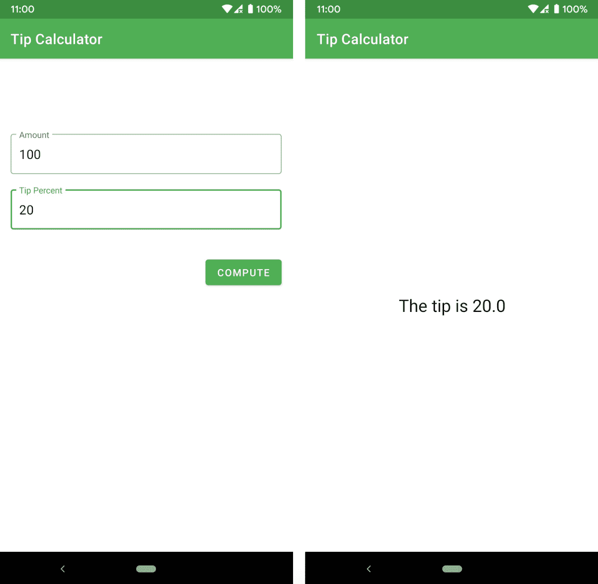

图 15.2：应用程序屏幕：输入屏幕（左侧）和输出屏幕（右侧）

我们已经为应用程序添加了活动过渡。当我们打开一个新的活动时，新活动的进入过渡将播放。当活动被关闭时，将播放其退出过渡。

有时，当我们从一个活动打开另一个活动时，两个活动中存在一个共同的元素。在下一节中，我们将学习如何添加这个共享元素过渡。

## 添加共享元素过渡

有时，一个应用程序从一个活动转移到另一个活动，两个活动中都存在一个共同的元素。我们可以为这个共享元素添加动画，以突出向用户展示两个活动之间的链接。

例如，在一个电影应用程序中，一个包含电影列表（带有缩略图图像）的活动可以打开一个新的活动，显示所选电影的详细信息，并在顶部显示全尺寸图像。为图像添加共享元素过渡将把列表活动上的缩略图与详细信息活动上的图像链接起来。

共享元素过渡有两部分：进入过渡和退出过渡。这些过渡可以通过 XML 或代码完成。

第一步是启用窗口内容过渡。您可以通过将活动的主题添加到`themes.xml`中来实现：

```kt
<item name="android:windowContentTransitions">true</item>
```

您还可以通过在调用`setContentView()`之前在活动中调用以下函数来以编程方式执行此操作：

```kt
window.requestFeature(Window.FEATURE_CONTENT_TRANSITIONS)
```

`android:windowContentTransitions`属性的值为`true`，`window.requestFeature(Window.FEATURE_CONTENT_TRANSITIONS)`将启用窗口内容过渡。

之后，您可以添加共享元素进入过渡和共享元素退出过渡。如果您的`res/transitions`目录中有`enter_transition.xml`和`exit_transition.xml`，您可以通过添加以下样式属性来添加共享元素进入过渡：

```kt
<item name="android:windowSharedElementEnterTransition">  @transition/enter_transition</item>
```

您也可以通过以下代码以编程方式完成这一操作：

```kt
val enterTransition = TransitionInflater.from(this)  .inflateTransition(R.transition.enter_transition)
window.sharedElementEnterTransition = enterTransition
```

`windowSharedElementEnterTransition`属性和`window.sharedElementEnterTransition`将把我们的进入过渡设置为`enter_transition.xml`文件。

要添加共享元素退出过渡，可以添加以下样式属性：

```kt
<item name="android:windowSharedElementExitTransition">  @transition/exit_transition</item>
```

这可以通过以下代码以编程方式完成：

```kt
val exitTransition = TransitionInflater.from(this)  .inflateTransition(R.transition.exit_transition)
window.sharedElementExitTransition = exitTransition
```

`windowSharedElementExitTransition`属性和`window.sharedElementExitTransition`将把我们的退出过渡设置为`exit_transition.xml`文件。

您已经学会了如何添加共享元素过渡。在下一节中，我们将学习如何开始具有共享元素过渡的活动。

## 使用共享元素过渡开始活动

一旦您向活动添加了共享元素过渡（无论是通过 XML 还是通过编程方式），您可以在打开活动时激活过渡。在这之前，添加一个`transitionName`属性。将其值设置为两个活动中共享元素的相同文本。

例如，在`ImageView`中，我们可以为`transitionName`属性添加一个`transition_name`值：

```kt
    <ImageView
        ...
        android:transitionName="transition_name"
        android:id="@+id/sharedImage"
    ... />
```

要开始具有共享元素的活动，我们将传递一个带有过渡动画的 bundle。为此，请使用以下代码启动您的活动：

```kt
startActivity(intent, ActivityOptions   .makeSceneTransitionAnimation(this, sharedImage,     "transition_name").toBundle());
```

`ActivityOptions.makeSceneTransitionAnimation(this, sharedImage, "transition_name").toBundle()`参数将创建一个带有共享元素（`sharedImage`）和过渡名称（`transition_name`）的 bundle。

如果有多个共享元素，您可以传递`Pair<View, String>`的可变参数，其中`View`和过渡名称`String`。例如，如果我们将视图的按钮和图像作为共享元素，我们可以这样做：

```kt
val buttonPair: Pair<View, String> = Pair(button, "button") 
val imagePair: Pair<View, String> = Pair(image, "image") 
val activityOptions = ActivityOptions   .makeSceneTransitionAnimation(this, buttonPair, imagePair)
startActivity(intent, activityOptions.toBundle())
```

注意

请记住导入`android.util.Pair`而不是`kotlin.Pair`，因为`makeSceneTransitionAnimation`需要来自 Android SDK 的 pair。

让我们尝试一下到目前为止学到的内容，通过向*Tip Calculator*应用程序添加共享元素过渡。

## 练习 15.02：创建共享元素过渡

在第一个练习中，我们为`MainActivity`和`OutputActivity`自定义了活动过渡。在这个练习中，我们将向两个活动添加一个图像。当从输入屏幕移动到输出屏幕时，将对此共享元素进行动画处理。我们将使用应用程序启动器图标（`res/mipmap/ic_launcher`）作为`ImageView`。您可以更改您的图标，而不是使用默认的：

1.  打开我们在`Exercise 15.01`中开发的`Tip Calculator`项目，创建活动过渡。

1.  转到`activity_main.xml`文件，并在金额文本字段顶部添加一个`ImageView`：

```kt
    <ImageView
        android:id="@+id/image"
        android:layout_width="wrap_content"
        android:layout_height="wrap_content"
        android:layout_marginTop="100dp"
        android:src="img/ic_launcher"
        android:transitionName="transition_name"
        app:layout_constraintEnd_toEndOf="parent"
        app:layout_constraintStart_toStartOf="parent"
        app:layout_constraintTop_toTopOf="parent" />
```

`transitionName`值为`transition_name`将用于标识此为共享元素。

1.  通过更改`app:layout_constraintTop_toTopOf="parent"`来更改`amount_text_layout` `TextInputLayout`的顶部约束为以下内容：

```kt
app:layout_constraintTop_toBottomOf="@id/image"
```

这将使金额`TextInputLayout`类移动到图像下方。

1.  现在，打开`activity_output.xml`文件，并在`tip TextView`上方添加一个图像，高度和宽度为 200dp，`scaleType`为`fitXY`以适应图像到`ImageView`的尺寸。

```kt
    <ImageView
        android:id="@+id/image"
        android:layout_width="200dp"
        android:layout_height="200dp"
        android:layout_marginBottom="40dp"
        android:src="img/ic_launcher"
        android:scaleType="fitXY"
        android:transitionName="transition_name"
        app:layout_constraintEnd_toEndOf="parent"
        app:layout_constraintStart_toStartOf="parent"
        app:layout_constraintBottom_toTopOf="@id/tip_text" />
```

`transitionName`值为`transition_name`与`MainActivity`中的`ImageView`的值相同。

1.  打开`MainActivity`并将`startActivity`代码更改为以下内容：

```kt
val image: ImageView = findViewById(R.id.image)
startActivity(intent, ActivityOptions   .makeSceneTransitionAnimation(this, image,     "transition_name").toBundle())
```

这将从`MainActivity`中的 ID 为 image 的`ImageView`开始一个过渡，到`OutputActivity`中另一个具有`transitionName`值也为`transition_name`的图像。

1.  运行应用程序。提供金额和百分比，然后点击`Compute`按钮。您会看到输入活动中的图像似乎放大并定位到`OutputActivity`中：

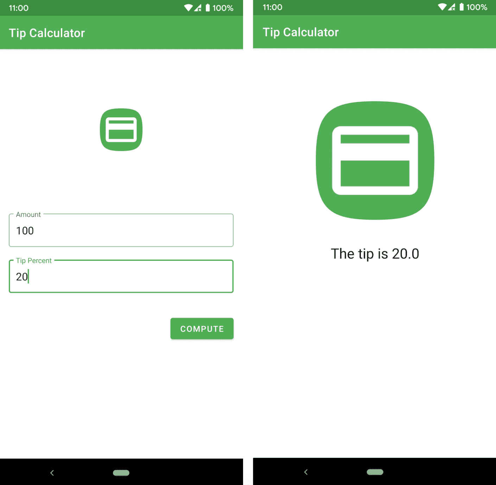

图 15.3：应用程序屏幕：输入屏幕（左侧）和输出屏幕（右侧）

我们已经学会了如何添加活动过渡和共享元素过渡。现在，让我们来看看如何在布局中对视图进行动画处理。如果内部有多个元素，要对每个元素进行动画处理可能会很困难。`CoordinatorLayout`可用于简化此动画。我们将在下一节中讨论这个问题。

# 使用 CoordinatorLayout 进行动画

`CoordinatorLayout`是一个处理其子视图之间动作的布局。当您将`CoordinatorLayout`用作父视图组时，可以轻松地对其中的视图进行动画处理。您可以通过在`app/build.gradle`文件的依赖项中添加以下内容将`CoordinatorLayout`添加到您的项目中：

```kt
implementation 'androidx.coordinatorlayout:coordinatorlayout:1.1.0'
```

这将允许我们在布局文件中使用`CoordinatorLayout`。

假设我们有一个布局文件，其中包含`CoordinatorLayout`内的浮动操作按钮。当点击浮动操作按钮时，UI 会显示一个`Snackbar`消息。

注意

`Snackbar`是一个 Android 小部件，可以在屏幕底部向用户提供简短的消息。

如果您使用的是除`CoordinatorLayout`之外的任何布局，则带有消息的 Snackbar 将呈现在浮动操作按钮的顶部。如果我们将`CoordinatorLayout`用作父视图组，布局将向上推动浮动操作按钮，将 Snackbar 显示在其下方，并在 Snackbar 消失时将其移回。*图 15.4*显示了布局如何调整以防止 Snackbar 位于浮动操作按钮的顶部：

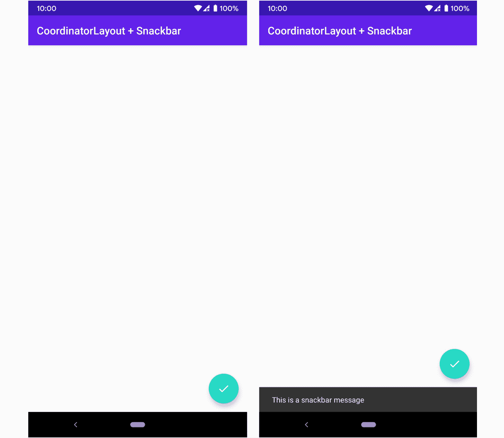

图 15.4：左侧截图显示了 Snackbar 显示之前和之后的 UI。右侧的截图显示了 Snackbar 可见时的 UI

浮动操作按钮移动并为 Snackbar 消息提供空间，因为它具有名为`FloatingActionButton.Behavior`的默认行为，这是`CoordinatorLayout.Behavior`的子类。`FloatingActionButton.Behavior`在显示 Snackbar 时移动浮动操作按钮，以便 Snackbar 不会覆盖浮动操作按钮。

并非所有视图都具有`CoordinatorLayout`行为。要实现自定义行为，可以通过扩展`CoordinatorLayout.Behavior`来开始。然后，您可以使用`layout_behavior`属性将其附加到视图上。例如，如果我们在`com.example.behavior`包中为按钮创建了`CustomBehavior`，我们可以在布局中使用以下内容更新按钮：

```kt
...
<Button
    ...
    app:layout_behavior="com.example.behavior.CustomBehavior">
    .../>
```

我们已经学会了如何使用`CoordinatorLayout`创建动画和过渡。在下一节中，我们将研究另一个布局`MotionLayout`，它允许开发人员更多地控制动作。

# 使用 MotionLayout 创建动画

在 Android 中创建动画有时是耗时的。即使是创建简单的动画，您也需要处理 XML 和代码文件。更复杂的动画和过渡需要更多的时间来制作。

为了帮助开发人员轻松制作动画，Google 创建了`MotionLayout`。`MotionLayout`是通过 XML 创建动作和动画的新方法。它从 API 级别 14（Android 4.0）开始提供。

使用`MotionLayout`，我们可以对一个或多个视图的位置、宽度/高度、可见性、透明度、颜色、旋转、高程和其他属性进行动画处理。通常，其中一些属性很难通过代码实现，但`MotionLayout`允许我们使用声明性 XML 轻松调整它们，以便我们可以更多地专注于我们的应用程序。

让我们开始通过将`MotionLayout`添加到我们的应用程序中。

## 添加 MotionLayout

要将`MotionLayout`添加到您的项目中，您只需要添加 ConstraintLayout 2.0 的依赖项。ConstraintLayout 2.0 是 ConstraintLayout 的新版本，增加了包括`MotionLayout`在内的新功能。在您的 app/`build.gradle`文件的依赖项中添加以下内容：

```kt
implementation 'androidx.constraintlayout:constraintlayout:2.0.4'
```

这将向您的应用程序添加最新版本的 ConstraintLayout（在撰写本文时为 2.0.4）。对于本书，我们将使用 AndroidX 版本。如果您尚未更新项目，请考虑从支持库更新到 AndroidX。

添加依赖项后，我们现在可以使用`MotionLayout`来创建动画。我们将在下一节中进行这样的操作。

## 使用 MotionLayout 创建动画

`MotionLayout`是我们好朋友 ConstraintLayout 的一个子类。要使用`MotionLayout`创建动画，请打开要添加动画的布局文件。将根 ConstraintLayout 容器替换为`androidx.constraintlayout.motion.widget.MotionLayout`。

动画本身不会在布局文件中，而是在另一个名为`motion_scene`的 XML 文件中。`motion_scene`将指定`MotionLayout`如何对其中的视图进行动画。`motion_scene`文件应放置在`res/xml`目录中。布局文件将使用根视图组中的`app:layoutDescription`属性链接到这个`motion_scene`文件。您的布局文件应该类似于以下内容：

```kt
<?xml version="1.0" encoding="utf-8"?>
<androidx.constraintlayout.motion.widget.MotionLayout
    ...
    app:layoutDescription="@xml/motion_scene">
    ...
</androidx.constraintlayout.motion.widget.MotionLayout>
```

要使用`MotionLayout`创建动画，我们必须有视图的初始状态和最终状态。`MotionLayout`将自动在两者之间进行过渡动画。您可以在同一个`motion_scene`文件中指定这两个状态。如果布局中有很多视图，您还可以使用两个不同的布局来表示动画的开始和结束状态。

`motion_scene`文件的根容器是`motion_scene`。这是我们为`MotionLayout`添加约束和动画的地方。它包含以下内容：

+   **ConstraintSet**：指定要进行动画的视图/布局的开始和结束位置和样式。

+   **Transition**：指定要在视图上执行的动画的开始、结束、持续时间和其他详细信息。

让我们尝试通过将其添加到我们的*Tip Calculator*应用程序中，使用`MotionLayout`添加动画。

## 练习 15.03：使用 MotionLayout 添加动画

在这个练习中，我们将使用`MotionLayout`动画更新我们的*Tip Calculator*应用程序。在输出屏幕上，点击图像将向下移动，并在再次点击时返回到原始位置：

1.  在 Android Studio 4.0 或更高版本中打开*Tip Calculator*项目。

1.  打开`app/build.gradle`文件，并用以下内容替换`ConstraintLayout`的依赖项：

```kt
implementation 'androidx   .constraintlayout:constraintlayout:2.0.4'
```

有了这个，我们就可以在我们的布局文件中使用`MotionLayout`了。

1.  打开`activity_output.xml`文件，并将根`ConstraintLayout`标记更改为`MotionLayout`。将`androidx.constraintlayout.widget.ConstraintLayout`更改为以下内容：

```kt
androidx.constraintlayout.motion.widget.MotionLayout
```

1.  将`app:layoutDescription="@xml/motion_scene"`添加到`MotionLayout`标记中。IDE 将警告您该文件尚不存在。暂时忽略，因为我们将在下一步中添加它。您的文件应该类似于这样：

```kt
<?xml version="1.0" encoding="utf-8"?>
<androidx.constraintlayout.motion.widget.MotionLayout
    xmlns:android="http://schemas.android.com/apk/res/android"
    xmlns:app="http://schemas.android.com/apk/res-auto"
    xmlns:tools="http://schemas.android.com/tools"
    android:layout_width="match_parent"
    android:layout_height="match_parent"
    app:layoutDescription="@xml/motion_scene"
    tools:context=".OutputActivity">
    ...
</androidx.constraintlayout.motion.widget.MotionLayout>
```

1.  在`res/xml`目录中创建一个`motion_scene.xml`文件。这将是我们的`motion_scene`文件，其中将定义动画配置。使用`motion_scene`作为文件的根元素。

1.  通过在`motion_scene`文件中添加以下内容来添加起始的`Constraint`元素：

```kt
   <ConstraintSet android:id="@+id/start_constraint">
        <Constraint
            android:id="@id/image"
            android:layout_width="200dp"
            android:layout_height="200dp"
            android:layout_marginBottom="40dp"
            app:layout_constraintBottom_toTopOf="@id/tip_text"
            app:layout_constraintEnd_toEndOf="parent"
            app:layout_constraintStart_toStartOf="parent" />
    </ConstraintSet>
```

这是图像在当前位置的样子（约束在屏幕顶部）。

1.  接下来，在`motion_scene`文件中添加结束的`Constraint`元素，方法如下：

```kt
    <ConstraintSet android:id="@+id/end_constraint">
        <Constraint
            android:id="@id/image"
            android:layout_width="200dp"
            android:layout_height="200dp"
            android:layout_marginBottom="40dp"
            app:layout_constraintBottom_toBottomOf="parent"
            app:layout_constraintEnd_toEndOf="parent"
            app:layout_constraintStart_toStartOf="parent" />
    </ConstraintSet>
```

在结束动画时，`ImageView`将位于屏幕底部。

1.  现在让我们为`ImageView`添加过渡效果：

```kt
    <Transition
        app:constraintSetEnd="@id/end_constraint"
        app:constraintSetStart="@id/start_constraint"
        app:duration="2000">
        <OnClick
            app:clickAction="toggle"
            app:targetId="@id/image" />
    </Transition>
```

在这里，我们正在指定开始和结束的约束条件，将在 2,000 毫秒（2 秒）内进行动画。我们还在`ImageView`上添加了一个`OnClick`事件。切换将使视图从开始到结束进行动画，如果视图已经处于结束状态，它将动画返回到开始状态。

1.  您完成的`motion_scene.xml`文件应如下所示：

```kt
<?xml version="1.0" encoding="utf-8"?>
<MotionScene xmlns:android   ="http://schemas.android.com/apk/res/android"
    xmlns:app="http://schemas.android.com/apk/res-auto">
    <ConstraintSet android:id="@+id/start_constraint">
        <Constraint
            android:id="@id/image"
            android:layout_width="200dp"
            android:layout_height="200dp"
            android:layout_marginBottom="40dp"
            app:layout_constraintBottom_toTopOf="@id/tip_text"
            app:layout_constraintEnd_toEndOf="parent"
            app:layout_constraintStart_toStartOf="parent" />
    </ConstraintSet>
    <ConstraintSet android:id="@+id/end_constraint">
        <Constraint
            android:id="@id/image"
            android:layout_width="200dp"
            android:layout_height="200dp"
            android:layout_marginBottom="40dp"
            app:layout_constraintBottom_toBottomOf="parent"
            app:layout_constraintEnd_toEndOf="parent"
            app:layout_constraintStart_toStartOf="parent" />
    </ConstraintSet>
    <Transition
        app:constraintSetEnd="@id/end_constraint"
        app:constraintSetStart="@id/start_constraint"
        app:duration="2000">
        <OnClick
            app:clickAction="toggle"
            app:targetId="@id/image" />
    </Transition>
</MotionScene>
```

1.  运行应用程序并点击`ImageView`。它将在大约 2 秒内直线向下移动。再次点击它，它将在 2 秒内向上移动。*图 15.5*显示了此动画的开始和结束：

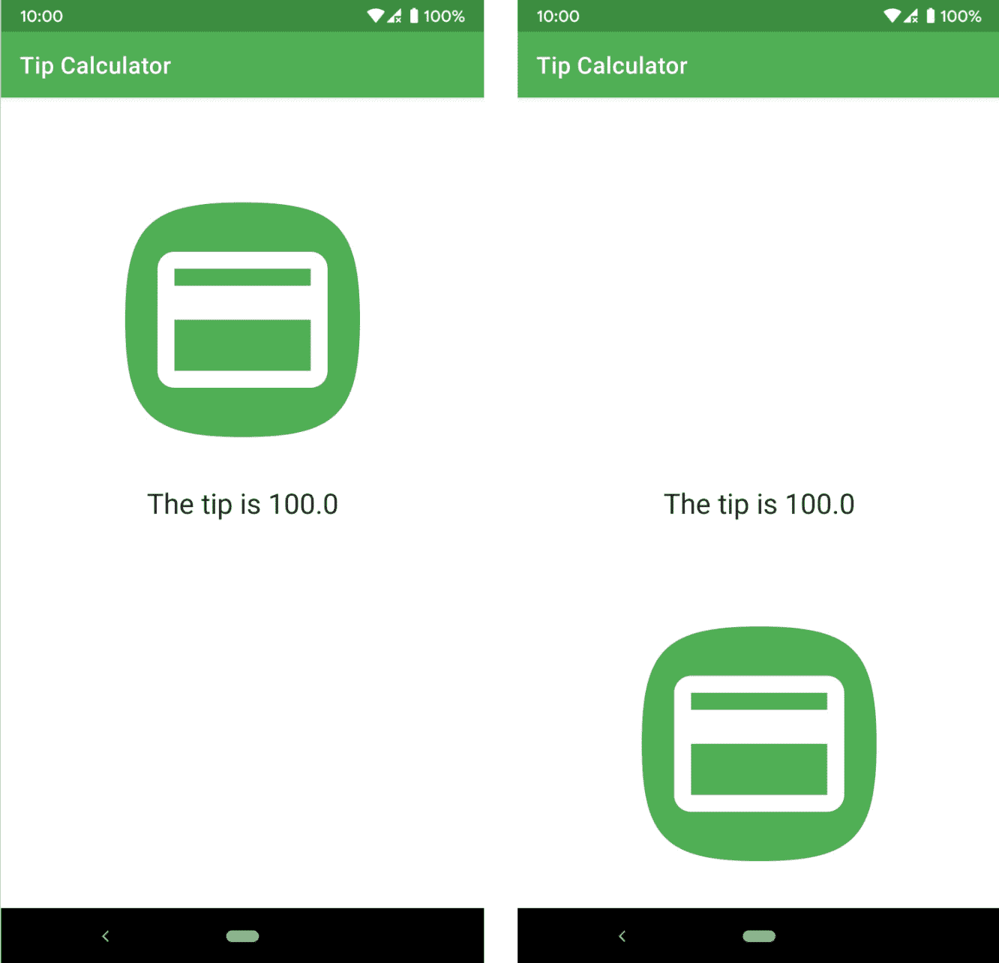

图 15.5：起始动画（左）和结束动画（右）

在这个练习中，我们通过指定开始约束、结束约束和持续时间以及`OnClick`事件，在`MotionLayout`中对`ImageView`进行了动画处理。`MotionLayout`会自动播放动画，从开始位置到结束位置（对我们来说，看起来就像在轻按时自动上下移动）。

我们已经使用`MotionLayout`创建了动画。在下一节中，我们将使用 Android Studio 的 Motion Editor 来创建`MotionLayout`动画。

## Motion Editor

从 4.0 版本开始，Android Studio 包括了 Motion Editor。Motion Editor 可以帮助开发人员使用`MotionLayout`创建动画。这使得开发人员更容易创建和预览过渡和其他动作，而不是手工操作并运行来查看更改。编辑器还会自动生成相应的文件。

您可以通过右键单击预览并单击`Convert to MotionLayout`来将 ConstraintLayout 转换为 MotionLayout。Android Studio 会进行转换，还会为您创建动作场景文件。

在`Design`视图中查看具有`MotionLayout`作为根的布局文件时，Motion Editor UI 将包含在`Design`视图中，如*图 15.6*所示：

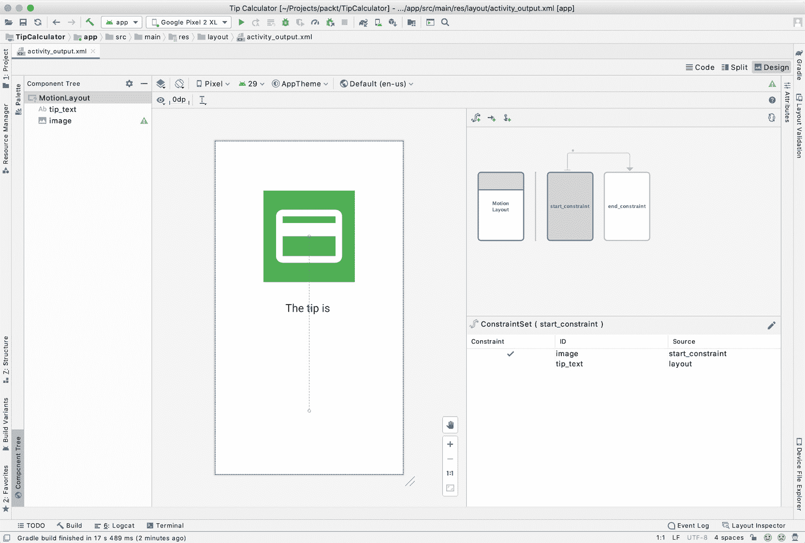

图 15.6：Android Studio 4.0 中的 Motion Editor

在右上窗口（`Overview`面板）中，您可以看到`MotionLayout`的可视化以及开始和结束约束。过渡显示为从开始的箭头。靠近开始约束的点显示了过渡的点击操作。*图 15.7*显示了选择了`start_constraint`的`Overview`面板：


图 15.7：选择了 start_constraint 的 Motion Editor 的概述面板

右下窗口是`Selection`面板，显示了在`Overview`面板中选择的约束集或`MotionLayout`中的视图。当选择过渡箭头时，它还可以显示过渡。*图 15.8*显示了选择`start_constraint`时的`Selection`面板：


图 15.8：Motion Editor 的选择面板显示了 start_constraint 的 ConstraintSet

当您在`Overview`面板的左侧点击`MotionLayout`时，下方的`Selection`面板将显示视图及其约束，如*图 15.9*所示：

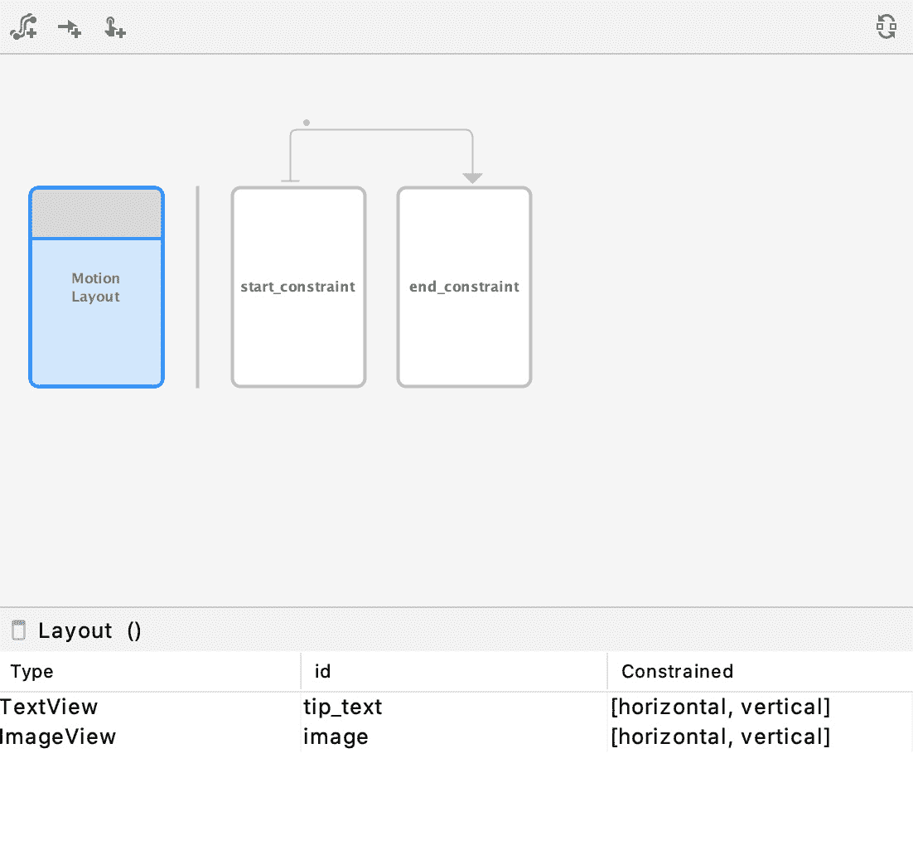

图 15.9：选择 MotionLayout 时的概述和选择面板

当您点击`start_constraint`或`end_constraint`时，左侧的预览窗口将显示开始或结束状态的外观。`Selection`面板还会显示视图及其约束。看一下*图 15.10*，看看选择`start_constraint`时的外观：

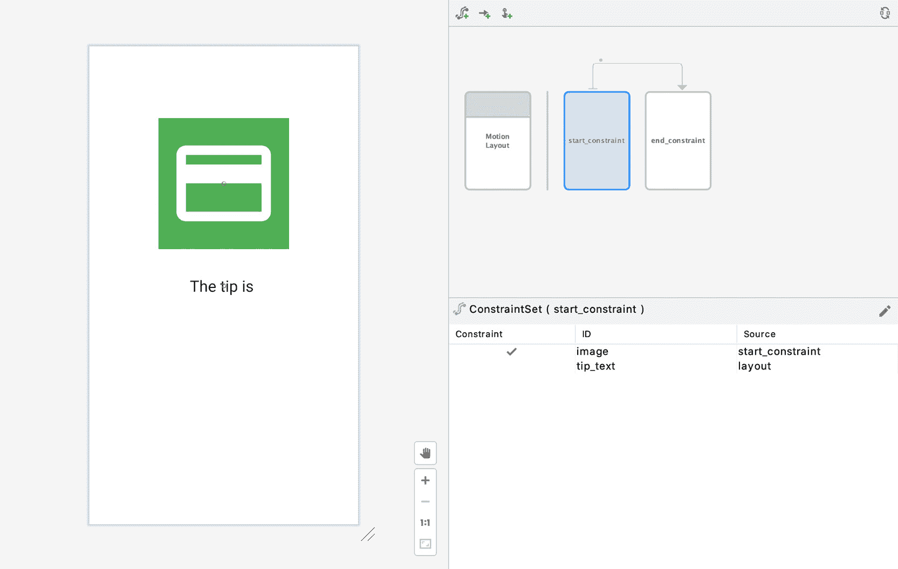

图 15.10：选择了 start_constraint 时 Motion Editor 的外观

*图 15.11*显示了如果选择`end_constraint`，Motion Editor 会是什么样子：

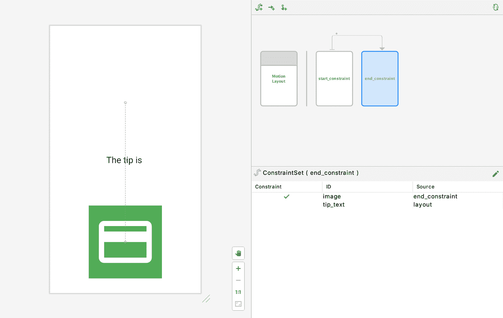

图 15.11：选择 end_constraint 时 Motion Editor 的外观

连接`start_constraint`和`end_constraint`的箭头代表了`MotionLayout`的过渡。在`Selection`面板上，有播放或转到第一个/最后一个状态的控件。您还可以将箭头拖动到特定位置。*图 15.12*显示了动画中间的外观（50%）：

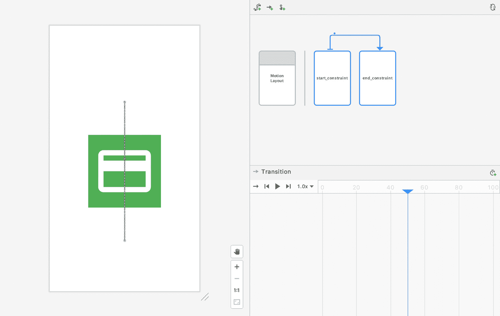

图 15.12：动画中间的过渡

在开发带有`MotionLayout`的动画时，最好能够调试动画以确保我们做得正确。我们将在下一节讨论如何做到这一点。

## 调试 MotionLayout

为了帮助您在运行应用程序之前可视化`MotionLayout`动画，您可以在 Motion Editor 中显示运动路径和动画的进度。运动路径是要动画的对象从起始状态到结束状态所采取的直线路线。

显示路径和/或进度动画，我们可以向`MotionLayout`容器添加`motionDebug`属性。我们可以使用以下值来设置`motionDebug`：

+   `SHOW_PATH`：仅显示运动路径。

+   `SHOW_PROGRESS`：仅显示动画进度。

+   `SHOW_ALL`：显示动画的路径和进度。

+   `NO_DEBUG`：隐藏所有动画。

要显示`MotionLayout`路径和进度，我们可以使用以下内容：

```kt
<androidx.constraintlayout.motion.widget.MotionLayout
    ...
    app:motionDebug="SHOW_ALL"
    ...>
```

`SHOW_ALL`值将显示动画的路径和进度。*图 15.13*显示了当我们使用`SHOW_PATH`和`SHOW_PROGRESS`时的效果：

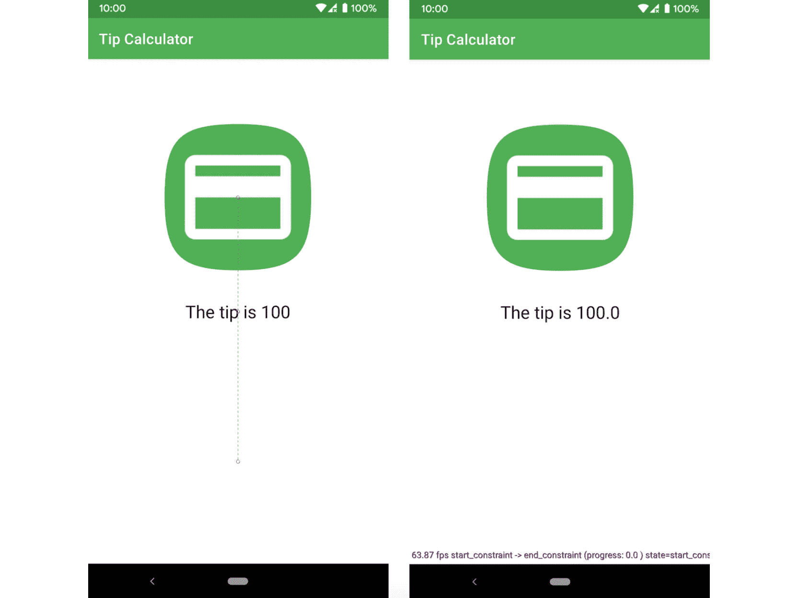

图 15.13：使用 SHOW_PATH（左）显示动画路径，而 SHOW_PROGRESS（右）显示动画进度

虽然`motionDebug`听起来像是只在调试模式下出现的东西，但它也会出现在发布版本中，因此在准备应用程序发布时应将其删除。

在`MotionLayout`动画期间，起始约束将过渡到结束约束，即使有一个或多个元素可以阻挡运动中的对象。我们将在下一节讨论如何避免这种情况发生。

## 修改 MotionLayout 路径

在`MotionLayout`动画中，UI 将从起始约束播放动作到结束约束，即使中间有元素可以阻挡我们移动的视图。例如，如果`MotionLayout`涉及从屏幕顶部到底部移动的文本，然后反之，我们在中间添加一个按钮，按钮将覆盖移动的文本。

*图 15.14*显示了`OK`按钮如何挡住了动画中间的移动文本：


图 15.14：OK 按钮挡住了文本动画的中间部分

`MotionLayout`以直线路径播放动画从起始到结束约束，并根据指定的属性调整视图。我们可以在起始和结束约束之间添加关键帧来调整动画路径和/或视图属性。例如，在动画期间，除了改变移动文本的位置以避开按钮之外，我们还可以改变文本或其他视图的属性。

关键帧可以作为`motion_scene`的过渡属性的子级添加到`KeyFrameSet`中。我们可以使用以下关键帧：

+   `KeyPosition`：指定动画过程中特定点上视图的位置以调整路径。

+   `KeyAttribute`：指定动画过程中特定点上视图的属性。

+   `KeyCycle`：在动画期间添加振荡。

+   `KeyTimeCycle`：这允许循环由时间驱动而不是动画进度。

+   `KeyTrigger`：添加一个可以根据动画进度触发事件的元素。

我们将重点放在`KeyPosition`和`KeyAttribute`上，因为`KeyCycle`、`KeyTimeCycle`和`KeyTrigger`是更高级的关键帧，并且仍然可能会发生变化。

`KeyPosition`允许我们在`MotionLayout`动画中更改视图的位置。它具有以下属性：

+   `motionTarget`：指定由关键帧控制的对象。

+   `framePosition`：从 1 到 99 编号，指定位置将在动作变化时的百分比。例如，25 表示动画的四分之一处，50 表示动画的中间点。

+   `percentX`：指定路径的`x`值将被修改多少。

+   `percentY`：指定路径的`y`值将被修改多少。

+   `keyPositionType`：指定`KeyPosition`如何修改路径。

`keyPositionType`属性可以具有以下值：

+   `parentRelative`：`percentX`和`percentY`是基于视图的父级指定的。

+   `pathRelative`：`percentX`和`percentY`是基于从开始约束到结束约束的直线路径指定的。

+   `deltaRelative`：`percentX`和`percentY`是基于视图位置指定的。

例如，如果我们想要在动画的正中间（50%）修改`text_view` ID 的`TextView`的路径，通过将其相对于`TextView`的父容器在`x`和`y`方向上移动 10%，我们将在`motion_scene`中有以下关键位置：

```kt
<KeyPosition
    app:motionTarget="@+id/text_view"
    app:framePosition="50"
    app:keyPositionType="parentRelative"
    app:percentY="0.1"
    app:percentX="0.1"
/>
```

同时，`KeyAttribute`允许我们在`MotionLayout`动画进行时更改视图的属性。我们可以更改的一些视图属性包括`visibility`、`alpha`、`elevation`、`rotation`、`scale`和`translation`。它具有以下属性：

+   `motionTarget`：指定由关键帧控制的对象。

+   `framePosition`：从 1 到 99 编号，指定应用视图属性的动作百分比。例如，20 表示动画的五分之一处，75 表示动画的四分之三处。

让我们尝试向*Tip Calculator*应用程序添加关键帧。在`ImageView`的动画过程中，它会覆盖显示小费的文本。我们将使用关键帧来解决这个问题。

## 练习 15.04：使用关键帧修改动画路径

在上一个练习中，我们动画化了图像在被点击时向下移动（或者当它已经在底部时向上移动）。当图像处于中间位置时，它会覆盖小费`TextView`。我们将通过在 Android Studio 的 Motion Editor 中向`motion_scene`添加`KeyFrame`来解决这个问题：

1.  使用 Android Studio 4.0 或更高版本打开*Tip Calculator*应用程序。

1.  在`res/layout`目录中打开`activity_output.xml`文件。

1.  切换到`Design`视图。

1.  将`app:motionDebug="SHOW_ALL"`添加到`MotionLayout`容器中。这将允许我们在 Android Studio 和设备/模拟器上看到路径和进度信息。您的`MotionLayout`容器将如下所示：

```kt
<androidx.constraintlayout.motion.widget.MotionLayout
    xmlns:android="http://schemas.android.com/apk/res/android"
    xmlns:app="http://schemas.android.com/apk/res-auto"
    xmlns:tools="http://schemas.android.com/tools"
    android:layout_width="match_parent"
    android:layout_height="match_parent"
    app:layoutDescription="@xml/motion_scene"
    app:motionDebug="SHOW_ALL"
        tools:context=".OutputActivity"> 
```

1.  运行应用程序并进行计算。在输出屏幕上，点击图像。观察动画进行时的小费文本。您会注意到在动画的中间，图像会覆盖文本，如*图 15.15*所示：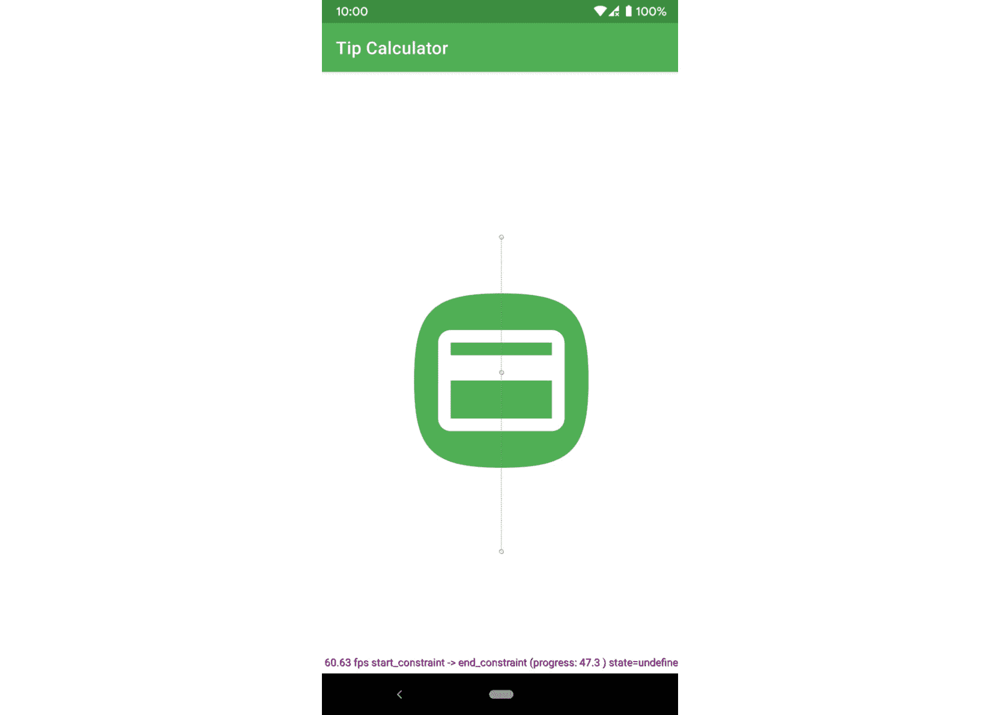

图 15.15：图像遮挡显示小费的 TextView

1.  返回 Android Studio 中的`activity_output.xml`文件。确保它在`Design`视图中打开。

1.  在右上角的`Overview`面板中，单击连接`start_constraint`和`end_constraint`的箭头。在`Selection`面板中将下箭头拖到中间（50%），如*图 15.16*所示：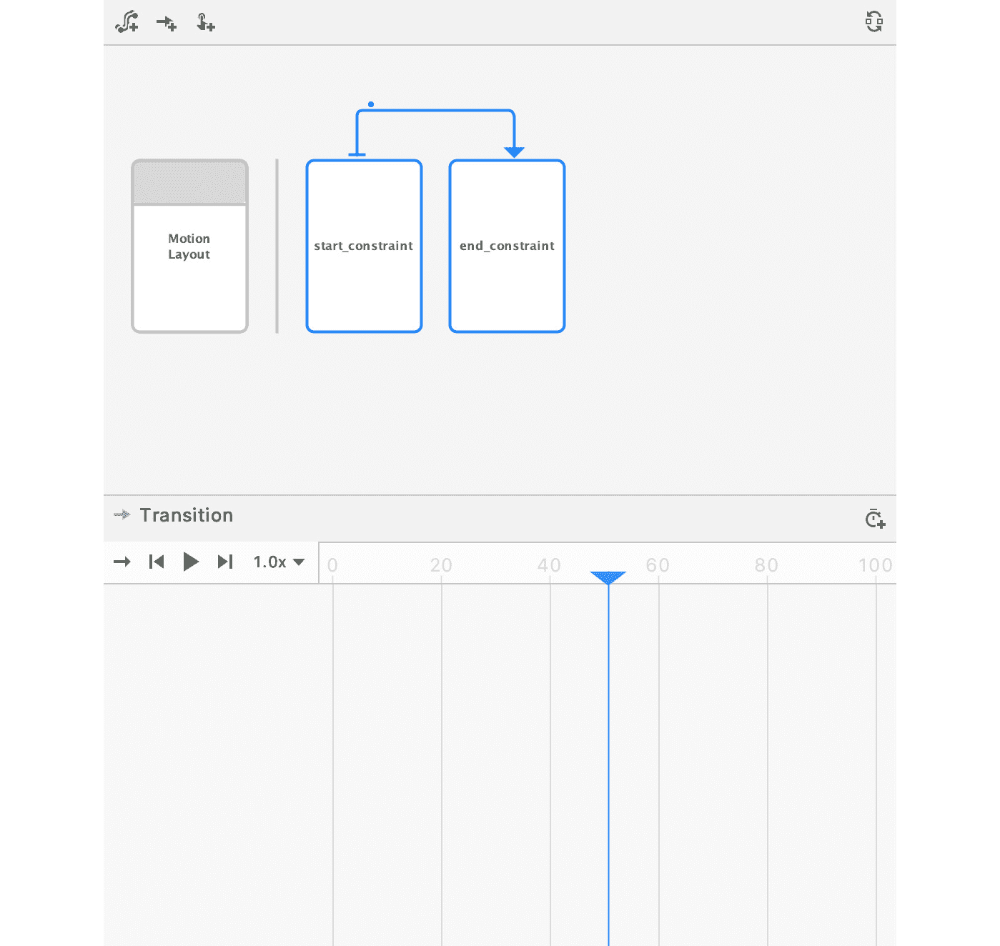

图 15.16：选择表示开始和结束约束之间过渡的箭头

1.  点击`Selection`面板中`Transition`右侧的`Create KeyFrames`图标（带有绿色`+`符号）。参考*图 15.17*查看图标：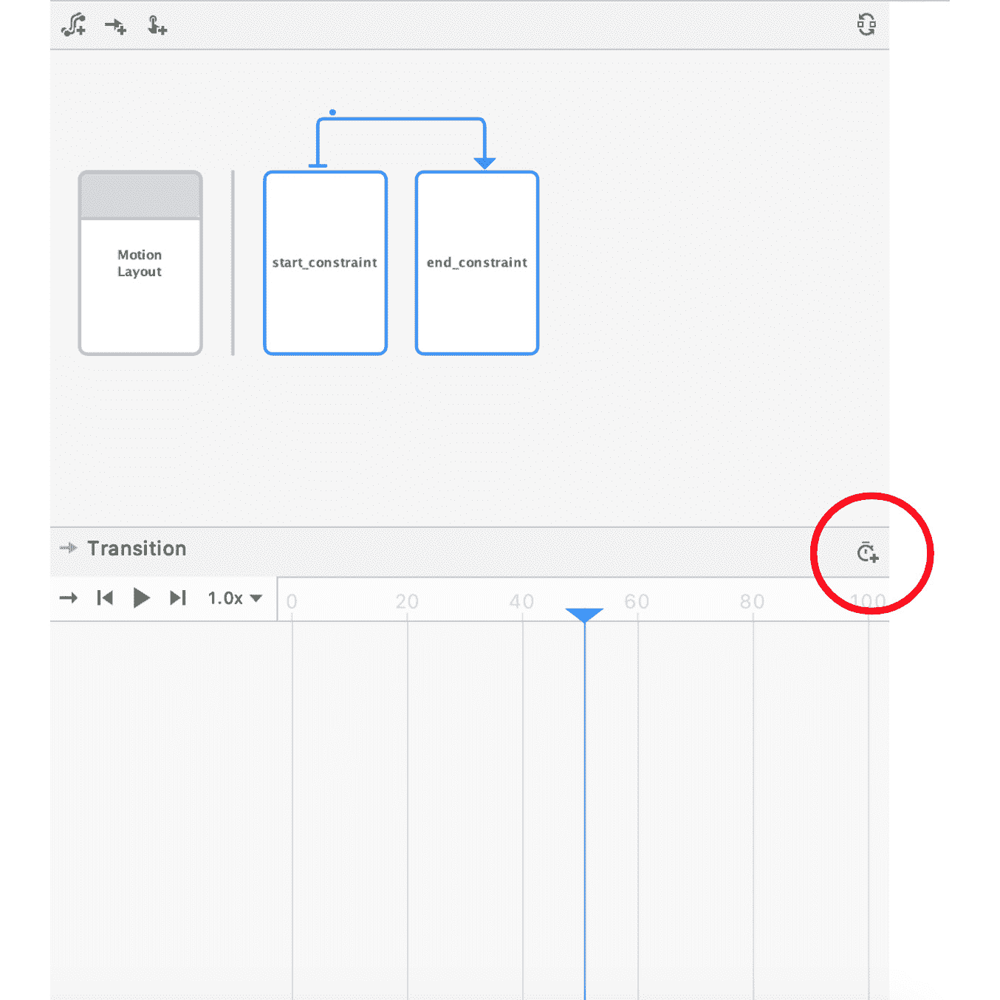

图 15.17：创建关键帧图标

1.  选择`KeyPosition`。我们将使用`KeyPosition`来调整文本位置，避免按钮。

1.  选择`ID`，选择`image`，并将输入位置设置为`50`。`Type`为`parentRelative`，`PercentX`为`1.5`，如*图 15.18*所示。这将在过渡的中间（50%）为图像添加一个`KeyPosition`属性，相对于父视图的`x`轴为 1.5 倍：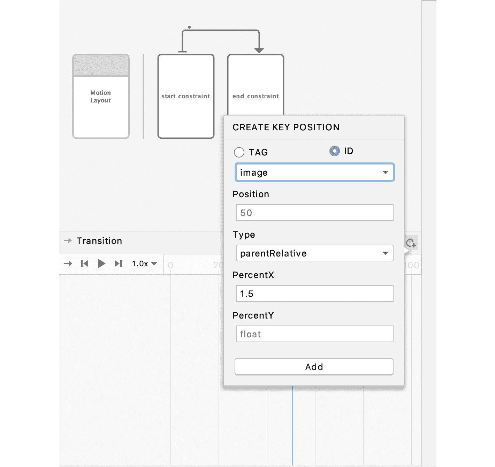

图 15.18：提供要进行的关键位置的输入

1.  点击`Add`按钮。你会在`Design`预览中看到，如*图 15.19*所示，运动路径不再是一条直线。在位置 50（动画的中间），文本将不再被`ImageView`覆盖。`ImageView`将位于`TextView`的右侧：

图 15.19：路径现在将是曲线而不是直线。过渡面板还将添加一个新的`KeyPosition`项目

1.  点击播放图标查看动画效果。在设备或模拟器上运行应用程序进行验证。你会看到动画现在向右弯曲，而不是沿着以前的直线路径，如*图 15.20*所示：

图 15.20：动画现在避开了带有提示的 TextView

1.  Motion Editor 将自动生成`KeyPosition`的代码。如果你转到`motion_scene.xml`文件，你会看到 Motion Editor 在过渡属性中添加了以下代码：

```kt
<KeyFrameSet>
    <KeyPosition
        app:framePosition="50"
        app:keyPositionType="parentRelative"
        app:motionTarget="@+id/image"
        app:percentX="1.5" />
</KeyFrameSet>
```

在过渡期间的关键帧中添加了`KeyPosition`属性。在动画的 50%处，图像的`x`位置将相对于其父视图移动 1.5 倍。这允许图像在动画过程中避开其他元素。

在这个练习中，你已经添加了一个关键位置，它将调整`MotionLayout`动画，使其不会阻塞或被路径中的其他视图阻塞。

让我们通过做一个活动来测试你学到的一切。

## 活动 15.01：密码生成器

使用强密码来保护我们的在线账户是很重要的。它必须是独一无二的，必须包括大写和小写字母，数字和特殊字符。在这个活动中，你将开发一个可以生成强密码的应用程序。

该应用程序将有两个屏幕：输入屏幕和输出屏幕。在输入屏幕上，用户可以提供密码的长度，并指定它是否必须包含大写或小写字母，数字或特殊字符。输出屏幕将显示三个可能的密码，当用户选择一个时，其他密码将移开，并显示一个按钮将密码复制到剪贴板。你应该自定义从输入到输出屏幕的转换。

完成的步骤如下：

1.  在 Android Studio 4.0 或更高版本中创建一个名为`Password Generator`的新项目。设置它的包名和`Minimum SDK`。

1.  将`MaterialComponents`依赖项添加到你的`app/build.gradle`文件中。

1.  更新`ConstraintLayout`的依赖关系。

1.  确保活动的主题在`themes.xml`文件中使用了`MaterialComponents`的主题。

1.  在`activity_main.xml`文件中，删除`Hello World`的`TextView`，并添加密码长度的输入文本字段。

1.  为大写字母、数字和特殊字符添加复选框代码。

1.  在复选框底部添加一个`Generate`按钮。

1.  创建另一个名为`OutputActivity`的活动。

1.  自定义从输入屏幕（`MainActivity`）到`OutputActivity`的活动转换。打开`themes.xml`并使用`windowActivityTransitions`，`windowEnterTransition`和`windowExitTransition`样式属性更新活动主题。

1.  更新`MainActivity`中`onCreate`函数的结尾。

1.  更新`activity_output.xml`文件中`androidx.constraintlayout.widget.ConstraintLayout`的代码。

1.  在`MotionLayout`标签中添加`app:layoutDescription="@xml/motion_scene"`和`app:motionDebug="SHOW_ALL"`。

1.  在输出活动中为生成的三个密码添加三个`TextView`实例。

1.  在屏幕底部添加一个“复制”按钮。

1.  在`OutputActivity`中添加`generatePassword`函数。

1.  添加代码根据用户输入生成三个密码，并为用户添加一个`ClickListener`组件，以便将所选密码复制到剪贴板。

1.  在`OutputActivity`中，为每个密码`TextView`创建一个动画。

1.  为默认视图创建`ConstraintSet`。

1.  当选择第一个、第二个和第三个密码时，添加`ConstraintSet`。

1.  当选择每个密码时，添加`Transition`。

1.  通过转到“运行”菜单并点击“运行应用”菜单项来运行应用程序。

1.  输入一个长度，选择大写字母、数字和特殊字符，然后点击“生成”按钮。将显示三个密码。

1.  选择一个密码，其他密码将移出视图。还会显示一个“复制”按钮。点击它，检查你选择的密码是否现在在剪贴板上。输出屏幕的初始状态和最终状态将类似于*图 15.21*：

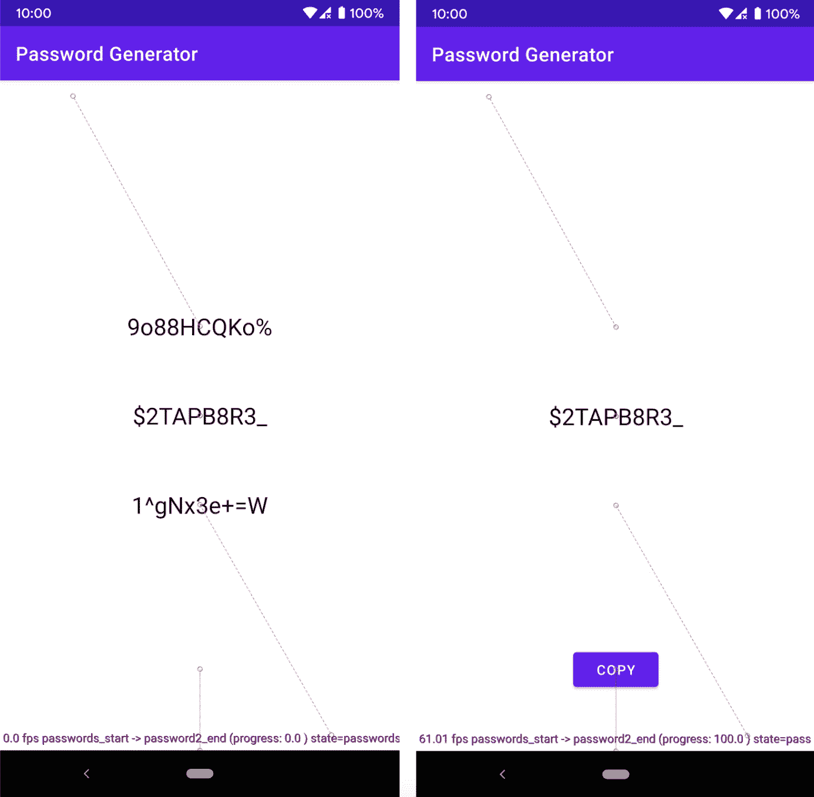

图 15.21：密码生成器应用中 MotionLayout 的起始和结束状态

注意

此活动的解决方案可在以下网址找到：http://packt.live/3sKj1cp

# 总结

本章介绍了如何使用`CoordinatorLayout`和`MotionLayout`创建动画和过渡。动画可以提高应用的可用性，并使其与其他应用脱颖而出。

我们首先定制了打开和关闭活动时的过渡，使用了活动过渡。我们还了解了当一个活动和它打开的活动都包含相同的元素时，如何添加共享元素过渡，以便我们可以向用户突出显示这些共享元素之间的链接。

我们学习了如何使用`CoordinatorLayout`来处理其子视图的运动。一些视图具有内置的行为，用于处理它们在`CoordinatorLayout`中的工作方式。您也可以为其他视图添加自定义行为。然后，我们开始使用`MotionLayout`来创建动画，通过指定起始约束、结束约束和它们之间的过渡。我们还研究了通过在动画中间添加关键帧来修改运动路径。我们了解了关键帧，比如`KeyPosition`，它可以改变视图的位置，以及`KeyAttribute`，它可以改变视图的样式。我们还研究了在 Android Studio 中使用 Motion Editor 来简化动画的创建和预览以及修改路径。

在下一章中，我们将学习关于 Google Play 商店。我们将讨论如何创建帐户并准备您的应用发布，以及如何发布供用户下载和使用。
