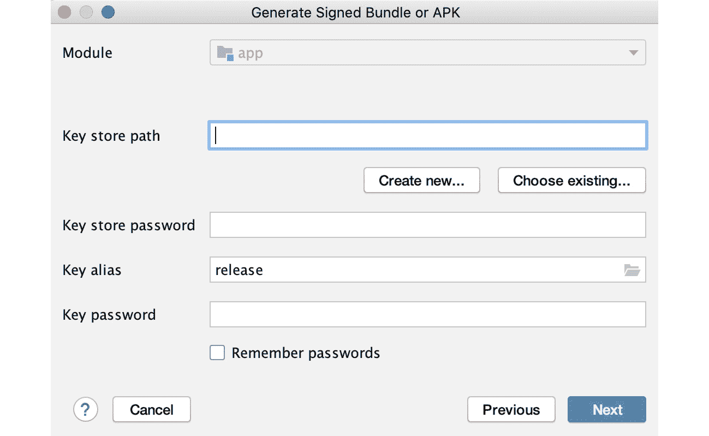
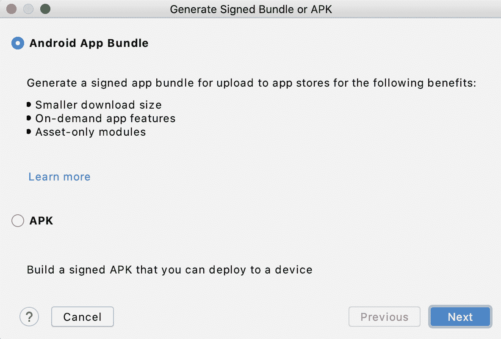
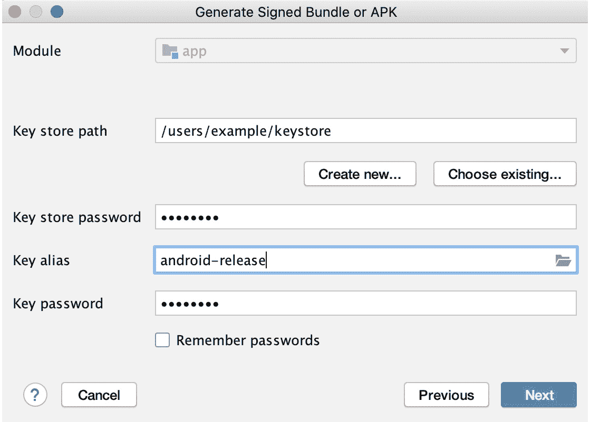
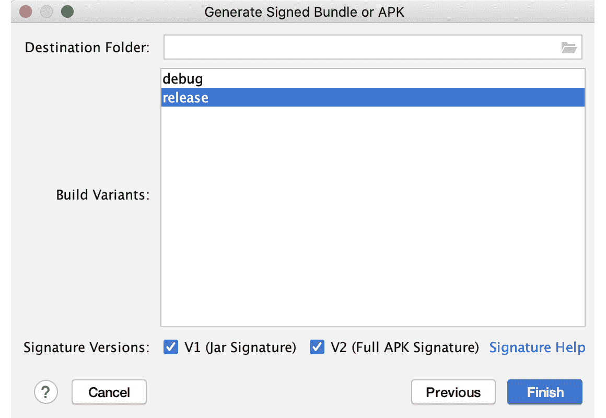
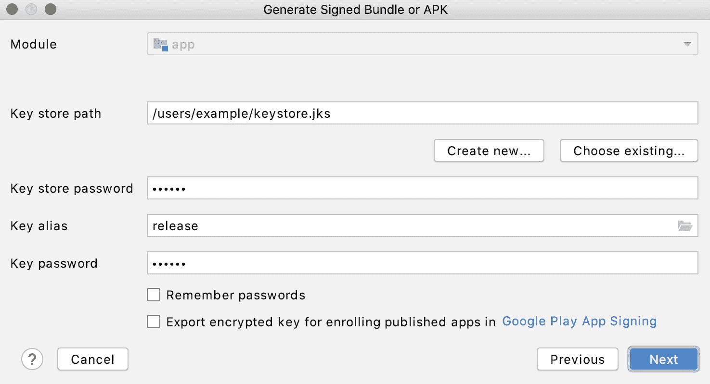
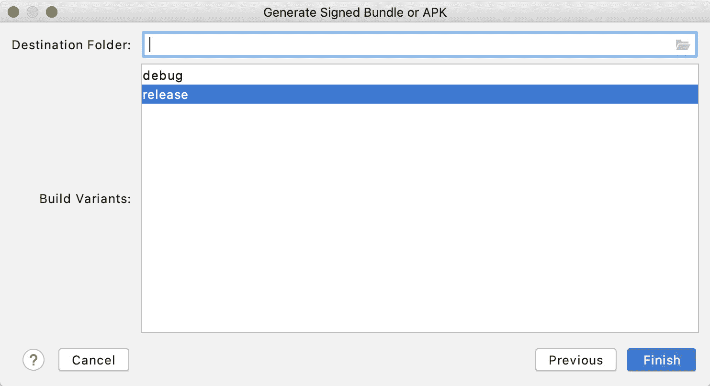
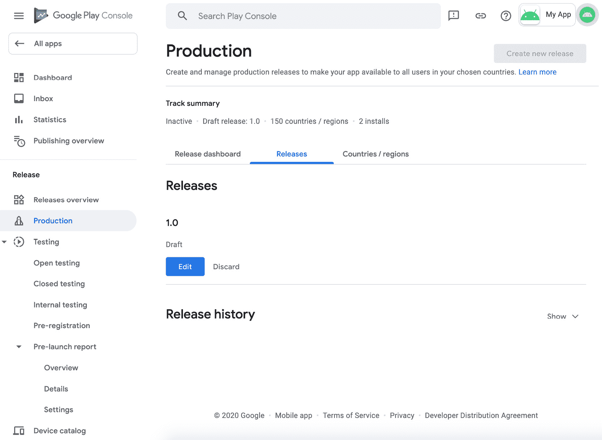
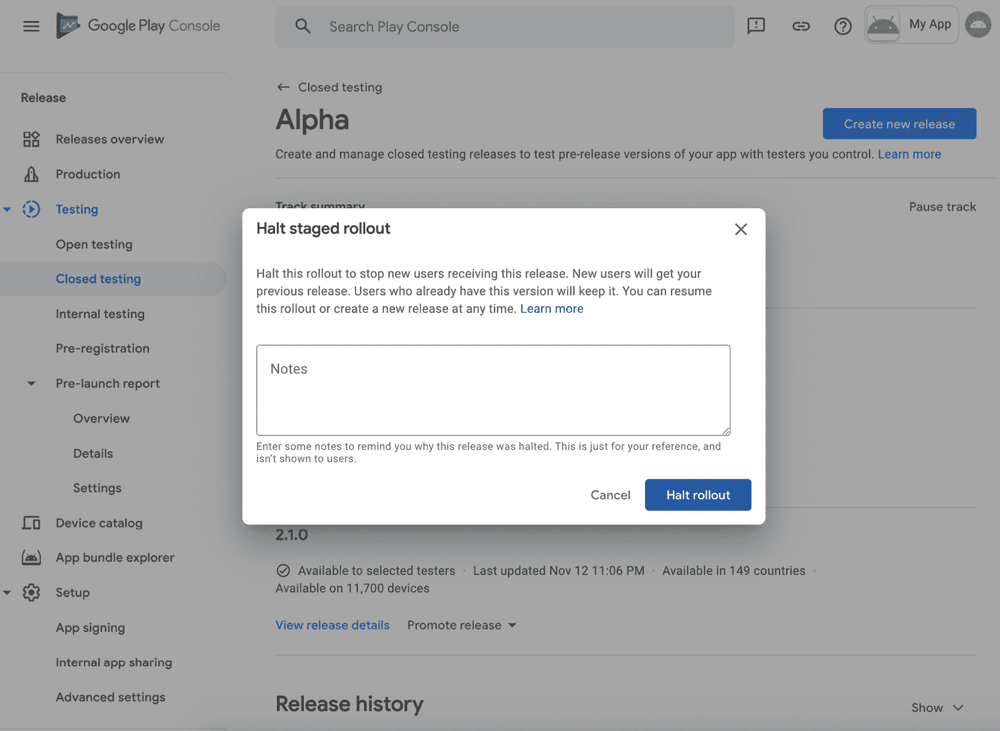
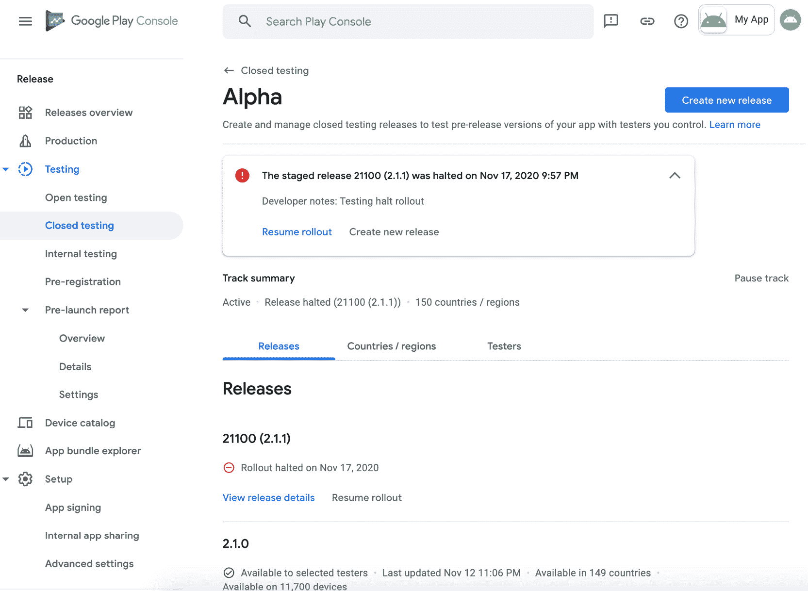

# 第十六章：在 Google Play 上发布您的应用程序

概述

本章将向您介绍 Google Play 控制台、发布渠道和整个发布流程。它涵盖了创建 Google Play 开发者帐户、为我们开发的应用程序设置商店条目以及创建密钥库（包括密码的重要性和文件存储位置）。我们还将了解应用程序包和 APK，以及如何生成应用程序的 APK 或 AAB 文件。在本章的后面部分，我们将设置发布路径、开放测试版和封闭测试版，最后我们将把我们的应用上传到商店并在设备上下载。

通过本章结束时，您将能够创建自己的 Google Play 开发者帐户，为发布准备已签名的 APK 或应用程序包，并在 Google Play 上发布您的第一个应用程序。

# 介绍

在上一章中，您学会了如何使用`CoordinatorLayout`和`MotionLayout`添加动画和过渡。现在，您已经准备好开发和发布 Android 应用程序。

开发 Android 应用程序后，它们只能在您的设备和模拟器上使用。您必须使它们对所有人都可用，以便他们可以下载。反过来，您将获得用户，并且可以从他们那里赚钱。Android 应用程序的官方市场是 Google Play。通过 Google Play，您发布的应用程序和游戏可以在全球超过 20 亿活跃的 Android 设备上使用。

在本章中，我们将学习如何在 Google Play 上发布您的应用程序。我们将从为发布准备应用程序和创建 Google Play 开发者帐户开始。然后，我们将继续上传您的应用程序并管理应用程序发布。

让我们开始准备在 Google Play 上发布您的应用程序。

# 为发布准备您的应用程序

在 Google Play 上发布应用程序之前，您必须确保它使用了发布密钥进行签名，并且具有正确的版本信息。否则，您将无法发布新应用程序或更新已发布的应用程序。

让我们从为您的应用程序添加版本开始。

## 应用程序版本

您的应用程序版本之所以重要，有以下几个原因：

+   用户可以看到他们已下载的版本。在检查是否有更新或报告应用程序的已知问题时，他们可以使用这个信息。

+   设备和 Google Play 使用版本值来确定应用程序是否可以或应该更新。

+   开发人员还可以使用这个值在特定版本中添加功能支持。他们还可以警告或强制用户升级到最新版本，以获得有关错误或安全问题的重要修复。

Android 应用程序有两个版本：`versionCode`和`versionName`。现在，`versionCode`是一个整数，由开发人员、Google Play 和 Android 系统使用，而`versionName`是一个字符串，用户在 Google Play 页面上看到的。

应用程序的初始发布可以将`versionCode`值设为`1`，每次新发布都应该增加这个值。

`versionName`可以采用*x.y*格式（其中*x*是主要版本，*y*是次要版本）。您还可以使用语义版本控制，如*x.y.z*，通过添加*z*来添加补丁版本。要了解更多关于语义版本控制的信息，请参阅[`semver.org`](https://semver.org)。

在模块的`build.gradle`文件中，在 Android Studio 中创建新项目时，`versionCode`和`versionName`会自动生成。它们位于`android`块下的`defaultConfig`块中。一个示例`build.gradle`文件显示了这些值：

```kt
android {
    compileSdkVersion 29
    defaultConfig {
        applicationId "com.example.app"
        minSdkVersion 16
        targetSdkVersion 29
        versionCode 1
        versionName "1.0"
        ...
    }
    ...
}
```

在发布更新时，要发布的新包必须具有更高的`versionCode`值，因为用户无法降级其应用程序，只能下载新版本。

在确保应用程序版本正确之后，发布流程的下一步是获取一个密钥库来对应用程序进行签名。这将在下一节中讨论。

## 创建密钥库

Android 应用程序在运行时会自动使用调试密钥进行签名。但是，在将应用程序发布到 Google Play 商店之前，必须使用发布密钥对应用程序进行签名。为此，您必须拥有一个密钥库。如果您还没有，可以在 Android Studio 中创建一个。

## 练习 16.01：在 Android Studio 中创建密钥库

在这个练习中，我们将使用 Android Studio 创建一个密钥库，用于签署 Android 应用程序。按照以下步骤完成这个练习：

1.  在 Android Studio 中打开一个项目。

1.  转到“构建”菜单，然后单击“生成已签名的捆绑包或 APK…”：

图 16.1：生成已签名的捆绑包或 APK 对话框

1.  确保选择了`APK`或“Android 应用程序捆绑包”，然后点击“下一步”按钮。在这里，您可以选择现有的密钥库或创建一个新的：

图 16.2：选择 APK 并点击“下一步”按钮后的生成已签名的捆绑包或 APK 对话框

1.  点击“创建新…”按钮。然后将出现“新密钥库”对话框：

图 16.3：新密钥库对话框

1.  在“密钥库路径”字段中，选择要保存密钥库文件的位置。您可以点击右侧的文件夹图标选择文件夹并输入文件名。该值将类似于`users/packt/downloads/keystore.keystore`

1.  在“密码”和“确认”字段中提供密码。

1.  在“密钥”下的证书部分，输入名字、组织单位、组织、城市/地点、州/省和国家代码。这些信息中只有一个是必需的，但最好提供所有信息。

1.  点击“确定”按钮。如果没有错误，密钥库将在您提供的路径中创建，并且您将回到“生成已签名的捆绑包或 APK”对话框，以便继续生成 APK 或应用程序捆绑包。如果您只想创建一个密钥库，可以关闭对话框。

在这个练习中，您已经创建了自己的密钥库，可以用来签署可以发布到 Google Play 的应用程序。

如果您更喜欢使用命令行生成密钥库，也可以这样做。`keytool`命令在**Java 开发工具包**（**JDK**）中可用。命令如下：

```kt
keytool -genkey -v -keystore my-key.jks -keyalg RSA -keysize 
  2048 -validity 9125 -alias key-alias
```

此命令在当前工作目录中创建一个 2,048 位的 RSA 密钥库，文件名为`my-key.jks`，别名为`key-alias`；有效期为 9,125 天（25 年）。命令行将提示您输入密钥库密码，然后提示您再次确认。然后，它将要求您依次输入名字、组织单位、组织名称、城市或地点、州或省和国家代码。这些信息中只有一个是必需的；如果要留空，可以按“Enter”键。不过，最好提供所有信息。

在国家代码提示之后，将要求您验证提供的输入。您可以输入 yes 进行确认。然后将要求您提供密钥别名的密码。如果要与密钥库密码相同，可以按“Enter”。然后将生成密钥库。

现在您已经有了一个用于签署应用程序的密钥库，需要知道如何保护它。您将在下一节中了解到这一点。

## 存储密钥库和密码

您需要将密钥库和密码存放在安全的地方，因为如果您丢失了密钥库和/或其凭据，将无法再发布应用程序更新。如果黑客也能够访问这些内容，他们可能会未经您的同意更新您的应用程序。

您可以将密钥库存储在 CI/构建服务器或安全服务器中。

保留凭据有点棘手，因为在以后签署应用更新时，您将需要它们。您可以通过将此信息包含在项目的`build.gradle`文件中来实现这一点。

在`android`块中，您可以有`signingConfigs`，它引用密钥库文件、其密码以及密钥的别名和密码：

```kt
android {
    ...
    signingConfigs {
        release {
            storeFile file("keystore-file")
            storePassword "keystore-password"
            keyAlias "key-alias"
            keyPassword "key-password"
        }
    }
    ...
}
```

在项目的`build.gradle`文件中的`buildTypes`的发布块下，您可以在`signingConfigs`块中指定发布配置：

```kt
buildTypes {
        release {
            ...
            signingConfig signingConfigs.release
        }
        ...
}
```

将签名配置存储在`build.gradle`文件中并不安全，因为可以访问项目或存储库的人可能会 compromise the app。

您可以将这些凭据存储在环境变量中，以使其更安全。通过这种方法，即使恶意人士获得了对您代码的访问权限，应用更新仍将是安全的，因为签名配置并未存储在您的代码中，而是存储在系统中。环境变量是在 IDE 或项目之外设置的键值对，例如在您自己的计算机上或在构建服务器上。

要在 Gradle 中使用环境变量进行密钥库配置，您可以为存储文件路径、存储密码、密钥别名和密钥密码创建环境变量。例如，您可以使用`KEYSTORE_FILE`、`KEYSTORE_PASSWORD`、`KEY_ALIAS`和`KEY_PASSWORD`环境变量。

在 Mac 和 Linux 上，您可以使用以下命令设置环境变量：

```kt
export KEYSTORE_PASSWORD=securepassword
```

如果您使用 Windows，可以这样做：

```kt
set KEYSTORE_PASSWORD=securepassword
```

这个命令将创建一个名为`KEYSTORE_PASSWORD`的环境变量，其值为`securepassword`。在应用的`build.gradle`文件中，您可以使用环境变量中的值：

```kt
storeFile System.getenv("KEYSTORE_FILE")
storePassword System.getenv("KEYSTORE_PASSWORD")
keyAlias System.getenv("KEY_ALIAS")
keyPassword System.getenv("KEY_PASSWORD")
```

您的密钥库将用于为发布签署您的应用，以便您可以在 Google Play 上发布它。我们将在下一节中讨论这个问题。

## 为发布签署您的应用

当您在模拟器或实际设备上运行应用时，Android Studio 会自动使用调试密钥库对其进行签名。要在 Google Play 上发布应用，您必须使用您自己的密钥对 APK 或应用捆绑包进行签名，使用您在 Android Studio 中或通过命令行创建的密钥库。

如果您已经在`build.gradle`文件中为发布版本添加了签名配置，您可以通过在`Build Variants`窗口中选择发布版本构建自动构建已签名的 APK 或应用捆绑包。然后，您需要转到`Build`菜单，单击`Build Bundle(s)`项目，然后选择`Build APK(s)`或`Build Bundle(s)`。APK 或应用捆绑包将生成在项目的`app/build/output`目录中。

## 练习 16.02：创建已签名的 APK

在这个练习中，我们将使用 Android Studio 为 Android 项目创建一个已签名的 APK：

1.  在 Android Studio 中打开一个项目。

1.  转到`Build`菜单，然后单击`生成已签名的 Bundle 或 APK…`菜单项：

图 16.4：生成签名的 Bundle 或 APK 对话框

1.  选择`APK`，然后单击`下一步`按钮：

图 16.5：单击下一步按钮后的生成签名的 Bundle 或 APK 对话框。

1.  选择您在*练习 16.01*中创建的密钥库，*在 Android Studio 中创建密钥库*。

1.  在`Key store password`字段中提供密码。

1.  在`Key alias`字段中，单击右侧的图标并选择密钥别名。

1.  在`Key password`字段中提供别名密码。

1.  单击`下一步`按钮。

1.  选择生成已签名 APK 的目标文件夹。

1.  在`Build Variants`字段中，确保选择了`release`变体：

图 16.6：在生成签名的 Bundle 或 APK 对话框中选择发布版本

1.  对于签名版本，请选择 V1 和 V2。 “V2（完整 APK 签名）”是一种整个文件方案，可以增加应用程序的安全性并使其安装速度更快。 这仅适用于 Android 7.0 Nougat 及更高版本。 如果您的目标低于此版本，还应使用“V1（Jar 签名）”，这是签署 APK 的旧方式，但安全性不及 v2。

1.  单击“完成”按钮。 Android Studio 将构建已签名的 APK。 IDE 通知将弹出，通知您已生成已签名的 APK。 您可以单击“定位”以转到已签名 APK 文件所在的目录：


图 16.7：成功生成已签名 APK 的弹出通知

在本练习中，您已经制作了一个已签名的 APK，现在可以在 Google Play 上发布。 在下一节中，您将了解 Android 应用捆绑包，这是一种发布应用的新方式。

## Android 应用捆绑包

发布 Android 应用的传统方式是通过 APK 或应用程序包。 当用户安装您的应用时，将下载此 APK 文件到他们的设备上。 这是一个包含所有设备配置的字符串、图像和其他资源的大文件。

随着您支持更多的设备类型和更多的国家/地区，此 APK 文件的大小将增长。 用户下载的 APK 将包含实际上对其设备不是必需的内容。 对于存储空间较小的用户，这将是一个问题，因为他们可能没有足够的空间来安装您的应用。 有昂贵数据计划或较慢的互联网连接的用户可能会避免下载太大的应用。 他们可能还会卸载您的应用以节省存储空间。

一些开发人员一直在构建和发布多个 APK 以避免这些问题。 但是，这是一个复杂且低效的解决方案，特别是当您针对不同的屏幕密度、CPU 架构和语言时。 这将是每个发布版本维护太多 APK 文件。

Android 应用捆绑包是发布应用的新方式。 您只需生成一个单个的应用程序捆绑包文件（使用 Android Studio 3.2 及更高版本），然后将其上传到 Google Play。 Google Play 将自动生成基本 APK 文件以及每个设备配置、CPU 架构和语言的 APK 文件。 当用户安装您的应用时，他们只会下载其设备所需的 APK 文件。 与通用 APK 相比，这将更小。

这将适用于 Android 5.0 棒棒糖及更高版本的设备； 对于低于此版本的设备，将仅生成设备配置和 CPU 架构的 APK 文件。 所有语言和其他资源将包含在每个 APK 文件中。

## 练习 16.03：创建已签名的应用程序捆绑包

在本练习中，我们将使用 Android Studio 为 Android 项目创建一个已签名的应用程序捆绑包：

1.  在 Android Studio 中打开一个项目。

1.  转到“构建”菜单，然后单击“生成签名捆绑包或 APK…”菜单项：

图 16.8：生成签名捆绑包或 APK 对话框

1.  选择“Android 应用捆绑包”，然后单击“下一步”按钮：

图 16.9：单击“下一步”按钮后生成签名捆绑包或 APK 对话框

1.  选择您在*练习 16.01*中创建的密钥库，*在 Android Studio 中创建密钥库*。

1.  在“密钥库密码”字段中提供密码。

1.  在“密钥别名”字段中，单击右侧的图标并选择密钥别名。

1.  在“密钥密码”字段中提供别名密码。

1.  单击“下一步”按钮。

1.  选择生成已签名应用程序捆绑包的目标文件夹。

1.  在“构建变体”字段中，确保选择了“发布”变体：

图 16.10：在生成已签名的应用程序包或 APK 对话框中选择发布版本

1.  单击`完成`按钮。Android Studio 将构建已签名的应用程序包。IDE 通知将弹出，通知您已生成已签名的应用程序包。您可以单击`定位`以转到已签名的应用程序包文件所在的目录：


图 16.11：弹出通知，已生成已签名的应用程序包

在这个练习中，您已经制作了一个已签名的应用程序包，现在可以在 Google Play 上发布。

要能够以 Android 应用程序包格式发布您的应用程序，您需要选择通过 Google Play 进行应用签名。我们将在下一节讨论 Google Play 应用签名。

## Google Play 应用签名

Google Play 提供了一项名为应用签名的服务，允许 Google 管理和保护您的应用签名密钥，并为用户自动重新签名您的应用。

使用 Google Play 应用签名，您可以让 Google 生成签名密钥，也可以上传您自己的签名密钥。您还可以为了额外的安全性创建不同的上传密钥。您可以使用上传密钥对应用程序进行签名，并在 Play 控制台上发布应用程序。Google 将检查上传密钥，删除它，并使用应用签名密钥重新签名应用程序以分发给用户。当应用签名对应用程序启用时，可以重置上传密钥。如果您丢失了上传密钥或认为它已经被泄露，您可以简单地联系 Google Play 开发者支持，验证您的身份，并获得新的上传密钥。

在发布新应用程序时，选择应用签名是很容易的。在 Google Play 控制台([`play.google.com/console`](https://play.google.com/console))中，您可以转到`发布管理` | `应用发布`部分，并在`让 Google 管理和保护您的应用签名密钥`部分选择`继续`。您最初用于签署应用的密钥将成为上传密钥，Google Play 将生成新的应用签名密钥。

您还可以将现有的应用程序转换为使用应用签名。这在 Google Play 控制台中应用程序的`发布` | `设置` | `应用签名`部分中可用。您需要上传现有的应用签名密钥并生成新的上传密钥。

一旦您加入 Google Play 应用签名，您将无法再退出。此外，如果您使用第三方服务，您需要使用应用签名密钥的证书。这在`发布管理` | `应用签名`中可用。

应用签名还使您能够上传应用程序包，Google Play 将自动签名并生成用户在安装您的应用程序时将下载的 APK 文件。

在下一节中，您将创建一个 Google Play 开发者帐户，以便您可以将应用程序的已签名 APK 或应用程序包发布到 Google Play。

# 创建开发者帐户

要在 Google Play 上发布应用程序，您需要采取的第一步是创建一个 Google Play 开发者帐户。前往[`play.google.com/console/signup`](https://play.google.com/console/signup)并使用您的 Google 账户登录。如果您还没有 Google 账户，您应该首先创建一个。

建议使用长期计划使用的 Google 账户，而不是一次性账户。阅读开发者分发协议并同意服务条款。

注意

如果您的目标是销售付费应用程序或向您的应用程序/游戏添加应用内产品，您还必须创建一个商户账户。不幸的是，这并非所有国家都可以使用。我们在这里不会涉及这个问题，但您可以在注册页面或[`support.google.com/googleplay/android-developer/answer/150324`](https://support.google.com/googleplay/android-developer/answer/150324)上阅读更多信息。

您需要支付 25 美元的注册费用来创建您的 Google Play 开发者帐户（这是一次性付款）。该费用必须使用有效的借记卡/信用卡支付，但某些预付/虚拟信用卡也可以使用。您可以根据位置/国家使用的方式有所不同。

最后一步是完成帐户详细信息，如开发者名称、电子邮件地址、网站和电话号码。这些信息也可以稍后更新，将形成显示在您应用程序商店列表上的开发者信息。

完成注册后，您将收到一封确认电子邮件。您的付款可能需要几个小时（最多 48 小时）才能处理并注册您的帐户，所以请耐心等待。理想情况下，即使您的应用程序还没有准备好，也应提前进行此操作，以便一旦准备好发布，您就可以轻松地发布该应用程序。

当您收到来自 Google 的确认电子邮件时，您可以开始将应用程序和游戏发布到 Google Play。

在接下来的部分中，我们将讨论将应用程序上传到 Google Play。

# 上传应用程序到 Google Play

一旦您准备好发布应用程序并拥有 Google Play 开发者帐户，您可以转到 Google Play 控制台（[`play.google.com/console`](https://play.google.com/console)）发布应用程序。

要上传应用程序，请转到 Play 控制台，单击“所有应用程序”，然后单击“创建应用程序”。提供应用程序的名称和默认语言。在应用程序或游戏部分，设置它是应用程序还是游戏。同样，在免费或付费部分，设置它是免费还是付费。创建您的商店列表，准备应用程序发布，并推出发布。我们将在本节中详细介绍这些步骤。

## 创建商店列表

商店列表是用户在打开您的应用程序在 Google Play 上的页面时首先看到的内容。如果应用程序已经发布，您可以转到“增长”，然后选择“商店出现”，然后选择“主商店列表”。

### 应用详细信息

您将被导航到“应用详细信息”页面。在“应用详细信息”页面上，您需要填写以下字段：

+   `应用名称`：您的应用程序名称（最多 50 个字符）。

+   `简短描述`：总结您的应用程序的简短文本（最多 80 个字符）。

+   `完整描述`：您应用程序的长描述。限制为 4,000 个字符，因此您可以在此处添加大量相关信息，例如其功能和用户需要了解的内容。

注意

对于产品详细信息，您可以根据您将发布应用程序的语言/国家添加本地化版本。

您的应用程序标题和描述不得包含受版权保护的材料和垃圾邮件，因为这可能会导致您的应用程序被拒绝。

### 图形资产

在此部分提供以下详细信息：

+   图标（512 x 512 的高分辨率图标）。

+   特色图形（1,024 x 500）：

+   应用程序的 2-8 张屏幕截图。如果您的应用程序支持其他形式因素（平板电脑、电视或 Wear OS），您还应该为每种形式因素添加屏幕截图：

您还可以添加促销图形和促销视频，如果有的话。

如果您使用违反 Google Play 政策的图形，您的应用可能会被拒绝，因此请确保您使用的图像是您自己的，并且不包含受版权保护或不适当的内容。

## 准备发布

在准备发布之前，请确保您的构建已使用签名密钥签名。如果您要发布应用程序更新，请确保它与 Play 上当前版本代码更高的相同包名称、相同密钥签名。

您还必须确保遵循开发者政策（以避免任何违规行为），并确保您的应用程序符合应用程序质量指南。更多信息列在发布检查表上，您可以在[`support.google.com/googleplay/android-developer/`](https://support.google.com/googleplay/android-developer/)上查看。

### APK/应用程序包

您可以上传 APK（Android 包）或更新的格式：Android 应用程序包。转到“发布”，然后转到“应用发布”。这将显示每个跟踪中活动和草稿发布的摘要。

有不同的跟踪可以发布应用程序：

+   生产

+   开放测试

+   封闭测试

+   内部测试

我们将在本章的“管理应用发布”部分详细讨论发布跟踪。

选择要创建发布的跟踪。对于生产跟踪，您可以在左侧选择“管理”。对于其他跟踪，请先单击“测试”，然后选择跟踪。要在封闭测试跟踪上发布，您还必须选择“管理跟踪”，然后通过单击“创建跟踪”来创建新的跟踪。

完成后，您可以在页面右上角单击“创建新发布”。在“要添加的 Android 应用程序包和 APK”部分，您可以上传您的 APK 或应用程序包。

确保应用程序包或 APK 文件由您的发布签名密钥签名。如果没有正确签名，Google Play 控制台将不接受它。如果您要发布更新，则应用程序包或 APK 的版本代码必须高于现有版本。

您还可以添加发布名称和发布说明。发布名称是开发人员用来跟踪发布的，不会对用户可见。默认情况下，上传的 APK 或应用程序包的版本名称将设置为发布名称。发布说明形成了将显示在 Play 页面上的文本，并将通知用户应用程序的更新内容。

发布说明的文本必须添加在语言标签内。例如，默认的美国英语语言的开放和闭合标签分别为<en-US>和</en-US>。如果您的应用支持多种语言，则默认情况下每种语言标签都将显示在发布说明字段中。然后，您可以为每种语言添加发布说明。

如果您已经发布了应用程序，可以通过单击“从以前的发布复制”按钮并从列表中进行选择来复制以前发布的发布说明并重用或修改它们。

单击“保存”按钮后，发布将被保存，您可以随后返回。单击“审核发布”按钮将带您到屏幕，您可以在其中审核和发布发布。

## 发布发布

如果您准备发布您的发布，请转到 Play 控制台并选择您的应用。转到“发布”并选择您的发布跟踪。单击发布选项卡，然后单击发布旁边的“编辑”按钮：



图 16.12：生产跟踪上的草稿发布

您可以查看 APK 或应用程序包、发布名称和发布说明。单击“审核发布”按钮开始发布。Play 控制台将打开“审核和发布”屏幕。在这里，您可以查看发布信息，并检查是否有警告和错误。

如果您正在更新应用程序，还可以在创建另一个发布时选择发布百分比。将其设置为 100%表示所有用户都可以下载。当您将其设置为较低的百分比，例如 50%，则发布将对一半现有用户可用。

如果您对发布有信心，可以在页面底部选择“开始发布到生产”按钮。发布应用后，需要一段时间（新应用可能需要 7 天或更长时间）进行审核。您可以在 Google Play 控制台的右上角看到状态。这些状态包括以下内容：

+   待发布（您的新应用正在审核中）

+   已发布（您的应用现在可以在 Google Play 上使用）

+   拒绝（您的应用因违反政策而未发布）

+   暂停（您的应用违反了 Google Play 政策并被暂停）

如果您的应用程序存在问题，您可以解决问题并重新提交应用程序。您的应用程序可能因侵犯版权、冒充和垃圾邮件等原因而被拒绝。

应用程序发布后，用户现在可以下载它。新应用程序或应用程序更新在 Google Play 上变为可用之前可能需要一些时间。如果您试图在 Google Play 上搜索您的应用程序，可能无法搜索到。确保将其发布到生产或公开轨道上。

# 管理应用发布

您可以在不同轨道上逐步发布应用程序，以便在向公众推出之前对其进行测试。您还可以进行定时发布，使应用程序在特定日期可用，而不是在获得 Google 批准后自动发布。

## 发布轨道

在为应用程序创建发布时，您可以在四个不同的轨道之间进行选择：

+   生产是每个人都可以看到应用程序的地方。

+   公开测试是针对更广泛的公开测试。发布将在 Google Play 上可用，任何人都可以加入测试计划并进行测试。

+   封闭测试是为测试预发布版本的小群用户而设计的。

+   内部测试是用于开发/测试应用程序时的开发者/测试人员构建。

内部、封闭和公开轨道允许开发人员创建特殊发布，并允许真实用户下载，而其他用户则使用生产版本。这将使您能够快速了解发布是否存在错误，并在将其推出给所有人之前快速修复。这些轨道上的用户反馈也不会影响您应用程序的公共评论/评分。

理想的方式是在开发和内部测试期间首先在内部轨道上发布。当预发布版本准备就绪时，您可以为一小群受信任的人/用户/测试人员创建封闭测试。然后，您可以创建一个公开测试，让其他用户在完全发布之前尝试您的应用程序。

要进入每个轨道并管理发布，您可以转到 Google Play 控制台的“发布”部分，然后选择“生产”或“测试”，然后选择公开、封闭或内部轨道。

### 反馈渠道和选择加入链接

在内部、封闭和公开轨道上，有一个“反馈 URL 或电子邮件地址”和“测试人员如何加入您的测试”的部分。您可以在“反馈 URL 或电子邮件地址”中提供一个电子邮件地址或网站，测试人员可以在加入测试计划时发送反馈。当他们选择加入您的测试计划时，这将显示出来。

在“测试人员加入您的测试”部分，您可以复制链接与测试人员分享。然后他们可以使用此链接加入测试程序。

### 内部测试

此轨道用于开发/测试应用程序时的构建。在此处发布的版本将很快在 Google Play 上供内部测试人员使用。在“测试人员”选项卡中，有一个测试人员部分。您可以选择现有列表或创建新列表。内部测试最多可有 100 名测试人员。

### 封闭测试

在“测试人员”选项卡中，您可以为测试人员选择电子邮件列表或 Google Groups。如果选择电子邮件列表，请选择测试人员列表或创建新列表。封闭测试最多可有 2,000 名测试人员：

如果您选择 Google Groups，您可以提供 Google Group 的电子邮件地址（例如，`the-alpha-group@googlegroups.com`），该组的所有成员将成为测试人员：

### 公开测试

在“测试人员”选项卡中，您可以为测试人员设置“无限”或“有限数量”。有限测试的最小测试人员数量为 1,000 人：

在公开、封闭和内部轨道中，您可以添加用户作为您应用程序的测试人员。您将在下一节学习如何添加测试人员。

## 分阶段发布

在推出应用程序更新时，您可以首先将其发布给一小部分用户。如果发布存在问题，您可以停止发布或发布另一个更新来修复问题。如果没有问题，您可以逐渐增加发布百分比。这被称为**分阶段发布**。

如果您已向少于 100%的用户发布了更新，您可以转到 Play 控制台，选择“发布”，单击轨道，然后选择“发布”选项卡。在您想要更新的发布下方，您可以看到“管理推出”下拉菜单。它将有更新或停止推出的选项。

您可以选择“管理推出”，然后选择“更新推出”以增加发布的推出百分比。将出现一个对话框，您可以在其中输入推出百分比。您可以单击“更新”按钮以更新百分比。

100%的推出将使发布对所有用户可用。低于该百分比意味着发布只对该百分比的用户可用。

如果在分阶段推出期间发现了重大错误或崩溃，您可以转到 Play 控制台，选择“发布”，单击轨道，然后选择“发布”选项卡。在您想要更新的发布下方，选择“管理推出”，然后选择“停止推出”。将出现一个带有附加信息的对话框。添加一个可选的注释，然后单击“停止”按钮进行确认：



图 16.13：停止分阶段推出的对话框

当分阶段推出被停止时，您的轨道页面中的发布页面将更新为“推出已停止”文本和“恢复推出”按钮：



图 16.14：停止分阶段推出的发布页面

如果您已解决了问题，例如在后端，而且没有必要发布新的更新，您可以恢复分阶段推出。要做到这一点，转到 Play 控制台，选择“发布”，单击轨道，然后选择“发布”选项卡。选择发布并单击“恢复推出”按钮。在“恢复分阶段推出”对话框中，您可以更新百分比，然后单击“恢复推出”以继续推出。

## 托管发布

在 Google Play 上推出新版本后，将在几分钟内发布。您可以将其更改为在以后的时间发布。当您针对特定日期时，例如与 iOS/web 发布的同一天或在发布日期之后，这将非常有用。

在创建和发布您想要控制发布的更新之前，必须设置托管发布。当您在 Google Play 控制台上选择您的应用时，您可以在左侧选择“发布概述”。在“托管发布状态”部分，单击“管理”按钮：


图 16.15：发布概述上的托管发布

将显示托管发布状态。在这里，您可以打开或关闭托管发布，然后单击“保存”按钮。

当您打开“托管发布”时，您可以继续添加和提交应用的更新。您可以在“发布概述”中的“审查更改”部分看到这些更改：

一旦更改得到批准，“审查更改”将为空，并将移至“准备发布的更改”部分。在那里，您可以单击“审查和发布”按钮。在出现的对话框中，您可以单击“发布”按钮进行确认。然后您的更新将立即发布。


图 16.16：托管发布准备发布的更改

## 活动 16.01：发布应用

作为本书的最后一个活动，您的任务是创建一个 Google Play 开发者帐户，并发布您构建的新开发的 Android 应用程序。您可以发布本书的其中一个应用，或者您一直在开发的其他项目。您可以使用以下步骤作为指南：

1.  转到 Google Play 开发者控制台（[`play.google.com/console`](https://play.google.com/console)）并创建一个帐户。

1.  创建一个可用于签署发布版本的密钥库。

1.  为发布生成一个 Android 应用程序包。

1.  在将应用发布到生产轨道之前，可以将其发布到公开测试版轨道。

注意

本章已经详细解释了发布应用的步骤，因此针对这一活动没有单独的解决方案。您可以按照本章的练习成功完成前面的步骤。所需的确切步骤将是与您的应用独特相关的，并且将取决于您想要使用的设置。

# 总结

本章涵盖了 Google Play 商店：从准备发布、创建 Google Play 开发者帐户，到最终发布您的应用。我们从为您的应用版本化开始，生成密钥库，创建 APK 文件或 Android 应用捆绑包，并使用发布密钥库对其进行签名，以及存储密钥库及其凭据。然后我们转向在 Google Play 控制台上注册帐户，上传您的 APK 文件或应用捆绑包，并管理发布。

这是本书贯穿始终的工作的最终成果——发布您的应用并向世界开放，这是一个伟大的成就，也证明了您在本课程中取得的进步。

在本书中，您已经掌握了许多技能，从 Android 应用程序开发的基础开始，逐步实现诸如`RecyclerViews`、从 Web 服务获取数据、通知和测试等功能。您已经了解了如何通过最佳实践、架构模式和动画来改进您的应用，最后，您已经学会了如何将其发布到 Google Play。

这只是您作为 Android 开发人员旅程的开始。随着您继续构建更复杂的应用程序并扩展您在这里学到的知识，您还有许多更高级的技能需要发展。请记住，Android 在不断发展，因此及时了解最新的 Android 发布情况是很重要的。您可以访问[`developer.android.com/`](https://developer.android.com/)查找最新资源，并进一步沉浸在 Android 世界中。
