# 第一章：介绍 Android 取证

移动取证是数字取证的一个分支，在当今数字时代正在发展。Android 取证涉及通过各种技术从 Android 设备中提取、恢复和分析数据。然而，在我们深入了解如何提取数据之前，有必要对平台和其他基本知识有清晰的理解。在本章中，我们将涵盖以下主题：

+   移动取证

+   移动取证方法

+   Android 架构

+   Android 安全

+   Android 硬件组件

+   Android 启动过程

今天的世界正经历着前所未有的技术创新。在移动设备领域，这种增长几乎是指数级的。技术研究和咨询公司 Gartner 在 2014 年 6 月发布的预测中预测，手机出货量很快将突破 24 亿部。这一统计数据反映了移动设备的空前增长。手机不仅数量增加，而且在功能上也变得更加复杂。

以下截图引用自[`en.wikipedia.org/wiki/File:Mobile_phone_subscribers_1997-2014_ITU.svg`](http://en.wikipedia.org/wiki/File:Mobile_phone_subscribers_1997-2014_ITU.svg)显示了 1997 年至 2014 年每 100 名居民的移动电话用户数量的增长图：


1997-2014 年每 100 名居民的移动电话用户

在移动电话中，智能手机已经成为常态。这些设备的计算能力和数据存储的改进使我们能够执行各种活动。我们越来越依赖这些移动设备来进行大部分活动。除了执行常规任务，如打电话，发送短信等，这些设备还支持其他活动，如发送电子邮件，上网，录制视频，创建和存储文件，使用全球定位系统（GPS）服务识别位置，管理业务任务等等。换句话说，移动设备现在是敏感个人信息的存储库，包含大量用户数据。很多时候，设备上的数据比设备本身更有价值。例如，从设备上拨打的电话可能对执法机构来说是有价值的信息。移动取证在解决高调案件中发挥了关键作用，例如 2010 年时代广场汽车爆炸未遂和波士顿马拉松爆炸案，这再次证实了移动取证在许多政府和执法案件中的日益重要的作用。

# 移动取证

移动设备取证是数字取证的一个分支，涉及在取证上的可靠条件下从移动设备中提取、恢复和分析数字证据或数据。简而言之，它涉及访问存储在设备上的数据，包括短信、联系人、通话记录、照片、视频、文件、应用程序文件、浏览历史等，并使用各种取证技术恢复从设备中删除的数据。如果要在法庭上承认证据并保持证据的完整性，从设备中恢复或访问详细信息必须是取证上的可靠。如果证据必须在法庭上承认，原始设备不被篡改是很重要的。

### 注

“取证上的可靠性”这个术语经常在数字取证社区中使用，以澄清特定取证技术或方法的正确使用。移动取证，尤其是 Android 取证，正在快速发展，因为它在市场研究公司 IDC 的市场份额达到了 84%。

正如 Eoghan Casey 在他的书《数字取证与调查》中所解释的那样，取证的可靠性不仅仅是保持原始证据不变。甚至使用硬件写保护器从硬盘获取数据的例行任务也可能会导致改变（例如，使硬盘的隐藏区域可访问）。取证的可靠性的关键之一是文档记录。记录设备从一开始的处理方式非常重要。因此，如果获取过程保留了原始数据并且其真实性和完整性可以得到验证，那么调查可以被认为是取证上可靠的。证据完整性检查确保证据在收集时没有被篡改。完整性检查是通过比较收集时证据的数字指纹与当前状态下证据的数字指纹来进行的。

由于几个原因，移动取证的需求正在增长。一些突出的原因包括：

+   使用手机存储个人信息

+   增加使用手机进行在线活动

+   手机在多起犯罪中的使用

特定设备上的移动取证主要取决于底层操作系统。因此，我们有不同的领域，如 Android 取证、iOS 取证、Blackberry 取证等。

# 移动取证的方法

一旦从设备中提取数据，根据底层案例使用不同的分析方法。由于每个调查都是独特的，不可能为所有案例制定一个单一的明确程序。然而，整个过程可以分为以下图表中显示的五个阶段：


移动取证的阶段

以下部分详细讨论了每个阶段：

## 调查准备

当收到检查请求时，这个阶段开始。它涉及准备所有需要记录保管链、所有权信息、设备型号、用途、请求者寻求的信息等的文件和表格。保管链是指按时间顺序记录或纸质追踪，显示物理或电子证据的扣押、保管、控制、转移、分析和处置。根据请求者提交的细节，对每次检查的目标有清晰的理解是很重要的。

## 扣押和隔离

在进行取证分析时，处理设备的方式是重要的一步。通常使用防静电袋来运输证据，这些袋子设计用来保护电子元件免受静电产生的损坏。一旦设备被扣押，就应该注意确保我们的行动不会导致设备上的任何数据修改。同时，也不应错过任何可以帮助调查的机会。

在处理 Android 设备时需要考虑的一些要点如下：

+   随着用户对安全和隐私意识的增强，大多数设备现在都启用了屏幕锁定。在扣押时，如果有机会这样做，禁用密码。有些设备在禁用锁屏选项时不要求用户重新输入密码。

+   如果设备已解锁，尝试更改设备的设置以允许更大的访问权限。可以考虑以下设置来实现这一点：

+   **启用 USB 调试**：启用此选项通过**Android 调试桥**（**adb**）连接为设备提供更大的访问权限。我们将在第二章*设置 Android 取证环境*中详细介绍 adb 连接。这将极大地帮助取证调查员在数据提取过程中。在 Android 设备中，此选项通常位于**设置** | **开发者选项**下，如下面的截图所示。从 4.2 开始的较新的 Android 版本中，开发者选项默认是隐藏的。要启用它们，转到**设置** | **关于手机**，然后点击**版本号**7 次。

+   **启用保持唤醒设置**：启用此选项并充电将使设备保持唤醒，这意味着它不会被锁定。在 Android 设备中，此选项通常位于**设置** | **开发者选项**下，如下面的截图所示：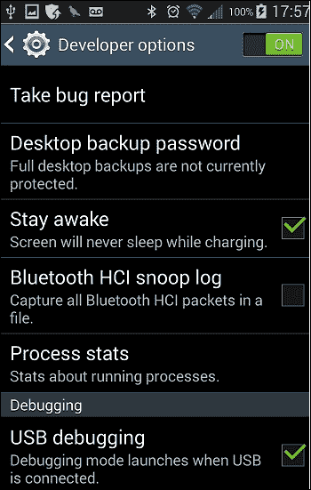

保持唤醒和 USB 调试选项

+   **增加屏幕超时**：这是设备解锁后保持活动的时间。根据设备型号，这个时间可以设置为最长 30 分钟。在大多数设备中，它可以在**设置** | **显示** | **屏幕超时**下找到，如下面的截图所示：

### 注意

请注意，访问此项目的位置在不同版本和型号的 Android 手机上会有所变化。

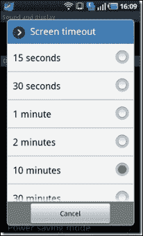

Android 设备上的屏幕超时选项

在移动取证中，保护扣押的设备非常重要，以便我们与证据的互动（或攻击者试图远程与设备互动）不会改变证据。在计算机取证中，我们有软件和硬件写入阻断器可以执行此功能。但是在移动取证中，由于我们需要与设备互动以提取数据，这些写入阻断器就没有任何用处。另一个重要方面是我们还需要防止设备与无线电网络互动。如前所述，攻击者很有可能发出远程擦除命令，删除设备上的所有数据，包括电子邮件、应用程序、照片、联系人和其他文件。

**Android 设备管理器**（**ADM**）和其他几个第三方应用程序允许远程擦除或锁定手机。这可以通过登录配置在移动设备上的 Google 帐户来完成。使用这个软件，攻击者也可以定位设备，这可能构成安全风险。出于所有这些原因，将设备与所有通信来源隔离开非常重要。

### 提示

您是否考虑过不需要互联网访问的远程擦除选项？**移动设备管理**（**MDM**）软件通过发送短信提供了远程擦除功能。将设备与所有通信选项隔离开非常重要。

将设备与网络隔离，如果可以访问设备，我们可以将设备置于**飞行模式**。飞行模式会禁用设备的无线传输功能，如蜂窝无线电、Wi-Fi 和蓝牙。然而，这并不总是可能，因为大多数设备都被锁定屏幕。另外，由于现在飞机上有 Wi-Fi，一些设备现在允许在飞行模式下使用 Wi-Fi。因此，另一个解决方案是使用法拉第袋或射频隔离盒，因为两者都可以有效地阻断手机的信号。但是，这些隔离方法的一个问题是一旦它们被使用，就很难使用手机，因为你无法透过它们来使用触摸屏或键盘。因此，法拉第帐篷和房间存在，如下面的截图所示（摘自[`www.technicalprotection.co.uk/`](http://www.technicalprotection.co.uk/)），但价格昂贵。


金字塔形法拉第帐篷

即使采取了所有这些预防措施，某些自动功能，如闹钟可能会触发。如果遇到这种情况，必须妥善记录。

## 获取

获取阶段指的是从设备中提取数据。由于移动设备固有的安全功能，提取数据并不总是直截了当的。根据设备的操作系统、制造商和型号，决定提取方法。以下类型的获取方法可用于从设备中提取数据：

+   **手动获取**：这是所有获取方法中最简单的。检查员使用手机的用户界面进行浏览和调查。这里不需要特殊工具或技术，但限制在于只能提取通过正常用户界面可见的文件和数据。通过其他方法提取的数据也可以使用这种方法进行验证。

+   **逻辑获取**：这也被称为逻辑提取。这通常指的是从逻辑存储器（如文件系统分区）中提取文件。这包括从手机中获取文本消息、通话记录、图片等数据类型。逻辑提取技术是通过使用原始设备制造商的 API 来将手机内容与计算机同步。这种技术通常涉及提取以下证据：

+   通话记录

+   短信

+   MMS

+   浏览器历史记录

+   人员

+   联系人方式

+   联系人扩展

+   联系人分组

+   联系人电话

+   联系人设置

+   外部图像媒体（元数据）

+   外部图像缩略图媒体（元数据）

+   外部媒体、音频和其他（元数据）

+   外部视频（元数据）

+   MMSParts（包括通过 MMS 发送的完整图像）

+   位置详细信息（GPS 数据）

+   互联网活动

+   组织

+   安装的所有应用程序列表，以及它们的版本

+   社交网络应用程序的数据，如 WhatsApp、Skype、Facebook 等。

+   **文件系统获取**：这是一个逻辑过程，通常指的是从移动设备中提取完整的文件系统。文件系统获取有时可以帮助恢复从设备中删除的内容（存储在 SQLite 文件中）。

+   **物理获取**：这涉及制作整个闪存的逐位拷贝。使用这种方法提取的数据通常是原始数据（十六进制转储），然后可以进一步解析以获取文件系统信息或人类可读数据。由于所有调查都是在这个镜像上进行的，这个过程还确保原始证据没有被改变。

## 检查和分析

在这个阶段，使用不同的软件工具从内存镜像中提取数据。除了这些工具，调查员还需要使用十六进制编辑器的帮助，因为工具并不总是能提取所有数据。没有单一的工具可以在所有情况下使用。因此，检查和分析需要对各种文件系统、文件头等有扎实的知识。

## 报告

在整个过程中应该记录检查的文档，记录每个阶段所做的工作。检查员可能记录以下几点：

+   检查开始的日期和时间

+   手机的物理状态

+   收到手机时的状态（开/关）

+   手机的制造商、型号和操作系统

+   手机和各个组件的图片

+   调查中使用的工具

+   检查期间记录的数据

从移动设备提取的数据应清晰地呈现给接收方，以便可以将其导入其他软件进行进一步分析。在民事或刑事案件中，尽可能收集数据的图片，因为它们对陪审团有视觉上的吸引力。

# 移动取证中的挑战

随着 Android 设备的使用增加以及它们支持的通信平台的广泛，对取证检查的需求自然增长。在处理移动设备时，取证分析师面临着许多挑战。以下几点阐明了当今移动取证所面临的一些挑战：

+   防止设备上的数据被更改：取证中要记住的基本规则之一是不要修改证据。换句话说，应用于设备的取证技术不应更改设备上的数据。但是，对于移动取证来说，这是不切实际的，因为简单地打开设备可能也会更改设备上存在的某些状态变量。移动设备上始终运行着后台进程，突然从一种状态转换到另一种状态可能导致数据的丢失或修改。因此，取证分析师有可能故意或无意地更改数据。除此之外，攻击者有可能远程更改或删除设备上的内容。由于手机使用不同的通信渠道（蜂窝、Wi-Fi、蓝牙、红外线等），通过它们进行通信的可能性应该被消除。远程数据擦除等功能会使攻击者能够通过发送短信或简单地按下一个发送擦除请求的按钮来远程擦除整个设备。与计算机取证不同，移动设备取证需要更多的工作，不仅仅是将设备与网络隔离。

+   操作系统和设备型号的广泛范围：市场上提供的广泛移动操作系统使得取证分析师的工作变得更加困难。尽管 Android 是移动世界中最主要的操作系统，但在调查中经常会遇到运行其他操作系统的移动设备，包括 iOS、Blackberry、Windows 等。此外，对于给定的操作系统，有数百万种不同的移动设备，它们在操作系统版本、硬件和其他各种功能上都有所不同。例如，在 Android 操作系统中，大约有 10 个版本，而对于每个版本，不同制造商都进行了不同的定制。根据制造商，获取取证证据的方法也会改变。为了保持竞争力，制造商们发布新型号和更新如此迅速，以至于很难跟踪所有这些变化。有时在同一操作系统中，数据存储选项和文件结构也会发生变化，使情况变得更加困难。没有单一工具可以在所有可用类型的移动操作系统上运行。因此，取证分析师必须及时了解所有最新的变化和技术。

+   固有的安全功能：随着“隐私”概念日益重要，移动制造商正朝着在设备上实施强大的安全控制的方向发展，这使得获取数据的过程变得更加复杂。例如，如果设备受到密码保护，取证调查员必须首先找到一种绕过密码的方法。同样，一些最新设备上实施的全盘加密机制阻止执法机构和取证分析师访问设备上的信息。苹果的 iPhone 默认使用设备内置的硬件密钥对设备上的所有数据进行加密。取证人员很难使用暴力破解等技术来破解这些加密机制。

+   法律问题：移动设备可能涉及跨越全球并跨越地理边界的犯罪。为了解决这些跨司法管辖范围的问题，取证人员需要了解犯罪的性质以及地区法律。

# Android 架构

在我们继续讨论 Android 取证的内部之前，本部分将向您介绍 Android 作为操作系统的基本概念，并涵盖需要理解的各种基本概念，以便在取证领域获得经验。

任何操作系统（桌面或移动）都负责管理系统资源，并提供一种让应用程序与硬件或物理组件进行通信以完成某些任务的方式。Android 操作系统也不例外。它为移动电话提供动力，管理内存和进程，执行安全性，处理网络问题等。Android 是开源的，大部分代码都是根据 Apache 2.0 许可发布的。实际上，这意味着手机设备制造商可以自由访问它，修改它，并根据任何设备的要求使用该软件。这是其受欢迎的主要原因之一。

Android 操作系统由一系列层次堆叠而成。通过查看这些层次是什么以及它们的作用，可以更好地理解 Android 架构。以下图表引用自[`elinux.org/images/c/c2/Android-system-architecture.jpg`](http://elinux.org/images/c/c2/Android-system-architecture.jpg)，显示了 Android 软件堆栈中涉及的各个层次：

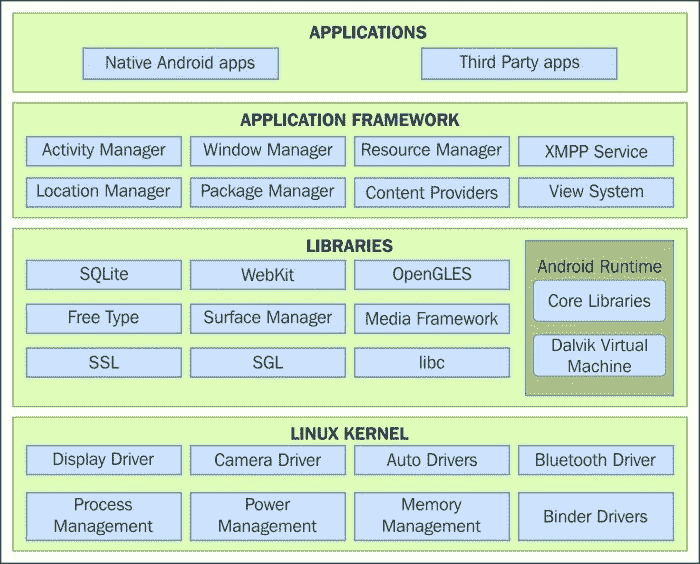

Android 架构

Android 架构以软件堆栈的形式存在，包括内核、库、运行环境、应用程序、中间件和服务。堆栈的每一层（以及每一层内的元素）都以一种集成的方式存在，为移动设备提供了最佳的执行环境。接下来的部分将重点介绍 Android 堆栈的不同层次，从底层的 Linux 内核开始。

## Linux 内核

Android 操作系统是建立在 Linux 内核之上的，谷歌对其进行了一些架构上的改变。选择 Linux 是因为它是一个可移植的平台，可以在不同的硬件上轻松编译。Linux 内核位于软件堆栈的底部，并在设备硬件和上层之间提供了一定程度的抽象。它还充当了设备上软件和硬件之间的抽象层。为了更好地理解这一点，可以考虑一下使用相机按钮拍照的情况。当您在移动设备上按下相机按钮拍照时，实际上会发生什么？在某个时刻，硬件指令，比如*按下按钮*，必须转换为软件指令，比如*拍照并将其存储在相册中*。内核包含可以促进这一过程的驱动程序。当检测到相机按钮点击时，指令会传递到内核中相应的驱动程序，该驱动程序向相机硬件发送必要的命令，类似于在键盘上按键时发生的情况。简而言之，内核中的驱动程序控制着底层硬件。如前图所示，内核包含与 Wi-Fi、蓝牙、USB、音频、显示等相关的驱动程序。

Android 的所有核心功能，如进程管理、内存管理、安全性和网络，都由 Linux 内核管理。在安全性和进程管理方面，Linux 是一个经过验证的平台。Android 利用现有的 Linux 开源操作系统构建了其生态系统的坚实基础。每个 Android 版本都有一个不同版本的底层 Linux 内核。截至 2014 年 9 月，当前的 Android 版本 4.2 是建立在 Linux 内核 3.4 或更新版本之上的，但具体的内核版本取决于实际的 Android 设备和芯片组。

## 库

在 Linux 内核之上是 Android 的本地库。借助这些库，设备可以处理不同类型的数据。例如，媒体框架库支持音频、视频和图片格式的录制和播放。这些库是用 C 或 C++编程语言编写的，并且特定于特定的硬件。Surface Manager、媒体框架、SQLite、WebKit、OpenGL 等都是一些最重要的本地库。

## 达尔维克虚拟机

Android 应用程序是使用 Java 编程语言编写的。选择 Java 的主要原因是因为它是一种众所周知的语言，拥有庞大的开发者基础。Android 希望利用这个现有的开发者社区，而不是提出一种新的语言。

### 注意

这后来促使 Oracle 对 Google 提起诉讼，声称其侵犯了其版权和专利。但陪审团最终宣布 Google 没有侵犯 Oracle 的专利，审判法官裁定 Google 使用的 Java API 结构不受版权保护。

当 Java 程序编译时，我们得到字节码。**Java 虚拟机**（虚拟机是一个充当操作系统的应用程序）可以执行这个字节码。在 Android 的情况下，这个 Java 字节码进一步被 dex 编译器转换为**达尔维克**字节码。这个达尔维克字节码然后被输入到**达尔维克虚拟机**（**DVM**）中，它可以读取和使用这个代码。因此，Java 编译器的`.class`文件使用 dx 工具转换为`.dex`文件。达尔维克字节码是一种适用于低内存和低处理环境的优化字节码。另外，需要注意的是，JVM 的字节码由一个或多个`.class`文件组成，取决于应用程序中存在的 Java 文件的数量，但达尔维克字节码只由一个`.dex`文件组成。每个 Android 应用程序都运行自己的 DVM 实例。以下图表显示了 Java 应用程序和 Android 应用程序的程序编译之间的差异。

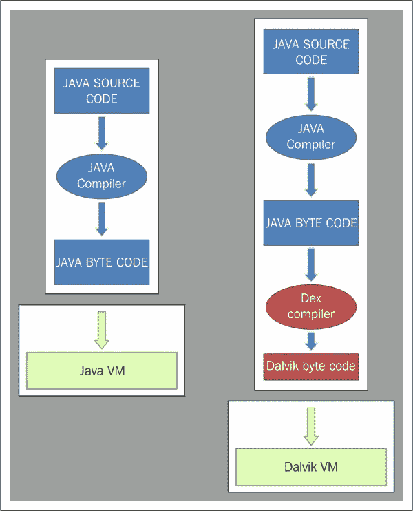

JVM 与 DVM

自 Android 5.0 以来，Dalvik 已被**Android 运行时**（**ART**）取代为平台默认。ART 在 Android 4.4 上作为实验性功能引入。Dalvik 使用**即时**（**JIT**）编译，每次启动应用程序时都会编译字节码。然而，ART 使用**预编译**（**AOT**）编译，在安装应用程序时执行。这大大减少了移动设备的处理器使用率，因为在应用程序运行期间的整体编译减少了。

## 应用程序框架

Android 应用程序是通过 Android 应用程序框架运行和管理的。它负责执行许多关键功能，如资源管理、处理呼叫等。Android 框架包括以下关键服务，引用自[`fp.edu.gva.es/av/pluginfile.php/745396/mod_imscp/content/2/1_overview_of_the_android_architecture.html`](http://fp.edu.gva.es/av/pluginfile.php/745396/mod_imscp/content/2/1_overview_of_the_android_architecture.html)：

+   **活动管理器**：此服务控制应用程序生命周期和活动堆栈的所有方面。

+   **内容提供者**：此服务允许应用程序与其他应用程序发布和共享数据。

+   **资源管理器**：此服务提供对非代码嵌入资源的访问，如字符串、颜色设置和用户界面布局。

+   **通知管理器**：此服务允许应用程序向用户显示警报和通知。

+   **视图系统**：此服务提供一组可扩展的视图，用于创建应用程序用户界面。

+   **包管理器**：应用程序可以通过该系统找到有关设备上当前安装的其他应用程序的信息。

+   **电话管理器**：此服务向应用程序提供有关设备上可用的电话服务的信息，如状态和订阅者信息。

+   **位置管理器**：此服务提供对位置服务的访问，允许应用程序接收有关位置更改的更新。

## 应用程序层

Android 堆栈中的最顶层是应用程序（称为**应用**），这些是用户直接交互的程序。以下讨论了两种类型的应用程序：

+   系统应用程序：这些是预装在手机上并随手机一起发货的应用程序。默认浏览器、电子邮件客户端、联系人等应用程序都是系统应用程序的示例。这些应用程序无法被用户卸载或更改，因为它们在生产设备上是只读的。这些通常存在于`/system`目录中。直到 Android 4.4，所有存在于`/system`下的应用程序都被平等对待。但从 Android 4.4 开始，安装在`/system/priv-app/`中的应用程序被视为特权应用程序，并且只有特权应用程序被授予具有签名或系统保护级别的权限。

+   **用户安装的应用程序**：这些是用户从各种分发平台（如 Google Play）下载并安装的应用程序。Google Play 是 Android 操作系统的官方应用商店，用户可以浏览和下载应用程序。根据 2014 年 12 月 AppBrain 的统计数据，Play 商店中大约有 1,418,453 个 Android 应用程序。这些应用程序目前位于`/data`目录中。有关它们之间如何执行安全性的更多信息将在以下部分中讨论。

# Android 安全性

作为一个平台，Android 的架构中内置了某些功能，以确保用户、应用程序和数据的安全性。尽管它们有助于保护数据，但这些安全功能有时会阻止调查人员访问必要的数据。因此，从法医学的角度来看，首先要了解固有的安全功能，以便清楚地了解在正常情况下可以或不可以访问的内容。所包含的安全功能和服务旨在实现三个目标：

+   保护用户数据

+   保护系统资源

+   确保一个应用程序不能访问另一个应用程序的数据

接下来的部分将概述 Android 操作系统中的关键安全功能。

## 通过 Linux 内核在操作系统级别上的安全性

Android 操作系统是建立在 Linux 内核之上的。在过去的几年里，Linux 已经发展成为一个受到许多全球公司信任的安全操作系统。今天，大多数关键任务的系统和服务器都在 Linux 上运行，因为它的安全性。通过将 Linux 内核置于其平台的核心位置，Android 试图确保在操作系统级别上的安全性。此外，Android 还在 Linux 中构建了许多特定的代码，以包括与移动环境相关的某些功能。随着每个 Android 版本的发布，内核版本也发生了变化。以下表格显示了 Android 版本和相应的 Linux 内核版本：

| Android 版本 | Linux 内核版本 |
| --- | --- |
| 1.0 | 2.6.25 |
| 1.5 | 2.6.27 |
| 1.6 | 2.6.29 |
| 2.2 | 2.6.32 |
| 2.3 | 2.6.35 |
| 3.0 | 2.6.36 |
| 4.0 | 3.0.1 |
| 4.1 | 3.0.31 |
| 4.2 | 3.4.0 |
| 4.3 | 3.4.39 |
| 4.4 | 3.8 |

> *各种 Android 版本中使用的 Linux 内核*

Linux 内核为 Android 提供了以下关键安全功能：

+   基于用户的权限模型

+   进程隔离

+   可扩展的安全 IPC 机制

### 权限模型

Android 为各个应用程序实现了权限模型。应用程序必须声明它们需要哪些权限（在清单文件中）。当应用程序安装时，Android 会向用户呈现列表，以便他们可以查看列表以允许或不允许安装：

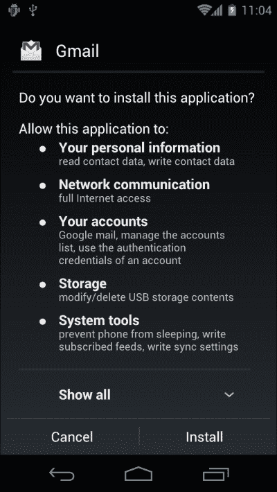

Android 中的示例权限模型

与桌面环境不同，这提供了一个机会，让用户提前知道应用程序正在寻求访问哪些资源。换句话说，用户必须获得许可才能访问设备上的任何关键资源。通过查看请求的权限，用户更加了解安装应用程序所涉及的风险。但大多数用户并不阅读这些内容，只是授予了很多权限，使设备暴露于恶意活动之中。

### 注意

不可能安装具有少量或减少权限的 Android 应用程序。您只能安装具有所有权限或拒绝的应用程序。

如前所述，开发人员必须在名为`AndroidManifest.xml`的文件中声明权限。例如，如果应用程序需要访问互联网，则可以使用以下代码在`AndroidManifest.xml`文件中指定`INTERNET`权限：

```kt
<manifest  package="com.example.rohit">

  <uses-permission android:name="android.permission.INTERNET" />

</manifest>
```

Android 权限分为四个级别，如下所示：

| 权限类型 | 描述 |
| --- | --- |
| 普通 | 这是默认值。这些是低风险权限，不会对其他应用程序、系统或用户造成风险。在安装过程中，此权限会自动授予应用程序，无需用户批准。 |
| 危险 | 这些是可能对系统和其他应用程序造成伤害的权限。因此，在安装过程中需要用户批准。 |
| 签名 | 如果请求的应用程序与声明/创建权限的应用程序使用相同的证书，则会自动授予这些权限。此级别旨在允许套件中的应用程序或其他相关应用程序共享数据。 |
| 签名/系统 | 系统仅授予 Android 系统镜像中的应用程序，或者与声明权限的应用程序使用相同证书的应用程序。 |

### 应用程序隔离

为了将应用程序相互隔离，Android 利用了 Linux 基于用户的保护模型。在 Linux 系统中，每个用户被分配一个唯一的用户 ID（UID），并且用户被隔离开来，以便一个用户不会访问另一个用户的数据。特定用户下的所有资源都以相同的权限运行。同样，每个 Android 应用程序都被分配一个 UID，并作为一个单独的进程运行。这意味着，即使安装的应用程序尝试执行一些恶意操作，它也只能在其上下文中以及具有的权限内执行。

这种应用程序隔离是在内核级别完成的。应用程序和系统之间在进程级别的安全性是通过标准的 Linux 设施来确保的，例如分配给应用程序的用户和组 ID。这在下面的截图中显示，引用自[`www.ibm.com/developerworks/library/x-androidsecurity/`](http://www.ibm.com/developerworks/library/x-androidsecurity/)。

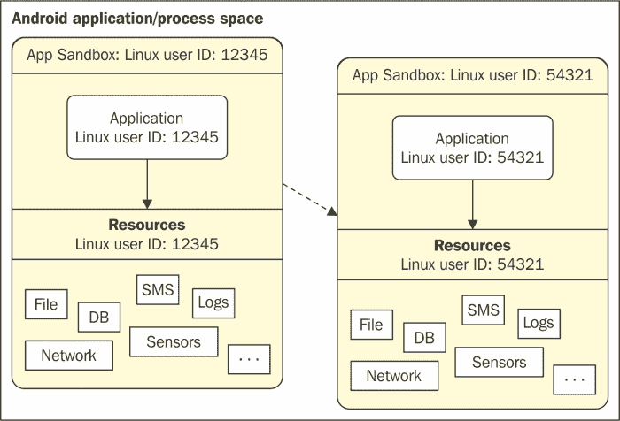

具有不同 UID 的不同进程上的两个应用程序

默认情况下，应用程序无法读取或访问其他应用程序的数据，并且对操作系统的访问权限有限。例如，如果应用程序 A 尝试读取应用程序 B 的数据，操作系统会阻止这种操作，因为应用程序 A 没有适当的权限。由于应用程序沙箱机制是在内核级别实现的，因此适用于本机应用程序和操作系统应用程序。因此，操作系统库、应用程序框架、应用程序运行时以及所有应用程序都在应用程序沙箱中运行。绕过这个沙箱机制将需要破坏 Linux 内核的安全性。

### Android 中的 SELinux

从 Android 4.3 开始，Android 安全模型支持**安全增强型 Linux**（**SELinux**）。Android 安全基于自由访问控制，这意味着应用程序可以请求权限，用户可以授予或拒绝这些权限。因此，恶意软件可以通过获取权限在手机上制造混乱。但 SE Android 使用**强制访问控制**（**MAC**），确保应用程序在隔离的环境中运行。因此，即使用户安装了恶意应用程序，恶意软件也无法访问操作系统并损坏设备。SELinux 用于强制执行 MAC，包括以 root 权限运行的进程。

SELinux 遵循*默认拒绝*的原则。任何未明确允许的操作都将被拒绝。SELinux 可以在两种全局模式下运行：**宽容模式**，其中权限拒绝被记录但不被执行，和**强制模式**，其中拒绝既被记录又被执行。根据谷歌的文档，在 Android 5.0 棒棒糖版本中，Android 将全面执行 SELinux。这是在 4.3 版本的宽容发布和 4.4 版本的部分执行的基础上构建的。简而言之，Android 正在从对一组关键域（`installd`、`netd`、`vold`和`zygote`）的执行转变为对所有内容（超过 60 个域）的执行。

### 应用程序签名

所有 Android 应用程序在安装到设备上之前都需要使用证书进行数字签名。使用证书的主要目的是识别应用程序的作者。这些证书不需要由证书颁发机构签名，Android 应用程序通常使用自签名证书。应用程序开发人员持有证书的私钥。使用相同的私钥，开发人员可以为其应用程序提供更新并在应用程序之间共享数据。在调试模式下，开发人员可以使用 Android SDK 工具生成的调试证书对应用程序进行签名。您可以在调试模式下运行和调试应用程序，但应用程序无法分发。要分发应用程序，应用程序需要使用您自己的证书进行签名。在此过程中使用的密钥库和私钥需要由开发人员保护，因为它们对推送更新至关重要。以下截图显示了在导出应用程序时显示的密钥库选择选项：

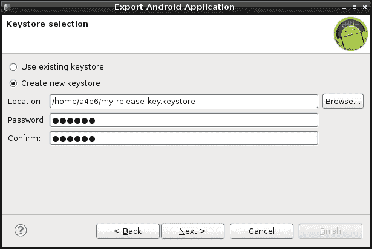

导出 Android 应用程序时的密钥库选择

### 安全的进程间通信

如上所述，应用程序的沙盒化是通过在不同的进程中以不同的 Linux 身份运行应用程序来实现的。系统服务在单独的进程中运行，并具有更多的权限。因此，为了在这些进程之间组织数据和信号，需要一个**进程间通信**（**IPC**）框架。在 Android 中，这是通过使用**Binder**机制实现的。

Android 中的 Binder 框架提供了组织各种进程间通信所需的能力。Android 应用程序组件，如意图和内容提供程序，也是建立在这个 Binder 框架之上的。使用这个框架，可以执行各种操作，比如调用远程对象的方法，就像它们是本地的一样，同步和异步方法调用，在进程之间发送文件描述符等等。假设**进程'A'**中的应用程序想要使用**进程'B'**中运行的服务暴露的某些行为。在这种情况下，**进程'A'**是客户端，**进程'B'**是服务。使用 Binder 的通信模型如下图所示：

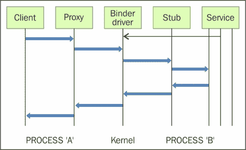

Binder 通信模型

使用 Binder 框架进行的进程间通信都是通过`/dev/binder` Linux 内核驱动程序进行的。对这个设备驱动程序的权限被设置为全局可读可写。因此，任何应用程序都可以向这个设备驱动程序写入和读取。客户端和服务器之间的所有通信都是通过客户端的**代理**和服务器端的**存根**进行的。代理和存根负责发送和接收通过 Binder 驱动程序发送的数据和命令。

使用 Binder 机制公开的每个服务（也称为 Binder 服务）都被分配一个**令牌**。这个令牌是一个 32 位的值，在系统中的所有进程中是唯一的。客户端可以在发现这个值后开始与服务进行交互。这是通过 Binder 的**上下文管理器**来实现的。基本上，上下文管理器充当名称服务，使用该服务的名称提供服务的句柄。为了使这个过程工作，每个服务必须向上下文管理器注册。因此，客户端只需要知道一个服务的名称来进行通信。名称由上下文管理器解析，客户端接收后用于与服务进行通信。Binder 驱动程序向每个事务添加了发送方进程的 UID 和 PID 值。正如前面讨论的，系统中的每个应用程序都有自己的 UID，这个值用于识别调用方。调用方可以检查获得的值，并决定是否应完成事务。因此，Binder 令牌作为安全令牌起作用，因为它在所有进程中是唯一的，从而强制执行安全性。

## Android 硬件组件

Android 兼容各种硬件组件。由于 Linux 内核的存在，这变得很容易，因为 Linux 支持各种硬件。这使制造商有很大的灵活性，他们可以根据自己的需求设计，而不必担心兼容性。这给取证分析人员在调查过程中带来了重大挑战。因此，了解硬件组件和设备类型将极大地帮助理解 Android 取证。

### 核心组件

设备中的组件从一个制造商到另一个制造商，以及从一个型号到另一个型号都会有所变化。然而，大多数移动设备中都会找到一些组件。以下部分概述了 Android 设备中常见的组件。

#### 中央处理单元

中央处理单元（**CPU**），也称为处理器，负责执行移动设备上发生的一切。它告诉设备要做什么以及如何做。其性能是根据它每秒可以完成的任务数来衡量的，称为**周期**。例如，1 GHz 处理器可以每秒处理十亿个周期。处理器的容量越大，手机的性能就越流畅。

在处理智能手机时，我们会遇到以下术语——ARM、x86（英特尔）、MIPS、Cortex、A5、A7 或 A9。ARM 是一家授权其架构（品牌 Cortex）的公司，每年推出不同型号，如上述的 A 系列（A5、A7 和 A9）。基于这些架构，芯片制造商发布自己系列的芯片组（骁龙、Exynos 等），用于移动设备。最新的智能手机由双核、四核甚至八核处理器驱动。

#### 基带处理器

今天的智能手机支持各种蜂窝协议，包括 GSM、3G、4G 和 4G LTE。这些协议很复杂，需要大量的 CPU 功率来处理数据，生成数据包并将其传输到网络提供商。为了处理这个过程，智能手机现在使用一个基带调制解调器，这是一个单独的芯片，包含在智能手机中，与主处理器通信。这些基带调制解调器有自己的处理器，称为基带处理器，并运行自己的操作系统。基带处理器管理几个无线电控制功能，如信号生成、调制、编码，以及频率转移。它也可以管理信号的传输。

基带处理器通常位于与 CPU 相同的电路板上，但由单独的无线电电子组件组成。

#### 内存

Android 手机，就像普通计算机一样，使用两种主要类型的内存——**随机存取存储器**（**RAM**）和**只读存储器**（**ROM**）。尽管大多数用户对这些概念很熟悉，但在移动设备上存在一些混淆。

RAM 是易失性的，这意味着其内容在断电时被擦除。RAM 非常快速访问，主要用于软件应用程序的运行时内存（包括设备的操作系统和任何应用程序）。换句话说，它被系统用来加载和执行操作系统和其他应用程序。因此，可以同时运行的应用程序和进程的数量取决于 RAM 的大小。

ROM（通常称为 Android ROM）是非易失性的，这意味着即使断电也会保留其内容。Android ROM 包含引导加载程序、操作系统、所有下载的应用程序及其数据、设置等。

请注意，用于引导加载程序的内存部分通常是锁定的，只能通过固件升级进行更改。其余部分的内存被一些制造商称为用户内存。存储在这里的每个应用程序的数据对其他应用程序是不可访问的。一旦这个内存被填满，设备就会变慢。RAM 和 Android ROM 被制造成一个称为**多芯片封装**（**MCP**）的单一组件。

#### SD 卡

SD 卡对于移动取证具有重要意义，因为经常存储在其中的数据可能是重要的证据。许多 Android 设备都有一个可移动的存储卡，通常称为他们的**安全数字**（**SD**）卡。这与苹果的 iPhone 形成对比，后者没有任何 SD 卡的规定。SD 卡是非易失性的，这意味着即使断电也会存储数据。SD 卡使用闪存存储器，一种**可擦可编程只读存储器**（**EEPROM**）类型，它以大块而不是单个字节进行擦除和写入。大多数多媒体数据和大文件都存储在 SD 卡中。为了与其他设备互操作，SD 卡实现了一些通信协议和规范。

在一些移动设备中，虽然存在 SD 卡接口，但部分内置 NAND 存储器（非易失性）被划分出来用于创建模拟 SD 卡。这基本上意味着 SD 卡是不可移动的。因此，取证分析人员需要检查他们是否正在处理实际的 SD 卡还是模拟 SD 卡。SD 存储卡有几种不同的尺寸。Mini-SD 卡和 Micro-SD 卡与原始 SD 存储卡具有相同的基础技术，但尺寸更小。

#### 显示屏

移动电话屏幕在过去几年里取得了巨大进步。以下是对一些广泛使用的移动屏幕类型的简要描述，如[`www.in.techradar.com/news/phone-and-communications/mobile-phones/Best-phone-screen-display-tech-explained/articleshow/38997644.cms`](http://www.in.techradar.com/news/phone-and-communications/mobile-phones/Best-phone-screen-display-tech-explained/articleshow/38997644.cms)所述。

薄膜晶体管液晶显示屏（TFT LCD）是移动电话中最常见的屏幕类型。这些屏幕下面有一盏灯，透过像素发光，使它们可见。

有机活性矩阵有机发光二极管（AMOLED）是一种基于有机化合物的技术，以其出色的图像质量和低功耗而闻名。与 LCD 屏幕不同，AMOLED 显示屏不需要背光；每个像素都会产生自己的光，因此使用这种显示屏的手机可能会更薄。

#### 电池

电池是移动电话的生命线，也是现代智能手机的主要关注点之一。您使用设备及其组件越多，电池消耗就越多。移动电话使用以下不同类型的电池：

+   锂离子（Li-ion）：这些电池是手机中最常用的电池，因为它们轻便易携。它们以高能量密度和低维护而闻名。然而，与其他电池类型相比，它们的制造成本较高。

+   聚合物锂电池（Li-Polymer）：这些电池具有锂离子电池的所有特性，但具有超薄的几何形状和简化的包装。它们是最新的，只在少数移动设备中找到。

+   镍镉（NiCd）：这些电池是旧技术电池，容易出现记忆效应。因此，电池的总容量和寿命会减少。除此之外，镍镉电池由对环境不友好的有毒材料制成。

+   镍氢（NiMH）：这些电池与镍镉电池相同，但可以容纳更多能量，运行时间更长，约为 30%至 40%。它们仍然会出现记忆效应，但相对于镍镉电池来说较少。它们在手机中被广泛使用，而且价格也比较实惠。

可以通过查看电池本体上的详细信息来找到电池类型。例如，以下是锂离子电池的图像：

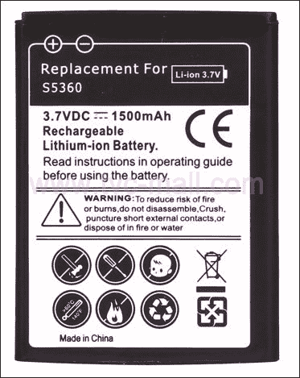

锂离子电池

大多数 SD 卡位于电池后面。在取证分析中，访问 SD 卡需要取出电池，这将关闭设备。这可能会产生某些影响，将在后面的章节中详细讨论。

除了上述描述的组件外，以下是一些其他众所周知的组件：

+   全球定位系统

+   Wi-Fi

+   近场通信

+   蓝牙

+   相机

+   键盘

+   USB

+   加速度计和陀螺仪

+   扬声器

+   麦克风

## Android 启动过程

了解 Android 设备的启动过程将帮助我们理解涉及与设备在各个层面交互的其他取证技术。当 Android 设备首次上电时，会执行一系列步骤，帮助设备将必要的固件、操作系统、应用程序数据等加载到内存中。以下信息编译自原始文章，发表在[`www.androidenea.com/2009/06/android-boot-process-from-power-on.html`](http://www.androidenea.com/2009/06/android-boot-process-from-power-on.html)。

Android 启动过程涉及的步骤顺序如下：

1.  启动 ROM 代码执行

1.  引导加载程序

1.  Linux 内核

1.  init 进程

1.  Zygote 和 Dalvik

1.  系统服务器

我们将详细研究这些步骤中的每一个。

### 启动 ROM 代码执行

在设备上电之前，设备 CPU 将处于未初始化状态。一旦 Android 设备上电，执行就会从启动 ROM 代码开始。这个启动 ROM 代码是特定于设备使用的 CPU 的。如下图所示，这个阶段包括两个步骤：

1.  当启动 ROM 代码执行时，它会初始化设备硬件并尝试检测引导介质。因此，启动 ROM 代码会扫描直到找到引导介质。这类似于计算机引导过程中的 BIOS 功能。

1.  一旦引导序列建立，初始引导加载程序就会被复制到内部 RAM。之后，执行会转移到加载到 RAM 中的代码。

Android 启动过程：启动 ROM 代码执行

### 引导加载程序

引导加载程序是在操作系统开始运行之前执行的程序片段。引导加载程序存在于台式计算机、笔记本电脑和移动设备中。在 Android 引导加载程序中，有两个阶段——**初始程序加载**（**IPL**）和**第二程序加载**（**SPL**）。如下图所示，这涉及到三个步骤，如下所述：

1.  IPL 处理检测和设置外部 RAM。

1.  一旦外部 RAM 可用，SPL 就会被复制到 RAM 中，并且执行会转移到它。SPL 负责加载 Android 操作系统。它还提供对其他引导模式（如 fastboot、recovery 等）的访问。它启动了几个硬件组件，如控制台、显示、键盘和文件系统、虚拟内存和其他功能。

1.  之后，SPL 会尝试寻找 Linux 内核。它会从引导介质加载并将其复制到 RAM 中。一旦引导加载程序完成了这个过程，它就会将执行转移到内核。

Android 启动过程：引导加载程序

### Linux 内核

Linux 内核是 Android 操作系统的核心，负责进程管理、内存管理和设备安全。内核加载后，它会挂载**根文件系统**（**rootfs**），并提供对系统和用户数据的访问，如下所述：

1.  当内存管理单元和缓存已经初始化后，系统可以使用虚拟内存并启动用户空间进程。

1.  内核将在 rootfs 中寻找 init 进程，并将其作为初始用户空间进程启动。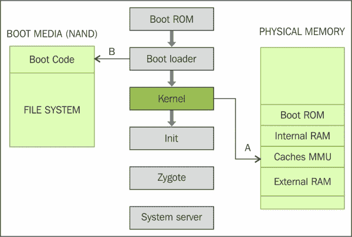

Android 启动过程：内核

### init 进程

init 是第一个启动的进程，也是所有其他进程的根进程。

1.  init 进程将寻找一个名为`init.rc`的脚本，描述系统服务、文件系统和需要设置的其他参数。

+   `init`进程可以在`<android source>/system/core/init`路径下找到。

+   `init.rc`文件可以在源树中找到，路径为`<android source>/system/core/rootdir/init.rc`。

### 提示

有关 Android 文件层次结构的更多细节将在第三章中进行介绍，*了解 Android 设备上的数据存储*。

1.  `init`进程将解析`init.rc`脚本并启动系统服务进程。在这个阶段，您将在设备屏幕上看到 Android 标志。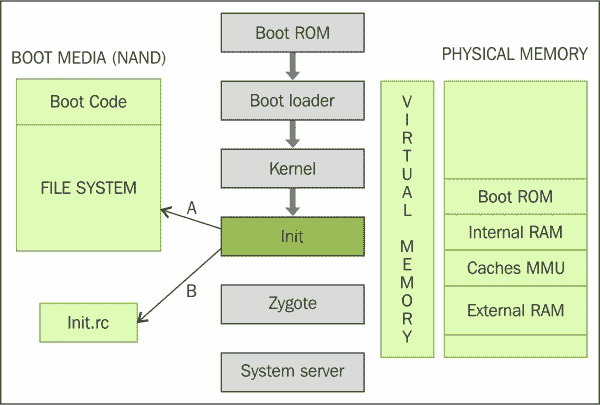

Android 启动过程：init 进程

### Zygote 和 Dalvik

**Zygote**是设备启动后创建的第一个 init 进程之一。它初始化 Dalvik 虚拟机，并尝试创建多个实例以支持每个 Android 进程。正如前面的部分所讨论的，Dalvik 虚拟机是执行用 Java 编写的 Android 应用程序的虚拟机。

Zygote 有助于在虚拟机之间使用共享代码，从而有助于节省内存并减轻系统负担。之后，应用程序可以通过请求新的 Dalvik 虚拟机来运行。Zygote 为 zygote 连接注册了一个服务器套接字，并预加载了某些类和资源。有关 Zygote 加载过程的更清晰解释，请参见[`www.kpbird.com/2012/11/in-depth-android-boot-sequence-process.html`](http://www.kpbird.com/2012/11/in-depth-android-boot-sequence-process.html)。如下所述：

+   `Load ZygoteInitclass`: 此类加载`ZygoteInit`类。源代码：`<Android Source>/frameworks/base/core/java/com/android/internal/os/ZygoteInit.java`。

+   `registerZygoteSocket()`: 为 zygote 命令连接注册服务器套接字。

+   `preloadClasses()`: 这是一个简单的文本文件，其中包含需要预加载的类的列表将在此处执行。此文件可以在`<Android Source>/frameworks/base`中看到。

+   `preloadResources()`: 这处理本机主题和布局。所有包括`android.R`文件的内容都将使用此方法加载。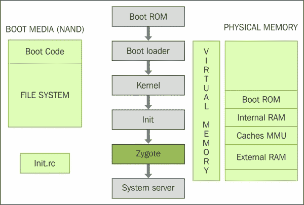

Android 启动过程：Zygote

### 系统服务器

设备的所有核心功能，如电话、网络和其他重要功能，都是由系统服务器启动的，如下图所示：

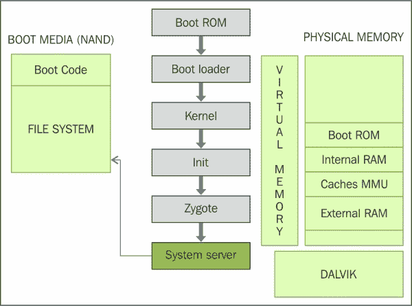

Android 启动过程：系统服务器

在此过程中启动以下核心服务：

+   启动电源管理器

+   创建 Activity Manager

+   启动电话注册表

+   启动包管理器

+   将 Activity Manager 服务设置为系统进程

+   启动上下文管理器

+   启动系统上下文提供程序

+   启动电池服务

+   启动闹钟管理器

+   启动传感器服务

+   启动窗口管理器

+   启动蓝牙服务

+   启动挂载服务

系统发送一个名为`ACTION_BOOT_COMPLETED`的广播动作，通知所有依赖进程引导过程已经完成。之后，设备显示主屏幕，并准备与用户交互。Android 系统现在已经完全运行，并准备与用户交互。

正如前面所解释的，许多制造商在其设备上使用 Android 操作系统。这些设备制造商大多根据其硬件和其他要求定制操作系统。因此，当发布新版本的 Android 时，这些设备制造商必须将他们的定制软件和调整移植到最新版本。

## 摘要

了解 Android 架构及其安全模型对于正确理解 Android 取证至关重要。Android 操作系统中固有的安全功能，如应用程序沙箱、权限模型等，保护 Android 设备免受各种威胁，并在调查过程中也作为取证专家的障碍。通过获得这些 Android 内部知识，我们将在下一章更多地讨论设备上存储了什么类型的数据以及它是如何存储的。
