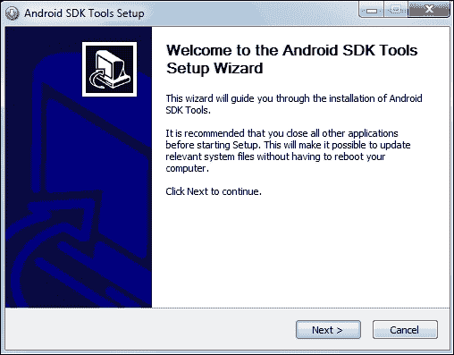
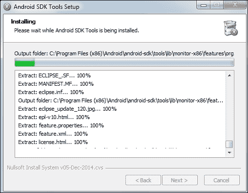
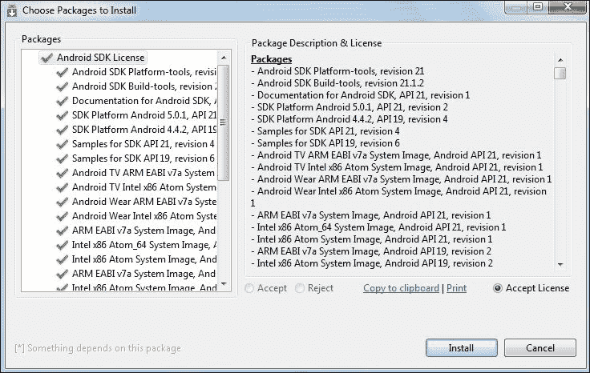
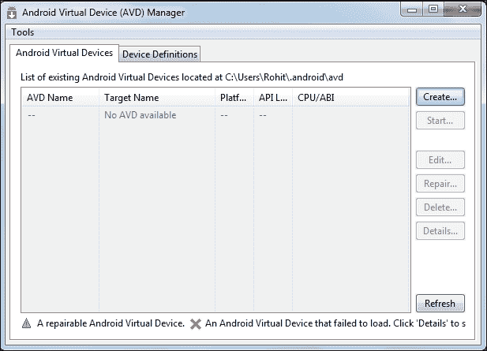
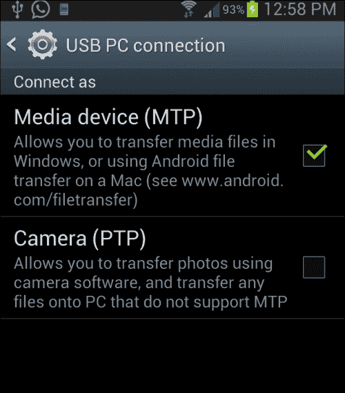
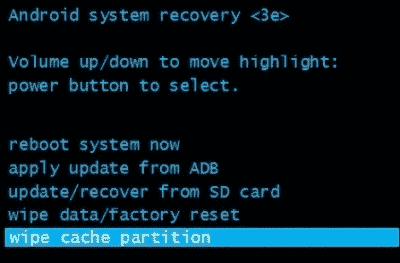
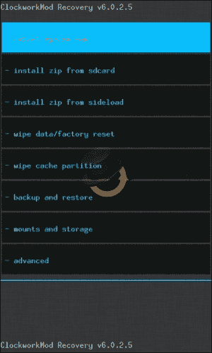

# 第二章。设置 Android 法庭环境

在开始任何法庭审查之前，建立一个已经建立的法庭环境是至关重要的。法庭分析师需要始终完全控制工作站。本章将带您了解建立法庭设置以检查 Android 设备所必需的一切。在本章中，我们将涵盖以下主题：

+   在工作站上安装必要的软件

+   从工作站连接和访问 Android 设备

+   在设备上使用 ADB 命令

+   对 Android 设备进行 Root

# Android 法庭设置

在开始任何调查之前，建立一个声音和良好控制的法庭环境是至关重要的。从一个新的和**法庭无菌**的计算机开始。一个法庭无菌的计算机是一个可以防止交叉污染的潜力，不会引入不需要的数据，并且没有病毒和其他恶意软件的计算机。这是为了确保机器上的软件不会干扰当前的调查。安装基本软件，比如以下这些；它们是连接设备和进行分析所必需的：

+   Android SDK

+   移动驱动程序

+   MS Office 软件包

+   用于分析的工具

# Android SDK

重要的是我们从 Android SDK 开始讨论。Android **软件开发工具包**（**SDK**）帮助开发人员构建、测试和调试在 Android 上运行的应用程序。它包括软件库、API、模拟器、参考资料和许多其他工具。这些工具不仅帮助创建 Android 应用程序，还提供文档和实用程序，这些对 Android 设备的法庭分析非常有帮助。对 Android SDK 有扎实的了解可以帮助您了解设备的细节。这反过来将在调查中帮助您。

在法庭审查期间，SDK 帮助我们连接设备并访问设备上的数据。SDK 在大多数环境中都受支持，包括 Windows、Linux 和 OS X。可以从[`developer.android.com/sdk/index.html`](http://developer.android.com/sdk/index.html)免费下载。

## 安装 Android SDK

谷歌现在只提供 Android Studio 和 SDK 工具作为下载选项。Android Studio 包含 Android IDE，SDK 工具，Android 5.0（棒棒糖）平台，带有谷歌 API 的 Android 5.0 系统映像，以及其他新引入的功能。然而，对于法庭实验室的设置，仅下载 SDK 工具包就足够了。以下是在 Windows 8 机器上安装 Android SDK 的逐步过程：

1.  在开始安装 Android SDK 之前，请确保系统已安装**Java 开发工具包**（**JDK**），因为 Android SDK 依赖于 Java SE 开发工具包。JDK 可以从[`www.oracle.com/technetwork/java/javase/downloads/index.html`](http://www.oracle.com/technetwork/java/javase/downloads/index.html)下载。根据您的操作系统选择正确的下载。

1.  从[`developer.android.com/sdk/index.html`](http://developer.android.com/sdk/index.html)下载最新版本的 SDK 工具包。建议下载`.exe`版本的软件包。

1.  运行在步骤 2 中下载的安装程序文件。将出现一个向导窗口，如下截图所示。然后，点击**下一步**。

Android SDK 设置向导

1.  设置将自动检测系统上是否安装了 Java，并选择安装 Java 的路径。

1.  选择安装位置并记住以备将来使用。在本例中，我们将其安装在`C:\Program Files (x86)`。在 32 位操作系统的情况下，默认位置将是`C:\Program Files`。所有必要的文件将被提取到这个位置，如下截图所示：

Android SDK 工具安装

1.  安装完成后，打开`C:\Program Files (x86)\Android\android-sdk`目录，并双击`SDK Manager.exe`。确保选择 Android SDK 平台工具和任何一个 Android 的发布平台版本，如下面的屏幕截图所示。有些项目会自动选择。例如，Google USB 驱动程序在 Windows 上与 Android 设备一起使用时是必需的，并且默认已选择。接受许可证条款，然后点击**安装**按钮进行安装：

Android 软件包安装

前面过程的最后一步需要一些时间来完成。完成后，Android SDK 安装就完成了。现在可以通过指向可执行文件来更新系统的环境变量（路径）。

### 注意

仅 2MB 大小的最小 ADB 和 fastboot 工具可在 XDA 论坛（[`forum.xda-developers.com/showthread.php?t=2317790`](http://forum.xda-developers.com/showthread.php?t=2317790)）上免费获得，无需安装完整的 Android SDK。这个工具是一个 Windows 安装程序，可以快速轻松地安装最新版本的 ADB 和 fastboot。

## Android 虚拟设备

安装了 Android SDK 后，您可以创建一个**Android 虚拟设备**（**AVD**），这是一个在工作站上运行的**模拟器**。开发人员在创建新应用程序时通常会使用模拟器。然而，在取证调查中，模拟器也被认为是有帮助的。它允许调查人员了解某些应用程序的行为以及应用程序的安装如何影响设备。另一个优点是您可以设计一个具有所需版本的模拟器。这在处理运行较旧版本 Android 的设备时特别有帮助。此外，AVD 默认带有 root 权限。

以下步骤将指导您在工作站上创建 AVD：

1.  打开命令提示符（`cmd.exe`）。要从命令行启动 AVD 管理器，请导航到 SDK 安装的路径，并按照以下所示使用`avd`选项调用 android 工具：

```kt
C:\Program Files (x86)\Android\android-sdk\tools>android avd

```

这将自动打开 AVD 管理器，如下面的屏幕截图所示。AVD 管理器也可以使用图形 AVD 管理器启动。要启动它，请导航到 SDK 安装的位置，并双击`AVD Manager`。



Android 虚拟设备管理器

1.  在**AVD 管理器**窗口中单击**创建**以创建新的虚拟设备。单击**编辑**以更改现有虚拟设备的配置，如下面的屏幕截图所示：

AVD 详细信息

1.  根据以下信息输入必要的详细信息：

+   **AVD 名称**：为虚拟设备提供任何名称，例如`MyAVD`。

+   **设备**：根据屏幕大小从可用选项中选择任何设备。

+   **目标**：此选项可帮助您选择设备的平台。请注意，只有在 SDK 安装期间选择并安装的那些版本才会显示在此处供您选择。平台版本可以根据所占设备的操作系统进行选择。例如，我们选择了 Android 4.4.2 平台。

+   **硬件**：您可以选择硬件功能来自定义模拟器，例如内部存储器的大小，SD 卡等。再次，可以根据所占设备的详细信息选择屏幕分辨率、硬件等详细信息。

1.  完成后，**AVD 管理器**屏幕将显示新创建的 AVD 列在**Android 虚拟设备**选项卡下。选择 AVD 并单击**启动**。然后，单击**启动**。

1.  模拟器将自动启动。这可能需要几分钟，具体取决于工作站的 CPU 和 RAM。以下是 AVD 成功启动后的截图：

安卓模拟器

模拟器可用于配置电子邮件帐户、安装应用程序、浏览互联网、发送短信等。取证分析师和安全工程师可以通过利用模拟器并检查网络、文件系统和数据遗物来学习关于安卓及其运行方式的大量知识。在模拟器上工作时创建的数据存储在您的主目录中，名为.android 的文件夹中。例如，在我们的示例中，我们之前创建的`MyAVD`模拟器的详细信息存储在`C:\Users\Rohit\.android\avd\MyAVD.avd`中。在此目录下有几个文件，以下是取证分析师感兴趣的一些文件：

+   `cache.img`：这是`/cache`分区的磁盘映像。

+   `sdcard.img`：这是 SD 卡分区的磁盘映像。

+   `Userdata-qemu.img`：这是`/data`分区的磁盘映像。`/data`分区包含有关设备用户的宝贵信息。

+   `config.ini`：这是存储 AVD 本地目录中硬件选项的配置文件。

+   `emulator-user.ini`：此文件包含可以重置窗口位置的值。

+   `Androidtool.cfg`：此文件可用于手动设置 Android SDK 的代理设置。

# 连接并从工作站访问安卓设备

为了从安卓设备中提取信息，首先需要将其连接到工作站。如前所述，应注意确保工作站在法庭上是无菌的，并且仅用于调查目的。无菌的工作站是指具有适当构建并且没有病毒和其他恶意软件的工作站。当设备连接到计算机时，可以对设备进行更改。因此，法庭鉴定人员必须始终控制设备。在移动取证领域，使用写保护机制可能并不是很有帮助，因为它们会阻止成功获取设备。这是因为在获取过程中，需要向设备发送某些命令以提取必要的数据。

## 识别设备电缆

可以使用设备的物理 USB 接口将安卓设备连接到工作站。这个物理 USB 接口允许设备与计算机连接、共享数据并充电。USB 接口可能会因制造商和设备而异。有不同类型，如迷你 USB、微型 USB 和其他专有格式。以下是最常用连接器类型的简要描述：

| 连接器类型 | 描述 |
| --- | --- |
| --- | --- |
| Mini—A USB | 大约 7 x 3 毫米大小，其中一长边的两个角被抬起。 |
| Micro—B USB | 大约 6 x 1.5 毫米大小，两个角被切掉形成梯形。 |
| 同轴 | 它有一个圆形孔，中间竖立着一个针。有不同尺寸，直径从 2 到 5 毫米不等。这种类型广泛用于诺基亚手机。 |
| D 亚迷你 | 它呈矩形，两个圆角。矩形的长度不等，但高度始终为 1.5 到 2 毫米。这种类型主要由三星和 LG 设备使用。 |

因此，获取的第一步是确定需要什么类型的设备电缆。

## 安装设备驱动程序

只有在电脑上安装了必要的设备驱动程序时，移动设备才能与电脑通信。如果没有必要的驱动程序，电脑可能无法识别和使用连接的设备。由于安卓可能会被制造商修改和定制，没有一个通用的驱动程序适用于所有的安卓设备。每个制造商都有自己的专有驱动程序，并随手机一起分发。因此，识别需要安装的特定设备驱动程序是很重要的。当然，一些安卓取证工具包带有一些通用驱动程序或一组最常用的驱动程序。它们可能无法与所有型号的安卓手机一起使用。一些 Windows 操作系统能够在设备插入后自动检测并安装驱动程序，但往往情况并非如此。每个制造商的设备驱动程序可以在他们各自的网站上找到。

## 访问设备

安装必要的设备驱动程序后，使用 USB 电缆直接将安卓设备连接到电脑以访问它是很重要的。使用正宗的制造商特定电缆很重要，因为通用电缆可能无法正常使用某些设备。此外，调查人员可能会遇到某些驱动程序问题。一些设备可能不兼容 USB 3.0，这可能导致驱动程序安装失败。在这种情况下，建议尝试切换到 USB 2.0 端口。一旦设备连接，它将出现为一个新的驱动器，你可以访问外部存储上的文件。一些旧的安卓设备可能无法访问，除非在设备上启用了**连接存储到 PC**选项（转到**设置** | **USB 工具**）。在这种情况下，连接设备后，需要选择**打开 USB 存储**选项，如下图所示：


USB 大容量存储连接

这是因为旧的安卓设备需要 USB 大容量存储模式来在电脑和设备之间传输文件。最新的安卓设备使用**媒体传输协议**（**MTP**）或**图片传输协议**（**PTP**），因为 USB 大容量存储协议存在一些问题。使用 USB 大容量存储，驱动器会完全向电脑开放，就像它是一个内部驱动器一样。

然而，问题在于访问存储的设备需要对其进行独占访问。换句话说，当设备驱动连接到电脑时，必须断开与设备上运行的安卓操作系统的连接才能工作。因此，当连接到电脑时，存储在 SD 卡或 USB 存储上的任何文件或应用将无法使用。在 MTP 中，安卓设备不会将其整个存储暴露给 Windows。相反，当你将设备连接到电脑时，电脑会查询设备，设备会以文件和目录列表的形式回应。如果电脑需要下载文件，它会向设备发送文件请求，设备会通过连接发送文件。PTP 也类似于 MTP，通常被数码相机使用。在这种模式下，安卓设备将与支持 PTP 而不支持 MTP 的数码相机应用程序一起工作。在最新的设备上，你可以通过转到**设置** | **存储** | **USB 计算机连接**来选择 MTP 或 PTP 选项。

### 提示

在一些安卓设备上，只有在连接设备到电脑后才能提供选择 MTP 和 PTP 协议的选项。设备连接后，留意屏幕顶部的通知栏，你会看到一个 USB 符号出现。下拉通知栏，你会找到在 MTP 和 PTP 之间切换的选项。

如下截图所示，只有在将设备连接到计算机并拉下通知栏后，才会显示**MTP**和**PTP**选项：



Android 设备中的 USB PC 连接

在某些 Android 设备（尤其是 HTC）的情况下，连接 USB 电缆时，设备可能会暴露多个功能。例如，如下截图所示，当 HTC 设备连接到工作站时，会显示一个包含四个选项的菜单：


HTC 设备上的磁盘驱动器选项

默认选择是**仅充电**。选择**磁盘驱动器**选项时，它将被挂载为磁盘驱动器。当设备被挂载为磁盘驱动器时，您将能够访问设备上的 SD 卡。

从法庭的角度来看，SD 卡具有重要价值，因为它可能包含对调查重要的文件。大多数与多媒体相关的图像和大文件都存储在这个外部存储设备中。SD 卡通常使用 FAT16 文件系统格式化，但您可能也会遇到一些使用 FAT32 和其他文件系统的 SD 卡。正如在第一章中讨论的那样，*介绍 Android 取证*，请注意，大多数最近的设备都具有模拟 SD 卡功能，该功能使用设备的 NAND 闪存创建一个不可移动的 SD 卡。因此，可以通过这种方式访问外部存储中的所有敏感文件。但是，存储在`/data/data`下的核心应用程序数据将保留在设备上，无法通过这种方式访问。

# Android 调试桥

在 Android 取证中，**Android 调试桥**（**ADB**）起着非常关键的作用。它位于`<sdk_path>/platform-tools`。要使用 ADB，需要启用**USB 调试**选项。在三星手机上，可以通过转到**设置** | **开发者**选项来访问此选项；如下截图所示：


Android 中的 USB 调试选项

然而，并非所有设备都是如此，因为不同的设备具有不同的环境和配置功能。有时，检查人员可能需要使用某些技术来访问一些设备上的开发者选项。这些技术是特定于设备的，需要根据设备类型和型号由取证分析师进行研究和确定。

### 注意

在某些设备上，**开发者选项**菜单是隐藏的，可以通过点击**构建号**字段（导航到**设置** | **关于设备**）*七*次来打开。

选择**USB 调试**选项后，设备将在后台运行**adb 守护程序**（**adbd**），并将不断寻找 USB 连接。该守护程序通常在非特权 shell 用户帐户下运行，因此不提供对内部应用程序数据的访问。但是，在 rooted 手机上，adbd 将在 root 帐户下运行，因此可以访问整个数据。在安装了 Android SDK 的工作站上，adbd 将作为后台进程运行。此外，在同一工作站上，将运行一个客户端程序，可以通过发出`adb`命令来调用。我们将在接下来的章节中看到这一点。当启动 adb 客户端时，首先检查 adbd 是否已经运行。如果没有，它将启动一个新的进程来启动 abdb。这些守护程序通过它们的本地主机在端口 5555 到 5585 之间进行通信。偶数端口与设备的控制台通信，而奇数端口用于 adb 连接。adb 客户端程序通过端口 5037 与本地 adbd 通信。

## 使用 adb 访问设备

如前所述，adb 是一个强大的工具，允许您与 Android 设备通信。我们现在将看一下如何使用 adb 并访问通常无法正常访问的设备的某些部分。重要的是要注意，通过 adb 收集的数据可能会或可能不会被法庭接受为证据。这将取决于各国的法律。以下部分列出了一些常用的 adb 命令，它们的含义以及在逻辑顺序中的用法。

### 检测连接的设备

将设备连接到工作站后，在发出其他 adb 命令之前，了解 Android 设备是否正确连接到 adb 服务器是有帮助的。这可以使用`adb.exe` devices 命令来完成，该命令列出连接到计算机的所有设备，如下命令所示。如果模拟器正在运行，它也会列出模拟器：

```kt
C:\Program Files (x86)\Android\android-sdk\platform-tools>adb.exe devices
List of devices attached
4df16ac5115e4e04        device

```

### 注意

请记住，如果没有安装必要的驱动程序，那么前述命令将显示空白消息。如果遇到这种情况，请从制造商处下载必要的驱动程序并安装它们。

如前述命令所示，输出包含设备的序列号，后跟连接状态。序列号是 ADB 用于识别每个 Android 设备的唯一字符串。连接状态的可能值及其含义在以下行中解释：

+   `offline`：实例未连接到 adb 或未响应。

+   `device`：实例已连接到 adb 服务器。

+   `no device`：没有连接的设备。

### 将命令定向到特定设备

如果有多个设备连接到系统，您必须在发出命令时指定目标设备。例如，考虑以下情况：

```kt
C:\Program Files (x86)\Android\android-sdk\platform-tools>adb.exe devices
List of devices attached
4df16ac5115e4e04        device
7f1c864544456o6e    device

```

如前述命令行输出所示，有两个设备连接到工作站。在这种情况下，`adb`需要与`-s`选项一起使用，以向您选择的设备发出命令：

```kt
adb shell -s4df16ac5115e4e04

```

类似地，`-d`命令可用于将`adb`命令定向到唯一连接的 USB 设备，`-e`命令可用于将`adb`命令定向到唯一运行的模拟器实例。

### 发出 shell 命令

如第一章中所述，*介绍 Android 取证*，Android 运行在 Linux 内核上，并提供了访问 shell 的方法。使用 ADB，您可以访问一个 shell，在 Android 设备上运行多个命令。对于不熟悉 Linux 环境的人来说，Linux shell 是指一个特殊的程序，允许您通过键盘输入某些命令与其交互。shell 将执行命令并显示它们的输出。

有关 Linux 环境中工作原理的更多详细信息已在本章的*Rooting Android 设备*部分中提供。`adb` shell 命令可用于进入远程 shell，如下命令行输出所示。一旦进入 shell，您可以执行大多数 Linux 命令：

```kt
C:\Program Files (x86)\Android\android-sdk\platform-tools>adb.exe shell
shell@android:/ $

```

执行命令后，观察到 shell 提示显示给用户。在这个 shell 提示中，可以在设备上执行命令。例如，如下命令行所示，`ls`命令可用于查看目录中的所有文件：

```kt
C:\Program Files (x86)\Android\android-sdk\platform-tools>adb.exe shell
shell@android:/ $ ls
ls
acct
cache
config
d
data
default.prop
dev
efs
etc
factory
fstab.smdk4x12

```

以下部分解释了一些在与 Android 设备交互时非常有用的广泛使用的 Linux 命令。

### 基本的 Linux 命令

我们现在将看一些 Linux 命令及其在 Android 设备上的使用：

+   `ls`：ls 命令（无选项）列出当前目录中存在的文件和目录。使用`-l`选项，它还显示它们的大小，修改日期和时间，文件所有者及其权限等，如下命令行输出所示：

```kt
shell@android:/ $ ls -l
ls -l
drwxr-xr-x root     root              2015-01-17 10:13 acct
drwxrwx--- system   cache             2014-05-31 14:55 cache
dr-x------ root     root              2015-01-17 10:13 config
lrwxrwxrwx root     root              2015-01-17 10:13 d -> /sys/kernel/debug
drwxrwx--x system   system            2015-01-17 10:13 data
-rw-r--r-- root     root          116 1970-01-01 05:30 default.prop
drwxr-xr-x root     root              2015-01-17 10:13 dev
drwxrwx--x radio    system            2013-08-13 09:34 efs
lrwxrwxrwx root     root              2015-01-17 10:13 etc -> /system/etc

```

同样，以下是可以与 `ls` 命令一起使用的一些选项。根据需求，调查人员可以使用其中一个或多个选项来查看详细信息：

| 选项 | 描述 |
| --- | --- |
| `a` | 列出隐藏文件 |
| `c` | 根据时间戳显示文件 |
| `d` | 仅显示目录 |
| `n` | 显示长格式列表，包括 GID 和 UID 号码 |
| `R` | 同时显示子目录 |
| `t` | 根据时间戳显示文件 |
| `u` | 显示文件访问时间 |

+   `cat`：cat 命令读取一个或多个文件并将它们打印到标准输出，如下面的命令行所示：

```kt
shell@android:/ $ cat default.prop
cat default.prop
#
# ADDITIONAL_DEFAULT_PROPERTIES
#
ro.secure=1
ro.allow.mock.location=0
ro.debuggable=0
persist.sys.usb.config=mtp

```

`>` 运算符可用于将多个文件合并为一个。`>>` 运算符可用于追加到现有文件中。

+   `cd`：`cd` 命令用于从一个目录切换到另一个目录。在从一个文件夹导航到另一个文件夹时使用。以下示例显示了用于切换到系统文件夹的命令：

```kt
shell@android:/ $ cd /system
cd /system
shell@android:/system $

```

+   `cp`：`cp` 命令可用于将文件从一个位置复制到另一个位置。该命令的语法如下：

```kt
$ cp [options] <source><destination>

```

+   `chmod`：`chmod` 命令用于更改文件系统对象（文件和目录）的访问权限。它也可以更改特殊模式标志。该命令的语法如下：

```kt
$ chmod [option] mode files

```

例如，对文件执行 `chmod 777` 可以让所有人都有读取、写入和执行的权限。

+   `dd`：`dd` 命令用于复制文件，根据操作数进行转换和格式化。在 Android 中，`dd` 命令可用于创建 Android 设备的逐位图像。有关成像的更多细节在第五章中有所涵盖，*从 Android 设备物理上提取数据*。以下是需要与此命令一起使用的语法：

```kt
dd if=/test/file of=/sdcard/sample.image

```

+   `rm`：`rm` 命令可用于删除文件或目录。以下是该命令的语法：

```kt
rm file_name

```

+   `grep`：`grep` 命令用于搜索特定模式的文件或输出。以下示例显示了在 `default.prop` 文件中搜索单词 `secure`：

```kt
 shell@android:/ # cat default.prop | grep secure
ro.secure=1

```

+   `pwd`：`pwd` 命令显示当前工作目录。例如，以下命令行输出显示当前工作目录为 `/system`：

```kt
shell@android:/system $ pwd
pwd
/system

```

+   `mkdir`：`mkdir` 命令用于创建新目录。该命令的语法如下：

```kt
mkdir [options] directories

```

+   `exit`：`exit` 命令可用于退出当前所在的 shell。只需在 shell 中输入 `exit` 即可退出。

### 安装应用程序

在取证分析过程中，可能会有需要在设备上安装一些应用程序以提取一些数据的情况。为此，您可以使用 `adb.exe install` 命令。除此命令之外，如下面的命令行输出所示，您需要指定要安装的 `.apk` 文件的路径：

```kt
C:\Program Files (x86)\Android\android-sdk\platform-tools>adb.exe install C:\rohit\test.apk
4311 KB/s (13855934 bytes in 3.138s)
 pkg: /data/local/tmp/test.apk
Success

```

但是，需要注意的是，在法庭上可能不接受安装第三方应用程序。因此，在设备上安装任何第三方应用程序之前，取证调查人员需要谨慎。

### 从设备中提取数据

您可以使用 `adb pull` 命令将 Android 设备上的文件拉取到本地工作站。以下是使用此命令的语法：

```kt
adb pull <remote><local>

```

在这里，`<remote>` 指的是 Android 设备上文件的路径，`<local>` 指的是需要存储文件的本地工作站位置。例如，以下命令行输出显示了从 Android 设备中将 `Sample.png` 文件拉取到计算机上的 `temp` 文件夹中：

```kt
C:\Program Files (x86)\Android\android-sdk\platform-tools>adb.exe pull /sdcard/Pictures/MyFolder/Sample.png C:\temp
1475 KB/s (145039 bytes in 0.096s)

```

然而，在普通的 Android 手机上，您将无法使用`adb pull`命令下载所有文件，因为操作系统强制执行的固有安全功能。例如，在未经 root 的 Android 设备上，无法以这种方式访问`/data/data`文件夹中的文件。有关此主题的更多详细信息已在第四章中进行了介绍，*从 Android 设备逻辑提取数据*。

### 将数据推送到设备

您可以使用`adb push`命令将文件从本地工作站复制到 Android 设备。以下是使用此命令的语法：

```kt
adb push <local><remote>

```

这里，`<local>`指的是本地工作站上文件的位置，`<remote>`指的是 Android 设备上需要存储文件的路径。例如，以下命令行输出显示了从计算机复制到 Android 设备的`Pictures`文件夹中的`test.png`文件：

```kt
C:\Program Files (x86)\Android\android-sdk\platform-tools>adb.exe push C:\temp\test.png /sdcard/Pictures
2950 KB/s (145039 bytes in 0.048s)

```

您只能将文件推送到用户帐户具有特权的文件夹。

### 重新启动 adb 服务器

在某些情况下，您可能需要终止 adb 服务器进程，然后重新启动它。例如，如果 adb 不响应命令。这可能会解决问题。

要停止 adb 服务器，请使用`kill-server`命令。然后，您可以通过发出任何其他 adb 命令来重新启动服务器。

### 查看日志数据

在 Android 中，`logcat`命令提供了一种查看系统调试输出的方式。来自各种应用程序和系统部分的日志被收集在一系列循环缓冲区中，然后可以通过此命令查看和过滤：

```kt
C:\Program Files (x86)\Android\android-sdk\platform-tools>adb.exe logcat
--------- beginning of /dev/log/main

I/InputReader( 2841): Touch event's action is 0x0 (deviceType=0) [pCnt=1, s=0.40234 ]

I/InputDispatcher( 2841): Delivering touch to current input target: action: 0x0

I/InputDispatcher( 2841): Delivering touch to current input target: action: 0x0

I/InputDispatcher( 2841): Delivering touch to current input target: action: 0x0
...
I/SecCamera-JNI-Java( 2841): stopPreview

V/SecCamera-JNI-Cpp( 2841): release camera

V/SecCamera-JNI-Cpp( 2841): release
...
D/STATUSBAR-BatteryController( 3162): onReceive() - ACTION_BATTERY_CHANGED

D/STATUSBAR-BatteryController( 3162): onReceive() - level:48

D/STATUSBAR-BatteryController( 3162): onReceive() - plugged:2

D/STATUSBAR-BatteryController( 3162): onReceive() - BATTERY_STATUS_CHARGING:

```

这里显示的日志消息只是一个示例消息。在调查过程中，需要仔细分析日志，以收集有关位置详细信息、日期/时间信息、应用程序详细信息等的信息。每个日志都以消息类型指示器开头，如下表所述：

| 消息类型 | 描述 |
| --- | --- |
| `V` | 冗长 |
| `D` | 调试 |
| `I` | 信息 |
| `W` | 警告 |
| `E` | 错误 |
| `F` | 致命 |
| `S` | 静默 |

`logcat`命令也可用于查看完整的蜂窝无线电调试，如下面的命令行输出所示：

```kt
C:\Program Files (x86)\Android\android-sdk\platform-tools>adb.exe shell logcat –b radio –v time

03-22 17:06:22.155 E/RIL     (12513): RX: 01
03-22 17:06:22.155 D/RILJ    ( 2815): [UNSL]< UNSOL_RESPONSE_VOICE_NETWORK_STATE_CHANGED
03-22 17:06:22.155 D/RILJ    ( 2815): [7100]> OPERATOR
03-22 17:06:22.155 D/RILJ    ( 2815): [7101]> DATA_REGISTRATION_STATE
03-22 17:06:22.155 E/RIL     (12513): TX: Time: 1095039892 / 164875824
03-22 17:06:22.155 E/RIL     (12513): TX: M:IPC_NET_CMD S:IPC_NET_SERVING_NETWORK T:IPC_CMD_GET
 l:7 m:5e a:0
03-22 17:06:22.160 D/RILJ    ( 2815): [7102]> VOICE_REGISTRATION_STATE
03-22 17:06:22.160 D/RILJ    ( 2815): [7103]> QUERY_NETWORK_SELECTION_MODE
03-22 17:06:22.160 E/RIL     (12513): RX: Time: 1095039894 / 164875826
03-22 17:06:22.160 E/RIL     (12513): RX: M:IPC_NET_CMD S:IPC_NET_SERVING_NETWORK T:IPC_CMD_RES
P l:12 m:ff a:5e
03-22 17:06:22.160 E/RIL     (12513): RX: 02 02 04 34 30 34 34 39 23 19 79
03-22 17:06:22.160 D/RILJ    ( 2815): [7100]< OPERATOR {Airtel, Airtel, 40449}
03-22 17:06:22.170 E/RIL     (12513): TX: Time: 1095039906 / 164875839
03-22 17:06:22.170 E/RIL     (12513): TX: M:IPC_NET_CMD S:IPC_NET_REGIST T:IPC_CMD_GET l:9 m:5f
 a:0
03-22 17:06:22.170 E/RIL     (12513): TX: FF 03
03-22 17:06:22.175 E/RIL     (12513): RX: Time: 1095039909 / 164875841
03-22 17:06:22.175 E/RIL     (12513): RX: M:IPC_NET_CMD S:IPC_NET_REGIST T:IPC_CMD_RESP l:12 m:
ff a:5f
03-22 17:06:22.175 E/RIL     (12513): RX: 04 03 02 0B 19 79 E1 4A 2E 01 00
03-22 17:06:22.175 E/RIL     (12513): TX: Time: 1095039909 / 164875841
03-22 17:06:22.175 E/RIL     (12513): TX: M:IPC_NET_CMD S:IPC_NET_REGIST T:IPC_CMD_GET l:9 m:60...

```

# Rooting Android

"Rooting"是一个在 Android 设备方面经常听到的词。作为法医检查员，深入了解这一点至关重要。这将帮助您获得了解设备内部所需的知识。这也将帮助您在调查过程中遇到的几个问题上获得专业知识。Rooting Android 手机已经成为一种常见现象，在调查过程中经常遇到 rooted 手机。此外，根据情况和要提取的数据，检查员本身必须 root 设备才能提取某些数据。以下各节讨论了 rooting Android 设备和其他相关概念。

## 什么是 rooting？

要了解 rooting，了解类 Unix 系统的工作原理至关重要。Linux 和其他类 Unix 系统所基于的原始 Unix 操作系统从一开始就被设计为多用户系统。这主要是因为个人计算机尚不存在，因此有必要有一种机制来分离和保护各个用户的资源，同时允许他们同时使用系统。但是，为了执行特权任务，例如授予和撤销普通用户的权限，访问关键系统文件以修复或升级系统等，有必要拥有具有超级用户访问权限的系统管理员帐户。因此，我们有两种类型的帐户：普通用户帐户，权限较少，以及超级用户或根帐户，具有所有权限。

因此，root 是默认情况下具有对 Linux 或其他类 Unix 操作系统上的所有命令和文件的访问权限的用户名或帐户。它也被称为根帐户、根用户和超级用户。因此，在 Linux 中，根用户有权启动或停止任何系统服务，编辑或删除任何文件，更改其他用户的权限等。您已经了解到 Android 使用 Linux 内核，因此，Linux 中的大多数概念也适用于 Android。然而，当您购买 Android 手机时，通常不允许您以根用户身份登录。对 Android 手机进行 root 操作就是为了在设备上获得这种根访问权限，以执行通常不允许在设备上执行的操作。

理解 root 和**越狱**之间的区别也很重要，因为它们经常被错误地认为是相同的。越狱运行 Apple iOS 的设备允许您删除苹果设置的某些限制和限制。例如，苹果不允许我们在设备上安装未签名的应用程序。因此，通过越狱，您可以安装未经苹果批准的应用程序。相比之下，Android 允许应用程序的侧载。越狱手机涉及同时绕过多个安全限制。因此，在设备上获得根访问权限只是越狱设备的一个方面。

## 为什么要 root？

许多人进行 root 操作的目标是克服运营商和硬件制造商对 Android 设备设置的限制。通过对 Android 设备进行 root 操作，您可以更改或替换系统应用程序和设置，运行需要管理员级权限的专门应用程序，或执行通常对普通 Android 用户不可访问的操作。这些操作包括卸载默认应用程序（特别是随手机附带的垃圾应用程序）。root 操作也是为了进行极端定制；例如，可以下载和安装新的定制 ROM。然而，从取证分析的角度来看，进行 root 操作的主要原因是获得对通常无法访问的系统部分的访问权限。大多数公共 root 工具将导致永久 root，即使在重新启动设备后更改仍然存在。在临时 root 的情况下，设备重新启动后更改将丢失。在取证案例中应始终首选临时 root。

如第一章*介绍 Android 取证*中所解释的，在 Linux 系统中，每个用户被分配一个**唯一用户 ID**（**UID**），用户被隔离开，以便一个用户无法访问另一个用户的数据。同样，在 Android 中，每个应用程序被分配一个 UID，并作为一个单独的进程运行。应用程序 UID 通常按安装顺序分配，从 10001 开始。这些 ID 存储在`/data/system`中的`packages.xml`文件中。除了存储 UID，该文件还存储了每个程序的 Android 权限，如其清单文件中所述。

每个应用程序的私有数据存储在`/data/data`位置，只能被该应用程序访问。因此，在调查过程中，无法访问该位置的数据。然而，对手机进行 root 操作将允许您访问任何位置的数据。需要记住的是，对手机进行 root 操作有几个影响，如下所述：

+   **安全风险**：对手机进行 root 操作可能会使设备面临安全风险。例如，想象一下一个恶意应用程序，它可以访问整个操作系统以及设备上安装的所有其他应用程序的数据。

+   **设备变砖**: 如果 root 操作没有正确进行，可能会导致设备变砖。"变砖"是一个常用词，用于描述无法以任何方式打开的死机手机。

+   **使您的保修失效**：根据制造商和运营商的不同，对设备进行 Root 操作可能会使您的保修失效，因为这会使设备面临多种威胁。

+   法医学意义：对 Android 设备进行 Root 操作将允许调查人员访问更多的数据，但这涉及对设备的某些部分进行修改。因此，只有在绝对必要的情况下才应对设备进行 Root 操作。

## 恢复和快速启动

在处理 Root 过程之前，有必要了解 Android 中的引导加载程序、恢复和快速启动模式。以下部分将详细解释这些内容。

### 恢复模式

Android 手机可以看作是一个具有三个主要分区的设备：引导加载程序、Android ROM 和恢复。引导加载程序位于第一个分区中，是手机开机时运行的第一个程序。这个引导加载程序的主要工作是处理低级硬件初始化并将设备引导到其他分区。它通常默认加载 Android 分区，通常称为 Android ROM。Android ROM 包含运行设备所必需的所有操作系统文件。恢复分区，通常称为原生恢复，用于删除所有用户数据和文件或执行系统更新。

这两种操作都可以从正在运行的 Android 系统开始，也可以通过手动进入恢复模式进行。例如，当您在手机上进行恢复出厂设置时，恢复会启动并擦除文件和数据。同样，通过更新，手机会启动到恢复模式以安装直接写入 Android ROM 分区的最新更新。因此，恢复模式是您在设备上安装任何官方更新时看到的屏幕。

#### 访问恢复模式

恢复映像存储在恢复分区上，它由一个带有硬件按钮控制的 Linux 映像组成。可以通过两种方式访问恢复模式：

+   通过在设备启动时按下某些组合键（通常是在启动过程中按住音量+、音量-和电源按钮）

+   通过向已启动的 Android 系统发出 adb reboot recovery 命令

以下是 Android 设备上原生恢复模式的屏幕截图：



Android 原生恢复

原生 Android 恢复意图上功能非常有限。它有重新启动系统、从 adb 和 SD 卡应用更新、恢复出厂设置等选项。然而，自定义恢复提供了更多选项。

#### 自定义恢复

自定义恢复是第三方恢复环境。将这个恢复环境刷入设备将默认的原生恢复环境替换为第三方定制的恢复环境。这些是自定义恢复中包含的最常见功能：

+   完整备份和恢复功能（如 NANDroid）

+   允许未签名的更新包或允许带有自定义密钥的签名包

+   选择性地挂载设备分区和 SD 卡

+   提供 USB 大容量存储访问 SD 卡或数据分区

+   提供完整的 ADB 访问，ADB 守护程序以 root 身份运行

+   功能齐全的 BusyBox 二进制文件（Busybox 是一个包含强大命令行工具的单个二进制可执行文件集合）

+   今天市场上有几种自定义恢复映像可用，例如 ClockworkMod 恢复、TeamWin 恢复项目等。以下屏幕截图显示了 ClockworkMod 恢复 v6.0.2.5 提供的选项：



ClockworkMod 恢复

### 快速启动模式

Fastboot 是一种协议，可用于在设备上重新刷写分区。它是随 Android SDK 一起提供的工具之一。它是恢复模式的替代方案，可用于安装和更新，有时也可用于解锁引导加载程序。在快速启动模式下，可以通过 USB 连接从计算机修改文件系统映像。因此，这是安装恢复映像并在某些情况下启动的一种方式。一旦手机启动到快速启动模式，就可以在内部存储器中刷写图像文件。例如，可以通过 ROM Manager 应用程序以这种方式刷写之前讨论过的自定义恢复映像，如 ClockworkMod 恢复。刷写 ClockworkMod 恢复的最简单方法之一是通过 ROM Manager 应用程序。安装在已 root 的 Android 设备上后，该应用程序提供了**Flash ClockworkMod Recovery**选项来安装恢复：


从 ROM Manager 应用程序刷入 ClockworkMod 恢复

## 已锁定和未锁定的引导加载程序

引导加载程序可以是已锁定或未锁定的。已锁定的引导加载程序不允许您通过在引导加载程序级别实施限制来对设备的固件进行修改。这通常是通过加密签名验证来完成的。因此，无法向设备刷写未签名代码。换句话说，为了运行任何恢复映像或自己的操作系统，必须首先解锁引导加载程序。解锁引导加载程序可能会导致严重的安全问题。

如果设备丢失或被盗，攻击者只需上传自定义的 Android 引导映像或刷写自定义恢复映像，就可以恢复设备上的所有数据。因此，攻击者可以完全访问设备上包含的数据。因此，在解锁已锁定的引导加载程序时，手机会执行恢厂数据重置，以便擦除所有数据。因此，只有在绝对必要时才执行此操作非常重要。一些设备有官方解锁的方法。对于这些设备，可以将设备放入快速启动模式并运行`fastboot oem unlock`命令来解锁引导加载程序并完全擦除 Android 设备。

一些其他制造商通过不同的方式提供解锁，例如通过他们的网站等。下面的屏幕截图显示了 HTC 网站提供支持以解锁 HTC 设备：


提供支持解锁引导加载程序的 HTC 网站

## 如何获取 root 权限

本节讨论如何处理已锁定和未锁定的引导加载程序。在具有未锁定引导加载程序的设备上获得 root 访问权限非常容易，而在具有已锁定引导加载程序的设备上获得 root 访问权限则不那么直接。以下各节将详细解释这一点。

### 解锁引导加载程序

在类 Unix 系统中，超级用户是用于系统管理的特殊用户帐户，并具有访问和修改操作系统中所有文件的特权。获取 root 权限的过程主要涉及将**超级用户**（**su**）二进制文件复制到当前进程路径中的位置（`/system/xbin/su`），并使用`chmod`命令授予其可执行权限。因此，这里的第一步是解锁引导加载程序。如在*已锁定和未锁定的引导加载程序*部分中所解释的，根据所涉及的设备，可以通过快速启动模式或遵循特定供应商的引导加载程序解锁过程来完成引导加载程序的解锁。su 二进制文件通常伴随着一个 Android 应用程序，例如 Superuser，每当应用程序请求 root 访问权限时都会提供一个图形提示，如下面的屏幕截图所示：


超级用户请求

一旦引导加载程序被解锁，您就可以对设备进行所有所需的更改。因此，可以通过多种方式复制 su 二进制文件并授予其可执行权限。最常见的方法是启动自定义恢复镜像。这使我们能够将 su 二进制文件复制到系统分区并通过自定义更新包设置适当的权限。

在解锁的引导加载程序设备上，按照以下步骤对设备进行 root：

1.  从[`www.clockworkmod.com/rommanager`](http://www.clockworkmod.com/rommanager)下载自定义恢复镜像，并从[`superuserdownload.com/`](http://superuserdownload.com/)下载 su 更新包。自定义恢复镜像可以是任何支持您的设备的镜像。同样，su 更新包可以是 SuperSU、SuperUser 或您选择的任何其他包。

1.  将自定义恢复镜像和 su 更新包都复制到 Android 设备的 SD 卡上。

1.  接下来，将设备放入快速启动模式。

1.  打开命令提示符，并输入以下命令：

```kt
C:\Program Files (x86)\Android\android-sdk\platform-tools> fastboot boot recovery.img

```

1.  在上述命令中，`recovery.img`是您下载的恢复镜像。

1.  从“恢复”菜单中，选择“应用更新 zip 文件”选项，并浏览到设备上 su 二进制更新包所在的位置。

### 提示

自 Android 4.1 版本以来，引入了一个名为 sideload 模式的新功能。此功能允许我们通过 ADB 在不事先复制到设备的情况下应用更新 zip。要进行 sideload 更新，请运行`adb sideload su-package.zip`命令，其中`su-package.zip`是计算机上更新包的文件名。

或者，您还可以修改工厂镜像以添加 su 二进制文件。这可以通过解包一个 ext4 格式的系统镜像，添加 su 二进制文件，然后重新打包来完成。如果刷入此镜像，它将包含 su 二进制文件，并且设备将被 root。

### 注意

Rooting 是一个高度特定于设备的过程。因此，在对任何 Android 设备应用这些技术之前，取证调查员需要谨慎。

### 解锁引导加载程序的 root

当引导加载程序被锁定且无法通过任何可用手段解锁时，对设备进行 root 需要我们找到一个可以被利用的安全漏洞。然而，在此之前，重要的是要确定引导加载程序锁的类型。这可能会因制造商和软件版本而异。对于一些手机，可能不允许快速启动访问，但仍可以使用制造商的专有刷机协议进行刷机，比如三星 ODIN。一些设备仅对选定的分区强制执行签名验证，比如引导和恢复。因此，可能无法引导到自定义恢复模式。但是，您仍然可以修改工厂镜像以包含 su 二进制文件，就像前面部分所述的那样。

如果无法通过任何手段解锁引导加载程序，那么唯一的选择就是找到设备上允许我们利用并添加 su 二进制文件的一些漏洞。漏洞可能存在于 Android 内核、以 root 身份运行的进程或其他问题中。这是设备特定的，需要在尝试任何设备之前进行广泛的研究。以下是在对 Android 设备进行 root 时使用的一些常见漏洞利用：

+   psneuter

+   asroot

+   Exploid

+   GingerBreak

+   RageAgainstTheCage

+   飞

+   Levitator

+   zergRush

+   mempodroid

+   Razr 刀片

# 已 root 设备上的 ADB

我们已经看到了如何使用 ADB 工具与设备进行交互并在设备上执行某些命令。然而，在普通 Android 手机上，某些位置，比如`/data/data`，是无法访问的。例如，当您尝试在普通设备上访问`/data/data`时，会出现以下命令行输出：

```kt
C:\Program Files (x86)\Android\android-sdk\platform-tools>adb.exe shell
shell@android:/ $ cd /data/data
cd /data/data
shell@android:/data/data $ ls
ls
opendir failed, Permission denied

```

这是因为所有应用的私有数据都存储在这个文件夹中。因此，安卓强制执行了安全性。只有 root 用户才能访问这个位置。因此，在已 root 设备上，您将能够看到该位置下的所有数据，就像以下命令中所示：

```kt
C:\Program Files (x86)\Android\android-sdk\platform-tools>adb.exe shell
shell@android:/ # ls /data/data
ls /data/data
android.googleSearch.googleSearchWidget
com.android.MtpApplication
com.android.Preconfig
com.android.apps.tag
com.android.backupconfirm
com.android.bluetooth
com.android.browser
com.android.calendar
com.android.certinstaller
com.android.chrome
com.android.clipboardsaveservice
com.android.contacts
com.android.defcontainer
com.android.email
com.android.exchange
com.android.facelock
com.android.htmlviewer
com.android.inputdevices
com.android.keychain
com.android.mms

```

如前述命令所示，现在可以通过导航到相应的文件夹轻松地看到所有应用程序的私人数据。因此，对于已 Root 的设备上的 ADB 工具非常强大，并允许审查员访问设备上安装的所有应用程序的数据。只要设备没有图案或 PIN 保护，或者已注册到具有 RSA 密钥的机器上，这是可能的。

### 注意

有时，即使在 Root 手机上，您也会看到权限被拒绝的消息。在这种情况下，在执行 adb shell 命令后，尝试输入超级用户模式，输入`su`。如果启用了 Root，您将看到`#`而不需要密码。

# 总结

设置一个适当的取证环境是在对安卓设备进行调查之前至关重要的。安卓 SDK 的安装是必要的，以便使用其中附带的 ADB 等工具。使用 ADB，审查员可以与设备通信，查看设备上的文件夹，并提取数据并将数据复制到设备上。然而，并非所有文件夹都可以以这种方式在普通手机上访问。这是因为设备的安全执行阻止审查员查看包含私人数据的位置。对设备进行 Root 解决了这个问题，因为它提供了对设备上所有数据的无限访问。对于已解锁引导加载程序的设备，对其进行 Root 是直截了当的，而对于已锁定引导加载程序的设备，则涉及利用一些安全漏洞。

有了对访问设备的了解，您现在将在第三章中学习有关数据在安卓设备上的组织以及许多其他细节，*了解安卓设备上的数据存储*。
