# 第三章。了解 Android 设备上的数据存储

取证分析的主要目的是从设备中提取必要的数据。因此，为了有效的取证分析，了解存储在设备上的数据类型、存储位置、存储方式以及存储数据的文件系统的细节至关重要。这些知识对于取证分析人员来说非常重要，可以帮助他们做出明智的决定，确定在哪里寻找数据以及可以用来提取数据的技术。在本章中，我们将涵盖以下主题：

+   Android 分区布局和文件层次结构

+   设备上的应用程序数据存储

+   Android 文件系统概述

# Android 分区布局

分区是设备持久存储内存中的逻辑存储单元。分区允许您将可用空间逻辑地划分为可以独立访问的部分。

## Android 中的常见分区

分区布局在不同厂商和版本之间有所不同。然而，一些分区存在于所有 Android 设备中。以下部分解释了大多数 Android 设备中发现的一些常见分区。

### 引导加载程序

这个分区存储手机的引导加载程序。这个程序负责在手机启动时初始化低级硬件。因此，它负责引导 Android 内核和引导到其他引导模式，比如恢复模式、下载模式等。

### 引导

顾名思义，这个分区包含了手机启动所需的信息和文件。它包含了内核和 RAM 磁盘。因此，没有这个分区，手机无法启动其进程。

### 恢复

恢复分区允许设备通过恢复控制台启动，通过该控制台执行诸如手机更新和其他维护操作等活动。为此，存储了一个最小的 Android 引导映像。这个引导映像作为一个保险措施。

### 用户数据

这个分区通常被称为数据分区，是设备的应用程序数据的内部存储。大部分用户数据都存储在这里，这也是我们的大部分取证证据所在。它还存储了所有应用程序数据和标准通信。

### 系统

除了内核和 RAM 磁盘之外的所有主要组件都在这里。Android 系统映像包含了 Android 框架、库、系统二进制文件和预安装的应用程序。没有这个分区，设备无法启动到正常模式。

### 缓存

这个分区用于存储频繁访问的数据和各种其他文件，比如恢复日志和通过蜂窝网络下载的更新包。

### 无线电

具有电话功能的设备在这个分区中存储了基带映像，负责各种电话活动。

## 识别分区布局

对于给定的 Android 设备，分区布局可以通过多种方式确定。`/proc`目录下的`partitions`文件给出了设备上所有分区的详细信息。以下截图显示了`partitions`文件的内容：

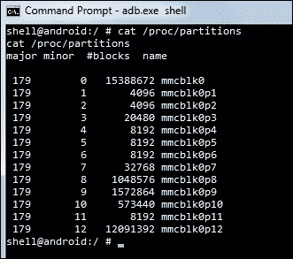

Android 中的分区文件

前面截图中的条目只显示了块名称。要获取这些块与它们的逻辑功能的映射，请检查`/dev/block/platform/dw_mmc`目录下的`by-name`目录的内容。以下截图显示了该目录的内容：


块到它们的逻辑功能的映射

如前所示，分区布局中存在各种分区，如系统、用户数据等。

# Android 文件层次结构

为了对任何系统（桌面或移动）进行取证分析，了解底层文件层次结构是很重要的。对 Android 如何在文件和文件夹中组织数据有基本的了解，有助于取证分析人员将研究范围缩小到特定位置。如果你熟悉类 Unix 系统，你会很好地理解 Android 中的文件层次结构。在 Linux 中，文件层次结构是一个单一的树，树的顶部被表示为`/`。这被称为**根**。这与在驱动器中组织文件的概念（如 Windows）不同。无论文件系统是本地还是远程，它都会存在于根下。Android 文件层次结构是这个现有 Linux 层次结构的定制版本。根据设备制造商和底层 Linux 版本，这个层次结构的结构可能会有一些微不足道的变化。要查看完整的文件层次结构，你需要有 root 访问权限。下面的截图显示了 Android 设备上的文件层次结构：

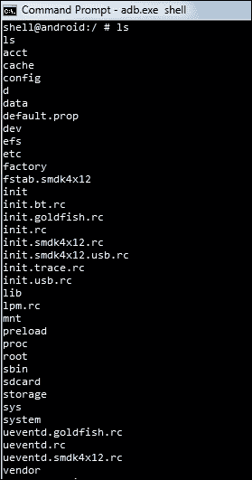

Android 根目录下的文件夹

## 目录概述

接下来的部分将概述 Android 设备文件层次结构中存在的目录。

### acct

这是 acct cgroup（控制组）的挂载点，用于用户账户。

### 缓存

这是 Android 存储频繁访问的数据和应用组件的目录（`/cache`）。清除缓存不会影响个人数据，只是删除其中的现有数据。这个文件夹中还有另一个名为`lost+found`的目录。这个目录在文件系统损坏的情况下（例如不正确地移除 SD 卡而没有卸载等）会保存恢复的文件（如果有的话）。缓存可能包含取证相关的证据，例如图片、浏览历史和其他应用数据。

### d

这是一个符号链接到`/sys/kernel/debug`。这个文件夹用于挂载 debugfs 文件系统和调试内核。

### 数据

这是包含每个应用程序数据的分区。用户的大部分数据，例如联系人、短信、拨打的号码等，都存储在这个文件夹中。从取证的角度来看，这个文件夹非常重要，因为它包含有价值的数据。下面的截图显示了这个分区中存在的文件夹：

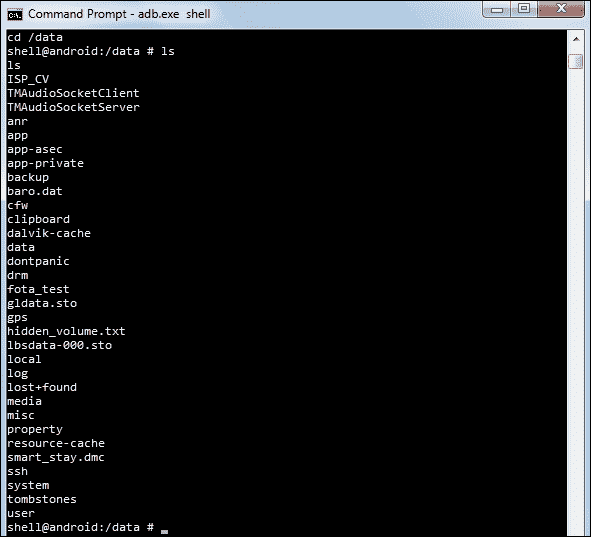

Android 设备数据分区的内容

接下来的部分将简要解释`data`文件夹下其他重要子目录的内容。

#### dalvik-cache

如第一章*介绍 Android 取证*中所讨论的，Android 应用程序包含优化过的 Java 字节码的`.dex`文件。当应用程序安装在 Android 设备上时，对应的`.dex`文件会进行一些修改，并创建一个名为`.odex`文件（优化的`.dex`文件）。然后将其缓存到`/data/dalvik-cache`目录中，以便在每次加载`application.log`时不必执行优化过程。

这个文件夹包含一些日志，根据具体需求，在检查过程中可能会有用。例如，下面的截图显示了一个名为`recovery_log.txt`的日志文件，其中包含有关恢复日志的详细信息：


recovery_log.txt 文件输出

#### data

`/data/data`分区包含所有应用程序的私有数据。用户的大部分数据存储在这个文件夹中。从取证的角度来看，这个文件夹非常重要，因为它包含有价值的数据。这个分区在*内部存储*部分有详细介绍。

### dev

这个目录包含所有设备的特殊设备文件。这是 tempfs 文件系统的挂载点。这个文件系统定义了应用程序可用的设备。

### init

正如在第一章中所讨论的，*介绍 Android 取证*，在启动 Android 内核时，将执行 init 程序。此程序位于此文件夹下。

### mnt

此目录用作所有文件系统、内部和外部 SD 卡等的挂载点。以下屏幕截图显示了此目录中的挂载点：

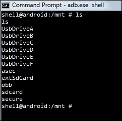

### proc

这是 procfs 文件系统的挂载点，提供对内核数据结构的访问。几个程序使用`/proc`作为其信息的来源。它包含有关进程的有用信息的文件。例如，如下屏幕截图所示，`/proc`下的`meminfo`提供有关内存分配的信息：


Android 中 proc 文件夹下的 meminfo 文件

### root

这是 root 账户的主目录。只有在设备被 root 后才能访问此文件夹。

### sbin

这包含了一些重要守护进程的二进制文件。从取证角度来看，这并不是很重要。

### misc

正如名称所示，此文件夹包含有关杂项设置的信息。这些设置主要定义状态，即开/关。有关硬件设置、USB 设置等信息可以从此文件夹中访问。

### sdcard

这是包含设备 SD 卡上数据的分区。请注意，此 SD 卡可以是可移动存储或不可移动存储。您手机上具有`WRITE_EXTERNAL_STORAGE`权限的任何应用程序都可以在此位置创建文件或文件夹。大多数手机上都有一些默认文件夹，如`android_secure`、`Android`、`DCIM`、`media`等。以下屏幕截图显示了`/sdcard`位置的内容：

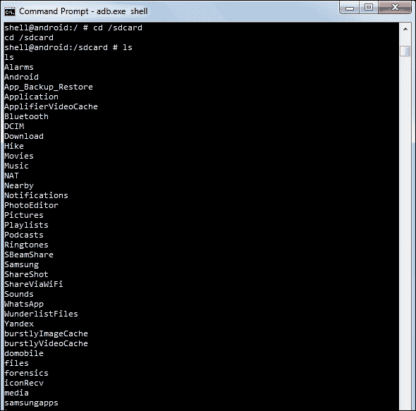

Android 设备的 sdcard 分区的内容

**数码相机图像**（**DCIM**）是数码相机、智能手机、平板电脑和相关固态设备的默认目录结构。一些平板电脑有一个指向相同位置的`photos`文件夹。在`DCIM`中，您会找到您拍摄的照片、视频和缩略图（缓存）文件。照片存储在`/DCIM/Camera`中。

Android 开发者参考解释了一些公共存储目录，这些目录与特定程序没有特定的关联。以下是这些文件夹的快速概述：

+   `音乐：`媒体扫描器将此处找到的所有媒体分类为用户音乐。

+   `播客：`媒体扫描器将此处找到的所有媒体分类为播客。

+   `铃声：`此处的媒体文件被分类为铃声。

+   `闹钟：`此处的媒体文件被分类为闹钟。

+   `通知：`此位置下的媒体文件用于通知声音。

+   `图片：`除了用相机拍摄的照片外，所有照片都存储在此文件夹中。

+   `电影：`除了用相机拍摄的电影外，所有电影都存储在此文件夹中。

+   `下载：`各种下载存储在此文件夹中。

### system

此目录包含库、系统二进制文件和其他与系统相关的文件。与手机一起预装的应用程序也存在于此分区中。以下屏幕截图显示了 Android 设备上系统分区中的文件：

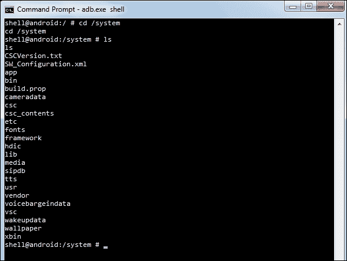

Android 设备系统分区的内容

以下是`/system`分区中一些有趣的文件和文件夹，对取证调查员很有兴趣。

#### build.prop

该文件包含了给定设备的所有构建属性和设置。对于取证分析师来说，该文件提供了有关设备型号、制造商、Android 版本以及许多其他细节的概述。可以通过发出`cat`命令来查看此文件的内容，如下面的屏幕截图所示：


build.prop 文件输出

如前面的输出所示，您可以通过查看此文件内容来找出产品型号、CPU 详细信息和安卓版本。在已 root 的设备上，调整`build.prop`文件可能会导致多个系统设置的更改。

#### 应用程序

此文件夹包含系统应用程序和预安装的应用程序。这被挂载为只读，以防止任何更改。以下屏幕截图显示了此文件夹中存在的各种与系统相关的应用程序：

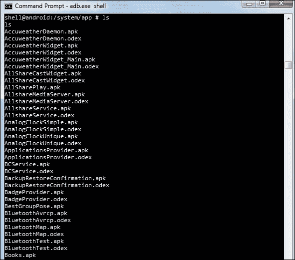

/system/app 分区下的系统应用程序

除了 APK 文件，您可能还注意到了前面输出中的`.odex`文件。在安卓中，应用程序以`.apk`扩展名的包形式存在。这些 APK 包含`.odex`文件，其假定的功能是节省空间。`.odex`文件是应用程序的某些部分在引导前进行优化的集合。

#### 框架

此文件夹包含 Android 框架的源代码。在此分区中，您可以找到关键服务的实现，例如具有包和活动管理器的系统服务器。还在这里完成了 Java 应用程序 API 和本地库之间的大部分映射。

### ueventd.goldfish.rc 和 ueventd.rc

这些文件包含了`/dev`目录的配置规则。

总之，这是来自[`wiki.robotz.com/index.php/Android_File_System`](http://wiki.robotz.com/index.php/Android_File_System)的 Android 文件树参考的屏幕截图：


安卓文件树

# 设备上的应用程序数据存储

安卓设备通过应用程序存储了大量敏感数据。尽管我们之前将应用程序分类为系统和用户安装的应用程序，但这里有一个更详细的划分：

+   随安卓一起提供的应用程序

+   由制造商安装的应用程序

+   由无线运营商安装的应用程序

+   用户安装的应用程序

所有这些在设备上存储了不同类型的数据。应用程序数据通常包含了与调查相关的大量信息。以下是可能在安卓设备上找到的数据的样本列表：

+   短信

+   MMS

+   聊天消息

+   备份

+   电子邮件

+   通话记录

+   联系人

+   图片

+   视频

+   浏览器历史

+   GPS 数据

+   下载的文件或文档

+   属于已安装应用程序的数据（Facebook、Twitter 和其他社交媒体应用程序）

+   日历约会

属于不同应用程序的数据可以存储在内部或外部。在外部存储（SD 卡）的情况下，数据可以存储在任何位置。但是，在内部存储的情况下，位置是预定义的。具体来说，设备上所有应用程序（无论是系统应用程序还是用户安装的应用程序）的内部数据都会自动保存在`/data/data`子目录中，以包名称命名。例如，默认的安卓电子邮件应用程序的包名为`com.android.email`，内部数据存储在`/data/data/com.android.email`中。我们将在接下来的部分详细讨论这一点，但现在，这些知识足以理解以下细节。

安卓为开发人员提供了一些选项来将数据存储到设备上。可以使用的选项取决于要存储的基础数据。属于应用程序的数据可以存储在以下位置之一：

+   共享首选项

+   内部存储

+   外部存储

+   SQLite 数据库

+   网络

以下各节提供了关于每个选项的清晰解释。

## 共享首选项

此位置提供了一个框架，用于以`.xml`格式存储原始数据类型的键值对。原始数据类型包括布尔值、浮点数、整数、长整数和字符串。字符串以**通用字符集转换格式-8**（**UTF-8**）格式存储。这些文件通常存储在应用程序的`/data/data/<package_name>/shared_prefs`路径中。例如，安卓电子邮件应用程序的`shared_prefs`文件夹包含少于六个`.xml`文件，如下屏幕截图所示：


Android 电子邮件应用的`shared_prefs`文件夹的内容

如第二章中所述，可以使用`cat`命令查看这些文件的内容。以下截图显示了`com.android.email_preferences.xml`文件的内容：

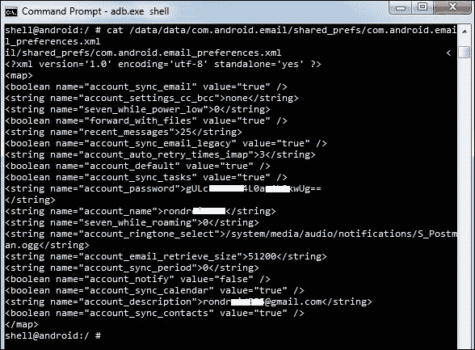

Android 电子邮件应用的共享偏好设置文件内容

如前面的截图所示，数据存储在名称-值对中。也许在前面的`.xml`文件中，`account_name`、`account_password`、`recent_messages`是取证调查中一些有趣的参数。许多应用程序使用共享偏好设置来存储敏感数据，因为它很轻量级。因此，在取证调查中，它们可以成为信息的关键来源。

## 内部存储

这些文件存储在内部存储中。这些文件通常位于应用程序的`/data/data`子目录中。存储在这里的数据是私有的，其他应用程序无法访问。甚至设备所有者也无法查看这些文件（除非他们具有 root 访问权限）。但是，根据需求，开发人员可以允许其他进程修改和更新这些文件。

以下截图显示了存储在`/data/data`目录中的应用程序及其包名称的详细信息：

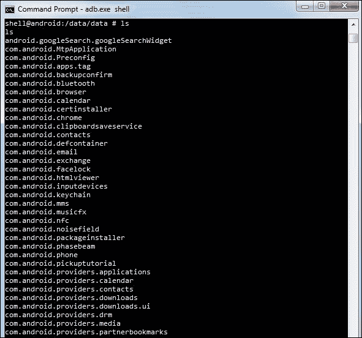

Android 中`/data/data`文件夹的内容

每个应用程序的内部数据都存储在它们各自的文件夹中。例如，以下截图显示了 Android 设备上 Twitter 应用程序的内部存储：


Android Twitter 应用的内部存储

通常，大多数应用程序都会创建`databases`、`lib`、`shared_pref`、`cache`文件夹。以下表格提供了这些文件夹的简要描述：

| 子目录 | 描述 |
| --- | --- |
| shared_prefs | 共享偏好设置的 XML 文件 |
| lib | 应用程序所需的自定义库文件 |
| files | 开发人员保存的文件 |
| cache | 应用程序缓存的文件 |
| databases | SQLite 和日志文件 |

除了这些文件夹之外，还有一些是应用程序开发人员创建的自定义文件夹。`databases`文件夹包含了在取证调查中有帮助的关键数据。如下截图所示，该文件夹中的数据存储在 SQLite 文件中：

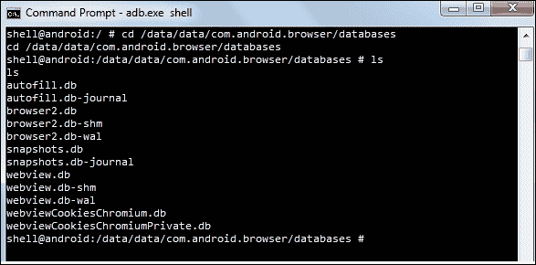

Android 浏览器应用的 databases 文件夹中存在的 SQLite 文件

可以使用 SQLite Browser 等工具查看这些数据。有关如何提取数据的更多详细信息在第四章中有详细介绍，*从 Android 设备逻辑提取数据*。

## 外部存储

应用程序还可以将文件存储在外部存储中。外部存储可以是可移动介质，如 SD 卡，也可以是手机自带的不可移动存储。对于可移动 SD 卡，只需将 SD 卡取出并插入到其他设备中，数据就可以在其他设备上使用。SD 卡通常采用 FAT32 文件系统格式，但越来越多地使用其他文件系统，如 EXT3 和 EXT4。与内部存储不同，外部存储没有严格的安全执行。换句话说，存储在这里的数据是公开的，其他应用程序可以访问，前提是请求的应用程序具有必要的权限。

例如，前面讨论的 Twitter 应用程序还在 SD 卡的`/Android/data`位置存储了某些文件。应用程序加载的大文件，如图像和视频，通常存储在外部存储中，以便更快地检索。

## SQLite 数据库

SQLite 是许多移动系统中常见的流行数据库格式，用于结构化数据存储。SQLite 是开源的，与许多其他数据库不同，它体积小且功能丰富。Android 通过专用 API 支持 SQLite，因此开发人员可以利用它。SQLite 数据库是取证数据的丰富来源。应用程序使用的 SQLite 文件通常存储在`/data/data/<ApplicationPackageName>/databases`目录下。例如，在 Android 电子邮件应用程序的情况下，以下截图显示了其`databases`文件夹中存在的 SQLite 文件。我们将在接下来的部分更详细地检查这些文件。从取证的角度来看，它们非常有价值，因为它们经常存储应用程序处理的许多重要数据。`databases`文件夹的内容如下截图所示：


Android 电子邮件应用程序的数据库文件夹

## 网络

您可以使用网络来存储和检索您自己的基于 Web 的服务上的数据。要进行网络操作，可以使用`java.net.*`和`android.net.*`包中的类。这些包为开发人员提供了与网络、Web 服务器等交互所必需的低级 API。

# Android 文件系统概述

在 Android 取证中，了解文件系统非常重要，因为它帮助我们了解数据的存储和检索方式。对文件系统属性和结构的了解在取证分析过程中将会很有用。文件系统是指数据从卷中存储、组织和检索的方式。基本安装可能基于一个分成多个分区的卷；在这里，每个分区可以由不同的文件系统管理。微软 Windows 用户大多熟悉 FAT32 或 NTFS 文件系统，而 Linux 用户更熟悉 EXT2 或 EXT4 文件系统。就像在 Linux 中一样，Android 也使用挂载点而不是驱动器（如`C:`或`E:`）。每个文件系统定义了自己的规则来管理卷上的文件。根据这些规则，每个文件系统提供了不同的文件检索速度、安全性、大小等。Linux 使用多个文件系统，Android 也是如此。从取证的角度来看，了解 Android 使用的文件系统，并识别对调查具有重要意义的文件系统是很重要的。例如，存储用户数据的文件系统对我们来说是首要关注的，而不是用于引导设备的文件系统。

如前所述，Linux 被认为支持大量的文件系统。系统使用的这些文件系统不是通过驱动器名称访问的，而是合并成一个单一的分层树结构，将这些文件系统表示为一个实体。每当挂载新的文件系统时，它就被添加到这个单一的文件系统树中。

### 注意

在 Linux 中，挂载是将附加文件系统连接到计算机当前可访问的文件系统的行为。

因此，文件系统被挂载到一个目录上，而此文件系统中的文件现在是该目录的内容。这个目录被称为**挂载点**。无论文件系统存在于本地设备还是远程设备上都没有区别。一切都集成到以根目录开始的单一文件层次结构中。每个文件系统都有一个单独的内核模块，该模块使用**虚拟文件系统**（**VFS**）注册它支持的操作。VFS 允许不同的应用以统一的方式访问不同的文件系统。通过将实现与抽象分离，添加新的文件系统变成了编写另一个内核模块的事情。这些模块要么是内核的一部分，要么是按需动态加载的。Android 内核带有一系列文件系统的子集，从**日志文件系统**（**JFS**）到 Amiga 文件系统。当文件系统被挂载时，内核会处理所有后台工作。

### 注意

上述信息引用自[`trikandroid.hol.es/page/100/`](http://trikandroid.hol.es/page/100/)。

## 在 Android 设备上查看文件系统

通过检查`proc`文件夹中存在的`filesystems`文件的内容，可以确定 Android 内核支持的文件系统。可以使用以下命令查看此文件的内容：

```kt
shell@Android:/ $ cat /proc/filesystems
cat /proc/filesystems
nodev sysfs
nodev rootfs
nodev bdev
nodev proc
nodev cgroup
nodev tmpfs
nodev binfmt_misc
nodev debugfs
nodev sockfs
nodev usbfs
nodev pipefs
nodev anon_inodefs
nodev devpts
ext2
ext3
ext4
nodev ramfs
vfat
msdos
nodev ecryptfs
nodev fuse
fuseblk
nodev fusectl
exfat

```

在前面的输出中，由`nodev`属性引导的文件系统未挂载到设备上。

## 常见的 Android 文件系统

Android 中存在的文件系统可以分为三个主要类别，如下所示：

+   闪存文件系统

+   基于媒体的文件系统

+   伪文件系统

### 闪存文件系统

闪存存储器是一种可以按块擦除和重新编程的不断供电的非易失性存储器。由于闪存存储器的特殊特性，需要特殊的文件系统来覆盖介质并处理某些块的长擦除时间。虽然不同的 Android 设备支持的文件系统各不相同，但常见的闪存文件系统如下：

+   **扩展文件分配表**（**exFAT**）：这种文件系统是微软专有的，针对闪存驱动器进行了优化。由于许可要求，它不是标准 Linux 内核的一部分。然而，一些制造商提供对这种文件系统的支持。

+   **闪存友好文件系统**（**F2FS**）：这种文件系统是三星推出的开源文件系统。基本意图是构建一个考虑基于 NAND 闪存的存储设备特性的文件系统。

+   **日志闪存文件系统版本 2**（**JFFS2**）：这种文件系统是 Android 中使用的一种日志结构文件系统。JFFS2 是**Android 开源项目**（**AOSP**）自冰淇淋三明治版本以来的默认闪存文件系统。诸如 LogFS、UBIFS、YAFFS 等文件系统已经被开发作为 JFFS2 的替代品。

+   **另一个闪存文件系统版本 2**（**YAFFS2**）：这种文件系统是一个开源的、单线程的文件系统，于 2002 年发布。它主要设计用于在处理 NAND 闪存时快速。YAFFS2 利用 OOB。这在取证获取过程中通常无法正确捕获或解码，使分析变得困难。YAFFS2 曾经是最受欢迎的版本，并且仍然广泛用于 Android 设备。YAFFS2 是一个日志结构文件系统。即使在突然断电的情况下也能保证数据完整性。2010 年，有一项声明称在 Gingerbread 之后的版本中，设备将从 YAFFS2 转移到 EXT4。目前，YAFFS2 在较新的内核版本中不受支持，但某些手机制造商可能仍然继续支持它。

+   RFS（鲁棒文件系统）：这种类型的文件系统支持三星设备上的 NAND 闪存。RFS 可以总结为启用了事务日志的 FAT16（或 FAT32）文件系统。许多用户抱怨三星应该坚持使用 EXT4。RFS 已知会导致 Android 功能减慢的延迟时间。

### 基于媒体的文件系统

除了之前讨论的闪存文件系统，Android 设备通常支持以下基于媒体的文件系统：

+   扩展文件系统（EXT2/EXT3/EXT4）：这个文件系统是 1992 年专门为 Linux 内核引入的。这是最早的文件系统之一，使用了虚拟文件系统。EXT2、EXT3 和 EXT4 是后续的版本。日志记录是 EXT3 相对于 EXT2 的主要优势。使用 EXT3 时，在意外关机的情况下，无需验证文件系统。第四个扩展文件系统 EXT4 在实现双核处理器的移动设备中变得重要。YAFFS2 文件系统在双核系统上存在瓶颈。在 Android 的 Gingerbread 版本中，YAFFS 文件系统被替换为 EXT4。

+   FAT（文件分配表）：这些文件系统，如 FAT12、FAT16 和 FAT32，都受到 MSDOS 驱动程序的支持。

+   VFAT（虚拟文件分配表）：这个文件系统是 FAT16 和 FAT32 文件系统的扩展。大多数 Android 设备支持微软的 FAT32 文件系统。它被几乎所有主要操作系统支持，包括 Windows、Linux 和 Mac OS。这使得这些系统可以轻松地读取、修改和删除 Android 设备上 FAT32 部分的文件。大多数外部 SD 卡都是使用 FAT32 文件系统格式化的。

### 伪文件系统

除此之外，还有一些伪文件系统，可以被视为文件的逻辑分组。以下是在 Android 设备中发现的一些重要的伪文件系统：

+   cgroup（控制组）：这种伪文件系统提供了一种访问和定义多个内核参数的方式。存在许多不同的进程控制组。如下命令行输出所示，可以在`/proc/cgroups`文件中看到组的列表：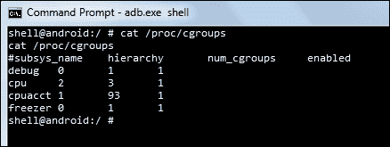

cgroups 文件输出

Android 设备使用这种文件系统来跟踪它们的任务。它们负责聚合任务并跟踪它们。

+   rootfs：这种类型的文件系统是 Android 的主要组成部分之一，包含了启动设备所需的所有信息。当设备启动引导过程时，它需要访问许多核心文件，因此会挂载根文件系统。这个文件系统被挂载在`/`（根目录）下。因此，这是所有其他文件系统逐渐挂载的文件系统。如果这个文件系统损坏，设备将无法启动。

+   procfs：这种类型的文件系统包含有关内核数据结构、进程和其他系统相关信息的信息，存储在`/proc`目录中。例如，`/proc/filesystems`文件显示设备上可用文件系统的列表。以下命令显示了设备 CPU 的所有信息：

```kt
shell@Android:/ $ cat /proc/cpuinfo
cat /proc/cpuinfo
Processor : ARMv7 Processor rev 0 (v7l)
processor : 0
BogoMIPS : 1592.52
processor : 3
BogoMIPS : 2786.91
Features : swp half thumb fastmult vfp edsp neon vfpv3 tls
CPU implementer : 0x41
CPU architecture: 7
CPU variant : 0x3
CPU part : 0xc09
CPU revision : 0
Chip revision : 0011
Hardware : SMDK4x12
Revision : 000c
Serial : ****************

```

+   sysfs：这种类型的文件系统挂载了包含设备配置信息的`/sys`文件夹。以下输出显示了 Android 设备中`sys`目录中的各种文件夹：

```kt
shell@Android:/ $ cd /sys
cd /sys
shell@Android:/sys $ ls
ls
block
bus
class
dev
devices
firmware
fs
kernel
module
power

```

由于这些文件夹中的数据大多与配置相关，这对于法医调查人员通常并不重要。然而，在某些情况下，我们可能需要检查手机上是否启用了特定设置。在这种情况下，分析这个文件夹可能是有用的。请注意，每个文件夹都包含大量文件。通过法医获取捕获这些数据是确保在检查过程中不会更改这些数据的最佳方法。

+   **tmpfs**：这种类型的文件系统是设备上的临时存储设施，它将文件存储在 RAM（易失性内存）中。这通常挂载在`/dev`目录上。使用 RAM 的主要优势是其更快的访问和检索。然而，一旦设备重新启动或关闭，这些数据将不再可访问。因此，对于法医调查人员来说，重要的是在设备重新启动之前检查 RAM 中的数据或提取数据。

您可以使用`mount`命令来查看设备上可用的不同分区及其文件系统，如下所示：

```kt
shell@Android:/sdcard $ mount
mount
rootfs / rootfs rw 0 0
tmpfs /dev tmpfs rw,nosuid,relatime,mode=755 0 0
devpts /dev/pts devpts rw,relatime,mode=600,ptmxmode=000 0 0
proc /proc proc rw,relatime 0 0
sysfs /sys sysfs rw,relatime 0 0
tmpfs /mnt/asec tmpfs rw,relatime,mode=755,gid=1000 0 0
tmpfs /mnt/obb tmpfs rw,relatime,mode=755,gid=1000 0 0
/dev/block/nandd /system ext4 rw,nodev,noatime,user_xattr,barrier=0,data=ordered 0 0
/dev/block/nande /data ext4 rw,nosuid,nodev,noatime,user_xattr,barrier=0,journal_checksum,data=or dered,noauto_da_alloc 0 0
/dev/block/nandh /cache ext4 rw,nosuid,nodev,noatime,user_xattr,barrier=0,journal_checksum,data=or dered,noauto_da_alloc 0 0
/dev/block/vold/93:64 /mnt/sdcard vfat rw,dirsync,nosuid,nodev,noexec,relatime,uid=1000,gid=1015,fmask=0702, dmask=0702,allow_utime=0020,codepage=cp437,iocharset=ascii,shortname= mixed,utf8,errors=remount-ro 0 0
/dev/block/vold/93:64 /mnt/secure/asec vfat rw,dirsync,nosuid,nodev,noexec,relatime,uid=1000,gid=1015,fmask=0702, dmask=0702,allow_utime=0020,codepage=cp437,iocharset=ascii,shortname= mixed,utf8,errors=remount-ro 0 0
tmpfs /mnt/sdcard/.Android_secure tmpfs ro,relatime,size=0k,mode=000 0 0
/dev/block/dm-0 /mnt/asec/com.kiloo.subwaysurf-1 vfat ro,dirsync,nosuid,nodev,relatime,uid=1000,fmask=0222,dmask=0222,codep age=cp437,iocharset=ascii, shortname=mixed,utf8,errors=remount-ro 0 0

```

正如前面的命令行输出所示，不同的分区有不同的文件系统，并且它们被相应地挂载。

# 总结

对安卓的分区布局、文件系统和重要位置有充分的了解，将有助于法医调查人员在从设备中提取数据的过程中。安卓设备上的用户数据位置包含了大量对任何法医调查至关重要的用户信息。然而，大多数这些文件可能只能在已获取 root 权限的手机上访问（特别是`/data/data`位置的文件）。您还了解了安卓的数据存储选项、安卓使用的各种文件系统及其重要性。

有了这些知识，您现在将学习如何在接下来的章节中从安卓设备中逻辑和物理地提取数据。
