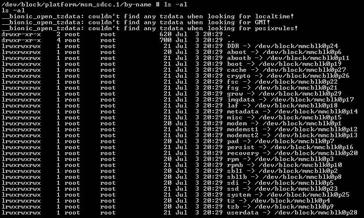
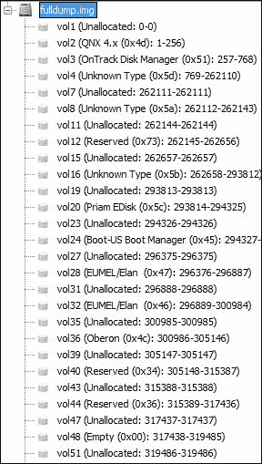
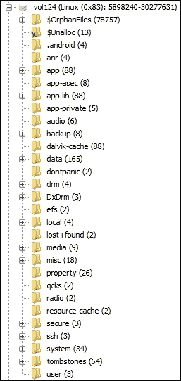
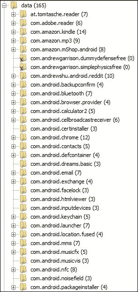
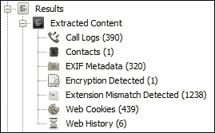
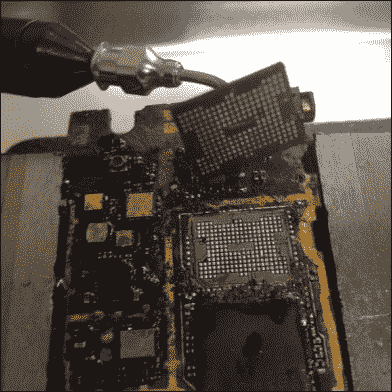

# 第五章：从 Android 设备物理提取数据

本章将尽可能使用免费和开源工具来进行物理数据提取。本章涵盖的大部分内容将使用本书中先前讨论过的 ADB 方法。在本章结束时，读者应该熟悉以下概念：

+   物理提取意味着什么

+   从物理提取中期望什么数据

+   使用`dd`和`nanddump`命令进行物理数据提取

+   RAM 镜像和分析

+   SD 卡获取

+   JTAG 和芯片脱落方法

# 物理提取概述

在数字取证中，物理提取是电子媒体的精确比特对比图像，对于移动设备也是如此。在传统的计算机取证中，这通常涉及从嫌疑人的计算机中取出证据驱动器，并通过写入阻断器对其进行镜像，而无需启动驱动器，从而生成包含嫌疑人驱动器的精确副本的图像文件。输出通常被称为原始图像，或简称为 bin（二进制）文件。物理提取与逻辑提取不同，它们是设备内存的精确副本，并包括未分配的空间、文件松弛、卷松弛等。

在移动取证中，结果是相同的；设备的精确比特对比图像，但方法有所不同。例如，从设备中移除闪存存储器进行镜像既耗时又昂贵，并且需要大量专业知识（尽管后面章节中讨论的芯片脱落方法可以实现）。此外，除了使用高级的 JTAG 或芯片脱落方法，设备必须在某种程度上引导（在许多情况下还必须写入）才能访问数据。最后，找到甚至可以解析最终图像文件的工具可能非常困难。硬盘镜像和文件系统长期以来一直被记录和研究，而移动镜像和文件系统经常发生变化；在某些情况下，移动文件系统甚至是特定制造商独有的。知道在获取图像后该如何处理图像可能与首次获取图像一样具有挑战性！

许多在第四章中讨论的技术，即《从 Android 设备逻辑提取数据》，在这里仍然适用。引导到自定义恢复仍然是最具法医学意义的过程；尽量避免物理获取活动设备。

## 可以从物理上获取哪些数据？

简短的回答是：一切。由于物理获取是设备的精确图像，因此图像文件中包含设备上的所有数据。如前所述，通过物理提取，取证人通常只受其查找相关数据的能力所限制。一般来说，这是由于移动取证领域缺乏良好的图像分析工具。更进一步，应用程序已知会对用户数据进行编码或其他混淆，因此仅通过在十六进制编辑器中浏览图像将经常错过有价值的证据。本章将展示各种方法来挂载或以其他方式查看物理提取的文件系统，而第七章《Android 应用程序的取证分析》将专注于分析特定应用程序的数据。

### Root 访问

与逻辑提取一样，Root 访问对于物理提取来说也是至关重要的。要手动对设备进行镜像，我们需要在设备上执行 ADB shell 中的命令，这将需要 Root 权限。如果无法获得 Root 访问权限，通常仍然可以对 SD 卡进行镜像。除此之外，还有 JTAG 或芯片脱落方法。

# 使用 dd 物理提取数据

`dd`命令对于任何已经进行过传统硬盘取证的检查员来说应该是很熟悉的。`dd`命令是一个 Linux 命令行实用程序，用于转换和复制文件，但在取证中经常用于创建整个驱动器的逐位图像。还存在许多`dd`命令的变体，通常也经常使用，如`dcfldd`、`dc3dd`、`ddrescue`和`dd_rescue`。由于`dd`命令是为基于 Linux 的系统构建的，因此它经常包含在 Android 平台中。这意味着在设备上通常已经存在创建图像的方法！

`dd`命令有许多可以设置的选项，这里只列出了具有法医学重要性的选项。`dd`命令的格式如下：

```kt
dd if=/dev/block/mmcblk0 of=/sdcard/blk0.img bs=4096 conv=notrunc,noerror,sync

```

+   `if`：此选项指定要从中读取的输入文件的路径。

+   `of`：此选项指定要写入的输出文件的路径。

+   `bs`：此选项指定块大小。数据以指定块的大小读取和写入，默认情况下为 512 字节。

+   `conv`：此选项指定其属性作为转换选项：

+   `notrunc`：此选项不会截断输出文件。

+   `noerror`：如果遇到错误，此选项将继续成像。

+   `sync`：与`noerror`选项一起，此选项为出现错误的块写入`\x00`。这对于在图像内保持文件偏移很重要。

### 提示

不要混淆`if`和`of`标志，否则可能会覆盖目标设备！

可以在[`man7.org/linux/man-pages/man1/dd.1.html`](http://man7.org/linux/man-pages/man1/dd.1.html)找到命令选项的完整列表。

请注意块大小与`noerror`和`sync`标志之间的重要关联：如果出现错误，将为整个读取的块（由块大小确定）写入`\x00`。因此，较小的块大小会导致在出现错误时丢失的数据较少。缺点是，通常情况下，较小的块大小会导致传输速率较慢。检查员将不得不决定是更喜欢及时还是更准确的获取。

在前一章中讨论过，进入恢复模式进行成像过程是最具法医学意义的方法。

## 确定要成像的内容

在成像计算机时，检查员必须首先找到驱动器的挂载方式；例如`/dev/sda`。在成像 Android 设备时也是如此。第一步是启动 ADB shell，并使用以下命令查看`/proc/partitions`文件：

```kt
cat /proc/partitions

```

输出将显示设备上的所有分区：


在前面的屏幕截图中显示的输出中，`mmcblk0`是设备上的整个闪存。要成像整个闪存，我们可以使用`/dev/blk/mmcblk0`作为`dd`命令的输入文件标志（`if`）。其后的内容，由`p1`-`p29`表示，是闪存的一个分区。块的大小以块为单位显示，本例中块大小为 1024 字节，总内部存储大小约为 32GB。要获取设备内存的完整图像，我们将使用`mmcblk0`作为输入文件运行`dd`命令。

然而，我们知道从前几章的内容，大多数这些分区不太可能具有法医学意义；我们可能只对其中的一些感兴趣。要查看每个分区的相应名称，我们可以查看设备的`by-name`目录。这并不是每个设备都有的，有时路径也不同，但对于这个设备，它位于`/dev/block/msm_sdcc.1/by-name`。通过导航到该目录并运行`ls -al`命令，我们可以看到每个块符号链接到哪里，如下面的屏幕截图所示：



如果我们的调查只对`userdata`分区感兴趣，我们现在知道它是`mmcblk0p28`，可以将其用作`dd`命令的输入文件。

如果设备上不存在`by-name`目录，则可能无法识别设备上的每个分区。但是，仍然可以使用 ADB shell 中的`mount`命令找到其中许多分区。请注意，以下截图来自不包含`by-name`目录的不同设备，因此数据分区不是`mmcblk0p28`。


在此设备上，数据分区是`mmcblk0p34`。如果`mount`命令不起作用，可以使用`cat /proc/mounts`命令找到相同的信息。根据设备的不同，还可以使用`cat /proc/mtd`或`cat /proc/yaffs`命令来识别分区；这些命令可能适用于旧设备。更新的设备可能在根目录中包含一个名为`fstab`的文件（通常称为`fstab.<device>`），其中列出了可挂载的分区。

## 写入 SD 卡

`dd`命令的输出文件可以写入设备的 SD 卡。只有在可移除嫌疑 SD 卡并用取证无菌 SD 卡替换以确保`dd`命令的输出不会覆盖证据时才应执行此操作。显然，如果要写入 SD 卡，请确保 SD 卡大于正在镜像的分区。

### 注意

在更新的设备上，`/sdcard`分区实际上是指向`/data/media`的符号链接。在这种情况下，使用`dd`命令将`/data`分区复制到 SD 卡将无效，并且可能会损坏设备，因为输入文件实质上是被写入自身。

要确定 SD 卡符号链接到哪里，只需打开 ADB shell 并运行`ls -al`命令。如果未显示 SD 卡分区，则可能需要使用第四章中显示的步骤在恢复模式下挂载 SD 卡，*从 Android 设备逻辑上提取数据*。

在下面的示例中，`/sdcard`被符号链接到`/data/media`。这表明`dd`命令的输出不应写入 SD 卡。


在接下来的示例中，`/sdcard`不是指向`/data`的符号链接，因此`dd`命令的输出可以用来将`/data`分区图像写入 SD 卡：


在旧设备上，SD 卡甚至可能没有被符号链接。

确定要读取的块以及 SD 卡符号链接的位置后，使用以下命令将`/data`分区镜像到`/sdcard`：

```kt
dd if=/dev/block/mmcblk0p28 of=/sdcard/data.img bs=512 conv=notrunc,noerror,sync

```


现在，SD 卡上存在`/data`分区的图像。可以使用 ADB `pull`命令将其拉到检查员的计算机上，或者直接从 SD 卡中读取。

## 使用 netcat 直接写入检查员的计算机

如果图像无法写入 SD 卡，检查员可以使用**netcat**直接将图像写入其计算机。netcat 工具是一种基于 Linux 的工具，用于在网络连接上传输数据。我们建议在 Linux 或 Mac 计算机上使用 netcat，因为它是内置的，尽管也存在 Windows 版本。以下示例是在 Mac 上完成的。

### 在设备上安装 netcat

很少有 Android 设备（如果有的话）预装了 netcat。要检查，只需打开 ADB shell 并键入`nc`。如果返回`nc 未找到`，则必须在设备上手动安装 netcat。可以在许多在线位置找到为 Android 编译的 netcat。我们分享了我们在[`sourceforge.net/projects/androidforensics-netcat/files/`](http://sourceforge.net/projects/androidforensics-netcat/files/)上使用的版本。

如果我们回顾一下前一节中`mount`命令的结果，我们可以看到`/dev`分区被挂载为`tmpfs`。Linux 术语`tmpfs`表示该分区旨在在设备上显示为实际文件系统，但实际上只存储在 RAM 中。这意味着我们可以在取证人的计算机上使用以下命令`push` netcat，而不对设备进行任何永久更改：

```kt
adb push nc /dev/Examiner_Folder/nc

```

该命令应该已经在`/dev`中创建了`Examiner_Folder`，并且`nc`应该在其中。可以通过在 ADB shell 中运行以下命令来验证：

```kt
ls /dev/Examiner_Folder

```

### 使用 netcat

现在 netcat 二进制文件已经在设备上，我们需要在 ADB shell 中给予它执行权限。可以按照以下步骤完成：

```kt
chomd +x /dev/Examiner_Folder/nc

```

我们需要打开两个终端窗口，其中一个打开了 ADB shell。另一个将用于监听从设备发送的数据。

现在我们需要在取证人的计算机上通过 ADB 启用端口转发：

```kt
adb forward tcp:9999 tcp:9999

```

`9999`是我们选择用于 netcat 的端口；在 Linux 或 Mac 系统上，可以是 1023 到 65535 之间的任意端口号（1023 及以下保留给系统进程，需要 root 权限才能使用）。Windows 将允许分配*任何*端口。

在具有 ADB shell 的终端窗口中，运行以下命令：

```kt
dd if=/dev/block/mmcblk0p34 bs=512 conv=notrunc,noerror,sync | /dev/Examiner_Folder/nc –l –p 9999

```

### 提示

`mmcblk0p34`是该设备上的用户数据分区，但是整个闪存或任何其他分区也可以使用这种方法进行镜像。在大多数情况下，最佳做法是镜像整个闪存，以便从设备中获取所有可能的数据。一些商业取证工具可能还需要整个内存映像，并且可能无法正确处理单个分区的映像。

在另一个终端窗口中运行：

```kt
nc 127.0.0.1 9999 > data_partition.img

```

`data_partition.img`文件现在应该在取证人计算机的当前目录中创建。当数据传输完成时，两个终端中的 netcat 将终止并返回到命令提示符。这个过程可能需要相当长的时间，具体取决于图像的大小。

# 使用 nanddump 物理提取数据

在所有前面的示例中，分区都是**多媒体卡**（MMC）块，这在较新的设备中很常见。然而，较旧的设备更有可能由**存储器技术设备**（MTD）块组成。我们过去曾看到`dd`命令无法正确镜像 MTD 块的情况，尽管往往它可以正常工作。如果`dd`失败，有一个被广泛分发的实用程序叫做`MTD-Utils`，用于从 MTD 块读取和写入；`nanddump`命令是`MTD-Utils`的一部分，并且可以类似于`dd`用于从 MTD 块读取。在`dd`失败的情况下，`nanddump`总是成功的。

为 Android 编译的`nanddump`版本可以在许多在线地方找到；我们使用的是在[`github.com/jakev/android-binaries/blob/master/nanddump`](https://github.com/jakev/android-binaries/blob/master/nanddump)找到的版本。

将`nanddump`放到设备上的过程与之前用于 netcat 的过程相同：

```kt
adb push nanddump /dev/Examiner_Folder/nanddump
chmod +x /dev/Examiner_Folder/nanddump

```

就像`dd`一样，`nanddump`命令可以用于通过 netcat 写入 SD 卡或取证人的计算机。从终端窗口中，运行以下命令：

```kt
adb forward tcp:9999 tcp:9999

```

在 ADB shell 中的一个单独的终端窗口中运行以下命令：

```kt
/dev/Examiner_Folder/nanddump /dev/block/mmcblk0p34 | /dev/Examiner_Folder/nc –l –p 9999

```

在使用`adb forward`命令的第一个终端窗口中，运行以下命令：

```kt
nc 127.0.0.1 9999 > data_partition.img

```

## 验证完整的物理映像

验证图像文件是否与设备相同是传统数字取证中的关键步骤。在 Android 设备上，这可能会有点棘手，甚至是不可能的。可以使用取证人通常使用的任何工具对创建的图像进行哈希处理。可以通过在 ADB shell 中使用以下命令来验证设备上的内存，其中给定的路径是被镜像的块或分区：

```kt
md5sum /dev/block/mmcblk0

```

然而，`md5sum`命令并非所有 Android 设备都包含。如果没有包含，检查员可能可以在网上找到适用于其设备的版本，并将其推送到`tmpfs`分区中，如之前使用 netcat 和`nanddump`所示。

另一个问题是，如果图像是在活动状态下获取的，即不是在恢复模式下获取的，正如前一章中所讨论的，那么 MD5 哈希值几乎肯定不会匹配，因为设备上的数据不断变化（即使是**无线电频率**（**RF**）屏蔽或处于飞行模式）。在这种情况下，检查员必须记录设备在获取时处于活动状态，并解释哈希值不会匹配的原因。

# 分析完整的物理图像

一旦使用讨论过的方法之一获取了图像，检查员可能可以手动浏览图像并提取每个分区，但可能更倾向于避免这样做。幸运的是，有各种各样的移动取证工具可以接收物理图像，如 Cellebrite、XRY、Mobile Phone Examiner 等。不幸的是，这些工具都不是免费或开源的。迄今为止，最受欢迎的免费开源分析工具是 Brian Carrier 的 Autopsy。

## Autopsy

Sleuth Kit 最初是一组基于 Linux 的命令行工具，用于取证；最终，添加了一个名为 Autopsy 的基于浏览器的 GUI。最近，Autopsy 已作为 Windows 上的独立平台发布，并包括分析 Android 图像的支持。版本 3.1.1 如下截图所示。加载和分析图像的完整过程将在第八章中进行介绍，*Android 应用程序的取证分析*。

Autopsy 可以在[`www.sleuthkit.org/`](http://www.sleuthkit.org/)下载。

图像加载后，扩展图像将显示 Autopsy 发现的所有卷，如下截图所示：



### 注意

在设备上发现的卷远远多于分区的数量。它们可能是工具创建的误报，也可能是设备上的磨损平衡的结果。

其中一个卷将是数据分区，如下所示：



请注意，上面看到的媒体目录是 SD 卡，因为它被符号链接到`data`分区。`data`分区中的`data`文件夹将包含应用程序数据：



每安装一个应用程序，都会为其创建一个目录。在前面的屏幕截图中，带有文件夹图标上的红色叉号的目录已被删除，表明该应用程序已从设备中移除。

最后，Autopsy 可以自动提取一些数据供检查员使用，但与所有取证工具一样，这些信息应该进行手动验证，如第七章中所示，*Android 应用程序的取证分析*。



## 分析物理转储的问题

我们在许多取证论坛和邮件列表上看到的最常见问题是，检查员获取了物理转储，然后无法将其加载到声称支持该设备的工具中。大多数情况下，这是因为检查员未考虑**带外**（**OOB**）区域。

带外区域，有时称为备用区域，是保留用于元数据的闪存小部分。元数据通常包括**纠错码**（**ECC**）、有关坏块的信息，以及在某些情况下，有关文件系统的信息。这对检查员来说是一个问题，因为大多数移动取证工具不考虑带外区域；它们期望图像中不包含它。当向工具呈现包含备用区域的图像时，工具通常不知道该怎么做，并且无法正确解析数据。

工具无法考虑 OOB 区域的原因是，它*不*包括在`dd`镜像中，这是大多数工具用来创建它们的镜像的。使用`nanddump`命令时，OOB 区域可能会被包括在内，尽管根据使用的二进制文件，可能有一个选项来排除它。OOB 区域包括在芯片脱焊和 JTAG 镜像中。

为了正确加载图像到取证工具中，首先需要删除 OOB 区域。一个经验法则是，OOB 大小基于设备的页面大小；对于每 512 字节的页面大小，将有 16 字节的 OOB 区域。例如，具有 2048 字节页面大小的设备可能在每个页面的末尾有 64 字节的 OOB 区域。然而，这完全取决于存储芯片制造商。在尝试删除 OOB 区域之前，检查员应该找到特定存储芯片的数据表，以确认页面和 OOB 区域的大小。通常可以通过在手机电路板上找到存储芯片并搜索芯片的型号来完成这一点。

以下是一个 Python 脚本的示例代码，用于从图像中删除 OOB 区域。就像上一章一样，我们并不是 Python 专家，我们确信有更好、更有效的方法来做到这一点，但这个方法确实有效：

```kt
import sys
file_to_parse = open(sys.argv[1],'rb')
file_after_removal = open('file_out.bin','wb')
while file_to_parse:
  lines_out = file_to_parse.read(2048)
  if lines_out:
    file_after_removal.write(lines_out)
    file_to_parse.seek(64,1)
  if not lines_out:
    break
print 'Done'
file_to_parse.close()
file_after_removal.close()
```

如果命名为`OOB_Remover.py`，则可以使用以下命令执行此文件：

```kt
python OOB_Remover.py C:\Users\Android_Examiner\physicaldump.bin

```

输出文件，没有 OOB 区域，将被命名为`file_out.bin`，保存在执行脚本的目录中。原始文件不会被编辑或修改。

请注意，代码的编写假定页面大小为 2048，OOB 大小为 64；这两个数字需要根据图像所在的存储芯片的具体大小进行编辑。然后输出应该能够加载到商用移动取证工具中。

# 成像和分析 Android RAM

由于拉取 Android 内存需要 root 访问权限，在很多情况下并不适用。大多数公共 root 过程涉及重新启动手机，这会擦除易失性 RAM，这意味着当检查员获得 root 权限来镜像 RAM 时，为时已晚，因为 RAM 已经被擦除。由于这个原因和可能的其他原因，在商业取证领域对 Android RAM 成像和分析的支持并不是很好。然而，有些情况下成像 RAM 是适用的，并可能非常有价值。如果设备在被扣押时已经 root，那么镜像 RAM 应该是扣押过程中的一个强制步骤。由于关闭手机将擦除 RAM，设备应该被置于飞行模式（任何其他网络连接，如 Wi-Fi 和蓝牙都应该被禁用），并且应该立即镜像 RAM，以避免设备电池在 RAM 被拉取之前耗尽。

当涉及到 RAM 时，主要挑战在于分析。RAM 是完全原始的、无结构的数据；没有文件系统。在十六进制编辑器中查看 RAM 时，RAM 似乎只是一个巨大的数据块，几乎没有任何规律可以帮助检查员弄清楚他们在看什么。现代设备通常有几十 GB 的 RAM，这种困难是由此而来的。RAM 可以很容易地使用传统取证工具和方法搜索关键字，但这假设检查员确切地知道他们在寻找什么。

## RAM 中可以找到什么？

任何写入闪存的数据*必须*通过 RAM 传递，处理器与闪存之间没有其他通信方式。这意味着几乎在设备上执行的任何操作都可能在 RAM 转储的内容中找到。根据设备使用量的不同，数据可能会一直保留在 RAM 中，直到需要被覆盖。RAM 转储经常包含在设备上键入的文本，包括用户名和密码，以及不会永久存储在设备上的应用程序数据。例如，旧版本的 Facebook 应用程序将用户的动态消息内容存储在其应用程序文件夹中的数据库中；新版本不保存用户的动态消息内容，但它存在于 RAM 中。

## 使用 LiME 成像 RAM

Android RAM 获取最常用的工具是**Linux Memory Extractor**（**LiME**），以前被称为 DMD。LiME 是免费和开源的，但并不是非常用户友好，因为它需要用户从源代码编译，这只能在 Linux 系统上完成。编译过程还必须针对每个要检查的设备的每个特定版本的 Android 进行，这在一定程度上限制了它在现场的可用性。这是必要的，因为 LiME 不是一个二进制文件（就像我们之前使用的 netcat 和 nanddump 工具一样）；相反，它是一个必须为将要加载的每个内核专门构建的内核模块。

为了确保下载正确的内核源代码，我们需要确定设备的型号和软件版本，可以通过在手机菜单中滚动到**设置** | **关于手机**来完成。或者，可以通过在 ADB shell 中运行以下命令来找到这些信息：

```kt
cat /system/build.prop

```

型号中的软件版本应该在文件顶部的前几行中。

幸运的是，大多数 Android 制造商确实发布他们的内核源代码；快速的谷歌搜索通常可以找到每个型号和软件版本的源代码。以下是一些主要制造商的开放源发布网站：

+   **Samsung**: [`opensource.samsung.com/reception.do`](http://opensource.samsung.com/reception.do)

+   **Motorola**: [`sourceforge.net/motorola/`](http://sourceforge.net/motorola/)

+   **HTC**: [`www.htcdev.com/devcenter`](http://www.htcdev.com/devcenter)

+   **Google Nexus**: [`source.android.com/source/building-kernels.html`](https://source.android.com/source/building-kernels.html)

### 提示

必须使用正确的型号和版本源。使用错误的内核源编译 LiME 将至少无法在设备上工作。加载不兼容的内核模块也可能导致设备崩溃。

要获取 LiME 的源代码，请转到[`github.com/504ensicsLabs/LiME`](https://github.com/504ensicsLabs/LiME)，然后选择**Download ZIP**选项，然后提取 zip 文件。

有许多在线资源解释了如何为特定内核编译 LiME，以及如何创建自定义的`Volatility`插件来检查生成的 RAM 转储，因此我们在这里不会详细介绍它们。以下是其中一些：

+   [`lime-forensics.googlecode.com/files/LiME_Documentation_1.1.pdf`](http://lime-forensics.googlecode.com/files/LiME_Documentation_1.1.pdf)

+   [`code.google.com/p/volatility/wiki/AndroidMemoryForensics`](https://code.google.com/p/volatility/wiki/AndroidMemoryForensics)

这些来源中缺少的一点是，使用 ADB `pull`获取`/proc/config.gz`文件的步骤可能无法在所有设备上工作。如果文件不存在，则可以在源代码中找到正确的配置文件，通常在`/arch/arm/configs`文件夹中。通常以处理器型号命名，例如`apq8064_defconfig`。

## 使用 mem 成像 RAM

如前节所述，使用 LiME 并非易事；这是一个充满复杂性的艰巨过程。在现场，调查员不太可能下载和编译内核源代码。**mem**工具是由 James Nuttall 开发的，旨在解决这些问题。与需要根据设备特定情况编译的内核模块不同，mem 是一个二进制文件，类似于本章前面使用的 netcat 和 nanddump 示例。mem 工具可以在[`sourceforge.net/projects/androidforensics-mem/files/`](http://sourceforge.net/projects/androidforensics-mem/files/)下载。

Mem 是一个可执行二进制文件，需要推送到设备并使用之前详细介绍的 netcat 和 nanddump 的确切过程来执行。在计算机取证中，将某些东西推送到 RAM 以读取 RAM 可能看起来有些违反直觉，但这是计算机取证中的一种必要操作。在我们看来，覆盖一小部分 RAM 要比实际推送到设备并覆盖证据用户数据要好。

Mem 具有读取整个 RAM 的能力，或者针对特定的取证感兴趣的进程（应用程序）。假设 mem 被推送到上面使用 netcat 的设备相同位置，运行 mem 的格式如下：

```kt
/dev/Examiner_Folder/mem <PID>

```

`PID`是要读取的进程的 ID；如果设置为 0，将镜像整个 RAM。要在 ADB shell 中查看进程列表，使用以下命令：

```kt
ps

```

在下面的截图中，我们可以看到`PID`是输出的第二列：


输出可能相当大，但通过简单阅读列表可以找到有趣的进程：


在上面的截图中，我们可以看到 Kik、Facebook、日历和 Gmail 都在运行。另一种方法是搜索已知应用程序，使用`grep`。例如，要在输出中找到 Facebook，我们可以运行以下命令：

```kt
ps | grep facebook

```

其输出将只显示 Facebook 的条目如下：


我们可以看到 Facebook 的 PID 是`2252`。为了避免在设备上覆盖数据，mem 被设计为与 netcat 一起使用，就像本章的*直接使用 netcat 将数据写入调查员计算机*部分所示的那样。因此，捕获 Facebook 使用的 RAM 需要以下步骤：

1.  在调查员计算机上的终端中运行：

```kt
adb forward tcp:9999 tcp:9999

```

1.  在 ADB shell 中的终端窗口中运行：

```kt
/dev/Examiner_Folder/mem 2252 | /dev/Examiner_Folder/nc –l –p 9999

```

1.  在调查员计算机上的终端窗口中运行：

```kt
nc 127.0.0.1 9999 > FB_RAM.bin

```

1.  当 mem 运行结束时，调查员的计算机工作目录中应该会有一个名为`FB_RAM.bin`的文件。

## 从 mem 输出

如前所述，检查 RAM 的好方法并不多，因为没有文件系统；输出只是一大块数据。这对于使用 mem 获取的数据仍然成立；上面提取的 Facebook RAM 的输出是一个 550MB 的无结构数据块。以下截图可以作为示例查看：


建议使用字符串或其他搜索功能来缩小数据范围，以便找到有用的用户数据。该文件也可以加载到计算机取证工具如 EnCase 或 FTK 中，以搜索关键词，也可以使用雕刻工具来定位图像。

然而，只要有足够的耐心和奉献精神，就可以找到有用的信息，比如用户新闻订阅中的这篇帖子：


最终，mem 的开发人员希望能够开发出一种用于分析输出的 volatility 配置文件。

# 获取 Android SD 卡

如上所述，在前几章中，SD 卡可以指外部物理 SD 卡或闪存内的分区。可通过写阻断器和典型的计算机取证工具，或使用前一节中显示的`dd`/`nanddump`技术，单独成像可移动的外部 SD 卡，尽管前者通常更快，因为它不需要通过 netcat 写入数据。

对 SD 卡进行物理成像与上面讨论的物理成像非常相似；实际上，如果 SD 卡被符号链接到`/data`分区，它将作为`/data`分区的一部分在 Autopsy 截图中被获取。该过程的唯一区别在于，如果正在成像 SD 卡，则无法将输出文件写入 SD 卡！这意味着使用先前介绍的 netcat 方法是对内部 SD 卡进行物理成像的最佳选择。

## SD 卡上可能会发现什么？

默认情况下，SD 卡通常用于存储大文件，包括下载的项目和使用设备拍摄的照片。许多应用程序还会在 SD 卡上创建自己的目录，用于存储通过聊天应用程序发送或接收的图像等数据。在某些情况下，正如在第八章中所看到的，*Android 取证工具概述*，甚至有一些应用程序会定期将所有数据备份到 SD 卡上。这对取证人员特别有用，因为他们可能无法访问内部存储器，由于安全设置或无法获取 root 权限，但可能可以访问 SD 卡。

感兴趣的常见 SD 卡位置包括但不限于以下位置：

+   `/DCIM`：此位置包括设备上拍摄的照片

+   `/Pictures/Screenshots`：此位置包含设备上拍摄的截图

+   `/Download`：此位置包含下载的文件

+   `/Android/data`：这是许多应用程序的存储位置

+   `/AppName`：这是许多应用程序的存储位置

### 提示

即使应用已被删除，`/Android/data`和`/AppName`文件夹可能仍然存在。文件夹的内容将被删除，但文件夹可能仍然存在；这表明该应用程序先前曾安装在设备上。

这些只是常见的默认位置。如果设备已获取 root 权限，用户可以将内部存储器中的任何数据放到 SD 卡上。

## SD 卡安全

在较旧版本的 Android 中，只需将手机插入计算机即可逻辑挂载 SD 卡，并允许取证人员访问其数据。在某些 Android 版本（可能是 3.0）中发生了变化，尽管在我们检查的各种更改日志中找不到确切的版本。如果使用屏幕锁定，较新版本的 Android 将不会自动允许从计算机访问 SD 卡，这意味着必须绕过屏幕锁定才能访问 SD 卡。显而易见的例外是，可以仍然通过传统的计算机取证方法移除并分析物理的外部 SD 卡。

SD 卡也可以进行加密，可以通过设备全盘加密（如果是内部 SD 卡）或通过第三方应用程序（如果是外部 SD 卡）进行加密。在某些情况下，激活全盘加密会使 SD 卡保持未加密状态，尽管这取决于设备制造商。

### 提示

Android Lollipop 中的全盘加密也会加密 SD 卡。

# 高级取证方法

除了前几章讨论的方法外，还有更高级的专业方法可用。JTAG 和芯片取下方法在许多常见情况下都是非常有用的工具，但需要先进的培训（以及在处理现场证据之前进行大量实践！）。最终的高级方法是冷启动攻击以恢复加密密钥，这更多是理论性的。

## JTAG

JTAG 是由电气和电子工程师学会（IEEE）制定的标准。在设备生产过程中，它用于通过专用接口与处理器进行通信以进行测试。幸运的是，对于法医检查员来说，它还允许他们直接与处理器通信并检索闪存的完整物理图像。

要执行 JTAG 提取，设备必须拆开到电路板。电路板上将包含多个接触点（设备电路板上的物理接触点），尽管它们通常没有标记，并且通常比 JTAG 所需的接触点多得多。要确定正确的接触点，检查员必须找到在线引脚布局图（或与其选择的工具一起提供），或使用电子测试设备确定每个接触点。然后，检查员必须将一根导线焊接到每个接触点，或使用商业可用的适配器（有时称为夹具），并通过提供的适配器连接到他们的 JTAG 盒子，如下图所示：


HTC Evo 在连接 JTAG 之前和之后的照片（由 http://lowcostwin4n6.blogspot.com/提供）

JTAG 可能听起来很复杂（也许是），但它有许多有用的用途，以下列出了两个优点：

1.  它不需要设备通电，因此：

+   即使设备损坏，也可能成功

+   没有射频屏蔽的担忧

+   不需要 root、ADB 或 USB 调试

1.  它可以用于恢复设备的 PIN/密码，因此：

+   可以对整个闪存进行成像，并恢复/破解密码文件，如第四章所示

许多制造商都生产 JTAG 工具；用于移动取证的许多常用工具可以在[`teeltech.com/mobile-device-forensic-tools/jtag-equipment/`](http://teeltech.com/mobile-device-forensic-tools/jtag-equipment/)找到。该网站上列出的 RIFF box 可能是移动取证中最常用的工具，因为它支持（包括引脚布局）各种设备。

JTAG 并非总是成功，甚至可能不可能。尽管接口几乎总是在电路板上，但制造商可以选择在设备制造后禁用它。

## Chip-off

Chip-off 涉及加热设备的电路板，直到焊料将组件固定到板上融化，然后取出闪存芯片。然后可以使用商业工具读取存储芯片，得到完整的物理图像。Chip-off 技术和 JTAG 一样，源自商业电子生产过程。熔化焊料的过程（通常称为回流或返工）用于在电路板上放置和移除组件，用于获取存储器的读卡器通常用于读取和写入存储芯片，通常是批量使用。



从损坏手机中取出的存储芯片（由 www.binaryintel.com/services/jtag-chip-off-forensics/chip-off_forensics/提供）

Chip-off 具有与 JTAG 相同的优点：它不需要设备通电，并且可以用于获取锁定设备的 PIN/密码；尽管获取 PIN/密码通常是一个无意义的点，但 chip-off 通常被认为是一种破坏性的过程。虽然存储芯片可以更换到设备上，但这是一个技术上要求严格的过程，并需要进一步的培训。但作为最后的手段，chip-off 是无法检查的设备的一个很好的替代方法。

Chip-off 的成本要比 JTAG 高得多，因为需要专门的重焊站和商用存储器读卡器。有数十种重焊站可用，它们都提供基本相同的功能。还有各种各样的存储器读卡器，尽管我们在[`www.dataman.com/programmers/universal/dataman-48pro2-super-fast-universal-isp-programmer.html`](http://www.dataman.com/programmers/universal/dataman-48pro2-super-fast-universal-isp-programmer.html)上使用了这个价格合理的型号，并取得了巨大成功。重焊站和读卡器并不是与 Chip-off 相关的唯一成本；大多数读卡器还需要为每个芯片型号读取特定的适配器。

## 绕过 Android 全盘加密

在继续之前，请注意，本节*非常*不切实际。但是，我们希望一些有抱负的取证开发人员能看到它，并决定它是一个足够值得的事业，使其更广泛适用（也因为它真的很酷）。

冷启动攻击已经被证明并多次使用，但直到最近才能有效地用于 Android 设备。冷启动攻击是基于 RAM 在较低温度下（数据保留更长时间）不太易挥发的想法，因此冷冻设备可以允许检查员访问 RAM 并找到解密设备所需的密钥。最近，一组研究人员成功地进行了演示，他们的论文和研究可以在这里找到：[`www1.informatik.uni-erlangen.de/frost`](https://www1.informatik.uni-erlangen.de/frost)。

再次注意，这些技术仅针对一个设备（Galaxy Nexus）进行了验证，它们的工具是一个可加载的内核模块，就像 LiME 一样，并依赖于一个为每个使用的设备创建的自定义恢复映像。

# 总结

本章讨论了用于物理成像内部存储器或 SD 卡的几种技术，以及与它们相关的一些常见问题：

| 技术 | 相关问题 |
| --- | --- |
| dd |

+   通常预装在设备上

+   可能无法在 MTD 块上工作

+   无法获取带外区域

|

| nanddump |
| --- |

+   不常见于设备上，必须推送到设备上

+   与 MTD 块配合使用效果很好

+   可能根据使用的二进制文件中的选项获取带外区域

|

此外，每种成像技术都可以用于将图像保存在设备上（通常在 SD 卡上），或者与 netcat 一起将文件写入检查员的计算机：

| 技术 | 特点 |
| --- | --- |
| 写入 SD 卡 |

+   简单，不需要将额外的二进制文件推送到设备

+   大多数检查员都熟悉

+   如果 SD 卡被符号链接到正在成像的分区，则无法使用

+   如果正在成像整个存储器，则无法使用

|

| 使用 netcat |
| --- |

+   通常需要将另一个二进制文件推送到设备

+   有些复杂，必须严格按步骤进行

+   无论正在成像什么都能工作

+   可能比写入 SD 卡更耗时

|

还演示了用于 RAM 成像的多个工具：

| 工具 | 特点 |
| --- | --- |
| LiME |

+   必须为每个被检查的设备编译

+   非常复杂的过程

+   已知的，有详细记录的分析程序

+   输出是所有 RAM 的转储

|

| 内存 |
| --- |

+   可以在任何设备上使用，无需额外步骤

+   新工具，使用和记录不如广泛

+   输出是设备上运行的每个进程的一个文件

|

最后，我们简要讨论了 Chip-off 和 JTAG 技术的入门级别。

下一章将演示从物理图像中恢复删除的数据，就像本章创建的那样。
