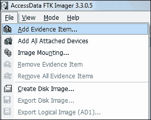
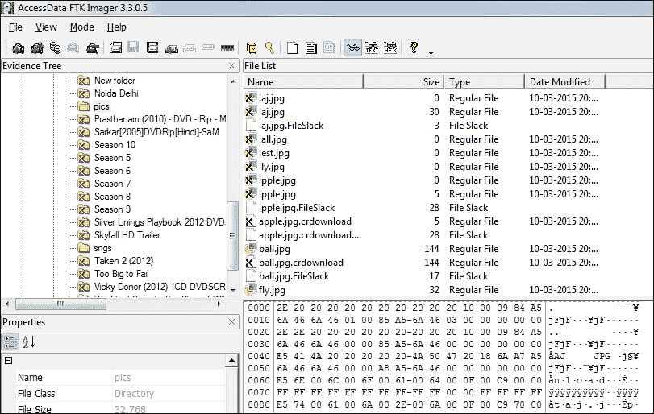
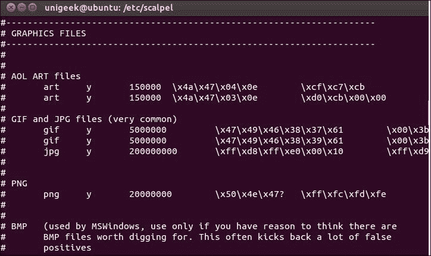
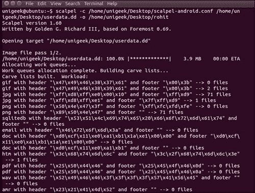
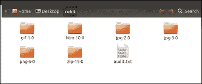
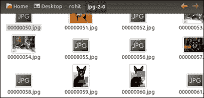
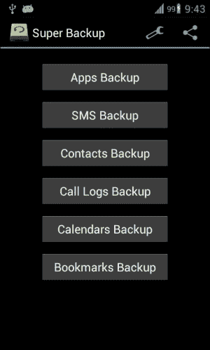
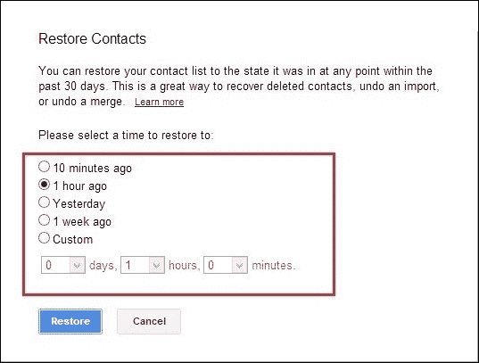

# 第六章。从安卓设备中恢复已删除的数据

到目前为止，您学到的提取和获取技术将帮助您访问各种详细信息，如通话记录、短信等。然而，这些技术并不能帮助我们查看从设备中删除的数据。在本章中，您将学习关于数据恢复技术，这将使您能够查看设备上已删除的数据。已删除的数据可能包含高度敏感的信息，因此，数据恢复是移动取证的一个关键方面。在本章中，我们将涵盖以下主题：

+   数据恢复概述

+   从 SD 卡中恢复删除的数据

+   从手机内部存储中恢复删除的数据

# 数据恢复概述

数据恢复是数字取证中的一个强大概念。当无法正常访问设备或 SD 卡时，它是从中检索已删除数据的过程。能够恢复用户删除的数据可以帮助解决几个民事和刑事案件。这是因为大多数被告只是删除设备上的细节，希望证据会被销毁。因此，在大多数刑事案件中，已删除的数据可能至关重要，因为它可能包含用户希望从安卓设备中删除的信息。例如，考虑一下从恐怖分子那里夺取了一部手机的情况。

知道他们删除了哪些项目不是最重要的吗？访问任何已删除的短信、图片、拨打的号码等可能非常重要，因为它们可能会透露大量敏感信息。从普通用户的角度来看，恢复已删除的数据通常指的是操作系统内置的解决方案，如 Windows 中的回收站。虽然可以从这些位置恢复数据，但由于用户意识的增强，这些选项通常不起作用。例如，在台式电脑上，人们现在在想要彻底从桌面上删除文件时使用*Shift* + *Delete*。同样，在移动环境中，用户知道应用程序提供的还原操作等。尽管如此，数据恢复技术允许取证人员访问从设备中删除的数据。

就安卓而言，可以恢复大部分已删除的数据，包括短信、图片、应用程序数据等。然而，重要的是以适当的方式扣押设备并遵循一定的程序，否则数据可能会被永久删除。为了确保已删除的数据不会永远丢失，建议您牢记以下几点：

+   扣押后不要对手机进行任何活动。已删除的数据仍然存在于设备上，直到空间被其他新数据所需。因此，手机必须*不*用于任何活动，以防数据被覆盖。

+   即使手机没有被使用，也会被覆盖。例如，一条新的短信会自动占用覆盖已删除数据的空间。此外，远程擦除命令也会擦除设备上的内容。为了防止这种情况发生，可以考虑将设备放置在法拉第袋中，如第一章*介绍安卓取证*中所述。因此，应该注意防止通过任何通信方式传递任何新消息或数据。

## 如何恢复已删除的文件？

当用户从设备中删除任何数据时，数据实际上并没有被抹去，而是继续存在于设备上。被删除的是指向这些数据的指针。所有文件系统都包含元数据，用于维护有关文件层次结构、文件名等的信息。删除实际上并没有抹去数据，而是删除了文件系统的元数据。仅删除元数据可以提高操作系统的性能；删除指针并标记空间为可用是一种非常快速的操作，与实际抹去所有数据相比。因此，当文本消息或其他文件被删除时，它们对用户来说只是不可见的。然而，只要它们没有被其他数据覆盖，这些文件仍然存在于设备上。

因此，在新数据进入并占据空间之前，可以恢复它们。

在安卓上恢复已删除的数据涉及两种情况：

+   从 SD 卡中恢复已删除的数据，如照片、视频等。

+   从设备的内部存储中恢复已删除的数据，如短信、拨号号码、浏览历史、应用程序数据、聊天记录等

以下部分介绍了从安卓设备的 SD 卡和内部存储中恢复已删除数据的技术。

# 从 SD 卡中恢复已删除的数据

SD 卡上的数据可以在法证调查期间揭示很多有用的信息。照片、视频、语音录音、应用程序数据等存储在 SD 卡上的事实使这一点更加重要。如前几章所述，安卓设备通常在 SD 卡上使用 FAT32 文件系统。这样做的主要原因是 FAT32 文件系统在包括 Windows、Linux 和 Mac OS X 在内的大多数操作系统中都得到了广泛支持。FAT32 格式化的驱动器上的最大文件大小约为 4GB。随着现在可用的分辨率越来越高，这个限制通常会被达到。如果可以将外部 SD 中删除的数据挂载为驱动器，那么恢复这些数据将会相当容易。

如果 SD 卡是可移动的，可以通过连接到计算机上的读卡器将其挂载为驱动器。在挂载时可以传输任何文件到 SD 卡。一些使用 USB 大容量存储的旧设备在通过 USB 电缆连接时也会将设备挂载为驱动器。如前所述，在取证中，为了确保原始证据不被修改，需要对磁盘进行物理映像，并且所有进一步的实验都是在映像本身上进行的。同样，在 SD 卡分析的情况下，需要对 SD 卡进行映像。成像的过程类似于第五章中解释的那样，*从安卓设备中物理提取数据*。完成成像后，我们会得到一个`dd`映像文件。在我们的示例中，我们将使用一个免费工具 FTK Imager。这个工具是一个成像实用程序，除了创建磁盘映像外，还可以用来探索磁盘映像的内容。

使用 FTK Imager 恢复 SD 卡内容需要以下步骤：

1.  启动 FTK Imager。单击菜单中的**File**，然后单击**Add Evidence Item**。

在 FTK Imager 中添加证据

1.  在**Select Source**对话框中选择**Image File**，然后单击**Next**。

1.  在**Select File**对话框中，浏览到下载`sdcard.dd`文件的位置。选择文件，然后单击**Finish**：

在 FTK Imager 中选择要分析的映像文件

1.  FTK Imager 的默认显示将在右下角的**View**窗格中显示 SD 卡的内容。您还可以单击左下窗格下方的**Properties**选项卡，查看磁盘映像的属性。

1.  在左窗格中，驱动器已打开。您可以通过单击**+**号来打开文件夹。当您突出显示一个文件夹时，其内容将显示在右窗格中。选择文件后，其内容将显示在底窗格中。

1.  如下图所示，已删除的文件的图标上会有一个红色叉叉：

已删除的文件上显示红色叉叉图标

1.  要导出文件，请右键单击包含图片的文件，然后选择**导出文件**：

在 FTK Imager 中导出已删除的文件

有时，只有文件的片段是可恢复的。这个文件片段无法直接读取或查看。在这种情况下，我们需要查看未分配空间中的更多数据。可以使用 Carving 来从未分配空间中恢复数据。Winhex、Scalpel、Foremost 和 Photorec 是一些可以帮助您做到这一点的工具。大多数最新的 Android 设备不作为大容量存储器挂载。这是因为这些设备不支持 USB 大容量存储，而是使用 MTP 或 PTP 协议。使用 USB 大容量存储时，计算机需要对存储器进行独占访问。换句话说，当连接到工作站时，外部存储器需要完全断开与 Android 操作系统的连接。这会导致与移动应用程序相关的其他一些复杂性。当 Android 设备使用 MTP 时，它会显示为计算机的媒体设备，而不是可移动存储，如下图所示：

在 Windows 的可移动设备下显示的 Android 设备

然而，普通的数据恢复工具需要挂载驱动器才能执行扫描，尽管这不是推荐的过程，因为这可能会导致对设备的更改。因此，大多数使用 MTP/PTP 的最新设备不被视为挂载驱动器。因此，传统的适用于计算机的数据恢复工具在这些设备上无法使用。

出于前面提到的原因，当设备使用 MTP/PTP 并且未作为驱动器挂载时，可以通过某些需要打开 USB 调试选项的特定于 Android 的数据恢复工具来进行恢复。市面上几乎所有的 Android 数据恢复工具都需要您启用 USB 调试，以便在开始 Android 数据恢复之前识别您的设备和 SD 卡。此外，这些工具只能在已 root 的设备上使用。现在我们将看看如何从 Android 设备的内部存储器中恢复已删除的数据。

# 从内部存储器中恢复删除的数据

大多数分析工具不支持从 Android 内部存储器中恢复已删除的文件，例如应用程序数据等。这主要有两个原因。首先，与 SD 卡中使用的常见文件系统不同，内部存储器使用的文件系统可能无法被取证工具识别和挂载。其次，除非手机已 root，否则取证人员无法访问 Android 手机的内部存储器的原始分区。以下是取证人员在尝试从 Android 设备的内部存储器中恢复数据时可能遇到的其他问题：

+   要访问内部存储器，您可以尝试对手机进行 root。但是，root 过程可能涉及向`/data`分区写入一些数据。这个过程可能会覆盖设备上的有价值的数据。

+   与 SD 卡不同，这里的内部文件系统不是 FAT32（这是法匹配的文件系统）。内部文件系统可能是 YAFFS2（在旧设备中）、EXT3、EXT4、RFS 或专为在 Android 上运行而构建的其他文件系统。因此，许多专为 Windows 文件系统设计的恢复工具将无法使用。

+   安卓设备上的应用程序数据通常以 SQLite 格式存储。虽然大多数取证工具提供对数据库文件的访问，但可能需要将其导出并在本地浏览器中查看。取证人员必须检查原始数据，以确保取证工具没有忽略已删除的数据。

因此，从安卓设备的内部存储器中恢复已删除的数据是困难的，但并非不可能。安卓设备的内部存储器保存了大部分用户数据以及您调查的可能关键。如前所述，设备必须被 root 才能访问原始分区。需要注意的是，市面上大多数安卓恢复工具并未强调它们只能在 root 手机上运行。硬件解决方案，如 UFED 和 XRY，完全能够从内部存储器以及 SD 卡中恢复已删除的数据。现在让我们看看如何从安卓手机中恢复已删除的数据。

## 通过解析 SQLite 文件恢复已删除的数据

安卓中大多数应用程序数据都存储在 SQLite 文件中。与短信、电子邮件和大多数应用程序数据相关的数据都存储在 SQLite 文件中。SQLite 数据库可以在数据库本身内部存储已删除的数据。用户标记为删除的文件不再出现在活动的 SQLite 数据库文件中。因此，通过分析这些 SQLite 文件，可以恢复已删除的数据，如短信、联系人等。SQLite 页面中有两个区域可能包含已删除的数据：未分配的块和空闲块。大多数恢复已删除数据的商业工具会扫描 SQLite 页面的未分配块和空闲块。可以使用可用的取证工具，如 Oxygen Forensics SQLite Viewer 来解析已删除的数据。SQLite Viewer 的试用版可以用于此目的。但是，您可以恢复的数据量存在一定的限制。

在我们的示例中，我们将从安卓设备中恢复已删除的短信。从安卓手机中恢复已删除的短信是设备取证分析中经常被要求的一部分，主要是因为这是最流行的通信形式。有不同的方法可以从安卓设备中恢复已删除的短信。然而，就通过解析 SQLite 文件进行恢复而言，我们需要了解消息在设备上的存储位置。在第四章中，*从安卓设备逻辑提取数据*，我们解释了安卓设备上存储用户数据的重要位置。以下是一个快速回顾：

+   每个应用程序都将其数据存储在`/data/data`文件夹中（同样，这需要 root 权限才能获取数据）。

+   `/data/data/com.android.providers.telephony/databases`中的文件包含有关短信/MMS 的详细信息

通过检查存储在`/data/data/com.android.providers.telephony/databases`中的名为 mmssms.db 的 SQLite 数据库文件，可以恢复已删除的短信。需要以下步骤：

+   提取 SMS 数据库 SQLite 文件（`mmssms.db`）。这可以通过逻辑数据提取技术来完成，这些技术在第四章中有所介绍，*从安卓设备逻辑提取数据*。

+   一旦文件被提取到本地机器，您可以使用可用的工具，如 Cellebrite。这些工具可能会自动提取已删除的细节。您还可以使用十六进制查看器或 SQLite 查看器手动检查碎片，例如 Oxygen Forensics SQLite Viewer。

+   查看已删除的数据的一种方法是单击 Oxygen Forensics SQLite Viewer 中的**包含已删除数据的块**选项卡，如下面的屏幕截图所示（引用自[`az4n6.blogspot.in/2013/02/finding-and-reverse-engineering-deleted_1865.html`](http://az4n6.blogspot.in/2013/02/finding-and-reverse-engineering-deleted_1865.html)）：

在 Oxygen Forensics SQLite Viewer 中显示的已删除数据

您还可以尝试可用的开源 Python 脚本（[`az4n6.blogspot.in/2013/11/python-parser-to-recover-deleted-sqlite.html`](http://az4n6.blogspot.in/2013/11/python-parser-to-recover-deleted-sqlite.html)）来解析 SQLite 文件以恢复已删除的记录。

## 通过文件切割技术恢复已删除的数据

**文件切割**是取证中非常有用的方法，因为它允许恢复以进行分析的隐藏或已删除的数据。简而言之，文件切割是在没有文件系统元数据的情况下从片段中重新组装文件的过程。在文件切割中，会在二进制数据中搜索指定的文件类型并提取它们，以创建分区或整个磁盘的取证镜像。文件切割仅基于文件结构和内容从驱动器的未分配空间中恢复文件，而不需要匹配的文件系统元数据。

### 注意

未分配空间是指在文件系统结构中没有任何指针的驱动器部分。

可以通过扫描磁盘的原始字节并重新组装它们来恢复或重建文件。这可以通过检查文件的标头（前几个字节）和页脚（最后几个字节）来完成。

文件切割方法根据所使用的基本技术进行分类。标头-页脚切割方法依赖于根据标头和页脚信息恢复文件。例如，JPEG 文件以 0xffd8 开头，以 0xffd9 结尾。标头和页脚的位置被识别出来，然后在这两个端点之间的所有内容都被切割。类似地，文件结构切割方法基于文件的内部布局来重建文件。然而，传统的文件切割技术，如我们已经解释的那些，如果数据是分段的，则可能无法工作。为了克服这一点，新技术，如智能切割，使用几种流行文件系统的分段特性来恢复数据。

一旦手机被镜像，就可以使用**Scalpel**等工具进行分析。 Scalpel 是一个强大的开源实用程序，用于切割文件。该工具分析块数据库存储并识别已删除的文件并恢复它们。 Scalpel 与文件系统无关，并且已知可以在各种文件系统上工作，包括 FAT，NTFS，EXT2，EXT3，HFS 等。以下步骤解释了如何在 Ubuntu 工作站上使用 Scalpel 恢复文件：

1.  使用`sudo apt-get install scalpel`命令在 Ubuntu 工作站上安装 Scalpel。

1.  `/etc/scalpel`目录中的`scalpel.conf`文件包含有关支持的文件类型的信息，如下面的屏幕截图所示：

Scalpel 配置文件

为了包括与 Android 相关的文件，需要修改此文件。可以从[`asecuritysite.com/scalpel.conf.txt`](https://asecuritysite.com/scalpel.conf.txt)下载示例`scalpel.conf`文件。您还可以取消注释文件并保存`conf`文件以选择所需的文件类型。完成后，用下载的文件替换原始的`conf`文件。

Scalpel 需要与正在检查的`dd`镜像上的前述配置文件一起运行。您可以使用以下截图中显示的命令运行该工具，输入配置文件和`dd`文件。运行命令后，该工具开始雕刻文件并相应地构建它们。

在图像文件上运行 Scalpel 工具

前述命令中指定的输出文件夹现在包含基于文件类型的文件夹列表。每种文件类型都包含基于文件夹名称的数据。例如，`jpg 2-0`包含与`.jpg`扩展名相关的恢复文件：

Scalpel 工具的输出

如前所示的截图，每个文件夹包含从 Android 设备中恢复的数据，如图像、`.pdf`文件、`.zip`文件等。虽然有些图片完全恢复了，但有些并没有完全恢复，如下图所示：

使用 Scalpel 工具恢复的数据

诸如 DiskDigger 之类的应用程序可以安装在 Android 设备上，从内部存储器和 SD 卡中恢复不同类型的文件。诸如 DiskDigger 之类的应用程序包括对`.jpg`文件、`.mp3`和`.wav`音频、`.mp4`和`.3gp`视频、原始相机格式、Microsoft Office 文件（`.doc`、`.xls`和`.ppt`）等的支持。然而，如前所述，该应用程序需要在 Android 设备上具有 root 权限才能从内部存储器中恢复内容。因此，文件雕刻技术在从设备的内部存储器中恢复重要的已删除文件中发挥着非常重要的作用。

# 分析备份

还建议您检查设备是否安装了任何备份应用程序或文件。Android 的初始版本不包括用户备份其个人数据的机制。因此，用户广泛使用了几个备份应用程序。使用这些应用程序，用户可以将其数据备份到 SD 卡或云端。例如，`Super Backup`应用程序包含了备份通话记录、联系人、短信等选项，如下截图所示：

Super Backup Android 应用

在检测到备份应用程序时，法庭鉴定人员必须尝试确定数据存储在何处。备份中保存的数据可能包含重要信息，因此在设备上寻找任何第三方备份应用程序可能非常有帮助。

您还可以通过设备上配置的 Google 账户使用**恢复联系人**选项来恢复联系人。如果设备的用户之前使用 Android 中可用的**同步设置**选项同步了他们的联系人，这将起作用。此选项会同步联系人和其他详细信息，并将它们存储在云端。具有合法权限或适当同意的法庭鉴定人员可以恢复已删除的联系人，如果他们能够访问设备上配置的 Google 账户。一旦访问了该账户，执行以下步骤来恢复数据：

1.  登录 Gmail 账户。

1.  点击左上角的**Gmail**，选择**联系人**，如下截图所示：

Gmail 中的联系人菜单

1.  点击**更多**，位于联系人列表上方。

1.  点击**恢复联系人**，将出现以下屏幕：

恢复联系人对话框

1.  使用这种技术，您可以将联系人列表恢复到过去 30 天内的任何时间点的状态。

# 总结

数据恢复是从设备中检索已删除数据的过程。因此，这是取证中一个非常重要的概念。在本章中，我们看到了从 SD 卡和内部存储器中恢复已删除数据的各种技术。虽然从可移动 SD 卡中恢复数据很容易，但从内部存储器中恢复数据涉及一些复杂性。SQLite 文件解析和文件刻录技术可以帮助取证分析人员恢复安卓设备内部存储器中存在的已删除项目。建议检查设备上是否安装了任何备份应用程序，因为这样可以节省时间和精力。

在下一章中，我们将尝试了解对安卓应用程序进行取证分析的视角。
