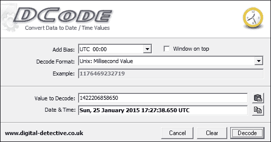
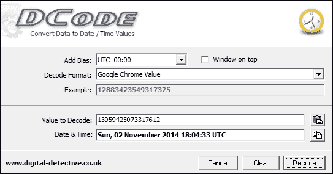
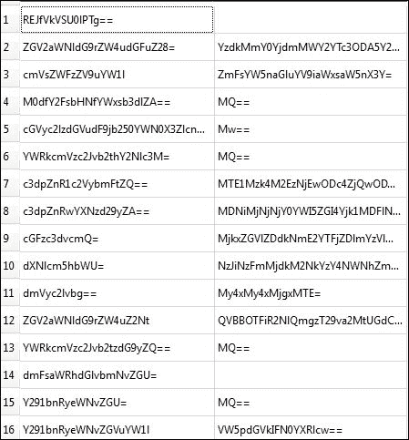
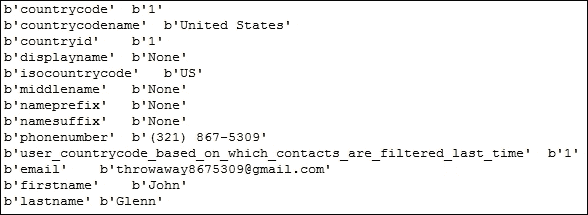
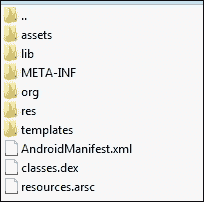

# 第七章：Android 应用程序取证分析

本章将介绍应用程序分析，使用免费和开源工具。它将重点分析使用第四章和第五章中详细介绍的任何逻辑或物理技术恢复的数据。它还将大量依赖于第二章中讨论的存储方法。我们将看到第二章中描述的文件层次结构中各个位置的众多 SQLite 数据库、XML 文件和其他文件类型。在本章结束时，您应该熟悉以下主题：

+   应用程序分析概述：

+   联系人/通话/短信

+   Wi-Fi

+   用户词典

+   列出了第三方应用程序和流行应用程序用于存储和混淆数据的各种方法。

+   纯文本

+   时代时间

+   WebKit 时间

+   错误命名文件扩展名

+   儒略日期

+   Base64 编码

+   加密

+   基本隐写术

+   SQLCipher

+   基本应用程序逆向工程

# 应用程序分析

对应用程序进行取证分析既是一门艺术，也是一门科学。应用程序可以存储或混淆数据的方式多种多样。甚至同一应用程序的不同版本可能以不同的方式存储相同的数据。当开发者选择如何存储他们的数据时，他们实际上只受到他们的想象力（和 Android 平台的限制）的限制。由于这些因素，应用程序分析是一个不断变化的目标。一天使用的方法可能在第二天就完全无关紧要了。

对应用程序进行取证分析的最终目标始终是相同的，即了解应用程序的用途并找到用户数据。

在本章中，我们将查看许多常见应用程序的当前版本。由于应用程序可以通过更新改变它们存储数据的方式，因此本章中的内容并不是分析该应用程序的权威指南。相反，我们将查看广泛的应用程序范围，展示应用程序用于存储数据的各种不同方法。在大多数情况下，我们将查看非常常见的应用程序（从 Google Play 下载了数百万次），除非查看一个不常见的应用程序可以揭示存储数据的有趣新方法。

### 注意

虽然我们在填充测试数据时尽力全面地使用了每个应用程序的功能，但有可能并没有使用每个应用程序的每个功能。以下部分中分析的应用程序是如何检查该应用程序的数据的示例，但可能并不包括可能恢复的每一小部分数据。

我们所有的测试都使用了每个应用程序的默认设置，就好像应用程序是下载并立即使用的一样。不同的设置可能会影响存储的数据以及设备上数据的位置。

此外，这项分析是在运行 Android 5.0.1 的 Nexus 5 上进行的。某些制造商，如 HTC 和三星，可能提供复制这些应用程序功能的应用程序（例如访问 Facebook 的主屏幕小部件）。这些应用程序可能会将数据存储在不同的位置。我们分析的一些文件可能在其他版本上不存在。

## 为什么要进行应用程序分析？

首先，即使是标准的手机功能，如联系人、通话和短信，也是通过 Android 设备上的应用程序完成的。因此，即使获取基本数据也需要我们分析一个应用程序。其次，一个人的应用程序使用情况可以告诉你很多关于他们的信息：他们去过哪里（以及何时去过），他们与谁交流过，甚至他们可能在未来计划做什么。

许多手机在出厂时都预装了 20 多个应用程序。雅虎在 2014 年的一项研究显示，用户平均安装了 95 个应用程序。尼尔森的一项研究显示，平均用户每月使用 26 个应用程序。鉴定人员无法真正知道这些应用程序中哪些可能包含对调查有用的信息，因此所有应用程序都必须进行分析。鉴定人员可能会忽略某些看起来没有多少有用数据的应用程序，比如游戏。然而，这是一个坏主意。许多流行的游戏，比如《Words with Friends》或《Clash of Clans》，都有内置的聊天功能，可能会提供有用的信息。接下来的分析将重点放在消息应用上，因为我们的经验表明这些应用在法证分析中往往是最有价值的。

## 本章的布局

对于我们检查的每个应用程序，我们将提供包名称、版本号（如果可能的话）和感兴趣的文件。例如：

包名称：`com.android.providers.contacts`

版本：默认版本，带有 Android 5.0.1（未在应用程序中列出）

感兴趣的文件：

+   `/files/`

+   `photos/`

所有应用程序默认都将其数据存储在`/data/data`目录中。如果应用程序在安装时请求了这个权限，它们也可以使用 SD 卡。包名称是`/data/data`目录中应用程序目录的名称。感兴趣的文件来自包名称的根目录（即前面示例中的`/data/data/com.android.providers.contacts/files/photos`）。SD 卡上数据的路径以`/sdcard`开头（即`/sdcard/com.facebook.orca`）。不要期望在应用程序的`/data/data`目录中找到以`/sdcard`开头的数据路径！

我们将首先查看一些谷歌的应用程序，因为这些应用程序预装在绝大多数设备上（尽管不一定）。然后，我们将查看可以在 Google Play 上找到的第三方应用程序。

# 确定安装了哪些应用程序

要查看设备上有哪些应用程序，鉴定人员可以导航到`/data/data`并运行`ls`命令。然而，这并不提供格式良好的数据，无法在法证报告中展示。我们建议您提取`/data/system/packages.list`文件。该文件列出了设备上每个应用程序的包名称和其数据的路径（如果设备上不存在此文件，则`adb shell pm list packages -f`命令是一个很好的替代方法）。例如，这是 Google Chrome 的一个条目（我们的测试设备上完整的文件包含了 120 个条目）：


### 注意

这是数据存储的第一种方法：纯文本。通常，我们会看到应用程序以纯文本形式存储数据，包括您意想不到的数据（比如密码）。

也许更有趣的是`/data/system/package-usage.list`文件，它显示了包（或应用程序）上次使用的时间。这并不完美；文件中显示的时间与我们上次使用应用程序的时间并不完全一致。似乎应用程序的更新或接收通知（即使用户没有查看）可能会影响时间。然而，它对用户最后访问的应用程序的一般指示是有用的：


如果你想知道前一行的时间在哪里，它是以 Linux 纪元时间的格式知道的。

## 理解 Linux 纪元时间

**Linux 纪元时间**，也称为 Unix 时间或 Posix 时间，存储为自 1970 年 1 月 1 日 UTC 午夜以来的秒数（或毫秒数）。10 位数表示秒数，而 13 位数表示毫秒数（至少对于可能在智能手机上找到的时间，自 2001 年以来，9 位数秒和 12 位数毫秒值就没有出现过）。

在上面的例子中，该值为`1422206858650`；Google Chrome 自 1970 年 1 月 1 日午夜以来已经使用了 10 亿 4220 万 6858 秒和 650 毫秒！别担心；我们也不知道那是什么日期/时间。有许多可供下载的脚本和工具可用于将此值转换为人类可读格式。我们更喜欢免费工具**DCode**，可以在[`www.digital-detective.net/digital-forensic-software/free-tools/`](http://www.digital-detective.net/digital-forensic-software/free-tools/)找到。

在 DCode 中，只需从下拉列表中选择**Unix：毫秒值**，在**解码值**字段中输入值，然后单击**解码**：



**添加偏差**字段可以选择将时间转换为所需的时区。

另外，还有一个非常有用的在线时代转换器，网址为[`www.epochconverter.com/`](http://www.epochconverter.com/)。

使用任一方法，我们可以看到 Google Chrome 实际上是在 2015 年 1 月 25 日 17:27:38.650 UTC 最后使用的。Linux 时代时间经常用于 Android 设备上存储日期/时间值，并将在我们的应用程序分析中反复出现。

### 注意

这是第二种数据存储方法：Linux 时代时间。

# Wi-Fi 分析

Wi-Fi 在技术上不是一个应用程序（这可以从它没有从`/data/data`中恢复出来来证明），但它是一个宝贵的数据来源，应该被检查。因此，我们在这里简要讨论一下。Wi-Fi 连接数据可以在`/data/misc/wifi/wpa_supplicant.conf`中找到。`wpa_supplicant.conf`文件包含了用户选择自动连接的访问点列表（当连接到新的访问点时，默认设置为自动连接）。用户通过设备设置“忘记”的访问点将不会显示。如果访问点需要密码，密码也会以明文存储在文件中。在下面的例子中，`NETGEAR60`访问点需要密码（`ancientshoe601`），而`hhonors`不需要：


### 注意

在这个文件中存在**服务集标识符**（SSID）并不意味着这个设备连接到了该访问点。这些设置保存在用户的 Google 账户中，并在设置该账户时添加到设备中。检查员只能得出用户从某个 Android 设备连接到这些访问点的结论，但不一定是正在检查的设备。

# 联系人/通话分析

联系人和通话记录存储在同一个数据库中。联系人不一定要由用户明确添加。当通过 Gmail 发送电子邮件时，或者在 Google+上添加一个人，或者可能还有其他许多方式时，它们可能会被自动填充。

包名：`com.android.providers.contacts`

版本：默认版本与 Android 5.0.1（未在应用程序中列出）

感兴趣的文件：

+   `/files/`

+   `photos/`

+   `profile/`

+   `/databases/`

+   `contacts2.db`

`files`目录包含了用户联系人的`photos`目录中的照片和用户的个人资料照片在`profile`目录中。

`contacts2.db`数据库包含了设备上所有通话记录和用户 Google 账户中的所有联系人的信息。它包含以下表格：

| 表格 | 描述 |
| --- | --- |
| `accounts` | 这显示了设备上具有访问联系人列表权限的账户。至少一个账户将显示用户的 Google 账户电子邮件地址。此列表可能包括已安装的第三方应用程序，这些应用程序具有访问联系人列表的权限（我们将在 Tango、Viber 和 WhatsApp 部分看到这一点）。 |

| `calls` | 这包含有关设备的所有呼入和呼出电话的信息。`number`列显示远程用户的电话号码，无论是发送还是接收的呼叫。`date`列是呼叫的日期/时间，以 Linux 时代格式存储。`duration`列是呼叫的长度，以秒为单位。`type`列指示呼叫的类型：

+   `1` = 收到的

+   `2` = 发出的

+   `3` = 未接

`name`列显示远程用户的名称，如果该号码存储在联系人列表中。`geocoded_location`列显示基于区号（对于美国号码）或国家代码的电话号码的位置。

| `contacts` | 这包含联系人的部分信息（更多数据可以在`raw_contacts`表中找到）。`name_raw_contact_id`值对应于`raw_contacts`表中的`_id`值。`photo_file_id`值对应于`/files/photos`目录中找到的文件名。`times_contacted`和`last_time_contacted`列显示从设备呼叫或接听该联系人电话的次数，以及最后一次呼叫的时间（Linux 时代格式）。 |
| --- | --- |
| `data` | 该表包含每个联系人的所有信息：电子邮件地址、电话号码等。`raw_contact_id`列是每个联系人的唯一值，可以与`raw_contact_id`中的`_id`值相关联以识别联系人。请注意，每个联系人可能有多行，如相同的`raw_contact_id`值所示。有 15 个数据列（`data1`到`data15`）包含有关联系人的一些信息，但没有可辨认的模式。同一列可能包含联系人姓名、电子邮件地址、Google+个人资料等。`data14`列中的值与`/files/profiles`路径中图像的文件名相关联。`data15`列包含联系人个人资料照片的缩略图。 |
| `deleted_contacts` | 这包含`contact_id`值和以 Linux 时代格式的`deleted_contact_timestamp`。然而，这不能与任何其他表相关联以确定已删除的联系人的名称。可能可以使用第六章中的已删除数据恢复技术来恢复联系人名称。`contact_id`值对应于`raw_contacts`表中的`contact_id`列。 |
| `groups` | 这显示联系人列表中的组，可以是自动生成的或用户创建的。组的标题是组的名称。似乎没有办法识别每个组中的用户。 |
| `raw_contacts` | 这包含联系人列表中每个联系人的所有信息。`display_name`列显示联系人的名称，如果可用。要确定联系人的电话号码、电子邮件地址或其他信息，必须将`_id`列的值与数据表中的`raw_contact_id`值匹配。`sync3`列显示时间戳，但根据我们的测试，不能假定这是联系人添加的时间。我们有一些几年前的联系人在本月同步了。`times_contacted`和`last_time_contacted`列仅适用于电话呼叫；向联系人发送电子邮件或短信不会增加这些值。我们无法确定任何方法来确定联系人是通过电话界面添加的，还是作为 Google+上的朋友添加的，或者是通过其他方法添加的。 |

# 短信/彩信分析

短信和彩信消息存储在同一个数据库中。根据我们的经验，无论使用何种应用程序发送短信/彩信（即，通过 Google Hangouts 发送短信将填充此数据库，而不是在此处检查的 Hangouts 数据库），都会使用此数据库。但是，第三方应用程序也可能将数据记录在其自己的数据库中。

包名称：`com.android.providers.telephony`

版本：Android 5.0.1 的默认版本（在应用程序中未列出）

感兴趣的文件：

+   `/app_parts`

+   `/databases/`

+   `mmssms.db`

+   `telephony.db`

`app_parts`目录包含了作为彩信发送和接收的附件。

`telephony.db`数据库很小，但包含了一个潜在有用的信息来源。telephony.db 中的表描述如下：

| 表 | 描述 |
| --- | --- |
| `siminfo` | 这包含了设备中使用过的所有 SIM 卡的历史数据，包括 ICCID、电话号码（如果存储在 SIM 卡上）和**移动国家码**（MCC）/ **移动网络码**（MNC），可以用来识别网络提供商。 |

`mmssms.db`数据库包含了关于短信和彩信消息的所有信息，如下表所述：

| 表 | 描述 |
| --- | --- |
| `part` | 这包含了附加到彩信的文件的信息。每条消息至少有两个部分：一个 SMIL 头和附件。这可以在`mid`和`ct`列中看到，以及附加的文件类型。`_data`列提供了在设备上找到文件的路径。 |
| `pdu` | 这包含了每条彩信的元数据。`date`列标识了消息发送或接收的时间，以 Linux 纪元格式表示。`_id`列似乎对应于 part 列中的 mid 值；对这些值进行对应将显示特定图像发送的时间。`msg_box`列显示消息的方向（`1` = 接收，`2` = 发送）。 |
| `sms` | 这包含了每条短信的元数据（不包括 MMS 信息）。`address`列显示远程用户的电话号码，无论是发送还是接收消息。`person`列包含一个值，可以在`contacts2.db`数据库中查找，并与`data`表中的`raw_contact_id`对应。如果是发送消息或远程用户不在联系人列表中，`person`列将为空。`date`列显示消息发送的时间戳，以 Linux 纪元格式表示。`type`列显示消息的方向（`1` = 接收，`2` = 发送）。`body`列显示消息的内容。`seen`列指示消息是否已读（`0` = 未读，`1` = 已读）；所有发送的消息都将标记为未读。 |
| `words`，`words_content`，`words_segdir` | 这似乎包含了重复的消息内容；这个表的确切目的不清楚。 |

# 用户词典分析

**用户词典**是调查员的一个难以置信的数据来源。虽然它不一定是一个独立的应用程序，但它的数据存储在`/data/data`目录中，就好像它是一个独立的应用程序一样。用户词典在用户输入一个未被识别的单词并选择保存该单词以避免被自动更正时被填充。有趣的是，我们的测试设备上包含了许多我们从未在设备上输入或保存过的单词。这些数据似乎与用户的 Google 账户同步，并在多个设备上持久存在。从账户同步的单词按字母顺序添加到数据库顶部，而之后手动添加的单词则按添加顺序填充到底部。

包名：`com.android.providers.userdictionary`

版本：Android 5.0.1 的默认版本（在应用程序中未列出）

感兴趣的文件：

+   `/databases/user_dict.db`

用户词典中的表描述如下：

| 表 | 描述 |
| --- | --- |
| `words` | `word`列包含了添加到词典中的单词。`frequency`列可能应该被忽略；无论我们使用该单词的次数如何，它都显示相同的值（250）。 |

以下是用户词典的示例条目：


# Gmail 分析

Gmail 是谷歌提供的电子邮件服务。在首次设置设备时，通常会要求使用 Gmail 帐户，但并非必需。

包名称：`com.google.android.gm`

版本：默认版本与 Android 5.0.1（未在应用程序中列出）

感兴趣的文件：

+   `/cache`

+   `/databases/`

+   `mailstore.<username>@gmail.com.db`

+   `databases/suggestions.db`

+   `/shared_prefs/`

+   `MailAppProvider.xml`

+   `Gmail.xml`

+   `UnifiedEmail.xml`

应用文件夹中的`/cache`目录包含最近附加到电子邮件中的文件，包括已发送和已接收的文件。即使用户没有明确下载这些附件，它们也会保存在这里。

`mailstore.<username>@gmail.com.db`文件包含各种有用的信息。数据库中的有趣表包括以下内容：

| 表 | 描述 |
| --- | --- |
| `附件` | 这包含有关附件的信息，包括它们在设备上的大小和文件路径（前面提到的`/cache`目录）。每行还包含一个`messages_conversation`值。这个值可以与`conversations`表进行比较，以将附件与其所包含的电子邮件相关联。`filename`列标识了文件在设备上的路径。 |
| `对话` | 在旧版本中，可以恢复整个电子邮件对话。在当前版本中，Google 不再在设备上存储整个对话，可能是因为假定用户将有数据连接来下载完整的对话。相反，只能恢复主题行和“片段”。片段大致是在应用程序的通知栏或收件箱屏幕上显示的文本量。`fromCompact`列标识了发件人和其他收件人。 |

`suggestions.db`数据库包含在应用程序中搜索的术语。

`shared_prefs`目录中的 XML 文件可以确认与应用程序一起使用的帐户。`Gmail.xml`包含了另一个与我们的测试帐户关联但从未与应用程序一起使用的帐户。`UnifiedEmail.xml`包含了给该帐户发送电子邮件的发件人的部分列表，但没有明显的原因。列表中有许多发件人，但远非全部，并且它们没有按特定顺序出现。`Gmail.xml`还包含了应用程序上次同步的时间，以 Linux 纪元格式表示。

# Google Chrome 分析

Google Chrome 是一款网络浏览器，也是 Nexus 和许多其他设备上的默认浏览器。设备上的 Chrome 数据有些独特，因为它不仅包含来自设备的数据，还包含用户在所有登录到 Chrome 的设备上的数据。这意味着用户在桌面电脑上浏览的数据很可能会在他们手机的数据库中找到。然而，这也导致了大量的数据需要鉴定人员整理，但这是一个好问题。

包名称：`com.android.chrome`

版本：40.0.2214.89

感兴趣的文件：

+   `/app_chrome/Default/`

+   `Sync Data/SyncData.sqlite3`

+   `书签`

+   `Cookies`

+   `Google Profile Picture.png`

+   `历史`

+   `登录数据`

+   `偏好设置`

+   `热门网站`

+   `Web 数据`

+   `/app_ChromeDocumentActivity/`

`/app_chrome/Default`文件夹中列出的所有文件，除了一个`.png`文件、书签和偏好设置之外，都是 SQLite 数据库，尽管没有文件扩展名。

`SyncData.sqlite3`数据库很有趣，因为它似乎包含了从用户设备同步到谷歌服务器的数据列表。我们的数据库中，一个活跃的 Chrome 账户包含了超过 2700 条条目，包括浏览历史、自动填充表单信息、密码和书签。举例来说，我们能够找到其中一位作者从 2012 年搜索过的一个词，如下截图所示。这很有趣，因为用户是在 2014 年购买了这部手机，但之前的数据仍然同步到了设备上。


| 表 | 描述 |
| --- | --- |
| `metas` | 数据库中有许多列包含时间戳，在我们的数据库中，它们似乎都是每个条目的时间相差不到一秒。目前还不清楚哪个时间对应于条目被添加的确切时间，但所有时间大致对应于用户账户中的活动时间。具有时间戳的列包括`mtime`、`server_mtime`、`ctime`、`server_ctime`、`base_version`和`server_version`。`non_unique_name`和`server_non_unique_name`列显示了被同步的内容。例如，我们的一个条目显示：`autofill_entry` &#124; `LNAME` &#124; `Tindall`这些列中的其他条目包括访问过的 URL、密码，甚至是账户使用过的设备。 |

`Bookmarks`文件是一个纯文本文件，包含了与账户同步的书签信息。它包括了每个被书签的网站名称、URL 以及被书签的日期/时间，以我们尚未遇到的格式存储：WebKit 格式。要解码这些值，请参阅解码 WebKit 时间格式部分。

### 注意

这是第三种数据存储方法：WebKit 时间格式。

`Cookies`数据库存储了访问过的网站的 cookie 信息（取决于网站和 Chrome 设置），包括网站名称、cookie 保存日期以及上次访问 cookie 的时间，以 WebKit 时间格式显示。

`Google Profile Picture.PNG`文件是用户的个人资料图片。

`History`数据库包含了用户的网络历史，存储在以下表中：

| 表 | 描述 |
| --- | --- |
| `keyword_search_terms` | 这包含了在 Chrome 中使用 Google 搜索的搜索词列表。`term`列显示了搜索的内容，而`url_id`可以与 URL 表相关联，以查看搜索的时间。 |
| `segments` | 这个表包含了一些被访问过的 URL，但并非全部。目前还不清楚是什么导致数据被输入到这个表中。 |
| `urls` | 这包含了 Google 账户在所有设备上的浏览历史，而不仅仅是从数据库中提取的设备。我们的历史记录大约可以追溯到 3 个月前，包含了 494 条记录，尽管 Google 账户的历史要比这更久，我们在那段时间内肯定访问了超过 494 个页面。目前还不清楚是什么导致了这种差异，或者决定了历史记录的截止日期。`id`列是表中每行的唯一值。`url`和`title`列包含了访问的 URL 和页面名称。`visit_count`列似乎是 URL 被访问的准确次数。`typed_count`列的值始终等于或小于`visit_count`列的值，但我们不确定它具体表示什么。对于一些网站，这种差异可以通过考虑通过书签访问网站的次数来解释，而不是直接输入 URL，但并非所有情况都适用。`last_visit_time`列是 URL 最后被访问的时间，以 WebKit 时间格式显示。 |
| `访问` | 这包含了 urls 表中每次访问的行；此表中对于一个 URL 的条目数量对应于`url`表中的`visit_count`列的值。`url`列的值与`url`表中的`id`列的值相关联。每次访问的时间可以在`visit_time`列中找到，同样以 WebKit 时间格式。 |

`登录数据`数据库包含在 Chrome 中保存的登录信息，并在使用 Google 账户的所有设备上同步。

| 表 | 描述 |
| --- | --- |
| `logins` | `origin_url`是用户最初访问的网站，`action_url`是如果用户被重定向到登录页面，则是登录页面的 URL。如果访问的第一个页面是登录页面，则两个 URL 相同。`username_value`和`password_value`列显示了以明文存储的该 URL 的用户名和密码；不，我们不会包含我们数据库的截图！`创建日期`是登录信息首次保存的日期/时间，以 WebKit 时间格式存储。`同步日期`列是登录数据在本地设备上同步的日期/时间，同样以 WebKit 时间格式。`使用次数`列显示了 Chrome 保存后自动填充登录信息的次数（不包括第一次登录，因此有些值可能为 0）。 |

`首选项文件`是一个文本文件，包含用户使用 Chrome 登录的 Google 账户。

`热门网站`数据库包含最常访问的网站，因为这些网站在 Chrome 打开时默认显示。

`Web Data`数据库包含用户保存的信息，以便在网站上自动填写表单。

| 表 | 描述 |
| --- | --- |
| `autofill` | 这包含基于网页的表单上的字段列表和用户输入的值。`名称`列显示了用户输入的字段名称，而`值`列显示了用户输入的内容。`创建日期`和`最后使用日期`列是不言自明的，并以 Linux 纪元格式存储。请注意，虽然这可能是非常有价值的信息（例如，我们的数据库中包含了一些其他地方没有存储的用户名），但可用的上下文信息非常少。信息未存储的 URL 可能无法确定。 |
| `autofill_profile_emails` | 这包含用户保存的所有值，用于自动填充网页表单上的`电子邮件`字段。 |
| `autofill_profile_names` | 这包含用户保存的所有值，用于自动填充网页表单上的`名`、`中间名`、`姓`和`全名`字段。 |
| `autofill_profile_phonwa` | 这包含用户保存的所有值，用于自动填充网页表单上的`电话号码`字段。 |
| `autofill_profiles` | 这包含用户保存的所有值，用于自动填充网页表单上的地址信息字段。 |

`/app_ChromeDocumentActivity`/目录包含了在设备上最近打开的标签的历史记录文件。可以从这些文件中恢复被访问的网站的 URL。

## 解码 WebKit 时间格式

以下是一个样本 WebKit 时间值：`13066077007826684`。

乍一看，它似乎与 Linux 纪元时间非常相似，只是稍微长一些（也许它存储的是纳秒？）。试图将其解码为纪元时间的审查员将得到 2011 年 5 月的日期，这可能看起来准确，但实际上比正确日期晚了几年！

WebKit 时间是一个纪元时间。它只是以不同的起始点为基础，而不是 Linux 纪元时间。WebKit 纪元时间是自 1601 年 1 月 1 日午夜以来的微秒数。是的，我们说的是 1601 年。一旦我们知道纪元开始的地方，转换为可识别的格式就变成了一个数学问题。然而，再一次，我们宁愿使用 DCode。

这一次，在 DCode 中，选择**解码格式**下拉选择中的 Google Chrome 值，然后单击**解码**：



我们示例的实际值是 2014 年 11 月 2 日 UTC 时间 18:04:33。这与我们认为的 Linux 纪元时间值有很大不同！

# Google Maps 分析

Maps 是由 Google 提供的地图/导航应用程序。

包名称：`com.google.android.apps.maps`

版本：9.2.0（#902013124）

感兴趣的文件：

+   `/cache/http/`

+   `/databases/`

+   `gmm_myplaces.db`

+   `gmm_storage.db`

`/cache/http`文件夹中包含许多文件，具有`.0`和`.1`文件扩展名。`.0`文件是对应`.1`文件的网络请求。`.1`文件主要是图像，可以通过适当更改其扩展名来查看。在我们的测试设备上，它们要么是`.jpg`文件，要么是`.png`文件。这些文件主要是用户附近的位置，不一定是用户专门搜索的位置。

### 注意

这是第四种数据存储方法：错误命名的文件扩展名。

始终验证无法打开的文件的标头，或使用 EnCase 等自动工具检测不匹配的标头/文件扩展名。验证文件签名的一个很好的资源是[`www.garykessler.net/library/file_sigs.html`](http://www.garykessler.net/library/file_sigs.html)。

`gmm_myplaces.db`数据库包含了用户保存的位置。这个文件与用户的 Google 帐户同步，因此这些位置不一定是使用应用程序保存的。

`gmm_storage.db`数据库包含了以下表中的搜索结果和导航到的位置：

| 表 | 描述 |
| --- | --- |
| `gmm_storage_table` | `_key_pri`列似乎标识了位置的类型。bundled 似乎是搜索结果，而`ArrivedAtPlacemark`标识了实际导航到的位置。`_data`列包含位置的地址。 |

# Google Hangouts 分析

**Hangouts**是由 Google 提供的聊天/SMS 应用程序。 Hangouts 是 Android 设备上的默认短信客户端。

包名称：`com.google.android.gm`

版本：Android 5.0.1 的默认版本（不在应用程序中列出）

感兴趣的文件：

+   `/cache/volleyCache/`

+   `/databases/babel#.db`（我们的设备上有 babel0.db 和 babel1.db）

+   `/shared_prefs/accounts.xml`

`cache`目录包含了之前在 Google Maps 示例中讨论的`.0`文件。这些文件包含了获取联系人的个人资料图片的 URL，以及文件中嵌入的`.jpg`。访问 URL 或从文件中提取`.jpg`将恢复联系人的图片。

`babel#.db`文件包含了所有的消息数据。在我们的测试设备上，`babel0.db`是空白的，`babel1.db`包含了活动帐户的所有数据。这个数据库中有许多值得关注的表：

| 表 | 描述 |
| --- | --- |
| `conversations` | 这包含对话数据。每次聊天都有一个唯一的`conversation_id`值。`latest_message_timestamp`列是最近聊天的时间，以 Linux 纪元格式表示。`generated_name`列列出了聊天中所有参与者的列表，减去设备上的帐户。`snippet_text`列是最近消息的内容；与 Gmail 一样，整个聊天并未存储在设备上。`latest_message_author_full_name`和`latest_message_author_first_name`列标识了`snippet_text`列的作者。`inviter_full_name`和`inviter_first_name`列标识了谁发起了对话。 |
| `dismissed_contacts` | 这里列出了曾经发送消息的前联系人的名称。这些在应用程序中标记为“隐藏联系人”。 |
| `messages` | 如预期的那样，这包含了每次对话的详细消息历史。`text`列包含消息的内容，`timestamp`列是 Linux 纪元格式的日期/时间。`remote_url`列再次是一个 URL，用于检索消息中共享的图像。同样，它可以公开访问。`author_chat_id`是一个值，可以与参与者表相关联，以识别每条消息的作者。 |
| `participants` | 这包含了与之聊天的人的列表。它包括全名、个人资料图片 URL 和`chat_id`值，用于在消息表中识别该人。 |

`accounts.xml`文件有一个`phone_verification`字段，其中包含与 Google 帐户关联的电话号码，当 Hangouts 配置为发送短信时。这可能非常有用，因为通常很难获得设备的电话号码，因为它通常不存储在设备上。

# 谷歌 Keep 分析

Keep 是谷歌提供的一款笔记应用。它也可以用来设置提醒，无论是在特定的日期/时间还是当用户在指定的位置。

包名称：`com.google.android.keep`

版本：默认版本为 Android 5.0.1（未在应用程序中列出）

感兴趣的文件：

+   `/databases/keep.db`

+   `/files/1/image/original`

`files/1/image/original`目录包含使用该应用程序拍摄的照片。笔记和提醒都可以与图像关联。

`keep.db`包含有关笔记和提醒的所有信息。再次，有几个感兴趣的表：

| 表 | 描述 |
| --- | --- |
| `alert` | 这包含了基于位置的提醒的信息。`reminder_id`列可以与提醒表中的条目相关联。`reminder_detail`表包含为提醒设置的纬度和经度。`scheduled_time`列是提醒设置的日期/时间，以 Linux 纪元时间表示。 |
| `blob` | 这包含了关于`/files`目录中图像的元数据，包括文件名和大小。`blob_id`列可以与`blob_node`表中的`_id`列相关联。 |
| `blob_node` | 这包含了`/files`目录中图像的创建时间值，以 Linux 纪元时间表示。 |
| `list_item` | 这个表存储设备上每个笔记的数据。`text`列包含每个笔记的完整文本。`list_parent_id`列是每个笔记的唯一值。如果多行具有相同的值，这意味着它们是在同一个笔记中创建的列表。`time_created`和`time_last_updated`列是笔记创建的时间和最后与 Google 服务器同步的时间，以 Linux 纪元时间表示。 |
| `reminder` | 这包含了应用程序中设置的每个提醒的数据。如果提醒是基于时间的，`julian_date`和`time_of_day`列将被填充。 |

## 转换儒略日期

**儒略日期**类似于 Linux 纪元格式，只是从不同的日期开始。儒略日期系统计算自公元前 4713 年 1 月 1 日中午以来的天数。美国海军天文台有一个出色的儒略日期计算器。要从数据库中获取儒略日期，只需将两列组合在一起，中间加上一个小数点。这是一个例子：


前面的日期将对应于儒略日期 2457042.46800000。当这个值输入到网站时，我们可以发现提醒设置的日期是 2015 年 1 月 19 日 23:13:55:2 UTC。如果提醒是基于位置设置的，`location_name`、`latitude`、`longitude`和`location_address`列将被填充。最后，`time_created`和`time_last_updated`列是笔记创建的时间和最后与 Google 服务器同步的时间，以 Linux 纪元时间表示。

### 注意

第五种数据存储方法是儒略日期。

# 谷歌加分析

Google Plus 是基于 Google 的社交网络。它允许我们分享文本/视频/图片，添加朋友，关注人，并发送消息。根据用户的设置，Google Plus 也可能自动上传用户设备上拍摄的所有照片。

包名称：`com.google.android.apps.plus`

版本：4.8.0.81189390

感兴趣的文件：

+   `/databases/es0.db`

`Es0.db`数据库包含了审查员期望从社交媒体账户中找到的所有信息：

| 表 | 描述 |
| --- | --- |
| `all_photos` | 这包含了用户分享和与用户分享的图片的下载 URL，以及以 Linux 纪元格式表示的创建日期/时间。 |
| `activites` | 这包含在用户的流中显示的数据（即他们的新闻动态）。每篇帖子的创建和修改时间再次存储在 Linux 纪元时间中。标题和评论栏将包含帖子标题以及至少一些评论。`permalink`栏包含一个 URL，可以通过它来查看帖子，如果它是公开分享的。如果帖子是私下分享的，内容仍然可以从嵌入表中恢复。`relateds`栏包含 Google 自动生成的帖子标签；即使帖子是私密的，这也会被填充。 |
| `activity_contacts` | 这包含了在活动表中发布帖子的人的姓名列表。 |
| `all_photos` | 这包含了用户备份到 Google Plus 的*所有*照片列表，无论它们是否被分享。`image_url`栏中的值可以用于下载用户的任何照片，并且是公开可用的。删除 URL 末尾的`-d`将查看图片而不是下载。`timestamp`栏是根据图像元数据拍摄的日期/时间。它不表示图像上传的时间。 |
| `all_tiles` | 这包含了`all_photos`的一个未知子集，但也包括了与用户分享的图片。 |
| `circle_contact` | 这包含了用户添加到他们圈子中的人的列表。它不包括姓名，但一些`link_person_id`值包括电子邮件地址。`link_circle_id`值可以与圈子表相关联，以识别每个圈子的名称。然后`link_person_id`值可以与联系人表相关联，以确定哪个用户在哪个圈子中。 |
| `circles` | 这包含了用户创建的所有圈子，以及每个圈子中用户数量的计数。 |
| `contacts` | 这包含了用户圈子中的所有联系人列表。 |
| `events` | 这列出了用户被邀请参加的所有活动，无论他们是否参加。`name`栏是活动的标题。`creator_gaia_id`栏可以与联系人表中的`gaia_id`栏相关联，以识别活动的创建者。`start_time`和`end_time`栏是活动的时间，以 Linux 纪元格式表示。`event_data`栏包含活动创建者输入的活动描述，以及如果添加了位置信息。它还列出了所有其他被邀请参加活动的用户。 |
| `squares` | 这包含了用户加入的群组列表。 |

# Facebook 分析

Facebook 是一个社交媒体应用程序，从 Google Play 已经下载了超过 10 亿次。

包名称：`com.facebook.katana`

版本：25.0.0.19.30

感兴趣的文件：

+   `/files/video-cache/`

+   `/cache/images/`

+   `/databases/`

+   `bookmarks_db2`

+   `contacts_db2`

+   `nearbytiles_db`

+   `newsfeed_db`

+   `notifications_db`

+   `prefs_db`

+   `threads_db2`

`/files/video-cache`目录包含了用户新闻动态中的视频，尽管似乎没有办法将它们与发布它们的用户相关联。

`/cache/images`目录包含用户新闻动态中的图片以及联系人的个人资料照片。该目录包含大量其他目录（我们测试手机上有 65 个），每个目录可以包含多个`.cnt`文件。`.cnt`文件通常是`.jpg`文件或其他图像格式。

`bookmarks_db2`数据库是用户新闻动态侧边栏上显示的项目列表，例如群组和应用程序。许多这些书签是 Facebook 自动生成的，但也可能是用户创建的。

| 表 | 描述 |
| --- | --- |
| `bookmarks` | 这包含了数据库中的所有信息。`bookmark_name`列是显示给用户的书签的名称。`bookmark_pic`列有一个公开可访问的 URL，用于查看显示给用户的`bookmark`图标。`bookmark_type`列标识了群组的类型。我们的测试显示了`profile`、`group`、`app`、`friend_list`、`page`和`interest_list`。最后，`bookmark_unread_count`列显示了用户尚未阅读的群组中的消息数量。 |

`contacts_db2`数据库可预见地包含有关用户所有联系人的信息，存储在以下表中：

| 表 | 描述 |
| --- | --- |
| `contacts` | 这包含了有关用户联系人的所有信息。`fbid`列是用于在其他数据库中标识联系人的唯一 ID。`first_name`、`last_name`和`display_name`列显示了联系人的姓名。`small_picture_url`、`big_picture_url`和`huge_picture_url`列包含了联系人个人资料图片的公开链接。`communication_rank`列似乎是一个数字，用于标识联系人与用户的交流频率（考虑到消息、评论和可能的其他因素）；数字越高表示与该联系人的交流越频繁。`added_time_ms`列显示了联系人被添加为好友的时间（以 Linux 纪元格式）。`bday_day`和`bday_month`列显示了联系人的生日日期，但不包括年份。`data`列包含了数据库中所有其他数据的副本，但也包含了联系人的位置，这在数据库的其他地方找不到。 |

`nearbytiles_db`数据库包含用户附近可能感兴趣的位置。这显然是不断填充的，即使用户不查看这些位置。这很有趣，因为虽然它不是精确的位置（我们大部分的测试显示位置在我们位置的 6-10 英里内），但它是用户曾经去过的地方的一个大致概念。

| 表 | 描述 |
| --- | --- |
| `nearby_tiles` | 这包含了用户附近位置的`纬度`和`经度`值，以及从 Facebook 服务器检索到该位置的时间，格式为 Linux 纪元。 |

`newsfeed_db`数据库包含显示给用户的新闻动态数据。根据应用程序的使用情况，它可能是一个非常大的文件，包含以下表：

| 表 | 描述 |
| --- | --- |
| `home_stories` | `fetched_at`列显示了从 Facebook 服务器获取故事的时间，很可能与用户使用应用程序的时间或看到故事的时间密切对应。`story_data`列包含以数据块形式存储的故事。在十六进制或文本编辑器中查看时，可以找到发布故事的人的用户名。帖子的内容也可以以纯文本形式找到，并且通常以标签`text`开头。以下截图显示了一个示例。 |


### 注意

请注意`story_data`列中这个单元格的实际内容。它包含超过 10,000 字节的数据，尽管实际消息只有大约 50 字节。

`notifications_db`数据库包含发送给用户的通知，存储在以下表中：

| 表 | 描述 |
| --- | --- |
| `gql_notifications` | `seen_state`列显示通知是否已被查看和阅读。`updated`列包含通知更新的时间（即，如果未读则发送的时间，如果已读则阅读的时间），以 Linux 纪元格式表示。`gql_payload`列包含通知的内容以及发送者，类似于`newsfeed_db`中的`story_data`列。消息内容再次经常以标记`text`开头。`summary_graphql_text_with_entities`和`short_summary_graphql_text_with_entities`列中可以找到更少量的显示通知文本的数据。`profile_picture_uri`包含一个公共 URL，可以查看发送者的个人资料图片，`icon_url`列有一个链接，可以查看与通知相关的图标。 |

`prefs_db`数据库包含以下方式存储的应用程序偏好设置：

| 表 | 描述 |
| --- | --- |
| `preferences` | `/auth/user_data/fb_username`行显示用户的 Facebook 用户名。`/config/gk/last_fetch_time_ms`值是应用程序与 Facebook 服务器最后通信的时间戳，但可能不是用户最后与应用程序互动的确切时间。`/fb_android/last_login_time`值显示用户通过应用程序登录的最后时间。数据库包含许多其他时间戳。将这些时间戳放在一起，可以用来构建应用程序使用情况的良好概况。`/auth/user_data/fb_me_user`值包含有关用户的数据，包括他们的姓名、电子邮件地址和电话号码。 |

`threads_db`数据库包含以下方式描述的消息信息：

| 表 | 描述 |
| --- | --- |
| `messages` | 每条消息在`msg_id`列中有一个唯一的 ID。`text`列包含纯文本消息。`sender`列标识消息发送者的 Facebook ID 和姓名。`timestamp_ms`列是消息发送的时间，以 Linux 纪元格式表示。`attachments`列包含检索附加图像的公共 URL。`coordinates`列如果发送者选择显示他们的位置，则会包含发送者的纬度和经度。`source`列标识消息是通过网站还是应用程序发送的。 |

# Facebook Messenger 分析

Facebook Messenger 是一个独立于主要 Facebook 应用程序的消息应用程序。在 Play 商店中已经有超过 5 亿次下载。

包名称：`com.facebook.orca`

版本：18.0.0.27.14

感兴趣的文件：

+   `/cache/`

+   `audio/`

+   `fb_temp/`

+   `image/`

+   `/sdcard/com.facebook.orca`

+   `/files/ rti.mqtt.analytics.xml`

+   `/databases/`

+   `call_log.sqlite`

+   `contacts_db2`

+   `prefs_db`

+   `threads_db2`

`/cache/audio`目录包含通过应用程序发送的音频消息。这些文件具有`.cnt`文件扩展名，但实际上是可以在 Windows Media Player、VLC 媒体播放器和其他程序中播放的`.riff`文件。

`/cache/fb_temp`路径包含通过应用程序发送的图像和视频的临时文件。目前尚不清楚这些文件会保留多久。在我们的测试中，我们发送和接收了总共五个文件，一周后所有五个文件仍然在临时文件夹中。

`/cache/image`目录包含大量其他目录（在我们的测试手机上有 33 个），每个目录可以包含多个`.cnt`文件。应该验证每个文件的文件头，因为有些是视频文件，有些是图像。找到了`fb_temp`文件夹中的几个文件，以及一些联系人的个人资料图片。

SD 卡上的`fb_temp`文件夹仅包含发送的图像和视频。

该应用程序还包括一个选项（默认情况下禁用），可以将所有接收的图像/视频下载到设备的图库中。如果选择了此选项，所有接收的图像/视频将在 SD 卡上找到。

`/files/rti.mqtt.analytics.xml`文件包含用户的 Facebook UID。

`call_log.sqlite`数据库包含通过应用程序进行的通话记录。`person_summary`表包含以下描述的相关数据：

| 表 | 描述 |
| --- | --- |
| `person_summary` | `user_id`列包含远程用户的 Facebook ID。这可以与`contacts_db2`中的`fbid`列进行关联，以确定用户的姓名。`last_call_time`列包含以 Linux 纪元格式记录的上次通话时间。该表不包含通话的方向信息（发送或接收）。 |

`contacts_db2`文件是一个 SQLite 数据库，尽管没有文件扩展名。该数据库中的有用表包括以下表：

| 表 | 描述 |
| --- | --- |
| `contacts` | 该表包括用户添加的联系人，以及从用户电话簿中抓取的联系人（如果电话簿联系人使用 Facebook Messenger）。它包含每个联系人的名字和姓氏，以及该联系人的 Facebook ID（如前面的`call_log.sqlite`表中所讨论的）。`added_time_ms`列显示每个用户被添加到应用程序中的时间。这可以让人们了解联系人是手动添加还是自动添加的。一组在几毫秒内添加的大量联系人很可能是在安装应用程序时自动创建的。`small_picture_url`、`big_picture_url`和`huge_picture_url`列包含联系人个人资料图片的公共链接。联系人的电话号码可以在数据列中的信息块中找到。值得注意的是，我们不知道数据库中的一些联系人是从哪里来的。他们不是我们账户的 Facebook 好友，也不是我们设备电话簿中的联系人，但是在电话簿被抓取的同时被添加。我们最好的猜测是我们手机中的一些联系人的电话号码被 Facebook 与其他用户关联起来。 |
| `favorite_contacts` | `favorite_contacts`表显示用户添加为收藏夹的联系人。它们由`fbid`列标识，可以与联系人表进行关联。 |

`prefs_db`数据库包含有关应用程序和账户的有用元数据：

| 表 | 描述 |
| --- | --- |
| `preferences` | `/messenger/first_install_time`值表示应用程序安装的时间，以 Linux 纪元时间表示。`/auth/user_data/fb_username`值显示与应用程序关联的用户名。`/config/neue/validated_phonenumber`值显示与应用程序关联的电话号码。用户的名字和姓氏可以在`/auth/user_data/fb_me_user`值中找到。 |

最后，`threads_db2`数据库包含有关消息的数据：

| 表 | 描述 |
| --- | --- |
| `group_clusters` | 这显示用户创建的文件夹。 |
| `group_conversations` | 这包含每个群聊的`thread_key`值。这可以与`messages`表进行关联。 |
| `messages` | `thread_key`值是为每个聊天会话生成的唯一 ID。`text`列包含发送和接收的每条文本消息的内容。这还可以通过短语“您呼叫了 Facebook 用户。”、“Facebook 用户呼叫了您。”和“您错过了来自 Facebook 用户的电话。”来识别语音通话。`sender`列标识每条消息的发送者（或每次通话的发起者）。`timestamp_ms`列以 Linux 纪元格式显示每条消息发送的时间。`attachments`列将显示每个发送或接收的附件的数据。文件类型也可在数据中看到。`pending_send_media_attachment`列显示设备上恢复已发送附件的路径。直接找到接收的附件似乎不可能，尽管它们在前面讨论过的`/cache/images`目录中被恢复。没有办法将它们与特定的消息或发送者进行关联。 |

# Skype 分析

Skype 是一款语音/视频通话应用，也是一款由微软拥有的消息应用。它在 Google Play 上有超过 1 亿次安装。

包名称：`com.skype.raider`

版本：5.1.0.58677

感兴趣的文件：

+   `/cache/skype-4228/DbTemp`

+   `/sdcard/Android/data/com.skype.raider/cache/`

+   `/files/`

+   `shared.xml`

+   `<username>/thumbnails/`

+   `<username>/main.db`

+   `<username>/chatsync`

`/cache/skype-4228/DbTemp`目录包含多个没有扩展名的文件。其中一个文件（在我们的设备上为`temp-5cu4tRPdDuQ3ckPQG7wQRFgU`）实际上是一个包含它连接到的无线接入点的 SSID 和**媒体访问控制**（**MAC**）的 SQLite 数据库。

SD 卡路径将包含在聊天中接收的任何图像或文件。如果下载了文件，它将位于 SD 卡根目录下的`Downloads`文件夹中。

`shared.xml`文件列出了帐户的用户名以及连接到 Skype 的最后 IP 地址：


`<username>/thumbnails`目录包含了用户的个人资料图片。

`main.db`数据库包含了应用程序的使用历史记录。一些重要的要查看的表格如下：

| 表格 | 描述 |
| --- | --- |
| `Accounts` | 显示了设备上使用的帐户和相关的电子邮件地址。 |
| `CallMembers` | 这包括了应用程序的通话日志。`duration`表是通话的持续时间，`start_timestamp`列是 Linux 纪元格式的开始时间；如果呼叫没有被接听，这两列都不会被填充。`creation_timestamp`列是呼叫的实际开始时间。只要在应用程序中发起呼叫，它就会被填充，所以即使未接听的呼叫也会显示在这一列中。`ip_address`列显示了连接呼叫的用户的 IP 地址。`type`列指示呼叫是呼入还是呼出（1=呼入，2=呼出）。`guid`列还显示了呼叫的方向，从左到右列出了每个参与者，左侧的用户是发起呼叫的用户。`call_db_id`列可以与`Calls`表相关联，以找到有关呼叫的更多信息。 |
| `Calls` | 这与`CallMembers`非常相似，但信息较少。值得注意的是，这个表中的`begin_timestamp`列与`CallMembers`中的`creation_timestamp`是相同的。有一个`is_incoming`列来显示呼叫的方向；`0`表示呼出，`1`表示呼入。最后，值得注意的是，一些呼叫的持续时间与`CallMembers`表中的持续时间不匹配。其中一个持续时间比另一个表中指示的持续时间长一秒。看起来`CallMembers`表根据`start_timestamp`计算持续时间，而`Calls`表根据`begin_timestamp`计算持续时间。持续时间的差异很可能是由用户接受呼叫所花费的时间引起的。 |
| `ChatMembers` | 这显示了每个聊天中的用户。`adder`列列出了发起聊天的用户。 |
| `Chats` | 这列出了每个唯一的聊天会话。`timestamp`列是对话开始的日期/时间，以 Linux 纪元格式表示。`dialog_partner`列显示了聊天中的用户，不包括设备上的帐户。`posters`列显示了在聊天中发表评论的每个用户，如果设备上的帐户已经发表了，也会包括在内。`participants`列类似于`dialog_partner`列，但包括用户的帐户。最后，`dbpath`列包含在`<username>/chatsync`目录中找到的聊天备份文件的名称。这在进一步分析中将变得重要。 |
| `Contacts` | 这实际上是一个非常误导性的表。在我们的测试中，我们向我们的联系人列表中添加了两个用户；`Contacts`表有 233 个条目！`is_permanent`列指示了此表中列出的用户的状态；如果是`1`，用户将作为实际联系人添加到应用程序中。其他 231 个条目似乎是在我们搜索联系人时出现的结果，但我们从未与他们交流或添加他们。 |
| `Conversations` | 我们不知道`Conversations`和`Chats`之间的区别。它们大部分包含相同的信息，实际上似乎是在引用相同的聊天会话。 |

| `Messages` | 这包含了来自聊天/对话的每条单独消息。`convo_id`列对于每个对话有一个唯一的值；具有相同`convo_id`值的任何消息都来自同一个对话。`author`和`from_dispname`列显示了谁写了每条消息。`timestamp`列再次显示了消息的日期/时间，以 Linux 纪元格式显示。`type`列指示了发送的消息的类型。以下是我们测试的值：

+   `50`: 好友请求

+   `51`: 请求已接受

+   `61`: 纯文本消息

+   `68`: 文件传输

+   `30`: 通话开始（语音或视频）

+   `39`: 通话结束（语音或视频）

+   `70`: 视频消息

`body_xml`列包含消息的内容。对于纯文本消息和好友请求，内容就是消息的内容。文件传输显示文件的大小和名称。视频消息显示它们是视频消息，但没有提供其他信息。通话如果连接了会显示持续时间，如果错过/忽略了则不会显示持续时间。`identities`列显示谁发送了每条消息，但如果是由设备上的用户帐户发送的，则可能为空。`reason`列似乎是用于通话，并显示`no_answer`或`busy`来解释为什么通话未连接。

| `Participants` | 这类似于`ChatMembers`。它显示了参与聊天/对话的每个用户。 |
| --- | --- |
| `SMSes` | 我们的测试不包括短信。然而，这个表中的每一列似乎都很容易理解。 |
| `Transfers` | 这显示了有关传输文件的信息。这包括文件名、大小和设备上的路径。`partner_dispname`列标识了哪个用户开始了文件传输。 |
| `VideoMessages` | 这显示了视频消息的作者和创建时间戳。请注意，视频消息*不*存储在设备上。如何访问它们将在本章的后面单独的部分中介绍。 |
| `VoiceMails` | 我们的测试不包括语音邮件。然而，这个表中的每一列似乎都很容易理解。 |

## 从 Skype 中恢复视频消息

正如前面所述，视频消息不会存储在设备上。幸运的是，它们可以通过互联网访问。第一步是通过查看`Messages`表中的`body_xml`列来验证是否发送了视频消息。接下来，注意以下截图中显示的消息的`convo_id`字段。


我们的视频消息在`convo_id` `257`中。

第三步，在`Chats`表中查找`conv_dbid`列中的`convo_id`，并找到`dbpath`值。这将是对话的备份文件的名称，如下截图所示：


要找到备份文件，请查看`files/<username>/chatsync`。每个对话都会有一个文件夹；文件夹的名称是备份名称的前两位数字。我们的备份将在文件夹`28`中。

在十六进制编辑器中打开备份文件，并搜索`videomessage`。你应该会找到一个 URL 和一个访问视频的代码：

从 Skype 中恢复视频消息

### 注意

实际上，访问该 URL 可能需要额外的授权或法律许可，具体取决于您当地的司法管辖区。由于这些数据不在设备上并且是私人的，未经法律指导的查看可能会使视频中发现的任何证据无效。

# Snapchat 分析

Snapchat 是一个拥有超过 1 亿次下载的图片分享和文本消息服务。它的特色是发送的图像和视频会在发送者设定的时间限制内"自毁"，从 1-10 秒不等。此外，如果用户对图像截屏，发送者会收到通知。文本聊天没有过期计时器。

包名称：`com.snapchat.android`

版本：8.1.2

感兴趣的文件：

+   `/cache/stories/received/thumbnail/`

+   `/sdcard/Android/data/com.snapchat.android/cache/my_media/`

+   `/shared_prefs/com.snapchat.android_preferences.xml`

+   `/databases/tcspahn.db`

`/cache/stories/received/thumbnail`路径包含用户在设备上拍摄的缩略图。`/sdcard`路径包含全尺寸图像。即使超过时间限制，接收者也无法再访问这些图像。这两个位置的文件可能没有正确的文件扩展名。

`com.snapchat.android_preferences.xml`文件包含了用于创建账户的电子邮件地址以及与账户注册的设备的电话号码。

`tcspahn.db`数据库包含了应用程序使用的所有其他信息：

| 表 | 描述 |
| --- | --- |
| `聊天` | 这列出了所有的文本聊天。它显示了发送者、接收者和 Linux 纪元时间戳以及消息的文本。 |
| `Snapchat 上的联系人` | 这显示了用户电话簿中安装了 Snapchat 的所有用户。如果用户实际上已被添加为联系人，则`isAddedAsFriend`列将显示`1`值。 |
| `对话` | 这包含了每个打开对话的信息。它包括发送者和接收者以及最后发送和接收的快照的时间戳（以 Linux 纪元格式）。 |
| `朋友` | 这类似于`Snapchat 上的联系人`，但只包括已添加为好友的用户。它包括每个用户添加对方的时间戳。 |
| `接收的 Snaps` | 这包含了关于接收的图像和视频的元数据。一旦图像/视频被查看，它似乎会在某个时候从这个表中删除。它包含每条消息的时间戳、状态、快照是否被截屏的信息以及发送者。 |
| `发送的 Snaps` | 这包含了关于发送的图像和视频的元数据。一旦图像/视频被查看，它似乎会在某个时候从这个表中删除。它包含每条消息的时间戳、状态和接收者。 |

# Viber 分析

Viber 是一个拥有超过 1 亿次下载的消息和语音/视频通话应用程序。

包名称：`com.viber.voip`

版本：5.2.1

感兴趣的文件：

+   `/files/preferences/`

+   `activated_sim_serial`

+   `display_name`

+   `reg_viber_phone_num`

+   `/sdcard/viber/media/`

+   `/用户照片/`

+   `/Viber 图像/`

+   `/Viber 视频/`

+   `/数据库/`

+   `viber_data`

+   `viber_messages`

`/files/preferences`中的文件包含 SIM 卡的**集成电路卡识别码**（ICCID）、用户在应用程序中显示的名称以及用于注册应用程序的电话号码。

`/sdcard/viber/media`路径中的文件是用户联系人列表中使用 Viber 的人的个人资料照片（无论他们是否已在应用程序中添加为好友）以及通过应用程序发送的所有图像和视频。

`viber_data`文件是一个数据库，尽管它没有`.db`文件扩展名。它包含了关于用户联系人的信息：

| 表 | 描述 |
| --- | --- |
| `通话` | 这个表没有填充，即使我们在应用程序内拨打了电话。 |
| `phonebookcontact` | 从法医角度来看，这个表可能非常有价值。当 Viber 首次打开时，它会扫描用户的电话簿，并将找到的所有条目添加到这个数据库中。这意味着它可能包含有关用户联系人的历史数据。如果用户稍后从电话簿中删除了一个条目，它仍然可能在这个数据库中恢复。这个表只包括电话簿中联系人的姓名。 |
| `phonebookdata` | 这与电话簿联系人类似，只是它包括了设备电话簿中联系人的电子邮件地址和电话号码。 |
| `vibernumbers` | 这显示了设备电话簿中使用该应用的每个联系人的 Viber 电话号码。`actual_photo`中的值对应于`/sdcard/viber/media/User Photos`目录中的文件名。 |

`viber_messages`文件是一个数据库，尽管它没有`.db`文件扩展名。它包含了关于应用使用情况的信息：

| 表 | 描述 |
| --- | --- |
| `conversations` | 这包含了每个独特对话的唯一 ID、接收者和日期。 |
| `messages` | 这包含了所有对话中的每条消息。地址是对话中远程一方的电话号码。`date`列以 Linux 纪元格式表示。`type`列对应于传入或传出；`1`表示传出消息，`0`表示传入消息。如果共享了位置，则`location_lat`和`location_lng`列将被填充。共享的文件可以与描述文本一起发送；这在`description`列中找到。 |
| `messages_calls` | 这个表没有填充，尽管我们在应用内进行了通话。 |
| `participants_info` | 这包含了与用户进行过对话的每个账户的个人资料信息。 |

# Tango 分析

Tango 是一款语音/文字/视频消息应用程序。在 Play 商店中已经有超过 1 亿次下载。

包名：`com.sgiggle.production`

### 注意

这个包名看起来毫无可疑，可能会被调查人员认为是一个游戏而忽略。这是为什么每个应用都应该被分析的一个例子。

版本：3.13.128111

感兴趣的文件：

+   `/sdcard/Android/data/com.sgiggle.production/files/storage/appdata/`

+   `TCStorageManagerMediaCache_v2/`

+   `conv_msg_tab_snapshots/`

+   `/files/`

+   `tc.db`

+   `userinfo.xml.db`

SD 卡上的`/TCStorageManagerMediaCache_v2`路径包含了通过该应用发送和接收的图片，以及联系人的个人资料图片。然而，它还包含了许多从未在应用中看到或使用过的图片。它们似乎要么是广告图片，要么是可以附加到对话中的库存表情类型图片。在这里找到的文件名可以与`tc.db`相关联，以找到在对话中使用的确切图片。

SD 卡上的`conv_msg_tab_snapshots`路径包含了扩展名为`.dat`的文件。在十六进制编辑器中查看，我们能够找到一些对话的纯文本片段，以及在对话中发送和接收的图片的路径和 URL。目前尚不清楚是什么导致了这些文件的存在，但可能可以从这些文件中检索可能已在`tc.db`中被删除的内容。

`tc.db`数据库是 Tango 用来存储所有消息信息的数据库：

| 表 | 描述 |
| --- | --- |
| `conversations` | 此处每个对话在`conv_id`列中包含唯一 ID。 |

| `messages` | 这包含了通过应用发送和接收的消息。`msg_id`列是每条消息的唯一标识符，`conv_id`列标识了消息来自哪个对话。`send_time`列标识了消息发送的时间或接收的时间，取决于方向。`direction`列显示了消息的方向；`1`表示发送，`2`表示接收。`type`列标识了消息的类型。根据我们的测试，它们如下：

+   `0` = 纯文本消息

+   `1` = 视频消息

+   `2` = 音频消息

+   `3` = 图像

+   `4` = 位置/坐标

+   `35` = 语音通话

+   `36` = 尝试语音通话（被任一方错过）

+   `58` = 附加的股票图片，例如在 TCStorageManagerMediaCache_v2 路径中找到的表情符号

最后，`payload`列包含消息的内容。数据是 Base64 编码的，这将在下一节详细讨论。

`user_info_xml.db`数据库包含有关帐户的元数据，例如用户的姓名和电话号码。但是，它的数据完全是 Base64 编码的，就像`tc.db`中的消息一样。

### 注意

下一个数据存储方法是 Base64。

## 解码 Tango 消息

Base64 是一种常用于数据传输的编码方案。它不被视为加密，因为它有一个已知的解码方法，并且不需要一个唯一的密钥来解码数据。Base64 包含 ASCII 可打印字符，但底层数据是二进制的（这将使我们的输出有些混乱！）。`tc.db`的`messages`表中`payload`列中的一个示例如下：

`EhZtQzVtUFVQWmgxWnNRUDJ6aE44cy1nGAAiQldlbGNvbWUgdG8gVGFuZ28hIEhlcmUncyBob3cgdG8gY29ubmVjdCwgZ2V0IHNvY2lhbCwgYW5kIGhhdmUgZnVuIYABAKoBOwoFVGFuZ28SABoWbUM1bVBVUFpoMVpzUVAyemhOOHMtZyILCgcKABIBMRoAEgAqADD///////////8BsAHYioX1rym4AYKAgAjAAQHQAQDoAdC40ELIAgTQAgDqAgc4MDgwODg5yAMA2AMA2AXTHw==`

### 注意

我们消息末尾的等号。这是数据被 Base64 编码的强烈指示符。要编码的输入需要被 3 整除，才能使 Base64 的数学运算正常工作。如果输入不能被 3 整除，它将被填充，导致在输出中看到的等号。

例如，考虑以下表：

| 输入字符串 | 字符数/字节数 | 输出 |
| --- | --- | --- |
| `Hello`, `World` | 12 | `SGVsbG8sIFdvcmxk` |
| `Hello, World!` | 13 | `SGVsbG8sIFdvcmxkIQ==` |
| `Hello, World!!` | 14 | `SGVsbG8sIFdvcmxkISE=` |

您可以看到 12 字节的输入（可被 3 整除）没有填充，而另外两个输入有填充，因为它们不能被 3 整除。这很重要，因为它表明虽然等号是 Base64 的强烈指示符，但缺少等号并不意味着它不是 Base64！

现在我们对 Base64 有了一点了解，并且认识到我们的`payload`列很可能是 Base64 编码的，我们需要对其进行解码。有一些网站允许用户粘贴编码数据，然后进行解密（例如[www.base64decode.org](http://www.base64decode.org)）。然而，对于大量数据来说，这是不方便的，因为每条消息都必须单独输入（在大多数情况下，将证据数据放在互联网上也是不受欢迎的）。同样，它可以在基于 Linux 的系统的命令行上解码，但对于大量数据同样不方便。

我们的解决方案是构建一个 Python 脚本，从数据库中提取 Base64 数据，对其进行解码，并将其写回到一个新文件中：

```kt
import sqlite3
import base64

conn = sqlite3.connect('tc.db')
c = conn.cursor()
c.execute('SELECT msg_id, payload FROM messages')
message_tuples = c.fetchall()
with open('tcdb_out.txt', 'w') as f:
  for message_id, message in message_tuples:
    f.write(str(message_id) + '\x09')
    f.write(str(base64.b64decode(message)) + '\r\n')
```

运行代码，只需将此代码粘贴到一个名为`tcdb.py`的新文件中，将脚本放在与`tc.db`相同的目录中，然后在命令行上导航到该目录并运行：

```kt
python tcdb.py

```

该脚本将在相同的目录中创建一个名为`tcdb_out.txt`的文件。在文本编辑器中打开该文件（或将其导入 Excel 作为制表符分隔的文件）将显示`msg_id`值，以便审查人员可以将消息与消息表关联起来。解码的负载显示了一个纯文本消息（在数据库中标记为类型`0`）。


### 注意

请注意，消息内容现在以纯文本形式可见，并且前面有对话 ID。我们的输出中还有大量的二进制数据，这很可能是 Tango 使用的元数据或其他信息。如果消息已收到，用户的姓名也将显示在输出中（上面是 Tango）。

还有其他值得关注的消息类型。这是视频消息的解码负载条目：


请注意，对于视频消息，我们可以看到两个 URL。它们都是公开的，意味着任何人都可以访问它们。以缩略图结尾的 URL 是视频的缩略图，而另一个 URL 将以`.mp4`格式下载完整的视频。还显示了图片的 SD 卡路径和文件名。

图像和音频消息以非常相似的格式存储，并包含 URL 以查看或下载文件。它们还包含文件在 SD 卡上的路径。

这是一个示例位置消息：


这一次，我们可以看到用户所在的确切坐标以及地址。同样，SD 卡上的路径也存在，并将显示位置的地图视图。与其他消息类型一样，接收到的消息也会显示发送者的姓名。

最后，让我们来看看`userinfo.xml.db`数据库。这是在正确解码之前的样子：



我们编写了另一个与第一个非常相似的脚本来解析`userinfo.xml.db`数据库：

```kt
import sqlite3
import base64

conn = sqlite3.connect('userinfo.xml.db')
c = conn.cursor()
c.execute('SELECT key, value FROM profiles')
key_tuples = c.fetchall()
with open('userinfo_out.txt', 'w') as f:
  for key, value in key_tuples:
    if value == None:
      value = 'Tm9uZQ=='
    f.write(str(base64.b64decode(key)) + '\x09')
    f.write(str(base64.b64decode(value)) + '\r\n')
```

代码中唯一的区别是文件名、表名和值发生了变化。这一次，数据库中的两列都是 base64 编码的。同样，可以通过将代码放在与`userinfo.xml.db`相同的位置并使用以下命令运行它来运行代码：

```kt
python userinfo.py

```

以下是输出文件的相关部分，显示用户用于注册账户的个人数据：



在输出的更下方，还有一个使用 Tango 的用户联系人列表。输出还包括联系人的姓名和电话号码。

# WhatsApp 分析

WhatsApp 是一款流行的聊天/视频消息服务，在 Google Play 上已经有超过 5 亿次下载。

包名：`com.whatsapp`

版本：2.11.498

感兴趣的文件：

+   `/files/`

+   `Avatars/`

+   `me`

+   `me.jpeg`

+   `/shared_prefs/`

+   `RegisterPhone.xml`

+   `VerifySMS.xml`

+   `/databases/`

+   `msgstore.db`

+   `wa.db`

+   `/sdcard/WhatsApp/`

+   `Media/`

+   `Databases/`

`/files/avatars`目录包含使用该应用的联系人的个人资料图片的缩略图，`me.jpg`是用户个人资料图片的全尺寸版本。`me`文件包含与账户关联的电话号码

与账户关联的电话号码也可以在`/shared_prefs/RegisterPhone.xml`中恢复。`/shared_prefs/VerifySMS.xml`文件显示了账户验证的时间（当然是以 Linux 纪元格式），指示用户首次开始使用该应用的时间。

`msgstore.db`数据库，顾名思义，包含消息数据：

| 表 | 描述 |
| --- | --- |
| `chat_list` | `key_remote_jid`列显示用户与之通信的每个账户。表中的值是远程用户的电话号码。例如，如果值是`13218675309@s.whatsapp.net`，则远程用户的号码是`1-321-867-5309`。 |
| `group_participants` | 这包含有关群聊的元数据。 |
| `messages` | 这显示了所有消息数据。再次，`key_remote_jid`字段标识了远程发送者。`key_from_me`值表示消息的方向（`0` = 接收，`1` = 发送）。数据列包含消息的文本，时间戳是发送或接收时间，以 Linux 纪元格式表示。对于附件，`media_mime_type`标识文件格式。`media_size`和`media_name`列应该是不言自明的。如果附件有标题，文本将显示在`media_caption`列中。如果附件是位置，则`latitude`和`longitude`列将适当填充。`thumb_image`列中包含大量无用的数据，但也包含设备上附件的路径。`raw_data`列包含图像和视频的缩略图。 |

`wa.db`数据库用于存储联系人信息：

| 表 | 描述 |
| --- | --- |
| `wa_contacts` | 与其他应用程序一样，WhatsApp 会抓取并存储用户的整个电话簿，并将信息存储在自己的数据库中。它包含联系人的姓名和电话号码，以及如果联系人是 WhatsApp 用户，则包含他们的状态。 |

SD 卡是 WhatsApp 数据的宝库。`/sdcard/WhatsApp/Media`文件夹包含每种类型媒体的文件夹（音频、通话、图像、视频和语音备忘录），并将该类型的所有附件存储在文件夹中。发送的媒体存储在一个名为`Sent`的目录中。接收的媒体简单地存储在文件夹的根目录中。

`Databases`目录是更多信息的一个更大的来源。WhatsApp 每晚都会备份`msgstore.db`并将备份存储在这里。这允许检查员查看可能已被删除的历史数据。如果我今天删除了一个聊天，但你查看了昨天的备份，你就可以访问我删除的数据。该应用程序甚至很友好地将日期放在文件名中，例如`msgstore-2015-01-21.1.db`。唯一的问题是这些备份是加密的！

## 解密 WhatsApp 备份

幸运的是，有一个可用于解密备份的工具。它可以在这里找到，并附有详细的安装说明：[`forum.xda-developers.com/showthread.php?t=1583021`](http://forum.xda-developers.com/showthread.php?t=1583021)。不幸的是，它已经有一段时间没有更新了，并且似乎无法在应用程序的新版本上运行。

我们不知道有没有一个适用于 WhatsApp 新版本的简单自动提取工具。然而，对于我们测试的 WhatsApp 版本，我们使用了[`forum.xda-developers.com/android/apps-games/how-to-decode-whatsapp-crypt8-db-files-t2975313`](http://forum.xda-developers.com/android/apps-games/how-to-decode-whatsapp-crypt8-db-files-t2975313)上的说明取得了巨大成功。请注意，这必须在 Linux 计算机上完成。一旦成功完成这些步骤，结果应该是一个与之前解释的`msgstore.db`相同的数据库。

这是可能的，因为 WhatsApp 将解密密钥存储在设备的`/files`目录中。

### 注意

数据存储方法 7 使用加密文件。

# Kik 分析

Kik 是一个拥有超过 5000 万次下载量的消息应用程序。

软件包名称：`kik.android`

版本：7.9.0

感兴趣的文件：

+   `/cache/`

+   `chatPicsBig/`

+   `contentpics/`

+   `profPics/`

+   `/files/staging/thumbs`

+   `/shared_prefs/KikPreferences.xml`

+   `/sdcard/Kik/`

+   `/databases/kikDatabase.db`

`/cache`目录中的`chatPicsBig`和`contentpics`目录包含使用该应用程序发送和接收的图像。`contentpics`中的文件包含了在图像之前嵌入的 Kik 元数据。`.jpg`必须从这些文件中切割出来。在我们的测试中，`contentpics`中的所有文件也存储在`chatPicsBig`中，尽管这可能会随着更广泛的应用程序使用而改变。用户的个人资料图片可以在`/profPics`目录中找到。

### 注意

数据存储方法 8 使用基本隐写术，这意味着一个文件存储在一个更大的文件中。

`/files/staging/thumbs`目录包含使用该应用程序发送和接收的图像的缩略图。我们的测试发现这个位置中的图像与`/cache`目录中的图像相同，但是可能随着更广泛的应用程序使用而有所不同。

`/shared_prefs`中的`KikPreferences.xml`文件显示了用户在应用程序中使用的用户名和电子邮件地址。有趣的是，它还包含了用户密码的未加盐的 SHA1 哈希。

`/sdcard/Kik`目录包含了在应用程序中发送和接收的全尺寸图像。文件名可以与`kikDatabase.db`数据库中的`messagesTable`相关联，以确定哪条消息包含了该图像。

`kikDatabase.db`数据库包含了应用程序中所有的消息数据，存储在以下表中：

| 表 | 描述 |
| --- | --- |
| `KIKContentTable` | 这个表包含有关发送和接收图像的元数据。每条消息都被分配一个唯一的`content_id`值，对应于`sdcard/Kik`目录中的文件名。每个图像的预览和图标值对应于在`/files/staging/thumbs`找到的文件名。每个图像还包含一个`file-URL`值。这是一个公共 URL，可以访问以查看文件。 |
| `KIKcontactsTable` | 这个表显示了每个联系人的`user_name`和`display_name`值。`in_roster`值似乎是为用户专门添加的联系人设置的（如果设置为`1`）。`in_roster`值为`0`的联系人似乎是自动添加的默认联系人。`jid`列是每个联系人的唯一值。 |
| `messagesTable` | 这个表包含了使用该应用程序发送和接收的所有消息的数据。`body`列显示了消息中发送的文本数据。`partner_jid`值可以与`KIKcontactTable`中的`jid`列相关联，以识别远程用户。`was_me`列用于指示消息的方向（`0` = 发送，`1` = 接收）。`read_state`列显示消息是否已读；`500` = 已读，`400` = 未读。时间戳再次以 Linux 纪元格式显示。`content_id`列用于消息附件，并可以与`KIKContentTable`相关联以获取更多信息。 |

# 微信分析

微信是一个在 Play 商店中有超过 1 亿次下载的消息应用程序。

包名：`com.tencent.mm`

版本：`6.0.2`

感兴趣的文件：

### 注意

以下一些路径包含星号（*）。这用于表示一个唯一的字符串，每个帐户都不同。我们的设备在星号的位置有`7f804fdbf79ba9e34e5359fc5df7f1eb`。

+   `/files/host/*.getdns2`

+   `/shared_prefs/`

+   `com.tencent.mm_preferences.xml`

+   `system_config_prefs.xml`

+   `/sdcard/tencent/MicroMsg/`

+   `diskcache/`

+   `WeChat/`

+   `/sdcard/tencent/MicroMsg/*/`

+   `image2/`

+   `video/`

+   `voice2/`

+   `/MicroMsg/`

+   `CompatibleInfo.cfg`

+   `*/EnMicroMsg.db`

在`/files/host`中找到的`*.getdns2`文件可以作为文本文件或十六进制编辑器中打开。有一个名为[`clientip`]的部分，显示用户连接的 IP 地址以及连接时间的 Linux 纪元格式。我们的设备包含了三个这样的文件，显示了三次不同的连接，尽管增加的应用程序使用可能会生成超过三个这样的文件。

`/shared_prefs`中的`com.tencent.mm_preferences.xml`文件记录了设备的电话号码在`login_user_name`字段中。`system_config_prefs.xml`文件包含了用户在设备上的个人资料图片的路径，以及以后需要的`default_uin`值。

SD 卡包含大量的微信数据。`/tencent/MicroMsg/diskcache`目录中包含一个从未在应用程序中使用过的图像。我们认为当附加不同的图像时，它被放在那里，因为微信从设备的图库加载了许多图像的视图。`/sdcard/tencent/MicroMsg`目录中的`/WeChat`目录包含从设备发送的图像。

`/video`，`/voice`和`/voice2`文件夹在`/sdcard/tencent/MicroMsg/*`中包含确切的内容：使用该应用程序发送的视频和语音文件。

微信相当独特，因为它在应用程序的目录结构中不使用`/databases`目录。`MicroMsg`是它的等价物。`CompatibleInfo.cfg`包含设备的 IMEI，这将在以后有用。

`*`目录在`/MicroMsg`中包含`EnMicroMsg.db`数据库。只有一个问题：数据库使用**SQLCipher**加密！SQLCipher 是 SQLite 的一个开源扩展，可以加密整个数据库。幸运的是，就像我们看到的其他使用加密的应用程序一样，解密文件的密钥就在设备上。

### 注意

数据存储方法 9 使用了 SQLCipher，涉及整个数据库的加密。

## 解密微信 EnMicroMsg.db 数据库

对我们来说幸运的是，Forensic Focus 在[`articles.forensicfocus.com/2014/10/01/decrypt-wechat-enmicromsgdb-database/`](http://articles.forensicfocus.com/2014/10/01/decrypt-wechat-enmicromsgdb-database/)上有一篇关于如何做到这一点的优秀文章。

他们甚至提供了一个 Python 脚本来为我们完成这项工作[`gist.github.com/fauzimd/8cb0ca85ecaa923df828/download#`](https://gist.github.com/fauzimd/8cb0ca85ecaa923df828/download#)。

要运行 Python 脚本，只需将 EnMicroMsg.db 文件和 system_config_prefs.xml 文件放在与脚本相同的目录中，并在命令行中输入：

```kt
python fmd_wechatdecipher.py

```

然后脚本将提示您输入设备的**国际移动台设备识别码**（**IMEI**）。这可以在`/MicroMsg/CompatibleInfo.cfg`文件中找到，打印在设备的某个地方（在电池后面，SIM 卡托盘上或在设备的背面上），或者通过在手机拨号器中输入`*#06#`来找到。

脚本应该运行。在目录中放置一个名为`EnMicroMsg-decrypted.db`的文件。

最后，我们现在可以检查`EnMicroMsg-decrypted.db`数据库，以了解其中存储的以下表：

| 表 | 描述 |
| --- | --- |
| `ImgInfo2` | 这包含了发送和接收图像的路径信息。`bigImgPath`列包含图像的文件名。这可以在 SD 卡上搜索以找到图片。或者，图像存储在`/sdcard/tencent/MicroMsg/*/image2`目录中，这些目录对应于文件名。例如，名为`3b9edb119e04869ecd7d1b21a10aa59f.jpg`的文件可以在`/3b/9e`路径的`image2`目录中找到。这些文件夹按名称的前 2 个字节和名称的后 2 个字节进行分解。`thumbImgPath`列包含图像缩略图的名称。 |
| `message` | 这包含了应用程序的所有消息信息。`isSend`列表示消息方向（`0` = 接收，`1` = 发送）。`createTime`表是消息的时间戳，采用 Linux 纪元格式。`talker`列包含远程用户的唯一 ID。这可以与`rcontact`表相关联，以识别远程用户。`content`列显示了以文本形式发送的消息数据，并将视频通话标识为“voip_content_voice”。`imgPath`列包含图像缩略图的路径，可以与`ImgInfo2`表相关联，以定位全尺寸图像。它还包括音频文件的文件名，可以在`/sdcard/tencent/MicroMsg/*/voice2`目录中搜索或定位。 |
| `rcontact` | 这包含了联系人列表，并包括应用程序默认添加的许多联系人。`username`列可以与`message`表中的`talker`列相关联。`nickname`列显示用户的姓名。`type`列指示联系人是手动添加还是自动添加（`1` = 设备用户，`3` = 用户添加，`33` = 应用程序添加）。唯一的例外是用户“weixin”，它是自动添加的，但类型值为`3`。 |
| `userinfo` | 这个表包含有关用户的信息，包括他们的姓名和电话号码。 |

# 应用程序逆向工程

绝大多数 Android 应用程序都是用 Java 编写的。为了真正逆向工程 Java 代码，一般应该首先能够编写 Java 代码。教授 Java 远远超出了本书的范围。然而，我们将展示一些我们认为会有用并且可以由普通移动取证人员完成的一些有用的逆向方法。已经有数百个关于 Android 逆向的教程和指南在线撰写，从非常基础的到高级的都有。

任何寻找更多信息的人都应该能够轻松找到他们想要的东西。一如既往，[www.xda-developers.com](http://www.xda-developers.com)是一个非常有用的资源，整本书都致力于这个主题。还有一个由 Ashish Bhatia 制作的非常详细的、更新的工具列表，可以在[`github.com/ashishb/android-security-awesome`](https://github.com/ashishb/android-security-awesome)找到。

## 获取应用程序的 APK 文件

应用程序是通过`.apk`文件安装的。应用程序的 APK 文件存储在设备上，即使应用程序已安装（并且在删除应用程序时删除）。此 APK 包含应用程序的编译 Java 代码，应用程序中使用的图标和字体，以及声明应用程序所需权限的`AndroidManifest.xml`文件。

通过 Google Play 安装的应用程序的`APK`文件可以在`/data/app`目录中找到。查找 APK 位置的另一种方法是使用`adb` shell `pm path <package_name>`命令。无法在没有 root 权限的情况下删除的预安装系统应用程序的 APK 文件可以在/system/app 目录中找到。APK 文件本身存储在以其包名称命名的目录中，后跟破折号和数字。例如，Kik 的包名称是`kik.android`，在`/data/app`中的 APK 存储为`inkik.android-1`。

以下是我们测试的设备中`/data/app`中的 APK 目录列表：


请注意，我们测试的每个应用程序在此目录中都有一个 APK 文件，以及我们没有查看的许多应用程序。

获取 APK 文件就像使用 adb pull 命令一样简单。要拉取 Kik APK，我们将使用以下命令：

```kt
adb pull /data/app/kik.android-1

```

这应该拉取一个`lib`目录和一个`base.apk`文件，它将在运行命令的当前目录中：


## 反汇编 APK 文件

首先，APK 文件实际上只是一个 ZIP 压缩文件。将扩展名更改为.zip 将允许检查员打开容器并浏览其中包含的文件：



但是，您可能无法查看 AndroidManifest.xml 文件。有许多工具和方法可以完全反汇编 APK，这些可以在我们上面链接的列表中找到。不过，我们个人最喜欢的工具是一个允许您简单右键单击 APK 并对其进行反汇编（仅限 Windows）的工具。APK_OneClick 工具可以在[`forum.xda-developers.com/showthread.php?t=873466`](http://forum.xda-developers.com/showthread.php?t=873466)找到。

Java 运行环境（JRE）必须安装。它可以在[`www.oracle.com/technetwork/java/javase/downloads/jre8-downloads-2133155.html`](http://www.oracle.com/technetwork/java/javase/downloads/jre8-downloads-2133155.html)找到。

工具和 JRE 安装完成后，检查员可以简单右键单击 APK 并选择**反汇编 APK 和解码资源**：


弹出窗口将显示进度，并且如果遇到问题，它将消失：


如果反汇编成功结束，现在将在与 APK 相同的目录中有一个名为`base-disasm`的文件夹。浏览目录将显示许多与我们将 APK 重命名为`.zip`文件时看到的相同的文件和文件夹：


## 确定应用程序的权限

了解应用程序具有哪些权限对于审查员来说可能非常有用。首先，它可以帮助缩小数据存储的范围。例如，没有权限将数据写入 SD 卡的应用程序将不会在那里存储任何数据。当嫌疑人被发现携带非法材料时，最常听到的辩护之一是，当然，嫌疑人不知道它是如何出现的，而是被病毒放置在那里的。如果他说某个特定的应用程序将数据放在他的 SD 卡上，审查员可以证明该应用程序无法这样做，因为它没有权限写入 SD 卡。这只是一些基本的例子，但再次强调，这是非常基础的逆向工程！

前面讨论的 APK 的`AndroidManifest.xml`文件将包含应用程序的权限。这相当于用户在安装应用程序时所看到并需要批准的内容：


关于每个权限允许应用程序执行的具体操作，谷歌在[`developer.android.com/reference/android/Manifest.permission.html`](http://developer.android.com/reference/android/Manifest.permission.html)上维护了一个列表。

## 查看应用程序的代码

使用 APK_OneClick 工具查看应用程序的代码，只需右键单击 APK 并选择**浏览 APK 的 Java 代码**。同样，一个窗口将暂时弹出显示进度，并且如果没有遇到错误，它将消失。完成后，将出现一个 Java 反编译器窗口，允许审查员浏览 Java 代码。


# 总结

本章对特定的 Android 应用程序进行了深入研究，以及它们存储数据的方式/位置。我们查看了 19 个特定的应用程序，并发现了 9 种不同的存储和混淆数据的方法。知道应用程序以各种方式存储它们的数据应该有助于审查员更好地了解他们正在审查的应用程序的数据。这种知识应该帮助他们在找不到他们期望应用程序具有的数据时更加努力。审查员必须能够适应应用程序分析不断变化的世界。随着应用程序不断更新，审查员必须能够更新自己的方法和能力以跟上步伐。

下一章将介绍几种免费和开源工具，用于对 Android 设备进行成像和分析，并对应用程序进行逆向工程，以发现它们的数据存储位置。
