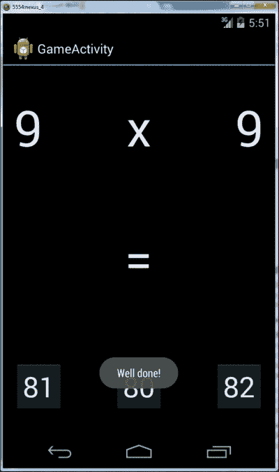
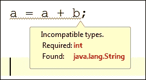

# 第三章：说 Java-你的第一个游戏

在这一章中，我们将开始编写我们自己的 Java 代码，同时开始理解 Java 语法。我们将学习如何存储、检索和操作存储在内存中的不同类型的值。我们还将研究如何根据这些数据的值做出决策和分支我们代码的流程。

按照这个顺序，我们将：

+   学习一些 Java 语法，并看看编译器是如何将其转换为运行应用程序的

+   存储数据并使用变量

+   学习如何用 Java 表达自己

+   通过提问继续数学游戏

+   学习 Java 中的决策

+   通过获取和检查答案继续数学游戏

获得前述的 Java 技能将使我们能够构建我们数学游戏的下两个阶段。这个游戏将能够向玩家提出一个乘法问题，检查答案，并根据给出的答案给出反馈，如下图所示：



# Java 语法

在本书中，我们将使用简单的英语讨论一些相当技术性的事情。你永远不会被要求阅读一个之前没有以非技术方式解释过的 Java 或 Android 概念的技术解释。

偶尔，我可能会要求或暗示您接受一个简化的解释，以便在更合适的时候提供更完整的解释，比如 Java 类作为一个黑匣子；但是，你永远不需要匆忙去谷歌以理解一个大词或充满术语的句子。

话虽如此，Java 和 Android 社区充满了讲技术术语的人，要加入并从这些社区中学习，你需要理解他们使用的术语。因此，本书的方法是使用完全简单的语言学习概念或欣赏想法，同时将行话作为学习的一部分。

然后，许多行话将开始显示其有用性，通常作为澄清的一种方式，或者避免解释/讨论变得比必要的更长。

“Java 语法”这个术语本身可能被认为是技术性的或术语性的。那么它是什么？Java 语法是我们将 Java 语言元素组合在一起以便在 Java/Dalvik 虚拟机中运行的代码。语法也应尽可能清晰地呈现给人类读者，尤其是在未来重新访问我们的程序时。Java 语法是我们使用的词和将这些词组成类似句子的结构的组合。

这些 Java 元素或词汇数量众多，但分成小块学习几乎肯定比任何人类语言更容易。原因在于 Java 语言及其语法是专门设计为尽可能简单明了。我们还有 Android Studio 在我们这边，它通常会告诉我们如果我们犯了错误，有时甚至会提前思考并提示我们。

我相信如果你能阅读，你就能学会 Java；因为学习 Java 非常容易。那么，是什么让一个完成了初级 Java 课程的人与一个专业程序员分开呢？同样的东西也分开了语言学生和大师诗人。语言的掌握来自于实践和进一步的学习。

在最后一章中，我将向你展示正确的方向，如果你想自己掌握 Java。

## 编译器

编译器是将我们可读的 Java 代码转换为可以在虚拟机中运行的另一段代码的东西。这被称为**编译**。Dalvik 虚拟机将在我们的玩家点击我们应用程序图标时运行这段编译后的代码。除了编译 Java 代码，编译器还会检查错误。虽然我们的发布应用程序可能仍然存在错误，但许多错误是在编译我们的代码时发现的。

## 用注释清晰地编写代码

随着你在编写 Java 程序方面变得更加高级，你用来创建程序的解决方案将变得更长、更复杂。此外，正如我们将在后面的章节中看到的，Java 被设计为通过将代码分成单独的块来管理复杂性，往往跨越多个文件。

**注释**是 Java 程序的一部分，在程序本身中没有任何功能。编译器会忽略它们。它们用于帮助程序员记录、解释和澄清他们的代码，以便在以后更容易理解自己或其他需要使用或修改代码的程序员。

因此，一个好的代码片段将大量地添加这样的行：

```java
//this is a comment explaining what is going on
```

前面的注释以两个斜杠字符`//`开头。注释在行末结束。这被称为单行注释。因此，该行上的任何内容只供人类阅读，而下一行上的任何内容（除非是另一个注释）都需要是语法正确的 Java 代码。

```java
//I can write anything I like here
but this line will cause an error
```

我们可以使用多个单行注释：

```java
//Below is an important note
//I am an important note
//We can have as many single line comments like this as we like
```

单行注释也很有用，如果我们想暂时禁用一行代码。我们可以在代码前面加上`//`，这样它就不会包含在程序中。回想一下这段代码，它告诉 Android 加载我们的菜单 UI：

```java
//setContentView(R.layout.activity_main);
```

在前面的情况下，当运行时菜单不会被加载，应用程序将有一个空白屏幕，因为整行代码被编译器忽略。Java 中还有另一种类型的注释——多行注释。这对于较长的注释以及在代码文件顶部添加版权信息等内容非常有用。与单行注释一样，它可以用于暂时禁用代码，通常是多行代码。

在前导`/*`和结束`*/`之间的所有内容都会被编译器忽略。以下是一些例子：

```java
/*
This program was written by a Java expert
You can tell I am good at this because my
code has so many helpful comments in it.
*/
```

多行注释中的行数没有限制。使用哪种类型的注释将取决于情况。在本书中，我将始终明确解释每一行代码，但你经常会在代码本身中发现大量的注释，这些注释会进一步解释、洞察或澄清。因此，阅读所有代码总是一个好主意：

```java
/*
The winning lottery numbers for next Saturday are
9,7,12,34,29,22
But you still want to learn Java? Right?
*/
```

### 提示

所有优秀的 Java 程序员都会在他们的代码中大量使用注释。

# 存储数据并使用变量

我们可以将变量看作是带有标签的存储箱。它们也像是程序员对 Android 设备内存或者我们正在编程的任何设备的窗口。变量可以在内存中存储数据（存储箱），在需要时通过适当的标签进行调用或更改。

计算机内存具有高度复杂的寻址系统，幸运的是，在 Java 中我们不需要与之交互。Java 变量允许我们为程序中需要处理的所有数据编写方便的名称；JVM 将处理与操作系统交互的所有技术细节，而操作系统可能通过几层传递交互与硬件。

因此，我们可以将我们的 Android 设备内存想象成一个巨大的仓库。当我们为变量分配名称时，它们被存储在仓库中，等待我们需要它们时。当我们使用变量的名称时，设备会准确知道我们在引用什么。然后我们可以告诉它做一些事情，比如“拿出 A 箱并将其添加到 C 箱，删除 B 箱”，等等。

在游戏中，我们可能会有一个名为`score`的变量。正是这个`score`变量，我们用来管理与用户分数相关的任何事情，比如增加、减少或者只是向玩家展示分数。

可能出现以下一些情况：

+   玩家回答正确一个问题，所以将 10 加到他们现有的`score`上

+   玩家查看他们的统计屏幕，所以在屏幕上打印`score`

+   玩家获得了有史以来最高的分数，所以将`hiScore`设置为他们当前的`score`。

这些都是相当任意的变量名称示例，只要你不使用 Java 限制的字符关键字，你实际上可以随意命名你的变量。然而，在实践中，最好采用一种命名约定，这样你的变量名称将是一致的。在本书中，我们将使用一个变量名称以小写字母开头的宽松约定。当变量的名称中有多个单词时，第二个单词将以大写字母开头。这被称为“驼峰命名法”。

以下是一些驼峰命名的示例：

+   `score`

+   `hiScore`

+   `playersPersonalBest`

在我们看一些带有变量的真正的 Java 代码之前，我们首先需要看一下我们可以创建和使用的变量的类型。

## 变量类型

可以想象，即使是一个简单的游戏可能也会有相当多的变量。在前一节中，我们介绍了`hiScore`变量作为一个例子。如果游戏有一个记住前 10 名玩家姓名的高分榜，那么我们可能需要为每个玩家创建变量。

那么当游戏需要知道可玩角色是死了还是活着，或者还有几条命/重试机会时呢？我们可能需要一些代码来测试生命，然后在可玩角色死亡时结束游戏并播放一个漂亮的血花动画。

计算机程序中的另一个常见要求，包括游戏，是正确或错误的计算：真或假。

为了涵盖您可能想要跟踪的这些和许多其他类型的信息，Java 有**类型**。有许多类型的变量，正如我们将在第六章中看到的，*OOP – Using Other People's Hard Work*，我们也可以发明自己的类型或使用其他人的类型。但现在，我们将看看内置的 Java 类型。公平地说，它们几乎涵盖了我们可能会遇到的每种情况。一些示例是解释这种类型的东西的最佳方式。

我们已经讨论了假设但非常可能的`score`变量。变量`score`很可能是一个数字，所以我们必须通过给分数一个适当的类型来向 Java 编译器传达这一点（分数是一个数字）。同样假设但同样可能的`playerName`当然将保存组成玩家姓名的字符。再往前跳几段，保存常规数字的类型称为`int`，保存类似姓名的数据的类型称为`String`。如果我们试图将一个玩家的名字，比如“Ada Lovelace”，存储在`score`中，而`score`是用于数字的，我们肯定会遇到麻烦。

编译器说不行！实际上，错误会说：


正如我们所看到的，Java 被设计成不可能让这样的错误出现在运行的程序中。你是否也注意到在之前的截图中，我忘记了在行末加上分号？有了这个编译器来识别我们的错误，可能会出现什么问题呢？

以下是 Java 中的主要类型。稍后，我们将看到如何开始使用它们：

+   `int`：这种类型用于存储整数。它使用 32 位内存，因此可以存储略大于 20 亿的值，包括负值。

+   `long`：顾名思义，当需要更大的数字时可以使用这种数据类型。`long`数据类型使用 64 位内存，我们可以在这种类型中存储 2 的 63 次方。如果你想看看它是什么样子，试试这个：`9,223,372,036,854,775,807`。也许令人惊讶的是，`long`变量也有用处，但如果较小的变量可以胜任，我们应该使用它，这样我们的程序就会使用更少的内存。

### 注意

你可能会想知道何时会使用这么大的数字。明显的例子可能是进行复杂计算的数学或科学应用，但另一个用途可能是用于计时。当你计算某事花费的时间时，Java `Date`类使用自 1970 年 1 月 1 日以来的毫秒数。`long`数据类型可能有用，用于从开始时间减去结束时间以确定经过的时间。我们将在第五章*游戏和 Java 基础*中使用`long`。

+   `float`：这是用于浮点数的，也就是说，小数点后有精度的数字。由于数字的小数部分占用的内存空间与整数部分一样，因此与非浮点数相比，浮点数的可能范围会减少。因此，除非我们的变量肯定会使用额外的精度，否则浮点数不会是我们的数据类型选择。

+   `double`：当`float`中的精度不够时，我们有`double`。

+   `short`：当即使是`int`数据类型都过度时，超薄的 short 适合于最小的存储盒，但我们只能存储大约 64,000 个值，从-32,768 到 32,767。

+   `byte`：这是比 short 类型更小的存储盒。内存中有足够的空间，但一个字节只能存储-128 到 127 的值。

+   `boolean`：我们将在整本书中大量使用布尔值。布尔变量只能是真或假，没有其他选项。也许布尔值可以回答这样的问题：

+   玩家还活着吗？

+   是否达到了新的最高分？

+   布尔变量的两个例子足够吗？

+   `char`：这存储一个单个的字母数字字符。它本身不会改变任何东西，但如果我们把它们放在一起，它可能会有用。

### 提示

我将这种数据类型的讨论保持在一个在本书的上下文中有用的实际水平上。如果你对数据类型的值是如何存储的以及为什么限制是什么感兴趣，请访问 Oracle Java 教程网站[`docs.oracle.com/javase/tutorial/java/nutsandbolts/datatypes.html`](http://docs.oracle.com/javase/tutorial/java/nutsandbolts/datatypes.html)。请注意，你不需要比我们已经讨论过的更多信息来继续阅读本书。

正如我们刚刚学到的，我们可能想要存储的每种数据类型都需要特定的内存量。因此，在我们开始使用变量之前，我们必须让 Java 编译器知道变量的类型。

前面的变量被称为**原始**类型。它们使用预定义的内存量，因此，使用我们的存储类比，适合于预定义大小的存储盒。

正如“原始”标签所示，它们不像引用类型那样复杂。

### 引用类型

你可能已经注意到，我们没有涵盖我们之前用来介绍变量概念的`String`变量类型。

字符串是一种特殊的变量类型，称为引用类型。它们简单地指向内存中变量存储开始的位置，但引用类型本身并不定义特定的内存量。这样做的原因非常简单：我们并不总是知道在程序实际运行之前需要存储多少数据。

我们可以将字符串和其他引用类型视为不断扩展和收缩的存储盒。那么这些`String`引用类型中的一个不会最终碰到另一个变量吗？如果你把设备的内存想象成一个满是标记存储盒的货架的巨大仓库，那么你可以把达尔维克虚拟机想象成一个超级高效的叉车司机，把不同类型的存储盒放在最合适的地方。

如果有必要的话，虚拟机会在一秒钟内迅速移动物品，以避免碰撞。在适当的时候，它甚至会焚毁不需要的存储盒。这与不断卸载各种类型的新存储盒并将它们放在最佳位置同时发生，对于该类型的变量。Dalvik 倾向于将引用变量保存在仓库的一个部分，这与原始变量的部分不同，我们将在第六章中了解更多细节，*OOP – 使用其他人的辛勤工作*。

因此，字符串可以用来存储任何键盘字符，就像`char`数据类型，但长度几乎可以是任意的。从玩家的名字到整本书都可以存储在一个字符串中。我们将经常使用字符串，包括在本章中。

还有一些我们将要探索的引用类型。数组是一种存储大量相同类型变量的方法，可以快速高效地访问。我们将在第五章中研究数组，*游戏和 Java 基础*。

将数组视为仓库中的一条通道，其中按照精确的顺序排列了某种类型的所有变量。数组是引用类型，因此 Dalvik 将它们保存在与字符串相同的仓库部分。

另一种引用类型是神秘的对象或类，我们将在第六章中进行讨论，*OOP – 使用其他人的辛勤工作*。

因此，我们知道我们可能想要存储的每种数据类型都需要一定的内存。因此，在开始使用变量之前，我们必须让 Java 编译器知道变量的类型。

### 声明

这就够了。让我们看看我们实际上如何使用我们的变量和类型。请记住，每种原始类型都需要特定数量的真实设备内存。这是编译器需要知道变量类型的原因之一。因此，在尝试对其进行任何操作之前，我们必须首先**声明**变量及其类型。

要声明一个名为`score`的`int`类型的变量，我们会这样输入：

```java
int score;
```

就是这样！只需声明类型，比如`int`，然后留下一个空格，输入您要用于此变量的名称。还要注意分号，像往常一样在行尾，以告诉编译器我们已经完成了这一行，接下来的内容（如果有的话）不是声明的一部分。

对于几乎所有其他变量类型，声明都是以相同的方式进行的。以下是一些示例。变量名是任意的。这就像在仓库中预留一个带标签的存储盒：

```java
long millisecondsElapsed;
float gravity;
double accurateGravity;
boolean isAlive;
char playerInitial;
String playerName;
```

### 初始化

在这里，对于每种类型，我们将一个值初始化到变量中。想象一下将一个值放入存储盒中，就像下面的代码所示：

```java
score = 0;
millisecondsElapsed = 1406879842000;//1st Aug 2014 08:57:22
gravity = 1.256;
double accurateGravity =1.256098;
isAlive = true;
playerInitial = 'C';
playerName = "Charles Babbage";
```

```java
and initialize the same variables as we did previously, but in one step each:
```

```java
int score = 0;
long millisecondsElapsed = 1406879842000;//1st Aug 2014 08:57:22
float gravity = 1.256;
double accurateGravity =1.256098;
boolean isAlive = true;
char playerInitial = 'C';
String playerName = "Charles Babbage";
```

### 注意

我们是否分开声明和初始化可能取决于具体情况。重要的是我们必须两者都做：

```java
int a;
//The line below attempts to output a to the console
Log.i("info", "int a = " + a);
```

上述代码将导致以下结果：

```java
Compiler Error: Variable a might not have been initialized

```

这个规则有一个重要的例外。在某些情况下，变量可以有**默认值**。我们将在第六章中看到这一点，但是良好的做法是同时声明和初始化变量。

#### 使用运算符更改变量

当然，在几乎任何程序中，我们都需要对这些值进行操作。以下是可能是最常见的 Java 运算符列表，它们允许我们操作变量。您不需要记住它们，因为我们第一次使用它们时会逐行查看代码：

+   **赋值运算符（=）**：这使得操作符左边的变量与右边的值相同。例如，`hiScore = score;`或`score = 100;`。

+   **加法运算符（+）**：这会将运算符两侧的值相加。通常与赋值运算符一起使用，例如`score = aliensShot + wavesCleared;`或`score = score + 100;`。请注意，同时在运算符的两侧使用相同的变量是完全可以接受的。

+   **减法运算符（-）**：这会将运算符右侧的值从左侧的值中减去。通常与赋值运算符一起使用，例如`lives = lives - 1;`或`balance = income - outgoings;`。

+   **除法运算符（/）**：这会将左侧的数字除以右侧的数字。同样，通常与赋值运算符一起使用，如`fairShare = numSweets / numChildren;`或`recycledValueOfBlock = originalValue / .9;`。

+   **乘法运算符（*）**：这会将变量和数字相乘，例如`answer = 10 * 10;`或`biggerAnswer = 10 * 10 * 10;`。

+   递增运算符（++）：这是一个非常简洁的方法，可以将变量的值加 1。`myVariable = myVariable + 1;`语句与`myVariable++;`相同。

+   **递减运算符（--）**：你猜对了：这是一个非常简洁的方法，可以从某个值中减去 1。`myVariable = myVariable -1;`语句与`myVariable--;`相同。

### 注意

这些运算符的正式名称与此处用于解释的名称略有不同。例如，除法运算符实际上是乘法运算符之一。但是，前面的名称对于学习 Java 来说更有用，如果您在与 Java 社区的某人交谈时使用术语“除法运算符”，他们会完全明白您的意思。

实际上，Java 中有比这更多的运算符。当我们在本章后面学习 Java 中的决策时，我们将看到更多的运算符。

### 提示

如果您对运算符感到好奇，可以在 Java 网站上找到完整的运算符列表[`docs.oracle.com/javase/tutorial/java/nutsandbolts/operators.html`](http://docs.oracle.com/javase/tutorial/java/nutsandbolts/operators.html)。本书中完成项目所需的所有运算符都将在本书中得到充分解释。链接是为我们中的好奇者提供的。

# 用 Java 表达自己

让我们尝试使用一些声明、赋值和运算符。当我们将这些元素捆绑到一些有意义的语法中时，我们称之为表达式。因此，让我们编写一个快速应用程序来尝试一些内容。

在这里，我们将制作一个小的辅助项目，以便我们可以玩转到目前为止学到的所有内容。我们需要创建一个新项目，就像我们在上一章中所做的那样，但这次我们不需要 UI。

相反，我们将简单地编写一些 Java 代码，并通过将变量的值输出到名为**logcat**的 Android 控制台来检查其效果。我们将通过构建简单的项目并检查代码和控制台输出来看到这是如何工作的：

### 提示

以下是如何创建新项目的快速提醒。

1.  通过导航到**文件** | **关闭项目**关闭当前打开的任何项目。

1.  点击**开始一个新的 Android Studio 项目**。

1.  **创建新项目**配置窗口将出现。在**应用程序名称**字段和**公司域**中填写`packtpub.com`，或者您可以在此处使用您自己公司的网站名称。

1.  现在点击**下一步**按钮。在下一个屏幕上，确保**手机和平板电脑**复选框中有一个勾选。现在我们必须选择我们想要为其构建应用程序的最早版本的 Android。随便尝试一下下拉选择器中的几个选项。您会发现我们选择的版本越早，我们的应用程序支持的设备百分比就越大。但是，这里的权衡是，我们选择的版本越早，我们的应用程序中可用的最新 Android 功能就越少。一个很好的平衡是选择**API 8：Android 2.2（Froyo）**。

1.  单击**下一步**。现在选择**空白活动**，然后再次单击**下一步**。

1.  在下一个屏幕上，只需将**Activity Name**更改为`MainActivity`，然后单击**Finish**。

1.  就像我们在第二章中所做的那样，*开始使用 Android*，为了保持我们的代码清晰简单，您可以删除两个不需要的方法（`onCreateOptionsMenu`和`onOptionsItemSelected`）及其相关的`@override`和`@import`语句。但是，这对于示例的工作并不是必要的。

### 提示

有关创建新项目的详细说明和图像，请参见第二章中的*开始使用 Android*。

与本书中的所有示例和项目一样，您可以从下载包中复制或查看代码。您将在`Chapter3/ExpressionsInJava/MainActivity.java`文件中找到本教程的代码。只需按照以前描述的方式创建项目，并将下载包中的`MainActivity.java`文件中的代码粘贴到在 Android Studio 中创建项目时生成的`MainActivity.java`文件中。只需确保包名称与创建项目时选择的包名称相同。但是，我强烈建议跟着教程一起学习，这样我们就可以学会如何自己做一切。

### 注意

由于此应用程序使用 logcat 控制台显示其输出，因此您应该仅在模拟器上运行此应用程序，而不是在真实的 Android 设备上运行。该应用程序不会损害真实设备，但您将无法看到任何发生的事情。

1.  创建一个名为`Expressions In Java`的新空白项目。

1.  现在，在`onCreate`方法中，在我们使用`setContentView`方法的那一行之后，添加以下代码来声明和初始化一些变量：

```java
//first we declare and initialize a few variables
int a = 10;
String b = "Alan Turing";
boolean c = true;
```

1.  现在添加以下代码。这段代码简单地输出了我们的变量的值，以便我们可以在一分钟内仔细检查它们：

```java
//Let's look at how Android 'sees' these variables
//by outputting them, one at a time to the console
Log.i("info", "a = " + a);
Log.i("info", "b = " + b);
Log.i("info", "c = " + c);
```

1.  现在让我们使用加法运算符和另一个新的运算符来改变我们的变量。在查看输出和代码解释之前，看看你能否计算出变量`a`、`b`和`c`的输出值：

```java
//Now let's make some changes
a++;
a = a + 10;
b = b + " was smarter than the average bear Booboo";
b = b + a;
c = (1 + 1 == 3);//1 + 1 is definitely 2! So false.
```

1.  让我们再次以与步骤 3 相同的方式输出值，但这次，输出应该是不同的：

```java
//Now to output them all again
Log.i("info", "a = " + a);
Log.i("info", "b = " + b);
Log.i("info", "c = " + c);
```

1.  以通常的方式在模拟器上运行程序。您可以通过单击**Android**选项卡来查看输出，该选项卡位于项目资源管理器下方的“有用选项卡”区域。

以下是输出，其中去掉了一些不必要的格式：

```java
info﹕ a = 10
info﹕ b = Alan Turing
info﹕ c = true
info﹕ a = 21
info﹕ b = Alan Turing was smarter than the average bear Booboo21
info﹕ c = false

```

现在让我们讨论一下发生了什么。在第 2 步中，我们声明并初始化了三个变量：

+   `a`：这是一个 int，其值为 10

+   `b`：这是一个字符串，其中包含一位杰出的计算机科学家的名字。

+   `c`：这是一个布尔值，其值为 false

所以当我们在步骤 3 中输出数值时，我们得到以下结果应该不足为奇：

```java
info﹕ a = 10
info﹕ b = Alan Turing
info﹕ c = true

```

在第 4 步中，所有有趣的事情发生了。我们使用增量运算符将 1 添加到我们的 int `a`的值，就像这样：`a++;`。请记住，`a++`与`a = a + 1`是相同的。

然后我们将 10 添加到`a`。请注意，我们是在已经添加 1 之后将 10 添加到`a`。所以我们得到了这样的输出，进行了 10 + 1 + 10 的操作：

```java
info﹕ a = 21

```

现在让我们检查一下我们的字符串`b`。我们似乎在我们杰出的科学家身上使用了加法运算符。正在发生的事情可能正是你猜到的。我们将两个字符串`"Alan Turing"`和`"was smarter than the average bear Booboo."`相加在一起时，它被称为**连接**，`+`符号同时也是连接运算符。

最后，对于我们的字符串，我们似乎在其中添加了`int a`。这是允许的，`a`的值被连接到`b`的末尾。

```java
info﹕ b = Alan Turing was smarter than the average bear Booboo21

```

### 注意

这种方法不适用于反向操作；你不能将一个字符串添加到一个`int`。这是有道理的，因为没有逻辑上的答案。

`a = a + b`



最后，让我们看一下改变我们的布尔值`c`从 true 变为 false 的代码：`c = (1+1=3);`。在这里，我们将括号中的表达式的值赋给了`c`。这本来很简单，但为什么要用双等号（`==`）呢？我们有点超前了。双等号是另一个叫做**比较**运算符的操作符。

所以我们真的在问，“1+1”是否等于 3？显然答案是否定的。你可能会问，“为什么要使用`==`而不是`=`？”简单地说，这是为了让编译器清楚地知道我们是要赋值还是要比较。

### 提示

无意中使用`=`而不是`==`是一个非常常见的错误。

赋值运算符（`=`）将右边的值赋给左边的值，而比较运算符（`==`）比较两边的值。

当我们这样做时，编译器会用错误警告我们，但乍一看你可能会觉得编译器错了。我们将在本章和整本书中更多地了解这个比较运算符和其他运算符。

现在让我们利用我们所知道的一切，再加一点，来制作我们的数学游戏项目。
