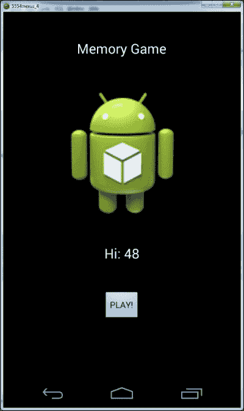
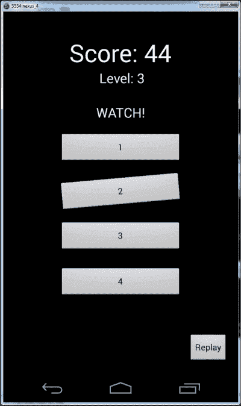
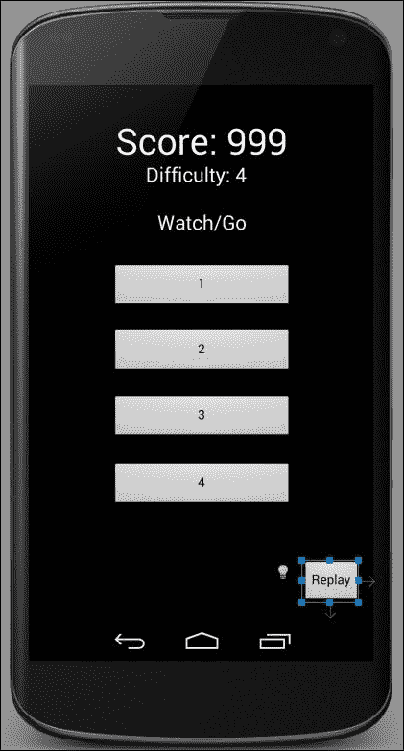

# 第五章。游戏和 Java 基础知识

在本章中，我们将涵盖各种有趣的主题。我们将学习 Java 数组，它允许我们以有组织和高效的方式操纵潜在的大量数据。

然后，我们将研究线程在游戏中的作用，以便看起来可以同时做更多事情。

如果您认为我们的数学游戏有点安静，那么我们将研究如何为我们的游戏添加声音效果，以及介绍一个很酷的开源应用程序来生成真实的声音效果。

我们将学习的最后一件新事情将是持久性。这是当玩家退出我们的游戏甚至关闭他们的 Android 设备时会发生的情况。那时分数会怎么样？下次他们玩时我们将如何加载正确的级别？

一旦我们完成了所有这些，我们将使用所有新的技术和知识以及我们已经知道的内容来创建一个整洁的记忆游戏。

在本章中，我们将涵盖以下主题：

+   Java 数组-一组变量的数组

+   线程定时

+   创建和使用蜂鸣声和嗡嗡声-Android 声音

+   毁灭后的生活展望-坚持

+   构建记忆游戏

# Java 数组-一组变量的数组

您可能想知道当我们有很多要跟踪的变量的游戏时会发生什么。如何处理一个包含前 100 名得分的高分榜？我们可以声明并初始化 100 个单独的变量，如下所示：

```java
int topScore1;
int topScore2;
int topScore3;
//96 more lines like the above
int topScore100;
```

这可能立即显得笨拙，那么当有人获得新的最高分时，我们需要将每个变量中的分数向下移动一个位置，会发生什么？噩梦开始：

```java
topScore100 = topScore99;
topScore99 = topScore98;
topScore98 = topScore97;
//96 more lines like the above
topScore1 = score;
```

更新分数必须有更好的方法。当我们有一大堆变量时，我们需要的是一个 Java **数组**。数组是一个引用变量，最多可以容纳固定数量的元素。每个元素都是具有一致类型的变量。

下面的代码行声明了一个可以容纳`int`类型变量的数组，甚至可能是一个高分表：

```java
int [] intArray;
```

我们还可以声明其他类型的数组，如下所示：

```java
String [] classNames;
boolean [] bankOfSwitches;
float [] closingBalancesInMarch;
```

这些数组中的每一个都需要在使用之前分配固定的最大存储空间，如下所示：

```java
intArray = new int [100];
```

前面的代码行分配了最多 100 个整数大小的存储空间。想象一下我们的变量仓库中有 100 个连续存储空间的长过道。空间可能标有`intArray[0]`，`intArray[1]`，`intArray[2]`等，每个空间都包含一个单个的`int`值。也许这里稍微令人惊讶的是，存储空间从 0 开始，而不是 1。因此，在大小为 100 的数组中，存储空间将从 0 到 99。

我们实际上可以像这样初始化一些存储空间：

```java
intArray[0] = 5;
intArray[1] = 6;
intArray[2] = 7;
```

请注意，我们只能将声明的类型放入数组中，数组保存的类型永远不会改变：

```java
intArray[3]= "John Carmack";//Won't compile
```

所以当我们有一个`int`类型的数组时，每个`int`变量被称为什么？数组表示法语法替换了名称。我们可以对数组中的变量做任何我们可以用名称对常规变量做的事情：

```java
intArray[3] = 123;
```

这是数组变量被用作普通变量的另一个例子：

```java
intArray[10] = intArray[9] - intArray[4];
```

我们还可以将数组中的值分配给相同类型的常规变量，如下所示：

```java
int myNamedInt = intArray [3];
```

但是，请注意，`myNamedInt`是一个单独且独立的基本变量，因此对它所做的任何更改都不会影响存储在`intArray`引用中的值。它在仓库中有自己的空间，并且与数组没有关联。

## 数组是对象

我们说数组是引用变量。将数组变量视为给定类型的一组变量的地址。也许，使用仓库类比，`someArray`是一个过道编号。因此，`someArray[0]`，`someArray[1]`等都是过道编号，后跟过道中的位置编号。

数组也是对象。这意味着它们有我们可以使用的方法和属性：

```java
int lengthOfSomeArray = someArray.length;
```

在前一行代码中，我们将`someArray`的长度分配给了名为`lengthOfSomeArray`的`int`变量。

我们甚至可以声明一个数组的数组。这是一个数组，每个元素中存储另一个数组，就像这样：

```java
String[][] countriesAndCities;
```

在前面的数组中，我们可以保存每个国家内的城市列表。现在先不要太疯狂地使用数组。只需记住，数组最多可以保存预定数量的任何类型的变量，并且可以使用以下语法访问它们的值：

```java
someArray[someLocation];
```

让我们实际使用一些数组来尝试并了解如何在实际代码中使用它们以及我们可能用它们做什么。

### 一个数组的简单示例

让我们通过以下步骤编写一个真正简单的数组工作示例。您可以在可下载的代码包中找到此示例的完整代码。它在`Chapter5/SimpleArrayExample/MainActivity.java`中：

1.  创建一个带有空白活动的项目，就像我们在第二章中所做的那样，*开始使用 Android*。同时，通过删除不必要的部分来清理代码，但这并非必要。

1.  首先，我们声明我们的数组，分配五个空间，并为每个元素初始化一些值：

```java
//Declaring an array
int[] ourArray;

//Allocate memory for a maximum size of 5 elements
ourArray = new int[5];

//Initialize ourArray with values
//The values are arbitrary as long as they are int
//The indexes are not arbitrary 0 through 4 or crash!

ourArray[0] = 25;
ourArray[1] = 50;
ourArray[2] = 125;
ourArray[3] = 68;
ourArray[4] = 47;
```

1.  我们将每个值输出到**logcat**控制台。请注意，当我们将数组元素相加时，我们是在多行上这样做的。这没问题，因为我们在最后一个操作之前省略了分号，所以 Java 编译器将这些行视为一个语句：

```java
//Output all the stored values
Log.i("info", "Here is ourArray:");
Log.i("info", "[0] = "+ourArray[0]);
Log.i("info", "[1] = "+ourArray[1]);
Log.i("info", "[2] = "+ourArray[2]);
Log.i("info", "[3] = "+ourArray[3]);
Log.i("info", "[4] = "+ourArray[4]);

//We can do any calculation with an array element
//As long as it is appropriate to the contained type
//Like this:
int answer = ourArray[0] +
    ourArray[1] +
    ourArray[2] +
    ourArray[3] +
    ourArray[4];

Log.i("info", "Answer = "+ answer);
```

1.  在模拟器上运行示例。

请记住，在模拟器显示上不会发生任何事情，因为整个输出将被发送到我们在 Android Studio 中的**logcat**控制台窗口。以下是前面代码的输出：

```java
info﹕ Here is ourArray:
info﹕ [0] = 25
info﹕
 [1] = 50
info﹕ [2] = 125
info﹕ [3] = 68
info﹕ [4] = 47
info﹕ Answer = 315 

```

在第 2 步中，我们声明了一个名为`ourArray`的数组，以保存`int`变量，并为该类型的最多五个变量分配了空间。

接下来，我们为数组中的五个空间中的每一个分配了一个值。请记住，第一个空间是`ourArray[0]`，最后一个空间是`ourArray[4]`。

在第 3 步，我们简单地将每个数组位置的值打印到控制台。从输出中，我们可以看到它们保存了我们在上一步中初始化的值。然后我们将`ourArray`中的每个元素相加，并将它们的值初始化为`answer`变量。然后我们将`answer`打印到控制台，并看到所有的值都被加在一起，就像它们是存储在稍微不同方式的普通旧`int`类型中一样，这正是它们的本质。

## 与数组一起变得动态起来

正如我们在所有这些数组内容的开头讨论的那样，如果我们需要单独声明和初始化数组的每个元素，那么数组与常规变量相比并没有太大的好处。让我们看一个动态声明和初始化数组的例子。

### 动态数组示例

通过以下步骤创建一个真正简单的动态数组。您可以在下载包中找到此示例的工作项目。它在`Chapter5/DynamicArrayExample/MainActivity.java`中：

1.  创建一个带有空白活动的项目，就像我们在第二章中所做的那样，*开始使用 Android*。同时，通过删除不必要的部分来清理代码，但这并非必要。

1.  在`onCreate`的大括号之间键入以下内容。在我们讨论并分析代码之前，看看您能否弄清楚输出将是什么：

```java
//Declaring and allocating in one step
int[] ourArray = new int[1000];

//Let's initialize ourArray using a for loop
//Because more than a few variables is allot of typing!
for(int i = 0; i < 1000; i++){
   //Put the value of ourValue into our array
   //At the position determined by i.
   ourArray[i] = i*5;

            //Output what is going on
            Log.i("info", "i = " + i);
            Log.i("info", "ourArray[i] = " + ourArray[i]);
}
```

1.  在模拟器上运行示例。请记住，在模拟器显示上不会发生任何事情，因为整个输出将被发送到我们在 Android Studio 中的**logcat**控制台窗口。以下是前面代码的输出：

```java
info﹕ i = 0
info﹕ ourArray[i] = 0
info﹕ i = 1
info﹕ ourArray[i] = 5
info﹕ i = 2
info﹕
 ourArray[i] = 10

```

我已经删除了循环的 994 次迭代以简洁起见：

```java
info﹕ ourArray[i] = 4985
info﹕ i = 998
info﹕ ourArray[i] = 4990
info﹕ i = 999
info﹕ ourArray[i] = 4995

```

所有的操作都发生在第 2 步。我们声明并分配了一个名为`ourArray`的数组，以容纳最多 1,000 个`int`值。然而，这一次，我们在一行代码中完成了这两个步骤：

```java
int[] ourArray = new int[1000];
```

然后，我们使用了一个`for`循环，设置为循环 1,000 次：

```java
(int i = 0; i < 1000; i++){
```

我们用`i`乘以`5`的值初始化了数组中从 0 到 999 的空间，如下所示：

```java
ourArray[i] = i*5;
```

为了演示`i`的值以及数组中每个位置上保存的值的价值，我们按如下方式输出`i`的值，然后是数组中相应位置上保存的值：

```java
Log.i("info", "i = " + i);
Log.i("info", "ourArray[i] = " + ourArray[i]);
```

所有这些都发生了 1,000 次，产生了我们看到的输出。

## 进入数组的第 n 维

我们非常简要地提到数组甚至可以在每个位置上容纳其他数组。现在，如果一个数组包含许多包含其他类型的数组，我们如何访问包含的数组中的值？为什么我们需要这个？看看多维数组何时有用的下一个示例。

### 多维数组的一个示例

让我们通过以下步骤创建一个非常简单的多维数组。您可以在下载包中找到此示例的工作项目。它位于`Chapter5/MultidimensionalArrayExample/MainActivity.java`：

1.  创建一个带有空白活动的项目，就像我们在第二章中所做的那样，*开始 Android*。同时，通过删除不必要的方法来清理代码，但这并非必需。

1.  在调用`setContentView`之后，声明并初始化一个二维数组，如下所示：

```java
//A Random object for generating question numbers later
Random randInt = new Random();
//And a variable to hold the random value generated
int questionNumber;

//We declare and allocate in separate stages for clarity
//but we don't have to
String[][] countriesAndCities;
//Here we have a 2 dimensional array

//Specifically 5 arrays with 2 elements each
//Perfect for 5 "What's the capital city" questions
countriesAndCities = new String[5][2];

//Now we load the questions and answers into our arrays
//You could do this with less questions to save typing
//But don't do more or you will get an exception
countriesAndCities [0][0] = "United Kingdom";
countriesAndCities [0][1] = "London";

countriesAndCities [1][0] = "USA";
countriesAndCities [1][1] = "Washington";

countriesAndCities [2][0] = "India";
countriesAndCities [2][1] = "New Delhi";

countriesAndCities [3][0] = "Brazil";
countriesAndCities [3][1] = "Brasilia";

countriesAndCities [4][0] = "Kenya";
countriesAndCities [4][1] = "Nairobi";
```

1.  现在我们使用`for`循环和`Random`类对象输出数组的内容。请注意，尽管问题是随机的，但我们始终可以选择正确的答案：

```java
//Now we know that the country is stored at element 0
//The matching capital at element 1
//Here are two variables that reflect this
int country = 0;
int capital = 1;

//A quick for loop to ask 3 questions
for(int i = 0; i < 3; i++){
   //get a random question number between 0 and 4
   questionNumber = randInt.nextInt(5);

   //and ask the question and in this case just
   //give the answer for the sake of brevity
  Log.i("info", "The capital of " +countriesAndCities[questionNumber][country]);

  Log.i("info", "is " +countriesAndCities[questionNumber][capital]);

}//end of for loop
```

在模拟器上运行示例。再次强调，模拟器显示屏上不会发生任何事情，因为输出将发送到我们在 Android Studio 中的**logcat**控制台窗口。这是先前代码的输出：

```java
info﹕ The capital of USA
info﹕ is Washington
info﹕ The capital of India
info﹕ is New Delhi
info﹕ The capital of United Kingdom
info﹕ is London

```

刚刚发生了什么？让我们一块一块地过一遍，这样我们就知道到底发生了什么。

我们创建一个`Random`类型的新对象，称为`randInt`，准备在程序后面生成随机数：

```java
Random randInt = new Random();
```

我们声明一个简单的`int`变量来保存问题编号：

```java
int questionNumber;
```

然后我们声明`countriesAndCities`，我们的数组数组。外部数组保存数组：

```java
String[][] countriesAndCities;
```

现在我们在数组中分配空间。第一个外部数组将能够容纳五个数组，每个内部数组将能够容纳两个字符串：

```java
countriesAndCities = new String[5][2];
```

接下来，我们初始化数组以保存国家及其对应的首都。请注意，每对初始化中，外部数组编号保持不变，表示每个国家/首都对在一个内部数组（字符串数组）中。当然，这些内部数组中的每一个都保存在外部数组的一个元素中（保存数组）：

```java
countriesAndCities [0][0] = "United Kingdom";
countriesAndCities [0][1] = "London";

countriesAndCities [1][0] = "USA";
countriesAndCities [1][1] = "Washington";

countriesAndCities [2][0] = "India";
countriesAndCities [2][1] = "New Delhi";

countriesAndCities [3][0] = "Brazil";
countriesAndCities [3][1] = "Brasilia";

countriesAndCities [4][0] = "Kenya";
countriesAndCities [4][1] = "Nairobi";
```

为了使即将到来的`for`循环更清晰，我们声明并初始化`int`变量来表示数组中的国家和首都。如果您回顾一下数组初始化，所有国家都保存在内部数组的位置`0`，所有对应的首都都保存在位置`1`：

```java
int country = 0;
int capital = 1;
```

现在我们创建一个`for`循环，将运行三次。请注意，这个数字并不意味着我们访问数组的前三个元素。这只是循环的次数。我们可以让它循环一次或一千次，但示例仍然有效：

```java
for(int i = 0; i < 3; i++){
```

接下来，我们实际确定要问什么问题，或者更具体地说，我们外部数组的哪个元素。请记住，`randInt.nextInt(5)`返回 0 到 4 之间的数字。这正是我们需要的，因为我们有一个包含五个元素的外部数组，从 0 到 4：

```java
questionNumber = randInt.nextInt(5);
```

现在我们可以通过输出内部数组中保存的字符串来提问，而内部数组又由前一行中随机生成的数字选择的外部数组保存：

```java
  Log.i("info", "The capital of " +countriesAndCities[questionNumber][country]);

  Log.i("info", "is " +countriesAndCities[questionNumber][capital]);

}//end of for loop
```

值得一提的是，我们在本书的其余部分将不再使用任何多维数组。因此，如果对这些数组内部的数组还有一点模糊，那也没关系。您知道它们存在以及它们能做什么，所以如果有必要，您可以重新访问它们。

### 数组越界异常

当我们尝试访问一个不存在的数组元素时，就会发生数组越界异常。每当我们尝试这样做，就会出现错误。有时，编译器会捕捉到它，以防止错误进入工作中的游戏，就像这样：

```java
int[] ourArray = new int[1000];
int someValue = 1;//Arbitrary value
ourArray[1000] = someValue;//Won't compile as compiler knows this won't work.
//Only locations 0 through 999 are valid
```

猜猜如果我们写出这样的东西会发生什么：

```java
int[] ourArray = new int[1000];
int someValue = 1;//Arbitrary value
int x = 999;
if(userDoesSomething){x++;//x now equals 1000
}
ourArray[x] = someValue;
//Array out of bounds exception if userDoesSomething evaluates to true! This is because we end up referencing position 1000 when the array only has positions 0 through 999
//Compiler can't spot it and game will crash on player - yuck!
```

我们避免这个问题的唯一方法是了解规则。规则是数组从零开始，一直到从分配的数字中减去一得到的数字。我们还可以使用清晰、可读的代码，在这种代码中很容易评估我们所做的事情并发现问题。

# 线程的时间控制

那么什么是线程呢？你可以把 Java 编程中的线程想象成故事中的线程。在故事的一个线程中，我们有主要角色在前线与敌人作战，而在另一个线程中，士兵的家人们日复一日地生活。当然，一个故事不一定只有两个线程。我们可以引入第三个线程。也许故事还讲述了政客和军事指挥官做出决策。这些决策会微妙地或者不那么微妙地影响其他线程中发生的事情。

编程中的线程就是这样。我们在程序中创建部分/线程，它们为我们控制不同的方面。我们引入线程来代表这些不同的方面，是因为以下原因：

+   从组织的角度来看，它们是有意义的

+   它们是一种经过验证的程序结构方式

+   我们正在工作的系统的性质迫使我们使用它们

在 Android 中，我们同时出于以上所有原因使用线程。这是有道理的，它有效，而且我们必须使用它，因为系统的设计需要。

在游戏中，想象一下一个线程接收玩家的“左”、“右”和“射击”按钮点击，一个线程代表外星人思考下一步要移动到哪里，还有另一个线程在屏幕上绘制所有的图形。

多线程程序可能会出现问题。就像故事的线程一样，如果适当的同步没有发生，事情就会出错。如果我们的士兵在战斗甚至战争存在之前就进入了战斗，会怎么样？奇怪！

如果我们有一个变量`int x`，代表着我们程序中三个线程使用的关键数据，会发生什么呢？如果一个线程稍微领先一些，使得数据对其他两个线程来说变得“错误”了，会发生什么？这个问题就是**正确性**的问题，由多个线程竞争完成而引起，它们互相不知道对方的存在，因为它们毕竟只是愚蠢的代码。

正确性的问题可以通过密切监督线程和**锁定**来解决。锁定意味着暂时阻止一个线程的执行，以确保事情以同步的方式工作。这就像冻结士兵不让他登上战舰，直到战舰实际靠岸并放下了栈板，避免尴尬的溅水。

多线程程序的另一个问题是**死锁**的问题，其中一个或多个线程被锁住，等待合适的时机来访问`x`，但那个时机从未到来，整个程序最终停滞不前。

你可能已经注意到，第一个问题（正确性）的解决方案是导致第二个问题（死锁）的原因。现在考虑我们刚刚讨论的所有内容，并将其与 Android Activity 生命周期混合在一起。你可能开始感到这种复杂性有点令人恶心。

幸运的是，这个问题已经为我们解决了。就像我们使用`Activity`类并重写其方法与 Android 生命周期进行交互一样，我们也可以使用其他类来创建和管理我们的线程。就像使用`Activity`一样，我们只需要知道如何使用它们，而不需要知道它们是如何工作的。

所以为什么要告诉我所有这些关于线程的东西，当我不需要知道的时候，你可能会问。这只是因为我们将编写看起来不同并且结构不熟悉的代码。如果我们能做到以下几点，我们将毫不费力地编写我们的 Java 代码来创建和在我们的线程中工作：

+   接受我们将介绍的新概念是我们需要处理的，以便为处理与线程相关的问题创建一个特定于 Android 的解决方案

+   了解线程的一般概念，这与几乎同时发生的故事线程大致相同

+   学习使用一些 Android 线程类的几个规则

请注意，我在第三个项目中说了类，复数。不同的线程类在不同的情况下效果最好。你可以写一整本关于 Android 线程的书。在本书中，我们将使用两个线程类。在本章中，我们将使用`Handler`。在第七章，*复古乒乓球游戏*，和第八章，*贪吃蛇游戏*中，我们将使用`Runnable`类。我们需要记住的是，我们将编写几乎同时运行的程序部分。

### 提示

我所说的“几乎”是什么意思？实际上发生的是 CPU 轮流在线程之间切换。然而，这一切发生得如此之快，以至于我们除了同时性之外无法感知到任何东西。

## 使用 Handler 类创建一个简单的线程计时器示例

在这个例子之后，当我们意识到线程并不像最初害怕的那么复杂时，我们可以松一口气。在真正的游戏中使用线程时，我们将不得不在这个简单的例子中的代码旁边添加一些额外的代码，但这并不多，我们会在到达时讨论它。

像往常一样，你可以直接使用下载包中的完整代码。这个项目位于`Chapter5`/`SimpleThreadTimer/MainActivity.java`。

正如名称所示，我们将创建一个计时器 - 在许多游戏中非常有用的功能：

1.  创建一个带有空白活动的项目，就像我们在第二章中所做的那样，*开始使用 Android*。同时，通过删除不必要的部分来清理代码，但这并不是必要的。

1.  在类声明之后，输入三行高亮显示的代码：

```java
public class MainActivity extends Activity {

    private Handler myHandler;
 boolean gameOn;
 long startTime;

```

1.  将此代码输入`onCreate`方法中。它将创建一个线程，同时在`if(gameOn)`块中进行其他操作：

```java
//How many milliseconds is it since the UNIX epoch
        startTime = System.currentTimeMillis();

        myHandler = new Handler() {
            public void handleMessage(Message msg) {
                super.handleMessage(msg);

                if (gameOn) {
                    long seconds = ((System.currentTimeMillis() - startTime)) / 1000;
                    Log.i("info", "seconds = " + seconds);
                }

                myHandler.sendEmptyMessageDelayed(0, 1000);
            }

        };

        gameOn = true;
        myHandler.sendEmptyMessage(0);
    }
```

1.  运行应用程序。在模拟器上使用主页或返回按钮退出。请注意，它仍然在控制台上打印。当我们实现我们的记忆游戏时，我们将处理这个异常。

当你在模拟器上运行示例时，请记住模拟器显示屏上不会发生任何事情，因为所有的输出都将发送到我们在 Android Studio 中的**logcat**控制台窗口。这是先前代码的输出：

```java
info﹕ seconds = 1
info﹕ seconds = 2
info﹕ seconds = 3
info﹕ seconds = 4
info﹕ seconds = 5
info﹕ seconds = 6

```

那刚刚发生了什么？每隔 1 秒，经过的秒数被打印到控制台上。让我们学习一下这是如何发生的。

首先，我们声明一个名为`myHandler`的`Handler`类型的新对象。然后我们声明一个名为`gameOn`的布尔变量。我们将使用这个变量来跟踪我们的游戏何时运行。最后，这段代码块的最后一行声明了一个`long`类型的变量。你可能还记得`long`类型来自第三章，*说 Java - 你的第一个游戏*。我们可以使用`long`变量来存储非常大的整数，这就是我们在这里使用`startTime`的方式：

```java
private Handler myHandler;
boolean gameOn;
long startTime;
```

接下来，我们使用`System`类的`currentTimeMillis`方法初始化了`startTime`。这个方法保存了自 1970 年 1 月 1 日以来的毫秒数。我们将看到我们如何在下一行代码中使用这个值。

```java
startTime = System.currentTimeMillis();
```

接下来是重要的代码。直到`if(gameOn)`之前的所有内容都是用来定义我们的线程的代码。当然，这段代码有点复杂，但实际上并没有看起来那么糟糕。还要记住，我们只需要使用线程；我们不需要理解它们的所有工作原理。

让我们分解前面的代码，以便更好地理解。`myHandler = new Handler()`这一行只是初始化了我们的`myHandler`对象。与之前看到的不同的是，我们立即对对象进行了自定义。我们重写了`handleMessage`方法（这是我们在线程中运行代码的地方），然后调用了`super.handleMessage`，它在运行我们的自定义代码之前调用了`handleMessage`的默认版本。这很像我们每次调用`super.onCreate`时对`onCreate`方法所做的事情。

然后我们有`if(gameOn)`块。该`if`块中的所有内容都是我们想要在线程中运行的代码。`if(gameOn)`块只是给了我们一个控制是否要运行代码的方式。例如，我们可能希望线程一直运行，但只有在某些时候运行我们的代码。`if`语句让我们可以轻松选择。现在看一下代码。稍后我们将分析`if`块中发生了什么：

```java
myHandler = new Handler() {
     public void handleMessage(Message msg) {
       super.handleMessage(msg);

       if (gameOn) {
         long seconds = ((System.currentTimeMillis() - startTime)) / 1000;
             Log.i("info", "seconds = " + seconds);
         }

       myHandler.sendEmptyMessageDelayed(0, 1000);
      }

 };
```

在`if`块内，我们声明并初始化了另一个名为`seconds`的`long`变量，并对其进行了一些简单的数学运算：

```java
long seconds = ((System.currentTimeMillis() - startTime)) / 1000;
```

首先，我们获取自 1970 年 1 月 1 日以来的当前毫秒数，然后从中减去`startTime`。这给了我们自初始化`startTime`以来的毫秒数。然后我们将答案除以 1000，得到一个秒数。我们用以下行将这个值打印到控制台：

```java
Log.i("info", "seconds = " + seconds);
```

接下来，在我们的`if`块之后，我们有这样一行：

```java
myHandler.sendEmptyMessageDelayed(0, 1000);
```

前一行告诉 Android 系统，我们希望每 1000 毫秒（一秒一次）运行一次`handleMessage`方法中的代码。

在`onCreate`中，在`handleMessage`方法和`Handler`类的结束大括号之后，我们最终将`gameOn`设置为`true`，以便可以运行`if`块中的代码：

```java
gameOn = true;
```

然后，代码的最后一行开始了我们的线程与 Android 系统之间的消息流：

```java
myHandler.sendEmptyMessage(0);
```

值得指出的是，`if`块中的代码可以是我们需要的最少或最多。当我们实现我们的记忆游戏时，我们将在`if`块中看到更多的代码。

我们真正需要知道的是，我们刚刚看到的有些复杂的设置允许我们在一个新的线程中运行`if`块中的内容。就是这样！也许除了稍微快速地涉及`System`类之外。

### 注意

`System`类有很多用途。在这种情况下，我们使用它来获取自 1970 年 1 月 1 日以来的毫秒数。这是计算机中用于测量时间的常见系统。它被称为 Unix 时间，1970 年 1 月 1 日的第一毫秒被称为 Unix 纪元。在本书中我们将再次遇到这个概念。

关于线程就说这么多，让我们发出一些声音吧！

# 蜂鸣声和嗡嗡声 - Android 音效

这一部分将分为两部分——创建和使用音效。那么让我们开始吧。

## 创建音效

多年前，每当我制作游戏时，我会花费很多时间在提供免版税音效的网站上搜寻。虽然有很多好的音效，但真正优秀的音效总是很昂贵，无论你付多少钱，它们永远不会完全符合你的要求。然后一个朋友指出了一个名为 Bfxr 的简单开源应用，自那以后我再也没有浪费时间寻找音效。我们可以自己制作。

以下是使用 Bfxr 制作自己的音效的快速指南。从[www.bfxr.net](http://www.bfxr.net)免费下载 Bfxr。

按照网站上的简单说明进行设置。尝试一些示例来制作酷炫的音效：

### 提示

这是一个严重简化的教程。您可以使用 Bfxr 做更多事情。要了解更多，请阅读上一个 URL 网站上的提示。

1.  运行`bfxr.exe`：

1.  尝试所有预设类型，这些类型会生成该类型的随机声音。当您有一个接近您想要的声音时，转到下一步:

1.  使用滑块微调您的新声音的音调、持续时间和其他方面:

1.  通过单击**导出 Wav**按钮保存您的声音。尽管这个按钮的名称是这样的，但正如我们将看到的那样，我们可以保存为`.wav`以外的格式。

1.  Android 喜欢使用 OGG 格式的声音，因此在要求命名文件时，请在您决定的文件名后面使用`.ogg`扩展名。

1.  根据需要重复 2 到 5 步。

### 提示

本书中需要声音样本的每个项目都提供了声音样本，但正如我们所见，制作自己的样本更有趣。您只需要将它们保存为与提供的样本相同的文件名。

### 在 Android 中播放声音

为了完成这个简短的示例，您需要三个以`.ogg`格式保存的声音效果。因此，如果您手头没有它们，请返回到*创建声音效果*部分进行制作。或者，您可以使用代码包的`Chapter5/PlayingSounds/assets`文件夹中提供的声音。像往常一样，您可以查看或使用`Chapter5/PlayingSounds/java/MainActivity.java`和`Chapter5/PlayingSounds/layout/activity_main.xml`中已经完成的代码。现在执行以下步骤：

1.  创建一个空白活动的项目，就像我们在第二章中所做的那样，*开始使用 Android*。此外，通过删除不必要的部分来清理代码，尽管这并非必要。

1.  创建三个声音文件并将它们保存为`sample1.ogg`，`sample2.ogg`和`sample3.ogg`。

1.  在项目资源管理器窗口的`main`文件夹中，我们需要添加一个名为`assets`的文件夹。因此，在项目资源管理器窗口中，右键单击**main**文件夹，然后导航到**新建** | **目录**。在**新建目录**对话框中输入`assets`。

1.  现在将三个声音文件复制并粘贴到新创建的`assets`文件夹中。或者，选择这三个文件，右键单击它们，然后单击**复制**。然后单击 Android Studio 项目资源管理器中的**assets**文件夹。现在右键单击**assets**文件夹，然后单击**粘贴**。

1.  在编辑器窗口中打开`activity_main.xml`，并将三个按钮小部件拖放到您的 UI 上。它们的位置或对齐方式并不重要。当您查看我们三个新按钮中的任何一个的**属性**窗口中的**id**属性时，您会注意到它们已经自动分配了**id**属性。它们是`button`，`button2`和`button3`。正如我们将看到的那样，这正是我们需要的。

1.  让我们通过实现`onClickListener`使我们的活动能够监听按钮的点击，就像我们在所有其他示例中使用按钮一样。在编辑器窗口中打开**MainActivity.java**。将`public class MainActivity extends Activity {`行替换为以下代码行：

```java
public class MainActivity extends Activity implements View.
    OnClickListener {
```

1.  与以前一样，我们的新代码行上出现了难看的红色下划线。上次发生这种情况时，我们在必须实现的`onClick`方法的空体中键入，一切都很好。这一次，因为我们已经知道这里发生了什么，我们将学习一个快捷方式。将鼠标悬停在错误上，右键单击它。现在单击**生成...**，然后选择**实现方法...**。在**选择要实现的方法**对话框中，**onClick(View):void**将被自动选择:

1.  通过单击**确定**来选择此选项。现在滚动到代码底部，看到 Android Studio 已经很好地为您实现了`onClick`方法，错误也已经消失。

1.  在`MainActivity`声明之后键入此代码，以声明一些用于我们的音效的变量：

```java
private SoundPool soundPool;
int sample1 = -1;
int sample2 = -1;
int sample3 = -1;
```

1.  在`onCreate`方法中键入此代码，将我们的声音加载到内存中：

```java
soundPool = new SoundPool(10, AudioManager.STREAM_MUSIC,0);
  try{
    //Create objects of the 2 required classes
          AssetManager assetManager = getAssets();
          AssetFileDescriptor descriptor;

          //create our three fx in memory ready for use
          descriptor = assetManager.openFd("sample1.ogg");
          sample1 = soundPool.load(descriptor, 0);

          descriptor = assetManager.openFd("sample2.ogg");
          sample2 = soundPool.load(descriptor, 0);

          descriptor = assetManager.openFd("sample3.ogg");
          sample3 = soundPool.load(descriptor, 0);

        }catch(IOException e){
            //catch exceptions here
        }
```

1.  现在添加代码来获取对 UI 中按钮的引用并监听点击事件：

```java
  //Make a button from each of the buttons in our layout
     Button button1 =(Button) findViewById(R.id.button);
     Button button2 =(Button) findViewById(R.id.button2);
     Button button3 =(Button) findViewById(R.id.button3);

     //Make each of them listen for clicks
     button1.setOnClickListener(this);
     button2.setOnClickListener(this);
     button3.setOnClickListener(this);
```

1.  最后，在我们自动生成的`onClick`方法中键入此代码：

```java
switch (view.getId()) {

  case R.id.button://when the first button is pressed
    //Play sample 1
          soundPool.play(sample1, 1, 1, 0, 0, 1);
          break;

          //Now the other buttons
          case R.id.button2:
          soundPool.play(sample2, 1, 1, 0, 0, 1);
          break;

          case R.id.button3:
          soundPool.play(sample3, 1, 1, 0, 0, 1);
          break;
        }
```

在模拟器或真实的 Android 设备上运行示例。注意，通过单击按钮，您可以随意播放三个声音样本中的任何一个。当然，几乎可以在任何时候播放声音，而不仅仅是在按下按钮时。也许它们也可以从一个线程中播放。在本章后面实现记忆游戏时，我们将看到更多的声音样本。

这就是代码的工作原理。我们首先按照通常的方式设置了一个新项目。然而，在步骤 2 到 5 中，我们使用 Bfxr 创建了一些声音，创建了一个`assets`文件夹，并将文件放在其中。这是 Android 期望找到声音文件的文件夹。因此，当我们在接下来的步骤中编写引用声音文件的代码时，Android 系统将能够找到它们。

在步骤 6 到 8 中，我们使我们的活动能够监听按钮点击，就像我们以前做过好几次一样。只是这一次，我们让 Android Studio 自动生成了`onClick`方法。

然后我们看到了这段代码：

```java
private SoundPool soundPool;
```

首先，我们创建了一个名为`soundPool`的`SoundPool`类型的对象。这个对象将是我们的 Android 设备发出声音的关键。接下来，我们有这段代码：

```java
int sample1 = -1;
int sample2 = -1;
int sample3 = -1;
```

上述代码非常简单；我们声明了三个`int`变量。然而，它们的作用略微超出了普通的`int`变量。正如我们将在下一段代码中看到的，它们将用于保存加载到内存中的声音文件的引用。换句话说，Android 系统将为每个变量分配一个数字，该数字将指向内存中我们的声音文件所在的位置。

我们可以把这看作是我们变量仓库中的一个位置。所以我们知道`int`变量的名称，它包含的是 Android 需要找到我们的声音的内容。这是我们如何将声音加载到内存中并使用我们刚刚讨论过的引用的方法。

让我们将步骤 10 中的代码分解成几个部分。仔细观察一下，然后我们将分析其中的内容：

```java
soundPool = new SoundPool(10, AudioManager.STREAM_MUSIC,0);
```

在这里，我们初始化了我们的`soundPool`对象，并请求最多 10 个同时播放的声音流。我们应该能够真正地按下应用按钮，并在每次按下时听到声音。`AudioManager.STREAM_MUSIC`描述了流的类型。这对于这种类型的应用程序是典型的。最后，`0`参数表示我们希望获得默认质量的声音。

现在我们看到了一些新的东西。注意到下一段代码被包裹在两个块`try`和`catch`中。这意味着如果`try`块中的代码失败，我们希望运行`catch`块中的代码。正如你所看到的，`catch`块中除了一个注释之外什么也没有。

我们必须这样做是因为`SoundPool`类的设计方式。如果你尝试在没有`try`和`catch`块的情况下编写代码，它是行不通的。这是 Java 类在读取文件时的典型情况。这是一个安全失败的过程，用来检查文件是否可读，甚至是否存在。你可以放置一行代码输出到控制台，表示发生了错误。

### 提示

如果你想尝试`try/catch`，那么在`catch`块中放置一行代码输出一条消息，并从`assets`文件夹中删除一个声音文件。当你运行应用程序时，加载将失败，并且`catch`块中的代码将被触发。

我们将放手一搏，因为我们非常确定文件会在那里并且会起作用。让我们仔细看看`try`块中的内容。仔细看一下下面的代码，然后我们将对其进行分析：

```java
  try{
    //Create objects of the 2 required classes
          AssetManager assetManager = getAssets();
          AssetFileDescriptor descriptor;

          //create our three fx in memory ready for use
          descriptor = assetManager.openFd("sample1.ogg");
          sample1 = soundPool.load(descriptor, 0);

          descriptor = assetManager.openFd("sample2.ogg");
          sample2 = soundPool.load(descriptor, 0);

          descriptor = assetManager.openFd("sample3.ogg");
          sample3 = soundPool.load(descriptor, 0);

        }catch(IOException e){
            //catch exceptions here
        }
```

首先，我们创建一个名为`assetManager`的`AssetManager`类型对象和一个名为`descriptor`的`AssetFileDescriptor`对象。然后，我们使用这两个对象组合来加载我们的第一个声音样本，就像这样：

```java
          descriptor = assetManager.openFd("sample1.ogg");
          sample1 = soundPool.load(descriptor, 0);
```

现在我们已经在内存中加载了一个声音样本，并且将其位置保存在我们的名为`sample1`的`int`变量中。第一个声音文件`sample1.ogg`现在已经准备好使用了。我们对`sample2`和`sample3`执行相同的过程，然后我们就可以开始制造一些噪音了！

在第 11 步，我们设置了按钮，这是我们之前见过好几次的。在第 12 步，我们准备好了一个开关块，根据按下的按钮执行不同的操作。你可能会看到每个按钮执行的单个操作都是播放声音。例如，**Button1**就是这样的：

```java
soundPool.play(sample1, 1, 1, 0, 0, 1);
```

这行代码播放了内存中加载的声音，位置由`int sample1`引用。

### 注意

方法的参数从左到右依次定义如下：要播放的样本、左声音、右声音、优先级、循环与否、播放速率。如果愿意的话，你可以玩一下这些参数。尝试将循环参数设置为`3`，将速率参数设置为`1.5`。

我们以相同的方式处理每个按钮。现在让我们学点严肃的东西。

# 毁灭后的生活-持久性

好吧，这并不像听起来那么沉重，但在制作游戏时这是一个重要的话题。你可能已经注意到，最微小的事情都可能重置我们的数学游戏，比如来电、电池耗尽，甚至将设备倾斜到不同的方向。

当这些事件发生时，我们可能希望我们的游戏记住它的确切状态，这样当玩家回来时，它就会和离开时一样。如果你正在使用一个文字处理应用程序，你肯定会期望这种类型的行为。

我们不打算在游戏中做到这一点，但至少，作为最低限度，我们难道不应该记住最高分吗？这给玩家一个目标，最重要的是，给他们一个回到我们游戏的理由。

## 持久性的一个例子

Android 和 Java 有许多不同的方法来实现数据的持久性，从读写文件到设置和使用整个数据库。然而，在本书的示例中，最整洁、简单和合适的方法是使用`SharedPreferences`类。

在这个例子中，我们将使用`SharedPreferences`类来保存数据。实际上，我们将读写文件，但这个类会为我们隐藏所有的复杂性，让我们专注于游戏。

我们将看到一个相当抽象的持久性示例，以便在使用类似内容保存内存游戏的最高分之前，我们熟悉代码。这个示例的完整代码可以在代码包的`Chapter5/Persistence/java/MainActivity.java`和`Chapter5/Persistence/layout/activity_main.xml`中找到：

1.  创建一个空白活动的项目，就像我们在第二章中所做的那样，*开始 Android*。同时，通过删除不必要的部分来清理代码，但这并非必需。

1.  在编辑窗口中打开`activity_main.xml`，从工具栏中拖动一个按钮到设计中。按钮分配的默认 ID 非常适合我们的用途，因此 UI 上不需要进一步的工作。

1.  在编辑窗口中打开`MainActivity.java`。实现`View.onClickListener`，并自动生成所需的`onClick`方法，就像我们之前在*在 Android 中播放声音*示例的第 6 步和第 7 步中所做的那样。

1.  在`MainActivity`声明之后输入以下代码。这声明了我们的两个对象，它们将在幕后执行所有复杂的工作：一堆有用的字符串和一个按钮：

```java
SharedPreferences prefs;
SharedPreferences.Editor editor;
String dataName = "MyData";
String stringName = "MyString";
String defaultString = ":-(";
String currentString = "";//empty
Button button1;
```

1.  在`setContentView`调用之后，将下一块代码添加到`onCreate`方法中。我们初始化我们的对象并设置我们的按钮。一旦示例完成，我们将仔细查看这段代码：

```java
//initialize our two SharedPreferences objects
prefs = getSharedPreferences(dataName,MODE_PRIVATE);
editor = prefs.edit();

//Either load our string or
//if not available our default string
currentString = prefs.getString(stringName, defaultString);

 //Make a button from the button in our layout
 button1 =(Button) findViewById(R.id.button);

 //Make each it listen for clicks
 button1.setOnClickListener(this);

 //load currentString to the button
 button1.setText(currentString);
```

1.  现在，动作发生在我们的`onClick`方法中。添加这段代码，它生成一个随机数并将其添加到`currentString`的末尾。然后它保存字符串并将字符串的值设置为按钮的值：

```java
//we don't need to switch here!
//There is only one button
//so only the code that actually does stuff

//Get a random number between 0 and 9
Random randInt = new Random();
int ourRandom = randInt.nextInt(10);

//Add the random number to the end of currentString
currentString = currentString + ourRandom;

//Save currentString to a file in case the user 
//suddenly quits or gets a phone call
editor.putString(stringName, currentString);
editor.commit();

 //update the button text
 button1.setText(currentString);
```

在模拟器或设备上运行示例。请注意，每次按按钮时，都会将随机数附加到按钮的文本上。现在退出应用程序，甚至关闭设备。当您重新启动应用程序时，我们很酷的`SharedPreferences`类将简单地加载上次保存的字符串。

这是代码的工作原理。直到第 4 步，我们之前已经见过几次了：

```java
SharedPreferences prefs;
SharedPreferences.Editor editor;
```

在这里，我们声明了两种类型的名为`prefs`和`editor`的`SharedPreferences`对象。我们将在一分钟内看到我们如何使用它们。

接下来，我们声明`dataName`和`stringName`字符串。我们这样做是因为要使用`SharedPreferences`的功能，我们需要使用一致的名称引用我们的数据集合以及其中的任何个别数据。通过初始化`dataName`和`stringName`，我们可以将它们用作我们数据存储的名称以及数据存储中的特定项目的名称。`defaultString`中的悲伤表情在`SharedPreferences`对象需要默认值时使用，因为要么之前没有保存任何内容，要么加载过程由于某种原因失败。`currentString`变量将保存我们将保存和加载的字符串的值，并显示给我们应用程序的用户。我们的按钮是`button1`：

```java
String dataName = "MyData";
String stringName = "MyString";
String defaultString = ":-(";
String currentString = "";//empty
Button button1;
```

在第 5 步中，真正的动作从这段代码开始：

```java
prefs = getSharedPreferences(dataName,MODE_PRIVATE);
editor = prefs.edit();

currentString = prefs.getString(stringName, defaultString);
```

前面的代码执行的操作，如果没有`SharedPreferences`类，将需要更多的代码。前两行初始化对象，第三行从我们的数据存储项中加载值，该项的名称包含在`stringName`中，到我们的`currentString`变量。第一次发生这种情况时，它使用`defaultString`值，因为那里还没有存储任何内容，但一旦有值存储，这一行代码将加载我们保存的字符串。

在第 5 步结束时，我们设置了按钮，就像以前做过很多次一样。在`onClick`方法中继续进行第 6 步，没有`switch`块，因为只有一个按钮。因此，如果检测到点击，那么一定是我们的按钮。以下是`onClick`中的前三行：

```java
Random randInt = new Random();
int ourRandom = randInt.nextInt(10);
currentString = currentString + ourRandom;
```

我们生成一个随机数并将其附加到`currentString`变量。接下来，在`onClick`中，我们这样做：

```java
editor.putString(stringName, currentString);
editor.commit();
```

这就像加载我们的字符串的代码的相反。前两行中的第一行标识要将值写入的数据存储中的位置（`stringName`），以及要在那里写入的值（`currentString`）。接下来的一行，`editor.commit();`，简单地表示“继续并执行”。

以下一行将`currentString`显示为按钮上的文本，以便我们可以看到发生了什么：

```java
button1.setText(currentString);
```

### 提示

有关持久性的更多信息，请查看本章末尾的*自测问题*部分的第二个问题。

# 记忆游戏

在记忆游戏中的代码不应该让我们感到太困难，因为我们已经对线程、数组、声音和持久性进行了背景研究。会有一些看起来新的代码，我们将在出现时详细检查它。

这是我们完成的游戏的屏幕截图：



这是主屏幕。它显示高分，这些高分在游戏会话之间和设备关闭时保持不变。它还显示一个**Play**按钮，该按钮将带玩家到主游戏屏幕。看一下以下的屏幕截图：



游戏屏幕本身将播放一系列声音和数字。相应的按钮将与相应的声音一起*摇摆*。然后玩家将能够与按钮交互，并尝试复制序列。对于玩家正确复制的每个部分，他们将获得积分。

如果整个序列被复制，那么将播放一个新的更长的序列，然后玩家将再次尝试重复序列。这将持续到玩家出现错误的部分。

随着分数的增加，它会显示在相关的 TextView 中，当一个序列被正确复制时，级别会增加并显示在分数下方。

玩家可以通过按下**重播**按钮开始新游戏。如果获得了最高分，它将被保存到文件并显示在主屏幕上。

游戏的实现分为五个阶段。每个阶段的结束都是休息的好地方。以下是游戏的不同阶段：

+   **阶段 1**：实现 UI 和一些基础知识。

+   **阶段 2**：这将准备我们的变量并向玩家呈现（要复制的）模式。

+   **阶段 3**：在这个阶段，我们将处理玩家尝试复制模式时的响应。

+   **阶段 4**：在这里，我们将使用刚刚学到的关于持久性的知识来在玩家退出游戏或关闭设备时保持玩家的最高分。

+   **阶段 5**：在第 4 阶段结束时，我们将拥有一个完全可用的记忆游戏。然而，为了增加我们的 Android 技能，我们将在本章末讨论 Android UI 动画后完成这个阶段，这将增强我们的记忆游戏。

在`Chapter5/MemoryGame`文件夹的下载包中可以找到所有五个阶段后包含完整代码和声音文件的文件。然而，在这个项目中，通过每个阶段都有很多东西可以学习。

## 阶段 1-UI 和基础知识

在这里，我们将布置主菜单屏幕 UI 和游戏本身的 UI。我们还将为一些 UI 元素配置一些 ID，以便稍后在我们的 Java 代码中控制它们：

1.  创建一个名为`Memory Game`的新应用程序，并在需要时清理代码。

1.  现在我们创建一个新的活动并将其命名为`GameActivity`。因此，在 Project Explorer 中右键单击`java`文件夹，导航到**新建** | **活动**，然后单击**下一步**，将活动命名为`GameActivity`，然后单击**完成**。为了清晰起见，以与我们清理所有其他活动相同的方式清理此活动。

1.  使游戏全屏，并锁定方向，就像我们在第四章的*全屏和锁定方向*教程中所做的那样，*发现循环和方法*。

1.  打开`res/layout`文件夹中的`activity_main.xml`文件。

让我们通过以下步骤快速创建我们的主屏幕 UI：

1.  在编辑器中打开`activity_main.xml`并删除**Hello World** TextView。

1.  点击并拖动以下内容：**大文本**到顶部中心（创建我们的标题文本），**图像**就在其下方，另一个**大文本**在其下方（用于我们的最高分），以及一个**按钮**（供玩家点击以开始游戏）。您的 UI 应该看起来有点像下面截图中显示的样子：

1.  调整两个 TextView 和 Button 元素的**文本**属性，以便清楚表明它们各自将用于什么。通常情况下，您可以用任何您选择的图像替换**ImageView**中的 Android 图标（就像我们在第四章的*添加自定义图像*教程中所做的那样）。

1.  以通常的方式调整元素的大小，以适应您将在其上运行游戏的模拟器或设备。

1.  让我们使**Hi Score** TextView 的 ID 更相关于其用途。左键单击选择**Hi Score** TextView，在**属性**窗口中找到其**id**属性，并将其更改为`textHiScore`。图像和标题的 ID 不是必需的，播放按钮的现有 ID 是`button`，似乎已经很合适了。所以这里没有其他需要更改的地方。

让我们将**播放**按钮连接起来，以在主屏幕和游戏屏幕之间创建链接，如下所示：

1.  在编辑器中打开`MainActivity.java`。

1.  在`MainActivity`声明的末尾添加`implements View.onClickListener`，使其看起来像这样：

```java
  public class MainActivity extends Activity implements View.OnClickListener {
```

1.  现在将鼠标悬停在刚刚键入的行上，并右键单击它。现在单击**生成**，然后单击**实现方法...**，然后单击**确定**，以便 Android Studio 自动生成我们必须实现的`onClick`方法。

1.  在我们的`onCreate`方法的结束处，在闭合大括号之前，输入以下代码以引用我们的**播放**按钮并监听点击：

```java
  //Make a button from the button in our layout
   Button button =(Button) findViewById(R.id.button);

   //Make each it listen for clicks
   button.setOnClickListener(this);
```

1.  滚动到我们的`onClick`方法，并在其主体中输入以下代码，使**播放**按钮将玩家带到我们即将设计的`GameActivity`：

```java
  Intent i;
   i = new Intent(this, GameActivity.class);
   startActivity(i);
```

此时，应用程序将运行，玩家可以单击**播放**按钮将他们带到我们的游戏屏幕。所以让我们快速创建我们的游戏屏幕 UI：

1.  在编辑器中打开`activity_game.xml`，并删除**Hello World** TextView。

1.  将三个**大文本**元素拖动到彼此下方，并水平居中。在它们下方，添加四个按钮，一个在另一个上方堆叠，最后，在下方添加另一个按钮，但将其偏移到右侧，使其看起来像下一个屏幕截图中显示的样子。我还调整了 UI 元素的文本属性，以清楚地说明每个元素将用于什么，但这是可选的，因为我们的 Java 代码将为我们完成所有工作。您还可以按照通常的方式调整元素的大小，以适应您将在其上运行游戏的模拟器或设备。

1.  现在让我们为我们的 UI 元素分配一些有用的 ID，以便我们可以在下一个教程中对它们进行一些 Java 魔术。以下是一个表，它将上一个屏幕截图中显示的 UI 元素与您需要分配的**id**属性值进行匹配。将以下**id**属性值分配给相应的 UI 元素：

| 目的 | 默认 id 属性 | 要分配的新 id |
| --- | --- | --- |
| 分数指示器 | textView | textScore |
| 难度指示器 | textView2 | textDifficulty |
| 观看/前进指示器 | textView3 | textWatchGo |
| 按钮 1 | button | 保持默认 |
| 按钮 2 | button2 | 保持默认 |
| 按钮 3 | button3 | 保持默认 |
| 按钮 4 | button4 | 保持默认 |
| 重播按钮 | button5 | buttonReplay |

现在我们的游戏菜单和实际游戏 UI 已经准备就绪，我们可以开始让它运行。

## 第 2 阶段 - 准备我们的变量并呈现模式

在这里，我们将设置大量变量和对象供我们在这个阶段和以后的阶段使用。我们还将实现呈现给玩家模式的代码部分。我们将在以后的阶段添加使玩家能够做出反应的代码：

1.  在编辑器窗口中打开`GameActivity.java`。

1.  我通过找到一个令人愉悦的声音，然后逐渐增加每个后续样本的**频率**滑块来制作声音。您可以使用`MemoryGame`项目中`assets`文件夹中的我的声音，也可以使用 Bfxr 创建自己的声音。

1.  在项目资源管理器窗口中的`main`文件夹中，我们需要添加一个名为`assets`的文件夹。因此，在项目资源管理器窗口中，右键单击`main`文件夹，然后导航到**新建** | **目录**。在**新目录**对话框中键入`assets`。

1.  现在将四个声音文件复制并粘贴到新创建的`assets`文件夹中。您可以这样做：选择文件，右键单击它们，然后单击**复制**。然后单击 Android Studio 项目资源管理器中的`assets`文件夹。现在右键单击`assets`文件夹，然后单击**粘贴**。

让我们准备`GameActivity`来监听按钮点击，就像我们为`MainActivity`所做的那样：

1.  在`GameActivity`声明的末尾添加`implementsView.onClickListener`，使其看起来像这样：

```java
  public class GameActivity extends Activity implements View.OnClickListener {
```

1.  现在将鼠标悬停在您刚刚输入的行上，并右键单击它。现在单击**生成**，然后单击**实现方法...**，然后单击**确定**，以便让 Android Studio 自动生成我们即将使用的`onClick`方法。

1.  让我们声明一些我们需要引用我们的 UI 和我们将很快加载的声音效果的`int`引用的对象。在`GameActivity`的声明之后写下这些代码。通过将它们放在这里，它们将对`GameActivity.java`中的所有部分都可用。以下是上下文中的代码：

```java
public class GameActivity extends Activity implements View.OnClickListener {

//Prepare objects and sound references

    //initialize sound variables
    private SoundPool soundPool;
    int sample1 = -1;
    int sample2 = -1;
    int sample3 = -1;
    int sample4 = -1;

    //for our UI
    TextView textScore;
    TextView textDifficulty;
    TextView textWatchGo;

    Button button1;
    Button button2;
    Button button3;
    Button button4;
    Button buttonReplay;
```

1.  现在，在上一步的代码的最后一行之后，输入以下代码片段，它将声明和初始化一些变量，供我们的线程使用。请注意，在最后，我们还声明了`myHandler`，它将是我们的线程，以及`gameOn`来控制我们线程中的代码是否被执行：

```java
//Some variables for our thread
int difficultyLevel = 3;
//An array to hold the randomly generated sequence
int[] sequenceToCopy = new int[100];

private Handler myHandler;
//Are we playing a sequence at the moment?
boolean playSequence = false;
//And which element of the sequence are we on
int elementToPlay = 0;

//For checking the players answer
int playerResponses;
int playerScore;
boolean isResponding;
```

1.  在`onCreate`方法中调用`setContentView`后，我们准备好播放我们的音效：

```java
soundPool = new SoundPool(10, AudioManager.STREAM_MUSIC,0);
try{
  //Create objects of the 2 required classes
  AssetManager assetManager = getAssets();
  AssetFileDescriptor descriptor;

  //create our three fx in memory ready for use
  descriptor = assetManager.openFd("sample1.ogg");
  sample1 = soundPool.load(descriptor, 0);

        descriptor = assetManager.openFd("sample2.ogg");
        sample2 = soundPool.load(descriptor, 0);

        descriptor = assetManager.openFd("sample3.ogg");
        sample3 = soundPool.load(descriptor, 0);

        descriptor = assetManager.openFd("sample4.ogg");
        sample4 = soundPool.load(descriptor, 0);

        }catch(IOException e){
            //catch exceptions here
        }
```

1.  在上一步的代码之后，仍然在`onCreate`方法中，我们初始化我们的对象并为按钮设置点击监听器：

```java
//Reference all the elements of our UI 
//First the TextViews
textScore = (TextView)findViewById(R.id.textScore);
textScore.setText("Score: " + playerScore);
textDifficulty = (TextView)findViewById(R.id.textDifficulty);

textDifficulty.setText("Level: " + difficultyLevel);
textWatchGo = (TextView)findViewById(R.id.textWatchGo);

//Now the buttons
button1 = (Button)findViewById(R.id.button);
button2 = (Button)findViewById(R.id.button2);
button3 = (Button)findViewById(R.id.button3);
button4 = (Button)findViewById(R.id.button4);
buttonReplay = (Button)findViewById(R.id.buttonReplay);

//Now set all the buttons to listen for clicks
button1.setOnClickListener(this);
button2.setOnClickListener(this);
button3.setOnClickListener(this);
button4.setOnClickListener(this);
buttonReplay.setOnClickListener(this);
```

1.  现在，在上一步的代码的最后一行之后，输入将创建我们的线程的代码。我们将在`if(playSequence)`块中的下一步中添加细节。请注意，线程每九分之一秒（900 毫秒）运行一次。请注意，我们启动了线程，但没有将`playSequence`设置为`true`。所以它现在什么也不会做：

```java
//This is the code which will define our thread
myHandler = new Handler() {
  public void handleMessage(Message msg) {
    super.handleMessage(msg);

          if (playSequence) {
          //All the thread action will go here

          }

          myHandler.sendEmptyMessageDelayed(0, 900);
  }
};//end of thread

myHandler.sendEmptyMessage(0);
```

1.  在查看将在我们的线程中运行的代码之前，我们需要一种方法来生成适合难度级别的随机序列。这种情况听起来像是一个方法的候选。在`GameActivity`类的右花括号之前输入此方法：

```java
public void createSequence(){
  //For choosing a random button
   Random randInt = new Random();
   int ourRandom;
   for(int i = 0; i < difficultyLevel; i++){
   //get a random number between 1 and 4
         ourRandom = randInt.nextInt(4);
         ourRandom ++;//make sure it is not zero
         //Save that number to our array
         sequenceToCopy[i] = ourRandom;
   }

}
```

1.  我们还需要一个方法来准备和启动我们的线程。在`createSequence`的右花括号后输入以下方法：

### 提示

实际上，方法的实现顺序并不重要。然而，按顺序进行将意味着我们的代码看起来是一样的。即使您在引用下载的代码，顺序也是一样的。

```java
public void playASequence(){
    createSequence();
    isResponding = false;
    elementToPlay = 0;
    playerResponses = 0;
    textWatchGo.setText("WATCH!");
    playSequence = true;
}
```

1.  在查看线程代码的细节之前，我们需要一个方法来在播放序列后整理我们的变量。在`playASequence`的右花括号之后输入此方法：

```java
public void sequenceFinished(){
        playSequence = false;
        //make sure all the buttons are made visible
        button1.setVisibility(View.VISIBLE);
        button2.setVisibility(View.VISIBLE);
        button3.setVisibility(View.VISIBLE);
        button4.setVisibility(View.VISIBLE);
        textWatchGo.setText("GO!");
        isResponding = true;
    }
```

1.  最后，我们将实现我们的线程。这部分有一些新的代码，我们将在完成项目的这个阶段后详细介绍。在`if(playSequence){ }`块的左花括号和右花括号之间输入此代码：

```java
if (playSequence) {
  //All the thread action will go here
  //make sure all the buttons are made visible
  button1.setVisibility(View.VISIBLE);
  button2.setVisibility(View.VISIBLE);
  button3.setVisibility(View.VISIBLE);
  button4.setVisibility(View.VISIBLE);

  switch (sequenceToCopy[elementToPlay]){
    case 1:
      //hide a button 
button1.setVisibility(View.INVISIBLE);
       //play a sound
       soundPool.play(sample1, 1, 1, 0, 0, 1);
       break;

    case 2:
      //hide a button 
button2.setVisibility(View.INVISIBLE)
      //play a sound
      soundPool.play(sample2, 1, 1, 0, 0, 1);
      break;

    case 3:
      //hide a button button3.setVisibility(View.INVISIBLE);
      //play a sound
      soundPool.play(sample3, 1, 1, 0, 0, 1);
      break;

  case 4:
      //hide a button 
button4.setVisibility(View.INVISIBLE);
      //play a sound
      soundPool.play(sample4, 1, 1, 0, 0, 1);
         break;
   }

   elementToPlay++;
   if(elementToPlay == difficultyLevel){
   sequenceFinished();
   }
}

    myHandler.sendEmptyMessageDelayed(0, 900);
}

};
```

### 提示

在`onCreate`的右花括号之前，我们可以通过调用我们的`playASequence`方法来启动一个序列，就像这样：

```java
playASequence();
```

然后我们可以运行我们的应用程序，在主屏幕上点击**播放**，观看四个随机按钮及其匹配的声音序列开始播放。在下一阶段，我们将连接**重播**按钮，以便玩家可以在准备好时开始序列。

哎呀！这是一个很长的过程。实际上，那里并没有太多新东西，但我们确实将我们学到的关于 Java 和 Android 的一切都塞进了一个地方，并且还以新的方式使用了它。因此，我们将逐步查看它，并对可能看起来棘手的部分进行额外关注。

让我们依次查看每个新的代码片段。

从步骤 1 到 7，我们初始化了变量，设置了按钮，并像以前一样加载了声音。我们还放入了我们线程代码的大纲。

在第 8 步中，我们实现了`createSequence`方法。我们使用`Random`对象生成 1 到 4 之间的随机数序列。我们在`for`循环中执行此操作，该循环会一直循环，直到创建了长度为`difficultyLevel`的序列。该序列存储在名为`sequenceToCopy`的数组中，我们稍后可以用它来与玩家的响应进行比较：

```java
public void createSequence(){
        //For choosing a random button
        Random randInt = new Random();
        int ourRandom;
        for(int i = 0; i < difficultyLevel; i++){
            //get a random number between 1 and 4
            ourRandom = randInt.nextInt(4);
            ourRandom ++;//make sure it is not zero
            //Save that number to our array
            sequenceToCopy[i] = ourRandom;
        }

    }
```

在第 9 步中，我们实现了`playASequence`。首先，我们调用`createSequence`来加载我们的`sequenceToCopy`数组。然后，我们将`isResponding`设置为`false`，因为我们不希望玩家在序列仍在播放时乱按按钮。我们将`elementToPlay`设置为`0`，因为这是我们数组的第一个元素。我们还将`playerResponses`设置为`0`，准备计算玩家的响应。接下来，我们在 UI 上设置一些文本为`"WATCH!"`，以便向玩家清楚地表明序列正在播放。最后，我们将`playSequence`设置为`true`，这允许我们的线程代码每 900 毫秒运行一次。以下是我们刚刚分析的代码：

```java
public void playASequence(){
        createSequence();
        isResponding = false;
        elementToPlay = 0;
        playerResponses = 0;
        textWatchGo.setText("WATCH!");
        playSequence = true;

    }
```

在第 10 步中，我们处理了`sequenceFinished`。我们将`playSequence`设置为`false`，这样可以阻止我们线程中的代码运行。我们将所有按钮都设置为可见，因为正如我们将在线程代码中看到的那样，我们将它们设置为不可见以强调序列中接下来的按钮。我们将我们的 UI 文本设置为**GO!**，以明确表示。现在是玩家尝试复制序列并得分的时候了。为了使`checkElement`方法中的代码运行，我们将`isResponding`设置为`true`。我们将在下一个阶段查看`checkElement`方法中的代码：

```java
public void sequenceFinished(){
        playSequence = false;
        //make sure all the buttons are made visible
        button1.setVisibility(View.VISIBLE);
        button2.setVisibility(View.VISIBLE);
        button3.setVisibility(View.VISIBLE);
        button4.setVisibility(View.VISIBLE);
        textWatchGo.setText("GO!");
        isResponding = true;
    }
```

在第 11 步中，我们实现了我们的线程。它相当长，但不太复杂。首先，我们将所有按钮都设置为可见，因为这比检查它们中的哪一个当前不可见并仅设置那一个要快得多：

```java
if (playSequence) {
  //All the thread action will go here
  //make sure all the buttons are made visible
  button1.setVisibility(View.VISIBLE);
  button2.setVisibility(View.VISIBLE);
  button3.setVisibility(View.VISIBLE);
  button4.setVisibility(View.VISIBLE);
```

然后我们根据序列中的下一个数字进行切换，隐藏适当的按钮，并播放适当的声音。以下是`switch`块中的第一个情况供参考。其他情况元素执行相同的功能，但在不同的按钮上以及使用不同的声音：

```java
switch (sequenceToCopy[elementToPlay]){
  case 1:
    //hide a buttonbutton1.setVisibility(View.INVISIBLE);
         //play a sound
         soundPool.play(sample1, 1, 1, 0, 0, 1);
         break;

    //case 2, 3 and go here
   }
```

现在我们增加`elementToPlay`，准备在线程大约 900 毫秒后再次运行时播放序列的下一部分：

```java
   elementToPlay++;
```

接下来，我们检查是否已经播放了序列的最后一部分。如果是，我们调用我们的`sequenceFinished`方法来为玩家尝试他们的答案做好准备：

```java
   if(elementToPlay == difficultyLevel){
   sequenceFinished();
   }
}
```

最后，我们告诉线程我们何时再次运行我们的代码：

```java
    myHandler.sendEmptyMessageDelayed(0, 900);
}

};
```

当您运行序列（参见上一个提示）时，是否注意到我们游戏操作中的不完美/错误？这与序列的最后一个元素的动画方式有关。这是因为我们的`sequenceFinished`方法使所有按钮很快就可见，所以在按钮刚刚变得不可见后，看起来就像按钮根本没有变得不可见。当我们在第 5 阶段学习 UI 动画时，我们将解决按钮不保持足够长时间不可见的问题。

现在让我们处理玩家的响应。

## 第三阶段-玩家的响应

现在我们有一个应用程序，可以播放随机的按钮闪烁和匹配的声音序列。它还将该序列存储在一个数组中。所以现在我们要做的是让玩家尝试复制序列，并在成功时得分。

我们可以分两个阶段完成所有这些。首先，我们需要处理按钮的按压，这可以将所有的工作都传递给一个方法，该方法将完成其他所有工作。

让我们编写代码，并在进行时查看它。之后，我们将仔细检查不太明显的部分：

1.  这是我们处理按钮按下的方法。我们有`switch`语句的空主体，还有一个额外的`if`语句，检查当前是否正在播放序列。如果有一个序列，那么不接受任何输入。我们将在下一步开始填写空主体中的代码：

```java
if(!playSequence) {//only accept input if sequence not playing
            switch (view.getId()) {
                //case statements here...
            }
}
```

1.  现在，这是处理`button1`的代码。请注意，它只播放与`button1`相关的声音，然后调用`checkElement`方法，传递一个值为 1。对于按钮 1 到 4，我们只需要做这些：播放声音，然后告诉我们的新方法（`checkElement`）按下了哪个编号的按钮，`checkElement`将完成其余工作：

```java
case R.id.button:
  //play a sound
   soundPool.play(sample1, 1, 1, 0, 0, 1);
   checkElement(1);
   break;
```

1.  以下是按钮 2 到 4 的几乎相同的代码。请注意，传递给`checkElement`和播放的声音样本是与上一步的唯一区别。在上一步的代码之后直接输入此代码：

```java
case R.id.button2:
  //play a sound
   soundPool.play(sample2, 1, 1, 0, 0, 1);
   checkElement(2);
   break;

case R.id.button3:
   //play a sound
   soundPool.play(sample3, 1, 1, 0, 0, 1);
   checkElement(3);
   break;

case R.id.button4:
   //play a sound
   soundPool.play(sample4, 1, 1, 0, 0, 1);
   checkElement(4);
   break;
```

1.  这是我们`onClick`方法中的最后一部分代码。这处理**重新开始**按钮。该代码只是重置分数和难度级别，然后调用我们的`playASequence`方法，该方法完成了重新开始游戏的其余工作。在上一步的代码之后直接输入此代码：

```java
case R.id.buttonReplay:
   difficultyLevel = 3;
   playerScore = 0;
   textScore.setText("Score: " + playerScore);
   playASequence();
   break;
```

1.  最后，这是我们的全能方法。与我们以前的大部分方法相比，这是一个相当长的方法，但看到它的整个结构会有所帮助。我们将在一分钟内逐行分解这个方法。在输入以下代码之后，您实际上将能够玩游戏并获得分数：

```java
public void checkElement(int thisElement){

if(isResponding) {
  playerResponses++;
   if (sequenceToCopy[playerResponses-1] == thisElement) { //Correct
   playerScore = playerScore + ((thisElement + 1) * 2);
   textScore.setText("Score: " + playerScore);
   if (playerResponses == difficultyLevel) {//got the whole sequence
   //don't checkElement anymore
   isResponding = false;
   //now raise the difficulty
   difficultyLevel++;
   //and play another sequence
   playASequence();
    }

} else {//wrong answer
  textWatchGo.setText("FAILED!");
    //don't checkElement anymore
    isResponding = false;
}
}
```

我们在教程中对方法进行了相当全面的介绍。然而，房间里的大象是`checkElement`方法中代码的明显蔓延。所以让我们逐行通过第 6 步中的所有代码。

首先，我们有方法签名。请注意，它不返回值，但接收一个`int`值。请记住，调用这个方法的是`onClick`方法，它传递一个`1`、`2`、`3`或`4`，取决于点击了哪个按钮：

```java
public void checkElement(int thisElement){
```

接下来，我们将剩下的代码包装到一个`if`语句中。这是`if`语句。当`isResponding`布尔值为`true`时，我们进入这个块，而`isResponding`在`sequenceFinnished`方法完成时被设置为`true`，这正是我们需要的，这样玩家就不能在时机未到时乱按按钮，我们的游戏已经准备好听取指令：

```java
if(isResponding) {
```

这是`if`块内发生的事情。我们增加了`playerResponses`变量中接收到的玩家响应的数量：

```java
playerResponses++;
```

现在我们检查传递给`checkElement`方法并存储在`thisElement`中的数字是否与玩家试图复制的序列的适当部分匹配。如果匹配，我们将根据迄今为止正确匹配的序列部分数量增加`playerScore`。然后我们在屏幕上设置分数。请注意，如果响应不匹配，就会有一个`else`块与这个`if`块配对，我们很快会解释：

```java
   if (sequenceToCopy[playerResponses-1] == thisElement) {  //Correct
      playerScore = playerScore + ((thisElement + 1) * 2);
      textScore.setText("Score: " + playerScore);

```

接下来，我们有另一个`if`块。请注意，这个`if`块嵌套在我们刚刚描述的`if`块内部。因此，只有在玩家的响应正确时才会被测试和可能运行。这个`if`语句检查是否是序列的最后一部分，就像这样：

```java
      if (playerResponses == difficultyLevel) {
```

如果这是序列的最后一部分，它执行以下行：

```java
//got the whole sequence
         //don't checkElement anymore
         isResponding = false;
         //now raise the difficulty
         difficultyLevel++;
         //and play another sequence
         playASequence();
   }
```

在检查嵌套的`if`语句内部发生的事情，检查整个序列是否已经正确复制，是这样的：它将`isResponding`设置为`false`，所以玩家不会从按钮得到任何响应。然后它将难度级别提高 1，以便下次序列会更加困难。最后，它调用`playSequence`方法来播放另一个序列，整个过程重新开始。

这是`else`块，如果玩家复制了序列的一部分错误，就会运行这个块：

```java
} else {
  //wrong answer
  textWatchGo.setText("FAILED!");
  //don't checkElement anymore
  isResponding = false;
  }
}
```

在这里，我们在屏幕上设置一些文本，并将`isResponding`设置为`false`。

现在让我们利用`SharedPreferences`类所学到的知识来保存高分。

## 第 4 阶段 - 保留最高分

这个阶段很简短。我们将使用本章前面学到的知识来保存玩家的分数，如果是新的最高分，然后在我们的`MainActivity`中的**hi-score** TextView 中显示最佳分数：

1.  在编辑窗口中打开`MainActivity.java`。

1.  然后我们在类声明之后声明用于从文件中读取的对象，就像这样：

```java
public class MainActivity extends Activity implements View.OnClickListener{

    //for our hiscore (phase 4)
 SharedPreferences prefs;
 String dataName = "MyData";
 String intName = "MyString";
 int defaultInt = 0;
 //both activities can see this
 public static int hiScore;

```

1.  现在，在`onCreate`方法中的`setContentView`调用之后，我们初始化我们的对象，从文件中读取，并将结果设置为我们的`hiScore`变量。然后将其显示给玩家：

```java
//for our high score (phase 4)
//initialize our two SharedPreferences objects
prefs = getSharedPreferences(dataName,MODE_PRIVATE);

//Either load our High score or
//if not available our default of 0
hiScore = prefs.getInt(intName, defaultInt);

//Make a reference to the Hiscore textview in our layout
TextView textHiScore =(TextView) findViewById(R.id.textHiScore);
//Display the hi score
textHiScore.setText("Hi: "+ hiScore);
```

1.  接下来，我们需要回到`GameActivity.java`文件。

1.  这次我们声明用于编辑文件的对象，就像这样：

```java
//for our hiscore (phase 4)
SharedPreferences prefs;
SharedPreferences.Editor editor;
String dataName = "MyData";
String intName = "MyInt";
int defaultInt = 0;
int hiScore;
```

1.  在`onCreate`方法中的`setContentView`调用之后，我们实例化我们的对象并为`hiScore`赋值：

```java
//phase 4
//initialize our two SharedPreferences objects
prefs = getSharedPreferences(dataName,MODE_PRIVATE);
editor = prefs.edit();
hiScore = prefs.getInt(intName, defaultInt);
```

1.  唯一与我们已经学到的不同的是，我们需要考虑在哪里放置代码来测试最高分，并在适当时写入我们的文件。考虑到：最终，每个玩家都必须失败。此外，当他们的分数最高但在再次尝试时重置之前，他们失败的时刻就是他们的分数最高的时刻。将以下代码放在`else`块中，处理玩家的错误答案。突出显示的代码是新代码；其余代码是为了帮助您理解上下文。

```java
} else {//wrong answer

  textWatchGo.setText("FAILED!");
    //don't checkElement anymore
    isResponding = false;

 //for our high score (phase 4)
 if(playerScore > hiScore) {
 hiScore = playerScore;
 editor.putInt(intName, hiScore);
 editor.commit();
 Toast.makeText(getApplicationContext(), "New Hi-score", Toast.LENGTH_LONG).show();
 }

}
```

玩游戏并获得高分。现在退出应用程序，甚至重新启动手机。当您回到应用程序时，您的最高分仍然存在。

我们在这个阶段添加的代码几乎与我们在之前的持久性示例中编写的代码相同，唯一的区别是当达到新的最高分时，我们将数据存储到数据存储中，而不是当按下按钮时。此外，我们使用了`editor.putInt`方法，因为我们保存的是整数，而不是在保存字符串时使用`editor.putString`。

## 动画我们的游戏

在继续之前，让我们思考一下动画。它到底是什么？这个词可能让人联想到移动的卡通角色和视频游戏中的游戏角色。

我们需要为我们的按钮添加动画效果（使它们移动），以便清楚地显示它们是序列的一部分。我们发现简单地使一个按钮消失然后重新出现是不够的。

控制 UI 元素的移动可能让我们想象复杂的`for`循环和逐像素计算。

幸运的是，Android 为我们提供了`Animation`类，允许我们在没有任何像素尴尬的情况下对 UI 对象进行动画处理。它是如何工作的。

### 注意

当然，要完全控制游戏对象的形状和大小，我们最终必须学会操作单个像素和线条。从第七章开始，当我们制作一个复古乒乓球风格的壁球游戏时，我们将这样做。

### Android 中的 UI 动画

Android UI 中的动画可以分为三个阶段：

+   使用我们将很快看到的特殊语法在文件中描述动画

+   通过在我们的 Java 代码中创建一个对象来引用该动画

+   在需要运行动画时将动画应用于 UI 元素

让我们看一些描述动画的代码。我们很快将在我们的记忆游戏中重用这段代码。展示它的目的并不是让我们理解其中的每一行。毕竟，学习 Java 应该足够成就感，而不必掌握这个。此外，目的是演示无论您能描述什么动画，都可以在我们的游戏中使用相同的 Java。

我们可以快速搜索网络以找到执行以下操作的代码：

+   淡入淡出

+   滑动

+   旋转

+   扩展或收缩

+   变色

这是一些导致摇晃效果的代码。我们将在一个按钮上使用它，但您也可以在任何 UI 元素甚至整个屏幕上使用它：

```java
<?xml version="1.0" encoding="utf-8"?>
<rotate 
    android:duration="100"
    android:fromDegrees="-5"
    android:pivotX="50%"
    android:pivotY="50%"
    android:repeatCount="8"
    android:repeatMode="reverse"
    android:toDegrees="5" />
```

第一行只是说明这是一个以 XML 格式编写的文件。接下来说明我们将执行一个旋转。然后我们说明持续时间将是 100 毫秒，旋转将从-5 度开始，中心将在*x*和*y*轴上分别为 50％，重复八次，并反向到正 5 度。

这是一个很长的代码，但重点是很容易抓住一个有效的模板，然后自定义以适应我们的情况。我们可以将上述代码保存为类似`wobble.xml`的文件名。

然后我们可以简单地引用它如下：

```java
Animation wobble = AnimationUtils.loadAnimation(this, R.anim.wobble);
```

现在我们可以这样播放动画，如下所示，对我们选择的 UI 对象进行操作，本例中是我们的`button1`对象：

```java
button1.startAnimation(wobble);
```

### 第 5 阶段-UI 动画

让我们添加一个动画，当播放按钮声音时使按钮摇摆。同时，我们可以删除使按钮不可见的代码以及使其重新出现的代码。这不是最好的方法，但在开发游戏时起到了作用：

1.  我们需要向我们的项目添加一个名为`anim`的新文件夹。因此，在 Project Explorer 窗口中右键单击`res`文件夹。导航到**新建** | **Android 资源目录**，然后单击**确定**以创建新的`anim`文件夹。

1.  现在右键单击`anim`文件夹，然后导航到**新建** | **动画资源文件**。在**文件名**字段中输入`wobble`，然后单击**确定**。现在我们在编辑器窗口中打开了一个名为**wobble.xml**的新文件。

1.  用这段代码替换`wobble.xml`除第一行以外的所有内容：

```java
<?xml version="1.0" encoding="utf-8"?>
<rotate 
 android:duration="100"
 android:fromDegrees="-5"
 android:pivotX="50%"
 android:pivotY="50%"
 android:repeatCount="8"
 android:repeatMode="reverse"
 android:toDegrees="5" />

```

1.  现在切换到`GameActivity.java`。

1.  在我们的`GameActivity`类的声明之后添加以下代码：

```java
//phase 5 - our animation object
Animation wobble;
```

1.  在我们的`onCreate`方法中的`setContentView`调用后，添加以下代码：

```java
//phase5 - animation
wobble = AnimationUtils.loadAnimation(this, R.anim.wobble);
```

1.  现在，在我们的线程代码的开头附近，找到使我们的按钮重新出现的调用。像这样注释掉它们：

```java
//code not needed as using animations
//make sure all the buttons are made visible
//button1.setVisibility(View.VISIBLE);
//button2.setVisibility(View.VISIBLE);
//button3.setVisibility(View.VISIBLE);
//button4.setVisibility(View.VISIBLE);
```

1.  接下来，在上一步中的代码之后，在每个四个`case`语句中，我们需要注释掉调用`setVisibility`的行，并用我们的摇摆动画替换它们。以下代码略有缩写，但清楚地显示了在哪里进行注释以及在哪里添加新行：

```java
switch (sequenceToCopy[elementToPlay]){
  case 1:
    //hide a button - not any more
    //button1.setVisibility(View.INVISIBLE);
 button1.startAnimation(wobble);
   ...
   ...
  case 2:
    //hide a button - not any more
    //button2.setVisibility(View.INVISIBLE);
 button2.startAnimation(wobble);
   ...
   ...
  case 3:
    //hide a button - not any more
    //button3.setVisibility(View.INVISIBLE);
 button3.startAnimation(wobble);
   ...
   ...
  case 4:
    //hide a button - not any more
    //button4.setVisibility(View.INVISIBLE);
 button4.startAnimation(wobble);

```

1.  最后，在我们的`sequenceFinished`方法中，我们可以注释掉所有的`setVisibility`调用，就像我们在线程中所做的那样：

```java
//button1.setVisibility(View.VISIBLE);
//button2.setVisibility(View.VISIBLE);
//button3.setVisibility(View.VISIBLE);
//button4.setVisibility(View.VISIBLE);
```

这并不太难。我们将摇晃动画添加到`anim`文件夹中，声明了一个动画对象，并对其进行了初始化。然后我们在适当的按钮上使用它。

显然，我们可以对这个游戏进行大量改进，特别是在外观方面。我相信你可以想到更多。当然，如果这是您的应用程序，并且您试图在 Play 商店上大展拳脚，那么您应该这样做。

不断改进所有方面，并努力成为您所在类型中的佼佼者。如果您有冲动，为什么不加以改进呢？

以下是一些自测问题，看看我们可以如何在本章的一些示例中做更多。

# 自测问题

Q1）假设我们想要进行一项测验，其中问题可以是命名总统以及首都。我们如何使用多维数组来实现这一点？

Q2）在我们的*持久性示例*部分，我们将一个不断更新的字符串保存到文件中，以便在应用程序关闭并重新启动后保留。这就像要求用户单击“保存”按钮一样。在您对第二章的所有知识中，您能想到一种在用户退出应用程序时保存字符串而不是在按钮单击时保存字符串的方法吗？

Q3）除了增加难度级别，我们如何增加我们的记忆游戏对玩家的挑战？

Q4）使用灰暗的按钮的普通 Android UI 并不令人兴奋。查看可视化设计师中的 UI 元素，并尝试找出我们如何可以快速改进 UI 外观的方法。

# 总结

这是一个相当庞大的章节，但我们学到了许多新的技术，比如存储和操作数组，创建和使用音效，以及保存重要数据，比如游戏中的高分。我们还简要地介绍了强大但简单易用的`Animation`类。

在下一章中，我们将采用更加理论化的方法，但也会有大量的工作样本。我们最终将打开 Java 类的黑匣子，以便我们能够理解当我们声明和使用类的对象时发生了什么。
