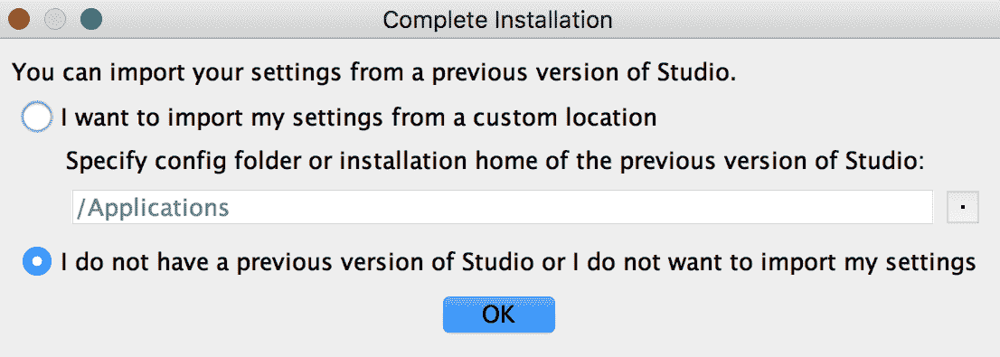
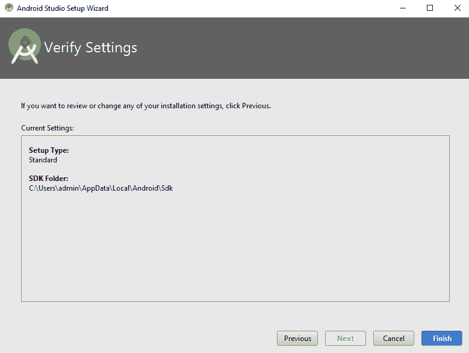
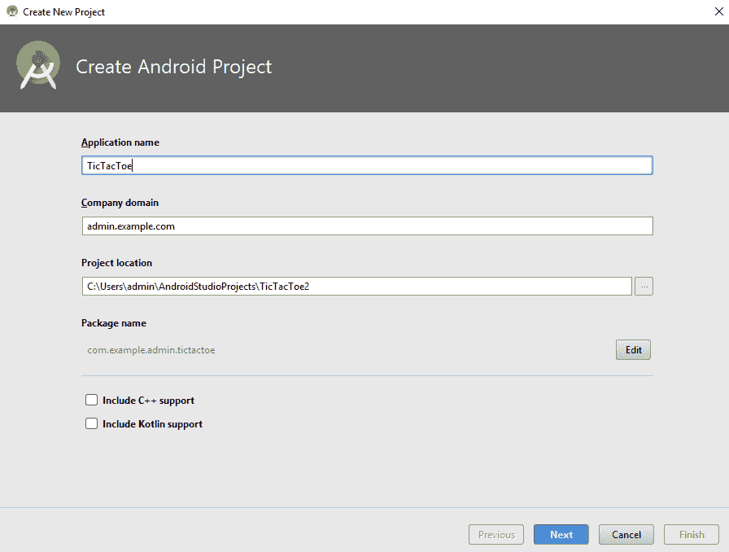
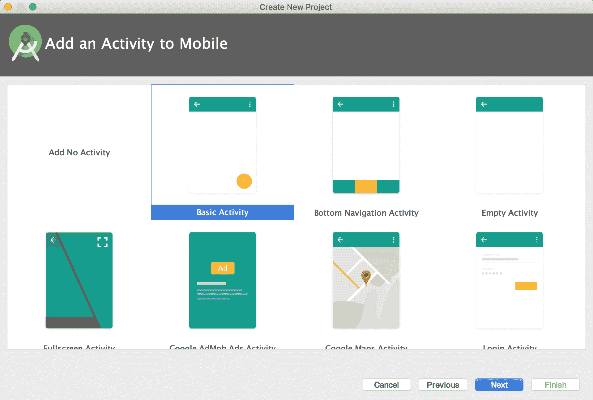
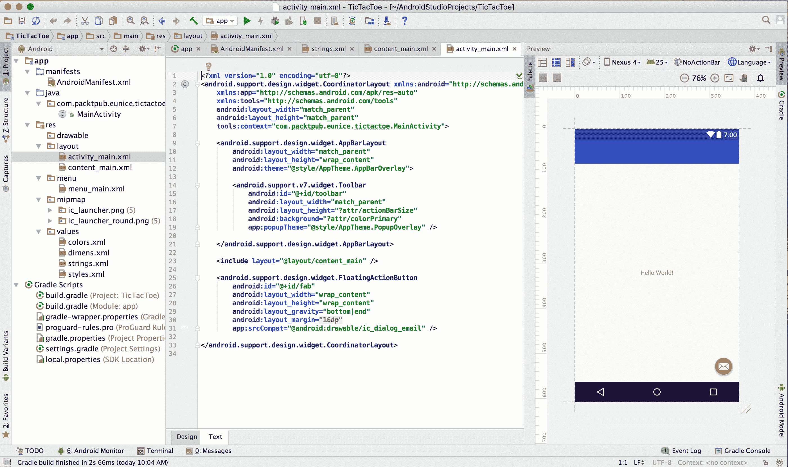
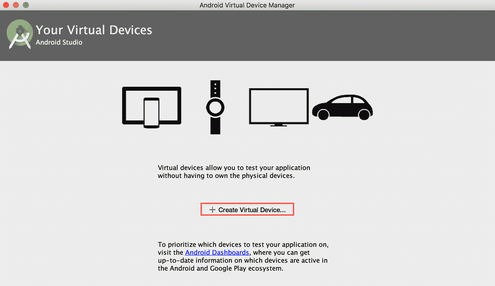
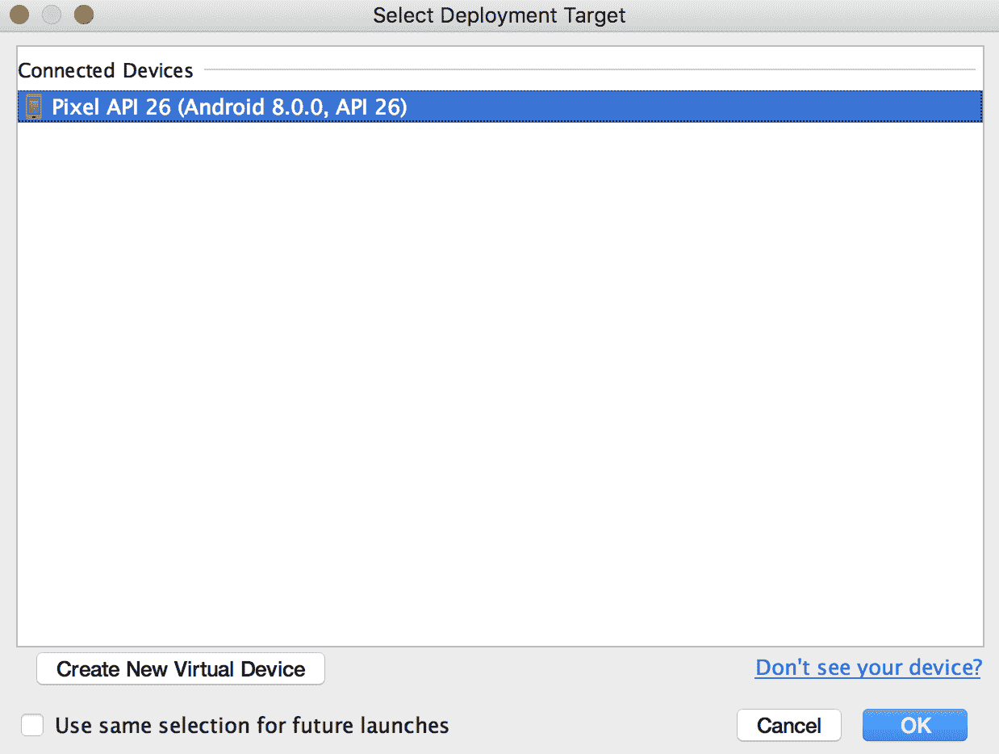
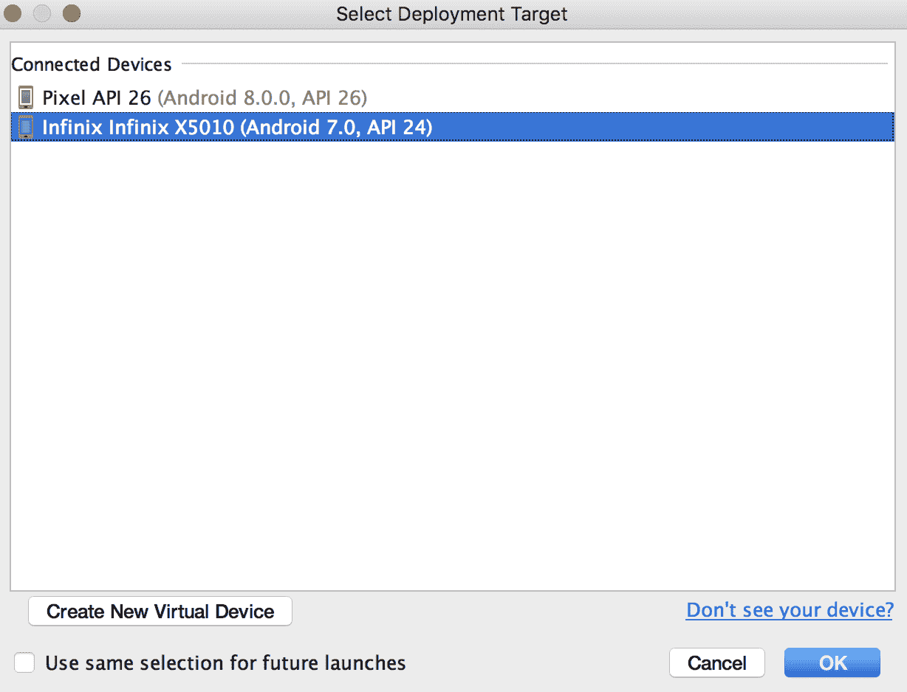

# 第一章：为 Android 开发进行设置

Java 是全球使用最广泛的语言之一，直到最近，它还是 Android 开发的首选语言。Java 在其所有伟大之处仍然存在一些问题。多年来，我们看到了许多试图解决 Java 问题的 JVM 语言的发展。其中一个相当新的是 Kotlin。Kotlin 是由 JetBrains 开发的一种新的编程语言，JetBrains 是一家生产软件开发工具的软件开发公司（他们的产品之一是 Android Studio 基于的 IntelliJ IDEA）。

在本章中，我们将看看：

+   Kotlin 在 Android 开发中的优势

+   为 Android 开发做好准备

# 为什么要用 Kotlin 开发 Android？

在所有的 JVM 语言中，Kotlin 是唯一一个为 Android 开发者提供了更多功能的语言。Kotlin 是除了 Java 之外唯一一个与 Android Studio 集成的 JVM 语言。

让我们来看看一些 Kotlin 的惊人特性。

# 简洁

Java 最大的问题之一是冗长。任何尝试在 Java 中编写一个简单的“hello world”程序的人都会告诉你需要多少行代码。与 Java 不同，Kotlin 不是一种冗长的语言。Kotlin 消除了很多样板代码，比如`getters`和`setters`。例如，让我们比较一下 Java 中的 POJO 和 Kotlin 中的 POJO。

**Java 中的学生 POJO**：

```kt
public class Student {

    private String name;

    private String id;

    public String getName() {
        return name;
    }

    public void setName(String name) {
        this.name = name;
    }

    public String getId() {
        return id;
    }

    public void setId(String id) {
        this.id = id;
    }
}
```

**Kotlin 中的学生 POJO**：

```kt
class Student() {
  var name:String
  var id:String
}
```

正如您所看到的，相同功能的 Kotlin 代码要少得多。

# 告别 NullPointerException

使用 Java 和其他语言的主要痛点之一是访问空引用。这可能导致您的应用程序崩溃，而不向用户显示充分的错误消息。如果您是 Java 开发人员，我相信您对`NullPointerException`非常熟悉。关于 Kotlin 最令人惊讶的一点是空安全性。

使用 Kotlin，`NullPointerException`只能由以下原因之一引起：

+   外部 Java 代码

+   显式调用抛出`NullPointerException`

+   使用`!!`运算符（我们稍后将学习更多关于这个运算符的知识）

+   关于初始化的数据不一致

这有多酷？

# Java 的互操作性

Kotlin 被开发成能够与 Java 舒适地工作。对于开发人员来说，这意味着您可以使用用 Java 编写的库。您还可以放心地使用传统的 Java 代码。而且，有趣的部分是您还可以在 Java 中调用 Kotlin 代码。

这个功能对于 Android 开发者来说非常重要，因为目前 Android 的 API 是用 Java 编写的。

# 设置您的环境

在开始 Android 开发之前，您需要做一些准备工作，使您的计算机能够进行 Android 开发。我们将在本节中逐一介绍它们。

如果您对 Android 开发不是很了解，可以跳过本节。

# Java

由于 Kotlin 运行在 JVM 上，我们必须确保我们的计算机上安装了**Java 开发工具包**（JDK）。如果您没有安装 Java，请跳转到安装 JDK 的部分。如果您不确定，可以按照以下说明检查您的计算机上安装的 Java 版本。

在 Windows 上：

1.  打开 Windows 开始菜单

1.  在 Java 程序列表下，选择关于 Java

1.  将会显示一个弹出窗口，其中包含计算机上 Java 版本的详细信息：

在 Mac 或其他 Linux 机器上：

1.  打开终端应用程序。要做到这一点，打开启动台并在搜索框中输入`终端`。终端应用程序将显示如下截图所示。选择它：


1.  在终端中，输入以下命令来检查您的计算机上的 JDK 版本：`java -version`

1.  如果你已经安装了 JDK，Java 的版本将会显示在下面的截图中：


# 安装 JDK

1.  打开浏览器，转到 Java 网站：[`www.oracle.com/technetwork/java/javase/downloads/index.html`](http://www.oracle.com/technetwork/java/javase/downloads/index.html)

1.  在“下载”选项卡下，单击 JDK 下的**下载**按钮，如下面的屏幕截图所示：


1.  在下一个屏幕上，选择“接受许可协议”复选框，然后单击与您的操作系统匹配的产品的下载链接

1.  下载完成后，继续安装 JDK

1.  安装完成后，您可以再次运行版本检查命令，以确保您的安装成功

# Android Studio

许多**IDE**支持 Android 开发，但最好和最常用的 Android IDE 是 Android Studio。 Android Studio 基于由 JetBrains 开发的 IntelliJ IDE。

# 安装 Android Studio

转到 Android Studio 页面，[`developer.android.com/sdk/installing/studio.html`](https://developer.android.com/sdk/installing/studio.html)，然后单击“下载 Android Studio”按钮：


在弹出窗口上，阅读并接受条款和条件，然后单击**下载适用于 Mac 的 Android Studio**按钮：


按钮的名称因使用的操作系统而异。

下载将开始，并且您将被重定向到一个说明页面（[`developer.android.com/studio/install`](https://developer.android.com/studio/install)）。

按照您的操作系统的指定说明安装 Android Studio。安装完成后，打开 Android Studio 并开始设置过程。

# 准备 Android Studio

在完整安装屏幕上，请确保选择了“我没有以前的 Studio 版本”或“我不想导入我的设置”选项，然后单击“确定”按钮：



在欢迎屏幕上，单击“下一步”转到安装类型屏幕：


然后，选择标准选项，然后单击“下一步”继续：


在“验证设置”屏幕上，通过单击“完成”按钮确认您的设置：



在“验证设置”屏幕上，列出的 SDK 组件将开始下载。您可以单击“显示详细信息”按钮查看正在下载的组件的详细信息：


下载和安装完成后，单击“完成”按钮。就是这样。您已经完成了安装和设置 Android Studio。

# 创建您的第一个 Android 项目

在欢迎使用 Android Studio 屏幕上，单击“开始新的 Android Studio 项目”：


这将启动创建新项目向导。在配置新项目屏幕上，将`TicTacToe`输入为应用程序名称。指定公司域。包名称是从公司域和应用程序名称生成的。

将项目位置设置为您选择的位置，然后单击“下一步”：



# 选择 SDK

在目标 Android 设备屏幕上，您必须选择设备类型和相应的最低 Android 版本，以便运行您的应用程序。 Android**软件开发工具包（SDK）**提供了构建 Android 应用程序所需的工具，无论您选择的语言是什么。

每个新版本的 SDK 都带有一组新功能，以帮助开发人员在其应用程序中提供更多令人敬畏的功能。然而，困难在于 Android 在非常广泛的设备范围上运行，其中一些设备无法支持最新版本的 Android。这使开发人员在实施出色的新功能或支持更广泛的设备范围之间陷入困境。

Android 试图通过提供以下内容来使这个决定更容易：

+   提供有关使用特定 SDK 的设备百分比的数据，以帮助开发人员做出明智的选择。要在 Android Studio 中查看此数据，请单击最低 SDK 下拉菜单下的“帮助我选择”。这将显示当前支持的 Android SDK 版本列表及其支持的功能，以及如果将其选择为最低 SDK，则应用程序将支持的 Android 设备的百分比：


您可以在 Android 开发者仪表板（[`developer.android.com/about/dashboards/`](https://developer.android.com/about/dashboards/)）上查看最新和更详细的数据。

+   Android 还提供了支持库，以帮助向后兼容某些新功能，这些功能是在较新的 SDK 版本中添加的。每个支持库都向后兼容到特定的 API 级别。支持库通常根据其向后兼容的 API 级别进行命名。一个例子是 appcompat-v7，它提供了对 API 级别 7 的向后兼容性。

我们将在后面的部分进一步讨论 SDK 版本。现在，您可以选择 API 15：Android 4.0.3（冰淇淋三明治）并单击“下一步”：


接下来的屏幕是“在移动屏幕上添加活动”。这是您选择默认活动的地方。 Android Studio 提供了许多选项，从空白屏幕的活动到带有登录屏幕的活动。现在，选择“基本活动”选项，然后单击“下一步”：



在下一个屏幕上，输入活动的名称和标题，以及活动布局的名称。然后，单击**完成**：


# 构建您的项目

单击“完成”按钮后，Android Studio 会在后台为您生成和配置项目。 Android Studio 执行的后台进程之一是配置 Gradle。

# Gradle

Gradle 是一个易于使用的构建自动化系统，可用于自动化项目的生命周期，从构建和测试到发布。在 Android 中，它接受您的源代码和配置的 Android 构建工具，并生成一个**Android Package** **Kit** (**APK**)文件。

Android Studio 生成了构建初始项目所需的基本 Gradle 配置。让我们来看看这些配置。打开`build.gradle`：


Android 部分指定了所有特定于 Android 的配置，例如：

+   `compileSdkVersion`：指定应用程序应使用的 Android API 级别进行编译。

+   `buildToolsVersion`：指定应用程序应使用的构建工具版本。

+   `applicationId`：在发布到 Play 商店时用于唯一标识应用程序。您可能已经注意到，它目前与创建应用程序时指定的包名称相同。在创建时，`applicationId`默认为包名称，但这并不意味着您不能使它们不同。您可以。只是记住，在发布应用程序的第一个版本后，不应再次更改`applicationId`。包名称可以在应用程序的清单文件中找到。

+   `minSdkVersion`：如前所述，这指定了运行应用程序所需的最低 API 级别。

+   `targetSdkVersion`：指定用于测试应用的 API 级别。

+   `versionCode`：指定应用的版本号。在发布之前，每个新版本都应更改此版本号。

+   `versionName`：为您的应用指定一个用户友好的版本名称。

依赖项部分指定了构建应用程序所需的依赖项。

# Android 项目的各个部分

我们将看看项目的不同部分。屏幕截图显示了我们的项目：



让我们进一步了解项目的不同部分：

+   `manifests/AndroidManifest.xml`：指定 Android 系统运行应用程序所需的有关应用程序的重要细节。其中一些细节是：

+   包名

+   描述应用程序的组件，包括活动，服务等等

+   声明应用程序所需的权限

+   `res`目录：包含应用程序资源，如图像，xml 布局，颜色，尺寸和字符串资源：

+   `res/layout`目录：包含定义应用程序**用户界面**（**UI**）的 xml 布局

+   `res/menu`目录：包含定义应用程序菜单内容的布局

+   `res/values`目录：包含资源，如颜色（`res/values/colors.xml`）和字符串（`res/values/strings.xml`）

+   以及您的 Java 和/或 Kotlin 源文件

# 运行您的应用程序

Android 使您能够在将应用程序发布到 Google Play 商店之前，就可以在实际设备或虚拟设备上运行您的应用程序。

# Android 模拟器

Android SDK 配备了一个在计算机上运行并利用其资源的虚拟移动设备。这个虚拟移动设备称为模拟器。模拟器基本上是一个可配置的移动设备。您可以配置其 RAM 大小，屏幕大小等。您还可以运行多个模拟器。当您想要在不同的设备配置（如屏幕大小和 Android 版本）上测试应用程序，但又负担不起实际设备时，这是非常有帮助的。

您可以在开发者页面上阅读有关模拟器的更多信息，网址为[`developer.android.com/studio/run/emulator`](https://developer.android.com/studio/run/emulator)。

# 创建 Android 模拟器

Android 模拟器可以从**Android 虚拟设备（AVD）**管理器创建。您可以通过单击 Android Studio 工具栏上的图标来启动 AVD 管理器，如下面的屏幕截图所示：


或者，通过从菜单中选择工具| Android | AVD 管理器：


在“您的虚拟设备”屏幕上，单击“创建虚拟设备...”按钮：



如果您已经创建了模拟器，按钮将位于屏幕底部：


下一步是选择要模拟的设备类型。AVD 管理器允许您为电视，手机，平板电脑和 Android 穿戴设备创建模拟器。

确保在屏幕左侧的类别部分中选择“手机”。浏览屏幕中间的设备列表并选择一个。然后，单击“下一步”：


在系统映像屏幕上，选择您希望设备运行的 Android 版本，然后单击“下一步”：


如果您想要模拟的 SDK 版本尚未下载，请单击其旁边的下载链接以下载它。

在验证配置屏幕上，通过单击“完成”按钮来确认虚拟设备设置：


您将被发送回“您的虚拟设备”屏幕，您的新模拟器将显示如下：


您可以单击“操作”选项卡下的播放图标来启动模拟器，或者单击铅笔图标来编辑其配置。

让我们继续通过单击播放图标来启动刚刚创建的模拟器：


您可能已经注意到，虚拟设备右侧带有一个工具栏。该工具栏称为**模拟器工具栏**。它使您能够模拟功能，如关闭、屏幕旋转、音量增加和减少以及缩放控件。

单击工具栏底部的 More(...)图标还可以让您访问额外的控件，以模拟指纹、设备位置、消息发送、电话呼叫和电池电量等功能：


# 从模拟器运行

从模拟器运行您的应用程序非常容易。单击 Android Studio 工具栏上的播放图标，如下面的屏幕截图所示：


在弹出的“选择部署目标”屏幕上，选择要在其上运行应用程序的设备，然后单击“确定”：



Android Studio 将在模拟器上构建和运行您的应用程序：


如果您尚未运行模拟器，您的模拟器将显示在***可用虚拟设备***部分下。选择它们将启动模拟器，然后在其上运行您的应用程序：


# 在实际设备上运行

要在实际设备上运行您的应用程序，您可以构建并将 APK 复制到设备上，并从那里运行。为此，Android 要求设备启用允许从未知来源安装应用程序的选项。请执行以下步骤：

1.  在您的设备上打开“设置”应用程序。

1.  选择“安全”。

1.  查找并打开“未知来源”选项。

1.  您将收到有关从未知来源安装应用程序的危险的提示。仔细阅读并单击“确定”以确认。

1.  就是这样。您现在可以上传您的 APK 并在手机上运行它。

您可以通过返回到“设置”|“安全”并关闭该选项来轻松禁用“未知来源”设置。

我们都可以同意以这种方式运行您的应用程序并不是非常理想的，特别是用于调试。考虑到这一点，Android 设备具有在不必将应用程序上传到设备的情况下非常轻松地运行和调试应用程序的能力。这可以通过连接设备使用 USB 电缆来完成。为此，Android 要求启用开发者模式。请按照以下说明启用开发者模式：

1.  在您的设备上打开“设置”应用程序。

1.  向下滚动并选择“关于手机”。

1.  在“手机状态”屏幕上，向下滚动并点击“版本号”多次，直到看到一个提示，上面写着“您现在是开发者！”

1.  返回到“设置”屏幕。现在应该会看到“开发人员选项”条目。

1.  选择“开发人员选项”。

1.  在“开发人员选项”屏幕上，打开屏幕顶部的开关。如果关闭，您将收到一个“允许开发设置？”对话框。单击“确定”以确认。

1.  向下滚动并打开 USB 调试。您将收到一个**允许 USB 调试？**对话框。单击“确定”以确认。

1.  接下来，通过 USB 将您的设备连接到计算机。

1.  您将收到另一个***允许 USB 调试？***对话框，其中包含您计算机的 RSA 密钥指纹。选择“始终允许此计算机”选项，然后单击“确定”以确认。

您现在可以在设备上运行您的应用程序。再次单击工具栏上的“运行”按钮，在“选择部署目标”对话框中选择您的设备，并单击“确定”：



就是这样。您现在应该在您的设备上看到您的应用程序：


# 摘要

在本章中，我们经历了检查和安装 JDK 的过程，这是 Android 开发所必需的。我们还安装并设置了我们的 Android Studio 环境。我们创建了我们的第一个 Android 应用程序，并学会在模拟器和实际设备上运行它。

在下一章中，我们将学习如何配置和设置 Android Studio 和我们的项目以使用 Kotlin 进行开发。
