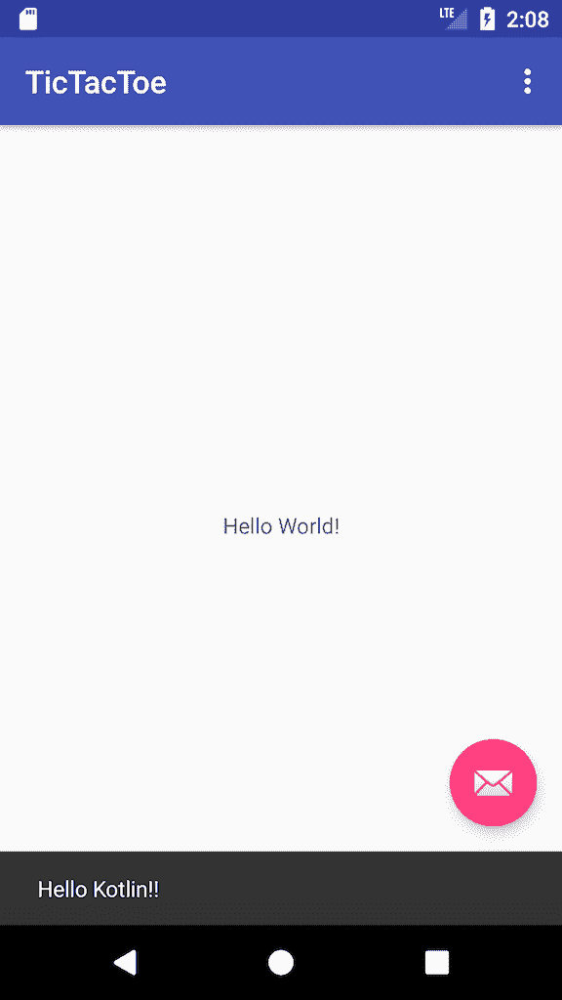
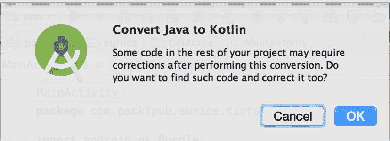

# 第二章：为 Kotlin 配置您的环境

在本章中，我们将介绍准备 Android Studio 和配置我们在上一章中创建的项目以进行 Kotlin 开发的过程。

在这个过程中，我们将学习如何：

+   在 Android Studio 中下载并安装 Kotlin 插件

+   在 Android 项目中配置 Kotlin

+   在 Kotlin 类中引用 Java 代码，反之亦然

+   将 Java 类转换为 Kotlin 类

# 安装 Kotlin 插件

要在项目中使用 Kotlin，首先必须在 Android Studio 中安装 Kotlin 插件：

1.  选择 Android Studio | 首选项，并在首选项窗口中选择插件：

！[](img/6eeca930-ba23-4cba-9262-9e4593ecaf45.png)

1.  在插件窗口上，点击屏幕底部的“安装 JetBrains 插件...”按钮：

！[](img/fbe19542-89f2-4282-a428-71b6b3ba60ac.png)

1.  在 Jetbrains 插件浏览屏幕上，搜索`Kotlin`并从选项列表中选择 Kotlin。然后，点击**安装**按钮：

！[](img/fcff73cc-716a-4821-acc3-22f88a3cfe8d.png)

1.  下载和安装完成后，点击“重新启动 Android Studio”按钮以重新启动 IDE。

最新版本的 Android Studio 和 3.0 以上的版本提供了对 Kotlin 的全面支持。在 3.0 以下的版本中，可以通过安装插件来启用 Kotlin 支持，如前所示。

# 使我们的项目准备好使用 Kotlin

要能够开始向我们的项目添加 Kotlin 代码，首先必须配置我们的项目以支持 Kotlin。

1.  首先，选择工具 | Kotlin | 配置项目中的 Kotlin：

！[](img/7b44bfcd-6216-469f-b715-425541d334a2.png)

1.  接下来，在选择配置器弹出窗口中选择带 Gradle 的 Android 选项：

！[](img/84bd81bf-8e66-44a3-8405-37b1770dff0f.png)

1.  在带 Gradle 的 Android 中配置 Kotlin 弹出窗口中，选择要使用的 Kotlin 版本，然后点击确定：

！[](img/e4f8234b-101b-466a-b2c2-6964455982c4.png)

建议保留默认选择的版本，因为这通常是最新版本。

这将导致项目中的`build.gradle`文件发生一些变化：

+   在项目的`build.gradle(Project:TicTacToe)`文件中，应用了以下更改：

+   声明项目中使用的 Kotlin 插件的版本

+   Kotlin Gradle 插件被声明为项目的类路径依赖之一：！[](img/74bb5c89-3e61-479d-bba4-f95c7d7eafa5.png)

+   在应用模块的`build.gradle(Module:app)`文件中，应用了以下更改：

+   `kotlin-android`插件应用于模块

+   Kotlin 的`Standard`库被声明为应用模块的`compile`时依赖：！[](img/43fba6df-86e6-4d68-bc59-435746142b29.png)

+   点击**立即同步**以构建项目

从 Android Studio 3.0 开始，Android Studio 内置了 Kotlin 支持。因此，您无需安装 Kotlin 插件即可使用它。

现在我们已经完全配置了 Kotlin，让我们试试它。

# Kotlin 和 Java 并存？

Kotlin 的一个令人惊奇的特点是它能够与 Java 在同一个项目中共存和工作。

让我们尝试创建一个 Kotlin 类。Android Studio Kotlin 插件使这一过程与创建 Java 类一样简单。选择**文件** | **新建** | **Kotlin 文件/类**：

！[](img/cb81df55-069c-4ff5-bbd4-86c507398631.png)

在**新建 Kotlin 文件/类**弹出窗口中，输入类的名称，从**种类**下拉菜单中选择`Class`，然后点击确定：

！[](img/0587550e-c61c-42d0-a07a-a892ade2b6ef.png)

新类看起来是这样的：

```kt
package com.packtpub.eunice.tictactoe

class HelloKotlin {
}
```

Kotlin 中的默认可见性修饰符是 public，因此无需像在 Java 类中那样指定 public 修饰符。

让我们在我们的新 Kotlin 类中添加以下方法：

```kt
fun displayMessage(view: View) {
    Snackbar.make(view, "Hello Kotlin!!", Snackbar.LENGTH_LONG).setAction("Action", null).show()
}
```

前面的方法将一个 Android 视图（`android.view.View`）作为参数，并将其与消息一起传递给 Snackbar 的`make()`方法以显示消息。

Kotlin 能够使用 Java 代码的能力称为**互操作性**。这个功能也可以反过来工作，允许从 Java 类调用 Kotlin 代码。让我们试试看：

打开`MainActivity.java`。在`onCreate()`方法中，用以下代码替换以下行：

```kt
Snackbar.make(view, "Replace with your own action", Snackbar.LENGTH_LONG).setAction("Action", null).show();
```

用以下内容替换：

```kt
new HelloKotlin().diplayMessage(view);
```

代码的前一行创建了`HelloKotlin`类的一个实例，并调用了它的`displayMessage()`方法。

构建并运行您的应用程序：



是的，就是这么简单。

# Kotlin 转 Java？

到目前为止，我们已经学习了创建 Kotlin 类并在`MainActivity.java`类中访问其方法的过程。我们的项目目前包括一个 Java 类和一个 Kotlin 类，但我们希望整个项目都是 Kotlin。那么，我们该怎么办？我们需要将`MainActivity.java`类重写为 Kotlin 吗？不需要。Kotlin 插件添加到 Android Studio 的功能之一是能够将 Java 代码转换为 Kotlin 的能力。

要做到这一点，请打开`MainActivity.java`类，然后转到“代码”|“将 Java 文件转换为 Kotlin 文件”：


您将收到有关转换准确性的警告消息。目前，我们不需要担心这个问题。只需单击“确定”继续：



您的`MainActivity.java`类现在应该是这样的：

```kt
class MainActivity : AppCompatActivity() {

    override fun onCreate(savedInstanceState: Bundle?) {
        super.onCreate(savedInstanceState)
        setContentView(R.layout.activity_main)
        val toolbar = findViewById(R.id.toolbar) as Toolbar
        setSupportActionBar(toolbar)

        val fab = findViewById(R.id.fab) as FloatingActionButton
        fab.setOnClickListener { view ->   
    HelloKotlin().displayKotlinMessage(view) }
    }

    override fun onCreateOptionsMenu(menu: Menu): Boolean {
        // Inflate the menu; this adds items to the action bar if it is   
       //present.
        menuInflater.inflate(R.menu.menu_main, menu)
        return true
    }

    override fun onOptionsItemSelected(item: MenuItem): Boolean {
        // Handle action bar item clicks here. The action bar will
        // automatically handle clicks on the Home/Up button, so long
        // as you specify a parent activity in AndroidManifest.xml.
        val id = item.itemId

        return if (id == R.id.action_settings) {
            true
        } else super.onOptionsItemSelected(item)

    }
}
```

您还会注意到文件的扩展名也已更改为`.kt`。

再次构建并运行您的应用程序：


# 总结

在本章中，我们学习了如何为 Kotlin 开发配置 Android Studio 和 Android 项目。我们还学习了如何从 Java 创建和调用 Kotlin 类。我们还学习了使用 Kotlin 插件将 Java 源文件转换为 Kotlin。如果您有用 Java 编写的旧代码，并且想逐渐转换为 Kotlin，这些功能特别有帮助。

在使用`Convert Java to Kotlin`功能时，请记住，在某些情况下，您需要对生成的 Kotlin 文件进行一些更正。

在接下来的几章中，我们将为我们的项目添加更多功能（您可能已经猜到，这是一个简单的**井字棋**游戏）。在这个过程中，我们将更深入地了解 Kotlin 作为一种语言的基础知识。我们将涵盖诸如数据类型、类、函数、协程和空安全等主题。
