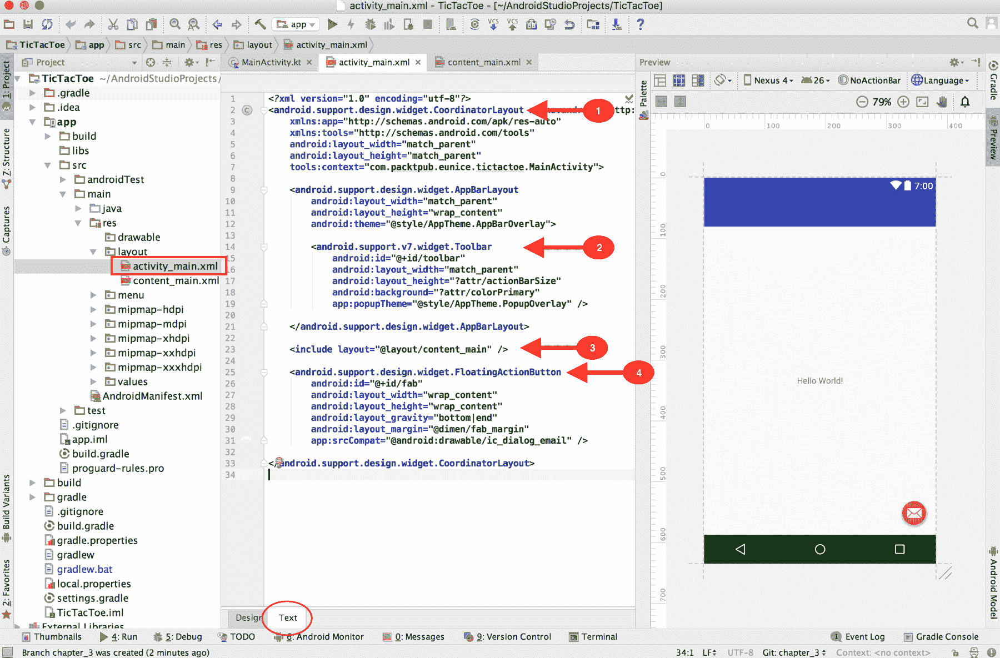

# 第三章：数据类型、变量和常量

在本章中，我们将开始构建我们的井字游戏，同时学习 Kotlin 中的数据类型、变量和常量。

到本章结束时，我们将有：

+   检查了应用程序的当前 UI

+   设计了游戏的 UI

+   在 Kotlin 中学习了基本类型

# 用户界面

在 Android 中，应用程序 UI 的代码是用 XML 编写的，并存储在布局文件中。让我们来看看在创建项目时创建的默认 UI。

打开 `res/layout/activity_main.xml`。确保在屏幕底部选择了 Text。Android Studio 应该会显示右侧的预览和 UI 的 XML 代码：



如果您在右侧看不到预览，请转到 View | Tool Windows | Preview 启用它。

现在，让我们来看看主活动布局的各个元素：

1.  父元素是 `CoordinatorLayout`。`CoordinatorLayout` 在 Android 5.0 中作为设计库的一部分引入。它提供了更好的控制，可以在其子视图之间进行触摸事件。当单击按钮时，我们已经看到了这种功能是如何工作的，`SnackBar` 出现在 `FloatingActionButton` 下方（而不是覆盖它）。

1.  标记为 `2` 的元素是 `Toolbar`，它充当应用程序的顶部导航。通常用于显示应用程序的标题、应用程序标志、操作菜单和导航按钮。

1.  `include` 标签用于将一个布局嵌入到另一个布局中。在这种情况下，`res/layout/content_main.xml` 文件包含了我们在运行应用程序时看到的 `TextView`（显示 Hello World! 消息）。我们的大多数 UI 更改将在 `res/layout/content_main.xml` 文件中完成。

1.  `FloatingActionButton`，您可能已经注意到，是一个可操作的浮动在屏幕上的 `ImageView`。

# 构建我们的游戏 UI

我们的井字游戏屏幕将包括游戏板（一个 3x3 的网格）、显示轮到谁了的 `TextView` 和用于重新开始游戏的 `FloatingActionButton`。

我们将使用 `TableLayout` 来设计游戏板。打开 `res/layout/content_main.xml` 文件，并将 `TextView` 声明替换为 `TableLayout` 声明，如下所示：

```kt
<TableLayout
    android:id="@+id/table_layout"
    android:layout_width="wrap_content"
    android:layout_height="wrap_content"
    app:layout_constraintBottom_toBottomOf="parent"
    app:layout_constraintLeft_toLeftOf="parent"
    app:layout_constraintRight_toRightOf="parent"
    app:layout_constraintTop_toTopOf="parent"
    android:gravity="center">

    <TableRow
        android:id="@+id/r0"
        android:layout_width="match_parent"
        android:layout_height="wrap_content"
        android:gravity="center_horizontal"
        android:background="@android:color/black">
        <TextView
            android:layout_width="100dp"
            android:layout_height="100dp"
            android:gravity="center"
            android:background="@android:color/white"
            android:layout_marginBottom="2dp"
            android:layout_marginTop="0dp"
            android:layout_column="0"
            android:layout_marginRight="2dp"
            android:layout_marginEnd="2dp"
            android:textSize="64sp"
            android:textColor="@android:color/black"
            android:clickable="true"/>
        <TextView
            android:layout_width="100dp"
            android:layout_height="100dp"
            android:gravity="center"
            android:background="@android:color/white"
            android:layout_marginBottom="2dp"
            android:layout_marginTop="0dp"
            android:layout_column="2"
            android:layout_marginRight="2dp"
            android:layout_marginEnd="2dp"
            android:textSize="64sp"
            android:textColor="@android:color/black"
            android:clickable="true"/>
        <TextView
            android:layout_width="100dp"
            android:layout_height="100dp"
            android:gravity="center"
            android:background="@android:color/white"
            android:layout_marginBottom="2dp"
            android:layout_marginTop="0dp"
            android:layout_column="2"
            android:layout_marginRight="2dp"
            android:layout_marginEnd="2dp"
            android:textSize="64sp"
            android:textColor="@android:color/black"
            android:clickable="true"/>
    </TableRow>

    </TableLayout>
```

这里有几件事情需要注意：

+   `TableRow` 元素表示表格的一行。从前面的代码中，行的每个元素都由一个 `TextView` 表示。

+   每个 `TextView` 都具有相似的属性。

+   前面的代码声明了一个 1x3 的表格，换句话说，是一个具有一行和三列的表格。由于我们想要创建一个 3x3 的网格，我们需要添加另外两个 `TableRow` 元素。

前面的代码已经包含了很多重复的代码。我们需要找到一种方法来减少重复的数量。这就是 `res/values` 的作用所在。

在添加两个额外的 `TableRow` 元素之前，让我们更好地组织我们的代码。打开 `res/values/styles.xml` 并添加以下代码：

```kt
<!--Table Row Attributes-->
<style name="TableRow">
    <item name="android:layout_width">match_parent</item>
    <item name="android:layout_height">wrap_content</item>
    <item name="android:gravity">center_horizontal</item>
    <item name="android:background">@android:color/black</item>
</style>

<!--General Cell Attributes-->
<style name="Cell">
    <item name="android:layout_width">100dp</item>
    <item name="android:layout_height">100dp</item>
    <item name="android:gravity">center</item>
    <item name="android:background">@android:color/white</item>
    <item name="android:layout_marginTop">@dimen/cell_margin</item>
    <item name="android:layout_marginBottom">@dimen/cell_margin</item>
    <item name="android:textSize">@dimen/large_text</item>
    <item name="android:textColor">@android:color/black</item>
    <item name="android:clickable">true</item>

</style>

<!--Custom Left Cell Attributes-->
<style name="Cell.Left">
    <item name="android:layout_column">0</item>
    <item name="android:layout_marginRight">@dimen/cell_margin</item>
</style>

<!--Custom Middle Cell Attributes-->
<style name="Cell.Middle">
    <item name="android:layout_column">1</item>
    <item name="android:layout_marginRight">@dimen/cell_margin</item>
    <item name="android:layout_marginLeft">@dimen/cell_margin</item>
</style>

<!--Custom Right Cell Attributes-->
<style name="Cell.Right">
    <item name="android:layout_column">2</item>
    <item name="android:layout_marginLeft">@dimen/cell_margin</item>
</style>
```

您可以通过以 **Parent.child** 的格式命名它们来创建继承自父级的子样式，例如，`Cell.Left`、`Cell.Middle` 和 `Cell.Right` 都继承了 `Cell` 样式的属性。

接下来，打开 `res/values/dimens.xml`。这是您在布局中声明的尺寸。将以下代码添加到资源元素中：

```kt
<dimen name="board_padding">16dp</dimen>
<dimen name="cell_margin">2dp</dimen>
<dimen name="large_text">64sp</dimen>
```

现在，打开 `res/values/strings.xml`。这是您在应用程序中声明所需的字符串资源。在资源元素中添加以下代码：

```kt
<string name="x">X</string>
<string name="o">O</string>
<string name="turn">%1$s\'s Turn</string>
<string name="winner">%1$s Won</string>
<string name="draw">It\'s a Draw</string>
```

然后，打开 `res/layout/content_main.xml` 文件，并将 `TableRow` 声明替换为以下内容：

```kt
<TableRow
    android:id="@+id/r0"
    style="@style/TableRow">
    <TextView
        style="@style/Cell.Left"
        android:layout_marginTop="0dp"/>
    <TextView
        style="@style/Cell.Middle"
        android:layout_marginTop="0dp"/>
    <TextView
        style="@style/Cell.Right"
        android:layout_marginTop="0dp"/>
</TableRow>
<TableRow
    android:id="@+id/r1"
    style="@style/TableRow">
    <TextView
        style="@style/Cell.Left"/>
    <TextView
        style="@style/Cell.Middle"/>
    <TextView
        style="@style/Cell.Right"/>
</TableRow>

<TableRow
    android:id="@+id/r2"
    style="@style/TableRow">

    <TextView
        style="@style/Cell.Left"
        android:layout_marginBottom="0dp"/>
    <TextView
        style="@style/Cell.Middle"
        android:layout_marginBottom="0dp"/>
    <TextView
        style="@style/Cell.Right"
        android:layout_marginBottom="0dp"/>
</TableRow>
```

我们现在已经声明了所有三行。正如您所看到的，我们的代码看起来更有组织性。

构建并运行以查看到目前为止的进展：


让我们继续添加一个 `TextView`，用于显示轮到谁了。打开 `res/layout/activity_main.xml` 并在 `include` 元素之前添加以下 `TextView` 声明：

```kt
<TextView
    android:id="@+id/turnTextView"
    app:layout_behavior="@string/appbar_scrolling_view_behavior"
    android:layout_width="match_parent"
    android:layout_height="wrap_content"
    android:text="@string/turn"
    android:textSize="64sp"
    android:textAlignment="center"
    android:layout_marginTop="@dimen/fab_margin"/>
```

通过替换以下代码来改变`FloatingActionButton`的图标和背景颜色：

```kt
app:srcCompat="@android:drawable/ic_dialog_email" 
```

使用以下内容：

```kt
app:srcCompat="@android:drawable/ic_input_add"
app:backgroundTint="@color/colorPrimary"
```

再次构建和运行：


就这样。我们完成了 UI 设计。

# 基本类型

在 Kotlin 中，没有原始数据类型的概念。所有类型都是带有成员函数和属性的对象。

# 变量和常量

使用`var`关键字声明变量，并使用`val`关键字声明常量。在声明变量或常量时，不必显式定义其类型。类型将从上下文中推断出来。`val`只能初始化一次。只有在明确声明为可空类型时，变量或常量才能被赋予空值。通过在类型的末尾添加`?`来声明可空类型：

```kt
var a: String = "Hello"
var b = "Hello"

val c = "Constant"
var d: String? = null // nullable String

b = null // will not compile

b = 0 // will not compile
c = "changed" // will not compile
```

例如，在上面的代码中，`a`和`b`都将被视为`String`。当尝试重新分配推断类型的变量时，不同类型的值将引发错误。`val`只能初始化一次。

# 属性

在 Kotlin 中，通过简单地引用名称来访问属性。尽管`getter`和`setter`不是必需的，但你也可以创建它们。属性的`getter`和/或`setter`可以作为其声明的一部分创建。如果属性是`val`，则不允许有`setter`。属性需要在创建时初始化：

```kt
var a: String = ""              // required
    get() = this.toString()     // optional
    set(v) {                    // optional
        if (!v.isEmpty()) field = v
    }
```

让我们继续声明一些我们在`MainActivity`类中需要的属性：

```kt
var gameBoard : Array<CharArray> = Array(3) { CharArray(3) } // 1
var turn = 'X' // 2
var tableLayout: TableLayout? = null // 3
var turnTextView: TextView? = null // 4

```

1.  `gameBoard`是一个 3x3 的矩阵，表示一个井字棋游戏板。它将用于存储棋盘上每个单元格的值。

1.  `turn`是一个 char 类型的变量，用于存储当前是谁的回合，X 还是 O。

1.  `tableLayout`是一个`android.widget.TableLayout`，将在`onCreate()`方法中用 xml 布局中的视图进行初始化。

1.  `turnTextView`是一个`android.widget.TextView`，用于显示当前是谁的回合。这也将在`onCreate()`方法中用 xml 布局中的视图进行初始化。

# 总结

在本章中，我们为简单的井字棋游戏设计了用户界面。我们还学习了如何在 Kotlin 中使用变量和常量。

在下一章中，我们将继续实现游戏逻辑，同时学习类和对象。
