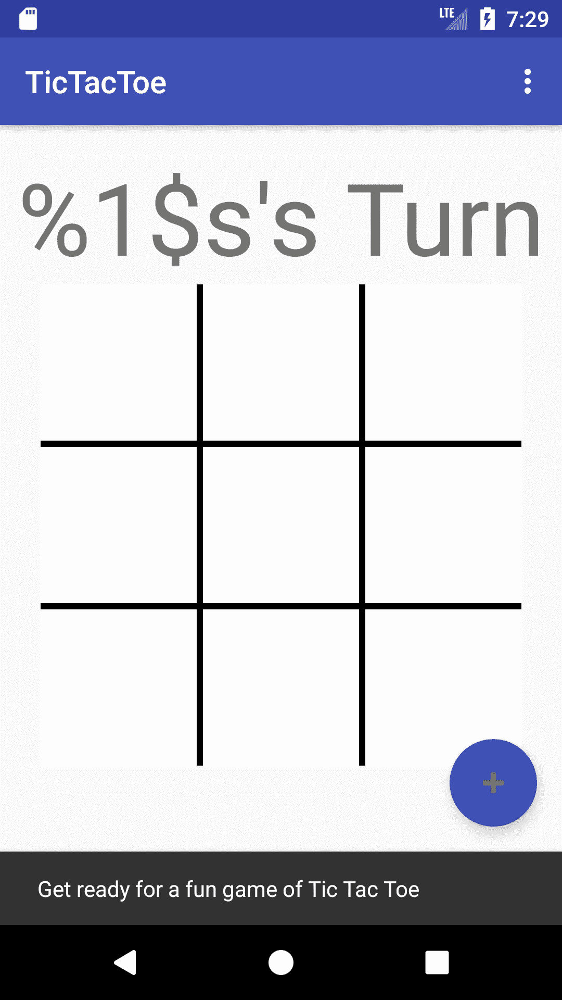
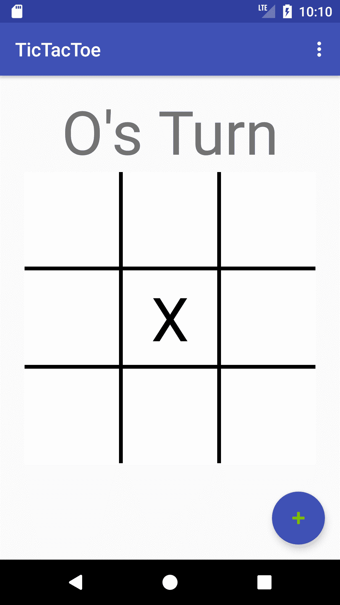

# 第四章：类和对象

在本章中，我们将继续在学习 Kotlin 中的类和对象的同时继续开发我们的 TicTacToe 游戏。

在本章结束时，我们将有：

+   在 Kotlin 中学习了类和对象

+   为游戏的一部分逻辑工作

# 类的结构

就像 Java 一样，在 Kotlin 中，使用`class`关键字声明类。类的基本结构包括：

+   `class`关键字

+   类的名称

+   页眉

+   类的主体用大括号括起来

页眉可以由主构造函数、父类（如果适用）和要实现的接口（如果适用）组成。

在四个部分中，只有前两个是强制的。如果类没有主体，您可以跳过大括号。

# 构造函数

就像在 Java 中一样，类可以有多个构造函数，但是在 Kotlin 中，主构造函数可以作为类的页眉的一部分添加。

例如，让我们向`HelloKotlin`类添加一个构造函数：

```kt
import kotlinx.android.synthetic.main.activity_main.*

class HelloKotlin constructor(message: String) {

    fun displayKotlinMessage(view: View) {
        Snackbar.make(view, "Hello Kotlin!!",
        Snackbar.LENGTH_LONG).setAction("Action", null).show()
    }
}
```

在先前的代码中，`HelloKotlin`类具有一个主构造函数，该构造函数接受一个名为`message`的字符串。

由于构造函数没有任何修饰符，因此我们可以完全摆脱`constructor`关键字：

```kt
class HelloKotlin (message: String) {

    fun displayKotlinMessage(view: View) {
        Snackbar.make(view, "Hello Kotlin!!", 
        Snackbar.LENGTH_LONG).setAction("Action", null).show()
    }

}
```

在 Kotlin 中，次要构造函数必须调用主构造函数。让我们看一下代码：

```kt
class HelloKotlin (message: String) {

    constructor(): this("Hello Kotlin!!")

    fun displayKotlinMessage(view: View) {
        Snackbar.make(view, "Hello Kotlin!!", 
        Snackbar.LENGTH_LONG).setAction("Action", null).show()
    }
}
```

关于次要构造函数的一些注意事项：

+   它不接受任何参数。

+   它使用默认消息调用主构造函数。

+   它不使用大括号。这是因为它没有主体，因此不需要大括号。如果我们添加一个主体，我们将需要使用大括号。

如果`displayKotlinMessage()`方法想要使用构造函数中传递的`message`参数，该怎么办？

有两种方法可以解决这个问题。您可以在`HelloKotlin`中创建一个字段，并使用传递的`message`参数进行初始化：

```kt
class HelloKotlin (message: String) {

    private var msg = message

    constructor(): this("Hello Kotlin!!")

    fun displayKotlinMessage(view: View) {
        Snackbar.make(view, msg, 
        Snackbar.LENGTH_LONG).setAction("Action", null).show()
    }
}
```

您还可以向`message`参数添加适当的关键字，使其成为类的字段：

```kt
class HelloKotlin (private var message: String) {

    constructor(): this("Hello Kotlin!!")

    fun displayKotlinMessage(view: View) {
        Snackbar.make(view, message, 
        Snackbar.LENGTH_LONG).setAction("Action", null).show()
    }
}
```

让我们试一下我们所做的更改。在`MainActivity`类的`onCreate()`方法中，让我们替换`HelloKotlin`初始化：

```kt
HelloKotlin().displayKotlinMessage(view)
```

我们将其替换为一个初始化，该初始化还传递了一条消息：

```kt
HelloKotlin("Get ready for a fun game of Tic Tac Toe").displayKotlinMessage(view)
```



单击 FloatingActionButton 时，传递的消息将显示在底部。

# 数据类

构建应用程序时，我们大多数时候需要的是仅用于存储数据的类。在 Java 中，我们通常使用 POJO。在 Kotlin 中，有一个称为**数据类**的特殊类。

假设我们想为我们的 TicTacToe 游戏保留一个记分牌。我们将如何存储每个游戏会话的数据？

在 Java 中，我们将创建一个 POJO，用于存储有关游戏会话的数据（游戏结束时的板和游戏的获胜者）：

```kt
public class Game {

    private char[][] gameBoard;
    private char winner;

    public Game(char[][] gameBoard, char winner) {
        setGameBoard(gameBoard);
        setWinner(winner);
    }

    public char[][] getGameBoard() {
        return gameBoard;
    }

    public void setGameBoard(char[][] gameBoard) {
        this.gameBoard = gameBoard;
    }

    public char getWinner() {
        return winner;
    }

    public void setWinner(char winner) {
        this.winner = winner;
    }
}
```

在 Kotlin 中，这大大简化为：

```kt
data class Game(var gameBoard: Array<CharArray>, var winner: Char)
```

前一行代码与前面的 26 行 Java 代码执行相同的操作。它声明了一个`Game`类，该类在其主构造函数中接受两个参数。正如前面所述，不需要`getters`和`setters`。

Kotlin 中的数据类还带有许多其他方法：

+   `equals()`/`hashCode()`对

+   `toString()`

+   `copy()`

如果您曾经编写过任何 Java 代码，您应该熟悉`equals()`、`hashCode()`和`toString()`。让我们继续讨论`copy()`。

当您想要创建对象的副本，但部分数据已更改时，`copy()`方法非常方便，例如：

```kt
data class Student(var name: String, var classRoomNo: Int, var studentId: Int) // 1

var anna = Student("Anna", 5, 1) // 2
var joseph = anna.copy("Joseph", studentId = 2) // 3
```

在前面的代码片段中：

1.  我们声明了一个名为`Student`的数据类。它在其主构造函数中接受三个参数：`name`、`classRoomNo`和`studentId`。

1.  `anna`变量是`Student`的一个实例，具有以下属性：`name:Anna`、`classRoomNo:5`和`studentId:1`。

1.  变量`joseph`是通过复制`anna`并更改两个属性——`name`和`studentId`而创建的。

# 对象

在我们深入讨论对象之前，让我们对 TicTacToe 游戏进行一些添加。让我们初始化我们的视图。将以下代码添加到`MainActivity`类中的`onCreate()`方法：

```kt
turnTextView = findViewById(R.id.turnTextView) as TextView // 1

tableLayout = findViewById(R.id.table_layout) as TableLayout // 2

startNewGame(true)
```

将以下方法添加到`MainActivity`类中：

```kt
private fun startNewGame(setClickListener: Boolean) {
    turn = 'X'
    turnTextView?.text = 
    String.format(resources.getString(R.string.turn), turn)
    for (i in 0 until gameBoard.size) {
        for (j in 0 until gameBoard[i].size) {
            gameBoard[i][j] = ' '
            val cell = (tableLayout?.getChildAt(i) as 
            TableRow).getChildAt(j) as TextView
            cell.text = ""
            if (setClickListener) {
            }
        }
    }
}

private fun cellClickListener(row: Int, column: Int) {
    gameBoard[row][column] = turn
    ((tableLayout?.getChildAt(row) as TableRow).getChildAt(column) as TextView).text = turn.toString()
    turn = if ('X' == turn) 'O' else 'X'
    turnTextView?.text = String.format(resources.getString(R.string.turn), turn)
}
```

1.  在一和二中，我们使用 XML 布局中对应的视图初始化`turnTextView`和`tableLayout`。

1.  在`startNewGame()`中：

+   我们重新初始化`turn`

+   我们将`turnTextView`设置为显示`turn`的值

+   我们重置了`gameBoard`的所有值

+   我们将`tableLayout`的所有单元格重置为空字符串

1.  在`cellClickListener()`中：

+   我们根据传递给`cellClickListener()`的参数将`turn`的值设置为`gameBoard`的特定元素

+   我们还将`tableLayout`上对应单元格的值更改为`turn`

+   我们根据`turn`的先前值将`turn`的值更改为下一个玩家

+   我们将`turnTextView`上显示的值更改为`turn`的新值

每次单元格被点击时，我们需要调用`cellClickListener()`。为此，我们需要为每个单元格添加一个点击侦听器。在 Android 中，我们使用`View.OnClickListener`。由于`View.OnClickListener`是一个接口，我们通常创建一个实现其方法的类，并将该类设置为我们的点击侦听器。

Java 和 Kotlin 都有简化此过程的方法。在 Java 中，您可以通过使用**匿名内部类**来绕过它。匿名内部类允许您同时声明和创建类的实例：

```kt
// Java Anonymous Inner Class
cell.setOnClickListener(new View.OnClickListener() {
    @Override
    public void onClick(View v) {

    }
});
```

在上述代码中，我们声明并创建了一个实现`View.OnClickListener`接口的类的实例。

在 Kotlin 中，这是使用**对象表达式**完成的。

将以下代码添加到`startNewGame()`方法中`if(setClickListener)`语句的主体中：

```kt
cell.setOnClickListener(object : View.OnClickListener {
    override fun onClick(v: View?) {
        cellClickListener(i, j)
    }
})
```

Kotlin 允许我们进一步简化先前的代码行。我们将在第六章中讨论这一点，*函数和 Lambda*，当我们谈论**Lambda**时。

构建并运行。现在，当您点击任何单元格时，其中的文本将更改为`turnTextView`的文本，并且`turnTextView`的值也将更改为下一个玩家的值：

 

# 摘要

在本章中，我们学习了类、数据类和对象表达式，同时初始化了我们的视图并为我们的游戏应用程序添加了额外的逻辑。

在下一章中，我们将深入讨论类型检查和空安全性，以及为什么 Kotlin 的这些特性使其成为最安全的语言之一。
