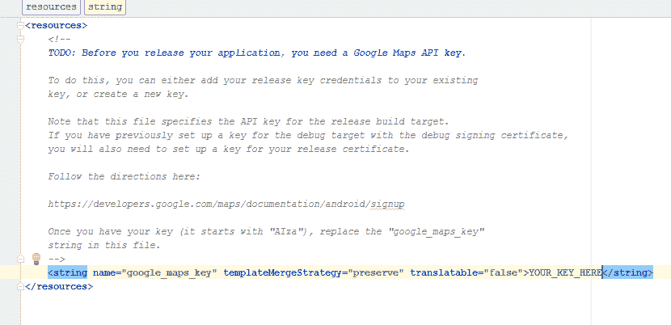
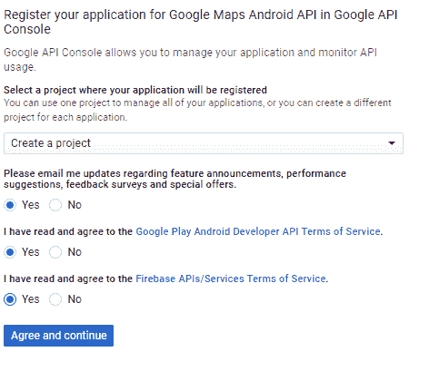
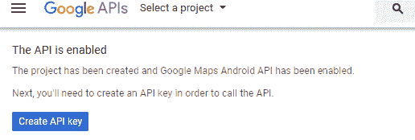
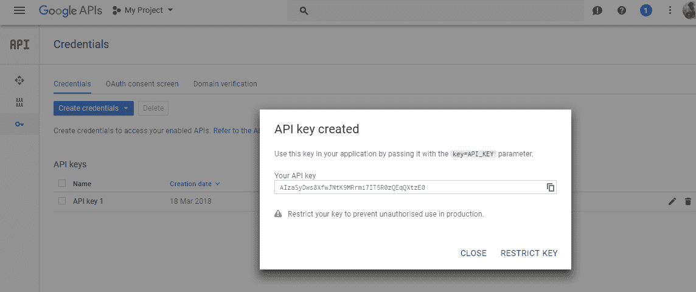
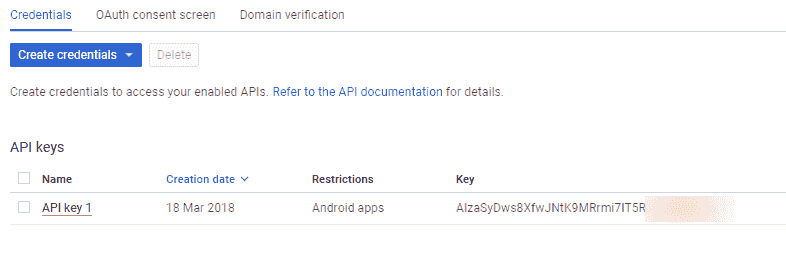
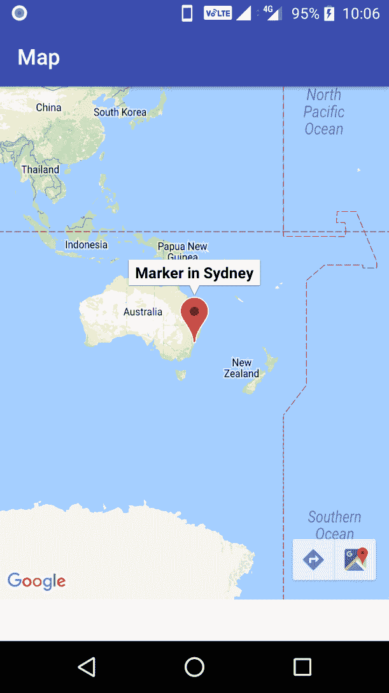
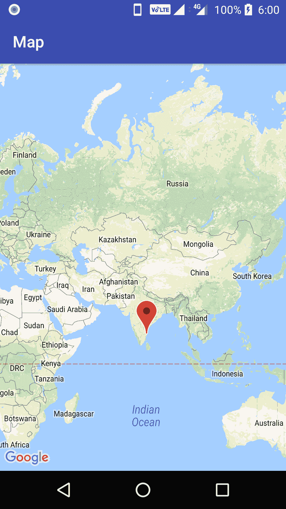
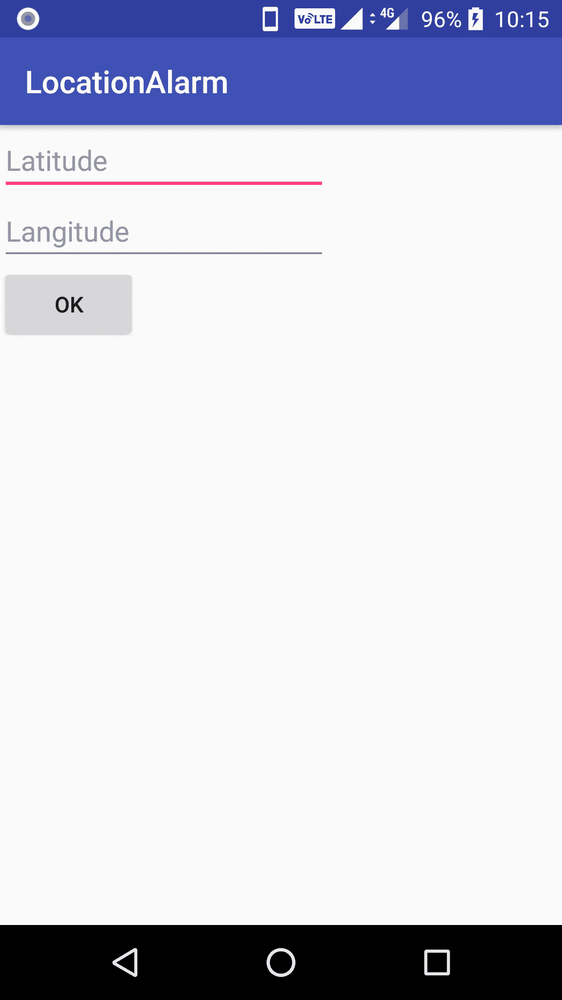

# 第七章：开发您的基于位置的闹钟

了解用户位置并为他们提供定制服务是 Android 设备的强大功能之一。 Android 应用程序开发人员可以利用这一强大功能，为其应用程序的用户提供迷人的服务。因此，了解 Google 位置服务、Google Maps API 和位置 API 对于 Android 应用程序的开发人员非常重要。

在本章中，我们将开发我们自己的**基于位置的闹钟**（**LBA**），并在开发应用程序的过程中，我们将了解以下内容：

+   基于 Android 活动创建地图

+   在 Android 应用程序中使用 Google Maps

+   注册并获取 Google Maps 活动所需的密钥的过程

+   为用户提供输入的屏幕

+   在下一章中，通过添加闹钟功能并使用 Google 位置服务来完成我们的应用程序并创建一个可行的模型

# 创建一个项目

我们将看看创建 LBA 所涉及的步骤。我们将使用我们最喜欢的 IDE，Android Studio，来开发 LBA。

让我们开始启动 Android Studio。一旦它启动并运行，点击开始一个新的 Android Studio 项目。如果您已经打开了一个项目，请点击文件|新建项目。

在下一个屏幕上，输入这里显示的详细信息：

+   **应用程序名称**：`LocationAlarm`。

+   **公司域**：Android Studio 使用域名来生成我们开发的应用程序的包名。包确保我们的应用程序在 Play 商店中获得唯一标识符。通常，包名将是域名的反向，例如，在这种情况下将是`com.natarajan.locationalarm`。

+   **项目位置**：我们希望开发和保存项目代码的路径。您可以选择并选择您正在开发应用程序的路径。由于我们正在使用 Kotlin 开发我们的应用程序，因此我们必须选择包括 Kotlin 支持：


在接下来的屏幕上，我们将根据以下内容做出关于我们针对的 Android 设备的决定：

+   它们提供的 API

+   表单因素

对于我们的应用程序，我们将选择手机和平板电脑，并选择 API 为 API 15。 API 选择框下方的文本告诉我们，通过选择 API 15 及更高版本，我们将选择使我们的应用程序在大约 100%的设备上运行。

帮助我选择选项将帮助您了解按 Android 版本（API）分组的全球 Android 设备的分布。

我们不会在任何其他表单因素上运行我们的应用程序；因此，我们可以跳过这些选择区域，然后点击下一步：


在下一个屏幕上，我们将有一个选项来向我们的应用程序添加一个活动。

Android Studio 通过提供最常用的活动的现成模板，使开发人员更容易地包含他们的应用程序所需的活动类型。

我们正在开发 LBA，因此我们需要一个显示设置了闹钟的位置的地图。

点击**Google Maps Activity**，然后点击下一步：


我们将在下一个屏幕上配置活动。一般来说，原生 Android 应用程序是由 Kotlin/Java 类和 XML 定义的用户界面组合而成。屏幕上提供了以下输入来配置我们的应用程序：

+   **活动名称**：这是我们地图活动的 Kotlin 类的名称。当我们选择地图活动时，默认情况下会显示名称 MapsActivity，我们将在这里使用相同的名称。

+   **布局名称**：我们将用于设计用户界面的 XML 布局的名称。

+   **标题**：我们希望应用程序为此活动显示的标题。我们将保留此标题为 Map，这是默认显示的。

完成这些条目后，点击完成按钮：


点击按钮后，我们将看到“构建'LocationAlarm' Gradle 项目信息”屏幕。

# 生成 Google Maps API 密钥

一旦构建过程完成，我们将看到以下资源文件屏幕默认打开并由 Android Studio 显示：

文件默认命名为`google_maps_api.xml`。该文件清楚地指示在运行应用程序之前，我们需要获取 Google Maps API 密钥。获取应用程序的 Google Maps API 密钥的过程将详细列出。

生成的密钥应该替换文件中提到的占位符 YOUR_KEY_HERE：

```kt
<resources>
 <!--
TODO: Before you run your application, you need a Google Maps API key.

To get one, follow this link, follow the directions and press "Create" at the end:

https://console.developers.google.com/flows/enableapi?apiid=maps_android_backend&keyType=CLIENT_SIDE_ANDROID&r=00:ED:1B:E2:03:B9:2E:F4:A9:0F:25:7A:2F:40:2E:D2:89:96:AD:2D%3Bcom.natarajan.locationalarm

You can also add your credentials to an existing key, using these values:
Package name:
 00:ED:1B:E2:03:B9:2E:F4:A9:0F:25:7A:2F:40:2E:D2:89:96:AD:2D
SHA-1 certificate fingerprint:
 00:ED:1B:E2:03:B9:2E:F4:A9:0F:25:7A:2F:40:2E:D2:89:96:AD:2D

Alternatively, follow the directions here:
 https://developers.google.com/maps/documentation/android/start#get-key

Once you have your key (it starts with "AIza"), replace the "google_maps_key"
 string in this file.
 -->
<string name="google_maps_key" templateMergeStrategy="preserve" translatable="false">YOUR_KEY_HERE</string>
 </resources>
```

我们将使用文件中提供的链接生成我们应用程序所需的密钥。

[`console.developers.google.com`](https://console.developers.google.com/apis/dashboard) 需要用户使用他们的 Google ID 进行登录。一旦他们登录，将会出现创建项目和启用 API 的选项。

选择并复制完整的链接（[`console.developers.google.com/flows/enableapi?apiid=maps_android_backend&keyType=CLIENT_SIDE_ANDROID&r=00:ED:1B:E2:03:B9:2E:F4:A9:0F:25:7A:2F:40:2E:D2:89:96:AD:2D;com.natarajan.locationalarm`](https://console.developers.google.com/flows/enableapi?apiid=maps_android_backend&keyType=CLIENT_SIDE_ANDROID&r=00:ED:1B:E2:03:B9:2E:F4:A9:0F:25:7A:2F:40:2E:D2:89:96:AD:2D;com.natarajan.locationalarm)）并在您喜欢的浏览器中输入：



一旦用户登录到控制台，用户将被要求在 Google API 控制台中为 Google Maps Android API 注册应用程序。

我们将看到一些选项：

+   选择一个项目

+   创建一个项目

如下文本所示，在选择应用程序将注册的项目时，用户可以使用一个项目来管理所有开发的应用程序的 API 密钥，或者选择为每个应用程序使用不同的项目。

使用一个项目来管理各种 Android 应用程序所需的所有 API 密钥，或者为每个应用程序使用一个项目，这取决于用户。在撰写本文时，默认情况下，用户将被允许免费创建 12 个项目。

接下来，您需要阅读并同意 Google Play Android 开发者 API 和 Firebase API/服务条款的条款和条件（[`console.developers.google.com/flows/enableapi?apiid=maps_android_backend&keyType=CLIENT_SIDE_ANDROID&r=00:ED:1B:E2:03:B9:2E:F4:A9:0F:25:7A:2F:40:2E:D2:89:96:AD:2D;com.natarajan.locationalarm`](https://console.developers.google.com/flows/enableapi?apiid=maps_android_backend&keyType=CLIENT_SIDE_ANDROID&r=00:ED:1B:E2:03:B9:2E:F4:A9:0F:25:7A:2F:40:2E:D2:89:96:AD:2D;com.natarajan.locationalarm) )：


选择创建一个项目并同意条款和条件。完成后，点击**同意并继续**：



一旦项目创建成功，用户将看到一个屏幕。屏幕上显示“项目已创建，已启用 Google Maps Android API。接下来，您需要创建一个 API 密钥以调用 API。”用户还将看到一个按钮，上面写着**创建 API 密钥**：



单击创建 API 密钥按钮后，用户将看到一个控制台，上面弹出一个消息，显示 API 密钥已创建。这是我们需要在应用程序中使用的 API 密钥：



复制 API 密钥，然后用生成的 API 密钥替换`google_maps_api.xml`文件中的 YOUR_API_KEY 文本，如下所示：


生成的带有生成的 Google Maps API 密钥的文件应该看起来像这样：


开发人员可以通过登录 Google API 控制台来检查生成的 API 密钥，并交叉检查为项目专门生成的正确 API 密钥的使用情况：



现在我们已经生成了 API 密钥并修改了文件以反映这一点，我们已经准备好分析代码并运行应用程序。

快速回顾一下，我们创建了包括 Google Maps 活动的应用程序，并创建了布局文件。然后我们生成了 Google Maps API 密钥并替换了文件中的密钥。

# 运行应用程序

要运行应用程序，请转到 Run | Run app 或单击**播放**按钮。

Android Studio 将提示我们选择部署目标，即具有开发人员选项和 USB 调试启用的物理设备，或者用户设置的虚拟设备，也称为模拟器。

一旦我们选择其中一个选项并点击“确定”，应用程序将构建并运行到部署目标上。应用程序将启动并运行，我们应该看到地图活动加载了悉尼的标记：



# 了解代码

我们成功运行了应用程序，现在是时候深入了解代码，了解它是如何工作的。

让我们从`MapsActivity.kt` Kotlin 类文件开始。

`MapActivity`类扩展了`AppCompatActivity`类，并实现了`OnMapReadCallback`接口。我们有一对变量，`GoogleMap`，`mMap`和`btn`按钮初始化。

重写`onCreate`方法，当应用程序启动时，将从 XML 文件`activity_maps.xml`中加载内容。

从资源文件设置`mapFragment`和`btn`的资源：

```kt
class MapsActivity : AppCompatActivity(), OnMapReadyCallback {

private lateinit var mMap: GoogleMap
 override fun onCreate(savedInstanceState: Bundle?) {
super.onCreate(savedInstanceState)
         setContentView(R.layout.activity_maps)
// Obtain the SupportMapFragment and get notified when the map is ready to be used.
val mapFragment = supportFragmentManager
.findFragmentById(R.id.map) as SupportMapFragment
         mapFragment.getMapAsync(this)
     }

 }
```

# 自定义代码

默认生成的代码显示了悉尼的市场。这里显示的`onMapReady`方法在地图准备就绪并加载并显示标记时被调用。位置是根据提到的`LatLng`值找到的：

```kt
override fun onMapReady(googleMap: GoogleMap) {
 mMap = googleMap
// Add a marker in Sydney and move the camera
val sydney= LatLng(-33.852,151.211)
mMap.addMarker(MarkerOptions().position(sydney).title("Marker in Sydney"))
mMap.moveCamera(CameraUpdateFactory.newLatLng(sydney))
}
```

现在让我们自定义此代码以在印度泰米尔纳德邦金奈上显示标记。要进行更改，第一步是了解`Lat`和`Lng`代表什么。

纬度和经度一起用于指定地球上任何部分的精确位置。在 Android 中，`LatLng`类用于指定位置。

# 查找地点的纬度和经度

在浏览器中使用 Google Maps 可以轻松找到地点的纬度和经度。为了我们的目的，我们将在我们喜欢的浏览器中启动 Google Maps。

搜索您需要找到纬度和经度的位置。在这里，我们搜索位于印度泰米尔纳德邦金奈的智障儿童特殊学校 Vasantham。

一旦我们找到了我们搜索的位置，我们可以在 URL 中看到纬度和经度的值，如下所示：


我们搜索到的地方的纬度和经度值分别为 13.07 和 80.17。让我们继续在代码中进行以下更改。

在`onMapReady`方法中，让我们进行以下更改：

+   将`Sydney`变量重命名为`chennai`

+   将 Lat 和 Lng 从悉尼更改为金奈

+   将`Marker`文本更改为`马德拉斯的标记`

+   将`newLatLng`更改为以`chennai`作为输入值

```kt
override fun onMapReady(googleMap: GoogleMap) {
 mMap = googleMap
// Add a marker in Chennai and move the camera
val chennai = LatLng(13.07975, 80.1798347)
 //val chennai = LatLng(-34.0, 151.0)
mMap.addMarker(MarkerOptions().position(chennai).title("Marker in Chennai"))
 mMap.moveCamera(CameraUpdateFactory.newLatLng(chennai))
 }
```

当我们保存所做的更改并再次运行应用程序时，我们将能够看到地图现在加载了位于印度金奈的标记：



一旦我们触摸标记，我们应该能够看到“马德拉斯的标记”文本显示在红色标记的顶部：


# XML 布局

我们已经详细查看了 Kotlin 类，以及自定义 Lat 和 Lng 输入的方法。

让我们快速检查 XML 布局文件。我们还将了解添加一个按钮的过程，该按钮将带我们到一个屏幕，通过该屏幕用户将能够输入警报的 Lat 和 Lng 输入。

在`activity_maps.xml`文件中，我们有地图片段和按钮元素包装在`LinearLayoutCompat`中，如下所示。我们将按钮元素链接到`onClickSettingsButton`方法：

```kt
<android.support.v7.widget.LinearLayoutCompat 

android:layout_width="match_parent"
android:layout_height="match_parent"
android:orientation="vertical"
android:layout_weight="1.0"><fragment
android:id="@+id/map"
android:layout_weight="0.8"
android:name="com.google.android.gms.maps.SupportMapFragment"
android:layout_width="match_parent"
android:layout_height="match_parent"
tools:context="com.natarajan.locationalarm.MapsActivity" />

<Button
android:layout_width="wrap_content"
android:layout_height="wrap_content"
android:layout_weight="0.2"
android:id="@+id/settingsbtn"
android:onClick="onClickSettingsButton"
android:text="@string/Settings"/>

 </android.support.v7.widget.LinearLayoutCompat>
```

在`MapsActivity` Kotlin 类中，我们可以定义一个名为`onClickSettingsButton`的方法，并在调用相同的方法时启动另一个名为`SETTINGACTVITY`的活动，如下所示：

```kt
fun onClickSettingsButton(view: View) {
 val intent = Intent("android.intent.action.SETTINGACTIVITY")
 startActivity(intent)
 }
```

# 开发用户输入屏幕

当点击`Settings`按钮时，我们的应用程序将带用户进入一个屏幕，用户可以在该屏幕上输入新位置的纬度和经度值，用户希望为该位置设置警报。

我们有一个非常简单的输入屏幕。我们有一个包含一对`EditText`的`LinearLayout`，一个用于纬度输入，另一个用于经度输入。这些编辑文本后面跟着一个按钮，允许用户提交输入的新位置坐标。

我们还有一个与按钮关联的`onClickButton`方法，当用户点击按钮时调用：

```kt
<?xml version="1.0" encoding="utf-8"?>
<LinearLayout 
android:layout_width="match_parent"
android:layout_height="match_parent"
android:orientation="vertical">

     <EditText
android:id="@+id/latText"
android:layout_width="wrap_content"
android:layout_height="wrap_content"
android:ems="10"
android:hint='Latitude'
android:inputType="numberDecimal" />

     <EditText
android:id="@+id/langText"
android:layout_width="wrap_content"
android:layout_height="wrap_content"
android:ems="10"
android:hint="Longitude"
android:inputType="numberDecimal" />

     <Button
android:id="@+id/alarmbtn"
android:layout_width="wrap_content"
android:layout_height="wrap_content"
android:onClick="onClickButton"
android:text="Ok" />

 </LinearLayout>
```

我们已经准备好用户输入的 XML 布局；现在让我们创建一个新的 Kotlin 活动类，该类将使用这个设置的 XML 并与用户交互。

`SettingsActivity`类扩展了`AppCompatActivity`，包含了一对编辑文本元素和初始化的按钮元素。变量通过它们的 ID 从资源文件中识别和设置为正确的资源。当活动被调用和加载时，活动加载`settings_activity` XML。

在`onClickButton`方法中，我们有一个简单的 Toast 消息，显示警报已设置。在接下来的章节中，我们将保存输入的内容，并在用户进入感兴趣的位置时触发警报：

```kt
class SettingsActivity : AppCompatActivity() {

public override fun onCreate(savedInstanceState: Bundle?) {
super.onCreate(savedInstanceState)
         setContentView(R.layout.settings_activity)

}
fun onClickButton(view: View) {
         Toast.makeText(this, "Alarm Set", Toast.*LENGTH_LONG*).show()
     }
}
```



当用户在输入纬度和经度后点击`OK`按钮时，将显示 Toast 消息，如下所示：


# AndroidManifest 文件

清单文件是项目中最重要的文件之一。在这个文件中，我们必须列出我们打算在应用程序中使用的所有活动，并提供有关我们用于 Google Maps API 的 API 密钥的详细信息。

在清单文件中，我们有以下重要的指针：

+   我们的应用程序使用`ACCESS_FINE_LOCATION`权限。这是为了获取用户位置的详细信息；我们需要这样做以便在用户到达设置的位置时启用警报。

`ACCESS_COARSE_LOCATION`是启用应用程序获取`NETWORK_PROVIDER`提供的位置详细信息的权限。`ACCESS_FINE_LOCATION`权限使应用程序能够获取`NETWORK_PROVIDER`和`GPS_PROVIDER`提供的位置详细信息。

+   我们有 Android geo API 密钥的元数据，这只是我们生成并放置在`google_maps_api.xml`中的 API 密钥。

+   我们有一个启动器 MAIN 活动，它在钦奈位置上启动带有标记的地图。

+   我们还有默认的活动设置，当点击`提交`按钮时触发：

```kt
*<?*xml version="1.0" encoding="utf-8"*?>* <manifest xmlns:android="http://schemas.android.com/apk/res/android" package="com.natarajan.locationalarm">
*<!--
          T*he ACCESS_COARSE/FINE_LOCATION permissions are not required to use
          Google Maps Android API v2, but you must specify either coarse or fine
          location permissions for the 'MyLocation' functionality. 
     --><uses-permission android:name="android.permission.ACCESS_FINE_LOCATION" />

     <application android:allowBackup="true" android:icon="@mipmap/ic_launcher" android:label="@string/app_name" android:roundIcon="@mipmap/ic_launcher_round" android:supportsRtl="true" android:theme="@style/AppTheme">
*<!--
        *      The API key for Google Maps-based APIs is defined as a string resource.
              (See the file "res/values/google_maps_api.xml").
              Note that the API key is linked to the encryption key used to sign the APK.
              You need a different API key for each encryption key, including the release key that is used to
              sign the APK for publishing.
              You can define the keys for the debug and release targets in src/debug/ and src/release/. *-->* <meta-data android:name="com.google.android.geo.API_KEY" android:value="@string/google_maps_key" />

         <activity android:name=".MapsActivity" android:label="@string/title_activity_maps">
             <intent-filter>
                 <action android:name="android.intent.action.MAIN" />
                 <category android:name="android.intent.category.LAUNCHER" />
             </intent-filter>
         </activity>

         <activity android:name=".SettingsActivity">
             <intent-filter>
                 <action android:name="android.intent.action.SETTINGACTIVITY" />
                 <category android:name="android.intent.category.DEFAULT" />
             </intent-filter>
         </activity>

     </application>

 </manifest>
```

# Build.gradle

`build.gradle`文件包括所需的 Google Maps 服务的依赖项。我们必须包括来自 Google Play 服务的 Play 服务地图。从 Google Play 服务中，我们包括我们感兴趣的服务。在这里，我们希望有一个地图服务可用，因此我们包括`play-services-maps`：

```kt
apply plugin: 'com.android.application' apply plugin: 'kotlin-android' apply plugin: 'kotlin-android-extensions' android {
     compileSdkVersion 26
defaultConfig {
         applicationId "com.natarajan.locationalarm" minSdkVersion 15
targetSdkVersion 26
versionCode 1
versionName "1.0" testInstrumentationRunner "android.support.test.runner.AndroidJUnitRunner" }
     buildTypes {
         release {
             minifyEnabled false proguardFiles getDefaultProguardFile('proguard-android.txt'), 'proguard-rules.pro' }
     }
 }

 dependencies {
     implementation fileTree(dir: 'libs', include: ['*.jar'])
     implementation"org.jetbrains.kotlin:kotlin-stdlib-jre7:$kotlin_version" implementation 'com.android.support:appcompat-v7:26.1.0'
 implementation 'com.google.android.gms:play-services-maps:11.8.0' testImplementation 'junit:junit:4.12' androidTestImplementation 'com.android.support.test:runner:1.0.1' androidTestImplementation 'com.android.support.test.espresso:espresso-core:3.0.1' }
```

# 总结

在本章中，我们讨论并学习了如何创建自己的 LBA。我们了解了 Google Maps API 的细节，API 密钥的生成，地图用户界面的创建，向地图添加标记，自定义标记，为用户输入创建用户界面屏幕等等。

我们还讨论了清单文件、`build.gradle`文件和 XML 布局文件以及相应的 Kotlin 类中的重要组件。在下一章中，我们将使用共享首选项保存从用户那里收到的输入，使用 Google API 的基于位置的服务，并在用户进入位置时启用和触发警报。
