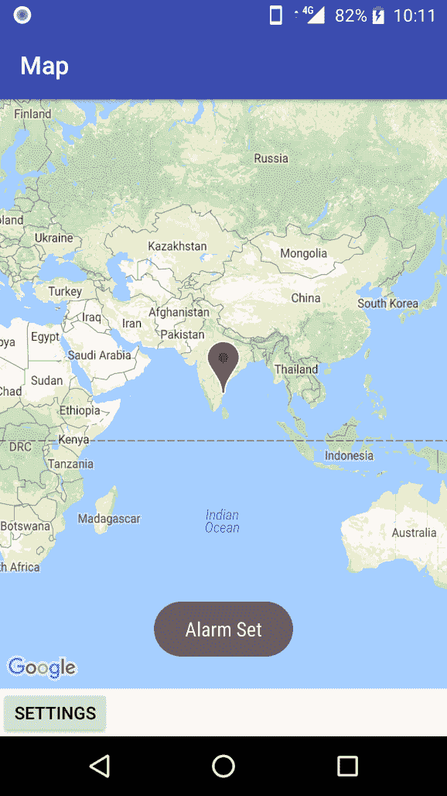
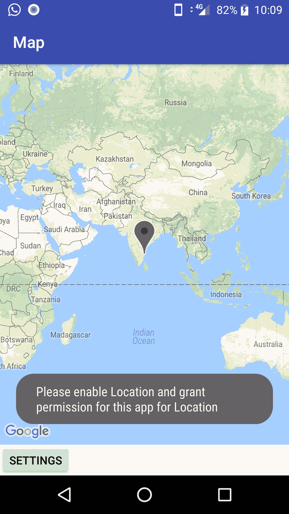
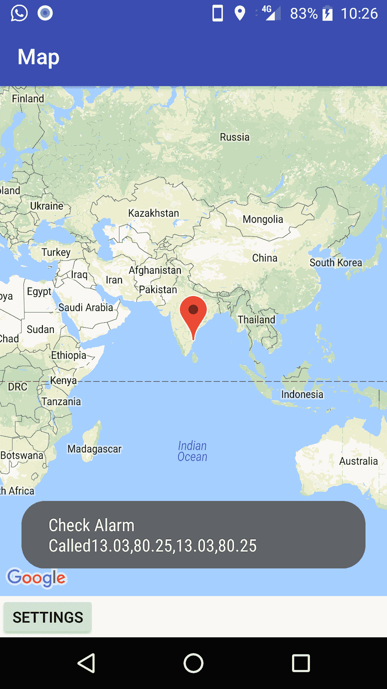

# 第八章：使用 Google 的位置服务

在上一章中，我们构建了我们的**基于位置的警报**（LBA）应用程序，包括 Google 地图，添加了标记和自定义位置，并为接收用户输入设置了 UI。

我们现在将专注于将 Google 位置 API 与我们的应用程序集成，并在用户的位置上接收更新。用户输入的感兴趣的位置将被保存并与接收到的警报位置更新进行比较，以便在用户到达感兴趣的区域时触发警报。

Google 提供了各种方式来访问和识别用户的位置。Google 位置 API 提供了关于用户上次已知位置的信息，显示位置地址，接收位置更改的持续更新等。开发人员可以添加地理围栏 - 围绕地理区域的围栏 - 任何时候用户通过地理围栏时都可以生成警报。

在本章中，我们将学习如何：

+   使用 Google 位置 API

+   接收用户当前位置的更新

+   利用用户共享首选项来保存用户感兴趣的位置

+   匹配并在用户到达感兴趣的位置时显示警报

本章的主要重点是介绍和解释我们应用程序中位置的概念和用法。考虑到这一目标，这些概念是通过应用程序在前台运行时接收位置更新来解释的。所需权限的处理也以更简单的方式处理。

# 集成共享首选项

我们的应用程序用户将输入他们希望触发警报的所需位置。用户输入位置的“纬度”和“经度”，以便我们将其与用户所在的当前位置进行比较，我们需要将他们输入的详细信息存储为所需位置。

共享首选项是基于文件的存储，包含键值对，并提供了更容易的读写方式。共享首选项文件由 Android 框架管理，文件可以是私有的或共享的。

让我们首先将共享首选项集成到我们的代码中，并保存用户在 UI 屏幕上输入的纬度和经度用于警报。

共享首选项为我们提供了以键值对的形式保存数据的选项。虽然我们可以使用通用的共享首选项文件，但最好为我们的应用程序创建一个特定的共享首选项文件。

我们需要为我们的应用程序定义一个共享首选项文件的字符串。导航到 app | src | main | res | values | strings.xml。让我们添加一个新的字符串`PREFS_NAME`，并将其命名为`LocationAlarmFile`：

```kt
<resources>
     <string name="app_name">LocationAlarm</string>
     <string name="title_activity_maps">Map</string>
     <string name="Settings">Settings</string>
    <string name="PREFS_NAME">LocationAlarmFile</string> </resources>
```

我们将在我们的`SettingsActivity`类中添加以下代码，以捕获用户输入并将其保存在共享首选项文件中。共享首选项文件通过在资源文件中引用字符串`PREFS_NAME`来打开，并且文件以`MODE_PRIVATE`打开，这表示该文件仅供我们的应用程序使用。

一旦文件可用，我们打开编辑器并使用`putString`将用户输入的纬度和经度作为字符串共享。

```kt
val sharedPref = this?.getSharedPreferences(getString(R.string.PREFS_NAME),Context.MODE_PRIVATE) ?: return with(sharedPref.edit()){ putString("userLat", Lat?.text.toString())
     putString("userLang",Lang?.text.toString())
     commit()
```

从共享首选项中读取和显示：

```kt
      val sharedPref = 
 this?.getSharedPreferences(getString(R.string.PREFS_NAME), 
      Context.MODE_PRIVATE) ?: return AlarmLat = 
     java.lang.Double.parseDouble(sharedPref.getString("userLat",   
 "13.07975"))
         AlarmLong = 
     java.lang.Double.parseDouble(sharedPref.getString("userLang", 
 "80.1798347"))
```

用户将收到有关设置警报的警报：



用户输入的纬度将存储并从共享首选项中读取并显示：


用户输入的经度也将从共享首选项中读取并显示：


# 添加权限

Google Play 服务提供了可以集成和使用的基于位置的服务。添加位置服务并使用它们需要权限来识别并从用户那里获取位置更新。

要使用来自 Play 服务的 Google 位置服务，我们需要在`build.gradle`文件中包含`play-services-location`：

```kt
dependencies {
    compile 'com.google.android.gms:play-services-location:11.8.0'
}
```

重要的是**仅**从 Google Play 服务中包含应用程序所需的特定功能。例如，在这里我们需要位置服务，因此我们需要指定位置的服务。包含所有 Google Play 服务将使应用程序大小变得庞大；请求不真正需要的权限。

我们还需要在 `AndroidManifest.xml` 文件中添加访问精确定位的权限。这使我们可以从网络提供商和 GPS 提供商获取位置详细信息：

```kt
 <uses-permission android:name="android.permission.ACCESS_FINE_LOCATION" />
```

在运行时，我们需要检查设备是否已启用位置；如果没有，我们将显示一条消息，请求用户启用位置并授予权限。

`checkLocation` 布尔函数用于判断设备是否已启用位置：

```kt
private fun checkLocation(): Boolean {
         if(!isLocationEnabled())
             Toast.makeText(this,"Please enable Location and grant permission for this app for Location",Toast.LENGTH_LONG).show()
         return isLocationEnabled();
     }

private fun isLocationEnabled(): Boolean {
     locationManager = getSystemService(Context.LOCATION_SERVICE) as 
     LocationManager
     return locationManager.isProviderEnabled(LocationManager.GPS_PROVIDER) || locationManager.isProviderEnabled(LocationManager.NETWORK_PROVIDER)
 }
```



# 位置 API 的集成

我们将集成位置 API 到我们的应用程序中以接收位置更新。位置 API 的集成涉及代码的一些更改。让我们详细讨论这些更改。

# 类和变量

Google 位置 API 的集成需要 `MapsActivity` 实现 `GoogleAPIClient`、`ConnectionCallbacks` 和连接失败监听器。让我们继续对 `MapsActivity` 进行更改。之前，`MapsActivity` 扩展了 `AppCompatActivity` 并实现了 `OnMapReadyCallback` 接口。现在，由于我们需要使用位置 API，我们还必须实现 `GoogleAPIClient`、`ConnectionCallbacks` 和 `onConnectionFailedListener`，如下所示：

```kt
class MapsActivity : AppCompatActivity(), OnMapReadyCallback ,GoogleApiClient.ConnectionCallbacks, GoogleApiClient.OnConnectionFailedListener, com.google.android.gms.location.LocationListener {
```

我们声明了 `GoogleMap` 所需的变量和其他变量，用于存储来自用户和位置 API 的纬度和经度：

```kt
    private lateinit var mMap: GoogleMap
    private var newLat: Double? = null
    private var newLang: Double? = null
    private var chennai: LatLng? = null

    private var AlarmLat: Double? = null
    private var AlarmLong: Double? = null
    private var UserLat: Double? = null
    private var UserLong: Double? = null

     //location variablesprivate val TAG = "MapsActivity" private lateinit var mGoogleApiClient: GoogleApiClient
    private var mLocationManager: LocationManager? = null
    lateinit var mLocation: Location
    private var mLocationRequest: LocationRequest? = null
```

我们声明 `UPDATE_INTERVAL`，即我们希望从位置 API 接收更新的间隔，以及 `FASTEST_INTERVAL`，即我们的应用程序可以处理更新的速率。我们还声明 `LocationManager` 变量：

```kt
 private val UPDATE_INTERVAL = 10000.toLong() // 10 seconds rate at 
     //  which we would like to receive the updates
     private val FASTEST_INTERVAL: Long = 5000 // 5 seconds - rate at  
     //  which app can handle the update lateinit var locationManager: LocationManager
```

在 `onCreate` 函数中，我们为 UI 设置内容视图，并确保 `GoogleApiClient` 已实例化。我们还请求用户启用位置如下：

`onCreate()`：

```kt
   override fun onCreate(savedInstanceState: Bundle?) {
         super.onCreate(savedInstanceState)
         setContentView(R.layout.*activity_maps*)
         // Obtain the SupportMapFragment and get notified when the map    
         is ready to be used. val mapFragment = *supportFragmentManager
                * .findFragmentById(R.id.*map*) as SupportMapFragment
         mapFragment.getMapAsync(this)

         mGoogleApiClient = GoogleApiClient.Builder(this)
                 .addConnectionCallbacks(this)
                 .addOnConnectionFailedListener(this)
                 .addApi(LocationServices.API)
                 .build()

         mLocationManager =   
 this.getSystemService(Context.LOCATION_SERVICE) as  
         LocationManager
         checkLocation()
 }
```

# Google API 客户端

声明、初始化和管理 Google API 客户端的连接选项需要在 Android 应用程序的生命周期事件中处理。一旦建立连接，我们还需要获取位置更新。

在 `onStart` 方法中，我们检查 `mGoogleAPIClient` 实例是否不为空，并请求初始化连接：

```kt
   override fun onStart() {
         super.onStart();
         if (mGoogleApiClient != null) {
             mGoogleApiClient.connect();
         }
     }
```

在 `onStop` 方法中，我们检查 `mGoogleAPIClient` 实例是否已连接，如果是，则调用 `disconnect` 方法：

```kt
    override fun onStop() {
         super.onStop();
         if (mGoogleApiClient.isConnected()) {
             mGoogleApiClient.disconnect();
         }
     }
```

如果出现问题并且连接被挂起，我们在 `onConnectionSuspended` 方法中请求重新连接：

```kt
     override fun onConnectionSuspended(p0: Int) {

         Log.i(TAG, "Connection Suspended");
         mGoogleApiClient.connect();
     }
```

如果 Google 位置 API 无法建立连接，我们通过获取错误代码来记录连接失败的原因：

```kt
     override fun onConnectionFailed(connectionResult: 
        ConnectionResult) {
     Log.i(TAG, "Connection failed. Error: " + 
        connectionResult.getErrorCode());
     }
```

在 `onConnected` 方法中，我们首先检查是否有 `ACCESS_FINE_LOCATION` 权限，并且 `ACCESS_COARSE_LOCATION` 确实存在于清单文件中。

一旦确保已授予权限，我们调用 `startLocationUpdates()` 方法：

```kt
override fun onConnected(p0: Bundle?) {

         if (ActivityCompat.checkSelfPermission(this,   
            Manifest.permission.ACCESS_FINE_LOCATION) != 
            PackageManager.PERMISSION_GRANTED && 
            ActivityCompat.checkSelfPermission(this, 
            Manifest.permission.ACCESS_COARSE_LOCATION) != 
            PackageManager.PERMISSION_GRANTED) {

             return;
         }
         startLocationUpdates();
```

`fusedLocationProviderClient` 提供当前位置详细信息，并将其分配给 `mLocation` 变量：

```kt
var fusedLocationProviderClient :
         FusedLocationProviderClient =   
         LocationServices.getFusedLocationProviderClient(this);
         fusedLocationProviderClient .getLastLocation()
         .addOnSuccessListener(this, OnSuccessListener<Location> {   
         location ->
                     if (location != null) {
                         mLocation = location;
 } }) }
```

`startLocationUpdates` 创建 `LocationRequest` 实例，并提供我们设置的更新参数。我们还调用 `FusedLocationAPI` 并请求位置更新：

```kt

 protected fun startLocationUpdates() {
          // Create the location request mLocationRequest = LocationRequest.create()
                 .setPriority(LocationRequest.PRIORITY_HIGH_ACCURACY)
                 .setInterval(UPDATE_INTERVAL)
                 .setFastestInterval(FASTEST_INTERVAL);
         // Request location updates if (ActivityCompat.checkSelfPermission(this, 
          Manifest.permission.ACCESS_FINE_LOCATION) !=   
          PackageManager.PERMISSION_GRANTED && 
          ActivityCompat.checkSelfPermission(this, 
          Manifest.permission.ACCESS_COARSE_LOCATION) != 
          PackageManager.PERMISSION_GRANTED) {
             return;
         }

      LocationServices.FusedLocationApi.requestLocationUpdates(
 mGoogleApiClient, mLocationRequest, this);
     }

```

`onLocationChanged` 方法是一个重要的方法，我们可以在其中获取用户当前位置的详细信息。我们还从共享偏好中读取用户输入的警报的纬度和经度。一旦我们获得了这两组详细信息，我们调用 `CheckAlarmLocation` 方法，该方法匹配纬度/经度并在用户到达感兴趣的区域时提醒用户：

```kt
override fun onLocationChanged(location: Location) { 
        val sharedPref =  
 this?.getSharedPreferences(getString(R.string.*PREFS_NAME*), 
      Context.*MODE_PRIVATE*)
           ?: return
        AlarmLat = 
      java.lang.Double.parseDouble(sharedPref.getString("userLat", 
 "13.07975"))
        AlarmLong = 
      java.lang.Double.parseDouble(sharedPref.getString("userLang", 
 "80.1798347"))

         UserLat = location.latitude
 UserLong = location.longitude
 val AlarmLat1 = AlarmLat val AlarmLong1 = AlarmLong
         val UserLat1 = UserLat
         val UserLong1 = UserLong

         if(AlarmLat1 != null && AlarmLong1 != null && UserLat1 != null 
         && UserLong1 != null){

      checkAlarmLocation(AlarmLat1,AlarmLong1,UserLat1,UserLong1)
         }
     }
```



# 匹配位置

`startLocationUpdates`方法根据我们设置的间隔持续提供用户的当前纬度和经度。我们需要使用获取到的纬度和经度信息，并将其与用户输入的用于设置警报的纬度和经度进行比较。

用户输入感兴趣的位置时，我们会显示警报消息，告知用户已经到达设置了警报的区域：

```kt
fun checkAlarmLocation(AlarmLat : Double, AlarmLong : Double, UserLat : Double,UserLong : Double) {

    Toast.makeText(this,"Check Alarm Called" + AlarmLat + "," + AlarmLong + "," + UserLat + "," + UserLong,Toast.*LENGTH_LONG* ).show()

         var LatAlarm: Double
         var LongAlarm: Double
         var LatUser: Double
         var LongUser: Double

         LatAlarm = Math.round(AlarmLat * 100.0) / 100.0;
         LongAlarm = Math.round(AlarmLong * 100.0) / 100.0;

         LatUser = Math.round(UserLat * 100.0) / 100.0;
         LongUser = Math.round(UserLong * 100.0) / 100.0;

Toast.makeText(this,"Check Alarm Called" + LatAlarm + "," + LongAlarm + "," + LatUser + "," + LongUser,Toast.*LENGTH_LONG* ).show()

         if (LatAlarm == LatUser && LongAlarm == LongUser) {
             Toast.makeText(this, "User has reached the area for which 
             alarm has been set", Toast.LENGTH_LONG).show();
         }
     }
```


# 摘要

在本章中，我们继续开发基于位置的闹钟应用程序，利用了来自 Google Play 服务的 Google 位置 API，并利用了提供警报的功能，当用户进入感兴趣的区域时。

我们学习了如何使用共享偏好来持久化用户输入的数据，检索相同的数据，并使用位置 API 来将用户的当前位置与感兴趣的区域进行匹配。
