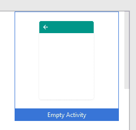
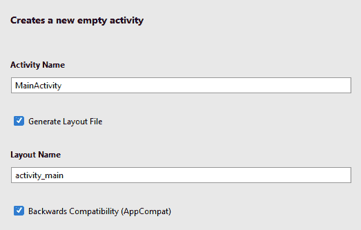
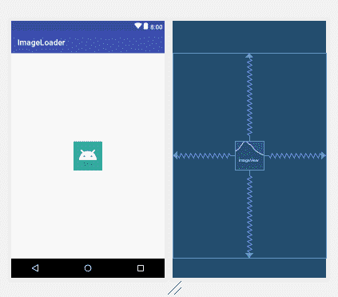
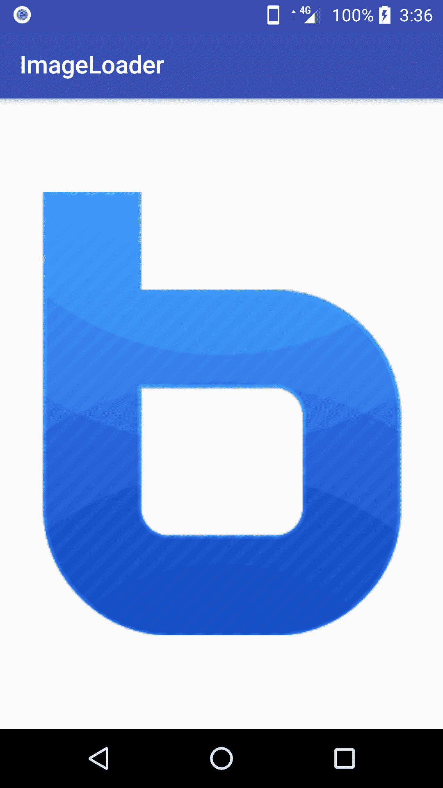

# 第九章：连接外部世界-网络

我们生活在数字通信的时代。手持设备在通信中起着重要作用，并影响人们的互动方式。在上一章中，我们讨论了 Android 的一个强大功能——识别用户的位置并根据位置定制服务。在本章中，我们将专注于 Android 设备最有用和强大的功能之一——网络和连接到外部世界。

虽然我们将简要介绍网络连接的重要概念和 Android 框架对网络的支持，但我们将重点关注内置的第三方库的配置和使用。我们还将学习如何从 URL 加载图像并在我们创建的示例应用程序中显示它。

我们将涵盖以下内容：

+   网络连接

+   Android 框架对网络的支持

+   使用内置库

+   使用第三方库

# 网络连接

了解和识别用户连接的网络的状态和类型对于为用户提供丰富的体验非常重要。Android 框架为我们提供了一些类，我们可以使用它们来查找网络的详细信息：

+   `ConnectivityManager`

+   `NetworkInfo`

虽然`ConnectivityManager`提供有关网络连接状态及其变化的信息，但`NetworkInfo`提供有关网络类型（移动或 Wi-Fi）的信息。

以下代码片段有助于确定网络是否可用，以及设备是否连接到网络：

```kt
fun isOnline(): Boolean {
    val connMgr = getSystemService(Context.CONNECTIVITY_SERVICE) as  
    ConnectivityManager
    val networkInfo = connMgr.activeNetworkInfo
    return networkInfo != null && networkInfo.isConnected
}
```

`isOnline()`方法根据`ConnectivityManager`返回的结果返回一个`Boolean`——true 或 false。`connMgr`实例与`NetworkInfo`一起使用，以查找有关网络的信息。

# 清单权限

访问网络并发送/接收数据需要访问互联网和网络状态的权限。应用程序的清单文件必须定义以下权限，以便应用程序利用设备的网络：

```kt
<uses-permission android:name="android.permission.INTERNET" />
<uses-permission android:name="android.permission.ACCESS_NETWORK_STATE"/>
```

互联网权限允许应用程序通过启用网络套接字进行通信，而访问网络状态权限使其能够查找有关可用网络的信息。

Android 框架为应用程序提供了一个默认意图`MANAGE_NETWORK_USAGE`，用于管理网络数据。处理该意图的活动可以针对特定的应用程序进行实现：

```kt
  <intent-filter>
   <action android:name="android.intent.action.MANAGE_NETWORK_USAGE" />
   <category android:name="android.intent.category.DEFAULT" />
  </intent-filter>
```

# Volley 库

通过 HTTP 协议与 Web 服务器通信并以字符串、JSON 和图像的形式交换信息的能力使应用程序更加交互，并为用户提供丰富的体验。Android 具有一个名为`Volley`的内置 HTTP 库，可以直接进行信息交换。

除了使信息交换更加容易外，`Volley`还提供了更容易处理请求的整个生命周期的手段，如调度、取消、设置优先级等。

`Volley`非常适用于轻量级网络操作，并使信息交换更加容易。对于大型下载和流操作，开发人员应使用下载管理器。

# 同步适配器

使应用程序中的数据与 Web 服务器同步，使开发人员能够为用户提供丰富的体验。Android 框架提供了**同步适配器**，可以在定义的周期间隔内进行数据同步。

类似于`Volley`，同步适配器具有处理数据传输的生命周期和提供无缝数据交换的所有设施。

同步适配器实现通常包含一个存根验证器、一个存根内容提供程序和一个同步适配器。

# 第三方库

除了 Android 框架的内置支持外，我们还有相当多的第三方库可用于处理网络操作。其中，来自 Square 的`Picasso`和来自 bumptech 的`Glide`是广泛使用的图像下载和缓存库。

在这一部分，我们将专注于实现这两个库——`Picasso`和`Glide`——从特定 URL 加载图像并在我们的示例应用程序中显示它。

网络调用**绝对不应该**在主线程上进行。这样做会导致应用程序变得不够响应，并创建应用程序无响应的情况。相反，我们应该创建单独的工作线程来处理这样的网络调用，并在请求被处理时提供信息。

# Picasso

在这个示例项目中，让我们了解如何使用 Square 的`Picasso`库从指定的 URL 加载图像。

让我们创建一个新的 Android 项目，并将其命名为 ImageLoader。我们需要确保已经勾选了 Kotlin 支持。

对于 Image Loader 示例，我们可以选择空活动继续：



让我们将活动命名为`MainActivity`，默认情况下会出现这个活动，并将 XML 命名为`activity_main`：



# 用户界面 - XML

生成的默认 XML 代码将包含一个`TextView`。我们需要稍微调整 XML 代码，用`ImageView`替换`TextView`。这个`ImageView`将提供一个占位符，用于显示从 URL 获取的图片，使用`Picasso`。

接下来的 XML 代码显示了默认 XML 包含`TextView`；我们将用`ImageView`替换`TextView`：

```kt
*<?*xml version="1.0" encoding="utf-8"*?>
* <android.support.constraint.ConstraintLayout xmlns:android="http://schemas.android.com/apk/res/android"
     xmlns:app="http://schemas.android.com/apk/res-auto"
     xmlns:tools="http://schemas.android.com/tools"
     android:layout_width="match_parent"
     android:layout_height="match_parent"
     tools:context="com.natarajan.imageloader.MainActivity">

     <TextView
         android:layout_width="wrap_content"
         android:layout_height="wrap_content"
         android:text="Hello World!"
         app:layout_constraintBottom_toBottomOf="parent"
 app:layout_constraintLeft_toLeftOf="parent"
         app:layout_constraintRight_toRightOf="parent"
         app:layout_constraintTop_toTopOf="parent" />

 </android.support.constraint.ConstraintLayout>
```

修改后的 XML 中包含一个`ImageView`，如下面的代码块所示。我们可以通过从小部件中拖动`ImageView`或在 XML 布局中输入代码来轻松添加它。在`ImageView`中，我们已经标记它以显示启动器图标作为占位符：

```kt
*<?*xml version="1.0" encoding="utf-8"*?>
* <android.support.constraint.ConstraintLayout xmlns:android="http://schemas.android.com/apk/res/android"
     xmlns:app="http://schemas.android.com/apk/res-auto"
     xmlns:tools="http://schemas.android.com/tools"
     android:layout_width="match_parent"
     android:layout_height="match_parent"
     tools:context="com.natarajan.imageloader.MainActivity">

     <ImageView
         android:id="@+id/imageView"
         android:layout_width="wrap_content"
         android:layout_height="wrap_content"
         app:srcCompat="@mipmap/ic_launcher"
         app:layout_constraintBottom_toBottomOf="parent"
         app:layout_constraintLeft_toLeftOf="parent"
         app:layout_constraintRight_toRightOf="parent"
         app:layout_constraintTop_toTopOf="parent"
         tools:layout_editor_absoluteX="139dp"
         tools:layout_editor_absoluteY="219dp" /> 
 </android.support.constraint.ConstraintLayout>
```

`ImageViewer`在占位符上显示启动器图标，用于从 URL 加载图像时显示。只要我们在 XML 中进行更改，启动器图标就会显示出来：



# build.gradle

我们需要在`build.gradle`的依赖项中添加`implementation com.square.picasso.picasso:2.71828`。在撰写本文时，版本 2.71828 是最新版本。为了确保使用最新版本，最好检查[`square.github.io/picasso/`](http://square.github.io/picasso/)，并在 Gradle 依赖项中使用最新版本。

我们需要在`build.gradle`文件的依赖项部分中添加以下行，以便我们的应用程序可以使用`Picasso`：

implementation `com.squareup.picasso:picasso:2.71828`

修改后的`build.gradle`文件应该如下所示：

```kt
dependencies {
    implementation fileTree(dir: 'libs', include: ['*.jar'])
    implementation"org.jetbrains.kotlin:kotlin-stdlib-jre7:$kotlin_version"
    implementation 'com.android.support:appcompat-v7:26.1.0'
    implementation 'com.android.support.constraint:constraint-layout:1.1.0'
    implementation 'com.squareup.picasso:picasso:2.71828'
    testImplementation 'junit:junit:4.12'
    androidTestImplementation 'com.android.support.test:runner:1.0.1'
    androidTestImplementation 'com.android.support.test.espresso:espresso-core:3.0.1' }
```

# Kotlin 代码

生成的默认 Kotlin 代码将有一个名为`MainActivity`的类文件。这个类文件扩展了`AppCompatActivity`，提供了支持库操作栏功能。

代码在`onCreate`方法中加载了`activity_main`中定义的 XML，并在加载时显示它。`setContentView`读取了在`activity_main`中定义的 XML 内容，并在加载时显示`ImageView`：

```kt
package com.natarajan.imageloader

 import android.support.v7.app.AppCompatActivity
 import android.os.Bundle
 import kotlinx.android.synthetic.main.activity_main.*

 class MainActivity : AppCompatActivity() {

     override fun onCreate(savedInstanceState: Bundle?) {
         super.onCreate(savedInstanceState)
         setContentView(R.layout.activity_main)
     }
 }
```

我们已经通过用`ImageView`替换默认的`TextView`对 XML 进行了更改。我们需要在我们的 Kotlin 代码中反映这些更改，并使用`Picasso`来加载图像。

我们需要为我们的程序添加`ImageView`和`Picasso`的导入，以便使用这些组件：

```kt
import android.widget.ImageView
import com.squareup.picasso.Picasso
```

由于我们已经导入了`Picasso`并确保了依赖项已添加，我们应该能够通过一行代码加载数据，`Picasso.get().load("URL").into(ImageView)`：

```kt
Picasso.get().load("http://i.imgur.com/DvpvklR.png").into(imageView);
```

用于 Picasso 图片加载的最终修改后的 Kotlin 类应该如下所示：

```kt
package com.natarajan.imageloader 
import android.support.v7.app.AppCompatActivity
import android.os.Bundle
import android.widget.ImageView
import com.squareup.picasso.Picasso
import kotlinx.android.synthetic.main.activity_main.*

 class MainActivity : AppCompatActivity() {

 override fun onCreate(savedInstanceState: Bundle?) {
         super.onCreate(savedInstanceState)
         setContentView(R.layout.*activity_main*)
        Picasso.get().load("http://i.imgur.com/DvpvklR.png").into(imageView);
    }
 }
```

# 清单权限

我们需要确保我们的应用程序已经添加了访问互联网的权限。这是必需的，因为我们将从指定的 URL 下载图像，并在我们的`ImageViewer`中显示它。

我们已经详细介绍了所需的清单权限。让我们继续添加这个权限：

```kt
    <uses-permission android:name="android.permission.INTERNET"></uses-permission>
```

修改后的 XML 应该如下所示：

```kt
*<?*xml version="1.0" encoding="utf-8"*?>
* <manifest xmlns:android="http://schemas.android.com/apk/res/android"
     package="com.natarajan.imageloader">

     <uses-permission android:name="android.permission.INTERNET">
    </uses-permission>

     <application
         android:allowBackup="true"
         android:icon="@mipmap/ic_launcher"
         android:label="@string/app_name" android:roundIcon="@mipmap/ic_launcher_round"
         android:supportsRtl="true"
         android:theme="@style/AppTheme">
         <activity android:name=".MainActivity">
             <intent-filter>
                 <action android:name="android.intent.action.MAIN" />
                  <category  
 android:name="android.intent.category.LAUNCHER" />
             </intent-filter>
         </activity>
     </application>
  </manifest>
```

现在我们已经完成了对 XML、Kotlin 代码、`build.gradle` 和 `AndroidManifest` 文件的更改，是时候启动我们的应用程序并了解通过 `Picasso` 无缝加载图像的过程了。

一旦我们运行应用程序，我们应该能够看到我们的设备加载页面，显示应用程序名称 ImageLoader，并从以下 URL 显示图像：


# Glide

`Glide` 是 bumptech 的另一个非常流行的图像加载库。我们将看看如何使用 `Glide` 并从特定的 URL 加载图像。

让我们继续对 `build.gradle` 和其他相关文件进行 `Glide` 所需的更改。

# build.gradle

我们需要在应用程序的 `build.gradle` 文件中添加插件 `kotlin-kapt` 并添加依赖项。一旦同步了所做的更改，我们就可以在我们的代码中使用 `Glide` 并加载图像。

`Glide` 库使用注解处理。注解处理有助于生成样板代码，并使代码更易于理解。开发人员可以检查生成的代码并了解库生成的样板代码，以观察运行时实际工作的代码：

```kt
apply plugin: 'kotlin-kapt' implementation 'com.github.bumptech.glide:glide:4.7.1' kapt "com.github.bumptech.glide:compiler:4.7.1" 
```

`Glide` 库讨论了在依赖项中添加注解处理器以及 `Glide`。这适用于 Java。对于 Kotlin，我们需要像代码块中所示的那样添加 `kapt` `Glide` 编译器。

修改后的 `build.gradle` 依赖项应如下所示：

```kt
dependencies {
     implementation fileTree(dir: 'libs', include: ['*.jar'])
     implementation"org.jetbrains.kotlin:kotlin-stdlib-
     jre7:$kotlin_version"
     implementation 'com.android.support:appcompat-v7:27.1.1'
     implementation 'com.android.support.constraint:constraint-
     layout:1.1.0'
     implementation 'com.squareup.picasso:picasso:2.71828'
     implementation 'com.github.bumptech.glide:glide:4.7.1'
     kapt "com.github.bumptech.glide:compiler:4.7.1" 
 testImplementation 'junit:junit:4.12'
     androidTestImplementation 'com.android.support.test:runner:1.0.1'
     androidTestImplementation 
 'com.android.support.test.espresso:espresso-core:3.0.1' }
```

在项目级别的 `build.gradle` 文件中，我们需要在 `repositories` 部分添加 `mavenCentral()`，如下所示：

```kt
allprojects {
     repositories {
         google()
         mavenCentral()
         jcenter()
     }
```

我们已经完成了对 `build.gradle` 文件的更改；我们应该对 `proguard-rules.pro` 文件进行以下添加。`proguard-rules.pro` 文件使开发人员能够通过删除应用程序中未使用和不需要的代码的引用来缩小 APK 大小。

为了确保 `Glide` 模块**不**受 proguard 缩小的影响，我们需要明确说明应用程序需要**保留**对 `Glide` 的引用。`*-*keep` 命令确保在构建中保留对 `Glide` 和相应模块的引用：

```kt
-keep public class * implements com.bumptech.glide.module.GlideModule
 -keep public class * extends com.bumptech.glide.module.AppGlideModule
 -keep public enum com.bumptech.glide.load.ImageHeaderParser$** {
   **[] $VALUES;
   public *;
 }
# for DexGuard only -keepresourcexmlelements manifest/application/meta-data@value=GlideModule
```

# Kotlin 代码

我们定义了一个名为 `ImageLoaderGlideModule` 的单独类，它扩展了 `AppGlideModule()`。类上的 `@GlideModule` 注解使应用程序能够访问 `GlideApp` 实例。`GlideApp` 实例可以在我们应用程序的各个活动中使用：

```kt
package com.natarajan.imageloader
*/**
  ** Created by admin on 4/14/2018. **/* import com.bumptech.glide.annotation.GlideModule
 import com.bumptech.glide.module.AppGlideModule

@GlideModule
 class ImageLoaderGlideModule : AppGlideModule()
```

我们需要在 `MainActivity` Kotlin 类中进行以下更改，以便通过 `Glide` 加载图像并在应用启动时显示它。

与 `Picasso` 类似，`Glide` 也有一个简单的语法，用于从指定的 URL 加载图像：

```kt
GlideApp.with(this).load("URL").into(imageView);
```

修改后的 `MainActivity` Kotlin 类应如下所示：

```kt
package com.natarajan.imageloader

 import android.support.v7.app.AppCompatActivity
 import android.os.Bundle
 import kotlinx.android.synthetic.main.activity_main.*

 class MainActivity : AppCompatActivity() {

 override fun onCreate(savedInstanceState: Bundle?) {
         super.onCreate(savedInstanceState)
         setContentView(R.layout.activity_main)

     if(imageView != null){

   GlideApp.with(this).load("http://goo.gl/gEgYUd").into(imageView);
       }
    }
 }

```

我们已经完成了 `Glide` 所需的所有更改——`build.gradle`、`Proguard.rules` 和 Kotlin 类文件。我们应该看到应用程序从指定的 URL 加载图像并在 `ImageView` 中显示它。



# 摘要

网络和连接到外部世界是 Android 设备非常强大的功能。我们介绍了网络的基础知识，检查网络状态，可用网络类型，以及 Android 框架提供的内置功能来执行网络操作。

我们还详细讨论了第三方库 `Picasso` 和 `Glide`，以及在我们的应用程序中实现这些库。

在下一章中，我们将致力于开发一个简单的待办事项列表应用程序，并讨论各种概念，如列表视图、对话框等，并学习如何在应用程序中使用它们。
