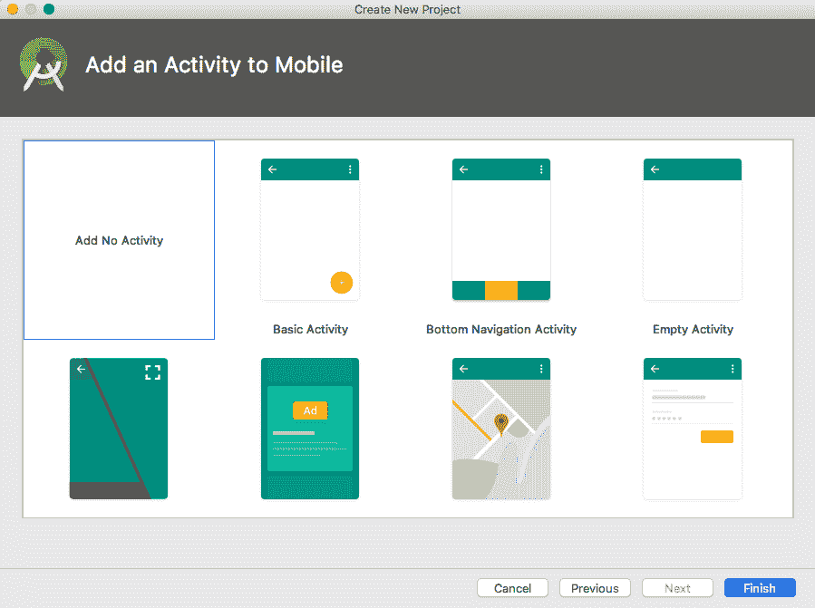
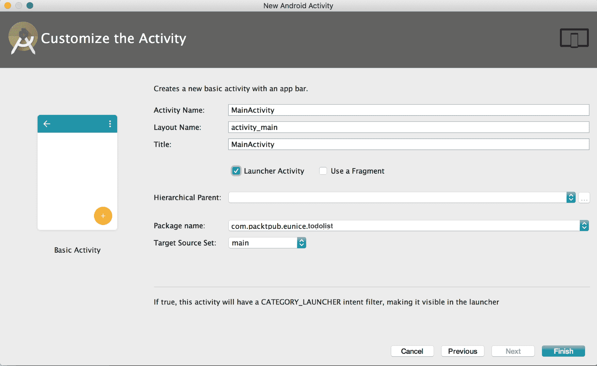
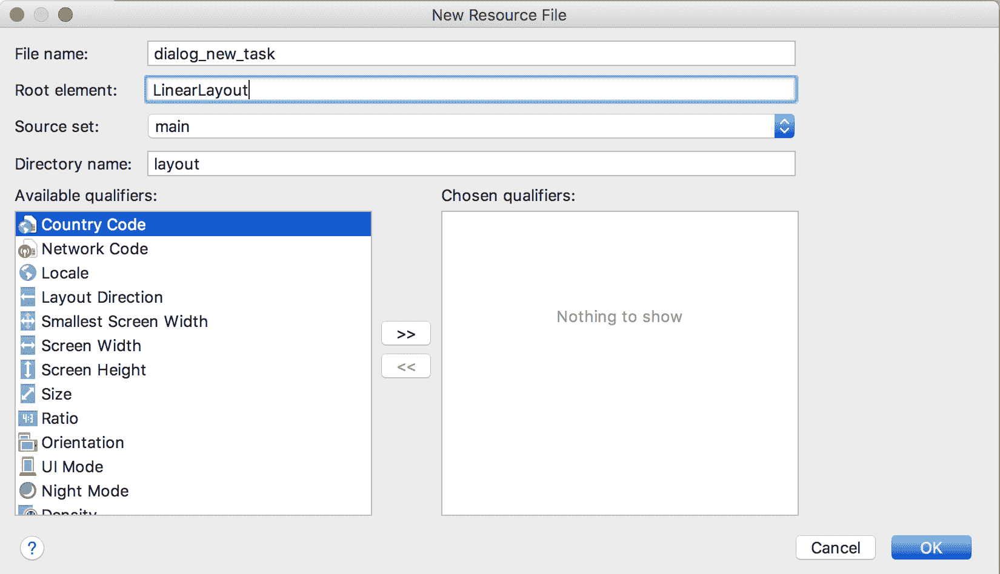
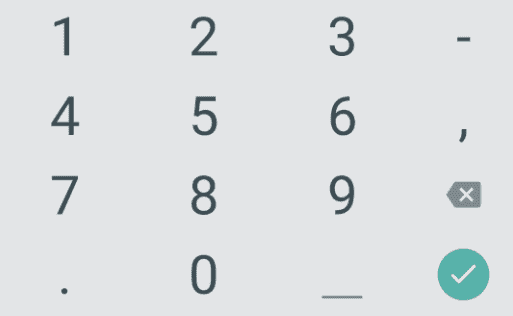
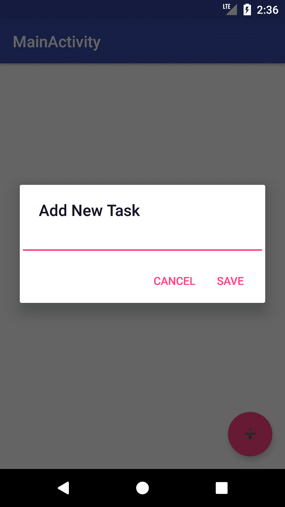
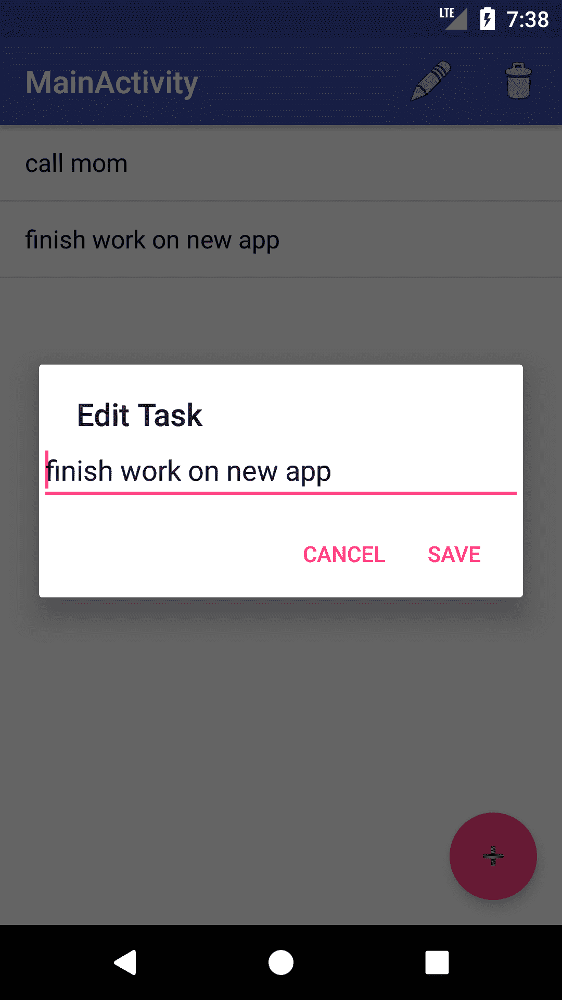

# 第十章：开发一个简单的待办事项列表应用程序

在本章中，我们将构建一个简单的待办事项列表应用程序，允许用户添加、更新和删除任务。

在这个过程中，我们将学到以下内容：

+   如何在 Android Studio 中构建用户界面

+   使用 ListView

+   如何使用对话框

# 创建项目

让我们从在 Android Studio 中创建一个新项目开始，名称为 TodoList。在“为移动添加活动”屏幕上选择“添加无活动”：



当项目创建完成后，通过选择“文件”|“新建”|“Kotlin 活动”来创建一个 Kotlin 活动，如下面的屏幕截图所示：


这将启动一个新的 Android Activitywizard**。在“为移动添加活动”屏幕上，选择“基本活动”，如下面的屏幕截图所示：


现在，在“自定义活动”屏幕上检查启动器活动，并单击“完成”按钮：



# 构建您的 UI

在 Android 中，用户界面的代码是用 XML 编写的。您可以通过以下任一方式构建您的 UI：

+   使用 Android Studio 布局编辑器

+   手动编写 XML 代码

让我们开始设计我们的 TodoList 应用程序。

# 使用 Android Studio 布局编辑器

Android Studio 提供了一个布局编辑器，让您可以通过将小部件拖放到可视化编辑器中来构建布局。这将自动生成 UI 的 XML 代码。

打开`content_main.xml`文件。

确保屏幕底部选择了“设计”选项卡，如下面的屏幕截图所示：


要向布局添加组件，只需从屏幕左侧的 Palette 中拖动项目。要查找组件，可以滚动浏览 Palette 上的项目，或者单击 Palette 搜索图标并搜索所需的项目。

如果 Palette 没有显示在您的屏幕上，请选择“查看”|“工具窗口”|“Palette”以显示它。

继续在您的视图中添加`ListView`。当选择一个视图时，它的属性会显示在屏幕右侧的 XML 属性编辑器中。属性编辑器允许您查看和编辑所选组件的属性。继续进行以下更改：

+   将 ID 设置为 list_view

+   将 layout_width 和 layout_height 属性都更改为 match_parent


如果属性编辑器没有显示，请选择“查看”|“工具窗口”|“属性”以显示它。

现在，在编辑器窗口底部选择“文本”以查看生成的 XML 代码。您会注意到 XML 代码现在在`ConstraintLayout`中放置了一个`ListView`：

```kt
<?xml version="1.0" encoding="utf-8"?>
<android.support.constraint.ConstraintLayout xmlns:android="http://schemas.android.com/apk/res/android"
    xmlns:app="http://schemas.android.com/apk/res-auto"
    xmlns:tools="http://schemas.android.com/tools"
    android:layout_width="match_parent"
    android:layout_height="match_parent"
    app:layout_behavior="@string/appbar_scrolling_view_behavior"
    tools:context="com.packtpub.eunice.todolist.MainActivity"
    tools:showIn="@layout/activity_main">

    <ListView
        android:id="@+id/list_view"
        android:layout_width="match_parent"
        android:layout_height="match_parent"
        tools:layout_editor_absoluteX="4dp"
        tools:layout_editor_absoluteY="8dp" />
</android.support.constraint.ConstraintLayout>
```

布局始终有一个根元素。在前面的代码中，`ConstraintLayout`是根元素。

您可以选择使用布局编辑器，也可以自己编写 XML 代码。使用布局编辑器还是编写 XML 代码的选择取决于您。您可以使用您最熟悉的选项。我们将继续随着进展对 UI 进行添加。

现在，构建并运行您的代码。如下面的屏幕截图所示：


如您所见，该应用目前并不完整。让我们继续添加更多内容。

由于我们将使用`FloatingActionButton`作为用户用来向待办事项列表添加新项目的按钮，我们需要将其图标更改为一个清晰表明其目的的图标。

打开`activity_main.xml`文件：

`android.support.design.widget.FloatingActionButton`的一个属性是`app:srcCompat`。这用于指定**FloatingActionButton**的图标。将其值从`@android:drawable/ic_dialog_email`更改为`@android:drawable/ic_input_add`。

再次构建和运行。现在底部的**FloatingActionButton**看起来像一个添加图标，如下面的屏幕截图所示：


# 为用户界面添加功能

目前，当用户单击“添加”按钮时，屏幕底部会显示一个滚动消息。这是因为`onCreate()`方法中的一段代码定义并设置了`FloatingActionButton`的`OnClickListener`：

```kt
fab.setOnClickListener { view ->
    Snackbar.make(view, "Replace with your own action", Snackbar.LENGTH_LONG)
            .setAction("Action", null).show()
}
```

这对于我们的待办事项列表应用程序来说并不理想。让我们继续在`MainActivity`类中创建一个新方法来处理单击事件：

```kt
fun showNewTaskUI() {
}
```

该方法目前什么也不做。我们将很快添加代码来显示适当的 UI。现在，用对新方法的调用替换`setOnClickListener()`调用中的代码：

```kt
fab.setOnClickListener { showNewTaskUI() }
```

# 添加新任务

要添加新任务，我们将向用户显示一个带有可编辑字段的 AlertDialog。

让我们从为对话框构建 UI 开始。右键单击`res/layout`目录，然后选择**新建** | **布局资源文件**，如下面的屏幕截图所示：


在新资源文件窗口上，将根元素更改为`LinearLayout`，并将文件名设置为`dialog_new_task`。单击“确定”以创建布局，如下面的屏幕截图所示：



打开`dialog_new_task`布局，并向`LinearLayout`添加一个`EditText`视图。布局中的 XML 代码现在应该如下所示：

```kt
<?xml version="1.0" encoding="utf-8"?>
<LinearLayout xmlns:android="http://schemas.android.com/apk/res/android"
    android:orientation="vertical" android:layout_width="match_parent"
    android:layout_height="match_parent">

    <EditText
        android:id="@+id/task"
        android:layout_width="match_parent"
        android:layout_height="wrap_content"
        android:inputType="text"/>

</LinearLayout>
```

`inputType`属性用于指定字段可以接受什么类型的数据。通过指定此属性，用户将显示适当的键盘。例如，如果`inputType`设置为数字，则显示数字键盘：



现在，让我们继续添加一些我们将在下一节中需要的字符串资源。打开`res/values/strings.xml`文件，并将以下代码添加到`resources`标记中：

```kt
<string name="add_new_task_dialog_title">Add New Task</string>
<string name="save">Save</string>
```

+   `add_new_task_dialog_title`字符串将用作对话框的标题

+   `save`字符串将用作对话框上按钮的文本

使用`AlertDialog`的最佳方法是将其封装在`DialogFragment`中。`DialogFragment`消除了处理对话框生命周期事件的负担。它还使您能够轻松地在其他活动中重用对话框。

创建一个名为`NewTaskDialogFragment`的新 Kotlin 类，并用以下代码替换类定义：

```kt
class NewTaskDialogFragment: DialogFragment() {  // 1

    // 2
    interface NewTaskDialogListener {
        fun onDialogPositiveClick(dialog: DialogFragment, task: String)
        fun onDialogNegativeClick(dialog: DialogFragment)
    }

    var newTaskDialogListener: NewTaskDialogListener? = null  // 3

    // 4
    companion object {
        fun newInstance(title: Int): NewTaskDialogFragment {

            val newTaskDialogFragment = NewTaskDialogFragment()
            val args = Bundle()
            args.putInt("dialog_title", title)
            newTaskDialogFragment.arguments = args
            return newTaskDialogFragment
        }
    }

    override fun onCreateDialog(savedInstanceState: Bundle?): Dialog {  // 5
        val title = arguments.getInt("dialog_title")
        val builder = AlertDialog.Builder(activity) 
        builder.setTitle(title) 

        val dialogView =    
     activity.layoutInflater.inflate(R.layout.dialog_new_task, null) 
        val task = dialogView.findViewById<EditText>(R.id.task)

        builder.setView(dialogView)
                .setPositiveButton(R.string.save, { dialog, id ->
                    newTaskDialogListener?.onDialogPositiveClick(this, 
                 task.text.toString);
                })
                .setNegativeButton(android.R.string.cancel, { dialog, 
                 id ->
                    newTaskDialogListener?.onDialogNegativeClick(this)
                })
        return builder.create()
     }

  override fun onAttach(activity: Activity) { // 6
        super.onAttach(activity)
        try {
            newTaskDialogListener = activity as NewTaskDialogListener  
        } catch (e: ClassCastException) {
            throw ClassCastException(activity.toString() + " must  
            implement NewTaskDialogListener")
        }

    }
}
```

让我们更仔细地看看这个类做了什么：

1.  该类扩展了`DialogFragment`类。

1.  它声明了一个名为`NewTaskDialogListener`的接口，该接口声明了两种方法：

+   `onDialogPositiveClick(dialog: DialogFragment, task: String)`

+   `onDialogNegativeClick(dialog: DialogFragment)`

1.  它声明了一个类型为`NewTaskDialogListener`的变量。

1.  它在伴随对象中定义了一个`newInstance()`方法。通过这样做，可以在不必创建`NewTaskDialogFragment`类的实例的情况下访问该方法。`newInstance()`方法执行以下操作：

+   它接受一个名为`title`的`Int`参数

+   它创建了`NewTaskDialogFragment`的一个实例，并将`title`作为其参数的一部分传递

+   返回`NewTaskDialogFragment`的新实例

1.  它重写了`onCreateDialog()`方法。此方法执行以下操作：

+   它尝试检索传递的标题参数

+   实例化`AlertDialog`构建器，并将检索到的标题分配为对话框的标题

+   它使用`DialogFragment`实例的父活动的`LayoutInflater`来填充我们创建的布局

+   然后，将充气的视图设置为对话框的视图

+   为对话框设置两个按钮：**保存**和**取消**

+   单击“保存”按钮时，将检索`EditText`中的文本，并通过`onDialogPositiveClick()`方法将其传递给`newTaskDialogListener`变量

1.  在`onAttach()`方法中，我们尝试将传递的`Activity`对象分配给前面创建的`newTaskDialogListener`变量。为使其工作，`Activity`对象应该实现`NewTaskDialogListener`接口。

现在，打开`MainActivity`类。更改类声明以包括`NewTaskDialogListener`的实现。您的类声明现在应该如下所示：

```kt
class MainActivity : AppCompatActivity(), NewTaskDialogFragment.NewTaskDialogListener {
```

并通过向`MainActivity`类添加以下方法来添加`NewTaskDialogListener`中声明的方法的实现：

```kt
    override fun onDialogPositiveClick(dialog: DialogFragment, task:String) {
    }

    override fun onDialogNegativeClick(dialog: DialogFragment) {
    }
```

在`showNewTaskUI()`方法中，添加以下代码行：

```kt
val newFragment = NewTaskDialogFragment.newInstance(R.string.add_new_task_dialog_title)
newFragment.show(fragmentManager, "newtask")
```

在上述代码行中，调用`NewTaskDialogFragment`中的`newInstance()`方法以生成`NewTaskDialogFragment`类的实例。然后调用`DialogFragment`的`show()`方法来显示对话框。

构建并运行。现在，当您单击添加按钮时，您应该在屏幕上看到一个对话框，如下截图所示：



您可能已经注意到，单击保存按钮时什么都没有发生。在`onDialogPositiveClick()`方法中，添加此处显示的代码行：

```kt
Snackbar.make(fab, "Task Added Successfully", Snackbar.LENGTH_LONG).setAction("Action", null).show()
```

正如我们可能记得的那样，这行代码在屏幕底部显示一个滚动消息。

构建并运行。现在，当您在**New Task**对话框上单击 SAVE 按钮时，屏幕底部会显示一个滚动消息。


我们目前没有存储用户输入的任务。让我们创建一个集合变量来存储用户添加的任何任务。在`MainActivity`类中，添加一个类型为`ArrayList<String>`的新变量，并用空的`ArrayList`进行实例化：

```kt
private var todoListItems = ArrayList<String>()
```

在`onDialogPositiveClick()`方法中，在方法定义的开头放置以下代码行：

```kt
todoListItems.add(task)
listAdapter?.notifyDataSetChanged()
```

这将向`todoListItems`数据添加传递给`listAdapter`的任务变量，并调用`notifyDataSetChanged()`来更新`ListView`。

保存数据很好，但是我们的`ListView`仍然是空的。让我们继续纠正这一点。

# 在 ListView 中显示数据

要对 XML 布局中的 UI 元素进行更改，您需要使用`findViewById()`方法来检索布局的`Activity`中元素的实例。这通常在`Activity`的`onCreate()`方法中完成。

打开`MainActivity.kt`，并在类顶部声明一个新的`ListView`实例变量：

```kt
private var listView: ListView? = null
```

接下来，使用布局中相应元素的`ListView`变量进行实例化。通过在`onCreate()`方法的末尾添加以下一行代码来完成此操作：

```kt
listView = findViewById(R.id.list_view)
```

在`ListView`中显示数据，您需要创建一个`Adapter`，并向其提供要显示的数据以及如何显示该数据的信息。根据您希望在`ListView`中显示数据的方式，您可以使用现有的 Android Adapters 之一，也可以创建自己的 Adapter。现在，我们将使用最简单的 Android Adapter 之一，`ArrayAdapter`。`ArrayAdapter`接受一个数组或项目列表，一个布局 ID，并根据传递给它的布局显示您的数据。

在`MainActivity`类中，添加一个新的变量，类型为`ArrayAdapter`：

```kt
private var listAdapter: ArrayAdapter<String>? = null

```

向类中添加此处显示的方法：

```kt
private fun populateListView() {
    listAdapter = ArrayAdapter(this, android.R.layout.simple_list_item_1, todoListItems)
    listView?.adapter = listAdapter
}
```

在上述代码行中，我们创建了一个简单的`ArrayAdapter`并将其分配给`listView`作为其`Adapter`。

现在，在`onCreate()`方法中添加对前一个方法的调用：

```kt
populateListView()
```

构建并运行。现在，当您单击添加按钮时，您将看到您的条目显示在 ListView 上，如下截图所示：


# 更新/删除待办事项

如果用户在输入新任务时出现错误怎么办？我们需要为他们提供一种能够编辑列表项或完全删除该项的方法。我们可以提供菜单项，仅在用户单击项目时显示。菜单项将为用户提供编辑或删除所选项的机会。

如果用户选择编辑选项，我们将显示我们的任务对话框，并为用户填写任务字段以进行所需的更改。

让我们首先向`strings.xml`资源文件添加以下一组字符串：

```kt
<string name="update_task_dialog_title">Edit Task</string>
<string name="edit">Edit</string>
<string name="delete">Delete</string>
```

接下来，我们需要在 UI 中添加一个菜单。

# 添加菜单

让我们首先创建菜单资源文件。右键单击`res`目录，然后选择 New | Android resource file。输入`to_do_list_menu`作为文件名。将资源类型更改为菜单，然后单击确定，如下面的屏幕截图所示：


用以下代码替换`to_do_list_menu,xml`文件中的代码行：

```kt
<?xml version="1.0" encoding="utf-8"?>
<menu xmlns:app="http://schemas.android.com/apk/res-auto"
    xmlns:android="http://schemas.android.com/apk/res/android">

    <item
        android:id="@+id/edit_item"
        android:title="@string/edit"
        android:icon="@android:drawable/ic_menu_edit"
        android:visible="false"
        app:showAsAction="always"/>
    <item
        android:id="@+id/delete_item"
        android:title="@string/delete"
        android:icon="@android:drawable/ic_menu_delete"
        android:visible="false"
        app:showAsAction="always"/>
</menu>
```

在上述代码行中，我们创建了两个菜单项，`edit`和`delete`项。我们还将每个菜单项的可见性设置为`false`。

接下来，打开`MainActivity`类，并在类顶部添加以下两个新变量：

```kt
private var showMenuItems = false
private var selectedItem = -1 
```

`showMenuItems`变量将用于跟踪菜单项的可见状态，而`selectedItem`变量存储当前选定列表项的位置。

然后，重写`onCreateOptionsMenu()`方法，如果`showMenuItems`变量设置为`true`，则启用菜单项：

```kt
override fun onCreateOptionsMenu(menu: Menu): Boolean {
    val inflater = menuInflater
    inflater.inflate(R.menu.to_do_list_menu, menu)
    val editItem = menu.findItem(R.id.edit_item)
    val deleteItem = menu.findItem(R.id.delete_item)

    if (showMenuItems) {
        editItem.isVisible = true
        deleteItem.isVisible = true
    }

    return true
}
```

接下来，打开`MainActivity`类，并添加以下方法：

```kt
private fun showUpdateTaskUI(selected: Int) {
    selectedItem = selected
    showMenuItems = true
    invalidateOptionsMenu()
}
```

当调用此方法时，它将分配传递给它的参数给`selectedItem`变量，并将`showMenuItems`的值更改为`true`。然后调用`invalidateOptionsMenu()`方法。`invalidateOptionsMenu()`方法通知操作系统已对`Activity`相关的菜单进行了更改。这将导致菜单被重新创建。

现在，我们需要为`ListView`实现一个`ItemClickListener`。在`onCreate()`方法中，添加以下代码行：

```kt
listView?.onItemClickListener = AdapterView.OnItemClickListener { parent, view, position, id -> showUpdateTaskUI(position) }

```

在这些代码行中，当单击项目时，将调用`showUpdateTaskUI()`方法。

再次构建和运行。这次，当您单击列表项时，菜单项将显示出来，如下面的屏幕截图所示：


接下来，我们需要更新`NewTaskDialogFragment`类以接受和处理所选任务。打开`NewTaskDialogFragment`类。

更新`newInstance()`方法以接受`String`类型的额外参数，并通过以下代码将该参数作为`DialogFragment`参数的一部分传递：

```kt
fun newInstance(title: Int, selected: String?): NewTaskDialogFragment { // 1
    val newTaskDialogFragment = NewTaskDialogFragment()
    val args = Bundle()
    args.putInt("dialog_title", title)
    args.putString("selected_item", selected) // 2
    newTaskDialogFragment.arguments = args
    return newTaskDialogFragment
}
```

**注意：**更改的地方标有数字。

接下来，更新`onCreateDialog()`方法以检索并显示所选任务的文本，如下面的代码所示：

```kt
override fun onCreateDialog(savedInstanceState: Bundle?): Dialog {
    val title = arguments.getInt("dialog_title")
    val selectedText = arguments.getString("selected_item") // 1
    val builder = AlertDialog.Builder(activity)
    builder.setTitle(title)

    val dialogView = activity.layoutInflater.inflate(R.layout.dialog_new_task, null)

    val task = dialogView.findViewById<EditText>(R.id.task)

    task.setText(selectedText)  // 2

    builder.setView(dialogView)
            .setPositiveButton(R.string.save, { dialog, id ->

                newTaskDialogListener?.onDialogPositiveClick(this, task.text.toString());
            })
            .setNegativeButton(android.R.string.cancel, { dialog, id ->

                newTaskDialogListener?.onDialogNegativeClick(this)
            })

    return builder.create()
}
```

接下来，我们需要实现当用户选择菜单项时的功能。这是通过重写`onOptionsItemSelected()`方法来完成的：

```kt
override fun onOptionsItemSelected(item: MenuItem?): Boolean {

if (-1 != selectedItem) {
if (R.id.edit_item == item?.itemId) {  // 1

val updateFragment = NewTaskDialogFragment.newInstance(R.string.update_task_dialog_title, todoListItems[selectedItem])
            updateFragment.show(fragmentManager, "updatetask")

        } else if (R.id.delete_item == item?.itemId) {  // 2

todoListItems.removeAt(selectedItem)
listAdapter?.notifyDataSetChanged()
selectedItem = -1
            Snackbar.make(fab, "Task deleted successfully", 
            Snackbar.LENGTH_LONG).setAction("Action", null).show()

        }
    }
return super.onOptionsItemSelected(item)
}
```

在上述方法中，检查所选菜单项的 ID 与两个菜单项的 ID 是否匹配。

1.  如果所选菜单项是编辑按钮：

+   生成并显示`NewTaskDialogFragment`的新实例。在生成新实例的调用中，检索并传递所选任务。

1.  如果是`delete`按钮：

+   所选项目从`todoListItems`中删除

+   通知`listAdapter`数据已更改

+   `selectedItem`变量被重置为-1

+   并且，将显示一个提示，通知用户删除成功删除

正如您可能已经注意到的，在调用`show()`方法时，第二个参数是一个`String`。这个参数是标签。标签充当一种 ID，用于区分`Activity`管理的不同片段。我们将使用标签来决定在调用`onDialogPositiveClick()`方法时执行哪些操作。

用以下方法替换`onDialogPositiveClick()`方法：

```kt
override fun onDialogPositiveClick(dialog: DialogFragment, task:String) {

    if("newtask" == dialog.tag) {
        todoListItems.add(task)
        listAdapter?.notifyDataSetChanged()

        Snackbar.make(fab, "Task Added Successfully", 
        Snackbar.LENGTH_LONG).setAction("Action", null).show()

    } else if ("updatetask" == dialog.tag) {
        todoListItems[selectedItem] = task

        listAdapter?.notifyDataSetChanged()

        selectedItem = -1

        Snackbar.make(fab, "Task Updated Successfully", 
        Snackbar.LENGTH_LONG).setAction("Action", null).show()
    }
}
```

在上述代码行中，以下内容适用：

1.  如果对话框的标签是`newtask`：

+   任务变量被添加到`todoListItems`数据中，并通知`listAdapter`更新`ListView`

+   还会显示一个提示，通知用户任务已成功添加

1.  如果对话框的标签是`updatetask`：

+   选定的项目用任务变量替换在`todoListItems`数据集中，并通知`listAdapter`更新`ListView`

+   `selectedItem`变量被重置为-1

+   此外，还会显示一个滚动消息通知用户任务已成功更改

构建并运行。选择一个任务并点击编辑菜单项。这将弹出编辑任务对话框，并自动填充所选任务的详细信息，如下面的截图所示：



对任务详情进行更改，然后点击保存按钮。这将关闭对话框，更新您的`ListView`以显示更新后的任务，并在屏幕底部显示一个消息为“任务成功更新”的滚动消息，如下面的截图所示：


接下来，选择一个任务并点击删除菜单项。这将删除所选的任务，并在屏幕底部显示一个消息为“任务成功删除”的滚动消息，如下面的截图所示：


# 摘要

在本章中，我们构建了一个简单的 TodoList 应用程序，允许用户添加新任务，并编辑或删除已添加的任务。在这个过程中，我们学会了如何使用 ListViews 和 Dialogs。在当前状态下，TodoList 应用程序在重新启动时会重置数据。这并不理想，因为用户很可能希望在重新启动应用程序后查看他们的旧任务。

在下一章中，我们将学习有关不同的数据存储选项以及如何使用它们来使我们的应用程序更加可用。我们将扩展 TodoList 应用程序以将用户的任务持久化到数据库中。
