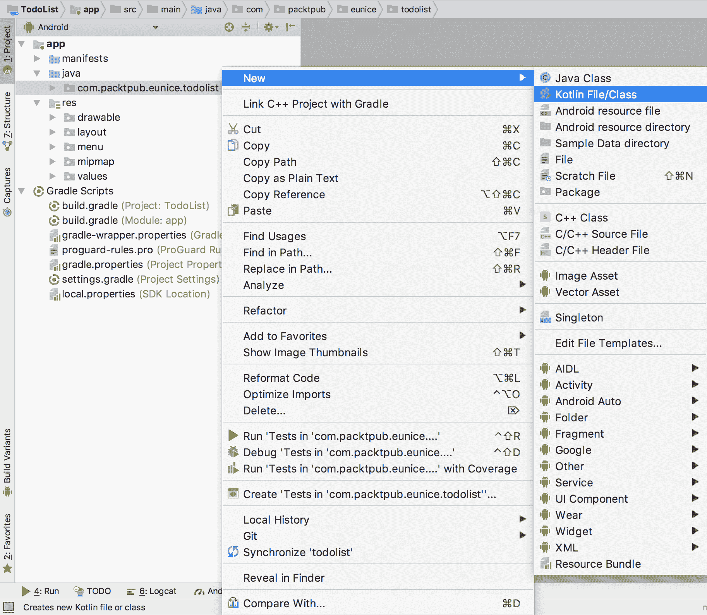
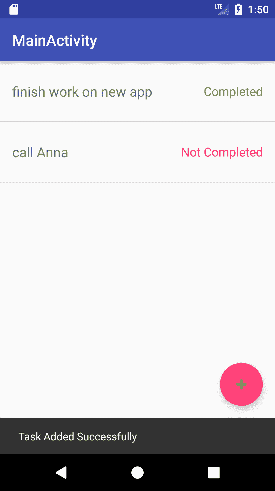

# 第十一章：使用数据库持久化

在本章中，我们将通过正确地将用户输入的任务持久化到数据库中，改进上一章的待办事项列表应用。

在本章中，我们将学习以下内容：

+   数据库的概念

+   移动开发可用的不同类型的数据库

+   如何连接到一些不同的可用数据库

# 数据库简介

数据库简单地是一组数据，以使访问和/或更新它变得容易的方式组织起来。组织数据可以以许多方式进行，但它们可以分为两种主要类型：

+   关系数据库

+   非关系数据库

# 关系数据库

关系数据库是一种根据数据之间的关系组织数据的数据库。在关系数据库中，数据以表格的形式呈现，有行和列。表格存储了相同类型的数据集合。表格中的每一列代表表格中存储的对象的属性。表格中的每一行代表一个存储的对象。表格有一个标题，指定了要存储在数据库中的对象的不同属性的名称和类型。在关系数据库中，每个属性的数据类型在创建表格时指定。

让我们来看一个例子。这里的表代表了一组学生：


表的每一行代表一个学生。列代表每个学生的不同属性。

关系数据库是使用**RDBMS**（**关系数据库管理系统**）维护的。数据是使用一种称为**SQL**（结构化查询语言）的语言访问和管理的。一些最常用的 RDBMS 是 Oracle、MySQL、Microsoft SQL Server、PostgreSQL、Microsoft Access 和 SQLite。MySQL、PostgreSQL 和 SQLite 是开源的。

Android 开发的 RDBMS 选择是 SQLite。这是因为 Android 操作系统捆绑了 SQLite。

在上一章中，我们构建了一个待办事项列表应用，允许用户添加、更新和删除任务。我们使用了`ArrayList`作为我们的数据存储。让我们继续扩展应用程序，改用关系数据库。

# 使用 SQLite

首先要做的是定义数据库的架构。数据库的架构定义了数据库中的数据是如何组织的。它定义了数据组织到哪些表中，并对这些表的限制（例如列的允许数据类型）进行了定义。建议创建一个合同类，指定数据库的详细信息。

创建一个新的 Kotlin 对象，名为`TodoListDBContract`，并用以下代码替换其内容：

```kt
object TodoListDBContract {

        const val DATABASE_VERSION = 1
        const val DATABASE_NAME = "todo_list_db"

    class TodoListItem: BaseColumns {
        companion object {
            const val TABLE_NAME = "todo_list_item"
            const val COLUMN_NAME_TASK = "task_details"
            const val COLUMN_NAME_DEADLINE = "task_deadline"
            const val COLUMN_NAME_COMPLETED = "task_completed"
        }
    }

}
```

在上述代码中，`TodoListItem`类代表了我们数据库中的一个表，并用于声明表的名称和其列的名称。

要创建一个新的 Kotlin 对象，首先右键单击包，然后选择新建

| Kotlin 文件/类。然后在新的 Kotlin 文件/类对话框中，在`Kind`字段中选择`Object`：



接下来要做的是创建一个数据库助手类。这将帮助我们抽象出对数据库的连接，并且不将数据库连接逻辑保留在我们的 Activity 中。继续创建一个名为`TodoListDBHelper`的新的 Kotlin 类。该类应该在其默认构造函数中接受一个`Context`参数，并扩展`android.database.sqlite.SQLiteOpenHelper`类，如下所示：

```kt
class TodoListDBHelper(context: Context): SQLiteOpenHelper(context, DATABASE_NAME, null, DATABASE_VERSION) {
```

现在，按照以下代码将以下代码添加到`TodoListDBHelper`类中：

```kt
private val SQL_CREATE_ENTRIES = "CREATE TABLE " + TodoListDBContract.TodoListItem.TABLE_NAME + " (" +
        BaseColumns._ID + " INTEGER PRIMARY KEY AUTOINCREMENT," +
        TodoListDBContract.TodoListItem.COLUMN_NAME_TASK + " TEXT, " +
        TodoListDBContract.TodoListItem.COLUMN_NAME_DEADLINE + " TEXT, " +
        TodoListDBContract.TodoListItem.COLUMN_NAME_COMPLETED + " INTEGER)"  // 1

private val SQL_DELETE_ENTRIES = "DROP TABLE IF EXISTS " + TodoListDBContract.TodoListItem.TABLE_NAME   // 2

override fun onCreate(db: SQLiteDatabase) { // 3
 db.execSQL(SQL_CREATE_ENTRIES)
}

override fun onUpgrade(db: SQLiteDatabase, oldVersion: Int, newVersion: Int) {// 4
 db.execSQL(SQL_DELETE_ENTRIES)
 onCreate(db)
}

override fun onDowngrade(db: SQLiteDatabase, oldVersion: Int, newVersion: Int) {
 onUpgrade(db, oldVersion, newVersion)
}
```

在上述代码中，以下内容适用：

+   `SQL_CREATE_ENTRIES`是一个 SQL 查询，用于创建一个表。它指定了一个`_id`字段，该字段被设置为数据库的主键。

在关系数据库中，表需要有一个列来唯一标识每个行条目。这个唯一的列被称为**主键**。将列指定为**AUTOINCREMENT**告诉 RDBMS 在插入新行时自动生成此字段的新值。

+   `SQL_DELETE_ENTRIES`是一个 SQL 查询，用于删除表（如果存在）。

+   在`onCreate()`方法中，执行 SQL 查询以创建表。

+   在`onUpgrade()`中，表被删除并重新创建。

由于表在数据库中将有一个 ID 字段，我们必须在`Task`类中添加一个额外的字段来跟踪它。打开`Task.kt`，添加一个名为`taskId`的`Long`类型的新字段。

```kt
var taskId: Long? = null
```

接下来，添加如下所示的构造函数：

```kt
constructor(taskId:Long, taskDetails: String?, taskDeadline: String?, completed: Boolean) : this(taskDetails, taskDeadline) {
        this.taskId = taskId
        this.completed = completed
    }
```

# 将数据插入数据库

打开`TodoListDBHelper`，并添加以下所示的方法：

```kt
fun addNewTask(task: Task): Task {
        val db = this.writableDatabase // 1

// 2
        val values = ContentValues()
        values.put(TodoListDBContract.TodoListItem.COLUMN_NAME_TASK, task.taskDetails)
        values.put(TodoListDBContract.TodoListItem.COLUMN_NAME_DEADLINE, task.taskDeadline)
        values.put(TodoListDBContract.TodoListItem.COLUMN_NAME_COMPLETED, task.completed)

        val taskId = db.insert(TodoListDBContract.TodoListItem.TABLE_NAME, null, values); // 3
        task.taskId = taskId

        return task
    }
```

在这里，我们执行以下操作：

1.  我们首先以写模式检索数据库。

1.  接下来，我们创建一个`ContentValues`的实例，并放入我们要插入的项目中字段的值键映射。

1.  然后，我们在数据库对象上调用`insert()`方法，将表名和`ContentValues`实例传递给它。这将返回插入项的主键`_id`。我们更新任务对象并返回它。

打开`MainActivity`类。

首先，在类的顶部添加`TodoListDBHelper`类的一个实例作为一个新字段：

```kt
private var dbHelper: TodoListDBHelper = TodoListDBHelper(this)
```

并重写`AppCompatActivity`的`onDestroy()`方法：

```kt
override fun onDestroy() {
    dbHelper.close()
    super.onDestroy()
}
```

当 Activity 的`onDestroy()`方法被调用时，这将关闭数据库连接。

然后，在`onDialogPositiveClick()`方法中，找到这行代码：

```kt
todoListItems.add(Task(taskDetails, ""))
```

用以下代码替换它：

```kt
val addNewTask = dbHelper.addNewTask(Task(taskDetails, ""))
todoListItems.add(addNewTask)
```

调用`dbHelper.addNewTask()`将新任务保存到数据库，而不仅仅是将其添加到`todoListItems`字段中。

构建并运行应用程序：


既然我们已经能够保存到数据库，我们需要在应用程序启动时能够查看数据。

# 从数据库中检索数据

打开`TodoListDBHelper`，并添加如下所示的方法：

```kt
fun retrieveTaskList(): ArrayList<Task> {
    val db = this.readableDatabase  // 1

    val projection = arrayOf<String>(BaseColumns._ID,
            TodoListDBContract.TodoListItem.COLUMN_NAME_TASK,
            TodoListDBContract.TodoListItem.COLUMN_NAME_DEADLINE,
            TodoListDBContract.TodoListItem.COLUMN_NAME_COMPLETED) // 2

    val cursor = db.query(TodoListDBContract.TodoListItem.TABLE_NAME, projection, 
            null, null, null, null, null) // 3

    val taskList = ArrayList<Task>()
// 4
    while (cursor.moveToNext()) {
        val task = Task(cursor.getLong(cursor.getColumnIndexOrThrow(BaseColumns._ID)),
                cursor.getString(cursor.getColumnIndexOrThrow(TodoListDBContract.TodoListItem.COLUMN_NAME_TASK)),
                cursor.getString(cursor.getColumnIndexOrThrow(TodoListDBContract.TodoListItem.COLUMN_NAME_DEADLINE)),
                cursor.getInt(cursor.getColumnIndexOrThrow(TodoListDBContract.TodoListItem.COLUMN_NAME_COMPLETED)) == 1)
        taskList.add(task)
    }
    cursor.close() // 5

    return taskList
}
```

在`retrieveTaskList`方法中，我们执行以下操作：

1.  我们首先以读模式检索数据库。

1.  接下来，我们创建一个列出我们需要检索的表的所有列的数组。在这里，如果我们不需要特定列的值，我们就不添加它。

1.  然后，我们将表名和列列表传递给数据库对象上的`query()`方法。这将返回一个`Cursor`对象。

1.  接下来，我们循环遍历`Cursor`对象中的项目，并使用每个项目的属性创建`Task`类的实例。

1.  我们关闭游标并返回检索到的数据

现在，打开`MainActivity`，并在`populateListView()`方法的开头添加以下代码行：

```kt
    todoListItems = dbHelper.retrieveTaskList();
```

您的`populateListView()`方法现在应该如下所示：

```kt
private fun populateListView() {
    todoListItems = dbHelper.retrieveTaskList();
    listAdapter = TaskListAdapter(this, todoListItems)
    listView?.adapter = listAdapter
}
```

现在，重新构建并运行。您会注意到，与上一章不同的是，当您重新启动应用程序时，您之前保存的任务会被保留：


# 更新任务

在本节中，我们将学习如何更新数据库中已保存任务的详细信息。打开`TodoListDBHelper`，并添加如下所示的方法：

```kt
    fun updateTask(task: Task) {
        val db = this.writableDatabase // 1

        // 2
        val values = ContentValues()
        values.put(TodoListDBContract.TodoListItem.COLUMN_NAME_TASK, task.taskDetails)
        values.put(TodoListDBContract.TodoListItem.COLUMN_NAME_DEADLINE, task.taskDeadline)
        values.put(TodoListDBContract.TodoListItem.COLUMN_NAME_COMPLETED, task.completed)

        val selection = BaseColumns._ID + " = ?" // 3
        val selectionArgs = arrayOf(task.taskId.toString()) // 4

        db.update(TodoListDBContract.TodoListItem.TABLE_NAME, values, selection, selectionArgs) // 5

    }
```

在`updateTask()`方法中，我们执行以下操作：

1.  我们首先以写模式检索数据库。

1.  接下来，我们创建一个`ContentValues`的实例，并放入我们要更新的字段的值键映射。对于我们正在处理的内容，我们将假定更新所有列。

1.  我们为选择要更新的数据库条目指定一个查询。我们的选择查询使用`_id`列。

1.  然后，我们为选择查询指定参数，这里，我们选择的是所选`Task`的`taskId`。

1.  然后，我们在数据库对象上调用`update()`方法，传递表名、`ContentValues`实例、选择查询和选择值。

在`MainActivity`类的`onDialogPositiveClick()`方法中，找到这行代码：

```kt
dbHelper.updateTask(todoListItems[selectedItem])
```

并将其放在以下代码行之后：

```kt
todoListItems[selectedItem].taskDetails = taskDetails
```

`onDialogPositiveClick()`方法现在应该如下所示：

```kt
override fun onDialogPositiveClick(dialog: DialogFragment, taskDetails:String) {
        if("newtask" == dialog.tag) {
            val addNewTask = dbHelper.addNewTask(Task(taskDetails, ""))
            todoListItems.add(addNewTask)
            listAdapter?.notifyDataSetChanged()

            Snackbar.make(fab, "Task Added Successfully", Snackbar.LENGTH_LONG).setAction("Action", null).show()

        } else if ("updatetask" == dialog.tag) {
            todoListItems[selectedItem].taskDetails = taskDetails
            dbHelper.updateTask(todoListItems[selectedItem])

            listAdapter?.notifyDataSetChanged()

            selectedItem = -1

            Snackbar.make(fab, "Task Updated Successfully", Snackbar.LENGTH_LONG).setAction("Action", null).show()
        }
    }
```

接下来，在`onOptionsItemSelected()`中，找到以下代码行：

```kt
dbHelper.updateTask(todoListItems[selectedItem])
```

然后，在此代码行之后放置：

```kt
todoListItems[selectedItem].completed = true
```

构建并运行。当您点击**标记为完成**菜单项时，所选任务将被更新为已完成，并相应地更新 listView：


# 删除任务

在本节中，我们将学习如何从数据库中删除已保存的任务。打开`TodoListDBHelper`，并添加以下方法：

```kt
    fun deleteTask(task:Task) {
        val db = this.writableDatabase // 1
        val selection = BaseColumns._ID + " = ?" // 2
        val selectionArgs = arrayOf(task.taskId.toString()) // 3
        db.delete(TodoListDBContract.TodoListItem.TABLE_NAME, selection, selectionArgs) // 4
    }
```

删除的过程类似于更新的过程：

1.  首先，以写模式检索数据库

1.  接下来，为选择要删除的数据库条目指定一个查询。我们的`selection`查询使用`_id`列

1.  然后，指定`selection`查询的参数，在我们的情况下是所选`Task`的`taskId`

1.  然后，我们在数据库对象上调用`delete()`方法，将表名、选择查询和选择值传递给它

在`MainActivity`类中的方法中，找到以下代码行：

```kt
todoListItems.removeAt(selectedItem)
```

用以下代码替换它：

```kt
val selectedTask = todoListItems[selectedItem]
todoListItems.removeAt(selectedItem)
dbHelper.deleteTask(selectedTask)
```

构建并运行。当您添加一个新项目时，该条目不仅会添加到`ListView`中，还会保存在数据库中：


编写自己的 SQL 查询可能会出错，特别是如果您正在构建一个严重依赖于数据库或需要非常复杂查询的应用程序。这也需要大量的努力和 SQL 查询知识。为了帮助解决这个问题，您可以使用 ORM 库。

# ORM 库

**ORM**（对象关系映射）库提供了一种更好的方式，让您将对象持久化到数据库中，而不用太担心 SQL 查询，以及打开和关闭数据库连接。

**注意**：您仍然需要一定水平的 SQL 查询知识

有许多适用于 Android 的 ORM 库：

+   ORMLite

+   GreenDAO

+   DbFlow

+   Room

但是，在本书中，我们将专注于 Room，这是 Google 推出的 ORM。

要使用 Room，我们首先必须将其依赖项添加到项目中。

打开`build.gradle`，并在依赖项部分添加以下代码行：

```kt
implementation 'android.arch.persistence.room:runtime:1.0.0'
annotationProcessor 'android.arch.persistence.room:compiler:1.0.0'
kapt "android.arch.persistence.room:compiler:1.0.0"
```

点击立即同步。为了让 Room 能够将任务保存到数据库中，我们需要指定哪个类表示一个表。这是通过将类注释为`Entity`来完成的。打开`Task`类，并用以下代码替换其内容：

```kt
@Entity(tableName = TodoListDBContract.TodoListItem.TABLE_NAME)
class Task() {

    @PrimaryKey(autoGenerate = true)
    @ColumnInfo(name = BaseColumns._ID)
    var taskId: Long? = null

    @ColumnInfo(name = TodoListDBContract.TodoListItem.COLUMN_NAME_TASK)
    var taskDetails: String? = null

    @ColumnInfo(name = TodoListDBContract.TodoListItem.COLUMN_NAME_DEADLINE)
    var taskDeadline: String? = null

    @ColumnInfo(name = TodoListDBContract.TodoListItem.COLUMN_NAME_COMPLETED)
    var completed: Boolean? = false

    @Ignore
    constructor(taskDetails: String?, taskDeadline: String?): this() {
        this.taskDetails = taskDetails
        this.taskDeadline = taskDeadline
    }

    constructor(taskId:Long, taskDetails: String?, taskDeadline: String?, completed: Boolean) : this(taskDetails, taskDeadline) {
        this.taskId = taskId
        this.completed = completed
    }

}
```

在这里，以下内容适用：

+   `@Entity`指定`Task`表示数据库中的一个表

+   `@ColumnInfo`将字段映射到数据库列

+   `@PrimaryKey`指定该字段是表的主键

接下来是创建一个**DAO**（数据访问对象）。创建一个名为`TaskDAO`的新的 Kotlin 接口，并用以下代码替换其内容：

```kt
@Dao
interface TaskDAO {

    @Query("SELECT * FROM " + TodoListDBContract.TodoListItem.TABLE_NAME)
    fun retrieveTaskList(): List<Task> 

    @Insert
    fun addNewTask(task: Task): Long   

    @Update
    fun updateTask(task: Task)  

     @Delete
     fun deleteTask(task: Task)  

}
```

如前面的代码所示，以下内容适用：

+   Room 提供了`Insert`、`Update`和`Delete`注释，因此您不必为这些编写查询

+   对于选择操作，您必须使用查询注释方法

接下来，我们需要创建一个数据库类，将我们的应用程序连接到数据库。创建一个名为`AppDatabase`的新的 Kotlin 类，并用以下代码替换其内容：

```kt
@Database(entities = arrayOf(Task::class), version = TodoListDBContract.DATABASE_VERSION)
abstract class AppDatabase : RoomDatabase() {
    abstract fun taskDao(): TaskDAO
}
```

这就是连接到数据库所需的所有设置。

要使用数据库，打开`MainActivity`。首先，创建一个`AppDatabase`类型的字段：

```kt
private var database: AppDatabase? = null
```

接下来，在`onCreate()`方法中实例化字段：

```kt
database = Room.databaseBuilder(applicationContext, AppDatabase::class.java, DATABASE_NAME).build()
```

在这里，您指定了您的数据库类和数据库的名称。

# 从数据库中检索数据

Room 不允许您在主线程上运行数据库操作，因此我们将使用`AsyncTask`来执行调用。将此私有类添加到`MainActivity`类中，如前面的代码所示：

```kt
private class RetrieveTasksAsyncTask(private val database: AppDatabase?) : AsyncTask<Void, Void, List<Task>>() {

    override fun doInBackground(vararg params: Void): List<Task>? {
        return database?.taskDao()?.retrieveTaskList()
    }
}
```

在这里，我们在`doInBackground()`方法中调用`taskDao`来从数据库中检索任务列表。

接下来，在`populateListView()`方法中，找到以下代码行：

```kt
todoListItems = dbHelper.retrieveTaskList();
```

然后，用这个替换它：

```kt
todoListItems = RetrieveTasksAsyncTask(database).execute().get() as ArrayList<Task>
```

Room 创建并管理一个主表，用于跟踪数据库的版本。因此，即使我们需要对数据库进行迁移以保留当前数据库中的数据。

打开`TodoListDBContract`类，并将`DATABASE_VERSION`常量增加到`2`。

然后，用以下代码替换`MainActivity`中的数据库实例化：

```kt
database = Room.databaseBuilder(applicationContext, AppDatabase::class.java, DATABASE_NAME)
        .addMigrations(object : Migration(TodoListDBContract.DATABASE_VERSION - 1, TodoListDBContract.DATABASE_VERSION) {
            override fun migrate(database: SupportSQLiteDatabase) {
            }
        }).build()
```

在这里，我们向`databaseBuilder`添加一个新的`Migration`对象，同时指定数据库的当前版本和新版本。

现在，构建并运行。您的应用程序将启动，并显示先前保存的`Tasks`：


# 将数据插入数据库

要添加新任务，在`MainActivity`中创建一个新的`AsyncTask`：

```kt
private class AddTaskAsyncTask(private val database: AppDatabase?, private val newTask: Task) : AsyncTask<Void, Void, Long>() {

    override fun doInBackground(vararg params: Void): Long? {
        return database?.taskDao()?.addNewTask(newTask)
    }
}
```

在这里，我们在`doInBackground()`方法中调用`taskDao`来将新任务插入数据库。

接下来，在`onDialogPositiveClick()`方法中，找到以下代码行：

```kt
val addNewTask = dbHelper.addNewTask(Task(taskDetails, ""))
```

并用以下代码替换它：

```kt
var addNewTask = Task(taskDetails, "")

addNewTask.taskId = AddTaskAsyncTask(database, addNewTask).execute().get()
```

现在，构建并运行。就像在上一节中一样，当您添加新项目时，该条目不仅会添加到`ListView`中，还会保存到数据库中：



# 更新任务

要更新任务，在`MainActivity`中创建一个新的`AsyncTask`：

```kt
private class UpdateTaskAsyncTask(private val database: AppDatabase?, private val selectedTask: Task) : AsyncTask<Void, Void, Unit>() {

    override fun doInBackground(vararg params: Void): Unit? {
        return database?.taskDao()?.updateTask(selectedTask)
    }
}
```

在这里，我们在`doInBackground()`方法中调用`taskDao`来将新任务插入数据库。

接下来，在`onDialogPositiveClick()`方法中，找到以下代码行：

```kt
dbHelper.updateTask(todoListItems[selectedItem])
```

用这行代码替换它：

```kt
UpdateTaskAsyncTask(database, todoListItems[selectedItem]).execute()
```

此外，在`onOptionsItemSelected()`中，找到以下代码行：

```kt
dbHelper.updateTask(todoListItems[selectedItem])
```

并用这行代码替换它：

```kt
UpdateTaskAsyncTask(database, todoListItems[selectedItem]).execute()
```

现在，构建并运行。就像在上一章中一样，选择一个任务，然后单击编辑菜单项。在弹出的编辑任务对话框中，更改任务详细信息，然后单击“保存”按钮。

这将关闭对话框，保存对数据库的更改，更新您的 ListView 以显示更新后的任务，并在屏幕底部显示一个消息提示，显示任务已成功更新：


# 删除任务

要删除任务，在`MainActivity`中创建一个新的`AsyncTask`：

```kt
private class DeleteTaskAsyncTask(private val database: AppDatabase?, private val selectedTask: Task) : AsyncTask<Void, Void, Unit>() {

    override fun doInBackground(vararg params: Void): Unit? {
        return database?.taskDao()?.deleteTask(selectedTask)
    }
}
```

接下来，在`onOptionsItemSelected()`中，找到以下代码行：

```kt
dbHelper.deleteTask(selectedTask)
```

用这行代码替换它：

```kt
DeleteTaskAsyncTask(database, selectedTask).execute()
```

构建并运行。选择一个任务，然后单击删除菜单项。这将从 ListView 中删除所选任务，并从数据库中删除它，并在屏幕底部显示一个消息提示，显示任务已成功删除：


就是这样。正如您所看到的，使用 ORM 可以让您编写更少的代码并减少 SQL 错误。

# 非关系数据库

非关系型数据库，或者 NoSQL 数据库，是一种不基于关系组织数据的数据库。与关系数据库不同，不同的非关系数据库存储和管理数据的方式各不相同。一些将数据存储为键值对，而其他一些将数据存储为对象。其中许多选项支持 Android。在大多数情况下，这些数据库具有将数据同步到在线服务器的能力。最流行的两种 No-SQL 移动数据库是：

+   CouchBase Mobile

+   Realm

CouchBase 是文档数据库的一个例子，Realm 是对象数据库的一个例子。

文档数据库是无模式的，这意味着它们是非结构化的，因此对文档中可以放入什么没有限制。它们将数据存储为键值对。

另一方面，对象数据库将数据存储为对象。

# 总结

在本章中，我们添加了将任务存储到数据库的功能。我们还了解了可以使用的不同类型的数据库。在 Android 开发人员中使用最多的数据库是 SQLite，但这并不妨碍您探索其他选项。还有一些数据库服务，如 Firebase，提供后端作为服务的功能。

在选择数据库时，您应该考虑应用程序的数据需求。是否需要将数据存储在在线服务器上？还是，这些数据仅在应用程序的实例中本地使用？您是否想要或有能力设置和管理自定义数据服务器，还是您更愿意选择一个为您完成这项工作的服务？这些都是在为您的 Android 应用程序选择数据库时需要考虑的一些因素。

在下一章中，我们将致力于为我们的待办事项列表应用程序添加提醒功能。
