# 第十二章：为任务设置提醒

在许多现实世界的应用程序中，有必要在某个时候提醒用户，比如说，采取一些行动或提供一些信息。例如，健身应用程序可能会提醒用户开始一些锻炼课程。

在这里，您将通过为任务设置提醒，然后在提醒到期时弹出通知，来构建上一章中的 ToDoList 应用程序。在实现这些功能时，您将学到很多，使用诸如`IntentService`、`BroadcastReceiver`和`Notification`等类。

在本章中，您将创建一个允许用户为任务设置提醒的功能。

在本章结束时，您将学到以下内容：

+   为设置的提醒创建和显示通知

+   推送通知简介

+   如何使用云服务（如 Firebase 和 Amazon SNS）发送推送通知，以及

+   如何设置您的应用程序以接收和显示推送通知给用户

总的来说，本章涵盖的主题包括：

+   服务

+   广播接收器

+   应用内通知

+   推送通知

# AlarmManager

Android 中的提醒最好通过使用`AlarmManager`来实现。为什么？看看官方文档对此的解释：

*这些允许您安排应用程序在将来的某个时间运行。*

另外：

*闹钟管理器适用于您希望在特定时间运行应用程序代码的情况，即使您的应用程序当前未运行。对于正常的定时操作（滴答声、超时等），使用 Handler 更容易、更有效率。*

这意味着如果您想要实现提醒这样的功能，您来对地方了。用于处理这种任务的替代类`Handler`最适合在应用程序仍在使用时完成的任务。您的应用程序肯定会有跨天的提醒，可能会持续几周甚至几个月，因此最好使用`AlarmManager`类。

它的工作原理是这样的，您的应用程序将启动一个后台服务来启动提醒的计时器，然后在到期时向应用程序发送广播。继续看如何实现这一点。

# 创建闹钟

基本上，有四种类型的闹钟：

+   **经过的实时：**这会根据设备启动以来经过的时间触发挂起的意图，但不会唤醒设备。经过的时间包括设备休眠期间的任何时间。

+   **经过的实时唤醒：**这会唤醒设备，并在自设备启动以来经过的指定时间后触发挂起的意图。

+   **RTC：**这在指定时间触发挂起的意图，但不会唤醒设备。

+   **RTC 唤醒：**这会唤醒设备，以便在指定时间触发挂起的意图。

您将使用 RTC 唤醒闹钟类型来唤醒设备，在用户设置的精确时间触发闹钟。

首先，为用户选择闹钟应该响起的时间创建一个对话框。创建一个名为`TimePickerFragment`的新类。然后，使用此处显示的代码进行更新：

```kt
import android.app.AlarmManager
import android.app.Dialog
import android.app.PendingIntent
import android.app.TimePickerDialog
import android.content.Context
import android.content.Intent
import android.os.Bundle
import android.support.v4.app.DialogFragment
import android.text.format.DateFormat
import android.util.Log
import android.widget.TimePicker
import android.widget.Toast
import java.util.Calendar

class TimePickerFragment : DialogFragment(), TimePickerDialog.OnTimeSetListener {

 override fun onCreateDialog(savedInstanceState: Bundle): Dialog {
 val c = Calendar.getInstance()
 val hour = c.get(Calendar.HOUR_OF_DAY)
 val minute = c.get(Calendar.MINUTE)

 return TimePickerDialog(activity, this, hour, minute,
 DateFormat.is24HourFormat(activity))
 }

 override fun onTimeSet(view: TimePicker, hourOfDay: Int, minute: Int) {
        Log.d("onTimeSet", "hourOfDay: $hourOfDay minute:$minute")

        Toast.makeText(activity, "Reminder set successfully", Toast.LENGTH_LONG).show()

        val intent = Intent(activity, AlarmReceiver::class.java)
        intent.putExtra(ARG_TASK_DESCRIPTION, taskDescription)

        val alarmIntent = PendingIntent.getBroadcast(activity, 0, intent, 0)
        val alarmMgr = activity.getSystemService(Context.ALARM_SERVICE) as AlarmManager

        val calendar = Calendar.getInstance()
        calendar.set(Calendar.HOUR_OF_DAY, hourOfDay)
        calendar.set(Calendar.MINUTE, minute)

        alarmMgr.set(AlarmManager.RTC_WAKEUP, calendar.timeInMillis, alarmIntent)
    }
}

companion object {
     val ARG_TASK_DESCRIPTION = "task-description"

    fun newInstance(taskDescription: String): TimePickerFragment {
        val fragment = TimePickerFragment()
        val args = Bundle()
        args.putString(ARG_TASK_DESCRIPTION, taskDescription)
        fragment.arguments = args
        return fragment
    }
}
```

在`onCreateDialog`方法中，您创建了一个`TimePickerDialog`的实例，并将默认时间设置为当前时间。因此，当时间选择器启动时，它将显示当前时间。

然后，您重写了`onTimeSet`方法来处理用户设置的时间。您首先记录了时间，然后显示了一个提示，说明时间已成功设置并记录。

然后，您创建了一个意图来执行`AlarmReceiver`（您很快将创建它）。接下来是一个`PendingIntent`，在闹钟响起时触发。然后，您（终于）创建了传入用户时间的闹钟。这个闹钟将在用户设置的确切时间触发。而且，它只会运行一次。

# 启动提醒对话框

打开`MainActivity`文件，进行一些快速更新，以便您可以显示对话框。

在`onCreateOptionsMenu`中，进行以下更改：

```kt
override fun onCreateOptionsMenu(menu: Menu): Boolean {
    ...
    val reminderItem = menu.findItem(R.id.reminder_item)

    if (showMenuItems) {
        ...
        reminderItem.isVisible = true
    }

    return true
}
```

你刚刚添加了一个提醒菜单项，当用户点击任务时会显示。现在，转到`onOptionsItemSelected`，以便在选择此菜单项时启动时间选择器。使用以下代码来实现：

```kt
} else if (R.id.delete_item == item?.itemId) {
    ...
} else if (R.id.reminder_item == item?.itemId) {
    TimePickerFragment.newInstance("Time picker argument")
            .show(fragmentManager, "MainActivity")
}
```

接下来，使用以下代码更新`to_do_list_menu.xml`中的菜单项：

```kt
<item
    android:id="@+id/reminder_item"
    android:title="@string/reminder"
    android:icon="@android:drawable/ic_menu_agenda"
    android:visible="false"
    app:showAsAction="ifRoom"/>
```

现在，使用以下代码在你的`strings.xml`文件中添加`"reminder"`字符串资源：

```kt
<resources>
    ...
    <string name="reminder">Reminder</string>
</resources>
```

好的，做得很好。现在，记得上面的`AlarmReceiver`类吗？它是做什么的？继续了解一下。

# BroadcastReceiver

这是你学习`BroadcastReceiver`类的地方。根据官方文档，它是接收和处理由`sendBroadcast(Intent)`发送的广播意图的代码的基类。

基本上，它负责在你的应用中接收广播事件。有两种注册这个接收器的方法：

+   动态地，使用`Context.registerReceiver()`的这个类的实例，或者

+   静态地，使用 AndroidManifest.xml 中的`<receiver>`标签

文档中的一个重要说明：

*从 Android 8.0（API 级别 26）开始，系统对在清单中声明的接收器施加了额外的限制。如果你的应用目标是 API 级别 26 或更高，你不能使用清单来声明大多数隐式广播的接收器（不特定地针对你的应用）。*

# 发送广播

你将使用`LocalBroadcastManager`在闹钟响起时向用户发送通知。这是文档中的一个提示，说明为什么最好使用这种广播方法：

*“如果你不需要跨应用发送广播，请使用本地广播。实现方式更加高效（不需要进程间通信），而且你不需要担心其他应用能够接收或发送你的广播所涉及的任何安全问题。”*

而且，这告诉我们为什么它是高效的：

*本地广播可以作为应用中的通用发布/订阅事件总线使用，而不需要系统范围广播的任何开销。*

# 创建广播接收器

创建一个新文件并命名为`AlarmReceiver`，让它扩展`BroadcastReceiver`。然后，使用以下代码更新它：

```kt
class AlarmReceiver: BroadcastReceiver() {

    override fun onReceive(context: Context?, p1: Intent?) {
        Log.d("onReceive", "p1$p1")
        val i = Intent(context, AlarmService::class.java)
        context?.startService(i)
    }
}
```

你所做的只是重写`onReceive`方法来启动名为`AlarmService`的`IntentService`（这个类将负责显示通知）。嗯，日志语句只是为了帮助调试。

在继续之前，在你的`AndroidManifest.xml`中注册服务，就像`MainActivity`组件一样。在这里，你只需要`name`属性：

```kt
<application>
    ...
  <service android:name=".AlarmReceiver"/>
</application>
```

现在，继续创建由`AlarmReceiver`启动的`AlarmService`。

# 创建 AlarmService

**IntentService**

首先听听官方文档的说法：

“`IntentService`是处理异步请求（表示为 Intents）的`Services`的基类。客户端通过`startService(Intent)`调用发送请求；服务根据需要启动，使用工作线程依次处理每个 Intent，并在工作完成时停止自身。”

`IntentService`是一个通过`Intents`处理请求的`Service`组件。接收到`Intent`后，它会启动一个工作线程来运行任务，并在工作完成时停止，或者在适当的时候停止。

关键之处在于它赋予你的应用在没有任何干扰的情况下执行一些工作的能力。这与`Activity`组件不同，例如，后者必须在前台才能运行任务。`AsyncTasks`可以帮助解决这个问题，但仍然不够灵活，对于这样一个长时间运行的任务来说并不合适。继续看它的实际应用。

**注意：**

+   `IntentService`有自己的单个工作线程来处理请求

+   一次只处理一个请求

# 创建一个 IntentService

创建`IntentService`的子类称为`ReminderService`。您将需要重写`onHandleIntent()`方法来处理`Intent`。然后，您将构建一个`Notification`实例来通知用户提醒已到期：

```kt
import android.app.IntentService
import android.app.NotificationManager
import android.content.Context
import android.content.Intent
import android.support.v4.app.NotificationCompat
import android.util.Log

class AlarmService : IntentService("ToDoListAppAlarmReceiver") {
 private var context: Context? = null

 override fun onCreate() {
 super.onCreate()
 context = applicationContext
 }

 override fun onHandleIntent(intent: Intent?) {
 intent?showNotification(it)

 if(null == intent){
 Log.d("AlarmService", "onHandleIntent( OH How? )")
 }
 }

 private fun showNotification(taskDescription: String) {
 Log.d("AlarmService", "showNotification($taskDescription)")
 val CHANNEL_ID = "todolist_alarm_channel_01"
 val mBuilder = NotificationCompat.Builder(this, CHANNEL_ID)
 .setSmallIcon(R.drawable.ic_notifications_active_black_48dp)
 .setContentTitle("Time Up!")
 .setContentText(taskDescription)

 val mNotificationManager = getSystemService(Context.NOTIFICATION_SERVICE) as NotificationManager
 mNotificationManager.notify(23, mBuilder.build())
 }
}
```

通过代码步骤，这就是您刚刚做的事情：

在`onCreate()`中，您保存了`applicationContext`的一个实例以供以后使用。

在`onHandleIntent()`中，您使用了 Kotlin 安全检查功能来确保在非空实例上调用`showNotification()`方法。

在`showNotification()`中，您使用`NotificationCompat`构建器创建了一个通知实例。您还设置了通知的标题和内容。然后，使用`NotificationManager`，您触发了通知。`notify()`方法中的 ID 参数是唯一标识您的应用程序的此通知的标识。

您也需要注册服务。以下是如何操作：

```kt
<service android:name=".AlarmService"
         android:exported="false"/>

```

您应该熟悉这一点，除了`android:exported`。这只是意味着我们不允许任何外部应用程序与此服务进行交互。

以下是关于`IntentService`类的一些重要限制。

+   它无法直接与您的用户界面交互。要将其结果放入 UI，您必须将它们发送到 Activity。

+   工作请求按顺序运行。如果`IntentService`中正在运行操作，并且您发送另一个请求，则该请求将等待，直到第一个操作完成。

+   在`IntentService`上运行的操作无法被中断。

现在是运行您的应用程序的时候了。闹钟应该会响起，您应该会看到通知指示。

还有其他发送通知到您的应用程序的方法。继续阅读以了解有关推送通知的信息。

# Firebase Cloud Messaging

"Firebase Cloud Messaging（FCM）是一个跨平台的消息传递解决方案，可以让您免费可靠地传递消息。"我相信这是对这项服务的最好简要描述。实际上，它实际上是谷歌创建和运行的 Firebase 平台上许多其他服务套件的一部分。

您已经集成了应用内通知，现在您将看到如何使用 FCM 实现推送通知。

应用内通知基本上意味着通知是由应用程序内部触发和发送的。另一方面，推送通知是由外部来源发送的。

# 集成 FCM

1.  设置 FCM SDK

您首先必须将**SDK**（软件开发工具包）添加到您的应用程序中。您应该确保您的目标至少是 Android 4.0（冰淇淋三明治）。它应该安装有 Google Play 商店应用程序，或者运行 Android 4.0 和 Google API 的模拟器。您的 Android Studio 版本应至少为 2.2。您将在 Android Studio 中使用 Firebase 助手窗口进行集成。

还要确保您已安装了 Google 存储库版本 26 或更高版本，方法如下：

1.  单击**工具**|**Android**|**SDK 管理器**

1.  单击**SDK 工具**选项卡

1.  检查**Google 存储库**复选框，然后单击**确定**

1.  单击**确定**进行安装

1.  单击**后台**以在后台完成安装，或者等待安装完成后单击**完成**

现在，您可以按照以下步骤在 Android Studio 中打开并使用**助手**窗口：

1.  单击**工具**|**Firebase**打开**助手**窗口：

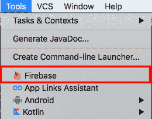

1.  单击展开并选择 Cloud Messaging，然后单击**设置 Firebase Cloud Messaging**教程以连接到 Firebase 并向您的应用程序添加必要的代码：

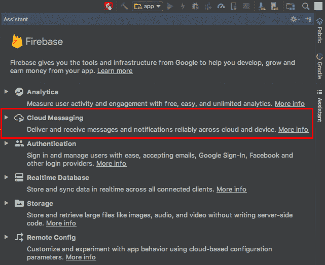

助手的外观如下：

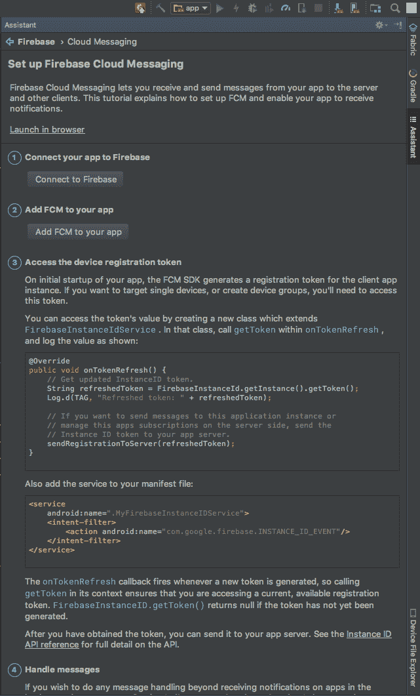

如果您成功完成了 Firebase 助手的操作指南，您将完成以下操作：

+   在 Firebase 上注册您的应用程序

+   通过对根级`build.gradle`文件进行以下更新，将 SDK 添加到您的应用程序

```kt
buildscript {
    // ...
    dependencies {
        // ...
        classpath 'com.google.gms:google-services:3.1.1' // google-services plugin
    }
}

allprojects {
    // ...
    repositories {
        // ...
        maven {
            url "https://maven.google.com" // Google's Maven repository
        }
    }
}
```

然后，在您模块的`build.gradle`文件中，它将在文件底部添加`apply plugin`行，如下所示：

```kt
apply plugin: 'com.android.application'

android {
  // ...
}
dependencies {
  // ...
  compile 'com.google.firebase:firebase-core:11.8.0'
}
// ADD THIS AT THE BOTTOM
apply plugin: 'com.google.gms.google-services'
```

使用以下内容更新您的清单：

```kt
<service
    android:name=".MyFirebaseMessagingService">
    <intent-filter>
        <action android:name="com.google.firebase.MESSAGING_EVENT"/>
    </intent-filter>
</service>
```

如果您想在应用程序运行时手动处理从 FCM 接收到的消息，则需要这样做。但是，由于现在有一种方法可以在没有您干预的情况下显示通知，因此您现在不需要这样做。

对于该功能，您需要以下内容：

```kt
<service
    android:name=".MyFirebaseInstanceIDService">
    <intent-filter>
        <action android:name="com.google.firebase.INSTANCE_ID_EVENT"/>
    </intent-filter>
</service>
```

现在，您将创建`MyFirebaseInstanceIDService`类以扩展`FirebaseInstanceIdService`。

如果由于某种原因，这些步骤中的任何一个未完成，您可以手动登录到 Firebase 网站，并按照以下步骤创建 Firebase 上的项目并更新应用程序的构建文件。

使用 Firebase 网站，在登录后的第一件事是添加您的项目：

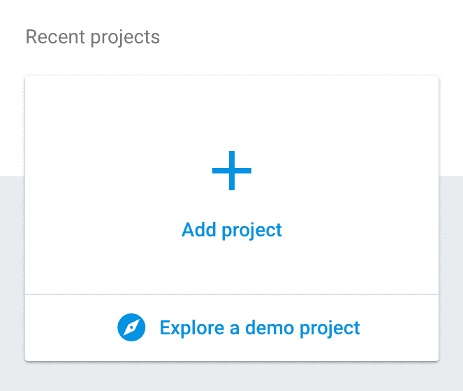

然后，您将被要求输入项目的名称。为**项目名称**输入**ToDoList**。它将自动生成一个全局唯一的**项目 ID**。然后，选择您的居住国家，并点击**创建项目**按钮：

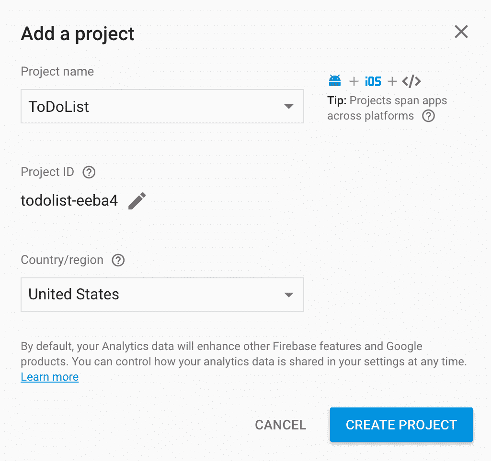

之后，选择所需的平台。请注意，Firebase 不仅用于 Android，还用于 iOS 和 Web。因此，请选择**将 Firebase 添加到您的 Android 应用**选项：

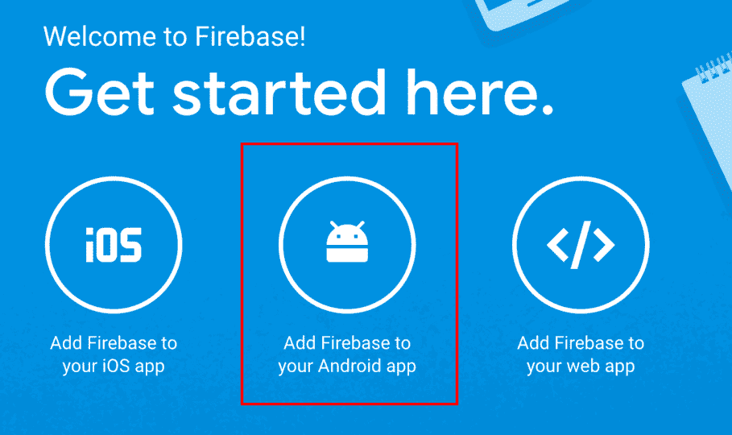

现在您将通过一个三步过程：

1.  第一步是通过提供您的包名称注册您的应用程序：

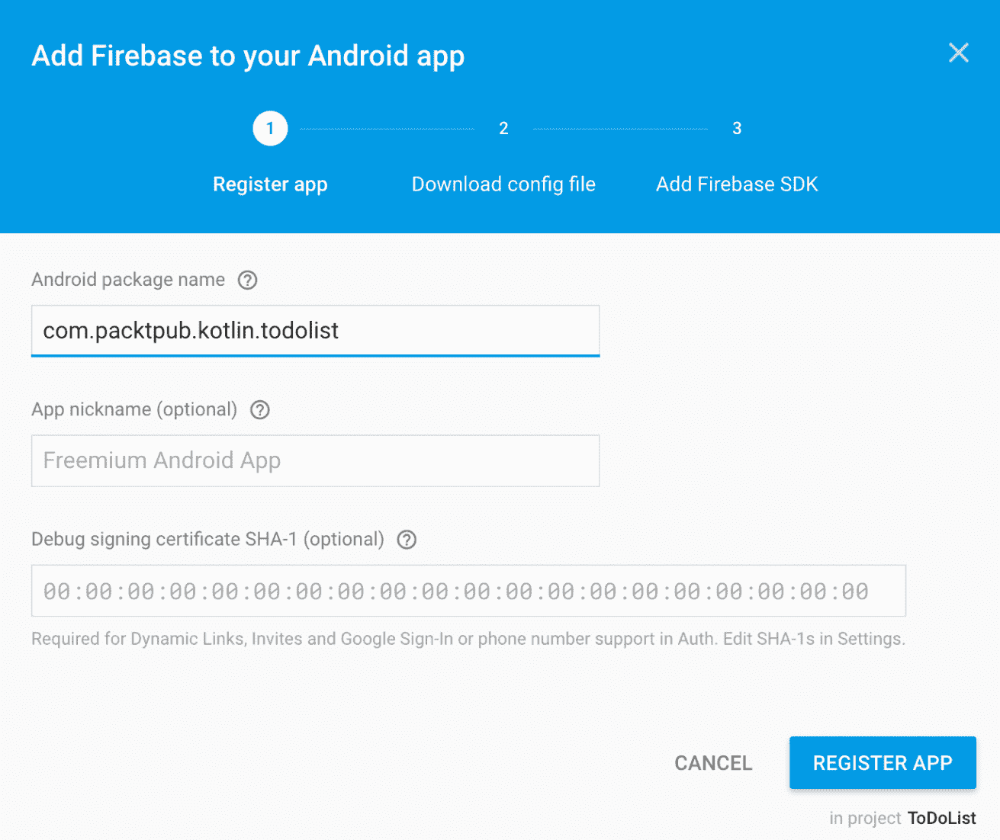

1.  在此步骤中，您只需下载**google-services.json**文件：

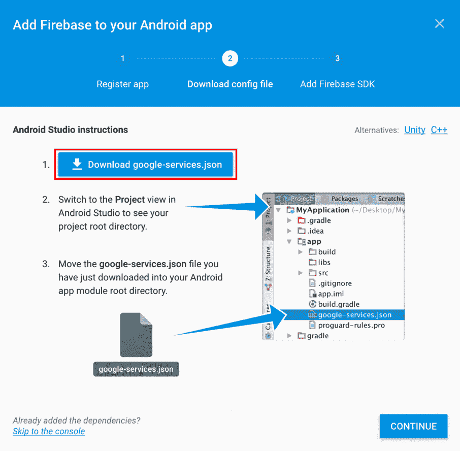

1.  然后，在最后一步中，您将向应用程序添加 SDK。请注意，如果您已经这样做，则无需此操作：

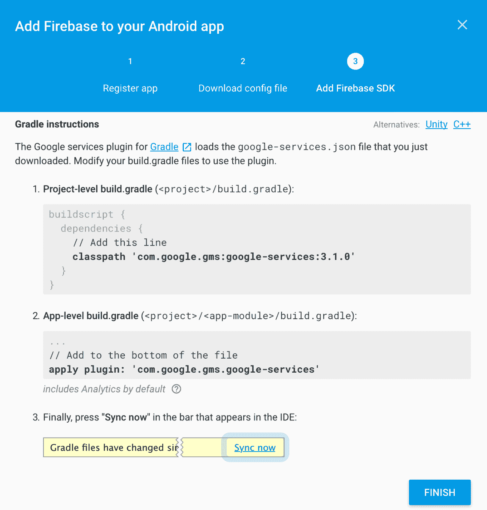

就是这样。您已经在 Firebase 上添加了您的应用程序。现在，您将看到新创建项目的页面。在这里，您将看到所有可用于您的应用程序的服务。选择**通知**服务，然后单击**开始**：

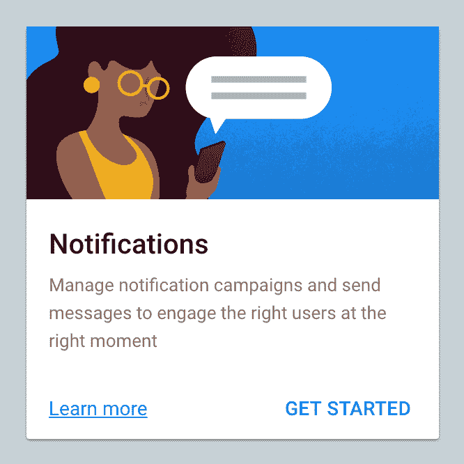

现在，您将看到以下页面。单击**发送您的第一条消息**按钮：

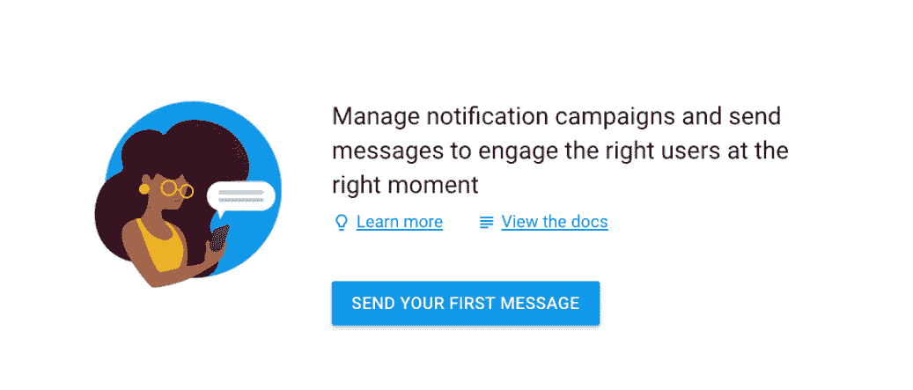

然后，选择**撰写消息**。在这里，输入要在**消息文本**框中发送的消息。选择**单个设备**作为目标。在输入**FCM 注册令牌**后，您将点击**发送消息**按钮以发送通知。继续阅读以了解如何获取注册令牌：

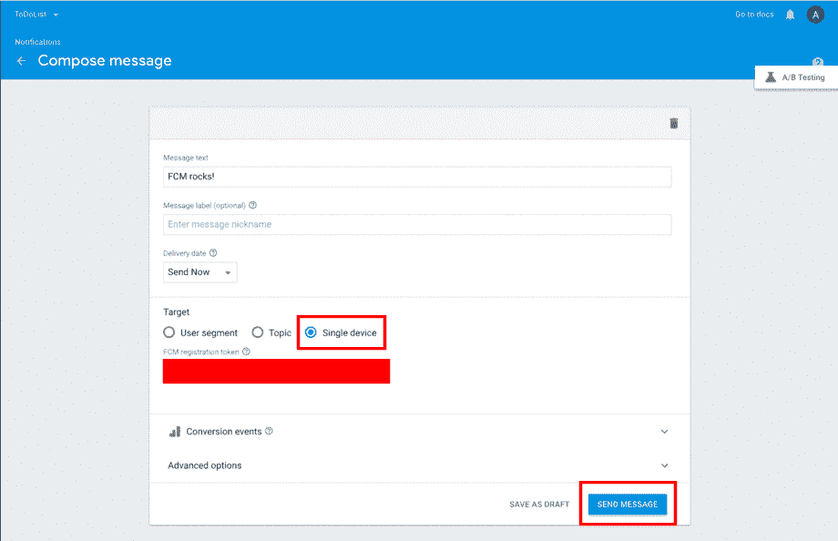

注册令牌

在设置 FCM 后首次运行应用程序时，FCM SDK 将为您的应用程序生成一个令牌。在以下情况下，此令牌将更改，并相应地生成一个新的令牌：

+   应用程序删除实例 ID

+   应用程序在新设备上恢复

+   用户卸载/重新安装应用程序

+   用户清除应用程序数据

此令牌必须保持私密。要访问此令牌，您将其记录到您的`Logcat`控制台中。首先，打开`MyFirebaseInstanceIDservice`并使用以下代码进行更新：

```kt
override fun onTokenRefresh() {
    // Get updated InstanceID token.
    val refreshedToken = FirebaseInstanceId.getInstance().getToken()
    Log.d(FragmentActivity.TAG, "Refreshed token: " + refreshedToken)

    // If you want to send messages to this application instance or
    // manage this apps subscriptions on the server side, send the
    // Instance ID token to your app server.
    sendRegistrationToServer(refreshedToken)
}
```

现在您已经有了密钥，请将其粘贴到上面的**撰写消息**框中，然后点击**发送消息**按钮。之后不久，您应该会在手机上看到通知。

# 摘要

在本章中，您学习了如何使用 Firebase 创建后台服务，发送广播消息，显示应用内通知和推送通知。有一些事情您可以自己做来加深对这些主题的理解： 

+   而不是使用某些静态消息通知用户，请使用设置提醒的任务的描述

+   使用 Firebase，您还可以尝试向一组人发送推送通知，而不是单个设备
