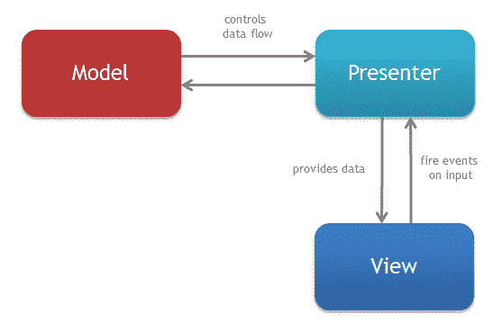
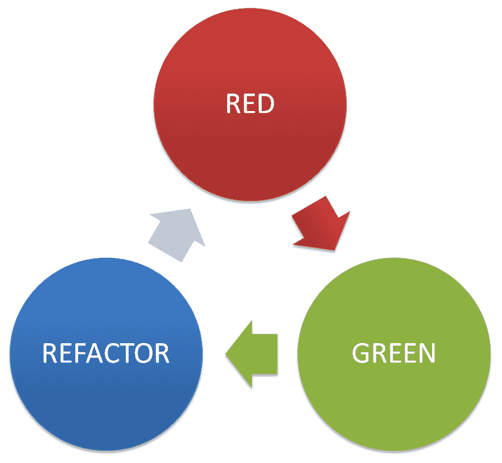
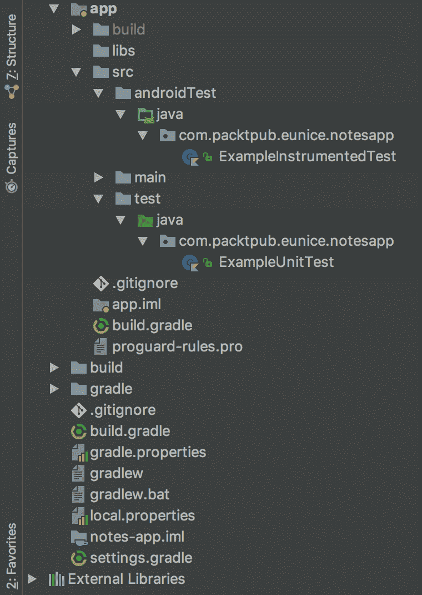
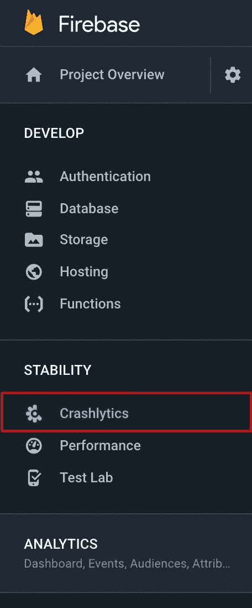
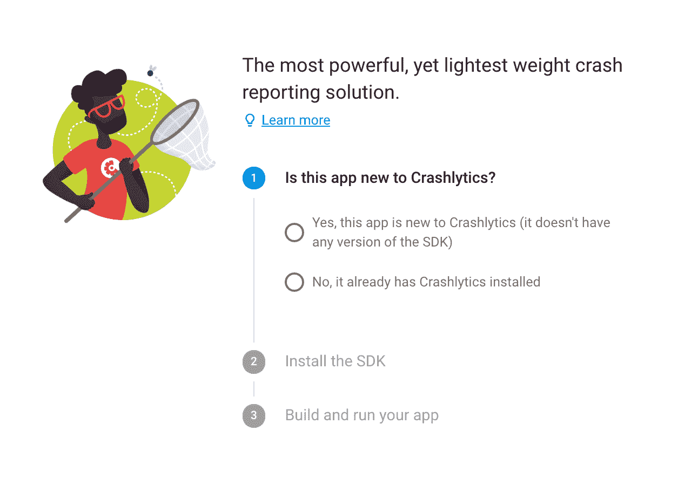
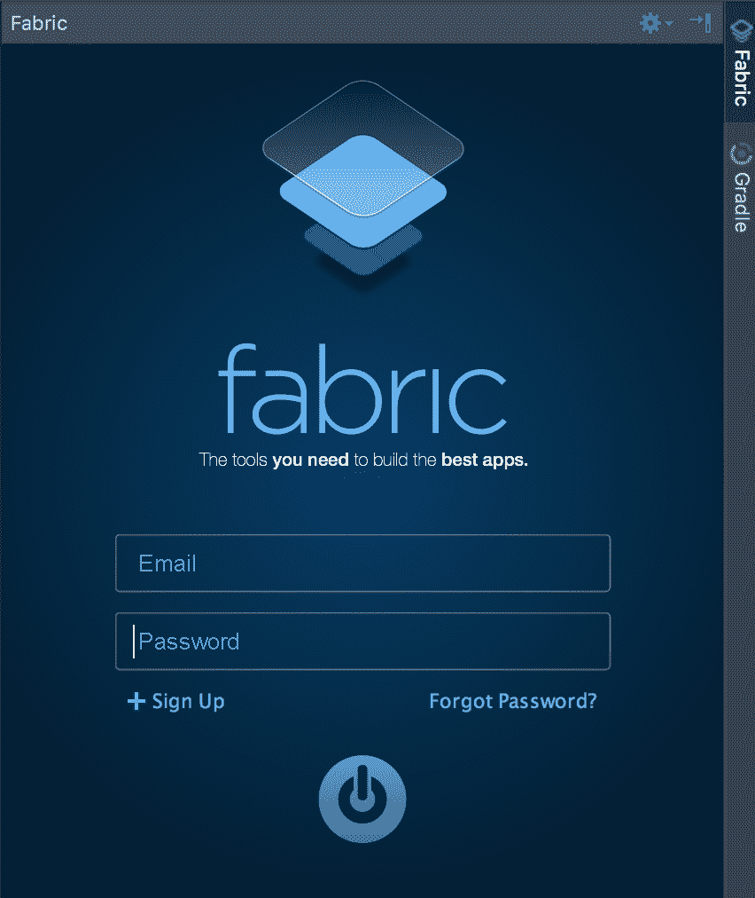
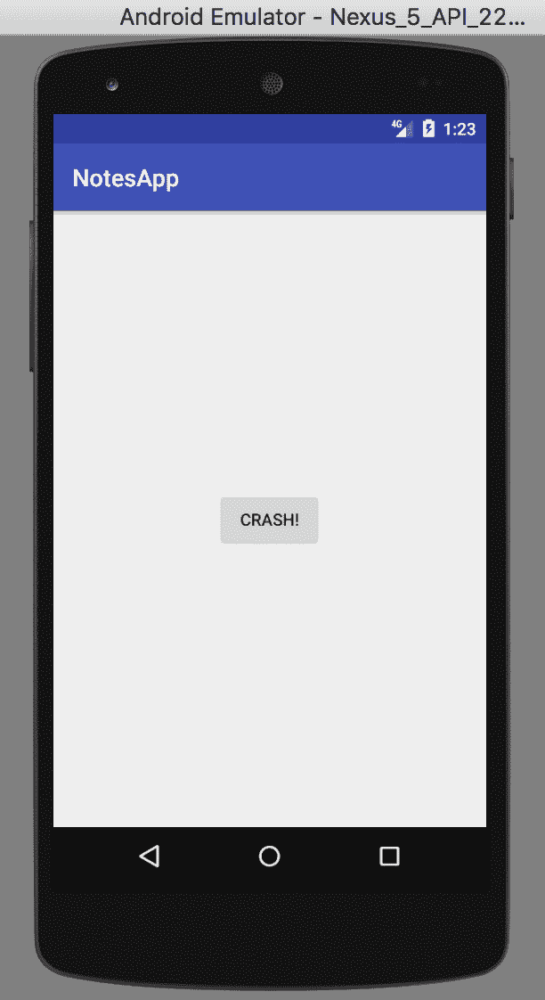
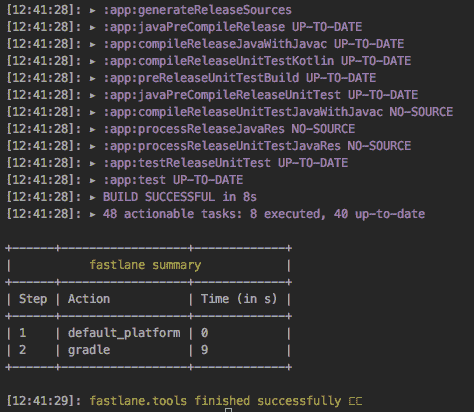

# 第十三章：测试和持续集成

在本章中，您将了解**持续集成**（**CI**）的概念和测试的重要性。从未听说过 CI？那测试呢？

在本章中，我们将：

+   了解编写测试

+   了解 Android 测试支持库

+   学习如何使用 Crashlytics 来跟踪崩溃报告

+   了解 beta 测试

+   介绍 CI 的概念

+   了解 Jenkins、Bamboo 和 Fastlane 等工具以及如何将它们用于构建自动化和部署

# 测试

软件测试是评估软件或其部分以确保其按预期工作的过程。产品必须满足其构建的给定要求。因此，测试报告给出了软件质量的指示。测试的另一个主要原因是找到错误并修复它们。

有时，有诱惑将测试视为事后思考。这主要是由于时间限制等问题，但考虑到测试的重要性，它应该成为开发过程的一部分。在软件生命周期的后期编写测试可能是非常糟糕的经历。您可能不得不花费大量时间重构它，使其可测试，然后才能编写测试。所有这些因素涉及的挫折使大多数软件难以进行适当的测试。 

# 测试的重要性

测试是一个非常广泛的话题，你可以很容易地写一本书。测试的重要性无法过分强调。以下是一些软件需要测试的原因：

+   它使企业能够欣赏和理解软件实施的风险

+   它确保编写了质量程序

+   它有助于生产无 bug 的产品

+   它降低了维护成本

+   这是验证和验证软件的一种可靠方式

+   它提高了性能

+   它确认了所有声明的功能要求都已经实施

+   它给客户带来信心

+   它更快地暴露错误

+   这是为了保持业务的需要

+   它确保产品可以在其预期环境中安装和运行

# Android 测试支持库

**Android 测试支持库**（**ATSL**）是一组专门为测试 Android 应用程序而构建的库。它就像您在 Android 应用程序开发中使用的通常支持库一样，只是这个库是专门用于测试的。

# Model-View-Presenter 架构

如前所述，软件需要可测试。只有这样，我们才能为其编写有效的测试。因此，您将使用**Model-View-Presenter**（**MVP**）架构设计您的应用程序。这种架构采用了一些设计最佳实践，如控制反转和依赖注入，因此非常适合测试。为了使应用程序可测试，其各个部分必须尽可能解耦。

查看以下图表中 MVP 架构的高级图解：



非常简单地说，这些各部分的含义是：

+   Model：它提供并存储应用程序的数据

+   View：它处理模型数据的显示

+   Presenter：它协调 UI 和数据

您还可以轻松地替换其他部分并在测试期间模拟它们。在软件测试中，模拟是模仿真实对象的对象。您将提供其行为，而不是依赖于代码的实际实现。这样，您就可以专注于正在进行预期操作的测试类。您将在以下部分中看到它们的实际应用。

# 测试驱动开发

您将使用一种称为**测试驱动开发**（**TDD**）的软件开发类型构建一个 Notes 应用程序。看一下下面的图表和下面的解释：



**TDD**是一种软件开发方法，其中测试是在实际程序代码之前编写的。

红：红是 TDD 过程的第一阶段。在这里，您编写测试。由于这是第一个测试，这意味着您基本上没有什么可以测试的。因此，您必须编写最少量的代码来进行测试。现在，由于这是编写测试所需的最少量代码，当您编写代码时它很可能会失败。但这完全没关系。在 TDD 中，您的测试必须在发生任何其他事情之前失败！当您的测试失败时，这是 TDD 周期的第一阶段-红色阶段。

绿色：现在，您必须编写通过测试所需的最少量代码。当测试通过时，那很好，您已经完成了 TDD 周期的第二阶段。通过测试意味着您的程序的一部分正如您期望的那样工作。随着您以这种方式构建应用程序，任何时候您都将测试代码的每个部分。您能看到这是如何运作的吗？当您完成一个功能时，您将有足够的测试来测试该功能的各个部分。

重构：TDD 过程的最后阶段是重构您早期编写的代码以通过测试。在这里，您删除冗余代码，清理代码，并为模拟编写完整的实现。之后再次运行测试。它们可能会失败。在 TDD 中，测试失败是件好事。当您编写测试并且它们通过时，您可以确信特定的需求或期望已经得到满足。

还有其他围绕测试构建的开发模型，例如行为驱动测试、黑盒测试和冒烟测试。但是，它们基本上可以归类为功能测试和非功能测试。

# 功能与非功能测试

通过功能测试，您将根据给定的业务需求测试应用程序。它们不需要应用程序完全运行。这些包括：

+   单元测试

+   集成测试

+   验收测试

对于非功能测试，您将测试应用程序与其操作环境的交互。例如，应用程序将连接到真实数据源并使用 HTTP 连接。这些包括：

+   安全测试

+   可用性测试

+   兼容性测试

# 笔记应用程序

要开始构建我们的笔记应用程序，请创建一个新应用程序并将其命名为 notes-app。使用 Android Studio 左上角的选项卡切换到项目视图。此视图允许您查看项目结构，就像它在文件系统上存在的那样。它应该看起来像以下截图：



单元测试测试代码的小部分，而不涉及产品的其他部分。在这种情况下，这意味着您的单元测试不需要物理设备，也不需要 Android jar、数据库或网络；只需要您编写的源代码。这些是应该在`test`目录中编写的测试。

另一方面，集成测试包括运行应用程序所需的所有组件，这些测试将进入`androidTest`目录。

# 测试依赖项

目前，只有一个测试库`Junit`，您将用它进行单元测试。但是，由于您的代码将与其他组件交互，即使它们不是被测试的组件，您也必须对它们进行模拟。`Junit`仍然不足以编写测试用例。因此，您还需要添加`Hamcrest`来帮助创建断言匹配等。让我们继续添加我们需要的库。

打开模块的构建文件，更新依赖项以匹配以下代码，并同步项目：

```kt
dependencies {
  implementation fileTree(dir: 'libs', include: ['*.jar'])
  implementation "org.jetbrains.kotlin:kotlin-stdlib-jre7:$kotlin_version"
  implementation 'com.android.support:appcompat-v7:26.1.0'
  implementation 'com.android.support.constraint:constraint-layout:1.0.2'
  testImplementation 'junit:junit:4.12'
  testImplementation "org.mockito:mockito-all:1.10.19"
  testImplementation "org.hamcrest:hamcrest-all:1.3"
  testImplementation "org.powermock:powermock-module-junit4:1.6.2"
  testImplementation "org.powermock:powermock-api-mockito:1.6.2"
  androidTestImplementation 'com.android.support.test:runner:1.0.1'
  androidTestImplementation 'com.android.support.test.espresso:espresso-core:3.0.1'
}
```

目前，请使用与前面代码中显示的确切库版本相同的库版本。这意味着您将不得不忽略 IDE 提升库版本的建议。

稍后，您可以更新为彼此兼容的较新稳定版本。

# 您的第一个测试

您将首先开始向用户显示笔记。笔记演示者将提供显示进度指示器的逻辑，显示笔记和其他与笔记相关的视图。

由于**Presenter**在**Model**和**View**之间协调，因此您必须对它们进行模拟，以便您可以专注于正在测试的类。

在这个测试中，您将验证要求`NotesPresenter`添加新笔记将触发调用`View`来显示添加笔记屏幕。让我们实现`should display note when button is clicked`测试方法。

首先，您将添加对 presenter 的`addNewNote()`方法的调用。然后，您将验证 View 的`showAddNote()`被调用。因此，您调用一个方法并验证它反过来调用另一个方法（回想一下 MVP 模式的工作原理；presenter 与视图协调）。

目前，我们不需要担心第二个调用方法做什么；这是单元测试，您一次测试一个小东西（单元）。因此，您必须模拟出 View，并且现在不需要实现它。一些接口可以实现这一点；也就是说，一个 API 或契约而不一定要实现它们。请参阅以下代码的最终部分：

```kt
import com.packtpub.eunice.notesapp.notes.NotesContract
import com.packtpub.eunice.notesapp.notes.NotesPresenter
import org.junit.Before
import org.junit.Test
import org.mockito.Mock
import org.mockito.Mockito.verify
import org.mockito.MockitoAnnotations

@Mock
private lateinit var notesView: NotesContract.View
private lateinit var notesPresenter: NotesPresenter

@Before
fun setUp() {
 MockitoAnnotations.initMocks(this)

 // The class under test
 notesPresenter = NotesPresenter()
}

@Test
fun `should display note view when button is clicked`() {
 // When adding a new note
 notesPresenter.addNewNote()

 // Then show add note UI
 verify(notesView)?.showAddNote()
}
```

现在，创建`NotesContract`，它是 MVP 架构中的**View**部分。它将是一个只需要方法以使测试通过的接口：

```kt
interface NotesContract {
    interface View {
        fun showAddNote()
    }

    interface UserActionsListener {

        fun loadNotes(forceUpdate: Boolean)

        fun addNewNote()

        fun openNoteDetails(requestedNote: Note)
    }
}
```

接下来，创建`Note`类。它代表 MVP 架构中的**Model**。它定义了您正在构建的笔记应用程序的笔记结构：

```kt
import java.util.UUID

data class Note(val title: String?,
 val description: String?,
 val imageUrl: String? = null) {

 val id: String = UUID.randomUUID().toString()
}
```

创建`NotesPresenter`，它代表 MVP 架构中的**Presenter**。让它实现`NotesContract`类中的`UserActionsListener`：

```kt
class NotesPresenter: NotesContract.UserActionsListener {
    override fun loadNotes(forceUpdate: Boolean) {
    }

    override fun addNewNote() {
    }

    override fun openNoteDetails(requestedNote: Note) {
    }
}
```

这对于第一个测试来说已经足够了。您准备好了吗？好的，现在点击测试方法所在数字旁边的右箭头。或者，您也可以右键单击`NotesPresenterTest`文件中的位置或文件并选择运行：


您的测试应该失败：


它失败了，因为我们期望调用`NotesView`类的`showAddNote()`方法，但实际上没有。这是因为您只在`Presenter`类中实现了接口，但从未在`NotesView`类中调用预期的方法。

现在让我们继续并修复它。

首先，更新`NotesPresenter`以在其主要构造函数中接受`NotesContract.View`对象。然后，在`addNewNote()`方法中调用预期的方法`showAddNote()`。

您应该始终更喜欢构造函数注入而不是字段注入。这样更容易处理，也更容易阅读和维护。

您的`NotesPresenter`类现在应该如下所示：

```kt
class NotesPresenter(notesView: NotesContract.View): NotesContract.UserActionsListener {
    private var notesView: NotesContract.View = checkNotNull(notesView) {
        "notesView cannot be null"
    }

    override fun loadNotes(forceUpdate: Boolean) {
    }

    override fun addNewNote() = notesView.showAddNote()

    override fun openNoteDetails(requestedNote: Note) {
    }
}
```

`checkNotNull`是一个内置的`Kotlin`实用程序函数，用于验证对象是否为 null。它的第二个参数接受一个 lambda 函数，如果对象为 null，则应返回默认消息。

由于`NotesPresenter`现在在其主要构造函数中需要`NotesContract.View`，因此您必须更新测试以适应这一点：

```kt
@Before
fun setUp() {
    MockitoAnnotations.initMocks(this)

// Get a reference to the class under test
    notesPresenter = NotesPresenter(notesView)
}
```

代码已经重构。现在重新运行测试：


万岁！测试现在通过了；太棒了。干得好。

这是使用**TDD**的一个完整循环。现在，您需要继续前进，在功能完全实现之前还有一些测试要完成。

您的下一个测试是验证 presenter 是否按预期显示笔记。在此过程中，您将首先从存储库中检索笔记，然后更新视图。

您将使用先前测试的类似测试 API。但是，这里有一个新的测试 API，称为`ArgumentCaptor`。正如您可能已经猜到的那样，它捕获传递给方法的参数。您将使用这些参数调用另一个方法，并将它们作为参数传递。让我们看一下：

```kt
@Mock
private lateinit var notesRepository: NotesRepository

    @Captor
    private var loadNotesCallbackCaptor: ArgumentCaptor<NotesRepository.LoadNotesCallback>? = null

private val NOTES = arrayListOf(Note("Title A", "Description A"),
 Note("Title A", "Description B"))
...

@Test
fun `should load notes from repository into view`() {
 // When loading of Notes is requested
 notesPresenter.loadNotes(true)

 // Then capture callback and invoked with stubbed notes
 verify(notesRepository)?.getNotes(loadNotesCallbackCaptor?.capture())
 loadNotesCallbackCaptor!!.value.onNotesLoaded(NOTES)

 // Then hide progress indicator and display notes
 verify(notesView).setProgressIndicator(false)
 verify(notesView).showNotes(NOTES)
}
```

让我们再简要地回顾一下。

您首先调用了要测试的方法，即`loadNotes()`。然后，您验证了该操作反过来使用`NotesRepository`实例获取笔记（`getNotes()`），就像之前的测试一样。然后，您验证了传递给`getNotes()`方法的实例，该实例再次用于加载笔记（`onNotesLoaded()`）。之后，您验证了`notesView`隐藏了进度指示器（`setProgressIndicator(false)`）并显示了笔记（`showNotes()`）。

尽可能利用 Kotlin 中的空安全功能。不要为模拟使用可空类型，而是使用 Kotlin 的`lateinit`修饰符。

这将导致代码更加清晰，因为您不必在任何地方进行空值检查，也不必使用`elvis`运算符。

现在，按照以下方式创建`NotesRepository`：

```kt
interface NotesRepository {

    interface LoadNotesCallback {

        fun onNotesLoaded(notes: List<Note>)
    }

    fun getNotes(callback: LoadNotesCallback?)
    fun refreshData()
}
```

接下来，更新`NotesContract`：

```kt
interface NotesContract {
    interface View {
        fun setProgressIndicator(active: Boolean)

        fun showNotes(notes: List<Note>)

        ...
    }

  ...
}
```

您现在已准备好测试第二个测试用例。继续并运行它：


好的，它失败了。再次，使用 TDD，这很完美！您意识到这确切地告诉我们缺少什么，因此需要做什么。您只实现了合同（接口），但没有进一步的操作。

打开`NotesPresenter`并重构代码以使此测试通过。您将首先将`NotesRepository`添加为构造函数参数的一部分，然后在适当的方法中进行调用。请参阅以下代码以获取完整实现：

```kt
import com.packtpub.eunice.notesapp.data.NotesRepository
import com.packtpub.eunice.notesapp.util.EspressoIdlingResource

class NotesPresenter(notesView: NotesContract.View, notesRepository: NotesRepository) :
 NotesContract.UserActionsListener {

 private var notesRepository: NotesRepository = checkNotNull(notesRepository) {
 "notesRepository cannot be null"
 }

 override fun loadNotes(forceUpdate: Boolean) {
 notesView.setProgressIndicator(true)
 if (forceUpdate) {
 notesRepository.refreshData()
 }

 EspressoIdlingResource.increment()

 notesRepository.getNotes(object : NotesRepository.LoadNotesCallback {
 override fun onNotesLoaded(notes: List<Note>) {
 EspressoIdlingResource.decrement()
 notesView.setProgressIndicator(false)
 notesView.showNotes(notes)
 }
 })
 }
 ...
}
```

您使用构造函数注入将`NotesRepository`实例注入`NotesPresenter`。您检查了它的可空性，就像您对`NotesContract.View`所做的那样。

在`loadNotes()`方法中，您显示了进度指示器，并根据`forceUpdate`字段刷新了数据。

然后，您使用了一个实用类`EspressoIdlingResource`，基本上是为了提醒 Espresso 可能存在异步请求。在获取笔记时，您隐藏了进度指示器并显示了笔记。

创建一个 util 包，其中包含`EspressoIdlingResource`和`SimpleCountingIdlingResource`：

```kt
import android.support.test.espresso.IdlingResource

object EspressoIdlingResource {

    private const val RESOURCE = "GLOBAL"

    private val countingIdlingResource = SimpleCountingIdlingResource(RESOURCE)

    val idlingResource = countingIdlingResource

    fun increment() = countingIdlingResource.increment()

    fun decrement() = countingIdlingResource.decrement()
}
```

以及`SimpleCountingIdlingResource`：

```kt
package com.packtpub.eunice.notesapp.util

import android.support.test.espresso.IdlingResource
import java.util.concurrent.atomic.AtomicInteger

class SimpleCountingIdlingResource

(resourceName: String) : IdlingResource {

    private val mResourceName: String = checkNotNull(resourceName)

    private val counter = AtomicInteger(0)

    @Volatile
    private var resourceCallback: IdlingResource.ResourceCallback? =  
    null

    override fun getName() = mResourceName

    override fun isIdleNow() = counter.get() == 0

    override fun registerIdleTransitionCallback(resourceCallback: 
    IdlingResource.ResourceCallback) {
        this.resourceCallback = resourceCallback
    }

    fun increment() = counter.getAndIncrement()

    fun decrement() {
        val counterVal = counter.decrementAndGet()
        if (counterVal == 0) {
            // we've gone from non-zero to zero. That means we're idle 
            now! Tell espresso.
            resourceCallback?.onTransitionToIdle()
        }

        if (counterVal < 0) {
            throw IllegalArgumentException("Counter has been 
            corrupted!")
        }
    }
}
```

确保使用`EspressoIdlingResource`库更新应用程序的构建依赖项：

```kt
dependencies {
  ...
  implementation "com.android.support.test.espresso:espresso-idling-resource:3.0.1"
...
}
```

接下来，更新`setUp`方法以正确初始化`NotesPresenter`类：

```kt
@Before
fun setUp() {
    MockitoAnnotations.initMocks(this)

// Get a reference to the class under test
    notesPresenter = NotesPresenter(notesView)
}
```

现在一切都准备好了，运行测试：


太棒了！真是太棒了。您已成功使用 TDD 方法编写了 NotesApp 的业务逻辑。

# Crashlytics

从官方网站：

*Firebase Crashlytics 是一个轻量级的实时崩溃报告工具，可帮助您跟踪、优先处理和修复侵蚀应用程序质量的稳定性问题。 Crashlytics 通过智能分组崩溃并突出导致崩溃的情况，节省了故障排除时间。*

就是这样，这基本上就是 Crashlytics 的全部内容。它适用于 iOS 和 Android。以下是其主要功能：

+   **崩溃报告：**其主要目的是报告崩溃，并且它确实做得很好。它可以定制以满足您的需求。例如，您可能不希望它报告某些类型的崩溃，还有其他定制选项。

+   **分析：**它提供有关崩溃的报告，包括受影响的用户、其设备、崩溃发生的时间，包括干净的堆栈跟踪和日志，以帮助调试和修复。

+   **实时警报：**您将自动收到有关新问题和重复问题的警报。实时警报是必要的，因为它们可以帮助您非常快速地解决问题。

Crashlytics 用于查找特定崩溃是否影响了大量用户。当问题突然严重性增加时，您还会收到警报，并且它允许您找出哪些代码行导致崩溃。

实施步骤如下：

+   连接

+   整合

+   检查控制台

# 连接

您将首先向您的应用程序添加 Firebase。Firebase 是一个为移动和 Web 应用程序开发的平台。它有很多工具，其中之一就是 Crashlytics。

最低要求是：

+   运行 Android 4.0（冰淇淋三明治）或更新版本的设备，并且 Google Play 服务 12.0.1 或更高版本

+   Android Studio 2.2 或更高版本

您将使用 Android Studio 2.2+中的 Firebase 助手工具将您的应用连接到 Firebase。助手工具将更新您现有的项目或创建一个带有所有必要的 Gradle 依赖项的新项目。它提供了一个非常好的直观的 UI 指南，您可以按照它进行操作：


查看完整指南，了解如何将您的项目添加到 Firebase 中的第十二章，*为任务设置提醒*。完成后，从浏览器登录到 Firebase 控制台。在侧边菜单中，从**STABILITY**部分选择**Crashlytics**：



当 Crashlytics 页面打开时，您将被问及应用程序是否是 Crashlytics 的新应用程序。选择是，这个应用程序是 Crashlytics 的新应用程序（它没有任何版本的 SDK）：



然后第二步会给您一个链接到文档页面，以设置您的应用的 Crashlytics。要将 Crashlytics 添加到应用中，请更新项目级别的`build.gradle`：

```kt
buildscript {
    repositories {
        // ...
        maven {
           url 'https://maven.fabric.io/public'
        }
    }
    dependencies {
        // ...
        classpath 'io.fabric.tools:gradle:1.25.1'
    }
}

allprojects {
    // ...
    repositories {
       // ...
       maven {
           url 'https://maven.google.com/'
       }
    }
}
```

然后，使用 Crashlytics 插件和依赖项更新您的应用程序模块的`build.gradle`文件：

```kt
apply plugin: 'com.android.application'
apply plugin: 'io.fabric'

dependencies {
    // ...
    implementation 'com.crashlytics.sdk.android:crashlytics:2.9.1'
}
```

就是这样，Crashlytics 已经准备好监听您的应用程序中的崩溃。这是它的默认行为，但是如果您想自己控制初始化，您将不得不在清单文件中禁用它：

```kt
<application
...
 <meta-data android:name="firebase_crashlytics_collection_enabled" android:value="false" />
</application>
```

然后，在您的 Activity 类中，您可以启用它，即使使用调试器也可以：

```kt
val fabric = Fabric.Builder(this)
        .kits(Crashlytics())
        .debuggable(true)
        .build()
Fabric.with(fabric)
```

确保您的 Gradle Wrapper 版本至少为 4.4：

```kt
distributionUrl=https\://services.gradle.org/distributions/gradle-4.4-all.zip
```

由于您的应用程序需要向控制台发送报告，请在清单文件中添加互联网权限：

```kt
<manifest ...>

  <uses-permission android:name="android.permission.INTERNET" />

  <application ...
```

像往常一样，同步 Gradle 以使用您刚刚进行的依赖项更新您的项目。

之后，您应该看到 Fabric 插件已集成到 Android Studio 中。使用您的电子邮件和密码注册：



确认您的帐户后，Fabric API 密钥将为您生成。它应该看起来像这样：

```kt
<meta-data
    android:name="io.fabric.ApiKey"
    android:value="xxYYxx6afd23n6XYf9ff6000383b4ddxxx2220faspi0x"/>
```

现在，您将强制在您的应用程序中崩溃以进行测试。创建一个新的空白活动，并只添加一个按钮。然后，将其`clicklistener`设置为强制崩溃。Crashlytics SDK 有一个简单的 API 可以做到这一点：

```kt
import kotlinx.android.synthetic.main.activity_main.*

...

override fun onCreate(savedInstanceState: Bundle?) {
 crash_btn.setOnClickListener {
  Crashlytics.getInstance().crash()
 }
}
```

由于您正在测试，崩溃后重新打开应用程序，以便报告可以发送到您的控制台。

继续运行应用程序。您的测试活动应该是这样的：



点击 CRASH！按钮来强制崩溃。您的应用程序将崩溃。点击确定，然后重新打开应用程序：


检查您的收件箱，也就是您在 Crashlytics 上注册的那个：


点击“了解更多”按钮。它将打开 Crashlytics 控制台。从那里，您可以找到有关崩溃的更多详细信息。从那里，您可以解决它。

# 测试阶段

测试有两个主要阶段：alpha 测试和 beta 测试。主要思想是在应用程序开发的阶段让一组人测试应用程序。通常是在应用程序开始成形之后，以便可以利用反馈使应用程序更加稳定。稳定性在这里是关键。区分各种测试阶段的一个关键因素是参与测试的人数。

# Alpha 测试

Alpha 测试被认为是测试软件的第一阶段。这个测试通常涉及很少数量的测试人员。在这个阶段，应用程序非常不稳定，因此只有与开发人员密切相关的少数人参与测试并提供建设性反馈。应用程序稳定后，就可以进入 beta 测试阶段。

# Beta 测试

Beta 测试是软件测试的一个阶段，其中有一个更大的人群测试应用程序。这可能涉及 10、100 或 1000 人或更多，这取决于应用程序的性质和团队的规模。如果一个应用程序在全球拥有大量用户，那么它很可能有一个庞大的团队在开发，并且因此可以承担许多人参与测试该应用程序的 beta 测试。

# 为 beta 测试设置

您可以从**Google Pay 控制台**设置和管理 beta 测试。您可以选择将您的应用程序提供给特定的 Google 组，或者您可以通过电子邮件发送邀请。

用户必须拥有 Google（@gmail.com）或 G Suite 帐户才能加入。发布后，您的链接可能需要一段时间才能对测试人员可用。

# 创建 beta 测试轨道

现在，您将需要在 Google Play 控制台内创建所谓的**轨道**。这基本上是一个用于管理测试流程的设置。

在这里，您可以上传您的 APK，将其分发给选定的一组人，并在他们测试时跟踪反馈。您还可以管理 alpha 和 beta 测试阶段。

按照以下步骤设置 beta 测试：

1.  登录到您的 Play 控制台并选择您的应用程序。

1.  在**发布管理**下找到**应用发布**，并在**Beta 轨道**下选择**管理**。

1.  在**Artifacts**部分上传您的 APK，然后展开**管理测试人员**部分。

1.  在**选择测试方法**下，选择**公开 Beta 测试**。

1.  复制**Opt-in URL**并与您的测试人员分享。

1.  在**反馈渠道**旁边提供电子邮件地址或 URL，以便从测试人员收集反馈。然后，点击**保存**来保存它。

# Opt-in URL

创建测试后，发布它。然后，您将获得测试链接。其格式如下：[`play.google.com/apps/testing/com.yourpackage.name`](https://play.google.com/apps/testing/com.yourpackage.name.)。现在，您必须与您的测试人员分享此链接。有了这个链接，他们可以选择测试您的应用程序。

# 持续集成

通常，一个应用可能有多个人（团队）在进行工作。例如，A 可能负责 UI，B 负责功能 1，C 负责业务逻辑中的功能 2。这样的项目仍然会有一个代码库以及其测试和其他一切。所有提交者可能会在推送代码之前在本地运行测试以确保自己的工作正常。具有不同提交者的共享存储库中的代码必须统一并构建为一个完整的应用程序（集成）。还必须对整个应用程序运行测试。这必须定期进行，在 CI 的情况下，每次提交都要进行。因此，在一天内，共享存储库中的代码将被构建和测试多次。这就是持续集成的概念。以下是一个非常简单的图表，显示了 CI 过程的流程。它从左边（开发）开始：


# 定义

CI 是一种软件开发实践，其中设置了一个自动化系统，用于在代码检入版本控制后构建、测试和报告软件的情况。**集成**发生是因为各种分支合并到主分支中。这意味着主分支中的任何内容都有效地代表了整个应用程序的当前状态，而且由于这每次代码进入主存储库时都会发生，所以它是**持续的**；因此，**持续集成**。

在 CI 中，每当提交代码时，自动构建系统会自动从共享存储库（主分支）中获取最新代码并构建、测试和验证整个分支。通过定期执行此操作，可以快速检测到错误，从而可以快速修复。知道您的提交可能会导致不稳定的构建，因此只能提交小的更改。这也使得易于识别和修复错误。

这非常重要，因为尽管应用程序的不同部分经过了单独测试和构建，但在它们合并到共享存储库后可能并不是必要的。然后，每次检入都会由自动构建进行验证，允许团队及早发现问题。

同样，还有持续部署以及持续交付。

# 工具

有许多可用于 CI 的工具。有些是开源的，有些是自托管的，有些更适合于 Web 前端，有些更适合于 Web 后端，有些更适合于移动开发。

示例包括 Jenkins、Bamboo 和 Fastlane。您将使用 Fastlane 来集成您的应用程序并运行测试。Fastlane 是自托管的，这意味着您在开发机器上运行它。理想情况下，您应该将其安装在 CI 服务器上，即专用于 CI 任务的服务器。

首先，让我们在本地安装它，并使用它来运行 Notes 应用程序的测试。

在撰写本书时，Fastlane 仅在 MacOS 上运行。目前正在进行工作，以使其在 Linux 和 Windows 上运行。一些 CI 服务包括 Jenkins、Bamboo、GitLab CI、Circle CI 和 Travis。

# 安装 fastlane

要安装 fastlane，请按照以下步骤进行操作：

1.  您应该已经在终端中的路径上有**`gem`**，因为 x-code 使用 Ruby 并且捆绑在 Mac OS X 中。运行以下命令进行安装：

```kt
brew cask install fastlane
```

根据您的用户帐户权限，您可能需要使用`sudo`。

1.  成功安装后，将`bin`目录的路径导出到您的`PATH`环境变量中：

```kt
export PATH="$HOME/.fastlane/bin:$PATH"
```

1.  在此期间，还添加以下区域设置：

```kt
export LC_ALL=en_US.UTF-8
export LANG=en_US.UTF-8
```

1.  在终端中打开一个新会话。这个新会话将加载您刚刚对环境变量所做的更改。首先，确保您已安装`bundler`。如果尚未安装，请使用以下命令：

```kt
[sudo] gem install bundler
```

1.  然后，切换到您的工作目录的根目录。然后，使用以下命令初始化`fastlane`：

```kt
fastlane init
```

作为过程的一部分，您将被问及一些问题。首先是您的包名称。当您留空时，将提供默认值，因此请输入您的包名称：


1.  接下来，您将被要求提供某个服务操作 JSON 秘密文件的路径。只需按*Enter*，因为我们暂时不需要它；稍后可以提供。最后，您将被问及是否要上传一些元数据等内容。请谦逊地拒绝；您可以稍后使用以下命令进行设置：

```kt
fastlane supply init
```

还会有一些其他提示，您只需按*Enter*键即可。

1.  完成后，使用以下命令运行您的测试：

```kt
fastlane test
```

一切顺利时，您应该会看到以下结果：



# 总结

在本章中，您已经了解了 CI 和测试的概念。您已经学会了如何使用 ATSL 编写测试。

您了解了测试中最流行的两个阶段以及如何在 Google Play 控制台中设置它们。您尝试了 Crashlytics，并体验了其崩溃报告功能等。然后您了解了 CI，并且作为示例，您使用了名为 Fastlane 的 CI 工具之一。

哇，这一章真的很充实，您已经到达了结尾。在下一章中，您将学习如何“让您的应用程序面向全球”。有趣，对吧？好吧，让我们继续吧；我们下一章再见。
